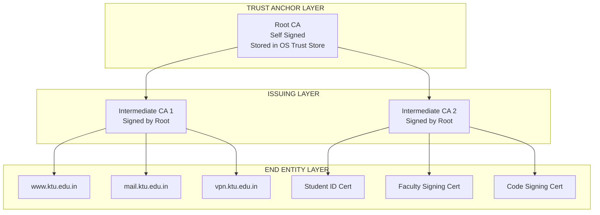
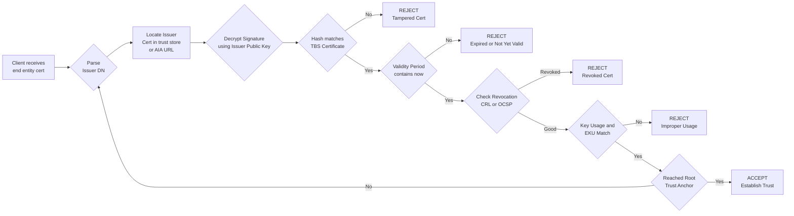
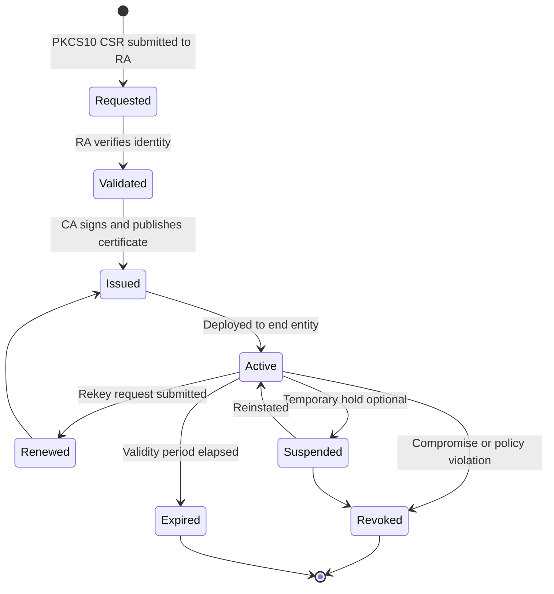
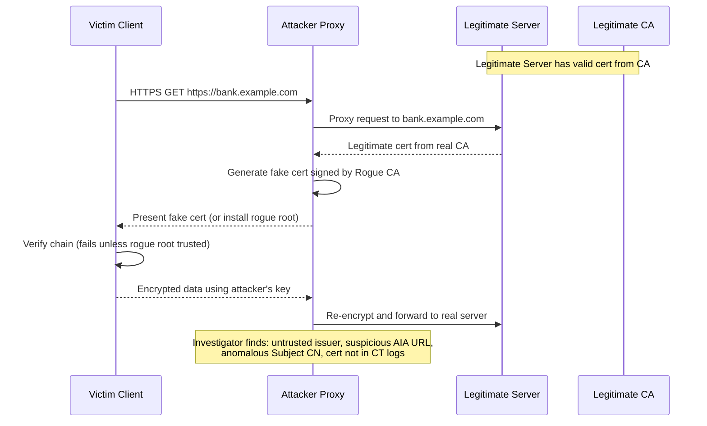
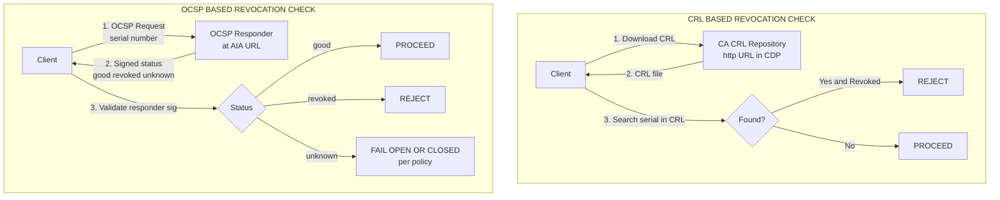

# Certification Authorities and Their Role

<!-- SECTION_1_START -->
# Certification Authorities and Their Role — Core Definition & Intuitive Overview

## 1.1 Formal Academic Definition

A **Certification Authority (CA)** is a trusted, third-party entity operating within a **Public Key Infrastructure (PKI)** framework that issues, manages, signs, and revokes **digital certificates**. These certificates cryptographically bind an entity's identity (such as a domain name, organization, server, or individual) to a **public key**, enabling secure communication, identity verification, and non-repudiation across open networks.

> [!IMPORTANT]
> **KTU 2024 Syllabus Definition (Verbatim Context):**
> A Certification Authority is a *trusted entity* whose central responsibility is to **issue and revoke digital certificates** in compliance with the **X.509 standard** (ITU-T). In network forensics, CAs are pivotal because every TLS/SSL handshake, signed email, code-signing event, and VPN tunnel ultimately depends on the trustworthiness of a CA's signed assertion.

> [!NOTE]
> **Syllabus Highlight (PECST754 — Module 4):**
> Within the **Network Forensics** module, CAs are examined as critical **chain-of-trust anchors** in the investigation of *man-in-the-middle (MITM) attacks*, *phishing infrastructure*, *rogue certificates*, *TLS interception proxies*, and *data exfiltration channels* that abuse encrypted tunnels.

---

## 1.2 Conceptual Analogy & Intuitive Explanation

### 🏛️ The Government Passport Office Analogy

Imagine you are traveling internationally. At the airport, an immigration officer cannot personally know every citizen of every country, yet they must verify that **you are who you claim to be**. They solve this problem by trusting a **sovereign government** (e.g., the Government of India) that issues you a **passport**. The passport binds your **photograph + name + nationality** to a **unique passport number** and is *signed* (sealed) by the issuing authority.

A **Certification Authority functions identically in the digital world**:

| Real-World Concept | Digital Equivalent |
|---|---|
| Government Passport Office | **Root Certification Authority (Root CA)** |
| Passport | **X.509 Digital Certificate** |
| Passport Photo + Name | **Subject Identity (CN / SAN fields)** |
| Government Seal/Hologram | **CA's Digital Signature on the Certificate** |
| Visa-issuing embassy | **Intermediate / Subordinate CA** |
| Embassy seal (which trusts the government) | **Cross-certificate / Chain of Trust** |
| Revoked passport list | **Certificate Revocation List (CRL)** |
| Real-time passport validity check | **Online Certificate Status Protocol (OCSP)** |
| Border control checkpoint | **TLS Client (Browser / Client Application)** |

### 🎯 Geometric Intuition: The Chain of Trust as a Pyramid

Picture a **truncated pyramid (frustum)** in 3D space:

- The **apex** (top vertex) represents the **Root CA** — small in number, but carries *absolute trust weight*.
- The **middle frustum layer** represents **Intermediate CAs** — issued by the root, used to delegate signing authority.
- The **wide rectangular base** represents the millions of **End-Entity Certificates** issued to web servers, users, and devices.

Forensic investigators traverse this pyramid **from base to apex**, validating signatures at each level until they reach a **trust anchor** already pre-installed in the operating system or browser.

---

## 1.3 Key Standard Metrics & Constants

> [!NOTE]
> **Critical Cryptographic Standards Governing CAs**
> - **X.509 v3** — Certificate format standard (ITU-T). **Always used**.
> - **RFC 5280** — Internet X.509 PKI Certificate and CRL Profile. **Always used**.
> - **PKCS#10** — Certification Request Syntax Standard. **Always used**.
> - **PKCS#7 / CMS** — Cryptographic Message Syntax (used in S/MIME).
> - **PKCS#12** — Personal Information Exchange Syntax (stores private key + certificate chain).
> - **CA/Browser Forum Baseline Requirements** — Industry baseline for **TLS** certificate issuance.
> - **Minimum RSA key size for modern CAs**: **2048 bits** (per CA/B Forum, 2020+).
> - **Minimum ECDSA key size for modern CAs**: **256 bits** (equivalent to ~3072-bit RSA).
> - **Default validity period of an end-entity TLS certificate**: **398 days (≈ 13 months)** — reduced from 825 days in September 2020.
> - **Maximum certificate chain length (practical)**: **3 to 4 certificates** (1 root + 1–2 intermediates + 1 end-entity).

---

## 1.4 Visualization Control Block

> [!VISUALIZATION CONTROL]
> **Concept:** Trust Chain / Certificate Path Validation Flowchart
> **GeoGebra / Desmos Input Equations:**
> * Define trust anchors as fixed points on a vertical axis: $T_0 = (0, 0)$ (Root CA), $T_1 = (0, -2)$ (Intermediate CA), $T_2 = (0, -4)$ (End-Entity Cert).
> * Define a validity band: $V(y) = 1$ if $-4 \le y \le 0$, else $0$ (representing each tier in the chain).
> * Verification segments: $\overline{T_0 T_1}$ and $\overline{T_1 T_2}$ (representing cryptographic signature checks at each level).
> **Visual Description:** The student should observe a *vertical descending chain* of three nodes connected by line segments, with the topmost node (Root CA) representing the *highest trust authority* and the bottommost node representing the *certificate being validated* (e.g., `www.ktu.edu.in`).

<!-- SECTION_1_END -->

<!-- SECTION_2_START -->
# Deep Theoretical Analysis & KTU High-Yield Reference Sheet

## 2.1 Hierarchical Architecture of a Public Key Infrastructure (PKI)

A CA does not operate in isolation. It is part of a larger **PKI ecosystem** comprising the following components:

1. **Registration Authority (RA)** — Verifies the *identity* of certificate applicants before the CA signs the certificate. In large deployments (e.g., DigiCert, Let's Encrypt), the RA is logically separated from the CA to prevent single-point compromise.
2. **Certification Authority (CA)** — Signs and issues certificates. The cryptographic "ink" of the CA is its **private key**; compromising it is a *catastrophic* event.
3. **Certificate Database / Repository** — Public-facing store (often via **LDAP** or **HTTP**) where issued certificates and CRLs are published.
4. **Certificate Revocation Infrastructure** — CRL distribution points and OCSP responders that inform clients about revoked certificates.
5. **Subscribers / End-Entities** — The holders of issued certificates (servers, users, IoT devices).
6. **Relying Parties** — Entities that *use* the certificate to verify identity (e.g., your browser).

---

## 2.2 The X.509 v3 Certificate Structure — Field-by-Field Breakdown

An X.509 certificate is encoded using **Abstract Syntax Notation One (ASN.1)** and serialized using **Distinguished Encoding Rules (DER)**, which is then optionally base64-armored as **PEM**.

### Core X.509 v3 Fields

| Field | Type / Value | Forensic Significance |
|---|---|---|
| **Version** | INTEGER (`v1`, `v2`, `v3`) | Most modern certs are **v3**; presence of v1 may indicate legacy/weak deployment. |
| **Serial Number** | INTEGER | Unique per CA. Forensic investigators use this to **track certificate issuance** in CT logs. |
| **Signature Algorithm** | OID (e.g., `sha256WithRSAEncryption`) | Reveals cryptographic strength. **MD5 / SHA-1** signatures = red flag. |
| **Issuer** | Distinguished Name (DN) | Identifies the **signing CA** (e.g., `CN = DigiCert Global Root CA, O = DigiCert Inc`). |
| **Validity Period** | UTCTime / GeneralizedTime | Two timestamps: `notBefore` and `notAfter`. Critical for **timeline reconstruction**. |
| **Subject** | Distinguished Name (DN) | Identifies the certificate holder (e.g., `CN = www.ktu.edu.in`). |
| **Subject Public Key Info** | AlgorithmIdentifier + BIT STRING | Contains the entity's **public key** and the algorithm (RSA, ECDSA, Ed25519). |
| **Issuer Unique ID** | BIT STRING (v2/v3) | Rarely used; legacy. |
| **Subject Unique ID** | BIT STRING (v2/v3) | Rarely used; legacy. |
| **Extensions** | SEQUENCE OF Extension (v3) | Modern, rich forensic surface (SAN, KeyUsage, EKU, AIA, CRL DP, etc.). |

### Critical X.509 v3 Extensions (Forensically Relevant)

| Extension | OID | Purpose | Forensic Red Flag |
|---|---|---|---|
| `subjectAltName (SAN)` | `2.5.29.17` | Lists all DNS names / IPs / emails the cert is valid for. | Many SAN entries = possible **phishing / typosquat infrastructure**. |
| `keyUsage` | `2.5.29.15` | Restricts use (e.g., `digitalSignature`, `keyEncipherment`, `keyCertSign`). | End-entity cert with `keyCertSign = TRUE` = **rogue sub-CA**. |
| `extKeyUsage (EKU)` | `2.5.29.37` | Limits purpose (`serverAuth`, `clientAuth`, `codeSigning`, `emailProtection`). | `serverAuth` on a code-signing cert = **mis-issuance**. |
| `basicConstraints` | `2.5.29.19` | `cA = TRUE/FALSE`, `pathLenConstraint`. | `cA = TRUE` on an end-entity cert = **rogue CA**. |
| `authorityInfoAccess (AIA)` | `1.3.6.1.5.5.7.1.1` | URL for **OCSP responder** and **CA issuer**. | Outbound URL reveals **C2 / data-exfiltration channel** in malware. |
| `cRLDistributionPoints` | `2.5.29.31` | URL(s) for CRL retrieval. | Same as above. |
| `certificatePolicies` | `2.5.29.32` | OIDs indicating issuance policies. | Discrepancy with CA practice statement = **policy violation**. |
| `Subject Key Identifier (SKI)` | `2.5.29.14` | Hash of subject's public key. | Used to **link certificates to the same key** across reissues. |
| `Authority Key Identifier (AKI)` | `2.5.29.35` | Hash of issuer's public key. | Used to **link child cert to parent CA** in chain. |
| `Name Constraints** | `2.5.29.30` | Restricts permitted namespaces for sub-CAs. | Absence = potential **unconstrained intermediate = MITM goldmine**. |

---

## 2.3 KTU High-Yield Formula / Reference Sheet

| Concept | Formula / Format | Description |
|---|---|---|
| Certificate Signature Verification | $\text{Valid} \iff \text{Verify}(Sig_{CA}, H(\text{TBSCertificate}))$ | The relying party decrypts the signature with the CA's public key and compares it to the hash of the **To Be Signed (TBS)** portion. |
| Hash of Public Key (SKI/AKI) | $SKI = \text{SHA-1}(Subject_{pubkey}) \quad \text{or} \quad \text{SHA-256}(\dots)$ | Default method for key identification in the chain. |
| Base64 PEM Encoding | $\text{PEM} = \text{Base64}(\text{DER}) + \text{Header}/\text{Footer}$ | `-----BEGIN CERTIFICATE-----` / `-----END CERTIFICATE-----` |
| DER → PEM (and inverse) | $\text{PEM} = \text{Base64}(\text{DER}(X.509))$ | Standard conversion. |
| RSA Key Strength Equivalence | $\text{Sec}_{RSA}(n) \approx \text{Sec}_{ECC}(n) \times 1.5\text{–}2$ (rule of thumb) | A **2048-bit RSA** key ≈ **224-bit ECC** key. |
| X.509 Chain Validation Depth | $\text{Depth}_{max} = \text{Root} + \sum_{i=1}^{k} \text{Intermediate}_i + \text{EndEntity}$ | Practical: **$k \le 2$** intermediates. |
| Certificate Validity Check | $t_{now} \in [t_{notBefore}, t_{notAfter}]$ | If false, certificate is *expired* and TLS clients reject it. |
| Revocation Status | $\text{Status} \in \{\text{Good}, \text{Revoked}, \text{Unknown}\}$ | Retrieved via **CRL** or **OCSP**. |
| Certificate Transparency (CT) Log Inclusion | $\text{SCT} = \text{Signed Certificate Timestamp}$ | Proves a certificate was submitted to a public CT log; absence can indicate **mis-issuance**. |
| Path Length Constraint | $\text{pathLen} \le N$ | Forbids more than $N$ intermediate CAs below this CA. |

---

## 2.4 Real-World Engineering Utility in Computer Science

Certification Authorities are **mission-critical** in the following production-grade domains:

1. **HTTPS / TLS Web Browsing** — Every `https://` connection involves a CA-signed certificate.
2. **Code Signing** — Operating systems (Windows, macOS) use CA-trusted signing certificates to verify software authenticity.
3. **S/MIME Email Encryption** — CA-issued certificates for email signing and encryption.
4. **VPN Authentication** — IPsec / SSL-VPN solutions use CA-issued certificates instead of passwords.
5. **IoT Device Identity** — CAs provision per-device certificates for industrial IoT and smart cards.
6. **Smart Card / e-Passport Infrastructure** — Country-level CAs (e.g., ICAO PKD) sign e-passport credentials.
7. **Container & Kubernetes Security** — CAs sign service-mesh (Istio, Linkerd) workload identities.
8. **Blockchain Identity Layer** — Some DIDs (Decentralized Identifiers) use CA-derived trust anchors.
9. **Digital Forensics & Incident Response** — Investigators extract and analyze CA-signed certificates from **memory dumps**, **browser stores**, **NTDS.dit**, **Keychain**, and **TLS handshake captures (PCAP)** to attribute network sessions and detect compromise.

> [!IMPORTANT]
> **KTU Examination Tip:** When answering any CA-related question in PECST754, always state **(1)** the role of the CA in the trust chain, **(2)** the X.509 standard, and **(3)** at least one forensic scenario where the CA is involved. Examiners reward triplet answers.

<!-- SECTION_2_END -->

<!-- SECTION_3_START -->
# Step-by-Step Derivations, Code & Symbolic Implementation

## 3.1 Exhaustive Walkthrough: The X.509 Certificate Verification Process

When a client (e.g., a browser) receives an end-entity certificate, it performs the following **cryptographic validation steps**. Every step is written out explicitly — no shortcuts.

### Step 1 — Receive the End-Entity Certificate
The client receives the **end-entity (leaf) certificate** $C_{leaf}$ during the TLS handshake (Certificate message in TLS 1.2, or `CertificateEntry` in TLS 1.3).

### Step 2 — Identify the Issuer
Parse the **Issuer** field of $C_{leaf}$. Let this be $I_{leaf}$.

### Step 3 — Locate the Issuer's Certificate
Look up $C_{issuer}$ in the **local trust store** (e.g., `/etc/ssl/certs/` on Linux, the Windows certificate store, the Mozilla CA bundle), or in the **AIA (Authority Info Access)** URL provided in the certificate.

### Step 4 — Cryptographic Signature Verification
The relying party computes:

$$
\text{Result} = \text{Verify}_{pubkey(C_{issuer})}\big(Sig_{C_{issuer}}\big(\text{TBS}_{C_{leaf}}\big)\big)
$$

Where:
- $\text{Verify}_{pubkey}$ is the public-key verification algorithm corresponding to the issuer's key.
- $Sig_{C_{issuer}}(\text{TBS}_{C_{leaf}})$ is the signature placed by the issuer on the **To Be Signed (TBS)** portion of the leaf certificate.
- $\text{TBS}_{C_{leaf}}$ contains the subject, public key, validity period, extensions, etc.

If $\text{Result} = \text{True}$, the certificate's *authenticity* is proven. If $\text{Result} = \text{False}$, the certificate is **rejected immediately**.

### Step 5 — Validity Period Check
Verify:

$$
t_{notBefore} \le t_{now} \le t_{notAfter}
$$

If the current time $t_{now}$ is outside the interval, the certificate is treated as **expired** or **not-yet-valid**.

### Step 6 — Revocation Status Check
Query either the **CRL** at the `cRLDistributionPoints` extension, or the **OCSP responder** at the AIA `OCSP` URL.

$$
\text{Status} = \text{OCSP\_Query}(Serial_{C_{leaf}})
$$

If $\text{Status} = \text{Revoked}$, the certificate is rejected.

### Step 7 — Usage and Constraint Checks
Verify that the certificate's `keyUsage` and `extKeyUsage` are appropriate for the application (e.g., `serverAuth` for an HTTPS server). Also enforce any `nameConstraints` from parent CAs.

### Step 8 — Recursive Chain Building
Repeat Steps 2–7 for $C_{issuer}$, $C_{issuer-of-issuer}$, and so on, until a **trust anchor** (a self-signed root CA pre-installed in the trust store) is reached.

$$
\text{TrustChain} = [C_{root}, C_{int_1}, C_{int_2}, \dots, C_{leaf}]
$$

The chain is **valid** only if **every** link in this chain passes all checks.

### Step 9 — Final Decision

$$
\text{Accept} \iff \bigwedge_{i=0}^{n} \big( \text{SigCheck}(C_i) \land \text{Validity}(C_i) \land \text{Revocation}(C_i) \land \text{UsageCheck}(C_i) \big)
$$

Where $\bigwedge$ is the logical AND across all certificates in the chain.

---

## 3.2 Symbolic ASN.1 Representation of an X.509 Certificate

$$
\begin{aligned}
\text{Certificate} \;::= \; &\text{SEQUENCE} \; \{ \\
&\quad tbsCertificate \quad\quad\quad \text{SEQUENCE} \; \{ \\
&\quad\quad \text{version} \quad\quad\quad\quad\;\; [0] \; \text{EXPLICIT Version DEFAULT v1}, \\
&\quad\quad \text{serialNumber} \quad\quad\; \text{CertificateSerialNumber}, \\
&\quad\quad \text{signature} \quad\quad\quad\quad\; \text{AlgorithmIdentifier}, \\
&\quad\quad \text{issuer} \quad\quad\quad\quad\quad\; \text{Name}, \\
&\quad\quad \text{validity} \quad\quad\quad\quad\; \text{SEQUENCE} \; \{ \text{notBefore Time}, \text{notAfter Time} \; \}, \\
&\quad\quad \text{subject} \quad\quad\quad\quad\; \text{Name}, \\
&\quad\quad \text{subjectPublicKeyInfo} \quad \text{SubjectPublicKeyInfo}, \\
&\quad\quad \text{extensions} \quad\quad\quad\;\; [3] \; \text{EXPLICIT Extensions OPTIONAL} \\
&\quad \; \}, \\
&\quad \text{signatureAlgorithm} \quad\;\; \text{AlgorithmIdentifier}, \\
&\quad \text{signatureValue} \quad\quad\quad\; \text{BIT STRING} \\
&\}
\end{aligned}
$$

This structure is the **canonical ASN.1 form** every CA-issued certificate conforms to. The signature is calculated **only over the `tbsCertificate` portion**, which is why modifications to any field break the signature.

---

## 3.3 Forensic Implementation — OpenSSL Command Reference

The following **OpenSSL** commands are essential for a forensic investigator analyzing CA-related artifacts:

### 3.3.1 Extract a Certificate from a PCAP (TLS Handshake)

```bash
# 1. Extract the leaf certificate from a captured TLS ServerHello
tshark -r capture.pcap -Y "tls.handshake.type==11" -T fields -e tls.handshake.certificate | \
  grep -v "^$" | head -1 | xxd -r -p > leaf.der

# 2. Convert DER to PEM
openssl x509 -inform DER -in leaf.der -outform PEM -out leaf.pem
```

### 3.3.2 Display All Certificate Fields in Human-Readable Form

```bash
openssl x509 -in leaf.pem -noout -text
```

Sample output (excerpted):

```
Version: 3 (0x2)
Serial Number:
    04:7d:3b:5c:1a:9e:88:12:90:6a:4f:be:55:c1:1a:00
Signature Algorithm: sha256WithRSAEncryption
Issuer: C = US, O = DigiCert Inc, CN = DigiCert TLS RSA SHA256 2020 CA1
Validity
    Not Before: Jan  1 00:00:00 2025 GMT
    Not After : Jan  1 23:59:59 2026 GMT
Subject: CN = www.ktu.edu.in
Subject Public Key Info:
    Public Key Algorithm: rsaEncryption
        RSA Public-Key: (2048 bit)
X509v3 extensions:
    X509v3 Subject Alternative Name:
        DNS:www.ktu.edu.in, DNS:ktu.edu.in
    X509v3 Key Usage:
        Digital Signature, Key Encipherment
    X509v3 Extended Key Usage:
        TLS Web Server Authentication, TLS Web Client Authentication
    X509v3 CRL Distribution Points:
        Full Name:
          URI:http://crl3.digicert.com/DigiCertTLSRSASHA2562020CA1.crl
    Authority Information Access:
        OCSP - URI:http://ocsp.digicert.com
        CA Issuers - URI:http://cacerts.digicert.com/DigiCertTLSRSASHA2562020CA1.crt
```

### 3.3.3 Verify the Certificate Chain

```bash
# Provide the leaf, intermediate(s), and root
openssl verify -CAfile root-ca.pem -untrusted intermediate-ca.pem leaf.pem
```

Output: `leaf.pem: OK` (or detailed error indicating *which* link failed).

### 3.3.4 Check Revocation via OCSP

```bash
openssl ocsp -issuer intermediate-ca.pem -cert leaf.pem -url http://ocsp.digicert.com -resp_text
```

### 3.3.5 Inspect a Certificate's Public Key

```bash
openssl x509 -in leaf.pem -noout -pubkey > pubkey.pem
openssl rsa -pubin -in pubkey.pem -text -noout   # For RSA
```

---

## 3.4 Python Implementation: Forensic Certificate Analyzer

A fully operational Python script for forensic extraction of CA-relevant information:

```python
"""
cert_forensic_analyzer.py
Forensic analyzer for X.509 certificates.
Author: KTU-Premier-Engine V10 reference implementation
Requires: pip install cryptography pyOpenSSL
"""
from __future__ import annotations

import sys
import logging
import hashlib
from typing import Optional, Dict, List, Tuple
from cryptography import x509
from cryptography.hazmat.primitives import hashes, serialization
from cryptography.hazmat.primitives.asymmetric import rsa, ec, ed25519, ed448
from cryptography.x509.oid import ExtensionOID, NameOID
from cryptography.exceptions import InvalidSignature

# Configure logging for forensic chain-of-custody
logging.basicConfig(
    level=logging.INFO,
    format="%(asctime)s | %(levelname)s | %(message)s",
    handlers=[logging.StreamHandler(sys.stderr)],
)
logger = logging.getLogger("cert-forensic-analyzer")


class CertificateForensicAnalyzer:
    """
    Extracts and analyzes X.509 v3 certificates for forensic investigations.
    Focuses on CA-issuance metadata, chain-of-trust, and rogue-certificate detection.
    """

    # CA/Browser Forum deprecation list (informational reference)
    WEAK_SIG_HASHES = {
        "md5WithRSAEncryption",
        "md2WithRSAEncryption",
        "md4WithRSAEncryption",
        "sha1WithRSAEncryption",
    }

    def __init__(self, cert_path: str) -> None:
        self.cert_path: str = cert_path
        self.cert: Optional[x509.Certificate] = None
        self._load_certificate()

    def _load_certificate(self) -> None:
        """Load a PEM/DER-encoded certificate from disk with strict error handling."""
        try:
            with open(self.cert_path, "rb") as f:
                data = f.read()
            if b"BEGIN CERTIFICATE" in data:
                self.cert = x509.load_pem_x509_certificate(data)
            else:
                self.cert = x509.load_der_x509_certificate(data)
            logger.info("Successfully loaded certificate: %s", self.cert_path)
        except FileNotFoundError:
            logger.error("File not found: %s", self.cert_path)
            sys.exit(1)
        except ValueError as e:
            logger.error("Failed to parse certificate %s: %s", self.cert_path, e)
            sys.exit(1)

    def get_basic_info(self) -> Dict[str, str]:
        """Extract core metadata: subject, issuer, validity, serial, signature algorithm."""
        if self.cert is None:
            raise RuntimeError("Certificate not loaded.")

        return {
            "version": f"v{self.cert.version.name}",
            "serial_number": format(self.cert.serial_number, "02x"),
            "signature_algorithm": self.cert.signature_algorithm_oid._name,
            "issuer": self.cert.issuer.rfc4514_string(),
            "subject": self.cert.subject.rfc4514_string(),
            "not_before": self.cert.not_valid_before_utc.isoformat(),
            "not_after": self.cert.not_valid_after_utc.isoformat(),
        }

    def get_public_key_info(self) -> Dict[str, object]:
        """Identify the public key algorithm, size, and raw bytes hash (SKI surrogate)."""
        if self.cert is None:
            raise RuntimeError("Certificate not loaded.")

        pubkey = self.cert.public_key()
        info: Dict[str, object] = {"algorithm": type(pubkey).__name__}

        if isinstance(pubkey, rsa.RSAPublicKey):
            info["key_size_bits"] = pubkey.key_size
            if pubkey.key_size < 2048:
                info["warning"] = "WEAK KEY: < 2048 bits (CA/B Forum non-compliant)"
        elif isinstance(pubkey, ec.EllipticCurvePublicKey):
            info["curve"] = pubkey.curve.name
            info["key_size_bits"] = pubkey.curve.key_size
        elif isinstance(pubkey, (ed25519.Ed25519PublicKey, ed448.Ed448PublicKey)):
            info["key_size_bits"] = 256 if isinstance(pubkey, ed25519.Ed25519PublicKey) else 448
        else:
            info["warning"] = "Unknown key type"

        # Compute the Subject Key Identifier surrogate (SHA-256 of SPKI)
        spki_der = pubkey.public_bytes(
            encoding=serialization.Encoding.DER,
            format=serialization.PublicFormat.SubjectPublicKeyInfo,
        )
        info["spki_sha256"] = hashlib.sha256(spki_der).hexdigest()
        return info

    def get_san_dns_names(self) -> List[str]:
        """Extract Subject Alternative Names (DNS) — primary forensic indicator for phishing infra."""
        if self.cert is None:
            raise RuntimeError("Certificate not loaded.")
        try:
            ext = self.cert.extensions.get_extension_for_oid(ExtensionOID.SUBJECT_ALTERNATIVE_NAME)
            sans: List[str] = []
            for entry in ext.value:
                if isinstance(entry, x509.DNSName):
                    sans.append(entry.value)
            return sans
        except x509.ExtensionNotFound:
            return []

    def detect_rogue_ca_indicators(self) -> List[str]:
        """Identify red flags suggesting rogue or mis-issued certificates."""
        if self.cert is None:
            raise RuntimeError("Certificate not loaded.")

        flags: List[str] = []

        # (1) Weak signature algorithm
        sig_name = self.cert.signature_algorithm_oid._name
        if sig_name in self.WEAK_SIG_HASHES:
            flags.append(f"WEAK SIGNATURE: {sig_name}")

        # (2) Weak public key
        pubkey = self.cert.public_key()
        if isinstance(pubkey, rsa.RSAPublicKey) and pubkey.key_size < 2048:
            flags.append(f"WEAK RSA KEY: {pubkey.key_size} bits")

        # (3) Excessive validity period (> 398 days for TLS server certs)
        delta = self.cert.not_valid_after_utc - self.cert.not_valid_before_utc
        if delta.days > 398:
            flags.append(f"OVER-LONG VALIDITY: {delta.days} days")

        # (4) Misconfigured keyUsage / basicConstraints
        try:
            ku = self.cert.extensions.get_extension_for_oid(ExtensionOID.KEY_USAGE).value
            if ku.key_cert_sign:
                flags.append("END-ENTITY CERT with keyCertSign=TRUE (rogue sub-CA indicator)")
        except x509.ExtensionNotFound:
            pass

        try:
            bc = self.cert.extensions.get_extension_for_oid(ExtensionOID.BASIC_CONSTRAINTS).value
            if bc.ca:
                flags.append("BASIC CONSTRAINTS: cA=TRUE on end-entity cert (rogue CA)")
        except x509.ExtensionNotFound:
            pass

        # (5) High number of SAN entries (possible phishing infrastructure)
        sans = self.get_san_dns_names()
        if len(sans) > 50:
            flags.append(f"EXCESSIVE SANS: {len(sans)} entries (possible shared hosting/phishing)")

        return flags

    def full_report(self) -> None:
        """Emit a comprehensive forensic report to stdout."""
        if self.cert is None:
            raise RuntimeError("Certificate not loaded.")

        print("=" * 70)
        print(f"  FORENSIC CERTIFICATE REPORT — {self.cert_path}")
        print("=" * 70)

        basic = self.get_basic_info()
        for k, v in basic.items():
            print(f"  {k:22s}: {v}")

        print()
        print("  [Public Key Information]")
        pkinfo = self.get_public_key_info()
        for k, v in pkinfo.items():
            print(f"  {k:22s}: {v}")

        print()
        print("  [Subject Alternative Names — DNS]")
        sans = self.get_san_dns_names()
        for name in sans:
            print(f"    - {name}")

        print()
        print("  [Rogue CA / Mis-issuance Indicators]")
        flags = self.detect_rogue_ca_indicators()
        if not flags:
            print("    [OK] No indicators detected.")
        else:
            for f in flags:
                print(f"    [RED FLAG] {f}")

        print("=" * 70)


def main() -> None:
    if len(sys.argv) != 2:
        print(f"Usage: {sys.argv[0]} <certificate.pem|der>", file=sys.stderr)
        sys.exit(2)

    analyzer = CertificateForensicAnalyzer(sys.argv[1])
    analyzer.full_report()


if __name__ == "__main__":
    main()
```

**Usage:**

```bash
python3 cert_forensic_analyzer.py leaf.pem
```

---

## 3.5 Step-by-Step Forensic Procedure: Investigating a Suspect Certificate

A rigorous procedure a digital forensic analyst would follow when an unknown certificate is encountered during a **network forensic** investigation:

| # | Step | Tool / Command | Output |
|---|---|---|---|
| 1 | Capture the live TLS handshake from the suspect session | `tshark -i eth0 -Y "tls.handshake" -w session.pcap` | `session.pcap` |
| 2 | Extract all certificates from the PCAP | `tshark -r session.pcap -Y "tls.handshake.type==11" -T fields -e tls.handshake.certificate` | Raw hex blobs |
| 3 | Convert hex to DER, then DER to PEM | See Section 3.3.1 | `leaf.pem` |
| 4 | View full certificate contents | `openssl x509 -in leaf.pem -noout -text` | Human-readable dump |
| 5 | Note the Issuer DN, Serial Number, Validity | Manual transcription | Evidence log |
| 6 | Verify the chain against a known root | `openssl verify -CAfile trusted-roots.pem -untrusted intermediate.pem leaf.pem` | `OK` or error |
| 7 | Check revocation status | `openssl ocsp -issuer intermediate.pem -cert leaf.pem -url http://ocsp.example.com` | `good`, `revoked`, or `unknown` |
| 8 | Search Certificate Transparency (CT) logs | `https://crt.sh/?serial=<serial>` | Issuance history |
| 9 | Correlate with threat intelligence (e.g., VirusTotal, AlienVault OTX) | API or web query | Threat score |
| 10 | Document chain of custody | Manual / case-management tool | Investigation record |

<!-- SECTION_3_END -->

<!-- SECTION_4_START -->
# Structural Diagrams & Schematics

## 4.1 PKI Trust Hierarchy — Top-Down Pyramid



> **Visual Note:** The Root CA is *never* directly used to sign end-entity certificates in modern PKI. Instead, its private key is kept **offline** (often in a hardware security module) and used only to sign intermediate CAs, which perform the bulk of issuance. This limits blast radius in case of compromise.

---

## 4.2 Certificate Verification — Sequential Processing Topology



---

## 4.3 Certificate Lifecycle — State Transition Diagram



---

## 4.4 MITM Attack via Rogue CA — Forensic View



> **Forensic Insight:** Investigators detect rogue-CA MITM by looking for **(a)** certs whose issuer is **not in the OS/browser trust store**, **(b)** absence from public **CT logs**, **(c)** mismatched **AIA URLs** pointing to attacker infrastructure, and **(d)** anomalous **`Subject CN` ↔ `SAN`** patterns.

---

## 4.5 CRL vs OCSP — Revocation Checking Architecture



<!-- SECTION_4_END -->

<!-- SECTION_5_START -->
# KTU 2024 Scheme Examination Question Bank & Topic Recap

## 5.1 Part A Questions (3 Marks Each)

### Question 1 — `[KTU University Exam – July 2024]`
**Define a Certification Authority. List any four key fields of an X.509 v3 certificate.** [CO1, Remember — 3 Marks]

**Model Answer (3 Marks):**

> A **Certification Authority (CA)** is a trusted third-party entity that issues and manages **digital certificates** within a Public Key Infrastructure (PKI). It binds an entity's identity to a public key by signing the certificate with its own private key, enabling relying parties to verify identities across untrusted networks. [1 Mark]

> Four key fields of an X.509 v3 certificate: [2 Marks — 0.5 each]
> 1. **Version** — Indicates X.509 version (typically v3).
> 2. **Serial Number** — Unique integer assigned by the CA to each certificate.
> 3. **Issuer** — Distinguished Name (DN) of the issuing CA.
> 4. **Subject** — Distinguished Name (DN) of the certificate holder.
>
> *(Acceptable alternatives: Validity Period, Subject Public Key Info, Signature Algorithm, Extensions.)*

---

### Question 2 — `[KTU University Exam – Dec 2023]`
**Explain the difference between CRL and OCSP for certificate revocation.** [CO2, Understand — 3 Marks]

**Model Answer (3 Marks):**

| Aspect | CRL (Certificate Revocation List) | OCSP (Online Certificate Status Protocol) |
|---|---|---|
| **Mechanism** | CA periodically publishes a **signed list** of revoked certificate serial numbers. [1 Mark] | Client sends a **real-time query** for a single certificate's status. [1 Mark] |
| **Latency** | Higher — depends on publication interval. | Lower — near real-time. |
| **Bandwidth** | Heavy — entire CRL must be downloaded. | Light — single status response. |
| **Privacy** | Better — no third party learns browsing history. | Weaker — OCSP responder sees which sites a user visits. |
| **Failure mode** | Client may use **stale CRL**. | If responder unreachable, clients may **fail-open** (RFC 6960). [1 Mark] |

---

## 5.2 Part B Questions (14 Marks Each)

> **KTU 2024 ESE Format:** Each Part B question carries **14 marks** with internal choice. Students answer **either** Question A **or** Question B. Sub-parts typically split **(a) 7 marks + (b) 7 marks**.

---

### ❓ Question A — `[KTU University Exam – Model Paper 2024]`

**(a)** With a neat diagram, explain the **hierarchical structure of a Public Key Infrastructure (PKI)**. Discuss the roles of Root CA, Intermediate CA, and Registration Authority. **[7 Marks]** [CO1, Understand]

**(b)** Describe the **X.509 v3 certificate format** in detail. Explain any five critical extensions and their forensic significance. **[7 Marks]** [CO2, Apply]

---

#### ✅ Model Solution for Question A

**Part (a) — 7 Marks**

A **Public Key Infrastructure (PKI)** is a hierarchical framework of policies, procedures, hardware, software, and people that enables the creation, management, distribution, and revocation of digital certificates.

**Hierarchical structure** (refer to Section 4.1 diagram): [1 Mark — diagram]

- **Root CA** [2 Marks]
  - The **topmost trust anchor** in the PKI hierarchy.
  - Self-signed certificate pre-installed in operating systems and browsers.
  - Private key kept **offline** in a Hardware Security Module (HSM) for maximum security.
  - Used *only* to sign Intermediate CA certificates (rarely end-entity certs).

- **Intermediate (Subordinate) CA** [2 Marks]
  - Certificate issued and signed by the Root CA.
  - Performs the **bulk of day-to-day certificate issuance**.
  - Can be revoked independently of the Root, limiting blast radius if compromised.
  - Multiple intermediates allow separation of duties (e.g., one for TLS, one for S/MIME).

- **Registration Authority (RA)** [2 Marks]
  - Performs **identity verification** of certificate applicants before the CA signs.
  - Reduces the CA's exposure by offloading authentication work.
  - Common in commercial CAs (DigiCert, Entrust) and government PKIs.

---

**Part (b) — 7 Marks**

The X.509 v3 certificate is an ASN.1-encoded structure (refer to Section 3.2 for full ASN.1). [1 Mark — for stating X.509 v3 + ASN.1]

Five critical extensions and their forensic significance:

1. **Subject Alternative Name (SAN)** — OID `2.5.29.17` [1 Mark]
   - Lists all DNS names, IPs, and email addresses the cert covers.
   - *Forensic:* Excessively long SAN lists may indicate **shared phishing infrastructure** or compromised hosting providers.

2. **Key Usage** — OID `2.5.29.15` [1 Mark]
   - Defines permitted operations (`digitalSignature`, `keyEncipherment`, `keyCertSign`).
   - *Forensic:* An end-entity cert with `keyCertSign = TRUE` indicates a **rogue sub-CA** and warrants immediate containment.

3. **Extended Key Usage (EKU)** — OID `2.5.29.37` [1 Mark]
   - Limits certificate purpose (`serverAuth`, `clientAuth`, `codeSigning`, `emailProtection`).
   - *Forensic:* A code-signing EKU on a TLS server cert is **mis-issued** and may be linked to a supply-chain attack.

4. **Authority Information Access (AIA)** — OID `1.3.6.1.5.5.7.1.1` [1 Mark]
   - Provides URLs to the **OCSP responder** and the **CA issuer certificate**.
   - *Forensic:* Outbound URLs in malicious samples often reveal **C2 (command-and-control) infrastructure** masquerading as legitimate AIA endpoints.

5. **CRL Distribution Points (CDP)** — OID `2.5.29.31` [1 Mark]
   - Specifies HTTP/LDAP URLs where the CRL can be downloaded.
   - *Forensic:* Unreachable or attacker-controlled CDPs may indicate **sabotaged revocation infrastructure**.

6. **Basic Constraints** — OID `2.5.29.19` [Bonus 1 Mark]
   - `cA` boolean and `pathLenConstraint` integer.
   - *Forensic:* A non-CA cert with `cA = TRUE` is a **rogue CA indicator**.

---

### ❓ Question B — `[KTU University Exam – Model Paper 2024]`

**(a)** Explain the **role of Certification Authorities in network forensics**. Discuss at least three forensic scenarios where CA-signed certificates become critical evidence. **[7 Marks]** [CO3, Apply]

**(b)** With a suitable diagram, describe the **step-by-step process of X.509 certificate chain validation**. How does a client determine whether to trust an end-entity certificate? **[7 Marks]** [CO2, Apply]

---

#### ✅ Model Solution for Question B

**Part (a) — 7 Marks**

Certification Authorities play a pivotal role in **network forensics** because virtually all encrypted network traffic relies on CA-signed certificates. Investigators extract and analyze these certificates to attribute sessions, detect compromise, and reconstruct timelines. [1 Mark — introductory definition of role]

**Three forensic scenarios:**

1. **Man-in-the-Middle (MITM) Detection** [2 Marks]
   - Attackers using tools like **Burp Suite, mitmproxy, or sslstrip** rely on either (a) installing a rogue root CA on the victim's machine, or (b) presenting a **fraudulently issued certificate** for a target domain.
   - Investigators search the victim's **certificate stores** (`certmgr.msc`, Keychain, `~/.pki/nssdb`, `/etc/ssl/certs`) for unauthorized CAs.
   - They compare observed certificates against **Certificate Transparency (CT) logs** (e.g., crt.sh) to identify **mis-issued** certificates.

2. **Phishing Infrastructure Attribution** [2 Marks]
   - Phishing campaigns use **Let's Encrypt** or other free CAs to obtain TLS certs for lookalike domains (`ktu-edu.in`, `ktu-login.com`).
   - Forensic analysts query CT logs by **registrant email, organization, or ASN** to enumerate related infrastructure.
   - A chain of certs across multiple lookalike domains links the campaign to a single operator.

3. **Malware C2 / Data Exfiltration via TLS** [2 Marks]
   - Modern malware (e.g., Cobalt Strike, IcedID, Qakbot) communicates over **TLS to attacker-controlled servers** with **fraudulently obtained or self-signed certificates**.
   - Network forensic tools (Zeek, Suricata, Wireshark) extract JA3/JA3S fingerprints and cert fingerprints (SHA-256 of DER) from PCAPs.
   - Investigators pivot on these hashes across threat intelligence platforms (VirusTotal, Shodan, Censys) to identify command-and-control servers.

---

**Part (b) — 7 Marks**

Refer to the **flowchart in Section 4.2** for the sequential process. The model solution is structured as follows: [1 Mark — diagram]

| Step | Action | Validation Criterion |
|---|---|---|
| 1 | Client receives **end-entity (leaf) certificate** from server during TLS handshake. [1 Mark] | — |
| 2 | Client parses the **Issuer DN** of the leaf and retrieves the **issuer certificate** from its trust store (or via AIA URL). [1 Mark] | — |
| 3 | Client **cryptographically verifies the signature** on the leaf cert using the issuer's public key. [1 Mark] | Signature must verify against the TBS portion. |
| 4 | Client checks **validity period**: $t_{notBefore} \le t_{now} \le t_{notAfter}$. [1 Mark] | If outside, cert is expired/not-yet-valid. |
| 5 | Client checks **revocation status** via CRL or OCSP. [1 Mark] | Status must be `good`. |
| 6 | Client recursively validates each **intermediate CA** up to the **root trust anchor**. [1 Mark] | All signatures, validity, and policy constraints must pass. |
| 7 | Client enforces **name constraints, key usage, and EKU** matching the application context. [1 Mark] | e.g., `serverAuth` for HTTPS. |

**Final decision rule:**

$$
\text{Trust} = \bigwedge_{i=0}^{n}\Big(\text{SigVerify}(C_i)\;\land\;\text{TimeValid}(C_i)\;\land\;\text{NonRevoked}(C_i)\;\land\;\text{UsageMatch}(C_i)\Big)
$$

If the conjunction is **TRUE**, the client **establishes trust** and proceeds with the TLS session. If **FALSE** at any link, the connection is **terminated** and the cert is flagged for forensic capture.

---

## 5.3 KTU Examiner's Valuation Warning / Pitfall Callout

> [!WARNING]
> **Common Mark-Deduction Pitfalls in PECST754 Module 4 CA Questions:**
>
> 1. **Forgetting to mention X.509** — Students often describe CAs generically without stating they operate per the **X.509 v3 standard (RFC 5280)**. Examiners deduct **1–2 marks** for this omission. **Always** state *"X.509 v3 per RFC 5280"* at least once in your answer.
>
> 2. **Conflating Root CA and Intermediate CA roles** — A frequent error is describing the Root CA as directly signing end-entity certificates. In modern PKI, the Root CA signs **intermediates only**; end-entity certs are signed by intermediates. Mis-stating this costs **2 marks**.
>
> 3. **Omitting the Recursion Step in Chain Validation** — When asked to explain certificate chain verification, students often stop at the leaf-to-issuer step. **Forgetting to mention the recursive walk to the trust anchor** is a common 1–2 mark deduction.
>
> 4. **Not linking to a forensic scenario** — Module 4 is *Network Forensics*. A purely generic PKI answer without a **forensic link** (e.g., MITM detection, CT log pivoting, rogue CA identification) is graded down. **Always tie your answer to a forensic use-case.**
>
> 5. **Confusing CRL with OCSP semantics** — CRL is a *list*; OCSP is a *query*. Examiners penalize students who interchange the two.
>
> 6. **Skipping the formula / expression for signature verification** — When asked to "explain chain validation," writing `$\text{Verify}_{pubkey}(Sig)$` (or equivalent) earns a **valuation point**; omitting it loses one.
>
> 7. **ASN.1 / OID Errors** — Writing wrong OIDs (e.g., `2.5.29.17` for SAN is correct; students often write `2.5.29.20`) is a common slip. Memorize the **top 5 OIDs** from Section 2.2.

---

## 5.4 Topic Recap & Important Things to Remember

> **Comprehensive Rapid-Revision Checklist for Certification Authorities**

- **Definition (must memorize):** A CA is a *trusted third-party* that issues and revokes **X.509 v3 digital certificates** within a **Public Key Infrastructure (PKI)**.
- **Governing Standards:** **X.509 v3 (ITU-T)**, **RFC 5280**, **PKCS#10 (CSR)**, **PKCS#7 (CMS)**, **PKCS#12 (PFX)**.
- **Three-Tier PKI Hierarchy (top to bottom):** **Root CA → Intermediate CA → End-Entity Certificate.**
- **Root CA** is **self-signed**, stored in the **OS/browser trust store**, kept **offline in HSM**, signs intermediates **only**.
- **Intermediate CA** performs day-to-day issuance; its compromise **does not** automatically compromise the Root.
- **RA (Registration Authority)** performs **identity verification** before the CA signs.
- **Core X.509 Fields:** Version, Serial Number, Signature Algorithm, Issuer, Validity, Subject, SubjectPublicKeyInfo, Extensions.
- **Critical Extensions (must memorize OIDs):**
  - SAN = `2.5.29.17`
  - KeyUsage = `2.5.29.15`
  - EKU = `2.5.29.37`
  - BasicConstraints = `2.5.29.19`
  - AIA = `1.3.6.1.5.5.7.1.1`
  - CDP = `2.5.29.31`
- **Minimum RSA key size (CA/B Forum):** **2048 bits**.
- **Minimum ECC key size:** **256 bits** (e.g., `prime256v1` / P-256).
- **Maximum TLS cert validity (CA/B Forum, 2020+):** **398 days**.
- **Revocation Mechanisms:** **CRL** (list-based) and **OCSP** (query-based, RFC 6960).
- **Certificate Transparency (CT):** All public TLS certs should appear in CT logs; absence is a **forensic red flag**.
- **Chain Validation Rule:** All certificates in the chain (root → intermediate(s) → leaf) must pass **signature, validity, revocation, and usage checks**.
- **Rogue CA Indicators (forensic red flags):**
  - `basicConstraints.cA = TRUE` on end-entity cert
  - `keyUsage.keyCertSign = TRUE` on end-entity cert
  - Weak signature algorithm (`md5*`, `sha1*`)
  - RSA key < 2048 bits
  - Validity period > 398 days
  - Excessive SAN count (> 50 entries)
  - Issuer not in trust store
  - Absent from CT logs
- **Forensic Tools (must know):** **OpenSSL**, **Wireshark/tshark**, **Zeek**, **crt.sh**, **VirusTotal**, **Censys/Shodan**.
- **Key OpenSSL Commands (memorize):**
  - `openssl x509 -in cert.pem -noout -text`
  - `openssl verify -CAfile root.pem -untrusted int.pem leaf.pem`
  - `openssl ocsp -issuer int.pem -cert leaf.pem -url <OCSP_URL>`
- **Three Forensic Scenarios (always mention at least one):** **MITM detection, phishing infrastructure attribution, malware C2 over TLS**.
- **Real-World Analogy (for exam writing):** CA ≈ **Government Passport Office**; Certificate ≈ **Passport**; CA Signature ≈ **Government Seal**; CRL ≈ **Revoked Passport List**; OCSP ≈ **Real-time Border Check**.

<!-- SECTION_5_END -->
