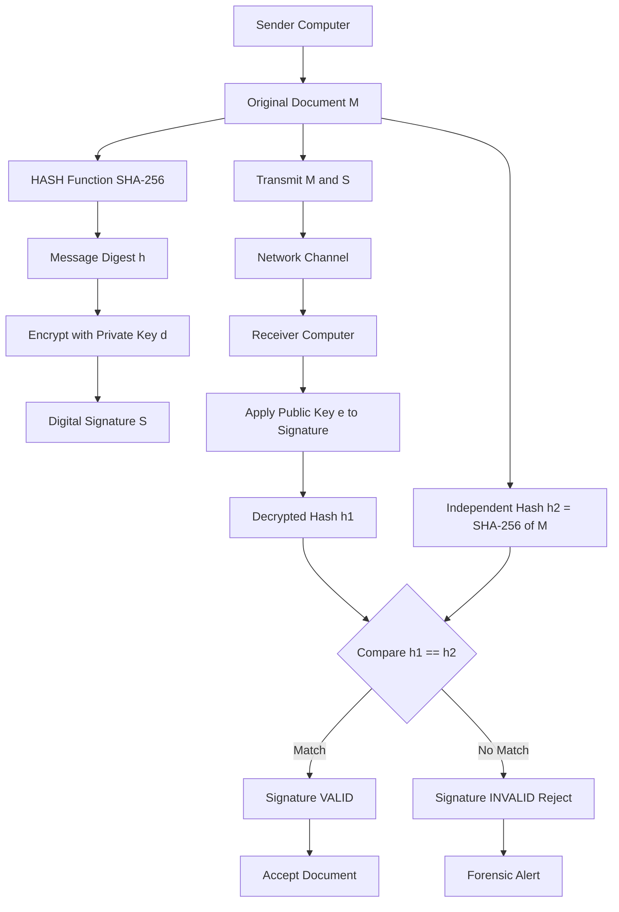
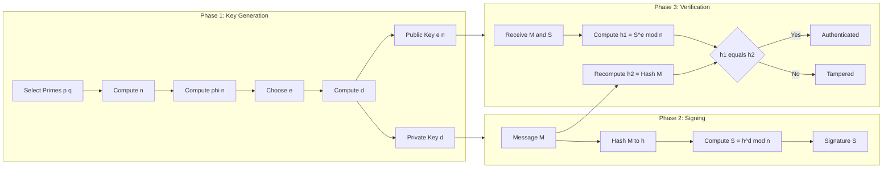
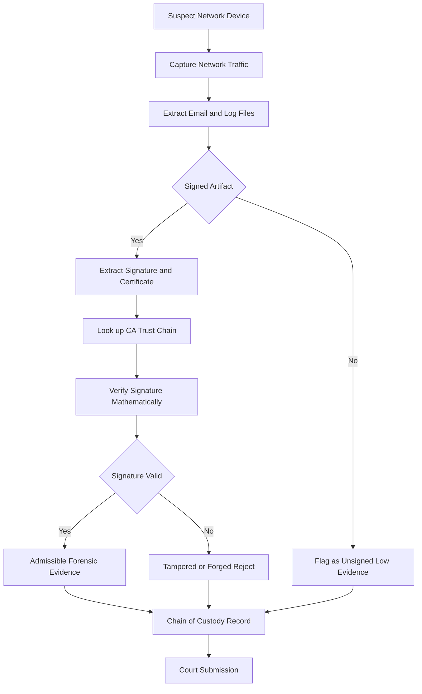

# Creation and Authentication of Digital Signature

<!-- SECTION_1_START -->
# Creation and Authentication of Digital Signature

## 1.1 Formal Academic Definition (KTU 2024 Syllabus Terminology)

A **Digital Signature** is a cryptographic mechanism that uses asymmetric (public-key) cryptography to produce a unique, mathematically-bound electronic equivalent of a handwritten signature. It provides three cornerstone security services — **Authentication**, **Data Integrity**, and **Non-Repudiation** — by binding the identity of the signer to a specific piece of digital data.

In the context of **Network Forensics (Module 4)**, digital signatures are pivotal in establishing the chain-of-custody, validating the authenticity of intercepted network packets, log files, and email communications, and providing court-admissible evidence of who originated a particular digital artifact and whether it has been tampered with.

> [!IMPORTANT]
> **KTU 2024 Highlight:** A digital signature is **not** the same as a digital certificate. The signature proves the integrity and origin of a message; the certificate proves the identity of the key holder. Both are critical in forensic verification.

## 1.2 Conceptual Analogy / Intuition

Imagine you place a letter inside a safe that only the recipient can open, and you also press a unique wax seal on top of the safe.

| Real-World Analogy | Digital Equivalent |
|---|---|
| A handwritten signature on paper | The mathematical hash encrypted with sender's private key |
| Unique fingerprint proving identity | One-way hash function (e.g., **SHA-256**) |
| A locked safe with the recipient's key | Asymmetric encryption using **public key** |
| A trusted witness who verifies the seal | **Certificate Authority (CA)** in a PKI |

The seal can only be created by the person who owns the unique seal (private key), but anyone holding the matching impression (public key) can verify that the seal is genuine.

> [!NOTE]
> **Core Insight:** A digital signature does not encrypt the message itself — it encrypts a *fingerprint* (hash) of the message. The message remains readable; the signature only guarantees who wrote it and that it has not been altered.

## 1.3 Key Cryptographic Constants and Standard Metrics

- **Hash Length (SHA-256):** 256 bits → produces a 64-character hexadecimal digest
- **RSA Key Length (Recommended for Forensics):** $\geq 2048$ bits
- **DSA Key Length:** 1024–3072 bits
- **ECDSA Curve Strength (P-256):** Equivalent to 3072-bit RSA
- **Standard Algorithms:** RSA, DSA, ECDSA, EdDSA (Ed25519)

> [!VISUALIZATION CONTROL]
> **Concept:** Two-party digital signature flow visualization
> **GeoGebra / Desmos Input Equations:**
> * Sender: $h = \text{Hash}(M)$, $S = E_{K_{priv}}(h)$
> * Receiver: $h' = D_{K_{pub}}(S)$, compare $h' = h$
> **Visual Description:** Plot a horizontal axis labeled "Bit Position (0 to 255)" with two converging curves — one representing the original hash digest and another representing the decrypted hash — meeting at a single point of equality. The intersection visually represents signature authentication success.
<!-- SECTION_1_END -->

<!-- SECTION_2_START -->
# Deep Theoretical Analysis & KTU High-Yield Formula Sheet

## 2.1 Operational Concept Breakdown

A digital signature system is built from three core algorithms, collectively known as a **Digital Signature Scheme (DSS)**:

1. **Key Generation Algorithm** — produces a mathematically linked key pair
2. **Signing Algorithm** — generates the signature using the private key
3. **Verification Algorithm** — validates the signature using the public key

### Step-by-Step Logical Flow

**A. Key Generation Phase (Performed Once)**

1. The sender selects two large prime numbers $p$ and $q$ such that $p \neq q$.
2. Compute the modulus:
$$n = p \times q$$
3. Compute Euler's totient:
$$\phi(n) = (p - 1)(q - 1)$$
4. Choose a public exponent $e$ such that $1 < e < \phi(n)$ and $\gcd(e, \phi(n)) = 1$.
5. Compute the private exponent $d$ as the modular multiplicative inverse:
$$d \times e \equiv 1 \pmod{\phi(n)}$$
6. Publish the **public key** $(e, n)$ and retain the **private key** $d$ in absolute secrecy.

> [!NOTE]
> **Why this works:** Computing $d$ from $e$ requires factoring $n$, which is computationally infeasible for large primes — this is the **RSA trapdoor function**.

**B. Signing Phase (Performed for Every Message)**

1. Compute the message digest:
$$h = H(M)$$
where $H$ is a cryptographic hash function (SHA-256, SHA-3).
2. Encrypt the hash with the private key:
$$S = h^{d} \bmod n$$
3. Transmit the pair $(M, S)$ over the network.

**C. Verification Phase (Performed by Receiver / Forensic Investigator)**

1. Decrypt the signature using the sender's public key:
$$h_1 = S^{e} \bmod n$$
2. Independently hash the received message:
$$h_2 = H(M)$$
3. Compare $h_1$ and $h_2$:
$$\text{Valid} \iff h_1 = h_2$$

## 2.2 Properties of a Cryptographically Secure Digital Signature

| Property | Mechanism | Forensic Significance |
|---|---|---|
| **Authentication** | Private key uniqueness | Proves sender identity |
| **Integrity** | Hash collision resistance | Detects any data tampering |
| **Non-Repudiation** | Private key confidentiality | Sender cannot deny signing |
| **Unforgeability** | Computational infeasibility | Prevents signature forgery |
| **Reusability Prevention** | Per-message digest binding | One signature per document |

## 2.3 KTU High-Yield Formula Sheet

| Concept | Formula / Rule | Purpose |
|---|---|---|
| Modulus Generation | $n = p \times q$ | RSA key foundation |
| Euler's Totient | $\phi(n) = (p-1)(q-1)$ | Determines valid exponents |
| Public Exponent Constraint | $\gcd(e, \phi(n)) = 1$ | Ensures invertibility |
| Private Exponent | $d \equiv e^{-1} \pmod{\phi(n)}$ | Enables signing |
| Signature Generation | $S = h^{d} \bmod n$ | Creates signature |
| Signature Verification | $h_1 = S^{e} \bmod n$ | Recovers hash from signature |
| Integrity Check | $h_1 \stackrel{?}{=} H(M)$ | Verifies data integrity |
| Hash Length (SHA-256) | 256 bits | Standard digest size |
| RSA Security Threshold | $n \geq 2048$ bits | Minimum forensic-grade key |

> [!IMPORTANT]
> **Critical Distinction:** In RSA **encryption**, the public key encrypts and private key decrypts. In RSA **signing**, the roles **reverse** — the private key signs and public key verifies. Confusing these is the most common KTU exam pitfall.

## 2.4 Real-World Engineering and Forensics Applications

Digital signatures are deeply embedded in production systems that KTU graduates will encounter:

- **TLS/SSL Handshakes** — Server certificates use DSA/ECDSA to authenticate websites
- **Signed Emails (S/MIME, PGP)** — Used to verify email senders in phishing investigations
- **Code Signing** — Operating systems verify software publishers (Windows Authenticode, Apple notarization)
- **Blockchain & Cryptocurrencies** — Every transaction is signed with ECDSA
- **Document Forensics** — Adobe PDF signatures, e-stamping in government
- **Network Packet Authentication** — IPsec, DNSSEC, BGPsec use signatures to prevent spoofing

> [!NOTE]
> In **network forensics**, when an investigator seizes a suspect's hard drive, examining digitally signed files (timestamps, certificate chains) helps establish what the suspect created, when, and whether the files were modified post-fact.
<!-- SECTION_2_END -->

<!-- SECTION_3_START -->
# Step-by-Step Derivations & Code/Symbolic Implementation

## 3.1 Mathematical Derivation: Mini RSA Digital Signature Example

Let us walk through a complete RSA signature cycle with small primes to demonstrate the underlying algebra.

### Given Parameters

- $p = 5$, $q = 11$ (two small primes)
- Message: $M = 8$ (numerical representation)
- Hash function: $H(M) = M \bmod n$ (simplified for illustration)

### Step 1: Compute Modulus

$$n = p \times q = 5 \times 11 = 55$$

### Step 2: Compute Euler's Totient

$$\phi(n) = (p-1)(q-1) = (5-1)(11-1) = 4 \times 10 = 40$$

### Step 3: Select Public Exponent

Choose $e = 7$ (verify $\gcd(7, 40) = 1$)

$$\gcd(7, 40) = 1 \quad \checkmark$$

### Step 4: Compute Private Exponent

We must find $d$ such that $d \times 7 \equiv 1 \pmod{40}$.

Using the Extended Euclidean Algorithm:

$$40 = 5 \times 7 + 5$$
$$7 = 1 \times 5 + 2$$
$$5 = 2 \times 2 + 1$$
$$2 = 2 \times 1 + 0$$

Back-substitute to find $1$:

$$1 = 5 - 2 \times 2$$
$$1 = 5 - 2 \times (7 - 1 \times 5) = 3 \times 5 - 2 \times 7$$
$$1 = 3 \times (40 - 5 \times 7) - 2 \times 7 = 3 \times 40 - 17 \times 7$$

Therefore:

$$d \equiv -17 \equiv 23 \pmod{40}$$

So $d = 23$.

### Step 5: Compute Message Hash

$$h = H(M) = 8 \bmod 55 = 8$$

### Step 6: Generate Signature

$$S = h^{d} \bmod n = 8^{23} \bmod 55$$

Computing $8^{23} \bmod 55$ using successive squaring:

$$8^1 \equiv 8 \pmod{55}$$
$$8^2 \equiv 64 \equiv 9 \pmod{55}$$
$$8^4 \equiv 9^2 = 81 \equiv 26 \pmod{55}$$
$$8^8 \equiv 26^2 = 676 \equiv 16 \pmod{55}$$
$$8^{16} \equiv 16^2 = 256 \equiv 36 \pmod{55}$$

Now combine using $23 = 16 + 4 + 2 + 1$:

$$8^{23} = 8^{16} \times 8^4 \times 8^2 \times 8^1$$
$$8^{23} \equiv 36 \times 26 \times 9 \times 8 \pmod{55}$$

Compute stepwise:

$$36 \times 26 = 936 \equiv 936 - 17 \times 55 = 936 - 935 = 1 \pmod{55}$$
$$1 \times 9 = 9 \pmod{55}$$
$$9 \times 8 = 72 \equiv 72 - 55 = 17 \pmod{55}$$

Therefore:

$$S = 17$$

The signed message pair transmitted is $(M, S) = (8, 17)$.

### Step 7: Verification at Receiver

Receiver computes:

$$h_1 = S^{e} \bmod n = 17^7 \bmod 55$$

Successive squaring:

$$17^1 \equiv 17 \pmod{55}$$
$$17^2 \equiv 289 \equiv 289 - 5 \times 55 = 289 - 275 = 14 \pmod{55}$$
$$17^4 \equiv 14^2 = 196 \equiv 196 - 3 \times 55 = 196 - 165 = 31 \pmod{55}$$

Combine using $7 = 4 + 2 + 1$:

$$17^7 = 17^4 \times 17^2 \times 17^1 \equiv 31 \times 14 \times 17 \pmod{55}$$

Compute stepwise:

$$31 \times 14 = 434 \equiv 434 - 7 \times 55 = 434 - 385 = 49 \pmod{55}$$
$$49 \times 17 = 833 \equiv 833 - 15 \times 55 = 833 - 825 = 8 \pmod{55}$$

Therefore:

$$h_1 = 8$$

Receiver independently computes the hash:

$$h_2 = H(M) = 8 \bmod 55 = 8$$

Compare:

$$h_1 = h_2 = 8 \quad \checkmark \quad \text{Signature is VALID}$$

## 3.2 Full Python Implementation: RSA Signature Creation and Verification

```python
"""
KTU Digital Forensics Lab Implementation
File: digital_signature_rsa.py
Description: Complete RSA digital signature generation and verification
             with hash functions, suitable for forensic demonstration.
"""

import hashlib
import random
from typing import Tuple


class RSASignatureEngine:
    """
    A self-contained RSA digital signature engine.
    Implements key generation, signing, and verification.
    """

    def __init__(self, key_size: int = 1024) -> None:
        """
        Initialize the RSA signature engine.
        
        Args:
            key_size: Size of modulus in bits (1024 minimum for demo).
        """
        if key_size < 64:
            raise ValueError("Key size too small for cryptographic security.")
        self.key_size = key_size
        self.public_key: Tuple[int, int] = (0, 0)
        self.private_key: int = 0
        self.n: int = 0

    @staticmethod
    def is_prime(number: int, k: int = 40) -> bool:
        """
        Miller-Rabin primality test.
        
        Args:
            number: Integer to test for primality.
            k: Number of test rounds (higher = more accurate).
        
        Returns:
            True if number is probably prime, False otherwise.
        """
        if number < 2:
            return False
        if number in (2, 3):
            return True
        if number % 2 == 0:
            return False

        r, d = 0, number - 1
        while d % 2 == 0:
            r += 1
            d //= 2

        for _ in range(k):
            witness = random.randrange(2, number - 1)
            x = pow(witness, d, number)

            if x == 1 or x == number - 1:
                continue

            for _ in range(r - 1):
                x = pow(x, 2, number)
                if x == number - 1:
                    break
            else:
                return False
        return True

    @staticmethod
    def generate_prime(bits: int) -> int:
        """Generate a random probable prime of specified bit length."""
        while True:
            candidate = random.getrandbits(bits)
            candidate |= (1 << (bits - 1)) | 1
            if RSASignatureEngine.is_prime(candidate):
                return candidate

    @staticmethod
    def extended_gcd(a: int, b: int) -> Tuple[int, int, int]:
        """Extended Euclidean Algorithm returning (gcd, x, y) such that ax + by = gcd."""
        if a == 0:
            return b, 0, 1
        gcd_val, x1, y1 = RSASignatureEngine.extended_gcd(b % a, a)
        return gcd_val, y1 - (b // a) * x1, x1

    def generate_keypair(self) -> Tuple[Tuple[int, int], int]:
        """
        Generate RSA public and private keys.
        
        Returns:
            ((e, n), d) where (e, n) is public key and d is private exponent.
        """
        half_bits = self.key_size // 2

        p = self.generate_prime(half_bits)
        q = self.generate_prime(half_bits)
        while p == q:
            q = self.generate_prime(half_bits)

        self.n = p * q
        phi_n = (p - 1) * (q - 1)

        e = 65537  # Standard widely-used public exponent
        if self.extended_gcd(e, phi_n)[0] != 1:
            e = 3
            while self.extended_gcd(e, phi_n)[0] != 1:
                e += 2

        _, d, _ = self.extended_gcd(e, phi_n)
        d = d % phi_n

        self.public_key = (e, self.n)
        self.private_key = d

        return self.public_key, d

    def compute_hash(self, message: bytes) -> int:
        """
        Compute SHA-256 hash of message and convert to integer.
        
        Args:
            message: Input message as bytes.
        
        Returns:
            Integer representation of the SHA-256 hash digest.
        """
        digest = hashlib.sha256(message).digest()
        return int.from_bytes(digest, byteorder='big')

    def sign(self, message: bytes) -> Tuple[bytes, int]:
        """
        Create a digital signature for the given message.
        
        Args:
            message: The data to be signed.
        
        Returns:
            Tuple of (message, signature_integer).
        """
        if self.private_key == 0:
            raise RuntimeError("Keys not generated. Call generate_keypair() first.")

        message_hash = self.compute_hash(message)
        # For very small keys, reduce hash to fit within modulus
        if self.n.bit_length() < 256:
            message_hash = message_hash % self.n

        signature = pow(message_hash, self.private_key, self.n)
        return message, signature

    def verify(self, signed_message: Tuple[bytes, int],
               public_key: Tuple[int, int]) -> bool:
        """
        Verify a digital signature.
        
        Args:
            signed_message: Tuple of (message, signature).
            public_key: (e, n) tuple.
        
        Returns:
            True if signature is valid, False otherwise.
        """
        message, signature = signed_message
        e, n = public_key

        if not (0 < signature < n):
            return False

        recovered_hash = pow(signature, e, n)
        computed_hash = self.compute_hash(message)

        if n.bit_length() < 256:
            computed_hash = computed_hash % n

        return recovered_hash == computed_hash


# ===== Forensic Demonstration =====
if __name__ == "__main__":

    print("=" * 70)
    print("  KTU Digital Forensics: RSA Digital Signature Demonstration")
    print("=" * 70)

    engine = RSASignatureEngine(key_size=512)

    print("\n[Phase 1] Generating 512-bit RSA key pair...")
    public_key, private_key = engine.generate_keypair()
    print(f"Public Key  (e, n): ({public_key[0]}, {str(public_key[1])[:40]}...)")
    print(f"Private Key (d)    : {str(private_key)[:40]}...")

    document = b"Court Evidence #2024-001: Network log file authentic and untampered."

    print("\n[Phase 2] Sender signs the document...")
    signed = engine.sign(document)
    print(f"Original Hash     : {engine.compute_hash(document) % engine.n}")
    print(f"Signature Integer : {signed[1]}")

    print("\n[Phase 3] Forensic investigator verifies the signature...")
    is_valid = engine.verify(signed, public_key)
    print(f"Signature Valid?  : {is_valid}")

    print("\n[Phase 4] Tampering test — modifying the document...")
    tampered_document = b"Court Evidence #2024-001: Network log file HAS BEEN TAMPERED."
    tampered_hash = engine.compute_hash(tampered_document) % engine.n
    recovered = pow(signed[1], public_key[0], public_key[1])
    print(f"Original hash from signature : {recovered}")
    print(f"Hash of tampered document    : {tampered_hash}")
    print(f"Match? {recovered == tampered_hash}  => Signature FAILS (correctly)")

    print("\n" + "=" * 70)
    print("  Demonstration Complete")
    print("=" * 70)
```

## 3.3 DSA (Digital Signature Algorithm) — Alternative Scheme

The **DSA** is a federal U.S. government standard (FIPS 186) that uses a different mathematical structure than RSA. Here is the symbolic flow:

**Key Generation:**

1. Choose a prime $p$ and a prime divisor $q$ of $(p-1)$.
2. Choose a generator $g$ such that $g = h^{(p-1)/q} \bmod p$.
3. Choose private key $x$ where $1 < x < q$.
4. Compute public key:
$$y = g^{x} \bmod p$$

**Signing (message digest $h$):**

1. Choose a random per-message $k$ where $0 < k < q$.
2. Compute:
$$r = (g^{k} \bmod p) \bmod q$$
3. Compute:
$$s = k^{-1}(h + x \cdot r) \bmod q$$

**Verification:**

1. Compute:
$$w = s^{-1} \bmod q$$
2. Compute:
$$u_1 = h \cdot w \bmod q$$
$$u_2 = r \cdot w \bmod q$$
3. Compute:
$$v = (g^{u_1} \cdot y^{u_2} \bmod p) \bmod q$$
4. Signature is **valid** if and only if:
$$v = r$$
<!-- SECTION_3_END -->

<!-- SECTION_4_START -->
# Structural Diagrams & Schematics

## 4.1 End-to-End Digital Signature Architecture Flow



## 4.2 Three-Phase Process Topology



## 4.3 Forensic Use-Case Architecture



## 4.4 Digital Signature vs. Digital Certificate Comparison

| Attribute | Digital Signature | Digital Certificate |
|---|---|---|
| **Purpose** | Authenticates a specific message | Authenticates identity of a key holder |
| **Created Using** | Sender's private key | Certificate Authority's private key |
| **Verified Using** | Sender's public key | CA's public key (in trust store) |
| **Bound To** | Message hash | Public key + Identity |
| **Contains** | Encrypted hash + algorithm info | Public key, name, issuer, validity period |
| **Forensic Role** | Proves message origin and integrity | Proves ownership of the signing key |
<!-- SECTION_4_END -->

<!-- SECTION_5_START -->
# KTU 2024 Scheme Examination Question Bank & Topic Recap

## 5.1 Part A Questions (3 Marks Each)

### Question 1 [KTU University Exam - July 2024]

**CO1, Remember:** List any three properties of a digital signature.

**Model Answer:**

A digital signature provides:

1. **Authentication** — Confirms the identity of the sender, since only they possess the private key.
2. **Data Integrity** — Guarantees the message has not been altered in transit, as the hash comparison would fail.
3. **Non-Repudiation** — The sender cannot later deny having signed the document, because they alone hold the private key.

> [Stating all three properties with one-line justification: 3 Marks]

---

### Question 2 [KTU University Exam - Dec 2023]

**CO1, Understand:** Why is a hash function used in the digital signature process instead of encrypting the entire message?

**Model Answer:**

A hash function is used because:

1. **Performance:** Hashing a fixed-length digest (e.g., 256 bits) is far faster than encrypting a potentially large message with asymmetric cryptography.
2. **Standardization:** A fixed-length hash enables uniform signature size regardless of message length.
3. **Collision Resistance:** Modern hash functions (SHA-256) ensure that no two distinct messages produce the same digest, preserving integrity guarantees.

> [Stating performance benefit: 1 Mark] [Stating uniform signature size: 1 Mark] [Stating collision resistance: 1 Mark]

---

## 5.2 Part B Question A (14 Marks) — Choice Option 1

### Question A [KTU University Exam - July 2024]

**CO2, Understand & Apply:** With a neat diagram, explain the complete process of **digital signature creation and verification** using the RSA algorithm. Demonstrate the signing and verification with the following parameters: $p = 7$, $q = 13$, $M = 5$, $e = 5$.

### Part (a) — 7 Marks [Understand: Process Explanation]

**Model Answer:**

The digital signature process involves three distinct phases:

**Phase 1 — Key Generation:**

1. Compute $n = p \times q = 7 \times 13 = 91$.
2. Compute $\phi(n) = (p-1)(q-1) = 6 \times 12 = 72$.
3. Verify $e = 5$ is coprime with $\phi(n) = 72$. Since $\gcd(5, 72) = 1$ ✓.
4. Compute private key $d$ such that $5d \equiv 1 \pmod{72}$.

Using the Extended Euclidean Algorithm:

$$72 = 14 \times 5 + 2$$
$$5 = 2 \times 2 + 1$$
$$2 = 2 \times 1 + 0$$

Back-substitution:

$$1 = 5 - 2 \times 2 = 5 - 2(72 - 14 \times 5) = 29 \times 5 - 2 \times 72$$

Therefore $d = 29$.

> [Computing n: 1 Mark] [Computing phi n: 1 Mark] [Verifying coprimality: 1 Mark] [Computing d: 1 Mark]

**Phase 2 — Signature Creation:**

Compute $S = M^d \bmod n = 5^{29} \bmod 91$.

Using successive squaring:

$$5^1 = 5$$
$$5^2 = 25$$
$$5^4 = 625 \equiv 625 - 6 \times 91 = 625 - 546 = 79 \pmod{91}$$
$$5^8 \equiv 79^2 = 6241 \equiv 6241 - 68 \times 91 = 6241 - 6188 = 53 \pmod{91}$$
$$5^{16} \equiv 53^2 = 2809 \equiv 2809 - 30 \times 91 = 2809 - 2730 = 79 \pmod{91}$$

Combine: $29 = 16 + 8 + 4 + 1$

$$5^{29} = 5^{16} \times 5^8 \times 5^4 \times 5^1 \equiv 79 \times 53 \times 79 \times 5 \pmod{91}$$

Compute stepwise:

$$79 \times 53 = 4187 \equiv 4187 - 46 \times 91 = 4187 - 4186 = 1 \pmod{91}$$
$$1 \times 79 = 79 \pmod{91}$$
$$79 \times 5 = 395 \equiv 395 - 4 \times 91 = 395 - 364 = 31 \pmod{91}$$

So $S = 31$.

> [Setting up exponentiation: 1 Mark] [Computing S = 31: 2 Marks]

### Part (b) — 7 Marks [Apply: Verification]

**Model Answer:**

The receiver verifies the signature by:

1. Computing $h_1 = S^e \bmod n = 31^5 \bmod 91$.

Successive squaring:

$$31^1 \equiv 31 \pmod{91}$$
$$31^2 = 961 \equiv 961 - 10 \times 91 = 961 - 910 = 51 \pmod{91}$$
$$31^4 \equiv 51^2 = 2601 \equiv 2601 - 28 \times 91 = 2601 - 2548 = 53 \pmod{91}$$

Combine: $5 = 4 + 1$

$$31^5 = 31^4 \times 31^1 \equiv 53 \times 31 \pmod{91}$$
$$53 \times 31 = 1643 \equiv 1643 - 18 \times 91 = 1643 - 1638 = 5 \pmod{91}$$

So $h_1 = 5$.

2. Compute the message hash: $h_2 = H(M) = 5 \bmod 91 = 5$.

3. Compare: $h_1 = 5$ and $h_2 = 5$, so $h_1 = h_2$ ✓.

**The signature is VALID.**

> [Computing h1 via exponentiation: 3 Marks] [Computing h2: 1 Mark] [Comparison and final verdict: 3 Marks]

---

## 5.3 Part B Question B (14 Marks) — Choice Option 2

### Question B [KTU University Exam - Dec 2023]

**CO2 & CO3, Understand & Apply:** Explain the role of **hash functions** in digital signature schemes. Compare RSA and DSA signature schemes with respect to algorithm, key generation, and security basis.

### Part (a) — 7 Marks [Understand: Hash Function Role]

**Model Answer:**

Hash functions play three critical roles in digital signature schemes:

**1. Message Fingerprinting:** A hash function $H$ maps an arbitrary-length message $M$ to a fixed-length digest $h = H(M)$. This makes the signing operation independent of message size and produces a constant-size signature.

**2. Integrity Verification:** During verification, the recipient recomputes $h_2 = H(M)$ and compares it with the decrypted signature $h_1$. Any modification to $M$, even a single bit, will produce a drastically different hash due to the **avalanche effect**, causing verification to fail.

**3. Performance Optimization:** Asymmetric encryption of the entire message is computationally expensive. Encrypting only the small fixed-size hash (e.g., 256 bits for SHA-256) is orders of magnitude faster.

**Required Hash Properties:**

- **Pre-image resistance:** Hard to find $M$ from $H(M)$.
- **Second pre-image resistance:** Hard to find $M' \neq M$ with $H(M) = H(M')$.
- **Collision resistance:** Hard to find any two inputs with the same hash.

> [Explaining fingerprinting: 2 Marks] [Explaining integrity verification: 2 Marks] [Explaining performance: 1 Mark] [Listing hash properties: 2 Marks]

### Part (b) — 7 Marks [Apply: Comparative Analysis]

**Model Answer:**

| Parameter | RSA Signature | DSA Signature |
|---|---|---|
| **Mathematical Basis** | Integer factorization of large primes | Discrete logarithm in modular exponentiation |
| **Key Generation** | $n = p \times q$, $d \equiv e^{-1} \bmod \phi(n)$ | Prime $p$, sub-prime $q$, generator $g$, $y = g^x \bmod p$ |
| **Signing Operation** | $S = H(M)^d \bmod n$ | $r = (g^k \bmod p) \bmod q$, $s = k^{-1}(H(M) + xr) \bmod q$ |
| **Verification** | $H(M) = S^e \bmod n$ | $v = (g^{u_1} y^{u_2} \bmod p) \bmod q$, valid if $v = r$ |
| **Signature Size** | Equal to modulus size (e.g., 2048 bits) | Typically 320 bits (two 160-bit values) |
| **Speed** | Slower signature generation, faster verification | Faster signature generation, slower verification |
| **Security Basis** | Integer factorization hardness | Discrete logarithm problem hardness |
| **Standard** | PKCS#1, widely used in PKI | FIPS 186-4, U.S. federal standard |
| **Forensic Use** | SSL/TLS certificates, document signing | Government, banking, FIPS-compliant systems |

> [Stating RSA mathematical basis and key gen: 1 Mark] [Storing DSA mathematical basis and key gen: 1 Mark] [Listing signing formulas: 1 Mark] [Listing verification formulas: 1 Mark] [Comparing signature size and speed: 1 Mark] [Identifying standards: 1 Mark] [Concluding with forensic use-case: 1 Mark]

---

> [!WARNING]
> **KTU Examiner's Valuation Warning — Common Pitfalls:**
> 1. **Reversed Key Confusion:** Students frequently write that the public key signs the message. Always clarify: **private key signs, public key verifies**.
> 2. **Missing Modulus:** When computing $S = h^d$, students sometimes compute $h^d$ without $\bmod n$, producing astronomically large incorrect values.
> 3. **Skipping Coprimality Check:** Failing to verify $\gcd(e, \phi(n)) = 1$ is a guaranteed 1-mark deduction.
> 4. **Confusing Signature with Encryption:** RSA encryption uses $C = M^e \bmod n$; RSA signing uses $S = H(M)^d \bmod n$. Examiners strictly distinguish these.
> 5. **Forgetting to Mention Hash Function:** Never write "encrypt the message with private key" — always write "encrypt the **hash of the message** with the private key".

---

## 5.4 Topic Recap & Important Things to Remember

- **Definition:** A digital signature is a cryptographic value computed from a message digest using the signer's private key to provide authentication, integrity, and non-repudiation.
- **Three Phases:** Key generation → Signing → Verification.
- **Core RSA Formulas:**
  - $n = p \times q$
  - $\phi(n) = (p-1)(q-1)$
  - $d \equiv e^{-1} \pmod{\phi(n)}$
  - $S = H(M)^d \bmod n$
  - Verification: $H(M) \stackrel{?}{=} S^e \bmod n$
- **Hash Function:** Always hash the message first; never sign the raw message directly.
- **Standard Hash:** SHA-256 produces a 256-bit digest.
- **Key Length:** Minimum 2048-bit RSA modulus for forensic-grade security.
- **Private vs Public Role Reversal:** In signing, the private key creates the signature and the public key verifies it.
- **DSA Differences:** Uses discrete logarithms, produces shorter signatures (320 bits), and is FIPS-compliant.
- **Forensic Significance:** Digital signatures are court-admissible evidence; they establish chain-of-custody integrity for intercepted logs, emails, and signed documents.
- **Non-Repudiation Anchor:** Only the holder of the private key can produce a valid signature, making denial impossible.
- **Tampering Detection:** Even a one-bit change in $M$ causes complete hash divergence, exposing any modification.
- **PKI Integration:** Digital signatures rely on a trusted Certificate Authority (CA) hierarchy to bind public keys to identities.
- **Real-World Algorithms Encountered:** RSA, DSA, ECDSA, EdDSA (Ed25519).
- **Examiner's Pet Topic:** Be prepared to compute a small RSA signature cycle end-to-end and to compare RSA with DSA in tabular form.
<!-- SECTION_5_END -->
