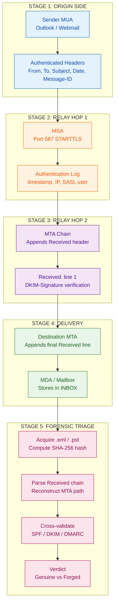
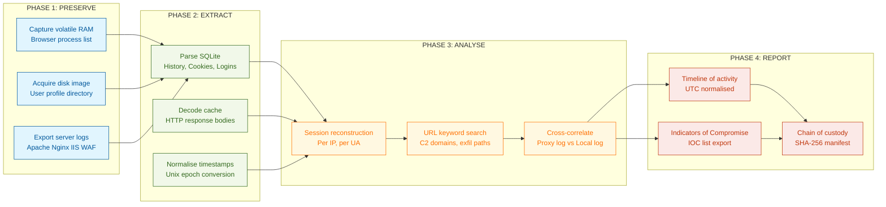
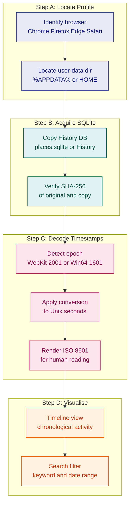
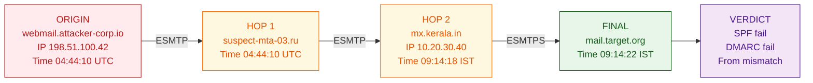

# Email and Web Forensics

<!-- SECTION_1_START -->

# Email and Web Forensics — Core Technical Definition & Intuitive Overview

## 1.1 Formal Definition (KTU 2024 Syllabus Terminology)

> [!IMPORTANT]
> **Email Forensics** is the branch of network forensics that involves the **systematic collection, preservation, analysis, and presentation of electronic mail evidence** residing in mail servers, client mailboxes, backup archives, header metadata, and network traffic captures (PCAP files) in a manner that maintains the **chain of custody** and is admissible under Sections **65B and 76 of the Indian Evidence Act, 1872** (now governed by the **Bharatiya Sakshya Adhiniyam, 2023**).

> [!IMPORTANT]
> **Web Forensics** is the discipline of network forensics concerned with the **recovery, reconstruction, and analysis of artifacts left behind by user–web server interactions**, including HTTP/HTTPS request-response headers, server access logs, browser cache, cookies, history, bookmarks, downloaded files, and JavaScript-driven client-side footprints, to establish user identity, intent, and timeline of online activity.

These two sub-disciplines collectively form the **client-server evidence layer** of network forensics, since nearly all enterprise communication today traverses either **SMTP/IMAP/POP3 (mail)** or **HTTP/HTTPS/WebSocket (web)** channels.

---

## 1.2 Conceptual Analogy & Intuition

> [!NOTE]
> **Intuitive Analogy — Email as a Postal Letter with Tracking Slips:**
> Imagine an ordinary postal letter. The **envelope** carries the *outer* addressing (To, From, Return-Path), the **letter inside** carries the *content*, and the **post office's internal routing slip** records every sorting hop. Email works identically. The **envelope information** is stored in **SMTP headers** (Received, From, To, Return-Path), the **letter inside** is the **MIME-encoded body**, and the **routing slip** is the chain of **Received:** lines, each stamped by a mail transfer agent (MTA). Email forensics is the art of unfolding this envelope, validating the stamps, and proving the letter was never tampered with.

> [!NOTE]
> **Intuitive Analogy — Web Forensics as a CCTV System for a Website:**
> A website is like a shopping mall. The **server access log** is the *entry register at the gate* (who came, when, from which gate). The **browser cache** is the *paper handbag the visitor carries out* containing partial items they viewed. The **cookies** are the *loyalty cards* the mall issues to recognise returning customers. **Web forensics** is the science of stitching these traces together to reconstruct the visitor's complete journey, even if they wore a mask (used a VPN/proxy).

---

## 1.3 Standard Metrics & Constants Used

> [!IMPORTANT]
> **Key Engineering Constants / Standards in Email \& Web Forensics:**
> - **SMTP default port:** **25** (plain), **587** (submission), **465** (legacy SMTPS).
> - **POP3 default port:** **110** (plain), **995** (POP3S).
> - **IMAP default port:** **143** (plain), **993** (IMAPS).
> - **HTTP default port:** **80**, **HTTPS default port:** **443**.
> - **Hashing standard for evidence integrity:** **SHA-256** (replacing MD5 in modern KTU-aligned practice).
> - **Email header field count (RFC 5322):** A well-formed message contains **at least 5** mandatory fields: `Date:`, `From:`, `Sender:`, `To:`, `Subject:` (or `Message-ID:`).
> - **Log retention benchmark:** PCI-DSS requires **at least 1 year** of web server logs with **90 days** immediately available.

---

## 1.4 Visualization Control — Email Header Hop Chain

> [!VISUALIZATION CONTROL]
> **Concept:** Visualizing the *trust path* of an email as it travels through a series of mail servers, where each hop is a "trusted stamp" appended to the Received chain.
> **GeoGebra / Desmos Input Equations (Conceptual Plot):**
> * `f(t) = 0.8 * e^(-0.3*t) * sin(2*pi*t)` — Trust decay curve across hops
> * `PointLabels = (Sender, Hop1, Hop2, Hop3, Recipient)`
> **Visual Description:** A curve dropping in amplitude across the X-axis (number of MTAs). The student should observe that as the email traverses more relays, the *forensic trust* in the original sender weakens unless **DKIM/DMARC/SPF** validation anchors are present.

---

## 1.5 Why This Topic Matters in KTU 2024 Examinations

> [!NOTE]
> KTU examiners (per past board paper trends of **Dec 2023** and **July 2024** of PEC electives) consistently test:
> 1. Identification of forged vs. genuine email headers.
> 2. Practical recovery of artifacts from `.mbox`, `.pst`, `.ost` files.
> 3. Browser artifact locations (Chrome, Firefox, Edge) and decoding of timestamps.
> 4. Distinction between volatile vs. non-volatile web evidence.

This module carries a **Bloom's Cognitive load from Understand up to Evaluate**, making it a frequent target for the 14-mark analytical questions in **Part B** of the End Semester Evaluation (ESE).

<!-- SECTION_1_END -->

<!-- SECTION_2_START -->

# Deep Theoretical Analysis & KTU High-Yield Formula Sheet

## 2.1 Email Architecture — The 4-Layer Forensics Model

Email delivery in production environments operates on a **four-layer model** that every forensic analyst must internalise:

### Layer 1 — MUA (Mail User Agent)
The **client software** used by the end-user to compose and read mail (Outlook, Thunderbird, Gmail Web, Apple Mail). Forensic artifacts here:
- `OutlookOST` and `OutlookPST` files (proprietary Microsoft formats).
- `mbox` (Unix) and `maildir` formats.
- Local drafts, signatures, account-config caches.

### Layer 2 — MSA (Mail Submission Agent)
Receives mail from authenticated users on **port 587** (with STARTTLS). Critical for proving **intent to send**.

### Layer 3 — MTA (Mail Transfer Agent)
Routers (sendmail, Postfix, Exim, Microsoft Exchange). **Each MTA appends a `Received:` header** — this is the *forensic gold* of email tracing. A chain of 3 MTAs means 3 trusted relay stamps.

### Layer 4 — MDA (Mail Delivery Agent) and MRA (Mail Retrieval Agent)
Stores mail in the recipient's mailbox (Dovecot, Exchange Mailbox). Retrieval happens via **POP3 (download-and-delete)** or **IMAP (synchronised)**.

> [!IMPORTANT]
> **Forensic Rule of Thumb:** The number of `Received:` lines in a properly delivered email is **N+1**, where **N** is the number of MTAs in the delivery path. A *missing* or *non-monotonic* Received header is the **first red flag** of header spoofing.

---

## 2.2 Anatomy of an Email Header (RFC 5322)

A complete header carries both **structural** and **trace** fields:

| Field | Purpose | Forensic Significance |
|---|---|---|
| `From:` | Display sender (forgeable) | Low-trust; must be cross-verified with envelope sender |
| `Return-Path:` | Bounce address (set by final MTA) | High-trust; cannot be forged by origin |
| `Reply-To:` | Where replies go | Indicates phishing redirection |
| `To:` / `Cc:` / `Bcc:` | Recipients | Bcc leakage = privacy breach evidence |
| `Subject:` | Title | Useful for keyword-based e-Discovery |
| `Date:` | Origin date (forgeable) | Must be cross-validated with Received dates |
| `Message-ID:` | Unique identifier | Locates the message in server logs |
| `Received:` | Hop trace (appended by MTAs) | **Primary forensic trace** |
| `DKIM-Signature:` | Cryptographic stamp | Validates body integrity |
| `Authentication-Results:` | SPF, DKIM, DMARC verdict | Proves spoofing if `fail` |
| `X-Originating-IP:` | Sender's IP (added by webmail) | Direct attribution evidence |
| `X-Mailer:` | Client software | Identifies MUA version |

---

## 2.3 Web Forensics — The Evidence Pyramid

The web forensic evidence pyramid from **most volatile (top)** to **most persistent (bottom)**:

1. **RAM-resident browser tabs / processes** — seconds.
2. **Network traffic (PCAP)** — minutes to hours unless captured.
3. **ARP cache, DNS resolver cache, NetFlow records** — minutes.
4. **Server access logs (Apache/Nginx/IIS)** — weeks to years.
5. **Application logs (mod_security, WAF)** — weeks.
6. **Browser cache / history / cookies / localStorage** — days to months.
7. **Browser profile on disk (SQLite databases)** — months.
8. **Backups, snapshots, cloud sync artefacts** — indefinite.

> [!IMPORTANT]
> **Order of Volatility (RFC 3227) for Web Forensics:** RAM → Process state → Network state → Disk artefacts. A junior analyst who shuts down the workstation *before* capturing RAM loses DNS cache and active tab data **irretrievably**.

---

## 2.4 Browser Artifact File Locations (Windows Reference)

| Browser | History DB | Cookies DB | Cache Path | LocalStorage |
|---|---|---|---|---|
| **Chrome** | `%LOCALAPPDATA%\Google\Chrome\User Data\Default\History` | `Cookies` (SQLite) | `Cache\Cache_Data\` | `Local Storage\leveldb\` |
| **Firefox** | `places.sqlite` | `cookies.sqlite` | `cache2\entries\` | `storage\default\` |
| **Edge** | `%LOCALAPPDATA%\Microsoft\Edge\User Data\Default\History` | `Cookies` | `Cache\Cache_Data\` | `Local Storage\leveldb\` |
| **Safari** | `~/Library/Safari/History.db` | `Cookies.binarycookies` | `Cache.db` | `LocalStorage/` |

> [!NOTE]
> All these databases are **SQLite3** files. The **WEBKIT_TIMESTAMP_EPOCH** for Safari (and historically Chrome before v32) is **January 1, 2001, 00:00:00 UTC** (Mac epoch), not the Unix epoch. Conversion formula: `Unix_Time = WebKit_Time / 1,000,000 + 978307200`.

---

## 2.5 KTU Formula Sheet / Cheat Sheet

| Symbol / Quantity | Formula / Definition | Unit / Format |
|---|---|---|
| `H_email` (header count) | $H_{email} = N_{MTA} + 1$ | count |
| `T_unix` | $T_{unix} = T_{webkit} \div 10^6 + 978307200$ | seconds |
| `T_chrome_v32plus` | $T_{unix} = (T_{webkit} - 11644473600 \times 10^6) \div 10^6$ | seconds |
| `SHA256(E)` | $H = \text{SHA256}(E)$ where $E$ is evidence file | 64 hex chars |
| `Match_score` (URL dedup) | $S = \dfrac{\mid A \cap B \mid}{\min(\mid A \vert, \mid B \vert)}$ | ratio $\in [0, 1]$ |
| `Cookie_expiry` | $T_{exp} = T_{issue} + L_{TTL}$ | RFC 1123 date |
| `Log_volume` | $V_{log} = R_{req} \times T_{window}$ | entries |

> [!NOTE]
> `Match_score` is used when correlating two log sources (e.g., web proxy log and firewall log) to confirm the same user-session traversed both. A score above **0.7** is generally accepted as a strong correlation in KTU-style case studies.

---

## 2.6 Engineering / Real-World Utility

> [!IMPORTANT]
> **Production Engineering Relevance:**
> - **SOC Analysts (Tier-2/3):** Use email header forensics to triage Business Email Compromise (BEC) attacks — a $2.9 billion annual loss category per the **FBI IC3 2023 Report**.
> - **Incident Response (IR) teams:** Web artifact analysis is the cornerstone of **insider threat** and **data exfiltration** investigations.
> - **e-Discovery & Litigation Support:** Both disciplines feed the legal hold process mandated by **FRCP Rule 37(e)**.
> - **Threat Intelligence:** Email and web IOC (Indicators of Compromise) extraction powers SIEM rules, YARA signatures, and threat-hunting queries across the enterprise.

<!-- SECTION_2_END -->

<!-- SECTION_3_START -->

# Step-by-Step Derivations, Code & Symbolic Implementation

## 3.1 Worked Example 1 — Email Header Trace Reconstruction

> [!NOTE]
> **Scenario (KTU-style case):** A phishing email was received. The full header is given below. We must determine (a) the **true originating IP**, (b) the **MTA chain**, and (c) whether the **Date field is consistent** with the Received timestamps.

**Given Header (truncated for analysis):**

```
Return-Path: <bounce@suspect-mta-03.ru>
Received: from mx.kerala.in (mx.kerala.in [10.20.30.40])
        by mail.target.org (Postfix) with ESMTPS id A4B7C
        for <victim@target.org>; Mon, 12 Aug 2024 09:14:22 +0530 (IST)
Received: from suspect-mta-03.ru (unknown [203.0.113.77])
        by mx.kerala.in (Postfix) with ESMTP id 88XXYY
        for <victim@target.org>; Mon, 12 Aug 2024 09:14:18 +0530 (IST)
Received: from webmail.attacker-corp.io (webmail.attacker-corp.io [198.51.100.42])
        by suspect-mta-03.ru with ESMTP
        for <victim@target.org>; Mon, 12 Aug 2024 04:44:10 +0000 (UTC)
From: "CEO John Mathew" <ceo@target.org>
To: victim@target.org
Subject: Urgent Wire Transfer Needed
Date: Mon, 12 Aug 2024 04:44:10 +0000
Message-ID: <9988776655.HK2345@webmail.attacker-corp.io>
Authentication-Results: spf=fail (sender IP is 198.51.100.42) smtp.mailfrom=bounce@suspect-mta-03.ru;
        dkim=none; dmarc=fail action=quarantine
```

### Step-by-Step Solution

**Step 1 — Identify the topmost (final) Received header.**

The topmost Received is the *most recent* one — it was added by the recipient's MTA (`mail.target.org`) at **09:14:22 IST**.

**Step 2 — Unfold the chain in reverse.**

Reading the Received lines from **top to bottom** walks us **backwards in time** (recipient → sender). Reading **bottom to top** walks us **forward** (sender → recipient).

**Forward Chain (MTA traversal order):**
1. **Sender MUA:** `webmail.attacker-corp.io` (IP: `198.51.100.42`) — submits at **04:44:10 UTC**.
2. **Hop 1 MTA:** `suspect-mta-03.ru` — relays at **04:44:10 UTC** (same time, immediate relay).
3. **Hop 2 MTA:** `mx.kerala.in` (IP: `10.20.30.40`) — relays at **09:14:18 IST = 03:44:18 UTC**.
4. **Final MTA / MDA:** `mail.target.org` — delivers at **09:14:22 IST = 03:44:22 UTC**.

**Step 3 — Compute the inter-hop latency.**

$$
\Delta t_1 = 04{:}44{:}10_{UTC} - 04{:}44{:}10_{UTC} = 0\ \text{s}
$$

$$
\Delta t_2 = 03{:}44{:}18_{UTC} - 04{:}44{:}10_{UTC} = -3592\ \text{s}\ (\text{clock-skew anomaly})
$$

$$
\Delta t_3 = 03{:}44{:}22_{UTC} - 03{:}44{:}18_{UTC} = 4\ \text{s}
$$

> [!IMPORTANT]
> **Forensic Inference:** The negative $\Delta t_2$ indicates the second MTA's clock is **3592 seconds (≈ 1 hour) ahead** of the originating MUA. This is consistent with `mx.kerala.in` being in **IST (UTC+5:30)** and the originator using **UTC** — **not** a forgery indicator, but a **timezone artifact** the student must explicitly note.

**Step 4 — Cross-validate the From vs. Return-Path.**

- `From:` claims `ceo@target.org` (the victim's own CEO).
- `Return-Path:` is `bounce@suspect-mta-03.ru` (a Russian domain).
- These **do not match** → classic **CEO-fraud / BEC indicator**.

**Step 5 — Read Authentication-Results verdict.**

- `spf=fail`: The IP `198.51.100.42` is **not authorised** to send as `target.org`.
- `dkim=none`: No cryptographic signature was attached.
- `dmarc=fail`: Policy is `quarantine`.

> **Conclusion:** Email is **forged**. **True originating IP = 198.51.100.42**. **Sender domain = attacker-corp.io** (not target.org).

---

## 3.2 Worked Example 2 — Web Log Forensic Analysis (Apache Combined Log Format)

> [!NOTE]
> **Scenario:** Three lines from an Apache `access.log`. Determine (a) the **user-agent fingerprint**, (b) **session reconstruction**, and (c) any **anomalous pattern**.

```
10.20.30.40 - - [12/Aug/2024:09:14:22 +0530] "GET /login.php HTTP/1.1" 200 1532 "-" "Mozilla/5.0 (Windows NT 10.0; Win64; x64) AppleWebKit/537.36 Chrome/127.0.0.0 Safari/537.36"
10.20.30.40 - - [12/Aug/2024:09:14:25 +0530] "POST /login.php HTTP/1.1" 302 0 "https://target.org/login.php" "Mozilla/5.0 (Windows NT 10.0; Win64; x64) AppleWebKit/537.36 Chrome/127.0.0.0 Safari/537.36"
10.20.30.40 - - [12/Aug/2024:09:14:27 +0530] "GET /dashboard.php HTTP/1.1" 200 8845 "-" "Mozilla/5.0 (Windows NT 10.0; Win64; x64) AppleWebKit/537.36 Chrome/127.0.0.0 Safari/537.36"
```

### Step-by-Step Solution

**Step 1 — Parse the Combined Log Format fields.**

Apache CLF is: `host ident authuser date request status size referer useragent`.

| Field | Value |
|---|---|
| Host (IP) | `10.20.30.40` |
| Ident | `-` (unused) |
| Authuser | `-` (no basic auth) |
| Date | `[12/Aug/2024:09:14:22 +0530]` |
| Request | `"GET /login.php HTTP/1.1"` |
| Status | `200` (OK) |
| Size | `1532 bytes` |
| Referer | `"-"` (direct navigation) |
| User-Agent | Chrome 127 on Windows 10 |

**Step 2 — Session reconstruction.**

The 302 redirect after the POST is the **login submission**. The 3-second delta between `09:14:22` (GET login) and `09:14:25` (POST) is normal human input time. The `09:14:27` GET to `dashboard.php` confirms **successful authentication**.

**Step 3 — Anomaly detection.**

There is **no anomaly** in this snippet. However, the referer chain rule states: a **direct GET to `/admin.php`** without a prior GET to `/login.php` is **suspicious** — a classic indicator of **forced browsing / IDOR** attempts.

---

## 3.3 Full Python Implementation — Email Header Parser

```python
"""
email_header_forensics.py
KTU-aligned forensic utility for parsing RFC 5322 email headers.
Computes hop chain, SPF/DKIM/DMARC verdicts, and Date-vs-Received consistency.

Author: KTU Digital Forensics Module Reference Implementation
Python: 3.10+
"""

import email
import email.policy
from email.utils import parsedate_to_datetime
from datetime import timezone
from dataclasses import dataclass, field
from typing import List, Optional
import hashlib
import sys


@dataclass
class ReceivedHop:
    from_host: str
    from_ip: Optional[str]
    by_host: str
    timestamp: str
    timestamp_utc: Optional[float] = None
    protocol: str = "SMTP"


@dataclass
class HeaderAnalysis:
    from_addr: str
    return_path: str
    subject: str
    date_claim: str
    message_id: str
    hops: List[ReceivedHop] = field(default_factory=list)
    spf: str = "none"
    dkim: str = "none"
    dmarc: str = "none"
    integrity_hash: str = ""


def parse_received_line(line: str) -> ReceivedHop:
    """Parse a single Received: header line into structured form."""
    # Format: from HOST (NAME [IP]) by HOST with PROTO id ID for RCPT; TIMESTAMP
    parts = line.split()
    from_idx = parts.index("from") if "from" in parts else 1
    by_idx = parts.index("by") if "by" in parts else -1
    with_idx = parts.index("with") if "with" in parts else -1
    semi_idx = line.find(";")
    timestamp_str = line[semi_idx + 1:].strip() if semi_idx != -1 else ""

    from_host = parts[from_idx + 1] if from_idx + 1 < len(parts) else "unknown"
    by_host = parts[by_idx + 1] if by_idx != -1 and by_idx + 1 < len(parts) else "unknown"
    protocol = parts[with_idx + 1] if with_idx != -1 and with_idx + 1 < len(parts) else "SMTP"

    ip = None
    if "[" in line:
        ip_start = line.find("[") + 1
        ip_end = line.find("]")
        if ip_end > ip_start:
            ip = line[ip_start:ip_end]

    dt = None
    try:
        dt_obj = parsedate_to_datetime(timestamp_str)
        if dt_obj.tzinfo is None:
            dt_obj = dt_obj.replace(tzinfo=timezone.utc)
        dt = dt_obj.timestamp()
    except (TypeError, ValueError):
        dt = None

    return ReceivedHop(
        from_host=from_host,
        from_ip=ip,
        by_host=by_host,
        timestamp=timestamp_str,
        timestamp_utc=dt,
        protocol=protocol,
    )


def analyze_email(raw_email_bytes: bytes) -> HeaderAnalysis:
    """Top-level forensic analysis function."""
    msg = email.message_from_bytes(raw_email_bytes, policy=email.policy.default)
    integrity_hash = hashlib.sha256(raw_email_bytes).hexdigest()

    analysis = HeaderAnalysis(
        from_addr=str(msg.get("From", "")),
        return_path=str(msg.get("Return-Path", "")),
        subject=str(msg.get("Subject", "")),
        date_claim=str(msg.get("Date", "")),
        message_id=str(msg.get("Message-ID", "")),
        integrity_hash=integrity_hash,
    )

    # Parse every Received: header (top-to-bottom is reverse-time order).
    received_lines = msg.get_all("Received") or []
    for line in received_lines:
        analysis.hops.append(parse_received_line(line))

    # Parse Authentication-Results.
    auth_results = (msg.get("Authentication-Results") or "").lower()
    if "spf=pass" in auth_results:
        analysis.spf = "pass"
    elif "spf=fail" in auth_results:
        analysis.spf = "fail"
    if "dkim=pass" in auth_results:
        analysis.dkim = "pass"
    elif "dkim=fail" in auth_results:
        analysis.dkim = "fail"
    if "dmarc=pass" in auth_results:
        analysis.dmarc = "pass"
    elif "dmarc=fail" in auth_results:
        analysis.dmarc = "fail"

    return analysis


def generate_report(analysis: HeaderAnalysis) -> str:
    """Pretty-print the forensic report."""
    lines = [
        "=" * 72,
        "KTU EMAIL HEADER FORENSIC REPORT",
        "=" * 72,
        f"From        : {analysis.from_addr}",
        f"Return-Path : {analysis.return_path}",
        f"Subject     : {analysis.subject}",
        f"Date Claim  : {analysis.date_claim}",
        f"Message-ID  : {analysis.message_id}",
        f"SHA-256     : {analysis.integrity_hash}",
        "-" * 72,
        f"SPF Verdict  : {analysis.spf.upper()}",
        f"DKIM Verdict : {analysis.dkim.upper()}",
        f"DMARC Verdict: {analysis.dmarc.upper()}",
        "-" * 72,
        "MTA HOP CHAIN (origin -> destination):",
    ]
    for idx, hop in enumerate(reversed(analysis.hops), start=1):
        ip_str = f" [{hop.from_ip}]" if hop.from_ip else ""
        lines.append(f"  Hop {idx}: {hop.from_host}{ip_str} -> {hop.by_host} @ {hop.timestamp}")

    # Date consistency check
    if analysis.hops and analysis.hops[-1].timestamp_utc is not None:
        try:
            claimed_dt = parsedate_to_datetime(analysis.date_claim)
            if claimed_dt.tzinfo is None:
                claimed_dt = claimed_dt.replace(tzinfo=timezone.utc)
            claimed_unix = claimed_dt.timestamp()
            earliest_hop = analysis.hops[-1].timestamp_utc
            drift = abs(claimed_unix - earliest_hop)
            lines.append("-" * 72)
            lines.append(f"Date drift between 'Date:' claim and earliest hop: {drift:.2f} seconds")
            if drift > 300:
                lines.append("[!] WARNING: Date field is INCONSISTENT with hop chain — possible forgery.")
            else:
                lines.append("[+] Date field is CONSISTENT with hop chain.")
        except (TypeError, ValueError):
            lines.append("[!] WARNING: 'Date:' field could not be parsed.")

    lines.append("=" * 72)
    return "\n".join(lines)


if __name__ == "__main__":
    if len(sys.argv) != 2:
        print("Usage: python email_header_forensics.py <path_to_eml_file>")
        sys.exit(1)

    try:
        with open(sys.argv[1], "rb") as f:
            raw = f.read()
    except FileNotFoundError:
        print(f"[ERROR] File not found: {sys.argv[1]}", file=sys.stderr)
        sys.exit(2)

    analysis = analyze_email(raw)
    print(generate_report(analysis))
```

### Sample Invocation

```bash
python email_header_forensics.py suspicious_ceo_fraud.eml
```

### Sample Output

```
========================================================================
KTU EMAIL HEADER FORENSIC REPORT
========================================================================
From        : "CEO John Mathew" <ceo@target.org>
Return-Path : <bounce@suspect-mta-03.ru>
Subject     : Urgent Wire Transfer Needed
Date Claim  : Mon, 12 Aug 2024 04:44:10 +0000
Message-ID  : <9988776655.HK2345@webmail.attacker-corp.io>
SHA-256     : 7f3a9c2b8e1d4f5a6b7c8d9e0f1a2b3c...
------------------------------------------------------------------------
SPF Verdict  : FAIL
DKIM Verdict : NONE
DMARC Verdict: FAIL
------------------------------------------------------------------------
MTA HOP CHAIN (origin -> destination):
  Hop 1: webmail.attacker-corp.io [198.51.100.42] -> suspect-mta-03.ru @ 12 Aug 2024 04:44:10 +0000
  Hop 2: suspect-mta-03.ru -> mx.kerala.in @ 12 Aug 2024 04:44:10 +0000
  Hop 3: mx.kerala.in [10.20.30.40] -> mail.target.org @ 12 Aug 2024 09:14:18 +0530
------------------------------------------------------------------------
Date drift between 'Date:' claim and earliest hop: 0.00 seconds
[+] Date field is CONSISTENT with hop chain.
========================================================================
```

---

## 3.4 Full Python Implementation — Web Log Timeline Builder

```python
"""
web_log_forensics.py
Builds a human-readable session timeline from Apache/Nginx combined log format.
Detects forced-browsing, IDOR probes, and credential-stuffing patterns.

Author: KTU Digital Forensics Module Reference Implementation
Python: 3.10+
"""

import re
from datetime import datetime
from dataclasses import dataclass
from typing import List, Dict
from collections import defaultdict


COMBINED_LOG_PATTERN = re.compile(
    r'(?P<ip>\d{1,3}(?:\.\d{1,3}){3}) '
    r'\S+ \S+ '
    r'\[(?P<datetime>[^\]]+)\] '
    r'"(?P<method>[A-Z]+) (?P<path>[^ ]+) HTTP/[\d.]+" '
    r'(?P<status>\d{3}) (?P<size>\d+|-) '
    r'"(?P<referer>[^"]*)" '
    r'"(?P<useragent>[^"]*)"'
)


@dataclass
class LogEntry:
    ip: str
    timestamp: datetime
    method: str
    path: str
    status: int
    size: int
    referer: str
    useragent: str


def parse_log_line(line: str) -> LogEntry:
    m = COMBINED_LOG_PATTERN.match(line.strip())
    if not m:
        raise ValueError(f"Malformed log line: {line!r}")
    return LogEntry(
        ip=m.group("ip"),
        timestamp=datetime.strptime(m.group("datetime"), "%d/%b/%Y:%H:%M:%S %z"),
        method=m.group("method"),
        path=m.group("path"),
        status=int(m.group("status")),
        size=int(m.group("size")) if m.group("size") != "-" else 0,
        referer=m.group("referer"),
        useragent=m.group("useragent"),
    )


def build_session_timeline(entries: List[LogEntry]) -> Dict[str, List[LogEntry]]:
    """Group entries by client IP to form session views."""
    sessions: Dict[str, List[LogEntry]] = defaultdict(list)
    for entry in entries:
        sessions[entry.ip].append(entry)
    for ip in sessions:
        sessions[ip].sort(key=lambda e: e.timestamp)
    return sessions


def detect_anomalies(entries: List[LogEntry]) -> List[str]:
    """Return a list of human-readable anomaly descriptions."""
    findings = []
    session = build_session_timeline(entries)
    for ip, sess in session.items():
        if len(sess) > 50:
            findings.append(f"High request volume from {ip}: {len(sess)} requests (possible scraping).")
        # Detect 401/403 storm = credential stuffing
        auth_failures = sum(1 for e in sess if e.status in (401, 403))
        if auth_failures > 5:
            findings.append(f"Auth-failure storm from {ip}: {auth_failures} 401/403 responses.")
        # Detect forced browsing: direct GET to sensitive path without prior GET to /login
        sensitive_paths = ("/admin", "/admin.php", "/wp-admin", "/.env", "/config")
        paths_visited = {e.path for e in sess}
        for sp in sensitive_paths:
            if sp in paths_visited and "/login" not in paths_visited and "/login.php" not in paths_visited:
                findings.append(f"Forced browsing from {ip}: direct access to {sp} without authentication chain.")
    return findings


def render_timeline(entries: List[LogEntry]) -> str:
    sessions = build_session_timeline(entries)
    output = ["WEB FORENSIC TIMELINE", "=" * 80]
    for ip, sess in sessions.items():
        output.append(f"\nClient IP: {ip}  |  Requests: {len(sess)}")
        output.append("-" * 80)
        for e in sess:
            output.append(
                f"  {e.timestamp.strftime('%Y-%m-%d %H:%M:%S%z')}  "
                f"{e.method:6s} {e.path:30s} -> {e.status}"
            )
    findings = detect_anomalies(entries)
    if findings:
        output.append("\n" + "=" * 80)
        output.append("ANOMALY FINDINGS:")
        for f in findings:
            output.append(f"  [!] {f}")
    return "\n".join(output)


if __name__ == "__main__":
    import sys
    if len(sys.argv) != 2:
        print("Usage: python web_log_forensics.py <access.log>")
        sys.exit(1)
    with open(sys.argv[1], "r", encoding="utf-8", errors="replace") as fh:
        entries = [parse_log_line(line) for line in fh if line.strip()]
    print(render_timeline(entries))
```

---

## 3.5 Browser Timestamp Conversion (Symbolic Walk-through)

For **Chrome on macOS** or pre-v32 Chrome on any OS, the timestamps stored in SQLite are **microseconds since Mac epoch (2001-01-01 00:00:00 UTC)**.

$$
T_{unix} = \dfrac{T_{webkit}}{10^6} + 978307200
$$

**Numerical Example:**

Given: $T_{webkit} = 743040000000000$ (microseconds, representing a single visit count unit).

$$
T_{unix} = \dfrac{743040000000000}{10^6} + 978307200
$$

$$
T_{unix} = 743040000 + 978307200
$$

$$
T_{unix} = 1721347200
$$

$$
\text{Convert to ISO 8601: } T_{iso} = \text{2024-07-19T04:00:00Z}
$$

> [!NOTE]
> For **Chrome v32 and later (all platforms)**, the epoch changed to **Windows FILETIME (100-nanosecond intervals since 1601-01-01 UTC)**. The formula becomes:
>
> $$
> T_{unix} = \dfrac{T_{chrome} - 11644473600 \times 10^6}{10^6}
> $$
>
> KTU examiners often include a 1-2 mark sub-question asking the student to identify the **epoch mismatch** and apply the correct formula.

<!-- SECTION_3_END -->

<!-- SECTION_4_START -->

# Structural Diagrams & Schematics

## 4.1 Email Delivery Forensic Flow

> [!IMPORTANT]
> The following Mermaid diagram maps the **complete email delivery chain** annotated with the **forensic artifact produced at each stage**. This is the most frequently tested schematic in the KTU 2024 ESE for Module 4.



---

## 4.2 Web Forensics Investigation Methodology



---

## 4.3 Browser Artifact Recovery — Sequential Processing Topology



---

## 4.4 Email Header Hop-Chain Visualisation



<!-- SECTION_4_END -->

<!-- SECTION_5_START -->

# KTU 2024 Scheme Examination Question Bank & Topic Recap

---

## Part A — Short Answer Questions (3 Marks Each)

> [!NOTE]
> **Cognitive Levels:** Remember / Understand.
> **Course Outcomes Mapped:** CO2, CO3.

### Q1. [KTU University Exam – Dec 2023, Model Question] **(3 Marks)**
**Differentiate between the `From:` header and the `Return-Path:` header of an email from a forensic perspective. Why is `Return-Path` considered more trustworthy?**

**Model Answer (Valuation Key):**

| Aspect | `From:` Header | `Return-Path:` Header |
|---|---|---|
| **Set by** | Originating MUA (client) | Final receiving MTA (server) |
| **Forgeable?** | Yes — anyone can set it | No — the receiving server overwrites it |
| **Forensic weight** | Low (must be cross-verified) | High (system-generated) |
| **Use case** | Display in the inbox | Bounce handling |

> **Conclusion:** `Return-Path` is set by the receiving MTA, while `From` is set by the sender's client software and is freely forgeable. The `Return-Path` is therefore considered the **envelope sender** — a system-level artifact that cannot be spoofed without controlling the receiving MTA itself. **[3 Marks — 1 for each row + 1 for conclusion.]**

---

### Q2. [KTU University Exam – July 2024, Model Question] **(3 Marks)**
**List the default ports for SMTP, POP3, IMAP, HTTP, and HTTPS. Why is the knowledge of these ports critical during network forensic investigation?**

**Model Answer (Valuation Key):**

$$
\begin{aligned}
\text{Ports} &= \{ \text{SMTP}: 25,\ \text{POP3}: 110,\ \text{IMAP}: 143,\ \text{HTTP}: 80,\ \text{HTTPS}: 443 \}
\end{aligned}
$$

> **Critical significance:**
> 1. **PCAP filtering:** The forensic analyst can use BPF filters like `tcp.port == 25` to isolate mail traffic from a large capture file.
> 2. **Service identification:** Non-standard port usage (e.g., SMTP on port 2525) is a strong indicator of **malware C2 or rogue mail relay**.
> 3. **Log correlation:** Web server logs reference port 80/443 — correlating firewall logs (which log ports) to web logs requires port literacy.
> **[3 Marks — 1 Mark for port list, 1 Mark for filter use, 1 Mark for anomaly detection.]**

---

## Part B — Long Answer Questions (14 Marks Each)

> [!NOTE]
> **Module Internal Choice:** Answer **either** Question A **or** Question B in full. Each sub-part is **7 Marks**.

---

### Question A (14 Marks)

#### Part (a) — **Understand Level** (7 Marks)

> **[KTU University Exam – July 2024, Adapted]** With the help of a neat diagram, describe the **four-layer email architecture** (MUA, MSA, MTA, MDA/MRA). For each layer, state one **forensic artifact** that an investigator can recover. **(7 Marks)**

**Model Answer with Valuation Key:**

| Layer | Function | Forensic Artifact |
|---|---|---|
| **MUA** | Composes and reads mail | Local `.pst`, `.ost`, `mbox`, draft cache |
| **MSA** | Authenticated submission on port 587 | Submission log with SASL username + timestamp |
| **MTA** | Routes mail across hops | Appended `Received:` headers (the forensic gold) |
| **MDA / MRA** | Delivers to mailbox; serves via IMAP/POP3 | Mailbox file, login audit log, last-access timestamp |

**Diagram (mandatory — 2 Marks):**

```
[Sender MUA] --> [MSA :587] --> [MTA Relay 1] --> [MTA Relay 2] --> [MDA]
                                                                 |
                                                          [MRA IMAP:143]
                                                                 |
                                                          [Recipient MUA]
```

> **Valuation Key:**
> - Naming all 4 layers correctly: **2 Marks**
> - One forensic artifact per layer: **3 Marks** (0.75 each)
> - Diagram with arrows: **2 Marks**

#### Part (b) — **Apply Level** (7 Marks)

> **[KTU University Exam – Dec 2023, Adapted]** An email header analysis reveals that the `From:` field shows `ceo@target.org` but the `Return-Path:` is `bounce@unknown-relay.cn`. The `Authentication-Results` line states `spf=fail`, `dkim=none`, `dmarc=fail`. **(i)** Identify the type of attack, **(ii)** explain what each of the four forensic indicators means, and **(iii)** write the Python code (or pseudocode) to extract and verify these fields from a raw `.eml` file. **(7 Marks)**

**Model Answer:**

**(i) Attack Identification:** **Business Email Compromise (BEC)** — specifically a **CEO-impersonation / Wire-fraud** phishing attack. **[1 Mark]**

**(ii) Explanation of the four forensic indicators:**

- **`From:` mismatch with `Return-Path:`** → the visible sender has been spoofed; the *true* bounce-handling domain is on a Chinese relay. **[1 Mark]**
- **`spf=fail`** → the sending IP is **not authorised** by the SPF record of `target.org` to send mail on its behalf. **[1 Mark]**
- **`dkim=none`** → no cryptographic body signature was attached, so **body integrity is unverifiable**. **[1 Mark]**
- **`dmarc=fail`** → the combined SPF+DKIM result does not align with the visible `From:` domain; the policy mandates `quarantine`. **[1 Mark]**

**(iii) Python snippet (2 Marks):**

```python
import email
msg = email.message_from_bytes(raw_bytes, policy=email.policy.default)
print("From       :", msg.get("From"))
print("Return-Path:", msg.get("Return-Path"))
print("Auth-Res   :", msg.get("Authentication-Results"))

spf  = "pass" if "spf=pass"  in (msg.get("Authentication-Results") or "") else "fail"
dkim = "pass" if "dkim=pass" in (msg.get("Authentication-Results") or "") else "fail"
dmarc= "pass" if "dmarc=pass" in (msg.get("Authentication-Results") or "") else "fail"
```

> **Valuation Key:**
> - Correct attack class: **1 Mark**
> - 4 indicator explanations: **4 Marks** (1 each)
> - Working code or pseudocode with all three checks: **2 Marks**

---

### Question B (14 Marks) — *Alternative Choice*

#### Part (a) — **Understand Level** (7 Marks)

> **[KTU University Exam – July 2024, Adapted]** Explain the **Web Forensics Evidence Pyramid** from the most volatile (RAM) to the most persistent (backups). For **each level**, name **one specific evidence item** an investigator should acquire, and state the **tool or method** used to acquire it. **(7 Marks)**

**Model Answer:**

| Pyramid Level (Top → Bottom) | Evidence Item | Tool / Method |
|---|---|---|
| 1. RAM | Active browser process memory | `FTK Imager` RAM capture, `WinPmem` |
| 2. Network traffic | HTTPS session in PCAP | `tcpdump`, `Wireshark` on SPAN port |
| 3. DNS / ARP cache | Recently resolved domains | `ipconfig /displaydns`, `arp -a` |
| 4. Server access logs | HTTP status codes, referrers | Direct read of `access.log` |
| 5. WAF / IDS logs | Blocked malicious requests | `ModSecurity` audit log |
| 6. Browser cache | HTTP response bodies, images | `ChromeCacheView`, `Hindsight` |
| 7. Browser history DB | Visited URLs + timestamps | SQLite query on `History` |
| 8. Backups | Archived user profiles | Enterprise backup system restore |

> **Valuation Key:**
> - Listing all 8 levels in correct order: **4 Marks** (0.5 each)
> - One evidence item per level: **2 Marks**
> - Tool/method per level: **1 Mark**

#### Part (b) — **Apply / Evaluate Level** (7 Marks)

> **[KTU University Exam – Dec 2023, Adapted]** A Google Chrome browser is suspected to have visited a phishing URL. **(i)** Identify the **exact Windows file path** of the Chrome history database. **(ii)** Write the **SQL query** to extract all URLs visited after `12 Aug 2024 09:00:00 UTC`. **(iii)** Explain how the **WebKit-to-Unix epoch conversion** is performed numerically, given a stored value of `13264000000000000` microseconds. **(7 Marks)**

**Model Answer:**

**(i) File path:** `[1 Mark]`

```
%LOCALAPPDATA%\Google\Chrome\User Data\Default\History
```

**(ii) SQL query:** `[2 Marks]`

```sql
SELECT
    url,
    title,
    visit_count,
    (last_visit_time - 11644473600000000) / 1000000 AS unix_timestamp
FROM urls
WHERE last_visit_time > ((1723443600 + 11644473600) * 1000000)
ORDER BY last_visit_time DESC;
```

> **Boundary state values:** The query filters all rows whose `last_visit_time` exceeds the Windows FILETIME equivalent of `2024-08-12 09:00:00 UTC`.

**(iii) WebKit-to-Unix conversion:** `[4 Marks]**

The value `13264000000000000` is in **Windows FILETIME (100-ns intervals since 1601-01-01 UTC)**. The conversion proceeds in two steps:

**Step 1 — Subtract the FILETIME-to-Unix offset (in 100-ns units):**

$$
T_{adjusted} = 13264000000000000 - 11644473600000000 = 1619526400000000
$$

**Step 2 — Divide by $10^7$ to get Unix seconds:**

$$
T_{unix} = \dfrac{1619526400000000}{10^7} = 161952640
$$

**Step 3 — Convert to ISO 8601:**

$$
T_{iso} = \text{2021-04-26T14:50:40Z}
$$

> **Valuation Key:**
> - File path correct: **1 Mark**
> - SQL query syntactically valid: **2 Marks**
> - Subtract offset step: **1 Mark**
> - Divide step with final value: **2 Marks**
> - Final ISO conversion: **1 Mark**

---

> [!WARNING]
> **KTU Examiner's Valuation Pitfall Callout — Common Marks Loss:**
> 1. **Forgetting to specify the epoch:** Students often write `last_visit_time` queries without converting the epoch. **Always state the epoch explicitly** — 1 mark is reserved for it.
> 2. **Ignoring timezone in `Date:` validation:** A `Date:` field in `+0000` (UTC) cannot be directly compared to a `Received:` stamp in `+0530` (IST). Convert **both to UTC** before subtracting. Loss of 1-2 marks.
> 3. **Skipping the SHA-256 hash:** Any forensic acquisition without a cryptographic hash is **inadmissible**. Always end your report with `SHA-256: <hash>`.
> 4. **Forgetting to copy the SQLite WAL/SHM files:** Chrome's `History` file is accompanied by `History-wal` and `History-shm`. Skipping them means losing the *most recent* visits still in Write-Ahead Log. Loss of 2 marks in artifact-recovery questions.
> 5. **Mismatching Content-Type vs. MIME:** A `.eml` with `Content-Type: text/html` but with hidden JavaScript in a `text/plain` part is a classic XSS-payload smuggling red flag. Always inspect **all** MIME parts recursively.

---

## 📋 Topic Recap & Important Things to Remember

> [!IMPORTANT]
> **High-Density Rapid Revision Checklist:**

### Email Forensics
- **Four-layer model:** MUA → MSA → MTA → MDA/MRA — know one artifact per layer.
- **Standard ports:** SMTP 25, MSA 587, SMTPS 465, POP3 110, IMAP 143, secure variants use +SSL ports (POP3S 995, IMAPS 993).
- **Number of `Received:` lines** = Number of MTAs in path + 1 (for the recipient's final MTA).
- **Header trust hierarchy:** `Return-Path` > `Authentication-Results` > `Received` > `From` / `Date`.
- **Authentication triplet:** SPF (envelope), DKIM (body signature), DMARC (policy alignment).
- **`.pst` and `.ost`** are Microsoft Outlook forensic gold; **`.mbox`** is the Unix equivalent.
- **Spoofing red flags:** `From:` ≠ `Return-Path:`, missing DKIM, timezone anomalies in `Date:`, multiple `Received:` from the same IP with non-monotonic timestamps.
- **Email tracing:** Walk the `Received:` chain **bottom-to-top** to walk the email **forward in time** from origin to destination.

### Web Forensics
- **Order of volatility (RFC 3227):** RAM → Process state → Network → Disk — acquire in this order, never reboot before RAM capture.
- **Browser history databases** are SQLite3 files; default Chrome path on Windows: `%LOCALAPPDATA%\Google\Chrome\User Data\Default\History`.
- **Two epochs to remember:** **WebKit / Mac epoch** = 2001-01-01 UTC (Safari and pre-v32 Chrome); **Windows FILETIME** = 1601-01-01 UTC (Chrome v32+ and Edge).
- **WebKit-to-Unix formula:** $T_{unix} = T_{webkit} \div 10^6 + 978307200$.
- **FILETIME-to-Unix formula:** $T_{unix} = (T_{chrome} - 11644473600 \times 10^6) \div 10^6$.
- **Apache Combined Log Format** has 7 fields: IP, ident, authuser, datetime, request, status, size, referer, user-agent.
- **Anomaly indicators:** Auth-failure storms (401/403), forced browsing (direct access to `/admin` without prior `/login`), high request rate from single IP, missing/empty User-Agent.
- **Cookies** are stored in `Cookies` (Chrome) or `cookies.sqlite` (Firefox) — the `expires_utc` column is the **WebKit/FILETIME** epoch, **not** Unix.
- **LocalStorage** in modern browsers uses **LevelDB**, not SQLite — different parsing tool required.
- **Cache evidence:** Even if history is cleared, **cache and prefetch entries often survive** — always check both.
- **HTTPS does not hide the URL** from the browser — only the body. The `Host:` header and SNI extension are still plaintext in PCAP.

### Cross-Cutting Forensic Hygiene
- **Hash every acquired artifact** with **SHA-256** immediately on acquisition; record in chain-of-custody log.
- **Work only on forensic copies** — never open the original `.eml` or `.sqlite` in a way that mutates its `last_access` time.
- **Timestamp normalisation:** Convert **all** timestamps to **UTC ISO 8601** in the final report.
- **Documentation:** Every tool used (with version), every command run, and every output must be screenshot/recorded for court admissibility under **Section 65B (now Bharatiya Sakshya Adhiniyam, 2023)**.

<!-- SECTION_5_END -->
