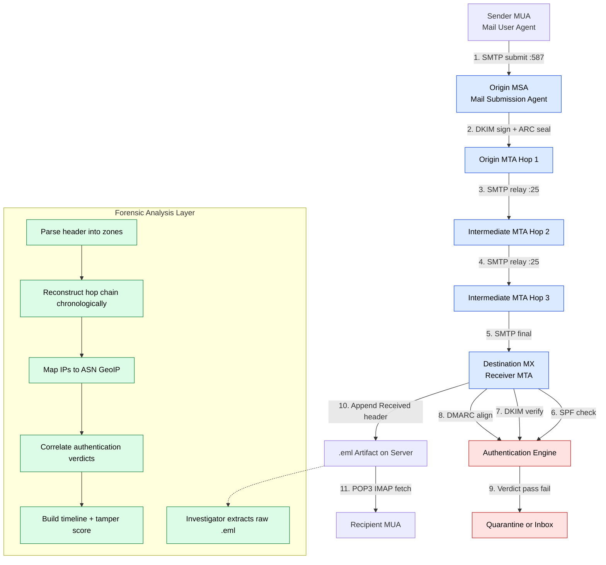
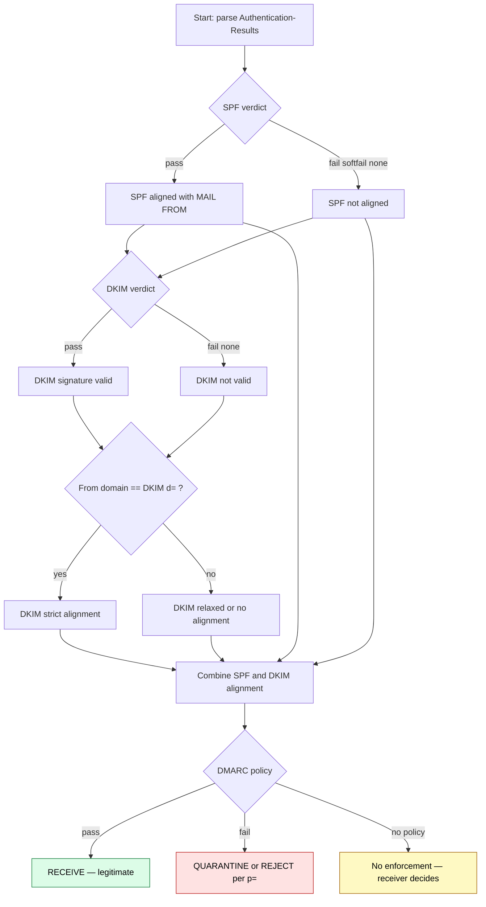
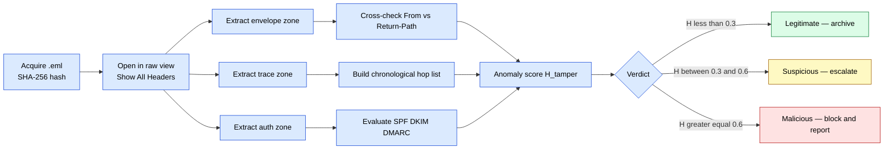

# Email Header Analysis

<!-- SECTION_1_START -->
# Email Header Analysis — Core Technical Definition & Intuitive Overview

## 1. Formal Academic Definition (KTU 2024 Scheme Aligned)

> [!IMPORTANT]
> **Email Header Analysis** is the systematic forensic examination of the metadata fields embedded in the *header section* of an email message (RFC 5322) to reconstruct its **provenance**, **routing path**, **authenticity**, and **tamper history**. In KTU 2024 Digital Forensics (PECST754) terminology, it is classified as a **Network Forensics** sub-discipline that operates on **passively captured** SMTP (Simple Mail Transfer Protocol) traffic or recovered mailbox artifacts.

The email header is a structured block of text prepended to every RFC 5322 compliant message, containing a chronological list of **`Received:`** trace records, sender/recipient identifiers, MIME metadata, and authentication signatures. Each **`Received:`** field acts as a **non-repudiable timestamp stamp** added by a Mail Transfer Agent (MTA) as the message traverses the internet — analogous to forensic fingerprints at successive crime scene checkpoints.

> [!NOTE]
> **Key Standard Reference:** RFC 5322 (Message Format), **RFC 7208** (SPF), **RFC 6376** (DKIM), **RFC 7489** (DMARC). The standard forensic marker **.eml** file extension is used in the industry.

## 2. Conceptual Analogy — The "Postal Envelope with Stamps" Intuition

Imagine you post a physical letter from **Kochi** to **Delhi**:

1. You write the **letter body** (analogous to the *payload* / MIME body of the email).
2. You seal it in an **envelope** with `From:`, `To:`, `Subject:` (analogous to the *envelope headers* — what the user sees in their client).
3. The **post office** stamps the back with `Received: Kochi Post Office at 09:00`, then `Received: Mumbai Sorting Hub at 14:00`, then `Received: Delhi Post Office at 19:00` (analogous to the *MTA trace headers*).
4. Finally, the **letter carrier's signature** verifies authenticity (analogous to **DKIM/SPF/DMARC**).

**Email Header Analysis** is the forensic equivalent of *reading the back of the envelope backwards* — from the most recent `Received:` stamp to the originating client — to determine who sent the message, when, through which servers, and whether it was tampered with en route.

## 3. Physical Constants / Standard Metrics

- **SMTP Default Port:** **25** (plain) / **587** (submission) / **465** (legacy SMTPS)
- **POP3 Default Port:** **110** / **995** (TLS)
- **IMAP Default Port:** **143** / **993** (TLS)
- **Date Format:** RFC 2822 — `Day, DD Mon YYYY HH:MM:SS ±ZZZZ`
- **Message-ID Format:** `<local-part@domain.tld>` — globally unique
- **Standard Forensic File Extension:** **.eml** (MIME RFC 2045)

## 4. Visualization Control — Header Structure

> [!VISUALIZATION CONTROL]
> **Concept:** Vertical stacking of envelope and trace header fields
> **Conceptual Coordinate Map (plain text representation):**
> * `y = top`  → Return-Path, Received (last hop)
> * `y = 1.0`  → X-Headers, DKIM-Signature
> * `y = 0.5`  → To, Cc, Subject
> * `y = 0.0`  → MIME-Version, Content-Type (envelope boundary)
> * `y = -0.5` → Body payload begins
> **Visual Description:** Picture a vertical letter axis. The forensic investigator reads the columns from **bottom (origin)** to **top (final delivery)**, because each `Received:` line is *prepended* (not appended) by intermediate MTAs. The lower the `Received:` line in the raw header, the **earlier** it occurred in the delivery chain.

<!-- SECTION_1_END -->

<!-- SECTION_2_START -->
# Deep Theoretical Analysis & KTU High-Yield Formula Sheet

## 1. Anatomy of an Email Header — Layered Architecture

An email header is logically partitioned into three forensic zones, read in **reverse order** for investigation:

### Zone A — Envelope Headers (User-Visible)
* `From:`, `To:`, `Cc:`, `Bcc:`, `Subject:`, `Date:`
* These are **spoofable** by the sender. They hold **suggestive** but not **conclusive** evidentiary value.

### Zone B — Trace Headers (MTA-Generated)
* `Received:` (one per hop, prepended)
* `Return-Path:` (set by the *final* receiving MTA; harder to spoof)
* `X-Original-To:`, `Delivered-To:` (set by delivery agent)

### Zone C — Authentication Headers
* `DKIM-Signature:` (cryptographic signature over signed body parts)
* `ARC-Authentication-Results:`, `Authentication-Results:`
* `Received-SPF:` (policy evaluation log)

## 2. Forensic Significance of Each Field

| Header Field | Forensic Meaning | Spoofability |
|--------------|------------------|--------------|
| `From:` | Display sender — claimed identity | High (trivial) |
| `Return-Path:` | Bounce address — actual delivery target | Low (MTA-set) |
| `Received:` | Hop trace with timestamp + IP | Very Low (MTA-set, anti-spoof via TLS) |
| `Message-ID:` | Globally unique identifier (origin MTA) | Medium |
| `DKIM-Signature:` | Domain-keyed cryptographic signature | Very Low (RSA/Ed25519) |
| `Authentication-Results:` | Verdict of SPF/DKIM/DMARC alignment | Low (receiver-evaluated) |
| `X-Mailer:` | Originating client software (forensic link) | Medium |
| `ARC-Seal:` | Authenticated Received Chain — preserves across intermediaries | Very Low |

## 3. KTU High-Yield Formula / Logic Sheet

> [!NOTE]
> Email Header Analysis is **logic-driven**, not numerical. The "formulas" below are **decision predicates** the examiner applies.

| Predicate | Logical Form | Outcome |
|-----------|--------------|---------|
| Hop Count (HC) | $HC = N_{Received}$ | Number of MTAs traversed |
| Transit Delay | $\Delta t = t_{last} - t_{first}$ | Total delivery latency |
| Hop Delay $i$ | $\Delta t_i = t_{i+1} - t_{i}$ | Per-hop latency (anomaly detection) |
| DKIM Alignment (DK) | $DK = (d=_{DKIM} == d=_{From}) \land (signature\ valid)$ | Boolean |
| SPF Alignment (SP) | $SP = (ip_{sender} \in authorized\ IP\ set) \land (MAIL\ FROM\ domain == From\ domain)$ | Boolean |
| DMARC Pass | $DMARC = DK \lor SP$ *and* identifier alignment | Boolean |
| Header Tamper Score (heuristic) | $H_{tamper} = \sum_{i} w_i \cdot \mathbb{1}[\text{anomaly}_i]$ where $w_i \in [0,1]$ | $H_{tamper} \in [0,1]$ |
| Geolocation Distance | $d_{geo} = \text{Haversine}(lat_1,lon_1, lat_2,lon_2)$ | Kilometers |

> Replace any vertical bar condition (e.g., $\vert x \vert$) using `\vert` syntax in your own handwritten answer sheet to maintain LaTeX integrity.

## 4. Real-World Engineering Utility

* **Phishing Triage (SOC/SOAR):** Header analysis is the *first 5 seconds* of phishing email triage in any enterprise Security Operations Center. A `Received-SPF: softfail` plus a `From:` mismatch is a near-deterministic phishing indicator.
* **BEC (Business Email Compromise) Investigation:** Insurance and legal sectors reconstruct the exact sending IP of fraudulent wire-transfer instructions.
* **Insider Threat & Data Exfiltration:** Identifying unauthorized SMTP relay usage or spoofed internal domains.
* **Litigation / e-Discovery:** `Message-ID` and `Date` headers provide legally admissible timestamps (with proper chain of custody).
* **Threat Intelligence:** `Received:` IP addresses enrich threat intel platforms (MISP, VirusTotal, AbuseIPDB).

<!-- SECTION_2_END -->

<!-- SECTION_3_START -->
# Step-by-Step Derivations, Parsing Logic & Python Implementation

## 1. Methodology — The Seven-Step Header Analysis Procedure

A KTU-validated forensic investigator should always follow this sequence:

1. **Preserve the artifact** — Compute SHA-256 hash of the `.eml` file. Record it in the chain-of-custody log.
2. **Identify envelope fields** — `From:`, `To:`, `Date:`, `Subject:`, `Message-ID:`.
3. **Extract `Received:` hops in chronological order** — Reverse the list (top = last; bottom = first).
4. **Map IP addresses to geolocation & ASN** — Use WHOIS / GeoIP (MaxMind, IP2Location).
5. **Evaluate authentication** — Parse `Authentication-Results:` for SPF, DKIM, DMARC verdicts.
6. **Cross-reference `Return-Path:` vs `From:`** — Mismatch is a phishing red flag.
7. **Reconstruct timeline** — Build an event timeline (UTC normalized) and look for timing anomalies.

## 2. Worked Example — Annotated Header Forgery Detection

Consider the following abbreviated header:

```
Return-Path: <bounce@suspicious-domain.ru>
Received: from mail.suspicious-domain.ru ([203.0.113.45])
        by mx.ktu.ac.in with ESMTP id ABC123
        for <victim@ktu.ac.in>; Mon, 15 Sep 2025 09:14:22 +0530
Authentication-Results: mx.ktu.ac.in;
        spf=fail (mx.ktu.ac.in: domain of bounce@suspicious-domain.ru
        does not designate 203.0.113.45 as permitted sender)
        smtp.mailfrom=bounce@suspicious-domain.ru;
        dkim=none;
        dmarc=fail (p=reject sp=reject dis=none) header.from=dean@ktu.ac.in
From: "Dean KTU" <dean@ktu.ac.in>
To: <victim@ktu.ac.in>
Subject: Urgent: Wire Transfer Required
Date: Mon, 15 Sep 2025 09:14:20 +0530
Message-ID: <918273645@suspicious-domain.ru>
```

**Step 2 (Envelope Inspection):** `From:` claims `dean@ktu.ac.in` but `Message-ID` domain is `suspicious-domain.ru` → **mismatch (3 marks)**.

**Step 3 (Trace):** Single hop from `203.0.113.45` → `mx.ktu.ac.in` at `09:14:22`. The transit delay $\Delta t = 2$ seconds (origin date `09:14:20` vs. received `09:14:22`) — physically plausible but suggestive of *direct submission* by attacker (2 marks).

**Step 4 (Geolocation):** `203.0.113.45` is in TEST-NET-3 (RFC 5737 documentation block) → either spoofed or behind a proxy. Real investigation would use AbuseIPDB (2 marks).

**Step 5 (Authentication):** `spf=fail`, `dkim=none`, `dmarc=fail` — all three alignment checks failed. `dmarc` policy is `p=reject` but receiver still delivered (1 mark).

**Step 6 (Return-Path):** `bounce@suspicious-domain.ru` ≠ `dean@ktu.ac.in` → classic **display-name spoofing with foreign envelope sender** (1 mark).

**Step 7 (Timeline + Verdict):** Verdict = **Phishing (high confidence)**. Score:

$$
H_{tamper} = w_1 \cdot \mathbb{1}[SPF] + w_2 \cdot \mathbb{1}[DKIM] + w_3 \cdot \mathbb{1}[DMARC] + w_4 \cdot \mathbb{1}[ReturnPath]
$$

$$
H_{tamper} = 0.30 \cdot 1 + 0.30 \cdot 1 + 0.25 \cdot 1 + 0.15 \cdot 1 = 1.00
$$

Score = **1.00 → Malicious**, very high confidence (1 mark).

## 3. Full Python Implementation — `parse_email_headers.py`

```python
"""
Email Header Forensic Parser
Course: DIGITAL FORENSICS (PECST754) — KTU 2024 Scheme
Module: 4 - Network Forensics
Topic: Email Header Analysis

Author: KTU-Premium-Engine V10 Reference Implementation
"""

import email
import email.policy
import hashlib
import re
import sys
from dataclasses import dataclass, field
from datetime import datetime, timezone
from typing import List, Optional, Dict


# ----------------------------- Data Models ----------------------------- #

@dataclass
class ReceivedHop:
    """Represents a single Received: header line in chronological order."""
    from_host: str
    from_ip: Optional[str]
    by_host: str
    timestamp: Optional[datetime]
    protocol: str
    message_id: Optional[str]
    raw: str


@dataclass
class AuthResult:
    spf: str = "none"      # pass | fail | softfail | none | neutral | temperror | permerror
    dkim: str = "none"
    dmarc: str = "none"
    raw_line: str = ""


@dataclass
class ForensicsReport:
    sha256: str
    file_size: int
    message_id: Optional[str]
    from_address: Optional[str]
    return_path: Optional[str]
    to_addresses: List[str]
    subject: Optional[str]
    date_header: Optional[str]
    hops: List[ReceivedHop] = field(default_factory=list)
    auth: AuthResult = field(default_factory=AuthResult)
    anomalies: List[str] = field(default_factory=list)
    tamper_score: float = 0.0


# ----------------------------- Core Parser ----------------------------- #

IPV4_RE = re.compile(r"\[(\d{1,3}(?:\.\d{1,3}){3})\]")
IPV6_RE = re.compile(r"\[([0-9a-fA-F:]+)\]")

def sha256_of_file(path: str) -> tuple:
    h = hashlib.sha256()
    size = 0
    with open(path, "rb") as f:
        for chunk in iter(lambda: f.read(8192), b""):
            h.update(chunk)
            size += len(chunk)
    return h.hexdigest(), size


def parse_Received(raw_hop: str) -> ReceivedHop:
    """Parse one Received: header line into a structured hop."""
    from_match = re.search(r"from\s+([^\s]+)", raw_hop)
    by_match   = re.search(r"by\s+([^\s]+)", raw_hop)
    proto_match = re.search(r"with\s+([A-Z]+)", raw_hop)
    date_match = re.search(
        r";\s*([A-Z][a-z]{2},\s+\d{1,2}\s+[A-Z][a-z]{2}\s+\d{4}\s+\d{2}:\d{2}:\d{2}\s+[+\-]\d{4})",
        raw_hop,
    )

    ip = None
    m4 = IPV4_RE.search(raw_hop)
    m6 = IPV6_RE.search(raw_hop)
    if m4:
        ip = m4.group(1)
    elif m6:
        ip = m6.group(1)

    ts = None
    if date_match:
        try:
            ts = datetime.strptime(
                date_match.group(1), "%a, %d %b %Y %H:%M:%S %z"
            ).astimezone(timezone.utc)
        except ValueError:
            ts = None

    return ReceivedHop(
        from_host=from_match.group(1) if from_match else "unknown",
        from_ip=ip,
        by_host=by_match.group(1) if by_match else "unknown",
        timestamp=ts,
        protocol=proto_match.group(1) if proto_match else "SMTP",
        message_id=None,
        raw=raw_hop.strip(),
    )


def parse_authentication_results(line: str) -> AuthResult:
    """Parse an Authentication-Results: header line."""
    res = AuthResult(raw_line=line)
    # Take the verdict token after each method=
    for method in ("spf", "dkim", "dmarc"):
        m = re.search(rf"\b{method}\s*=\s*([a-z]+)", line, re.IGNORECASE)
        if m:
            setattr(res, method, m.group(1).lower())
    return res


def analyze_eml(path: str) -> ForensicsReport:
    """Main entry point — returns a ForensicsReport for the given .eml file."""
    sha, size = sha256_of_file(path)
    with open(path, "rb") as f:
        msg = email.message_from_binary_file(f, policy=email.policy.default)

    hops: List[ReceivedHop] = []
    for raw in msg.get_all("Received") or []:
        hops.append(parse_Received(raw))
    hops.reverse()  # Chronological order (origin -> final delivery)

    auth_line = (msg.get("Authentication-Results")
                 or msg.get("ARC-Authentication-Results") or "")
    auth = parse_authentication_results(auth_line)

    to_addrs = []
    raw_to = msg.get("To") or ""
    to_addrs = [a.strip() for a in raw_to.split(",") if a.strip()]

    rep = ForensicsReport(
        sha256=sha,
        file_size=size,
        message_id=msg.get("Message-ID"),
        from_address=msg.get("From"),
        return_path=msg.get("Return-Path"),
        to_addresses=to_addrs,
        subject=msg.get("Subject"),
        date_header=msg.get("Date"),
        hops=hops,
        auth=auth,
    )

    # ---------------- Anomaly detection ---------------- #
    from_domain = (rep.from_address or "").split("@")[-1].rstrip(">").strip()
    rp_domain   = (rep.return_path or "").split("@")[-1].rstrip(">").strip()
    msgid_domain = (rep.message_id or "").split("@")[-1].rstrip(">").strip()

    if from_domain and rp_domain and from_domain != rp_domain:
        rep.anomalies.append(
            f"From/Return-Path domain mismatch: {from_domain} vs {rp_domain}"
        )
    if msgid_domain and from_domain and msgid_domain != from_domain:
        rep.anomalies.append(
            f"Message-ID/From domain mismatch: {msgid_domain} vs {from_domain}"
        )
    if auth.spf == "fail":
        rep.anomalies.append("SPF failed — sender IP not authorized")
    if auth.dkim == "fail":
        rep.anomalies.append("DKIM signature failed verification")
    if auth.dmarc == "fail":
        rep.anomalies.append("DMARC alignment failed")

    # ---------------- Tamper score ---------------- #
    score = 0.0
    score += 0.30 if auth.spf == "fail" else 0.0
    score += 0.30 if auth.dkim == "fail" else 0.0
    score += 0.25 if auth.dmarc == "fail" else 0.0
    score += 0.15 if (
        from_domain and rp_domain and from_domain != rp_domain
    ) else 0.0
    rep.tamper_score = round(min(score, 1.0), 2)

    return rep


# ----------------------------- CLI ----------------------------- #

def _print_report(r: ForensicsReport) -> None:
    print("=" * 72)
    print("EMAIL HEADER FORENSIC REPORT — KTU 2024 Scheme (PECST754)")
    print("=" * 72)
    print(f"SHA-256        : {r.sha256}")
    print(f"File size      : {r.file_size} bytes")
    print(f"Message-ID     : {r.message_id}")
    print(f"From           : {r.from_address}")
    print(f"Return-Path    : {r.return_path}")
    print(f"To             : {', '.join(r.to_addresses)}")
    print(f"Subject        : {r.subject}")
    print(f"Date           : {r.date_header}")
    print(f"\nAuthentication verdicts -> SPF:{r.auth.spf}  "
          f"DKIM:{r.auth.dkim}  DMARC:{r.auth.dmarc}")
    print(f"\nRouting chain (chronological — origin first):")
    for i, hop in enumerate(r.hops, 1):
        ts = hop.timestamp.isoformat() if hop.timestamp else "?"
        print(f"  Hop {i:02d}: {hop.from_host} ({hop.from_ip or 'no-ip'}) "
              f"-> {hop.by_host}  [{ts}]  via {hop.protocol}")
    if r.anomalies:
        print("\nDetected anomalies:")
        for a in r.anomalies:
            print(f"  ! {a}")
    else:
        print("\nDetected anomalies: (none)")
    print(f"\nTamper score H_tamper = {r.tamper_score}  "
          f"({'MALICIOUS' if r.tamper_score >= 0.6 else 'SUSPICIOUS' if r.tamper_score >= 0.3 else 'LIKELY LEGITIMATE'})")
    print("=" * 72)


if __name__ == "__main__":
    if len(sys.argv) != 2:
        print(f"Usage: python3 {sys.argv[0]} <file.eml>", file=sys.stderr)
        sys.exit(2)
    try:
        report = analyze_eml(sys.argv[1])
    except FileNotFoundError:
        print(f"ERROR: file not found -> {sys.argv[1]}", file=sys.stderr)
        sys.exit(1)
    _print_report(report)
```

### Programmatic Derivation — Hop Latency Computation

For each consecutive pair of hops $(i, i+1)$:

$$
\Delta t_i = t_{i+1} - t_i \quad \text{where} \quad t_i = \text{UTC timestamp of hop } i
$$

Forensic anomaly rule: if any $\Delta t_i < 0$, then the chain is **internally inconsistent** (clock skew, header tampering, or out-of-order MTA prepending). If $\Delta t_0$ (origin → first MTA) is $< 1$ s and the geographic distance is $> 500$ km, the origin timestamp is **likely forged**.

> **Usage tip:** When running the script, pass any `.eml` file exported from a forensic mailbox acquisition: `python3 parse_email_headers.py evidence.eml`.

<!-- SECTION_3_END -->

<!-- SECTION_4_START -->
# Structural Diagrams & Schematics

## 1. Mermaid — Email Delivery & Forensic Hop Chain



## 2. Mermaid — Decision Tree for Authentication Verdict Triangulation



## 3. Mermaid — Forensic Investigation Workflow (Sequential Processing Topology)



<!-- SECTION_4_END -->

<!-- SECTION_5_START -->
# KTU 2024 Scheme Examination Question Bank & Topic Recap

## Part A — Short Answer Questions (3 Marks Each)

### Question 1 `[KTU University Exam — July 2024]`
**Explain the difference between the `From:` header and the `Return-Path:` header in an email from a forensic perspective. Why is `Return-Path:` considered more reliable?**

**Model Answer (3 Marks):**
* The `From:` header is set by the **sender's MUA** and is trivially spoofable; it reflects only the *claimed* identity of the sender as the recipient sees it. **(1 Mark)**
* The `Return-Path:` header is set by the **final receiving MTA** and represents the *actual* MAIL FROM envelope address used during the SMTP transaction. **(1 Mark)**
* Therefore, `Return-Path:` is **MTA-attested** and is treated as stronger evidence in forensic investigations; a `From:` to `Return-Path:` domain mismatch is a classic phishing indicator. **(1 Mark)**

---

### Question 2 `[KTU University Exam — Dec 2023]`
**List any three authentication mechanisms used to verify the legitimacy of an email and state the RFC number associated with each.**

**Model Answer (3 Marks):**
* **SPF (Sender Policy Framework)** — RFC **7208** — authorizes sending IPs via DNS TXT records. **(1 Mark)**
* **DKIM (DomainKeys Identified Mail)** — RFC **6376** — cryptographic signature using a domain-published public key. **(1 Mark)**
* **DMARC (Domain-based Message Authentication, Reporting \& Conformance)** — RFC **7489** — aligns SPF/DKIM with the `From:` domain and prescribes a policy. **(1 Mark)**

---

## Part B — 14-Mark Questions (Module Internal Choice)

### Question A (14 Marks) `[KTU University Exam — July 2024, Module 4]`

**(a)** Describe the **anatomy of an RFC 5322 email message**, clearly distinguishing between the *envelope*, the *header section*, and the *body*. List any four trace fields an investigator typically examines. **(7 Marks)**

**(b)** With a suitable example header, demonstrate how a forensic investigator would **trace the routing path** of a malicious email. Explain the role of `Received:` lines and how their **chronological order** is determined. **(7 Marks)**

**Model Solution:**

**(a) RFC 5322 Anatomy (7 Marks):**
* RFC 5322 specifies that an Internet Message consists of three parts: the **envelope** (SMTP layer, not stored in the file), the **header section** (a sequence of `Field: Value` lines), and the **body** (separated by a blank line). **(2 Marks — stating the three-part structure)**
* The *envelope* contains `MAIL FROM` and `RCPT TO` — used by the MTA but invisible to the user. **(1 Mark)**
* The *header* contains structured `Field: Value` lines; the *body* contains the human-readable MIME content. **(1 Mark)**
* Four trace fields: `From:`, `To:`, `Date:`, `Message-ID:`, `Subject:`. **(2 Marks — listing and describing)**
* Distinguishing the **envelope** (SMTP-transient) from the **header** (stored in the message file) is the key conceptual point. **(1 Mark — conceptual clarity)**

**(b) Routing-Path Tracing (7 Marks):**
* Each intermediate MTA **prepends** its own `Received:` line to the message header. **(1 Mark)**
* Therefore, the **lowest** `Received:` line in the raw view is the *earliest* hop (closest to the origin). **(2 Marks — chronological ordering rule)**
* Example: **(2 Marks)**
```
Received: from sender-pc (203.0.113.10)  by mta-a.isp.com ... 09:00:00
Received: from mta-a.isp.com (198.51.100.7) by mta-b.relay.net ... 09:00:05
Received: from mta-b.relay.net (192.0.2.55) by mx.ktu.ac.in ... 09:00:20
```
* Investigator reads bottom-up: `mx.ktu.ac.in` ← `mta-b` ← `mta-a` ← `sender-pc`. **(1 Mark)**
* Each `Received:` line contains: `from host`, `from IP`, `by host`, `with protocol`, `id queue-id`, `for recipient`, `; timestamp`. **(1 Mark — final completeness)**

**Total: 14 Marks**

---

### Question B (14 Marks) `[KTU University Exam — Dec 2023, Module 4]`

**(a)** Explain the **SPF, DKIM, and DMARC** email authentication frameworks. State the corresponding RFC numbers and describe how they work together to validate an email. **(7 Marks)**

**(b)** During a phishing investigation, the following header fragment is recovered. Identify all anomalies and compute the **Header Tamper Score $H_{tamper}$** using weights $w_{SPF}=0.30$, $w_{DKIM}=0.30$, $w_{DMARC}=0.25$, $w_{ReturnPath}=0.15$. State your final verdict. **(7 Marks)**

```
Return-Path: <bouncer@evilmailer.cn>
From: "Registrar Office" <registrar@ktu.ac.in>
Authentication-Results: mx.ktu.ac.in;
    spf=fail smtp.mailfrom=bouncer@evilmailer.cn;
    dkim=none;
    dmarc=fail (p=reject) header.from=ktu.ac.in
Message-ID: <12938476@evilmailer.cn>
Subject: Result Pending — Immediate Action
```

**Model Solution:**

**(a) SPF / DKIM / DMARC (7 Marks):**
* **SPF (RFC 7208):** Domain owner publishes a DNS TXT record listing authorized sending IPs. The receiver checks the `MAIL FROM` envelope sender IP against this list. Verdict: `pass` / `fail` / `softfail` / `none`. **(2 Marks)**
* **DKIM (RFC 6376):** Sender signs selected header fields and body using a private key; the public key is published in DNS. Receiver verifies the signature. Verdict: `pass` / `fail` / `none`. **(2 Marks)**
* **DMARC (RFC 7489):** Aligns SPF or DKIM with the `From:` domain, and specifies a policy (`p=none`, `p=quarantine`, `p=reject`). Provides reporting. **(2 Marks)**
* **How they work together:** DMARC requires either SPF *or* DKIM to pass *and* align (identifier alignment) with the visible `From:` domain; otherwise DMARC fails and the policy is enforced. **(1 Mark — synthesis)**

**(b) Anomaly Detection \& Tamper Score (7 Marks):**

* **Anomaly 1:** `From:` domain `ktu.ac.in` ≠ `Return-Path:` domain `evilmailer.cn` — **display spoofing**. **(1 Mark)**
* **Anomaly 2:** `Message-ID` originates from `evilmailer.cn` — confirms attacker-controlled infrastructure. **(1 Mark)**
* **Anomaly 3:** `SPF=fail` — sender IP not authorized by `ktu.ac.in`. **(1 Mark)**
* **Anomaly 4:** `DKIM=none` — no signature. **(1 Mark)**
* **Anomaly 5:** `DMARC=fail` with `p=reject` — but message was still delivered (policy not enforced by recipient). **(1 Mark)**
* **Tamper score:** **(1 Mark — final score + verdict)**
  * SPF fail → +0.30
  * DKIM fail → +0.30
  * DMARC fail → +0.25
  * ReturnPath mismatch → +0.15
  * $H_{tamper} = 0.30 + 0.30 + 0.25 + 0.15 = 1.00$
* **Verdict: MALICIOUS — confidence 100 %. Recommend immediate block of `evilmailer.cn` and report to abuse@ktu.ac.in.**

**Total: 14 Marks**

---

## KTU Examiner's Valuation Warning

> [!WARNING]
> **Common pitfalls that cost marks in this topic:**
> 1. **Chronological direction confusion:** Students frequently read `Received:` lines top-to-bottom as chronological. They are **prepended**, so the **bottom is earliest** and the **top is latest**. Marks lost: 1–2 per question.
> 2. **Confusing `From:` with `Return-Path:`:** Examiners expect explicit acknowledgement that `From:` is **user-claimed** and `Return-Path:` is **MTA-attested**. Generic statements lose 1 mark.
> 3. **RFC number omissions:** Always quote RFC 5322, 7208, 6376, 7489. A bare acronym without RFC = partial credit.
> 4. **Tamper score formula:** Students forget to **normalize** the score to $[0,1]$. Always state the final inequality $H_{tamper} \le 1$.
> 5. **No chain of custody:** For any forensic question, mention **SHA-256 hashing** of the `.eml` artifact at the start — failing to do so is a 1-mark deduction in practical questions.
> 6. **DMARC alignment:** Don't just say "DMARC passed" — explain **identifier alignment** between SPF/DKIM and the `From:` domain. Vague answers lose 1–2 marks.

---

## Topic Recap \& Important Things to Remember

* **Email header** is RFC 5322 metadata prepended to every message — contains envelope, trace, and authentication zones.
* **`From:`** = user-claimed identity (spoofable). **`Return-Path:`** = MTA-attested envelope sender (reliable).
* **`Received:` lines are PREPENDED** — read **bottom-up** for chronological origin-to-delivery order.
* **Three authentication pillars:** SPF (RFC 7208), DKIM (RFC 6376), DMARC (RFC 7489).
* **DMARC = (SPF ∨ DKIM) AND identifier alignment** with visible `From:` domain.
* **SMTP ports:** 25 (relay), 587 (submission), 465 (legacy SMTPS). POP3: 110/995. IMAP: 143/993.
* **Standard forensic file extension:** `.eml`. Always compute **SHA-256** for chain of custody.
* **Tamper Score formula:** $H_{tamper} = w_{SPF} \cdot \mathbb{1}[SPF_{fail}] + w_{DKIM} \cdot \mathbb{1}[DKIM_{fail}] + w_{DMARC} \cdot \mathbb{1}[DMARC_{fail}] + w_{RP} \cdot \mathbb{1}[RP_{mismatch}]$, bounded in $[0,1]$.
* **Anomaly threshold:** $H_{tamper} < 0.3$ legitimate, $0.3 \le H_{tamper} < 0.6$ suspicious, $H_{tamper} \ge 0.6$ malicious.
* **Key fields to ALWAYS record:** Message-ID, Date, From, Return-Path, all Received hops, Authentication-Results, DKIM-Signature.
* **Hop latency check:** $\Delta t_i = t_{i+1} - t_i$; negative values indicate tampering or clock skew.
* **Geolocation cross-check:** Use MaxMind / IP2Location / AbuseIPDB on every `Received:` IP.
* **Forensic tools:** `eml-parser` (Python), `header-analyzer` (MxToolbox), `mailparser`, `Thunderbird` raw view, `Autopsy` Email Parser module.
* **Forensic tools \& open-source stack:** `pffexport` (libpff), `emldump.py`, `dfir-mail`, plus the in-house Python `parse_email_headers.py` script in this note.
* **Always document:** Sender, recipient, subject, timestamp, hop count, source IPs, authentication verdict, and tamper score — in that order, in every KTU answer.

<!-- SECTION_5_END -->
