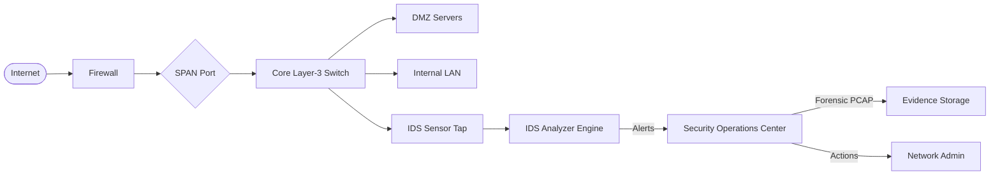
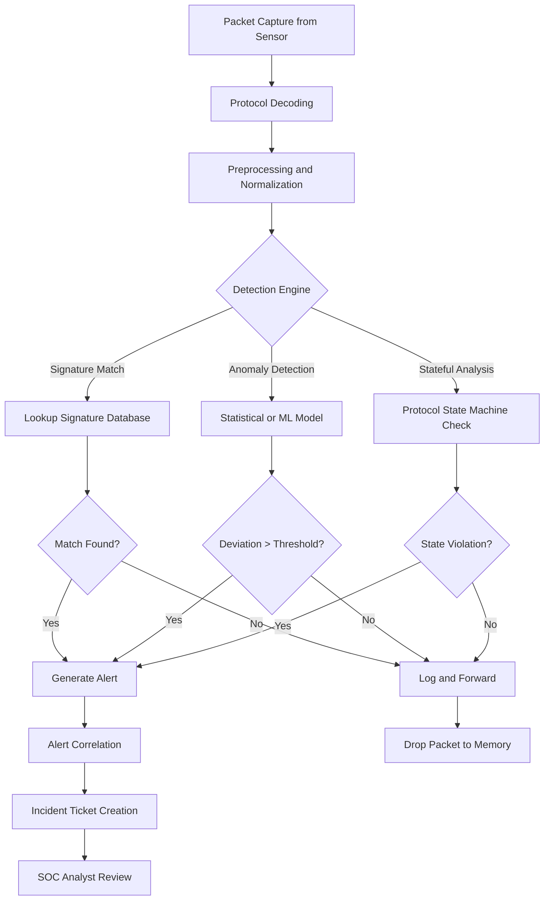
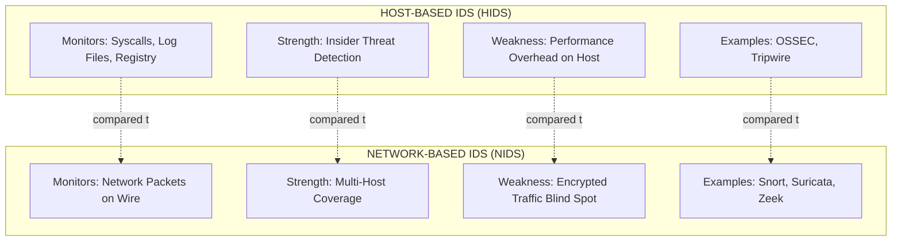
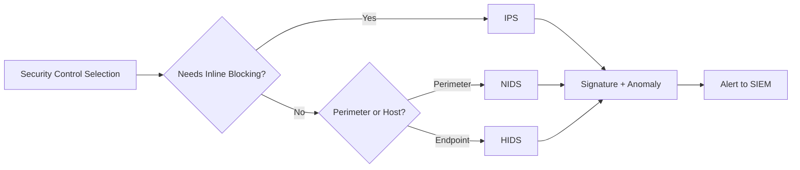
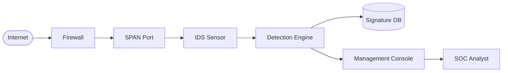

# Endpoint Security systems - Intrusion Detection Systems

<!-- SECTION_1_START -->
# Module 4: Network Forensics — Endpoint Security Systems

## 1. Intrusion Detection Systems (IDS)

### 1.1 Formal KTU Definition

> [!NOTE]
> **Intrusion Detection System (IDS):** A security control mechanism — hardware or software-based — that monitors network traffic, system logs, and host activities to identify malicious actions, policy violations, or unauthorized access attempts, and generates alerts for the security operations team without actively blocking the traffic.

In the context of the **PECST754 – Digital Forensics (KTU 2024 Scheme)** syllabus, an IDS is classified as a **detective security control** (as opposed to a *preventive* control like a firewall). It operates on the **CIA Triad** principle by detecting breaches of **Confidentiality**, **Integrity**, and **Availability** in real-time or near-real-time.

| Security Control Type | Function | Example |
|---|---|---|
| Preventive | Stops attacks before they occur | Firewall, ACL |
| Detective | Identifies attacks in progress or after the fact | **IDS**, Log Analysis |
| Corrective | Mitigates damage post-attack | Backup Restoration |
| Deterrent | Discourages attackers | Warning Banners |

### 1.2 Conceptual Analogy / Intuition

Imagine your home is a computer network. A **firewall** is like a strong front door with a peephole — it decides *who can enter*. An **IDS** is like a **CCTV surveillance system** that records every movement inside the house, compares it against a criminal database, and raises an alarm if a burglar pattern is detected. The CCTV does not stop the burglar, but it **detects, records, and reports** the intrusion — which is exactly the role of an IDS in a digital environment.

A more technical analogy: Consider an IDS as a **network lie detector**. It scrutinizes the *packets' fingerprints* (headers, payloads, behavioral patterns) against known signatures or learned baseline behavior. When a deviation is statistically significant, it triggers an alert.

> [!IMPORTANT]
> **KTU Board Emphasis:** A common mistake students make is conflating IDS with IPS (Intrusion Prevention System). The KTU examiner specifically tests the difference:
> - **IDS** = *Detects* and *alerts* (passive).
> - **IPS** = *Detects*, *alerts*, AND *blocks/drops* malicious traffic (inline/active).

### 1.3 Standard Metrics & Constants

> [!IMPORTANT]
> **Bolded Key Performance Metrics for IDS:**
> - **True Positive (TP):** Legitimate attack correctly flagged as attack.
> - **True Negative (TN):** Legitimate traffic correctly passed as normal.
> - **False Positive (FP):** Legitimate traffic incorrectly flagged as attack (Type I Error).
> - **False Negative (FN):** Actual attack incorrectly passed as normal (Type II Error).
> - **Detection Rate (DR) = TP / (TP + FN)**
> - **False Alarm Rate (FAR) = FP / (FP + TN)**
> - **Accuracy = (TP + TN) / (TP + TN + FP + FN)**

### 1.4 GeoGebra / Desmos Integration

> [!VISUALIZATION CONTROL]
> **Concept:** ROC Curve visualization for IDS trade-off (Detection Rate vs. False Alarm Rate)
> **Desmos Input Equations:**
> * `x = 0.0` to `x = 1.0` (False Alarm Rate axis)
> * `y = x` (Random Classifier diagonal)
> * `y = 1 - (1-x)^2` (Ideal IDS curve bending toward top-left)
> * Point coordinates for various threshold settings: `(0.1, 0.55)`, `(0.2, 0.78)`, `(0.3, 0.91)`
> **Visual Description:** The student should observe how the curve bows toward the **top-left corner** (high detection, low false alarm) representing an ideal IDS. The **diagonal line** represents a random classifier. The **Area Under Curve (AUC)** measures IDS quality — closer to **1.0** is better.

---

<!-- SECTION_1_END -->

<!-- SECTION_2_START -->
## 2. Deep Theoretical Analysis & KTU High-Yield Formula Sheet

### 2.1 Anatomy of an IDS — Core Components

A production-grade IDS consists of three logical components that interact continuously:

1. **Sensors (Data Collection Layer):**
   * Deployed at strategic network chokepoints (gateway, DMZ, server farm).
   * Tap into mirrored SPAN ports or use TAP (Test Access Point) hardware.
   * Capture packet headers, payloads, log files, and system calls.

2. **Analyzers (Detection Engine Layer):**
   * The "brain" — applies detection algorithms to sensor data.
   * Maintains signature databases, statistical baselines, or ML models.
   * Generates alerts and severity scores.

3. **Management Console (User Interface Layer):**
   * Centralized dashboard for SOC analysts.
   * Configures sensors, tunes rules, manages alerts.
   * Generates reports for compliance (PCI-DSS, ISO 27001).

> [!NOTE]
> **Why three components?** Separation of concerns allows distributed deployment. Sensors can be on remote network edges while the analyzer and console sit in a central SOC (Security Operations Center) — this is the architecture of enterprise tools like **Splunk Enterprise Security** and **IBM QRadar**.

### 2.2 Classification of IDS

#### 2.2.1 By Source of Data

| Type | Full Form | Monitors | Placement | Examples |
|---|---|---|---|---|
| **NIDS** | Network-based IDS | Network traffic flows | At network perimeter or chokepoints | Snort, Suricata, Zeek |
| **HIDS** | Host-based IDS | Single host logs, syscalls, file integrity | On individual endpoints/servers | OSSEC, Tripwire, AIDE |
| **Hybrid IDS** | Distributed IDS | Both network and host telemetry | Distributed sensor network | Prelude SIEM, Wazuh |

#### 2.2.2 By Detection Methodology

1. **Signature-Based Detection (Misuse Detection):**
   * Compares traffic against a **database of known attack patterns** (signatures).
   * Uses pattern matching algorithms: **Aho-Corasick**, **Boyer-Moore**, **Regular Expressions**.
   * **Pros:** High accuracy for known attacks, low FP.
   * **Cons:** Cannot detect **zero-day attacks**.
   * Example rule format (Snort-style): `alert tcp any any -> 192.168.1.0/24 80 (msg:"SQL Injection Attempt"; content:"%27 OR 1=1--"; sid:1000001;)`

2. **Anomaly-Based Detection:**
   * Establishes a **baseline** of normal behavior and flags deviations.
   * Techniques: **Statistical analysis**, **Machine Learning (SVM, Random Forest, LSTM)**, **Clustering**.
   * **Pros:** Can detect zero-day attacks.
   * **Cons:** Higher false positive rate.
   * Algorithm: If `P(current_behavior) < threshold`, then `ALERT`.

3. **Stateful Protocol Analysis:**
   * Understands protocol state machines (e.g., TCP handshake, DNS resolution).
   * Detects sequences that violate protocol specifications.
   * Detects attacks like **TCP SYN flood**, **DNS tunneling**, **SMB session hijacking**.

4. **Hybrid Detection:**
   * Combines multiple methods (signature + anomaly) for robust detection.
   * Used in modern **Next-Generation IDS (NGIDS)** like **Cisco Firepower**.

### 2.3 KTU High-Yield Formula Sheet

| Formula / Concept | Expression | Application in IDS |
|---|---|---|
| Bayes' Theorem | $P(A \mid B) = \dfrac{P(B \mid A) \cdot P(A)}{P(B)}$ | Computing probability of attack given observed traffic features |
| Shannon Entropy | $H(X) = -\sum_{i=1}^{n} P(x_i) \log_2 P(x_i)$ | Detecting encrypted C2 traffic or data exfiltration anomalies |
| Z-Score Anomaly | $Z = \dfrac{x - \mu}{\sigma}$ | Flagging packets with byte sizes >3 standard deviations from mean |
| Information Gain | $IG(S, A) = H(S) - H(S \mid A)$ | Feature selection in ML-based IDS |
| Detection Rate | $DR = \dfrac{TP}{TP + FN}$ | IDS effectiveness measure |
| False Alarm Rate | $FAR = \dfrac{FP}{FP + TN}$ | IDS reliability measure |
| ROC-AUC | $\int_{0}^{1} TPR(FPR) \, d(FPR)$ | Overall classifier performance |
| Snort Rule Keyword | `content:"<bytes>"; offset:<n>; depth:<n>;` | Pattern matching in signatures |
| PCAP Filter | `tcp.flags.syn == 1 && tcp.flags.ack == 0` | Identifying SYN scan patterns |
| Window Size Anomaly | $\Delta W = W_{observed} - W_{expected}$ | OS fingerprinting / port scan detection |

> [!IMPORTANT]
> **Critical Pitfall:** Never confuse $\vert x \vert$ notation in tables. Use `\vert x \vert` in LaTeX to preserve markdown table integrity when the absolute value is needed.

### 2.4 Real-World Engineering Utility

IDS technology is foundational in:
- **SOC Operations:** 24/7 monitoring in enterprise Security Operations Centers.
- **Cloud Security:** AWS GuardDuty, Azure Sentinel, Google Chronicle (cloud-native IDS).
- **OT/ICS Security:** Detecting SCADA anomalies in power grids and manufacturing.
- **Compliance:** Mandated by **PCI-DSS Requirement 11.4**, **HIPAA**, and **NIST SP 800-94**.
- **Forensic Investigation:** IDS logs provide timeline evidence for **incident response** and **chain-of-custody** documentation in court.

---

<!-- SECTION_2_END -->

<!-- SECTION_3_START -->
## 3. Step-by-Step Derivations & Implementation

### 3.1 Mathematical Derivation: Bayesian IDS Decision Rule

A common anomaly-based IDS uses Bayes' theorem to compute the posterior probability of an intrusion. The decision boundary is derived as follows:

**Step 1 — Prior Definition:**

Let $A$ = event of an attack, $N$ = event of normal traffic, and $O$ = observed traffic features.

$$P(A) + P(N) = 1$$

**Step 2 — Likelihood of Observation:**

We are given $P(O \mid A)$ and $P(O \mid N)$ from historical labeled training data.

**Step 3 — Apply Bayes' Theorem:**

$$P(A \mid O) = \frac{P(O \mid A) \cdot P(A)}{P(O \mid A) \cdot P(A) + P(O \mid N) \cdot P(N)}$$

**Step 4 — Decision Rule:**

The IDS triggers an alert if:

$$P(A \mid O) > \tau$$

where $\tau$ is the threshold (typically **0.5** for equal cost, but tuned in production).

**Step 5 — Log-Odds Form (numerically stable):**

$$\log\left(\frac{P(A \mid O)}{P(N \mid O)}\right) = \log\left(\frac{P(O \mid A)}{P(O \mid N)}\right) + \log\left(\frac{P(A)}{P(N)}\right)$$

The first term is the **log-likelihood ratio** (LLR) of evidence, and the second is the **log-prior** of attack occurrence. This form is preferred because it avoids floating-point underflow when probabilities are very small.

**Step 6 — Worked Example:**

Given:
- $P(A) = 0.01$ (1% prior attack rate)
- $P(N) = 0.99$
- $P(O \mid A) = 0.9$ (attack traffic looks malicious 90% of the time)
- $P(O \mid N) = 0.05$ (false alarm rate 5%)

Compute:

$$P(A \mid O) = \frac{0.9 \times 0.01}{(0.9 \times 0.01) + (0.05 \times 0.99)}$$

$$P(A \mid O) = \frac{0.009}{0.009 + 0.0495} = \frac{0.009}{0.0585} \approx 0.1538$$

Since $0.1538 < 0.5$, **the IDS does NOT alert** at default threshold. The threshold must be tuned lower (e.g., $\tau = 0.10$) to catch this attack in high-security contexts.

### 3.2 Symbolic Implementation: Anomaly Detection with Z-Score

A production-quality Python implementation for statistical anomaly detection on packet sizes:

```python
import logging
import statistics
from collections import deque
from dataclasses import dataclass
from typing import Optional, Tuple

# Configure forensic-grade logging
logging.basicConfig(
    level=logging.INFO,
    format="%(asctime)s [%(levelname)s] %(message)s",
    handlers=[
        logging.FileHandler("ids_alerts.log", mode="a"),
        logging.StreamHandler()
    ]
)
logger = logging.getLogger("STAT_IDS")


@dataclass(frozen=True)
class AlertEvent:
    """Immutable alert record for chain-of-custody compliance."""
    timestamp: float
    source_ip: str
    packet_size: int
    z_score: float
    severity: str


class StatisticalIDS:
    """
    Z-Score based Network Anomaly Detector.
    Maintains a sliding window of packet sizes per source IP
    and flags deviations exceeding the configured threshold.
    """

    def __init__(self, window_size: int = 100, z_threshold: float = 3.0) -> None:
        if window_size < 10:
            raise ValueError("window_size must be >= 10 for statistical stability")
        if z_threshold <= 0:
            raise ValueError("z_threshold must be positive")
        self._window_size: int = window_size
        self._z_threshold: float = z_threshold
        self._baselines: dict[str, deque[int]] = {}

    def _get_baseline(self, source_ip: str) -> deque[int]:
        if source_ip not in self._baselines:
            self._baselines[source_ip] = deque(maxlen=self._window_size)
        return self._baselines[source_ip]

    def analyze(self, source_ip: str, packet_size: int) -> Optional[AlertEvent]:
        """
        Feed a packet observation; returns AlertEvent if anomalous.
        """
        # Absolute boundary checks
        if not isinstance(source_ip, str) or not source_ip:
            raise TypeError("source_ip must be a non-empty string")
        if packet_size < 0 or packet_size > 65535:
            raise ValueError(f"packet_size out of valid range: {packet_size}")

        baseline = self._get_baseline(source_ip)

        # Need minimum samples for statistical validity
        if len(baseline) < 30:
            baseline.append(packet_size)
            return None

        try:
            mean = statistics.mean(baseline)
            stdev = statistics.stdev(baseline)
        except statistics.StatisticsError as e:
            logger.error("Statistical computation failed for %s: %s", source_ip, e)
            return None

        # Avoid division by zero on uniform traffic
        if stdev == 0:
            baseline.append(packet_size)
            return None

        z_score: float = (packet_size - mean) / stdev
        baseline.append(packet_size)

        # Determine severity bucket
        if abs(z_score) >= self._z_threshold * 2:
            severity: str = "CRITICAL"
        elif abs(z_score) >= self._z_threshold:
            severity = "WARNING"
        else:
            return None

        alert = AlertEvent(
            timestamp=__import__("time").time(),
            source_ip=source_ip,
            packet_size=packet_size,
            z_score=round(z_score, 4),
            severity=severity
        )

        logger.warning(
            "IDS ALERT [%s] from %s | size=%d | z=%.4f",
            alert.severity, alert.source_ip, alert.packet_size, alert.z_score
        )
        return alert


def simulate_traffic() -> None:
    """Simulate 200 packets with 2 anomalous bursts."""
    import random
    import time

    ids = StatisticalIDS(window_size=50, z_threshold=2.5)
    src = "192.168.1.105"

    # Phase 1: Normal traffic
    for _ in range(80):
        ids.analyze(src, random.randint(60, 200))

    # Phase 2: Anomalous burst (possible exfiltration / scan)
    for _ in range(10):
        ids.analyze(src, 1400)

    # Phase 3: Return to normal
    for _ in range(80):
        ids.analyze(src, random.randint(60, 200))


if __name__ == "__main__":
    simulate_traffic()
```

### 3.3 Signature-Based Rule Construction (Snort Syntax)

For a KTU 14-mark question requiring full Snort rule breakdown, here is the complete structural derivation:

**Scenario:** Detect SQL Injection attempt targeting a web server.

**Rule:**

```
alert tcp $EXTERNAL_NET any -> $HTTP_SERVERS 80 (
    msg:"SQL Injection - UNION SELECT attempt";
    flow:to_server,established;
    content:"UNION"; nocase;
    content:"SELECT"; nocase; distance:0;
    pcre:"/UNION\s+SELECT\s+\w+/i";
    classtype:web-application-attack;
    sid:1000001; rev:2;
)
```

**Step-by-Step Field Semantics:**

| Field | Value | Meaning |
|---|---|---|
| Action | `alert` | Generate alert + log (not drop) |
| Protocol | `tcp` | Match TCP packets only |
| Source | `$EXTERNAL_NET any` | Any external IP, any port |
| Direction | `->` | Inbound to server |
| Destination | `$HTTP_SERVERS 80` | Web server on port 80 |
| `msg` | SQL Injection... | Human-readable alert message |
| `flow` | `to_server,established` | Match only established sessions to server |
| `content` | "UNION" | Pattern match the literal string "UNION" |
| `nocase` | — | Case-insensitive matching |
| `pcre` | `/UNION\s+SELECT\s+\w+/i` | Perl-Compatible Regex for advanced pattern |
| `classtype` | web-application-attack | Maps to severity in Snort config |
| `sid` | 1000001 | Unique Snort rule ID (>1,000,000 for local rules) |
| `rev` | 2 | Rule revision number |

### 3.4 Hardware/Tool Profile (for Lab Implementation)

| Component | Specification | Purpose |
|---|---|---|
| Network Tap | Cisco Tap Aggregation, 1 Gbps | Mirroring live traffic for sensor |
| Sensor Host | Linux (Ubuntu 22.04 LTS), 8GB RAM, 500GB SSD | Running Suricata / Snort |
| Storage | NFS mount, 2TB+ | PCAP archival for forensics |
| Time Sync | NTP server (chrony) | Accurate timestamp correlation |
| Tool 1 | **Suricata 7.x** | Multi-threaded NIDS engine |
| Tool 2 | **Wireshark 4.x** | PCAP analysis GUI |
| Tool 3 | **ELK Stack (Elasticsearch + Kibana)** | Alert visualization dashboard |
| Network Position | Inline behind firewall, before core switch | Maximum visibility |

---

<!-- SECTION_3_END -->

<!-- SECTION_4_START -->
## 4. Structural Diagrams & Schematics

### 4.1 IDS Placement Architecture in Enterprise Network



> [!NOTE]
> **Architectural Note:** The IDS is placed in **out-of-band** mode (passive monitoring). It receives mirrored traffic via **SPAN port** but does NOT sit inline. For active blocking, the device becomes an **IPS** placed inline between the firewall and core switch.

### 4.2 IDS Detection Process Flow



### 4.3 HIDS vs NIDS Comparison Matrix



### 4.4 IDS vs IPS vs Firewall Decision Matrix



---

<!-- SECTION_4_END -->

<!-- SECTION_5_START -->
## 5. KTU 2024 Scheme Examination Question Bank & Topic Recap

### Part A — Short Answer Questions (3 Marks Each)

---

**Q1. [KTU University Exam — July 2024]**
*Define Intrusion Detection System. Differentiate between HIDS and NIDS with examples. (CO1, Remember)*

**Model Answer:**

An **Intrusion Detection System (IDS)** is a security control mechanism that monitors network or host activities for malicious actions, policy violations, or unauthorized access attempts and generates alerts without actively blocking the traffic.

| Parameter | HIDS | NIDS |
|---|---|---|
| Monitored Source | Single host logs, syscalls, file integrity | Network packet streams |
| Deployment | Installed on individual endpoints | At network chokepoints (SPAN port) |
| Visibility | Internal host behavior, encrypted local data | Cross-host network flows |
| Performance Impact | Adds load to host CPU | Negligible to monitored hosts |
| Encrypted Traffic | Can inspect post-decryption | Blind to encrypted payloads |
| Examples | OSSEC, Tripwire, AIDE | Snort, Suricata, Zeek |

**[Valuation Key: Definition: 1 Mark, Tabular differentiation: 2 Marks]**

---

**Q2. [KTU University Exam — Dec 2023]**
*Explain signature-based and anomaly-based intrusion detection with two advantages and disadvantages of each. (CO1, Understand)*

**Model Answer:**

**Signature-Based Detection:** Compares observed traffic against a database of known attack patterns (signatures) using pattern matching algorithms like Aho-Corasick.
- *Advantages:* (i) High accuracy for known attacks, (ii) Low false positive rate.
- *Disadvantages:* (i) Cannot detect zero-day attacks, (ii) Requires frequent signature database updates.

**Anomaly-Based Detection:** Establishes a statistical baseline of normal behavior and flags deviations exceeding a threshold.
- *Advantages:* (i) Can detect novel/zero-day attacks, (ii) Adapts to evolving traffic patterns.
- *Disadvantages:* (i) High false positive rate during baseline learning, (ii) Computationally expensive for ML models.

**[Valuation Key: Definition of each: 1 Mark, Two advantages/disadvantages: 1 Mark each]**

---

### Part B — Long Answer Questions (14 Marks Each, with Internal Choice)

---

#### Question A (14 Marks)

**[KTU University Exam — July 2024 (Module 4, Expected Pattern)]**

**(a)** With a neat diagram, explain the architecture and components of a Network Intrusion Detection System. (7 Marks, CO1, Understand)

**(b)** Write a Snort rule to detect an ICMP Echo Request (ping) flood attack from external sources targeting an internal server at IP `192.168.10.50`. Explain each field of the rule. (7 Marks, CO2, Apply)

**Model Answer:**

**(a) NIDS Architecture Diagram:**



**Components Explanation:**

1. **Network Sensor (TAP/SPAN):** Captures live packet data from a mirrored port on the switch. Uses libpcap for raw packet capture.
2. **Preprocessor:** Decodes protocols (Ethernet → IP → TCP/UDP), reassembles fragments, and normalizes data.
3. **Detection Engine:** The core analyzer. Applies signature rules, anomaly models, or protocol state checks.
4. **Signature Database:** Stores attack patterns. For Snort, updated daily from Emerging Threats/Snort VRT.
5. **Alert/Logging System:** Generates alerts in formats like unified2, JSON, or syslog.
6. **Management Console:** Web-based or CLI interface for rule management, alert review, and reporting.

**[Stating purpose of sensor: 1 Mark, Detection engine: 1 Mark, Preprocessor: 1 Mark, Signature DB: 1 Mark, Logging: 1 Mark, Console: 1 Mark, Neat diagram: 1 Mark]**

**(b) Snort Rule for ICMP Echo Flood:**

```
alert icmp $EXTERNAL_NET any -> 192.168.10.50 any (
    msg:"ICMP Echo Request Flood Detected";
    itype:8;
    threshold:type both, track by_src, count 50, seconds 10;
    classtype:attempted-dos;
    sid:1000010; rev:1;
)
```

**Field-by-Field Explanation:**

| Field | Value | Explanation |
|---|---|---|
| `alert` | Action | Generate alert and log; do not drop |
| `icmp` | Protocol | Match ICMP packets |
| `$EXTERNAL_NET` | Source | Any external IP (defined in Snort variables) |
| `any` | Source Port | N/A for ICMP, set to any |
| `->` | Direction | Inbound to internal server |
| `192.168.10.50` | Destination | Specific internal server |
| `itype:8` | ICMP Type | Type 8 = Echo Request (ping) |
| `threshold:...` | Rate limit | Triggers only if 50 pings in 10 seconds from same source |
| `classtype` | Severity | Mapped to `attempted-dos` priority |
| `sid` | Rule ID | Unique local rule identifier |
| `rev` | Revision | Version 1 of this rule |

**[Writing complete rule: 2 Marks, itype:8 explanation: 1 Mark, threshold logic: 2 Marks, classtype/sid/rev: 1 Mark, Correct syntax: 1 Mark]**

---

#### Question B (14 Marks) — Alternative Choice

**[KTU University Exam — Dec 2023 (Module 4, Expected Pattern)]**

**(a)** Discuss the limitations of signature-based IDS and explain how anomaly-based IDS addresses them. Describe the role of statistical analysis in anomaly detection with a suitable algorithm. (7 Marks, CO2, Understand)

**(b)** An IDS observes 1000 network events. After analysis: True Positives = 180, False Positives = 40, False Negatives = 20, True Negatives = 760. Calculate Detection Rate, False Alarm Rate, Accuracy, and Precision. (7 Marks, CO3, Apply)

**Model Answer:**

**(a) Limitations of Signature-Based IDS:**

1. **Zero-Day Blindness:** Cannot detect attacks with no known signature.
2. **Signature Lag:** Vendor updates may take 24-72 hours; attacks in this window slip through.
3. **Encrypted Traffic Limitation:** Cannot match patterns inside encrypted payloads.
4. **Evasion via Polymorphism:** Attackers mutate payload encoding (e.g., using Unicode, Base64) to bypass pattern matching.
5. **High Maintenance:** Requires constant rule updates and tuning.

**How Anomaly-Based IDS Addresses These:**

Anomaly-based IDS establishes a behavioral baseline and uses statistical or ML methods to detect deviations. It can flag previously unseen attack patterns, making it effective against zero-days.

**Role of Statistical Analysis:**

The Z-Score algorithm computes:

$$Z = \frac{x - \mu}{\sigma}$$

where $x$ is the observed feature value, $\mu$ is the mean of the baseline, and $\sigma$ is the standard deviation. If $\vert Z \vert > 3$, the observation is flagged as anomalous. This effectively catches unusual packet sizes, connection rates, or protocol usage.

**[Listing 3 limitations: 3 Marks, Anomaly explanation: 2 Marks, Z-Score derivation: 2 Marks]**

**(b) Numerical Computation:**

Given:
- $TP = 180$
- $FP = 40$
- $FN = 20$
- $TN = 760$

**Step 1 — Detection Rate (Recall / Sensitivity):**

$$DR = \frac{TP}{TP + FN} = \frac{180}{180 + 20} = \frac{180}{200} = 0.90 \text{ or } 90\%$$

**Step 2 — False Alarm Rate:**

$$FAR = \frac{FP}{FP + TN} = \frac{40}{40 + 760} = \frac{40}{800} = 0.05 \text{ or } 5\%$$

**Step 3 — Accuracy:**

$$\text{Accuracy} = \frac{TP + TN}{TP + TN + FP + FN} = \frac{180 + 760}{1000} = \frac{940}{1000} = 0.94 \text{ or } 94\%$$

**Step 4 — Precision:**

$$\text{Precision} = \frac{TP}{TP + FP} = \frac{180}{180 + 40} = \frac{180}{220} \approx 0.818 \text{ or } 81.82\%$$

**Interpretation:** The IDS has a 90% detection rate and only 5% false alarm rate — a strong-performing system.

**[Stating correct values of TP/FP/FN/TN: 1 Mark, Detection Rate: 2 Marks, FAR: 1 Mark, Accuracy: 1 Mark, Precision: 2 Marks]**

---

> [!WARNING]
> **KTU Examiner's Valuation Warning — Common Pitfalls:**
> 1. **Conflating IDS with IPS** — Always state explicitly that IDS is *passive* and *detection-only*. Markers deduct marks if "blocks/drops traffic" is written for IDS.
> 2. **Skipping the `flow` keyword in Snort rules** — Without `flow:to_server,established`, the rule may match legitimate client traffic. Examiners allocate 1 mark specifically for this.
> 3. **Forgetting to declare variables** — Use `$EXTERNAL_NET` and `$HOME_NET` properly; raw IP ranges in rules are penalized.
> 4. **Arithmetic mistakes in metric calculation** — Always show the substitution step (e.g., writing `180/200` before computing 0.90).
> 5. **Confusing `precision` with `accuracy`** — Precision is about positive predictions; accuracy is overall correctness. Examiners test this distinction.

---

### Topic Recap & Important Things to Remember

> [!IMPORTANT]
> **Rapid Revision Checklist — Module 4: Intrusion Detection Systems**

- **Definition:** IDS is a *passive detective security control* that monitors and alerts; it does NOT block traffic (that is IPS).
- **Two Major Categories:** **HIDS** (host-based, e.g., OSSEC) and **NIDS** (network-based, e.g., Snort, Suricata, Zeek).
- **Three Detection Methods:**
  1. **Signature-Based** — Pattern matching against known attack database. Best for known threats, fails on zero-days.
  2. **Anomaly-Based** — Statistical/ML deviation from baseline. Catches zero-days but has higher FP rate.
  3. **Stateful Protocol Analysis** — Understands protocol state machines (e.g., TCP handshake, DNS).
- **Core Components:** Sensor → Analyzer → Management Console. Plus: Signature DB, Alert System, Logging.
- **Key Metrics:**
  - $DR = \dfrac{TP}{TP + FN}$
  - $FAR = \dfrac{FP}{FP + TN}$
  - $\text{Accuracy} = \dfrac{TP + TN}{\text{Total}}$
  - $\text{Precision} = \dfrac{TP}{TP + FP}$
- **Snort Rule Format:** `action proto src -> dst (msg:; content:; sid:; rev:; classtype:; flow:; threshold:)`
- **Threshold Tuning:** A trade-off — lower threshold = more alerts but more false positives; higher threshold = fewer false positives but more missed attacks.
- **Placement:** Out-of-band via SPAN port for IDS; inline for IPS.
- **Zero-Day Defense:** Only anomaly-based or hybrid IDS can detect these.
- **Compliance:** IDS is mandated by **PCI-DSS 11.4**, **NIST SP 800-94**, and **ISO 27001**.
- **Forensic Value:** IDS logs and PCAPs serve as evidence with proper chain-of-custody documentation.
- **Common Tools:** **Snort** (open-source NIDS), **Suricata** (multi-threaded NIDS), **OSSEC** (HIDS), **Wazuh** (HIDS with SIEM features), **Zeek** (network analysis framework).

---

<!-- SECTION_5_END -->
