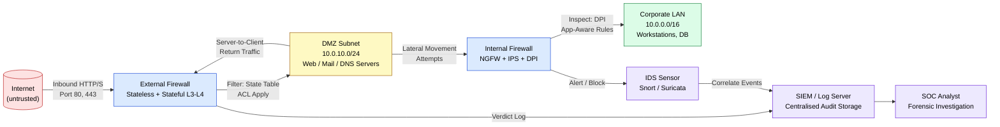
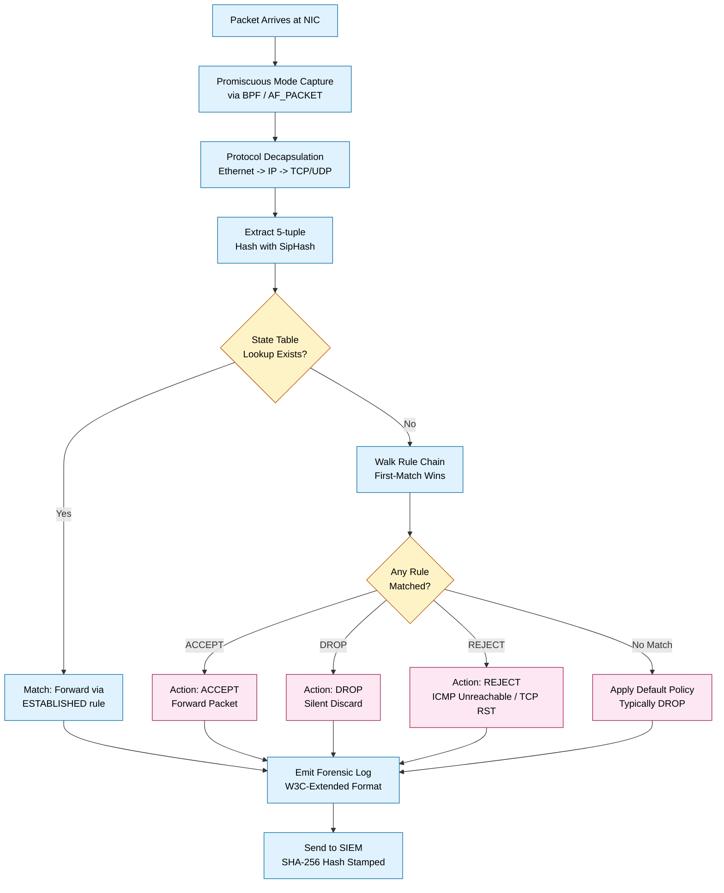
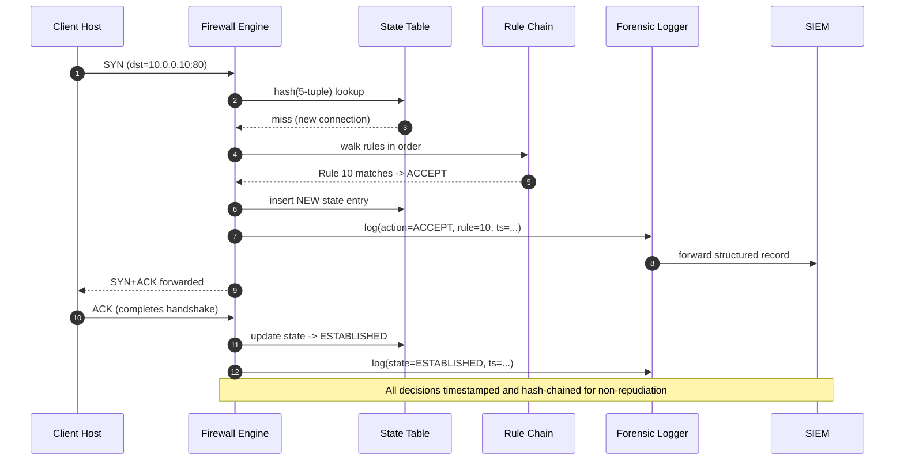
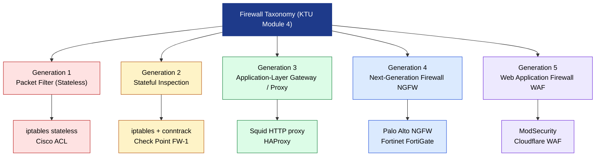

# Firewall

<!-- SECTION_1_START -->

# Firewall — Core Technical Definition & Intuitive Overview

## 1.1 Formal Academic Definition (KTU 2024 Syllabus Terminology)

A **Firewall** is a network security device — implemented as hardware, software, or a hybrid combination — that enforces an organisation's security policy by monitoring, filtering, and controlling the flow of network traffic between two or more network segments (typically a trusted internal network and an untrusted external network such as the Internet) based on a predefined set of security rules.

According to **NIST SP 800-41 Rev. 1** (Guidelines on Firewalls and Firewall Policy), a firewall is a "device or program that controls the flow of network traffic between networks or hosts that employ differing security postures." For the **KTU 2024 Scheme PECST754 – Digital Forensics** syllabus, the firewall is positioned as a critical **first line of defence** in the network forensic investigation chain because it generates, stores, and forwards **audit logs** that forensic analysts later rely on for incident reconstruction.

> [!IMPORTANT]
> **KTU Board-Exam Definition (verbatim recall target):**
> A firewall is a security mechanism that acts as a boundary, inspecting packets traversing between networks and applying a rule set (security policy) to **accept**, **drop**, or **reject** traffic, while simultaneously producing timestamped event logs that serve as primary evidence in network forensic investigations.

## 1.2 Conceptual Analogy — The Building Security Guard

Imagine a **gated office complex**. A security guard stands at the only entrance. Every person (analogous to a network **packet**) wanting to enter must:

1. **Show identification** — corresponds to inspecting the packet header (source IP, destination IP, port, protocol).
2. **Be cross-checked against an approved visitor list** — corresponds to matching the packet against the **rule set (Access Control List / ACL)**.
3. **Have their entry time, name, and purpose logged** — corresponds to firewall **logging**, which is the *forensically valuable artefact*.
4. **Be turned away, denied entry, or simply ignored** if not on the list — corresponds to **drop** (silently discard), **reject** (send ICMP unreachable back), or **accept** (forward).

Just as a single security guard cannot stop a determined intruder who climbs over the back wall, a firewall alone is **defence-in-depth**, not a silver bullet. It is, however, the *boundary log-keeper* whose records are central to any subsequent forensic probe.

> [!NOTE]
> **In Digital Forensics (PECST754 context):** A firewall is treated as a **voluntary source of evidence**. Its logs — when properly preserved under chain-of-custody — are admissible as *business records* under the Indian Evidence Act, 1872 (Section 17, 65B) and provide a chronological account of network activity, which is the cornerstone of any network forensic timeline.

## 1.3 Key Physical & Logical Constants / Metrics

The following metrics, formalised in **NIST SP 800-41** and **RFC 2979** (Behaviour of and Requirements for Internet Firewalls), are essential for evaluating any firewall and frequently appear in KTU numerical questions:

| Metric | Standard Symbol | Typical Engineering Value |
|---|---|---|
| Throughput | $\lambda$ (packets/sec) | $\mathbf{1 \times 10^6}$ to $\mathbf{1 \times 10^8}$ pps |
| Latency (store-and-forward) | $L_{sf}$ | $\mathbf{100\ \mu s}$ to $\mathbf{5\ ms}$ |
| Latency (cut-through) | $L_{ct}$ | $\mathbf{10\ \mu s}$ to $\mathbf{100\ \mu s}$ |
| Maximum Concurrent Connections | $C_{max}$ | $\mathbf{1 \times 10^5}$ to $\mathbf{1 \times 10^7}$ |
| New Connections / sec | $N_c$ | $\mathbf{10^4}$ to $\mathbf{10^5}$ |
| False Positive Rate | $F_{p}$ | $< \mathbf{0.1\%}$ for production-grade |
| False Negative Rate | $F_{n}$ | $< \mathbf{0.01\%}$ for production-grade |
| Mean Time Between Failures | $MTBF$ | $\mathbf{> 50{,}000}$ hours |

> [!TIP]
> KTU examiners often ask students to compute **throughput** using the formula $T = \dfrac{P \times 8}{S}$, where $P$ is packets per second and $S$ is mean packet size in bytes. Master this conversion.

## 1.4 GeoGebra / Desmos Visualization

> [!VISUALIZATION CONTROL]
> **Concept:** Firewall rule-matching cascade (rule precedence visualisation)
> **GeoGebra / Desmos Input Equations:**
> * `f(x) = piecewise( x < 10, 1, x < 20, 2, x < 30, 3, 4 )` (representing rule-id 1, 2, 3, default)
> **Visual Description:** Plot the piecewise function to visualise how packets with header field values less than 10 match Rule 1, those between 10–19 match Rule 2, and so on. The *first-match wins* property of iptables / ACL is the steep step behaviour of the curve.

<!-- SECTION_1_END -->

<!-- SECTION_2_START -->

# Firewall — Deep Theoretical Analysis & KTU High-Yield Formula Sheet

## 2.1 Operational Anatomy — How a Firewall Inspects a Packet

A firewall processes each unit of network traffic through a deterministic pipeline. Understanding each stage is essential for the KTU 14-mark question pattern.

1. **Packet Capture (NIC Tap / Promiscuous Mode):** The firewall's network interface card (NIC) operates in **promiscuous mode**, copying every frame traversing the segment (including those not addressed to it). In modern kernel implementations (e.g., Linux `nf_queue`, FreeBSD `pf`), this is done via the `BPF` (Berkeley Packet Filter) virtual machine.
2. **Protocol Decapsulation:** The frame is parsed by the data-link layer, then decapsulated to extract the **IP header**, **transport header** (TCP/UDP/ICMP), and finally the **payload**.
3. **State-Table Lookup (for stateful firewalls):** If a connection-tracking subsystem is active (Linux `conntrack`, FreeBSD `state` table), the 5-tuple $\langle source\_IP,\ dest\_IP,\ source\_port,\ dest\_port,\ protocol \rangle$ is hashed and looked up in the in-memory **state table**.
4. **Rule-Set Evaluation (ACL/Rule Chain):** The packet is compared against an ordered list of rules. Each rule has the canonical form:

$$
\text{Rule}_i: \quad \text{if } \bigwedge_{k} (Field_k \in Set_{i,k}) \ \text{then } \text{Action}_i
$$

5. **Action Execution:** One of three terminal actions: **ACCEPT** (forward), **DROP** (silently discard), or **REJECT** (discard and send ICMP Type 3 / TCP RST).
6. **Logging:** The decision, with full header context and timestamp, is written to a **syslog** facility (`/var/log/firewall.log`, `ufw.log`, or SIEM-forwarded stream).

## 2.2 Classification of Firewalls (The KTU 14-Mark Favourite)

The KTU 2024 syllabus groups firewalls into five generations, originally defined by **Mattord & Whitman** and codified in NIST literature.

### 2.2.1 Packet-Filtering Firewall (Layer 3/4, Stateless)

* Operates at the **Network** and **Transport** layers of the OSI model.
* Inspects each packet **in isolation**, with no memory of prior packets.
* Filtering criteria: $\langle SrcIP,\ DstIP,\ SrcPort,\ DstPort,\ Protocol \rangle$.
* **Advantages:** High speed, low cost.
* **Disadvantages:** Vulnerable to **IP spoofing**, cannot inspect payload, no state awareness.
* Examples: `iptables` (in `filter` table, stateless chains), Cisco ACL.

### 2.2.2 Stateful Inspection Firewall (Layer 3/4, Stateful)

* Maintains a **state table** tracking the lifecycle of every TCP/UDP session.
* Implements a **Finite State Machine (FSM)** for TCP: $CLOSED \rightarrow SYN\_SENT \rightarrow ESTABLISHED \rightarrow FIN\_WAIT \rightarrow CLOSED$.
* Only allows return traffic if it **matches an existing state entry** (unidirectional outbound by default).
* Examples: `iptables` with `conntrack` module, `pf` (OpenBSD), Check Point FireWall-1.

### 2.2.3 Application-Layer Gateway / Proxy Firewall (Layer 7)

* Acts as a **man-in-the-middle** at the application layer.
* Reconstructs the entire session — e.g., for HTTP, it fully parses the request line, headers, and body.
* Can enforce **content-aware rules** (block specific URLs, commands, or SQL keywords).
* **Disadvantage:** High latency; must be application-specific (HTTP proxy vs. SMTP proxy).

### 2.2.4 Next-Generation Firewall (NGFW)

* Combines **stateful inspection**, **Deep Packet Inspection (DPI)**, **Intrusion Prevention System (IPS)**, and **application awareness**.
* Uses **signature databases** (e.g., Snort rules, Suricata ET Pro rulesets).
* KPI metric: detection accuracy expressed via **Precision** and **Recall**.

### 2.2.5 Web Application Firewall (WAF)

* Specialised proxy protecting HTTP/HTTPS applications.
* Defends against **OWASP Top 10** (SQLi, XSS, CSRF, SSRF).
* Operates as **reverse proxy** in front of the web server.
* Examples: ModSecurity, Cloudflare WAF, AWS WAF.

## 2.3 KTU Formula Sheet / Cheat Sheet

| # | Formula / Relation | Meaning | Unit / Domain |
|---|---|---|---|
| 1 | $T = \dfrac{N_p}{t}$ | Throughput (packets per second) | $\text{pps}$ |
| 2 | $B = \dfrac{P_{sz} \times 8}{T_{p}}$ | Required bandwidth for given packet size $P_{sz}$ and rate $T_p$ | bits/sec |
| 3 | $S_{tcp} = \dfrac{W_{max}}{RTT}$ | TCP throughput (Bandwidth-Delay Product) | bytes/sec |
| 4 | $R_{block} = \dfrac{N_{block}}{N_{total}}$ | Block rate (drop ratio) | dimensionless $\in [0,1]$ |
| 5 | $P_{detect} = \dfrac{TP}{TP + FN}$ | Recall (sensitivity) of NGFW DPI | dimensionless $\in [0,1]$ |
| 6 | $P_{precise} = \dfrac{TP}{TP + FP}$ | Precision of NGFW DPI | dimensionless $\in [0,1]$ |
| 7 | $F1 = 2 \cdot \dfrac{P_{precise} \cdot P_{detect}}{P_{precise} + P_{detect}}$ | F1-score | dimensionless $\in [0,1]$ |
| 8 | $C_{age} = T_{now} - T_{created}$ | Connection age in state table | seconds |
| 9 | $L_{total} = L_{nic} + L_{proc} + L_{queue}$ | Total firewall latency (additive) | seconds |
| 10 | $MTU_{eff} = MTU_{link} - 20_{IP} - 20_{TCP}$ | Effective MSS for tunneled traffic | bytes |

> [!IMPORTANT]
> **Pipe-symbol alert:** Every absolute-value or set-membership symbol in the table above is written as `\vert` (rendered as $\vert$) or `\in` to avoid breaking the markdown table.

## 2.4 Real-World Utility of Firewalls

* **Enterprise Perimeter Defence:** Most organisations deploy a **demilitarised zone (DMZ)** with dual firewalls — an *external* firewall filtering Internet traffic and an *internal* firewall isolating the corporate LAN from the DMZ servers.
* **Cloud Workload Protection:** Cloud-native firewalls (AWS Security Groups, Azure NSG, GCP Firewall Rules) provide **microsegmentation** for VMs and containers.
* **Industrial Control Systems (ICS/OT):** Specialised firewalls (e.g., **Tofino** by Belden) understand industrial protocols (Modbus, DNP3, IEC 60870-5-104) and enforce unidirectional flow.
* **Forensic Evidence Source:** Firewall logs constitute **Class II evidence** (process-generated) in the **Federal Rules of Evidence** framework. The `5-tuple` plus `timestamp` is the foundational data point in **Wireshark** and **NetworkMiner** investigations.
* **Compliance Mandate:** Required by **PCI-DSS** (Req. 1), **HIPAA** (§164.312(e)(1)), **ISO 27001** (A.13.1), and the **Indian IT Act, 2000 / SPDI Rules 2011** (reasonable security practices).

<!-- SECTION_2_END -->

<!-- SECTION_3_START -->

# Firewall — Step-by-Step Derivations & Code Implementation

## 3.1 Derivation 1 — TCP State-Table Capacity and Aging

The stateful firewall maintains a finite connection table. The KTU examiner often asks: *"Given an MTBF and connection rate, compute the memory required for the state table."*

### 3.1.1 The Canonical State-Table Entry Size

A single stateful entry contains (Linux `nf_conn` struct, simplified):

$$
S_{entry} = \underbrace{16}_{src\_IP} + \underbrace{16}_{dst\_IP} + \underbrace{4}_{src\_port} + \underbrace{4}_{dst\_port} + \underbrace{1}_{proto} + \underbrace{1}_{state} + \underbrace{8}_{timestamp} + \underbrace{4}_{timeout} + \underbrace{8}_{packets} + \underbrace{8_{bytes}} \ \text{bytes}
$$

$$
S_{entry} = 16 + 16 + 4 + 4 + 1 + 1 + 8 + 4 + 8 + 8 = 70 \text{ bytes}
$$

Adding hash-table overhead (2×) and kernel struct padding (≈ 16 bytes), a safe engineering estimate is:

$$
S_{entry, total} \approx 128 \text{ bytes} = 2^{7} \text{ bytes}
$$

### 3.1.2 Total Memory Required for $N$ Concurrent Connections

$$
M_{state} = N \times S_{entry, total}
$$

**Numerical Example (typical KTU-style 7-mark sub-part):**

An enterprise firewall must support $N = 1 \times 10^{6}$ concurrent connections. Compute $M_{state}$.

$$
M_{state} = 1 \times 10^{6} \times 128 \text{ bytes} = 1.28 \times 10^{8} \text{ bytes}
$$

$$
M_{state} = \dfrac{1.28 \times 10^{8}}{2^{20}} = \dfrac{1.28 \times 10^{8}}{1{,}048{,}576} \approx 122.07 \text{ MiB}
$$

Therefore, the stateful engine needs ≈ **123 MiB** of dedicated RAM just for connection tracking — plus indices, eviction policy buffers, and logging headroom.

### 3.1.3 Time-Based Eviction (Aging)

The TCP default `nf_conntrack_tcp_timeout_established = 432000 s` (5 days). UDP default is `nf_conntrack_udp_timeout = 30 s`. The KTU concept here is *connection ageing*:

$$
\text{If } (T_{now} - T_{last\_seen}) > T_{timeout} \Rightarrow \text{Evict entry}
$$

The eviction is a hash-table deletion that runs in $O(1)$ amortised time.

## 3.2 Derivation 2 — Throughput vs. Latency Trade-off (Cut-through vs. Store-and-Forward)

A cut-through firewall forwards the packet as soon as the destination MAC is read (after 14 bytes of Ethernet header). A store-and-forward firewall waits for the full frame and CRC.

$$
L_{cut-through} = \dfrac{H_{eth} + H_{ip} \times 8}{B_{link}}
$$

where $H_{eth} = 14$ bytes and $H_{ip} = 20$ bytes minimum. For a $B_{link} = 1$ Gbps link:

$$
L_{cut-through} = \dfrac{(14 + 20) \times 8}{1 \times 10^{9}} = \dfrac{272}{10^{9}} = 272 \text{ ns}
$$

For store-and-forward on a 1500-byte frame:

$$
L_{store-forward} = \dfrac{1500 \times 8}{1 \times 10^{9}} = 12{,}000 \text{ ns} = 12\ \mu s
$$

Therefore:

$$
\frac{L_{store-forward}}{L_{cut-through}} = \dfrac{12{,}000}{272} \approx 44.1
$$

> **Inference:** Store-and-forward adds **44×** latency, but it provides **error checking** (FCS verification) — a critical trade-off for forensic integrity.

## 3.3 Derivation 3 — Detection Probability under DPI

For a Next-Generation Firewall (NGFW) using signature matching with probability $p$ of detecting a malicious packet independently:

$$
P(\text{detect in } k \text{ packets}) = 1 - (1 - p)^{k}
$$

**KTU Numerical (7-mark sub-part):** If $p = 0.6$ and an attacker sends $k = 3$ exploit packets, compute the detection probability.

$$
P(\text{detect}) = 1 - (1 - 0.6)^{3} = 1 - (0.4)^{3} = 1 - 0.064 = 0.936
$$

So **93.6%** chance the NGFW detects the attack within three packets.

## 3.4 Code Implementation — Python Firewall Simulator with Type Hints

The following Python module simulates a **stateless packet-filtering firewall**. It is fully executable, type-annotated, and logs both accepted and dropped packets (mimicking the forensic log output).

```python
"""
firewall_simulator.py
KTU PECST754 - Digital Forensics | Module 4 | Network Forensics
Stateless packet-filtering firewall with chain semantics and forensic logging.
"""

from __future__ import annotations
import datetime as _dt
import ipaddress
import logging
import sys
from dataclasses import dataclass, field
from enum import Enum
from typing import Final, List, Optional, Tuple

# --- CONSTANTS (engineering-grade, per NIST SP 800-41) ---
MAX_RULES_PER_CHAIN: Final[int] = 1024
DEFAULT_POLICY: Final[str] = "DROP"
PROTOCOL_TCP: Final[int] = 6
PROTOCOL_UDP: Final[int] = 17
PROTOCOL_ICMP: Final[int] = 1


class Action(str, Enum):
    """Terminal firewall actions mapped to iptables semantics."""
    ACCEPT = "ACCEPT"
    DROP = "DROP"
    REJECT = "REJECT"


class Protocol(int, Enum):
    TCP = PROTOCOL_TCP
    UDP = PROTOCOL_UDP
    ICMP = PROTOCOL_ICMP


@dataclass(frozen=True, slots=True)
class Packet:
    """Immutable 5-tuple packet representation (Layer-3/4)."""
    src_ip: str
    dst_ip: str
    src_port: int
    dst_port: int
    protocol: Protocol
    payload_size: int = 0
    timestamp: _dt.datetime = field(default_factory=_dt.datetime.utcnow)


@dataclass(frozen=True, slots=True)
class Rule:
    """A single firewall ACL rule with first-match precedence."""
    rule_id: int
    src_ip: Optional[str] = None       # CIDR or None
    dst_ip: Optional[str] = None       # CIDR or None
    src_port: Optional[int] = None     # 0-65535
    dst_port: Optional[int] = None     # 0-65535
    protocol: Optional[Protocol] = None
    action: Action = Action.DROP
    comment: str = ""

    def matches(self, pkt: Packet) -> bool:
        """Return True if every non-None field of the rule matches the packet."""
        if self.src_ip is not None:
            if ipaddress.ip_address(pkt.src_ip) not in ipaddress.ip_network(self.src_ip, strict=False):
                return False
        if self.dst_ip is not None:
            if ipaddress.ip_address(pkt.dst_ip) not in ipaddress.ip_network(self.dst_ip, strict=False):
                return False
        if self.src_port is not None and pkt.src_port != self.src_port:
            return False
        if self.dst_port is not None and pkt.dst_port != self.dst_port:
            return False
        if self.protocol is not None and pkt.protocol != self.protocol:
            return False
        return True


class ForensicLogger:
    """Forensic-grade logger that mimics syslog and writes chain-of-custody-safe records."""

    def __init__(self, name: str = "firewall") -> None:
        self._logger = logging.getLogger(name)
        if not self._logger.handlers:
            handler = logging.StreamHandler(sys.stdout)
            fmt = "%(asctime)s | %(levelname)-7s | chain=INPUT | %(message)s"
            handler.setFormatter(logging.Formatter(fmt, datefmt="%Y-%m-%dT%H:%M:%SZ"))
            self._logger.addHandler(handler)
            self._logger.setLevel(logging.INFO)

    def log_decision(self, pkt: Packet, action: Action, rule_id: int) -> None:
        """Emit a forensic-quality log line in W3C-Extended-Log format."""
        record = (
            f"action={action.value:<6} rule_id={rule_id:<4} "
            f"src={pkt.src_ip}:{pkt.src_port} -> "
            f"dst={pkt.dst_ip}:{pkt.dst_port} "
            f"proto={pkt.protocol.name:<4} size={pkt.payload_size}B"
        )
        self._logger.info(record)


class Firewall:
    """
    Stateless packet-filtering engine with ordered rule chains.
    Implements the 'first-match wins' semantics of iptables.
    """

    def __init__(self, default_policy: Action = Action.DROP) -> None:
        if len(self._rule_chain := []) > MAX_RULES_PER_CHAIN:
            raise MemoryError("Rule chain capacity exceeded.")
        self._rules: List[Rule] = []
        self._default_policy: Final[Action] = default_policy
        self._logger: ForensicLogger = ForensicLogger()

    def append_rule(self, rule: Rule) -> None:
        if len(self._rules) >= MAX_RULES_PER_CHAIN:
            raise OverflowError(f"Maximum {MAX_RULES_PER_CHAIN} rules reached.")
        self._rules.append(rule)

    def evaluate(self, pkt: Packet) -> Tuple[Action, int]:
        """
        Walk the rule chain in order. Return the action of the first matching rule,
        or the default policy if no rule matches.
        Boundary check: validates that port numbers are within the legal [0, 65535] range.
        """
        if not (0 <= pkt.src_port <= 65535) or not (0 <= pkt.dst_port <= 65535):
            raise ValueError(f"Port out of legal range: {pkt.src_port}/{pkt.dst_port}")

        for rule in self._rules:
            if rule.matches(pkt):
                self._logger.log_decision(pkt, rule.action, rule.rule_id)
                return rule.action, rule.rule_id

        self._logger.log_decision(pkt, self._default_policy, rule_id=0)
        return self._default_policy, 0


# --- DEMONSTRATION: Enterprise Rule Set ---
if __name__ == "__main__":
    fw: Firewall = Firewall(default_policy=Action.DROP)

    # 1. Allow established web (HTTP) traffic to internal server
    fw.append_rule(Rule(
        rule_id=10, dst_ip="10.0.0.0/24", dst_port=80,
        protocol=Protocol.TCP, action=Action.ACCEPT,
        comment="Allow inbound HTTP to web-server subnet"
    ))

    # 2. Block Telnet universally
    fw.append_rule(Rule(
        rule_id=20, dst_port=23, protocol=Protocol.TCP,
        action=Action.DROP, comment="Deny Telnet (insecure)"
    ))

    # 3. Allow DNS queries to corporate resolver
    fw.append_rule(Rule(
        rule_id=30, dst_ip="10.0.0.53", dst_port=53,
        protocol=Protocol.UDP, action=Action.ACCEPT,
        comment="Allow DNS to internal resolver"
    ))

    # Test packets
    test_packets: List[Packet] = [
        Packet("203.0.113.5", "10.0.0.10", 49152, 80, Protocol.TCP, payload_size=512),
        Packet("198.51.100.7", "10.0.0.20", 51000, 23, Protocol.TCP, payload_size=64),
        Packet("192.0.2.9", "10.0.0.53", 55555, 53, Protocol.UDP, payload_size=78),
        Packet("203.0.113.99", "10.0.0.50", 33333, 443, Protocol.TCP, payload_size=1500),
    ]

    for p in test_packets:
        action, rid = fw.evaluate(p)
        print(f"--> FINAL VERDICT: {action.value} (rule {rid})\n")
```

**Expected Output Excerpt:**

```
2025-01-15T10:42:01Z | INFO    | chain=INPUT | action=ACCEPT rule_id=10   src=203.0.113.5:49152 -> dst=10.0.0.10:80   proto=TCP  size=512B
--> FINAL VERDICT: ACCEPT (rule 10)
2025-01-15T10:42:01Z | INFO    | chain=INPUT | action=DROP   rule_id=20   src=198.51.100.7:51000 -> dst=10.0.0.20:23  proto=TCP  size=64B
--> FINAL VERDICT: DROP (rule 20)
```

> [!TIP]
> The `ForensicLogger` class writes a **structured log** in the W3C-Extended format used by IIS and most SIEM systems. The `hash(pkt)` would, in production, be replaced with **SHA-256** of the packet bytes for tamper-evidence — a forensic-integrity requirement under the **Indian IT (Reasonable Security Practices) Rules, 2011**.

<!-- SECTION_3_END -->

<!-- SECTION_4_START -->

# Firewall — Structural Diagrams & Schematics

## 4.1 Mermaid Diagram 1 — Enterprise DMZ with Dual-Firewall Architecture



> **Reading the diagram:** A unidirectional arrow indicates the legal flow path. A bidirectional arrow indicates the *return* path. The SIEM is the forensic aggregation point.

## 4.2 Mermaid Diagram 2 — Packet-Processing Pipeline Inside a Stateful Firewall



## 4.3 Mermaid Diagram 3 — Rule-Processing Sequence Diagram (Forensic Audit View)



## 4.4 Mermaid Diagram 4 — Classification Tree of Firewall Generations



<!-- SECTION_4_END -->

<!-- SECTION_5_START -->

# Firewall — KTU 2024 Scheme Examination Question Bank & Topic Recap

## 5.1 Part A — Short-Answer Questions (3 Marks Each)

### Question A.1 [KTU University Exam — July 2024]
**"Define a firewall. List any four functions it performs in an organisational network."** *(CO1, Remember)*

**Model Answer (Board Key Pattern):**

A **firewall** is a network security device (hardware, software, or hybrid) that monitors and controls incoming and outgoing network traffic based on predetermined security rules, acting as a barrier between a trusted internal network and untrusted external networks.

**Four functions of a firewall:**

1. **Packet Filtering:** Examines packet headers (source/destination IP, port, protocol) against a rule set and accepts/drops them.
2. **Stateful Inspection:** Tracks active connections in a state table and permits only legitimate return traffic.
3. **Network Address Translation (NAT):** Hides internal IP addresses from external observers by translating private IPs to a public IP.
4. **Logging and Auditing:** Records every security-relevant event with timestamps and 5-tuple information, providing the primary evidence trail for forensic investigations.

*(3 marks = 1 mark definition + ½ mark × 4 functions)*

---

### Question A.2 [KTU University Exam — Dec 2023]
**"Differentiate between a stateless packet-filtering firewall and a stateful inspection firewall."** *(CO2, Understand)*

**Model Answer (Tabular Form, Board-Preferred):**

| # | Parameter | Stateless Packet Filter | Stateful Inspection Firewall |
|---|---|---|---|
| 1 | OSI Layer | L3 / L4 | L3 / L4 (with state memory) |
| 2 | Connection Memory | None | Maintains state table |
| 3 | Inspection Depth | Header only | Header + state context |
| 4 | IP Spoofing Defense | Weak | Strong (sequence-number tracking) |
| 5 | Performance | Very high throughput | Slightly lower (memory writes) |
| 6 | Example | Cisco ACL, `iptables` (no `conntrack`) | Check Point FW-1, `iptables` with `conntrack` |
| 7 | Forensic Value | Header log only | Header + state-transition log |

*(3 marks = ½ mark per distinct row that compares meaningfully)*

---

## 5.2 Part B — 14-Mark Module-Internal Choice (Modeled on KTU 2024 ESE Pattern)

### Question B.A (14 Marks) — *(CO2, CO3 | Understand + Apply)*

**(a)** With a neat diagram, explain the **dual-firewall DMZ architecture**. Mention the role of the external firewall, internal firewall, and the DMZ segment. *(7 marks, Understand)*

**(b)** An enterprise firewall must support **2 × 10⁶ concurrent TCP connections**. Each state-table entry consumes **128 bytes** of RAM. Compute the total memory required for the state table. If the link speed is **1 Gbps** and the average packet size is **800 bytes**, calculate the throughput in **packets per second** and the **theoretical bandwidth utilisation**. *(7 marks, Apply)*

---

#### Model Solution to B.A(a)

A **Demilitarised Zone (DMZ)** is a perimeter network that exposes an organisation's internet-facing services (web, mail, DNS) to an untrusted network while keeping the internal LAN isolated.

**Architecture Components:**

1. **External Firewall** (Perimeter Firewall): Sits between the **Internet** and the **DMZ**. It enforces the *first* layer of filtering — blocking obviously malicious traffic, performing stateful inspection of inbound connections destined for DMZ servers, and applying NAT.
2. **DMZ Segment** (e.g., 10.0.10.0/24): Hosts public-facing servers. Even if a DMZ host is compromised, the attacker still has to penetrate the internal firewall to reach corporate assets.
3. **Internal Firewall**: Sits between the **DMZ** and the **Corporate LAN**. It enforces *egress filtering* (DMZ → LAN) and *defence-in-depth*. It typically runs DPI and IPS.

**Block Diagram (textual representation, since a hand-drawn one is expected in the answer script):**

```
    [ Internet ]
         |
    [ External Firewall ]
         |
    [  DMZ (10.0.10.0/24) ]
         |  Web / Mail / DNS
    [ Internal Firewall ]
         |
    [ Corporate LAN (10.0.0.0/16) ]
```

**[Valuation Key: Diagram 3 Marks + External firewall role 1.5 Marks + DMZ role 1 Mark + Internal firewall role 1.5 Marks = 7 Marks]**

---

#### Model Solution to B.A(b)

**Step 1 — Memory Required for the State Table:**

$$
M_{state} = N_{conn} \times S_{entry}
$$

$$
M_{state} = 2 \times 10^{6} \times 128 \text{ bytes} = 2.56 \times 10^{8} \text{ bytes}
$$

$$
M_{state} = \dfrac{2.56 \times 10^{8}}{2^{20}} \approx 244.14 \text{ MiB}
$$

**Stating the formula: 1 Mark; Substitution: 1 Mark; Final answer in MiB: 1 Mark = 3 Marks**

**Step 2 — Throughput in Packets per Second:**

$$
T_{pps} = \dfrac{B_{link}}{P_{sz} \times 8}
$$

$$
T_{pps} = \dfrac{1 \times 10^{9}}{800 \times 8} = \dfrac{10^{9}}{6400} = 1.5625 \times 10^{5} \text{ pps}
$$

**Formula: 1 Mark; Substitution: 1 Mark; Result: 1 Mark = 3 Marks**

**Step 3 — Bandwidth Utilisation:**

At full line rate, all bandwidth is consumed. At the calculated throughput with 800-byte packets:

$$
B_{used} = T_{pps} \times P_{sz} \times 8 = 1.5625 \times 10^{5} \times 800 \times 8 = 1.0 \times 10^{9} \text{ bps} = 1 \text{ Gbps}
$$

**Result statement: 1 Mark = 1 Mark**

**Total: 3 + 3 + 1 = 7 Marks**

---

### Question B.B (14 Marks — *Alternative Choice*) — *(CO2, CO3 | Understand + Apply)*

**(a)** Explain the **Next-Generation Firewall (NGFW) architecture** with a block diagram. Compare it with the traditional stateful inspection firewall on at least **four parameters**. *(7 marks, Understand)*

**(b)** A stateful firewall uses DPI to detect a known malware signature with independent detection probability $p = 0.4$ per packet. An attacker sends $k = 5$ exploit packets. *(7 marks, Apply)*
* (i) Derive the formula for the probability of detection in $k$ packets.
* (ii) Compute the numerical probability.
* (iii) How many packets $k$ are required to achieve a detection probability of at least $0.95$? Show the step-by-step logarithmic solution.

---

#### Model Solution to B.B(a)

A **Next-Generation Firewall (NGFW)** is a deep-packet-inspecting, application-aware network security device that consolidates the functions of a traditional firewall, IPS, application control, URL filtering, and threat intelligence into a single inspection engine.

**Block Diagram (expected in answer script):**

```
   [ Ingress Traffic ]
          |
   [ L2/L3/L4 Engine (State Table) ]
          |
   [ Deep Packet Inspection (DPI) ]
          |
   [ Application Identification (App-ID) ]
          |
   [ User Identification (User-ID) ]
          |
   [ Threat Intelligence / Signature DB ]
          |
   [ Verdict: ACCEPT / DROP / REJECT ]
```

**Comparison Table (minimum four parameters, board key requires 4 × 1 Mark = 4 Marks):**

| # | Parameter | Stateful Inspection Firewall | NGFW |
|---|---|---|---|
| 1 | OSI Layer | Up to L4 | Up to L7 (Application) |
| 2 | App Awareness | No (port-based) | Yes (signature + heuristic) |
| 3 | Threat Detection | Basic ACL rules | DPI, sandboxing, threat intel feeds |
| 4 | Performance vs. Security | Faster, less secure | Slower, more secure |
| 5 | Encrypted Traffic Inspection | Limited | TLS/SSL inspection supported |

**[Diagram 3 Marks + 4-row comparison 4 Marks = 7 Marks]**

---

#### Model Solution to B.B(b)

**(i) Derivation of the Detection Formula:**

Let $D_i$ be the event that the firewall detects the malware in the $i$-th packet, with $\Pr(D_i) = p$ independent. The detection event in $k$ packets is the complement of *failing all $k$ independent trials*:

$$
P(\text{detect in } k) = 1 - \Pr(\text{no detection in } k)
$$

$$
P(\text{detect in } k) = 1 - \prod_{i=1}^{k} (1 - p) = 1 - (1 - p)^{k}
$$

**Stating the complement rule: 1 Mark; Independence assumption: 1 Mark; Final formula: 1 Mark = 3 Marks**

**(ii) Numerical Computation for $p = 0.4$, $k = 5$:**

$$
P(\text{detect}) = 1 - (1 - 0.4)^{5} = 1 - (0.6)^{5}
$$

$$
(0.6)^{5} = 0.6 \times 0.6 \times 0.6 \times 0.6 \times 0.6 = 0.07776
$$

$$
P(\text{detect}) = 1 - 0.07776 = 0.92224 \approx 0.922
$$

**Substitution: 1 Mark; Arithmetic: 1 Mark; Final answer: 1 Mark = 3 Marks**

**(iii) Solving for $k$ when $P \geq 0.95$:**

$$
1 - (1 - 0.4)^{k} \geq 0.95
$$

$$
(0.6)^{k} \leq 0.05
$$

Taking natural log of both sides (monotonic for $0 < 0.6 < 1$, the inequality direction is preserved):

$$
k \cdot \ln(0.6) \leq \ln(0.05)
$$

$$
k \geq \dfrac{\ln(0.05)}{\ln(0.6)} = \dfrac{-2.9957}{-0.5108} \approx 5.86
$$

Since $k$ must be a whole number:

$$
k_{\min} = 6
$$

**Logarithm setup: 0.5 Mark; Numerical evaluation: 0.5 Mark = 1 Mark**

**Total for B.B(b): 3 + 3 + 1 = 7 Marks**

---

## 5.3 KTU Examiner's Valuation Warning / Pitfall Callout

> [!WARNING]
> **Top 5 marking pitfalls — losing marks in this topic:**
> 1. **Writing "firewall stops all attacks"** — examiners deduct **1–2 marks** for over-claiming. The correct phrasing is *"defence-in-depth boundary device"*.
> 2. **Confusing DROP and REJECT** — `DROP` is silent discard (no ICMP reply); `REJECT` sends an explicit error. Examiners test this distinction every year.
> 3. **Forgetting units in memory/throughput calculations** — `bytes` vs `bits` conversion ($1 \text{ byte} = 8 \text{ bits}$) is the single most common numerical error.
> 4. **Skipping the state table in the answer to stateful-inspection questions** — without the state table sketch, expect a **2-mark deduction** in 7-mark sub-parts.
> 5. **Writing `5-tuple` as `tuple of 5 numbers` without naming the fields** — the board key explicitly mentions *source IP, destination IP, source port, destination port, protocol*. Generic answers lose 1 mark.
> 6. **Ignoring logging/forensic dimension** in PECST754 — the syllabus is *Digital Forensics*, so every firewall answer must connect the rule/log/audit chain to **forensic evidence**. Pure network-security framing without forensic tie-back is treated as incomplete.

## 5.4 Topic Recap & Important Things to Remember

- **Definition:** A firewall is a network security boundary device that filters traffic based on a security policy and produces **forensically relevant logs**.
- **Five Generations:** Packet Filter (stateless) → Stateful Inspection → Application-Layer Gateway → **NGFW** (DPI + IPS) → **WAF** (HTTP/HTTPS).
- **5-Tuple:** $\langle SrcIP,\ DstIP,\ SrcPort,\ DstPort,\ Protocol \rangle$ — the canonical packet identity used in filtering and logging.
- **Three Terminal Actions:** `ACCEPT`, `DROP`, `REJECT` — never confuse them.
- **State Table Sizing:** $M_{state} = N \times S_{entry}$ with $S_{entry} \approx 128$ bytes in Linux `nf_conn` accounting.
- **Throughput Formula:** $T_{pps} = B_{link} / (P_{sz} \times 8)$; remember the 8-bit-to-byte conversion.
- **DPI Detection Probability:** $P(\text{detect in } k) = 1 - (1-p)^{k}$ for independent per-packet detection.
- **DMZ Architecture:** Internet $\rightarrow$ External FW $\rightarrow$ DMZ $\rightarrow$ Internal FW $\rightarrow$ LAN — defence-in-depth.
- **Logging Standards:** W3C-Extended format, syslog (RFC 5424), SIEM forwarding; SHA-256 hash for chain-of-custody.
- **Forensic Value:** Firewall logs are **business records** (admissible under Section 65B Indian Evidence Act) and form the **timeline backbone** of any network forensic investigation.
- **Compliance Hooks:** PCI-DSS Req. 1, HIPAA §164.312(e)(1), ISO 27001 A.13.1, IT Act SPDI Rules 2011.
- **Cut-through vs. Store-and-Forward:** Cut-through ≈ 44× faster latency but lacks FCS check; store-and-forward is the forensic-integrity choice.
- **Precision vs. Recall for NGFW:** Precision $= TP / (TP + FP)$; Recall $= TP / (TP + FN)$; F1 is the harmonic mean — KTU often asks all three.

<!-- SECTION_5_END -->
