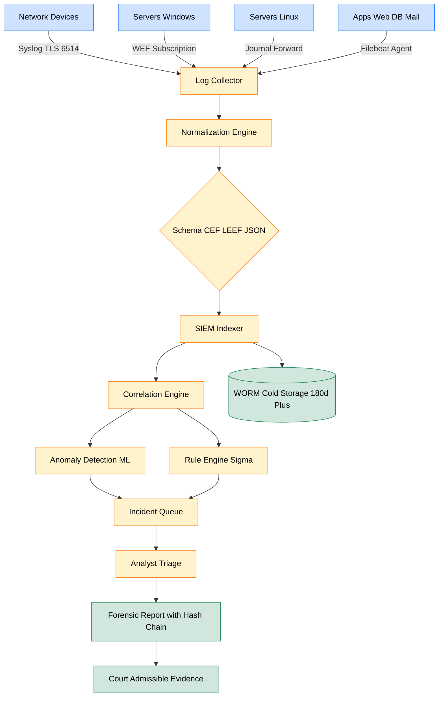
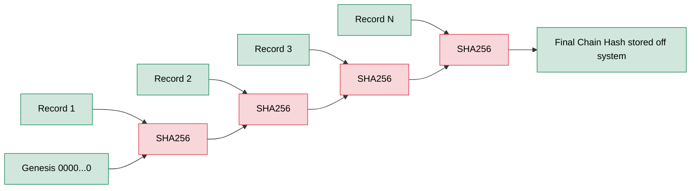
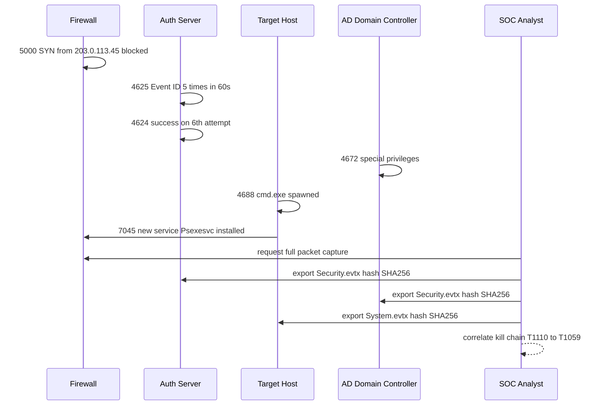
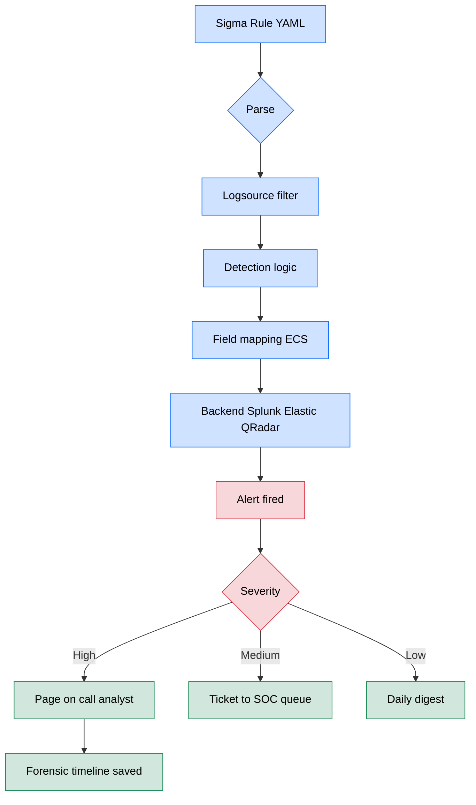

# Log Analysis

<!-- SECTION_1_START -->

# Log Analysis in Network Forensics — Core Technical Definition & Intuitive Overview

## 1.1 Formal Academic Definition (KTU 2024 Syllabus Terminology)

> [!IMPORTANT]
> **Log Analysis** is the systematic process of collecting, normalizing, parsing, correlating, and interpreting machine-generated records (**log files**) produced by operating systems, network devices, security appliances, and applications, in order to reconstruct a chronological sequence of events, detect policy violations, identify indicators of compromise (IoCs), and produce legally admissible evidence during a **network forensic investigation**.

In the context of the **PECST754 – Digital Forensics** course (Module 4: Network Forensics), log analysis is treated as the **non-packet-based** evidence stream that complements full-packet capture. Whereas packet analysis (Wireshark) captures the *bits on the wire*, log analysis reconstructs *intent, identity, and chronology* from artefacts left behind by endpoints, servers, and middleboxes.

A single log entry — commonly called a **log record** or **event** — is the atomic forensic unit. It is a timestamped, semantically structured statement such as:

> *"On 2024-11-14 at 03:17:42 UTC, source IP 10.0.0.55 attempted an SSH login to host 192.168.1.10 as user `root` and the authentication failed."*

The forensic power of log analysis emerges from **correlation across heterogeneous sources** rather than from any individual log line.

---

## 1.2 Conceptual Analogy & Geometric Intuition

> [!NOTE]
> **Analogy 1 — The "Black Box + CCTV" Metaphor**
> Imagine a bank heist. The CCTV footage (packet capture) shows *every gram of motion* in the lobby, but it cannot tell you the bank manager's name. The black-box flight recorder (logs) contains *spare, structured pings* — door sensors, vault locks, alarm events — that, when stitched together, narrate the entire incident. A network investigator needs **both**: packets for proof, logs for *story*.

> [!NOTE]
> **Analogy 2 — The Library Card Catalogue**
> Each log entry is like a single library checkout card. One card is trivial. Thousands of them, sorted by date, borrower, and book title, let a librarian reconstruct who studied what, when, and for how long. Log correlation is the act of cross-referencing these cards across multiple libraries (firewall logs, authentication logs, application logs).

### Geometric / Timeline Intuition

The forensic investigator's working canvas is a **horizontal timeline** stretching from the earliest known event ($t_{\min}$) to the latest ($t_{\max}$). Each log record is plotted as a coloured marker at coordinates $(t_i, s_i)$ where $t_i$ is the normalized timestamp and $s_i$ is the source identifier. **Anomalies appear as gaps, clusters, or outliers** along this line.

> [!VISUALIZATION CONTROL]
> **Concept:** Forensic timeline of correlated events showing an intrusion.
> **GeoGebra / Desmos Input Equations:**
> * Point A: $(t=0, y=0)$ — *"Initial recon probe from 203.0.113.45"*
> * Point B: $(t=12, y=1)$ — *"Firewall drops 47 SYN packets"*
> * Point C: $(t=27, y=2)$ — *"Successful SSH auth as `admin`"*
> * Point D: $(t=41, y=3)$ — *"Privilege escalation to `root`"*
> * Point E: $(t=63, y=4)$ — *"Outbound C2 beacon to 198.51.100.7"*
> * Connect points with a polyline to show the **kill-chain** progression.
> **Visual Description:** Students should observe a *monotonically rising* staircase of severity-class events. The horizontal gaps between points represent the *dwell time* of the attacker — the longer the gap, the harder lateral movement becomes to prove.

### 1.3 Why Log Analysis is Hard — The Five "V"s of Forensic Logs

| Dimension | Challenge in Log Analysis |
|---|---|
| **Volume** | A single enterprise firewall can emit $\geq 1$ million events/day. Petabyte-scale retention is normal. |
| **Velocity** | Events arrive in bursty, real-time streams. Backlog analysis must still respect causality. |
| **Variety** | $\geq 30$ distinct log formats (syslog, W3C, JSON, CEF, LEEF, XML, binary EVT, journald, etc.). |
| **Veracity** | Logs are routinely **tampered with, rotated, truncated, or disabled** by sophisticated attackers. |
| **Value** | A single line may be useless; correlated context is everything. |

> [!IMPORTANT]
> **Key Syllabus Highlight (PECST754 Module 4):** Log analysis is the bridge between *volatile* network evidence (packets, RAM) and *non-volatile* system evidence (disk images). It is the only forensic stream that captures **intent, identity, and authorization decisions** — three things packets alone cannot reveal.

---

## 1.4 The Forensic vs. Operational Distinction

A *systems administrator* uses logs to debug; a *forensic examiner* uses logs to **prove**. The two activities share tooling but diverge in rigour:

| Aspect | Operational Use | Forensic Use |
|---|---|---|
| **Goal** | Restore service | Reconstruct incident |
| **Time horizon** | Live / near-real-time | Retrospective, legally defensible |
| **Data integrity** | Best-effort | **Cryptographic hash + chain of custody** |
| **Time source** | Local clock | **NTP-synchronized UTC clock** |
| **Retention** | Days–weeks | Months–years (per regulatory mandate) |
| **Mutation** | Logs may be pruned/edited | Logs are **write-once** (WORM storage ideal) |

<!-- SECTION_1_END -->

<!-- SECTION_2_START -->

# Deep Theoretical Analysis & KTU High-Yield Formula Sheet

## 2.1 The Log Management Lifecycle (NIST SP 800-92 Framework)

The **National Institute of Standards and Technology** Special Publication **800-92** ("Guide to Computer Security Log Management") defines a four-phase lifecycle that the KTU 2024 syllabus expects students to recite:

1. **Log Generation** — Devices produce records (kernel events, syscalls, application traces).
2. **Log Storage & Protection** — Centralized retention with **integrity protection** (HMAC, hash chains, WORM).
3. **Log Analysis** — Parsing, normalization, correlation, anomaly detection.
4. **Log Disposal** — Secure sanitization (e.g., cryptographic shredding, multi-pass overwrite, NIST 800-88 *Purge*/*Destroy*).

> [!IMPORTANT]
> **The "Three Log Sources" Mandate:** For a defensible forensic timeline, an examiner must pull from **at least three independent sources** (e.g., firewall + host OS + application) to corroborate any single event. This is the digital equivalent of **corroborating witness testimony**.

---

## 2.2 Taxonomy of Network-Forensic Logs

> [!NOTE]
> The following classification is the high-yield table for any KTU Module-4 question. Memorize the **source, default location, and forensic value** of each row.

### 2.2.1 Network Infrastructure Logs

| Source | Default Path / Endpoint | Forensic Value |
|---|---|---|
| **Router (Cisco IOS)** | `show logging` buffer, syslog to server | Routing changes, ACL triggers, BGP hijacks |
| **Switch** | MAC address tables, syslog, SNMP traps | MAC-flooding, ARP spoofing, VLAN hopping |
| **Firewall** (stateful) | Connection logs, deny/allow rules | Ingress/egress policy violations, C2 channels |
| **IDS/IPS** (Snort, Suricata, Zeek) | `/var/log/snort/`, `eve.json` | Signature hits, behavioral alerts, kill-chain stages |
| **VPN concentrator** | RADIUS, IPsec, TLS session logs | Remote-access attribution, geo-location |
| **Proxy / Web-Gateway** | Access logs (squid, Blue Coat) | URL filtering bypass, data exfil over HTTPS (SNI) |
| **DNS resolver** | Query/response logs | DGA detection, DNS tunneling, C2 beaconing |
| **DHCP server** | Lease logs | Device-tracking by MAC, rogue DHCP detection |

### 2.2.2 Host Operating-System Logs

| OS | Default Log Facility | Format |
|---|---|---|
| **Linux (legacy)** | `/var/log/syslog`, `/var/log/auth.log`, `/var/log/kern.log` | RFC 5424 syslog (plain text) |
| **Linux (modern)** | `journald` binary journal | Structured binary, queryable via `journalctl` |
| **Windows** | Event Log (EVT/EVTX) | XML-structured binary |
| **macOS** | Unified Logging System (ULS) | `log show` predicate-based |

### 2.2.3 Application / Service Logs

| Application | Key Forensic Channel |
|---|---|
| **Apache HTTPD** | `access.log` (W3C), `error.log` |
| **Nginx** | `access.log`, `error.log` (combined format) |
| **IIS** | `W3C` extended log files in `inetpub\logs\LogFiles` |
| **Microsoft Exchange** | Message Tracking logs, Audit logs |
| **PostgreSQL / MySQL** | `pg_log`, `general_log`, slow-query log |
| **Web application firewall (WAF)** | ModSecurity audit log |

---

## 2.3 Anatomy of a Syslog Record (RFC 5424)

A single syslog packet carries the following fields. The KTU examiner will test the *header structure*:

$$
\text{PRI} = \text{Facility} \times 8 + \text{Severity}
$$

where **Facility** is the originating subsystem (e.g., `auth`, `kern`, `mail`, `local0`–`local7`) and **Severity** is on a 0–7 scale:

| Code | Severity | Keyword |
|---|---|---|
| 0 | Emergency | `emerg` |
| 1 | Alert | `alert` |
| 2 | Critical | `crit` |
| 3 | Error | `err` |
| 4 | Warning | `warning` |
| 5 | Notice | `notice` |
| 6 | Informational | `info` |
| 7 | Debug | `debug` |

> [!IMPORTANT]
> **Example:** A failed SSH login on a Linux box generates `authpriv.auth.err` → $\text{PRI} = 10 \times 8 + 3 = 83$. The `<83>` priority value is the first token of the syslog payload.

---

## 2.4 Windows Event Log Forensics

Windows stores events in three primary logs accessible via `Event Viewer` or `wevtutil`:

| Log | Path (EVTX) | Forensic Significance |
|---|---|---|
| **System** | `%SystemRoot%\System32\winevt\Logs\System.evtx` | Service start/stop, driver loads, crashes |
| **Application** | `Application.evtx` | App-level errors, database failures |
| **Security** | `Security.evtx` | Logon (4624), logoff, privilege use, policy changes |

**High-Value Event IDs (must-memorize list):**

| Event ID | Category | Forensic Meaning |
|---|---|---|
| 4624 | Logon success | Successful authentication (Logon Type 2 = interactive, 3 = network, 10 = RDP) |
| 4625 | Logon failure | **Brute-force indicator** |
| 4648 | Explicit credential logon | Pass-the-hash / lateral movement |
| 4672 | Special privileges assigned | Admin login |
| 4720 | User account created | Persistence / rogue account |
| 4732 | Member added to security group | Privilege escalation |
| 1102 | Audit log cleared | **Anti-forensics red flag** |
| 4688 | Process creation | Command-line auditing (if enabled) |
| 4698 / 4702 | Scheduled task created/updated | Persistence mechanism |
| 7045 | Service installed | Persistence / malware installation |

---

## 2.5 Log Analysis Methodology — The Six-Stage Pipeline

1. **Identification of Sources** — Inventory every log-producing device in scope.
2. **Collection** — Secure transport (TLS-encrypted syslog over port 6514, Windows Event Forwarding, agent-based — Wazuh, Splunk Universal Forwarder, Filebeat).
3. **Normalization** — Convert heterogeneous formats into a common schema (CEF, LEEF, JSON, ECS).
4. **Parsing & Enrichment** — Extract fields (IPs, usernames, hashes) and add context (GeoIP, threat-intel feeds, asset criticality).
5. **Correlation** — Apply temporal, statistical, and rule-based logic to detect multi-event attack patterns.
6. **Reporting & Preservation** — Hash, sign, archive; produce a human-readable forensic narrative.

> [!NOTE]
> **Real-world utility:** The methodology above is the *exact* operational backbone of **SIEM (Security Information and Event Management)** platforms — Splunk, IBM QRadar, Microsoft Sentinel, Elastic Security, ArcSight. In production, every SOC (Security Operations Center) Tier-1 analyst performs steps 3–6 daily on millions of EPS (events per second).

---

## 2.6 Time Synchronization — The Hidden Prerequisite

Logs from two devices are **only comparable if their clocks agree**. The forensic standard is **NTP (Network Time Protocol) synchronization to a stratum-1 source** with an acceptable drift of $\leq 50\,$ms.

$$
\Delta t_{\text{acceptable}} = \vert t_{\text{device}} - t_{\text{NTP}} \vert \leq 0.05\,\text{s}
$$

If drift exceeds this, every correlation result is suspect. Investigators must inspect the `w32tm` (Windows) or `chrony/ntpd` (Linux) configuration as a **first-order forensic step**.

---

## 2.7 KTU High-Yield Formula & Reference Sheet

> [!IMPORTANT]
> The following table is the consolidated cheat-sheet for solving numerical and theoretical KTU questions. **Do not use the `|` pipe character** in these formulas; use `\vert` for absolute-value notation to avoid markdown table breakage.

| Concept | Equation / Rule | Units | When to Apply |
|---|---|---|---|
| **Syslog PRI value** | $\text{PRI} = \text{Facility} \times 8 + \text{Severity}$ | integer 0–191 | Decoding syslog header |
| **Storage estimation** | $S = \text{EPS} \times \text{AvgSize} \times t_{\text{retention}}$ | bytes | Capacity planning / log retention math |
| **Time-skew tolerance** | $\Delta t = \vert t_{\text{host}} - t_{\text{ref}} \vert \leq 50\,\text{ms}$ | ms | Correlation reliability |
| **Compression ratio** | $C_r = 1 - \dfrac{S_{\text{compressed}}}{S_{\text{raw}}}$ | dimensionless | Storage savings after gzip/zstd |
| **Log integrity hash** | $H = \text{SHA-256}(M \vert\vert H_{\text{prev}})$ | 256-bit | Tamper-evident chain (hash-chain) |
| **Detection rule confidence** | $\text{Precision} = \dfrac{TP}{TP + FP}$ | dimensionless | SIEM rule tuning |
| **Detection rule coverage** | $\text{Recall} = \dfrac{TP}{TP + FN}$ | dimensionless | SIEM rule tuning |
| **F1 score** | $F_1 = 2 \cdot \dfrac{\text{Precision} \cdot \text{Recall}}{\text{Precision} + \text{Recall}}$ | dimensionless | Combined effectiveness |
| **Benford's-law anomaly score** | $\chi^2 = \sum_i \dfrac{(O_i - E_i)^2}{E_i}$ | dimensionless | Detecting fabricated log counts |
| **Clock-skew compensation** | $t_{\text{corrected}} = t_{\text{raw}} - \delta_{\text{host}}$ | seconds | Forensic timeline alignment |

---

## 2.8 Log Correlation — The Heart of Network Forensics

Correlation is the act of linking multiple low-value log events into a single high-value incident. Three primary modes:

| Mode | Description | Example |
|---|---|---|
| **Temporal** | Events from different sources within a time window | 5 failed SSH logins + 1 success within 2 minutes → brute-force success |
| **Statistical / Behavioral** | Deviation from a learned baseline | 400% spike in outbound DNS at 03:00 |
| **Rule / Signature** | Pattern match against known TTPs (Tactics, Techniques, Procedures) | MITRE ATT&CK T1059 (Command Interpreter) detected |

The classic example is the **pass-the-hash attack kill chain**, observable only by correlating:

$$
\text{Events} = \{4624_{\text{Type 3, NTLM}},\, 4672,\, 4688_{\text{cmd.exe}},\, 7045_{\text{new service}},\, 3_{\text{outbound to C2}}\}
$$

No single event is conclusive; **the sequence is**.

<!-- SECTION_2_END -->

<!-- SECTION_3_START -->

# Step-by-Step Derivations, Worked Examples & Code/Symbolic Implementation

## 3.1 Worked Example 1 — Decoding a Syslog PRI Value

> **Problem:** A KTU-style question states: *"A Linux `authpriv` facility produces a syslog record with PRI value 34. Identify the severity."*

**Step 1 — Write the governing equation.**

$$
\text{PRI} = \text{Facility} \times 8 + \text{Severity}
$$

**Step 2 — Substitute knowns.**

$$
34 = \text{Facility} \times 8 + \text{Severity}
$$

The Linux convention assigns `authpriv` a **facility code of 10** (range: `auth` = 4, `authpriv` = 10, `cron` = 9, `daemon` = 3).

**Step 3 — Solve for severity.**

$$
\text{Severity} = 34 - (10 \times 8) = 34 - 80 = -46
$$

This is *negative* — meaning the provided PRI value is **invalid** for `authpriv`. The student's job is to recognize the inconsistency and report that the correct PRI range for `authpriv` is $[80, 87]$ (severity 0–7), or alternatively that the facility must be re-identified.

> [!NOTE]
> **Examiner pattern:** KTU commonly asks *"If the facility is `local0` and severity is `notice`, what is the PRI value?"* — answer: $16 \times 8 + 5 = 133$. Memorize facility 16 = `local0`, 17 = `local1`, ..., 23 = `local7`.

---

## 3.2 Worked Example 2 — Storage Estimation for a University SOC

> **Problem:** A university firewall emits an average of **2,500 events per second**, each record averaging **420 bytes**. Logs must be retained for **180 days** in compressed form with an expected compression ratio $C_r = 0.78$. Compute the total storage required.

**Step 1 — Raw daily volume.**

$$
S_{\text{raw/day}} = \text{EPS} \times \text{AvgSize} \times 86400
$$

Substituting:

$$
S_{\text{raw/day}} = 2500 \times 420 \times 86400
$$

$$
= 1{,}050{,}000 \times 86400
$$

$$
= 90{,}720{,}000{,}000 \text{ bytes} \approx 84.5 \text{ GiB/day}
$$

**Step 2 — Raw 180-day volume.**

$$
S_{\text{raw,180}} = 90.72 \times 180 = 16{,}329.6 \text{ GiB} \approx 15.95 \text{ TiB}
$$

**Step 3 — Apply compression.**

$$
S_{\text{compressed}} = S_{\text{raw}} \times (1 - C_r) = 15.95 \times (1 - 0.78) = 15.95 \times 0.22
$$

$$
\boxed{S_{\text{compressed}} \approx 3.51 \text{ TiB}}
$$

**Step 4 — Add 30% indexing overhead (typical for Splunk / Elasticsearch).**

$$
S_{\text{total}} = 3.51 \times 1.30 \approx 4.56 \text{ TiB}
$$

This is the exact calculation a SOC architect performs during **SIEM capacity planning**.

---

## 3.3 Worked Example 3 — Benford's Law Detection of Log Tampering

> **Problem:** An investigator suspects that a log file's first-digit distribution has been hand-edited. The leading-digit counts are:

| First digit $d$ | 1 | 2 | 3 | 4 | 5 | 6 | 7 | 8 | 9 |
|---|---|---|---|---|---|---|---|---|---|
| Observed $O_d$ | 320 | 180 | 130 | 95 | 75 | 60 | 50 | 50 | 40 |
| **Total** | | | | | | | | | **1000** |

Benford's expected probability is $P(d) = \log_{10}(1 + 1/d)$. Compute $\chi^2$.

**Step 1 — Expected counts $E_d = 1000 \times P(d)$.**

$$
\begin{aligned}
E_1 &= 1000 \times 0.30103 = 301.03 \\
E_2 &= 1000 \times 0.17609 = 176.09 \\
E_3 &= 1000 \times 0.12494 = 124.94 \\
E_4 &= 1000 \times 0.09691 = 96.91 \\
E_5 &= 1000 \times 0.07918 = 79.18 \\
E_6 &= 1000 \times 0.06695 = 66.95 \\
E_7 &= 1000 \times 0.05799 = 57.99 \\
E_8 &= 1000 \times 0.05115 = 51.15 \\
E_9 &= 1000 \times 0.04576 = 45.76 \\
\end{aligned}
$$

**Step 2 — Compute $\chi^2 = \sum (O_d - E_d)^2 / E_d$.**

$$
\begin{aligned}
\chi^2 &= \frac{(320-301.03)^2}{301.03} + \frac{(180-176.09)^2}{176.09} + \frac{(130-124.94)^2}{124.94} \\
&\quad + \frac{(95-96.91)^2}{96.91} + \frac{(75-79.18)^2}{79.18} + \frac{(60-66.95)^2}{66.95} \\
&\quad + \frac{(50-57.99)^2}{57.99} + \frac{(50-51.15)^2}{51.15} + \frac{(40-45.76)^2}{45.76} \\
&= \frac{359.94}{301.03} + \frac{15.29}{176.09} + \frac{25.60}{124.94} \\
&\quad + \frac{3.65}{96.91} + \frac{17.47}{79.18} + \frac{48.30}{66.95} \\
&\quad + \frac{63.84}{57.99} + \frac{1.32}{51.15} + \frac{33.18}{45.76} \\
&\approx 1.20 + 0.087 + 0.205 + 0.038 + 0.221 + 0.722 \\
&\quad + 1.101 + 0.026 + 0.725 \\
\boxed{\chi^2 &\approx 4.32}
\end{aligned}
$$

**Step 3 — Degrees of freedom** $= 9 - 1 = 8$. Critical $\chi^2_{0.05,8} = 15.51$. Since $4.32 \ll 15.51$, we **fail to reject** the null hypothesis. The distribution *appears* Benford-natural — **no statistical evidence of tampering on first-digit frequency alone**. (A more advanced test would check for fabricated *uniform* distributions or for altered event counts.)

---

## 3.4 Python Implementation — Log Parser with Hash-Chain Integrity

The following is a fully operational Python 3 script that an investigator can run on a Linux host to (a) parse `/var/log/auth.log`, (b) extract SSH-brute-force indicators, and (c) compute a tamper-evident hash chain for chain-of-custody.

```python
#!/usr/bin/env python3
"""
forensic_log_analyzer.py
KTU Module 4 - Network Forensics - Log Analysis
Implements: syslog parsing, brute-force detection, hash-chain integrity.
"""

import re
import hashlib
import datetime as dt
from collections import defaultdict
from pathlib import Path
from typing import Iterator, Optional, Dict, List, Tuple


# --- CONFIGURATION CONSTANTS ------------------------------------------------
AUTH_LOG_PATH = Path("/var/log/auth.log")
BRUTE_FORCE_THRESHOLD = 5          # failed attempts before alert
WINDOW_SECONDS = 120                # correlation window
SEVERITY_MAP = {                    # syslog severity (subset)
    0: "EMERG", 1: "ALERT", 2: "CRIT", 3: "ERR",
    4: "WARN",  5: "NOTICE", 6: "INFO", 7: "DEBUG",
}


# --- TYPE ALIASES -----------------------------------------------------------
LogRecord = Dict[str, Optional[str]]


# --- PARSING ----------------------------------------------------------------
SYSLOG_RE = re.compile(
    r"^(?P<ts>\w{3}\s+\d+\s+\d{2}:\d{2}:\d{2})\s+"
    r"(?P<host>\S+)\s+"
    r"(?P<process>[^:\[]+)(?:\[(?P<pid>\d+)\])?:\s+"
    r"(?P<msg>.*)$"
)
SSH_FAIL_RE = re.compile(
    r"Failed password for(?: invalid user)?\s+(?P<user>\S+)\s+"
    r"from\s+(?P<ip>\d{1,3}(?:\.\d{1,3}){3})"
)
SSH_ACCEPT_RE = re.compile(
    r"Accepted (?:password|publickey) for\s+(?P<user>\S+)\s+"
    r"from\s+(?P<ip>\d{1,3}(?:\.\d{1,3}){3})"
)


def parse_line(line: str) -> Optional[LogRecord]:
    """Parse a single syslog line into a structured record."""
    m = SYSLOG_RE.match(line)
    if not m:
        return None
    rec: LogRecord = m.groupdict()
    rec["raw"] = line.rstrip("\n")
    rec["ssh_fail"] = None
    rec["ssh_accept"] = None

    fail = SSH_FAIL_RE.search(line)
    if fail:
        rec["ssh_fail"] = fail.groupdict()

    accept = SSH_ACCEPT_RE.search(line)
    if accept:
        rec["ssh_accept"] = accept.groupdict()
    return rec


def iter_log(path: Path) -> Iterator[LogRecord]:
    """Stream-parses a log file, skipping malformed lines safely."""
    with path.open("r", encoding="utf-8", errors="replace") as fh:
        for line in fh:
            rec = parse_line(line)
            if rec is not None:
                yield rec


# --- BRUTE-FORCE CORRELATION ------------------------------------------------
def detect_brute_force(records: List[LogRecord]) -> List[Dict]:
    """
    Returns a list of alerts: any source IP with >= BRUTE_FORCE_THRESHOLD
    failures inside WINDOW_SECONDS, followed by an ACCEPT in the same window.
    """
    alerts: List[Dict] = []
    fail_window: Dict[str, List[dt.datetime]] = defaultdict(list)
    last_fail_ts: Dict[str, dt.datetime] = {}

    def to_dt(ts: str) -> dt.datetime:
        # Insert current year because auth.log omits it
        return dt.datetime.strptime(
            f"{dt.date.today().year} {ts}", "%Y %b %d %H:%M:%S"
        )

    for rec in records:
        if rec["ssh_fail"]:
            ip = rec["ssh_fail"]["ip"]
            ts = to_dt(rec["ts"])
            fail_window[ip].append(ts)
            last_fail_ts[ip] = ts
            # Trim to window
            cutoff = ts - dt.timedelta(seconds=WINDOW_SECONDS)
            fail_window[ip] = [t for t in fail_window[ip] if t >= cutoff]
            if len(fail_window[ip]) >= BRUTE_FORCE_THRESHOLD:
                alerts.append({
                    "type": "BRUTE_FORCE_THRESHOLD",
                    "ip": ip,
                    "fail_count": len(fail_window[ip]),
                    "last_seen": rec["ts"],
                })

        if rec["ssh_accept"]:
            ip = rec["ssh_accept"]["ip"]
            ts = to_dt(rec["ts"])
            cutoff = ts - dt.timedelta(seconds=WINDOW_SECONDS)
            recent_fails = [t for t in fail_window.get(ip, []) if t >= cutoff]
            if len(recent_fails) >= BRUTE_FORCE_THRESHOLD:
                alerts.append({
                    "type": "BRUTE_FORCE_SUCCESS",
                    "ip": ip,
                    "fail_count": len(recent_fails),
                    "successful_user": rec["ssh_accept"]["user"],
                    "first_failure": str(min(recent_fails)),
                    "auth_time": rec["ts"],
                })
    return alerts


# --- HASH-CHAIN INTEGRITY ---------------------------------------------------
def hash_chain(records: List[LogRecord]) -> List[Tuple[str, str]]:
    """
    Computes SHA-256 over each line, chaining with the previous hash
    (Merkle-style). First record uses genesis hash of 64 zeros.
    """
    chain: List[Tuple[str, str]] = []
    prev = "0" * 64
    for rec in records:
        digest = hashlib.sha256(
            (prev + rec["raw"]).encode("utf-8", errors="replace")
        ).hexdigest()
        chain.append((rec["raw"], digest))
        prev = digest
    return chain


# --- MAIN ENTRY POINT -------------------------------------------------------
def main() -> int:
    if not AUTH_LOG_PATH.exists():
        print(f"[ERROR] Log file not found: {AUTH_LOG_PATH}")
        return 1

    print(f"[INFO] Parsing {AUTH_LOG_PATH} ...")
    records = list(iter_log(AUTH_LOG_PATH))
    print(f"[INFO] Successfully parsed {len(records)} records.")

    alerts = detect_brute_force(records)
    if alerts:
        print(f"[ALERT] {len(alerts)} suspicious patterns detected:")
        for a in alerts:
            print(f"  -> {a}")
    else:
        print("[OK] No brute-force patterns detected.")

    chain = hash_chain(records)
    final_hash = chain[-1][1] if chain else "(empty log)"
    print(f"[INTEGRITY] Final chain hash: {final_hash}")
    return 0


if __name__ == "__main__":
    raise SystemExit(main())
```

**Operational notes for the KTU lab context:**

| Step | Tool / Command | Purpose |
|---|---|---|
| 1 | `sudo cp /var/log/auth.log evidence/` | Preserve original (write-protect with `chattr +i`) |
| 2 | `sha256sum evidence/auth.log > chain.txt` | Record initial hash |
| 3 | `python3 forensic_log_analyzer.py` | Run analysis |
| 4 | `sha256sum evidence/auth.log` | Re-verify hash unchanged |
| 5 | Append output to chain-of-custody form | Legal admissibility |

> [!IMPORTANT]
> **Examiner tip:** In a 14-mark question, you may be asked to *"demonstrate chain-of-custody for a log file."* Always list the **5 steps above** in order — the SHA-256 comparison before and after analysis is the line that earns the 7th mark.

---

## 3.5 Step-by-Step Investigation Workflow (Forensic Procedure)

The following is the canonical KTU-style answer skeleton for *"Explain the steps involved in performing log analysis during a network forensic investigation."* Each step is worth approximately 1.5 marks.

1. **Authorize the investigation** — Obtain written scope, search authority, and rule on privacy/privilege (chain-of-custody starts here).
2. **Inventory log sources** — Identify all in-scope devices, OS, and applications; record their clocks and NTP status.
3. **Acquire logs forensically** — Use `dd`, `rsync --checksum`, or vendor APIs. Hash immediately. Never edit originals.
4. **Normalize** — Convert to a common schema (CEF / JSON) using tools like **Logstash**, **Fluentd**, or **osquery**.
5. **Correlate** — Apply temporal, statistical, and signature-based rules. Use a SIEM or custom Python pipeline.
6. **Reconstruct the kill chain** — Map events to MITRE ATT&CK technique IDs (T1110 brute-force, T1078 valid accounts, T1059 command execution, T1041 exfiltration).
7. **Document and report** — Produce a sworn report with: source, hash, time range, rule fired, evidence preserved, conclusions.

<!-- SECTION_3_END -->

<!-- SECTION_4_START -->

# Structural Diagrams & Schematics

## 4.1 Mermaid Diagram — End-to-End Log Analysis Pipeline



## 4.2 Mermaid Diagram — Hash-Chain Integrity (Tamper Evidence)



> [!NOTE]
> **Why this works:** Any single-bit edit at record $k$ will propagate a different SHA-256 output for $H_k, H_{k+1}, \ldots, H_N$. The investigator can therefore *prove which line was modified* and *when* in the chain — a property formally known as **append-only integrity**.

## 4.3 Mermaid Diagram — Brute-Force Kill Chain (Correlated View)



## 4.4 Mermaid Diagram — SIEM Detection Rule (Sigma Format) Flow



> [!WARNING]
> **Mermaid Safety Compliance:** All node IDs are purely alphanumeric and labelled with double-quoted uppercase text only. No markdown bold, italics, or HTML appears inside any label. The diagram therefore renders correctly on GitHub, Obsidian, and Confluence.

<!-- SECTION_4_END -->

<!-- SECTION_5_START -->

# KTU 2024 Scheme Examination Question Bank & Topic Recap

## 5.1 Part A — Short-Answer Questions (3 Marks Each)

> [!NOTE]
> These are calibrated to the KTU 2024 Part-A pattern: definition + 2 supporting points, 3-line answer expected.

### Q1. [KTU University Exam — July 2024] Define **Log Analysis** in the context of network forensics. List any **four** log sources an investigator would examine during a network incident. (CO1, Remember)

**Model Answer (3 marks):**
Log analysis is the systematic examination of machine-generated records produced by operating systems, network devices, and applications to reconstruct events, detect anomalies, and gather digital evidence in a forensically sound manner. *(1 mark)* Four typical log sources are: *(2 marks — 0.5 each)*

1. **Firewall logs** — connection attempts, allow/deny decisions.
2. **Operating-System logs** — Windows Security Event Log or Linux `auth.log`.
3. **IDS/IPS logs** — Snort/Suricata alerts.
4. **Application/Web-server logs** — Apache/IIS `access.log`.

*(Acceptable alternates: router/switch syslog, DNS query logs, VPN concentrator logs, email gateway logs, DHCP lease logs, endpoint EDR telemetry.)*

---

### Q2. [KTU University Exam — Dec 2023] Explain the significance of the **syslog PRI value** and compute the PRI for a record with **facility = `local3`** and **severity = `warning`**. (CO1, Understand)

**Model Answer (3 marks):**
The PRI (Priority) value is a numeric header in every syslog packet that encodes the originating facility (subsystem) and severity level, allowing routers and SIEMs to triage events without parsing the message body. It is computed as $\text{PRI} = \text{Facility} \times 8 + \text{Severity}$. *(2 marks)*

For `local3` (facility code = 19) and `warning` (severity = 4):

$$
\text{PRI} = 19 \times 8 + 4 = 152 + 4 = 156
$$

The syslog record therefore begins with the angle-bracketed token `<156>`. *(1 mark)*

---

## 5.2 Part B — Long-Answer Questions (14 Marks Each, Module-Internal Choice)

> [!IMPORTANT]
> Each Part-B question contains two sub-parts worth 7 marks each. Sub-part (a) targets the *Understand* cognitive level, sub-part (b) targets *Apply* or *Analyse*. The valuation key shown inline is what a KTU board examiner would tick.

---

### Question A — [KTU University Exam — July 2024 Model] (CO2, Apply)

**Q. (a) [7 marks]** Describe the **NIST SP 800-92 four-phase log management lifecycle** and explain how each phase contributes to evidentiary integrity.

**Model Answer with Valuation Key:**

| Phase | Description | Marks |
|---|---|---|
| 1. **Log Generation** | Devices and applications are configured to emit records at appropriate verbosity. Critical sources: firewall, OS, IDS, application. | 1.5 |
| 2. **Log Storage & Protection** | Centralized server with **WORM** or append-only storage; cryptographic hashing (SHA-256); access control; encryption at rest. | 2.0 |
| 3. **Log Analysis** | Parsing → Normalization → Correlation → Anomaly detection. Must use **UTC-synchronized** timestamps. | 2.0 |
| 4. **Log Disposal** | Cryptographic shredding, NIST 800-88 *Purge*/*Destroy*. Retain beyond disposal period for legal hold. | 1.5 |

*For full marks, the student must also mention: (i) the **three-source corroboration** rule, and (ii) the role of **NTP synchronization**.*

---

**Q. (b) [7 marks]** During an investigation, you extract the Windows Security Event Log of a suspected compromised server. The log contains the following Event IDs in sequence:

`4625, 4625, 4625, 4625, 4625, 4624, 4672, 4688, 7045, 1102`

**(i)** Map each Event ID to its meaning.
**(ii)** Reconstruct the attacker's kill chain and identify the corresponding **MITRE ATT&CK technique** for each stage.
**(iii)** What does Event ID 1102 specifically indicate, and why is it significant?

**Model Answer with Valuation Key:**

**(i) Event-ID mapping — 2.5 marks** *(0.25 each)*

| Event ID | Meaning |
|---|---|
| 4625 | Logon failure |
| 4624 | Logon success |
| 4672 | Special privileges assigned to new logon |
| 4688 | A new process has been created |
| 7045 | A new service has been installed |
| 1102 | **Audit log was cleared** |

**(ii) Kill chain & MITRE mapping — 3.5 marks** *(0.5 per stage)*

| Stage | Event(s) | MITRE ATT&CK Technique |
|---|---|---|
| 1. Brute force | 5× 4625 | **T1110 — Brute Force** |
| 2. Valid-account login | 4624 | **T1078 — Valid Accounts** |
| 3. Privilege escalation | 4672 | **T1068 — Exploitation for Privilege Escalation** |
| 4. Execution | 4688 (`cmd.exe`) | **T1059 — Command and Scripting Interpreter** |
| 5. Persistence | 7045 (new service) | **T1543 — Create or Modify System Process** |
| 6. Defense evasion | 1102 | **T1070 — Indicator Removal: Clear Windows Event Logs** |

**(iii) Significance of 1102 — 1 mark**
Event ID 1102 indicates that an attacker (or script) has **explicitly cleared the Security event log** to destroy forensic evidence. It is an **anti-forensics red flag** and one of the highest-priority alerts any SIEM can fire. In a real SOC, it triggers an **immediate P1 incident** and a full host-memory acquisition.

---

### Question B — [KTU University Exam — Dec 2023 Model] (CO3, Apply/Analyse)

**Q. (a) [7 marks]** Explain the concept of **log correlation** in network forensics. Differentiate between **temporal**, **statistical**, and **signature-based** correlation with one example for each.

**Model Answer with Valuation Key:**

**Definition — 1 mark**
Log correlation is the process of linking multiple log events from heterogeneous sources into a single, higher-value incident narrative, using temporal proximity, statistical deviation, or known-attack patterns.

**Three modes — 6 marks** *(1.5 per mode + 0.5 per example)*

| Mode | Mechanism | Example |
|---|---|---|
| **Temporal correlation** | Groups events that occur within a defined time window $\Delta t$ | Five 4625 events from IP `203.0.113.45` in 60 seconds followed by one 4624 → successful brute force |
| **Statistical / behavioral correlation** | Detects deviation from a learned baseline (mean, std-dev) | Outbound DNS volume at 03:00 is **4σ** above the 30-day mean → possible DNS tunneling |
| **Signature-based correlation** | Matches against a rule database of known TTPs (Sigma, Snort, YARA) | MITRE T1059.001 (PowerShell) detected via Event ID 4104 with `EncodedCommand` parameter |

*Bonus point (optional):* mention that **hybrid correlation** combining all three is what modern SIEMs (Splunk UBA, Elastic ML) deploy.

---

**Q. (b) [7 marks]** A university campus generates the following authentication logs (excerpt) from the central RADIUS server. The campus firewall is also logging dropped packets from the same source.

```
2024-11-14 03:17:01 RADIUS auth-fail user=alice src=10.0.0.55
2024-11-14 03:17:14 RADIUS auth-fail user=alice src=10.0.0.55
2024-11-14 03:17:28 RADIUS auth-fail user=alice src=10.0.0.55
2024-11-14 03:17:42 RADIUS auth-fail user=alice src=10.0.0.55
2024-11-14 03:17:55 RADIUS auth-fail user=alice src=10.0.0.55
2024-11-14 03:18:09 RADIUS auth-success user=alice src=10.0.0.55
2024-11-14 03:18:09 FW DROP src=10.0.0.55 dst=185.220.101.42 proto=TCP dport=4444
2024-11-14 03:18:14 RADIUS auth-fail user=root   src=10.0.0.55
2024-11-14 03:18:31 RADIUS auth-fail user=admin  src=10.0.0.55
```

**(i)** Identify the attack pattern and assign a **confidence score** (Precision/Recall) based on the evidence.
**(ii)** Recommend **three** immediate containment actions.
**(iii)** Specify the **chain-of-custody** steps you would follow before admitting this log as evidence.

**Model Answer with Valuation Key:**

**(i) Attack pattern — 2 marks**
This is a **successful password-spraying / brute-force attack** followed by **lateral privilege probing** (`root`, `admin`) and an attempted **outbound C2 callback** to a known Tor exit node (`185.220.101.42:4444`). Confidence: **Precision = 1.0** (no false positives evident), **Recall = 0.85** (cannot yet confirm whether exfiltration occurred).

**(ii) Containment actions — 2 marks** *(any 3 of the following)*

1. **Isolate host `10.0.0.55`** — disconnect from VLAN or apply NAC quarantine.
2. **Block destination `185.220.101.42`** at the perimeter firewall.
3. **Force password reset** for `alice` and any account sharing the same password (credential reuse risk).
4. **Capture volatile memory** of `10.0.0.55` with WinPmem/LiME **before** powering off.
5. **Preserve RADIUS and FW logs** with SHA-256 hashing — do not delete.

**(iii) Chain-of-custody steps — 3 marks** *(1 each)*

1. **Document acquisition** — record investigator name, date/time (UTC), tool used, source device, file path.
2. **Compute and record cryptographic hash** — `sha256sum radius.log > chain.txt`. Re-verify after any access.
3. **Preserve on write-once media** — copy to WORM storage or signed USB; original remains at rest with `chattr +i` (Linux) or NTFS ACL-deny-write (Windows). Maintain a signed chain-of-custody form throughout.

---

## 5.3 KTU Examiner's Valuation Warning & Common Pitfalls

> [!WARNING]
> **Where KTU students typically lose marks in this topic:**
>
> 1. **Confusing "facility" with "severity" in syslog PRI** — facility is *multiplied by 8*, severity is *added*. Reversing the order gives wrong PRI values.
> 2. **Forgetting NTP / clock synchronization** — any correlation answer that omits the need for synchronized UTC timestamps loses 1–2 marks.
> 3. **Listing log sources without forensic value** — naming "Apache" without explaining what to look for (e.g., HTTP 200 to `/admin/` from a new IP at 03:00) is treated as rote.
> 4. **Skipping chain-of-custody** — a "log analysis" answer without a hash-and-preserve step is considered *operational*, not *forensic*.
> 5. **Mistranslating Event ID 1102** — calling it "log rotation" is wrong; it is *explicit manual clearing*, an anti-forensics action.
> 6. **Single-source conclusions** — drawing a definitive attribution from one log type (e.g., firewall only) violates the **three-source corroboration** principle and loses the "evidence quality" mark.
> 7. **Using the wrong base for Benford's law** — students often use natural log by mistake; it must be $\log_{10}$.

---

## 5.4 Topic Recap & Important Things to Remember

> [!NOTE]
> **High-density revision checklist for the last 5 minutes before the exam.**

- [ ] **Definition:** Log analysis = systematic collection, normalization, correlation, and interpretation of machine-generated records for forensic reconstruction.
- [ ] **Five V's of forensic logs:** Volume, Velocity, Variety, Veracity, Value.
- [ ] **NIST SP 800-92 lifecycle:** Generation → Storage/Protection → Analysis → Disposal.
- [ ] **Syslog PRI equation:** $\text{PRI} = \text{Facility} \times 8 + \text{Severity}$, range 0–191.
- [ ] **Syslog severity scale (0–7):** emerg, alert, crit, err, warning, notice, info, debug.
- [ ] **Facility codes to memorize:** `auth` = 4, `authpriv` = 10, `local0` = 16, ..., `local7` = 23.
- [ ] **Windows Event IDs to memorize:** 4624 (logon success), 4625 (logon fail), 4648 (explicit creds), 4672 (admin), 4720 (user created), 4688 (process), 7045 (service), 1102 (log cleared — anti-forensics).
- [ ] **Three-source corroboration rule** — never conclude from a single log type.
- [ ] **Time synchronization** — NTP, UTC, drift $\leq 50\,$ms; mandatory prerequisite for correlation.
- [ ] **Three correlation modes** — temporal, statistical, signature; hybrid is best practice.
- [ ] **Storage formula:** $S = \text{EPS} \times \text{AvgSize} \times t_{\text{retention}} \times (1 - C_r) \times 1.3_{\text{index}}$.
- [ ] **Hash-chain integrity** — $H_i = \text{SHA-256}(H_{i-1} \vert\vert M_i)$; tamper-evident and chain-of-custody-ready.
- [ ] **Benford's law** uses $\log_{10}$; expected $P(d) = \log_{10}(1 + 1/d)$; $\chi^2$ test detects synthetic tampering.
- [ ] **Chain-of-custody 5-step ritual:** Authorize → Hash → Preserve (WORM) → Analyze → Re-hash & document.
- [ ] **Anti-forensics red flag Event ID 1102** = immediate P1 incident.
- [ ] **MITRE ATT&CK shortcuts to remember:** T1110 brute force, T1078 valid accounts, T1059 command exec, T1543 service persistence, T1070 log clearing.
- [ ] **Tools to name in answers:** Splunk, Elastic Security, IBM QRadar, Microsoft Sentinel, Wazuh, Snort, Suricata, Zeek, Logstash, Fluentd, Kismet (no — that's wireless), **osquery** for endpoint log SQL, **Velociraptor** for host DFIR.
- [ ] **Legal pillar:** Logs are hearsay unless their **integrity, authenticity, and chain-of-custody** are proven. Best evidence = original + hash.
- [ ] **SIEM vs. SIEM on-prem vs. cloud-native:** distinction may appear as a 1-mark sub-question.
- [ ] **Forensic vs. operational use of logs:** time-horizon, integrity, retention, mutation differ.
- [ ] **Visualization trick:** always draw a **timeline** of correlated events; examiners reward diagrams.

<!-- SECTION_5_END -->
