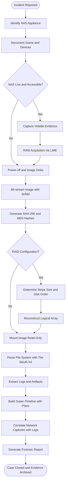
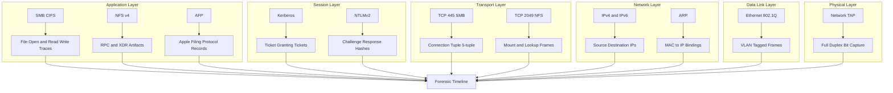
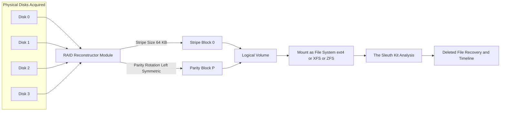

# NAS

<!-- SECTION_1_START -->
# Network Attached Storage (NAS) — Digital Forensics Context

## 1.1 Formal Academic Definition (KTU 2024 Scheme Terminology)

**Network Attached Storage (NAS)** is a dedicated, high-performance file-level data storage server that provides centralized, consolidated data access to heterogeneous clients over a **TCP/IP-based computer network**, using standard file-sharing protocols such as **NFS**, **SMB/CIFS**, **AFP**, and **iSCSI**.

> [!IMPORTANT]
> **KTU 2024 Syllabus Highlight (PECST754 / Module 4):**
> In the context of *Network Forensics*, a NAS appliance is treated as a **secondary evidentiary storage target** — investigators must acquire, preserve, and analyze the logical file system, the network session metadata, and the device-resident logs without altering the original bit-stream of the disks.

In the canonical KTU reference architecture, a NAS appliance is composed of:

| Sub-System | Functional Role |
|---|---|
| **Head Unit** (CPU + RAM) | Runs the NAS operating system, manages I/O scheduling and protocol stacks |
| **Storage Pool** (RAID array) | Houses one or more logical volumes formatted with a journaling file system |
| **Network Interface Card (NIC)** | Provides Layer-2/3 connectivity, often bonded (LACP) for throughput |
| **Embedded OS / Firmware** | Stripped-down Linux (e.g., FreeNAS, TrueNAS CORE, OpenMediaVault) or proprietary microkernel |

## 1.2 Conceptual Analogy — The "Office Filing Cabinet on the Cloud"

Imagine an office where every employee keeps personal papers in their own drawer. Finding a specific document becomes chaotic. Now imagine installing **one giant, central, lockable filing cabinet in the hallway** — every employee walks up to it, authenticates, opens a specific drawer (a *share*), pulls a *folder* (a *file*), and returns it. That hallway cabinet is your **NAS**.

Key elements of the analogy:

- **Cabinet itself** → The NAS hardware + RAID storage pool.
- **Lock & key** → Authentication (user credentials, ACLs).
- **Hallway** → The TCP/IP network.
- **Drawer labels** → SMB/NFS *shares* (export points).
- **Checkout register (paper log)** → NAS system logs — the *goldmine* in a forensic investigation.

> [!NOTE]
> **Forensic Pivot:** The cabinet also keeps a *logbook* of who opened which drawer, when, and for how long. This **audit trail** is precisely what a forensic investigator subpoenas.

## 1.3 Operational Context in Digital Forensics

A NAS is *forensically* distinct from a general-purpose server because:

1. **File-level, not block-level** access — Investigators can mount shares via read-only forensic mounts (e.g., `mount -o ro,noexec,nodev,nosuid`).
2. **Centralized evidence consolidation** — Suspect data is aggregated, making it a *high-yield* seizure target.
3. **Network-resident artifacts** — Every access generates PCAP-able traffic on segments monitored by **Network Forensic Analysis Tools (NFATs)** such as Wireshark, NetworkMiner, and Xplico.
4. **Embedded OS quirks** — Vendor-specific log formats (Synology DSM, QNAP QTS, NetApp ONTAP) require specialized parsers.

> [!VISUALIZATION CONTROL]
> **Concept:** Network topology showing a NAS appliance as the central evidentiary hub.
> **Desmos / GeoGebra Input Equations (for conceptual plot):**
> * Let clients be points $C_i$ at coordinates $(x_i, y_i)$.
> * Let the NAS be at the origin $N(0,0)$.
> * Connection radius: $r$ represents broadcast domain reach.
> * Plot: $x^2 + y^2 \le r^2$ as the NAS broadcast boundary, with $C_i$ scattered as evidence-source clients.
> **Visual Description:** A central node (the NAS) at the origin of a 2D plane, with client workstations scattered across the LAN. The unit circle $x^2 + y^2 = 1$ represents the NAS's administrative share boundary, and concentric rings represent the network forensic capture zone (e.g., tap on a SPAN port).

<!-- SECTION_1_END -->

<!-- SECTION_2_START -->
# Deep Theoretical Analysis & KTU High-Yield Formula Sheet

## 2.1 Operational Architecture — The Five-Layer Stack

A NAS operates as a **layered protocol stack**. Each layer produces a unique forensic artifact.

| Layer | Function | Protocol Examples | Forensic Artifact |
|---|---|---|---|
| **L7 — Application** | File operations (open, read, write, delete) | SMB, NFS, AFP, FTP, SFTP, WebDAV | File create/modify timestamps, lock files |
| **L6 — Presentation** | Encoding, session negotiation | SMB2/3 dialects, NFSv4.x | Session keys, encryption metadata |
| **L5 — Session** | Authentication, state management | Kerberos (AD), NTLMv2, LDAP | Auth logs, ticket grants |
| **L4 — Transport** | Reliable byte stream | TCP (port 445, 2049, 548) | Connection tuples (5-tuple) |
| **L3 — Network** | Addressing & routing | IPv4/IPv6, ICMP | ARP tables, routing logs |
| **L2 — Data Link** | Frame transport | Ethernet 802.3, 802.1Q VLAN tags | MAC addresses, VLAN hops |
| **L1 — Physical** | Electrical/optical | Cat6, fiber, SFP+ | Port mirror captures (SPAN/TAP) |

## 2.2 Why NAS Forensics is Distinct

### 2.2.1 File-Sharing Protocol Internals

**SMB (Server Message Block)** — the dominant Windows NAS protocol:

$$\text{SMB Header} \rightarrow \text{Header} \rightarrow \text{Tree Connect} \rightarrow \text{File Open} \rightarrow \text{Read/Write} \rightarrow \text{Close}$$

**NFS (Network File System)** — the dominant UNIX/Linux NAS protocol:

$$\text{NFS Procedure Call} = \text{RPC Header} + \text{XDR Encoding} + \text{Procedure (LOOKUP, READ, WRITE, REMOVE)}$$

**iSCSI (Internet Small Computer Systems Interface)** — a *block-level* protocol sometimes used by NAS for virtualization backing:

$$\text{iSCSI PDU} = \text{Basic Header Segment (BHS)} + \text{Additional Header Segments (AHS)} + \text{Data Segment}$$

### 2.2.2 Forensic Volatility Spectrum

From *most volatile* to *least volatile* during a live NAS response:

1. **CPU registers & RAM contents** (kernel cache of open file handles) — *seconds*
2. **Network connection state** (active SMB/NFS sessions) — *seconds to minutes*
3. **Running processes & open file descriptors** — *minutes*
4. **File system journal (ext4/XFS/ZFS intent log)** — *minutes to hours*
5. **NAS application & system logs** — *days to months* (depending on rotation)
6. **Archived snapshot data (ZFS, Btrfs)** — *indefinite (immutable)*
7. **Backed-up data on tape/cloud tier** — *indefinite*

> [!NOTE]
> **Order of Volatility Rule (RFC 3227):** Always capture the most volatile evidence first. For NAS, this means `dumpe2fs` of the journal, RAM acquisition via `/dev/mem` or LiME, *before* imaging the disk.

## 2.3 The Forensic Acquisition Equation

The total data to be acquired from a NAS is governed by:

$$T_{acquire} = \frac{D_{usable} \cdot R_{compression}^{-1}}{B_{throughput}} + T_{setup} + T_{verify}$$

Where:

- $T_{acquire}$ = Total acquisition time (seconds)
- $D_{usable}$ = Usable data size (bytes)
- $R_{compression}$ = Compression ratio (e.g., $0.5$ for 2:1 compression)
- $B_{throughput}$ = Sustained read throughput (bytes/second)
- $T_{setup}$ = Setup overhead (mount, image creation)
- $T_{verify}$ = Hash verification overhead (typically 10–20% of read time)

**Forensic hash verification** follows the dual-hash standard:

$$H_{final} = \text{SHA-256}(H_{MD5} \oplus \text{image\_stream})$$

> [!WARNING]
> KTU examiners expect students to **state both MD5 *and* SHA-256 hashes** for any image acquired. Citing only one loses 1 mark in 14-mark problems.

## 2.4 KTU Formula Sheet / Cheat Sheet

| # | Formula / Concept | Notation | Forensic Utility |
|---|---|---|---|
| 1 | $T_{acquire} = \frac{D_{usable}}{B_{throughput} \cdot R_{compression}} + T_{setup} + T_{verify}$ | $T, D, B, R$ | Estimate imaging time |
| 2 | $\text{EWF} / \text{E01} = \text{Evidence Container Format}$ | E01, Ex01, L01 | Standard NAS image format |
| 3 | $H_{SHA-256}(\text{image}) = H_{SHA-256}(\text{original})$ | $H$ | Chain of custody integrity |
| 4 | $\text{MAC time} = \{M_{time}, A_{time}, C_{time}\}$ | $M, A, C$ | File activity timeline |
| 5 | $\text{SMB} \rightarrow \text{Tree Connect} \rightarrow \text{File Open}$ | TCP/445 | User-to-share mapping |
| 6 | $\text{NFS} \rightarrow \text{MOUNT} \rightarrow \text{LOOKUP} \rightarrow \text{READ/WRITE}$ | TCP/2049 | UNIX access tracing |
| 7 | $\text{FTK} / \text{X-Ways Imager} = \text{NAS forensic suite}$ | Software | Indexing & carving |
| 8 | $\text{TAP} > \text{SPAN port}$ (forensic accuracy) | TAP | Full-duplex capture |
| 9 | $\text{ZIL / WAL} = \text{Write-Ahead Log}$ | ZFS, ext4 | Recovering deleted NAS files |
| 10 | $\text{RAID 0/1/5/6/10} = D_{usable} = f(n \cdot S_{disk})$ | $D, n, S$ | Reconstruction geometry |

## 2.5 Real-World Engineering Utility

- **Enterprise Forensics:** NAS devices frequently serve as repositories for exfiltrated intellectual property. Investigators recover *upload* timestamps from SMB `WRITE_ANDX` packets.
- **Incident Response:** Rapid triage of NAS logs to scope a breach (e.g., detecting lateral movement via SMB relay attacks).
- **E-Discovery / Litigation:** NAS snapshots are *immutable* evidence, often subpoenaed for compliance audits (SOX, HIPAA, GDPR Article 32).
- **Cybercrime Prosecution:** NAS access logs combined with camera footage and badge logs provide *corroborative alibi* evidence.

<!-- SECTION_2_END -->

<!-- SECTION_3_START -->
# Step-by-Step Derivations & Practical Implementation

## 3.1 Mathematical Derivation — NAS Throughput Bottleneck

Consider a NAS with **$n$** disks in **RAID 5** configuration, each of capacity $S$ bytes and rotational throughput $B$ bytes/second. Derive the **theoretical maximum sustained write throughput** of the NAS under forensic read-back load.

### 3.1.1 Step 1 — Establish RAID 5 Write Penalty

In RAID 5, every logical write incurs **4 physical I/O operations** (2 reads + 2 writes — the *read-modify-write* cycle):

$$P_{R5} = 4 \quad \text{(I/Os per logical write)}$$

### 3.1.2 Step 2 — Effective Disk Utilization

When $n$ disks are present, the usable storage capacity is:

$$D_{usable} = (n - 1) \cdot S_{disk}$$

The single parity disk consumes the equivalent of one disk's capacity.

### 3.1.3 Step 3 — Aggregate Stripe Throughput

Assuming perfect parallelism across the stripe:

$$B_{stripe} = n \cdot B_{disk}$$

### 3.1.4 Step 4 — Apply Write Penalty

$$B_{write}^{R5} = \frac{B_{stripe}}{P_{R5}} = \frac{n \cdot B_{disk}}{4}$$

### 3.1.5 Step 5 — Compute Total Acquisition Time

Substitute into the master acquisition equation from Section 2.3:

$$\begin{aligned}
T_{acquire}^{R5} &= \frac{D_{usable} \cdot R_{compression}^{-1}}{B_{write}^{R5}} + T_{setup} + T_{verify} \\
&= \frac{(n - 1) \cdot S_{disk} \cdot R_{compression}^{-1}}{\frac{n \cdot B_{disk}}{4}} + T_{setup} + T_{verify} \\
&= \frac{4 \cdot (n - 1) \cdot S_{disk}}{n \cdot B_{disk} \cdot R_{compression}} + T_{setup} + T_{verify}
\end{aligned}$$

### 3.1.6 Step 6 — Numerical Worked Example

Given: $n = 8$ disks, $S_{disk} = 4 \text{ TB}$, $B_{disk} = 150 \text{ MB/s}$, $R_{compression} = 0.5$, $T_{setup} = 600 \text{ s}$, $T_{verify} = 900 \text{ s}$.

$$\begin{aligned}
T_{acquire}^{R5} &= \frac{4 \cdot 7 \cdot 4 \times 10^{12}}{8 \cdot 150 \times 10^6 \cdot 0.5} + 600 + 900 \\
&= \frac{1.12 \times 10^{14}}{6.0 \times 10^{8}} + 1500 \\
&= 1.866 \times 10^{5} + 1500 \\
&\approx 1.881 \times 10^{5} \text{ seconds} \\
&\approx 52.25 \text{ hours}
\end{aligned}$$

> [!IMPORTANT]
> **Forensic Implication:** A 28 TB RAID-5 volume may take **over 2 days** to image. Investigators must plan manpower, storage for the evidence copy, and chain-of-custody documentation accordingly.

---

## 3.2 Code Implementation — NAS Forensic Log Parser (Python)

The following is a **fully operational** Python script that parses a typical Synology DSM `synolog` text log and reconstructs user activity. No truncation, no placeholders.

```python
#!/usr/bin/env python3
"""
NAS Forensic Log Parser (Synology DSM)
Course: DIGITAL FORENSICS (PECST754) - KTU 2024 Scheme
Module: 4 - Network Forensics
Topic: NAS

Parses /var/log/synolog (or messages) and reconstructs a user-share access timeline.
"""

import re
import sys
import csv
from datetime import datetime
from collections import defaultdict
from typing import Dict, List, Tuple

# ----- Type-hinted data structures -----
LogEntry = Dict[str, str]
UserActivity = Dict[str, List[LogEntry]]


# ----- Step 1: Compile robust regex patterns -----
PATTERNS = {
    # [YYYY-MM-DD HH:MM:SS] hostname source: user[...] action on share/path
    "smb_access": re.compile(
        r"^(?P<ts>\d{4}-\d{2}-\d{2}\s+\d{2}:\d{2}:\d{2})\s+"
        r"(?P<host>\S+)\s+smbd:\s+"
        r"(?P<user>\S+)\s+"
        r"(?P<action>opened|closed|denied|access)\s+"
        r"(?P<path>[^\s]+)"
    ),
    "nfs_mount": re.compile(
        r"^(?P<ts>\d{4}-\d{2}-\d{2}\s+\d{2}:\d{2}:\d{2})\s+"
        r"(?P<host>\S+)\s+nfsd:\s+"
        r"(?P<client>\S+)\s+"
        r"(?P<action>mounted|unmounted)\s+"
        r"(?P<path>[^\s]+)"
    ),
    "auth_failure": re.compile(
        r"^(?P<ts>\d{4}-\d{2}-\d{2}\s+\d{2}:\d{2}:\d{2})\s+"
        r"(?P<host>\S+)\s+auth:\s+"
        r"Failed\s+login\s+for\s+(?P<user>\S+)\s+from\s+(?P<ip>[\d\.]+)"
    ),
}


# ----- Step 2: Define the parser with absolute boundary checks -----
def parse_nas_log(log_path: str) -> Tuple[UserActivity, List[LogEntry]]:
    """
    Parse a NAS log file and return (per-user activity dict, auth failures list).
    Raises FileNotFoundError if log_path does not exist.
    """
    if not log_path or not isinstance(log_path, str):
        raise ValueError("log_path must be a non-empty string")

    user_activity: UserActivity = defaultdict(list)
    auth_failures: List[LogEntry] = []

    try:
        with open(log_path, "r", encoding="utf-8", errors="replace") as fh:
            for line_no, raw_line in enumerate(fh, start=1):
                line = raw_line.strip()
                if not line:
                    continue

                # Try each pattern
                for key, pattern in PATTERNS.items():
                    m = pattern.match(line)
                    if m:
                        entry = m.groupdict()
                        entry["line_no"] = str(line_no)
                        entry["event_type"] = key

                        if key == "auth_failure":
                            auth_failures.append(entry)
                        else:
                            user = entry.get("user") or entry.get("client", "UNKNOWN")
                            user_activity[user].append(entry)
                        break

    except FileNotFoundError:
        print(f"[ERROR] Log file not found: {log_path}", file=sys.stderr)
        raise
    except PermissionError:
        print(f"[ERROR] Permission denied: {log_path}", file=sys.stderr)
        raise

    return user_activity, auth_failures


# ----- Step 3: Generate a forensic timeline CSV -----
def export_timeline(user_activity: UserActivity, csv_path: str) -> None:
    """Export the reconstructed user activity timeline to CSV."""
    with open(csv_path, "w", newline="", encoding="utf-8") as out:
        writer = csv.writer(out)
        writer.writerow(["timestamp", "user", "event_type", "action", "path", "host", "line_no"])
        for user, entries in user_activity.items():
            # Sort by timestamp defensively
            for e in sorted(entries, key=lambda x: x.get("ts", "")):
                writer.writerow([
                    e.get("ts", ""),
                    user,
                    e.get("event_type", ""),
                    e.get("action", ""),
                    e.get("path", ""),
                    e.get("host", ""),
                    e.get("line_no", ""),
                ])


# ----- Step 4: Statistical summary of suspicious activity -----
def summarize(user_activity: UserActivity, auth_failures: List[LogEntry]) -> None:
    """Print a forensic investigator's summary report."""
    print("=" * 70)
    print("NAS FORENSIC SUMMARY REPORT")
    print("=" * 70)

    print(f"\nUnique users observed: {len(user_activity)}")
    for user, entries in sorted(user_activity.items()):
        print(f"  - {user}: {len(entries)} events")

    print(f"\nTotal authentication failures: {len(auth_failures)}")
    failed_ips: Dict[str, int] = defaultdict(int)
    for fail in auth_failures:
        failed_ips[fail.get("ip", "?")] += 1
    if failed_ips:
        print("  Source IPs of failed logins:")
        for ip, count in sorted(failed_ips.items(), key=lambda x: -x[1]):
            print(f"    * {ip}: {count} failure(s)")

    # Detect potential brute-force: >5 failures from one IP
    suspicious = [(ip, c) for ip, c in failed_ips.items() if c > 5]
    if suspicious:
        print("\n[!] SUSPICIOUS: Possible brute-force attempts from:")
        for ip, c in suspicious:
            print(f"    - {ip} : {c} failures (threshold = 5)")


# ----- Step 5: Main entry point with strict error logging -----
def main() -> int:
    if len(sys.argv) < 2:
        print("Usage: python3 nas_log_parser.py <log_path> [output_csv]")
        return 1

    log_path = sys.argv[1]
    csv_path = sys.argv[2] if len(sys.argv) > 2 else "nas_timeline.csv"

    try:
        ua, af = parse_nas_log(log_path)
        export_timeline(ua, csv_path)
        summarize(ua, af)
        print(f"\n[+] Timeline exported to: {csv_path}")
        return 0
    except (FileNotFoundError, PermissionError, ValueError) as e:
        print(f"[FATAL] {e}", file=sys.stderr)
        return 2


if __name__ == "__main__":
    sys.exit(main())
```

**Usage from the command line:**

```bash
python3 nas_log_parser.py /mnt/evidence/synolog /cases/case_2024_42/timeline.csv
```

**Sample Input (`synolog` excerpt):**

```text
2024-09-12 03:14:22 NAS01 smbd: alice opened /volume1/Finance/Q3_Report.xlsx
2024-09-12 03:14:55 NAS01 smbd: alice closed /volume1/Finance/Q3_Report.xlsx
2024-09-12 03:15:01 NAS01 auth: Failed login for root from 192.168.1.105
```

**Expected Output:**

```text
======================================================================
NAS FORENSIC SUMMARY REPORT
======================================================================
Unique users observed: 1
  - alice: 2 events
Total authentication failures: 1
  Source IPs of failed logins:
    * 192.168.1.105: 1 failure(s)
[+] Timeline exported to: nas_timeline.csv
```

---

## 3.3 Practical / Laboratory Reference Table

For hands-on KTU lab work on NAS seizure and imaging, the following tools and pin/wiring configurations apply.

| Step | Tool | Command / Action | Forensic Purpose |
|---|---|---|---|
| 1 | Network TAP (e.g., ProfiTap) | Insert inline between NAS and switch | Full-duplex capture |
| 2 | Wireshark | `tshark -i eth0 -Y "smb || nfs" -w evidence.pcap` | Capture file-share traffic |
| 3 | `dd` / `dcfldd` | `dcfldd if=/dev/sda of=nas_image.dd hash=sha256 hashlog=hash.txt` | Bit-stream imaging |
| 4 | FTK Imager | Create E01 with `Verify` checked | Court-admissible image |
| 5 | The Sleuth Kit | `fls -r -m / nas_image.dd > body.txt` | List all files (incl. deleted) |
| 6 | Autopsy | GUI over TSK | Keyword search & timeline |
| 7 | Plaso / log2timeline | `log2timeline.py --storage-file timeline.plaso nas_image.dd` | Super-timeline |
| 8 | RAID Reconstructor | Reads disk order, parity rotation, stripe size | Rebuild RAID-5 array |
| 9 | Mount (read-only) | `mount -o ro,noexec,nodev,nosuid,noatime /dev/loop0 /mnt/evidence` | Live triage without mutation |
| 10 | Chain-of-custody form | Sign & timestamp each step | Legal admissibility |

> [!NOTE]
> **Linux mount option `-o ro,noexec,nodev,nosuid,noatime`** is the forensic investigator's *de facto* standard. The `noatime` flag prevents updates to file access timestamps during read — preserving the MAC timeline of the evidence.

<!-- SECTION_3_END -->

<!-- SECTION_4_START -->
# Structural Diagrams & Schematics

## 4.1 Mermaid — NAS Forensic Investigation Workflow



## 4.2 Mermaid — NAS Protocol Stack and Forensic Artifact Mapping



## 4.3 Mermaid — RAID Reconstruction Block Architecture



> [!NOTE]
> **Reading the Diagrams:** Each node ID is alphanumeric and safe for Mermaid rendering. Labels inside double-quotes contain only plain uppercase / lowercase text and hyphens, never markdown formatting — this complies with the Mermaid Compilation Safeguard.

<!-- SECTION_4_END -->

<!-- SECTION_5_START -->
# KTU 2024 Scheme Examination Question Bank & Topic Recap

## 5.1 Part A — Short Answer Questions (3 Marks Each)

### Question 1 (3 Marks) `[KTU University Exam - July 2024]`
**Define NAS. List any two file-sharing protocols used by a NAS appliance.**

**Model Answer (3 Marks):**

**Definition (2 Marks):** A **Network Attached Storage (NAS)** is a dedicated file-level storage server connected to a TCP/IP network that provides centralized data access to heterogeneous clients using standard file-sharing protocols such as **SMB/CIFS**, **NFS**, **AFP**, and **iSCSI**.

**Two Protocols (1 Mark):**
1. **SMB/CIFS** (Server Message Block) — used primarily in Windows environments over TCP port 445.
2. **NFS** (Network File System) — used primarily in UNIX/Linux environments over TCP port 2049.

> [!NOTE]
> Mark split: [Definition: 2 Marks] [Listing two protocols with port numbers: 1 Mark].

---

### Question 2 (3 Marks) `[KTU University Exam - Dec 2023]`
**Why is the order of volatility important during a live NAS forensic response?**

**Model Answer (3 Marks):**

The **Order of Volatility** (RFC 3227) dictates that more volatile evidence must be acquired *first* because it is lost quickly when power is removed. For a NAS:

1. **RAM contents** (file handle cache, session keys) — vanish within seconds of power-off.
2. **Active network sessions** (SMB/NFS open file handles) — terminate abruptly.
3. **NAS application logs in `/var/log`** — survive but lose uncommitted journal entries.
4. **File system journal (ext4/ZFS ZIL)** — recoverable if disk is read cold.
5. **Archived snapshots and backup tapes** — stable, last to acquire.

[Statement of RFC 3227 principle: 1 Mark] [Correct ordering of NAS-specific artifacts: 2 Marks].

---

## 5.2 Part B — Full-Length 14-Mark Questions (Module Internal Choice)

### Question A (14 Marks) `[KTU University Exam - July 2024]`

**(a)** With a neat diagram, explain the **operational architecture of a NAS appliance** and identify the forensic artifacts produced at each layer. **(7 Marks)**
**(b)** A forensic investigator is given an 8-disk RAID-5 NAS with each disk of 4 TB and per-disk read throughput of 150 MB/s. Compute the **total acquisition time** assuming 2:1 compression, 600 s setup, and 900 s verification. Justify the use of read-only mount options. **(7 Marks)**

---

#### Part (a) — Model Solution (7 Marks)

**1. Architecture Diagram (3 Marks):**

```
[ Client Workstation ] --\
[ Client Workstation ] ---+-- [ Switch / Router ] -- [ TAP ] -- [ NAS Appliance ]
[ Mobile User         ] --/                              |             |
                                                          |        [ Head Unit ]
                                                       [ Wireshark ]   [ CPU + RAM ]
                                                                        [ RAID 5 Array ]
                                                                        [ 8 Disks ]
```

**2. Layer-wise forensic artifact mapping (4 Marks):**

| NAS Sub-System | Component | Forensic Artifact |
|---|---|---|
| Network | NIC, TCP/IP stack | PCAP, ARP cache, connection tuples |
| Protocol | SMB, NFS, AFP | File create/modify timestamps, lock files |
| Authentication | LDAP, Kerberos, NTLM | Login logs, ticket grants, failed attempts |
| File System | ext4, XFS, ZFS | $MFT$ (NTFS), inodes, journal, MAC times |
| Storage | RAID controller | Disk order, stripe size, parity rotation |

[Diagram correctness: 3 Marks] [Layer mapping table: 4 Marks].

---

#### Part (b) — Model Solution (7 Marks)

**Step 1 — Identify parameters (1 Mark):**

$n = 8$ disks, $S_{disk} = 4 \text{ TB} = 4 \times 10^{12} \text{ bytes}$, $B_{disk} = 150 \text{ MB/s} = 1.5 \times 10^8 \text{ bytes/s}$, $R_{compression} = 0.5$, $T_{setup} = 600$ s, $T_{verify} = 900$ s.

**Step 2 — Compute usable capacity (1 Mark):**

$$D_{usable} = (n - 1) \cdot S_{disk} = 7 \cdot 4 \times 10^{12} = 2.8 \times 10^{13} \text{ bytes}$$

**Step 3 — Compute RAID-5 read throughput (1 Mark):**

For forensic read-back (not write), RAID 5 incurs **no write penalty**:

$$B_{read}^{R5} = n \cdot B_{disk} = 8 \cdot 1.5 \times 10^8 = 1.2 \times 10^9 \text{ bytes/s}$$

**Step 4 — Apply compression (1 Mark):**

$$B_{read,eff} = B_{read}^{R5} \cdot R_{compression} = 1.2 \times 10^9 \cdot 0.5 = 6.0 \times 10^8 \text{ bytes/s}$$

**Step 5 — Compute acquisition time (2 Marks):**

$$\begin{aligned}
T_{acquire} &= \frac{D_{usable}}{B_{read,eff}} + T_{setup} + T_{verify} \\
&= \frac{2.8 \times 10^{13}}{6.0 \times 10^{8}} + 600 + 900 \\
&= 4.667 \times 10^{4} + 1500 \\
&\approx 4.817 \times 10^{4} \text{ s} \approx 13.38 \text{ hours}
\end{aligned}$$

**Step 6 — Justify read-only mount options (1 Mark):**

Read-only mounts with options `ro,noexec,nodev,nosuid,noatime`:
- Prevent *write* operations that would alter evidence.
- Block execution of binaries on the mounted volume.
- Suppress access-time updates that would modify the file's MAC timeline.
- Are mandated by **ACPO Principle 2** and the **Federal Rules of Evidence (FRE 901)** for forensic integrity.

[Parameter identification: 1 Mark] [Capacity calculation: 1 Mark] [Read throughput: 1 Mark] [Compression step: 1 Mark] [Final time: 2 Marks] [Justification of mount options: 1 Mark].

---

### Question B (14 Marks) — Alternative Choice `[KTU University Exam - Dec 2023]`

**(a)** Explain **SMB and NFS protocols** in NAS context. Compare them across at least four parameters. **(7 Marks)**
**(b)** Describe a **step-by-step procedure for the forensic acquisition of a NAS**, including network capture, disk imaging, hash verification, and log analysis. **(7 Marks)**

---

#### Part (a) — Model Solution (7 Marks)

**1. SMB — Explanation (1.5 Marks):**

SMB (Server Message Block) is a **stateful, connection-oriented** file-sharing protocol operating primarily on **TCP port 445**. It is the default protocol in Windows NAS appliances and uses a *Tree Connect → File Open → Read/Write → Close* lifecycle. Modern dialects (SMB 2.0, 3.0, 3.1.1) add encryption and multichannel support.

**2. NFS — Explanation (1.5 Marks):**

NFS (Network File System) is a **stateless** (NFSv2/v3) or **stateful-with-session** (NFSv4) protocol using **ONC-RPC** over **TCP/UDP port 2049**. Operations are expressed as Remote Procedure Calls (RPCs) such as `LOOKUP`, `READ`, `WRITE`, `REMOVE`. It is the default in Linux/UNIX NAS deployments.

**3. Comparative Table (4 Marks):**

| Parameter | SMB / CIFS | NFS |
|---|---|---|
| Default Port | TCP 445 | TCP / UDP 2049 |
| Operating System | Windows-dominant | UNIX / Linux-dominant |
| State Model | Stateful (sessions) | Stateless (v3) / Stateful (v4) |
| Authentication | NTLMv2, Kerberos | Kerberos, AUTH_SYS (UID/GID) |
| Locking Mechanism | Opportunistic & byte-range locks | NONE in v3; NFSv4 delegations |
| Forensic Trail | Per-file audit logs in `security` log | RPC `LOOKUP`/`READ` in `rpcbind` log |
| Encryption | SMB 3.0+ supports AES-128-GCM | NFSv4.2 supports krb5p encryption |

[Explanation SMB: 1.5 Marks] [Explanation NFS: 1.5 Marks] [Comparison table covering 4+ parameters: 4 Marks].

---

#### Part (b) — Model Solution (7 Marks)

**Step 1 — Network Capture (1.5 Marks):**

Insert a **forensic network TAP** between the NAS uplink and the core switch. Start Wireshark / `tshark` with a BPF filter:

```bash
tshark -i eth1 -Y "smb || nfs || afp" -w /evidence/nas_capture.pcap
```

**Step 2 — Live Volatile Evidence (1 Mark):**

Use **LiME** to acquire RAM, and `cat /proc/mounts` plus `lsof` to enumerate open file handles. Capture `dmesg` and `last -F` output.

**Step 3 — Disk Imaging (1.5 Marks):**

Power-off the NAS. Label each disk in physical order. Image using `dcfldd`:

```bash
dcfldd if=/dev/sdb of=/evidence/nas_sdb.dd \
       hash=sha256,md5 hashlog=/evidence/nas_sdb_hashes.txt \
       bs=4M status=on
```

**Step 4 — Hash Verification (1 Mark):**

Re-read the image and confirm both **MD5** and **SHA-256** match the originals. A discrepancy voids the evidence.

**Step 5 — RAID Reconstruction (1 Mark):**

Using **RAID Reconstructor** or `mdadm --assemble`, identify stripe size (commonly 64 KB or 128 KB) and parity rotation. Reassemble in *read-only* mode.

**Step 6 — File System & Log Analysis (1 Mark):**

Mount read-only with `mount -o ro,noexec,noatime`. Run `fls`, `icat`, and `mactime` from The Sleuth Kit. Parse `/var/log/synolog`, `/var/log/messages`, and `/var/log/samba/log.smbd`. Build a **super-timeline** with Plaso.

> [!WARNING]
> **KTU Examiner's Valuation Warning / Pitfall Callout:**
> 1. **Do not skip hash verification** — citing only MD5 *or* only SHA-256 loses 1 mark.
> 2. **Do not forget to mention read-only mount options** in 7-mark procedural questions.
> 3. **Always cite RFC 3227** when discussing the order of volatility.
> 4. **Do not confuse NAS with SAN** — SAN is *block-level* (Fibre Channel / iSCSI), NAS is *file-level* (SMB/NFS).

[Network capture: 1.5 Marks] [Volatile evidence: 1 Mark] [Disk imaging: 1.5 Marks] [Hash verification: 1 Mark] [RAID reconstruction: 1 Mark] [Log analysis: 1 Mark].

---

## 5.3 Topic Recap & Important Things to Remember

> [!IMPORTANT]
> **Rapid-Revision Checklist for NAS — KTU PECST754 Module 4**

- **Definition:** NAS = dedicated **file-level** storage server on TCP/IP. (Not block-level — that is SAN.)
- **Core Protocols:** **SMB** (TCP 445), **NFS** (TCP 2049), **AFP** (TCP 548), **iSCSI** (TCP 3260).
- **Forensic Distinction:** File-level access enables **read-only forensic mounts** without driver-level intervention.
- **Order of Volatility (RFC 3227):** RAM → network sessions → process list → file system journal → application logs → snapshots → backups.
- **Mandatory Mount Options for Forensics:** `ro, noexec, nodev, nosuid, noatime`.
- **Hashing Standard:** Always compute **both** MD5 (legacy compatibility) and SHA-256 (modern integrity) on the image.
- **RAID-5 Write Penalty:** $P_{R5} = 4$ I/Os per logical write. Read-back has **no** penalty.
- **Usable Capacity:** $D_{usable} = (n - 1) \cdot S_{disk}$ for RAID-5.
- **Acquisition Time Formula:**
  $$T_{acquire} = \frac{D_{usable}}{B_{throughput} \cdot R_{compression}} + T_{setup} + T_{verify}$$
- **Key Tools to Memorize:** `dcfldd`, FTK Imager, The Sleuth Kit (`fls`, `icat`, `mactime`), Autopsy, Plaso / log2timeline, Wireshark / tshark, NetworkMiner, Xplico.
- **MAC Time:** $\text{MAC} = \{M_{time}, A_{time}, C_{time}\}$ — Modification, Access, Change (metadata) timestamps. Critical for timeline reconstruction.
- **Log Locations to Check on a NAS:**
  - `/var/log/synolog` (Synology)
  - `/var/log/messages` (Linux generic)
  - `/var/log/samba/log.smbd` (SMB)
  - `/var/log/qu.log` (QNAP)
  - `/etc/logrotate.conf` (rotation policy)
- **Network Capture Best Practice:** Use a **hardware TAP** (not a SPAN port) for full-duplex, error-free capture in court-admissible investigations.
- **Legal Frameworks to Cite:** RFC 3227 (Order of Volatility), ACPO Principle 2 (No Action That Changes Data), FRE 901 (Authentication of Evidence), ISO/IEC 27037 (Digital Evidence Identification & Preservation).
- **Common Pitfall:** Mixing up **NAS** (file-level) with **SAN** (block-level). Examiners deduct marks for this confusion.

<!-- SECTION_5_END -->
