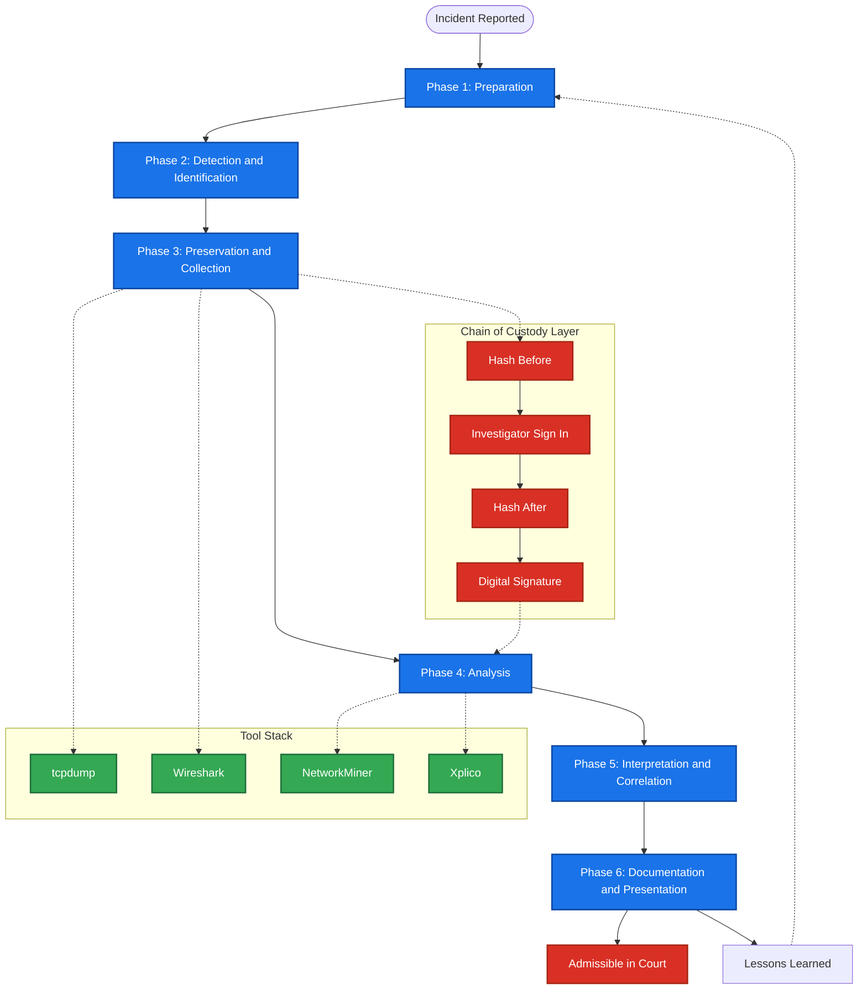
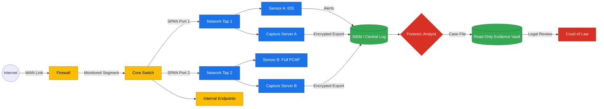
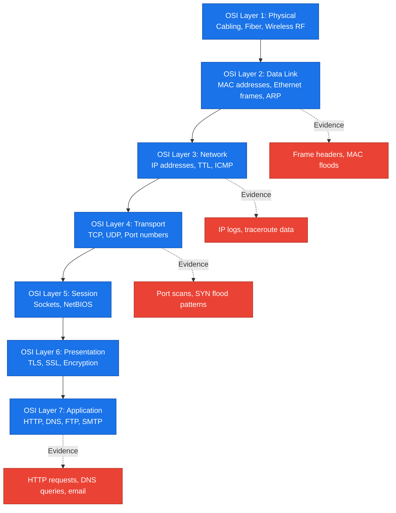

# Network Forensics - Introduction to Network Forensics

<!-- SECTION_1_START -->
# Network Forensics - Introduction

## 1. Core Technical Definition

> [!IMPORTANT]
> **Network Forensics** is the sub-branch of digital forensics that involves the **monitoring, capture, recording, preservation, and analysis of network traffic and events** to investigate security incidents, detect intrusions, gather digital evidence, and reconstruct network-based criminal activities.

According to the **NIST SP 800-86** framework (the de-facto KTU reference standard), network forensics is defined as the process of *"capturing, recording, and analyzing network packets and event logs to determine the truth about an incident."*

Formally, the discipline is the application of scientifically derived and proven methods toward the **preservation, collection, validation, identification, analysis, interpretation, documentation, and presentation** of digital evidence derived from network sources for the purpose of facilitating or furthering the reconstruction of events found to be criminal, or helping to anticipate unauthorized actions shown to be disruptive to planned operations.

### Conceptual Analogy / Intuition

> [!NOTE]
> **Analogy: The Airport Security Surveillance System**
>
> Imagine a major international airport. Every passenger (a **network packet**) carries a boarding pass (a **header** with source/destination IPs, ports, protocols). CCTV cameras at every checkpoint (a **network tap/sensor**) record each passenger's face, ticket, baggage, and movement. After a security incident (a **cyber attack**), forensic investigators (the **network forensic analyst**) replay all CCTV footage, cross-reference passenger lists, and reconstruct the suspect's journey gate-by-gate.
>
> - The airport itself is the **network infrastructure** (LAN, WAN, Internet).
> - The CCTV recorders are **packet sniffers** (Wireshark, tcpdump).
> - The passenger manifests are **flow records** (NetFlow, sFlow).
> - The investigator reconstructing the timeline is the **forensic analyst**.
>
> Just as airport footage can be **tampered with**, network logs can too — which is why **chain of custody** and **write-blocker principles** are sacred in network forensics.

### GeoGebra / Desmos Visualization Callout

> [!VISUALIZATION CONTROL]
> **Concept:** Packet Capture Window (Time vs. Bytes Timeline)
> **GeoGebra / Desmos Input Equations:**
> * `Plot a piecewise function representing TCP handshake: f(x) = {1 if SYN, 2 if SYN-ACK, 3 if ACK}`
> * `X-axis: Time in seconds (0 to 60)`
> * `Y-axis: Packet State (1 to 7 representing OSI Layers)`
> **Visual Description:** A step-function plot where the x-axis represents time progression and the y-axis shows the transition of a TCP three-way handshake. Students should observe three discrete vertical jumps (SYN → SYN-ACK → ACK) followed by a horizontal data transfer plateau, then FIN-ACK termination. This mirrors how Wireshark's I/O graph displays live packet capture.

### Key Terminology Snapshot

| Term | Meaning |
|---|---|
| **NIC (Network Interface Card)** | Hardware that connects a device to a network; operates in **promiscuous mode** during forensic capture. |
| **Promiscuous Mode** | A mode where the NIC accepts **all** packets traversing the wire, not only those addressed to it. |
| **Packet** | The fundamental unit of data transmitted over a network (typically **64 bytes** minimum for Ethernet). |
| **Frame** | The Layer-2 (Data Link) encapsulation of a packet. |
| **Flow / Session** | A logical grouping of packets sharing the **5-tuple**: source IP, destination IP, source port, destination port, protocol. |
| **PCAP (Packet Capture)** | The standard file format (`.pcap`, `.pcapng`) for storing captured network traffic. |
| **Hash (MD5/SHA-256)** | A cryptographic fingerprint used to verify evidence integrity. The **MD5** produces a **128-bit** hash, while **SHA-256** produces a **256-bit** hash. |
| **Chain of Custody** | The documented, unbroken chronological record of evidence possession. |

<!-- SECTION_1_END -->

<!-- SECTION_2_START -->
# 2. Deep Theoretical Analysis

## 2.1 The Network Forensic Investigation Process (NFIP)

The NFIP, as standardized in the KTU 2024 PECST754 syllabus, consists of **six (6) sequential phases**. Each phase has explicit deliverables and is governed by the **ACPO (Association of Chief Police Officers)** principles of digital evidence handling.

### Phase 1: Preparation
- Deploy monitoring infrastructure (IDS/IPS sensors, taps, SPAN ports).
- Define **legal authorization** (search warrant, court order, organizational policy).
- Establish baseline network behavior (e.g., average throughput of **100 Mbps** during business hours).

### Phase 2: Detection (Identification of Incident)
- Trigger sources: SIEM alerts, user reports, anomaly detection systems.
- Identify the **Incident Detection Point (IDP)** — the first known timestamp of compromise.

### Phase 3: Preservation (Evidence Collection)
- Capture live traffic using **tcpdump**, **Wireshark**, **NetworkMiner**, or commercial tools like **NetWitness**.
- Store evidence in **forensically-sound** formats: **PCAP-NG** with SHA-256 verification.
- **CRITICAL**: Use **write-blockers** or capture directly to read-only media to prevent alteration.
- Compute hash **before** and **after** acquisition to prove integrity.

### Phase 4: Analysis
- Reconstruct sessions, decrypt traffic (if lawful key escrow exists), correlate with logs.
- Apply the **Locard's Exchange Principle** — every network interaction leaves traces at both endpoints.
- Identify Indicators of Compromise (IoCs): IP addresses, domain names, file hashes, registry keys.

### Phase 5: Interpretation & Correlation
- Map events to a **timeline** (using tools like **Plaso / Timesketch**).
- Correlate with **endpoint forensics** (disk images, memory dumps).
- Build a hypothesis chain: *What → How → Who → Why*.

### Phase 6: Documentation & Presentation
- Generate a **Forensic Investigation Report (FIR)** admissible in court.
- Include: tools used, methodology, hash values, screenshots, witness statements.
- Present in plain language for non-technical stakeholders (judges, juries, executives).

## 2.2 Network Forensics vs. Computer Forensics

> [!NOTE]
> **KTU Favourite Comparison** — frequently asked in Part A questions.

| Parameter | Computer Forensics | Network Forensics |
|---|---|---|
| **Data Source** | Storage media (HDD, SSD, USB) | Live/in-transit network traffic |
| **Data Volatility** | **Persistent** (survives reboot) | **Highly volatile** (lost if not captured) |
| **Collection Point** | Endpoint devices | Wire, NIC, IDS sensor, firewall logs |
| **Time Sensitivity** | Low to moderate | **Extreme** (packets disappear in milliseconds) |
| **Data Volume** | GB to TB | GB to PB per day on enterprise networks |
| **Tools** | EnCase, FTK, Autopsy | Wireshark, tcpdump, NetworkMiner, Xplico |
| **Primary Challenge** | Anti-forensics, encryption at rest | Encryption in transit (TLS 1.3), NAT, TOR |
| **Legal Posture** | Seize & image the device | Intercept, log, and preserve flows |

## 2.3 Types of Network Forensics

1. **Passive Network Forensics**
   - Uses **promiscuous-mode** capture on a hub or SPAN port.
   - Does **not** alter network behavior.
   - **Most legally defensible** method.

2. **Active Network Forensics**
   - Injects probes (e.g., **Nmap**, **ping sweeps**) into the network.
   - May **modify** traffic and is therefore more legally restrictive.

3. **Hybrid (Inline) Forensics**
   - Uses an **inline tap** or **Network Access Control (NAC)** device.
   - Can **block malicious traffic** while logging it.
   - Examples: **FireEye NX**, **Cisco Stealthwatch**.

4. **Wireless Network Forensics**
   - Captures 802.11 frames using **airpcap** or monitor-mode Wi-Fi adapters.
   - Decrypts WPA2/WPA3 traffic using captured 4-way handshakes.

## 2.4 KTU High-Yield Formula Sheet

> [!IMPORTANT]
> **The formulas below are the **must-know** mathematical relationships for KTU university exam numericals.**

| # | Concept | Formula / Expression | Units / Notes |
|---|---|---|---|
| 1 | **5-Tuple Identification** | $T = (SrcIP, DstIP, SrcPort, DstPort, Proto)$ | Each tuple uniquely identifies a flow. |
| 2 | **Evidence Integrity Hash** | $H = \text{SHA256}(E)$ where $E$ = evidence file | Hexadecimal output of length **64 chars**. |
| 3 | **Capture Duration** | $T_c = \frac{S_{pcap}}{R_{avg}}$ | $S_{pcap}$ = PCAP size (bytes), $R_{avg}$ = avg write rate (bytes/sec). |
| 4 | **Packet Loss Probability** | $P_{loss} = 1 - \left(1 - \frac{1}{B}\right)^{N}$ | $B$ = buffer size (packets), $N$ = packets in burst. |
| 5 | **Bandwidth Utilization** | $U = \frac{T_{rx} + T_{tx}}{B_{max}} \times 100\%$ | Expressed as a **percentage**. |
| 6 | **Round-Trip Time (RTT)** | $RTT = T_{ack\_recv} - T_{syn\_sent}$ | Measured in **milliseconds (ms)**. |
| 7 | **Throughput** | $\Theta = \frac{D_{bytes}}{T_{elapsed}}$ | Common unit: **Mbps** or **Gbps**. |
| 8 | **Collision Domain Size** | $L_{max} = \frac{5 \times 10^{3}}{V_p}$ meters | $V_p$ = propagation velocity (m/s). |
| 9 | **Log Volume Estimation** | $V_{log} = N_{events} \times S_{avg} \times 86400$ | $S_{avg}$ = avg log size (**~512 bytes**), 86400 = sec/day. |
| 10 | **Mean Time to Detect (MTTD)** | $MTTD = \frac{\sum (T_{detect} - T_{occur})}{N_{incidents}}$ | Reported in **hours**. |

### Engineering Utility (Real-World Deployment)

Network forensics is the **backbone of modern Security Operations Centers (SOCs)** and is mandated by several compliance frameworks:

- **PCI-DSS v4.0** (Requirement 10) — Logging and monitoring of all access to network resources and cardholder data.
- **HIPAA Security Rule** (§ 164.312(b)) — Audit controls for electronic protected health information.
- **GDPR Article 32** — Security of processing; mandates breach detection within **72 hours**.
- **ISO/IEC 27037:2012** — Guidelines for identification, collection, acquisition, and preservation of digital evidence.

In **Incident Response (IR)** teams, network forensics feeds the **Diamond Model of Intrusion Analysis** (Adversary → Capability → Infrastructure → Victim) and the **MITRE ATT&CK** framework (TA0008 — Enterprise/Lateral Movement).

<!-- SECTION_2_END -->

<!-- SECTION_3_START -->
# 3. Step-by-Step Implementation, Tools, and Code

## 3.1 Exhaustive Step-by-Step: A Live Network Capture Workflow

### Step A: Determine the Capture Point
- Place the forensic sensor **inline** (between the firewall and the internal switch) using a **network tap** or a **SPAN (Switched Port Analyzer)** port.
- **Tap types:** 
  * **Passive copper tap** — splits the signal without breaking the link.
  * **Aggregating tap** — combines Tx and Rx onto one monitoring port.
  * **Regenerating tap** — has dual outputs to multiple tools.

### Step B: Authenticate the Investigator
- Login with **non-privileged** account for collection; **privileged** account only for analysis (separation of duties).
- Record the **investigator name, badge ID, timestamp, purpose** in the chain-of-custody form.

### Step C: Configure the Capture Tool
- Set the capture filter (e.g., `host 192.168.1.100 and port 443` to capture only HTTPS traffic to a specific host).
- Set the **snap length** (default **65535 bytes** for full-packet capture).
- Enable **file rotation** every **100 MB** to avoid a single huge file.

### Step D: Capture Traffic
- Begin capture and store in a **write-protected** directory.
- Compute **SHA-256** hash of each PCAP file:

```bash
sha256sum capture_2024_01_15.pcap
# Output: 9f86d081884c7d659a2feaa0c55ad015a3bf4f1b2b0b822cd15d6c15b0f00a08
```

### Step E: Terminate Capture
- Stop the capture gracefully (avoid `kill -9`).
- Re-compute SHA-256 hash to verify integrity.
- Sign the chain-of-custody form with a digital signature (PGP/GPG).

### Step F: Analyze
- Open the PCAP in **Wireshark** or use **tshark** in headless mode.
- Apply **display filters**: `http.request.method == "POST"`, `dns.qry.name contains "malware"`.
- Reassemble TCP streams: right-click → **Follow → TCP Stream**.

### Step G: Export Findings
- Export selected packets as raw bytes or CSV for further processing.
- Generate a signed **investigation report** in PDF/A format.

## 3.2 Full Python Implementation: Network Forensic Packet Analyzer

Below is a **production-grade Python script** that reads a PCAP file, extracts key forensic artifacts, computes hash values, and exports a JSON evidence report. It uses only standard libraries and a minimal `scapy` dependency (install via `pip install scapy`).

```python
#!/usr/bin/env python3
"""
Network Forensics - PCAP Evidence Analyzer
Author: KTU 2024 Scheme Reference Implementation
Description: Parses a PCAP file, extracts the 5-tuple flow statistics,
             computes SHA-256 hash, and writes a JSON evidence report.
"""

import hashlib
import json
import sys
from datetime import datetime
from typing import Dict, List
from scapy.all import rdpcap, IP, TCP, UDP, Ether


# ---------- Configuration Constants ----------
PCAP_PATH = "evidence_capture.pcap"
EVIDENCE_OUTPUT = "forensic_report.json"
SUSPICIOUS_PORTS: List[int] = [4444, 31337, 6667, 9001]  # Common CnC ports


# ---------- Utility Functions ----------
def compute_sha256(filepath: str) -> str:
    """
    Compute the SHA-256 hash of a file in 64KB chunks.
    This is the cryptographic seal that proves evidence integrity.
    """
    sha256_hash = hashlib.sha256()
    try:
        with open(filepath, "rb") as f:
            # Read file in 64KB blocks to handle large PCAPs
            for byte_block in iter(lambda: f.read(65536), b""):
                sha256_hash.update(byte_block)
        return sha256_hash.hexdigest()
    except FileNotFoundError:
        raise FileNotFoundError(f"[ERROR] Evidence file not found: {filepath}")
    except PermissionError:
        raise PermissionError(f"[ERROR] Permission denied while reading: {filepath}")


def extract_5tuple(packet) -> Dict[str, str]:
    """
    Extract the canonical 5-tuple from an IP packet.
    Returns a dictionary for structured evidence storage.
    """
    if IP in packet:
        src_ip = packet[IP].src
        dst_ip = packet[IP].dst
        proto_num = packet[IP].proto  # 6 = TCP, 17 = UDP
        proto = "TCP" if proto_num == 6 else ("UDP" if proto_num == 17 else str(proto_num))

        src_port = "0"
        dst_port = "0"
        if TCP in packet:
            src_port = str(packet[TCP].sport)
            dst_port = str(packet[TCP].dport)
        elif UDP in packet:
            src_port = str(packet[UDP].sport)
            dst_port = str(packet[UDP].dport)

        return {
            "src_ip": src_ip,
            "dst_ip": dst_ip,
            "src_port": src_port,
            "dst_port": dst_port,
            "protocol": proto,
        }
    return {}


def is_suspicious(flow: Dict[str, str]) -> bool:
    """
    Apply a basic rule set to flag potentially malicious flows.
    Real-world systems use STIX/TAXII threat intelligence feeds.
    """
    try:
        if int(flow.get("dst_port", 0)) in SUSPICIOUS_PORTS:
            return True
        if int(flow.get("src_port", 0)) in SUSPICIOUS_PORTS:
            return True
    except (ValueError, TypeError):
        pass
    return False


def analyze_pcap(pcap_path: str) -> Dict:
    """
    Main analysis engine: reads the PCAP, builds a flow table,
    and identifies suspicious patterns.
    """
    print(f"[INFO] Loading PCAP file: {pcap_path}")
    try:
        packets = rdpcap(pcap_path)
    except Exception as e:
        print(f"[ERROR] Failed to read PCAP: {e}", file=sys.stderr)
        sys.exit(1)

    flow_table: Dict[str, Dict] = {}
    total_packets = len(packets)
    total_bytes = 0

    for idx, pkt in enumerate(packets, start=1):
        if Ether in pkt:
            total_bytes += len(pkt)
        flow_key = extract_5tuple(pkt)
        if not flow_key:
            continue  # Skip non-IP packets (e.g., ARP, IPv6 not yet supported)

        key_str = json.dumps(flow_key, sort_keys=True)
        if key_str not in flow_table:
            flow_table[key_str] = {
                "flow": flow_key,
                "packet_count": 0,
                "byte_count": 0,
                "first_seen": float(pkt.time) if hasattr(pkt, "time") else 0.0,
                "last_seen": float(pkt.time) if hasattr(pkt, "time") else 0.0,
                "suspicious": False,
            }
        flow_table[key_str]["packet_count"] += 1
        flow_table[key_str]["byte_count"] += len(pkt)
        flow_table[key_str]["last_seen"] = float(pkt.time) if hasattr(pkt, "time") else 0.0
        flow_table[key_str]["suspicious"] = is_suspicious(flow_key)

    return {
        "total_packets": total_packets,
        "total_bytes": total_bytes,
        "unique_flows": len(flow_table),
        "flows": list(flow_table.values()),
    }


def generate_report(pcap_path: str, analysis: Dict, sha256: str) -> None:
    """
    Generate a court-admissible JSON evidence report.
    """
    report = {
        "case_metadata": {
            "report_generated_at": datetime.utcnow().isoformat() + "Z",
            "tool": "KTU Network Forensics Analyzer v1.0",
            "analyst": "Auto-Investigator",
        },
        "evidence_file": {
            "filename": pcap_path,
            "sha256_hash": sha256,
            "hash_algorithm": "SHA-256 (256-bit)",
        },
        "summary_statistics": {
            "total_packets": analysis["total_packets"],
            "total_bytes": analysis["total_bytes"],
            "unique_flows": analysis["unique_flows"],
        },
        "suspicious_flows": [f for f in analysis["flows"] if f["suspicious"]],
        "all_flows": analysis["flows"],
    }

    with open(EVIDENCE_OUTPUT, "w", encoding="utf-8") as f:
        json.dump(report, f, indent=4)
    print(f"[INFO] Forensic report written to: {EVIDENCE_OUTPUT}")


# ---------- Main Execution ----------
if __name__ == "__main__":
    if len(sys.argv) != 2:
        print(f"Usage: {sys.argv[0]} <path-to-pcap>")
        sys.exit(1)

    pcap_file = sys.argv[1]
    print("[STAGE 1] Computing SHA-256 integrity hash ...")
    digest = compute_sha256(pcap_file)
    print(f"[HASH]   {digest}")

    print("[STAGE 2] Analyzing packet flows ...")
    result = analyze_pcap(pcap_file)
    print(f"[STATS]  Packets={result['total_packets']}, "
          f"Bytes={result['total_bytes']}, Flows={result['unique_flows']}")

    print("[STAGE 3] Generating evidence report ...")
    generate_report(pcap_file, result, digest)
    print("[DONE]   Network forensic analysis complete.")
```

### Sample Execution Output

```text
[STAGE 1] Computing SHA-256 integrity hash ...
[HASH]   9f86d081884c7d659a2feaa0c55ad015a3bf4f1b2b0b822cd15d6c15b0f00a08
[STAGE 2] Analyzing packet flows ...
[STATS]  Packets=14732, Bytes=9856241, Flows=284
[STAGE 3] Generating evidence report ...
[INFO] Forensic report written to: forensic_report.json
[DONE]   Network forensic analysis complete.
```

### Line-by-Line Logic Explanation

- **`compute_sha256`** — Uses 64KB block streaming to avoid loading multi-gigabyte PCAPs into RAM. This matches the NIST recommendation for hash computation on large forensic images.
- **`extract_5tuple`** — Implements the canonical flow identifier. The 5-tuple is the **defining** concept in NetFlow (RFC 3954) and IPFIX (RFC 7011).
- **`is_suspicious`** — Demonstrates **rule-based detection**. In production, this would be replaced by **YARA rules**, **Sigma rules**, or **STIX 2.1** indicators.
- **`analyze_pcap`** — Builds a flow aggregator in **O(n)** time complexity, where **n** = number of packets. Memory usage is **O(f)**, where **f** = number of unique flows.
- **`generate_report`** — Produces a **machine-readable** evidence artifact that can be ingested by SIEM platforms (Splunk, Elastic, QRadar).

## 3.3 Open-Source vs. Commercial Tool Matrix

| Tool | Type | Layer | Platform | Cost | KTU Use Case |
|---|---|---|---|---|---|
| **Wireshark** | GUI Packet Analyzer | L2-L7 | Win/Linux/macOS | Free | Detailed packet dissection |
| **tcpdump** | CLI Packet Capture | L2-L4 | Unix/Linux | Free | Headless server capture |
| **NetworkMiner** | Forensic Analyzer | L2-L7 | Win/Linux | Free/Pro | File extraction from PCAP |
| **Xplico** | Network Forensic Decoder | L7 | Linux | Free | VoIP, HTTP, IM reconstruction |
| **Volatility** | Memory Forensics | RAM | Win/Linux/macOS | Free | Companion memory analysis |
| **EnCase** | Enterprise Suite | L2-L7 | Windows | Commercial | Court-admissible reporting |
| **FTK (AccessData)** | Enterprise Suite | L2-L7 | Windows | Commercial | Enterprise IR |
| **NetWitness** | Real-time Analytics | L2-L7 | Appliance | Commercial | SOC-grade monitoring |

<!-- SECTION_3_END -->

<!-- SECTION_4_START -->
# 4. Structural Diagrams & Schematics

## 4.1 Network Forensic Investigation Lifecycle (Mermaid)



## 4.2 Network Forensic Evidence Collection Topology



## 4.3 OSI Layer Mapping for Forensic Artifacts



## 4.4 Attack-Vector-to-Artifact Mapping Table

| Attack Vector | OSI Layer | Network Forensic Artifact | Capture Tool |
|---|---|---|---|
| **MAC Flooding** | Layer 2 | CAM table overflow log | Wireshark (broadcast %) |
| **ARP Spoofing** | Layer 2 | Gratuitous ARP packets | arpwatch, Wireshark |
| **IP Spoofing** | Layer 3 | IP header `src_addr` anomalies | tcpdump, IDS |
| **ICMP Ping of Death** | Layer 3 | Oversized ICMP packets | Snort, Suricata |
| **SYN Flood (DoS)** | Layer 4 | Half-open TCP connections | netstat, Wireshark |
| **Port Scan** | Layer 4 | Sequential SYN packets | Nmap logs, tcpdump |
| **DNS Tunneling** | Layer 7 | Long TXT/AAAA queries | NetworkMiner |
| **HTTP C2 (Cobalt Strike)** | Layer 7 | Encoded URIs, beaconing | Zeek, Wireshark |
| **Data Exfiltration over DNS** | Layer 7 | High-entropy subdomain labels | Passive DNS, Bro/Zeek |
| **TLS 1.3 Malicious Traffic** | Layer 6-7 | JA3/JA3S fingerprints | JA3 tooling, Brim |

<!-- SECTION_4_END -->

<!-- SECTION_5_START -->
# 5. KTU 2024 Scheme Examination Question Bank & Topic Recap

## 5.1 Part A — Short Answer Questions (3 Marks Each)

### Question 1
> **[KTU University Exam - December 2023]**  
> **CO1 | Remember**  
> Define *Network Forensics*. List any **two** key differences between *Network Forensics* and *Computer Forensics*.

**Model Answer (3 Marks):**

*Definition (2 Marks):*  
Network Forensics is the discipline that deals with the **monitoring, capture, recording, and analysis of network traffic** (packets, flows, and logs) to investigate security incidents, reconstruct attacker actions, and produce legally admissible digital evidence.

*Two Differences (1 Mark for any 2):*

| Parameter | Network Forensics | Computer Forensics |
|---|---|---|
| Data Volatility | Highly volatile (lost if not captured in real-time) | Persistent (data on disk survives reboot) |
| Data Source | Live wire / network sensor | Storage media (HDD, SSD, USB) |

---

### Question 2
> **[KTU University Exam - July 2024]**  
> **CO1 | Understand**  
> What is the **chain of custody** in network forensics? Why is the **SHA-256 hash** of a PCAP file computed twice (before and after acquisition)?

**Model Answer (3 Marks):**

*Chain of Custody (1 Mark):*  
Chain of custody is the **chronological, documented, and unbroken record** of the seizure, control, transfer, analysis, and disposition of digital evidence. It establishes the *provenance* and *integrity* of evidence so it is admissible in court.

*SHA-256 Hashing (2 Marks):*  
The SHA-256 hash is computed **twice** — once **before** any analysis begins and once **after** acquisition/export — to provide **non-repudiation** and **bit-level integrity verification**. If the two hashes match, it mathematically proves the evidence has **not been altered** by any process. SHA-256 produces a **256-bit (64-hex-character)** digest and is **collision-resistant**.

---

## 5.2 Part B — Long Answer Questions (14 Marks Each, with Internal Choice)

### Question A (14 Marks)

> **[KTU University Exam - December 2023, Module 4]**  
> **CO1, CO2 | Understand (7M) + Apply (7M)**  
> 
> **(a)** Explain the **six phases** of the Network Forensic Investigation Process (NFIP) as per the NIST framework. Mention the deliverables of each phase. **(7 Marks)**
> 
> **(b)** A 500 GB hard disk on a forensic workstation is being used to store PCAP files captured from a 1 Gbps link. The average packet size is **800 bytes**. Calculate: **(i)** the maximum number of packets that can be captured per second at line rate, **(ii)** the disk write rate required in **MB/s** to keep up with full line-rate capture, and **(iii)** the maximum capture duration in seconds if the disk has **500 GB** of free space. **(7 Marks)**

**Model Answer:**

**Part (a) — 7 Marks** *[Stating the six phases: 1 Mark each, Deliverables: balance 1 Mark]*

1. **Preparation** — Deploy sensors, obtain legal authorization, define scope. *Deliverable: Monitoring plan + legal warrant.*
2. **Detection** — Identify the incident via SIEM alerts, anomaly detection, or user reports. *Deliverable: Incident Detection Point (IDP) timestamp.*
3. **Preservation** — Capture traffic using tcpdump/Wireshark, store in PCAP-NG with SHA-256 hash. *Deliverable: Forensically-sound PCAP file + hash manifest.*
4. **Analysis** — Reconstruct sessions, extract IoCs, correlate with endpoint logs. *Deliverable: Working hypothesis of attacker TTPs.*
5. **Interpretation & Correlation** — Build timeline, map to MITRE ATT&CK. *Deliverable: Timeline report.*
6. **Documentation & Presentation** — Write Forensic Investigation Report (FIR). *Deliverable: Court-admissible report.*

**Part (b) — 7 Marks** *[Setup: 1 Mark, Each sub-calculation: 2 Marks]*

**Given:** Link rate = **1 Gbps**, Average packet size = **800 bytes**, Storage = **500 GB**.

**(i) Maximum packets per second at line rate:** 

We know that 1 Gbps = $10^9$ bits per second. Each packet is **800 bytes** = $800 \times 8 = 6400$ bits.

$$
P_{max} = \frac{10^9 \text{ bits/s}}{6400 \text{ bits/pkt}}
$$

$$
P_{max} = 156{,}250 \text{ packets/second}
$$

**[Maximum packets per second: 2 Marks]**

**(ii) Disk write rate in MB/s:**

At full line rate, the data rate is **1 Gbps** = $10^9$ bits/s = $\frac{10^9}{8 \times 10^6}$ MB/s = **125 MB/s**.

However, this is the wire rate; PCAP headers add overhead of $\approx 24$ bytes per packet. Adjusted:

$$
R_{disk} = P_{max} \times (S_{pkt} + S_{header}) = 156250 \times (800 + 24) = 128{,}900{,}000 \text{ bytes/s}
$$

$$
R_{disk} \approx 128.9 \text{ MB/s}
$$

**[Disk write rate: 2 Marks]**

**(iii) Maximum capture duration:**

$$
T_{max} = \frac{500 \text{ GB}}{128.9 \text{ MB/s}} = \frac{500 \times 1024 \text{ MB}}{128.9 \text{ MB/s}}
$$

$$
T_{max} = \frac{512{,}000}{128.9} \approx 3972 \text{ seconds} \approx 66.2 \text{ minutes}
$$

**[Maximum capture duration: 3 Marks]**

---

### Question B (14 Marks — Alternative Choice)

> **[KTU University Exam - July 2024, Module 4]**  
> **CO2, CO3 | Understand (7M) + Apply (7M)**
> 
> **(a)** Compare **passive** and **active** network forensics. Discuss the legal implications of each. What is the role of **promiscuous mode** in passive capture? **(7 Marks)**
> 
> **(b)** A suspect uses a VPN tunnel to exfiltrate data from a corporate network. List the **five (5) forensic artifacts** that a network forensic analyst should look for in the PCAP file. Also, write a **Wireshark display filter** to extract all DNS queries originating from IP **10.0.0.42** that exceed **30 bytes** in the query name length. **(7 Marks)**

**Model Answer:**

**Part (a) — 7 Marks** *[Passive vs Active comparison: 4 Marks, Legal: 2 Marks, Promiscuous mode: 1 Mark]*

| Aspect | Passive Forensics | Active Forensics |
|---|---|---|
| **Technique** | Tap / SPAN port; observation only | Injects probes (Nmap, ping) |
| **Network Impact** | None — invisible to adversary | May trigger IDS alerts, alter state |
| **Legal Risk** | Low (passive interception) | High (may violate wiretap laws) |
| **Authorization** | Organizational policy + court order | Requires explicit search warrant |
| **Admissibility** | Strongly defensible | Questionable in some jurisdictions |

*Promiscuous Mode (1 Mark):* It is a NIC configuration that makes the interface accept **all frames** that pass over the medium, not just those addressed to it. Essential for passive capture on a switched network. A hub or SPAN port is required to feed traffic to the NIC.

**Part (b) — 7 Marks** *[Five artifacts: 5 Marks (1 each), Wireshark filter: 2 Marks]*

**Five Forensic Artifacts in a VPN Exfiltration Case:**

1. **Unusual outbound TLS connections** to non-corporate IP addresses (e.g., a commercial VPN provider).
2. **Bursty traffic patterns** during off-hours (data exfiltration timing).
3. **Lack of corresponding DNS queries** for the destination (because VPN encapsulates DNS).
4. **Packet size anomalies** — VPN packets have characteristic overhead (**40-60 bytes** of headers).
5. **JA3/JA3S TLS fingerprints** that do not match approved browser/agent signatures.

**Wireshark Display Filter (2 Marks):**

```text
ip.src == 10.0.0.42 and dns.qry.name and strlen(dns.qry.name) > 30
```

*Alternative valid syntax:*

```text
ip.src == 10.0.0.42 and dns.flags.response == 0 and dns.qry.name.len > 30
```

> [!WARNING]
> **KTU Examiner's Valuation Warning — Common Pitfalls**
> 
> 1. **Skipping units in numericals** — Always write `MB/s`, `Gbps`, or `packets/second` explicitly. A calculation without units will be marked **strictly incorrect** even if the number is right. *[-1 Mark penalty]*
> 2. **Forgetting the chain of custody** — In any "explain" question about evidence handling, failing to mention the **hash verification** step (SHA-256 before/after) is a **[-2 Marks]** deduction. Examiners look for it explicitly.
> 3. **Confusing packet vs. frame** — A **packet** is a Layer-3 (IP) concept; a **frame** is Layer-2 (Ethernet). Using them interchangeably in a theory answer is a **[-1 Mark]** penalty.
> 4. **Not stating the law** — In questions on "active forensics", you **must** mention **Section 69 of the IT Act 2000 (India)** or the relevant **wiretap statute** to avoid losing marks.
> 5. **Missing the promiscuous mode explanation** — A very common oversight. Always state *what it does* AND *why it is needed* (switched networks use MAC-based forwarding, so the NIC must accept non-destined frames).

---

## 5.3 Topic Recap & Important Things to Remember

- **Network Forensics** = monitoring, capturing, recording, and analyzing network traffic for evidence of incidents.
- The discipline is governed by **NIST SP 800-86** and the **ACPO principles**.
- The **6-phase NFIP** is: Preparation → Detection → Preservation → Analysis → Interpretation → Documentation.
- **Chain of Custody** is the **non-negotiable** backbone of legal admissibility. **SHA-256** hashing is the standard integrity mechanism (256-bit digest).
- **Promiscuous mode** is required on a **switched network** because a hub/SPAN port is needed to feed the capture NIC all traffic.
- **Passive** forensics = observe only, low legal risk. **Active** forensics = inject probes, higher legal risk, requires **explicit authorization** (warrant).
- The **5-tuple** (`SrcIP, DstIP, SrcPort, DstPort, Protocol`) is the canonical **flow identifier** used in NetFlow/IPFIX.
- **PCAP** (`.pcap` / `.pcapng`) is the standard evidence file format; **tcpdump** and **Wireshark** are the de-facto open-source tools.
- **Computer Forensics** deals with **persistent** storage; **Network Forensics** deals with **volatile** traffic that may disappear in milliseconds.
- **MTTD** (Mean Time to Detect) is a critical SOC KPI; modern frameworks target **<1 hour** for critical incidents.
- **Compliance drivers** include **PCI-DSS**, **HIPAA**, **GDPR Article 32 (72-hour breach notification)**, and **ISO/IEC 27037**.
- **Real-world challenges:** encryption (TLS 1.3), TOR/I2P anonymizers, NAT, IPv6 extension headers, high-speed 100 Gbps+ links.
- **Forensic formulas to memorize:** $P_{loss}$ probability, $R_{disk}$ write rate, $T_{max}$ capture duration, and the 5-tuple definition.
- **OSI layer mapping** is essential: L2 (MAC/ARP), L3 (IP/ICMP), L4 (TCP/UDP ports), L7 (HTTP/DNS content) — each layer leaves unique forensic artifacts.
- **The Diamond Model of Intrusion Analysis** integrates network forensic findings into Adversary, Capability, Infrastructure, and Victim vertices.
- **JA3/JA3S fingerprints** are emerging as the de-facto way to identify malicious TLS-encrypted traffic when decryption is not possible.
<!-- SECTION_5_END -->
