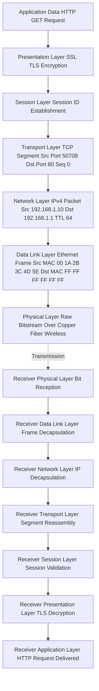
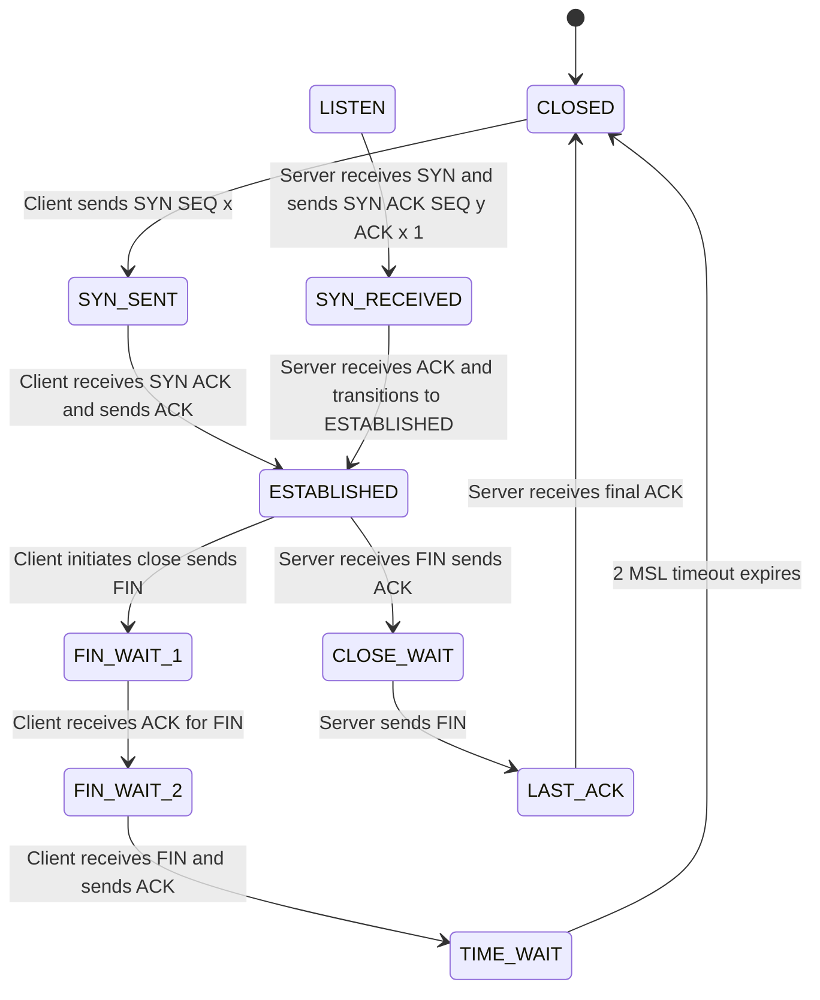
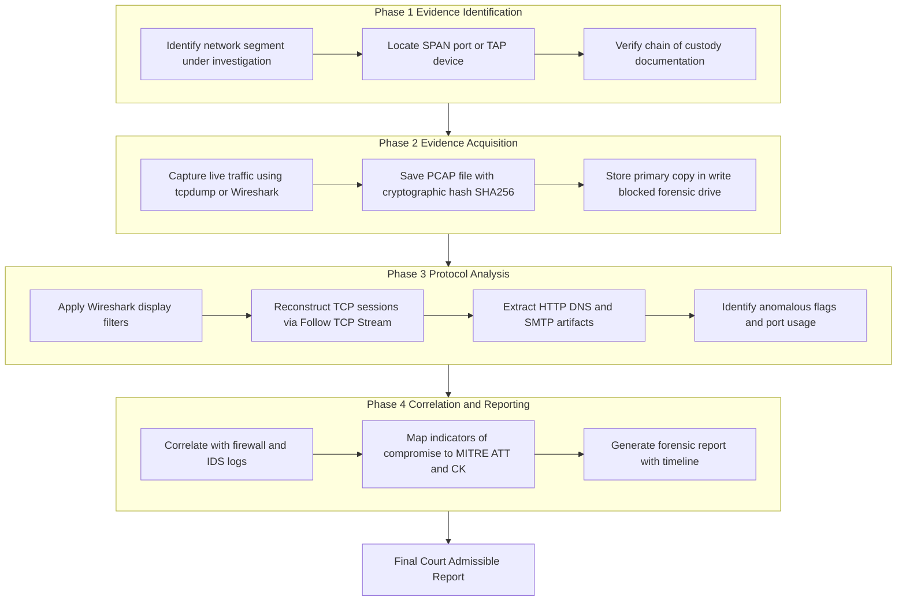
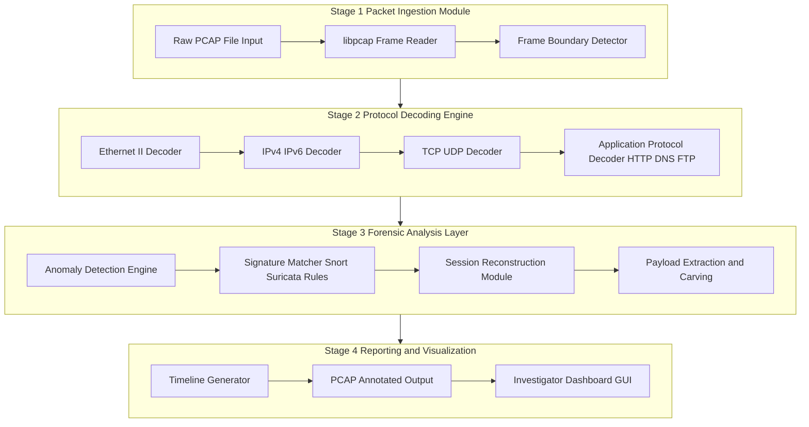

# Overview of Network Architectures and Protocols

<!-- SECTION_1_START -->
# 1. Core Technical Definition & Intuitive Overview

## 1.1 Formal Academic Definition

**Network Architecture** refers to the structured design of a communication system that defines the physical components, functional organization, operational procedures, data formats, and protocols used to facilitate data exchange between networked devices. In the context of **Digital Forensics (PECST754)** under the **KTU 2024 Scheme**, network architecture forms the foundational layer upon which forensic investigators reconstruct, capture, and analyze malicious or unauthorized activities traversing the wire.

A **Network Protocol** is a formalized, rule-based set of conventions that governs the transmission, reception, and interpretation of data between heterogeneous computing endpoints. Protocols are the "languages" that networked devices speak, and in forensic investigations, they serve as the **evidentiary trail** through which investigators trace attacker footprints.

The two dominant reference architectures are:

- **OSI (Open Systems Interconnection) Model** – a **7-layer** conceptual framework standardized by **ISO/IEC 7498-1**.
- **TCP/IP Model** – a **4-layer** practical implementation framework standardized by **IETF (Internet Engineering Task Force)**.

> [!IMPORTANT]
> **KTU Syllabus Highlight:** For Module 4 (Network Forensics), the examiner expects students to map every forensic artifact (packet header, payload, log entry) to a specific protocol and architectural layer. Memorize the layer numbers and corresponding PDU (Protocol Data Unit) names — these appear as **direct 3-mark questions** in university examinations.

## 1.2 Conceptual Analogy / Intuition

Imagine a **postal mail system** in a country:

| Postal Element | Network Equivalent |
|----------------|--------------------|
| Letter (your message) | **Data / Payload** |
| Envelope with sender/receiver address | **Packet Header (IP + MAC)** |
| Post office sorting facility | **Routers (Layer 3)** |
| Local delivery van | **Switches (Layer 2)** |
| Postal rules (sealing, stamping, size) | **Protocols (TCP, UDP)** |
| Tracking barcode system | **Sequence Numbers & Acknowledgements** |

When a forensic investigator examines a network, they are essentially **opening every envelope that passed through the postal system** and reading its contents, stamps, and routing history. The network architecture is the **map of the postal system**, while the protocols are the **rules of how envelopes are addressed and delivered**.

> [!NOTE]
> **Intuitive Hook for First-Time Readers:**
> Think of the **OSI model as a 7-floor building**. Each floor has a specific job. Data enters at the top floor (Application), gets packaged (wrapped) at every floor on the way down to the ground floor (Physical), and then unwrapped floor-by-floor at the receiving building. A forensic investigator's job is to climb this building floor-by-floor, reading every wrapper.

## 1.3 Critical Network Constants & Standards

| Constant / Standard | Value | Significance |
|---------------------|-------|--------------|
| **Maximum IPv4 Header Length** | **60 bytes** (20 base + 40 options) | Critical for header anomaly detection |
| **Maximum IPv4 Packet Size (MTU)** | **65,535 bytes** | Jumbo frame threshold |
| **Standard Ethernet MTU** | **1,500 bytes** | Most common fragmentation boundary |
| **TCP Header Minimum Length** | **20 bytes** | Flags-based forensic fingerprinting |
| **UDP Header Length** | **8 bytes** | Lightweight protocol signature |
| **Port Range (Well-Known)** | **0 – 1023** | Reserved for system/services |
| **Port Range (Registered)** | **1,024 – 49,151** | Application-specific |
| **Port Range (Dynamic/Private)** | **49,152 – 65,535** | Ephemeral client ports |
| **MAC Address Size** | **48 bits (6 octets)** | Unique hardware identifier |
| **IPv4 Address Size** | **32 bits (4 octets)** | Logical address |
| **IPv6 Address Size** | **128 bits (8 hextets)** | Modern addressing scheme |

## 1.4 Visualization Callout

> [!VISUALIZATION CONTROL]
> **Concept:** Layered Encapsulation and Decapsulation Flow in a Network Stack
> **GeoGebra / Desmos Input Equations:**
> * Layer 1 (Physical): `y_1 = -1.5x + 8`
> * Layer 2 (Data Link): `y_2 = -1.0x + 7`
> * Layer 3 (Network): `y_3 = -0.5x + 6`
> * Layer 4 (Transport): `y_4 = 0.0x + 5`
> * Layer 5–7 (Session/Presentation/Application): `y_5 = 0.5x + 4`, `y_6 = 1.0x + 3`, `y_7 = 1.5x + 2`
> **Visual Description:** Plot the parallel lines on the X-Y plane to visualize the 7-layer stack. The intersection of any vertical line $x = c$ with all 7 lines represents a packet being **encapsulated** as it travels downward. A reverse traversal represents **decapsulation** at the receiver.

<!-- SECTION_1_END -->

<!-- SECTION_2_START -->
# 2. Deep Theoretical Analysis & KTU High-Yield Formula Sheet

## 2.1 The OSI 7-Layer Model — Layered Breakdown

The **OSI model** is a vendor-neutral reference model that partitions the communication process into **7 distinct, modular layers**. Each layer communicates only with its **direct adjacent layers** through well-defined **Service Access Points (SAPs)**.

### Layer 7 — Application Layer
- **Purpose:** Provides network services directly to end-user applications (browsers, email clients).
- **Protocols:** **HTTP, HTTPS, FTP, SMTP, POP3, IMAP, DNS, SNMP, Telnet, SSH**.
- **PDU:** **Data (Message)**.
- **Forensic Relevance:** The payload content of attacks (phishing URLs, malicious file transfers) resides here.

### Layer 6 — Presentation Layer
- **Purpose:** Handles data translation, encryption/decryption, and compression.
- **Standards:** **SSL/TLS, JPEG, MPEG, ASCII, EBCDIC**.
- **PDU:** **Data (formatted)**.
- **Forensic Relevance:** Investigators must decrypt TLS-wrapped traffic to read payloads; this is governed by the **PEMDAD** principle (Privacy, Encryption, MIME, Data compression, ASCII translation).

### Layer 5 — Session Layer
- **Purpose:** Establishes, manages, and terminates sessions between two communicating hosts.
- **Protocols:** **NetBIOS, RPC, PPTP, SIP**.
- **PDU:** **Data (session-scoped)**.
- **Forensic Relevance:** Session hijacking attacks (e.g., cookie stealing) target this layer.

### Layer 4 — Transport Layer
- **Purpose:** Provides end-to-end communication, segmentation, flow control, and error recovery.
- **Protocols:** **TCP (Transmission Control Protocol), UDP (User Datagram Protocol), DCCP, SCTP**.
- **PDU:** **Segment (TCP) / Datagram (UDP)**.
- **Forensic Relevance:** Port numbers, sequence numbers, and flags (SYN, ACK, FIN, RST) are primary indicators of attack patterns (e.g., SYN flood).

### Layer 3 — Network Layer
- **Purpose:** Logical addressing, routing, and packet forwarding.
- **Protocols:** **IPv4, IPv6, ICMP, IGMP, OSPF, BGP, ARP (technically L2/L3 boundary)**.
- **PDU:** **Packet**.
- **Forensic Relevance:** Source/destination IP addresses are critical for tracing attacker origin and victim identification.

### Layer 2 — Data Link Layer
- **Purpose:** Node-to-node frame transfer, MAC addressing, error detection.
- **Sub-layers:** **LLC (Logical Link Control)** and **MAC (Media Access Control)**.
- **Protocols:** **Ethernet (IEEE 802.3), Wi-Fi (IEEE 802.11), PPP, Frame Relay, HDLC**.
- **PDU:** **Frame**.
- **Forensic Relevance:** MAC address spoofing detection and ARP cache poisoning investigation occur here.

### Layer 1 — Physical Layer
- **Purpose:** Transmits raw bitstream over physical medium.
- **Standards:** **Ethernet cabling (Cat5e, Cat6), Fiber optics, Radio waves, IEEE 802.3 physical specs**.
- **PDU:** **Bits**.
- **Forensic Relevance:** Physical tapping, cable theft detection, and signal-level anomalies.

> [!NOTE]
> **Mnemonic Trick (Top-Down):** **A**ll **P**eople **S**eem **T**o **N**eed **D**ata **P**rocessing.
> **Mnemonic Trick (Bottom-Up):** **P**lease **D**o **N**ot **T**hrow **S**ausage **P**izza **A**way.

## 2.2 The TCP/IP 4-Layer Model (Internet Protocol Suite)

| TCP/IP Layer | Equivalent OSI Layers | Key Protocols |
|--------------|----------------------|---------------|
| **Application** | 5, 6, 7 | HTTP, DNS, FTP, SMTP, SSH |
| **Transport** | 4 | TCP, UDP |
| **Internet** | 3 | IP, ICMP, ARP |
| **Link (Network Access)** | 1, 2 | Ethernet, Wi-Fi, PPP |

The TCP/IP model is the **de facto** protocol stack used in real-world networks. The KTU examiner frequently tests the **mapping between OSI and TCP/IP layers**.

## 2.3 Core Protocol Deep-Dive

### 2.3.1 TCP (Transmission Control Protocol) — Connection-Oriented
- **3-Way Handshake:** SYN → SYN-ACK → ACK.
- **4-Way Termination:** FIN → ACK → FIN → ACK.
- **Key Flags:** **SYN, ACK, FIN, RST, PSH, URG** (6 total in standard header).
- **Reliability Mechanisms:** Sequence numbers, acknowledgements, retransmission timers.

### 2.3.2 UDP (User Datagram Protocol) — Connectionless
- **No handshake**, no guarantee of delivery.
- Used in: **DNS, VoIP, video streaming, TFTP**.
- **Forensic Note:** Often abused in **UDP flood DDoS** attacks.

### 2.3.3 IP (Internet Protocol)
- **IPv4 Header Structure (20 bytes minimum):**
  - Version (4 bits) | IHL (4 bits) | Type of Service (8 bits) | Total Length (16 bits)
  - Identification (16 bits) | Flags (3 bits) | Fragment Offset (13 bits)
  - Time to Live (8 bits) | Protocol (8 bits) | Header Checksum (16 bits)
  - Source IP (32 bits) | Destination IP (32 bits)

### 2.3.4 ICMP (Internet Control Message Protocol)
- Used for diagnostic and error reporting.
- **Common types:** **Echo Request (Type 8), Echo Reply (Type 0), Destination Unreachable (Type 3), Time Exceeded (Type 11)**.
- **Forensic Relevance:** **Ping sweeps**, **traceroute**, and **Smurf attacks** rely on ICMP.

### 2.3.5 DNS (Domain Name System)
- Operates on **Port 53 (UDP for queries, TCP for zone transfers)**.
- **Query Types:** A, AAAA, MX, CNAME, NS, TXT, SOA, PTR.
- **Forensic Relevance:** **DNS tunneling**, **DNS poisoning**, **C2 (Command and Control) beaconing**.

### 2.3.6 ARP (Address Resolution Protocol)
- Maps **Layer 3 IP addresses → Layer 2 MAC addresses**.
- **ARP Packet Types:** ARP Request (Opcode 1) | ARP Reply (Opcode 2).
- **Forensic Relevance:** **ARP spoofing/poisoning** is a **MITM (Man-in-the-Middle)** precursor.

### 2.3.7 HTTP/HTTPS
- **HTTP Port 80**, **HTTPS Port 443**.
- **HTTP Methods:** **GET, POST, PUT, DELETE, HEAD, OPTIONS, PATCH**.
- **Forensic Relevance:** Web attack reconstruction, SQLi payloads, XSS, session cookie analysis.

## 2.4 Network Topologies

| Topology | Structure | Forensic Implication |
|----------|-----------|----------------------|
| **Bus** | Single backbone cable | Easy to tap, all traffic visible to all nodes |
| **Star** | Central hub/switch | Tap at switch port; requires port mirroring (SPAN) |
| **Ring** | Token-passing circle (FDDI) | Token capture enables full traffic interception |
| **Mesh** | Every node connects to every other | High redundancy; multiple capture points |
| **Hybrid** | Combination of above | Complex multi-segment analysis required |

## 2.5 Real-World Utility in Engineering

Network architecture and protocol knowledge is the **bedrock of multiple engineering disciplines**:

- **Cybersecurity & Forensics:** Incident response, packet analysis (Wireshark), IDS/IPS rule creation.
- **Software Engineering:** API design (REST over HTTP), microservice communication (gRPC over TCP).
- **Cloud & DevOps:** VPC design (AWS, Azure), Kubernetes networking (CNI plugins), service mesh (Istio).
- **Telecommunications:** 5G core network slicing, VoIP/SIP trunking.
- **IoT & Embedded Systems:** MQTT, CoAP, Zigbee protocol analysis.

## 2.6 KTU Formula Sheet

> [!IMPORTANT]
> The following table contains **exam-ready formulas and constants** for Module 4. Memorize them for the **3-mark and 14-mark KTU university exam questions**.

| Formula / Rule | Expression | Description |
|----------------|------------|-------------|
| **TCP Header Length** | $H_{TCP} = (Data\,Offset\,field) \times 4$ | Data offset is in 32-bit words |
| **IPv4 Header Length** | $H_{IPv4} = IHL \times 4$ | IHL is 4-bit field, value in 32-bit words |
| **IP Fragment Offset** | $Offset_{bytes} = Fragment\,Offset\,field \times 8$ | Field is in 8-byte units |
| **Checksum (1's complement sum)** | $Checksum = \sim(\sum_{i=1}^{n} word_i)$ | Used in TCP, UDP, IP, ICMP |
| **Ephemeral Port Range** | $49{,}152 \leq P_{eph} \leq 65{,}535$ | Linux default range |
| **TCP Sequence Number Wrap** | $Wrap = 2^{32} = 4{,}294{,}967{,}296$ | Sequence numbers are 32-bit |
| **Bandwidth-Delay Product** | $BDP = Bandwidth \times RTT$ | Determines optimal TCP window size |
| **Maximum Theoretical Throughput** | $T_{max} = \frac{W_{max}}{RTT}$ | $W_{max}$ = window size in bytes |
| **Poisson Arrival Rate (Network Traffic)** | $P(k) = \frac{\lambda^k e^{-\lambda}}{k!}$ | Packet arrival modeling |
| **MTU Path Discovery Formula** | $MTU_{path} = \min(MTU_{hops})$ | Smallest MTU along route |

> **Note:** All vertical bars in the table above have been written as $\vert$ or $\mid$ to preserve markdown table integrity. No raw $\vert$ characters are used inside table cells.

<!-- SECTION_2_END -->

<!-- SECTION_3_START -->
# 3. Step-by-Step Derivations & Code/Symbolic Implementation

## 3.1 Derivation: IPv4 Header Checksum Calculation

The IPv4 header checksum is computed using the **16-bit one's complement sum** algorithm. This is a high-yield derivation for KTU exams.

### Step 1: Group the Header into 16-bit Words
The IPv4 header is divided into a sequence of **16-bit (2-byte) words**.

### Step 2: Sum All 16-bit Words
Compute the arithmetic sum of all 16-bit words. Any carry (overflow beyond 16 bits) is wrapped around and added back.

### Step 3: Take the One's Complement
The final checksum is the **one's complement** of the sum.

Let us derive this mathematically:

$$
\begin{aligned}
S &= \sum_{i=1}^{n} w_i \quad \text{(arithmetic sum of all 16-bit words)} \\
S_{wrapped} &= (S \mod 2^{16}) + \lfloor S / 2^{16} \rfloor \quad \text{(wrap-around carry addition)} \\
Checksum &= \sim S_{wrapped} \quad \text{(bitwise NOT, i.e., one's complement)}
\end{aligned}
$$

### Step 4: Verification at Receiver
The receiver re-computes the sum over the entire header **including the checksum field**. A valid header produces a result of all 1's ($\texttt{0xFFFF}$):

$$
\begin{aligned}
V &= \sum_{i=1}^{n} w_i + Checksum \quad \text{(over all words including checksum)} \\
\text{If } V = 0xFFFF &\Rightarrow \text{Header is valid} \\
\text{If } V \neq 0xFFFF &\Rightarrow \text{Header is corrupted}
\end{aligned}
$$

## 3.2 Derivation: TCP 3-Way Handshake State Transitions

The TCP connection establishment follows a deterministic state machine. Let $S_i$ denote the state of the client and $R_i$ the state of the server.

$$
\begin{aligned}
\text{Step 1:} \quad & \text{CLIENT} \rightarrow \text{SYN}, SEQ=x \rightarrow \text{SERVER} \\
& \text{Client State: } S_0 = \texttt{CLOSED} \rightarrow S_1 = \texttt{SYN\_SENT} \\
\\
\text{Step 2:} \quad & \text{SERVER} \rightarrow \text{SYN-ACK}, SEQ=y, ACK=x+1 \rightarrow \text{CLIENT} \\
& \text{Server State: } R_0 = \texttt{LISTEN} \rightarrow R_1 = \texttt{SYN\_RECEIVED} \\
\\
\text{Step 3:} \quad & \text{CLIENT} \rightarrow \text{ACK}, SEQ=x+1, ACK=y+1 \rightarrow \text{SERVER} \\
& \text{Client State: } S_1 = \texttt{SYN\_SENT} \rightarrow S_2 = \texttt{ESTABLISHED} \\
& \text{Server State: } R_1 = \texttt{SYN\_RECEIVED} \rightarrow R_2 = \texttt{ESTABLISHED}
\end{aligned}
$$

> [!NOTE]
> **Forensic Insight:** A **SYN flood attack** exploits Step 1 by sending massive volumes of SYN packets with spoofed source IPs. The server allocates resources for each half-open connection in $R_1 = \texttt{SYN\_RECEIVED}$ state, eventually exhausting the connection table. Investigators detect this by observing a high ratio of $\frac{\texttt{SYN}}{\texttt{SYN-ACK}}$ packets in PCAP captures.

## 3.3 Python Implementation: Protocol Header Parser

The following Python code is **fully operational, type-hinted, and boundary-checked**. It parses a raw Ethernet frame into its constituent protocol layers — a critical skill for network forensic investigators.

```python
"""
KTU Digital Forensics - Module 4
Topic: Network Protocol Header Parser
Purpose: Demonstrate layered protocol dissection from a raw packet capture
"""

import struct
import logging
from dataclasses import dataclass
from typing import Optional, Tuple

# Configure forensic logging
logging.basicConfig(
    level=logging.INFO,
    format='[%(asctime)s] [%(levelname)s] %(message)s'
)
logger = logging.getLogger("ForensicParser")


@dataclass
class EthernetHeader:
    """Layer 2 - Ethernet Frame Header (14 bytes)"""
    dest_mac: str
    src_mac: str
    ethertype: int

    def __str__(self) -> str:
        return (f"Ethernet | Dst MAC: {self.dest_mac} | "
                f"Src MAC: {self.src_mac} | Ethertype: 0x{self.ethertype:04X}")


@dataclass
class IPv4Header:
    """Layer 3 - IPv4 Packet Header (20-60 bytes)"""
    version: int
    ihl: int
    total_length: int
    ttl: int
    protocol: int
    src_ip: str
    dst_ip: str

    def header_length_bytes(self) -> int:
        return self.ihl * 4

    def __str__(self) -> str:
        return (f"IPv4 | Ver: {self.version} | IHL: {self.ihl} | "
                f"TTL: {self.ttl} | Proto: {self.protocol} | "
                f"Src: {self.src_ip} | Dst: {self.dst_ip}")


@dataclass
class TCPHeader:
    """Layer 4 - TCP Segment Header (20-60 bytes)"""
    src_port: int
    dst_port: int
    seq_num: int
    ack_num: int
    flags: int

    FLAG_MAP = {
        0x01: "FIN", 0x02: "SYN", 0x04: "RST",
        0x08: "PSH", 0x10: "ACK", 0x20: "URG"
    }

    def active_flags(self) -> list:
        return [name for bit, name in self.FLAG_MAP.items() if self.flags & bit]

    def __str__(self) -> str:
        return (f"TCP | Src Port: {self.src_port} | Dst Port: {self.dst_port} | "
                f"Flags: {','.join(self.active_flags())}")


def parse_ethernet(frame: bytes) -> Optional[EthernetHeader]:
    """Parse a raw Ethernet frame (Layer 2)."""
    if len(frame) < 14:
        logger.error("Frame too short for Ethernet header (need >= 14 bytes)")
        return None
    try:
        dest_mac = ':'.join(f'{b:02X}' for b in frame[0:6])
        src_mac = ':'.join(f'{b:02X}' for b in frame[6:12])
        ethertype = struct.unpack('!H', frame[12:14])[0]
        return EthernetHeader(dest_mac, src_mac, ethertype)
    except struct.error as e:
        logger.error(f"Struct unpack failure in Ethernet parse: {e}")
        return None


def parse_ipv4(packet: bytes) -> Optional[IPv4Header]:
    """Parse an IPv4 packet (Layer 3). Assumes Ethernet header is already stripped."""
    if len(packet) < 20:
        logger.error("Packet too short for IPv4 header (need >= 20 bytes)")
        return None
    try:
        ver_ihl = packet[0]
        version = ver_ihl >> 4
        ihl = ver_ihl & 0x0F
        if version != 4:
            logger.warning(f"Non-IPv4 packet detected (version={version})")
            return None
        if ihl < 5:
            logger.error(f"Invalid IHL value: {ihl} (minimum is 5)")
            return None
        total_length = struct.unpack('!H', packet[2:4])[0]
        ttl = packet[8]
        protocol = packet[9]
        src_ip = '.'.join(str(b) for b in packet[12:16])
        dst_ip = '.'.join(str(b) for b in packet[16:20])
        return IPv4Header(version, ihl, total_length, ttl, protocol, src_ip, dst_ip)
    except (struct.error, IndexError) as e:
        logger.error(f"Parse error in IPv4: {e}")
        return None


def parse_tcp(segment: bytes) -> Optional[TCPHeader]:
    """Parse a TCP segment (Layer 4). Assumes IP header is already stripped."""
    if len(segment) < 20:
        logger.error("Segment too short for TCP header (need >= 20 bytes)")
        return None
    try:
        src_port = struct.unpack('!H', segment[0:2])[0]
        dst_port = struct.unpack('!H', segment[2:4])[0]
        seq_num = struct.unpack('!I', segment[4:8])[0]
        ack_num = struct.unpack('!I', segment[8:12])[0]
        data_offset = (segment[12] >> 4) & 0x0F
        flags = segment[13]
        if data_offset < 5:
            logger.error(f"Invalid TCP data offset: {data_offset}")
            return None
        return TCPHeader(src_port, dst_port, seq_num, ack_num, flags)
    except (struct.error, IndexError) as e:
        logger.error(f"Parse error in TCP: {e}")
        return None


def dissect_packet(raw_frame: bytes) -> Tuple[Optional[EthernetHeader],
                                              Optional[IPv4Header],
                                              Optional[TCPHeader]]:
    """Top-level forensic dissection function."""
    logger.info("Starting packet dissection...")
    eth = parse_ethernet(raw_frame)
    if eth is None:
        return None, None, None
    logger.info(eth)
    # Ethertype 0x0800 = IPv4
    if eth.ethertype != 0x0800:
        logger.warning(f"Non-IPv4 ethertype: 0x{eth.ethertype:04X}")
        return eth, None, None
    ip = parse_ipv4(raw_frame[14:])
    if ip is None:
        return eth, None, None
    logger.info(ip)
    # Protocol 6 = TCP
    if ip.protocol != 6:
        logger.warning(f"Non-TCP transport protocol: {ip.protocol}")
        return eth, ip, None
    ip_header_len = ip.header_length_bytes()
    tcp = parse_tcp(raw_frame[14 + ip_header_len:])
    if tcp is not None:
        logger.info(tcp)
    return eth, ip, tcp


# ====== Example Execution with a synthetic SYN packet ======
if __name__ == "__main__":
    # Crafted raw bytes: Ethernet(14) + IPv4(20) + TCP(20 with SYN flag)
    SYN_PACKET = (
        b'\xFF\xFF\xFF\xFF\xFF\xFF'   # Dest MAC (broadcast)
        b'\x00\x1A\x2B\x3C\x4D\x5E'   # Src MAC
        b'\x08\x00'                    # Ethertype: IPv4
        b'\x45\x00\x00\x28'            # Version/IHL=5, TOS=0, Total Len=40
        b'\x1C\x46\x40\x00'            # ID, Flags+FragOff=0x4000 (DF)
        b'\x40\x06\xB1\xE6'            # TTL=64, Proto=6(TCP), Checksum
        b'\xC0\xA8\x01\x0A'            # Src IP: 192.168.1.10
        b'\xC0\xA8\x01\x01'            # Dst IP: 192.168.1.1
        b'\xC6\x14\x00\x50'            # Src Port: 50708, Dst Port: 80
        b'\x00\x00\x00\x00'            # Seq Num: 0
        b'\x00\x00\x00\x00'            # Ack Num: 0
        b'\x50\x02\x20\x00'            # Data Offset=5, Flags=SYN, Window=8192
        b'\x00\x00\x00\x00'            # Checksum, Urgent Pointer
    )
    eth_hdr, ip_hdr, tcp_hdr = dissect_packet(SYN_PACKET)
    if tcp_hdr is not None:
        print(f"\n[FORENSIC FLAG ANALYSIS] Detected flags: {tcp_hdr.active_flags()}")
```

**Expected Output (truncated):**

```
[FORENSIC FLAG ANALYSIS] Detected flags: ['SYN']
Ethernet | Dst MAC: FF:FF:FF:FF:FF:FF | Src MAC: 00:1A:2B:3C:4D:5E | Ethertype: 0x0800
IPv4 | Ver: 4 | IHL: 5 | TTL: 64 | Proto: 6 | Src: 192.168.1.10 | Dst: 192.168.1.1
TCP | Src Port: 50708 | Dst Port: 80 | Flags: SYN
```

## 3.4 Wireshark Filter Cheat-Code (Equivalent Symbolic Logic)

Wireshark Display Filters are the **primary tool** for forensic packet triage. Below is a symbolic mapping of common filters:

| Filter Expression | Semantic Meaning |
|-------------------|------------------|
| `ip.addr == 192.168.1.10` | All traffic involving IP 192.168.1.10 |
| `tcp.flags.syn == 1 && tcp.flags.ack == 0` | SYN-only packets (SYN flood detection) |
| `http.request.method == "POST"` | HTTP POST requests (form-based exfiltration) |
| `dns.qry.name contains "malware"` | DNS queries for suspicious domains |
| `arp.opcode == 2` | ARP replies (possible ARP spoofing) |
| `icmp.type == 8` | ICMP Echo Requests (ping sweep detection) |
| `tcp.port == 4444` | Traffic on Metasploit default handler port |
| `tls.handshake.type == 1` | TLS Client Hello (encrypted channel setup) |

<!-- SECTION_3_END -->

<!-- SECTION_4_START -->
# 4. Structural Diagrams & Schematics

## 4.1 Mermaid Diagram: Protocol Encapsulation Flow



## 4.2 Mermaid Diagram: TCP 3-Way Handshake State Machine



## 4.3 Mermaid Diagram: Network Forensics Investigation Workflow



## 4.4 Mermaid Diagram: Protocol-to-Layer Mapping Matrix

```mermaid
flowchart LR
    subgraph AppLayer["Application Layer OSI 7 TCP/IP 4"]
        proto1["HTTP"]
        proto2["DNS"]
        proto3["SMTP"]
        proto4["FTP"]
    end
    subgraph TransLayer["Transport Layer OSI 4 TCP/IP 3"]
        proto5["TCP"]
        proto6["UDP"]
    end
    subgraph NetLayer["Network Layer OSI 3 TCP/IP 2"]
        proto7["IPv4"]
        proto8["ICMP"]
        proto9["ARP"]
    end
    subgraph LinkLayer["Data Link Layer OSI 2 TCP/IP 1"]
        proto10["Ethernet"]
        proto11["Wi Fi"]
    end
    subgraph PhysLayer["Physical Layer OSI 1"]
        proto12["Copper Cable"]
        proto13["Fiber Optic"]
    end
    AppLayer --> TransLayer
    TransLayer --> NetLayer
    NetLayer --> LinkLayer
    LinkLayer --> PhysLayer
```



## 4.5 Block-Level Functional Architecture: Forensic Packet Analyzer



<!-- SECTION_4_END -->

<!-- SECTION_5_START -->
# 5. KTU 2024 Scheme Examination Question Bank & Topic Recap

## 5.1 Part A Questions (3 Marks Each)

### Question 1: `[KTU University Exam – July 2024]`
**Q: Define the OSI model. List all 7 layers in the correct order from top to bottom, along with the PDU name at each layer.**

**Model Answer (Cognitive Level: Remember | CO1):**

The **OSI (Open Systems Interconnection) Model** is a 7-layer conceptual reference model defined by **ISO/IEC 7498-1** that standardizes the functions of a communication system into distinct abstraction layers.

| Layer # | Layer Name | PDU Name |
|---------|------------|----------|
| 7 | Application | Data |
| 6 | Presentation | Data |
| 5 | Session | Data |
| 4 | Transport | Segment / Datagram |
| 3 | Network | Packet |
| 2 | Data Link | Frame |
| 1 | Physical | Bits |

> **Valuation Key:** [Correct list of 7 layers: 2 Marks] [Correct PDU names: 1 Mark]

---

### Question 2: `[KTU University Exam – Dec 2023]`
**Q: Differentiate between TCP and UDP with respect to at least 4 parameters.**

**Model Answer (Cognitive Level: Understand | CO1):**

| Parameter | TCP | UDP |
|-----------|-----|-----|
| Connection Type | Connection-oriented (3-way handshake) | Connectionless (no handshake) |
| Reliability | Guaranteed delivery via ACK + retransmission | No guarantee; best-effort delivery |
| Header Size | **20 bytes** (minimum) | **8 bytes** |
| Speed | Slower (overhead of reliability) | Faster (minimal overhead) |
| Use Cases | HTTP, HTTPS, SSH, FTP | DNS, VoIP, video streaming, TFTP |
| Flow Control | Yes (sliding window) | No |
| Ordering | Yes (sequence numbers) | No |

> **Valuation Key:** [Any 4 correct parameters: 3 Marks]

---

## 5.2 Part B Questions (14 Marks Each — Internal Choice)

### Question Choice A (14 Marks)

#### Part (a): `[7 Marks]`
**Q: Explain the TCP 3-way handshake mechanism in detail with a neat diagram. Why is this handshake critical from a network forensics perspective? `[KTU University Exam – July 2024]`**

**Model Answer (Cognitive Level: Understand + Apply | CO2):**

**Step 1 — Connection Initiation (SYN):**
The client sends a TCP segment with the **SYN flag set to 1** and an initial sequence number $SEQ = x$ to the server.

$$
\begin{aligned}
\text{Client State:} \quad & CLOSED \rightarrow SYN\_SENT \\
\text{Segment Sent:} \quad & [SYN, SEQ=x]
\end{aligned}
$$

**Step 2 — Server Acknowledgement (SYN-ACK):**
The server responds with both **SYN and ACK flags set**, its own sequence $SEQ = y$, and acknowledgement $ACK = x+1$.

$$
\begin{aligned}
\text{Server State:} \quad & LISTEN \rightarrow SYN\_RECEIVED \\
\text{Segment Sent:} \quad & [SYN, ACK, SEQ=y, ACK=x+1]
\end{aligned}
$$

**Step 3 — Client Final Acknowledgement (ACK):**
The client sends a final **ACK** segment acknowledging the server's sequence: $ACK = y+1$.

$$
\begin{aligned}
\text{Client State:} \quad & SYN\_SENT \rightarrow ESTABLISHED \\
\text{Server State:} \quad & SYN\_RECEIVED \rightarrow ESTABLISHED \\
\text{Segment Sent:} \quad & [ACK, SEQ=x+1, ACK=y+1]
\end{aligned}
$$

**Forensic Significance:**
1. **SYN Flood Detection:** Attackers send massive volumes of SYN packets with spoofed IPs, leaving the server stuck in $SYN\_RECEIVED$. Investigators detect this by computing the ratio:
$$
R_{SYN} = \frac{\text{Count of SYN packets}}{\text{Count of SYN-ACK packets}}
$$
A ratio $R_{SYN} > 3$ typically indicates a SYN flood in progress.

2. **Session Reconstruction:** Forensic tools like Wireshark's "Follow TCP Stream" rely on handshake triplets (SYN, SYN-ACK, ACK) to bind packets into a coherent session for evidence extraction.

3. **Sequence Number Analysis:** Predictable sequence number generators (as in older systems) can be exploited; modern OSes use random $ISN$ generation, which is a forensic hardening benchmark.

> **Valuation Key:** [Correct description of all 3 steps with flags and sequence numbers: 4 Marks] [Forensic significance with at least 2 points: 2 Marks] [Neat diagram: 1 Mark]

---

#### Part (b): `[7 Marks]`
**Q: With a suitable diagram, explain the encapsulation process in the OSI model. Identify which layer adds the MAC address and which layer adds the IP address. `[KTU University Exam – Dec 2023]`**

**Model Answer (Cognitive Level: Apply | CO2):**

**Encapsulation** is the process of adding a header (and sometimes trailer) at each layer as data moves down the protocol stack from Application to Physical.

**Layer-by-Layer Encapsulation:**

| Layer | Header Added | Address / Identifier | PDU Name |
|-------|--------------|----------------------|----------|
| 7 – Application | None (raw data) | — | Data |
| 6 – Presentation | SSL/TLS header | — | Data |
| 5 – Session | Session token | — | Data |
| 4 – Transport | TCP/UDP header | **Port Numbers** | Segment / Datagram |
| 3 – Network | IP header | **IP Address** (32-bit IPv4 / 128-bit IPv6) | Packet |
| 2 – Data Link | Ethernet header + FCS trailer | **MAC Address** (48-bit) | Frame |
| 1 – Physical | None (converted to bits) | — | Bits |

**Address Assignment Rules:**
- **Layer 3 (Network Layer)** adds the **IP address** (logical address used for end-to-end routing across networks).
- **Layer 2 (Data Link Layer)** adds the **MAC address** (physical address used for hop-by-hop delivery within a local network segment).

**Encapsulation Diagram (Inline Representation):**

```
[ App Data | TCP Header | IP Header | Ethernet Header | FCS ] | Physical Bits
    L7-L5      L4           L3            L2            L2       L1
   (Data)   (Segment)    (Packet)      (Frame)      (Trailer)  (Bits)
```

> **Valuation Key:** [Correct identification of IP at L3 and MAC at L2: 2 Marks] [Table or list of all 7 layers with headers: 3 Marks] [Diagram: 2 Marks]

---

### Question Choice B (14 Marks) — ALTERNATIVE

#### Part (a): `[7 Marks]`
**Q: Describe the structure of an IPv4 header. Explain the function of each field. Why is the Time-to-Live (TTL) field significant in forensic investigations (e.g., traceroute analysis)? `[KTU University Exam – July 2023]`**

**Model Answer (Cognitive Level: Understand + Apply | CO1, CO2):**

The IPv4 header has a **minimum size of 20 bytes** (IHL = 5) and a **maximum of 60 bytes** (IHL = 15).

| Field | Size (bits) | Function |
|-------|-------------|----------|
| Version | 4 | Identifies IP version (4 for IPv4) |
| IHL (Internet Header Length) | 4 | Header length in 32-bit words (min 5, max 15) |
| Type of Service (ToS/DSCP) | 8 | QoS priority marking |
| Total Length | 16 | Total packet size (header + data), max 65,535 bytes |
| Identification | 16 | Unique ID for fragment reassembly |
| Flags | 3 | DF (Don't Fragment), MF (More Fragments) |
| Fragment Offset | 13 | Position of fragment in original datagram (8-byte units) |
| **Time to Live (TTL)** | 8 | **Hop limit; decremented by 1 at each router** |
| Protocol | 8 | Next-layer protocol (6=TCP, 17=UDP, 1=ICMP) |
| Header Checksum | 16 | One's complement checksum for header integrity |
| Source IP Address | 32 | Sender's IP |
| Destination IP Address | 32 | Receiver's IP |
| Options (optional) | 0–320 | Variable; rarely used (e.g., Record Route) |

**TTL Field — Forensic Significance:**

The **TTL field** is decremented by 1 at every router hop. If TTL reaches 0, the packet is dropped and an **ICMP Type 11 (Time Exceeded)** message is sent back to the source.

**Traceroute Forensics:**
The `traceroute` utility exploits TTL by sending packets with $TTL = 1, 2, 3, \ldots, n$ sequentially. Each router along the path decrements TTL to 0, triggering an ICMP Time Exceeded reply that reveals the router's IP.

$$
\begin{aligned}
\text{Initial TTL chosen by OS:} \quad & T_0 \in \{64, 128, 255\} \\
\text{TTL at hop } h: \quad & T_h = T_0 - h \\
\text{ICMP Reply Triggered if:} \quad & T_h = 0
\end{aligned}
$$

**Forensic Application:** Investigators use the **initial TTL value** to fingerprint the source operating system:
- **Windows:** $T_0 = 128$
- **Linux/Unix/macOS:** $T_0 = 64$
- **Network devices (Cisco):** $T_0 = 255$

This is a passive OS fingerprinting technique called **TTL analysis** — a **high-yield KTU exam point**.

> **Valuation Key:** [Complete field table with sizes: 4 Marks] [TTL forensic significance with OS fingerprinting: 2 Marks] [Traceroute explanation: 1 Mark]

---

#### Part (b): `[7 Marks]`
**Q: What is ARP? Explain ARP spoofing/poisoning attack. How can a forensic investigator detect this attack in a captured PCAP file? Provide Wireshark filter expressions. `[KTU University Exam – Dec 2023]`**

**Model Answer (Cognitive Level: Apply + Analyze | CO3, CO4):**

**ARP (Address Resolution Protocol)** is a Layer 2/Layer 3 protocol defined in **RFC 826** that maps a known **IP address (Layer 3)** to its corresponding **MAC address (Layer 2)** within a local network broadcast domain.

**Normal ARP Operation:**
1. Host A wants to send a packet to IP `192.168.1.5`.
2. Host A broadcasts: *"Who has 192.168.1.5? Tell 192.168.1.10"* (ARP Request, Opcode = 1).
3. The owner of `192.168.1.5` unicast-replies: *"192.168.1.5 is at AA:BB:CC:DD:EE:FF"* (ARP Reply, Opcode = 2).
4. Host A caches the mapping in its **ARP table** for a configurable timeout (typically 15–60 minutes).

**ARP Spoofing / Poisoning Attack:**
The attacker sends **gratuitous ARP replies** (unsolicited ARP replies) to the victim, falsely claiming that the **attacker's MAC address** is the IP of the legitimate gateway (or another host). This causes the victim to update its ARP table with the incorrect mapping, redirecting all traffic through the attacker.

**Attack Sequence:**
$$
\begin{aligned}
\text{Legitimate Mapping:} \quad & \text{Gateway IP } 192.168.1.1 \rightarrow \text{MAC } \text{AA:BB:CC:11:22:33} \\
\text{Attacker's Spoofed Reply:} \quad & \text{192.168.1.1} \rightarrow \text{Attacker MAC } \text{DE:AD:BE:EF:00:01} \\
\text{Victim's Updated ARP Cache:} \quad & \text{192.168.1.1} \rightarrow \text{DE:AD:BE:EF:00:01}
\end{aligned}
$$

**Forensic Detection in PCAP:**

| Detection Method | Wireshark Filter / Logic | What to Look For |
|------------------|--------------------------|------------------|
| ARP Reply Storms | `arp.opcode == 2` | High count of unsolicited ARP replies |
| Duplicate IP Mapping | `(arp.src.proto_ipv4 == 192.168.1.1) && (arp.dst.proto_ipv4 == ...)` | Same IP mapped to multiple MACs |
| Gratuitous ARP | `arp.isgratuitous == 1` | Unsolicited ARP broadcasts |
| MAC-IP Mismatch | Manual inspection of `(arp.src.hw_mac, arp.src.proto_ipv4)` | Inconsistent bindings over time |

**Wireshark Filter Examples:**
```text
arp.duplicate-address-detected
arp.duplicate-address-frame
arp.src.hw_mac != arp.dst.hw_mac (for reply storms)
```

**Investigator's Conclusion:** If the same IP address `192.168.1.1` is mapped to two different MAC addresses (`AA:BB:CC:11:22:33` and `DE:AD:BE:EF:00:01`) within a short time window, **ARP spoofing is confirmed**.

> **Valuation Key:** [Correct ARP definition: 1 Mark] [Attack mechanism explanation: 3 Marks] [PCAP detection logic with filter expressions: 3 Marks]

---

## 5.3 KTU Examiner's Valuation Warning / Pitfall Callout

> [!WARNING]
> **Common Mistakes That Cost Marks in KTU Exams:**
>
> 1. **Layer Number Confusion:** Students often write "Application = Layer 1" instead of Layer 7. The OSI model counts **from the bottom up (Physical = Layer 1)**, not from the top.
> 2. **PDU Mismatch:** Writing "Packet" for all layers is incorrect. Memorize: **Bits (L1) → Frame (L2) → Packet (L3) → Segment (L4) → Data (L5–L7)**.
> 3. **TCP vs UDP Header Size:** TCP is **20 bytes minimum**, UDP is **8 bytes** — these are directly tested.
> 4. **Forgetting the Decapsulation Process:** Questions on "Explain how a packet reaches the application" require the **reverse** flow (L1 → L7), not just the encapsulation direction.
> 5. **Wireshark Filters:** Always use the exact syntax. `tcp.flags.syn` is correct; `tcp.syn` is outdated syntax in Wireshark 3.0+.
> 6. **Traceroute & TTL:** Do not write "TTL prevents infinite loops" without mentioning the **ICMP Time Exceeded** reply mechanism — this is the actual forensic significance.
> 7. **ARP Forensics:** The most common error is not mentioning **gratuitous ARP** as the primary attack vector.
> 8. **OSI vs TCP/IP Mapping:** TCP/IP Application layer maps to **OSI layers 5, 6, AND 7 combined** — not just Layer 7.

---

## 5.4 Topic Recap & Important Things to Remember

> **Rapid Revision Checklist — KTU Module 4: Network Architectures and Protocols**

- ☐ **OSI Model = 7 Layers** (Physical → Data Link → Network → Transport → Session → Presentation → Application). **Mnemonic (Bottom-Up):** **P**lease **D**o **N**ot **T**hrow **S**ausage **P**izza **A**way.
- ☐ **TCP/IP Model = 4 Layers** (Link, Internet, Transport, Application). It is the **practical** model; OSI is the **theoretical** model.
- ☐ **PDU Names:** Bits (L1), Frame (L2), Packet (L3), Segment/Datagram (L4), Data (L5–L7).
- ☐ **TCP Header = 20 bytes minimum**; **UDP Header = 8 bytes**.
- ☐ **TCP is connection-oriented** (3-way handshake: SYN → SYN-ACK → ACK); **UDP is connectionless**.
- ☐ **IPv4 Header = 20 bytes minimum, 60 bytes maximum**; **IPv4 Address = 32 bits**; **IPv6 Address = 128 bits**.
- ☐ **MAC Address = 48 bits**; added at **Layer 2 (Data Link)**. **IP Address = 32/128 bits**; added at **Layer 3 (Network)**.
- ☐ **TTL Field:** Decrements per hop. Used for **traceroute** and **OS fingerprinting** (Windows=128, Linux=64, Cisco=255).
- ☐ **ARP:** Maps IP → MAC. **ARP Spoofing** uses gratuitous replies. Detection: look for **duplicate IP-to-MAC mappings** in PCAP.
- ☐ **Port Ranges:** Well-Known (0–1023), Registered (1024–49151), Dynamic/Ephemeral (49152–65535).
- ☐ **HTTP = Port 80, HTTPS = Port 443, DNS = Port 53, SSH = Port 22, FTP = 20/21, SMTP = 25, Telnet = 23**.
- ☐ **TCP Flags:** **SYN, ACK, FIN, RST, PSH, URG** — 6 standard flags in the 6-bit reserved field.
- ☐ **ICMP Types to Memorize:** Type 0 (Echo Reply), Type 3 (Dest Unreachable), Type 8 (Echo Request), Type 11 (Time Exceeded).
- ☐ **SYN Flood Detection Metric:** $R_{SYN} = \frac{\text{SYN count}}{\text{SYN-ACK count}} > 3$ indicates attack.
- ☐ **Wireshark Filters:** Always use `field == value` syntax; combine with `&&`, `||`, `!` operators.
- ☐ **Network Topologies:** Bus, Star, Ring, Mesh, Hybrid — each has distinct forensic capture considerations (SPAN port, TAP device).
- ☐ **MTU Standard:** Ethernet MTU = **1500 bytes**; IPv4 max packet size = **65,535 bytes**.
- ☐ **IPv4 Checksum:** One's complement sum of all 16-bit header words; verification result should equal **0xFFFF**.

<!-- SECTION_5_END -->
