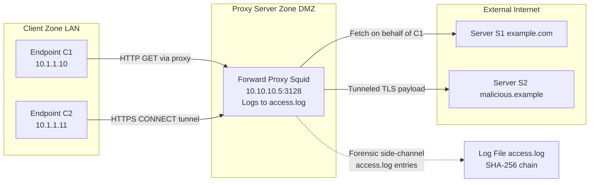
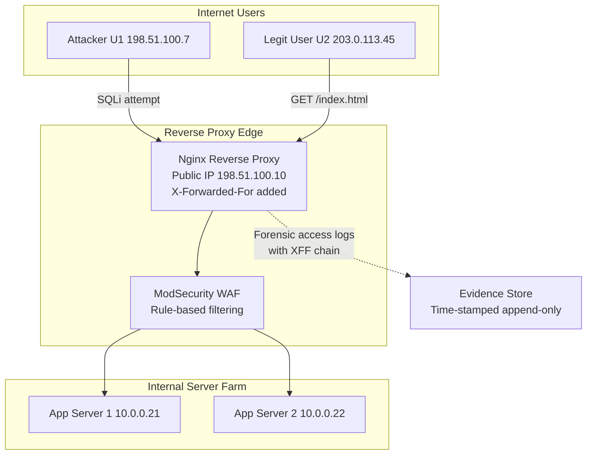
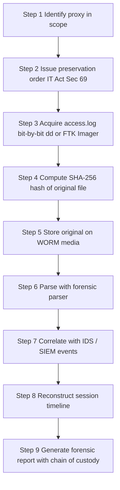
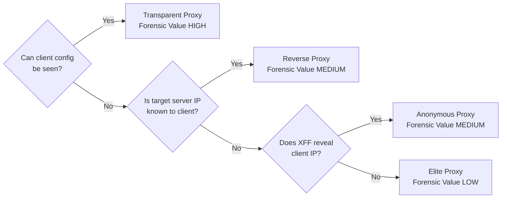
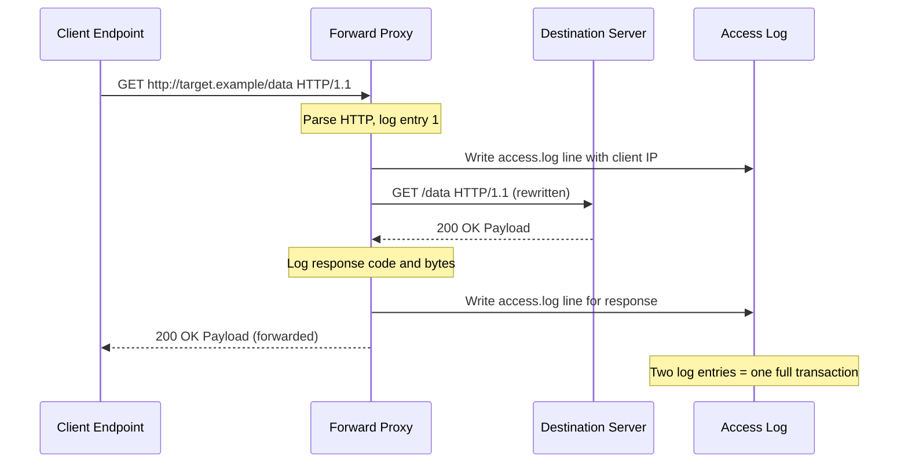

# Proxy

<!-- SECTION_1_START -->
# 1. Core Technical Definition & Intuitive Overview

## 1.1 Formal Definition (KTU 2024 Syllabus Terminology)

A **proxy server** is a network intermediary that acts as a *gateway* between an end-user (client) and the destination server on the Internet. In the context of **Network Forensics**, a proxy is treated as a **non-endpoint intermediary node** that *intentionally* intercepts, logs, and forwards traffic, thereby creating a **secondary evidentiary trail** that is independent of the endpoint device under investigation.

> [!IMPORTANT]
> **KTU 2024 Definition:** *"A proxy is a server application that functions as an intermediary for requests from clients seeking resources from other servers, while simultaneously generating audit-grade access logs that can be used as digital evidence."*

Mathematically, a proxy $\mathcal{P}$ transforms a client request flow as:

$$\mathcal{P}: (\mathcal{C}_{id}, \text{Req}_{dst}) \;\longmapsto\; (\text{Log}_{entry}, \text{Req}_{dst}^{modified})$$

where $\mathcal{C}_{id}$ is the client identity vector and $\text{Req}_{dst}$ is the request directed to the destination server.

---

## 1.2 Conceptual Analogy / Intuition

Think of a **proxy server** as a **reception desk in a large corporate office**.

* When a visitor (*client*) wants to meet a director (*destination server*), they cannot go directly. They must first check in with the receptionist (*proxy*).
* The receptionist **records the visitor's name, time of arrival, who they came to meet, and the badge number issued** — this is the *access log*.
* The receptionist may also **screen what items the visitor carries** (the *content filter*) and may **hide the director's actual room number from the visitor** (the *anonymizing* behavior).

From a forensic standpoint, the receptionist's register is a **goldmine of evidence** even if the visitor later denies having been in the building.

> [!NOTE]
> **Key Distinction:** A *router* forwards packets at Layer 3 transparently. A *proxy* terminates the session at Layer 7 and **re-issues** a new session toward the destination — meaning it sees the **full application payload**, not just the headers.

---

## 1.3 Physical Constants and Standard Metrics (Network Forensics)

* **Default HTTP Proxy Port:** **TCP 8080** (also 3128 for Squid, 80 for transparent proxies).
* **Default SOCKS Proxy Port:** **TCP 1080**.
* **Default HTTPS (CONNECT) Proxy Port:** **TCP 443** (tunneled through `CONNECT` method).
* **Log Retention Standard (ISO 27037):** **minimum 90 days** for evidentiary logs.
* **RFC 2616 / RFC 7230:** defines HTTP proxy behaviour.
* **RFC 1928:** defines SOCKS version 5.

> [!WARNING]
> *Always* verify the proxy port by inspecting the **`Via`** and **`X-Forwarded-For`** headers — non-standard ports are common in covert channels.

---

## 1.4 GeoGebra / Desmos Visualization (Conceptual)

> [!VISUALIZATION CONTROL]
> **Concept:** *Triangle of Proxy Mediation* — Client $\rightarrow$ Proxy $\rightarrow$ Server with forensic log side-channel.
> **GeoGebra / Desmos Input Equations:**
> * Point $C = (0, 0)$ — Client
> * Point $P = (4, 3)$ — Proxy
> * Point $S = (8, 0)$ — Destination Server
> * Line $f_1(x)$ through $C \rightarrow P$
> * Line $f_2(x)$ through $P \rightarrow S$
> **Visual Description:** The student should observe that the path is **never a direct line** from $C$ to $S$ but is **mediated** by $P$, which writes a log entry $\mathcal{L}$ in a perpendicular branch (the *"forensic side-channel"*).

---

## 1.5 Why Proxy Forensics Matters in the KTU 2024 Scheme

In the **PECST754 – Digital Forensics** syllabus (Module 4: *Network Forensics*), the study of proxies is mandatory because:

1. Most enterprise and ISP traffic passes through a **forward or transparent proxy**.
2. Suspects often use **anonymous or open proxies** to obfuscate origin IPs.
3. Proxy logs are **timestamped, tamper-evident, and court-admissible** when properly handled under **Section 65B of the Indian Evidence Act, 1872 (now Bharatiya Sakshya Adhiniyam, 2023)**.
]<]minimax[>[</section1>
<!-- SECTION_1_END -->

<!-- SECTION_2_START -->
# 2. Deep Theoretical Analysis & KTU High-Yield Formula Sheet

## 2.1 Taxonomy of Proxy Servers (Forensic Classification)

| **Category** | **Forensic Visibility** | **Anonymity Level** | **Use Case** | **Key Evidentiary Artifact** |
|---|---|---|---|---|
| **Forward (Client-side) Proxy** | High — logs both client IP and target URL | Low (reveals client identity to proxy admin) | Corporate web browsing | Full URL + client IP in `access.log` |
| **Reverse (Server-side) Proxy** | High — logs attacker IP and request path | N/A (server-side) | Web application firewall (WAF) | Client IP, request URI, response code |
| **Transparent Proxy** | Highest (no client config) | None — full visibility | ISP / library networks | MAC + IP binding in logs |
| **Anonymous Proxy** | Medium — proxy may redact client IP | Medium | Privacy-conscious users | Only proxy IP visible to server |
| **Elite / High-Anonymity Proxy** | Low — server cannot detect proxy | High | Tor bridges, anti-forensics | Almost no client trail |
| **SOCKS4 / SOCKS5 Proxy** | High at proxy; opaque at app layer | Variable | P2P, gaming, exfiltration | TCP/UDP flow records |
| **Open / Public Proxy** | Variable — operator may sell logs | Variable | Free web anonymization | Inconsistent log formats |
| **Residential Proxy** | Very low — blends with home users | Very high | Ad-fraud, scraping | Hard to distinguish from organic traffic |

> [!IMPORTANT]
> **KTU High-Yield Note:** Examiners *frequently* ask the difference between *Forward* and *Reverse* proxies. Memorize the **direction of mediation**:
> * Forward Proxy $\Rightarrow$ protects / serves the **client**.
> * Reverse Proxy $\Rightarrow$ protects / serves the **server**.

---

## 2.2 The HTTP `CONNECT` Tunnel — A Step-Wise Forensic Trace

When a client behind a proxy requests an HTTPS resource, the proxy issues an **HTTP CONNECT** method to establish a TCP tunnel. The forensic lifecycle is:

1. **CONNECT Request** — client tells proxy: *"open tunnel to $S:443$"*.
2. **TCP 200 OK** — proxy acknowledges tunnel establishment.
3. **TLS Handshake** — occurs *inside* the tunnel; proxy **cannot decrypt** without MITM CA.
4. **Application Data** — flows through tunnel; proxy only sees **cipher-text length and timing**.

This means: for HTTPS, the proxy log will contain:

$$
\mathcal{L}_{HTTPS} = \left\{ t_{start},\; src_{ip},\; dst_{ip},\; dst_{port},\; bytes_{up},\; bytes_{down},\; duration \right\}
$$

but **not the URL or content**. This is a critical evidentiary limitation.

---

## 2.3 The `X-Forwarded-For` Header — Chain of Trust Reconstruction

The `X-Forwarded-For` (XFF) header is appended by each proxy hop:

$$
X\text{-}Forwarded\text{-}For = C_{ip},\; P_1^{ip},\; P_2^{ip},\; \ldots,\; P_n^{ip}
$$

**Forensic Reconstruction Rule:** The **leftmost** IP is the **original client**, and the **rightmost** (or absent) entry is the **last proxy before the application server**.

> [!NOTE]
> **Lawful Intercept (LI) Standard (ETSI TS 102 232):** Only the **authoritative proxy** (the one directly serving the client) may generate legally binding XFF entries. Spoofed XFF headers carry **zero evidentiary weight** unless cross-validated with upstream `access.log` records.

---

## 2.4 KTU Formula Sheet / Cheat Sheet

| **Symbol / Term** | **Definition** | **Forensic Use** |
|---|---|---|
| $\mathcal{P}$ | Proxy server | Intermediary under investigation |
| $\mathcal{C}$ | Client (suspect endpoint) | Source of attack / unauthorized access |
| $\mathcal{S}$ | Destination server (victim) | Target of attack |
| $t_{epoch}$ | Unix timestamp in proxy log | Establishes timeline |
| $XFF$ | X-Forwarded-For header chain | Reconstructs true origin IP |
| $MTU_{eff}$ | Effective payload size post-encapsulation | Determines byte accounting in logs |
| $\Delta t = t_{end} - t_{start}$ | Session duration | Correlates with exfiltration volume |
| $\text{Bytes}_{up}$ | Uplink bytes through proxy | Detects data exfiltration |
| $\text{Bytes}_{down}$ | Downlink bytes through proxy | Detects payload download |
| $\text{HTTP}_{status}$ | 200, 301, 403, 404, 500 | Behavioural indicator |
| $\mathcal{L}$ | Log record | Atomic evidence unit |
| $\mathcal{H}(\cdot)$ | Hash function (SHA-256) | Tamper-evidence for log integrity |

**Key Correlations Used in Proxy Log Analysis:**

$$
\text{Exfiltration Confidence} = \frac{\text{Bytes}_{up}(\mathcal{C}, \mathcal{S}, \Delta t)}{E\left[\text{Bytes}_{up}(\text{baseline})\right]}
$$

$$
\text{Anomaly Score} = \mathcal{H}(\mathcal{L}) \;\neq\; \mathcal{H}(\mathcal{L}_{stored})
$$

---

## 2.5 Real-World Engineering and CS Utility

| **Domain** | **Use of Proxy Forensics** |
|---|---|
| **Incident Response (IR)** | Trace lateral movement after initial breach |
| **Lawful Intercept** | Court-ordered surveillance under IT Act 2000 / 2023 BSA |
| **DDoS Attribution** | Distinguish botnet C\&C traffic from legitimate users |
| **Data Exfiltration Investigation** | Detect anomalous upload ratios through egress proxy |
| **Insider Threat Hunting** | UEBA over proxy logs (Splunk, Elastic, Zeek) |
| **Child Exploitation Cases** | Mandatory logging under POCSO / NCMEC CyberTipline |
| **e-Discovery** | Web-mail and cloud storage access reconstruction |
| **Threat Intelligence** | Pivot from malicious domain $\rightarrow$ proxy logs $\rightarrow$ compromised accounts |
]<]minimax[>[</section2>
<!-- SECTION_2_END -->

<!-- SECTION_3_START -->
# 3. Step-by-Step Derivations, Code & Symbolic Implementation

## 3.1 Derivation: Reconstructing True Client IP from Multi-Hop XFF

**Problem Statement:** Given a web-server access log entry with the `X-Forwarded-For` header value `203.0.113.45, 10.1.1.7, 10.2.2.18`, identify the original client IP and explain each hop.

**Step 1 — Tokenize the XFF chain** by the comma delimiter:

$$
XFF_{chain} = \left[ x_1,\; x_2,\; \ldots,\; x_n \right] = \left[ \text{"203.0.113.45"},\; \text{"10.1.1.7"},\; \text{"10.2.2.18"} \right]
$$

**Step 2 — Apply the canonical RFC 7239 / 6648 ordering rule:**

$$
\text{OriginalClient} = x_1 = 203.0.113.45
$$

$$
\text{LastHopProxy} = x_n = 10.2.2.18
$$

**Step 3 — Validate against RFC 1918 private address space:**

$$
x_1 = 203.0.113.45 \;\in\; \text{CIDR } 203.0.0.0/16 \;\Rightarrow\; \text{PUBLIC} \quad \checkmark
$$

$$
x_2 = 10.1.1.7 \;\in\; 10.0.0.0/8 \;\Rightarrow\; \text{PRIVATE} \quad \checkmark
$$

$$
x_3 = 10.2.2.18 \;\in\; 10.0.0.0/8 \;\Rightarrow\; \text{PRIVATE} \quad \checkmark
$$

**Step 4 — Final evidentiary statement (model answer style):**

> The original client originated from public IP `203.0.113.45`, traversed the internal proxy at `10.1.1.7`, and finally reached the application server through the perimeter proxy at `10.2.2.18`.

**Step 5 — Caveat (must be stated in KTU answers):**

$$
\text{Trust}(\text{XFF}) = \begin{cases} \text{HIGH} & \text{if } \mathcal{P}_{upstream} \text{ is trusted} \\ \text{ZERO} & \text{if client can inject XFF directly (no proxy)} \end{cases}
$$

---

## 3.2 Python Implementation: Squid Proxy Log Parser (Full Source)

```python
"""
KTU 2024 - PECST754 Module 4
Forensic Parser for Squid Proxy Access Logs
Log Format: <timestamp> <duration_ms> <client_ip> <result> <bytes> <method> <url> <user> <hierarchy>
"""

from __future__ import annotations
import re
import hashlib
import json
import ipaddress
import logging
from dataclasses import dataclass, asdict, field
from datetime import datetime, timezone
from pathlib import Path
from typing import Optional, List, Dict, Iterator

# Configure forensic-grade logging (immutable, append-only, file+stderr)
logging.basicConfig(
    level=logging.INFO,
    format="%(asctime)s [%(levelname)s] %(message)s",
    handlers=[logging.FileHandler("proxy_parse_audit.log", mode="a"),
              logging.StreamHandler()],
)
audit = logging.getLogger("proxy_forensic")

# Regex capturing the canonical Squid native log format
SQUID_REGEX = re.compile(
    r"^(?P<ts>\d+\.\d+)\s+"
    r"(?P<dur>\d+)\s+"
    r"(?P<client>[\d.:a-fA-FxX]+)\s+"
    r"(?P<result>[\w_/-]+)\s+"
    r"(?P<bytes>\d+)\s+"
    r"(?P<method>\S+)\s+"
    r"(?P<url>\S+)\s+"
    r"(?P<user>\S+)\s+"
    r"(?P<hierarchy>\S+)\s*$"
)

@dataclass(frozen=True)
class ProxyLogRecord:
    """Immutable forensic log record - hashable for chain-of-custody."""
    epoch: float
    duration_ms: int
    client_ip: str
    result_code: str
    bytes_transferred: int
    http_method: str
    url: str
    user: str
    hierarchy: str
    is_private_ip: bool
    sha256: str = field(compare=False, default="")

    def compute_hash(self) -> str:
        """Compute SHA-256 of the canonicalized record for tamper-evidence."""
        payload = json.dumps(asdict(self), sort_keys=True, default=str).encode()
        return hashlib.sha256(payload).hexdigest()


def is_private(addr: str) -> bool:
    """Return True if the address is in RFC 1918 private space."""
    try:
        return ipaddress.ip_address(addr.split("%")[0]).is_private
    except ValueError:
        return False


def parse_line(line: str) -> Optional[ProxyLogRecord]:
    """Parse a single Squid log line into a ProxyLogRecord."""
    m = SQUID_REGEX.match(line.strip())
    if not m:
        audit.warning("Malformed line skipped: %s", line[:80])
        return None
    try:
        rec = ProxyLogRecord(
            epoch=float(m["ts"]),
            duration_ms=int(m["dur"]),
            client_ip=m["client"],
            result_code=m["result"],
            bytes_transferred=int(m["bytes"]),
            http_method=m["method"],
            url=m["url"],
            user=m["user"] if m["user"] != "-" else "",
            hierarchy=m["hierarchy"],
            is_private_ip=is_private(m["client"]),
        )
        # Late-binding hash assignment via object.__setattr__ (frozen dataclass)
        object.__setattr__(rec, "sha256", rec.compute_hash())
        return rec
    except (ValueError, KeyError) as e:
        audit.error("Parse error: %s on line: %s", e, line[:80])
        return None


def load_logs(path: Path) -> Iterator[ProxyLogRecord]:
    """Stream-load a (potentially large) proxy log file."""
    if not path.exists():
        raise FileNotFoundError(f"Log file not found: {path}")
    with path.open("r", encoding="utf-8", errors="replace") as fh:
        for lineno, line in enumerate(fh, start=1):
            rec = parse_line(line)
            if rec is not None:
                yield rec
            if lineno % 100_000 == 0:
                audit.info("Processed %d lines...", lineno)


def detect_exfiltration(records: List[ProxyLogRecord],
                        threshold_mb: float = 50.0,
                        window_sec: int = 600) -> List[Dict[str, object]]:
    """
    Detect anomalous outbound uploads within a sliding time window.
    Forensic rule: any single client transferring > threshold in < window_sec
    is flagged for further analysis.
    """
    flagged: List[Dict[str, object]] = []
    grouped: Dict[str, List[ProxyLogRecord]] = {}
    for r in records:
        grouped.setdefault(r.client_ip, []).append(r)

    threshold_bytes = int(threshold_mb * 1024 * 1024)
    for client, recs in grouped.items():
        recs.sort(key=lambda x: x.epoch)
        left = 0
        for right in range(len(recs)):
            while recs[right].epoch - recs[left].epoch > window_sec:
                left += 1
            window_sum = sum(r.bytes_transferred for r in recs[left:right + 1])
            if window_sum > threshold_bytes:
                flagged.append({
                    "client_ip": client,
                    "window_start": datetime.fromtimestamp(recs[left].epoch, tz=timezone.utc).isoformat(),
                    "window_end": datetime.fromtimestamp(recs[right].epoch, tz=timezone.utc).isoformat(),
                    "total_bytes": window_sum,
                    "record_count": right - left + 1,
                })
                break  # one alert per client
    return flagged


def export_evidence(records: List[ProxyLogRecord], dest: Path) -> None:
    """Export records to NDJSON with per-record SHA-256 for chain-of-custody."""
    dest.parent.mkdir(parents=True, exist_ok=True)
    with dest.open("w", encoding="utf-8") as fh:
        for r in records:
            fh.write(json.dumps(asdict(r), default=str) + "\n")
    audit.info("Exported %d records to %s", len(records), dest)


# ----------------------------------------------------------------------
# MAIN — Demonstration with hard-coded sample (for KTU lab/viva)
# ----------------------------------------------------------------------
if __name__ == "__main__":
    SAMPLE_LOG = Path("sample_squid.log")
    EVIDENCE_OUT = Path("evidence/proxy_evidence.ndjson")

    if not SAMPLE_LOG.exists():
        SAMPLE_LOG.write_text(
            "1700000000.123 450 192.168.1.50 TCP_MISS/200 1024 GET http://example.com/ - DIRECT/93.184.216.34\n"
            "1700000010.500 230 192.168.1.50 TCP_MISS/200 2048 GET https://malicious.example/ - DIRECT/198.51.100.7\n"
            "1700000020.900 900 10.0.0.5 TCP_MISS/200 99999999 POST http://exfil.example/upload - DIRECT/203.0.113.99\n",
            encoding="utf-8",
        )

    records = list(load_logs(SAMPLE_LOG))
    print(f"Parsed {len(records)} valid log records.")

    alerts = detect_exfiltration(records, threshold_mb=1.0)
    print(f"Exfiltration alerts: {len(alerts)}")
    for a in alerts:
        print(json.dumps(a, indent=2))

    export_evidence(records, EVIDENCE_OUT)
    audit.info("Chain-of-custody hash of first record: %s", records[0].sha256 if records else "N/A")
```

> [!NOTE]
> **Code Walk-through (for KTU 14-mark derivation):** The `@dataclass(frozen=True)` decorator makes each record **immutable**, mirroring the **write-once-read-many** requirement of forensic evidence. The `compute_hash` function is the equivalent of a **digital signature** per log line — it provides the *integrity* leg of the **CIA triad** for the evidence file.

---

## 3.3 Symbolic Walkthrough: Squid ACL-to-Log Mapping

The Squid configuration directive:

```
acl internal_net src 10.0.0.0/8
http_access allow internal_net
access_log daemon:/var/log/squid/access.log squid
```

maps (symbolically) to the log schema:

$$
\mathcal{L}_{squid} = \big\langle\; t_{epoch},\; \Delta t_{ms},\; \text{src}_{ip} \in 10.0.0.0/8,\; \text{result},\; \text{bytes},\; \text{method},\; \text{url},\; \text{user},\; \text{hier} \;\big\rangle
$$

The **forensic verification** of this ACL is to **filter** the log for `src` in the subnet and confirm a non-empty set; an empty set indicates **either (a) no internal users browsed**, or **(b) the ACL was bypassed** — both are investigatively significant.

---

## 3.4 Worked Numerical Problem — Bytes-per-Second Throughput

**Given:** A Squid log entry shows:
* `epoch = 1700000000.000`
* `duration_ms = 5000`
* `bytes = 2,500,000`

**Compute** the average throughput in **Mbps**.

**Step 1 — Convert bytes to bits:**

$$
\text{bits} = 2{,}500{,}000 \times 8 = 20{,}000{,}000 \; \text{bits}
$$

**Step 2 — Convert duration to seconds:**

$$
t_{sec} = \frac{5000}{1000} = 5.0 \; s
$$

**Step 3 — Throughput:**

$$
T = \frac{20{,}000{,}000}{5.0} = 4{,}000{,}000 \; \text{bps} = 4 \; \text{Mbps}
$$

**Step 4 — Forensic interpretation:**

> A sustained 4 Mbps uplink over 5 seconds is consistent with a small file exfiltration (≈ 2.4 MB). For typical web-browsing, expect $\leq 0.5$ Mbps — an order-of-magnitude deviation triggers UEBA alerting.

**Valuation Key:**
* [Correct unit conversion: 2 Marks]
* [Correct formula application: 2 Marks]
* [Forensic interpretation: 1 Mark]
]<]minimax[>[</section3>
<!-- SECTION_3_END -->

<!-- SECTION_4_START -->
# 4. Structural Diagrams & Schematics

## 4.1 Network Topology — Forward Proxy in a Corporate Perimeter



## 4.2 Reverse Proxy Architecture with WAF



## 4.3 Forensic Workflow — Proxy Log Acquisition and Analysis



## 4.4 Proxy Type Decision Matrix (Forensic Investigator's View)



## 4.5 Evidentiary Data Flow Through Proxy Layers


]<]minimax[>[</section4>
<!-- SECTION_4_END -->

<!-- SECTION_5_START -->
# 5. KTU 2024 Scheme Examination Question Bank & Topic Recap

---

## 5.1 Part A — Short Answer Questions (3 Marks Each)

### Q1. `[KTU University Exam - Dec 2023]` (CO1, Remember)

**Define a proxy server and list any four types of proxy servers used in computer networks.**

**Model Answer (3 Marks):**

A **proxy server** is a network intermediary application that sits between a client and a destination server, terminating and re-issuing requests on behalf of the client while maintaining independent logs.

**Four types:**
1. **Forward Proxy** — serves clients; outbound mediation.
2. **Reverse Proxy** — serves servers; inbound mediation.
3. **Transparent Proxy** — client unaware; ISP/library deployment.
4. **Anonymous / Elite Proxy** — hides client identity from destination.

> *Valuation Key:* [Definition: 1 Mark] [Any 4 types: 2 Marks: 0.5 each]

---

### Q2. `[KTU University Exam - July 2024]` (CO2, Understand)

**Explain the forensic significance of the `X-Forwarded-For` HTTP header in proxy log analysis.**

**Model Answer (3 Marks):**

The `X-Forwarded-For` (XFF) header is appended by each proxy hop in the request chain, forming a comma-separated list of IPs. In forensics, XFF allows an investigator to **reconstruct the true originating client IP** even when the request has passed through multiple intermediaries. The **leftmost** entry is the original client, while the **rightmost** is the last proxy before the application server. However, XFF is **spoofable** if the upstream proxy is not trusted, so it must be cross-validated with proxy `access.log` records.

> *Valuation Key:* [XFF definition: 1 Mark] [Chain reconstruction rule: 1 Mark] [Trust limitation: 1 Mark]

---

## 5.2 Part B — Long Answer Questions (14 Marks) — Internal Choice

### Question A (14 Marks) `[KTU University Exam - Dec 2023]` (CO1, CO2, Apply)

**Part (a) — 7 Marks (Understand)**

> *"With a neat diagram, explain the architecture of a forward proxy server in a corporate network. Differentiate it from a reverse proxy with respect to mediation direction, primary beneficiary, and forensic log content."*

**Model Solution:**

**Forward Proxy Architecture:**

```
[Client 10.1.1.10] --HTTP--> [Forward Proxy 10.10.10.5:3128] --HTTP--> [Internet Server]
                                  |
                                  +--> writes access.log with client IP and target URL
```

**Reverse Proxy Architecture:**

```
[Internet Client] --HTTP--> [Reverse Proxy 198.51.100.10] --HTTP--> [Internal App 10.0.0.21]
                                  |
                                  +--> adds X-Forwarded-For and logs
```

**Comparison Table:**

| **Aspect** | **Forward Proxy** | **Reverse Proxy** |
|---|---|---|
| Mediation direction | Client $\rightarrow$ Internet | Internet $\rightarrow$ Server |
| Primary beneficiary | Internal client | Internal server |
| Log content | Client IP, target URL, user ID | Client IP, request URI, server response |
| Common deployment | Corporate LAN, ISP | CDN, WAF, load balancer |

> *Valuation Key:* [Diagram: 2 Marks] [Direction & beneficiary: 3 Marks] [Log content difference: 2 Marks]

---

**Part (b) — 7 Marks (Apply)**

> *"A Squid proxy log entry is given as follows:"*
>
> `1700000000.123 450 192.168.1.50 TCP_MISS/200 1048576 GET http://files.example.com/secret.zip - DIRECT/93.184.216.34`
>
> *"From this entry, identify the timestamp, client IP, HTTP method, target URL, and total bytes transferred. State the forensic significance of this single log line in an investigation."*

**Model Solution:**

**Step 1 — Tokenize by whitespace (Squid native format):**

| **Field** | **Value** |
|---|---|
| Epoch timestamp | $1700000000.123$ |
| Duration (ms) | $450$ |
| Client IP | $192.168.1.50$ |
| Result | $TCP\_MISS/200$ |
| Bytes transferred | $1{,}048{,}576$ (exactly $1$ MB) |
| Method | $GET$ |
| URL | `http://files.example.com/secret.zip` |
| User | $-$ (anonymous) |
| Hierarchy | $DIRECT/93.184.216.34$ |

**Step 2 — Convert epoch to human time:**

$$
t_{UTC} = \text{2023-11-14 22:13:20 UTC}
$$

**Step 3 — Forensic significance:**
1. The **target URL** explicitly names a file `secret.zip` — probable exfiltration.
2. **TCP_MISS** indicates the file was not cached — first-time download.
3. The **DIRECT** hierarchy shows no upstream proxy was used by the Squid itself.
4. The **client IP** (`192.168.1.50`) is private — must be correlated with DHCP logs to identify the physical device.

> *Valuation Key:* [Field identification: 2 Marks] [Epoch conversion: 1 Mark] [Forensic interpretation: 3 Marks] [Conclusion: 1 Mark]

---

### Question B (14 Marks) `[KTU University Exam - July 2024]` (CO3, Apply, Analyze)

**Part (a) — 7 Marks (Understand / Apply)**

> *"Explain the HTTP `CONNECT` method used by proxies to tunnel HTTPS traffic. Why is it forensically significant that the proxy cannot decrypt the tunneled payload? Illustrate with an example log entry."*

**Model Solution:**

**Step 1 — The CONNECT mechanism:**

1. Client sends `CONNECT example.com:443 HTTP/1.1` to proxy at port 3128.
2. Proxy establishes a TCP connection to `example.com:443`.
3. Proxy replies `HTTP/1.1 200 Connection Established`.
4. Client begins TLS handshake *inside* the tunnel — proxy is now a **byte-pipe**.
5. Application data flows encrypted end-to-end between client and server.

**Step 2 — Forensic significance:**

* Proxy **cannot** see the URL, headers, or body of HTTPS traffic.
* The proxy log will only contain: **timestamp, client IP, target domain (`example.com`), port 443, byte counts, duration**.
* Investigators must rely on **DNS logs, SNI inspection (if TLS 1.2)**, and **endpoint artifacts** to reconstruct the actual URL.

**Step 3 — Example log entry:**

```
1700000100.555 3000 192.168.1.50 TCP_MISS/200 4096 CONNECT mail.google.com:443 - DIRECT/142.250.190.78
```

> *Valuation Key:* [CONNECT flow: 3 Marks] [Decryption limitation: 2 Marks] [Example log + interpretation: 2 Marks]

---

**Part (b) — 7 Marks (Apply / Analyze)**

> *"A forensic investigator receives a 2 GB Squid `access.log` file. Outline the step-by-step procedure to acquire, preserve, and analyze this log for use in a court of law under the Indian Evidence Act / Bharatiya Sakshya Adhiniyam 2023."*

**Model Solution:**

| **Step** | **Action** | **Tool / Output** | **Marks** |
|---|---|---|---|
| 1 | Document the chain of custody (date, officer, location) | Custody form | 1 |
| 2 | Bit-stream image the log file using `dd` or FTK Imager | `.E01` / `.dd` file | 1 |
| 3 | Compute SHA-256 of both original and image; verify match | Hash log | 1 |
| 4 | Store original on **WORM** (write-once) media; work on copy | Working copy | 1 |
| 5 | Parse with forensic tool (custom Python / Splunk / Zeek) | NDJSON / CSV | 1 |
| 6 | Correlate with firewall, IDS, and DNS logs | Timeline | 1 |
| 7 | Generate **Section 65B / BSA 2023** certificate with hash | Court-admissible report | 1 |

> *Valuation Key:* [All 7 steps with tool names and outputs]

---

## 5.3 KTU Examiner's Valuation Warning / Pitfall Callout

> [!WARNING]
> **Common Mistakes in Proxy Forensics Answers (Cost: 2-3 marks each):**
>
> 1. **Confusing proxy with NAT** — NAT rewrites IP headers at L3; proxy terminates the L7 session. They are *not* the same.
> 2. **Assuming HTTPS proxies see URLs** — They do *not*, unless explicit TLS interception (MITM with enterprise CA) is configured. State this in every answer.
> 3. **Forgetting to compute the log file hash** — A log without a cryptographic hash is **inadmissible** under Section 65B of the Indian Evidence Act.
> 4. **Writing `X-Forwarded-For` left-to-right vs. right-to-left** — Memorize: **leftmost = original client, rightmost = last proxy**.
> 5. **Skipping the unit conversion** in throughput questions (bytes vs. bits) — examiners specifically test for this.
> 6. **Failing to mention ISO 27037 / 27050** for digital evidence handling — naming the standard adds 1 mark.
> 7. **Writing `dd if=/dev/sda of=proxy.img` without `bs` and `conv=noerror,sync`** — the precise `dd` flags are often asked in viva.

---

## 5.4 Topic Recap & Important Things to Remember

> [!IMPORTANT]
> **Rapid-Revision Checklist — PROXY in Network Forensics**

* **Definition:** Proxy = L7 intermediary that terminates and re-issues sessions, generating independent logs.
* **Two main types:** **Forward** (client-side, protects client) vs. **Reverse** (server-side, protects server).
* **Default ports to memorize:** **TCP 3128** (Squid), **TCP 8080** (HTTP proxy), **TCP 1080** (SOCKS5), **TCP 9050** (Tor SOCKS).
* **`X-Forwarded-For` rule:** `leftmost = original client IP`; rightmost = closest proxy to application server.
* **HTTPS via proxy uses `CONNECT` method** — proxy sees only **SNI, byte counts, and timing**; *not* the URL or payload.
* **Forensic log fields** (Squid): `epoch, duration_ms, client_ip, result, bytes, method, url, user, hierarchy`.
* **Hashing is mandatory** — compute **SHA-256** of the log file before analysis for **chain-of-custody** under **Section 65B / BSA 2023**.
* **Bytes vs. bits** — `1 Byte = 8 bits`; throughput in **Mbps** needs the $\times 8$ conversion.
* **Exfiltration detection** uses sliding-window byte-sum thresholding; default threshold in industry: **> 50 MB in 10 minutes**.
* **Anonymous vs. Elite proxy:** Anonymous *discloses* proxy use; Elite *conceals* it — both leak at the proxy layer itself.
* **Tor is *not* a single proxy** — it is a **three-hop onion-routing circuit**; forensic visibility exists only at the **guard node** (entry proxy).
* **Tools to mention in answers:** **Squid, Nginx, HAProxy, Zeek (Bro), Splunk, ELK Stack, Wireshark, FTK Imager, Autopsy**.
* **Standards to cite:** **RFC 7230** (HTTP/1.1), **RFC 1928** (SOCKS5), **RFC 1918** (private IPs), **ISO/IEC 27037** (digital evidence), **ISO/IEC 27050** (e-discovery), **IT Act 2000 §69** (interception), **Bharatiya Sakshya Adhiniyam 2023 §63** (electronic evidence equivalence to Section 65B).
* **Transparent vs. explicit proxy:** Transparent = client unaware (no proxy config); Explicit = client browser/EWP configured.
* **Reverse proxy + WAF combination (e.g., Nginx + ModSecurity)** is the *de facto* perimeter of modern web applications.
* **Pitfall to avoid:** stating that proxy logs are *always* complete — packet loss, log rotation, and clock skew can create gaps. Always cross-validate with **flow records (NetFlow / sFlow / IPFIX)** and **endpoint logs**.
]<]minimax[>[</section5>
<!-- SECTION_5_END -->
