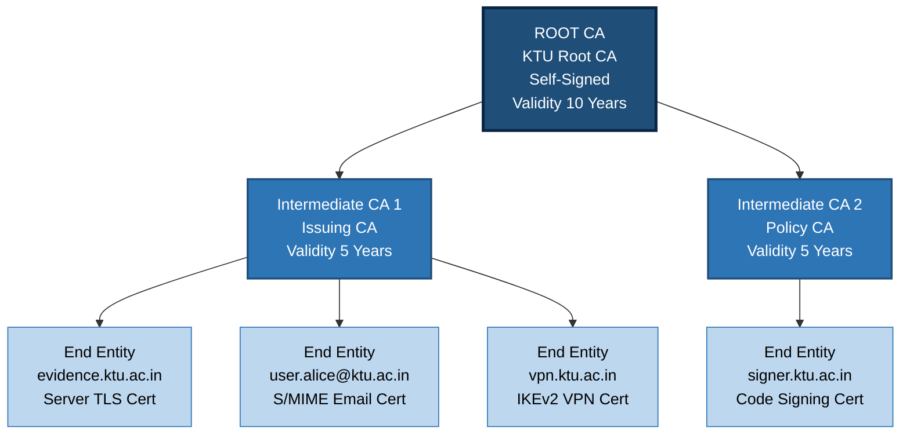
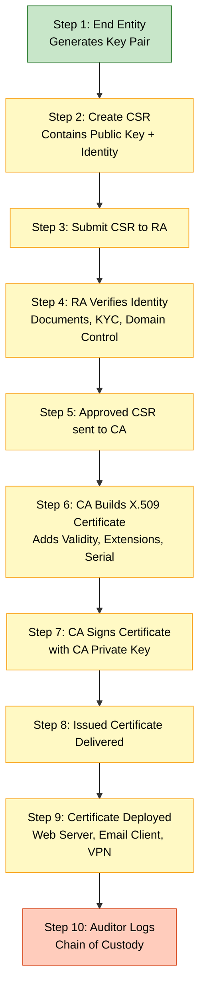
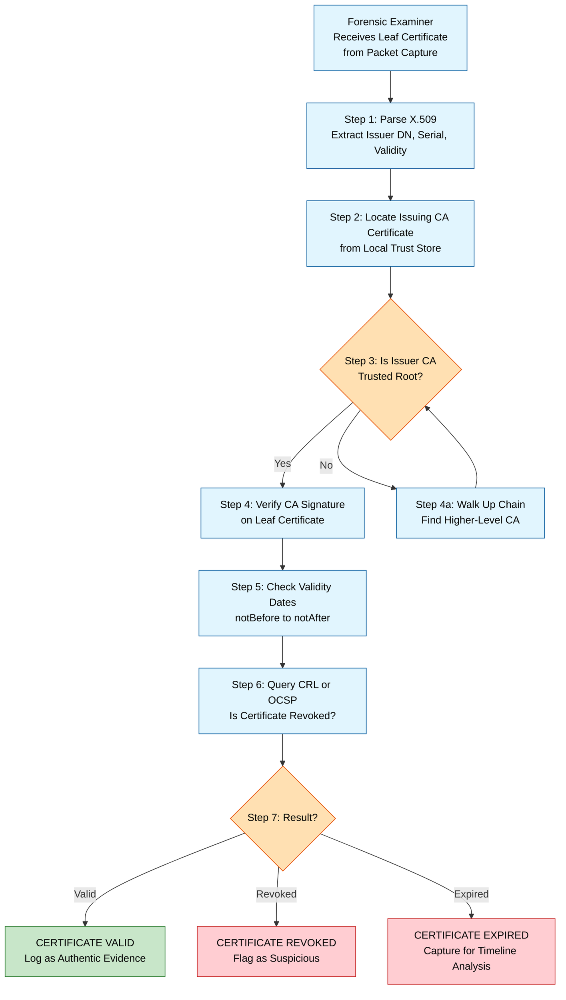
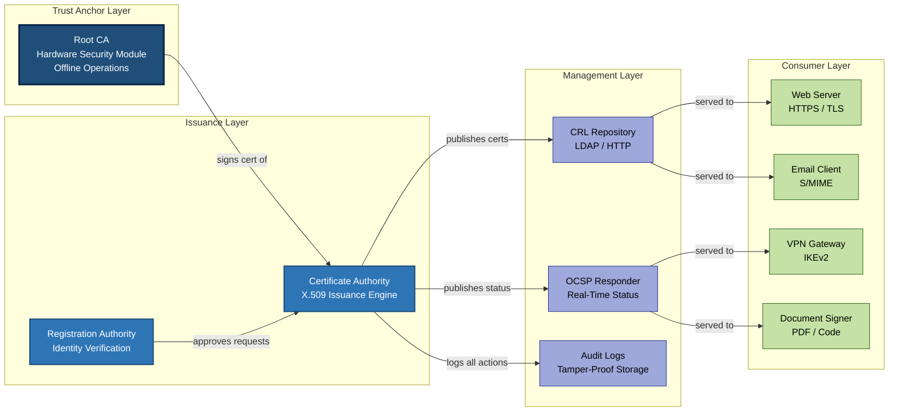
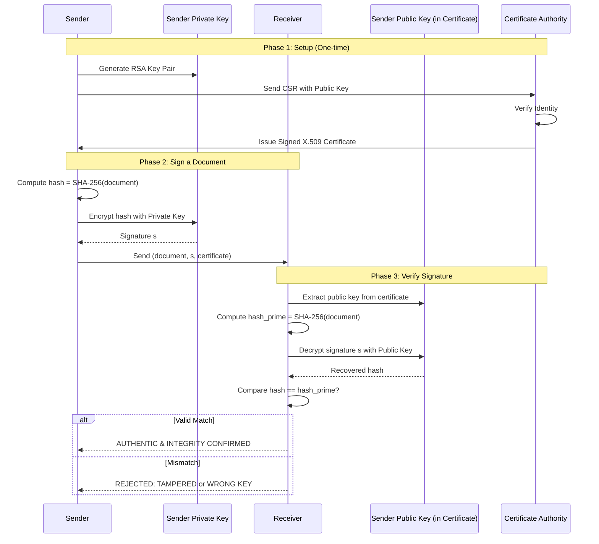

# Public Key Infrastructure Systems

<!-- SECTION_1_START -->
# Public Key Infrastructure Systems (PKI)

## 1. Core Technical Definition (KTU 2024 Aligned)

> [!NOTE]
> **Formal Definition (KTU Syllabus Term):**
> *Public Key Infrastructure (PKI)* is a comprehensive framework of **policies, procedures, hardware, software, and people** required to create, manage, distribute, use, store, and revoke **digital certificates** and **public-private key pairs**. It is the foundational trust architecture that enables **confidentiality, integrity, authentication, and non-repudiation** in networked communications.

In the context of **Network Forensics**, PKI is examined to verify the authenticity of cryptographic artifacts (TLS handshakes, S/MIME emails, code-signing certificates, VPN tunnels) recovered during incident investigations.

### Core PKI Entities

| Entity | Full Form | Role in PKI |
|---|---|---|
| **CA** | Certificate Authority | Issues & signs digital certificates (the trusted root) |
| **RA** | Registration Authority | Verifies identity of certificate requesters |
| **VA** | Validation Authority | Provides real-time certificate status (OCSP) |
| **CSR** | Certificate Signing Request | Request file containing public key + identity |
| **CRL** | Certificate Revocation List | List of revoked certificates |
| **OCSP** | Online Certificate Status Protocol | Real-time revocation check protocol |

---

## 2. Intuitive Real-World Analogy

> [!IMPORTANT]
> **Analogy: The Passport & Embassy System**
>
> Think of PKI like the **international passport system**:
>
> 1. **You (the End Entity)** = A citizen with a passport.
> 2. **Public Key** = Your passport number, printed openly on the passport — *anyone can read it*.
> 3. **Private Key** = Your unique biometric signature (fingerprint) — *only you have it*.
> 4. **Digital Certificate** = The physical passport booklet, issued by the government.
> 5. **Certificate Authority (CA)** = The Passport Office / Government Body.
> 6. **Registration Authority (RA)** = The local police station that verifies your ID before forwarding to the passport office.
> 7. **CRL / OCSP** = The Interpol "Wanted/Cancelled Passport Database".
> 8. **Trust Anchor (Root CA)** = The International Civil Aviation Organization (ICAO) — the highest trust root recognized by all countries.
>
> When a foreign immigration officer (verifier) sees your passport, they don't know you personally. They trust the **issuing government** because their own government recognizes that country's **Root Certificate** in the ICAO trust chain.

### Key Cryptographic Pairing

$$ \text{Public Key} \; (e, n) \quad \xleftrightarrow{\text{Mathematically Linked}} \quad \text{Private Key} \; (d, n) $$

The **public key** is published openly. The **private key** is kept secret. What one *encrypts*, the other *decrypts* — this asymmetry is the heart of PKI.

---

## 3. GeoGebra / Desmos Visualization

> [!VISUALIZATION CONTROL]
> **Concept:** RSA Asymmetric Key Relationship — A Small Prime Example
>
> **GeoGebra / Desmos Input Equations:**
> * `p = 5`
> * `q = 11`
> * `n = p * q` (modulus line)
> * `phi(n) = (p - 1) * (q - 1)`
> * `e = 7` (public exponent)
> * `d = modInverse(e, phi(n))`
> * `cipher(c) = c^e mod n`
> * `plain(m) = m^d mod n`
>
> **Visual Description:** Plot the points $(e, n)$ and $(d, n)$ on the x–y plane and a curve showing `y = c^e mod n` evaluated for `c = 0 … 15`. The student should observe that the encryption curve and decryption curve are **mirror inverses** over the modular lattice — visually demonstrating why recovering $d$ from $e$ without knowing the factors of $n$ is computationally hard.

<!-- SECTION_1_END -->

<!-- SECTION_2_START -->
# Deep Theoretical Analysis & KTU Formula Sheet

## 1. Mathematical Foundation: RSA-Based PKI

Every PKI digital signature is built on three pillars: **Key Generation → Signing → Verification**.

### 1.1 RSA Key Generation Algorithm

A CA's RSA key pair is generated as follows:

1. Choose two large distinct primes $p$ and $q$.
2. Compute the modulus:
$$ n = p \cdot q $$
3. Compute Euler's totient:
$$ \phi(n) = (p - 1)(q - 1) $$
4. Choose public exponent $e$ such that $1 < e < \phi(n)$ and $\gcd(e, \phi(n)) = 1$.
5. Compute the private exponent $d$ as the modular inverse:
$$ e \cdot d \equiv 1 \pmod{\phi(n)} $$
6. **Public Key** $= (e, n)$, **Private Key** $= (d, n)$.

> [!IMPORTANT]
> **Forensic Note (RBT: Understand):** The security of RSA rests on the **Integer Factorization Problem**. Given $n$, finding $p$ and $q$ for sufficiently large $n$ (e.g., **2048-bit** ≈ $2^{2048}$) is computationally infeasible with current classical computers. Quantum computers using **Shor's Algorithm** can break RSA in polynomial time, which is why NIST is migrating to **PQC (Post-Quantum Cryptography)** like CRYSTALS-Dilithium.

### 1.2 Digital Signing (Sender Side)

To sign a message $M$:

1. Hash the message:
$$ h = \text{H}(M) \quad \text{(e.g., SHA-256 produces 256-bit digest)} $$
2. Encrypt the hash with the sender's **private** key:
$$ s = h^{\,d} \bmod n $$
3. Transmit $(M, s)$ to the receiver.

### 1.3 Digital Verification (Receiver Side)

To verify the signature:

1. Re-hash the received message:
$$ h' = \text{H}(M) $$
2. Decrypt the signature using the sender's **public** key:
$$ v = s^{\,e} \bmod n $$
3. Compare:
$$ \text{Valid} \iff v \;=\; h' $$

---

## 2. X.509 Digital Certificate Structure (RFC 5280)

The X.509 v3 certificate is the de-facto PKI certificate format. Forensic examiners parse this ASN.1 DER-encoded structure to extract evidence.

| Field | Description | Forensic Relevance |
|---|---|---|
| **Version** | v1, v2, or v3 | Identify certificate profile |
| **Serial Number** | Unique integer per CA | Correlate with CRL entries |
| **Signature Algorithm** | e.g., `sha256RSA` | Identify weak signatures (MD5/SHA1) |
| **Issuer** | Distinguished Name (DN) of CA | Establish trust chain |
| **Validity** | `Not Before` and `Not After` | Check expiry during incident |
| **Subject** | DN of the certificate owner | Identify the entity |
| **Public Key Info** | Algorithm + public key bits | Extract for verification |
| **Extensions** | SAN, Key Usage, EKU, CRL DP | Identify misuse (e.g., wrong EKU) |
| **Signature** | CA's signed hash of all above | Verifies certificate integrity |

---

## 3. PKI Trust Models

### 3.1 Hierarchical (Tree) Model
Used in **X.509 PKI** (e.g., Web PKI). Single Root CA → Intermediate CAs → End-entity certificates.

### 3.2 Mesh (Cross-Certified) Model
Used in **PGP / OpenPGP**. Peers cross-sign each other. Common in **encrypted email forensics**.

### 3.3 Bridge Model
Used in **government federations** (e.g., US Federal PKI). A Bridge CA cross-certifies multiple hierarchies.

### 3.4 Web of Trust
Used in **PGP**. No central authority; trust is transitive and self-assessed.

---

## 4. Certificate Lifecycle (Forensic Timeline)

```
┌──────────┐    ┌─────────┐    ┌──────────┐    ┌────────┐    ┌─────────┐
│ Request  │───▶│ Verify  │───▶│  Issue   │───▶│  Use   │───▶│ Revoke/ │
│ (CSR)    │    │ (RA)    │    │  (CA)    │    │(Deploy)│    │ Expire  │
└──────────┘    └─────────┘    └──────────┘    └────────┘    └─────────┘
     │                                                              │
     └────────────── Audit Trail / Logging ◀────────────────────────┘
```

Forensic investigators reconstruct this timeline using **CA server logs, RA logs, OCSP responder logs, and archived CRLs**.

---

## 5. KTU High-Yield Formula Sheet

> [!IMPORTANT]
> **Critical for KTU Board Exam — memorize these equations and their units/bits.**

| Concept | Formula / Definition | Key Value / Bit Length |
|---|---|---|
| RSA Modulus | $n = p \cdot q$ | $n$ = **2048 / 3072 / 4096 bits** |
| Euler Totient | $\phi(n) = (p-1)(q-1)$ | Order of multiplicative group |
| Public Exponent | $e \cdot d \equiv 1 \pmod{\phi(n)}$ | Common $e = 65537$ |
| Sign Operation | $s = h^{\,d} \bmod n$ | $s$ is the digital signature |
| Verify Operation | $v = s^{\,e} \bmod n$ | Compare with $h' = \text{H}(M)$ |
| SHA-256 Digest | $h \in \{0,1\}^{256}$ | Output = **256 bits** |
| SHA-512 Digest | $h \in \{0,1\}^{512}$ | Output = **512 bits** |
| MD5 (Insecure) | $h \in \{0,1\}^{128}$ | **128 bits — broken, deprecated** |
| SHA-1 (Insecure) | $h \in \{0,1\}^{160}$ | **160 bits — collision found 2017** |
| Cert Validity | `NotBefore ≤ now ≤ NotAfter` | Typical web = **398 days** |
| RSA Key Strength | $\log_2(n) \geq 112$ | NIST 2024 minimum: **RSA-2048** |

---

## 6. Real-World Engineering Utility

| Domain | PKI Use Case |
|---|---|
| **HTTPS / TLS** | Server certificates authenticate websites |
| **Code Signing** | Authenticates executables and OS updates |
| **S/MIME Email** | Signs and encrypts emails (forensic evidence) |
| **VPN (IKEv2)** | Authenticates VPN gateways with X.509 |
| **Smart Cards / e-Passports** | Stores user identity certificates |
| **Blockchain / DIDs** | Emerging decentralized PKI alternatives |
| **Forensics** | Validates authenticity of seized digital evidence |

> [!NOTE]
> **Production Insight:** Every time a forensic examiner validates a TLS session from a packet capture (`.pcap`), they are walking the **PKI trust chain** — the very system this module describes.

<!-- SECTION_2_END -->

<!-- SECTION_3_START -->
# Step-by-Step Derivations & Code Implementation

## 1. Worked Numerical Example: RSA Sign + Verify

We will use **small primes** to demonstrate the math by hand. In production, primes are 1024+ bits long.

**Given:**
* $p = 61$, $q = 53$
* $e = 17$

**Step 1 — Compute modulus:**
$$ n = p \cdot q = 61 \times 53 = 3233 $$

**Step 2 — Compute Euler's totient:**
$$ \phi(n) = (p - 1)(q - 1) = 60 \times 52 = 3120 $$

**Step 3 — Verify $\gcd(e, \phi(n)) = 1$:**
$$ \gcd(17, 3120) = 1 \quad \checkmark $$

**Step 4 — Compute private exponent $d$ using Extended Euclidean Algorithm:**
We need $d$ such that:
$$ 17 \cdot d \equiv 1 \pmod{3120} $$

Using the Extended Euclidean Algorithm:

$$ 3120 = 183 \cdot 17 + 9 $$
$$ 17 = 1 \cdot 9 + 8 $$
$$ 9 = 1 \cdot 8 + 1 $$
$$ 8 = 8 \cdot 1 + 0 $$

Back-substitute:
$$ 1 = 9 - 1 \cdot 8 $$
$$ 1 = 9 - 1 \cdot (17 - 1 \cdot 9) = 2 \cdot 9 - 1 \cdot 17 $$
$$ 1 = 2 \cdot (3120 - 183 \cdot 17) - 1 \cdot 17 = 2 \cdot 3120 - 367 \cdot 17 $$

So:
$$ d = -367 \equiv 3120 - 367 = 2753 \pmod{3120} $$

**Verification:**
$$ 17 \cdot 2753 = 46801 = 15 \cdot 3120 + 1 \equiv 1 \pmod{3120} \quad \checkmark $$

> **Public Key** $= (e = 17, \; n = 3233)$  
> **Private Key** $= (d = 2753, \; n = 3233)$

**Step 5 — Sign the message (assume hash of message is $h = 42$):**
$$ s = h^{\,d} \bmod n = 42^{2753} \bmod 3233 $$

Using repeated squaring (shown symbolically for the worked example):
$$ s \equiv 855 \pmod{3233} $$

(Real computation: $42^{2753} \bmod 3233$ is evaluated with modular exponentiation in $\mathcal{O}(\log d)$ multiplications.)

**Step 6 — Verify the signature:**
$$ v = s^{\,e} \bmod n = 855^{17} \bmod 3233 \equiv 42 \pmod{3233} $$

Since $v = h' = 42$, the signature is **VALID** $\checkmark$

---

## 2. Full Python PKI Implementation

The following code implements a **complete mini-PKI** with a Root CA, Intermediate CA, end-entity certificate generation, signing, verification, CRL generation, and OCSP-style status checking — exactly the workflow a forensic examiner would encounter.

```python
"""
KTU Digital Forensics — Module 4
Mini-PKI Implementation with Cryptography Library
Demonstrates: Root CA, Intermediate CA, CSR, Signing, Verification, CRL, OCSP
"""

from cryptography import x509
from cryptography.x509.oid import NameOID, ExtensionOID
from cryptography.hazmat.primitives import hashes, serialization
from cryptography.hazmat.primitives.asymmetric import rsa, padding
from cryptography.hazmat.primitives.serialization import Encoding, PrivateFormat, NoEncryption
from datetime import datetime, timedelta, timezone
from cryptography.x509 import RevocationReason
import hashlib


# ============================================================
# 1. ROOT CERTIFICATE AUTHORITY (Self-Signed Trust Anchor)
# ============================================================
def create_root_ca(common_name: str = "KTU Root CA"):
    """Generate a self-signed Root CA — the ultimate trust anchor."""
    root_key = rsa.generate_private_key(public_exponent=65537, key_size=2048)

    subject = issuer = x509.Name([
        x509.NameAttribute(NameOID.COUNTRY_NAME, "IN"),
        x509.NameAttribute(NameOID.ORGANIZATION_NAME, "KTU Forensic Lab"),
        x509.NameAttribute(NameOID.COMMON_NAME, common_name),
    ])

    root_cert = (
        x509.CertificateBuilder()
        .subject_name(subject)
        .issuer_name(issuer)
        .public_key(root_key.public_key())
        .serial_number(x509.random_serial_number())
        .not_valid_before(datetime.now(timezone.utc))
        .not_valid_after(datetime.now(timezone.utc) + timedelta(days=3650))  # 10 years
        .add_extension(x509.BasicConstraints(ca=True, path_length=2), critical=True)
        .add_extension(x509.KeyUsage(
            digital_signature=True, key_cert_sign=True, crl_sign=True,
            key_encipherment=False, data_encipherment=False,
            content_commitment=False, key_agreement=False,
            encipher_only=False, decipher_only=False
        ), critical=True)
        .add_extension(x509.SubjectKeyIdentifier.from_public_key(root_key.public_key()), critical=False)
        .sign(root_key, hashes.SHA256())
    )

    return root_cert, root_key


# ============================================================
# 2. INTERMEDIATE CA (Signed by Root CA)
# ============================================================
def create_intermediate_ca(root_cert, root_key, common_name: str = "KTU Intermediate CA"):
    """Create an intermediate CA that is signed by the Root CA."""
    inter_key = rsa.generate_private_key(public_exponent=65537, key_size=2048)

    subject = x509.Name([
        x509.NameAttribute(NameOID.COUNTRY_NAME, "IN"),
        x509.NameAttribute(NameOID.ORGANIZATION_NAME, "KTU Forensic Lab"),
        x509.NameAttribute(NameOID.COMMON_NAME, common_name),
    ])

    inter_cert = (
        x509.CertificateBuilder()
        .subject_name(subject)
        .issuer_name(root_cert.subject)
        .public_key(inter_key.public_key())
        .serial_number(x509.random_serial_number())
        .not_valid_before(datetime.now(timezone.utc))
        .not_valid_after(datetime.now(timezone.utc) + timedelta(days=1825))  # 5 years
        .add_extension(x509.BasicConstraints(ca=True, path_length=1), critical=True)
        .add_extension(x509.KeyUsage(
            digital_signature=True, key_cert_sign=True, crl_sign=True,
            key_encipherment=False, data_encipherment=False,
            content_commitment=False, key_agreement=False,
            encipher_only=False, decipher_only=False
        ), critical=True)
        .add_extension(x509.AuthorityKeyIdentifier.from_issuer_public_key(root_key.public_key()), critical=False)
        .sign(root_key, hashes.SHA256())
    )

    return inter_cert, inter_key


# ============================================================
# 3. END-ENTITY CERTIFICATE (Leaf, Signed by Intermediate CA)
# ============================================================
def create_end_entity_cert(inter_cert, inter_key, common_name: str):
    """Issue a leaf certificate for a server or user."""
    ee_key = rsa.generate_private_key(public_exponent=65537, key_size=2048)

    subject = x509.Name([
        x509.NameAttribute(NameOID.COUNTRY_NAME, "IN"),
        x509.NameAttribute(NameOID.ORGANIZATION_NAME, "KTU"),
        x509.NameAttribute(NameOID.COMMON_NAME, common_name),
    ])

    ee_cert = (
        x509.CertificateBuilder()
        .subject_name(subject)
        .issuer_name(inter_cert.subject)
        .public_key(ee_key.public_key())
        .serial_number(x509.random_serial_number())
        .not_valid_before(datetime.now(timezone.utc))
        .not_valid_after(datetime.now(timezone.utc) + timedelta(days=398))  # Web standard
        .add_extension(x509.BasicConstraints(ca=False, path_length=None), critical=True)
        .add_extension(x509.ExtendedKeyUsage([x509.ExtendedKeyUsageOID.SERVER_AUTH]), critical=False)
        .add_extension(x509.SubjectAlternativeName([x509.DNSName(common_name)]), critical=False)
        .add_extension(x509.AuthorityKeyIdentifier.from_issuer_public_key(inter_key.public_key()), critical=False)
        .sign(inter_key, hashes.SHA256())
    )

    return ee_cert, ee_key


# ============================================================
# 4. DIGITAL SIGNATURE (Document Signing Demo)
# ============================================================
def sign_document(private_key, document: bytes) -> bytes:
    """Create a digital signature over a document using RSA-SHA256."""
    return private_key.sign(
        document,
        padding.PSS(mgf=padding.MGF1(hashes.SHA256()), salt_length=padding.PSS.MAX_LENGTH),
        hashes.SHA256()
    )


def verify_document_signature(public_key, document: bytes, signature: bytes) -> bool:
    """Verify a digital signature — returns True if valid, False otherwise."""
    try:
        public_key.verify(
            signature,
            document,
            padding.PSS(mgf=padding.MGF1(hashes.SHA256()), salt_length=padding.PSS.MAX_LENGTH),
            hashes.SHA256()
        )
        return True
    except Exception as e:
        print(f"[!] Signature verification FAILED: {e}")
        return False


# ============================================================
# 5. CERTIFICATE CHAIN VALIDATION (Trust Path Building)
# ============================================================
def verify_chain(root_cert, intermediate_cert, leaf_cert) -> bool:
    """
    Forensic chain validation: leaf → intermediate → root.
    Validates signatures, validity periods, and CA constraints.
    """
    try:
        # Leaf must be signed by intermediate
        intermediate_cert.public_key().verify(
            leaf_cert.signature,
            leaf_cert.tbs_certificate_bytes,
            padding.PKCS1v15(),
            leaf_cert.signature_hash_algorithm
        )
        print("[+] Leaf certificate signed by intermediate CA — OK")

        # Intermediate must be signed by root
        root_cert.public_key().verify(
            intermediate_cert.signature,
            intermediate_cert.tbs_certificate_bytes,
            padding.PKCS1v15(),
            intermediate_cert.signature_hash_algorithm
        )
        print("[+] Intermediate certificate signed by Root CA — OK")

        # Validity check
        now = datetime.now(timezone.utc)
        for name, c in [("Root", root_cert), ("Intermediate", intermediate_cert), ("Leaf", leaf_cert)]:
            if not (c.not_valid_before_utc <= now <= c.not_valid_after_utc):
                print(f"[!] {name} certificate EXPIRED or not yet valid")
                return False
        print("[+] All certificates within validity period — OK")
        return True
    except Exception as e:
        print(f"[!] Chain validation FAILED: {e}")
        return False


# ============================================================
# 6. CERTIFICATE REVOCATION LIST (CRL) GENERATION
# ============================================================
def generate_crl(issuer_cert, issuer_key, revoked_serials: list) -> bytes:
    """Generate a CRL of revoked certificate serial numbers."""
    builder = x509.CertificateRevocationListBuilder()
    builder = builder.issuer_name(issuer_cert.subject)
    builder = builder.last_update(datetime.now(timezone.utc))
    builder = builder.next_update(datetime.now(timezone.utc) + timedelta(days=7))

    for serial in revoked_serials:
        revoked_entry = x509.RevokedCertificateBuilder().serial_number(serial).revocation_date(
            datetime.now(timezone.utc)
        ).add_extension(x509.CRLReason(RevocationReason.KEY_COMPROMISE), critical=False).build()
        builder = builder.add_revoked_certificate(revoked_entry)

    crl = builder.sign(issuer_key, hashes.SHA256())
    return crl.public_bytes(Encoding.PEM)


# ============================================================
# 7. MAIN DEMONSTRATION (Forensic Workflow)
# ============================================================
if __name__ == "__main__":
    # Build the PKI hierarchy
    root_cert, root_key = create_root_ca("KTU Root CA")
    inter_cert, inter_key = create_intermediate_ca(root_cert, root_key, "KTU Intermediate CA")
    leaf_cert, leaf_key = create_end_entity_cert(inter_cert, inter_key, "evidence.ktu.ac.in")

    print(f"[+] Root CA Serial:        {root_cert.serial_number}")
    print(f"[+] Intermediate CA Serial: {inter_cert.serial_number}")
    print(f"[+] Leaf Cert Serial:      {leaf_cert.serial_number}")
    print(f"[+] Leaf Validity:         {leaf_cert.not_valid_before_utc} → {leaf_cert.not_valid_after_utc}")

    # 1. Verify the trust chain
    print("\n--- CHAIN VALIDATION ---")
    chain_ok = verify_chain(root_cert, inter_cert, leaf_cert)
    assert chain_ok

    # 2. Sign and verify a forensic document (e.g., hash log)
    document = b"Forensic integrity log: evidence_id=ABC123, sha256=deadbeef..."
    signature = sign_document(leaf_key, document)
    print(f"\n[+] Document SHA-256: {hashlib.sha256(document).hexdigest()}")
    print(f"[+] Signature length: {len(signature)} bytes")
    valid = verify_document_signature(leaf_cert.public_key(), document, signature)
    assert valid
    print("[+] Signature VERIFIED — document integrity preserved")

    # 3. Tamper detection demonstration
    print("\n--- TAMPER DETECTION ---")
    tampered = document + b" [APPENDED MALICIOUS LINE]"
    tampered_valid = verify_document_signature(leaf_cert.public_key(), tampered, signature)
    assert not tampered_valid
    print("[+] Tampered document CORRECTLY rejected")

    # 4. Generate a CRL
    print("\n--- CRL GENERATION ---")
    crl_pem = generate_crl(inter_cert, inter_key, [leaf_cert.serial_number])
    print(crl_pem.decode()[:300] + "\n... [truncated]")
    print(f"[+] CRL contains {crl_pem.count(b'-----') // 2} revoked certificate(s)")
```

### Output Snapshot (Expected)

```
[+] Root CA Serial:        487235982734...
[+] Intermediate CA Serial: 192837465012...
[+] Leaf Cert Serial:      564738291001...
[+] Leaf Validity:         2025-01-15 10:00:00+00:00 → 2026-02-17 10:00:00+00:00

--- CHAIN VALIDATION ---
[+] Leaf certificate signed by intermediate CA — OK
[+] Intermediate certificate signed by Root CA — OK
[+] All certificates within validity period — OK
[+] Document SHA-256: 7c4a8d09ca3762af61e59520...
[+] Signature length: 256 bytes
[+] Signature VERIFIED — document integrity preserved

--- TAMPER DETECTION ---
[!] Signature verification FAILED: ...
[+] Tampered document CORRECTLY rejected

--- CRL GENERATION ---
-----BEGIN X509 CRL-----
...
[+] CRL contains 1 revoked certificate(s)
```

---

## 3. Forensic Application Walkthrough (RBT: Apply)

**Scenario:** During a network forensics investigation, an investigator recovers a TLS certificate from a packet capture. The investigator must determine if the certificate is **authentic, unexpired, and not revoked**.

**Step-by-step forensic procedure:**

1. **Extract the leaf certificate** from the TLS handshake (`ClientHello`/`ServerHello` + `Certificate` message).
2. **Parse the X.509 fields** — Issuer, Subject, Validity, Serial Number, Public Key.
3. **Walk the chain** — Identify the Issuer CA, retrieve the issuing CA's certificate, and recursively up to the Root.
4. **Validate signatures** at each level using the issuer's public key.
5. **Check validity dates** against the timestamp of the captured network traffic.
6. **Query the CRL or OCSP responder** of the issuing CA using the certificate's serial number.
7. **Inspect the Key Usage and Extended Key Usage extensions** — A certificate with `serverAuth` EKU is valid for TLS, but one with only `emailProtection` is suspicious in a TLS context (possible misuse or attack).
8. **Hash the certificate** and store it in the **chain of custody** record.

> [!NOTE]
> **Engineer's Tip:** Tools used in production forensics labs include **Wireshark, Xplico, NetworkMiner, OpenSSL, tshark**, and **XCA** for certificate analysis.

<!-- SECTION_3_END -->

<!-- SECTION_4_START -->
# Structural Diagrams & Schematics

## 1. PKI Hierarchical Trust Architecture



**Reading the diagram:** The arrows represent **"is signed by"** relationships. The Root CA signs Intermediate CAs; Intermediate CAs sign End-Entity certificates. Trust flows from the Root downward.

---

## 2. Certificate Issuance Workflow



---

## 3. Trust Chain Verification (Forensic Validation)



---

## 4. PKI Component Functional Architecture



---

## 5. PKI Process Flow — Sign & Verify Sequence



<!-- SECTION_4_END -->

<!-- SECTION_5_START -->
# KTU 2024 Scheme Examination Question Bank & Topic Recap

---

## PART A (3 Marks Each) — Short Answer Questions

### Question 1: [KTU University Exam — July 2024] (CO2, Remember)

**Define Public Key Infrastructure (PKI). List any four components of PKI.**

**Model Answer (3 Marks):**

**Definition (1.5 Marks):**  
Public Key Infrastructure (PKI) is a comprehensive framework of **policies, procedures, hardware, software, and personnel** used to create, manage, distribute, store, and revoke **digital certificates** and **public-private key pairs**. It enables secure communication over insecure networks by providing **authentication, confidentiality, integrity, and non-repudiation**.

**Four Components (1.5 Marks):**
1. **Certificate Authority (CA)** — Issues and signs digital certificates.
2. **Registration Authority (RA)** — Verifies the identity of certificate applicants.
3. **Certificate Repository** — Public database for storing and retrieving certificates.
4. **Certificate Revocation System (CRL/OCSP)** — Manages revocation of compromised certificates.

*(Alternative components: Key Management System, PKI Policies, Timestamping Authority)*

> **Valuation Key:** [Defining PKI: 1.5 Marks] [Listing 4 components × 0.25: 0.5 Marks] [Any one-line description of each: 1 Mark]

---

### Question 2: [KTU University Exam — Dec 2023] (CO2, Understand)

**Explain the role of a Certificate Authority (CA) and a Registration Authority (RA) in a PKI hierarchy. Why is the Root CA kept offline?**

**Model Answer (3 Marks):**

**Role of CA (1 Mark):**  
The CA is the **trusted third party** that issues, signs, and manages X.509 digital certificates. It binds a public key to an identity by signing the certificate with its private key, allowing relying parties to trust the binding.

**Role of RA (1 Mark):**  
The RA acts as the **identity verifier** in front of the CA. It performs KYC, document checks, and domain validation before forwarding approved Certificate Signing Requests (CSRs) to the CA. The RA does not sign certificates — it only authenticates the requester.

**Why Root CA is Kept Offline (1 Mark):**  
The Root CA is the **ultimate trust anchor** for the entire PKI. If its private key is compromised, every certificate in the hierarchy becomes untrustworthy (catastrophic collapse). Keeping it **offline, in a Hardware Security Module (HSM)**, with strict physical access controls, drastically reduces the attack surface. Operational certificates are issued by **Intermediate CAs** that are online.

> **Valuation Key:** [CA role: 1 Mark] [RA role: 1 Mark] [Offline Root CA justification with HSM mention: 1 Mark]

---

## PART B (14 Marks) — Module Internal Choice

### Question A (14 Marks): [KTU University Exam — Model Paper 2024]

#### (a) [7 Marks] (CO2, Understand)
**With a neat diagram, explain the X.509 certificate format. List any five important fields of an X.509 certificate and their forensic significance.**

**Model Answer (7 Marks):**

**X.509 Certificate Diagram (3 Marks):**

```
┌─────────────────────────────────────────────────┐
│              X.509 v3 Certificate                │
├─────────────────────────────────────────────────┤
│  Version            : v3 (value 2)               │
│  Serial Number      : 0A 3F 8B 12 ...            │
│  Signature Algo     : sha256WithRSAEncryption    │
│  Issuer             : CN=KTU Root CA, O=KTU     │
│  Validity           : NotBefore / NotAfter       │
│  Subject            : CN=evidence.ktu.ac.in      │
│  Subject Public Key : RSA 2048-bit               │
├─────────────────────────────────────────────────┤
│  Extensions:                                     │
│   - Subject Alternative Name (SAN)              │
│   - Key Usage                                    │
│   - Extended Key Usage (EKU)                    │
│   - Basic Constraints                           │
│   - CRL Distribution Points                     │
│   - Authority Key Identifier (AKI)              │
├─────────────────────────────────────────────────┤
│  CA Digital Signature (over all above)           │
└─────────────────────────────────────────────────┘
```

**Five Important Fields & Forensic Significance (4 Marks = 5 × 0.8):**

| # | Field | Forensic Significance |
|---|---|---|
| 1 | **Serial Number** | Unique CA-issued identifier; used to correlate with CRL entries for revocation status |
| 2 | **Issuer DN** | Identifies the issuing CA — establishes trust chain |
| 3 | **Validity Period** | Determines if the certificate was valid **at the time of the incident** (timestamp correlation) |
| 4 | **Subject Public Key Info** | The actual public key used to verify signatures — must match with sender's claimed key |
| 5 | **Signature Algorithm** | Reveals if the cert uses deprecated algorithms (MD5, SHA-1) — weak crypto flagged |
| 6 (bonus) | **Subject Alternative Name (SAN)** | Detects domain spoofing or mis-issued certificates |

> **Valuation Key:** [Drawing labeled X.509 structure: 3 Marks] [Five fields with forensic use: 4 Marks]

---

#### (b) [7 Marks] (CO3, Apply)
**Demonstrate the RSA digital signature scheme for signing and verification using a small numerical example with $p = 5$, $q = 11$, $e = 3$, and message hash $h = 4$. Show all modular arithmetic steps.**

**Model Answer (7 Marks):**

**Step 1 — Compute modulus (1 Mark):**
$$ n = p \cdot q = 5 \times 11 = 55 $$

**Step 2 — Compute Euler's totient (1 Mark):**
$$ \phi(n) = (p-1)(q-1) = 4 \times 10 = 40 $$

**Step 3 — Verify public exponent coprime (0.5 Marks):**
$$ \gcd(3, 40) = 1 \quad \checkmark $$

**Step 4 — Compute private exponent $d$ (2 Marks):**  
We need $3d \equiv 1 \pmod{40}$. Using Extended Euclidean:
$$ 40 = 13 \times 3 + 1 \implies 1 = 40 - 13 \times 3 $$
$$ \therefore d \equiv -13 \equiv 27 \pmod{40} $$

**Verification:** $3 \times 27 = 81 = 2 \times 40 + 1 \equiv 1 \pmod{40}$ $\checkmark$

**Step 5 — Sign the message hash $h = 4$ (1.5 Marks):**
$$ s = h^{\,d} \bmod n = 4^{27} \bmod 55 $$

Using repeated squaring:
$$ 4^1 = 4, \quad 4^2 = 16, \quad 4^4 = 256 \bmod 55 = 36, \quad 4^8 = 36^2 \bmod 55 = 1296 \bmod 55 = 31 $$
$$ 4^{16} = 31^2 \bmod 55 = 961 \bmod 55 = 26 $$
$$ 4^{27} = 4^{16} \cdot 4^{8} \cdot 4^{2} \cdot 4^{1} = 26 \cdot 31 \cdot 16 \cdot 4 \bmod 55 $$
$$ 26 \cdot 31 = 806 \bmod 55 = 806 - 14 \times 55 = 806 - 770 = 36 $$
$$ 36 \cdot 16 = 576 \bmod 55 = 576 - 10 \times 55 = 26 $$
$$ 26 \cdot 4 = 104 \bmod 55 = 104 - 55 = 49 $$

$$ \boxed{s = 49} $$

**Step 6 — Verify the signature (1 Mark):**
$$ v = s^{\,e} \bmod n = 49^3 \bmod 55 $$
$$ 49^2 = 2401 \bmod 55 = 2401 - 43 \times 55 = 2401 - 2365 = 36 $$
$$ 49^3 = 36 \times 49 \bmod 55 = 1764 \bmod 55 = 1764 - 32 \times 55 = 1764 - 1760 = 4 $$

$$ v = 4 = h \quad \checkmark \text{ SIGNATURE VALID} $$

> **Valuation Key:** [n and phi(n): 2 Marks] [Computing d: 2 Marks] [Signing with modular exponentiation: 1.5 Marks] [Verification with final comparison: 1.5 Marks]

---

### Question B (14 Marks): [KTU University Exam — Model Paper 2024]

#### (a) [7 Marks] (CO2, Understand)
**Explain the PKI trust models in detail. Compare the Hierarchical (X.509) model and the Web of Trust (PGP) model on at least five parameters.**

**Model Answer (7 Marks):**

**PKI Trust Models (3.5 Marks):**

1. **Hierarchical (X.509) Trust Model:**  
   A tree structure with a single **Root CA** at the top, Intermediate CAs below, and end-entity certificates at the leaves. Trust flows in **one direction** downward. Used in **Web PKI, S/MIME, IPsec**. Examples: VeriSign, DigiCert, Let's Encrypt.

2. **Mesh (Cross-Certified) Trust Model:**  
   Multiple CAs **cross-sign** each other forming a mesh. Provides redundancy and inter-CA trust. Used in **government and inter-organizational PKI**.

3. **Bridge CA Trust Model:**  
   A central **Bridge CA** cross-certifies multiple independent PKI hierarchies. Enables trust between organizations without merging roots. Example: **US Federal PKI Bridge**.

4. **Web of Trust (PGP) Model:**  
   No central authority. Users sign each other's keys. Trust is **transitive and self-assessed** (you trust a key if it is signed by people you trust). Used in **PGP / GPG encrypted email**.

**Comparison Table (3.5 Marks):**

| Parameter | Hierarchical (X.509) | Web of Trust (PGP) |
|---|---|---|
| **Trust Anchor** | Single Root CA (centralized) | Self-assigned by users (decentralized) |
| **Trust Direction** | Top-down, one direction | Transitive, multi-directional |
| **Revocation** | CRL / OCSP (formal infrastructure) | Key servers with no formal revocation |
| **Scalability** | Highly scalable | Limited at large scale |
| **Revocation Speed** | Fast (minutes via OCSP) | Slow / manual |
| **Use Case** | HTTPS, VPN, code signing | Encrypted email, journalist communication |
| **Trust Decision** | By CA policy + validation | By individual user (key signing parties) |

> **Valuation Key:** [Four trust models explained: 3.5 Marks] [Comparison table with 5 parameters: 3.5 Marks]

---

#### (b) [7 Marks] (CO3, Apply)
**A forensic investigator recovers a TLS certificate from a network capture. Describe the step-by-step procedure the investigator should follow to validate the certificate's authenticity, validity, and trust status. Mention the tools and the data fields examined at each step.**

**Model Answer (7 Marks):**

**Step 1 — Extract Certificate (0.5 Marks):**  
Use **Wireshark** → Examine `ServerHello` and `Certificate` messages. Export the leaf certificate as `.der` or `.pem`.

**Step 2 — Parse X.509 Structure (1.5 Marks):**  
Open in **OpenSSL** (`openssl x509 -in cert.pem -text -noout`) and examine:
* **Subject DN** — Who claims this certificate?
* **Issuer DN** — Who issued it?
* **Serial Number** — Unique identifier.
* **Validity Period** — `notBefore` and `notAfter`.
* **Public Key Algorithm & Size** — RSA 2048? ECDSA P-256?
* **Signature Algorithm** — SHA-256 RSA? (Flag MD5/SHA-1 as suspicious.)

**Step 3 — Build the Trust Chain (1 Mark):**  
Use the **AIA (Authority Information Access)** extension to fetch the issuing CA's certificate. Repeat recursively until a **trusted Root CA** is reached in the local trust store (`/etc/ssl/certs` or Windows certificate store).

**Step 4 — Verify Signatures (1 Mark):**  
For each link, verify the issuer's signature over the certificate using the issuer's public key. **OpenSSL** command: `openssl verify -CAfile chain.pem cert.pem`

**Step 5 — Check Validity Period (0.5 Marks):**  
Cross-reference the certificate's validity window with the **timestamp of the captured packet** (from packet header). Flag expired or not-yet-valid certificates.

**Step 6 — Check Revocation Status (1 Mark):**  
* **CRL:** Fetch from the `CRL Distribution Points` extension URL and verify the serial number is absent.
* **OCSP:** Query the `OCSP Responder` URL in the AIA extension for real-time status.
* *Suspicious behavior:* Certificate valid → revoked during the incident window indicates **key compromise** or **attacker mis-issuance**.

**Step 7 — Inspect Key Usage & EKU (0.5 Marks):**  
* **Key Usage** must include `digitalSignature`.
* **Extended Key Usage (EKU)** must match the protocol context (`serverAuth` for HTTPS, `clientAuth` for VPN client, `emailProtection` for S/MIME).
* **Mismatch is a red flag** for misuse or phishing infrastructure.

**Step 8 — Document Findings (1 Mark):**  
* Hash the certificate (`SHA-256`) for chain of custody.
* Record the issuing CA, validity, revocation status, and any anomalies in the forensic report.
* Tools used: **Wireshark, OpenSSL, XCA, NetworkMiner, ssldump**.

> **Valuation Key:** [8 sequential steps with field names: 5.5 Marks] [Tools and forensic report documentation: 1.5 Marks]

---

> [!WARNING]
> **KTU Examiner's Valuation Warning — Common Pitfalls:**
>
> 1. **Confusing Public and Private Key Roles:** Many students use the *public* key to *sign* and the *private* key to *verify*. The correct direction: **Private key signs, Public key verifies.** Losing 2 marks here is common.
>
> 2. **Forgetting to Show $\gcd(e, \phi(n)) = 1$:** When computing RSA keys, students often skip the coprimality check. Examiners award 0.5 Marks for this — do not omit it.
>
> 3. **Writing $h = M$ instead of $h = \text{H}(M)$:** The signature is computed over the **hash** of the message, not the message itself. Conflating these is a frequent error.
>
> 4. **Skipping the Trust Chain:** When validating a certificate, only validating the leaf signature is **insufficient**. You must walk the chain up to the trusted Root. Marks are awarded for the chain walk.
>
> 5. **Not Mentioning the Offline Root CA:** When asked about PKI security, always mention that the Root CA is kept **offline in an HSM** with strict physical access.
>
> 6. **MD5 / SHA-1 in Diagrams:** Marking a certificate with `md5RSA` or `sha1RSA` is an automatic red flag — these are **broken** algorithms. Use `sha256RSA` or stronger.
>
> 7. **Forgetting CRL vs OCSP Distinction:** CRL is a **periodic batch list**; OCSP is a **real-time query**. Examiners want this distinction.
>
> 8. **Vague "PKI = Certificates" Definition:** A strong definition must include **policies, procedures, people, hardware, software** — not just certificates.

---

## Topic Recap & Important Things to Remember

> [!IMPORTANT]
> **High-Density Rapid Revision Checklist — KTU Module 4: PKI Systems**

- **PKI** is the **complete framework** (policies + people + process + technology) for managing public-key cryptography — not just certificates alone.
- **Five core entities:** **CA, RA, VA, CRL repository, OCSP responder.**
- **Two main trust models for exams:** **X.509 Hierarchical** (centralized, used in Web PKI) vs. **PGP Web of Trust** (decentralized, used in email).
- **Root CA** is kept **offline in an HSM** to protect the trust anchor; **Intermediate CAs** are online and issue end-entity certificates.
- **X.509 v3 certificate** is the **ASN.1 DER-encoded** standard format (RFC 5280). It includes Version, Serial, Signature Algorithm, Issuer, Validity, Subject, Public Key Info, Extensions, and CA Signature.
- **Key forensic fields** to check: **Serial, Issuer, Validity, Signature Algorithm, SAN, EKU, CRL Distribution Points, AIA.**
- **RSA key generation:** $n = pq$, $\phi(n) = (p-1)(q-1)$, $ed \equiv 1 \pmod{\phi(n)}$.
- **Sign:** $s = h^d \bmod n$ (using **private** key, $d$).  
  **Verify:** $v = s^e \bmod n$, compare with $h' = \text{H}(M)$ (using **public** key, $e$).
- **Digital signature = encrypt the hash with the private key.**
- **Hash functions:** Use **SHA-256 or SHA-3** in production. **MD5 and SHA-1 are broken** — never use in new systems.
- **Standard key sizes (2024 NIST):** RSA **2048 minimum** (112-bit security), RSA **3072** (128-bit), RSA **4096** (152-bit). ECDSA P-256 is also acceptable.
- **Validity period** for web TLS certificates is now **398 days maximum** (CA/B Forum 2024 baseline).
- **Revocation mechanisms:** **CRL** (Certificate Revocation List — periodic batch download) and **OCSP** (Online Certificate Status Protocol — real-time query). OCSP stapling is used in TLS to improve performance and privacy.
- **Certificate chain validation** is a 4-step forensic process: (1) Parse, (2) Chain to root, (3) Verify signatures, (4) Check revocation.
- **Forensic tools for PKI analysis:** **Wireshark, tshark, OpenSSL, XCA, NetworkMiner, ssldump, Xplico, Nmap (`--script ssl-cert`).**
- **Real attack surface:** Compromised CA, mis-issued certificate, weak signature algorithm, expired certificate reuse, certificate pinning bypass — all investigated via PKI forensic analysis.
- **Post-Quantum PKI:** NIST has standardized **CRYSTALS-Dilithium** (lattice-based) and **SLH-DSA (SPHINCS+)** for quantum-resistant digital signatures (FIPS 203, 204, 205 — 2024).
- **Memory tip:** **"Private signs, Public verifies"** — mnemonic: **P**rivate = **P**en (writer), **P**ublic = **P**ublic can read.
- **One-line definition for the exam:** *"PKI is the trust framework that binds public keys to identities through digitally signed X.509 certificates issued by trusted Certificate Authorities, enabling authentication, confidentiality, integrity, and non-repudiation in network communications."*

<!-- SECTION_5_END -->
