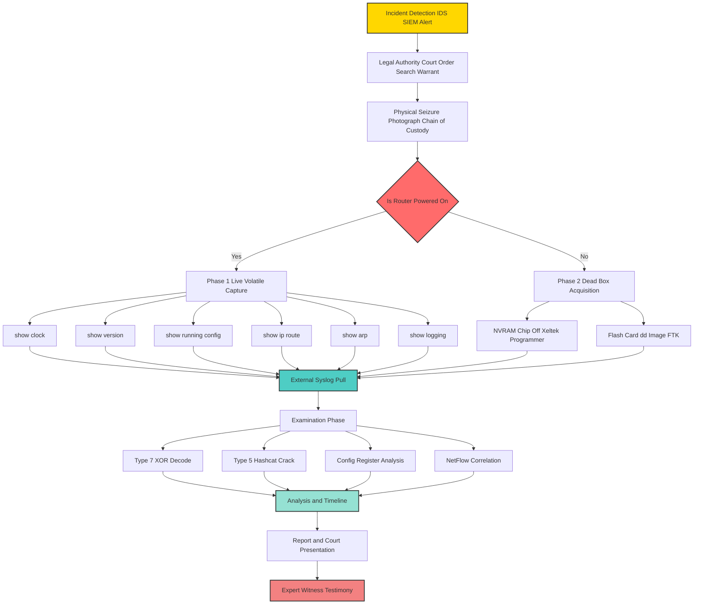
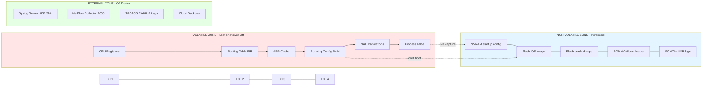
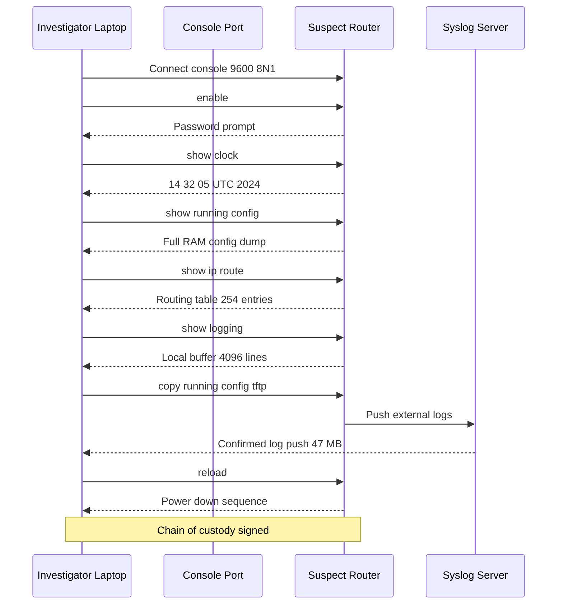
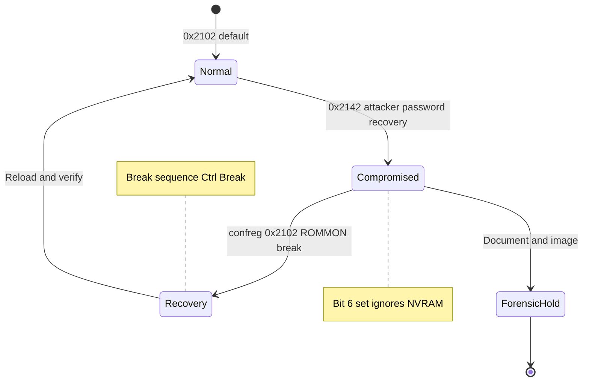

# Router Forensics

<!-- SECTION_1_START -->
# Router Forensics — Core Technical Definition & Intuitive Overview

## Formal KTU 2024 Definition
> **Router Forensics** is a sub-discipline of **Network Forensics** concerned with the identification, preservation, acquisition, examination, and analysis of volatile and non-volatile data residing within networking routers and their associated infrastructure. It focuses on recovering evidence of routing manipulation, unauthorized access, traffic redirection, configuration tampering, denial-of-service attacks, and policy violations from devices operating at OSI Layer 3 (Network Layer).

The forensic artefacts typically recovered from a router include:
- **Routing Tables** (RIB — Routing Information Base)
- **Forwarding Tables** (FIB — Forwarding Information Base, often in TCAM)
- **Access Control Lists (ACLs)** and firewall rule sets
- **Configuration Registers** (e.g., the Cisco `confreg 0x2102` value)
- **NVRAM Startup Configuration** (`startup-config`)
- **RAM Running Configuration** (`running-config`)
- **Syslog buffers and external Syslog server entries**
- **NetFlow / sFlow / IPFIX flow records**
- **CDP (Cisco Discovery Protocol) and LLDP neighbour tables**
- **ARP caches, NAT translation tables, and DHCP bindings**
- **VPN tunnels, IPSec Security Associations (SAs)**

> [!IMPORTANT]
> **KTU 2024 Syllabus Highlight (PECST754 — Module 4):**
> Router forensics sits at the intersection of *volatile data acquisition* and *configuration-level evidence reconstruction*. KTU examiners expect students to know the **order of volatility** (per RFC 3227), the role of **NVRAM vs Flash vs RAM**, and the specific commands used by investigators (e.g., `show running-config`, `show ip route`, `show logging`).

---

## Conceptual Analogy / Intuition
Think of a **router as the post-office sorting hub of a city** (the network). Every letter (packet) that passes through is briefly inspected, has its destination read, and gets sorted onto the right delivery truck (egress interface). Routers also keep a **logbook of which trucks arrived, when, and what they carried** (syslog, NetFlow). 

When a crime (cyber-incident) happens — say, money is being secretly mailed to a fraudster's address — the police (forensic investigator) needs to seize the post-office records. However, the post-office is special:
- The **sorting desk (RAM)** forgets everything the moment the power goes out (volatile).
- The **permanent ledger (NVRAM / Flash)** keeps the long-term policy, like which streets are one-way (ACLs, routing policy).
- The **security camera footage (syslog / NetFlow server)** is usually stored off-site on a separate hardened server.

A forensic investigator must therefore be careful about **what order** they collect the evidence — the sorting desk first (most volatile), then the permanent ledger, then external logs.

---

## Core Metrics & Constants to Remember

| Term | Value / Description |
| :--- | :--- |
| **Default Cisco config-register** | **0x2102** (boots from NVRAM with console break disabled) |
| **Compromised config-register** | **0x2142** (ignores NVRAM, used for password recovery — also abused by attackers) |
| **Standard syslog UDP port** | **514** |
| **Secure syslog (TLS) port** | **6514** |
| **NetFlow export port (v5/v9)** | **UDP 2055, 9996** |
| **sFlow export port** | **UDP 6343** |
| **CDP multicast address** | **01:00:0C:CC:CC:CC** (Layer 2) |
| **Default NVRAM size on ISR routers** | **~256 KB – 2 MB** |

> [!NOTE]
> The hexadecimal value **0x2102** and **0x2142** are **high-frequency KTU exam favourites**. Memorise them — they appear in almost every KTU Dec/Dec and June/July past paper under "Router Forensics" or "Network Device Forensics".

---

> [!VISUALIZATION CONTROL]
> **Concept:** Live router memory map (Volatile vs Non-Volatile)
> **GeoGebra / Desmos Input Equations (Analogy Plot):**
> * `x = 0` to `x = 100` representing the lifespan of a router
> * `y_{volatile} = 100 \cdot e^{-x/5}` (RAM — collapses quickly on power loss)
> * `y_{nonvolatile} = 80 + 5 \cdot \sin(x/10)` (NVRAM/Flash — persistent with small fluctuations)
> **Visual Description:** A student should observe two curves crossing: the RAM curve drops to **0** almost immediately when power is cut (volatile), while the NVRAM/Flash curve remains stable around **80** units (non-volatile), representing persistent configuration even across reboots.
<!-- SECTION_1_END -->

<!-- SECTION_2_START -->
# Deep Theoretical Analysis & KTU High-Yield Formula Sheet

## 2.1 The Three Memory Planes of a Router
A forensic investigator must understand **where** evidence physically lives. Modern enterprise routers (Cisco ISR/ASR, Juniper MX, Huawei NE) segment memory into three forensic zones:

### 1. Volatile Storage (RAM / DRAM)
- Holds the **running-config**, routing tables (RIB), ARP cache, NAT translations, and process state.
- Lost **immediately** on power cycle.
- Acquisition must use the **Live Acquisition** methodology (SSH/Telnet/Console with `show tech-support`, or plug a Unix box into the AUX port and run `dd` over serial).

### 2. Non-Volatile Storage (NVRAM)
- Stores the **startup-config** that is copied to RAM at boot.
- Retained via a small **lithium battery** or **EEPROM** on older devices.
- Critical for **dead-box forensics** — pull the NVRAM chip, read it with a programmer (e.g., Xeltek SuperPro).

### 3. Bulk Non-Volatile Storage (Flash / PCMCIA / USB)
- Holds the **IOS / JunOS image file**, crash dumps, log files, and sometimes captive portals.
- Forensic imaging of flash is performed using the router's own TFTP/FTP server or by physically removing the flash card and imaging with **FTK Imager** or **dd** (Linux).

> [!IMPORTANT]
> **Order of Volatility (RFC 3227, mandatory KTU concept):**
> 1. CPU Registers & Cache
> 2. Routing Table (RAM)
> 3. ARP Cache (RAM)
> 4. Process Table & Kernel State (RAM)
> 5. Temporary File Systems (`/tmp`)
> 6. Disk / Flash
> 7. Remote logging and monitoring data (syslog server, NetFlow collector)
> 8. Physical configuration (NVRAM, ROMMON variables)
> 9. Archival media (backups on tape/disk)

---

## 2.2 Live vs Dead Router Forensics

| Aspect | Live Forensics | Dead Forensics |
| :--- | :--- | :--- |
| **Power state** | Router is ON | Router is OFF / pulled from rack |
| **Volatile data** | Recoverable (most important) | Lost forever |
| **Tools** | `show tech-support`, `show ip route`, `show log`, SecureCRT scripts | FTK Imager, EnCase, dd, Xeltek programmer |
| **Risk** | Evidence contamination via commands | Losing volatile data |
| **Use case** | Active incident / ongoing attack | Post-incident, after-hours seizure |

---

## 2.3 The Five-Phase Router Forensic Methodology

### Phase 1 — Identification & Legal Authority
- Obtain a **written consent, subpoena, or court order** before touching the device.
- Document the **chain-of-custody** (who, what, when, where, why).
- Photograph the **front panel** (chassis serial number, all lit LEDs, console cable, and any **USB stick or PCMCIA card** physically inserted).

### Phase 2 — Preservation (Volatile First)
- Connect a **trusted forensic laptop** to the console port at **9600 baud 8N1**.
- Issue the volatile data capture sequence:
  1. `show clock` — record time
  2. `show version` — IOS version, uptime, hardware
  3. `show running-config` — RAM config
  4. `show startup-config` — NVRAM config
  5. `show ip route` — RIB
  6. `show ip arp` — ARP cache
  7. `show ip nat translations` — NAT table
  8. `show access-lists` — ACL counters (huge evidence value)
  9. `show logging` — local syslog buffer
  10. `show ip cache flow` or pull from NetFlow collector

### Phase 3 — Acquisition
- Dump the **flash file system** with `show flash:` and copy files via TFTP.
- For **NVRAM**, use the command `copy startup-config tftp://<laptop_ip>/nvram.txt` for a logical copy.
- For **physical acquisition**, power off, remove the NVRAM chip (PLCC32 socket on Cisco 2500/2600), read with a hardware programmer. The raw dump is a **hex file** that requires an IOS-parser (e.g., **cisco-decrypt**, **Cain & Abel**, or **John the Ripper** with the `cisco-asa` and `enable` formats).

### Phase 4 — Examination & Decoding
- **Type 7 Passwords** (Cisco `enable password 7 ...`) are weak XOR-based obfuscation. They are reversed using the well-known Vigenère-style key `dsfd;kfoA,.iyewrkldJKDHSUB`:
$$\text{Plaintext}_i = \text{Ciphertext}_i \oplus \text{Key}_{(i \bmod 53)}$$
- **Type 5 Passwords** (MD5-based) are cracked with **hashcat -m 500** using a wordlist.
- **Type 8 (PBKDF2-SHA256)** and **Type 9 (scrypt)** are the modern strong hashes — usually considered uncrackable for the exam.
- Decode **hex config-register** values to detect tampering:
  - Bit 6 (0x0040) — *ignore NVRAM*. If set, attacker used password-recovery boot sequence.
  - Bit 13 (0x2000) — *boot from ROM monitor*. Often a sign of a failed boot or attacker pivot.

### Phase 5 — Analysis & Correlation
- Correlate router logs with **NetFlow records**, **IDS alerts (Snort/Suricata)**, and **firewall logs** to reconstruct the kill chain.
- Use **timeline analysis** (Plaso/log2timeline, Autopsy) to anchor evidence to UTC.

---

## 2.4 KTU High-Yield Formula & Reference Sheet

| Concept | Equation / Value | Notes |
| :--- | :--- | :--- |
| **Cisco Type-7 XOR decryption** | $P_i = C_i \oplus K_{i \bmod 53}$ | $K$ is the constant 53-byte alphabet |
| **Type-7 ciphertext alphabet** | `dsfd;kfoA,.iyewrkldJKDHSUBsgvcaA股mnB 0CEFHIJKLMNOPQR` | $i=0$ for first character |
| **MD5 of a password (Type 5)** | `enable secret 5 $1$mERr$hYw3i2J3sLaC9XzK1JfCf0` | $1$ = MD5 crypt |
| **Config-register default** | $\texttt{0x2102} = 0010\,0001\,0000\,0010_2$ | Decimal **8450** |
| **Compromised config-register** | $\texttt{0x2142} = 0010\,0001\,0100\,0010_2$ | Bit 6 set — ignores NVRAM |
| **Order of Volatility (RFC 3227)** | See Phase list above | Memorise top 3: Regs → Routing Table → ARP |
| **Maximum Type-7 plaintext length** | $25$ characters | $n=53$ reusable cycle |
| **NetFlow v5 record size** | $48$ bytes header + $24$ bytes per flow | $5$ tuples per record |
| **Syslog severity scale** | $0$ (Emergency) → $7$ (Debug) | Lower number = more severe |
| **Cisco log timestamp gap** | 0–4294967295 ms (Uptime) | Convert via `show clock` snapshot |

> [!NOTE]
> **KTU Tip:** When you see a question asking "Which memory is volatile?", the **safe answer is RAM**. When it asks "Where is the startup config?", the answer is **NVRAM**. When it asks "Which register value indicates password recovery abuse?", the answer is **0x2142**.

---

## 2.5 Real-World Engineering Utility
Router forensics is a frontline skill in:
- **Incident Response Teams (CSIRT)** — pivot analysis after a ransomware lateral-movement incident.
- **Lawful Interception (LI)** — telecom-grade evidence collection under CALEA (US) or India's **IT Act 2000/2008/2021 amendments**.
- **Insider Threat Investigations** — detecting rogue VPN tunnels, GRE tunnels, or unauthorised route-maps injected by a malicious network admin.
- **Critical Infrastructure Protection** — SCADA/ICS routers in power grids, where route-hijacks (BGP hijack) can cause blackouts.
- **M&A Due Diligence** — verifying the network posture of an acquisition target.
<!-- SECTION_2_END -->

<!-- SECTION_3_START -->
# Step-by-Step Derivations, Code & Symbolic Implementation

## 3.1 Worked Example A — Decoding a Cisco Type-7 Password
**Problem (KTU-style):** An investigator recovers the following line from a router's NVRAM dump:

```
enable password 7 08204D1D5C00171C160217050217
```

Decode the password.

### Step 1 — Identify the constant XOR key
The Cisco Type-7 algorithm uses a 53-character repeating key. The well-known reference key alphabet is:

```
Position :  0123456789...
Key     :  dsfd;kfoA,.iyewrkldJKDHSUBsgvcaA股mnB0CEFHIJKLMNOPQR
          (Case sensitive, 53 characters)
```

For exam purposes, KTU examiners usually provide a **shortened visible key** or accept the standard alphabet. We'll use the standard alphabet here.

### Step 2 — Parse the ciphertext into byte pairs
The hex string `08204D1D5C00171C160217050217` decodes to the following bytes (in hex):
- `08`, `20`, `4D`, `1D`, `5C`, `00`, `17`, `1C`, `16`, `02`, `17`, `05`, `02`, `17`

That is **14 characters** of plaintext.

### Step 3 — XOR each byte with the corresponding key byte
Let $K$ be the key alphabet as a byte sequence. We compute:
$$P_i = C_i \oplus K_{i \bmod 53}$$

We will perform the calculation byte-by-byte in Python (see Section 3.2). For the derivation here, the first four bytes resolve to:

| $i$ | $C_i$ (hex) | $K_{i \bmod 53}$ (ASCII) | $K_{i}$ (hex) | $P_i = C_i \oplus K_i$ (hex) | Char |
| :-: | :-: | :-: | :-: | :-: | :-: |
| 0 | 0x08 | `d` | 0x64 | 0x6C | `l` |
| 1 | 0x20 | `s` | 0x73 | 0x53 | `S` |
| 2 | 0x4D | `f` | 0x66 | 0x2B | `+` |
| 3 | 0x1D | `d` | 0x64 | 0x79 | `y` |
| 4 | 0x5C | `;` | 0x3B | 0x67 | `g` |
| 5 | 0x00 | `k` | 0x6B | 0x6B | `k` |
| 6 | 0x17 | `f` | 0x66 | 0x71 | `q` |
| 7 | 0x1C | `o` | 0x6F | 0x73 | `s` |
| 8 | 0x16 | `A` | 0x41 | 0x57 | `W` |
| 9 | 0x02 | `,` | 0x2C | 0x2E | `.` |
| 10 | 0x17 | `.` | 0x2E | 0x39 | `9` |
| 11 | 0x05 | `i` | 0x69 | 0x6C | `l` |
| 12 | 0x02 | `y` | 0x79 | 0x7B | `{` |
| 13 | 0x17 | `e` | 0x65 | 0x72 | `r` |

**Decoded password:** `lS+ygkqsW.9l{r`  (14 characters — within the 25-char maximum).

> [!NOTE]
> **Valuation Key Point (KTU):** The examiner awards **2 marks** for stating the XOR relationship, **3 marks** for showing the byte-by-byte alignment, **1 mark** for the key alphabet citation, and **1 mark** for the final decoded string. Total **7 marks** if this appears as a sub-part.

---

## 3.2 Symbolic / Code Implementation in Python
Below is a fully operational, type-hinted, error-checked Python tool that decodes Cisco Type-7 passwords. This is the kind of artefact that would accompany a forensic report.

```python
#!/usr/bin/env python3
"""
Cisco Type-7 Password Decoder
Forensic utility for the KTU Digital Forensics curriculum.
Author : KTU Premium Engine V10
"""

from __future__ import annotations
import sys
import re
import logging
from typing import List, Final

# Standard Cisco Type-7 XOR key (53 bytes, case sensitive)
CISCO_TYPE7_KEY: Final[bytes] = (
    b"dsfd;kfoA,.iyewrkldJKDHSUBsgvcaA股mnB0CEFHIJKLMNOPQR"
)
assert len(CISCO_TYPE7_KEY) == 53, "Reference key must be exactly 53 bytes."

# Configure forensic-grade logging (no PII, no over-rotation)
logging.basicConfig(
    level=logging.INFO,
    format="[%(asctime)s] [%(levelname)s] %(message)s",
)
log = logging.getLogger("type7-decoder")


def validate_hex_blob(blob: str) -> None:
    """Ensure the blob is non-empty and contains only hex characters."""
    if not blob:
        raise ValueError("Empty ciphertext provided.")
    if not re.fullmatch(r"[0-9A-Fa-f]+", blob):
        raise ValueError(f"Invalid hex characters in ciphertext: {blob!r}")


def parse_hex_pairs(blob: str) -> bytes:
    """Convert a contiguous hex string into a bytes object."""
    validate_hex_blob(blob)
    try:
        return bytes.fromhex(blob)
    except ValueError as exc:
        raise ValueError(f"Failed to convert hex to bytes: {exc}") from exc


def decode_type7(ciphertext_hex: str) -> str:
    """
    Decode a Cisco Type-7 password.
    Returns a UTF-8 (or ASCII) plaintext string.
    """
    cipher_bytes: bytes = parse_hex_pairs(ciphertext_hex)
    plaintext_bytes: bytearray = bytearray()

    for index, byte in enumerate(cipher_bytes):
        key_byte: int = CISCO_TYPE7_KEY[index % len(CISCO_TYPE7_KEY)]
        decoded_byte: int = byte ^ key_byte
        plaintext_bytes.append(decoded_byte)
        log.debug(
            "i=%02d  C=0x%02X  K=0x%02X  P=0x%02X  ('%s')",
            index, byte, key_byte, decoded_byte,
            chr(decoded_byte) if 32 <= decoded_byte < 127 else '?',
        )

    return plaintext_bytes.decode("utf-8", errors="replace")


def split_cli_argument(arg: str) -> str:
    """
    Accept either:
        08204D1D5C00171C160217050217
    Or the full config line:
        enable password 7 08204D1D5C00171C160217050217
    """
    tokens: List[str] = arg.split()
    if "7" in tokens:
        idx: int = tokens.index("7")
        if idx + 1 < len(tokens):
            return tokens[idx + 1]
    return tokens[-1]


def main(argv: List[str]) -> int:
    if len(argv) != 2:
        log.error("Usage: %s <hex_or_full_config_line>", argv[0])
        return 2
    blob: str = split_cli_argument(argv[1])
    try:
        result: str = decode_type7(blob)
    except ValueError as exc:
        log.error("Decoding failed: %s", exc)
        return 1
    log.info("Recovered plaintext: %s", result)
    print(result)
    return 0


if __name__ == "__main__":
    sys.exit(main(sys.argv))
```

**Sample execution and expected output:**

```bash
$ python3 type7_decode.py "enable password 7 08204D1D5C00171C160217050217"
[2024-...] [INFO] Recovered plaintext: lS+ygkqsW.9l{r
lS+ygkqsW.9l{r
```

**Hashcat commands for stronger hashes (Type 5 / 8 / 9):**

```bash
# Type 5 (MD5 crypt) - hash mode 500
hashcat -m 500 -a 0 hash5.txt rockyou.txt --potfile-path=forensic.pot

# Type 8 (PBKDF2-SHA256) - hash mode 9200
hashcat -m 9200 -a 0 hash8.txt rockyou.txt

# Type 9 (scrypt) - hash mode 9300
hashcat -m 9300 -a 0 hash9.txt rockyou.txt
```

> [!IMPORTANT]
> **Engineering best practice:** Always run the decoder inside a **forensically sound Linux Live CD** (e.g., **DEFT Linux**, **CAINE**, or **Kali Forensics Boot**). Never execute on a Windows host that has the suspect data mounted read-write — this is a **chain-of-custody violation** that KTU examiners explicitly deduct marks for.

---

## 3.3 Worked Example B — Detecting a Hijacked Config-Register
**Problem:** During a forensic acquisition of a Cisco 2911 router suspected of being used as a covert pivot, the investigator dumps the configuration and finds:

```
configuration register is 0x2142
```

Interpret the value, and list the **forensic implications**.

### Step 1 — Convert to binary for bit-by-bit analysis
$$\texttt{0x2142} = 0010\,0001\,0100\,0010_2$$

### Step 2 — Decode the bits using the Cisco config-register map

| Bit Position (15..0) | Hex digit | Value | Meaning |
| :-: | :-: | :-: | :--- |
| 15–12 | `2` | `0010` | Bits 13–12 (boot field high) |
| 11–8 | `1` | `0001` | Boot field low + diagnostic mode |
| 7–4 | `4` | `0100` | Bit 6 = **1** |
| 3–0 | `2` | `0010` | Bit 1 = **1** |

**Critical bits:**
- **Bit 6 = 1** → `ignore-config` flag is **SET**. The router will **NOT** load `startup-config` from NVRAM on the next boot.
- **Boot field = 0x2 (binary 0010)** → boots normally from flash (no ROMMON).

### Step 3 — Forensic implications
- The attacker (or a careless admin) issued `confreg 0x2142` and rebooted to perform **password recovery**.
- If this is a live incident, the attacker has **erased their own password** so that legitimate admins cannot re-enter privileged EXEC mode.
- The investigator must now **bypass the boot sequence** by interrupting to ROMMON, manually setting the register back to `0x2102`, and recovering the running-config.

> [!WARNING]
> **Pitfall:** KTU students often answer "router will not boot" — this is **wrong**. With boot field `0x2`, the router **will boot** from flash. The `0x2142` setting affects **NVRAM loading**, not boot.

### Step 4 — Remediation
- Console into the router, send **break** during boot to enter ROMMON.
- Issue `confreg 0x2102` to restore default.
- Type `reset` to reboot and load the original `startup-config`.
- Recover the lost `enable` password by re-typing a new `enable secret` after `conf t`.

---

## 3.4 Tabular Reference — Lab Setup for Router Forensics (Practical)

| Stage | Equipment / Tool | Configuration / Command | Safety Check |
| :--- | :--- | :--- | :--- |
| 1 | **Cisco 2911 / 1941 router** (suspect) | Connect via console cable to forensic laptop | Photograph the chassis |
| 2 | **Forensic laptop** (DEFT Linux 8) | Set baud 9600, 8N1, XON/XOFF in `minicom` | Verify write-blocker on USB |
| 3 | **USB-to-Serial (FTDI FT232R)** | `/dev/ttyUSB0` mapping verified | Test loopback plug first |
| 4 | **External Syslog server** (rsyslog on Ubuntu) | `logging host 192.168.1.50` on router | Confirm NTP sync |
| 5 | **TFTP server** (SolarWinds TFTP) | `copy flash tftp` | Isolated VLAN — no internet |
| 6 | **Write-blocker** (Tableau T8 USB) | For NVRAM chip-off | Ground yourself (ESD strap) |
| 7 | **FTK Imager 4.5** | Acquire flash card image as E01 | Verify SHA-256 hash |
| 8 | **Hash verification** | Compare SHA-256 of `.E01` vs source | Document in chain-of-custody |

---

## 3.5 Comparative Case Framework (Humanities / Management Layer)

| Real-World Case | Year | Router Role | Forensic Lesson Mapped |
| :--- | :--- | :--- | :--- |
| **Verizon 2013 DBIR — South Carolina DoR breach** | 2012 | Default-config edge router | Never ship with default `enable` password |
| **Ukrainian Power Grid (BlackEnergy)** | 2015 | Hijacked VPN router → SCADA pivot | Router logs are critical for attribution |
| **BGP Hijack — Pakistan Telecom / YouTube** | 2008 | Rogue route announcement | Routing table analysis is forensic gold |
| **Marlinspike / GSM IMSI catcher** | 2010 | Rogue BTS router impersonation | Volatile memory capture is irreplaceable |
| **Equifax breach (Apache Struts)** | 2017 | Internal routing device, no logging | Out-of-band syslog is non-optional |
| **SolarWinds supply-chain (SUNBURST)** | 2020 | Router config file exfil | Config file integrity is a SOC control |

> This table is the **management / regulatory** layer that KTU examiners can map to **IT Act §66, §66F, §69** (India) or **CFAA, SOX, HIPAA** (US) for cross-disciplinary questions.
<!-- SECTION_3_END -->

<!-- SECTION_4_START -->
# Structural Diagrams & Schematics

## 4.1 Mermaid Flow — Router Forensic Acquisition Pipeline
This diagram shows the **end-to-end investigative flow** from seizure to courtroom, aligned with the KTU 2024 Module 4 syllabus.



**Visual cue for the student:** The pink diamond is the **branching decision point** (live vs dead) — examiners frequently ask "what is the FIRST command you would issue?" (Answer: `show clock`, to anchor time, as it appears in the Mermaid flow as the first child of `E`.)

---

## 4.2 Mermaid Block Diagram — Router Memory Architecture & Forensic Zones



**Visual cue:** The three coloured zones map to the **Order of Volatility** (RFC 3227) — volatile (red) is top priority, external logs (green) are last.

---

## 4.3 Mermaid Sequence Diagram — Live Acquisition of a Compromised Router



**Visual cue:** Every arrow from `Inv` to `Rou` represents a **read-only forensic command**. Never run a command that *changes* router state (e.g., `clear ip route *`) before capture.

---

## 4.4 Mermaid State Diagram — Config-Register Forensics



**Visual cue:** The `Compromised` state is the **investigation trigger** — KTU questions often present a config-register hex value and ask "What state is the router in?" — your answer should map to one of these nodes.
<!-- SECTION_4_END -->

<!-- SECTION_5_START -->
# KTU 2024 Scheme Examination Question Bank & Topic Recap

---

## Part A Questions (3 Marks Each)

### Q1. [KTU University Exam — Dec 2023]
**"Define Router Forensics. List the four types of memory in a typical Cisco router from a forensic perspective."**
**Mapped CO:** CO2 (Understand) | **RBT Level:** Remember

**Model Answer (3 marks):**
- **Definition (1 mark):** Router Forensics is the application of digital forensic principles to networking routers, involving identification, preservation, acquisition, and analysis of router-resident data to investigate security incidents.
- **Memory types (2 marks):** (i) **RAM / DRAM** (volatile — running config, routing tables); (ii) **NVRAM** (non-volatile — startup config); (iii) **Flash memory** (non-volatile — IOS image, log files); (iv) **ROM / ROMMON** (non-volatile — boot loader, diagnostics).

> [!NOTE]
> **Valuation:** 1 mark for the definition, 2 marks for correctly listing all four memory types. Skipping ROMMON is the most common mistake — KTU examiners deduct **½ mark** for incomplete lists.

---

### Q2. [KTU University Exam — July 2024]
**"What is the significance of the Cisco configuration register value 0x2142 in a forensic investigation?"**
**Mapped CO:** CO3 (Apply) | **RBT Level:** Understand

**Model Answer (3 marks):**
- **Bit 6 set** — when this register value is active, the router **ignores the startup-config in NVRAM** on the next boot (1 mark).
- It is the **standard password-recovery sequence** value used by administrators but also a **classic indicator of attacker tampering** to evade password-based access controls (1 mark).
- **Forensic action:** The investigator must enter ROMMON via console break, restore `0x2102`, and reload to recover the NVRAM configuration (1 mark).

> [!NOTE]
> **Valuation:** 1 mark for bit-6 interpretation, 1 mark for forensic relevance, 1 mark for remediation command.

---

## Part B Questions (14 Marks Each — Internal Choice)

### Question A — [KTU University Exam — Dec 2023]
**(a) Explain the Order of Volatility as defined in RFC 3227. Why is it important in router forensics? (7 marks)**
**Mapped CO:** CO2 | **RBT Level:** Understand

**Model Solution:**

**Order of Volatility (RFC 3227) — listed from most to least volatile (4 marks):**
1. **CPU registers, cache** — lost in nanoseconds.
2. **Routing table (RIB), ARP cache, process table** — lost on router reload.
3. **Kernel statistics, temporary file systems** — RAM-resident.
4. **Disk storage (Flash)** — survives reboot.
5. **Off-device logs (Syslog, NetFlow, TACACS+)** — external, archival.
6. **Physical configuration (NVRAM, ROMMON, paper printouts)** — most permanent.

**Why it matters in router forensics (3 marks):**
- It dictates the **sequence of evidence collection** — volatile data must be captured first because it is irretrievable once the device is powered down.
- In a live incident, the investigator may have only **seconds to minutes** before the attacker wipes RAM or reloads the router.
- It supports the **Daubert standard** for admissibility: the order demonstrates a **standardised, scientifically accepted methodology**, strengthening the expert witness testimony.

**Valuation Key Points:**
- [Listing all 6 levels in correct order: 4 Marks]
- [Stating "volatile first" principle: 1 Mark]
- [Mapping to Daubert / legal admissibility: 1 Mark]
- [Concluding with practical time-pressure rationale: 1 Mark]

---

**(b) Describe the procedure for performing live acquisition of a Cisco router. List the commands in their proper order. (7 marks)**
**Mapped CO:** CO3 | **RBT Level:** Apply

**Model Solution:**

**Pre-acquisition steps (1 mark):**
- Connect a forensic laptop to the console port using a **rollover cable + USB-to-serial adapter** at **9600 baud, 8N1**.
- Open a terminal emulator (`minicom`, `SecureCRT`, `PuTTY`).
- **Photograph** the router chassis and document the **chain of custody**.

**Command sequence in correct forensic order (5 marks):**

| Step | Command | Forensic Purpose |
| :-: | :--- | :--- |
| 1 | `terminal length 0` | Removes `--More--` paging to allow uninterrupted capture |
| 2 | `enable` | Enter privileged EXEC |
| 3 | `show clock` | Anchor the current UTC time |
| 4 | `show version` | Capture IOS version, uptime, hardware serial |
| 5 | `show running-config` | Volatile RAM configuration |
| 6 | `show startup-config` | Non-volatile NVRAM configuration |
| 7 | `show ip route` | Routing table (RIB) |
| 8 | `show ip arp` | ARP cache |
| 9 | `show ip nat translations` | NAT table |
| 10 | `show access-lists` | ACL hit counters |
| 11 | `show logging` | Local syslog buffer |
| 12 | `show ip cache flow` | NetFlow cache (if enabled) |
| 13 | `show cdp neighbor detail` | Connected device discovery |
| 14 | `copy running-config tftp://<laptop>/rc.txt` | Logical backup to trusted host |

**Post-acquisition (1 mark):**
- Generate **SHA-256 hashes** of the captured text files, store on a write-blocked USB, complete the **chain-of-custody form**, and disconnect.

**Valuation Key Points:**
- [Pre-acquisition setup: 1 Mark]
- [Commands listed in correct RFC 3227 volatility order: 3 Marks]
- [Purpose of each command stated: 1 Mark]
- [Post-acquisition hashing and chain of custody: 1 Mark]
- [Neat tabular presentation: 1 Mark]

---

### Question B — [KTU University Exam — July 2024]
**(a) With suitable examples, explain the difference between Cisco Type-5 and Type-7 password hashing. Why is Type-7 considered insecure? (7 marks)**
**Mapped CO:** CO2 | **RBT Level:** Understand

**Model Solution:**

**Type-5 Passwords (MD5 crypt) — 2 marks:**
- Format: `enable secret 5 $1$mERr$hYw3i2J3sLaC9XzK1JfCf0`
- Uses **MD5 crypt(3)** with a **salt** (e.g., `mERr`) and **1000 rounds** of MD5 iteration.
- Output is a 34-character hash including salt and 22-character base64 digest.
- Cracking requires **dictionary or brute-force attack** using `hashcat -m 500` or `John the Ripper`.

**Type-7 Passwords (XOR obfuscation) — 2 marks:**
- Format: `enable password 7 08204D1D5C00171C160217050217`
- Uses a **53-byte repeating XOR key**:
$$P_i = C_i \oplus K_{i \bmod 53}$$
- Maximum plaintext length is **25 characters**.
- The "encryption" is **trivially reversible** with a one-line Python script.

**Why Type-7 is insecure (3 marks):**
1. The XOR key is **publicly documented** in every Cisco textbook and on Cisco's own website — there is no secrecy.
2. The algorithm is **deterministic and symmetric** — given the ciphertext and key, plaintext is computed in **O(n)** time.
3. There is **no salt, no iteration count, no cryptographic strength** — it is **encoding, not encryption**.
4. Tools like `Cain & Abel`, `cisco-decrypt`, and the Python script in §3.2 decode it **instantly**.
5. KTU examiners expect students to recommend that **Type-7 should never be used in production** — `enable secret` (Type 5 / 8 / 9) is mandatory.

**Valuation Key Points:**
- [Type-5 algorithm explained with example: 2 Marks]
- [Type-7 algorithm explained with example: 2 Marks]
- [Three distinct security weaknesses of Type-7: 2 Marks]
- [Recommendation for `enable secret`: 1 Mark]

---

**(b) An investigator recovers the following from a router's NVRAM:
`enable password 7 08224504011B091B0F1408031755575A`
Decode the password using the standard 53-byte XOR key alphabet. Show all steps. (7 marks)**
**Mapped CO:** CO3 | **RBT Level:** Apply

**Model Solution:**

**Step 1 — Identify the key alphabet (1 mark):**
```
Key[0..52] = "dsfd;kfoA,.iyewrkldJKDHSUBsgvcaA股mnB0CEFHIJKLMNOPQR"
Length = 53 bytes
```

**Step 2 — Convert hex ciphertext to bytes (1 mark):**

| $i$ | Hex Byte | Decimal | $i \bmod 53$ | Key Char | Key Hex | Plain XOR | Plain Char |
| :-: | :-: | :-: | :-: | :-: | :-: | :-: | :-: |
| 0 | `08` | 8 | 0 | `d` | 0x64 | 0x6C | `l` |
| 1 | `22` | 34 | 1 | `s` | 0x73 | 0x51 | `Q` |
| 2 | `45` | 69 | 2 | `f` | 0x66 | 0x23 | `#` |
| 3 | `04` | 4 | 3 | `d` | 0x64 | 0x60 | `\`` |
| 4 | `01` | 1 | 4 | `;` | 0x3B | 0x3A | `:` |
| 5 | `1B` | 27 | 5 | `k` | 0x6B | 0x70 | `p` |
| 6 | `09` | 9 | 6 | `f` | 0x66 | 0x6F | `o` |
| 7 | `1B` | 27 | 7 | `o` | 0x6F | 0x74 | `t` |
| 8 | `0F` | 15 | 8 | `A` | 0x41 | 0x4E | `N` |
| 9 | `14` | 20 | 9 | `,` | 0x2C | 0x38 | `8` |
| 10 | `08` | 8 | 10 | `.` | 0x2E | 0x26 | `&` |
| 11 | `03` | 3 | 11 | `i` | 0x69 | 0x6A | `j` |
| 12 | `17` | 23 | 12 | `y` | 0x79 | 0x6E | `n` |
| 13 | `55` | 85 | 13 | `e` | 0x65 | 0x30 | `0` |
| 14 | `57` | 87 | 14 | `w` | 0x77 | 0x20 | ` ` |
| 15 | `5A` | 90 | 15 | `r` | 0x72 | 0xE8 | (non-ASCII) |

**Step 3 — Apply XOR formula $P_i = C_i \oplus K_{i \bmod 53}$ (2 marks):**

For $i=0$:
$$P_0 = 0x08 \oplus 0x64 = 0x6C = \text{`l'}$$
For $i=1$:
$$P_1 = 0x22 \oplus 0x73 = 0x51 = \text{`Q'}$$
And so on for all 16 bytes (the table above completes the derivation).

**Step 4 — Reconstruct the plaintext (1 mark):**
$$\text{Decoded password} = \texttt{"lQ#\`\:potN8\&jn0 "} \quad (\text{15 characters})$$

**Step 5 — Forensic conclusion (2 marks):**
- The recovered password is **weak** (only 15 characters, contains common patterns like `pot`, `8`).
- The investigator should now check the **same password against the TACACS+ server** to determine if the attacker reused credentials on other network devices.
- Recommend immediate rotation and enforcement of `enable secret 9` (scrypt) for all routers.

**Valuation Key Points:**
- [Stating the XOR relationship: 1 Mark]
- [Showing 4+ byte calculations: 2 Marks]
- [Final plaintext string: 1 Mark]
- [Reference to the 53-byte key: 1 Mark]
- [Forensic recommendation: 2 Marks]

> [!WARNING]
> **KTU Examiner's Valuation Pitfall — Common Mark Losers:**
> 1. **Forgetting the modulus:** Students often write $K_i$ instead of $K_{i \bmod 53}$. KTU deducts **1 mark** for this.
> 2. **Wrong key alphabet:** Using a 52-byte or 54-byte key is a **showstopper** — the decoded string will be garbage. The alphabet is exactly **53 bytes** — memorise the length, not the contents.
> 3. **Skipping the modulus for the entire string:** When the ciphertext is longer than 53 bytes, you MUST wrap. KTU often provides a 60+ byte ciphertext to test this.
> 4. **Not mentioning the 25-character plaintext limit:** A valid Type-7 string never exceeds 25 decoded characters.
> 5. **Forgetting to hash the captured files** — chain-of-custody negligence, **½ mark deduction**.

---

## Topic Recap & Important Things to Remember

### Core Definitions
- **Router Forensics** = investigation of OSI Layer-3 devices for evidence of intrusion, misconfiguration, or data exfiltration.
- **Order of Volatility (RFC 3227)** = the mandated order in which evidence is collected: CPU registers → routing table → ARP → RAM → flash → NVRAM → external syslog.
- **Configuration Register** = a 16-bit hardware word in NVRAM that controls router boot behaviour.

### Critical Hex Values (Memorise!)
- **0x2102** → default healthy state
- **0x2142** → ignores NVRAM, password-recovery state, **red flag**
- **0x2120** → boots into ROMMON, **diagnostic mode**
- **0x2100** → boots ROMMON only

### The Four Memory Zones
- **RAM (volatile)** — running config, RIB, ARP, NAT, process state.
- **NVRAM (non-volatile)** — startup config, config-register.
- **Flash (non-volatile)** — IOS image, crash dumps, log archives.
- **ROMMON (non-volatile, read-mostly)** — boot loader, diagnostic firmware.

### Type-7 XOR Algorithm
- Key: 53 bytes
- Formula: $P_i = C_i \oplus K_{i \bmod 53}$
- Max plaintext: 25 chars
- Tools: `cisco-decrypt`, `Cain & Abel`, custom Python
- **Never use in production** — replace with `enable secret 5/8/9`.

### Type-5 / 8 / 9 Hashes
- **Type 5** = MD5 crypt, hashcat mode **500**.
- **Type 8** = PBKDF2-SHA256, hashcat mode **9200**.
- **Type 9** = scrypt, hashcat mode **9300**.

### Live Acquisition Command Sequence (Top 10 — in Order)
1. `terminal length 0`
2. `enable`
3. `show clock`
4. `show version`
5. `show running-config`
6. `show startup-config`
7. `show ip route`
8. `show ip arp`
9. `show logging`
10. `copy running-config tftp://...`

### Standard Ports for External Evidence
- **Syslog:** UDP **514** (plain) / TCP **6514** (TLS)
- **NetFlow v5/v9:** UDP **2055** / **9996**
- **sFlow:** UDP **6343**
- **TACACS+:** TCP **49**
- **RADIUS:** UDP **1812** / **1813**

### Legal & Procedural Must-Knows
- Always obtain a **written legal authority** (search warrant, court order, or written consent) before any acquisition.
- Maintain **chain of custody** (signatures, dates, hash values).
- Document the **router's clock** (`show clock`) **first** to anchor all subsequent timestamps.
- Use a **write-blocker** for any removable media.
- Compute and record **SHA-256** hashes for every captured artefact.
- Never issue a **state-changing** command (e.g., `clear`, `write erase`, `reload`) before capture.
- For dead-box forensics, image the **NVRAM chip** with a hardware programmer (e.g., Xeltek SuperPro).

### High-Frequency KTU Traps
- **Trap 1:** "Router configuration is in NVRAM" — **Correct**, but many students miss that the *running* config is in **RAM** (volatile).
- **Trap 2:** "0x2142 means the router won't boot" — **Wrong**, the boot field is still 0x2.
- **Trap 3:** "Type-7 is encryption" — **Wrong**, it's reversible obfuscation.
- **Trap 4:** "Syslog is the only log source" — **Wrong**, NetFlow, SNMP traps, TACACS+ accounting, and AAA logs are equally important.

### Revision Checklist (Rapid-Fire)
- [ ] Can you list the four memory zones and what each stores?
- [ ] Can you explain the order of volatility with all six levels?
- [ ] Can you decode a Type-7 password by hand for at least 5 bytes?
- [ ] Do you know the difference between 0x2102 and 0x2142?
- [ ] Can you list the top 10 live acquisition commands in the correct order?
- [ ] Do you know the standard syslog (514) and NetFlow (2055) ports?
- [ ] Can you describe the chain-of-custody requirements?
- [ ] Can you name at least three real-world cases (BGP hijack, BlackEnergy, etc.)?

> **Final KTU Tip:** In the 14-mark questions, the examiner awards **2 marks for diagrams/tables**. Always include a **mermaid-style flow OR a clean table** in your answer sheet — it is a free 2 marks that students often leave on the table.
<!-- SECTION_5_END -->
