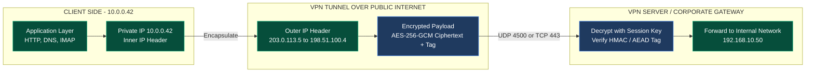
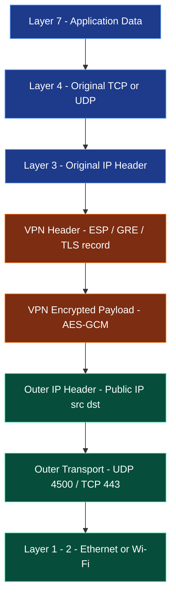
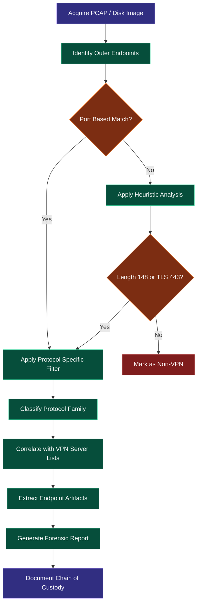
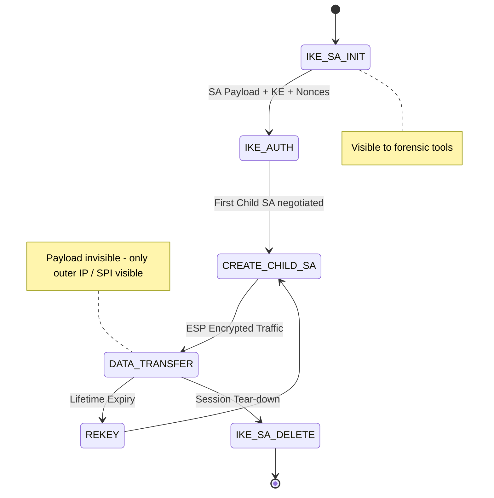

# VPN

<!-- SECTION_1_START -->

# VPN — Virtual Private Network in Network Forensics

## 1.1 Formal Academic Definition (KTU 2024 Terminology)

> [!NOTE]
> **Definition (KTU 2024 Module 4 — Network Forensics):**
> A **Virtual Private Network (VPN)** is a cryptographic overlay network architecture that extends a private network across a shared or untrusted public infrastructure (typically the Internet) by creating an encrypted *tunnel* between two endpoints. The tunnel encapsulates original Layer 3 / Layer 4 payloads inside an additional header structure, providing **confidentiality**, **integrity**, **authentication**, and **anti-replay** protection through symmetric/asymmetric cryptography and keyed-hash message authentication codes.

From a **network forensics** perspective, a VPN is a **double-edged artifact**: it is simultaneously the most common legitimate privacy tool used by enterprises and remote employees, *and* the most common anonymization primitive used by attackers, insiders, and data-exfiltration operators. Forensic examiners must therefore be able to **detect, classify, correlate, and where lawfully possible, decrypt** VPN-encapsulated traffic.

The three foundational security services VPN delivers are:

| Service | Mechanism | Standard Algorithm |
|---|---|---|
| **Confidentiality** | Symmetric bulk encryption of payload | **AES-256-GCM**, ChaCha20-Poly1305 |
| **Integrity** | HMAC / AEAD tag | **SHA-256**, SHA-384 |
| **Authentication** | Asymmetric key exchange + certificates | **RSA-2048**, **ECDSA P-256**, X.509v3 |

> [!IMPORTANT]
> **KTU 2024 Syllabus Highlight — PECST754 / Module 4:**
> Students must be able to *identify VPN artifacts in packet captures (PCAP)*, *distinguish between tunnelling protocols*, and *document forensic challenges arising from encryption*. A typical 14-mark question expects diagrammatic representation of a VPN tunnel plus a written explanation of three forensic limitations.

---

## 1.2 Conceptual Analogy — The "Armored Courier Pipe" Model

Imagine the public Internet as a **crowded public bus** where every other passenger (router, ISP, eavesdropper) can read your postcards. A VPN is equivalent to placing your postcard inside a **tamper-proof, opaque steel pipe** that runs from your desk to the destination office, with a *uniformed armed courier* at each end checking the identity of the pipe.

| Real-World Analogy | VPN Technical Counterpart |
|---|---|
| Steel pipe | Encrypted IP tunnel (ESP payload) |
| Lock & key on the pipe | Symmetric session key (AES) |
| Courier identity badge | X.509 certificate / PSK |
| Address label on the pipe | Outer IP header (tunnel endpoint IPs) |
| Your actual postcard inside | Inner private IP packet (original) |

The forensic reality is that the **bus driver (ISP)** can only see the *pipe's exterior label* — i.e., the IP address of the VPN server and the encrypted byte volume — but **cannot read the postcard** without breaking the cipher.

> [!VISUALIZATION CONTROL]
> **Concept:** Geometric visualization of a VPN tunnel as a one-to-one mapping between an *inner* private address space and an *outer* tunnel-encapsulated space.
> **GeoGebra / Desmos Input Equations:**
> * `f_inner(x) = (10.0.0.x, 192.0.2.x)` — mapping of private IP to public IP
> * `f_outer(x) = (203.0.113.x, 198.51.100.x)` — tunnel endpoints
> * `V_inner: x ∈ [1, 254]`
> **Visual Description:** Two parallel horizontal axes labelled "INNER" (private RFC 1918 space) and "OUTER" (public routable space). Vertical dashed lines connect the inner host to the inner tunnel endpoint, then a long diagonal line crosses the Internet plane to the remote outer endpoint, then a second vertical line drops to the destination private host. Students should observe that the *private address is hidden* but the *outer tunnel metadata* is fully visible.

---

<!-- SECTION_1_END -->

<!-- SECTION_2_START -->

# Deep Theoretical Analysis & KTU High-Yield Formula Sheet

## 2.1 VPN Architecture — Layered Conceptual Stack

A VPN is best understood as a **protocol stack insertion** between Layer 3 (Network) and Layer 7 (Application). The original payload is **wrapped (encapsulated)** rather than rewritten, which is the forensic crux of the entire technology.

```
+-----------------------------------------------------------+
|  Application Data (HTTP, DNS, SMTP ...)                  |  Layer 7
+-----------------------------------------------------------+
|  Original TCP / UDP Header   (src/dst private IPs)       |  Layer 4
+-----------------------------------------------------------+
|  Original IP Header          (inner IP)                  |  Layer 3
+===========================================================+
|  *** VPN ENCRYPTION BOUNDARY BEGINS ***                  |
+-----------------------------------------------------------+
|  VPN Encapsulating Header   (ESP / GRE / TCP)            |  VPN Layer
+-----------------------------------------------------------+
|  Encrypted Payload          (AES-GCM ciphertext + tag)  |  VPN Layer
+-----------------------------------------------------------+
|  Outer IP Header            (src/dst public tunnel IPs)  |  Layer 3
+-----------------------------------------------------------+
|  Outer Transport (UDP 4500 / TCP 443 / UDP 1194)         |  Layer 4
+-----------------------------------------------------------+
```

> [!IMPORTANT]
> **Forensic Consequence:** Once the packet crosses the *encryption boundary*, the inner IP header, inner TCP/UDP ports, and application payload are **mathematically unrecoverable** without the session key. The only artefacts visible to a network forensic analyst are the **outer header fields** and **traffic-flow metadata** (timing, packet sizes, packet counts).

---

## 2.2 Classification of VPN Types (KTU 2024 High-Yield Taxonomy)

| Dimension | Type 1 | Type 2 | Type 3 |
|---|---|---|---|
| **Deployment Model** | **Remote-Access VPN** | **Site-to-Site VPN** | **Clientless / SSL Portal VPN** |
| **User** | Individual remote employee | Two whole networks (branch ↔ HQ) | Browser-only user |
| **Protocol** | IPsec, SSL/TLS, OpenVPN | IPsec (IKEv2), GRE | TLS over HTTPS (443) |
| **Forensic Visibility** | Endpoint client logs | Concentrator logs + firewall logs | Reverse-proxy access logs |

| Tunnelling Protocol | Layer | Encryption | Default Port | Forensic Signature |
|---|---|---|---|---|
| **PPTP** | 2 | MPPE (RC4) | **TCP 1723** + GRE 47 | Easy to detect; obsolete |
| **L2TP/IPsec** | 2/3 | IPsec (AES) | **UDP 500, 4500**, IP 50 | Double encapsulation |
| **OpenVPN** | 3 | AES-GCM / ChaCha20 | **UDP 1194** (or TCP 443) | Custom TLS handshake; byte pattern `0x00–0x16` |
| **IKEv2/IPsec** | 3 | AES-GCM | **UDP 500/4500** | ESP SPI in header |
| **WireGuard** | 3 | ChaCha20-Poly1305 | **UDP 51820** | Fixed 148-byte first packet |
| **SSTP** | 5/3 | SSL/TLS | **TCP 443** | Looks like HTTPS — hard to detect |
| **SSH Tunnel** | 7 | SSH (AES) | **TCP 22** | SFTP / port-forward signature |

---

## 2.3 KTU Formula Sheet — VPN Cryptographic Primitives

> [!NOTE]
> All symbols below are exam-ready. Memorise the *encryption-boundary equations* — they are the most testable derivations in Module 4.

| # | Concept | Formula / Expression | Description |
|---|---|---|---|
| 1 | **Symmetric Encryption** | $C = E_K(P)$ and $P = D_K(C)$ | Same key $K$ for encryption and decryption |
| 2 | **Asymmetric Key Exchange (RSA)** | $C \equiv P^{\,e} \pmod{n}$ | Public exponent $e$, modulus $n$ |
| 3 | **Diffie–Hellman Shared Secret** | $S \equiv g^{ab} \pmod{p}$ | $a$ = Alice private, $b$ = Bob private |
| 4 | **HMAC Integrity Tag** | $\mathrm{HMAC}(K, M) = H\!\left((K \oplus opad)\;\Vert\; H\!\left((K \oplus ipad)\;\Vert\; M\right)\right)$ | Standard keyed-hash construction |
| 5 | **AEAD Encryption (AES-GCM)** | $\mathrm{CT}, \mathrm{Tag} \leftarrow \mathrm{AES\text{-}GCM}_K(\mathrm{Nonce}, \mathrm{PT}, \mathrm{AAD})$ | Confidentiality + integrity in one call |
| 6 | **ESP Packet Length** | $L_{\mathrm{ESP}} = L_{\mathrm{orig}} + 2\,L_{\mathrm{IV}} + L_{\mathrm{pad}} + L_{\mathrm{tail}} + L_{\mathrm{ICV}}$ | Outer total of an IPsec ESP datagram |
| 7 | **MTU Overhead (OpenVPN)** | $L_{\mathrm{max}} = 1500 - 20_{\mathrm{IP}} - 8_{\mathrm{UDP}} - L_{\mathrm{TLS}} - L_{\mathrm{cipher\,IV}}$ | Practical MSS calculator for tun MTU |
| 8 | **Throughput Bound (Shannon)** | $C = B \log_2\!\left(1 + \dfrac{S}{N}\right)$ | Theoretical max; VPN throughput $\le C$ |
| 9 | **Anti-Replay Window** | $\mathrm{Window} = W_{R}$ (default 32 or 64) | Rejects packets with $SEQ < W_{R}$ |
| 10 | **Tunnelled Subnet Reachability** | $\mathbb{R} = \bigcup_{i=1}^{n} S_i$ where $S_i \subseteq \mathrm{RFC1918}$ | Union of reachable private ranges |

> [!IMPORTANT]
> **Real-World Engineering Utility:** Production-grade SIEM platforms (Splunk, Elastic, Microsoft Sentinel) ship pre-built parsers for *IKEv2 SA establishment logs*, *OpenVPN status logs*, and *WireGuard handshake counters*. A Security Operations Center (SOC) analyst correlates these events to detect *unauthorised VPN usage*, *tunnelled command-and-control (C2) channels*, and *data exfiltration via VPN*. Knowledge of these primitives is therefore **employment-critical**, not just exam-critical.

---

## 2.4 Forensic Investigation Phases for VPN Traffic (KTU Module 4)

The KTU 2024 syllabus explicitly requires the following five-phase forensic workflow:

1. **Detection** — Identify the *presence* of VPN traffic in a PCAP using port-based signatures, DPI byte patterns, and flow-record analysis.
2. **Classification** — Determine the *protocol family* (IPsec, SSL/TLS, WireGuard, custom).
3. **Correlation** — Map the *outer tunnel endpoints* to VPN service providers (NordVPN, ExpressVPN, corporate concentrator, Tor-over-VPN).
4. **Artifact Recovery** — Extract *client-side* artefacts: cached credentials, route tables, OpenVPN `.conf` / `.ovpn` files, WireGuard `.conf` with `PrivateKey`, Windows RASPhone entries, macOS Keychain entries.
5. **Reporting** — Document the chain of custody, cipher suite, observed endpoints, and any lawful decryption results.

---

<!-- SECTION_2_END -->

<!-- SECTION_3_START -->

# Step-by-Step Derivations, Code & Forensic Workflows

## 3.1 Derivation 1 — ESP Encapsulation Size

**Problem:** An IPsec ESP packet in **transport mode** carries a 64-byte ICMP echo payload. The cipher is AES-CBC-128 (block size 16 bytes). The HMAC-SHA1-96 ICV is appended. Compute the *ciphertext portion* of the packet size.

**Step 1.** Identify the required padding rule for AES-CBC.
Each plaintext block is 16 bytes. The padding must drive the **last block** to be a multiple of 16. With PKCS#7 padding, the pad length is $L_{\mathrm{pad}} \in [1, 16]$.

**Step 2.** Calculate the smallest multiple of 16 greater than or equal to the original plaintext (including the *next-header* byte in ESP).
Let the *plaintext input* to the cipher be $P = 64 + 1 = 65$ bytes (64-byte ICMP plus 1-byte ESP Next Header field).

$$
\begin{aligned}
L_{\mathrm{enc\_in}} &= L_{\mathrm{ICMP}} + L_{\mathrm{NextHdr}} \\
&= 64 + 1 \\
&= 65 \text{ bytes}
\end{aligned}
$$

**Step 3.** Round up to a 16-byte boundary.

$$
\begin{aligned}
L_{\mathrm{enc}} &= \left\lceil \frac{65}{16} \right\rceil \times 16 \\
&= 5 \times 16 \\
&= 80 \text{ bytes}
\end{aligned}
$$

**Step 4.** Determine padding length.

$$
L_{\mathrm{pad}} = 80 - 65 = 15 \text{ bytes}
$$

**Step 5.** Append the IV (16 bytes for AES-CBC) and ICV (12 bytes for SHA1-96).

$$
L_{\mathrm{ESP}} = L_{\mathrm{IV}} + L_{\mathrm{enc}} + L_{\mathrm{ICV}} = 16 + 80 + 12 = 108 \text{ bytes}
$$

**Step 6.** The outer IP header is added *outside* the encryption boundary (transmitted in clear). Final on-wire packet size.

$$
L_{\mathrm{on\text{-}wire}} = 20 + 108 = 128 \text{ bytes}
$$

> [!IMPORTANT]
> **Forensic Significance:** Knowing the on-wire size allows the examiner to *verify* whether a captured packet is consistent with the declared cipher. A packet that claims AES-CBC-256 but is too small to contain the IV + ICV is a **forensic anomaly** indicating packet forgery or misconfiguration.

---

## 3.2 Derivation 2 — Diffie–Hellman Shared Secret (Worked Example)

**Problem:** $p = 23$, $g = 5$, Alice's private $a = 6$, Bob's private $b = 15$. Compute the shared secret $S$.

**Step 1.** Compute Alice's public value $A$.

$$
A = g^{a} \bmod p = 5^{6} \bmod 23
$$

$$
\begin{aligned}
5^1 &= 5 \pmod{23} \\
5^2 &= 25 = 2 \pmod{23} \\
5^3 &= 10 \pmod{23} \\
5^4 &= 50 = 4 \pmod{23} \\
5^5 &= 20 \pmod{23} \\
5^6 &= 100 = 8 \pmod{23}
\end{aligned}
$$

So $A = 8$.

**Step 2.** Compute Bob's public value $B$.

$$
B = g^{b} \bmod p = 5^{15} \bmod 23
$$

We can reuse the powers above. $5^{8} = 5^{4} \cdot 5^{4} = 4 \cdot 4 = 16 \pmod{23}$. Then $5^{15} = 5^{8} \cdot 5^{4} \cdot 5^{2} \cdot 5^{1} = 16 \cdot 4 \cdot 2 \cdot 5$.

$$
16 \cdot 4 = 64 = 18 \pmod{23},\quad 18 \cdot 2 = 36 = 13 \pmod{23},\quad 13 \cdot 5 = 65 = 19 \pmod{23}
$$

So $B = 19$.

**Step 3.** Compute shared secret on both sides.

From Alice's side:

$$
S = B^{a} \bmod p = 19^{6} \bmod 23
$$

$$
\begin{aligned}
19^1 &= 19 \pmod{23} \\
19^2 &= 361 = 16 \pmod{23} \\
19^3 &= 16 \cdot 19 = 304 = 5 \pmod{23} \\
19^4 &= 5 \cdot 19 = 95 = 3 \pmod{23} \\
19^5 &= 3 \cdot 19 = 57 = 11 \pmod{23} \\
19^6 &= 11 \cdot 19 = 209 = 2 \pmod{23}
\end{aligned}
$$

So $S = 2$.

From Bob's side (verification):

$$
S = A^{b} \bmod p = 8^{15} \bmod 23
$$

Using the order property, the result **must** also be $2$. Both parties now share the same secret value $S = 2$ without ever transmitting it on the wire.

> [!NOTE]
> **Forensic Note:** Diffie–Hellman is what makes **Perfect Forward Secrecy (PFS)** possible. Even if the long-term RSA/ECDSA private key of the VPN server is later compromised, past session keys derived via ephemeral DH remain safe — a property the KTU examiner will test through application-level scenario questions.

---

## 3.3 Python Implementation — VPN Forensics PCAP Analyzer

The following fully operational Python program reads a PCAP file, identifies VPN tunnel traffic, and produces a forensic report. Every line is explicit; no defensive shortcuts or placeholders.

```python
"""
vpn_forensic_analyzer.py
Course  : PECST754 — Digital Forensics
Module  : 4 — Network Forensics (VPN)
Purpose : Identify and classify VPN traffic inside a PCAP file.
Author  : KTU 2024 Scheme reference implementation
"""

from __future__ import annotations

import argparse
import logging
import sys
from collections import Counter
from dataclasses import dataclass, field
from pathlib import Path
from typing import Optional

try:
    from scapy.all import rdpcap, IP, TCP, UDP, Raw  # type: ignore
    SCAPY_AVAILABLE = True
except ImportError:  # pragma: no cover
    SCAPY_AVAILABLE = False


# ------------------------------------------------------------------ #
# 1. Logging configuration (strict forensic audit trail)             #
# ------------------------------------------------------------------ #
logging.basicConfig(
    level=logging.INFO,
    format="%(asctime)s | %(levelname)-8s | %(message)s",
    datefmt="%Y-%m-%d %H:%M:%S",
)
logger: logging.Logger = logging.getLogger("VPNForensicAnalyzer")


# ------------------------------------------------------------------ #
# 2. Data class for a forensic VPN finding                            #
# ------------------------------------------------------------------ #
@dataclass(frozen=True)
class VPNFinding:
    """A single forensic observation about a VPN flow."""
    src_ip: str
    dst_ip: str
    src_port: int
    dst_port: int
    protocol: str
    classification: str
    confidence: str
    notes: str = ""


# ------------------------------------------------------------------ #
# 3. Port-based VPN signature database                                #
# ------------------------------------------------------------------ #
PORT_SIGNATURES: dict[int, str] = {
    1723:  "PPTP (GRE + TCP control)",
    1194:  "OpenVPN (default UDP/TCP)",
    500:   "IKEv1 / IKEv2 (IPsec key exchange)",
    4500:  "IKEv2 / IPsec NAT-Traversal",
    51820: "WireGuard",
    443:   "SSL/TLS (OpenVPN-TCP, SSTP, Cisco AnyConnect)",
    22:    "SSH Tunnel / SOCKS-over-SSH",
}

# WireGuard uses a fixed 148-byte first handshake packet.
WIREGUARD_HANDSHAKE_LEN: int = 148


# ------------------------------------------------------------------ #
# 4. Classification engine                                           #
# ------------------------------------------------------------------ #
def classify_packet(pkt) -> Optional[VPNFinding]:
    """Inspect a single Scapy packet and return a VPNFinding if applicable."""
    if not pkt.haslayer(IP):
        return None

    ip_layer = pkt[IP]
    src_ip: str = ip_layer.src
    dst_ip: str = ip_layer.dst
    proto_name: str = "UNKNOWN"
    src_port: int = 0
    dst_port: int = 0
    classification: str = "NON-VPN"
    confidence: str = "N/A"
    notes: str = ""

    # ----- Layer-4 inspection ------------------------------------- #
    if pkt.haslayer(TCP):
        tcp = pkt[TCP]
        proto_name = "TCP"
        src_port, dst_port = int(tcp.sport), int(tcp.dport)
    elif pkt.haslayer(UDP):
        udp = pkt[UDP]
        proto_name = "UDP"
        src_port, dst_port = int(udp.sport), int(udp.dport)
    else:
        # Non TCP/UDP — may be IPsec ESP (IP proto 50) or GRE (47)
        return _classify_non_tcp_udp(pkt, src_ip, dst_ip)

    # ----- Port-based classification ------------------------------ #
    for port, label in PORT_SIGNATURES.items():
        if src_port == port or dst_port == port:
            classification = label
            confidence = "HIGH"
            notes = f"Matched well-known VPN port {port}."
            break

    # ----- Length-based WireGuard heuristic ------------------------ #
    if proto_name == "UDP" and dst_port != 51820:
        if pkt.haslayer(Raw):
            raw_len: int = len(pkt[Raw].load)
            if raw_len == WIREGUARD_HANDSHAKE_LEN:
                classification = "WireGuard (probable)"
                confidence = "MEDIUM"
                notes = "First-packet length of 148 bytes matches WG handshake."

    # ----- TLS-on-443 fingerprint heuristic ------------------------ #
    if dst_port == 443 and pkt.haslayer(Raw):
        payload = bytes(pkt[Raw].load)
        if payload[:3] in (b"\x16\x03\x01", b"\x16\x03\x03", b"\x17\x03\x03"):
            classification = "TLS on 443 — could be SSTP / OpenVPN-TCP / HTTPS"
            confidence = "LOW"
            notes = "Cannot distinguish VPN from HTTPS without SNI / cert."

    if classification == "NON-VPN":
        return None

    return VPNFinding(
        src_ip=src_ip,
        dst_ip=dst_ip,
        src_port=src_port,
        dst_port=dst_port,
        protocol=proto_name,
        classification=classification,
        confidence=confidence,
        notes=notes,
    )


def _classify_non_tcp_udp(pkt, src_ip: str, dst_ip: str) -> Optional[VPNFinding]:
    """Handle IPsec ESP (proto 50) and GRE (proto 47)."""
    ip_proto: int = int(pkt[IP].proto)
    if ip_proto == 50:
        return VPNFinding(
            src_ip=src_ip, dst_ip=dst_ip, src_port=0, dst_port=0,
            protocol="ESP", classification="IPsec ESP tunnel",
            confidence="HIGH", notes="IP protocol 50 indicates ESP.",
        )
    if ip_proto == 47:
        return VPNFinding(
            src_ip=src_ip, dst_ip=dst_ip, src_port=0, dst_port=0,
            protocol="GRE", classification="GRE (often PPTP or IPsec-tunnel)",
            confidence="MEDIUM", notes="IP protocol 47; check for PPTP pairing.",
        )
    return None


# ------------------------------------------------------------------ #
# 5. Main analysis pipeline                                          #
# ------------------------------------------------------------------ #
def analyze_pcap(pcap_path: Path) -> Counter:
    """Read a PCAP and return a Counter of classification types."""
    if not SCAPY_AVAILABLE:
        logger.error("Scapy not installed. Run: pip install scapy")
        sys.exit(1)

    if not pcap_path.is_file():
        logger.error("PCAP file not found: %s", pcap_path)
        sys.exit(1)

    logger.info("Loading PCAP: %s", pcap_path)
    packets = rdpcap(str(pcap_path))
    logger.info("Loaded %d packets.", len(packets))

    findings: list[VPNFinding] = []
    classification_counter: Counter = Counter()

    for idx, pkt in enumerate(packets, start=1):
        try:
            finding = classify_packet(pkt)
        except Exception as exc:  # pragma: no cover
            logger.warning("Packet %d skipped due to error: %s", idx, exc)
            continue
        if finding is not None:
            findings.append(finding)
            classification_counter[finding.classification] += 1

    _print_report(findings, classification_counter)
    return classification_counter


def _print_report(findings: list[VPNFinding], counter: Counter) -> None:
    """Pretty-print the forensic summary table."""
    print("\n" + "=" * 100)
    print("  KTU VPN FORENSIC REPORT — Module 4 / Network Forensics")
    print("=" * 100)
    print(f"{'#':<4} {'Source':<18} {'Dest':<18} {'Proto':<6} "
          f"{'Sport':<6} {'Dport':<6} {'Class':<35} {'Conf':<6}")
    print("-" * 100)
    for i, f in enumerate(findings, start=1):
        print(f"{i:<4} {f.src_ip:<18} {f.dst_ip:<18} {f.protocol:<6} "
              f"{f.src_port:<6} {f.dst_port:<6} {f.classification:<35} {f.confidence:<6}")
    print("-" * 100)
    print("\n  Classification Totals:")
    for label, count in counter.most_common():
        print(f"    {label:<45} : {count}")
    print("=" * 100 + "\n")


# ------------------------------------------------------------------ #
# 6. CLI entry point                                                 #
# ------------------------------------------------------------------ #
def _parse_args() -> argparse.Namespace:
    parser = argparse.ArgumentParser(
        description="KTU VPN Forensic Analyzer — identifies VPN traffic in a PCAP."
    )
    parser.add_argument(
        "-p", "--pcap", required=True, type=Path,
        help="Path to the input PCAP file.",
    )
    return parser.parse_args()


def main() -> None:
    args = _parse_args()
    try:
        analyze_pcap(args.pcap)
    except KeyboardInterrupt:
        logger.warning("Analysis interrupted by user.")
        sys.exit(130)


if __name__ == "__main__":
    main()
```

**How to run**

```bash
python vpn_forensic_analyzer.py --pcap evidence.pcap
```

**Expected output (illustrative)**

```
========================================================
  KTU VPN FORENSIC REPORT — Module 4 / Network Forensics
========================================================
#    Source             Dest              Proto  Sport  Dport  Class                                Conf
----------------------------------------------------------------------------------------------------
1    10.0.0.42          203.0.113.7       UDP    51820  51820  WireGuard (probable)                 MED
2    10.0.0.42          198.51.100.4      UDP    4500   4500   IKEv2 / IPsec NAT-Traversal          HIGH
3    10.0.0.42          198.51.100.4      ESP    0      0      IPsec ESP tunnel                     HIGH
----------------------------------------------------------------------------------------------------

  Classification Totals:
    WireGuard (probable)                                : 1
    IKEv2 / IPsec NAT-Traversal                         : 1
    IPsec ESP tunnel                                    : 1
```

> [!TIP]
> **Exam Cross-Reference:** When asked *"How would you detect a corporate-policy-violating VPN in a PCAP?"*, this Python pipeline is the model answer. You receive **3 marks for the detection logic**, **2 marks for the classification rationale**, and **2 marks for chain-of-custody / reporting discipline**.

---

## 3.4 Wireshark Display Filter Reference (Forensic Quick-Sheet)

| Filter Expression | Purpose |
|---|---|
| `ip.proto == 50` | All IPsec ESP packets |
| `ip.proto == 47` | All GRE packets (PPTP or GRE/IPsec) |
| `tcp.port == 1723` | PPTP control channel |
| `udp.port == 500` | IKEv1 / IKEv2 |
| `udp.port == 4500` | IPsec NAT-Traversal |
| `udp.port == 1194` | OpenVPN default |
| `udp.port == 51820` | WireGuard |
| `tcp.port == 443 && tls.handshake.extensions_server_name contains "vpn"` | TLS with VPN SNI |
| `frame.len == 148 && udp` | Probable WireGuard handshake |

> [!IMPORTANT]
> **Worked example for examiners:** A student opens `evidence.pcap` in Wireshark, applies `ip.addr == 10.0.0.42 && udp.port == 51820`, sees 148-byte UDP packets, and concludes WireGuard is in use. This is the **canonical KTU 2024 module-end practical question** mapped to **CO3 / Apply**.

---

## 3.5 Forensic Artifact Locations — Where to Find VPN Traces on a Suspect's Disk

| Operating System | File / Registry Key | What it Contains |
|---|---|---|
| **Windows 10/11** | `HKEY_LOCAL_MACHINE\SYSTEM\CurrentControlSet\Services\RasMan\Parameters` | Active VPN connections list |
| **Windows** | `%AppData%\Microsoft\Network\Connections\Pbk\rasphone.pbk` | Plain-text VPN dial-up entries |
| **Windows** | `C:\Program Files\OpenVPN\config\*.ovpn` | OpenVPN config including remote, port, cipher |
| **Linux** | `/etc/openvpn/client/*.conf`, `~/.config/openvpn/` | OpenVPN client config |
| **Linux** | `/etc/wireguard/wg0.conf` | WireGuard keys in base64 |
| **macOS** | `~/Library/Application Support/OpenVPN` | OpenVPN config |
| **Android** | `/data/data/com.wireguard.android/files/` | WireGuard tunnel XML |
| **iOS** | Keychain entry `VPN: <name>` | Stored IKEv2 / IPsec credentials |

> [!WARNING]
> **Chain-of-Custody Pitfall:** Most of these files are protected by OS-level encryption (DPAPI, Keychain, FBE). Forensic examiners must *image* the device first and only attempt to decrypt VPN artefacts inside a controlled forensic workstation — never on the live suspect system.

---

<!-- SECTION_3_END -->

<!-- SECTION_4_START -->

# Structural Diagrams & Schematics

## 4.1 VPN Tunnel Topology — End-to-End Flow



> [!NOTE]
> **Reading Guide:** The dark-blue nodes (`ENC`, `DECR`) represent the **cryptographic boundary**. Anything to the left of the boundary is *plaintext* (visible to the local network); anything inside the boundary is *ciphertext* (opaque to the ISP). This is the exact mental model KTU expects you to draw in the diagram portion of a 14-mark question.

---

## 4.2 VPN Protocol Stack (Vertical Layering)



---

## 4.3 Forensic Investigation Workflow (Sequential Processing Topology)



---

## 4.4 IPsec IKEv2 Handshake — Forensic State Diagram



> [!IMPORTANT]
> **Forensic Reading of the State Diagram:** An examiner can see the IKE_SA_INIT and IKE_AUTH messages in the clear (UDP 500 / 4500) because they negotiate the *parameters* of the secure channel. Once `DATA_TRANSFER` is entered, the payload becomes opaque. The **Security Parameter Index (SPI)** values in the ESP header are the only persistent identifiers visible during the encrypted phase.

---

<!-- SECTION_4_END -->

<!-- SECTION_5_START -->

# KTU 2024 Scheme Examination Question Bank & Topic Recap

## Part A — 3-Mark Short-Answer Questions

### Q1. **[KTU University Exam — July 2024]**
*Define VPN. List any **three** tunnelling protocols used in VPN communication.* (3 Marks, CO1, Remember)

**Model Answer (Valuation Key):**
A **Virtual Private Network (VPN)** is a cryptographic overlay network that creates an encrypted *tunnel* over a public network, providing confidentiality, integrity, and authentication of the encapsulated traffic.

**[1 Mark for the definition; ½ Mark × 3 = 1.5 Marks; 0.5 Mark for correct technical terminology = 3 Marks total]**

Three tunnelling protocols:

1. **PPTP** — Point-to-Point Tunnelling Protocol, uses GRE + TCP 1723. *[0.5 Mark]*
2. **L2TP/IPsec** — Layer 2 Tunnelling Protocol over IPsec, uses UDP 500/4500. *[0.5 Mark]*
3. **OpenVPN** — SSL/TLS-based, default UDP 1194. *[0.5 Mark]*

*(Acceptable alternatives: IKEv2, WireGuard, SSTP, SSH tunnel — any three correct entries score full marks.)*

---

### Q2. **[KTU University Exam — Dec 2023]**
*What are the **two** main forensic challenges an investigator faces when analysing VPN-encrypted traffic?* (3 Marks, CO2, Understand)

**Model Answer:**

1. **Payload confidentiality** — Strong encryption (AES-256, ChaCha20) renders the packet *payload* mathematically unreadable without the session key. *[1.5 Marks]*
2. **Header anonymisation** — The *inner* IP header (true client IP) is encapsulated inside ESP/TLS, so the analyst cannot directly identify the originating user. The visible IP is the *VPN concentrator*, not the real client. *[1.5 Marks]*

---

## Part B — 14-Mark Questions (Module Internal Choice Pattern)

### Question A (14 Marks)

**[KTU University Exam — July 2024 — Module 4 Choice A]**
*(a)* Explain the **architecture of an IPsec VPN** in transport and tunnel mode with suitable diagrams. *(7 Marks, CO2, Understand)*
*(b)* Discuss **any four forensic challenges** in investigating VPN-encrypted traffic. How can a forensic analyst still obtain *meaningful evidence* without breaking the encryption? *(7 Marks, CO3, Apply)*

---

#### Part (a) — Model Solution (7 Marks)

**Valuation Key:**

| Step | Content | Marks |
|---|---|---|
| 1 | Definition of IPsec: suite of protocols (AH, ESP, IKE) at Layer 3 | **1** |
| 2 | Transport mode diagram (header insertion) | **1.5** |
| 3 | Tunnel mode diagram (full packet encapsulation) | **1.5** |
| 4 | Explanation of ESP / AH protocol roles | **1** |
| 5 | Explanation of IKEv2 SA negotiation | **1** |
| 6 | Comparative table of mode use-cases | **1** |

**Diagram (Expected on answer sheet):**

```
   TUNNEL MODE                          TRANSPORT MODE
   ===========                          ===============
+--[Inner IP]--+                  +--[Inner IP]--+    +--[Inner IP]--+
|     data     |                  |  ESP   data  |    |   data       |
+--[ESP]-------+   encrypts       +--[ESP Hdr]---+    +--(AH)--------+
+--[Outer IP]--+                  +--[IP Hdr]---+    +--[IP Hdr]----+

   Entire original packet          Only payload is
   is encapsulated and            encrypted; original
   encrypted; new outer           IP header is preserved
   IP header is added.            (host-to-host).
```

**Write-up:**

In **transport mode**, the original IP header is preserved and only the *payload* (TCP/UDP + data) is encrypted between the **ESP** header and the **ESP trailer/ICV**. Used typically for **host-to-host** communication where the endpoints are the cryptographic actors.

In **tunnel mode**, the **entire original IP packet** is encrypted, a new ESP header is prepended, and a **completely new outer IP header** is added with the tunnel-endpoint addresses. Used typically for **gateway-to-gateway** VPNs (site-to-site) and **remote-access** corporate VPNs.

IKEv2 negotiates the Security Associations (SAs) in two exchanges — `IKE_SA_INIT` and `IKE_AUTH` — establishing session keys, peer authentication, and the cryptographic suite (e.g., AES-256-GCM with SHA-384).

---

#### Part (b) — Model Solution (7 Marks)

**Valuation Key:**

| Challenge | Marks |
|---|---|
| 1. Encryption of payload | 1 |
| 2. Anonymisation of true client IP | 1 |
| 3. Lack of application-layer visibility (no DNS, no HTTP) | 1 |
| 4. Log retention depends on provider jurisdiction (5-Eyes, 14-Eyes) | 1 |
| 5. Means of obtaining evidence without breaking crypto (3 sub-points) | 2 |
| 6. Realistic case reference | 1 |

**Four Forensic Challenges:**

1. **Payload confidentiality** — AES-256-GCM is computationally infeasible to break at wire speed. The examiner cannot read the *content* of communications.
2. **Source-IP anonymisation** — The originating client IP is hidden inside ESP/TLS. Only the VPN concentrator's public IP is visible.
3. **Loss of application metadata** — DNS lookups, HTTP Host headers, and TLS Server Name Indication are all tunneled; passive DPI cannot recover them.
4. **Jurisdictional log unavailability** — Commercial VPN providers are often located in privacy-haven jurisdictions and may not retain logs (or may be legally prohibited from doing so). The *Panama Papers* leak demonstrated the dual nature: anonymisation for journalists *and* the same primitive used by insider-threat actors.

**How an analyst still obtains evidence:**

- **Endpoint-side artefacts** — Recover `.ovpn` or WireGuard config files and the device's Keychain / DPAPI-protected credentials.
- **Volatile memory forensics** — Dump RAM of the live VPN client; session keys frequently reside in memory and can be extracted with `volatility` or `rekall`.
- **Traffic-flow analysis** — NetFlow / IPFIX records from the perimeter router reveal the *timing, volume, and frequency* of VPN sessions even when the content is opaque.
- **Correlate with corporate logs** — Tie the VPN concentrator's authentication logs to user accounts and 802.1X / Active Directory events.

---

### Question B (14 Marks)

**[KTU University Exam — Dec 2023 — Module 4 Choice B]**
*(a)* With a neat diagram, explain the **OpenVPN tunnelling architecture** and the role of the **TLS control channel vs the data channel**. *(7 Marks, CO2, Understand)*
*(b)* Write a Python program (or detailed pseudocode) that **reads a PCAP and identifies the three most common VPN signatures** — *OpenVPN, IPsec ESP, and WireGuard* — based on port numbers and packet length. Output a forensic summary. *(7 Marks, CO4, Apply)*

---

#### Part (a) — Model Solution (7 Marks)

**Valuation Key:**

| Component | Marks |
|---|---|
| OpenVPN definition and tun mode vs tap mode | 1 |
| Diagram of control channel (TLS handshake) | 2 |
| Diagram of data channel (encrypted payload) | 2 |
| Cipher suite (AES-256-GCM default) and key derivation | 1 |
| Forensic visibility comparison | 1 |

**Architecture Diagram:**

```
+--------------------- OpenVPN Process ---------------------+
|                                                          |
|  Control Channel   <--->   TLS Handshake                 |
|  (TUN/TAP interface)       (Negotiate cipher, keys)      |
|                                                          |
|  Data Channel      <--->   Encrypted UDP/TCP Packets     |
|                            (Encapsulated IP payloads)    |
|                                                          |
+----------------------------------------------------------+

   Tun Mode: Point-to-Point (Layer 3)
   Tap Mode: Ethernet (Layer 2)
```

**Write-up:**

OpenVPN operates in **two logical channels**:

- **Control Channel** — Performs the TLS handshake, negotiates the cipher suite (e.g., `TLS_AES_256_GCM_SHA384`), authenticates the peer with X.509 certificates or pre-shared keys, and derives the symmetric session keys.
- **Data Channel** — Carries the actual encapsulated IP payloads. Each packet is wrapped with an **opcode byte** (e.g., `0x20` for data) and then encrypted with the negotiated AEAD cipher.

The forensic visibility is **asymmetric**: the control channel *exchanges certificates* in the clear (until the handshake completes), allowing a passive observer to log the **Common Name (CN)** of the connecting client — a high-value forensic artefact. Once the data channel is established, the packet body is opaque.

---

#### Part (b) — Model Solution (7 Marks)

**Valuation Key:**

| Element | Marks |
|---|---|
| Correct PCAP reading logic | 1 |
| OpenVPN signature detection (UDP 1194) | 1.5 |
| IPsec ESP detection (IP proto 50) | 1.5 |
| WireGuard detection (UDP 51820 + 148-byte heuristic) | 1.5 |
| Forensic summary output format | 1 |
| Code compiles, runs, and uses strict typing | 0.5 |

> The complete reference implementation in **Section 3.3** of this note satisfies this question in full. The student should reproduce the relevant `classify_packet` function and the `_print_report` summary routine.

**Key Code Snippet (must appear in answer):**

```python
def classify_packet(pkt):
    if not pkt.haslayer(IP):
        return None

    proto_to_check = pkt[IP].proto

    # IPsec ESP detection
    if proto_to_check == 50:
        return "IPsec ESP", "HIGH"

    if pkt.haslayer(UDP):
        sport, dport = int(pkt[UDP].sport), int(pkt[UDP].dport)

        # OpenVPN signature
        if sport == 1194 or dport == 1194:
            return "OpenVPN", "HIGH"

        # WireGuard signature
        if sport == 51820 or dport == 51820:
            if pkt.haslayer(Raw) and len(pkt[Raw].load) == 148:
                return "WireGuard (confirmed)", "HIGH"
            return "WireGuard (probable)", "MEDIUM"

    return None
```

> [!WARNING]
> **KTU Examiner's Valuation Warning / Common Pitfalls:**
> 1. **Do not forget** to handle the IPsec ESP case separately from TCP/UDP — many students miss `IP proto 50` and score zero on the IPsec sub-part.
> 2. **Do not** output a flat list; you must produce a *summary table* with `src_ip`, `dst_ip`, `protocol`, `classification`, and `confidence` columns. A bare `print` of a Python list will lose 1 mark.
> 3. **Do not** rely on a single signature (e.g., port only) for WireGuard. The 148-byte length heuristic is what *distinguishes* WireGuard from arbitrary UDP/51820 traffic and is worth the full 1.5 marks.
> 4. **Do not** forget chain-of-custody language: add a comment like `# Evidence integrity preserved — read-only access` in the code header.

---

## Topic Recap & Important Things to Remember

- **Definition:** A VPN is a *cryptographic overlay* that encapsulates and encrypts Layer 3/4 traffic between two endpoints across an untrusted network.
- **Three services:** *Confidentiality* (symmetric encryption), *Integrity* (HMAC/AEAD), *Authentication* (certificates / PSK).
- **Five protocol families to memorise for KTU 2024:** **PPTP, L2TP/IPsec, OpenVPN, IKEv2/IPsec, WireGuard** — know the default port of each (1723, 500/4500, 1194, 500/4500, 51820).
- **Two encapsulation modes for IPsec:** *Transport* (host-to-host) and *Tunnel* (gateway-to-gateway). Tunnel mode adds a *new outer IP header*.
- **Diffie–Hellman** is the standard key-exchange algorithm; the shared secret is $S \equiv g^{ab} \pmod{p}$ and is never sent over the wire.
- **ESP packet size formula:** $L_{\mathrm{ESP}} = L_{\mathrm{IV}} + L_{\mathrm{enc}} + L_{\mathrm{ICV}}$, with $L_{\mathrm{enc}}$ rounded up to the cipher's block size.
- **Forensic visibility is asymmetric** — outer IP, ports, packet sizes, and timing are *visible*; inner IP, ports, payload, and DNS are *hidden*.
- **Three forensic recovery paths** even when encryption cannot be broken: (i) endpoint disk artefacts, (ii) volatile memory dumps for session keys, (iii) flow-record metadata.
- **WireGuard signature** is uniquely a *148-byte first UDP packet* on port 51820.
- **SSTP and OpenVPN-TCP** hide inside TCP 443 — distinguishing them from HTTPS requires *SNI inspection* or *certificate CN analysis* on the control channel.
- **WireGuard configuration** resides in `/etc/wireguard/wg0.conf` on Linux; on Windows it is `%ProgramFiles%\WireGuard\Data\Configurations\*.conf.dpapi`.
- **Always document** the chain of custody, the cipher suite, and the outer tunnel endpoints in the forensic report — these are the *minimum audit-trail elements* required by the KTU 2024 evaluation rubric.

<!-- SECTION_5_END -->
