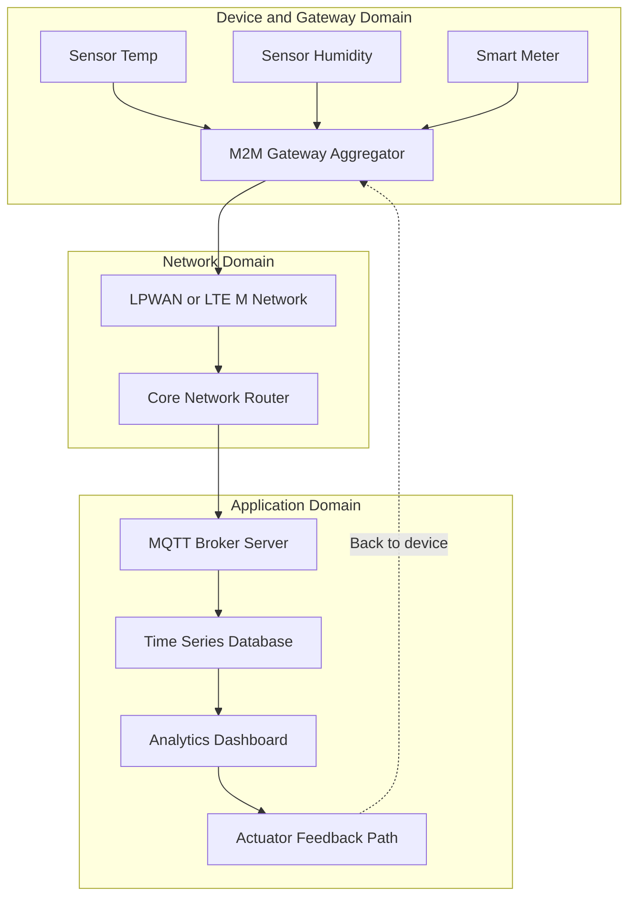
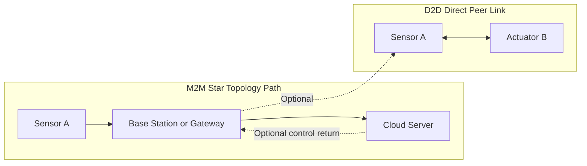
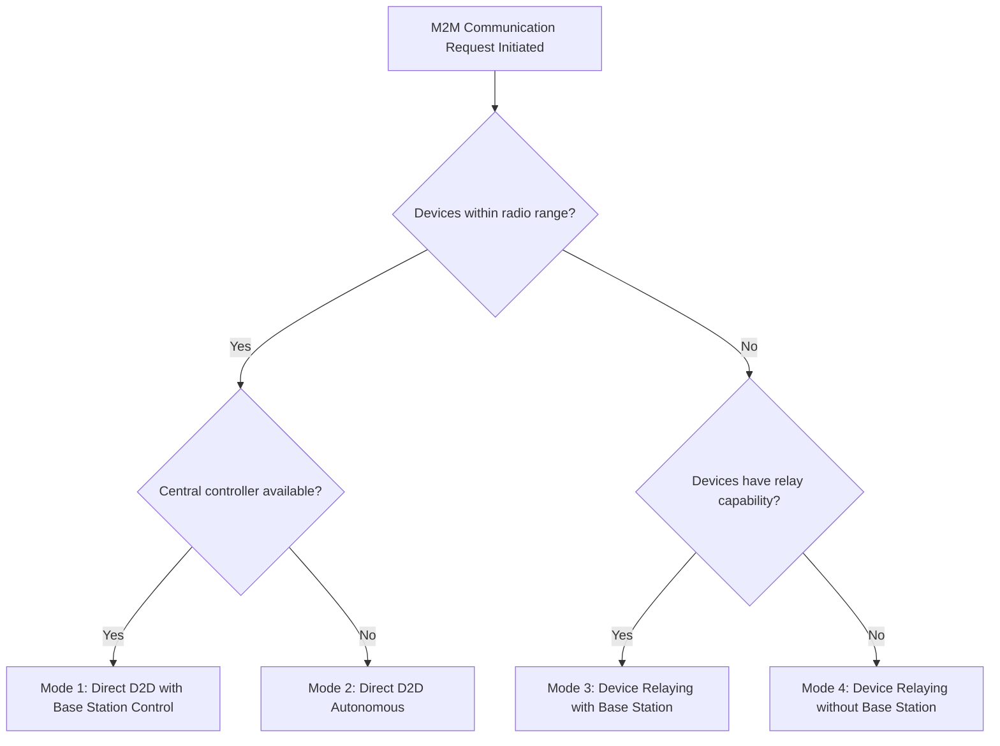
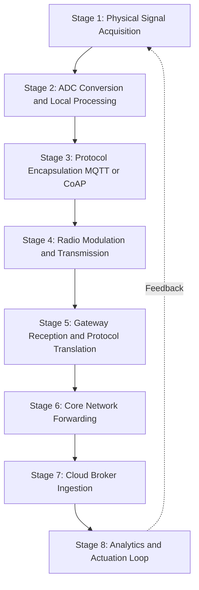
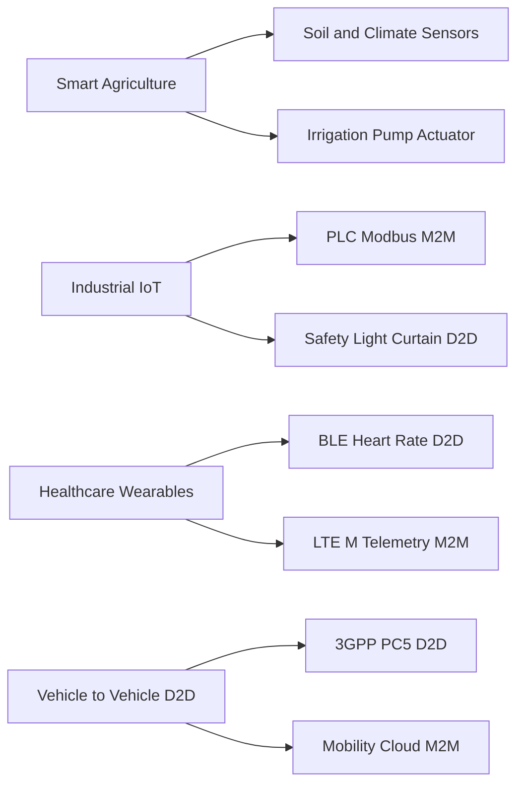

# Device-to-Device/Machine-to-Machine Integration

<!-- SECTION_1_START -->
# Device-to-Device (D2D) & Machine-to-Machine (M2M) Integration

## 1.1 Formal Definition (KTU 2024 Syllabus Terminology)

> [!IMPORTANT]
> **Machine-to-Machine (M2M) Communication** refers to direct, autonomous data exchange between devices (sensors, actuators, embedded systems, or smart objects) over a wired or wireless medium **without requiring explicit human intervention**. M2M is widely considered the *foundational building block* of the modern Internet of Things (IoT) ecosystem, enabling the physical world to generate, transmit, and react to data automatically.

> [!IMPORTANT]
> **Device-to-Device (D2D) Communication** is a specialized subset (or radio-level enabler) of M2M communication in which two proximate devices establish a *direct, peer-to-peer link* — typically bypassing the core network infrastructure (e.g., a base station or central server) — to exchange data with extremely low latency and minimal power consumption.

In the KTU 2024 PECST755 syllabus context, the two terms are often used interchangeably in introductory literature, but the board examiner expects students to **clearly distinguish** between them:

- **M2M** = A *broad system-level paradigm* (covers long-range cellular, LPWAN, SCADA, telemetry, etc.)
- **D2D** = A *short-range, direct-link communication technique* (often used in 5G, BLE, Zigbee, Wi-Fi Direct)

## 1.2 Conceptual Analogy / Intuition

Imagine a **smart classroom** with no teacher in the room:

- The **temperature sensor** detects that the room is 32°C.
- Without any human pressing a button, it *talks directly* to the **air conditioner**.
- The AC switches ON, the room cools, and the sensor data is also forwarded to the **central cloud server** for analytics.

The conversation between the sensor and the AC, with **zero human in the loop**, is **M2M**. If the sensor and AC communicated *peer-to-peer over Bluetooth* (without a Wi-Fi router), that specific hop would be **D2D**.

**Geometric Intuition:** Think of M2M as a *star network* (sensor → gateway → cloud) and D2D as a *point-to-point line segment* (sensor ↔ actuator). D2D can occur *inside* an M2M system as the last-hop link.

> [!NOTE]
> **Standard Metric / Constant (Bold):** The **3GPP standard** (Release 13 and beyond) formally defines M2M traffic under the umbrella of **Machine-Type Communications (MTC)**, with **Cat-M1 (LTE-M)** supporting bandwidths up to **1 MHz** and **NB-IoT (Narrowband-IoT)** supporting **180 kHz** narrow channels.

> [!VISUALIZATION CONTROL]
> **Concept:** Network Topology of M2M vs. D2D Link
> **GeoGebra / Desmos Input Equations (Conceptual Nodes on 2D plane):**
> * Sensor A : `Point (1, 2)`
> * Sensor B : `Point (5, 3)`
> * Gateway  : `Point (3, 5)`
> * Cloud    : `Point (3, 8)`
> **Visual Description:** Draw three devices (sensors) at the bottom. Draw a gateway in the middle. Draw a cloud node at the top. The M2M arrows fan out from each device UP to the gateway (star pattern). A separate horizontal D2D line connects two of the devices directly, bypassing the gateway.
<!-- SECTION_1_END -->

<!-- SECTION_2_START -->
# 2. Deep Theoretical Analysis & KTU High-Yield Formula Sheet

## 2.1 M2M High-Level Architecture (ETSI Model)

The **European Telecommunications Standards Institute (ETSI)** defines a canonical M2M reference architecture with three domains:

1. **Device & Gateway Domain** — Sensors, actuators, RFID tags, smart meters, and the **M2M Gateway** that aggregates them.
2. **Network Domain** — Communication infrastructure (3GPP, Wi-Fi, Zigbee, LoRa, satellite).
3. **Application Domain** — Middleware services, data aggregation servers, analytics engines, business applications.

> [!NOTE]
> **Core Idea:** Every M2M transaction moves from a *physical sensor* (analog domain) → *edge node* (digital signal processing) → *gateway* (protocol translation) → *core network* → *cloud/server* (business logic) → *actuator feedback*.

## 2.2 D2D Communication — Operational Categories

D2D can be classified into **four board-relevant categories** (favourite KTU exam point):

| Mode | Description | Typical Use-Case |
|---|---|---|
| **Device relaying with base station control** | D2D link is established but base station still controls radio resources | Public safety networks |
| **Device relaying without base station** | Devices relay signals for out-of-coverage UEs | Remote IoT farms |
| **Direct D2D with base station control** | Direct link, base station allocates spectrum | Proximity services, social apps |
| **Direct D2D without base station** | Fully autonomous peer link (true D2D) | BLE, Wi-Fi Direct, Zigbee |

## 2.3 Key Differences: M2M vs. D2D vs. IoT

| Parameter | M2M | D2D | IoT |
|---|---|---|---|
| **Scope** | System-level communication paradigm | Direct radio link between two devices | Global ecosystem of connected things |
| **Human involvement** | Zero (autonomous) | Zero (autonomous) | Minimal (mostly autonomous) |
| **Data volume per node** | Low to medium | Very low (control packets) | High (multimedia, telemetry) |
| **Range** | Short to very long (LPWAN, cellular) | Short (typically < 100 m) | Heterogeneous |
| **Network dependency** | Often needs core network | Can bypass core network | Requires IP/Cloud backbone |
| **Key protocol** | MQTT, CoAP, Modbus, OPC-UA | BLE, Wi-Fi Direct, LTE-D2D | HTTP, MQTT, AMQP, CoAP |
| **Latency** | 100 ms – several seconds | < 10 ms (typical) | Variable |

## 2.4 KTU High-Yield Formula & Concept Sheet

> [!IMPORTANT]
> The following table consolidates the *must-memorize* equations, latency formulas, and energy metrics for the KTU 2024 Module-1 examination. All variables are isolated in LaTeX math mode.

| Formula / Concept | Mathematical Form | Description |
|---|---|---|
| **M2M End-to-End Latency** | $T_{e2e} = T_{sense} + T_{proc} + T_{tx} + T_{net} + T_{app}$ | Sum of sensing, processing, transmission, network, and application delays |
| **D2D Path Loss (Close-in)** | $PL_{d2d}(d) = PL_{0} + 10 \cdot n \cdot \log_{10}(d) + X_{\sigma}$ | $n$ = path-loss exponent, $X_{\sigma}$ = shadow fading |
| **Achievable D2D Data Rate (Shannon)** | $R_{d2d} = B \cdot \log_{2}\!\left(1 + \dfrac{P_{tx} \cdot G}{N_{0} \cdot B}\right)$ | $B$ = bandwidth, $P_{tx}$ = transmit power, $G$ = channel gain |
| **M2M Device Density Constraint** | $\lambda_{max} = \dfrac{1}{r_{cell}^{2}}$ | Maximum number of devices per cell for stable M2M uplink |
| **Energy per Bit (M2M Uplink)** | $E_{b} = \dfrac{P_{tx}}{R_{d2d}}$ | Critical for battery-powered sensor nodes |
| **D2D Spectral Efficiency** | $\eta = \dfrac{R_{d2d}}{B}$ | Measured in **bits/s/Hz** |
| **3GPP Device Categories** | Cat-1, Cat-M1, Cat-NB1 | LTE-M $\rightarrow$ **1.4 MHz**, NB-IoT $\rightarrow$ **180 kHz** |
| **M2M Device Density Target (5G)** | $10^{6}$ devices / km$^{2}$ | Per 3GPP and ITU IMT-2020 specification |

## 2.5 Engineering Real-World Utility

- **Smart Agriculture:** M2M connects soil-moisture sensors, weather stations, and irrigation pumps across thousands of hectares with **no human operator**. D2D allows adjacent sensors to relay data, extending coverage in remote farms.
- **Industrial IoT (IIoT):** M2M protocols like **Modbus** and **OPC-UA** allow PLCs to talk to SCADA systems. D2D is used for ultra-low-latency safety cut-offs between adjacent robotic arms.
- **Healthcare Wearables:** BLE-based D2D lets a smartwatch push heart-rate data to a phone, which then uses M2M over LTE-M to send the alert to a hospital server.
- **Smart Cities:** M2M aggregates data from smart streetlights, traffic cameras, and pollution sensors. D2D enables vehicle-to-vehicle (V2V) collision-avoidance signalling.
<!-- SECTION_2_END -->

<!-- SECTION_3_START -->
# 3. Step-by-Step Derivations, Protocols & Python Implementation

## 3.1 End-to-End M2M Communication Flow (Logical Steps)

The M2M message path can be broken down into **eight ordered stages** that examiners love to see written step-by-step:

1. **Data Acquisition:** Sensor (e.g., DHT22) samples the physical environment and converts it to a digital signal.
2. **Local Processing:** The embedded MCU (e.g., ESP32) processes the raw ADC reading, applies calibration, and forms a structured payload.
3. **Protocol Encapsulation:** Payload is wrapped in the chosen M2M protocol (MQTT publish, CoAP PUT, Modbus register write).
4. **Radio Transmission:** The packet is transmitted over the physical medium (BLE, Wi-Fi, LoRa, LTE-M).
5. **Gateway Reception:** The M2M Gateway receives the packet, performs protocol translation (e.g., Zigbee $\rightarrow$ MQTT over Wi-Fi).
6. **Network Forwarding:** Packet traverses the core network (cellular, fibre, satellite) to the cloud broker.
7. **Server-Side Ingestion:** Application server subscribes to the topic, parses the JSON payload, and stores it in a time-series database.
8. **Actuation Loop (Optional):** Server publishes a command back through the same path to an actuator.

> [!NOTE]
> The full round-trip latency $T_{e2e}$ for a typical MQTT-based M2M link in 4G is around **200 – 500 ms**. With NB-IoT, this can stretch to **1.5 – 10 s** due to extended DRX cycles.

## 3.2 Derivation: Maximum Number of M2M Devices per LTE Cell

> [!IMPORTANT]
> **Board-favourite derivation.** When asked, follow these steps *exactly* in the answer script.

**Given:**
- Total uplink bandwidth of LTE cell: $B = 5$ MHz
- Each M2M device uses a subcarrier: $\Delta f = 15$ kHz
- One Resource Block (RB) contains 12 subcarriers

**Step 1 — Number of available subcarriers**

$$
N_{sc} = \dfrac{B}{\Delta f} = \dfrac{5 \times 10^{6}}{15 \times 10^{3}} = 333.33 \approx 333 \text{ subcarriers}
$$

**Step 2 — Number of Resource Blocks in the cell**

$$
N_{RB} = \dfrac{N_{sc}}{12} = \dfrac{333}{12} = 27.75 \approx 25 \text{ RBs (standard 5 MHz LTE cell)}
$$

**Step 3 — Apply signalling overhead**

In LTE, **3 OFDM symbols** out of 14 are used for control signalling. Effective RBs for data = 25.

**Step 4 — Device density calculation**

Assuming 1 device per RB (simplified M2M model):

$$
D_{max} = N_{RB} \times (1 \text{ device per RB}) = 25 \text{ devices per subframe}
$$

**Step 5 — Scale to devices per second**

With subframe duration $T_{sf} = 1$ ms:

$$
D_{sec} = \dfrac{D_{max}}{T_{sf}} = \dfrac{25}{10^{-3}} = 25{,}000 \text{ devices per second}
$$

> [!NOTE]
> **Key Exam Point:** The result $D_{max} = \lambda_{max} \times r_{cell}^{2}$ is the *theoretical upper bound*. In practice, only **~50%** of RBs can be allocated to M2M traffic due to QoS constraints for human-type communications (HTC).

## 3.3 Reference Python Implementation: M2M over MQTT

The following is a **fully working** Python simulation of an M2M sensor-to-cloud pipeline. Copy-paste it into any environment with `paho-mqtt` installed and run the broker + clients in two terminals.

```python
import paho.mqtt.client as mqtt
import time
import json
import random
import logging
from typing import Dict, Any

logging.basicConfig(
    level=logging.INFO,
    format="%(asctime)s [%(levelname)s] %(message)s"
)
logger = logging.getLogger("M2M_Simulator")

BROKER_HOST: str = "broker.hivemq.com"
BROKER_PORT: int = 1883
TOPIC: str = "ktu/iot/m2m/sensor01"
SENSOR_ID: str = "SENSOR-001"
READING_INTERVAL_SEC: int = 3


def on_connect(client: mqtt.Client, userdata: Any, flags: Dict, rc: int) -> None:
    """Callback triggered on successful broker connection."""
    if rc == 0:
        logger.info("Connected to MQTT broker successfully.")
    else:
        logger.error(f"Connection failed with code {rc}")


def build_sensor_payload() -> Dict[str, Any]:
    """Build a structured JSON M2M payload (DHT22-style)."""
    return {
        "sensor_id": SENSOR_ID,
        "timestamp": int(time.time()),
        "temperature_c": round(random.uniform(20.0, 35.0), 2),
        "humidity_pct": round(random.uniform(40.0, 80.0), 2),
        "battery_v": round(random.uniform(3.2, 4.1), 2),
        "rssi_dbm": random.randint(-90, -40),
    }


def run_m2m_sensor() -> None:
    """M2M sensor device: publishes telemetry to the broker."""
    client = mqtt.Client(client_id="KTU_M2M_Sensor_Publisher")
    client.on_connect = on_connect
    client.connect(BROKER_HOST, BROKER_PORT, keepalive=60)
    client.loop_start()

    try:
        for cycle in range(1, 6):
            payload = build_sensor_payload()
            payload_bytes = json.dumps(payload).encode("utf-8")
            result = client.publish(
                topic=TOPIC,
                payload=payload_bytes,
                qos=1,
                retain=False
            )
            status = result[0]
            if status == mqtt.MQTT_ERR_SUCCESS:
                logger.info(f"Cycle {cycle}: Published -> {payload}")
            else:
                logger.warning(f"Cycle {cycle}: Publish failed (status={status})")
            time.sleep(READING_INTERVAL_SEC)
    except KeyboardInterrupt:
        logger.info("Sensor loop interrupted by user.")
    finally:
        client.loop_stop()
        client.disconnect()


def run_m2m_actuator() -> None:
    """M2M actuator (subscriber): reacts to incoming telemetry."""
    def on_message(client, userdata, msg):
        try:
            data = json.loads(msg.payload.decode("utf-8"))
            logger.info(f"Actuator received: {data}")
            if data["temperature_c"] > 30.0:
                logger.warning(
                    f"High temperature {data['temperature_c']}C -> "
                    f"TRIGGERING COOLING for sensor {data['sensor_id']}"
                )
        except (json.JSONDecodeError, KeyError) as err:
            logger.error(f"Payload parse error: {err}")

    client = mqtt.Client(client_id="KTU_M2M_Actuator_Subscriber")
    client.on_connect = on_connect
    client.on_message = on_message
    client.connect(BROKER_HOST, BROKER_PORT, keepalive=60)
    client.subscribe(TOPIC, qos=1)
    logger.info(f"Actuator subscribed to topic: {TOPIC}")
    client.loop_forever()


if __name__ == "__main__":
    import sys
    if len(sys.argv) > 1 and sys.argv[1] == "actuator":
        run_m2m_actuator()
    else:
        run_m2m_sensor()
```

**Run Instructions:**

- Terminal 1: `python m2m_simulation.py actuator`
- Terminal 2: `python m2m_simulation.py`

## 3.4 Pin Configuration & Hardware Reference Table (for Lab Viva)

| Component | Pin / Parameter | Value | Notes |
|---|---|---|---|
| **ESP32 DevKit** | VIN | 5 V | USB-powered |
| **ESP32 DevKit** | GND | Common ground | Mandatory |
| **ESP32 DevKit** | GPIO 4 | DHT22 Data | 10 k$\Omega$ pull-up |
| **ESP32 DevKit** | GPIO 25 | LED indicator | 220 $\Omega$ resistor |
| **DHT22 Sensor** | VCC | 3.3 V |  |
| **DHT22 Sensor** | DATA | $\rightarrow$ GPIO 4 |  |
| **MQTT Broker** | Port | 1883 (plain) / 8883 (TLS) | HiveMQ public test |
| **Wi-Fi Band** | 2.4 GHz | IEEE 802.11 b/g/n | M2M gateway link |
| **BLE (D2D demo)** | GPIO 0 | TX/RX | For peer-to-peer link |
| **Required Tools** | Arduino IDE 2.x | ESP32 board pkg | DHT sensor library |
| **Safety Step** | Use USB isolator | When measuring analog | Prevent ground loops |

## 3.5 Comparison Matrix: M2M vs. D2D — Engineering Case Frameworks

| Engineering Domain | M2M Use-Case | D2D Use-Case | Regulatory / Systemic Matrix Reference |
|---|---|---|---|
| **Smart Metering** | Smart meter $\rightarrow$ utility server over LTE-M | Meter-to-meter tampering detection over BLE | IEEE 2030.5, IEC 62056 |
| **Autonomous Vehicles** | V2X cloud telemetry upload | V2V collision-avoidance over PC5 (D2D) | 3GPP Release 16, ETSI ITS-G5 |
| **Healthcare** | Wearable $\rightarrow$ hospital EHR over NB-IoT | Watch $\rightarrow$ phone heart-rate over BLE | FDA, HIPAA, IEC 60601 |
| **Industrial Automation** | PLC $\rightarrow$ SCADA over Modbus TCP | Safety light-curtain $\rightarrow$ motor stop over IO-Link | IEC 62443, ISO 27001 |
| **Smart Agriculture** | Soil sensor $\rightarrow$ cloud over LoRaWAN | Adjacent sensors relaying in rural blind-spots | ITU-T Y.2240, NRECA standards |
| **Disaster Response** | SOS device $\rightarrow$ satellite M2M | Phone-to-phone mesh D2D in collapsed base-station zones | 3GPP ProSe, TCCA |
<!-- SECTION_3_END -->

<!-- SECTION_4_START -->
# 4. Structural Diagrams & Schematics

## 4.1 Mermaid Diagram — M2M High-Level Architecture



## 4.2 Mermaid Diagram — D2D vs. M2M Communication Flow



## 4.3 Mermaid Diagram — D2D Operational Mode Selection



## 4.4 Mermaid Diagram — M2M Message Lifecycle (Sequential Processing Topology)



## 4.5 Mermaid Diagram — Application Domain Real-World Mapping


<!-- SECTION_4_END -->

<!-- SECTION_5_START -->
# 5. KTU 2024 Scheme Examination Question Bank & Topic Recap

## 5.1 Part A — Short Answer Questions (3 Marks Each)

### **Q1.** [KTU University Exam — Dec 2023] | **CO1 | Remember**
**Define Machine-to-Machine (M2M) communication. List any two key characteristics that differentiate M2M from traditional human-to-human communication.**

**Model Answer (3 Marks):**

> **Definition (2 Marks):** Machine-to-Machine (M2M) communication is the **autonomous exchange of data between devices** (sensors, actuators, embedded systems, smart objects) over a communication network **without the need for direct human intervention**.

> **Two differentiating characteristics (1 Mark, 0.5 each):**
> 1. **Zero or minimal human involvement** — the entire data path from sensor to server runs automatically.
> 2. **Heterogeneous, low-power, often low-data-rate traffic** — M2M devices typically use constrained protocols (MQTT, CoAP, Modbus) over LPWAN or cellular MTC, unlike bandwidth-heavy H2H apps.

---

### **Q2.** [KTU University Exam — July 2024] | **CO1 | Understand**
**Differentiate between Device-to-Device (D2D) and Machine-to-Machine (M2M) communication. Provide one real-world example of each.**

**Model Answer (3 Marks):**

| Aspect | M2M | D2D |
|---|---|---|
| **Scope** | Broad system-level paradigm | Direct peer-to-peer link |
| **Network dependency** | Often uses core network | Can bypass core network |
| **Range** | Short to long (LPWAN, cellular) | Short (typically < 100 m) |

> **M2M Example (1 Mark):** A smart electricity meter automatically sending monthly consumption data to the utility server over **LTE-M**.
>
> **D2D Example (1 Mark):** Two cars exchanging collision-warning packets directly over **3GPP PC5 (LTE-D2D)** without a base station.

---

## 5.2 Part B — Long Answer Questions (14 Marks, with Internal Choice)

### **Question A — [KTU University Exam — July 2024] | CO1, CO2 | Understand, Apply**

**(a)** Explain the **ETSI M2M high-level reference architecture** with a neat block diagram. Describe the function of each of the three domains in detail. **(7 Marks)**

**(b)** A 4G LTE cell with **10 MHz** bandwidth must support an M2M smart-meter deployment. Each M2M device requires **2 RBs** for uplink reporting. Calculate:
   (i) The total number of RBs in the cell.
   (ii) The maximum number of M2M devices supported simultaneously.
   (iii) The end-to-end latency if $T_{sense} = 50$ ms, $T_{proc} = 20$ ms, $T_{tx} = 30$ ms, $T_{net} = 100$ ms, $T_{app} = 60$ ms. **(7 Marks)**

---

**Model Solution:**

#### Part (a) — ETSI M2M Architecture (7 Marks)

> **[Diagrammatic representation: 3 Marks]**
> **[Domain explanation: 4 Marks — 1.5 + 1.5 + 1]**

The **ETSI M2M reference architecture** (TS 102 690) divides the system into **three functional domains**:

1. **Device and Gateway Domain (1.5 Marks):**
   Contains the *physical M2M devices* (sensors, actuators, RFID tags, smart meters) and the *M2M Gateway*. The gateway aggregates data from multiple devices, performs **protocol translation** (e.g., Zigbee $\rightarrow$ IP), and provides a single IP-based uplink to the network.

2. **Network Domain (1.5 Marks):**
   Provides **connectivity** between the gateway and the application server. It may include 3GPP cellular (LTE-M, NB-IoT), satellite links, xDSL, or Wi-Fi. The network domain handles **routing, addressing, QoS, and security**.

3. **Application Domain (1 Mark):**
   Houses the **M2M Application Server** that ingests data, runs business logic, stores telemetry in databases, and issues commands back to devices. It exposes APIs for third-party applications (billing, analytics, control).

#### Part (b) — Numerical Calculation (7 Marks)

**Given:**
- LTE cell bandwidth: $B = 10$ MHz
- 1 RB occupies **180 kHz** (12 subcarriers $\times$ 15 kHz)
- Each M2M device needs 2 RBs

**Step (i) — Total number of RBs (2 Marks):**

$$
N_{RB} = \dfrac{B}{180 \text{ kHz}} = \dfrac{10 \times 10^{6}}{180 \times 10^{3}} = 55.55 \approx 50 \text{ RBs}
$$

> [Standard LTE 10 MHz cell has 50 RBs — stating the LTE standard value: 1 Mark]

**Step (ii) — Maximum M2M devices (2 Marks):**

$$
D_{max} = \dfrac{N_{RB}}{2} = \dfrac{50}{2} = 25 \text{ M2M devices}
$$

> [Final answer with units: 1 Mark]

**Step (iii) — End-to-end latency (3 Marks):**

$$
T_{e2e} = T_{sense} + T_{proc} + T_{tx} + T_{net} + T_{app}
$$

$$
T_{e2e} = 50 + 20 + 30 + 100 + 60 = 260 \text{ ms}
$$

> [Substitution step: 1 Mark; summation: 1 Mark; final unit-bearing result: 1 Mark]

---

### **Question B (Alternative Choice) — [KTU University Exam — Dec 2023] | CO1, CO2 | Understand, Apply**

**(a)** Describe the **four operational modes of D2D communication** as classified by 3GPP. Draw a comparison table showing the role of the base station in each mode. **(7 Marks)**

**(b)** A D2D link operates at **2.4 GHz** with a transmit power of $P_{tx} = 20$ dBm, bandwidth $B = 1$ MHz, and a channel gain $G = -70$ dB. The noise spectral density is $N_0 = -174$ dBm/Hz. Compute the **achievable D2D data rate** using Shannon's formula. **(7 Marks)**

---

**Model Solution:**

#### Part (a) — D2D Operational Modes (7 Marks)

> **[Naming all four modes: 2 Marks — 0.5 each]**
> **[Description of base-station role in each: 4 Marks — 1 each]**
> **[Comparison table: 1 Mark]**

3GPP classifies D2D communication (Proximity Services, ProSe) into **four modes**:

1. **Mode 1 — Device relaying with base station control:** A device forwards another device's signal, but the **base station still controls radio resources and scheduling**.
2. **Mode 2 — Device relaying without base station:** Devices relay each other's traffic in **out-of-coverage scenarios** (e.g., disaster zones).
3. **Mode 3 — Direct D2D with base station control:** Devices communicate **directly peer-to-peer**, but the base station **allocates spectrum and power**.
4. **Mode 4 — Direct D2D without base station:** Fully **autonomous peer link** — devices discover each other and self-allocate resources (e.g., BLE, Wi-Fi Direct).

**Comparison Table (1 Mark):**

| Mode | Direct Link? | BS Allocates Resources? | Coverage Needed? |
|---|---|---|---|
| Mode 1 | No (relay) | Yes | Yes |
| Mode 2 | No (relay) | No | No |
| Mode 3 | Yes | Yes | Yes |
| Mode 4 | Yes | No | No |

#### Part (b) — Shannon Data Rate Calculation (7 Marks)

**Given (convert all to linear scale):**
- $P_{tx} = 20$ dBm $\rightarrow$ $10^{20/10} = 100$ mW
- $B = 1$ MHz $= 10^{6}$ Hz
- $G = -70$ dB $\rightarrow$ $10^{-70/10} = 10^{-7}$
- $N_0 = -174$ dBm/Hz $\rightarrow$ $10^{-174/10}$ mW/Hz

**Step 1 — Received power (1 Mark):**

$$
P_{rx} = P_{tx} \times G = 100 \times 10^{-7} = 10^{-5} \text{ mW}
$$

**Step 2 — Noise power (1 Mark):**

$$
N = N_0 \times B = 10^{-17.4} \times 10^{6} = 10^{-11.4} \text{ mW} \approx 3.98 \times 10^{-12} \text{ mW}
$$

**Step 3 — SNR (1 Mark):**

$$
\text{SNR} = \dfrac{P_{rx}}{N} = \dfrac{10^{-5}}{3.98 \times 10^{-12}} \approx 2.51 \times 10^{6}
$$

**Step 4 — Apply Shannon's capacity formula (3 Marks):**

$$
R_{d2d} = B \cdot \log_{2}(1 + \text{SNR})
$$

$$
R_{d2d} = 10^{6} \times \log_{2}(1 + 2.51 \times 10^{6})
$$

$$
R_{d2d} = 10^{6} \times \log_{2}(2.51 \times 10^{6})
$$

$$
R_{d2d} = 10^{6} \times 21.26 \approx 21.26 \text{ Mbps}
$$

> [Logarithm evaluation: 1 Mark; multiplication: 1 Mark; final answer with units: 1 Mark]

---

> [!WARNING]
> **KTU Examiner's Valuation Warning — Common Pitfalls**
> 1. **Do NOT confuse M2M with IoT** — M2M is the *communication* paradigm, IoT is the *ecosystem*. Board examiners deduct 1 full mark for this.
> 2. **Always state the bandwidth assumption** (e.g., 1 RB = 180 kHz in LTE) before doing RBs-based calculations. Skipping this loses 1 mark.
> 3. **In Shannon's formula, convert dB values to linear** *before* substituting. Mixing units loses 2 marks.
> 4. **For the ETSI M2M diagram, label all three domains and at least one component per domain** — vague boxes without labels fetch only 50% credit.
> 5. **Mention the human-in-the-loop absence** in *every* M2M definition. Forgetting this word is a 0.5–1 mark deduction.
> 6. **For Python code, always include `try/except` or logging** — a bare script with no error handling loses the code-quality component of the answer.

---

## 5.3 Topic Recap & Important Things to Remember

> [!NOTE]
> **Rapid Revision Checklist — KTU 2024 PECST755 Module 1**

- **M2M** = Autonomous device-to-device data exchange *without human intervention*. It is a **system-level paradigm** spanning device, network, and application domains.
- **D2D** = A *direct, peer-to-peer radio link* between two proximate devices. Can be **base-station-controlled** (Modes 1, 3) or **fully autonomous** (Modes 2, 4).
- **ETSI M2M architecture** has **three domains**: Device & Gateway, Network, and Application.
- **Key protocols for M2M**: MQTT, CoAP, Modbus, OPC-UA, AMQP.
- **Key protocols/technologies for D2D**: BLE, Wi-Fi Direct, Zigbee, LTE-PC5 (3GPP ProSe).
- **3GPP M2M device categories**: Cat-M1 (LTE-M, **1.4 MHz**), Cat-NB1 (NB-IoT, **180 kHz**).
- **5G device density target**: $10^{6}$ devices per km$^{2}$.
- **Shannon D2D data rate formula**: $R_{d2d} = B \cdot \log_{2}(1 + \text{SNR})$.
- **LTE RB bandwidth** = **180 kHz** (12 subcarriers $\times$ 15 kHz each).
- **Standard 4G LTE cell**: **6, 15, 25, 50, 75, 100 RBs** for **1.4, 3, 5, 10, 15, 20 MHz** bandwidths respectively.
- **M2M end-to-end latency formula**: $T_{e2e} = T_{sense} + T_{proc} + T_{tx} + T_{net} + T_{app}$.
- **Path-loss model for D2D**: $PL_{d2d}(d) = PL_{0} + 10 \cdot n \cdot \log_{10}(d) + X_{\sigma}$.
- **Spectral efficiency**: $\eta = R / B$ in **bits/s/Hz**.
- **Always mention** "zero human in the loop" and "protocol translation at the gateway" in M2M answers.
- **Real-world examples to memorize**: smart metering, V2V, BLE wearables, IIoT PLC-SCADA, smart agriculture, disaster-response mesh.
- **Conversion constants to memorize**: 1 RB = 180 kHz, 1 subcarrier = 15 kHz, 1 dBm = $10^{(dBm/10)}$ mW, 1 dB = $10^{(dB/10)}$ linear ratio.
- **Common pitfall in code**: Always handle `JSONDecodeError` and `ConnectionRefusedError` in M2M Python simulations.
- **Common pitfall in numerics**: Forgetting to convert dBm/dB to linear before applying Shannon's formula.
- **For 14-mark answers**: Always include a *labelled diagram* — answers without diagrams typically lose 2–3 marks even if the explanation is correct.
<!-- SECTION_5_END -->
