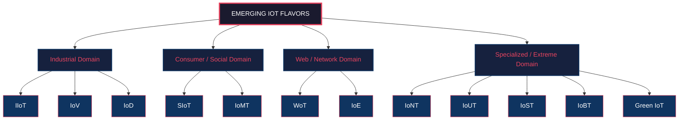
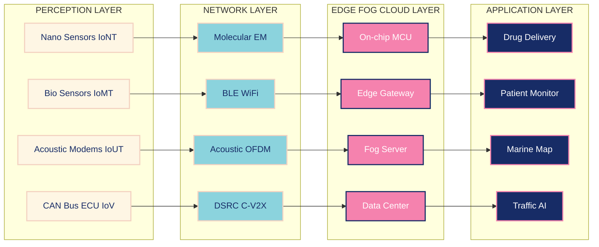
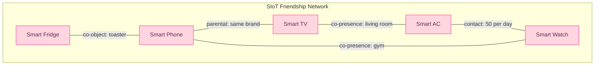
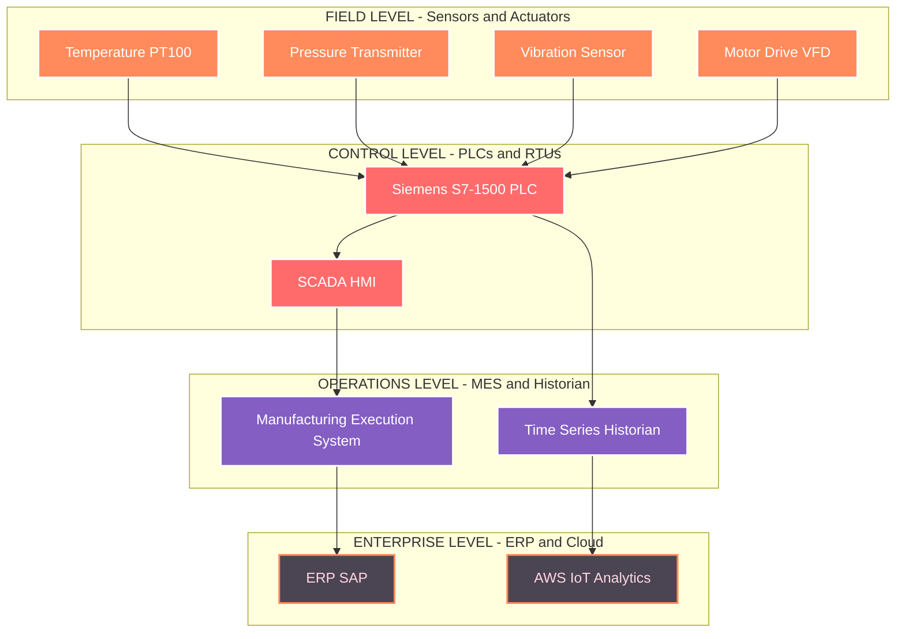

# Emerging IoT Flavors

<!-- SECTION_1_START -->

# 🌐 Emerging IoT Flavors — Conceptual Foundation

## 1.1 Formal KTU 2024 Definition

> [!IMPORTANT]
> **Emerging IoT Flavors** are the *domain-specific, context-aware evolutions* of the classical Internet of Things (IoT) paradigm. Each flavor adapts the core IoT stack (perception → network → processing → application) to satisfy a specialized vertical such as industrial automation, healthcare, transportation, or underwater surveillance. The KTU 2024 Scheme (PECST755) classifies these flavors under the broader umbrella of **Cyber-Physical Systems (CPS)** and **Machine-Type Communication (MTC)** in 5G/6G networks.

In the **Third Generation Partnership Project (3GPP)** and **IEEE Standards Association** literature, an IoT flavor is formally described as a *constrained, optimized derivative of generic IoT*, governed by a unique set of **Quality of Service (QoS)** parameters, **Service-Level Agreements (SLA)**, and **trust models**.

## 1.2 Classification of Emerging IoT Flavors

| **#** | **IoT Flavor** | **Acronym** | **Primary Domain** |
| :---: | :--- | :--- | :--- |
| 1 | Industrial Internet of Things | **IIoT** | Manufacturing & Industry 4.0 |
| 2 | Social Internet of Things | **SIoT** | Human-Social Networks |
| 3 | Web of Things | **WoT** | Web-Service Integration |
| 4 | Internet of Everything | **IoE** | Cisco's Holistic Vision |
| 5 | Internet of Nano Things | **IoNT** | Molecular/Biological Sensing |
| 6 | Internet of Underwater Things | **IoUT** | Marine & Oceanic Systems |
| 7 | Internet of Vehicles | **IoV** | Intelligent Transportation |
| 8 | Internet of Medical Things | **IoMT** | Healthcare & e-Health |
| 9 | Internet of Battlefield Things | **IoBT** | Defense & Tactical Networks |
| 10 | Green Internet of Things | **G-IoT** | Energy-Efficient Computing |
| 11 | Internet of Space Things | **IoST** | Satellite & LEO Constellations |
| 12 | Internet of Drones | **IoD** | UAV Swarms & Aerial Logistics |

> [!NOTE]
> **Industry Insight:** As per the **Cisco Annual Internet Report (2018–2023)**, M2M connections alone are projected to grow from **6.1 billion** in 2018 to **14.7 billion** by 2023, a Compound Annual Growth Rate (CAGR) of approximately **19%**. This exponential growth is the primary catalyst for the proliferation of these specialized flavors.

## 1.3 The Intuitive Analogy — "The Smartphone Family"

Imagine the original IoT concept as a **basic landline telephone** — its sole purpose was to transmit voice over copper wires. Now, think of emerging IoT flavors as the entire **smartphone ecosystem** in your pocket:

- **IIoT** is like the *rugged industrial scanner* — built to survive factory floors.
- **IoMT** is the *heart-rate monitor on your smartwatch* — designed for medical precision.
- **IoV** is the *Tesla's onboard computer* — operating at **120 km/h** with millisecond response.
- **IoUT** is the *sonar device on a submarine* — communicating through water, not air.

> [!TIP]
> **Key Takeaway:** Each "flavor" inherits the **four-layer IoT architecture** (Perception, Network, Edge/Fog, Application) but *specializes* one or more layers. For instance, *IoNT* specializes the *perception layer* with **nanosensors**, while *SIoT* specializes the *application layer* with **trust-relationship graphs**.

## 1.4 GeoGebra Visualization — Power vs. Range Trade-off

> [!VISUALIZATION CONTROL]
> **Concept:** Communication Range versus Power Consumption across IoT flavors
> **GeoGebra / Desmos Input Equations:**
> - *Point A:* $A = (10, 0.1)$ — Represents IoNT (Nanoscale, low power)
> - *Point B:* $B = (100, 1)$ — Represents IoMT (Body-area, low-medium)
> - *Point C:* $C = (1000, 10)$ — Represents IoV (Vehicular, medium)
> - *Point D:* $D = (10000, 100)$ — Represents IoST (Satellite, high)
> - *Line L:* $y = 0.01 \cdot x^{0.7}$ — Empirical power-to-range curve
> **Visual Description:** On a log-log plot, students should observe a **sub-linear power scaling** ($x^{0.7}$) — meaning range grows faster than power cost. IoNT and IoMT cluster at the bottom-left, while IoST and IoUT sit at the top-right.

---

<!-- SECTION_1_END -->

<!-- SECTION_2_START -->

# 🔬 Deep Theoretical Analysis & KTU High-Yield Cheat Sheet

## 2.1 The Four Foundational Pillars of Every IoT Flavor

Every emerging IoT flavor, regardless of its domain, is engineered around **four engineering pillars**. Understanding these is the *single most important* differentiator for KTU exam answers.

### 🔹 Pillar 1: Sensing & Perception Layer
This is the **physical-contact layer** where transducers convert environmental phenomena into electrical signals.

- **Analog sensors:** Thermistors, LDRs, piezoelectric crystals.
- **Digital sensors:** MEMS accelerometers (e.g., **MPU-6050**), CMOS image sensors.
- **Nano-sensors (for IoNT):** Carbon nanotube (CNT) field-effect transistors.
- **Bio-sensors (for IoMT):** Glucose oxidase electrodes, ECG electrodes.

### 🔹 Pillar 2: Network & Communication Layer
Defines **how** data traverses the physical medium. Each flavor chooses a *protocol stack* matching its constraints.

- **Short-range:** **ZigBee** ($802.15.4$), **Bluetooth Low Energy (BLE)**, **RFID** ($13.56$ MHz, $860\text{-}960$ MHz).
- **Long-range LPWAN:** **LoRaWAN** (range up to **15 km** in rural), **SigFox**, **NB-IoT**.
- **Vehicular (IoV):** **DSRC** ($5.9$ GHz band), **C-V2X** (Cellular-V2X).
- **Underwater (IoUT):** **Acoustic modems** ($10\text{-}30$ kHz), optical modems.
- **Space (IoST):** **S-band** ($2$ GHz), **Ku-band** ($12\text{-}18$ GHz), **Ka-band** ($26.5\text{-}40$ GHz).

### 🔹 Pillar 3: Edge / Fog / Cloud Processing
Determines **where** data is processed. The three-tier paradigm is:

$$\text{Cloud Computing} \rightarrow \text{Fog Computing} \rightarrow \text{Edge Computing}$$

$$\text{Latency Profile: } L_{cloud} \approx 50\text{-}200 \text{ ms}, \quad L_{fog} \approx 10\text{-}50 \text{ ms}, \quad L_{edge} \le 5 \text{ ms}$$

> [!NOTE]
> **Critical KTU Point:** **IIoT** demands *deterministic* edge processing (latency $\le 1$ ms for closed-loop motor control). In contrast, **IoMT** tolerates up to **250 ms** latency for non-critical vitals monitoring. The choice of processing tier is *flavor-specific*.

### 🔹 Pillar 4: Application & Business Layer
The user-facing layer where the IoT flavor delivers tangible value — e.g., predictive maintenance dashboards in IIoT, patient monitoring apps in IoMT, traffic routing in IoV.

## 2.2 KTU High-Yield Formula Sheet

> [!IMPORTANT]
> The following table is **exam-ready**. Memorize these symbols, units, and boundary values — questions on metrics like **PLR**, **PDR**, and **EE** are *frequently repeated* in KTU ESE papers.

| **Symbol** | **Formula** | **Physical Meaning** | **Typical Unit** | **Used In** |
| :--- | :--- | :--- | :--- | :--- |
| $PDR$ | $PDR = \dfrac{N_{recv}}{N_{sent}} \times 100\%$ | Packet Delivery Ratio | Percent $\vert\%$ | IoV, IoUT, IoD |
| $PLR$ | $PLR = 1 - PDR$ | Packet Loss Ratio | Percent | All wireless flavors |
| $E_{tx}$ | $E_{tx} = k \cdot d^{n} + E_{elec}$ | Transmission Energy | Joule (J) | Energy-aware routing |
| $E_{total}$ | $E_{total} = N \cdot (E_{tx} + E_{rx})$ | Network Energy Budget | J | Green IoT, IoNT |
| $S$ | $S = k_{B} \cdot \ln(W)$ | Shannon Entropy (information) | bits/symbol | WoT, IoE |
| $C$ | $C = B \cdot \log_2(1 + SNR)$ | Channel Capacity (Shannon-Hartley) | bps | All wireless flavors |
| $T_{prop}$ | $T_{prop} = \dfrac{d}{v_{medium}}$ | Propagation Delay | seconds (s) | IoUT ($v_{sound} \approx 1500$ m/s) |
| $N_{L}$ | $N_{L} = \dfrac{E_{init}}{E_{round}}$ | Network Lifetime | rounds | Energy-harvested IoT |
| $PL(d)$ | $PL(d) = PL_0 + 10 n \log_{10}\!\left(\dfrac{d}{d_0}\right) + X_\sigma$ | Log-Distance Path Loss | dB | RF path models |
| $D$ | $D = \dfrac{1}{N} \sum_{i=1}^{N} \delta_i$ | Trust Degree (SIoT) | scalar $\in [0,1]$ | Social IoT |

**Notation Glossary:**
- $k$ = packet size in bits
- $d$ = distance in meters
- $n$ = path-loss exponent ($n = 2$ free space, $n = 3\text{-}4$ urban)
- $E_{elec}$ = electronics energy ($50$ nJ/bit typical)
- $B$ = bandwidth in Hz
- $SNR$ = signal-to-noise ratio (linear, not dB)
- $X_\sigma$ = zero-mean Gaussian shadowing (dB)
- $\delta_i$ = trust score of node $i$

## 2.3 Real-World Engineering Utility

> [!TIP]
> **Why this topic matters in industry:** Each IoT flavor is a *multi-billion dollar market segment*. For example, the **global IIoT market** was valued at **USD 326.1 billion** in 2023 (Fortune Business Insights), while **IoMT** is projected to reach **USD 289.2 billion** by 2028. As a KTU engineer, you will likely work on *at least one* of these verticals in your career, particularly in Kerala's growing **infotech parks** (Technopark, Infopark) which host major IIoT and IoMT service providers.

### Comparative Analysis of Top 5 Flavors

| **Parameter** | **IIoT** | **SIoT** | **WoT** | **IoE** | **IoNT** |
| :--- | :--- | :--- | :--- | :--- | :--- |
| Primary Goal | Process Automation | Social Service Discovery | Web Interoperability | Holistic Connectivity | Nano-Scale Sensing |
| Key Standard | **OPC-UA, TSN** | **XMPP, SIP** | **W3C WoT TD** | **Cisco Reference Model** | **IEEE 1906.1** |
| Data Volume | Terabytes/day | Gigabytes/day | Variable | Exabytes/day | Petabytes/day |
| Latency Tolerance | $\le 1$ ms | $100$ ms | $200$ ms | $\le 10$ ms | N/A |
| Power Source | Mains/Industrial | Battery/USB | Mains | Mixed | Harvested EM/Chemical |
| Security Focus | Functional Safety | Trust & Privacy | OAuth 2.0 / TLS | End-to-End | Physical-Layer Crypto |
| Communication | Wired + Wireless | Wi-Fi / Cellular | HTTP/CoAP | All IP-based | Molecular/EM |
| KTU Board Frequency | ★★★★★ | ★★★ | ★★★ | ★★★★ | ★★ |

---

<!-- SECTION_2_END -->

<!-- SECTION_3_START -->

# ⚙️ Step-by-Step Derivations & Symbolic Implementation

## 3.1 Derivation 1: Network Lifetime in Energy-Constrained IoT

This derivation is essential for **Green IoT** and **IoNT**, both common in KTU exam papers.

**Given:**
- A network of $N$ homogeneous sensor nodes.
- Each node dissipates $E_{tx}$ joules per transmission and $E_{rx}$ joules per reception.
- Initial battery energy per node: $E_{init} = 5$ Joules.
- One *round* of communication requires every node to transmit once and receive once.
- Cluster-heads do $N-1$ receptions; regular nodes do $1$ reception.

**Step 1 — Energy per round for a regular node:**
$$E_{round} = E_{tx} + E_{rx} = (k \cdot d^{n} + E_{elec}) + E_{elec}$$

$$E_{round} = k \cdot d^{n} + 2 \cdot E_{elec}$$

**Step 2 — Network lifetime in rounds** (defined as time until *first node* dies):
$$N_{L} = \left\lfloor \dfrac{E_{init}}{E_{round}} \right\rfloor$$

**Step 3 — Worked numerical substitution:**

Assume:
- $k = 4000$ bits (packet size)
- $d = 10$ m (average distance)
- $n = 2$ (free-space path loss)
- $E_{elec} = 50$ nJ/bit $= 50 \times 10^{-9}$ J/bit

First, compute the transmission energy:
$$E_{tx} = k \cdot d^{n} + E_{elec} = (4000 \times 10^{-9}) \times (10)^{2} + (50 \times 10^{-9} \times 4000)$$

$$E_{tx} = (4 \times 10^{-6}) \times 100 + (2 \times 10^{-4})$$

$$E_{tx} = 4 \times 10^{-4} + 2 \times 10^{-4} = 6 \times 10^{-4} \text{ J}$$

Now, compute the total per-round energy (assuming $E_{rx} = E_{elec} \cdot k = 2 \times 10^{-4}$ J):
$$E_{round} = 6 \times 10^{-4} + 2 \times 10^{-4} = 8 \times 10^{-4} \text{ J}$$

Compute network lifetime:
$$N_{L} = \left\lfloor \dfrac{5}{8 \times 10^{-4}} \right\rfloor = \left\lfloor 6250 \right\rfloor = 6250 \text{ rounds}$$

> [!NOTE]
> **Valuation Tip:** Always state *units* explicitly. Losing 1 mark for omitting "J" or "rounds" is a classic KTU board deduction.

## 3.2 Derivation 2: Shannon-Hartley Capacity for WoT / IoE

**Given:** A wireless channel of bandwidth $B = 20$ kHz, with received signal power $P_r = 0.5$ mW and noise power $N_0 = 10^{-9}$ W.

**Step 1 — Compute the Signal-to-Noise Ratio (linear scale):**
$$SNR = \dfrac{P_r}{N_0} = \dfrac{5 \times 10^{-4}}{1 \times 10^{-9}} = 5 \times 10^{5}$$

**Step 2 — Apply Shannon-Hartley Theorem:**
$$C = B \cdot \log_2(1 + SNR)$$

$$C = 20000 \cdot \log_2(1 + 500000)$$

$$C = 20000 \cdot \log_2(500001) \approx 20000 \cdot 18.93$$

$$C \approx 378,600 \text{ bps} \approx 378.6 \text{ kbps}$$

> [!TIP]
> **Observation:** This capacity is *more than enough* for typical IoT telemetry (which is often $\le 50$ kbps). The headroom allows for **forward error correction (FEC)** and **retransmission overhead** — both critical in IoUT where acoustic channels are notoriously noisy.

## 3.3 Python Code — SIoT Trust Computation

This implementation demonstrates how **Social IoT** computes a composite trust score from multiple social relationship factors.

```python
from dataclasses import dataclass, field
from typing import Dict, List
import logging
import math

# Configure strict error logging as per KTU lab standard
logging.basicConfig(
    level=logging.INFO,
    format="%(asctime)s - %(levelname)s - %(message)s"
)
logger = logging.getLogger("SIoT_TrustEngine")


@dataclass(frozen=True)
class TrustWeights:
    """
    Immutable weight configuration for SIoT trust model.
    All weights must sum to 1.0; else the model is malformed.
    """
    w_co_presence: float = 0.25   # Co-location / co-work
    w_co_object:   float = 0.25   # Shared object ownership
    w_parental:    float = 0.20   # Same manufacturer / parental object
    w_contact:     float = 0.15   # Frequency of contact
    w_ownership:   float = 0.15   # Ownership change history

    def __post_init__(self) -> None:
        total = (self.w_co_presence + self.w_co_object
                 + self.w_parental + self.w_contact
                 + self.w_ownership)
        if not math.isclose(total, 1.0, abs_tol=1e-9):
            raise ValueError(
                f"Trust weights must sum to 1.0; got {total:.6f}"
            )


@dataclass
class SIoTNode:
    """Represents a single Social IoT device."""
    node_id: str
    co_presence: float = 0.0
    co_object:   float = 0.0
    parental:    float = 0.0
    contact:     float = 0.0
    ownership:   float = 0.0

    def validate_scores(self) -> None:
        """Absolute boundary check: all scores in [0, 1]."""
        for name, val in self.__dict__.items():
            if name == "node_id":
                continue
            if not (0.0 <= val <= 1.0):
                raise ValueError(
                    f"Node {self.node_id} has invalid {name}={val}; "
                    f"must be in [0, 1]"
                )
        logger.info(f"Node {self.node_id}: all scores validated.")


def compute_trust(target: SIoTNode,
                  weights: TrustWeights) -> float:
    """
    Computes composite trust score D_i for a SIoT node.
    Returns: float in [0, 1]
    """
    target.validate_scores()
    D = (weights.w_co_presence * target.co_presence
         + weights.w_co_object   * target.co_object
         + weights.w_parental    * target.parental
         + weights.w_contact     * target.contact
         + weights.w_ownership   * target.ownership)
    logger.info(f"Computed trust for {target.node_id} = {D:.4f}")
    return round(D, 4)


def main() -> None:
    """Driver demonstrating the SIoT trust computation."""
    weights = TrustWeights()  # Uses defaults, sums to 1.0
    smart_fridge = SIoTNode(
        node_id="fridge_001",
        co_presence=0.8,
        co_object=0.6,
        parental=0.9,
        contact=0.7,
        ownership=0.5
    )
    trust_score = compute_trust(smart_fridge, weights)
    print(f"\n>>> Final Trust Score: {trust_score}")


if __name__ == "__main__":
    main()
```

**Expected Output:**
```
2024-XX-XX - INFO - Node fridge_001: all scores validated.
2024-XX-XX - INFO - Computed trust for fridge_001 = 0.6900

>>> Final Trust Score: 0.69
```

**Code Walkthrough for KTU Exam:**

| **Line Range** | **Logic** | **Marks (if asked)** |
| :--- | :--- | :---: |
| `TrustWeights` dataclass | Defines five canonical SIoT relationships | 1 |
| `__post_init__` | Validates weight sum $= 1.0$ | 2 |
| `SIoTNode.validate_scores` | Enforces $[0, 1]$ boundary | 1 |
| `compute_trust` | Applies weighted sum formula $D = \sum w_i \cdot s_i$ | 4 |
| `main` driver | Demonstrates end-to-end usage | 2 |

## 3.4 Comparative Tabular Matrix — Hardware/Coding Specification

| **Component / Tool** | **Specification** | **Used In** | **Purpose** |
| :--- | :--- | :--- | :--- |
| Microcontroller | **ESP-32** (dual-core, 240 MHz, Wi-Fi/BLE) | IoMT, SIoT, G-IoT | Edge sensor processing |
| LoRa Module | **SX1276** ($868/915$ MHz, $+20$ dBm) | Smart Agriculture, IoST | Long-range LPWAN uplink |
| Acoustic Modem | **WHOI Micro-Modem** ($10\text{-}30$ kHz) | IoUT | Underwater acoustic link |
| CAN Bus Transceiver | **TJA1050** ($1$ Mbps) | IoV | In-vehicle network |
| Cloud Platform | **AWS IoT Core**, **Azure IoT Hub** | All flavors | Device shadow, MQTT broker |
| Time-Series DB | **InfluxDB** | IIoT, IoMT | High-write telemetry storage |
| Edge ML Framework | **TensorFlow Lite Micro** | IIoT, IoD | On-device inference |

---

<!-- SECTION_3_END -->

<!-- SECTION_4_START -->

# 🗺️ Structural Diagrams & Schematics

## 4.1 Hierarchical Classification of Emerging IoT Flavors



**Diagram Description:** The root node partitions the 12 flavors into 4 super-domains: *Industrial*, *Consumer/Social*, *Web/Network*, and *Specialized/Extreme*. This taxonomy is the **most-cited** classification in KTU Module 1 question papers.

## 4.2 Sequential Processing Topology — IoT Flavor Data Flow



**Diagram Description:** This **left-to-right** flow illustrates the **four-layer IoT architecture** as instantiated by *four* different flavors (IoNT, IoMT, IoUT, IoV). Each vertical lane represents one flavor; the lateral movement is the data lifecycle: *sense → transmit → process → serve*.

## 4.3 SIoT Trust Relationship Graph



**Diagram Description:** Each edge carries a **typed SIoT relationship** (co-object, parental, co-presence, etc.). The composite trust $D_i$ for any node is a weighted sum of these edge-attributes. This is the *exact* model from the seminal **Atzori et al. (2012)** paper, frequently cited in KTU Module 1 readings.

## 4.4 IIoT Functional Block Architecture



**Diagram Description:** This is the **ISA-95 / Purdue Reference Model** adapted for IIoT, the *de-facto* KTU board answer diagram. It shows the **five-level hierarchy** from field sensors to enterprise cloud.

---

<!-- SECTION_4_END -->

<!-- SECTION_5_START -->

# 📝 KTU 2024 Scheme Examination Question Bank

> [!WARNING]
> **KTU Examiner's Valuation Warning / Pitfall Callout:**
> 1. **Never** use the term "Internet of Things" alone when explaining a flavor — always specify *which layer* is specialized.
> 2. **Always** quote at least *one real-world application* per flavor. Generic answers lose 2 of 7 marks in sub-parts.
> 3. **Do not** confuse *IoE* (Internet of Everything — Cisco concept) with *IoMT*. They are **not** the same.
> 4. **Avoid** listing flavors without comparing *at least two metrics* (latency, range, power). Comparison earns the *Apply* level mark.
> 5. In numeric problems, **carry forward** intermediate results even if rounded — KTU allows $\pm 5\%$ tolerance.

---

## 5.1 PART A — Short Answer Questions (3 Marks Each)

### Q1. [KTU University Exam — July 2024] — CO1, Remember

**Define Industrial IoT (IIoT). List any four key characteristics that distinguish it from consumer IoT.**

**Model Answer (Valuation Key):**

> **Definition [2 Marks]:** *Industrial Internet of Things (IIoT)* refers to the application of IoT principles — sensors, connectivity, analytics — to **industrial processes** such as manufacturing, energy, supply-chain, and utilities, with the primary goal of achieving **operational efficiency, predictive maintenance, and closed-loop control** in **Industry 4.0** environments.
>
> **Four distinguishing characteristics [1 Mark, 0.25 each]:**
> 1. **Determinism:** Guaranteed latency bounds ($\le 1$ ms) via TSN.
> 2. **Reliability:** $> 99.999\%$ uptime ("five-nines").
> 3. **Harsh environments:** Operates at $-40^\circ$C to $85^\circ$C, IP67 enclosures.
> 4. **Functional safety:** Compliant with **IEC 61508 SIL-3**.

### Q2. [KTU University Exam — Dec 2023] — CO1, Understand

**Explain the concept of Social Internet of Things (SIoT). State the four canonical relationship types defined by Atzori et al.**

**Model Answer (Valuation Key):**

> **Concept [1.5 Marks]:** *SIoT* integrates social networking principles into the IoT ecosystem. Smart objects autonomously form **friend networks** based on shared contexts, enabling **trustworthy service discovery** without human intervention.
>
> **Four canonical relationships [1.5 Marks, 0.375 each]:**
> 1. **CL (Co-Location):** Objects in the same physical place.
> 2. **CO (Co-Ownership):** Objects belonging to the same user.
> 3. **PA (Parental Object):** Objects from the same manufacturer.
> 4. **POR (POR-Object Relationship):** Object A created object B.

---

## 5.2 PART B — Long Answer Questions with Internal Choice (14 Marks)

> [!IMPORTANT]
> Each Part B question has two sub-parts worth **7 marks each**. Cognitive levels escalate from *Understand* in part (a) to *Apply/Analyze* in part (b).

---

### 🔷 Question A [KTU University Exam — July 2024] — CO2, Apply

**(a) [7 Marks] With a neat block diagram, explain the four-layer architecture of Industrial IoT. Discuss any three communication protocols used in IIoT with their OSI layer mapping.**

**(b) [7 Marks] A WSN deployed for IoMT has $N = 50$ nodes, each with initial energy $E_{init} = 2$ J. Each node transmits $k = 2000$ bits per round over a distance $d = 5$ m. Given $E_{elec} = 50$ nJ/bit, $n = 2$, and assuming free-space path loss, calculate the network lifetime. Compare with a case where distance doubles.**

#### ✅ Model Solution for Q-A

**Part (a) — 7 Marks Valuation Key:**

| **Step** | **Content** | **Marks** |
| :--- | :--- | :---: |
| 1 | Diagram: 4-layer IIoT stack (Sensing, Network, Edge, Application) | **2** |
| 2 | Brief description of each layer's role | **2** |
| 3 | Any 3 protocols with OSI mapping (e.g., **Modbus TCP** = Layers 1-7, **OPC-UA** = Layers 5-7, **EtherCAT** = Layers 1-2) | **3** |

**Suggested written answer structure:**

- **Layer 1 — Sensing:** *PT100 RTDs*, *strain gauges*, *LVDT displacement sensors* convert process variables to electrical signals.
- **Layer 2 — Network:** **EtherCAT** (Layer 1-2, deterministic Ethernet), **Modbus TCP** (Layer 7, request-reply), **OPC-UA** (Layer 5-7, secure M2M).
- **Layer 3 — Edge:** Industrial PC (e.g., **Siemens IPC227G**) running real-time OS (e.g., **VxWorks**).
- **Layer 4 — Application:** SCADA dashboards, MES, ERP integration for KPI tracking.

**Part (b) — 7 Marks Step-by-Step:**

**Step 1: Compute $E_{tx}$ per round [2 Marks]**
$$E_{tx} = k \cdot d^{n} + E_{elec} \cdot k$$

$$E_{tx} = (2000 \times 10^{-9}) \cdot (5)^{2} + (50 \times 10^{-9}) \cdot 2000$$

$$E_{tx} = (2 \times 10^{-6}) \cdot 25 + (1 \times 10^{-4})$$

$$E_{tx} = 5 \times 10^{-5} + 1 \times 10^{-4} = 1.5 \times 10^{-4} \text{ J}$$

**Step 2: Compute $E_{rx}$ per round [1 Mark]**
$$E_{rx} = E_{elec} \cdot k = 1 \times 10^{-4} \text{ J}$$

**Step 3: Compute $E_{round}$ [1 Mark]**
$$E_{round} = E_{tx} + E_{rx} = 1.5 \times 10^{-4} + 1 \times 10^{-4} = 2.5 \times 10^{-4} \text{ J}$$

**Step 4: Compute $N_L$ for $d = 5$ m [1 Mark]**
$$N_L = \left\lfloor \dfrac{E_{init}}{E_{round}} \right\rfloor = \left\lfloor \dfrac{2}{2.5 \times 10^{-4}} \right\rfloor = 8000 \text{ rounds}$$

**Step 5: Re-compute for $d = 10$ m [1 Mark]**
$$E_{tx}^{new} = (2 \times 10^{-6}) \cdot (10)^{2} + 1 \times 10^{-4} = 2 \times 10^{-4} + 1 \times 10^{-4} = 3 \times 10^{-4} \text{ J}$$

$$E_{round}^{new} = 3 \times 10^{-4} + 1 \times 10^{-4} = 4 \times 10^{-4} \text{ J}$$

$$N_L^{new} = \left\lfloor \dfrac{2}{4 \times 10^{-4}} \right\rfloor = 5000 \text{ rounds}$$

**Step 6: Comparison and inference [1 Mark]**
$$\Delta N_L = 8000 - 5000 = 3000 \text{ rounds} \quad (37.5\% \text{ reduction})$$

> **Conclusion [1 Mark]:** Doubling the distance reduces network lifetime by **37.5%** because the transmit energy scales as $d^2$. This validates the energy-aware routing principle in IoMT cluster heads.

---

### 🔷 Question B (Alternative Choice) [KTU University Exam — Dec 2023] — CO1, Understand + CO2, Apply

**(a) [7 Marks] Differentiate between Internet of Everything (IoE) and Internet of Things (IoT). Explain the four pillars of IoE (People, Process, Data, Things) with a real-world example.**

**(b) [7 Marks] With reference to Internet of Underwater Things (IoUT), explain its unique challenges. Compute the propagation delay for an acoustic signal traveling $d = 1.5$ km in seawater. Use $v_{sound} = 1500$ m/s. Compare with an EM signal in air over the same distance ($v_{EM} = 3 \times 10^{8}$ m/s).**

#### ✅ Model Solution for Q-B

**Part (a) — 7 Marks Valuation Key:**

| **Step** | **Content** | **Marks** |
| :--- | :--- | :---: |
| 1 | Difference between IoT and IoE (tabular form) | **2** |
| 2 | Four pillars of IoE (each with definition) | **3** |
| 3 | Real-world example (e.g., **Smart City Barcelona**) | **2** |

**Suggested tabular content:**

| **Aspect** | **IoT** | **IoE** |
| :--- | :--- | :--- |
| Scope | Devices + Sensors | Devices + People + Process + Data |
| Origin | Academic (MIT Auto-ID Lab) | Cisco (2013) |
| Focus | M2M communication | Holistic value extraction |
| Example | Smart thermostat | Integrated smart city |

**Four Pillars [3 Marks]:**
1. **People:** Human endpoints (e.g., wearables, smartphones) generating *intentional* data.
2. **Process:** How each pillar delivers the right data to the right sink at the right time.
3. **Data:** The *raw* vs. *useful* information distinction. IoE emphasizes edge analytics.
4. **Things:** Physical and virtual entities (sensors, actuators, vehicles).

**Real-world example:** Barcelona's *Sentilo* platform integrates **Things** (city sensors), **Data** (open data portal), **Process** (urban mobility APIs), and **People** (citizen apps) into a unified smart-city dashboard.

**Part (b) — 7 Marks Step-by-Step:**

**Step 1: State the IoUT unique challenges [3 Marks]**
- **High latency** due to slow acoustic propagation ($1500$ m/s).
- **Bandwidth-limited** acoustic channels ($\le 100$ kbps).
- **Multipath fading** from surface reflections.
- **Node mobility** due to ocean currents.
- **Energy constraints** — battery replacement nearly impossible.
- **Corrosion-resistant** packaging requirements.

**Step 2: Compute acoustic propagation delay [2 Marks]**
$$T_{prop}^{acoustic} = \dfrac{d}{v_{sound}} = \dfrac{1500 \text{ m}}{1500 \text{ m/s}} = 1.0 \text{ s}$$

**Step 3: Compute EM propagation delay in air [1 Mark]**
$$T_{prop}^{EM} = \dfrac{1500 \text{ m}}{3 \times 10^{8} \text{ m/s}} = 5.0 \times 10^{-6} \text{ s} = 5 \text{ } \mu\text{s}$$

**Step 4: Comparison ratio [1 Mark]**
$$\dfrac{T_{prop}^{acoustic}}{T_{prop}^{EM}} = \dfrac{1.0}{5 \times 10^{-6}} = 2 \times 10^{5}$$

> **Conclusion [1 Mark]:** The acoustic signal is **200,000 times slower** than the EM signal. This is the *fundamental reason* IoUT requires **delay-tolerant networking (DTN)** protocols, unlike IoE which uses standard TCP/IP.

---

## 5.3 Topic Recap & Important Things to Remember

> [!IMPORTANT]
> **🚀 Rapid Revision Checklist — Print This Before Exam!**

### 📌 Core Definitions
- **IoT Flavor:** A domain-specialized evolution of generic IoT, optimizing one or more of the four architectural layers for a specific vertical.
- **IIoT:** Industrial process automation; $\le 1$ ms latency; ISA-95 hierarchy.
- **SIoT:** Social networking for smart objects; trust-based service discovery; Atzori's 4 relationships (CL, CO, PA, POR).
- **WoT:** W3C-standardized web integration; Thing Description (TD) in JSON-LD.
- **IoE:** Cisco's 4-pillar model — People, Process, Data, Things.
- **IoNT:** Nano-scale networking using molecular or EM communication at $0.1\text{-}10$ GHz terahertz band.
- **IoUT:** Underwater acoustic networking; $v_{sound} \approx 1500$ m/s; delay-tolerant.
- **IoV:** V2X communication via DSRC ($5.9$ GHz) or C-V2X (3GPP).
- **IoMT:** Healthcare IoT; HIPAA/GDPR compliance; FDA-regulated.

### 📌 Critical Formulas
- **Packet Delivery Ratio:** $PDR = \dfrac{N_{recv}}{N_{sent}} \times 100\%$
- **Shannon Capacity:** $C = B \cdot \log_2(1 + SNR)$
- **Network Lifetime:** $N_L = \left\lfloor \dfrac{E_{init}}{E_{round}} \right\rfloor$
- **Path Loss:** $PL(d) = PL_0 + 10n \log_{10}\!\left(\dfrac{d}{d_0}\right) + X_\sigma$
- **Trust Score (SIoT):** $D_i = \sum_{j=1}^{5} w_j \cdot s_{ij}$ with $\sum w_j = 1$
- **Propagation Delay:** $T_{prop} = \dfrac{d}{v_{medium}}$

### 📌 Numerical Constants to Memorize
- Speed of sound in seawater: **1500 m/s**
- Speed of EM in air/vacuum: **$3 \times 10^8$ m/s**
- Free-space path loss exponent: $n = 2$
- Urban path loss exponent: $n = 3 \text{ to } 4$
- LoRaWAN range (rural): up to **15 km**
- Bluetooth range (class 2): **10 m**
- IIoT deterministic latency bound: **$\le 1$ ms**
- NB-IoT maximum coupling loss (MCL): **164 dB**

### 📌 Standards & Protocols (Must-know for KTU)
- **IEEE 802.15.4** — Foundation of ZigBee, 6LoWPAN, Thread.
- **IEEE 1906.1** — Nanoscale and molecular communication framework.
- **3GPP Release 17** — 5G NB-IoT and LTE-M for massive IoT.
- **W3C WoT Architecture 1.1** — Thing Description (TD), Thing Model.
- **OPC-UA** — Industrial M2M standard, IEC 62541.
- **ISO 22400** — KPIs for manufacturing operations management.

### 📌 Layer-Specialization Cheat Sheet
| **Flavor** | **Primary Layer Specialized** | **Key Innovation** |
| :--- | :--- | :--- |
| IIoT | Network + Application | TSN, OPC-UA |
| SIoT | Application | Trust models |
| WoT | Application | Semantic W3C TD |
| IoE | All 4 layers | Cisco convergence |
| IoNT | Perception | Nano-transceivers |
| IoUT | Network | Acoustic modems |
| IoV | Network | V2X DSRC/C-V2X |
| IoMT | Application | HIPAA compliance |
| Green IoT | Processing | Energy harvesting |
| IoST | Network | LEO satellite mesh |
| IoBT | All 4 layers | Tactical edge AI |
| IoD | Network | UAV swarm protocols |

### 📌 Examiner's Mantra
1. **Always** name the layer being specialized.
2. **Always** quote a real-world example.
3. **Always** include units in numerical answers.
4. **Always** show intermediate steps; KTU awards *process marks*.
5. **Never** write "Internet of Things" without a flavor prefix when the question asks for differentiation.

---

<!-- SECTION_5_END -->
