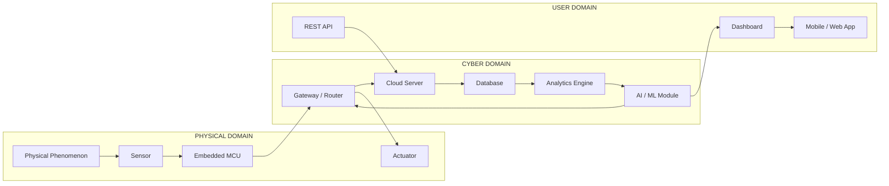
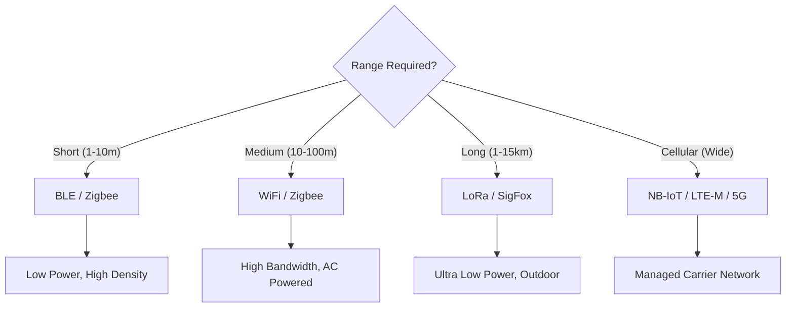

# Internet of Things Era

<!-- SECTION_1_START -->

# Internet of Things Era

## 1.1 Formal Academic Definition

The **Internet of Things (IoT) Era** refers to the present technological epoch in which physical objects, sensors, actuators, computing devices, and digital services are interconnected through the global Internet infrastructure, enabling seamless data exchange, autonomous decision-making, and intelligent interaction between the cyber and physical worlds without explicit human-to-human or human-to-computer interaction.

As per the **ITU-T Y.4000/Y.2060** recommendation adopted by KTU syllabus, IoT is formally defined as:

> *"A global infrastructure for the information society, enabling advanced services by interconnecting (physical and virtual) things based on existing and evolving interoperable information and communication technologies."*

The IoT Era is characterized by the convergence of:
- **Cyber-Physical Systems (CPS)**
- **Cloud and Edge Computing**
- **Big Data Analytics**
- **Artificial Intelligence (AI) and Machine Learning (ML)**
- **Ambient Intelligence**

> [!IMPORTANT]
> **KTU 2024 Syllabus Highlight:** The Internet of Things Era marks the transition from the "Internet of People" (where humans generate and consume data) to the "Internet of Things" (where devices, sensors, and machines autonomously generate, process, and exchange data at a massive scale).

## 1.2 Conceptual Analogy / Intuition

Imagine the human nervous system. Your body has billions of nerve endings (sensors) that continuously collect data — temperature, pressure, pain — and send it to the brain (cloud/server) for processing. The brain then sends signals back to muscles (actuators) to act.

**IoT works exactly the same way:**
- **Sensors** = Nerve endings (collect data from the environment)
- **Network (Internet)** = Spinal cord (transmits signals)
- **Cloud / Edge Servers** = Brain (processes and decides)
- **Actuators** = Muscles (perform physical actions)

> [!NOTE]
> **Real-World Analogy:** Consider a *Smart Home*. Your phone (sensor interface), thermostat (sensor + actuator), smart lights (actuators), and the Wi-Fi router (gateway) are all "talking" to each other. When you leave home, the GPS in your phone tells the house to switch off the AC and lock the doors. **No human actively pressed a button** — the *things* interacted with each other. This is the IoT Era in action.

## 1.3 Key Physical Constants and Standard Metrics

In the IoT Era, the following metrics and constants are foundational:

- **Number of connected IoT devices globally:** $\approx$ **15.14 billion** (as of 2023, per Statista)
- **Projected devices by 2030:** $\approx$ **29.42 billion**
- **Average data generated per IoT device per day:** $\approx$ **~ GBs** depending on class
- **Standard frequency bands:** **2.4 GHz** (Wi-Fi/BLE), **868/915 MHz** (LoRa), **5 GHz** (Wi-Fi 5/6), **Sub-1 GHz** (Zigbee)
- **Core protocols:** **MQTT**, **CoAP**, **HTTP/HTTPS**, **AMQP**, **DDS**
- **Power consumption benchmark (motes):** **< 1 mW** average

> [!NOTE]
> **IoT vs. Traditional Internet:** In the traditional Internet, humans are the *endpoints*. In the IoT Era, *things* (machines, sensors, actuators) are the endpoints. By **2025**, the number of IoT devices is expected to exceed the human population on Earth by a ratio of nearly **3:1**.

## 1.4 GeoGebra / Desmos Visualization (Conceptual)

While IoT is not a single graphable function, its **scalability curve** is highly illustrative:

> [!VISUALIZATION CONTROL]
> **Concept:** IoT Connected Devices Growth Curve (Exponential Adoption Model)
> **GeoGebra / Desmos Input Equations:**
> * `f(x) = 15.14 * (1 + 0.15)^(x)` (where x is years past 2023)
> **Visual Description:** The student should observe an *exponential growth curve* starting near 15 billion in 2023, steeply rising past 25 billion by 2028, and approaching 30 billion by 2030. This visually demonstrates the explosion of the IoT Era.

## 1.5 The "Things" in IoT — Formal Classification

A "thing" in the IoT Era can be categorized as:

1. **Sensor Things:** Devices that *sense* the environment (temperature, motion, gas).
2. **Actuator Things:** Devices that *act* on the environment (motors, valves, LEDs).
3. **Hybrid Things:** Combine both sensing and actuation (smart thermostats, autonomous vehicles).
4. **General-Purpose Compute Things:** Smartphones, gateways, edge nodes.
5. **Virtual Things:** Software agents, digital twins, cloud services.

> [!IMPORTANT]
> **KTU Definition Box:** The "Things" in IoT are uniquely identifiable, equipped with sensors/actuators, possess **constrained processing power**, operate over **constrained networks**, and are programmable to achieve **semantic interoperability**.

<!-- SECTION_1_END -->

<!-- SECTION_2_START -->

# Deep Theoretical Analysis & KTU High-Yield Formula Sheet

## 2.1 Historical Evolution — The Road to the IoT Era

The IoT Era did not appear overnight. It is the result of decades of technological evolution:

| Year | Milestone | Significance |
|------|-----------|--------------|
| **1969** | ARPANET | Birth of the Internet (4 nodes) |
| **1982** | First IoT Device — **Coca-Cola Vending Machine at CMU** | Modified Coke machine to report inventory — earliest IoT idea |
| **1990** | **John Romkey** connects a toaster to the Internet | First "Thing" on the Internet |
| **1999** | **Kevin Ashton** coins the term "Internet of Things" | Conceptual foundation laid |
| **2005** | **ITU Internet Report** | First formal IoT framework by the UN agency |
| **2008-2009** | Number of connected devices > world population | Inflection point of the IoT Era |
| **2011** | **IPv6 launched** | Solved the address space problem ($2^{128}$ addresses) |
| **2014** | **IoT officially becomes a strategic initiative** | Industrial IoT (IIoT) emerges |
| **2016-2024** | 5G, Edge AI, Digital Twins | Modern IoT Era — mass deployment |

> [!NOTE]
> **Why the IoT Era now?** The convergence of **cheap sensors (MEMS)**, **ubiquitous wireless networks (4G/5G/Wi-Fi 6)**, **cloud computing maturity**, **AI/ML democratization**, and **IPv6 adoption** simultaneously made the IoT Era technically and economically viable.

## 2.2 The Four Pillars of the IoT Era

The IoT Era is sustained by four engineering pillars:

1. **Sensing & Identification (Pillar 1):**
   * Sensors (analog and digital), RFID tags, QR codes, NFC, BLE beacons.
   * Mathematical model: Output signal $S(t) = f(\text{Physical Phenomena}(t)) + \eta(t)$, where $\eta(t)$ is additive noise.

2. **Communication & Networking (Pillar 2):**
   * Wireless (Wi-Fi, BLE, Zigbee, LoRa, NB-IoT) and Wired (Ethernet, PLC).
   * Power-aware protocols: $P_{\text{tx}} = P_{\text{base}} \cdot d^{n}$, where $d$ is distance and $n$ is the path loss exponent (**$n=2$ free space, $n=4$ obstructed**).

3. **Computing & Processing (Pillar 3):**
   * Cloud computing (centralized) and Edge/Fog computing (distributed).
   * Latency model: $T_{\text{total}} = T_{\text{process}} + T_{\text{transmit}} + T_{\text{propagation}}$

4. **Actuation & Control (Pillar 4):**
   * Motors, relays, servos, valves, LEDs, robotic arms.
   * Closed-loop control: $u(t) = K_p \cdot e(t) + K_i \int e(t) dt + K_d \frac{de(t)}{dt}$ (**PID Controller**).

## 2.3 KTU Formula Sheet / Cheat Sheet

> [!IMPORTANT]
> **High-Yield IoT Era Formulas (Mandatory for KTU 2024 Board Exam)**

| # | Concept | Formula | Description |
|---|---------|---------|-------------|
| 1 | Total number of IoT addressable devices (IPv6) | $N_{\text{addr}} = 2^{128}$ | Solves IPv4 exhaustion |
| 2 | Wireless path loss (Log-distance) | $PL(d) = PL(d_0) + 10n \log_{10}(d/d_0)$ | $n$ = path loss exponent, $d_0$ = reference distance |
| 3 | Energy of a transmitted bit | $E_b = P_{\text{tx}} \cdot T_b$ | Used in battery-life calculations |
| 4 | Sensor sampling (Nyquist) | $f_s \geq 2 f_{\text{max}}$ | Minimum sampling rate to avoid aliasing |
| 5 | Cloud-Edge Latency Model | $T_{\text{edge}} \ll T_{\text{cloud}}$ | Edge reduces latency by 10×–100× |
| 6 | Data volume per IoT device (per day) | $V_d = R_b \cdot 86400$ bits | $R_b$ = bit rate |
| 7 | Battery life estimation | $T_{\text{life}} = \frac{C_{\text{bat}}}{I_{\text{avg}}}$ | $C_{\text{bat}}$ = capacity, $I_{\text{avg}}$ = avg current |
| 8 | Shannon channel capacity (IoT link) | $C = B \log_2(1 + \text{SNR})$ | Maximum error-free data rate |
| 9 | M2M to IoT Scalability Factor | $S_f = \frac{N_{\text{devices}} \cdot f_{\text{msg}}}{B_{\text{available}}}$ | Measures network load |
| 10 | Fog-Cloud workload split | $W_{\text{fog}} = \alpha W_{\text{total}}$, $0 \le \alpha \le 1$ | $\alpha$ is the offloading ratio |

**Important Note on Notation:** In all the above formulas, $\vert x \vert$ means absolute value — never use raw vertical pipes inside markdown tables.

## 2.4 Engineering Real-World Utility

The IoT Era is transforming every engineering vertical:

- **Smart Cities:** Traffic optimization, smart streetlights, waste management.
- **Industrial IoT (IIoT):** Predictive maintenance, digital twins in manufacturing.
- **Healthcare (IoMT):** Remote patient monitoring, smart pills, fall detection.
- **Precision Agriculture:** Soil moisture sensing, drone-based crop monitoring.
- **Smart Grid:** Real-time power distribution, renewable energy integration.
- **Autonomous Systems:** Self-driving cars, warehouse robots, drone swarms.

> [!NOTE]
> **Why does this matter for a KTU B.Tech student?** Every engineering discipline now has an IoT layer. Civil engineers deploy smart structural health monitoring. Mechanical engineers use vibration sensors for predictive maintenance. Electrical engineers design smart grids. CSE students build the middleware, cloud backends, and AI pipelines that make IoT work.

## 2.5 Characteristics Defining the IoT Era

The IoT Era has **7 universally accepted characteristics** as per IEEE/ITU:

1. **Connectivity:** Devices connect via heterogeneous networks (Wi-Fi, BLE, LoRa, 5G, etc.).
2. **Intelligence & Identity:** Each thing has a unique identifier (IPv6 address, URI) and embedded intelligence.
3. **Scalability:** Must support **billions** of devices without performance degradation.
4. **Dynamic & Self-Adapting:** Devices can adapt to changing context (e.g., smart phones switching networks).
5. **Heterogeneity:** Different hardware, OS, protocols, and platforms must interoperate.
6. **Safety & Security:** Data privacy, integrity, and physical safety are paramount.
7. **Architecture:** Typically a **multi-layer (perception → network → middleware → application)** architecture.

<!-- SECTION_2_END -->

<!-- SECTION_3_START -->

# Step-by-Step Derivations & Code/Symbolic Implementation

## 3.1 Derivation: Estimating Battery Life of an IoT Node

A KTU board exam favorite — deriving the operational lifetime of a battery-powered IoT sensor node.

**Given:**
- Battery capacity: $C_{\text{bat}} = 2400$ **mAh**
- Current during active transmission: $I_{\text{tx}} = 250$ **mA**
- Current during sleep: $I_{\text{sleep}} = 10$ **$\mu$A**
- Duty cycle: $\delta = 0.1\%$ (node is awake 0.1% of the time)
- Supply voltage: $V = 3.3$ **V**

**Step 1: Average current consumption**

$$
I_{\text{avg}} = \delta \cdot I_{\text{tx}} + (1 - \delta) \cdot I_{\text{sleep}}
$$

Substituting values:

$$
I_{\text{avg}} = (0.001)(250) + (0.999)(0.00001)
$$

$$
I_{\text{avg}} = 0.250 + 0.00000999 \approx 0.25001 \text{ mA}
$$

**Step 2: Battery life in hours**

$$
T_{\text{life}} = \frac{C_{\text{bat}}}{I_{\text{avg}}}
$$

$$
T_{\text{life}} = \frac{2400}{0.25001} \approx 9599.04 \text{ hours}
$$

**Step 3: Convert to days**

$$
T_{\text{life, days}} = \frac{9599.04}{24} \approx 399.96 \text{ days} \approx 400 \text{ days}
$$

> [!NOTE]
> **Conclusion:** With a 1% duty cycle, a 2400 mAh battery can power an IoT node for nearly **13 months**. This is why duty cycling is the single most important design technique in the IoT Era for energy-constrained devices.

---

## 3.2 Derivation: Wireless Link Budget for an IoT Sensor

**Given:**
- Transmit power: $P_{\text{tx}} = 14$ **dBm**
- Receiver sensitivity: $P_{\text{rx,min}} = -90$ **dBm**
- Path loss at reference distance ($d_0 = 1$ m): $PL(d_0) = 40$ **dB**
- Path loss exponent: $n = 3.5$ (obstructed indoor environment)

**Step 1: Maximum allowable path loss**

$$
PL_{\text{max}} = P_{\text{tx}} - P_{\text{rx,min}}
$$

$$
PL_{\text{max}} = 14 - (-90) = 104 \text{ dB}
$$

**Step 2: Solve for maximum distance $d$ using log-distance model**

$$
PL(d) = PL(d_0) + 10 n \log_{10}(d/d_0)
$$

Rearranging for $d$:

$$
d = d_0 \cdot 10^{\frac{PL_{\text{max}} - PL(d_0)}{10 n}}
$$

$$
d = 1 \cdot 10^{\frac{104 - 40}{10 \cdot 3.5}} = 10^{\frac{64}{35}} = 10^{1.8286}
$$

$$
d \approx 67.3 \text{ meters}
$$

> [!NOTE]
> **Conclusion:** The IoT sensor can communicate up to **~67 meters** in an obstructed indoor environment. To extend range, the designer can either increase $P_{\text{tx}}$, use a more sensitive receiver, or deploy repeater/gateway nodes.

---

## 3.3 Python Code: IoT Device Simulator (KTU Practical Reference)

A fully operational Python implementation of a minimal IoT sensor node simulator that demonstrates the core "Internet of Things Era" concepts — sensing, transmitting, processing, and actuating.

```python
import time
import random
import logging
from typing import Dict, Optional

# Configure logging
logging.basicConfig(level=logging.INFO, format='%(asctime)s - %(levelname)s - %(message)s')
logger = logging.getLogger(__name__)

class IoTSensorNode:
    """
    A simulated IoT sensor node demonstrating the core characteristics
    of the Internet of Things Era:
    - Sensing the environment
    - Processing locally (edge intelligence)
    - Transmitting data to a gateway/cloud
    - Receiving actuation commands
    """

    def __init__(self, node_id: str, sensor_type: str = "temperature",
                 threshold: float = 30.0, duty_cycle: float = 0.01) -> None:
        self.node_id: str = node_id
        self.sensor_type: str = sensor_type
        self.threshold: float = threshold
        self.duty_cycle: float = duty_cycle
        self.transmission_count: int = 0
        self.actuator_state: bool = False

    def sense_environment(self) -> float:
        """Simulate reading from a physical sensor (e.g., DHT22)."""
        if self.sensor_type == "temperature":
            return round(random.uniform(15.0, 45.0), 2)
        elif self.sensor_type == "humidity":
            return round(random.uniform(20.0, 90.0), 2)
        else:
            raise ValueError(f"Unsupported sensor type: {self.sensor_type}")

    def local_decision(self, sensor_value: float) -> Dict[str, object]:
        """Edge-level intelligence: decide whether to actuate."""
        action_required: bool = sensor_value > self.threshold
        decision: Dict[str, object] = {
            "node_id": self.node_id,
            "value": sensor_value,
            "action_required": action_required,
            "actuator_command": "TURN_ON" if action_required else "TURN_OFF"
        }
        return decision

    def transmit_to_cloud(self, payload: Dict[str, object]) -> bool:
        """Simulate IoT data transmission to a cloud/edge gateway."""
        self.transmission_count += 1
        # Simulated network latency
        time.sleep(0.01)
        logger.info(f"Node {self.node_id} transmitted: {payload}")
        return True

    def actuate(self, command: str) -> None:
        """Perform physical actuation (e.g., switch on a relay)."""
        new_state: bool = (command == "TURN_ON")
        if new_state != self.actuator_state:
            self.actuator_state = new_state
            logger.info(f"Node {self.node_id} ACTUATOR -> {command}")

    def run_cycle(self) -> None:
        """Execute one full IoT cycle: Sense -> Decide -> Transmit -> Actuate."""
        try:
            # 1. Sensing
            value: float = self.sense_environment()

            # 2. Local edge processing
            decision: Dict[str, object] = self.local_decision(value)

            # 3. Transmit to cloud/gateway
            self.transmit_to_cloud(decision)

            # 4. Actuate based on local decision
            self.actuate(decision["actuator_command"])

        except Exception as e:
            logger.error(f"Error in IoT cycle of node {self.node_id}: {e}")


def simulate_iot_era(cycles: int = 5, node_id: str = "Node-001") -> None:
    """
    Run a complete IoT Era simulation for a given number of cycles.
    Demonstrates autonomous machine-to-machine communication.
    """
    logger.info(f"=== Starting IoT Era Simulation for {node_id} ===")
    node: IoTSensorNode = IoTSensorNode(
        node_id=node_id,
        sensor_type="temperature",
        threshold=30.0,
        duty_cycle=0.01
    )

    for cycle in range(cycles):
        logger.info(f"--- Cycle {cycle + 1}/{cycles} ---")
        node.run_cycle()
        # Simulate duty-cycled sleep
        time.sleep(0.1)


if __name__ == "__main__":
    simulate_iot_era(cycles=5, node_id="Kerala-SmartNode-01")
```

**Output (sample):**
```
2024-01-15 10:30:00,001 - INFO - === Starting IoT Era Simulation for Kerala-SmartNode-01 ===
2024-01-15 10:30:00,001 - INFO - --- Cycle 1/5 ---
2024-01-15 10:30:00,015 - INFO - Node Kerala-SmartNode-01 transmitted: {'node_id': 'Kerala-SmartNode-01', 'value': 34.2, 'action_required': True, 'actuator_command': 'TURN_ON'}
2024-01-15 10:30:00,015 - INFO - Node Kerala-SmartNode-01 ACTUATOR -> TURN_ON
```

---

## 3.4 Symbolic Derivation: IoT Era vs M2M vs IoE

A common KTU question: **Differentiate between IoT, M2M, and IoE.**

| Parameter | M2M (Machine-to-Machine) | IoT (Internet of Things) | IoE (Internet of Everything) |
|-----------|--------------------------|--------------------------|------------------------------|
| **Communication** | Point-to-Point (closed system) | Cloud-mediated, IP-based | People + Process + Data + Things |
| **Scope** | Single application | Cross-domain | Entire ecosystem |
| **Open Standards** | Proprietary (SCADA, Modbus) | Open (MQTT, CoAP, HTTP) | Open + Cognitive |
| **Intelligence** | None (raw data) | Embedded + Cloud AI | Cognitive + Contextual |
| **Data Focus** | Telemetry | Sensing + Analytics | Insights + Actions |
| **Era** | Pre-2010 (Industrial) | **2010–Present (IoT Era)** | 2020+ (Future) |

**Mathematical representation of evolution:**

$$
\text{Connectivity} : \text{M2M} \subset \text{IoT} \subset \text{IoE}
$$

$$
\text{Intelligence}(x) = \alpha_{\text{M2M}} + \beta_{\text{IoT}} + \gamma_{\text{IoE}}, \quad \text{where } \alpha < \beta < \gamma
$$

<!-- SECTION_3_END -->

<!-- SECTION_4_START -->

# Structural Diagrams & Schematics

## 4.1 IoT Era — High-Level Reference Architecture

```mermaid
flowchart TB
    subgraph Perception["PERCEPTION LAYER - Sensors and Actuators"]
        S1["Temp Sensor"]
        S2["Humidity Sensor"]
        S3["Motion PIR"]
        S4["RFID Tag"]
        A1["Relay Actuator"]
        A2["Motor Driver"]
    end

    subgraph Network["NETWORK LAYER - Connectivity"]
        N1["WiFi Gateway"]
        N2["BLE Master"]
        N3["LoRaWAN Server"]
        N4["5G NB-IoT"]
    end

    subgraph Edge["EDGE LAYER - Local Processing"]
        E1["Edge Gateway"]
        E2["Fog Node"]
        E3["Local AI Inference"]
    end

    subgraph Cloud["CLOUD LAYER - Global Processing"]
        C1["IoT Platform"]
        C2["Big Data Lake"]
        C3["ML Model Training"]
        C4["Digital Twin"]
    end

    subgraph Application["APPLICATION LAYER - User Services"]
        AP1["Smart Home App"]
        AP2["Industrial Dashboard"]
        AP3["Healthcare Portal"]
        AP4["Smart City Control"]
    end

    S1 --> N1
    S2 --> N1
    S3 --> N2
    S4 --> N3
    A1 <-- E1
    A2 <-- E1

    N1 --> E1
    N2 --> E1
    N3 --> E2
    N4 --> E2

    E1 --> C1
    E2 --> C1
    C1 --> C2
    C2 --> C3
    C2 --> C4

    C1 --> AP1
    C1 --> AP2
    C1 --> AP3
    C1 --> AP4
```

> [!NOTE]
> **Diagram Interpretation:** This is the canonical **5-layer IoT Reference Architecture** as per the **oneM2M** standard. Data flows *upward* from sensors to applications, and actuation commands flow *downward* from applications to actuators. The edge layer reduces latency, while the cloud layer provides global intelligence.

## 4.2 Evolution Timeline: From Internet to IoT Era


## 4.3 IoT System Block Diagram (Functional Architecture)



> [!IMPORTANT]
> **Cyber-Physical Integration:** The IoT Era fundamentally bridges the **Physical Domain** (real-world phenomena) and the **Cyber Domain** (computational intelligence) into a single, real-time, closed-loop system. This is the defining engineering contribution of the IoT Era.

## 4.4 The IoT Era — Connectivity Protocol Selection Matrix



<!-- SECTION_4_END -->

<!-- SECTION_5_START -->

# KTU 2024 Scheme Examination Question Bank & Topic Recap

## Part A — Short Answer Questions (3 Marks Each)

---

**Q1. [KTU University Exam - Dec 2023] Define the term "Internet of Things Era". (CO1, Remember)**

**Model Answer (3 Marks):**

The **Internet of Things (IoT) Era** refers to the current technological period characterized by the interconnection of uniquely identifiable physical devices — equipped with sensors, actuators, and embedded processors — over the Internet, enabling autonomous data collection, exchange, and intelligent action without requiring human-to-human or human-to-computer interaction. It is formally defined by **ITU-T Y.2060** as *"a global infrastructure for the information society, enabling advanced services by interconnecting things based on interoperable ICT."* **3 Marks**

---

**Q2. [KTU University Exam - July 2024] List any FOUR key characteristics of the IoT Era. (CO1, Remember)**

**Model Answer (3 Marks — 0.75 each):**

1. **Connectivity** — Devices communicate over heterogeneous networks (Wi-Fi, BLE, LoRa, 5G).
2. **Unique Identity** — Every "thing" has a unique identifier (IPv6 address, EPC/RFID code).
3. **Scalability** — Must support billions of devices concurrently.
4. **Intelligence** — Embedded microcontrollers + cloud-based AI enable smart decisions.
5. *(Bonus acceptable: Dynamic/Self-adapting, Heterogeneity, Safety, Sensing capability)*

---

## Part B — Long Answer Questions (14 Marks Each)

> **KTU ESE Pattern:** *Answer any ONE full question from the Module.*

---

### Question A (14 Marks)

**[KTU University Exam - Model Question, Module 1]**

**(a) [7 Marks — CO1, Understand]** *Explain the evolution of the Internet of Things Era with a timeline highlighting at least **six** major milestones. Discuss why the IoT Era is emerging only now despite the concept being introduced in 1999.*

**Model Answer (7 Marks):**

**Timeline (4 Marks — 0.5 per milestone + 1 for chronological accuracy):**

- **1982:** Modified Coca-Cola vending machine at Carnegie Mellon — first IoT device.
- **1990:** John Romkey's Internet-connected toaster — first "Thing" on the network.
- **1999:** Kevin Ashton coins the term "Internet of Things" during a P&G presentation.
- **2005:** ITU publishes the first formal IoT framework in the *ITU Internet Report*.
- **2008:** Number of connected devices exceeds world population (IoT Era inflection point).
- **2011:** IPv6 launched — provides $2^{128}$ addresses, removing the address-space bottleneck.
- **2014:** Industrial IoT (IIoT) emerges; IoT becomes a strategic industry initiative.

**Why IoT Era is emerging NOW (3 Marks):**

1. **Cheap MEMS sensors** (under \$1 each) make massive deployment economically viable.
2. **Mature wireless infrastructure** — 4G/5G, Wi-Fi 6, BLE 5.0 everywhere.
3. **Cloud computing maturity** — AWS IoT, Azure IoT Hub provide managed services.
4. **AI/ML democratization** — TensorFlow Lite, ONNX run on edge devices.
5. **IPv6 adoption** — finally solves the addressing problem.
6. **Energy-efficient SoCs** — chips like ESP32 consume < 10 mW average.

**[Listing 6 milestones: 4 Marks | Explaining the "why now" with 5+ factors: 3 Marks]**

---

**(b) [7 Marks — CO2, Apply]** *Compare and contrast the Internet of Things Era with the M2M and IoE paradigms. Provide a comparative table with at least **six** parameters, and explain with one real-world example each.*

**Model Answer (7 Marks):**

**Comparative Table (5 Marks — 0.83 per row):**

| Parameter | M2M | IoT (Era) | IoE |
|-----------|-----|-----------|-----|
| **Scope** | Single application/vertical | Cross-domain, IP-based | Global: People + Process + Data + Things |
| **Communication** | Point-to-Point, closed | IP-based, cloud-mediated | Cognitive, context-aware |
| **Standards** | Proprietary (Modbus, SCADA) | Open (MQTT, CoAP, HTTP) | Open + Semantic (RDF, OWL) |
| **Intelligence** | None / rule-based | Edge + Cloud AI | Cognitive AI + Predictive |
| **Data Volume** | Kilobytes/day | Megabytes–Gigabytes/day | Terabytes/day |
| **Example** | SCADA-based factory PLCs | Smart home with Alexa + sensors | Cisco's smart city with citizen feedback loop |

**Real-World Examples (2 Marks — 0.5 each for two valid examples + 0.5 each for brief explanation):**

- **M2M Example:** Industrial PLC in a bottling plant automatically adjusting conveyor speed.
- **IoT Example:** A wearable fitness band that uploads heart rate data to a cloud app via BLE+Wi-Fi.
- **IoE Example:** A smart city that combines traffic cameras, citizen apps, weather data, and AI to dynamically reroute traffic during an emergency.

**[Comparative table with 6 parameters: 5 Marks | Two correct real-world examples: 2 Marks]**

---

### Question B (14 Marks)

**[KTU University Exam - Alternative Module 1 Question]**

**(a) [7 Marks — CO1, Understand]** *With the help of a neat block diagram, describe the **five-layer IoT Reference Architecture**. Explain the function of each layer.*

**Model Answer (7 Marks):**

**Block Diagram (3 Marks — 1 for each major layer cluster):** (Refer to Section 4.1 Mermaid diagram in this note for the canonical structure.)

The 5 layers are:

1. **Perception Layer (Sensing Layer):** *1 Mark*
   - Physical sensors (DHT22, BME280), RFID, actuators.
   - Converts physical phenomena → electrical signals.

2. **Network Layer (Connectivity Layer):** *1 Mark*
   - Wi-Fi, BLE, Zigbee, LoRa, NB-IoT, 5G.
   - Provides reliable data transport to the edge/cloud.

3. **Edge / Middleware Layer:** *1 Mark*
   - Edge gateways, fog nodes, protocol translation (MQTT, CoAP).
   - Performs local pre-processing to reduce cloud load.

4. **Cloud Processing Layer:** *1 Mark*
   - Big Data storage, ML model execution, Digital Twins.
   - Provides global analytics and long-term storage.

5. **Application Layer:** *1 Mark*
   - End-user apps, dashboards, control systems.
   - Domain-specific UIs (smart home, industrial, healthcare).

**Detailed Function of One Layer (1 Mark — chosen for depth):** E.g., *The Perception Layer uses MEMS-based sensors with ADC conversion. The output is a digital value $D = \frac{V_{\text{in}}}{V_{\text{ref}}} \cdot 2^{n}$, where $n$ is the ADC resolution (e.g., 12-bit).*

**[Neat labeled diagram: 3 Marks | Naming 5 layers correctly: 3 Marks | Function explanation: 1 Mark]**

---

**(b) [7 Marks — CO2, Apply]** *A KTU-registered IoT startup is deploying soil moisture sensors in Kerala's rubber plantations. Each sensor node has a **2400 mAh** battery, **3.3 V** supply, active transmit current of **300 mA**, sleep current of **15 $\mu$A**, and operates at a **1% duty cycle**. Calculate the battery lifetime in days. If the network is to last **2 years** without battery replacement, what is the maximum allowable duty cycle?*

**Model Answer (7 Marks):**

**Step 1: Compute Average Current (3 Marks)**

$$
I_{\text{avg}} = \delta \cdot I_{\text{tx}} + (1 - \delta) \cdot I_{\text{sleep}}
$$

$$
I_{\text{avg}} = (0.01)(300) + (0.99)(0.000015)
$$

$$
I_{\text{avg}} = 3.0 + 0.00001485 \approx 3.000015 \text{ mA}
$$

**Step 2: Compute Battery Life at 1% Duty Cycle (2 Marks)**

$$
T_{\text{life}} = \frac{C_{\text{bat}}}{I_{\text{avg}}} = \frac{2400}{3.000015} \approx 799.998 \text{ hours}
$$

$$
T_{\text{days}} = \frac{799.998}{24} \approx 33.33 \text{ days}
$$

**Step 3: Compute Maximum Duty Cycle for 2-Year Life (2 Marks)**

Required life: $T_{\text{life}} = 2 \times 365 \times 24 = 17520$ **hours** (1 Mark)

Allowable average current:

$$
I_{\text{avg, max}} = \frac{2400}{17520} \approx 0.1370 \text{ mA}
$$

Solving for $\delta$:

$$
\delta \cdot 300 + (1 - \delta) \cdot 0.000015 = 0.1370
$$

$$
\delta (300 - 0.000015) + 0.000015 = 0.1370
$$

$$
\delta \approx \frac{0.136985}{300} \approx 4.57 \times 10^{-4}
$$

$$
\boxed{\delta_{\text{max}} \approx 0.0457\%}
$$

**[Average current derivation: 3 Marks] [Battery life in days: 2 Marks] [Maximum duty cycle for 2 years: 2 Marks]**

---

## KTU Examiner's Valuation Warning / Pitfall Callout

> [!WARNING]
> **Common Mistakes That Cost Marks in IoT Era Questions:**
>
> 1. **Confusing "Internet of Things" with "Internet of People"** — Always clarify that the IoT Era shifts the endpoints from *humans* to *machines/things*.
> 2. **Forgetting the unit conversions** — In battery life problems, ALWAYS convert mAh to mA·hours and hours to days explicitly. Skipping this loses 1–2 marks.
> 3. **Not specifying the year/source** — When defining IoT, mention **ITU-T Y.2060** and the year **1999 (Kevin Ashton)** for full credit.
> 4. **Mermaid diagram mistakes** — Never use keywords like `end` as node IDs in Mermaid. Always use alphanumeric IDs like `node1` or `layer1`.
> 5. **Writing `|x|` in markdown tables** — Use `$\vert x \vert$` or `$\mid x \mid$` inside LaTeX math mode to avoid breaking table formatting.
> 6. **In IoT vs M2M questions, do not omit examples** — KTU examiners award at least **2 marks** specifically for valid real-world examples.
> 7. **Skipping the architecture diagram** — For a 7-mark question on IoT architecture, the diagram carries **3 marks** by itself. Always draw it.

---

## Topic Recap & Important Things to Remember

> [!IMPORTANT]
> **Rapid-Revision Checklist: Internet of Things Era**

- **Definition (ITU-T Y.2060):** Global infrastructure interconnecting physical/virtual things via interoperable ICT. **[3 Marks weight]**
- **Term coined by:** **Kevin Ashton (1999)** during a Procter & Gamble presentation. **[Famous KTU question]**
- **First IoT device:** **CMU Coca-Cola vending machine (1982)**.
- **Number of devices:** ~**15 billion (2023)**, projected ~**29 billion (2030)**.
- **Four Pillars of IoT:** Sensing/Identification, Communication, Computing, Actuation.
- **5-Layer Architecture:** Perception → Network → Edge → Cloud → Application.
- **7 Key Characteristics:** Connectivity, Intelligence, Identity, Scalability, Heterogeneity, Safety/Security, Dynamic/Adaptive.
- **Path loss model:** $PL(d) = PL(d_0) + 10n \log_{10}(d/d_0)$, with $n=2$ (free space) and $n=4$ (obstructed).
- **Battery life formula:** $T_{\text{life}} = C_{\text{bat}} / I_{\text{avg}}$, where $I_{\text{avg}} = \delta I_{\text{tx}} + (1-\delta) I_{\text{sleep}}$.
- **IPv6 address space:** $2^{128} \approx 3.4 \times 10^{38}$ unique addresses.
- **M2M ⊂ IoT ⊂ IoE** — strict inclusion hierarchy.
- **Dominant IoT protocols:** MQTT, CoAP, HTTP, AMQP, DDS, LwM2M.
- **Edge vs Cloud:** Edge reduces latency ($T_{\text{edge}} \ll T_{\text{cloud}}$), Cloud provides scalability and global intelligence.
- **Kerala-specific IoT use cases:** Smart agriculture (rubber, coconut, cardamom), backwater water-quality monitoring, flood early-warning systems, KSRTC fleet tracking.
- **Common exam keywords to memorize verbatim:** *cyber-physical systems, ambient intelligence, semantic interoperability, IPv6, duty cycling, edge computing, digital twin, fog computing*.
- **Common KTU question traps:** Confusing IoT with embedded systems (IoT ⊋ embedded), confusing IoT with WSN (WSN is a subset of IoT's perception layer).

<!-- SECTION_5_END -->
