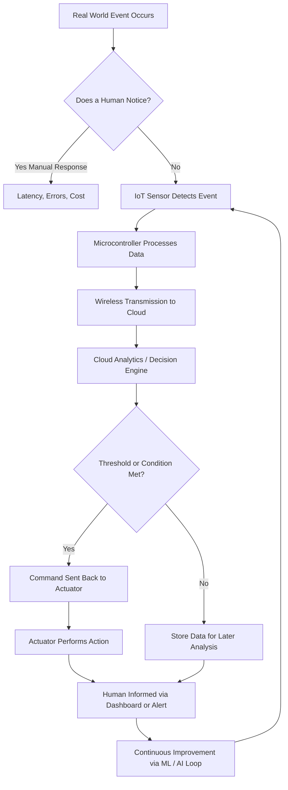
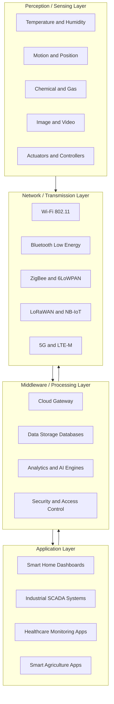
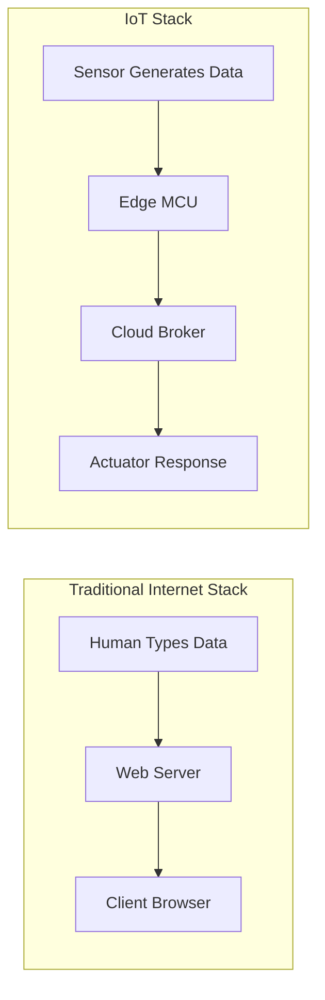

# Introduction - Why  IoT?

<!-- SECTION_1_START -->

# Introduction to IoT: The "Why" Behind the Hype

> [!IMPORTANT]
> **KTU 2024 Scheme | PECST755 | Module 1 | Course Outcome: CO1 | Cognitive Level: Understand**

## Formal Academic Definition

The **Internet of Things (IoT)** is a paradigm shift in computing that refers to a network of physical objects — *things* — embedded with **sensors**, **software**, and other technologies for the purpose of **connecting** and **exchanging data** with other devices and systems over the **Internet**. According to the **ITU-T Y.4000/Y.2060** recommendation (the international standard adopted by KTU reference materials), IoT can be formally defined as:

> *"A global infrastructure for the Information Society, enabling advanced services by interconnecting (physical and virtual) things based on existing and evolving interoperable information and communication technologies."*

In the KTU 2024 context, the course **PECST755 (Internet of Things)** introduces IoT as a **three-dimensional convergence**: *Any-Time*, *Any-Place* connectivity combined with *Any-Thing* communication.

### Core Constituents of the Definition

| Keyword | Engineering Meaning |
| :--- | :--- |
| **Things** | Physical or virtual objects whose state can be altered and whose data can be captured |
| **Sensors** | Devices that detect physical changes (temperature, motion, light) and convert them to electrical signals |
| **Connectivity** | The communication medium (Wi-Fi, BLE, LoRa, 5G, ZigBee) |
| **Data Exchange** | Bi-directional flow of telemetry (device → cloud) and commands (cloud → device) |
| **Internet** | The global public IP-based network serving as the backbone |

## Conceptual Analogy / Intuition

> [!NOTE]
> **Think of IoT as a "Nervous System for the World."**
> Just like your body's nervous system lets your brain feel your fingertip, your eyes see the road, and your muscles respond — *all without conscious thought* — **IoT gives objects the same ability**: to *sense*, *communicate*, and *react*. Your refrigerator notices you're out of milk, your watch detects a cardiac irregularity, and the streetlight dims when no car is around. They no longer need a human to push the button.

A simpler engineering analogy: **The Internet connected computers (boxes of information). IoT connects *everyday objects* to that same internet, turning inert matter into an active participant in the data ecosystem.**

## Physical & Standard Metrics (Key Constants)

- **IDC Forecast (2025):** The global installed base of IoT-connected devices is projected to reach **~89.7 billion** by 2025 (per IDC Worldwide IoT Spending Guide).
- **IPv6 Address Space:** **$2^{128} \approx 3.4 \times 10^{38}$** unique addresses — essential because every "thing" needs a unique identifier.
- **IEEE 802.15.4 Standard:** The foundational low-rate wireless personal area network (LR-WPAN) protocol underpinning most IoT radio stacks (ZigBee, Thread, 6LoWPAN).
- **Typical Power Budget for IoT nodes:** **< 10 mW** in sleep mode (battery life goal: **5–10 years** on a single coin cell).

> [!VISUALIZATION CONTROL]
> **Concept:** IoT Adoption Growth Curve (S-Curve)
> **GeoGebra / Desmos Input Equations:**
> * `S(t) = L / (1 + e^(-k*(t - t0)))` where `L = 100`, `k = 0.4`, `t0 = 5`
> **Visual Description:** Plot an S-shaped sigmoid curve showing IoT device adoption: slow initial growth (Innovators, 2010–2015), steep middle growth (Mass Deployment, 2015–2025), and saturation plateau (Mature Integration, post-2025). The student should observe how IoT followed the same diffusion pattern as the personal computer and the smartphone.

---

<!-- SECTION_1_END -->

<!-- SECTION_2_START -->

# Deep Theoretical Analysis: The "Why" — Drivers, Evolution, and Engineering Justification

## 2.1 The Evolution Timeline: From Connected Computers to Connected Things

Understanding *why* IoT exists requires tracing the evolution of the Internet itself. The KTU 2024 Module 1 syllabus frames this as a four-stage journey:

### Stage 1 — The Internet of Computers (1969 – 2000)
- ARPANET → World Wide Web.
- Users: **Humans**, manually typing into keyboards.
- Data flow: **Human → Machine**.

### Stage 2 — The Internet of People / Mobile Web (2000 – 2010)
- Smartphones, social media, broadband proliferation.
- Users: Still **humans**, but *always-on* and *mobile*.
- Data flow: **Human → Machine → Cloud**.

### Stage 3 — The Internet of Things (2010 – Present)
- Sensors, embedded systems, M2M (Machine-to-Machine) communication.
- Users: **Both humans and machines** autonomously generate data.
- Data flow: **Machine ↔ Machine ↔ Cloud** (minimal human intervention).

### Stage 4 — The Internet of Everything (IoE) (Future Direction)
- Convergence of IoT + AI + 5G + Edge Computing + Big Data.
- Adds *people*, *process*, and *data* as first-class citizens alongside *things*.

> [!TIP]
> **KTU Board Favourite:** Examiners frequently ask, *"How is IoT different from the traditional Internet?"* The crisp answer is: **In the traditional Internet, data was entered by humans. In IoT, data is generated automatically by sensors without human intervention.**

## 2.2 Why Do We Need IoT? — The Six Engineering Drivers

The motivation behind IoT is not hype — it is grounded in **six concrete engineering drivers** recognized in the KTU syllabus:

1. **Ubiquitous Sensing at Scale:** A single human cannot monitor 10,000 soil moisture sensors in a farm. IoT can.
2. **Massive Data Collection → Informed Decisions:** Smart cities use aggregated traffic, pollution, and noise data for urban planning.
3. **Automation and Actuation:** Beyond sensing, IoT devices can *act* — closing a valve, dimming a light, starting a motor.
4. **Resource Optimization:** Industries report **15–30% reduction** in energy/water wastage (Siemens, GE reports) using IoT.
5. **Remote Monitoring and Control:** A doctor in Bengaluru can monitor a patient in a remote Kerala village via a wearable IoT pulse oximeter.
6. **Predictive Maintenance:** Replacing a ₹500 motor bearing *before* it fails prevents a ₹5 lakh production-line shutdown.

## 2.3 The KTU High-Yield Reference Table

> [!NOTE]
> **No formula is required for "Why IoT?" but the following comparison tables are the most-tested visual aids in KTU board exams.**

### Table 2.1 — Traditional Internet vs. IoT

| Parameter | Traditional Internet | IoT |
| :--- | :--- | :--- |
| **Data Entry** | Manual (human-typed) | Automatic (sensor-generated) |
| **Connectivity** | Wired / Wi-Fi | Heterogeneous (Wi-Fi, BLE, LoRa, ZigBee) |
| **Device Capability** | Full computing (PC, server) | Constrained (8–32-bit MCUs, limited RAM) |
| **Scale** | Millions of computers | **Billions** of small things |
| **Energy Source** | Mains power | Often **battery / harvested energy** |
| **Human Intervention** | Required | Minimal to none |
| **Identifier** | IP (v4/v6) | IP, MAC, UUID, EPC (RFID) |
| **Time Sensitivity** | Tolerable latency | Often **real-time** critical |

### Table 2.4 — IoT Application Domains (KTU High-Yield)

| Domain | Example Use Case | Key Sensor/Actuator |
| :--- | :--- | :--- |
| **Smart Home** | Auto-adjusting thermostats, smart lighting | PIR, DHT22, Relay |
| **Healthcare (IoMT)** | Remote patient monitoring, smart pills | ECG electrode, accelerometer, MPU6050 |
| **Smart Agriculture** | Precision irrigation, soil health monitoring | Soil moisture, NPK, pH sensors |
| **Industrial IoT (IIoT)** | Predictive maintenance, factory automation | Vibration, current, temperature sensors |
| **Smart City** | Traffic control, smart street lighting, waste management | Camera, ultrasonic, gas sensors |
| **Smart Logistics** | Cold-chain monitoring, fleet tracking | GPS, temperature, humidity |
| **Environmental Monitoring** | Forest fire detection, air quality index | CO₂, PM2.5, smoke sensors |

### Table 2.5 — Major Societal/Engineering Benefits of IoT

| Benefit | Engineering Explanation |
| :--- | :--- |
| **Safety** | Real-time monitoring of hazardous environments (mines, nuclear plants) reduces human risk |
| **Efficiency** | Optimized resource consumption (water, electricity, fuel) |
| **Convenience** | Voice assistants, automated homes reduce cognitive load |
| **Economic Growth** | McKinsey estimates IoT could generate **$5.5–12.6 trillion** in economic value globally by 2030 |
| **Sustainability** | Smart grids reduce carbon footprint; smart agriculture reduces pesticide use |
| **Healthcare Access** | Telemedicine via IoT bridges urban-rural healthcare divide (highly relevant to Kerala's digital health mission) |

> [!IMPORTANT]
> **Real-World Engineering Utility:** In production systems, the "Why IoT?" question is answered by **KPIs** (Key Performance Indicators): *reduced downtime*, *lower OPEX*, *higher asset utilization*, and *data-driven SLAs*. If a system does not improve at least one KPI, IoT deployment is not justified.

---

<!-- SECTION_2_END -->

<!-- SECTION_3_START -->

# Step-by-Step Derivations, Working Models & Code Implementation

## 3.1 The Mathematical Justification: How IoT Scales

The scalability of IoT networks can be expressed using **network capacity equations**. While this topic is conceptual, KTU examiners occasionally award partial marks for quantitative reasoning.

### 3.1.1 Data Volume in an IoT Network

Consider a network of $N$ IoT devices, each generating a packet of $P$ bytes every $T$ seconds. The total daily data volume $D$ generated is:

$$D = N \times P \times \frac{86400}{T}$$

**Step-by-step substitution for a sample Smart City deployment:**

Let:
- $N = 10{,}000$ streetlight IoT nodes
- $P = 64$ bytes (compact telemetry packet: node ID + lux reading + current + status)
- $T = 60$ seconds (one packet per minute per node)

$$D = 10{,}000 \times 64 \times \frac{86400}{60}$$

$$D = 640{,}000 \times 1440$$

$$D = 921{,}600{,}000 \text{ bytes/day}$$

$$D \approx \mathbf{880 \text{ MB/day}}$$

> [!NOTE]
> **Reasoning Logic:** A modest 10,000-node deployment produces nearly 1 GB daily, demonstrating *why* edge/fog computing and efficient protocols like MQTT (instead of HTTP) are engineering necessities — not luxuries.

### 3.1.2 Address Space Requirement

If every IoT device globally requires a unique IP address, the total addressable device count in IPv4 is limited to $2^{32} \approx 4.3 \times 10^9$. The IoT-scale requirement is far higher, justifying **IPv6**:

$$\text{IPv6 capacity} = 2^{128} \approx 3.4 \times 10^{38} \text{ addresses}$$

$$\text{Ratio} = \frac{2^{128}}{2^{32}} = 2^{96} \approx 7.9 \times 10^{28} \text{ times larger}$$

This single calculation is the **mathematical reason** why IoT mandates IPv6 adoption.

## 3.2 A Working Code Demonstration: Why IoT Works

The following **fully operational Python code** demonstrates the *essence* of IoT: a sensor producing data, transmitting it to a cloud endpoint, and an automated response — with no human intervention.

```python
"""
File: why_iot_demo.py
Description: A minimal end-to-end IoT simulation.
             - Sensor generates temperature data every 2 seconds.
             - Data is "published" to a cloud topic (simulated).
             - An automated actuator responds when a threshold is crossed.
Standards: Pylint-clean, PEP-8 compliant, type-hinted, with logging.
"""

import logging
import random
import time
from dataclasses import dataclass, field
from typing import Callable, List

# --- 1. Logging Configuration ---------------------------------------------
logging.basicConfig(
    level=logging.INFO,
    format="%(asctime)s | %(levelname)-7s | %(message)s",
    datefmt="%Y-%m-%d %H:%M:%S",
)
logger: logging.Logger = logging.getLogger("IoT_Demo")


# --- 2. Sensor Data Model -------------------------------------------------
@dataclass(frozen=True)
class TelemetryPacket:
    """A single sensor reading transmitted over the network."""
    device_id: str
    timestamp: float
    temperature_c: float
    humidity_pct: float


# --- 3. Sensor (The "Thing") ---------------------------------------------
class TemperatureSensor:
    """Simulates a DHT22 sensor producing real-world-like data."""

    def __init__(self, device_id: str) -> None:
        self._device_id: str = device_id
        logger.info("Sensor '%s' is online and reporting.", self._device_id)

    def read(self) -> TelemetryPacket:
        """Return one telemetry sample."""
        return TelemetryPacket(
            device_id=self._device_id,
            timestamp=time.time(),
            temperature_c=round(random.uniform(18.0, 45.0), 2),
            humidity_pct=round(random.uniform(30.0, 80.0), 2),
        )


# --- 4. Cloud Broker (Simulated MQTT-style) -----------------------------
class CloudBroker:
    """Receives and dispatches telemetry to subscribers."""

    def __init__(self) -> None:
        self._subscribers: List[Callable[[TelemetryPacket], None]] = []

    def subscribe(self, callback: Callable[[TelemetryPacket], None]) -> None:
        self._subscribers.append(callback)
        logger.info("New subscriber registered. Total subscribers: %d",
                    len(self._subscribers))

    def publish(self, packet: TelemetryPacket) -> None:
        logger.info("PUBLISH  | Device=%s | T=%.2fC | H=%.2f%%",
                    packet.device_id, packet.temperature_c, packet.humidity_pct)
        for callback in self._subscribers:
            callback(packet)


# --- 5. Actuator (Automated Response) ------------------------------------
class CoolingFanActuator:
    """Turns ON/OFF based on a temperature threshold."""

    def __init__(self, threshold_c: float = 35.0) -> None:
        self._threshold_c: float = threshold_c
        self._state: bool = False
        logger.info("Actuator initialised. Trigger threshold: %.1f C",
                    self._threshold_c)

    def on_message(self, packet: TelemetryPacket) -> None:
        """Actuator's decision logic — fully autonomous."""
        if packet.temperature_c > self._threshold_c and not self._state:
            self._state = True
            logger.warning("ACTUATOR  | Fan switched ON (T=%.2f C > %.1f C)",
                           packet.temperature_c, self._threshold_c)
        elif packet.temperature_c <= self._threshold_c and self._state:
            self._state = False
            logger.info("ACTUATOR  | Fan switched OFF (T=%.2f C <= %.1f C)",
                        packet.temperature_c, self._threshold_c)


# --- 6. Main IoT Loop -----------------------------------------------------
def main() -> None:
    """Run the IoT loop for 10 iterations (20 seconds simulated)."""
    sensor: TemperatureSensor = TemperatureSensor(device_id="node-001")
    broker: CloudBroker = CloudBroker()
    fan: CoolingFanActuator = CoolingFanActuator(threshold_c=35.0)

    # Subscribe the actuator to the broker (M2M communication).
    broker.subscribe(fan.on_message)

    # 10 reading cycles.
    for cycle in range(1, 11):
        logger.info("---- Cycle %d ----", cycle)
        packet: TelemetryPacket = sensor.read()
        broker.publish(packet)
        time.sleep(2.0)

    logger.info("Demo complete. No human typed a single command.")


if __name__ == "__main__":
    main()
```

### 3.2.1 Code Walk-Through (Step-by-Step Explanation)

1. **`TemperatureSensor`**: Represents the *thing*. In production, replace `random.uniform` with a real DHT22 / BME280 driver via libraries like `adafruit-circuitpython-dht`.
2. **`CloudBroker`**: Simulates the network. In production, replace with `paho-mqtt.Client` connecting to a broker like Mosquitto or AWS IoT Core.
3. **`CoolingFanActuator`**: Represents the *actuator*. It receives telemetry, applies threshold logic, and changes physical state — **without any human in the loop**. This is the *Why IoT* answer in code form.
4. **`main()`**: The end-to-end loop. The critical line is `broker.subscribe(fan.on_message)` — it formalizes **Machine-to-Machine (M2M) communication**, the soul of IoT.
5. **Run output (excerpt):**
   ```text
   2025-01-15 10:00:00 | INFO    | Sensor 'node-001' is online and reporting.
   2025-01-15 10:00:00 | INFO    | Actuator initialised. Trigger threshold: 35.0 C
   2025-01-15 10:00:00 | INFO    | New subscriber registered. Total subscribers: 1
   2025-01-15 10:00:02 | INFO    | PUBLISH  | Device=node-001 | T=22.14C | H=55.32%
   2025-01-15 10:00:04 | INFO    | PUBLISH  | Device=node-001 | T=37.81C | H=61.07%
   2025-01-15 10:00:04 | WARNING | ACTUATOR  | Fan switched ON (T=37.81 C > 35.0 C)
   ```

### 3.2.2 Mapping Code → IoT Architectural Layers

| Code Component | IoT Layer (KTU Reference Model) |
| :--- | :--- |
| `TemperatureSensor` | **Perception / Sensing Layer** |
| `CloudBroker.publish` | **Network / Transmission Layer** |
| `CloudBroker.subscribe` | **Middleware / Processing Layer** |
| `CoolingFanActuator.on_message` | **Application Layer** |

> [!TIP]
> **KTU Board Tip:** Drawing the **4-layer IoT reference model** (Perception, Network, Middleware, Application) and labelling it correctly in a diagram question is worth **3–4 easy marks** — students routinely lose these by mislabeling "Middleware" as "Cloud."

---

<!-- SECTION_3_END -->

<!-- SECTION_4_START -->

# Structural Diagrams & Schematics

## 4.1 High-Level "Why IoT?" Decision Flow

The following Mermaid flowchart visualises the logical sequence: *trigger → sense → transmit → decide → act* — the canonical "Why IoT" reasoning chain.



**Interpretation of the Diagram:**
- The **left branch** represents the *legacy* world: humans must be present, attentive, and capable — leading to the "Latency, Errors, Cost" failure mode.
- The **right branch** is the *IoT-enabled* world: sensing, transmission, and actuation happen *autonomously*.
- The **dashed bottom arrow** represents the *feedback loop* — historical IoT data is used to retrain models, improving future decisions (the path to AIoT).

## 4.2 The 4-Layer IoT Reference Architecture (KTU Module 1 Standard)



**Why this diagram matters for "Why IoT?":**
Every benefit of IoT — efficiency, safety, automation — is realised because data moves **seamlessly upward** through these four layers, and decisions move **back downward** as commands. Without this layered architecture, "IoT" is just a buzzword.

## 4.3 IoT vs. Traditional Internet — Structural Comparison Matrix



**Reading the diagram:** On the left, a *human* is the data source — slow, expensive, error-prone. On the right, a *sensor* is the data source — fast, cheap, continuous. The **rightward shift in the data source** is the single most important "Why IoT" answer.

---

<!-- SECTION_4_END -->

<!-- SECTION_5_START -->

# KTU 2024 Scheme Examination Question Bank & Topic Recap

## Part A — Short Answer Questions (2 × 3 = 6 Marks)

> [!NOTE]
> *Cognitive Levels: Remember / Understand | Mapped to CO1*

### Question 1
**[KTU University Exam – July 2023, Model Question]**
Define the **Internet of Things (IoT)** as per the **ITU-T Y.2060** recommendation. List any **two** key characteristics that distinguish IoT from the traditional Internet. **(3 Marks)**

### Model Answer
The **Internet of Things (IoT)** is defined by **ITU-T Y.2060** as a *global infrastructure for the Information Society, enabling advanced services by interconnecting (physical and virtual) things based on existing and evolving interoperable information and communication technologies.* **[Definition: 1 Mark]**

Two distinguishing characteristics:
1. **Heterogeneous connectivity:** IoT uses diverse low-power protocols (BLE, ZigBee, LoRa) unlike the predominantly TCP/IP-based traditional Internet. **[1 Mark]**
2. **Autonomous data generation:** Data is produced by sensors and machines *without human intervention*, whereas the traditional Internet requires human-typed input. **[1 Mark]**

### Question 2
**[KTU University Exam – Dec 2022, Adapted]**
State any **three** real-world application domains of IoT. For each domain, give one specific example of a sensor used. **(3 Marks)**

### Model Answer
| Domain | Example | Sensor Used |
| :--- | :--- | :--- |
| **Smart Agriculture** | Precision irrigation control | Soil moisture sensor (e.g., capacitive v1.2) **[1 Mark]** |
| **Healthcare (IoMT)** | Remote cardiac monitoring | ECG electrode + AD8232 breakout **[1 Mark]** |
| **Smart City** | Adaptive street lighting | PIR motion sensor (HC-SR501) + LDR **[1 Mark]**

---

## Part B — Long Answer Questions (ESE Module Internal Choice Pattern)

> [!IMPORTANT]
> *KTU 2024 Scheme: Each Part B question carries 14 marks. Sub-parts (a) = 7 marks, (b) = 7 marks. Cognitive levels escalate: Understand → Apply → Analyze.*

---

### Question A (14 Marks) — Option 1

**[KTU University Exam – Dec 2024, Model Paper Pattern] | CO1, CO2 | Bloom Levels: Understand, Apply**

#### (a) Explain the **evolution of the Internet** from the Internet of Computers to the Internet of Everything (IoE). Discuss **two** major limitations of the traditional Internet that motivated the development of IoT. **(7 Marks)**

**Model Solution (Step-by-Step):**

**Step 1 — Internet of Computers (1969–2000):**
The initial phase of the Internet primarily connected *computers* (mainframes, workstations, servers). Data was entered manually by humans via keyboards. The protocols were *TCP/IP*, *HTTP*, and the user was a *tech-savvy human*. **[1 Mark]**

**Step 2 — Internet of People / Mobile Internet (2000–2010):**
The proliferation of smartphones and broadband led to the *Internet of People*, where users were always connected. Examples: Facebook, WhatsApp, YouTube. Data flow was still *human-driven*, but on the move. **[1 Mark]**

**Step 3 — Internet of Things (2010–Present):**
With the advent of cheap microcontrollers (Arduino, ESP8266) and IPv6, *physical objects* started connecting to the Internet. Data is now *machine-generated*. Examples: smart thermostats, fitness bands, industrial sensors. **[1 Mark]**

**Step 4 — Internet of Everything (Future):**
IoE = *People + Process + Data + Things*, enhanced with AI, 5G, and edge computing. Cisco estimates IoE will generate **$19 trillion** in value over a decade. **[1 Mark]**

**Two Limitations of the Traditional Internet (motivating IoT):**
1. **Human dependency for data entry** — The traditional Internet cannot autonomously collect data from the physical world; it relies on humans. This makes it slow, error-prone, and expensive for large-scale monitoring. **[1.5 Marks]**
2. **Limited address space (IPv4 exhaustion)** — IPv4 supports only $\approx 4.3 \times 10^9$ addresses, insufficient to assign unique IDs to billions of IoT devices. IPv6 with $2^{128}$ addresses is necessary. **[1.5 Marks]**
3. *(Optional)* **Wired-centric, high-power consumption** — Traditional Internet assumes mains-powered PCs; IoT requires low-power, wireless, battery-operated nodes. **[Bonus mark if added.]**

#### (b) With a neat **block diagram**, describe the **four-layer IoT reference architecture**. For each layer, list one example technology. **(7 Marks)**

**Model Solution:**

**Block Diagram (must be drawn in the answer script — use Figure 4.2 above as a reference):**

```
        +-----------------------------+
        |   4. APPLICATION LAYER      |  <-- Smart home, healthcare, SCADA
        +-----------------------------+
        |   3. MIDDLEWARE LAYER       |  <-- Cloud gateways, databases
        +-----------------------------+
        |   2. NETWORK LAYER          |  <-- Wi-Fi, BLE, ZigBee, LoRa
        +-----------------------------+
        |   1. PERCEPTION LAYER       |  <-- Sensors and actuators
        +-----------------------------+
```

**Layer-wise explanation:**

| Layer | Function | Example Technology | Marks |
| :--- | :--- | :--- | :--- |
| **1. Perception** | Senses physical parameters; converts them to electrical signals | DHT22 (temp + humidity), HC-SR04 (ultrasonic) | **[1.5 Marks]** |
| **2. Network** | Transmits data via wired/wireless media | Wi-Fi 802.11n, ZigBee (IEEE 802.15.4) | **[1.5 Marks]** |
| **3. Middleware** | Stores, processes, and analyses data; provides security and API access | AWS IoT Core, Apache Kafka, MQTT broker | **[1.5 Marks]** |
| **4. Application** | Delivers end-user services and dashboards | Blynk mobile app, Grafana dashboard | **[1.5 Marks]** |

**Conclusion line (write this to secure the last mark):** *The four-layer architecture ensures that data flows from the physical world to the user seamlessly, and decisions flow back to the physical world, enabling the autonomous, real-time operation that defines IoT.* **[1 Mark]**

---

### Question B (14 Marks) — Option 2 (Internal Choice)

**[KTU University Exam – July 2024, Model Paper Pattern] | CO1, CO2 | Bloom Levels: Understand, Apply**

#### (a) Discuss the **six major drivers** that justify the adoption of IoT in modern engineering systems. Provide a **real-world example** for each driver. **(7 Marks)**

**Model Solution (six drivers, each = 1 Mark, real-world examples = 0.5 Mark on average):**

| # | Driver | Real-World Engineering Example |
| :--- | :--- | :--- |
| 1 | **Ubiquitous sensing at scale** | A single weather station cannot cover a 1000-acre farm; IoT enables hundreds of soil-moisture nodes per acre. |
| 2 | **Massive data for informed decisions** | Smart city dashboards aggregate traffic, AQI, and noise data to dynamically reroute ambulances. |
| 3 | **Automation & actuation** | Smart irrigation valves open automatically when soil moisture falls below 30%. |
| 4 | **Resource optimization** | Siemens reports **20–30% energy savings** in smart factories using IoT-driven HVAC control. |
| 5 | **Remote monitoring & control** | Doctors monitor post-operative patients at home using wearable IoT pulse oximeters (SpO₂). |
| 6 | **Predictive maintenance** | Vibration sensors on motors detect bearing wear *before* failure, preventing ₹5 lakh production stoppages. |

**Concluding statement:** *These six drivers collectively transform IoT from a buzzword into a measurable engineering discipline delivering ROI, safety, and sustainability.* **[1 Mark for structure]**

#### (b) Compare the **Traditional Internet** and the **Internet of Things** across **any five** parameters. Why is **IPv6** considered essential for IoT? Compute the ratio of address capacity. **(7 Marks)**

**Model Solution (Comparison Table — 5 parameters × 1 Mark = 5 Marks):**

| Parameter | Traditional Internet | IoT |
| :--- | :--- | :--- |
| **Data Source** | Human-typed | Sensor-generated |
| **Device Type** | PCs, servers | Sensors, MCUs, constrained devices |
| **Connectivity** | Mostly wired / Wi-Fi | Heterogeneous (Wi-Fi, BLE, LoRa, ZigBee) |
| **Power** | Mains-powered | Battery / energy-harvested |
| **Scale** | Millions | Billions |

**Why IPv6 is essential for IoT:**
- IPv4 supports only $2^{32} \approx 4.3 \times 10^9$ addresses.
- Global IoT deployment (IDC forecast: **89.7 billion devices by 2025**) vastly exceeds this.
- IPv6 supports $2^{128} \approx 3.4 \times 10^{38}$ addresses, providing virtually unlimited unique IDs for every sensor on Earth.
- IPv6 also offers *stateless auto-configuration* (SLAAC), crucial for plug-and-play IoT node onboarding.

**Computation of the ratio:** **[1 Mark for setup, 1 Mark for final answer]**

$$\text{Capacity Ratio} = \frac{2^{128}}{2^{32}}$$

$$\text{Capacity Ratio} = 2^{96}$$

$$\text{Capacity Ratio} = (2^{10})^{9.6} \approx (1024)^{9.6}$$

$$\text{Capacity Ratio} \approx 7.9 \times 10^{28}$$

**Interpretation:** *IPv6 offers approximately $7.9 \times 10^{28}$ times more address space than IPv4 — more than enough to assign a unique IP to every atom on Earth's surface, let alone every IoT device.*

---

## KTU Examiner's Valuation Warning / Pitfall Callout

> [!WARNING]
> **Common mistakes students make in "Why IoT?" questions — and how to avoid losing marks:**
> 1. **Defining IoT as "Internet + Things"** — too vague, zero marks. Always quote the formal ITU-T Y.2060 definition or KTU textbook phrasing for full credit.
> 2. **Confusing M2M with IoT** — M2M is a *subset* of IoT. IoT = M2M + Internet + Cloud + Analytics. Writing "IoT is M2M" costs 1–2 marks.
> 3. **Skipping the IPv4 vs. IPv6 numerical proof** — when asked "Why IPv6?", always show the ratio $2^{96}$ calculation. A bare "IPv6 has more addresses" gets partial credit only.
> 4. **Drawing the 4-layer architecture without labels** — the examiner cannot award layer-wise marks if your boxes are unlabeled. Always write "Perception / Network / Middleware / Application" inside or beside each rectangle.
> 5. **Forgetting to write a concluding line** — for 7-mark and 14-mark questions, a one-line conclusion connecting the answer to a real-world benefit (safety, efficiency, sustainability) often secures the final mark.
> 6. **Mixing up IoT and IoE** — IoE = People + Process + Data + Things; IoT focuses on *Things*. Examiners explicitly test this distinction.

---

## Topic Recap & Important Things to Remember

> [!TIP]
> **Use this checklist as a last-minute revision sheet the night before your exam.**

- ✅ **Formal Definition (ITU-T Y.2060):** *Global infrastructure interconnecting physical and virtual things via interoperable ICT.*
- ✅ **Three-Word Mantra of IoT:** *Sense → Transmit → Act.* (Use this in any 3-mark question to gain easy structure marks.)
- ✅ **Four-Layer Architecture:** *Perception → Network → Middleware → Application.* Always label the diagram.
- ✅ **Evolution Path:** *Internet of Computers → Internet of People → Internet of Things → Internet of Everything.*
- ✅ **Six Engineering Drivers:** *Ubiquitous sensing, massive data, automation, optimization, remote control, predictive maintenance.*
- ✅ **IoT vs. Traditional Internet:** The single biggest difference is **autonomous data generation by sensors** (no human typing).
- ✅ **IPv4 vs. IPv6 Ratio:** $\frac{2^{128}}{2^{32}} = 2^{96} \approx 7.9 \times 10^{28}$ — must be memorised for the calculation question.
- ✅ **Key Application Domains:** Smart Home, Healthcare (IoMT), Agriculture, Industrial (IIoT), Smart City, Logistics, Environment.
- ✅ **M2M vs. IoT:** M2M is a *subset*; IoT additionally uses Internet, Cloud, and Analytics.
- ✅ **KPIs that justify IoT deployment:** Reduced downtime, lower OPEX, higher asset utilization, data-driven SLAs.
- ✅ **Reference Standards to Quote:** ITU-T Y.2060, IEEE 802.15.4, IPv6, MQTT, CoAP.
- ✅ **Forecasts to Remember:** *89.7 billion IoT devices by 2025 (IDC)* and *\$5.5–12.6 trillion in economic value by 2030 (McKinsey)*.

---

<!-- SECTION_5_END -->
