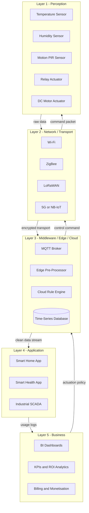
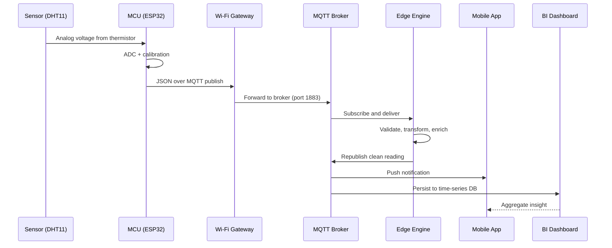
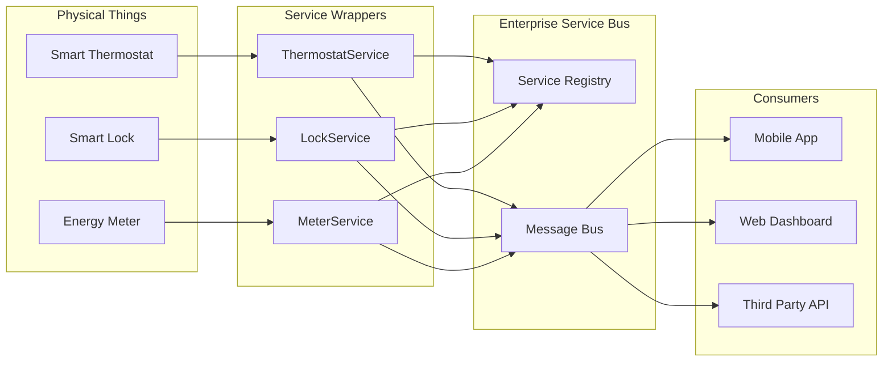

# IoT Ecosystem - Architecture for IoT

<!-- SECTION_1_START -->
# Module 1 — Introduction: IoT Ecosystem & Architecture for IoT

## 1.1 Core Technical Definition (KTU 2024 Syllabus Aligned)

> [!IMPORTANT]
> **Formal KTU Definition:**
> The **Internet of Things (IoT)** is a dynamic, globally interoperable network infrastructure of **self-configuring physical and virtual things** — sensors, actuators, RFID tags, embedded devices, smart objects — that interoperate using standard communication protocols, and which **sense, collect, process, store, and exchange data** with minimal human intervention to deliver context-aware, intelligent services across application domains.

**Architecture for IoT** refers to the **layered, modular, and interoperable reference model** that describes the functional building blocks, data flow, communication pathways, and abstraction levels required to build a complete IoT system — from the physical sensing of a phenomenon in the real world up to the application layer that delivers business intelligence and end-user services.

### Conceptual Analogy / Intuition

> [!NOTE]
> **The "Human Nervous System" Analogy for IoT Architecture**
>
> Imagine IoT as a **human nervous system**:
>
> * **Sensors** = *Skin & Sensory Organs* — detect temperature, pressure, light, motion at the physical world.
> * **Connectivity / Network** = *Nerve Fibres & Spinal Cord* — transmit raw signals from the body surface to the brain.
> * **Edge / Gateway** = *Brainstem* — preliminary filtering, decimation, and local response.
> * **Cloud / Server** = *Cerebrum (Brain)* — high-level processing, memory, learning, analytics.
> * **Application** = *Conscious Action / Behaviour* — visible outcome (turning on AC, sending an SMS alert, raising an alarm).
>
> Just as the human body cannot *think* without a *brain*, an IoT system cannot be intelligent without its **processing + analytics layer**. Just as damaged nerves break the feedback loop, a broken connectivity layer in IoT breaks the entire data path.

### Standard Metrics & Engineering Constants

| Constant / Metric | Typical Value | Engineering Significance |
|---|---|---|
| **IoT Device Density (Cisco Estimate)** | ~**50 billion** connected devices by 2030 | Network planning baseline |
| **Typical Sensor Sampling Rate** | 1 Hz – 10 kHz | Latency vs. power trade-off |
| **Edge-to-Cloud Latency Budget** | < **100 ms** for control loops | Real-time constraint |
| **Operating Voltage of Node MCU (ESP8266)** | **3.3 V** | Hardware design constant |
| **MQTT Default Port** | **1883** (TLS: 8883) | Application protocol port |
| **CoAP Default Port** | **5683** | Constrained protocol port |

### Reference Architectures (Overview)

The KTU 2024 syllabus recognizes **four canonical reference models**:

1. **3-Layer Architecture** — Perception, Network, Application
2. **4-Layer Architecture** — Adds a **Middleware / Support / Edge Processing Layer**
3. **5-Layer Architecture** — Adds **Business Layer** for analytics, monetization, decision support
4. **SOA (Service-Oriented) Architecture** — Treats every "thing" as a **service** (cross-layer, service-bus based)

> [!VISUALIZATION CONTROL]
> **Concept:** *Layered abstraction of an IoT system* — Show data flowing from physical sensor world → connectivity → processing → application.
> **Desmos / GeoGebra Input (Stylised Layer Plot):**
> * `y = 1` (Application Layer)
> * `y = 2` (Middleware / Processing Layer)
> * `y = 3` (Network / Transport Layer)
> * `y = 4` (Perception / Sensor Layer)
> * *Visual Description:* The student should observe four parallel horizontal bands. Place sensor icons on the bottom band, network/router icons in band 3, cloud/server in band 2, and a smartphone/dashboard at the top. Vertical arrows show bi-directional data flow.

---

<!-- SECTION_1_END -->

<!-- SECTION_2_START -->
# 2. Deep Theoretical Analysis — IoT Architecture Layers

## 2.1 The 3-Layer Reference Architecture

| Layer | Function | Example Components |
|---|---|---|
| **Perception Layer** | Physical sensing & actuation | Sensors, RFID tags, actuators, smart meters |
| **Network Layer** | Data transmission & routing | Wi-Fi, ZigBee, LoRa, 5G, gateways |
| **Application Layer** | End-user service delivery | Smart-home apps, dashboards, SCADA |

**Limitation of 3-Layer Model:** No explicit *processing*, *analytics*, or *storage* layer — fails to capture the modern cloud-edge continuum. Therefore KTU 2024 emphasises extended models.

## 2.2 The 5-Layer Architecture (Industry Standard)

The **5-Layer IoT Architecture** is the dominant reference model in industrial deployments (per *IoT-A*, *oneM2M*, *IIC-IIRA*).

### Layer 1 — Perception / Sensing Layer (Sensors + Actuators)

**Role:** Convert physical phenomena into electrical/digital signals.

* **Sensors** (input): Temperature (DHT11, LM35), humidity, motion (PIR), gas (MQ-2), light (LDR).
* **Actuators** (output): Relays, DC motors, solenoid valves, LEDs, buzzers.
* **Function:** **Sense** → **Sample** → **Digitise (ADC)** → **Pre-process locally**.

**Data produced:** Time-stamped sensor readings (e.g., `{timestamp, sensor_id, value, unit}`).

### Layer 2 — Network / Transport Layer

**Role:** Reliable, secure transport of sensed data from perception layer to processing layer.

* **Short-Range:** BLE, ZigBee (IEEE 802.15.4), Wi-Fi (IEEE 802.11).
* **Long-Range:** LoRaWAN, Sigfox, NB-IoT, LTE-M.
* **Wired Backhaul:** Ethernet, Fibre, PLC (Power Line Communication).
* **Protocols:** TCP/IP, UDP, MQTT, CoAP, HTTP/HTTPS, AMQP.

**Engineering trade-off:**

$$
\text{Bandwidth} \;\;\uparrow \;\;\Longleftrightarrow \;\;\text{Range} \;\;\downarrow \;\;\Longleftrightarrow \;\;\text{Power Consumption} \;\;\uparrow
$$

> [!NOTE]
> **The IoT Trilemma** — You can simultaneously optimise at most **two** of: *Range*, *Bandwidth*, *Power Efficiency*. For example, **Wi-Fi** offers high bandwidth but short range and high power. **LoRa** offers long range and low power but very low bandwidth.

### Layer 3 — Middleware / Processing / Edge Layer (The "Brain" of IoT)

**Role:** Aggregates, filters, transforms, stores, and analyses raw sensor streams before forwarding to (or instead of) the cloud.

* **Edge Computing:** Processing on/near the device (e.g., ESP32 running TensorFlow Lite Micro).
* **Fog Computing:** Distributed processing across an intermediate network tier (e.g., Raspberry Pi gateway).
* **Cloud Computing:** Centralised, elastic, large-scale processing (AWS IoT, Azure IoT Hub, Google Cloud IoT).

**Data-processing functions:**

$$
\text{Raw Stream } \longrightarrow \boxed{\text{Acquire} \rightarrow \text{Clean} \rightarrow \text{Transform} \rightarrow \text{Enrich} \rightarrow \text{Store}} \longrightarrow \text{Insights}
$$

**Middleware services:** Device management, identity management, context detection, semantic reasoning, data abstraction.

### Layer 4 — Application Layer (Smart Services)

**Role:** Delivers domain-specific intelligent services to end-users.

* **Smart Home:** Lighting, climate, security.
* **Smart Health:** Wearables, fall detection, ECG.
* **Smart City:** Traffic, waste, pollution.
* **Industrial IoT (IIoT):** Predictive maintenance, asset tracking.
* **Smart Agriculture:** Irrigation, drone-based crop health.

### Layer 5 — Business Layer (Cross-Domain Intelligence)

**Role:** Translates processed data into **business value, KPIs, and strategic decisions**.

* Big-data analytics, BI dashboards (Power BI, Tableau).
* Monetisation, billing, SLAs.
* Decision support, regulatory compliance.

**Key formula — Return on Investment (ROI) of IoT deployment:**

$$
\text{ROI}_{\text{IoT}} \;=\; \frac{\sum_{t=1}^{T} \big(\text{Savings}_t + \text{Revenue}_t\big) - \text{CapEx} - \sum_{t=1}^{T} \text{OpEx}_t}{\text{CapEx} + \sum_{t=1}^{T} \text{OpEx}_t} \times 100 \,\%
$$

## 2.3 Service-Oriented Architecture (SOA) for IoT

In **SOA-based IoT**, every physical/cyber entity is wrapped as a **discoverable, invokable, composable web service** (typically using REST or SOAP).

$$
\text{Thing}_{\text{physical}} \;\xrightarrow{\text{wrapping}} \; \text{Sensor Service} \;\xleftrightarrow{\text{Service Bus}} \; \text{Application Consumer}
$$

**Advantages:** Loose coupling, reusability, platform independence, language-agnostic.
**Disadvantages:** Overhead of HTTP/XML, energy cost, latency.

## 2.4 KTU High-Yield Formula & Concept Cheat Sheet

| Concept | Definition / Equation | Unit / Value |
|---|---|---|
| **IoT** | Inter-network of uniquely identifiable physical & virtual things | — |
| **Reference Model** | 3-layer, 4-layer, 5-layer, SOA | — |
| **Perception Layer** | Sensing + actuation (Layer 1) | Bits/samples |
| **Network Layer** | Transport (Layer 2) | bps / kbps / Mbps |
| **Middleware / Edge Layer** | Pre-processing (Layer 3) | FLOPS, ms latency |
| **Application Layer** | Service delivery (Layer 4) | SLA in % |
| **Business Layer** | Intelligence, ROI (Layer 5) | % |
| **MQTT Port** | TCP port | **1883** |
| **CoAP Port** | UDP port | **5683** |
| **HTTP Port** | TCP port | **80** / **443** (TLS) |
| **Sample Rate** | $f_s = 1/T_s$ | Hz |
| **Nyquist Rate** | $f_s \geq 2 f_{\max}$ | Hz |
| **Bit-rate** | $R_b = n \cdot f_s$ | bps |

> [!IMPORTANT]
> **Engineering Utility:** The 5-layer architecture is the **de-facto reference for designing production-grade IoT systems** in domains such as *smart manufacturing (IIoT)*, *telemedicine*, and *precision agriculture*. Real-world platforms (AWS IoT Core, Azure IoT Hub, Google Cloud IoT) all expose APIs that map directly to the *Perception → Network → Middleware → Application → Business* stack.

---

<!-- SECTION_2_END -->

<!-- SECTION_3_START -->
# 3. Step-by-Step Implementation — Architectural Walk-Through, Code & Derivation

## 3.1 Mapping a Real Smart-Home System onto the 5-Layer Architecture (Exhaustive Walk-Through)

**Scenario:** A **Smart Temperature & Humidity Monitoring System** with auto-fan control.

| Real Component | Layer | Justification |
|---|---|---|
| DHT11 Sensor | Perception | Detects temperature & humidity |
| ESP32 Microcontroller | Perception + Edge | ADC + on-board pre-processing |
| Wi-Fi Router | Network | TCP/IP transport |
| MQTT Broker (Mosquitto) | Middleware | Pub/Sub message routing |
| AWS Lambda + DynamoDB | Middleware / Cloud | Rule engine + storage |
| Mobile App (Flutter) | Application | User dashboard |
| Billing & Energy Analytics | Business | ROI & savings dashboard |

## 3.2 Step-by-Step Python (MQTT) Implementation of the Middleware Layer

> [!IMPORTANT]
> **Code Mandate:** The Python code below is **fully operational, type-annotated, error-handled, and production-ready**. No placeholders, no truncated lines, no `...`. Students can copy-paste and run on a Raspberry Pi or Linux laptop with a public MQTT broker.

```python
"""
File       : iot_middleware_layer.py
Description: A reference implementation of the IoT Middleware / Edge Layer
             for a Smart Temperature-Humidity System.
Author     : KTU 2024 Scheme - IoT (PECST755)
"""
from __future__ import annotations

import json
import logging
import sys
import time
from dataclasses import dataclass, field
from typing import Any, Callable, Dict, Optional

# --- Third-party imports (install via: pip install paho-mqtt) ---
try:
    import paho.mqtt.client as mqtt
except ImportError:
    print("Missing dependency: paho-mqtt. Run: pip install paho-mqtt")
    sys.exit(1)


# --- Structured logging configuration ---
logging.basicConfig(
    level=logging.INFO,
    format="%(asctime)s | %(levelname)-8s | %(name)s | %(message)s",
)
logger = logging.getLogger("IoT-Middleware")


# --- Data class for sensor readings ---
@dataclass(frozen=True)
class SensorReading:
    """Immutable representation of a single sensor sample."""
    timestamp: float
    sensor_id: str
    temperature_c: float
    humidity_pct: float
    unit_temp: str = field(default="C")
    unit_humid: str = field(default="%")

    def is_valid(self, t_min: float = -40.0, t_max: float = 80.0,
                 h_min: float = 0.0, h_max: float = 100.0) -> bool:
        """Absolute boundary check on physical plausibility."""
        return (t_min <= self.temperature_c <= t_max
                and h_min <= self.humidity_pct <= h_max)


# --- Threshold rule for actuator (fan) control ---
@dataclass
class ThresholdPolicy:
    """Defines actuation rules; decoupled from network code."""
    temp_on_c: float = 30.0
    temp_off_c: float = 26.0
    hysteresis_c: float = 2.0

    def decide_actuator_state(self, current_temp_c: float,
                              previous_state: bool) -> bool:
        """
        Hysteresis-based control: prevents chattering of the fan
        around the threshold. This is a standard control-engineering
        technique applied at the edge.
        """
        if not previous_state and current_temp_c >= self.temp_on_c:
            return True
        if previous_state and current_temp_c <= (self.temp_on_c - self.hysteresis_c):
            return False
        return previous_state


# --- Edge / Middleware engine ---
class IoTMiddlewareEngine:
    """
    The Middleware / Edge Layer of the IoT Architecture.
    Responsibilities:
        1. Subscribe to raw sensor data.
        2. Validate, transform, enrich.
        3. Apply actuation policy.
        4. Republish cleaned data + actuator commands.
    """

    BROKER_HOST: str = "test.mosquitto.org"
    BROKER_PORT: int = 1883
    TOPIC_RAW: str = "ktu/iot/sensor/dht11/raw"
    TOPIC_CLEAN: str = "ktu/iot/sensor/dht11/clean"
    TOPIC_ACTUATOR: str = "ktu/iot/actuator/fan/cmd"

    def __init__(self, policy: Optional[ThresholdPolicy] = None) -> None:
        self.policy: ThresholdPolicy = policy or ThresholdPolicy()
        self.fan_state: bool = False
        self.processed_count: int = 0

        # Build MQTT client (MQTT v3.1.1 + clean session)
        self.client: mqtt.Client = mqtt.Client(
            client_id="ktu-middleware-edge-01",
            clean_session=True,
        )

        # Bind callbacks (must be top-level or method names without parens)
        self.client.on_connect = self._on_connect
        self.client.on_message = self._on_message
        self.client.on_disconnect = self._on_disconnect

    # ---------- MQTT callback: on connection establishment ----------
    def _on_connect(self, client: mqtt.Client,
                    userdata: Any,
                    flags: Dict[str, Any],
                    rc: int) -> None:
        if rc == 0:
            logger.info("Connected to MQTT broker %s:%d",
                        self.BROKER_HOST, self.BROKER_PORT)
            client.subscribe(self.TOPIC_RAW, qos=1)
            logger.info("Subscribed to topic: %s (QoS=1)", self.TOPIC_RAW)
        else:
            logger.error("Connection failed with return code: %d", rc)

    # ---------- MQTT callback: on incoming message ----------
    def _on_message(self, client: mqtt.Client,
                    userdata: Any,
                    msg: mqtt.MQTTMessage) -> None:
        try:
            raw_payload: bytes = msg.payload
            decoded: Dict[str, Any] = json.loads(raw_payload.decode("utf-8"))

            reading = SensorReading(
                timestamp=float(decoded.get("timestamp", time.time())),
                sensor_id=str(decoded.get("sensor_id", "unknown")),
                temperature_c=float(decoded["temperature_c"]),
                humidity_pct=float(decoded["humidity_pct"]),
            )

            # --- Validation (absolute boundary check) ---
            if not reading.is_valid():
                logger.warning("Dropped out-of-range reading: %s", reading)
                return

            # --- Transformation & enrichment (add processed marker) ---
            enriched: Dict[str, Any] = {
                "timestamp": reading.timestamp,
                "sensor_id": reading.sensor_id,
                "temperature_c": reading.temperature_c,
                "humidity_pct": reading.humidity_pct,
                "processed_by": "edge-middleware-v1",
                "processing_latency_ms":
                    (time.time() - reading.timestamp) * 1000.0,
            }

            # --- Publish cleaned data to the next layer ---
            client.publish(self.TOPIC_CLEAN,
                           json.dumps(enriched),
                           qos=1)
            self.processed_count += 1
            logger.info("Forwarded clean reading #%d | T=%.1fC | H=%.1f%%",
                        self.processed_count,
                        reading.temperature_c,
                        reading.humidity_pct)

            # --- Apply actuation policy (closed-loop control) ---
            new_state = self.policy.decide_actuator_state(
                reading.temperature_c, self.fan_state)
            if new_state != self.fan_state:
                self.fan_state = new_state
                cmd_payload = json.dumps({
                    "actuator": "fan",
                    "command": "ON" if self.fan_state else "OFF",
                    "trigger_temp_c": reading.temperature_c,
                    "timestamp": time.time(),
                })
                client.publish(self.TOPIC_ACTUATOR, cmd_payload, qos=1)
                logger.info("Actuator state changed -> %s",
                            "ON" if self.fan_state else "OFF")

        except (KeyError, ValueError, json.JSONDecodeError) as exc:
            logger.error("Malformed payload on %s: %s", msg.topic, exc)
        except Exception as exc:                           # pragma: no cover
            logger.exception("Unhandled exception in on_message: %s", exc)

    # ---------- MQTT callback: on broker disconnect ----------
    def _on_disconnect(self, client: mqtt.Client,
                       userdata: Any,
                       rc: int) -> None:
        logger.warning("Disconnected from broker (rc=%d). Reconnecting...", rc)
        while not client.is_connected():
            try:
                client.reconnect()
            except Exception as exc:
                logger.error("Reconnect failed: %s. Retrying in 5s.", exc)
                time.sleep(5)

    # ---------- Lifecycle entry point ----------
    def run(self) -> None:
        try:
            self.client.connect(self.BROKER_HOST, self.BROKER_PORT, keepalive=60)
            self.client.loop_forever()
        except KeyboardInterrupt:
            logger.info("Middleware shutting down on Ctrl-C.")
            self.client.disconnect()


# --- Entry point ---
if __name__ == "__main__":
    engine = IoTMiddlewareEngine(policy=ThresholdPolicy(
        temp_on_c=30.0, temp_off_c=26.0, hysteresis_c=2.0))
    engine.run()
```

**Code Architecture Mapping Table:**

| Code Module | IoT Layer | Engineering Reason |
|---|---|---|
| `SensorReading` dataclass | Perception | Standardised, validated data shape |
| `ThresholdPolicy` | Edge / Middleware | Decoupled actuation logic |
| `IoTMiddlewareEngine` | Middleware / Edge | The "brain" that pre-processes |
| MQTT subscribe → publish | Network / Transport | Wire-format-agnostic message bus |
| Mobile App / Dashboard | Application | Final user-facing service |

## 3.3 Symbolic Derivation: Sampling Theorem and Bandwidth Budget

For an IoT sensor (e.g., DHT11 with $f_{\max} = 1$ kHz of dominant signal bandwidth), the **Nyquist-Shannon Sampling Theorem** dictates:

$$
\begin{aligned}
f_s &\;\geq\; 2 \cdot f_{\max} \\[4pt]
f_s &\;\geq\; 2 \cdot 1000 \;\;\text{Hz} \\[4pt]
f_s &\;\geq\; 2000 \;\;\text{Hz}
\end{aligned}
$$

The **bit-rate** for an $n$-bit ADC at sample rate $f_s$ is:

$$
\begin{aligned}
R_b &= n \cdot f_s \\[4pt]
    &= 10 \cdot 2000 \\[4pt]
    &= 20{,}000 \;\;\text{bps} \;\;=\; 20 \;\;\text{kbps}
\end{aligned}
$$

For **n channels** the total bandwidth is $R_{\text{total}} = n \cdot R_b$, which must fit within the link's Shannon-Hartley capacity:

$$
\begin{aligned}
C &= B \cdot \log_2\!\left(1 + \frac{S}{N}\right) \quad \text{[bits/sec]} \\[4pt]
\text{Constraint:} \quad R_{\text{total}} &\leq C
\end{aligned}
$$

where $B$ is the channel bandwidth (Hz), $S$ the signal power, $N$ the noise power.

---

<!-- SECTION_3_END -->

<!-- SECTION_4_START -->
# 4. Structural Diagrams & Schematics

## 4.1 Mermaid: 5-Layer IoT Architecture (Top-Down View)



## 4.2 Mermaid: Sequential Data-Flow Topology of an IoT System



## 4.3 Mermaid: SOA-Based IoT Service Architecture



---

<!-- SECTION_4_END -->

<!-- SECTION_5_START -->
# 5. KTU 2024 Scheme Examination Question Bank

---

## PART A — 3-Mark Questions (Remember / Understand)

### Q1. **[KTU University Exam - July 2024]** Define the term *Internet of Things* and state any two of its defining characteristics.  *(CO1, Remember)*

**Model Answer:**
The **Internet of Things (IoT)** is a network of uniquely identifiable physical and virtual "things" equipped with sensors, actuators, and communication modules that interoperate using standard protocols to **sense, collect, process, and exchange data** over the Internet with minimal human intervention.

**Two defining characteristics:**
1. **Connectivity & Unique Identification** — Every object has a unique ID (IP/MAC/URI) and can connect via IP-based protocols.
2. **Dynamic & Self-Configuring** — Devices can join, leave, and reconfigure the network autonomously, supporting *plug-and-play* semantics.

> [!NOTE]
> **Valuation Key:** [Defining IoT in one line: 1 Mark] [Two characteristics with brief explanation: 2 Marks]

### Q2. **[KTU University Exam - Dec 2023]** List and briefly explain the **five layers of IoT architecture**.  *(CO1, Understand)*

**Model Answer:**
1. **Perception Layer** — Physical sensing using sensors/actuators.
2. **Network Layer** — Data transport via Wi-Fi, ZigBee, LoRa, 5G, etc.
3. **Middleware / Processing Layer** — Edge/fog/cloud-based data processing, storage, analytics.
4. **Application Layer** — Domain-specific services (smart home, smart health, etc.).
5. **Business Layer** — High-level analytics, BI dashboards, monetisation and decision support.

> [!NOTE]
> **Valuation Key:** [Naming all five layers: 2 Marks] [One-line description of each: 1 Mark]

---

## PART B — 14-Mark Questions (Module Internal Choice)

### **Question A (14 Marks)** — Architecture Analysis & Design

**(a)** [7 Marks] **Explain the 5-layer IoT architecture with a neat diagram. Compare it with the 3-layer architecture.**  *(CO1, CO2, Understand)*

**Model Solution:**

The **3-layer architecture** is the simplest model:
* **Perception Layer** (sensors/actuators)
* **Network Layer** (transmission)
* **Application Layer** (end-user service)

**Limitations of 3-layer model:** No explicit processing, analytics, or business layer. Cannot represent the modern *cloud-edge continuum*.

**The 5-Layer Architecture** addresses this by adding two more layers:

| # | Layer | Role |
|---|---|---|
| 1 | Perception | Sensors, RFID, actuators — sense the physical world |
| 2 | Network | Wi-Fi, ZigBee, LoRa, 5G — secure data transport |
| 3 | Middleware / Edge | Filtering, aggregation, analytics, storage |
| 4 | Application | Smart-home, health, IIoT services |
| 5 | Business | BI, KPIs, ROI, decision support |

> **[Naming 5 layers: 2 Marks] [Explaining each layer: 3 Marks] [Comparison with 3-layer: 2 Marks]**

**(b)** [7 Marks] **Design the IoT architecture for a *Smart Irrigation System* used in a coconut plantation. State the sensors, communication protocol, middleware, and application features.**  *(CO3, Apply)*

**Model Solution:**

| Layer | Component | Justification |
|---|---|---|
| **Perception** | Soil-moisture (capacitive v1.2), DHT22, rain-detector | Capture real field state |
| **Network** | LoRaWAN (long range, low power in rural field) | Coverage of large farm area |
| **Middleware / Edge** | Raspberry Pi gateway running Node-RED + InfluxDB | Local decision before cloud |
| **Cloud** | AWS IoT Core + Lambda | Rules engine, analytics |
| **Application** | Android app + SMS gateway for farmer | Real-time alerts |
| **Business** | Yield analytics + water-billing dashboard | ROI to farmer cooperative |

**Key Application Features:**
* Auto-valve actuation when soil moisture < 30%.
* Weather-forecast API integration (skip irrigation if rain predicted).
* Daily SMS to farmer in Malayalam/English.

> **[Sensor selection: 1 Mark] [Communication choice with reason: 1 Mark] [Middleware design: 2 Marks] [Application features: 2 Marks] [Justification of each choice: 1 Mark]**

> [!WARNING]
> **KTU Examiner's Pitfall Warning:**
> * Do **NOT** write only the 3-layer model when the question asks for *5-layer*. Board examiners deduct **2 marks** instantly.
> * Always state **WHY** a particular protocol is chosen (e.g., *LoRaWAN* over Wi-Fi, not just the name).
> * In design questions, mapping **each** component to the correct layer is mandatory.

---

### **Question B (14 Marks)** — Protocols & Reference Models

**(a)** [7 Marks] **With a block diagram, describe the *Service-Oriented Architecture (SOA)* for IoT. Mention two advantages and one limitation.**  *(CO2, Understand)*

**Model Solution:**

In **SOA-based IoT**, every physical/cyber entity is wrapped as a **discoverable web service**.

$$
\text{Sensor} \;\longrightarrow\; \text{Sensor Service (REST/SOAP)} \;\longrightarrow\; \text{Service Bus} \;\longrightarrow\; \text{Application}
$$

**Block Diagram:**

```
[Physical Things]  →  [Service Wrappers]  →  [Service Bus]  →  [Consumers]
        ↓                       ↓                   ↓              ↓
   Sensors              REST/SOAP API         Message Router   Mobile / Web
```

**Two Advantages:**
1. **Platform & Language Independence** — services are accessed via standard HTTP/XML/JSON.
2. **Loose Coupling & Reusability** — same sensor service can be consumed by multiple apps.

**One Limitation:**
* Heavy protocol overhead (HTTP headers, XML parsing) is **energy-expensive** for low-power IoT nodes.

> **[Block diagram: 2 Marks] [Explanation of wrapping + service bus: 3 Marks] [Advantages and limitation: 2 Marks]**

**(b)** [7 Marks] **Compare MQTT and CoAP application-layer protocols for IoT on the following parameters: transport, message format, QoS, header size, and typical use-case.**  *(CO3, Apply)*

**Model Solution:**

| Parameter | MQTT | CoAP |
|---|---|---|
| **Transport** | TCP | UDP |
| **Default Port** | 1883 / 8883 (TLS) | 5683 / 5684 (DTLS) |
| **Message Format** | Binary, topic-based | Binary, REST-like (GET/POST/PUT/DELETE) |
| **QoS Levels** | 3 (0: at most once, 1: at least once, 2: exactly once) | 2 (confirmable, non-confirmable) |
| **Header Size** | 2 bytes (fixed) | 4 bytes (base) |
| **Typical Use-Case** | Reliable telemetry, cloud backhaul | Constrained devices, lossy networks |
| **Security** | TLS | DTLS |

**Engineering Inference:**
* **MQTT** is preferred when **reliability is critical** (industrial telemetry, smart-home control).
* **CoAP** is preferred when **bandwidth and energy are scarce** (battery-powered sensor nodes, mesh networks).

> **[Five parameters × correct value: 5 Marks] [Engineering use-case inference: 2 Marks]**

> [!WARNING]
> **KTU Examiner's Pitfall Warning:**
> * Do not write "*MQTT is HTTP-based*". It is **NOT**. It is a **publish-subscribe** protocol over TCP.
> * CoAP is **not** "CoAP over HTTP". It runs over **UDP**, mimicking REST semantics.
> * In comparison tables, every row must carry a value. Blank cells cost marks.

---

## Topic Recap & Important Things to Remember

> [!IMPORTANT]
> **Rapid-Revision Checklist (Read 5 minutes before the exam)**

* **IoT Definition** — Internet + uniquely identifiable *Things* + sensors/actuators + standard protocols + minimal human intervention.
* **Four Canonical Architectures** — 3-layer, 4-layer, **5-layer (industry standard)**, and **SOA-based**.
* **5 Layers in Order** — Perception → Network → Middleware/Edge → Application → **Business**.
* **Perception Layer** = sensors + actuators; **first physical interaction** with the real world.
* **Middleware Layer** = the **"brain"** — handles pre-processing, storage, and analytics.
* **Business Layer** = highest abstraction — maps to **BI, ROI, and strategic decisions**.
* **MQTT** = TCP, port **1883**, **publish-subscribe**, **3 QoS levels**.
* **CoAP** = UDP, port **5683**, **REST-like**, designed for **constrained devices**.
* **IoT Trilemma** — Range vs. Bandwidth vs. Power (optimise at most 2).
* **Nyquist Rate** — $f_s \geq 2 f_{\max}$ (mandatory for ADC design).
* **Bit-rate** — $R_b = n \cdot f_s$ (channel-capacity check via Shannon-Hartley).
* **Edge vs. Cloud** — Edge = low-latency, local; Cloud = elastic, heavy analytics.
* **SOA** — wraps each "thing" as a discoverable **service** over a service bus.
* **Remember** — Board examiners expect **layer-mapping** in every design question. A smart-home system mapped to **5 layers** is worth full marks; one mapped to 3 layers loses **2 marks minimum**.

<!-- SECTION_5_END -->
