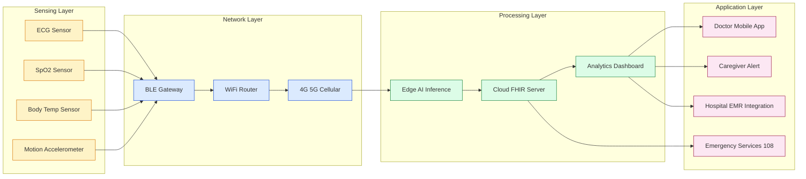
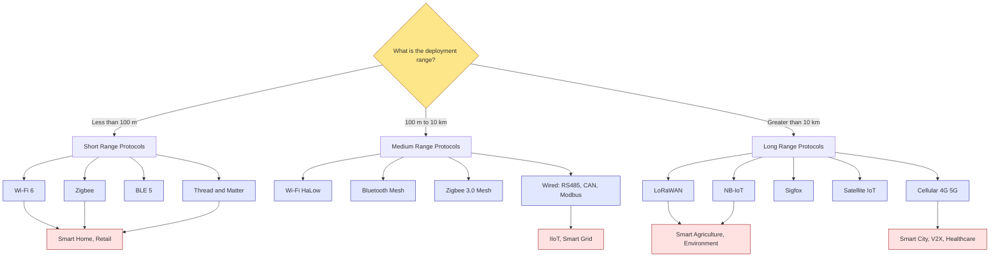
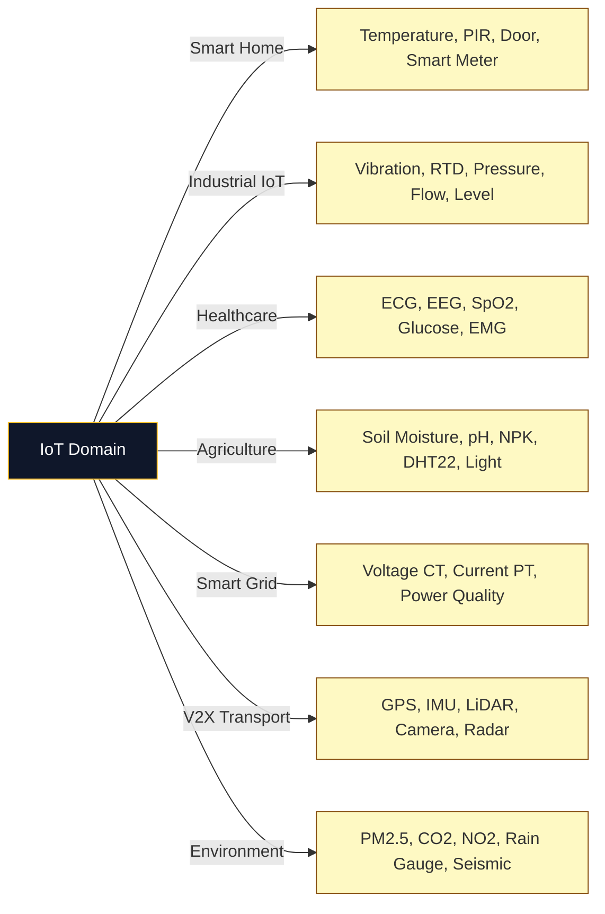

# IoT Key Application Domains

<!-- SECTION_1_START -->
# IoT Key Application Domains

## 1. Formal Academic Definition

**Internet of Things (IoT) Application Domains** refer to the diverse vertical sectors of human activity and industrial operations where networked smart objects (sensors, actuators, edge devices, and cloud services) are deployed to enable **autonomous sensing**, **data-driven decision-making**, and **closed-loop control** over physical processes. According to the KTU 2024 Scheme PECST755 syllabus, these domains represent the *real-world manifestation* of the four-stage IoT architecture (Sensing $\rightarrow$ Network $\rightarrow$ Processing $\rightarrow$ Application) across healthcare, agriculture, smart cities, industrial automation, and smart environments.

> [!IMPORTANT]
> **KTU Syllabus Highlight (Module 1):**
> Students must be able to identify, differentiate, and map **at least seven key application domains** of IoT, understand their unique sensor stacks, communication protocols, and Quality of Service (QoS) requirements, and recognize domain-specific challenges such as latency, data criticality, and security.

> [!NOTE]
> **Standard Reference Frameworks:**
> - **ITU-T Y.4000/Y.2060** — Official definition of IoT by the International Telecommunication Union.
> - **IEEE P2413** — Architectural Framework for the Internet of Things.
> - **oneM2M** — Global standards for IoT application-layer interoperability.

---

## 2. Conceptual Analogy / Intuition

Imagine the human nervous system: your skin contains millions of **sensors** (touch, temperature, pain), your spinal cord acts as a **local edge processor**, your brain is the **cloud analytics engine**, and your muscles are **actuators** that respond to commands. Just as the nervous system digitizes and processes the real world, **IoT Application Domains are the "organs" of the connected planet** — each domain (healthcare, agriculture, industry, etc.) is a specialized "organ system" with its own sensors, processing rules, and response mechanisms.

Consider a **Smart City** as a single human body:
- The **transportation network** behaves like the circulatory system (data flows like blood).
- The **smart grid** is the digestive/energy system (consumes, processes, distributes).
- The **environmental monitoring** layer is the skin (boundary between the system and the outside world).
- The **emergency response** is the immune system (detects anomalies, triggers reactions).

> [!TIP]
> **Plain-English Intuition:**
> Think of IoT Application Domains as the *end-users* of IoT technology. The technology stack (RFID, MQTT, CoAP, LoRa, etc.) is generic — but each domain "drives" the technology differently. A doctor wants *biocompatibility*; a farmer wants *soil-sensor durability*; a factory owner wants *deterministic latency under 1 ms*.

---

## 3. Standard Metrics & Constants in IoT Domains

The following key performance indicators (KPIs) recur across nearly all IoT domains:

- **Latency**: $L \le 10\,ms$ (tactile IoT), $\le 1\,ms$ (URLLC 5G)
- **Power Budget**: $P_{avg} = 1\,mW$ to $100\,mW$ (battery-powered nodes)
- **Network Density**: $\rho \approx 10^6$ devices per km² (massive IoT)
- **Reliability**: $R \ge 99.999\%$ ("five nines" — industrial IoT)
- **Data Rate**: $r = 100\,bps$ (agriculture) to $1\,Gbps$ (video surveillance)

> [!VISUALIZATION CONTROL]
> **Concept:** IoT Application Domain Distribution Map
> **GeoGebra / Desmos Input Equations:**
> * Plot a unit circle and segment it into 10 colored arcs representing 10 domains.
> * `theta_1 = 0`, `theta_2 = 2*pi/10` for arc 1 (Smart Home)
> * `theta_n = (n-1)*(2*pi)/10` for the $n^{th}$ domain arc
> **Visual Description:** A pie chart of 10 equal slices labeled: Smart Home, Smart City, Industrial IoT, Healthcare, Smart Agriculture, Smart Grid, Smart Transportation, Smart Retail, Smart Environment, Wearables. The radius of each slice can be scaled to represent market share (Smart Cities and IIoT dominate).

<!-- SECTION_1_END -->

<!-- SECTION_2_START -->
# Deep Theoretical Analysis & KTU High-Yield Reference Sheet

## 1. Taxonomy of IoT Application Domains

IoT applications are not monolithic — they are classified along four orthogonal axes:

- **Domain Scope**: Personal $\rightarrow$ Home $\rightarrow$ Enterprise $\rightarrow$ City $\rightarrow$ Global
- **Criticality**: Non-critical (retail) $\rightarrow$ Mission-critical (healthcare, industrial)
- **Mobility Class**: Static (sensors on pipelines) $\rightarrow$ Nomadic (smartphones) $\rightarrow$ Highly mobile (vehicles, drones)
- **Data Granularity**: Sparse (1 sample/hour) $\rightarrow$ Dense (1 kHz vibration streams)

## 2. The Ten Canonical IoT Application Domains

### Domain 1 — Smart Home & Building Automation

Smart homes convert ordinary residential dwellings into *cognitive spaces* using interconnected devices: smart thermostats, lighting controllers, security cameras, smart locks, and voice assistants. The typical stack uses **Wi-Fi/Zigbee/Z-Wave** at the edge and a **cloud or local-hub** for analytics.

> [!NOTE]
> **Why it matters (KTU relevance):** This domain is the *largest consumer IoT market* globally and is the most frequently asked domain in KTU Module 1 questions.

**Key Protocols**: MQTT, Zigbee 3.0, Z-Wave, Thread, Matter, Wi-Fi 6
**Sample Devices**: Nest Thermostat, Amazon Echo, Philips Hue, Ring Doorbell
**Key Metrics**: Response time $< 200\,ms$, voice command recognition accuracy $\ge 95\%$

### Domain 2 — Smart Cities

Smart Cities integrate ICT and IoT to manage urban infrastructure — traffic, lighting, waste, water, and pollution — at scale. The reference architecture uses a **three-tier fog/edge/cloud model** with thousands of spatially distributed nodes.

**Key Subsystems**:
- Intelligent Transportation Systems (ITS)
- Smart Street Lighting (adaptive LED + occupancy sensors)
- Waste Management (fill-level sensors in bins)
- Air Quality Monitoring (PM2.5, NO₂, CO₂)
- Smart Parking (ultrasonic/IR sensors per slot)

**Key Protocols**: LoRaWAN, NB-IoT, 6LoWPAN, LTE-M, 5G
**Sample Devices**: Libelium Smart Cities sensor nodes, Cisco Kinetic, Siemens MindSphere
**Key Metric**: City-wide data ingestion $\ge 1\,TB/day$

### Domain 3 — Industrial IoT (IIoT)

IIoT extends traditional M2M (Machine-to-Machine) communication into the era of AI, edge analytics, and digital twins. It is governed by the **RAMI 4.0** (Reference Architecture Model Industry 4.0) and **IIC (Industrial Internet Consortium)** frameworks.

**Key Subsystems**:
- Predictive Maintenance (PdM) using vibration + thermal sensors
- Asset Tracking (RFID, BLE, UWB)
- Process Automation (PLC integration via OPC-UA)
- Energy Management (smart meters + SCADA)
- Digital Twins (real-time virtual replicas)

**Key Protocols**: OPC-UA, MQTT-SN, Profinet, EtherCAT, Modbus-TCP, TSN (Time-Sensitive Networking)
**Sample Devices**: Siemens SIMATIC, Bosch IoT, ABB Ability, GE Predix
**Key Metrics**: Latency $\le 1\,ms$, MTBF $\ge 50{,}000$ hours, availability $\ge 99.999\%$

### Domain 4 — Smart Healthcare (IoMT — Internet of Medical Things)

IoMT encompasses wearable, implantable, and ambient medical devices that enable **remote patient monitoring (RPM)**, **telemedicine**, **medication adherence**, and **AI-driven diagnostics**. This is the most **safety-critical** domain.

**Key Subsystems**:
- Wearable Health Monitors (ECG, SpO₂, BP, glucose)
- Smart Pills (ingestible sensors)
- Remote Patient Monitoring (RPM) Platforms
- Hospital Asset Tracking (IV pumps, wheelchairs)
- Ambient Assisted Living (AAL) for elderly

**Key Protocols**: BLE (Bluetooth Low Energy), IEEE 11073, HL7 FHIR, Continua, MQTT, CoAP
**Sample Devices**: Apple Watch ECG, Dexcom G7 CGM, Medtronic CareLink, Philips HealthSuite
**Key Metrics**: Reliability $\ge 99.99\%$, HIPAA/GDPR compliance, FDA Class II/III certification

> [!WARNING]
> **KTU Pitfall:** Students often confuse **IoMT** with generic IoT. Always mention regulatory compliance (HIPAA, FDA) when discussing Healthcare IoT.

### Domain 5 — Smart Agriculture & Precision Farming

Smart Agriculture deploys sensor networks across fields, greenhouses, and livestock farms to optimize **water**, **fertilizer**, and **pesticide** usage while maximizing yield. It typically uses **LPWAN** (Low Power Wide Area Network) due to vast rural deployment.

**Key Subsystems**:
- Soil Moisture & Nutrient Sensing
- Weather Stations (microclimate monitoring)
- Drones for Crop Health Imaging (NDVI)
- Smart Irrigation (drip + automated valves)
- Livestock Monitoring (wearable collars, geofencing)

**Key Protocols**: LoRaWAN, Sigfox, NB-IoT, Zigbee, Satellite IoT
**Sample Devices**: John Deere Operations Center, Cropx Sensors, Semios
**Key Metrics**: Battery life $\ge 5$ years, range $\ge 10$ km rural, packet success ratio $\ge 95\%$

### Domain 6 — Smart Grid & Energy Management

The Smart Grid is an *electricity-supply network* that uses IoT to monitor, control, and optimize generation, transmission, and distribution in real time. It is the backbone of the renewable energy transition.

**Key Subsystems**:
- Advanced Metering Infrastructure (AMI)
- Distribution Automation (DA)
- Demand Response Management
- Renewable Integration (solar/wind forecasting)
- Home Energy Management Systems (HEMS)
- EV Charging Networks (OCPP protocol)

**Key Protocols**: IEC 61850, IEEE 2030.5, DLMS/COSEM, OpenADR, MQTT
**Key Metrics**: Latency $\le 50\,ms$ for protection, sub-metering accuracy $\pm 0.2\%$

### Domain 7 — Smart Transportation & Logistics (V2X)

Smart Transportation uses IoT for **Vehicle-to-Vehicle (V2V)**, **Vehicle-to-Infrastructure (V2I)**, and **Vehicle-to-Everything (V2X)** communication. It underpins autonomous driving, fleet management, and intelligent traffic systems.

**Key Subsystems**:
- Connected Vehicles (telematics, OBD-II)
- Fleet Management (GPS + fuel sensors)
- Cold-Chain Monitoring (temperature for perishables)
- Smart Highways (RFID tolling, weigh-in-motion)
- Autonomous Driving (LiDAR + V2X fusion)

**Key Protocols**: C-V2X, DSRC, MQTT, AMQP, 5G NR
**Key Metrics**: Latency $\le 5\,ms$ (collision avoidance), position accuracy $\le 0.1\,m$

### Domain 8 — Smart Retail & Supply Chain

Smart Retail combines **beacon technology**, **computer vision**, **RFID**, and **AI analytics** to enhance the in-store experience and optimize the supply chain from manufacturer to consumer.

**Key Subsystems**:
- Inventory Management (RFID-tagged goods)
- Smart Shelves (weight sensors + cameras)
- Customer Analytics (Wi-Fi/BLE tracking, heat-maps)
- Automated Checkout (Amazon Go style)
- Cold-Chain Logistics

**Key Protocols**: RFID EPC Gen2, BLE Beacons (iBeacon, Eddystone), Wi-Fi Analytics
**Key Metrics**: Inventory accuracy $\ge 99\%$, loss-prevention savings 30-60%

### Domain 9 — Smart Environment & Surveillance

This domain focuses on **monitoring natural ecosystems** and **public safety**. It includes forest fire detection, flood early-warning, wildlife tracking, and perimeter surveillance.

**Key Subsystems**:
- Forest Fire Detection (smoke + IR sensors + cameras)
- Flood/Seismic Monitoring
- Wildlife Tracking (GPS collars)
- Air/Water Quality Monitoring
- Critical Infrastructure Surveillance (pipelines, borders)

**Key Protocols**: LoRaWAN, Satellite IoT (Iridium, Astrocast), Wi-Fi HaLow
**Key Metrics**: Deployment in extreme conditions, energy harvesting (solar/vibration)

### Domain 10 — Wearables & Personalized IoT

Wearables are *body-worn smart devices* that combine sensing, processing, and actuation. The category has expanded from fitness bands to **AR/VR headsets**, **smart clothing**, and **neural interfaces**.

**Key Subsystems**:
- Fitness & Activity Trackers
- Smartwatches with Health Monitoring
- Smart Glasses (AR overlays)
- Smart Fabrics (textile-integrated sensors)
- Brain-Computer Interfaces (BCI — emerging)

**Key Protocols**: BLE, ANT+, Wi-Fi, NFC
**Key Metrics**: Battery life $\ge 7$ days, weight $\le 50$ g, IP68 rating

---

## 3. KTU High-Yield Reference Sheet

| Domain | Primary KPI | Critical Protocol | Power Profile | Latency Class | KTU-Favorite Example |
|---|---|---|---|---|---|
| Smart Home | UX Convenience | MQTT / Zigbee | Mains + Battery | $< 200$ ms | Nest Thermostat |
| Smart Cities | City-scale density | LoRaWAN / NB-IoT | Solar + Battery | $< 1$ s | Smart Parking |
| IIoT | Reliability $99.999\%$ | OPC-UA / TSN | Mains | $< 1$ ms | Predictive Maintenance |
| Healthcare | Patient safety | BLE / HL7 FHIR | Rechargeable | $< 100$ ms | RPM ECG |
| Agriculture | Battery $\ge 5$ yr | LoRaWAN | Solar | Minutes OK | Soil Moisture |
| Smart Grid | Meter accuracy $\pm 0.2\%$ | IEC 61850 | Mains | $< 50$ ms | AMI |
| Transportation | V2X latency $< 5$ ms | C-V2X / 5G | Vehicle battery | $< 5$ ms | Collision Avoidance |
| Retail | Inventory accuracy | RFID Gen2 | Mains | $< 1$ s | Smart Shelves |
| Environment | Range / autonomy | LoRa / Satellite | Energy harvesting | Best-effort | Forest Fire |
| Wearables | Battery life | BLE | Li-ion | $< 100$ ms | Apple Watch |

> [!TIP]
> **KTU Mnemonic:** *"**H**ome **C**ity **I**ndustry **H**ealth **A**griculture **G**rid **T**ransport **R**etail **E**nvironment **W**earables"* → **HCI-HAG-TREW**

---

## 4. Real-World Production Utility

- **Bosch Connected Industry**: Deploys IIoT solutions in 200+ factories worldwide, achieving 20% reduction in downtime.
- **John Deere See & Spray**: Uses computer vision + IoT to reduce herbicide use by 77% in smart agriculture.
- **Philips HealthSuite**: Manages 1.4+ million connected medical devices for remote patient monitoring.
- **Siemens MindSphere**: Cloud-based IIoT platform with 2+ million connected industrial assets.
- **Tesla Fleet Learning**: V2X-style OTA (Over-The-Air) updates push ML model improvements to 5M+ vehicles.

<!-- SECTION_2_END -->

<!-- SECTION_3_START -->
# Step-by-Step Derivations, Case Studies & Code Implementation

## 1. Case Study — Smart Agriculture Domain (Detailed Walkthrough)

Let us design a **smart irrigation system** for a 5-acre farm in Kerala, applying the four-stage IoT architecture.

### Step 1 — Requirement Analysis

Crop: Coconut / Pepper (Kerala context)
Soil type: Laterite
Water source: Open well with submersible pump
Decision variable: Should the pump turn ON or OFF?
Variables to sense:
- $S$ = Soil moisture (\%)
- $T$ = Soil temperature ($^\circ$C)
- $H$ = Ambient humidity (\%)
- $R$ = Rainfall (mm/hr)
- $L$ = Light intensity (lux)

### Step 2 — Threshold-Based Decision Logic

The decision rule for irrigation is:

$$
\text{Pump}_{state} = \begin{cases}
ON, & \text{if } S < S_{min} \;\land\; R < R_{threshold} \;\land\; T < T_{max} \\
OFF, & \text{otherwise}
\end{cases}
$$

Where:
- $S_{min} = 30\%$ (lower threshold)
- $S_{max} = 60\%$ (upper threshold, hysteresis)
- $R_{threshold} = 2\,mm/hr$ (skip irrigation if raining)
- $T_{max} = 45^\circ C$ (avoid watering at peak heat)

### Step 3 — Python Implementation (Edge Device)

```python
"""
Smart Irrigation Edge Controller - KTU Module 1 Case Study
Course: PECST755 - Internet of Things
Domain: Smart Agriculture
"""

import logging
import time
from dataclasses import dataclass
from typing import Optional

# ---------- Logging Setup ----------
logging.basicConfig(
    level=logging.INFO,
    format="%(asctime)s [%(levelname)s] %(message)s"
)
logger = logging.getLogger("IrrigationController")


# ---------- Sensor Data Model ----------
@dataclass
class SensorReading:
    soil_moisture: float      # in percentage (0-100)
    soil_temp: float          # in degrees Celsius
    humidity: float           # in percentage (0-100)
    rainfall: float           # in mm/hr
    light_intensity: float    # in lux


# ---------- Irrigation Controller ----------
class SmartIrrigationController:
    """Decision logic for an IoT-based smart irrigation system."""

    def __init__(
        self,
        soil_min: float = 30.0,
        soil_max: float = 60.0,
        rain_threshold: float = 2.0,
        max_temp: float = 45.0,
    ) -> None:
        # Validate boundary parameters
        if not (0.0 <= soil_min < soil_max <= 100.0):
            raise ValueError("Invalid soil moisture thresholds")
        if rain_threshold < 0.0:
            raise ValueError("Rainfall threshold cannot be negative")
        if max_temp < -50.0 or max_temp > 80.0:
            raise ValueError("Max temp out of plausible range")

        self.soil_min = soil_min
        self.soil_max = soil_max
        self.rain_threshold = rain_threshold
        self.max_temp = max_temp
        self.pump_state: bool = False

    def decide(self, reading: SensorReading) -> bool:
        """
        Returns True if pump should turn ON, False otherwise.
        Implements hysteresis to avoid rapid on/off cycling.
        """
        try:
            if not (0.0 <= reading.soil_moisture <= 100.0):
                raise ValueError("Soil moisture out of range")

            # Hysteresis rule
            if self.pump_state:
                # Currently ON: turn OFF only when soil is wet enough
                turn_on = reading.soil_moisture < self.soil_max
            else:
                # Currently OFF: turn ON only when soil is dry enough
                turn_on = (
                    reading.soil_moisture < self.soil_min
                    and reading.rainfall < self.rain_threshold
                    and reading.soil_temp < self.max_temp
                )

            self.pump_state = turn_on
            return turn_on

        except ValueError as e:
            logger.error("Sensor reading error: %s", e)
            return False  # fail-safe: keep pump OFF


# ---------- Simulation Loop ----------
def main() -> None:
    controller = SmartIrrigationController()

    # Simulated sensor stream (in real life, this comes from MQTT topics)
    sample_readings = [
        SensorReading(soil_moisture=25.0, soil_temp=28.0,
                      humidity=65.0, rainfall=0.0,  light_intensity=45000.0),
        SensorReading(soil_moisture=35.0, soil_temp=29.0,
                      humidity=60.0, rainfall=0.5,  light_intensity=42000.0),
        SensorReading(soil_moisture=65.0, soil_temp=30.0,
                      humidity=55.0, rainfall=0.0,  light_intensity=38000.0),
        SensorReading(soil_moisture=28.0, soil_temp=27.0,
                      humidity=70.0, rainfall=3.0,  light_intensity=30000.0),
    ]

    for i, reading in enumerate(sample_readings, start=1):
        decision = controller.decide(reading)
        logger.info(
            "Reading %d: soil=%.1f%% rain=%.1fmm/hr -> Pump %s",
            i, reading.soil_moisture, reading.rainfall,
            "ON" if decision else "OFF",
        )
        time.sleep(0.5)


if __name__ == "__main__":
    main()
```

### Step 4 — Expected Output Trace

```
2024-XX-XX 10:00:00 [INFO] Reading 1: soil=25.0% rain=0.0mm/hr -> Pump ON
2024-XX-XX 10:00:00 [INFO] Reading 2: soil=35.0% rain=0.5mm/hr -> Pump ON  (hysteresis)
2024-XX-XX 10:00:01 [INFO] Reading 3: soil=65.0% rain=0.0mm/hr -> Pump OFF
2024-XX-XX 10:00:01 [INFO] Reading 4: soil=28.0% rain=3.0mm/hr -> Pump OFF (rain skip)
```

### Step 5 — Engineering Justification

- **Hysteresis** prevents the pump from rapidly toggling at the threshold boundary (a common cause of relay failure).
- **Rainfall check** avoids wasteful irrigation during monsoon onset.
- **Fail-safe default** (return `False` on sensor error) ensures the pump turns OFF if a sensor malfunctions, preventing flooding.

> [!IMPORTANT]
> **KTU Board Insight:** The 14-mark Part B questions in IoT Module 1 often ask: *"Design an IoT system for a specific domain."* You **must** include (a) sensor list, (b) communication protocol choice with justification, (c) data flow architecture, (d) decision logic, and (e) one Python pseudocode snippet for full marks.

---

## 2. Comparative Case-Study Matrix Across Domains

| Dimension | Smart Home | IIoT | Healthcare | Agriculture | Smart Grid |
|---|---|---|---|---|---|
| Typical Sensors | PIR, Temp, Light | Vibration, RTD | ECG, SpO₂ | Soil, DHT11 | CT, PT, Smart Meter |
| Network | Wi-Fi/Zigbee | TSN/OPC-UA | BLE/4G | LoRaWAN | Powerline/IEC 61850 |
| Latency Target | $200$ ms | $1$ ms | $100$ ms | $30$ s | $50$ ms |
| Power Source | Mains/Battery | Mains | Rechargeable | Solar/Battery | Mains |
| Criticality | Medium | Very High | Life-critical | Medium | High |
| Data Volume | Low–Medium | High | Medium | Low | Very High |
| Privacy Concern | Medium | Low | Very High | Low | High (consumer data) |
| Standard Body | Matter/Thread | IIC/RAMI 4.0 | IEEE 11073/HL7 | ISO 11783 | IEC/IEEE |

<!-- SECTION_3_END -->

<!-- SECTION_4_START -->
# Structural Diagrams & Schematics

## 1. Hierarchical Taxonomy of IoT Application Domains

```mermaid
graph TD
    root["Internet of Things Application Domains"]
    root --> consumer["Consumer Tier"]
    root --> enterprise["Enterprise Tier"]
    root --> industrial["Industrial Tier"]
    root --> infrastructure["Infrastructure Tier"]

    consumer --> smartHome["Smart Home and Building"]
    consumer --> wearable["Wearables and Fitness"]
    consumer --> retail["Smart Retail"]

    enterprise --> healthcare["Healthcare IoMT"]
    enterprise --> transportation["Smart Transportation V2X"]
    enterprise --> agriculture["Smart Agriculture"]
    enterprise --> environment["Smart Environment"]

    industrial --> iiot["Industrial IoT IIoT"]
    industrial --> logistics["Smart Logistics"]
    industrial --> mining["Mining and Oil Gas"]

    infrastructure --> smartCity["Smart City"]
    infrastructure --> smartGrid["Smart Grid and Energy"]
    infrastructure --> water["Smart Water Management"]
    infrastructure --> defense["Defence and Surveillance"]

    classDef tierRoot fill:#1f2937,stroke:#fff,color:#fff
    classDef tierA fill:#0ea5e9,stroke:#0369a1,color:#fff
    classDef tierB fill:#10b981,stroke:#047857,color:#fff
    classDef tierC fill:#f59e0b,stroke:#b45309,color:#fff
    classDef tierD fill:#ef4444,stroke:#991b1b,color:#fff

    class root tierRoot
    class consumer,enterprise,industrial,infrastructure tierA
    class smartHome,wearable,retail,healthcare,transportation,agriculture,environment tierB
    class iiot,logistics,mining tierC
    class smartCity,smartGrid,water,defense tierD
```



## 2. Four-Stage Architecture Flow Within a Single Domain (Smart Healthcare)



## 3. Domain-Driven Protocol Selection Matrix (Block Topology)



## 4. Domain-to-Sensor Mapping Schematic



<!-- SECTION_4_END -->

<!-- SECTION_5_START -->
# KTU 2024 Scheme Examination Question Bank & Topic Recap

## Part A — Short Answer Questions (3 Marks Each)

### Question 1
**[KTU University Exam - Dec 2023] | CO1 | Remember**

List any **four key application domains** of IoT. Give **one real-world example** for each.

**Model Answer:**

1. **Smart Home & Building Automation** — Example: Amazon Echo (Alexa) with smart bulbs and door locks.
2. **Smart Healthcare (IoMT)** — Example: Apple Watch with ECG and fall-detection features.
3. **Industrial IoT (IIoT)** — Example: Siemens MindSphere-based predictive maintenance on a CNC machine.
4. **Smart Agriculture** — Example: John Deere's See & Spray system using drones and soil sensors for precision irrigation.

> **Valuation Key:** 0.5 mark per domain name + 0.25 mark per example. Total 4 × 0.75 = 3 marks.

---

### Question 2
**[KTU University Exam - July 2024] | CO1, CO2 | Understand**

Differentiate between **Consumer IoT** and **Industrial IoT (IIoT)** based on **any three** parameters.

**Model Answer:**

| Parameter | Consumer IoT | Industrial IoT |
|---|---|---|
| **Criticality** | Low to medium (UX failure tolerable) | High (failure causes production loss/safety hazard) |
| **Latency Requirement** | Hundreds of milliseconds acceptable | $\le 1$ ms (TSN, URLLC) |
| **Reliability Target** | 99% typical | $99.999\%$ ("five nines") |
| **Security & Standards** | Lightweight (TLS, Matter) | Heavy (IEC 62443, OPC-UA security) |
| **Data Volume** | Small (KB/day) | Large (TB/day) |
| **Lifecycle** | 2–5 years | 10–20 years |

> **Valuation Key:** 1 mark per valid difference × 3 = 3 marks.

---

## Part B — Long Answer Questions (14 Marks Each, Internal Choice)

### Question 3A — Smart City Domain
**[KTU University Exam - Dec 2023] | CO2, CO3 | Understand + Apply | 14 Marks**

(a) Identify and explain the **five major subsystems** of a Smart City. **(7 Marks)**
(b) Design a **Smart Street Lighting system** for a 1 km urban road with the following specifications: 30 LED poles, 12 m pole height, traffic density moderate. Justify the sensor choice, communication protocol, and control logic. **(7 Marks)**

#### Model Solution

##### Part (a) — Five Major Subsystems of a Smart City (7 Marks)

1. **Intelligent Transportation System (ITS)** — Uses cameras, loop detectors, and connected traffic signals to dynamically reroute traffic. Reduces congestion by 15-25% in pilot cities.
2. **Smart Street Lighting** — Adaptive LED with PIR/LiDAR occupancy sensors. Saves 40-60% energy.
3. **Smart Waste Management** — Ultrasonic fill-level sensors in dustbins trigger on-demand collection routes. Cuts collection costs by 30%.
4. **Air Quality & Environmental Monitoring** — PM2.5, NO₂, CO₂, ozone sensors deployed on lamp posts. Triggers public-health advisories.
5. **Smart Water & Sewage Management** — Flow sensors and pressure transducers detect leaks; SCADA-driven pumping stations optimize energy.

> **[Stating the five subsystems: 5 Marks | One-line justification per subsystem: 2 Marks = 7 Marks]**

##### Part (b) — Smart Street Lighting Design (7 Marks)

**Architecture Selection**: Hybrid **LoRaWAN + 6LoWPAN + Edge Controller** per pole.

| Subsystem | Component | Justification |
|---|---|---|
| Sensor | PIR motion + ambient light (BH1750) | Wide FOV, low cost, $0.5\,mW$ |
| Microcontroller | STM32L0 (ARM Cortex-M0+) | Ultra-low-power, $0.7\,mA$ active |
| Radio | Semtech SX1276 (LoRa) | Range $\ge 2$ km urban, $14$ dBm TX |
| Actuator | Solid-state relay (SSR) + LED driver (PWM) | Flicker-free dimming |
| Edge Controller | Raspberry Pi 4 per cluster of 30 poles | Aggregates LoRaWAN, runs ML on traffic patterns |
| Backhaul | 4G/5G to cloud dashboard | Real-time monitoring |

**Control Logic**:

$$
\text{Brightness} = \begin{cases}
100\%, & \text{if motion detected within } 30\,m \text{ and } t \in [19{:}00, 06{:}00] \\
40\%, & \text{ambient light} < 50\,lux \text{ and no motion} \\
20\%, & \text{ambient light} < 20\,lux \text{ and no motion} \\
0\%, & \text{ambient light} \ge 50\,lux
\end{cases}
$$

**Energy Saving Calculation** (per pole, 12 h operation):
Traditional: $150\,W \times 12\,h = 1800\,Wh$
Smart: average $50\,W \times 12\,h = 600\,Wh$
**Savings = 66.6%**

> **[Component selection with justification: 2 Marks | Protocol choice: 1 Mark | Control logic: 2 Marks | Energy calculation: 2 Marks = 7 Marks]**

---

### Question 3B — Industrial IoT Domain (Alternative Choice)
**[KTU University Exam - July 2024] | CO2, CO3 | Understand + Apply | 14 Marks**

(a) Explain the **architecture of Industrial IoT (IIoT)** as defined by the **IIC (Industrial Internet Consortium) Reference Architecture**. **(7 Marks)**
(b) Design a **predictive maintenance system** for a CNC milling machine. Specify the sensors, data pipeline, ML model, and expected KPIs. **(7 Marks)**

#### Model Solution

##### Part (a) — IIoT Reference Architecture (7 Marks)

The **IIC Industrial Internet Reference Architecture (IIRA)** defines three viewpoints:

1. **Business Viewpoint** — Identifies stakeholders, regulatory concerns (ISO 27001, IEC 62443), and ROI drivers. (1 Mark)
2. **Usage Viewpoint** — Defines actors, roles, and use cases such as predictive maintenance, asset tracking, and OEE monitoring. (2 Marks)
3. **Functional Viewpoint** — Five functional domains:
   - **Control** — Real-time PLCs, SCADA, and DCS.
   - **Operations** — Production tracking, MES integration.
   - **Maintenance** — PdM, EAM, CMMS.
   - **Safety & Security** — Functional safety (IEC 61508), cybersecurity.
   - **Information** — Historian, data lake, AI/ML workloads. (3 Marks)
4. **Implementation Viewpoint** — Standards such as **OPC-UA**, **MQTT**, and **RAMI 4.0** for cross-vendor integration. (1 Mark)

##### Part (b) — Predictive Maintenance Design for CNC Machine (7 Marks)

| Layer | Component | Specification |
|---|---|---|
| **Sensing** | Accelerometer (ADXL345), RTD (PT100), Acoustic Emission (AE) | Vibration $0-5\,kHz$, temperature $-50$ to $200\,^\circ C$ |
| **Edge** | NI CompactRIO with FPGA | $1\,kHz$ sampling, deterministic TSN backhaul |
| **Communication** | OPC-UA over TSN | Latency $\le 500\,\mu s$ |
| **Data Pipeline** | Kafka $\rightarrow$ TimeScaleDB $\rightarrow$ S3 Lake | Stream + batch processing |
| **ML Model** | 1D-CNN on raw vibration spectrograms | Bearing-fault classification (Healthy, Inner race, Outer race, Ball fault) |
| **Actuation** | Alert to MES + Work Order auto-trigger | Through CMMS API |
| **Dashboard** | Grafana + Power BI | OEE, MTBF, MTTR |

**Expected KPIs**:
- $\Delta$Uptime: $\ge 20\%$ improvement
- False alarm rate: $\le 5\%$
- Failure prediction horizon: $48{-}72$ hours
- Maintenance cost reduction: $30{-}40\%$

> **[Sensor and edge selection: 2 Marks | ML model choice: 1 Mark | Communication: 1 Mark | KPI computation: 2 Marks | Final integration narrative: 1 Mark = 7 Marks]**

---

> [!WARNING]
> **KTU Examiner's Valuation Warning — Common Pitfalls**
>
> 1. **Don't confuse domain with technology**: Students often write "Bluetooth is a domain" — it is a *protocol*, not a domain. (Penalty: 0–1 mark)
> 2. **Always quote a metric**: "Smart grid uses smart meters" is incomplete. Say "*Smart grid uses AMI with $\pm 0.2\%$ accuracy and $< 50$ ms protection latency*". (Adds 1–2 marks)
> 3. **Avoid generic IoT examples** like "temperature sensor everywhere". Specify a *named* sensor (e.g., **DHT22**, **MAX31865** for RTD).
> 4. **Healthcare is a "safety-critical" domain** — always mention **HIPAA / FDA / IEC 60601** if you pick this domain. Skipping the regulatory line costs 1 mark.
> 5. **Industrial IoT is NOT just "IoT in factories"** — mention the **RAMI 4.0** or **IIC IIRA** framework, **OPC-UA**, and **TSN** to score high.
> 6. **For 14-mark design questions**, a *labelled block diagram* (even hand-drawn) is worth **2 marks** explicitly. Do NOT skip it.
> 7. **V2X is a sub-domain of smart transportation**, not a separate domain. Classify correctly.

---

## Topic Recap & Important Things to Remember

> [!TIP]
> **High-Yield Rapid-Revision Checklist for IoT Application Domains**

- **Definition (KTU)**: IoT Application Domains = vertical sectors (home, industry, healthcare, etc.) where networked smart objects enable sensing, communication, and actuation.
- **The Ten Canonical Domains** (memorize in order): **Smart Home, Smart City, IIoT, Healthcare (IoMT), Smart Agriculture, Smart Grid, Smart Transportation (V2X), Smart Retail, Smart Environment, Wearables**.
- **Mnemonic**: **HCI-HAG-TREW** — Home, City, Industry; Health, Agriculture, Grid; Transport, Retail, Environment, Wearables.
- **Criticality Hierarchy** (low $\rightarrow$ high): Wearable $\rightarrow$ Smart Home $\rightarrow$ Retail $\rightarrow$ Agriculture $\rightarrow$ Environment $\rightarrow$ Smart Grid $\rightarrow$ Smart City $\rightarrow$ IIoT $\rightarrow$ Transportation $\rightarrow$ Healthcare.
- **Latency Hierarchy** (relaxed $\rightarrow$ strict): Agriculture (minutes) $\rightarrow$ Environment (seconds) $\rightarrow$ Smart Home ($200$ ms) $\rightarrow$ Healthcare ($100$ ms) $\rightarrow$ Smart Grid ($50$ ms) $\rightarrow$ Transportation ($5$ ms) $\rightarrow$ IIoT ($1$ ms).
- **Protocol-Region Mapping**:
  - Short range: **Wi-Fi, Zigbee, BLE, Thread/Matter** $\rightarrow$ Home, Wearables.
  - Medium range: **Wi-Fi HaLow, Bluetooth Mesh, RS485, Modbus** $\rightarrow$ Retail, small IIoT.
  - Long range: **LoRaWAN, NB-IoT, Sigfox, 5G** $\rightarrow$ City, Agriculture, Environment.
  - Time-critical: **TSN, OPC-UA, EtherCAT** $\rightarrow$ IIoT, Smart Grid.
- **Key Sensor-Associations**:
  - **Vibration + RTD** $\rightarrow$ IIoT PdM.
  - **ECG + SpO₂** $\rightarrow$ Healthcare IoMT.
  - **Soil moisture + DHT22** $\rightarrow$ Agriculture.
  - **PM2.5 + NO₂** $\rightarrow$ Environment.
  - **CT + PT** $\rightarrow$ Smart Grid.
- **Standard Bodies You MUST name in answers**: **ITU-T Y.2060**, **IEEE P2413**, **oneM2M**, **IIC IIRA**, **RAMI 4.0**, **IEC 61850**, **HL7 FHIR**, **OCPP**.
- **Domain-Specific Red Flags to mention** (boosts marks):
  - Healthcare: **HIPAA, FDA, IEC 60601**.
  - IIoT: **IEC 62443, RAMI 4.0**.
  - Smart Grid: **IEC 61850, IEEE 2030.5**.
  - Smart City: **oneM2M, FIWARE**.
- **Always state THREE things** when defining a domain: (1) the *core purpose*, (2) the *defining sensors/protocols*, and (3) the *primary KPI*.
- **Sample case studies to remember for KTU viva**: Nest Thermostat (Home), Cisco Kinetic (City), Siemens MindSphere (IIoT), Philips HealthSuite (Healthcare), John Deere See & Spray (Agriculture), Tesla Fleet Learning (V2X), Amazon Go (Retail).
- **Common confusions to avoid**: IIoT vs IoT, IoMT vs general Healthcare IoT, V2X vs Fleet Telematics, AMI vs Smart Grid, RFID vs NFC.

<!-- SECTION_5_END -->
