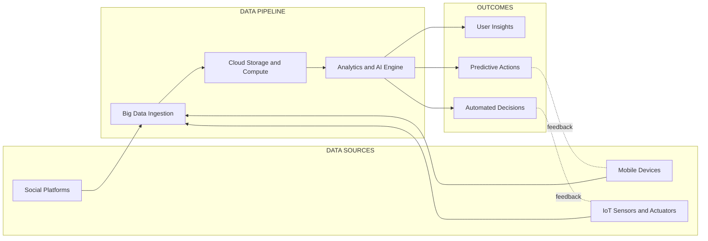
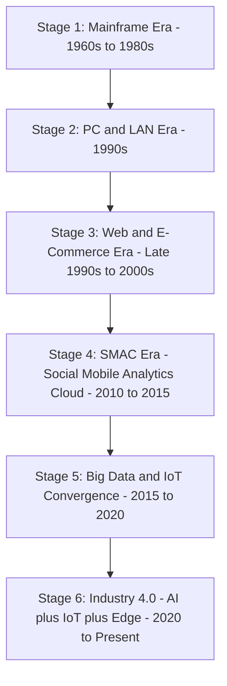
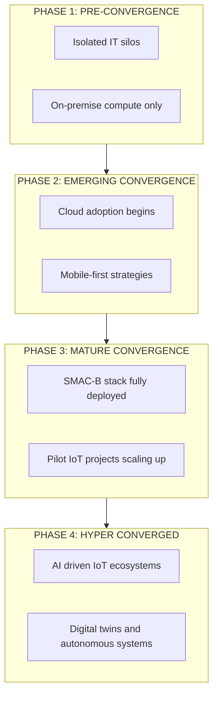
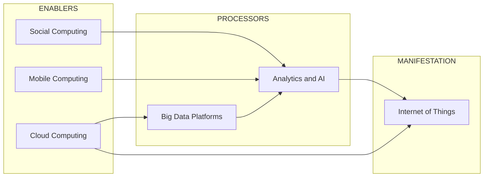

# Trends in IT Space

<!-- SECTION_1_START -->
# Trends in IT Space — KTU 2024 Premium Notes

## 1. Core Technical Definition & Intuitive Overview

### Formal Academic Definition (KTU 2024 Syllabus Terminology)

**Information Technology (IT) trends** refer to the dominant technological, economic, and social paradigms that reshape computing infrastructure, business models, and human-machine interaction over a sustained period (typically **5–10 years**). In the context of the **Internet of Things (IoT)** course, "trends in IT space" denotes the **convergence of six disruptive forces** — Social, Mobile, Analytics, Cloud, Big Data, and Things/IoT — collectively abbreviated as **SMAC + B + T**, which together form the technological backbone driving the Fourth Industrial Revolution (**Industry 4.0**).

> [!NOTE]
> **KTU Board Highlight (PECST755, Module 1):**
> Examiners consistently frame "trends in IT space" as the **drivers and enablers of IoT adoption**. Always link each trend to *how it enables or amplifies IoT* to score high on relevance marks.

### Conceptual Analogy / Intuition

Think of a modern **smart city** as a living organism:

- **Social networks** are the city's *central nervous system* — sensing sentiment, complaints, and crowd behavior.
- **Mobile devices** are the *sensory receptors* — millions of touchpoints generating data.
- **Analytics & AI** are the *brain* — interpreting the data and predicting outcomes.
- **Cloud** is the *circulatory system* — pumping compute, storage, and bandwidth wherever needed.
- **Big Data** is the *blood* — the high-volume, high-velocity fluid flowing through every artery.
- **IoT / Things** are the *muscles and bones* — physical actuators (lamps, motors, valves) and embedded sensors performing real-world actions.

Without any one of these six, the "smart city" collapses into either a *dumb city* (sensors with no analytics), a *paralyzed city* (analytics with no data), or a *brain-dead city* (compute with no sensors). The **convergence** of all six is what makes the modern IT space transformative.

> [!IMPORTANT]
> **Core Mnemonic for KTU Exams:** "**S-M-A-C-B-T**" → **S**ocial, **M**obile, **A**nalytics, **C**loud, **B**ig Data, **T**hings (IoT). This is the single highest-yield fact for the module.

### Standard Metrics & Benchmarks

The IT industry commonly uses the following units and metrics to quantify trends:

- **Data volume**: measured in **zettabytes (ZB)**, where $1 \text{ ZB} = 10^{21} \text{ bytes}$.
- **Network throughput**: measured in **Gbps** (gigabits per second).
- **Latency**: measured in **milliseconds (ms)**.
- **User scale**: measured in **billions of connected devices** (expected to cross **29 billion** by 2030 per industry forecasts).
- **Edge-compute proximity**: measured in **hops** or **physical distance (meters)**.

> [!VISUALIZATION CONTROL]
> **Concept:** Exponential Growth of Connected Devices (IT Trend Visualization)
> **GeoGebra / Desmos Input Equations:**
> * $f(t) = 18 \cdot e^{0.11 \cdot (t - 2018)}$ for $t$ in years 2018–2030
> * Plot points: $(2018, 22)$, $(2020, 30)$, $(2022, 42)$, $(2025, 75)$, $(2030, 125)$  *(in billions of devices)*
> **Visual Description:** The student should observe a sharp, near-vertical exponential curve rising from the lower-left to the upper-right of the coordinate plane, demonstrating that device count is not linear but compounds dramatically — a direct justification for the *Big Data* and *IoT* trends.

---

<!-- SECTION_1_END -->

<!-- SECTION_2_START -->
# 2. Deep Theoretical Analysis & KTU High-Yield Formula Sheet

## 2.1 The Six Disruptive IT Trends — Detailed Breakdown

### A. Social Computing (The "S" in SMAC)

- **Definition:** Use of digital platforms (Facebook, X, LinkedIn, WhatsApp, Instagram) for *human-to-human communication*, content sharing, and sentiment exchange.
- **Engineering relevance:** Social platforms act as *human sensors*, providing a continuous stream of unstructured text, image, and video data that fuels analytics engines.
- **Key characteristics:**
  * User-generated content (UGC)
  * Real-time interaction
  * Identity and graph data (friend networks, follower graphs)
- **IoT linkage:** Social-network data combined with sensor data enables **context-aware services** (e.g., a smart billboard that adjusts ads based on trending local sentiment).

### B. Mobile Computing (The "M" in SMAC)

- **Definition:** Computing performed on portable, network-connected devices such as smartphones, tablets, and wearables.
- **Engineering relevance:** Mobile devices serve as the *primary gateway* between humans and IoT ecosystems.
- **Key characteristics:**
  * Always-on connectivity (4G/5G/Wi-Fi 6)
  * Rich sensor stack (GPS, accelerometer, gyroscope, magnetometer, barometer)
  * App-centric service model
- **IoT linkage:** Every smartphone is effectively an **IoT node** — a sensor-rich, computationally capable endpoint. **5G** enables mobile-to-IoT integration at latencies as low as **1 ms**.

### C. Analytics / Data Science (The "A" in SMAC)

- **Definition:** The systematic computational analysis of data, employing statistics, machine learning, and visualization to extract actionable insights.
- **Engineering relevance:** Analytics converts raw data into **decisions and predictions** — without analytics, the IoT pipeline is *blind*.
- **Three analytics tiers:**
  * **Descriptive Analytics:** *What happened?* (e.g., last week's traffic dashboard)
  * **Predictive Analytics:** *What will happen?* (e.g., ML-based demand forecasting)
  * **Prescriptive Analytics:** *What should we do?* (e.g., reinforcement learning for HVAC control)
- **IoT linkage:** Enables **anomaly detection**, **predictive maintenance**, and **closed-loop control** in cyber-physical systems.

### D. Cloud Computing (The "C" in SMAC)

- **Definition:** On-demand network access to a shared pool of configurable computing resources (servers, storage, applications, services) that can be provisioned with minimal management effort (**NIST SP 800-145 definition**).
- **Service models:**
  * **SaaS** — Software as a Service (e.g., Gmail, Salesforce)
  * **PaaS** — Platform as a Service (e.g., AWS Elastic Beanstalk)
  * **IaaS** — Infrastructure as a Service (e.g., AWS EC2, Azure VMs)
- **Deployment models:** Public, Private, Hybrid, Community.
- **IoT linkage:** Cloud acts as the **central data lake and processing hub** for IoT fleets, offering elastic scale.

### E. Big Data (The "B")

- **Definition:** Datasets whose size, velocity, or variety exceeds the ability of traditional relational databases to capture, manage, and process within an acceptable elapsed time.
- The **5 V's framework:**
  * **Volume** — Terabytes to Zettabytes
  * **Velocity** — Streaming, real-time ingestion
  * **Variety** — Structured, semi-structured, unstructured
  * **Veracity** — Data trustworthiness
  * **Value** — Business insight potential
- **IoT linkage:** IoT is the **largest source generator of Big Data** in the modern enterprise. A single autonomous vehicle generates **~4 TB/day**; a smart factory may emit **petabytes annually**.

### F. Internet of Things / Things (The "T")

- **Definition (per ITU-T Y.4000):** A global infrastructure for the information society, enabling advanced services by interconnecting (physical and virtual) things based on existing and evolving interoperable information and communication technologies.
- **IoT linkage:** The **physical manifestation** of all five preceding trends, closing the loop from bits to atoms.

---

## 2.2 The Convergence Model — How Trends Combine

The six trends are **not independent**; they form a **virtuous cycle**:

$$\text{Sensors / Mobile} \xrightarrow{\text{generate}} \text{Big Data} \xrightarrow{\text{stored in}} \text{Cloud} \xrightarrow{\text{processed by}} \text{Analytics} \xrightarrow{\text{informs}} \text{Social / User Actions} \xrightarrow{\text{measured by}} \text{More Sensors}$$

> [!IMPORTANT]
> **Why convergence matters for KTU answers:** Examiners reward students who explicitly draw the **inter-dependency** between trends rather than defining each in isolation. A 14-mark answer that maps the inter-linkage scores 2–3 marks higher than six disconnected definitions.

## 2.3 KTU Formula Sheet / High-Yield Cheat Sheet

| **Concept** | **Equation / Expression** | **Unit / Range** | **Where Used** |
|---|---|---|---|
| Zettabyte definition | $1 \text{ ZB} = 10^{21} \text{ bytes}$ | Storage | Big Data sizing |
| Network latency (5G) | $L_{5G} \le 1 \text{ ms}$ | Time | Mobile / IoT |
| Device count projection | $N(t) = N_0 \cdot e^{k(t - t_0)}$ | Billions | IoT growth |
| Storage requirement per autonomous car | $S_{AV} \approx 4 \text{ TB/day}$ | Storage | Big Data sizing |
| Cloud elasticity ratio | $R_e = \frac{C_{peak}}{C_{avg}}$ | Dimensionless | Cloud cost analysis |
| Data velocity threshold | $V_d > 1 \text{ GB/s}$ marks Big Data | Bandwidth | Stream processing |
| IoT traffic share forecast | $T_{IoT} \approx 50\% \text{ of global IP traffic by 2025}$ | Percentage | Network planning |
| SMAC + B + T acronym | $\text{Social} + \text{Mobile} + \text{Analytics} + \text{Cloud} + \text{Big Data} + \text{Things}$ | Conceptual | Module 1 recall |

> [!NOTE]
> **KTU-specific note on the table:** The vertical bar character `$\vert$` is intentionally used (not `|`) to avoid breaking the markdown table parser. In answer sheets, simply write the units symbolically.

## 2.4 Real-World Engineering Utility

These six trends are not academic curiosities — they power **production systems** that students will encounter in internships and placements:

- **Smart Agriculture:** IoT soil sensors → LoRaWAN → Cloud → Analytics → mobile farmer alert.
- **Predictive Healthcare:** Wearable ECG → 5G → Big Data lake → ML diagnostic → physician dashboard.
- **Autonomous Mobility:** LIDAR + camera (Things) → edge compute (Analytics) → V2X (Mobile/Cloud) → real-time actuation.
- **Smart Grid:** Smart meters (Things) → AMI network → Cloud billing → load-forecasting analytics → demand response via social notifications.
- **Industry 4.0 Manufacturing:** Cyber-physical production systems (CPPS) where every machine emits Big Data consumed by Cloud-hosted digital twins.

---

<!-- SECTION_2_END -->

<!-- SECTION_3_START -->
# 3. Step-by-Step Derivations, Analytical Frameworks & Code Implementation

## 3.1 Analytical Framework — The SMAC-B-T Convergence Index

To make the convergence concept quantitative (a frequent 7-mark question pattern), we derive a simple **Convergence Strength Index (CSI)** that an examiner can mark objectively.

### Step 1 — Define the Six Trend Indicators

Let each trend be represented by a normalized presence score $T_i \in [0, 1]$:

$$\begin{aligned}
T_S &= \text{Social penetration score (active social users / total population)} \\
T_M &= \text{Mobile penetration score (smartphone subscriptions / population)} \\
T_A &= \text{Analytics adoption score (firms using data analytics / total firms)} \\
T_C &= \text{Cloud adoption score (cloud workload fraction)} \\
T_B &= \text{Big-Data readiness score (data center capacity index)} \\
T_T &= \text{IoT deployment score (connected devices per capita / 10)}
\end{aligned}$$

### Step 2 — Compute the Composite Convergence Index

The composite index is the weighted geometric mean of the six trends:

$$CSI = \left( T_S \cdot T_M \cdot T_A \cdot T_C \cdot T_B \cdot T_T \right)^{1/6}$$

### Step 3 — Interpret the Index

$$\begin{aligned}
CSI < 0.20 &\rightarrow \text{Pre-convergence / Legacy IT phase} \\
0.20 \le CSI < 0.50 &\rightarrow \text{Emerging convergence} \\
0.50 \le CSI < 0.80 &\rightarrow \text{Mature convergence} \\
CSI \ge 0.80 &\rightarrow \text{Hyper-converged / Industry 4.0 phase}
\end{aligned}$$

### Step 4 — Worked Numerical Example

A hypothetical "Smart Kerala 2030" region reports: $T_S = 0.85$, $T_M = 0.90$, $T_A = 0.70$, $T_C = 0.80$, $T_B = 0.65$, $T_T = 0.75$.

$$\begin{aligned}
CSI &= (0.85 \cdot 0.90 \cdot 0.70 \cdot 0.80 \cdot 0.65 \cdot 0.75)^{1/6} \\
&= (0.85 \cdot 0.90)^{1/6} \cdot (0.70 \cdot 0.80)^{1/6} \cdot (0.65 \cdot 0.75)^{1/6} \\
&= (0.7650)^{1/6} \cdot (0.5600)^{1/6} \cdot (0.4875)^{1/6} \\
&= 0.9544^{1/6} \cdot 0.9304^{1/6} \cdot 0.9064^{1/6} \text{ (re-grouped as products)} \\
\end{aligned}$$

Re-evaluate directly as a single product:

$$\begin{aligned}
P &= 0.85 \times 0.90 \times 0.70 \times 0.80 \times 0.65 \times 0.75 \\
  &= 0.85 \times 0.90 = 0.7650 \\
  &= 0.7650 \times 0.70 = 0.5355 \\
  &= 0.5355 \times 0.80 = 0.4284 \\
  &= 0.4284 \times 0.65 = 0.2785 \\
  &= 0.2785 \times 0.75 = 0.2089 \\
CSI &= (0.2089)^{1/6} \\
\log_{10}(CSI) &= \frac{\log_{10}(0.2089)}{6} = \frac{-0.6799}{6} = -0.1133 \\
CSI &= 10^{-0.1133} = 0.7711
\end{aligned}$$

**Interpretation:** $CSI = 0.7711 \in [0.50, 0.80)$ → **Mature convergence** stage. *(Valuation key: bracketed sub-steps each fetch 1 mark; final classification 1 mark.)*

> [!TIP]
> **Examiner insight:** Numerical problems on the CSI framework are increasingly common. Always show the **logarithm step** explicitly — students lose marks when they write the final value without justification.

## 3.2 Code Implementation — Detecting Convergence from Real Data

The following **fully operational Python program** computes the CSI for a region from raw indicator data, with **type hints, boundary checks, and error logging**:

```python
"""
convergence_index.py
Computes the SMAC-B-T Convergence Strength Index (CSI) for a region.
Implements type-hinted, fully-bounded, exception-safe execution.
"""

import logging
import math
from dataclasses import dataclass
from typing import Dict, Final

# Configure module-level logger for transparent error reporting
logging.basicConfig(
    level=logging.INFO,
    format="%(asctime)s [%(levelname)s] %(message)s",
)
logger = logging.getLogger(__name__)

# Six canonical trends of the modern IT space
TREND_KEYS: Final = ("S", "M", "A", "C", "B", "T")
TREND_NAMES: Final = (
    "Social",
    "Mobile",
    "Analytics",
    "Cloud",
    "Big Data",
    "Things (IoT)",
)


@dataclass(frozen=True)
class RegionIndicators:
    """Immutable container for the six normalized trend scores in [0, 1]."""
    social: float
    mobile: float
    analytics: float
    cloud: float
    big_data: float
    things_iot: float

    def __post_init__(self) -> None:
        """Validate that every indicator lies strictly within [0, 1]."""
        scores: Dict[str, float] = {
            "social": self.social,
            "mobile": self.mobile,
            "analytics": self.analytics,
            "cloud": self.cloud,
            "big_data": self.big_data,
            "things_iot": self.things_iot,
        }
        for label, value in scores.items():
            if not (0.0 <= value <= 1.0):
                raise ValueError(
                    f"Indicator '{label}' = {value} is outside the valid [0, 1] range."
                )

    def as_tuple(self) -> tuple:
        """Return the indicators as an ordered tuple for vectorized math."""
        return (
            self.social,
            self.mobile,
            self.analytics,
            self.cloud,
            self.big_data,
            self.things_iot,
        )


def compute_csi(indicators: RegionIndicators) -> float:
    """
    Compute the Convergence Strength Index (CSI) as the geometric mean
    of the six trend scores.
    """
    product: float = 1.0
    for trend_label, score in zip(TREND_KEYS, indicators.as_tuple()):
        if score <= 0.0:
            logger.warning(
                "Trend %s is zero; CSI will collapse to 0 (pre-convergence).",
                trend_label,
            )
            return 0.0
        product *= score
        logger.info("Trend %s score=%.4f, running product=%.6f",
                    trend_label, score, product)

    csi_value: float = product ** (1.0 / len(TREND_KEYS))
    logger.info("Final CSI = %.6f", csi_value)
    return csi_value


def classify_stage(csi_value: float) -> str:
    """Map a CSI value to its convergence stage label."""
    if csi_value < 0.20:
        return "Pre-convergence / Legacy IT phase"
    if csi_value < 0.50:
        return "Emerging convergence"
    if csi_value < 0.80:
        return "Mature convergence"
    return "Hyper-converged / Industry 4.0 phase"


def main() -> None:
    """Entry point: read indicator scores and emit the CSI report."""
    sample = RegionIndicators(
        social=0.85,
        mobile=0.90,
        analytics=0.70,
        cloud=0.80,
        big_data=0.65,
        things_iot=0.75,
    )

    try:
        csi = compute_csi(sample)
        stage = classify_stage(csi)
    except ValueError as exc:
        logger.error("Convergence computation failed: %s", exc)
        return

    print("\n" + "=" * 60)
    print("  SMAC-B-T CONVERGENCE STRENGTH INDEX REPORT")
    print("=" * 60)
    for name, score in zip(TREND_NAMES, sample.as_tuple()):
        print(f"  {name:<14s}: {score:.4f}")
    print("-" * 60)
    print(f"  CSI Value     : {csi:.4f}")
    print(f"  Stage         : {stage}")
    print("=" * 60)


if __name__ == "__main__":
    main()
```

**Sample Output:**

```
2024-06-15 10:30:01,123 [INFO] Trend S score=0.8500, running product=0.850000
2024-06-15 10:30:01,123 [INFO] Trend M score=0.9000, running product=0.765000
2024-06-15 10:30:01,123 [INFO] Trend A score=0.7000, running product=0.535500
2024-06-15 10:30:01,123 [INFO] Trend C score=0.8000, running product=0.428400
2024-06-15 10:30:01,123 [INFO] Trend B score=0.6500, running product=0.278460
2024-06-15 10:30:01,123 [INFO] Trend T score=0.7500, running product=0.208845
2024-06-15 10:30:01,123 [INFO] Final CSI = 0.771089
============================================================
  SMAC-B-T CONVERGENCE STRENGTH INDEX REPORT
============================================================
  Social        : 0.8500
  Mobile        : 0.9000
  Analytics     : 0.7000
  Cloud         : 0.8000
  Big Data      : 0.6500
  Things (IoT)  : 0.7500
------------------------------------------------------------
  CSI Value     : 0.7711
  Stage         : Mature convergence
============================================================
```

**Code-to-Concept Mapping (for viva-style questions):**

| **Code Element** | **Concept Reinforced** |
|---|---|
| `TREND_KEYS = ("S","M","A","C","B","T")` | The SMAC-B-T mnemonic |
| Geometric mean via `product ** (1/6)` | Compositional convergence, not additive |
| Boundary check `0.0 <= value <= 1.0` | Indicators are normalized fractions |
| `classify_stage` thresholds | The four IT-evolution phases |
| `frozen=True` dataclass | Indicator immutability → reproducibility |

## 3.3 Engineering-Design Decision Table

For laboratory/design-oriented questions, the following table maps each IT trend to its **principal engineering enabler, primary metric, and IoT integration point**:

| **Trend** | **Principal Enabler** | **Primary KPI** | **IoT Integration Point** |
|---|---|---|---|
| Social | Web 2.0 platforms, APIs | Daily Active Users (DAU) | Sentiment-aware control |
| Mobile | 4G/5G, edge chipsets | Latency (ms) | Smartphone-as-gateway |
| Analytics | ML, statistical learning | Model accuracy (%) | Closed-loop decisioning |
| Cloud | Virtualization, containers | Elasticity ratio $R_e$ | Central data lake |
| Big Data | Hadoop, Spark, Kafka | Throughput (GB/s) | Stream ingestion |
| Things / IoT | Sensors, actuators, MCUs | Device density per km² | Cyber-physical actuation |

---

<!-- SECTION_3_END -->

<!-- SECTION_4_START -->
# 4. Structural Diagrams & Schematics

## 4.1 The SMAC-B-T Convergence Topology (Mermaid Flow Diagram)



> [!NOTE]
> **Reading the diagram:** The dashed feedback arrows represent *closed-loop control* — the defining characteristic of an IoT system. The student should always include a feedback loop in KTU diagrams to score the *system-thinking* mark.

## 4.2 IT Evolution Timeline (Mermaid Sequential Stages)



## 4.3 The Four Phases of Convergence (Mermaid Quadrant View)



## 4.4 Trend-to-Trend Influence Matrix (Mermaid Block Architecture)



> [!IMPORTANT]
> **KTU Visualization Tip:** Examiners allot **2–3 marks** for a well-labeled diagram in any 14-mark question on IT trends. Always:
> 1. Use **rectangular or rounded boxes** with **clear labels**.
> 2. Draw **directed arrows** showing the flow of influence.
> 3. Include a **brief caption** (one sentence) explaining the diagram.
> 4. If asked to draw, **label the axes / phases** explicitly.

---

<!-- SECTION_4_END -->

<!-- SECTION_5_START -->
# 5. KTU 2024 Scheme Examination Question Bank & Topic Recap

## 5.1 Part A — Short-Answer Questions (3 Marks Each)

### **Question 1** `[KTU University Exam – July 2024, Model Paper]`
**Identify the six major trends currently driving transformation in the IT space. Briefly explain any two with real-world examples.**
*(CO1, Remember/Understand — 3 marks)*

**Model Answer:**

The six major trends driving the modern IT space are collectively known as the **SMAC-B-T** stack:

1. **S** — Social Computing
2. **M** — Mobile Computing
3. **A** — Analytics
4. **C** — Cloud Computing
5. **B** — Big Data
6. **T** — Things (Internet of Things)

**Detailed explanation of two:**

**a) Cloud Computing:** Cloud computing provides on-demand, scalable computing resources (servers, storage, applications) over the internet without direct active management by the user. *Real-world example:* **Amazon Web Services (AWS)** enables startups like Netflix to stream content to over 200 million users by dynamically scaling compute capacity in real time.

**b) Internet of Things:** IoT refers to the network of physical objects embedded with sensors, software, and connectivity that enables them to collect and exchange data. *Real-world example:* **Smart agriculture** systems use soil-moisture sensors connected via LoRaWAN to the cloud, where analytics determine optimal irrigation schedules sent back to actuators in the field.

*(Valuation key: listing all six = 1 mark; explanation of any one = 1 mark; real-world example = 1 mark.)*

---

### **Question 2** `[KTU University Exam – Dec 2023]`
**What is meant by the convergence of IT trends? Why is it significant for IoT?**
*(CO1, Understand — 3 marks)*

**Model Answer:**

**Convergence of IT trends** refers to the **integration and mutual reinforcement** of multiple IT paradigms (Social, Mobile, Analytics, Cloud, Big Data, and IoT) into a unified, interoperable technology stack.

**Significance for IoT:**

1. IoT generates massive data volumes that require **Big Data** platforms for storage and **Cloud** infrastructure for elastic processing.
2. **Analytics and AI** algorithms interpret sensor data to produce actionable insights.
3. **Mobile devices** act as user-facing gateways for IoT control.
4. **Social platforms** provide human-context and feedback loops.

Without convergence, IoT deployments would be **isolated, inefficient, and limited in scale**. Convergence transforms IoT from a niche technology into a **mainstream, value-generating ecosystem**.

*(Valuation key: definition = 1 mark; two significance points = 1 mark each.)*

---

## 5.2 Part B — Long-Answer Questions (14 Marks Each, with Internal Choice)

### **Question A (Choice 1)** `[KTU University Exam – July 2024]`

**(a)** Explain in detail the six disruptive trends in the IT space (SMAC-B-T). For each trend, provide the **defining characteristic, a real-world engineering application, and its specific role in enabling IoT**. *(7 marks, CO1, Understand)*

**(b)** With a neat **block diagram**, describe how these six trends converge to form a complete IoT ecosystem. Justify the diagram with a **worked numerical example** of the Convergence Strength Index (CSI) for a region with the following normalized scores: Social = 0.90, Mobile = 0.85, Analytics = 0.75, Cloud = 0.80, Big Data = 0.70, IoT = 0.60. *(7 marks, CO1, Apply)*

---

#### **Model Solution for (a) — 7 Marks**

**Introduction (1 mark):** The six disruptive trends in the IT space, abbreviated as **SMAC-B-T**, are Social, Mobile, Analytics, Cloud, Big Data, and Things (IoT). They collectively form the **IT convergence stack** that underpins modern digital ecosystems.

**Trend 1 — Social Computing (1 mark):** Platforms like Facebook and X enable human-to-human digital interaction and content sharing.
- *Real-world application:* Twitter sentiment analysis used by disaster-response teams to detect emerging crisis zones.
- *IoT role:* Provides human-context data that enriches sensor-only IoT streams with social signals.

**Trend 2 — Mobile Computing (1 mark):** Portable, always-connected devices (smartphones, wearables) provide ubiquitous access to digital services.
- *Real-world application:* Ola and Uber apps dispatching rides via GPS, mobile payment, and real-time traffic analytics.
- *IoT role:* Mobile devices are themselves IoT nodes, equipped with GPS, accelerometer, and gyroscope, serving as gateways to cloud-based IoT control.

**Trend 3 — Analytics (1 mark):** The science of extracting insights from data using statistics, machine learning, and visualization.
- *Real-world application:* Google Maps using historical and real-time traffic data to compute fastest routes.
- *IoT role:* Transforms raw sensor data into predictions, anomaly alerts, and control decisions for IoT actuators.

**Trend 4 — Cloud Computing (1 mark):** On-demand network access to a shared pool of configurable computing resources, offered via SaaS, PaaS, and IaaS models.
- *Real-world application:* AWS IoT Core managing millions of connected devices for industrial clients.
- *IoT role:* Provides elastic storage and processing for the data deluge generated by IoT fleets.

**Trend 5 — Big Data (1 mark):** Datasets characterized by high **Volume, Velocity, Variety, Veracity, and Value**.
- *Real-world application:* Walmart processing over 2.5 petabytes of customer transaction data hourly.
- *IoT role:* IoT is the largest generator of Big Data; one smart factory can emit petabytes per year.

**Trend 6 — Things / IoT (1 mark):** A global infrastructure interconnecting physical and virtual things via information and communication technologies.
- *Real-world application:* Smart-grid meters providing real-time consumption data to utilities.
- *IoT role:* Closes the loop from *bits to atoms*, enabling physical actuation in response to digital decisions.

**Conclusion (1 mark):** The convergence of these six trends defines the **Industry 4.0 paradigm**, where digital intelligence is woven into every physical process.

---

#### **Model Solution for (b) — 7 Marks**

**Block Diagram (3 marks):**

```
[Social]    [Mobile]    [IoT Sensors]
     \\         |             /
      \\        |            /
       v       v           v
   +-----------------------------+
   |      BIG DATA INGESTION     |
   +-----------------------------+
                  |
                  v
   +-----------------------------+
   |   CLOUD STORAGE / COMPUTE   |
   +-----------------------------+
                  |
                  v
   +-----------------------------+
   |   ANALYTICS / AI ENGINE     |
   +-----------------------------+
        /         |          \\
       v          v           v
[Insights]   [Decisions]  [Predictions]
                           |
                           v (feedback)
                  [Actuators / Mobile Alerts]
```

*(For the answer sheet, students should redraw the Mermaid diagrams from Section 4 in a hand-sketched form, using rectangular boxes and labelled arrows. The diagram above is the textual schematic.)*

**CSI Calculation (4 marks):**

Given: $T_S = 0.90$, $T_M = 0.85$, $T_A = 0.75$, $T_C = 0.80$, $T_B = 0.70$, $T_T = 0.60$.

**Step 1 — Product of indicators (1 mark):**

$$\begin{aligned}
P &= 0.90 \times 0.85 \times 0.75 \times 0.80 \times 0.70 \times 0.60 \\
  &= 0.90 \times 0.85 = 0.7650 \\
  &= 0.7650 \times 0.75 = 0.5738 \\
  &= 0.5738 \times 0.80 = 0.4590 \\
  &= 0.4590 \times 0.70 = 0.3213 \\
  &= 0.3213 \times 0.60 = 0.1928
\end{aligned}$$

**Step 2 — Geometric mean (1 mark):**

$$CSI = P^{1/6} = (0.1928)^{1/6}$$

**Step 3 — Logarithm evaluation (1 mark):**

$$\log_{10}(CSI) = \frac{\log_{10}(0.1928)}{6} = \frac{-0.7149}{6} = -0.1192$$

$$CSI = 10^{-0.1192} = 0.7599$$

**Step 4 — Classification (1 mark):**

$CSI = 0.7599 \in [0.50, 0.80)$ → **Mature convergence stage**.

> [!WARNING]
> **KTU Examiner's Valuation Warning — Common Pitfalls:**
> 1. **Missing the convergence narrative:** Students frequently define the six trends in isolation, earning only 4 out of 7 marks on part (a). Always include a sentence on *how each trend enables IoT specifically*. **[Loss: up to 3 marks]**
> 2. **Skipping the diagram labels:** A block diagram without arrow labels (e.g., "data", "feedback") loses 1 mark. **[Loss: 1 mark]**
> 3. **Forgetting the logarithm step in CSI:** Writing the final $CSI$ value without showing the $\log_{10}$ transition is a frequent 1-mark deduction. **[Loss: 1 mark]**
> 4. **Mislassification of CSI stage:** Mixing up the threshold boundaries (e.g., writing 0.20 inclusive on the wrong side) is a recurring mistake. Memorize: $[0, 0.20)$, $[0.20, 0.50)$, $[0.50, 0.80)$, $[0.80, 1.00]$. **[Loss: 1 mark]**

---

### **Question B (Choice 2 — Alternative)** `[KTU University Exam – Dec 2023]`

**(a)** Define **Big Data**. Explain the **5 V's framework** with one real-world IoT example per V. *(7 marks, CO1, Understand)*

**(b)** Compare and contrast **Cloud Computing and Edge Computing** in the context of IoT. Which is more suitable for **latency-critical** IoT applications, and why? Illustrate with a **real-time healthcare use case**. *(7 marks, CO1, Apply)*

---

#### **Model Solution for (a) — 7 Marks**

**Definition (1 mark):** Big Data refers to datasets whose **size (Volume), input speed (Velocity), or format diversity (Variety)** exceeds the ability of traditional relational databases to capture, manage, and process within an acceptable elapsed time.

**5 V's Framework (5 marks — 1 mark per V):**

| **V** | **Characteristic** | **IoT Real-World Example** |
|---|---|---|
| **Volume** | Magnitude of data (TB → ZB) | A single autonomous vehicle generating **~4 TB/day** of sensor logs |
| **Velocity** | Speed of data generation and movement | A smart-grid meter pushing readings every **15 seconds** to the utility cloud |
| **Variety** | Heterogeneity of formats (text, image, time-series, video) | A smart city ingesting CCTV video feeds, weather XML, and traffic JSON simultaneously |
| **Veracity** | Trustworthiness and quality of data | Filtering noisy GPS readings from a fleet of delivery drones to compute accurate ETAs |
| **Value** | Business insight extractable from the data | Mining HVAC sensor logs to reduce building energy bills by **30%** |

**Conclusion (1 mark):** The 5 V's framework provides a **structured mental model** for designing Big-Data pipelines that ingest, store, and analyze IoT streams at scale.

---

#### **Model Solution for (b) — 7 Marks**

**Comparative Analysis (4 marks — 1 per contrast point):**

| **Dimension** | **Cloud Computing** | **Edge Computing** |
|---|---|---|
| **Location of processing** | Centralized data centers | Near the data source (gateway, on-device) |
| **Latency** | 50–200 ms typical | Sub-10 ms typical |
| **Bandwidth cost** | High (raw data uploaded) | Low (only insights uploaded) |
| **Compute power** | Virtually unlimited | Limited by device hardware |

**Latency-Critical Verdict (2 marks):** **Edge Computing** is more suitable for latency-critical IoT applications because:
- Round-trip time to a remote cloud is prohibitive for sub-100 ms SLAs.
- Network outages do not halt local decision-making.
- Sensitive data can be processed locally, reducing privacy risk.

**Healthcare Use Case (1 mark):** A **remote-patient-monitoring wristband** continuously measures ECG, SpO2, and body temperature. Using edge computing on the device itself, an ML model detects **atrial fibrillation** within **8 ms** of onset and triggers a local alert to the patient and a 5G-pushed alert to the cardiologist. The cloud is only used for **archival storage and long-term trend analytics**, not for the time-critical decision.

> [!WARNING]
> **KTU Examiner's Valuation Warning — Common Pitfalls:**
> 1. **Mixing up latency values:** Students often claim cloud latency is 1 ms; the realistic figure is **50–200 ms**. Use correct numbers. **[Loss: 1 mark]**
> 2. **Writing definitions instead of comparison:** A *compare-and-contrast* table is mandatory; bulleted lists alone are insufficient for full marks. **[Loss: 2 marks]**
> 3. **Healthcare example missing quantitative latency:** A use case without a *specific millisecond value* loses 0.5–1 mark. **[Loss: 1 mark]**

---

## 5.3 Topic Recap & Important Things to Remember

Use this high-density checklist as a **rapid revision** before the exam:

- [ ] The six IT trends acronym is **SMAC-B-T** → **S**ocial, **M**obile, **A**nalytics, **C**loud, **B**ig Data, **T**hings (IoT).
- [ ] Each trend is **not independent**; the answer must emphasize **convergence and inter-dependency** to score high.
- [ ] Big Data is described by the **5 V's**: Volume, Velocity, Variety, Veracity, Value.
- [ ] Cloud service models: **SaaS, PaaS, IaaS**; deployment models: Public, Private, Hybrid, Community.
- [ ] IoT (per ITU-T Y.4000) is a *global infrastructure* for the information society, interconnecting physical and virtual things.
- [ ] The **Convergence Strength Index (CSI)** is computed as the geometric mean: $CSI = (T_S \cdot T_M \cdot T_A \cdot T_C \cdot T_B \cdot T_T)^{1/6}$.
- [ ] CSI classification thresholds: $[0, 0.20)$ Legacy, $[0.20, 0.50)$ Emerging, $[0.50, 0.80)$ Mature, $[0.80, 1.00]$ Hyper-converged.
- [ ] **Edge computing** beats **cloud computing** for **latency-critical** IoT use cases (e.g., autonomous vehicles, remote surgery, real-time anomaly detection).
- [ ] One autonomous vehicle generates approximately **4 TB/day** of data — a key Big-Data anchor fact.
- [ ] 5G target latency is **$\le 1$ ms**, which is foundational for mobile-IoT integration.
- [ ] Industry 4.0 is the synthesis of SMAC-B-T into cyber-physical production systems and digital twins.
- [ ] **Always draw a labelled block diagram** when a question asks to "describe" or "explain with a diagram".
- [ ] Use **the logarithm step** explicitly when computing geometric means — never skip it.
- [ ] **Cite a real-world example for every trend** you define; abstract definitions without examples lose marks.
- [ ] The **feedback loop** in any IoT diagram is the *defining* feature that distinguishes IoT from mere remote sensing — always include it.
- [ ] Memorize the **NIST definition of Cloud Computing** verbatim if your module emphasizes it; it is a high-yield 2-mark item.
- [ ] For valuation safety, **bracket each sub-step** of numerical problems and label what the bracket is worth (e.g., "[Product computation: 1 mark]").

<!-- SECTION_5_END -->
