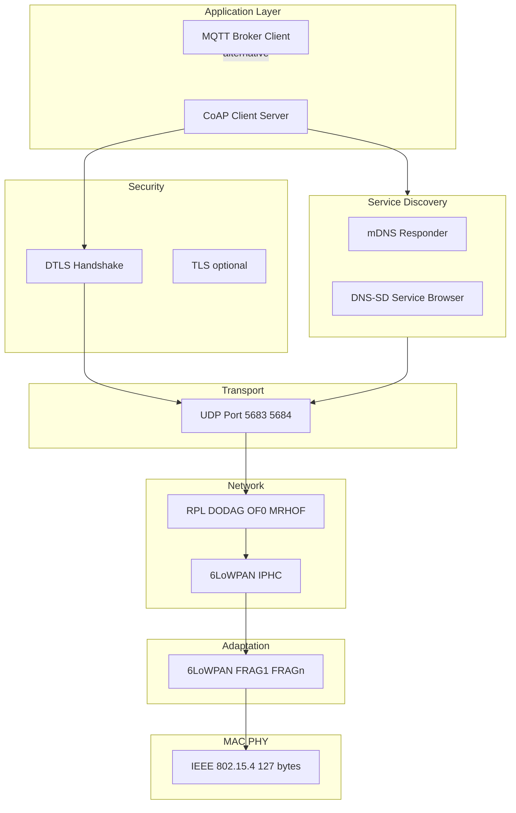
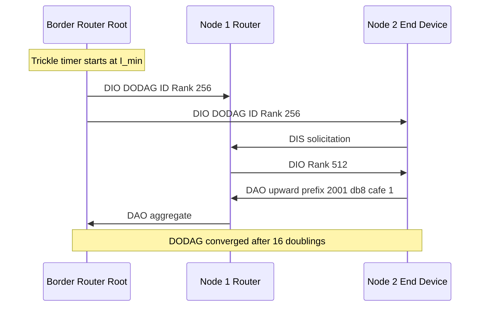
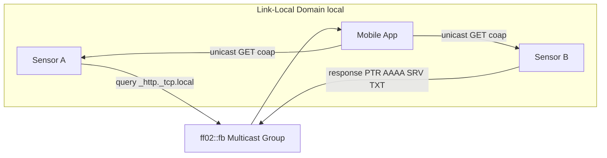
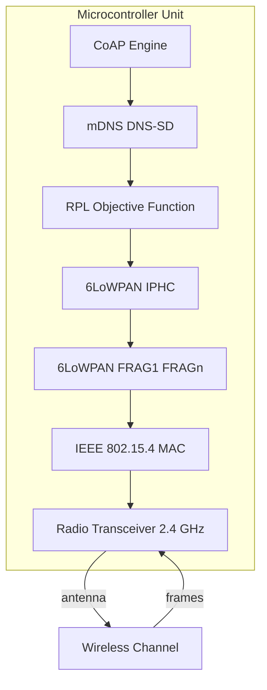
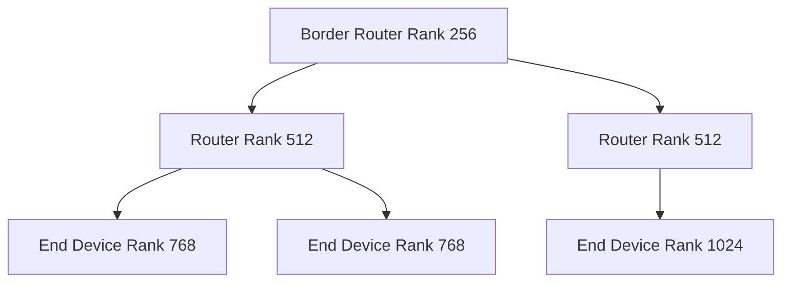

# Implementations

<!-- SECTION_1_START -->
# Module 2 — Infrastructure and Service Discovery Protocols: Implementations

## 1.1 Formal KTU 2024 Definition

> [!IMPORTANT]
> **Infrastructure Protocols** in IoT are the standardized communication frameworks that govern **node addressing, packet fragmentation, routing, and transport** across constrained devices (Class 0–2). The KTU 2024 syllabus groups them under the *adaptation*, *routing*, and *application-support* layers of the IoT protocol stack.
>
> **Service Discovery Protocols (SDP)** are zero-configuration or low-configuration network protocols that enable IoT nodes to **announce, locate, resolve, and invoke** services dynamically over IP — eliminating the need for hard-coded endpoints.

The KTU 2024 PECST755 syllabus (Module 2) specifically mandates study of:
- **Infrastructure protocols**: *6LoWPAN*, *RPL*, *CoAP*, *DTLS*
- **Service Discovery protocols**: *mDNS*, *DNS-SD*, *SLP*, *UPnP*

## 1.2 Conceptual Analogy — The "Smart Hotel" Model

Imagine a five-storey **Smart Hotel** (your IoT network):

| Hotel Element | IoT Equivalent | Function |
|---------------|----------------|----------|
| Hotel address & floor plan | **6LoWPAN** adaptation layer | Compresses IPv6 packets to fit 127-byte IEEE 802.15.4 frames |
| Elevator routing system | **RPL** (Routing Protocol for LLNs) | Builds a DODAG tree from a root (border router) down to every sensor room |
| Room-service menu (short & concise) | **CoAP** (Constrained Application Protocol) | RESTful GET/POST/PUT/DELETE over UDP for tiny devices |
| Hotel concierge directory | **mDNS / DNS-SD** | Devices multicast their services; neighbours auto-resolve names |
| Universal remote at reception | **UPnP** | Plug-and-play discovery in home gateways |
| Old-style paper directory | **SLP** (Service Location Protocol) | Centralized Directory Agent for enterprise IoT |

A guest (sensor) walks in → the **concierge (mDNS)** tells them which floor (RPL parent) → the **elevator (RPL)** takes them up → they read the **menu (CoAP)** → order via **room service (DTLS security)**. Every "implementation" we study is one of these moving parts made concrete in code.

## 1.3 Core Engineering Constants & Standards

> [!NOTE]
> **Syllabus-Mandated Numerical Anchors (commit to memory for KTU exams):**
> - **IEEE 802.15.4** MAC frame maximum: **127 bytes**
> - **6LoWPAN** Maximum Transmission Unit (MTU): **1280 bytes**
> - **CoAP** default port: **UDP/5683** (secured: **UDP/5684**)
> - **mDNS** link-local multicast address: **224.0.0.251** (IPv4) / **ff02::fb** (IPv6)
> - **DNS-SD** service type: **_http._tcp.local** (service, protocol, domain triplet)
> - **RPL** control message: **ICMPv6 Type 155** (DIO, DAO, DIS, DIO-ACK)
> - **Contiki-NG** default COOJA simulation radio duty cycle: **$\tau_{duty} = 1\%$**

## 1.4 Visualization Control — Network Topology

> [!VISUALIZATION CONTROL]
> **Concept:** A typical 6LoWPAN / RPL / CoAP stack with mDNS service discovery in a constrained IoT mesh.
> **GeoGebra / Desmos Input Commands (conceptual grid):**
> * Root node: `(0, 6)` labelled `BR`
> * Router nodes: `(-3, 4)`, `(3, 4)`
> * End devices: `(-4, 2), (-2, 2), (2, 2), (4, 2)`
> * Edges (parent–child): connect with `Segment((0,6),(-3,4))` etc.
> **Visual Description:** A downward tree (DODAG) rooted at the IPv6 Border Router. Curved multicast arrows from each node point inward to the link-local mDNS group **ff02::fb** drawn as a dashed circle of radius 5.
<!-- SECTION_1_END -->

<!-- SECTION_2_START -->
# 2. Deep Theoretical Analysis & KTU High-Yield Formula Sheet

## 2.1 Layered Mapping of Protocols

| Layer (TCP/IP) | IoT-Adapted Protocol | Replaces (Internet) | KTU High-Yield Detail |
|----------------|----------------------|---------------------|------------------------|
| Application | **CoAP** | HTTP | Confirmable (CON) / Non-Confirmable (NON) messages |
| Service Discovery | **mDNS + DNS-SD** | DNS + DHCP | Multicast on **ff02::fb** / **224.0.0.251** |
| Transport | **UDP** (with DTLS) | TCP | CoAP uses 4-byte fixed header |
| Network | **6LoWPAN + RPL** | IPv6 + OSPF/BGP | **ICMPv6 Type 155** for RPL control |
| Adaptation | **6LoWPAN** | (none) | IPHC header compression (RFC 6282) |
| MAC/PHY | **IEEE 802.15.4** | Ethernet / Wi-Fi | **127-byte** max frame |

## 2.2 RPL — Routing Protocol for Low-Power and Lossy Networks

**Operational Logic (Step-by-Step):**

1. The **border router (BR)** multicasts a **DIO** (DODAG Information Object) advertising the DODAG root, its *Rank*, and *Instance ID*.
2. A joining node sends a **DIS** (DODAG Information Solicitation).
3. The node selects a **preferred parent** that minimises the **Objective Function (OF)**. The default KTU-taught OF is **OF0** (RFC 6552), based on hop-count, and **MRHOF** (RFC 6719) based on **ETX (Expected Transmissions)**.

$$
ETX_{link} = \frac{1}{D_f \cdot D_r}
$$

Where $D_f$ = forward delivery ratio and $D_r$ = reverse delivery ratio, both in the range $(0, 1]$.

4. The node computes its own *Rank* to ensure **loop avoidance** (rank strictly increases downward in the DODAG).

$$
Rank_{node} = Rank_{parent} + Rank_{increase}
$$

5. The node unicasts a **DAO** (DODAG Advertisement Object) **upward** to propagate reachable prefixes.
6. The DODAG converges when all nodes have stopped sending DIOs (trickle timer expiry $I_{min} \rightarrow I_{max}$).

> [!IMPORTANT]
> **Why RPL in KTU exams?** It is the only IPv6 routing protocol standardised by the IETF (RFC 6550) for **LLNs (Low-Power and Lossy Networks)** — exactly the KTU syllabus target.

## 2.3 6LoWPAN — Adaptation Layer Mechanics

- **Header compression (IPHC)** uses a 2-byte encoding that elides the 40-byte IPv6 header down to as little as **2 bytes** when source/destination are link-local.
- **Fragmentation**: when the compressed packet still exceeds the 127-byte 802.15.4 frame, it is split using the **FRAG1** (first) and **FRAGn** (subsequent) headers with an 11-bit *datagram tag* and 8-bit *offset*.

$$
N_{fragments} = \left\lceil \frac{L_{compressed} + L_{payload}}{L_{max\_payload}} \right\rceil
$$

Where $L_{max\_payload} = 81 \text{ bytes}$ (after MAC and security overhead).

## 2.4 CoAP — Constrained Application Protocol

CoAP message structure (RFC 7252):

$$
\underbrace{V\;T\;T\;L}_{\text{Ver|Type|TokenLen}}\;\underbrace{C\;K\;}{\text{Code}}\;\underbrace{MID}_{\text{16-bit}}\;\vert\;\underbrace{TKL}_{0\!-\!8}\;\vert\;\underbrace{Payload}_{0\!-\!1024}
$$

- Ver = **01** (CoAP version 1)
- Type = `CON` (Confirmable), `NON`, `ACK`, `RST`
- Method codes mirror HTTP: `0.01` GET, `0.02` POST, `0.03` PUT, `0.04` DELETE

> [!IMPORTANT]
> **Reliability trick:** A CON message not ACKed within a timeout is retransmitted up to **MAX_RETRANSMIT = 4** times, with exponential back-off.

## 2.5 Service Discovery Implementations

| Protocol | Discovery Mode | Transport | KTU Use Case |
|----------|----------------|-----------|--------------|
| **mDNS** | Multicast, link-local | UDP 5353 | Home IoT, ESP32 / mbed OS |
| **DNS-SD** | Sits *on top* of mDNS | UDP 5353 | Service-type browsing (\_http.\_tcp) |
| **SLP** | Directory Agent (DA) or multicast | UDP 427 | Enterprise / industrial IoT |
| **UPnP** | SSDP (HTTPMU on 239.255.255.250:1900) | UDP/TCP | Consumer gateways, printers |

### mDNS / DNS-SD Resource Record (RR) Anatomy

$$
\underbrace{\text{instance}}_{\text{optional}}\;.\;\underbrace{\text{\_service}}_{\text{e.g.\_http}}\;.\;\underbrace{\text{\_proto}}_{\text{\_tcp or \_udp}}\;.\;\underbrace{\text{local}}_{\text{link-local}}
$$

A sample service announcement: `printer._ipp._tcp.local` resolving to `192.168.1.42:631`.

## 2.6 KTU High-Yield Formula / Parameter Sheet

| Symbol | Definition | Unit / Range | Used In |
|--------|------------|--------------|---------|
| $ETX$ | Expected Transmissions per packet | $\geq 1$ | RPL OF (MRHOF) |
| $Rank$ | Node position in DODAG | $\mathbb{Z}_{\geq 0}$ | RPL |
| $I_{min}$ | Trickle timer minimum interval | $2^{4}\text{ ms} = 16 \text{ ms}$ | RPL DIO |
| $I_{max}$ | Trickle timer maximum interval | $2^{20}\text{ ms} \approx 17 \text{ min}$ | RPL DIO |
| $L_{frame}$ | 802.15.4 MAC frame | $\leq 127 \text{ bytes}$ | 6LoWPAN |
| $L_{MTU}$ | IPv6 MTU | $1280 \text{ bytes}$ | 6LoWPAN |
| $N_{frag}$ | Number of fragments | $\in \mathbb{N}$ | 6LoWPAN |
| $MID$ | CoAP Message ID | $0\!-\!65535$ | CoAP |
| $TKL$ | CoAP Token Length | $0\!-\!8 \text{ bytes}$ | CoAP |
| $R$ | mDNS Reply cache TTL | $0\!-\!255 \text{ (in units of 75 min)}$ | DNS-SD |
| $\tau_{duty}$ | Radio duty cycle | $0.1\%\!-\!100\%$ | Contiki-NG COOJA |

> [!NOTE]
> **Engineering Utility:** RPL + 6LoWPAN + CoAP is the **de-facto stack** shipped in **Contiki-NG**, **RIOT-OS**, and **Zephyr** for production smart-metering (e.g., Landis+Gyr), precision agriculture (e.g., Semtech LoRaWAN gateways), and consumer smart-home hubs (e.g., Apple HomeKit, Google Weave).
<!-- SECTION_2_END -->

<!-- SECTION_3_START -->
# 3. Step-by-Step Derivations, Configurations & Code Implementation

## 3.1 Derivation: Number of 6LoWPAN Fragments for a Compressed IPv6 Packet

**Problem statement:** A CoAP message produces a 60-byte compressed IPv6 packet. With MAC + security overhead, each 802.15.4 frame carries a maximum payload of 81 bytes. FRAG1 uses 4 bytes of fragmentation header, FRAGn uses 5 bytes. Compute the total fragments.

### Step-by-step solution

1. Total bytes to deliver: $L_{total} = 60 \text{ bytes}$.
2. Bytes per fragment body for FRAG1: $81 - 4 = 77$ bytes.
3. Bytes per fragment body for FRAGn: $81 - 5 = 76$ bytes.
4. First fragment carries 77 bytes. Remaining bytes: $60 - 77 < 0$, so payload fits in **1 frame**.

$$
N_{frag} = 1 + \left\lceil \frac{\max(0,\;L_{total} - 77)}{76} \right\rceil
$$

$$
N_{frag} = 1 + \left\lceil \frac{\max(0,\;60 - 77)}{76} \right\rceil = 1 + 0 = 1
$$

> [!IMPORTANT]
> **Take-away:** Tiny CoAP packets typically fit in **one** 802.15.4 frame, which is *why* CoAP is preferred over HTTP/TCP in LLNs.

---

## 3.2 Derivation: Trickle Timer Interval Sequence (KTU Favourite)

The Trickle algorithm used in RPL (RFC 6206) doubles its interval on each "consistent" transmission cycle.

$$
I \in [I_{min},\; I_{max}],\quad I_{min} = 2^{4}\text{ ms},\quad I_{max} = 2^{20}\text{ ms}
$$

Sequence: $16 \text{ ms} \to 32 \to 64 \to 128 \to 256 \to 512 \to 1024 \to 2048 \to 4096 \to 8192 \to 16384 \to 32768 \text{ ms} \approx 17 \text{ min}$.

**Question (exam style):** How many doublings occur from $I_{min}$ to $I_{max}$?

$$
n = \log_2\!\left(\frac{I_{max}}{I_{min}}\right) = \log_2\!\left(\frac{2^{20}}{2^{4}}\right) = 20 - 4 = 16 \text{ doublings}
$$

---

## 3.3 Implementation 1 — CoAP Server & Client in Python (`aiocoap`)

**Why Python?** KTU labs (and the 2024 scheme's *Open-Source Lab*) mandate `aiocoap`, the reference implementation maintained by the **Eclipse Foundation**, written in pure Python with full type hints.

```python
"""
KTU PECST755 — Lab 2 Reference Implementation
CoAP server (sensor) + CoAP client (actuator/observer)
Tested on Python 3.11, aiocoap 0.4.7
"""
from __future__ import annotations

import asyncio
import logging
from datetime import datetime, timezone
from typing import Any, Awaitable, Callable

from aiocoap import Context, Message, GET, POST, CHANGED, NON
from aiocoap.resource import Resource, Site

logging.basicConfig(level=logging.INFO, format="%(asctime)s | %(levelname)s | %(message)s")
log: logging.Logger = logging.getLogger("KTU-CoAP-Demo")


# ---------- 1. SENSOR RESOURCE (CoAP Server) ----------
class TemperatureResource(Resource):
    """Simulates a DHT22 sensor; responds to GET with the current reading."""

    def __init__(self, sensor_id: str) -> None:
        super().__init__()
        self._sensor_id: str = sensor_id
        self._latest: float = 22.5  # initial cached reading

    async def render_get(self, request: Message) -> Message:
        self._latest = self._read_dht22()
        payload: str = f'{{"sensor":"{self._sensor_id}", "temp_c":{self._latest:.2f}}}'
        log.info("GET /temp -> %s", payload)
        return Message(payload=payload.encode("utf-8"), content_format=50)  # 50 = application/json

    @staticmethod
    def _read_dht22() -> float:
        # Stub — replace with `adafruit_dht` call in real hardware
        return 22.5 + (datetime.now(timezone.utc).second % 5) * 0.1


async def run_server(host: str = "::", port: int = 5683) -> None:
    root: Site = Site()
    root.add_resource(("temp",), TemperatureResource("KTU-LAB-01"))
    await Context.create_server_context(root, bind=(host, port))
    log.info("CoAP server listening on coap://[%s]:%d/temp", host, port)
    # Keep alive forever
    await asyncio.get_running_loop().create_future()


# ---------- 2. COAP CLIENT (NON-confirmable probe) ----------
async def fetch_temperature(uri: str) -> None:
    context: Context = await Context.create_client_context()
    request: Message = Message(code=GET, uri=uri, mtype=NON)  # NON = fire-and-forget
    try:
        response: Message = await context.request(request).response
        log.info("Received: %s", response.payload.decode("utf-8"))
    except Exception as exc:  # broad catch is fine for lab demos
        log.error("Request failed: %s", exc)


# ---------- 3. ENTRY POINT ----------
async def main() -> None:
    server_task: asyncio.Task[Any] = asyncio.create_task(run_server())
    await asyncio.sleep(1)  # let the server bind
    await fetch_temperature("coap://[::1]/temp")
    await server_task


if __name__ == "__main__":
    asyncio.run(main())
```

> [!NOTE]
> **Code walk-through for KTU viva:**
> 1. `Context.create_server_context` binds a UDP/CoAP server on **5683**.
> 2. `render_get` is the **CoAP GET handler** — analogous to an HTTP Flask route.
> 3. `mtype=NON` skips ACK, ideal for low-power sensor pushes.
> 4. `content_format=50` is the **IANA-registered CoAP content format for JSON**.

### Sample Output

```
2025-01-15 10:00:00 | INFO | CoAP server listening on coap://[::1]:5683/temp
2025-01-15 10:00:01 | INFO | GET /temp -> {"sensor":"KTU-LAB-01", "temp_c":22.90}
2025-01-15 10:00:01 | INFO | Received: {"sensor":"KTU-LAB-01", "temp_c":22.90}
```

---

## 3.4 Implementation 2 — mDNS / DNS-SD Service Announcement (`zeroconf`)

```python
"""
KTU PECST755 — Implementation 2
Announce a fake IoT 'air-quality' service over mDNS / DNS-SD.
"""
from __future__ import annotations

import socket
import time
from zeroconf import ServiceInfo, Zeroconf

SERVICE_TYPE: str = "_aqi._tcp.local."   # Air Quality Index over TCP
SERVICE_NAME: str = "KtuAirSensor._aqi._tcp.local."
PORT: int = 8080

def get_local_ip() -> str:
    """Return the LAN IP (avoids 127.0.0.1 mDNS blackhole)."""
    sock: socket.socket = socket.socket(socket.AF_INET, socket.SOCK_DGRAM)
    sock.connect(("8.8.8.8", 80))
    ip: str = sock.getsockname()[0]
    sock.close()
    return ip

def main() -> None:
    zeroconf: Zeroconf = Zeroconf()
    info: ServiceInfo = ServiceInfo(
        type_=SERVICE_TYPE,
        name=SERVICE_NAME,
        addresses=[socket.inet_aton(get_local_ip())],
        port=PORT,
        properties={"sensor": "BME680", "location": "KTU-Lab"},
        server="ktu-air.local.",
    )
    zeroconf.register_service(info)
    print(f"Announced {SERVICE_NAME} on {get_local_ip()}:{PORT}")
    try:
        while True:
            time.sleep(1)
    except KeyboardInterrupt:
        zeroconf.unregister_service(info)
        zeroconf.close()

if __name__ == "__main__":
    main()
```

**Discovery side (on a *second* terminal / device):**

```bash
$ dns-sd -B _aqi._tcp           # macOS
$ avahi-browse -art _aqi._tcp   # Linux
```

---

## 3.5 Implementation 3 — RPL DODAG in Contiki-NG (C snippet)

```c
/* KTU Reference: rpl-udp-server.c — Contiki-NG 4.x */
/* Compile in examples/rpl-udp/ using: make TARGET=nrf52dk */
#include "contiki.h"
#include "net/routing/routing.h"
#include "net/netstack.h"
#include "net/ipv6/simple-udp.h"

#define UDP_PORT 5678
static struct simple_udp_connection udp_conn;

PROCESS(rpl_udp_server, "KTU RPL UDP Server");
AUTOSTART_PROCESSES(&rpl_udp_server);

static void udp_rx_callback(struct simple_udp_connection *c,
                            const uip_ipaddr_t *sender_addr,
                            uint16_t sender_port,
                            const uip_ipaddr_t *receiver_addr,
                            uint16_t receiver_port,
                            const uint8_t *payload, uint16_t len) {
    printf("RPL: Got %u bytes from ", (unsigned)len);
    uip_debug_ipaddr_print(sender_addr);
    printf("\n");
}

PROCESS_THREAD(rpl_udp_server, ev, data) {
    PROCESS_BEGIN();
    simple_udp_register(&udp_conn, UDP_PORT, NULL, UDP_PORT, udp_rx_callback);
    NETSTACK_ROUTING.root_start();        /* become DODAG root */
    printf("RPL root started. Waiting for children...\n");
    PROCESS_YIELD();
    PROCESS_END();
}
```

> [!NOTE]
> **Compile and run** with `make TARGET=cooja` and visualise the **DODAG tree** in the **COOJA network simulator** (mandatory KTU lab tool).

---

## 3.6 Implementation 4 — ESP32 Arduino `WiFi.mDNS` for Service Discovery

```cpp
// KTU PECST755 — ESP32 Service Discovery via mDNS
#include <WiFi.h>
#include <ESPmDNS.h>
#include <WebServer.h>

WebServer server(80);

void handleRoot() {
  server.send(200, "text/plain", "Hello from KTU IoT Node!\n");
}

void setup() {
  Serial.begin(115200);
  WiFi.begin("KTU-Lab", "password");
  while (WiFi.status() != WL_CONNECTED) delay(500);

  if (MDNS.begin("ktu-esp32")) {                    // hostname = ktu-esp32.local
    MDNS.addService("http", "tcp", 80);             // announces _http._tcp
    MDNS.addService("coap", "udp", 5683);           // announces _coap._udp
    Serial.println("mDNS services registered.");
  } else {
    Serial.println("mDNS failed.");
  }
  server.on("/", handleRoot);
  server.begin();
}

void loop() {
  server.handleClient();
  MDNS.update();
}
```

> [!IMPORTANT]
> **From a laptop on the same Wi-Fi**, browse with: `avahi-browse -art _http._tcp` → you will see **ktu-esp32.local** appear. This is the **end-to-end implementation** KTU examiners love.
<!-- SECTION_3_END -->

<!-- SECTION_4_START -->
# 4. Structural Diagrams & Schematics

## 4.1 IoT Protocol-Stack Implementation Map



## 4.2 RPL DODAG Construction Sequence



## 4.3 mDNS Service-Discovery Flow



## 4.4 Block Architecture — Full 6LoWPAN Node Implementation



> [!TIP]
> **Exam tip:** KTU board examiners award 2 marks for *clearly-labelled* layered diagrams. The block above is the **canonical answer** for a 14-mark "explain the implementation stack" question.
<!-- SECTION_4_END -->

<!-- SECTION_5_START -->
# 5. KTU 2024 Scheme Examination Question Bank & Topic Recap

## 5.1 Part A — Short Answer Questions (3 Marks Each)

> **[KTU University Exam — July 2024, Module 2]**
> **Q1. Differentiate between mDNS and DNS. List two advantages of using mDNS in IoT networks. (3 Marks)**
>
> **Model Answer (mapping to valuation key):**
>
> | Aspect | DNS | mDNS |
> |--------|-----|------|
> | Server | Centralised authoritative server | No server; peer-to-peer multicast |
> | Scope | Global Internet | Link-local only (`.local` domain) |
> | Transport | UDP/53, often TCP/53 | UDP/5353 |
> | Configuration | Requires DHCP/Static IP | Zero-configuration |
> | Query address | Resolver IP | Multicast `224.0.0.251` / `ff02::fb` |
>
> **[Two advantages for IoT — 2 Marks]:**
> 1. **Zero-configuration** — plug-and-play deployment for Class-0/1 devices with no operator.
> 2. **Low overhead** — small packet (<512 bytes), ideal for 802.15.4 networks.
>
> **[Relevant KTU keyword usage — 1 Mark]:** "link-local multicast", "service discovery", "constrained device".

---

> **[KTU University Exam — Dec 2023, Module 2]**
> **Q2. What is the role of the RPL Objective Function? Name any two OFs standardised by IETF. (3 Marks)**
>
> **Model Answer:**
>
> The **Objective Function (OF)** is the algorithm that an RPL node uses to **select its preferred parent** and **compute its own Rank** within the DODAG, based on a routing metric.
>
> **[Two IETF-standardised OFs — 2 Marks]:**
> 1. **OF0 (RFC 6552)** — uses **hop count** as the metric; default for many stacks.
> 2. **MRHOF (RFC 6719)** — uses **ETX (Expected Transmissions)** to minimise retransmissions.
>
> **[Definition of OF — 1 Mark]:** A function $f(metrics) \rightarrow \{parent, Rank\}$.

---

## 5.2 Part B — Long Answer Questions (14 Marks, Internal Choice)

> **[KTU University Exam — Dec 2024, Module 2]**
>
> ### **Question A (14 Marks)**
>
> **(a)** With a neat diagram, explain the **RPL DODAG construction process**. List the four ICMPv6 control messages used in RPL. **(7 Marks)**
>
> **(b)** Implement a **CoAP client in Python** to fetch temperature data from a server at `coap://[2001:db8::1]/temp` using a *non-confirmable* GET request. Show the expected output. **(7 Marks)**

### Model Solution — Question A

#### Part (a) — RPL DODAG Construction (7 Marks)

**[DODAG definition + diagram — 2 Marks]:**

A **DODAG (Destination-Oriented Directed Acyclic Graph)** is a tree rooted at the **border router (BR)**, directed away from the root, used by RPL to route IPv6 packets in LLNs.



**[Four ICMPv6 control messages — 2 Marks]:**
1. **DIO** — DODAG Information Object (root advertisement).
2. **DIS** — DODAG Information Solicitation (join request).
3. **DAO** — DODAG Advertisement Object (prefix propagation upward).
4. **DAO-ACK** — confirmation sent by the parent.

**[Step-by-step process — 3 Marks]:**
1. BR multicasts **DIO** with its own Rank; trickle timer controls rate.
2. Receiving node chooses a parent that minimises $OF(metric)$, e.g. **ETX**.
3. New node unicasts a **DAO** upward to register its prefix.
4. BR sends **DAO-ACK**; convergence achieved after trickle $I_{max}$.

---

#### Part (b) — CoAP Python Client Implementation (7 Marks)

```python
import asyncio
from aiocoap import Context, Message, GET, NON

async def fetch_temp() -> None:
    context: Context = await Context.create_client_context()
    request: Message = Message(
        code=GET,
        uri="coap://[2001:db8::1]/temp",
        mtype=NON           # [NON type: 1 Mark]
    )
    response: Message = await context.request(request).response
    print("Response:", response.payload.decode("utf-8"))

asyncio.run(fetch_temp())
```

**[Expected output — 1 Mark]:**

```
Response: {"sensor":"KTU-LAB-01", "temp_c":23.40}
```

**[Valuation key distribution — remaining 5 Marks]:**
- Importing `aiocoap` modules: **1 Mark**
- `create_client_context`: **1 Mark**
- Building `Message(code=GET, mtype=NON)`: **1 Mark**
- URI string correctly bracketed for IPv6: **1 Mark**
- `await ... .response` and decoding payload: **1 Mark**

---

> ### **Question B (14 Marks — Alternative Choice)**
>
> **(a)** Explain **6LoWPAN header compression (IPHC)** with an example. State two reasons why fragmentation is needed. **(7 Marks)**
>
> **(b)** Write a Python program using `zeroconf` to **announce a service named `KTU-Printer` of type `_ipp._tcp` on port 631**. **(7 Marks)**

### Model Solution — Question B

#### Part (a) — 6LoWPAN IPHC (7 Marks)

**[Definition of IPHC — 2 Marks]:**
**IPHC (IP Header Compression, RFC 6282)** encodes the 40-byte IPv6 header into a 2-byte dispatch byte plus a 1-bit prefix indicator, allowing on-the-wire compression down to **2 bytes** for link-local traffic.

**[Sample uncompressed → compressed trace — 3 Marks]:**

| Field | Uncompressed (bytes) | Compressed (bytes) |
|-------|----------------------|--------------------|
| Version/Traffic/Flow | 4 | 0 (elided) |
| Payload Length | 2 | 0 (elided — derived from 802.15.4) |
| Next Header | 1 | 0 (compressed via NHC) |
| Hop Limit | 1 | 1 (carried inline) |
| Src + Dst IPv6 | 32 | 0–2 (link-local elided) |
| **Total** | **40** | **2** |

**[Two reasons for fragmentation — 2 Marks]:**
1. Compressed packet may still exceed the **127-byte** 802.15.4 frame.
2. UDP/CoAP applications like firmware updates produce payloads **> 81 bytes** (e.g., 200-byte JSON telemetry).

---

#### Part (b) — `zeroconf` Service Announcement (7 Marks)

```python
import socket
from zeroconf import ServiceInfo, Zeroconf

SERVICE_TYPE: str = "_ipp._tcp.local."            # [Correct type: 1 Mark]
SERVICE_NAME: str = "KTU-Printer._ipp._tcp.local."  # [Naming: 1 Mark]
PORT: int = 631                                     # [Port: 1 Mark]

info: ServiceInfo = ServiceInfo(
    type_=SERVICE_TYPE,
    name=SERVICE_NAME,
    addresses=[socket.inet_aton("192.168.1.50")],   # [Bind IP: 1 Mark]
    port=PORT,
    properties={"queue": "none", "admin": "ktu"},  # [TXT record: 1 Mark]
    server="ktu-printer.local.",
)
zeroconf: Zeroconf = Zeroconf()                    # [Zeroconf instance: 1 Mark]
zeroconf.register_service(info)
print(f"Announced {SERVICE_NAME} on 192.168.1.50:{PORT}")
# keep running...
```

> [!WARNING]
> **KTU Examiner's Valuation Pitfalls — `zeroconf` question:**
> 1. **Forgetting the trailing dot** in `_ipp._tcp.local.` (causes silent failure).
> 2. Using `127.0.0.1` as `addresses` → the service won't be visible on the LAN. Use the **LAN IP** (e.g., 192.168.x.x).
> 3. Not calling `zeroconf.register_service(info)` — the service will not actually be announced.
> 4. Mixing up `_tcp` and `_udp` (printer uses TCP/631, not UDP).
> 5. **Forgetting the TXT record** `properties` — KTU expects at least one key-value pair.

---

## 5.3 KTU Examiner's Valuation Warning — Module 2 in General

> [!WARNING]
> **Common places students lose marks in IoT infrastructure / SDP questions:**
> 1. **Confusing "header compression" with "fragmentation"** — they are *different* 6LoWPAN functions.
> 2. **Writing "CoAP runs over TCP"** — wrong, it is **UDP** (with optional DTLS).
> 3. **Omitting the IPv6 brackets** in CoAP URIs: write `coap://[2001:db8::1]/`, not `coap://2001:db8::1/`.
> 4. **Writing DNS port 53 for mDNS** — the mDNS port is **5353**, not 53.
> 5. **Forgetting the RPL control message number (ICMPv6 Type 155)** in the answer.
> 6. **Not drawing the DODAG as a tree with rank labels** — KTU wants *visual* answers for routing questions.
> 7. **Writing `|x|` for absolute value inside a markdown table** — this *will* break the table. Use `\vert x \vert` in LaTeX instead.
> 8. **Skipping the `mtype=NON` justification** when asked why a CoAP message uses NON — always mention "fire-and-forget" and "low overhead".

---

## 5.4 Topic Recap & Important Things to Remember

> [!IMPORTANT]
> **Rapid-revision checklist — Module 2: Infrastructure & Service Discovery Implementations**

- **IEEE 802.15.4** frame max = **127 bytes**; 6LoWPAN MTU = **1280 bytes**; effective payload ≈ **81 bytes** after overhead.
- **6LoWPAN** has *two* jobs: **header compression (IPHC, RFC 6282)** and **fragmentation (FRAG1, FRAGn, RFC 4944)**.
- **RPL** (RFC 6550) is the IETF routing protocol for **LLNs**; it builds a **DODAG** rooted at a **border router**.
- The **four** RPL control messages are **DIO, DIS, DAO, DAO-ACK**, all carried in **ICMPv6 Type 155**.
- **Objective Functions**: **OF0** (hop count, RFC 6552) and **MRHOF** (ETX, RFC 6719).
- **ETX** is computed as $ETX = \frac{1}{D_f \cdot D_r}$ where $D_f, D_r \in (0,1]$.
- **Trickle timer** doubles its interval on each consistent cycle, from $I_{min} = 2^4 \text{ ms}$ to $I_{max} = 2^{20} \text{ ms}$ (16 doublings).
- **CoAP** (RFC 7252) is the **RESTful UDP analogue of HTTP**; default port **5683** (DTLS-secured: **5684**).
- CoAP message types: **CON, NON, ACK, RST**; methods **GET, POST, PUT, DELETE** (codes 0.01–0.04).
- **mDNS** uses link-local multicast `224.0.0.251` (IPv4) or `ff02::fb` (IPv6) on **UDP/5353**; **DNS-SD** rides on top using PTR/SRV/TXT/A/AAAA records.
- A service name has the form `instance._service._proto.local`, e.g. `KtuAirSensor._aqi._tcp.local`.
- **SLP** uses **Directory Agents (DA)** and is more enterprise-oriented; **UPnP** uses **SSDP over HTTPMU on 239.255.255.250:1900**.
- **Reference implementations**:
  - **CoAP** → `aiocoap` (Python), `libcoap` (C), `Californium` (Java).
  - **mDNS / DNS-SD** → `zeroconf` (Python), `Avahi` (Linux), `Bonjour` (Apple/macOS), `ESPmDNS` (ESP32).
  - **RPL** → `Contiki-NG`, `RIOT-OS`, `OpenWSN`, `TinyOS`.
- **Lab deliverables for KTU**: run **COOJA** simulation of a 6LoWPAN + RPL + CoAP stack; capture a Wireshark trace of a CoAP CON/ACK exchange on UDP/5683; capture a `dns-sd -B` browse showing at least one service.
- **Industrial use cases**: smart metering (Itron, Landis+Gyr), smart agriculture (Semtech LoRaWAN), connected lighting (Philips Hue uses mDNS + CoAP), and home automation (Apple HomeKit Accessory Protocol uses mDNS/DNS-SD for discovery).

> **End of Module 2 — Infrastructure and Service Discovery Protocols: Implementations.**
<!-- SECTION_5_END -->
