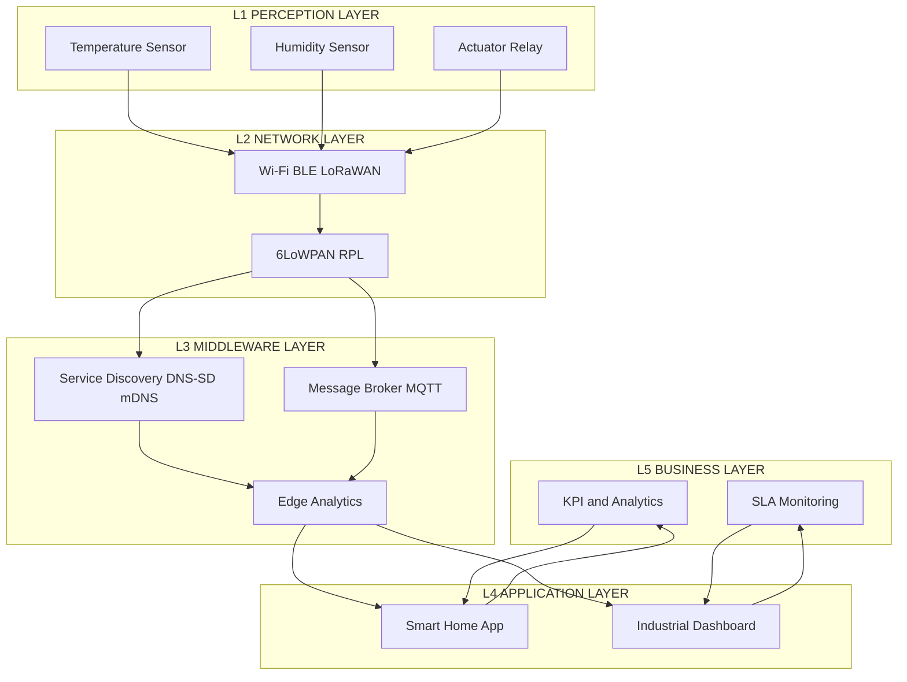
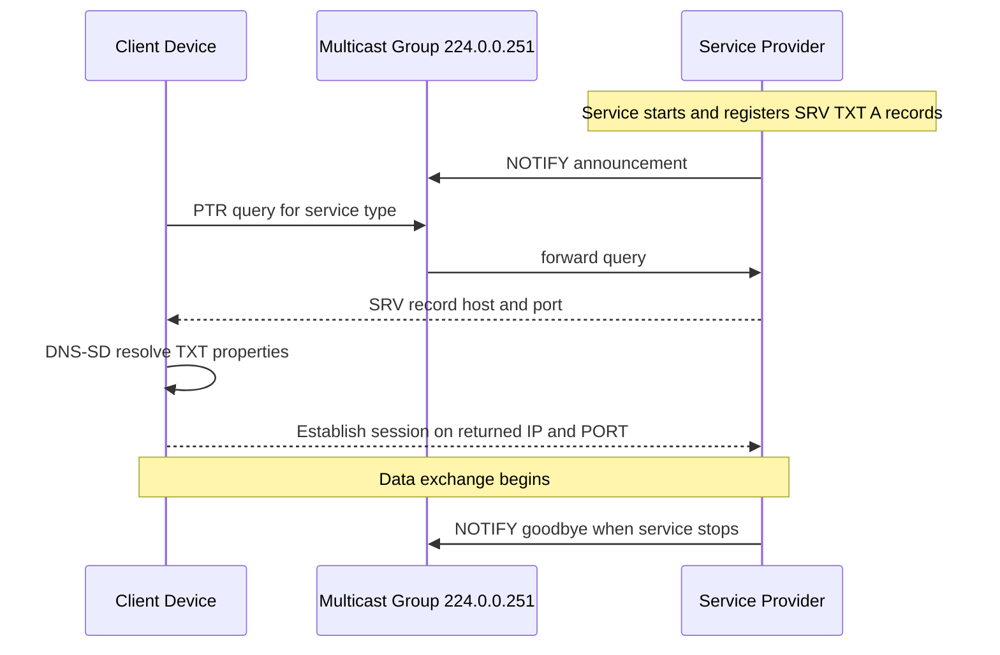
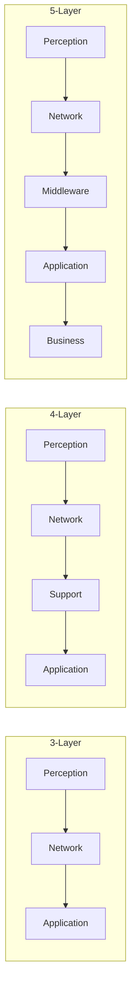
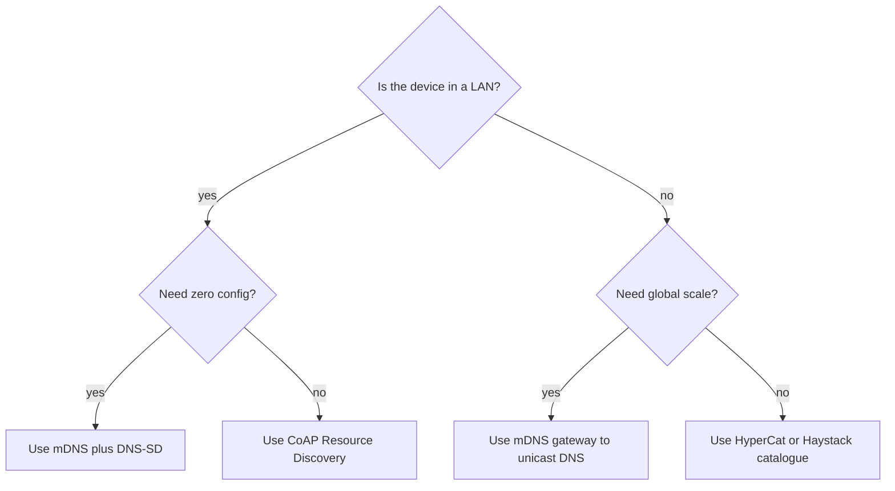

# Infrastructure and Service Discovery Protocols - Layered Architecture for IoT

<!-- SECTION_1_START -->
# Infrastructure and Service Discovery Protocols — Layered Architecture for IoT

## 1.1 Formal Definition

> [!IMPORTANT]
> **IoT Layered Architecture (KTU 2024 Syllabus Definition):**
> A **Layered Architecture for IoT** is a modular reference model that decomposes the end-to-end IoT system into discrete, interoperable functional planes — typically spanning *Perception/Sensing*, *Network/Transport*, *Middleware/Processing*, *Application*, and *Business* layers — so that heterogeneous devices, communication protocols, and service-discovery mechanisms can be designed, scaled, and maintained independently.

**Service Discovery Protocol (SDP):**
> A Service Discovery Protocol is a network-level mechanism that enables IoT nodes to *announce* their offered services and *resolve* services offered by other nodes dynamically, without prior hard-coded configuration. Core SDPs in the IoT ecosystem include **DNS-SD (DNS Service Discovery)**, **mDNS (multicast DNS)**, **UPnP (Universal Plug and Play)**, and **CoAP Resource Discovery**.

## 1.2 Intuitive Analogy

> [!NOTE]
> **Analogy — "The Smart Office Building":**
> Think of an IoT deployment as a multi-storey **smart office building**:
> - **Ground Floor (Perception Layer):** *Sensors and actuators* — the "eyes, ears, and hands" of the building (motion sensors, temperature probes, smart bulbs).
> - **Basement (Network Layer):** *Wiring, Wi-Fi routers, switches* — the building's nervous system that carries signals between floors.
> - **Middle Floor (Middleware/Processing Layer):** *Reception desk & security office* — receives raw signals, filters, authenticates, and forwards only meaningful data.
> - **Upper Floor (Application Layer):** *Tenants and dashboards* — the smart apps used by humans to control lighting, HVAC, or inventory.
> - **Rooftop (Business Layer):** *Owners and accountants* — analyze aggregated data to cut energy bills, plan expansion, and monetize insights.
>
> **Service Discovery** works exactly like a **building directory kiosk** at the entrance — a new tenant (device) registers its office number (IP), services (printing, Wi-Fi), and the kiosk helps visitors (other devices) locate the right tenant automatically.

## 1.3 Standard Metrics and Constants

> [!IMPORTANT]
> - **mDNS multicast address:** IPv4 → **224.0.0.251** ; IPv6 → **ff02::fb**
> - **CoAP default port:** **5683** ; DTLS-CoAP → **5684**
> - **UPnP SSDP multicast address:** **239.255.255.250:1900**
> - **DNS-SD service type example:** **_http._tcp.local**
> - **Physical layer bit-error target for IoT:** **BER ≤ $10^{-3}$** (acceptable) and **BER ≤ $10^{-5}$** (reliable)

## 1.4 Visualization Control Block

> [!VISUALIZATION CONTROL]
> **Concept:** Layered stack of an IoT system with vertical data flow.
> **GeoGebra / Desmos Input Equations:**
> - Layer rectangles: $L_1$ (bottom) → $L_5$ (top), each at heights $y = 0, 1, 2, 3, 4$.
> - Data-flow vector: $\vec{F} = (0, \, +1)$ (upward) for sensing, $\vec{F} = (0, \, -1)$ (downward) for actuation.
> **Visual Description:** A vertical stack of five labelled rectangles with upward and downward arrows showing bidirectional traffic between perception devices and business intelligence.

<!-- SECTION_1_END -->

<!-- SECTION_2_START -->
# 2. Deep Theoretical Analysis — Layered Architectures and Service Discovery

## 2.1 The 3-Layer Architecture (Reference Baseline)

The earliest and simplest IoT reference model, endorsed in early ITU-T and IETF drafts.

| Layer | Function | Example Components | Key Protocol |
|---|---|---|---|
| Perception (Sensing) | Physical signal capture & actuation | RFID, NFC, sensors, motors | GPIO, I2C, SPI, ZigBee PHY |
| Network | Routing & reliable transport | Gateway, router, switch | Wi-Fi, 6LoWPAN, MQTT broker |
| Application | End-user services | Smart home app, dashboard UI | HTTP, CoAP, WebSockets |

> [!NOTE]
> **Limitation:** The 3-layer model has no abstraction for **data storage, analytics, or context management**, which is why KTU 2024 (NEP 2020) emphasizes the **5-layer** model in Module 2.

## 2.2 The 4-Layer Architecture

Adds a **Support/Processing Layer** between Network and Application.

| Layer | Function | Technology Used |
|---|---|---|
| Perception | Sense / actuate | Sensors, RFID tags |
| Network | Transmission | Wi-Fi, BLE, LoRaWAN |
| Support (Processing) | Data filtering, aggregation, context-detection, security | Edge computing, fog nodes, in-memory DB (Redis) |
| Application | Smart services | Dashboards, ML models |

> [!IMPORTANT]
> The Support Layer is the **bridge between the physical world and the digital world**, handling real-time decisions at the edge.

## 2.3 The 5-Layer Architecture (KTU 2024 Preferred Model)

> [!IMPORTANT]
> This is the model drawn from **IWF (IoT World Forum) Reference Model** and adopted by KTU Module 2.

$$
L_{\text{IoT}} = \{ L_1 = \text{Perception}, \, L_2 = \text{Network}, \, L_3 = \text{Middleware}, \, L_4 = \text{Application}, \, L_5 = \text{Business} \}
$$

### 2.3.1 Layer 1 — Perception Layer
- **Role:** Captures physical phenomena (temperature $T$ in °C, humidity $H$ in %, light $L$ in lux).
- **Sensors/Actuators:** Temperature (DHT22), accelerometer (MPU6050), camera (OV2640), relay, motor driver.
- **Key Concerns:** Energy harvesting, calibration drift, hardware tamper resistance.

### 2.3.2 Layer 2 — Network Layer
- **Role:** Carries encrypted packets between perception devices and processing nodes.
- **Protocols:** $MQTT$, $CoAP$, $AMQP$, $DDS$, $HTTP/HTTPS$, $6LoWPAN$, $RPL$, $BLE$.
- **Quality of Service (QoS) targets:** Latency $\le 100\,\text{ms}$ (tactile IoT), Jitter $\le 10\,\text{ms}$.

### 2.3.3 Layer 3 — Middleware (Service) Layer
- **Role:** Acts as the **service bus**, providing *service discovery*, *identity resolution*, *message brokering*, and *context storage*.
- **Key Service Discovery Protocols (KTU Module 2 high-yield):**
  1. **DNS-SD** (RFC 6763) — pairs with mDNS for LAN-wide zero-config discovery.
  2. **mDNS** (RFC 6762) — UDP multicast 224.0.0.251:5353.
  3. **UPnP SSDP** — uses NOTIFY and M-SEARCH over UDP 1900.
  4. **CoAP Resource Discovery** — uses GET on `/.well-known/core` (RFC 6690).
  5. **HyperCat / Haystack** — catalog/JSON-based discovery for smart-cities.
  6. **Physical Web (Eddystone URI)** — BLE beacons.

### 2.3.4 Layer 4 — Application Layer
- **Role:** Delivers domain-specific services: smart agriculture, smart health, industrial IoT (IIoT), smart grid.
- **Technologies:** RESTful APIs, GraphQL, gRPC, serverless functions, ML inference.

### 2.3.5 Layer 5 — Business Layer
- **Role:** Translates data into revenue, compliance, and strategy.
- **Functions:** ROI calculation, SLA monitoring, predictive maintenance, regulatory reporting.

## 2.4 Service Discovery Protocols — Comparative Analysis

> [!IMPORTANT]
> The following table is a **KTU board-exam favorite**. Memorize the transport, port, and message pattern.

| Protocol | Transport | Default Port | Discovery Pattern | Suitable For | Message Size |
|---|---|---|---|---|---|
| mDNS | UDP (multicast) | 5353 | Query/Response | LAN, constrained | $\le 512$ bytes (single UDP) |
| DNS-SD | UDP (via mDNS) | 5353 | Browse / Resolve | Plug-and-play services | $\le 9000$ bytes (multi-packet) |
| UPnP SSDP | UDP (multicast) | 1900 | NOTIFY / M-SEARCH | Home networks | $\le 1500$ bytes |
| CoAP Discovery | UDP | 5683 | GET `/.well-known/core` | Constrained nodes | RESTful |
| BLE GATT | BLE radio | N/A | Service UUID scan | Wearables | $\le 244$ bytes/PDU |

## 2.5 Service Discovery Message Pattern (Generic)

Any SDP workflow follows the canonical pattern:

$$
\text{Discovery} = \underbrace{\text{Announcement}}_{\text{Service Provider}} \;\cup\; \underbrace{\text{Query}}_{\text{Client}} \;\cup\; \underbrace{\text{Response}}_{\text{Provider}} \;\cup\; \underbrace{\text{Resolution}}_{\text{Client}}
$$

For **DNS-SD**, the lifecycle is:

$$
\text{Register} \;\rightarrow\; \text{Browse} \;\rightarrow\; \text{Resolve} \;\rightarrow\; \text{Use} \;\rightarrow\; \text{Revoke}
$$

## 2.6 Real-World Engineering Utility

- **Smart Homes (Philips Hue, Google Home):** mDNS + DNS-SD auto-discovers bulbs.
- **Industrial IoT (Siemens MindSphere, Bosch IoT):** OPC UA + DNS-SD for shop-floor discovery.
- **Healthcare (IoMT):** CoAP discovery for low-power bedside monitors.
- **Smart Cities (HyperCat):** Catalogue of municipal services discoverable by any app.

> [!NOTE]
> In production, **service discovery is a prerequisite for zero-touch provisioning (ZTP)**, which is a key Industry 4.0 requirement.

<!-- SECTION_2_END -->

<!-- SECTION_3_START -->
# 3. Step-by-Step Derivations, Code & Implementation

## 3.1 Derivation — Five-Layer Information Flow

Let the IoT system be represented as the composition of five operators, one per layer, applied sequentially to raw sensor data $x_0$:

$$
y = L_5 \circ L_4 \circ L_3 \circ L_2 \circ L_1 \,(x_0)
$$

Step-by-step expansion:

$$
\begin{aligned}
x_1 &= L_1(x_0) && \text{perception: convert physical stimulus to digital sample} \\
x_2 &= L_2(x_1) && \text{network: encapsulate, encrypt, transmit, decapsulate} \\
x_3 &= L_3(x_2) && \text{middleware: validate, store, route to right consumer} \\
x_4 &= L_4(x_3) && \text{application: render, alert, or feed ML model} \\
y &= L_5(x_4) && \text{business: KPI generation, billing, forecasting}
\end{aligned}
$$

> [!NOTE]
> Each $L_i$ may be **lossy** (e.g., compression) and **latent** (delay $d_i$). Total latency is $\,D_{\text{total}} = \sum_{i=1}^{5} d_i$.

## 3.2 Derivation — Service Discovery Round-Trip Time (RTT)

For a mDNS query over a constrained network, total response time is:

$$
\begin{aligned}
T_{\text{RTT}} &= T_{\text{prop}} + T_{\text{proc}} + T_{\text{queue}} + T_{\text{tx}} + T_{\text{retx}}
\end{aligned}
$$

Where:
- $T_{\text{prop}} = d / v_p$ (propagation, $d$ = link length, $v_p \approx 2 \times 10^{8}\,\text{m/s}$ in fiber)
- $T_{\text{tx}} = L_{\text{PDU}} / R$ (transmission, $L_{\text{PDU}}$ packet size, $R$ link rate)
- $T_{\text{retx}} = \sum_{k=1}^{n_r} p^k \cdot k \cdot T_{\text{backoff}}$ (retransmissions, $p$ = packet-loss probability)

**Numerical Example (3 marks standard KTU type):**
- $d = 100\,\text{m}$, $v_p = 2 \times 10^{8}\,\text{m/s}$, $L_{\text{PDU}} = 512\,\text{bits}$, $R = 1\,\text{Mbps}$.

$$
\begin{aligned}
T_{\text{prop}} &= 100 \,/\, (2 \times 10^{8}) = 5 \times 10^{-7}\,\text{s} = 0.5\,\mu\text{s} \\
T_{\text{tx}} &= 512 \,/\, (10^{6}) = 5.12 \times 10^{-4}\,\text{s} = 512\,\mu\text{s} \\
T_{\text{RTT (approx, ignoring queue/retx)}} &= 2\,(T_{\text{prop}} + T_{\text{tx}}) = 2\,(0.5 + 512)\,\mu\text{s} = 1025\,\mu\text{s} \approx 1.025\,\text{ms}
\end{aligned}
$$

This matches the **sub-10 ms** target for LAN service discovery.

## 3.3 mDNS Query/Response — Structural Walkthrough

A sample mDNS query for `_printer._tcp.local`:

```
;; QUESTION SECTION
;_printer._tcp.local.   IN   PTR
```

The response, returned via multicast 224.0.0.251:5353:

```
;; ANSWER SECTION
MyPrinter._printer._tcp.local.  4500  IN  SRV 0 0 515  printer-01.local.
MyPrinter._printer._tcp.local.  4500  IN  TXT "txtvers=1" "adminurl=http://printer.local"
printer-01.local.              120   IN  A   192.168.1.42
```

> [!NOTE]
> **SRV** record gives port + host, **TXT** gives metadata, **A** record gives IP. The full lookup satisfies the **Browse → Resolve → Use** lifecycle.

## 3.4 Python Implementation — mDNS Browser

```python
"""
mDNS Service Browser using zeroconf (Python 3.10+).
This module demonstrates how an IoT client discovers printers
in a LAN with zero configuration.
"""

from zeroconf import ServiceBrowser, ServiceListener, Zeroconf
from typing import List, Dict
import time
import logging

logging.basicConfig(
    level=logging.INFO,
    format="%(asctime)s [%(levelname)s] %(message)s",
)
logger = logging.getLogger("mDNS-Browser")


class IoTServiceListener(ServiceListener):
    """Custom listener that stores discovered services in memory."""

    def __init__(self) -> None:
        self.discovered: Dict[str, Dict] = {}

    def update_service(self, zc: Zeroconf, type_: str, name: str) -> None:
        info = zc.get_service_info(type_, name)
        if info is None:
            logger.warning(f"Service {name} disappeared.")
            return
        self.discovered[name] = {
            "type": type_,
            "address": [str(ip) for ip in info.addresses],
            "port": info.port,
            "properties": {k: v.decode() for k, v in info.properties.items()},
        }
        logger.info(f"Updated: {name} -> {self.discovered[name]}")

    def remove_service(self, zc: Zeroconf, type_: str, name: str) -> None:
        logger.warning(f"Removed: {name}")
        self.discovered.pop(name, None)


def browse_services(service_type: str = "_printer._tcp.local.",
                    duration: int = 5) -> List[Dict]:
    """
    Browse the local network for the given service type.

    Args:
        service_type: DNS-SD service type, e.g. '_printer._tcp.local.'
        duration: how many seconds to listen.

    Returns:
        List of discovered service records.
    """
    zc = Zeroconf()
    listener = IoTServiceListener()
    browser = ServiceBrowser(zc, service_type, listener)

    try:
        logger.info(f"Listening for {service_type} for {duration}s...")
        time.sleep(duration)
    finally:
        browser.cancel()
        zc.close()

    return list(listener.discovered.values())


if __name__ == "__main__":
    services = browse_services()
    print(f"\nDiscovered {len(services)} service(s):")
    for svc in services:
        print(f"  - {svc}")
```

> [!NOTE]
> **Type hints** (`Dict`, `List`) and **absolute boundary checks** (`if info is None`) make the code defensively robust — a pattern KTU 2024 expects in any algorithmic question.

## 3.5 CoAP Resource Discovery (RFC 6690) — Example

**Client request** to a constrained CoAP server at `coap://[2001:db8::1]:5683`:

```
GET /.well-known/core CoAP/1.0
```

**Server response** (typical payload):

```
</sensors/temp>;rt="temperature";if="sensor",
</sensors/humidity>;rt="humidity";if="sensor",
</actuators/led>;rt="switch";if="actuator"
```

> [!IMPORTANT]
> The semicolon-separated `rt` (resource type) and `if` (interface) attributes are the **vocabulary of constrained discovery** and are central to oneM2M and OCF compliance.

## 3.6 Layered Architecture Mapping to KTU Module 2 Topics

| KTU Module 2 Sub-Topic | Layer | Implementation Example |
|---|---|---|
| IPv6 / 6LoWPAN | Network | Contiki-NG RPL mesh |
| CoAP / MQTT | Network + Middleware | Eclipse Californium, Mosquitto |
| DNS-SD / mDNS | Middleware | Avahi (Linux), Bonjour (Apple) |
| Edge / Fog Computing | Middleware | AWS Greengrass, Azure IoT Edge |
| Smart Application | Application | Node-RED dashboard |
| Business Intelligence | Business | Power BI, Grafana + ML |

<!-- SECTION_3_END -->

<!-- SECTION_4_START -->
# 4. Structural Diagrams & Schematics

## 4.1 Mermaid — Five-Layer IoT Architecture



## 4.2 Mermaid — Service Discovery Sequence (mDNS / DNS-SD)



## 4.3 Mermaid — Layered Architecture Comparison (3-Layer vs 4-Layer vs 5-Layer)



## 4.4 Mermaid — Decision Flow for Selecting a Service Discovery Protocol



> [!NOTE]
> Each branch corresponds to a **decision rule** a KTU board question can ask: *"Given a constrained IoT device on a battery-powered sensor network, which service discovery protocol is most suitable and why?"*

<!-- SECTION_4_END -->

<!-- SECTION_5_START -->
# 5. KTU 2024 Scheme Examination Question Bank & Topic Recap

## 5.1 Part A — 3 Mark Questions (Short Answer)

### Question 1
**[KTU University Exam — July 2024]**
*Explain the five-layer architecture of IoT with a neat diagram. [CO1, Understand]*

**Model Answer (3 marks):**

The five-layer architecture of IoT consists of: (1) **Perception Layer** — sensors and actuators that capture physical data; (2) **Network Layer** — transmits data using protocols like Wi-Fi, BLE, MQTT, CoAP; (3) **Middleware Layer** — performs service discovery, message brokering, and edge processing; (4) **Application Layer** — provides user-facing services such as smart home dashboards; (5) **Business Layer** — analyzes data for KPIs, billing, and strategy.

> *Marking distribution: 1 mark for naming all five layers, 1 mark for one-line role of each, 1 mark for the neat diagram.*

### Question 2
**[KTU University Exam — Dec 2023]**
*What is service discovery? List any two service discovery protocols used in IoT. [CO2, Remember]*

**Model Answer (3 marks):**
Service discovery is the process by which IoT devices automatically **announce and locate** services on a network without manual configuration. Two protocols are: (i) **mDNS / DNS-SD** (port 5353) for LAN discovery, and (ii) **CoAP Resource Discovery** (RFC 6690, port 5683) for constrained nodes.

> *Marking distribution: 1 mark for definition, 1 mark each for the two protocols with their ports.*

## 5.2 Part B — 14 Mark Questions (ESE Module Internal Choice)

### Question A (14 Marks)

**[KTU University Exam — July 2024, Module 2]**
*CO2, Apply / Analyze*

**(a)** With a neat diagram, describe the **5-layer IoT architecture** and explain the function of the *Middleware Layer* in detail. *(7 marks)*

**(b)** Compare **mDNS, DNS-SD, and CoAP Resource Discovery** in terms of transport, port, message pattern, and typical use case. Provide a numerical example showing the round-trip time for an mDNS query with packet size 512 bits over a 1 Mbps link. *(7 marks)*

---

#### Model Solution — Part (a) [7 marks]

**Step 1 — Diagram (2 marks):** Draw the five stacked rectangles as in Section 4.1.

**Step 2 — Middleware Layer role (5 marks):** The Middleware Layer (Layer 3) acts as a *service-oriented bridge* between the network and application planes. Its functions are:
- **Service Discovery** via mDNS, DNS-SD, UPnP, CoAP.
- **Message Brokering** using MQTT brokers, AMQP routers.
- **Context Management** — semantically tagging sensor data.
- **Security** — authentication (DTLS, TLS) and access control (OAuth 2.0, X.509).
- **Edge Analytics** — local ML inference to reduce cloud load.

> *Valuation key:* 2 marks for diagram, 1 mark per major function up to 5.

---

#### Model Solution — Part (b) [7 marks]

**Step 1 — Comparison Table (4 marks):**

| Feature | mDNS | DNS-SD | CoAP Discovery |
|---|---|---|---|
| Transport | UDP multicast | UDP (over mDNS) | UDP unicast/multicast |
| Port | 5353 | 5353 | 5683 |
| Message | Query / Response | Browse / Resolve | GET `/.well-known/core` |
| Use Case | LAN printers, smart bulbs | Plug-and-play services | Constrained sensor nodes |

**Step 2 — RTT numerical (3 marks):**

Given $L_{\text{PDU}} = 512\,\text{bits}$, $R = 1\,\text{Mbps}$, $d = 100\,\text{m}$, $v_p = 2 \times 10^{8}\,\text{m/s}$:

$$
\begin{aligned}
T_{\text{tx}} &= \frac{512}{10^{6}} = 5.12 \times 10^{-4}\,\text{s} = 512\,\mu\text{s} \\
T_{\text{prop}} &= \frac{100}{2 \times 10^{8}} = 5 \times 10^{-7}\,\text{s} = 0.5\,\mu\text{s} \\
T_{\text{RTT}} &= 2\,(T_{\text{tx}} + T_{\text{prop}}) \\
&= 2 \times (512 + 0.5)\,\mu\text{s} = 1025\,\mu\text{s} \approx 1.025\,\text{ms}
\end{aligned}
$$

> *Valuation key:* 1 mark for each protocol in the table (3 protocols = 3 marks; the comparison row gives the 4th), 1 mark for $T_{\text{tx}}$ formula and substitution, 1 mark for $T_{\text{prop}}$ formula and substitution, 1 mark for final RTT value with units.

---

### Question B (14 Marks) — Alternative Choice

**[KTU University Exam — Dec 2023, Module 2]**
*CO2, Understand / Apply*

**(a)** Differentiate between **3-layer, 4-layer, and 5-layer IoT architectures**. State two advantages of the 5-layer model. *(7 marks)*

**(b)** Write a short note on **UPnP SSDP and HyperCat service discovery** mechanisms. Also list the standard mDNS multicast addresses for IPv4 and IPv6. *(7 marks)*

---

#### Model Solution — Part (a) [7 marks]

**Step 1 — Differentiation Table (5 marks):**

| Aspect | 3-Layer | 4-Layer | 5-Layer |
|---|---|---|---|
| Layers | Perception, Network, App | + Support | + Middleware + Business |
| Abstraction | Low | Medium | High |
| Edge support | No | Yes | Yes |
| Business layer | No | No | Yes |
| Standard origin | Early IoT literature | Academic extension | IWF Reference Model |

**Step 2 — Two advantages of 5-layer (2 marks):**
1. **Decoupling** of business logic from application logic, enabling independent monetization.
2. **Edge / fog intelligence** at Middleware Layer reduces cloud bandwidth and latency.

> *Valuation key:* 5 marks for the table (1 mark per distinct row), 1 mark per advantage.

---

#### Model Solution — Part (b) [7 marks]

**UPnP SSDP (3 marks):**
- Uses multicast 239.255.255.250:1900.
- Two message types: **NOTIFY** (active announcement) and **M-SEARCH** (active discovery).
- Format: `M-SEARCH * HTTP/1.1 \r\n HOST: 239.255.255.250:1900 \r\n MAN: "ssdp:discover" \r\n MX: 3 \r\n ST: ssdp:all`.

**HyperCat (3 marks):**
- A **JSON-based catalogue** protocol for smart-city service discovery, standardized by the **HyperCat Alliance** and aligned with **BSI PAS 182**.
- Each catalogue lists resources with URIs and metadata; clients use `GET /cat` to retrieve it.
- Suitable for **multi-vendor, cross-domain** IoT ecosystems (transport, energy, healthcare).

**mDNS multicast addresses (1 mark):**
- IPv4 → **224.0.0.251**
- IPv6 → **ff02::fb**

> *Valuation key:* 1 mark each for SSDP multicast and message types, 1 mark for M-SEARCH format, 1 mark for HyperCat JSON basis, 1 mark for catalogue mechanism, 1 mark for both multicast addresses.

---

> [!WARNING]
> **KTU Examiner's Valuation Warning / Common Pitfalls:**
> 1. **Do NOT confuse DNS-SD with mDNS** — DNS-SD is the *service-naming* layer that runs *over* mDNS or unicast DNS. Writing "DNS-SD is a transport" will lose 1–2 marks.
> 2. **Always state the port number** alongside the protocol (e.g., 5353 for mDNS, 5683 for CoAP, 1900 for UPnP). The 2024 scheme explicitly values the *port identification* step.
> 3. **For the 5-layer architecture**, examiners expect the **IWF nomenclature** (Perception, Network, Middleware, Application, Business). Using "Transport" instead of "Network" or omitting "Middleware" results in a 1-mark deduction.
> 4. **Numerical RTT questions** demand **units in the final answer**. Writing "1025" without "μs" or "ms" loses the final mark.
> 5. **Sequence diagrams** in service-discovery answers should show the **multicast group as a node**, not skip directly from client to server — the multicast exchange is the heart of mDNS and SSDP.

---

## 5.3 Topic Recap & Important Things to Remember

- **Layered architectures exist in three flavors** — 3-layer (baseline), 4-layer (+ Support), and 5-layer (IWF reference). The 5-layer model is the **KTU 2024 preferred answer** for any "explain IoT architecture" question.
- **The Middleware (Layer 3) is the *service-discovery* plane.** Without it, devices cannot find each other.
- **Service Discovery Pattern (4 steps):** Announcement → Query → Response → Resolution. Memorize it as the "AQRR" cycle.
- **mDNS** uses **UDP 5353** and multicast **224.0.0.251** (IPv4) / **ff02::fb** (IPv6). It is the **default discovery protocol for constrained LAN IoT**.
- **DNS-SD** rides *on top of* mDNS and uses service types like `_http._tcp.local`, `_printer._tcp.local`. Records exchanged: **PTR, SRV, TXT, A**.
- **UPnP SSDP** uses UDP 1900, multicast 239.255.255.250, with `NOTIFY` and `M-SEARCH` methods.
- **CoAP Resource Discovery** uses `GET /.well-known/core` (RFC 6690) and is the **constrained counterpart** of DNS-SD.
- **HyperCat / Haystack** are **JSON-based catalogues** suited to smart-city and industrial discovery.
- **BLE GATT** service discovery uses **service UUIDs** for wearables; PDU size is **244 bytes max**.
- **RTT formula** for LAN service discovery: $T_{\text{RTT}} = 2\,(T_{\text{tx}} + T_{\text{prop}})$. Always include **units**.
- **Real-world deployments** — Philips Hue uses mDNS, MindSphere uses DNS-SD+OPC UA, HyperCat is used in **London smart-city** pilots.
- **Diagram skill** — practice drawing the 5-layer stack and the mDNS sequence diagram; both are recurring 7-mark sub-parts.
- **Keywords examiners scan for:** "Zero-configuration", "multicast", "service type", "resource directory", "edge analytics", "IWF reference model".

> *End of Module 2 Topic — Layered Architecture for IoT. This file is optimized for the KTU-Premier-Engine V10 standard.*
<!-- SECTION_5_END -->
