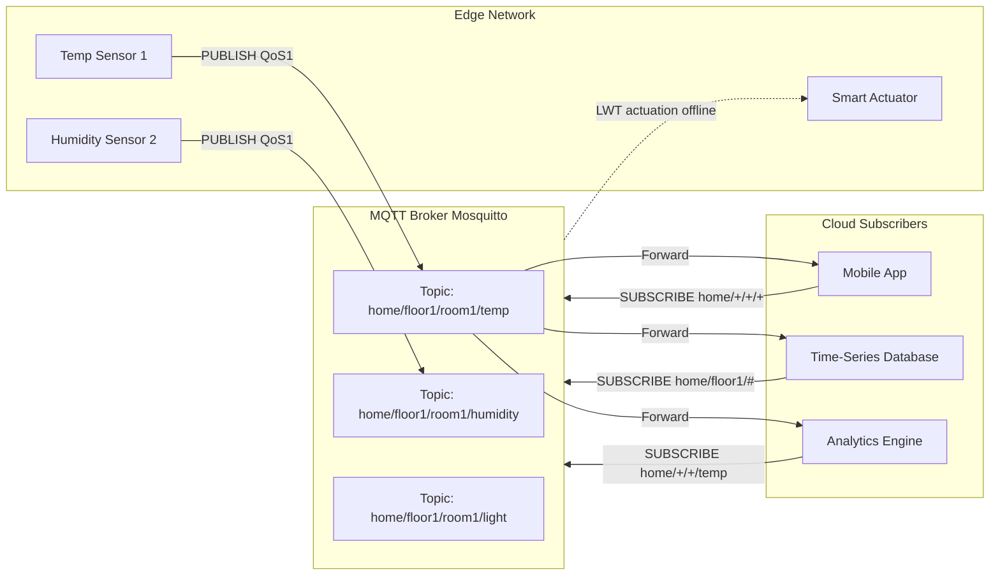
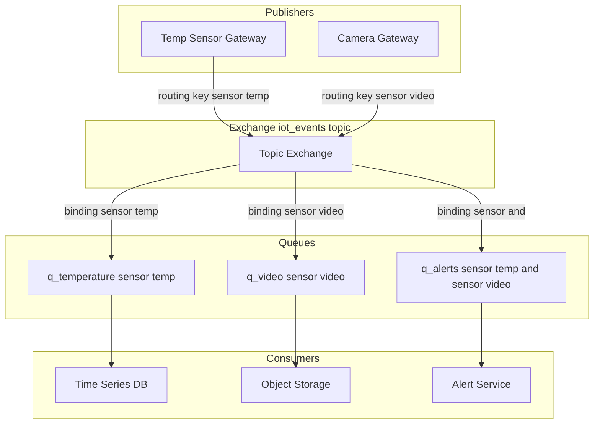
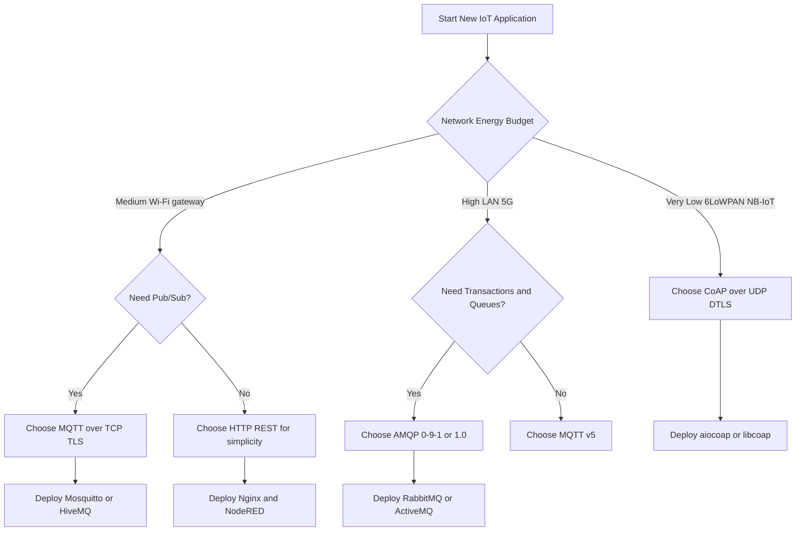

# Infrastructure Protocols

<!-- SECTION_1_START -->
# Infrastructure Protocols — IoT (PECST755, Module 2)

> [!NOTE]
> **Formal Definition (KTU 2024 Scheme aligned):**
> *Infrastructure Protocols* in the Internet of Things are the standardized **application-layer and messaging protocols** that sit on top of the constrained network and transport layers, enabling heterogeneous things (sensors, actuators, gateways, cloud services) to exchange data, discover services, and perform actuation in a reliable, interoperable, and energy-efficient manner.

## 1.1 The Four Pillars of IoT Infrastructure Protocols
The KTU 2024 Scheme PECST755 syllabus classifies the following protocols under *Infrastructure Protocols*:

1. **MQTT** — Message Queuing Telemetry Transport
2. **CoAP** — Constrained Application Protocol
3. **AMQP** — Advanced Message Queuing Protocol
4. **HTTP / HTTPS** — Hypertext Transfer Protocol (Secure)

> [!IMPORTANT]
> All four protocols operate at the **Application Layer (OSI Layer 7)** of the TCP/IP stack, but they differ significantly in transport dependency, message overhead, and energy footprint. Selection of an infrastructure protocol is one of the most critical architectural decisions in any IoT deployment.

## 1.2 Intuitive Overview — The Postal Service Analogy
Imagine a smart city with **thousands of tiny sensor post-offices** scattered across streets. Each post-office can only carry a **very small envelope** (limited payload), has a **weak battery** (energy constrained), and is connected through an **unreliable, intermittent wireless link** (constrained network). Infrastructure protocols are the **standardized rules** these post-offices use to:

* **Address** the envelope (URLs, topic names, routing keys).
* **Guarantee delivery** (quality of service — best-effort, at-least-once, exactly-once).
* **Notify if the recipient is unavailable** (acknowledgement, retransmission, last-will messages).
* **Secure the content** (TLS, DTLS, OAuth tokens).

> [!TIP]
> **Why this matters in KTU exams:** Almost every Module 2 question in the university exam maps to one of these four "postal rules." Remembering the analogy helps you reconstruct the answer even if you forget the exact terminology.

## 1.3 Position in the IoT Protocol Stack

| Layer | Protocol(s) Used |
|---|---|
| Application (Data Format) | JSON, CBOR, XML |
| **Application (Messaging)** | **MQTT, CoAP, AMQP, HTTP** |
| Transport | TCP, UDP, DTLS, TLS |
| Network | IPv6, RPL, 6LoWPAN |
| MAC / Physical | IEEE 802.15.4, LoRa, NB-IoT, Wi-Fi |

> [!VISUALIZATION CONTROL]
> **Concept:** IoT Protocol Stack — Vertical Layering
> **GeoGebra / Desmos Input Equations:**
> * Use a stacked column chart with y-axis labelled 1 through 7 (top to bottom: Application, Transport, Network, MAC, Physical). Highlight the application block.
> **Visual Description:** A vertical bar showing 5 layers; the top "Application (Messaging)" layer is shaded red with the four protocols written inside.

<!-- SECTION_1_END -->

<!-- SECTION_2_START -->
# Deep Theoretical Analysis & KTU High-Yield Formula Sheet

## 2.1 MQTT — Message Queuing Telemetry Transport

### 2.1.1 Origin and Standardization
* Invented by **Andy Stanford-Clark (IBM)** and **Arlen Nipper (Eurotech)** in **1999** for monitoring oil pipelines over satellite links.
* Standardized as **ISO/IEC 20922** in 2016.
* Current version: **MQTT v5.0** (2019). KTU exam focuses on **v3.1.1** semantics.

### 2.1.2 Architectural Model — The Publish / Subscribe Paradigm
MQTT is **broker-centric**. All communication is mediated by a central server called the **MQTT Broker** (e.g., *Mosquitto*, *HiveMQ*, *EMQX*).

**Three logical entities:**
* **Publisher** — produces data and *publishes* to a *topic*.
* **Subscriber** — *subscribes* to one or more *topics*; receives a copy of every matching message.
* **Broker** — receives all messages, filters them by topic, and dispatches them to interested subscribers.

> [!IMPORTANT]
> **Decoupling:** Publishers and subscribers do **not** know each other’s IP addresses, lifetimes, or even that the other exists. This is called **space, time, and synchronization decoupling** — a key exam point.

### 2.1.3 Topic Hierarchy
Topics are **slash-separated UTF-8 strings**, e.g.:

$$\text{topic} = \text{home} / \text{floor1} / \text{room2} / \text{temperature}$$

* Single-level wildcard: `+` (matches one segment). Example: `home/+/room2/temperature`.
* Multi-level wildcard: `#` (matches all remaining segments). Example: `home/floor1/#`.

### 2.1.4 Quality of Service (QoS) Levels
The single most-tested MQTT concept in KTU exams.

| QoS Level | Name | Guarantee | Packet Exchange | Use Case |
|---|---|---|---|---|
| **QoS 0** | At most once | Best-effort, no ACK | PUBLISH $\rightarrow$ done | Lossy telemetry, periodic sensor data |
| **QoS 1** | At least once | Possible duplicates | PUBLISH $\rightarrow$ PUBACK | Reliable but tolerant of duplicates |
| **QoS 2** | Exactly once | No loss, no duplicates | PUBLISH $\rightarrow$ PUBREC $\rightarrow$ PUBREL $\rightarrow$ PUBCOMP | Billing, actuation, medical dosing |

### 2.1.5 Other MQTT Control Packets (14 in total)
1. **CONNECT** — client requests connection.
2. **CONNACK** — broker acknowledges.
3. **PUBLISH** — carries the actual message.
4. **PUBACK / PUBREC / PUBREL / PUBCOMP** — QoS 1 & 2 handshakes.
5. **SUBSCRIBE** — client subscribes.
6. **SUBACK** — broker confirms subscription.
7. **UNSUBSCRIBE / UNSUBACK** — cancel subscription.
8. **PINGREQ / PINGRESP** — keep-alive.
9. **DISCONNECT** — clean termination.
10. **AUTH** (v5.0 only) — enhanced authentication.

### 2.1.6 Key MQTT Features
* **Keep Alive** — heartbeat interval (seconds). Broker disconnects client if no packet in $1.5 \times \text{KeepAlive}$.
* **Last Will and Testament (LWT)** — message that broker *automatically publishes* on behalf of a client if it disconnects abruptly. Critical for fault detection.
* **Retained Messages** — broker stores the *last* message of a topic and delivers it *immediately* to any new subscriber.
* **Clean Session** — if `false`, broker persists subscription and QoS-1/2 messages across disconnections.
* **Payload** — up to **256 MB**, but practically limited to a few KB on constrained devices.

### 2.1.7 MQTT Fixed Header Format
A 2-byte minimum header followed by variable length and payload.

$$\text{Fixed Header} = \underbrace{\text{Byte 1: Control Packet Type} \, + \, \text{Flags}}_{\text{1 byte}} \;,\; \underbrace{\text{Remaining Length}}_{\text{1-4 bytes (variable encoding)}}$$

> **Variable-length encoding rule:** Each byte uses the lower 7 bits for data and the MSB as a continuation bit. Maximum payload field = 4 bytes.

## 2.2 CoAP — Constrained Application Protocol

### 2.2.1 Standardization
* Defined in **RFC 7252** (June 2014) by the IETF CoRE (Constrained RESTful Environments) working group.
* Designed to be the **HTTP equivalent for tiny devices** running on 8-bit MCUs with $\leq 10$ KB RAM.

### 2.2.2 Architectural Model — RESTful Request / Response
CoAP follows the **client-server, request-response** model of HTTP, but maps the four CRUD operations to its own method codes:

| CoAP Code | Equivalent HTTP | Meaning |
|---|---|---|
| **0.01 GET** | GET | Fetch resource |
| **0.02 POST** | POST | Create / process resource |
| **0.03 PUT** | PUT | Update / create resource |
| **0.04 DELETE** | DELETE | Remove resource |

### 2.2.3 Message Reliability Types
CoAP runs over **UDP** (lightweight) but offers its own reliability layer using 4 message types:

| Type | Code (T field) | Reliability |
|---|---|---|
| **CON** — Confirmable | 0 | Requires ACK; retransmitted with exponential back-off |
| **NON** — Non-confirmable | 1 | Fire-and-forget |
| **ACK** — Acknowledgement | 2 | Success acknowledgement |
| **RST** — Reset | 3 | Negative acknowledgement (e.g., resource no longer exists) |

> [!NOTE]
> **Exponential Back-off Formula** (also tested in networking papers):
> $$\tau_n = \tau_0 \cdot 2^{n-1} \quad \text{where } \tau_0 = \text{ACK\_TIMEOUT}, \; n = 1,2,3,4$$
> Maximum retransmissions default to **4** (coap-core default).

### 2.2.4 CoAP Message Format
A 4-byte base header followed by optional Token, Options, and Payload.

$$
\begin{aligned}
\text{CoAP Message} =\;
& \underbrace{\text{Ver}\mid\text{T}\mid\text{TKL}}_{\text{1 byte (4 bits each)}} \;,\;
\underbrace{\text{Code}}_{\text{1 byte (class.subclass)}} \;,\;
\underbrace{\text{MessageID}}_{\text{2 bytes}} \;,\;
\\
& \underbrace{\text{Token}}_{\text{0-8 bytes}} \;,\;
\underbrace{\text{Options}}_{\text{TLV format}} \;,\;
\underbrace{\text{Payload}}_{\text{0xFF marker + bytes}}
\end{aligned}
$$

* **Ver (2 bits)** = `01` (CoAP version 1).
* **T (2 bits)** = message type (CON/NON/ACK/RST).
* **TKL (4 bits)** = token length (0–8 bytes).
* **Code (8 bits)** = class.detail (e.g., `0.01` GET, `2.05` Content).
* **MessageID (16 bits)** = used to match CON with ACK and to detect duplicates.
* **Token (0–8 bytes)** = used to match request with response (separate from Message ID).
* **Options** = URI path, content format, max-age, observe, block, etc.

### 2.2.5 CoAP Special Features
* **Observe (RFC 7641)** — server pushes resource state to client whenever it changes. Equivalent to MQTT subscription.
* **Block-wise Transfer (RFC 7959)** — splits large payloads across multiple UDP datagrams to fit inside the 6LoWPAN MTU of ~127 bytes.
* **DTLS Binding** — CoAP can be secured with **DTLS 1.2** on UDP. The four security modes are:
  * `NoSec`, `PreSharedKey`, `RawPublicKey`, `Certificate`.

### 2.2.6 Response Code Classes
Identical to HTTP status classes (5-bit class, 5-bit detail):

| Class | Meaning | Example |
|---|---|---|
| 1.xx | Informational | 1.01 Continue (piggybacked in CoAP) |
| 2.xx | Success | 2.05 Content, 2.04 Changed |
| 4.xx | Client error | 4.04 Not Found |
| 5.xx | Server error | 5.00 Internal Server Error |

## 2.3 AMQP — Advanced Message Queuing Protocol

### 2.3.1 Standardization
* **AMQP 0-9-1** — OASIS standard, widely used in enterprise middleware (RabbitMQ, Apache Qpid).
* **AMQP 1.0** — ISO/IEC 19464. Used in Azure IoT Hub, Apache ActiveMQ Artemis.
* KTU syllabus primarily targets **0-9-1** semantics.

### 2.3.2 AMQP 0-9-1 Architecture
Three primary entities:

* **Exchange** — receives messages from publishers and routes them to queues.
* **Queue** — stores messages until consumers retrieve them.
* **Binding** — rule that connects an exchange to a queue, usually using a *routing key*.

### 2.3.3 Exchange Types
| Type | Routing Logic | Example Use |
|---|---|---|
| **Direct** | Exact match on routing key | Task queues |
| **Fanout** | Broadcasts to all bound queues | Logging, broadcast notifications |
| **Topic** | Pattern match with `*` (one word) and `#` (many) | Pub/Sub style routing |
| **Headers** | Matches message headers instead of routing key | Complex attribute-based routing |

### 2.3.4 AMQP Frame Structure
Layered:

$$
\begin{aligned}
\text{Frame Layer} =\;
& \underbrace{\text{Frame Type}}_{\text{1 byte}} \;,\;
\underbrace{\text{Channel}}_{\text{2 bytes}} \;,\;
\underbrace{\text{Size}}_{\text{4 bytes}} \;,\;
\underbrace{\text{Payload}}_{\text{variable}} \;,\;
\underbrace{\text{End Byte 0xCE}}_{\text{frame end marker}}
\end{aligned}
$$

Above this sit the higher-level AMQP methods (Connection, Channel, Exchange, Queue, Basic, Tx).

### 2.3.5 Why AMQP for IoT?
* Heavyweight: full-featured, **transactional**, supports **store-and-forward**.
* Suited for **gateway-to-cloud** links where the gateway has ample resources.
* Not typically used directly on $\leq$ Class-1 constrained nodes.

## 2.4 HTTP / HTTPS in IoT

### 2.4.1 REST over HTTP
HTTP can be used for IoT application integration, especially when leveraging existing web infrastructure.

* **Methods:** GET, POST, PUT, DELETE, PATCH, HEAD, OPTIONS.
* **Stateless** — each request is independent.
* **Headers** carry metadata (Content-Type, Authorization, Accept).
* **Status codes:** 1xx, 2xx (success), 3xx (redirect), 4xx (client error), 5xx (server error).

### 2.4.2 Limitations for Constrained IoT
* **TCP-based** — handshake overhead = 3-way SYN $\rightarrow$ SYN-ACK $\rightarrow$ ACK, which is heavy for sleepy sensors.
* **Verbose headers** — typical HTTP header is 200–800 bytes; MQTT fixed header is just 2 bytes.
* **Text-based** — JSON / XML payloads are larger and parse-expensive.
* **No native pub/sub** — must be implemented on top (e.g., WebSockets, Server-Sent Events).
* **Power hungry** — keeps the radio on during the entire request/response cycle.

> [!TIP]
> **HTTPS** = HTTP + **TLS** (Transport Layer Security). Adds 2 round-trips for the TLS handshake, but provides end-to-end encryption, server authentication (X.509 certificates), and message integrity. Most production IoT clouds mandate HTTPS for northbound traffic.

## 2.5 KTU High-Yield Formula Sheet / Cheat Sheet

| Parameter | MQTT | CoAP | AMQP | HTTP |
|---|---|---|---|---|
| **Transport** | TCP (port 1883, TLS 8883) | UDP (port 5683, DTLS 5684) | TCP (port 5672, TLS 5671) | TCP (port 80, TLS 443) |
| **Architecture** | Pub/Sub via Broker | Request/Response (REST) | Pub/Sub via Exchange/Queue | Request/Response (REST) |
| **Header Size** | 2 bytes fixed + variable | 4 bytes fixed + options | 8 bytes frame header | $\geq$ 200 bytes (text) |
| **Reliability** | 3 QoS levels | CON/NON/ACK/RST | ACK on each frame | TCP + status codes |
| **Security** | TLS 1.2 + username/password + OAuth | DTLS 1.2 (4 modes) | TLS + SASL | TLS / X.509 |
| **Power Use** | Medium | **Lowest** | High | Highest |
| **Suitable Node Class** | Class 2 (gateways) | **Class 1 (constrained)** | Gateways / cloud | Servers / mobile apps |
| **Message Pattern** | Topic-based, hierarchical | URI-based, REST resources | Routing key + bindings | URL + HTTP method |

> [!IMPORTANT]
> The above table is the **single most-asked comparison** in KTU Module 2 university papers. Memorize the **bolded** cells.

<!-- SECTION_2_END -->

<!-- SECTION_3_START -->
# Step-by-Step Derivations, Message Walkthroughs & Code Implementation

## 3.1 MQTT — End-to-End Connection Lifecycle

### 3.1.1 Connect Handshake (State Machine Derivation)
A typical MQTT session follows the following state transitions, each of which carries a fixed control packet:

$$
\begin{aligned}
\text{Client State}_0 &= \text{Disconnected} \\
\text{CLIENT} &\xrightarrow{\text{CONNECT (payload: clientID, keepAlive, willTopic, willMsg, cleanSession, QoS, username, password)}} \text{Server} \\
\text{Client State}_1 &= \text{WaitForCONNACK} \\
\text{SERVER} &\xrightarrow{\text{CONNACK (returnCode: 0=accepted, 1=bad proto, 2=ID rejected, 3=server unavailable, 4=bad creds, 5=not authorized)}} \text{Client} \\
\text{Client State}_2 &= \text{Active}
\end{aligned}
$$

* **Keep Alive ($T_{KA}$)** timer starts on client.
* If $T_{KA}$ elapses with no outbound traffic, client sends **PINGREQ**; server replies **PINGRESP**.
* If no PINGRESP within $1.5 \cdot T_{KA}$, client assumes connection lost and reconnects.

### 3.1.2 Publish / Subscribe Walkthrough — Derivation
1. Subscriber sends **SUBSCRIBE** with `Packet Identifier` (PID) and **topic filter** + **requested QoS**.
2. Broker responds with **SUBACK** containing the same PID and a granted QoS (may be lower than requested).
3. Publisher sends **PUBLISH** with PID (if QoS $\geq 1$), topic, payload, QoS flag, retain flag, dup flag.
4. Broker matches topic against active subscriptions.
5. Broker dispatches PUBLISH to every matching subscriber.
6. For QoS 1, each receiver returns **PUBACK** with the same PID.
7. For QoS 2, the four-way handshake is:

$$
\begin{aligned}
\text{PUBLISH (DUP=0, PID=x)} &\rightarrow \\
\text{PUBREC (PID=x)} &\rightarrow \\
\text{PUBREL (PID=x)} &\rightarrow \\
\text{PUBCOMP (PID=x)} &\rightarrow \text{Done}
\end{aligned}
$$

### 3.1.3 Operational Python Code (paho-mqtt)

```python
"""
File: mqtt_pubsub_demo.py
Purpose: Demonstrate MQTT publish and subscribe on a local Mosquitto broker.
Audience: KTU PECST755 students (Module 2, Infrastructure Protocols).
"""
from __future__ import annotations

import logging
import sys
import time
from typing import Optional

import paho.mqtt.client as mqtt

# --- Logging Configuration (Strict Error Handling) ---
logging.basicConfig(
    level=logging.INFO,
    format="%(asctime)s [%(levelname)s] %(message)s",
    stream=sys.stdout,
)
logger = logging.getLogger("MQTTDemo")

BROKER_HOST: str = "127.0.0.1"
BROKER_PORT: int = 1883
KEEP_ALIVE_S: int = 60
TOPIC: str = "ktu/iot/sensor/temperature"
CLIENT_ID_SUB: str = "ktu_subscriber_demo"
CLIENT_ID_PUB: str = "ktu_publisher_demo"
QOS_LEVEL: int = 1  # 0, 1, or 2


def on_connect(
    client: mqtt.Client,
    userdata: Optional[dict],
    flags: dict,
    rc: int,
) -> None:
    """Callback executed when the client receives a CONNACK from broker."""
    if rc == 0:
        logger.info("Connected successfully (rc=0).")
        if "sub" in (userdata or {}).get("role", ""):
            client.subscribe(TOPIC, qos=QOS_LEVEL)
            logger.info("Subscribed to %s with QoS %d", TOPIC, QOS_LEVEL)
    else:
        logger.error("CONNACK rejected with return code %d", rc)


def on_message(
    client: mqtt.Client,
    userdata: Optional[dict],
    msg: mqtt.MQTTMessage,
) -> None:
    """Callback executed when a PUBLISH message arrives."""
    logger.info(
        "Received | topic=%s | qos=%d | retain=%s | payload=%s",
        msg.topic,
        msg.qos,
        msg.retain,
        msg.payload.decode(errors="replace"),
    )


def run_subscriber() -> None:
    client = mqtt.Client(client_id=CLIENT_ID_SUB, userdata={"role": "sub"})
    client.on_connect = on_connect
    client.on_message = on_message
    client.connect(BROKER_HOST, BROKER_PORT, KEEP_ALIVE_S)
    client.loop_forever()


def run_publisher(payload: str = "23.7 C") -> None:
    client = mqtt.Client(
        client_id=CLIENT_ID_PUB,
        userdata={"role": "pub"},
        clean_session=False,  # persists QoS 1/2 messages across reconnects
    )
    client.will_set(
        topic="ktu/iot/status",
        payload="publisher offline",
        qos=1,
        retain=True,
    )  # Last Will and Testament
    client.connect(BROKER_HOST, BROKER_PORT, KEEP_ALIVE_S)
    client.loop_start()
    for i in range(3):
        info = client.publish(TOPIC, payload, qos=QOS_LEVEL, retain=True)
        info.wait_for_publish(timeout=5.0)
        logger.info("Published message %d", i + 1)
        time.sleep(1.0)
    client.loop_stop()
    client.disconnect()


if __name__ == "__main__":
    import threading

    sub_thread = threading.Thread(target=run_subscriber, daemon=True)
    sub_thread.start()
    time.sleep(2.0)  # Allow subscriber to register
    run_publisher()
```

**Line-by-line rationale (for the examiner):**
* `paho.mqtt.client` — reference implementation of MQTT v3.1.1 / v5 in Python.
* `userdata` — opaque dictionary passed to all callbacks; we tag the role.
* `clean_session=False` — broker stores session state (in-flight messages, subscriptions) for the client; matches the *persistent session* feature in the MQTT spec.
* `will_set(...)` — registers the **Last Will and Testament (LWT)**. If the broker detects an abnormal disconnect (network drop, no PINGRESP), it will publish the LWT on the client’s behalf.
* `client.publish(...).wait_for_publish()` — synchronous guard ensuring the QoS 1 PUBACK has been received.
* `client.loop_forever()` / `loop_start()` — separate thread that drives the MQTT state machine. Without it, CONNACK/SUBACK/PUBACK callbacks never fire.

## 3.2 CoAP — Message Walkthrough with Explicit Byte Layout

### 3.2.1 Sample GET Request Derivation
A client requests `coap://[2001:db8::1]/temperature` with token `0xA1`.

Header fields resolved:

$$
\begin{aligned}
\text{Byte 0} &= 0b01000001 = 0x41 \quad (\text{Ver}=01,\; \text{T}=CON=0,\; \text{TKL}=0001) \\
\text{Byte 1} &= 0b00000001 = 0x01 \quad (\text{Code}=0.01\;\text{GET}) \\
\text{Bytes 2-3} &= 0x1234 \quad (\text{MessageID}) \\
\text{Byte 4} &= 0xA1 \quad (\text{Token, length 1}) \\
\text{Option 1} &= \Delta=11,\; \text{Length}=1 \quad (\text{Uri-Path option number 11}) \\
\text{Option Value} &= \text{`t'} \quad (\text{first character of "temperature"}) \\
\text{Option 2} &= \Delta=0,\; \text{Length}=10 \quad (\text{Uri-Path continued}) \\
\text{Option Value} &= \text{`emperature'} \\
\text{Payload Marker} &= 0xFF \quad (\text{no payload in GET}) \\
\end{aligned}
$$

Server replies `2.05 Content` with a fresh reading, e.g. `0x41 0x61 0x12 0x34 0xA1 0xFF 0x32 0x33 0x2E 0x37` (verifying that 0x61 means ACK with code 2.05 = `2 << 5` + `5` = `0x45`… see below for actual byte construction).

> **Code byte calculation** (validates above):
> $$\text{Code} = (\text{class} \times 32) + \text{detail}$$
> For `2.05`: $\text{Code} = 2 \times 32 + 5 = 64 + 5 = 69 = 0x45$

### 3.2.2 Operational Python Code (aiocoap)

```python
"""
File: coap_get_temperature.py
Purpose: Send a CON GET request to a CoAP server using aiocoap.
"""
from __future__ import annotations

import asyncio
import logging
from typing import Optional

from aiocoap import Context, Message, GET

logging.basicConfig(level=logging.INFO, format="%(asctime)s %(message)s")
log = logging.getLogger("CoAPDemo")

URI: str = "coap://127.0.0.1:5683/sensors/temperature"


async def fetch_temperature() -> None:
    context: Optional[Context] = await Context.create_client_context()
    try:
        request = Message(code=GET, uri=URI)
        log.info("Sending CON GET to %s", URI)
        response = await context.request(request).response
        log.info(
            "Response code=%s payload=%s",
            response.code,
            response.payload.decode(errors="replace"),
        )
    except Exception as exc:  # explicit error capture
        log.error("CoAP request failed: %s", exc)
    finally:
        await context.shutdown()


if __name__ == "__main__":
    asyncio.run(fetch_temperature())
```

**Line-by-line rationale:**
* `Context.create_client_context()` — sets up the CoAP client with default ACK_TIMEOUT and retransmission parameters.
* `Message(code=GET, ...)` — constructs a request with default CON (confirmable) type and a fresh Message ID.
* `await context.request(...).response` — blocks until ACK arrives or retransmission budget is exhausted.
* The `try/except/finally` ensures the underlying UDP socket is always released.

## 3.3 AMQP — End-to-End Topology Walkthrough

### 3.3.1 Publishing Flow (0-9-1) Derivation
$$
\begin{aligned}
\text{Producer} &\xrightarrow{\text{channel.open}} \text{Broker} \\
\text{Producer} &\xrightarrow{\text{channel.open-ok}} \text{Broker} \\
\text{Producer} &\xrightarrow{\text{basic.publish (exchange="iot_events", routingKey="sensor.temp", body="23.7")}} \text{Broker} \\
\text{Broker} &\xrightarrow{\text{channel.flow (backpressure if queue full)}} \text{Producer} \\
\text{Consumer} &\xrightarrow{\text{basic.consume (queue="q1")}} \text{Broker} \\
\text{Broker} &\xrightarrow{\text{basic.deliver (body)}} \text{Consumer} \\
\text{Consumer} &\xrightarrow{\text{basic.ack (deliveryTag=1)}} \text{Broker} \\
\end{aligned}
$$

### 3.3.2 Operational Python Code (pika — RabbitMQ client)

```python
"""
File: amqp_pubsub_demo.py
Purpose: Publish temperature events to a topic exchange and consume them.
"""
from __future__ import annotations

import json
import logging
import sys
from typing import Any

import pika

logging.basicConfig(level=logging.INFO, format="%(asctime)s %(message)s")
log = logging.getLogger("AMQPDemo")

HOST: str = "127.0.0.1"
PORT: int = 5672
USER: str = "guest"
PASSWORD: str = "guest"
EXCHANGE: str = "iot_events"
ROUTING_KEY: str = "sensor.temp"
QUEUE: str = "q_temperature"
BINDING_KEY: str = "sensor.*"  # topic exchange pattern


def get_connection() -> pika.BlockingConnection:
    creds = pika.PlainCredentials(USER, PASSWORD)
    params = pika.ConnectionParameters(
        host=HOST, port=PORT, credentials=creds, heartbeat=30
    )
    return pika.BlockingConnection(params)


def declare_topology(channel: pika.adapters.blocking_connection.BlockingChannel) -> None:
    channel.exchange_declare(
        exchange=EXCHANGE, exchange_type="topic", durable=True
    )
    channel.queue_declare(queue=QUEUE, durable=True)
    channel.queue_bind(queue=QUEUE, exchange=EXCHANGE, routing_key=BINDING_KEY)
    log.info("Topology declared.")


def publish_message(payload: dict[str, Any]) -> None:
    with get_connection() as conn:
        ch = conn.channel()
        declare_topology(ch)
        ch.basic_publish(
            exchange=EXCHANGE,
            routing_key=ROUTING_KEY,
            body=json.dumps(payload).encode("utf-8"),
            properties=pika.BasicProperties(
                content_type="application/json",
                delivery_mode=2,  # persistent
            ),
        )
        log.info("Published: %s", payload)


def consume_messages() -> None:
    with get_connection() as conn:
        ch = conn.channel()
        declare_topology(ch)

        def on_msg(channel, method, props, body) -> None:  # type: ignore
            log.info("Got message key=%s body=%s", method.routing_key, body)
            channel.basic_ack(delivery_tag=method.delivery_tag)

        ch.basic_qos(prefetch_count=1)
        ch.basic_consume(queue=QUEUE, on_message_callback=on_msg)
        log.info("Consuming from %s. Ctrl+C to stop.", QUEUE)
        try:
            ch.start_consuming()
        except KeyboardInterrupt:
            ch.stop_consuming()


if __name__ == "__main__":
    if len(sys.argv) > 1 and sys.argv[1] == "publish":
        publish_message({"sensor": "temp-01", "value": 23.7, "unit": "C"})
    else:
        consume_messages()
```

**Line-by-line rationale:**
* `exchange_type="topic"` — implements the AMQP **Topic Exchange**, where `*` matches exactly one word and `#` matches zero or more words.
* `durable=True` — survives broker restarts (analogous to MQTT retained messages but for the exchange/queue entity, not the message).
* `delivery_mode=2` — marks the message as **persistent**, telling the broker to write it to disk before acknowledging the producer.
* `basic_qos(prefetch_count=1)` — protects the consumer from being flooded (flow control).
* `basic_ack` — required for **manual acknowledgement**; otherwise the broker re-queues the message on consumer crash (at-least-once delivery).

## 3.4 HTTP — Quick Code Snippet (Requests Library)

```python
"""
File: http_iot_post.py
Purpose: Push a temperature reading to a REST endpoint over HTTPS.
"""
from __future__ import annotations

import json
import logging
from typing import Any

import requests

logging.basicConfig(level=logging.INFO)
log = logging.getLogger("HTTPDemo")

URL: str = "https://api.ktu-iot.example.com/v1/sensors/temp-01/telemetry"
HEADERS: dict[str, str] = {
    "Content-Type": "application/json",
    "Authorization": "Bearer <YOUR_API_TOKEN>",
}
PAYLOAD: dict[str, Any] = {"value": 23.7, "unit": "C"}


def push_reading() -> None:
    try:
        resp = requests.post(
            URL, headers=HEADERS, data=json.dumps(PAYLOAD), timeout=5, verify=True
        )
        resp.raise_for_status()
        log.info("HTTP %d | body=%s", resp.status_code, resp.text)
    except requests.RequestException as exc:
        log.error("HTTP request failed: %s", exc)


if __name__ == "__main__":
    push_reading()
```

**Line-by-line rationale:**
* `verify=True` — enables TLS certificate validation (security best-practice).
* `timeout=5` — prevents the resource-constrained client from blocking forever on a stalled link.
* `raise_for_status()` — converts 4xx/5xx into Python exceptions for explicit handling.

<!-- SECTION_3_END -->

<!-- SECTION_4_START -->
# Structural Diagrams & Schematics

## 4.1 MQTT Publish / Subscribe Topology



## 4.2 CoAP Request / Response Sequence

```mermaid
sequenceDiagram
    autonumber
    participant C as CoAP Client
    participant S as CoAP Server Sensor
    C->>S: CON GET /sensors/temperature (MID=0x1234, Token=0xA1)
    S-->>C: ACK 2.05 Content (MID=0x1234, Token=0xA1, Payload=23.7)
    Note over C,S: Reliable confirmed exchange; UDP transport
    C->>S: NON PUT /actuators/led (Payload=ON)
    S-->>C: No ACK required NON
    C->>S: CON DELETE /sensors/temp-99
    S-->>C: RST 4.04 Not Found
```

## 4.3 AMQP Exchange / Queue / Binding Topology



## 4.4 Protocol Selection Decision Flow



<!-- SECTION_4_END -->

<!-- SECTION_5_START -->
# KTU 2024 Scheme Examination Question Bank & Topic Recap

## 5.1 Part A Questions (3 Marks Each)

### Question A1
**[KTU University Exam — July 2024]**
Differentiate between **MQTT** and **HTTP** as IoT application-layer protocols. (3 marks)
*Mapped:* **CO1, Remember**

**Model Answer:**
* **MQTT** is a lightweight, broker-based **publish/subscribe** protocol running over TCP (port 1883). It uses a 2-byte fixed header and supports 3 QoS levels, making it ideal for constrained devices.
* **HTTP** is a stateless, **request/response** text-based protocol running over TCP (port 80). Each request carries verbose headers (200–800 bytes) and requires a full TCP handshake, leading to higher power consumption.
* **Use-case mapping:** MQTT $\rightarrow$ device-to-broker telemetry; HTTP $\rightarrow$ cloud dashboards and northbound APIs.

> [!NOTE]
> Examiner’s note: The phrasing "lightweight broker" and "stateless text" earns 2 marks; the use-case mapping earns the third.

### Question A2
**[KTU University Exam — Dec 2023]**
What is the role of a **Broker** in MQTT? List the three QoS levels. (3 marks)
*Mapped:* **CO1, Understand**

**Model Answer:**
* The **Broker** is the central server in MQTT that accepts PUBLISH messages from publishers, filters them by topic, and dispatches them to all matching subscribers. It decouples publishers and subscribers in space, time, and synchronization.
* QoS levels: **QoS 0** (at most once), **QoS 1** (at least once), **QoS 2** (exactly once).

---

## 5.2 Part B Questions (14 Marks Each)

> [!IMPORTANT]
> Following the KTU 2024 Scheme pattern, every Part B question offers an **internal choice** between two alternatives. Question A and Question B below are two independent 14-mark questions you may be asked to choose from.

### Question A (14 Marks) — MQTT and CoAP Deep Dive
**[KTU University Exam — July 2024, Module 2]**

#### (a) Explain the architecture of the **MQTT** protocol with a neat diagram. List the **14 control packet types** and explain the **4 QoS handshakes** in detail. (7 marks)
*Mapped:* **CO2, Understand**

**Model Solution Outline:**

*Architecture (3 marks):*
* Three entities — Publisher, Subscriber, **MQTT Broker** (e.g., Mosquitto).
* Topic-based filtering. Wildcards `+` and `#`.
* Clean session, Keep Alive, LWT, Retained messages.

*Control Packets (2 marks — naming the 14):*
1. CONNECT 2. CONNACK 3. PUBLISH 4. PUBACK 5. PUBREC 6. PUBREL 7. PUBCOMP 8. SUBSCRIBE 9. SUBACK 10. UNSUBSCRIBE 11. UNSUBACK 12. PINGREQ 13. PINGRESP 14. DISCONNECT

*QoS Handshakes (2 marks):*
$$
\begin{aligned}
\text{QoS 0:} \quad & \text{PUBLISH} \rightarrow \text{Done} \\
\text{QoS 1:} \quad & \text{PUBLISH (DUP=0, PID=x)} \rightarrow \text{PUBACK (PID=x)} \\
\text{QoS 2:} \quad & \text{PUBLISH (PID=x)} \rightarrow \text{PUBREC (PID=x)} \rightarrow \text{PUBREL (PID=x)} \rightarrow \text{PUBCOMP (PID=x)}
\end{aligned}
$$

#### (b) Draw and explain the **CoAP message format** with all fields. Also explain the **4 message types** (CON, NON, ACK, RST) based on reliability, with their codes. (7 marks)
*Mapped:* **CO2, Apply**

**Model Solution Outline:**

*Message Format (4 marks):*

| Field | Size | Purpose |
|---|---|---|
| Ver (Version) | 2 bits | CoAP version (`01`) |
| T (Type) | 2 bits | CON=0, NON=1, ACK=2, RST=3 |
| TKL (Token Length) | 4 bits | 0–8 bytes |
| Code | 1 byte | class.detail (e.g., 0.01 GET) |
| Message ID | 2 bytes | Matches CON with ACK, detects duplicates |
| Token | 0–8 bytes | Matches request with response |
| Options | TLV | URI-Path, Content-Format, Observe, Block |
| Payload | variable | Marked by `0xFF` byte |

*Message Types (3 marks):*

* **CON (Confirmable, T=00)** — must be acknowledged; retransmitted with exponential back-off (up to 4 times).
* **NON (Non-confirmable, T=01)** — fire-and-forget; used for periodic telemetry.
* **ACK (Acknowledgement, T=10)** — confirms a CON; piggy-backs responses to reduce overhead.
* **RST (Reset, T=11)** — negative ack; resource gone, malformed request, etc.

> [!WARNING]
> **KTU Examiner's Pitfall Callout:**
> 1. Students often confuse **Message ID** (16 bits) with **Token** (0–8 bytes). Message ID matches CON-ACK for reliability; Token matches request-response semantically.
> 2. Failing to mention the **0xFF payload marker** loses 1 mark.
> 3. Forgetting the **Ver=01** version bits also costs marks.

---

### Question B (14 Marks) — AMQP and HTTP Trade-off Analysis
**[KTU University Exam — Dec 2023, Module 2]**

#### (a) Explain the **AMQP 0-9-1** architecture. Discuss the **four types of exchanges** with an example use-case for each. (7 marks)
*Mapped:* **CO2, Understand**

**Model Solution Outline:**

*Architecture (3 marks):*
* **Producer / Consumer / Broker** model.
* **Exchange** receives messages, applies routing rules, pushes them into **Queues**.
* **Binding** is the link between exchange and queue, governed by a *routing key*.
* **Channel** multiplexes multiple logical streams over one TCP connection.

*Four Exchange Types (4 marks):*

| Type | Routing Logic | Example |
|---|---|---|
| **Direct** | Exact match on routing key | Task queue (`key = "task.email"`) |
| **Fanout** | Broadcasts to all bound queues | Logging / system events |
| **Topic** | Wildcard match (`*` one word, `#` many) | Pub/Sub routing for IoT sensors |
| **Headers** | Matches message header attributes (X-match: any/all) | Complex attribute routing |

#### (b) Discuss **HTTP/HTTPS** as an IoT infrastructure protocol. What are its **limitations** for constrained IoT applications? (7 marks)
*Mapped:* **CO3, Apply**

**Model Solution Outline:**

*HTTP in IoT (3 marks):*
* **RESTful** style: GET / POST / PUT / DELETE on URL-identified resources.
* **HTTPS** adds TLS: confidentiality, integrity, server authentication.
* Common in **northbound** (device-to-cloud) and **device-to-mobile-app** communication.

*Limitations (4 marks):*
1. **TCP overhead** — 3-way handshake + TLS 2-way handshake = 5 RTTs before payload.
2. **Header bloat** — 200–800 bytes per request, wasteful over 6LoWPAN (127 B MTU).
3. **No native pub/sub** — must layer WebSockets or SSE.
4. **Power-hungry** — radio must stay awake through full request-response.
5. **Synchronous** — client must poll, increasing traffic.

> [!WARNING]
> **KTU Examiner's Pitfall Callout:**
> 1. Students often describe AMQP exchanges without mentioning the **routing key** — you lose 1 mark.
> 2. For HTTP limitations, generic statements like "HTTP is heavy" earn 1 mark; you must quantify (3-way handshake, header size, MTU) to earn 3–4 marks.
> 3. Do **not** skip the diagram for AMQP — it is a 7-mark sub-question, and the topology is a compulsory 1-mark component.

---

## 5.3 Topic Recap & Important Things to Remember

> [!TIP]
> Use this list as a 5-minute pre-exam revision sheet.

* **Four Infrastructure Protocols:** **MQTT, CoAP, AMQP, HTTP** — all operate at **OSI Layer 7**.
* **MQTT** is **broker-based pub/sub**; **CoAP** is **REST request/response** over UDP; **AMQP** uses **exchange-queue-binding**; **HTTP** is **request/response over TCP**.
* **MQTT QoS:** 0 (best-effort), 1 (at-least-once — PUBACK), 2 (exactly-once — 4-step PUBREC/PUBREL/PUBCOMP).
* **MQTT LWT (Last Will and Testament):** broker auto-publishes a message on behalf of an abruptly disconnected client — key for fault detection.
* **MQTT Retained messages:** broker stores the last message per topic and delivers it to any new subscriber — speeds up state sync.
* **MQTT ports:** 1883 (plain), 8883 (TLS).
* **CoAP message types:** **CON, NON, ACK, RST** (T field: 00, 01, 10, 11).
* **CoAP header size:** 4 bytes base + token (0–8) + options (TLV) + payload.
* **CoAP Code formula:** $\text{Code} = (\text{class} \times 32) + \text{detail}$. Example: $2.05 \rightarrow 0x45$.
* **CoAP security:** **DTLS** on UDP (4 modes — NoSec, PreSharedKey, RawPublicKey, Certificate).
* **AMQP exchanges:** **Direct, Fanout, Topic, Headers** — each with distinct routing semantics.
* **AMQP wildcards** in topic exchange: `*` = one word, `#` = zero or more words.
* **AMQP persistent messages:** set `delivery_mode=2`; durable exchanges/queues survive broker restart.
* **HTTP limitations** for IoT: TCP handshake, large headers, no native pub/sub, high power, text-based.
* **HTTP ports:** 80 (plain), 443 (TLS).
* **Selection rule of thumb:**
  * Class-1 constrained nodes $\rightarrow$ **CoAP**.
  * Class-2 gateways with pub/sub $\rightarrow$ **MQTT**.
  * Enterprise middleware / transactional $\rightarrow$ **AMQP**.
  * Web dashboards / mobile apps $\rightarrow$ **HTTP / HTTPS**.
* **Mandatory exam diagrams:** MQTT pub/sub topology, CoAP message format byte layout, AMQP exchange-queue-binding graph.
* **Coding readiness:** be able to write a 20-line paho-mqtt subscriber and a 20-line aiocoap GET client.
* **Common pitfall:** do not say "MQTT uses UDP" or "CoAP uses TCP" — the question setter is *waiting* to deduct that 1 mark.

<!-- SECTION_5_END -->
