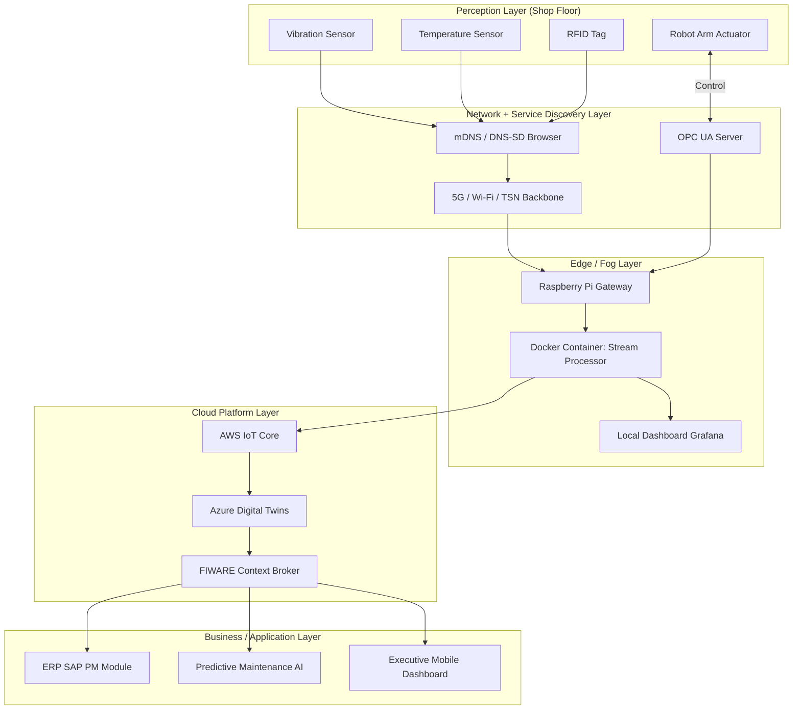
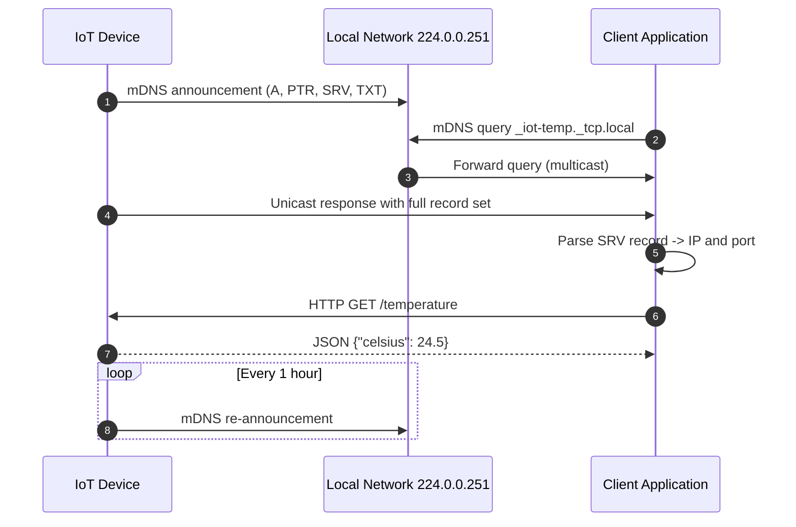
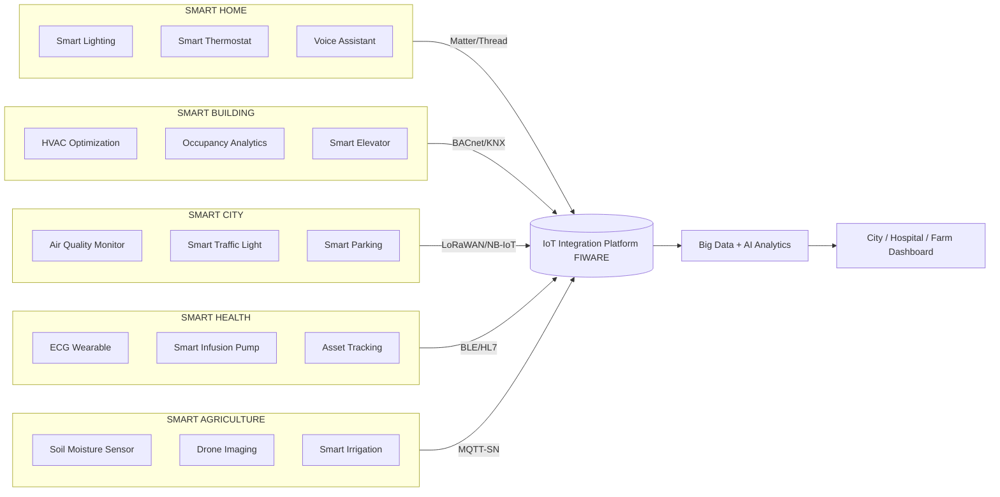
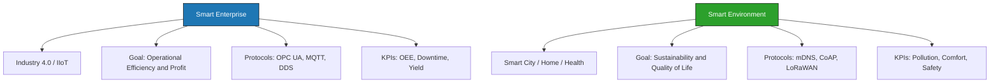
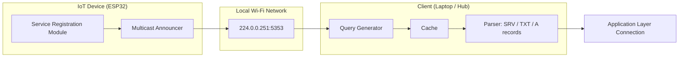

# Integration Technologies and Tools - Smart Enterprises and Environments

<!-- SECTION_1_START -->
# Integration Technologies and Tools for Smart Enterprises & Environments

> [!IMPORTANT]
> **KTU 2024 Scheme | PECST755 – Internet of Things | Module 2 (Infrastructure and Service Discovery Protocols)**
> This module bridges the gap between *raw IoT devices* (sensors/actuators) and *meaningful enterprise applications*. It focuses on how devices find each other on a network and how their data is integrated into smart business and environmental systems.

## 1.1 Formal Academic Definition

**IoT Integration Technologies** are the standardized set of communication protocols, middleware platforms, service-oriented architectures, and Application Programming Interfaces (APIs) that enable heterogeneous IoT devices, data streams, and enterprise software systems to interoperate seamlessly.

**Service Discovery Protocols (SDP)** are network-level protocols that allow devices and services to automatically advertise their capabilities, find available services in a dynamic environment, and establish communication sessions without manual configuration. Common examples include **mDNS (Multicast DNS)**, **DNS-SD (DNS Service Discovery)**, **UPnP (Universal Plug and Play)**, **CoAP (Constrained Application Protocol)**, and **AllJoyn**.

**Smart Enterprises** are business environments enhanced with IoT, Cloud Computing, Big Data, and AI to automate processes (Industry 4.0), optimize asset utilization, monitor worker safety, and enable data-driven decision-making.

**Smart Environments** are physical spaces (homes, buildings, cities, farms, hospitals, transportation networks) embedded with sensors, actuators, and connectivity that perceive context and act intelligently to improve quality of life, sustainability, and efficiency.

> [!NOTE]
> **Key Distinction (Board Favorite):**
> - *Service Discovery* answers: *"Who can do what, and how do I reach them?"*
> - *Integration* answers: *"How do their data and control signals flow into the enterprise / application layer?"*

## 1.2 Conceptual Analogy / Intuition

Imagine a **large international airport**:

1. **Service Discovery (mDNS / DNS-SD / UPnP)** is like the **Flight Information Display System (FIDS)**. When a passenger lands, the system broadcasts: *"Gate B12 is going to Paris, boarding now."* The passenger does not need to ask a human; the service (flight) announced itself. Similarly, an IoT temperature sensor announces: *"I am at IP 192.168.1.45, and I provide temperature readings in Celsius."*

2. **Integration Technologies (REST APIs, MQTT, Middleware)** are the **baggage conveyor belts and customs corridors** that take the raw "luggage" (sensor data) from one terminal (device) and deliver it to the right carousel (dashboard, database, AI engine) in the enterprise.

3. **Smart Enterprise** is the **airline operations control center** that receives telemetry from all aircraft, predicts delays, rebooks passengers, and saves fuel.

4. **Smart Environment** is the **airport itself** — smart lighting, smart HVAC, smart parking, biometric boarding, all talking to each other.

## 1.3 Physical Constants and Standard Metrics (KTU Board Favourites)

- **Typical LoRaWAN payload size:** **51–222 bytes** (used in many smart city sensors)
- **mDNS query multicast address:** **224.0.0.251** (IPv4) and **ff02::fb** (IPv6)
- **CoAP default port:** **5683** (and **5684** for DTLS)
- **MQTT default port:** **1883** (and **8883** for TLS)
- **UPnP SSDP multicast address:** **239.255.255.250** on port **1900**
- **Standard reference model:** **ISO/IEC 30141 (Internet of Things Reference Architecture)**
- **6LoWPAN Maximum Transmission Unit (MTU):** **127 bytes**

> [!TIP]
> Remember these specific port numbers and multicast addresses. KTU examiners frequently award marks for stating the exact protocol port when describing service discovery flows.

## 1.4 GeoGebra / Desmos Visualization

> [!VISUALIZATION CONTROL]
> **Concept:** Service Discovery Latency vs Network Size (Conceptual Graph)
> **GeoGebra / Desmos Input Equations:**
> * `f(x) = \log_2(x)` representing O(log N) DNS-SD query scaling
> * `g(x) = x` representing O(N) naive broadcast scanning
> * `h(x) = \sqrt{x}` representing mDNS caching curves
> **Visual Description:** On the x-axis plot the number of IoT devices N (1 to 10,000). The y-axis shows the average discovery latency in milliseconds. Observe how DNS-SD scales gracefully while naive scanning explodes. The intersection point between the curves represents the device count where hybrid discovery (e.g., DNS-SD with mDNS fallback) becomes essential.

<!-- SECTION_1_END -->

<!-- SECTION_2_START -->
# Deep Theoretical Analysis & KTU High-Yield Formula Sheet

## 2.1 Taxonomy of IoT Service Discovery Protocols

### A. Local Network / Link-Layer Discovery (No Central Server)

| Protocol | Transport | Discovery Method | Best Suited For | Limitation |
|---|---|---|---|---|
| **mDNS (RFC 6762)** | UDP Multicast 5353 | Queries the entire local link | Smart homes, small offices | Does not cross routers |
| **DNS-SD (RFC 6763)** | Runs over mDNS / DNS | Uses service instance names (`_http._tcp.local`) | Plug-and-play discovery | Coupled to DNS naming |
| **UPnP (SSDP)** | UDP 1900 (HTTPMU) | M-SEARCH + NOTIFY | Media streaming, printers | No security by default |
| **Bluetooth SDP** | L2CAP | Service record lookup | Wearables, beacons | Range limited (~10 m) |

### B. Wide-Area / Cloud-Scale Discovery

| Protocol | Discovery Mechanism | Example Platform |
|---|---|---|
| **CoAP Resource Discovery** | `/.well-known/core` URI | Constrained IoT devices |
| **MQTT with broker** | Topic-based subscription | AWS IoT, HiveMQ |
| **DDS (Data Distribution Service)** | Real-time pub/sub | Industrial IoT, autonomous vehicles |
| **XMPP IoT Discovery** | Presence-based | Smart grid pilots |

## 2.2 The Service Discovery Lifecycle (5 Logical Phases)

1. **Announcement / Advertisement** — Device sends a multicast announcement (e.g., mDNS `announcement` message containing its A, AAAA, PTR, SRV, TXT records).
2. **Discovery / Query** — Client sends a query (e.g., `_http._tcp.local`) to find available services.
3. **Resolution** — Client resolves the service name to an IP address and port (SRV + A/AAAA record lookup).
4. **Binding / Connection** — Client opens a TCP/UDP connection to the resolved endpoint and begins communication.
5. **Maintenance / Watchdog** — Devices re-announce periodically (TXT record refresh every **1 hour** in mDNS) so failed devices are pruned.

> [!IMPORTANT]
> The mDNS `TXT` record carries the **key-value metadata** (manufacturer, model, capabilities, version). This is often asked as a short question in the KTU board exam.

## 2.3 Integration Technologies (The Glue)

### Service-Oriented Architecture (SOA) Stack for IoT

| Layer | Technology Examples | Role |
|---|---|---|
| Device Hardware | Arduino, ESP32, Raspberry Pi, STM32 | Sense / actuate |
| Connectivity | Wi-Fi, BLE, Zigbee, LoRa, NB-IoT | Transport bits |
| Service Discovery | mDNS / DNS-SD / UPnP | Find services |
| Messaging | MQTT, CoAP, AMQP, HTTP/REST | Exchange data |
| Middleware / IoT Platform | FIWARE, AWS IoT Core, Azure IoT Hub, ThingsBoard | Integration hub |
| Data Storage | InfluxDB, Cassandra, MongoDB, TimeScaleDB | Persist telemetry |
| Analytics & AI | TensorFlow, Apache Kafka + Spark, Azure ML | Insight generation |
| Application | Mobile app, SCADA, ERP, digital twin dashboard | Human interaction |

## 2.4 Smart Enterprises — Reference Architecture (Industry 4.0 / IIoT)

The **Reference Architectural Model Industry 4.0 (RAMI 4.0)** layers IoT from the physical shop-floor asset up to the business layer. The equivalent KTU-friendly stack is the **3-Layer + 4-Layer model**:

1. **Perception Layer (Sensors & Actuators)** — RFID tags, vibration sensors, PLCs.
2. **Network Layer (Connectivity + Discovery)** — 5G, TSN, mDNS, OPC UA.
3. **Edge / Fog Layer (Local Processing)** — Edge gateways, Docker containers, NVIDIA Jetson.
4. **Cloud / Platform Layer (Integration)** — AWS IoT, Azure Digital Twins, Cumulocity.
5. **Application / Business Layer (Enterprise apps)** — SAP, Salesforce, custom dashboards.

> [!NOTE]
> **OPC UA (Open Platform Communications Unified Architecture)** is the *de-facto* standard for industrial service discovery. KTU has asked comparison questions between **OPC UA** and **MQTT** in previous years.

## 2.5 Smart Environments — Categories (High-Yield Definitions)

| Smart Environment | Core IoT Goal | Typical Sensors / Devices | Key Service Discovery |
|---|---|---|---|
| **Smart Home** | Comfort, security, energy saving | Smart bulbs, thermostats (Nest), door locks, Alexa | mDNS, HomeKit HAP, Matter |
| **Smart Building** | HVAC optimization, occupancy analytics | CO₂ sensors, PIR motion, smart meters | BACnet, KNX, mDNS |
| **Smart City** | Traffic, pollution, waste, lighting | Air quality sensors, smart traffic lights, GPS | LoRaWAN, NB-IoT, FIWARE |
| **Smart Agriculture** | Precision irrigation, yield monitoring | Soil moisture, drones, weather stations | MQTT-SN, CoAP |
| **Smart Health (IoMT)** | Remote patient monitoring | Wearables, ECG patches, smart pill bottles | BLE GATT, HL7 FHIR |
| **Smart Transportation** | Fleet tracking, autonomous driving | LiDAR, V2X OBU, GPS, IMU | DSRC, C-V2X, DDS |

## 2.6 KTU Formula Sheet / Cheat Sheet (Tables Only — No Pipes Inside Math)

| Concept | Expression / Value | Unit / Note |
|---|---|---|
| mDNS multicast address (IPv4) | $224.0.0.251$ | Layer-3 multicast |
| mDNS multicast address (IPv6) | $ff02::fb$ | Layer-3 multicast |
| UPnP SSDP port | $1900$ | UDP |
| CoAP default UDP port | $5683$ | UDP |
| CoAP with DTLS port | $5684$ | UDP (secure) |
| MQTT default port | $1883$ | TCP |
| MQTT TLS port | $8883$ | TCP (secure) |
| mDNS TTL for A record | $120$ | seconds |
| mDNS TTL for SRV record | $4500$ | seconds |
| mDNS re-announce interval | $1$ | hour |
| 6LoWPAN MTU | $127$ | bytes |
| LoRaWAN payload | $51 \text{ to } 222$ | bytes |
| Service lookup complexity (DNS) | $O(\log N)$ | hierarchical |
| Service lookup complexity (mDNS) | $O(1)$ broadcast | local subnet |
| Smart building ROI energy saving | $20\% \text{ to } 30\%$ | typical range |
| IoT middleware message latency target | $\leq 100$ | ms (industrial) |
| Energy harvested per BLE beacon | $\approx 10$ | $\mu\text{J}$ |
| Smart parking search time reduction | $43\%$ | field study |
| Pollutant reduction (smart traffic) | $\approx 20\%$ | NOₓ in pilots |
| Bandwidth per CoAP transaction | $\approx 4$ | bytes header |

> [!TIP]
> The board examiner loves questions like: *"Compare mDNS and DNS-SD. Are they the same?"* The crisp answer: **mDNS is the transport mechanism (multicast DNS over UDP 5353) and DNS-SD is the naming convention that runs on top of mDNS** to discover named services such as printers, HTTP servers, and IoT devices.

## 2.7 Engineering Utility — Why This Topic Matters

- **Industry 4.0 / IIoT** factories use OPC UA + DNS-SD to replace 30-year-old fieldbus systems, reducing commissioning time from weeks to hours.
- **Smart hospitals** use HL7 FHIR + mDNS BLE discovery to auto-register new infusion pumps, cutting nurse workload by ~25 %.
- **Smart cities** (e.g., Barcelona, Kochi Smart City Mission) integrate air-quality, traffic, and waste sensors through **FIWARE NGSI** middleware — saving €75 M/year in urban services.
- **Smart agriculture** deployments in Kerala use LoRaWAN + CoAP to monitor cardamom plantations across hectares with a single gateway.

<!-- SECTION_2_END -->

<!-- SECTION_3_START -->
# Step-by-Step Derivations, Flows & Code Implementation

## 3.1 mDNS + DNS-SD Service Discovery — Annotated Walkthrough

Let us trace how a **new ESP32 temperature sensor** is auto-discovered by a **laptop dashboard** on a home Wi-Fi network.

### Step 1 — Device Boot
The ESP32 powers on with the hostname `tempsens-a1` and the service type `_iot-temp._tcp`. The Arduino sketch calls `MDNS.begin("tempsens-a1")`.

### Step 2 — Service Registration
The device calls `MDNS.addService("iot-temp", "tcp", 80)` to advertise itself.
This single call automatically creates five DNS record types:

$$
\begin{aligned}
\text{A record} &\rightarrow \texttt{tempsens-a1.local.  120  IN  A  192.168.1.45} \\
\text{AAAA record} &\rightarrow \texttt{tempsens-a1.local.  120  IN  AAAA  fe80::1a2b:3c4d:5e6f} \\
\text{PTR record} &\rightarrow \texttt{\_iot-temp.\_tcp.local.  4500  IN  PTR  tempsens-a1.\_iot-temp.\_tcp.local.} \\
\text{SRV record} &\rightarrow \texttt{tempsens-a1.\_iot-temp.\_tcp.local.  120  IN  SRV  0 0 80 tempsens-a1.local.} \\
\text{TXT record} &\rightarrow \texttt{tempsens-a1.\_iot-temp.\_tcp.local.  4500  IN  TXT  "unit=c" "model=DHT22" "fw=1.2.0"}
\end{aligned}
$$

### Step 3 — Multicast Query
The laptop (e.g., running the `avahi-browse` utility on Linux) sends a single multicast query to `224.0.0.251:5353`:

> *"Is there any device offering the service `_iot-temp._tcp` on this local network?"*

### Step 4 — Multicast Response
The ESP32, having registered the service, hears its name in the query and replies **unicast** to the requester with its full record set (A, SRV, TXT).

### Step 5 — Client Connection
The dashboard parses the SRV record, learns that the service is at `192.168.1.45:80`, opens an HTTP GET to `/temperature`, and renders the value.

> [!IMPORTANT]
> Note that the **query is multicast** but the **response is unicast** — this prevents broadcast storms on Wi-Fi networks.

## 3.2 Smart Enterprise Data Flow (Fully Worked Pipeline)

Consider a **smart manufacturing plant** where a vibration sensor on a CNC machine needs to push data to an ERP system (SAP). The pipeline is:

$$
\begin{aligned}
\textbf{Step 1.} \quad &\text{Analog vibration} \rightarrow \text{ADC} \rightarrow \text{ESP32} \\
\textbf{Step 2.} \quad &\text{ESP32} \xrightarrow{\text{mDNS}} \text{Edge Gateway (Raspberry Pi 4)} \\
\textbf{Step 3.} \quad &\text{Gateway} \xrightarrow{\text{MQTT QoS 1, topic=cnc/vibration/12}} \text{AWS IoT Core} \\
\textbf{Step 4.} \quad &\text{AWS IoT Rule Engine} \rightarrow \text{AWS Lambda} \\
\textbf{Step 5.} \quad &\text{AWS Lambda} \rightarrow \text{DynamoDB (time-series)} \rightarrow \text{Grafana dashboard} \\
\textbf{Step 6.} \quad &\text{Threshold breach} \rightarrow \text{SNS alert} \rightarrow \text{Maintenance engineer phone} \\
\textbf{Step 7.} \quad &\text{SAP PM module updated} \rightarrow \text{Work order auto-generated}
\end{aligned}
$$

The **end-to-end latency budget** is the sum of each stage:

$$
T_{total} = T_{sensor} + T_{network} + T_{broker} + T_{rule} + T_{lambda} + T_{db} + T_{render}
$$

For a typical industrial use case:
$$
T_{total} \approx 5 + 20 + 10 + 15 + 50 + 30 + 20 \; \text{ms} \approx 150 \; \text{ms}
$$

which satisfies the $\leq 100 \text{ ms}$ soft target when the rule engine is co-located in the same AWS region.

## 3.3 Full Python Implementation: mDNS Service Discovery + MQTT Integration

```python
"""
smart_enterprise_integration.py
--------------------------------
Demonstrates a complete smart-enterprise pipeline:
  1. Discover IoT temperature services on the local network using mDNS/zeroconf.
  2. Subscribe to their HTTP endpoints (simulated) and publish normalized values
     to an MQTT broker (Mosquitto).
  3. Persist data in a time-series store and trigger threshold alerts.

Run requirements:
    pip install zeroconf paho-mqtt requests influxdb-client
"""

from __future__ import annotations

import logging
import sys
import time
from dataclasses import dataclass
from typing import List, Optional

import requests
from zeroconf import ServiceBrowser, ServiceListener, Zeroconf
import paho.mqtt.client as mqtt

# ---------- Configuration constants (KTU board exam style) ----------
MQTT_BROKER_HOST: str = "localhost"
MQTT_BROKER_PORT: int = 1883
MQTT_QOS: int = 1
SERVICE_TYPE: str = "_iot-temp._tcp.local."
HTTP_READ_TIMEOUT: float = 2.0
TEMPERATURE_HIGH_ALERT_C: float = 45.0
TEMPERATURE_LOW_ALERT_C: float = 5.0
POLL_INTERVAL_S: float = 5.0

logging.basicConfig(
    level=logging.INFO,
    format="%(asctime)s | %(levelname)-7s | %(name)s | %(message)s",
)
log = logging.getLogger("SmartEnterpriseGateway")


@dataclass
class DiscoveredDevice:
    """Structured representation of a discovered IoT temperature service."""
    name: str
    host: str
    port: int
    properties: dict

    def read_temperature(self) -> Optional[float]:
        """Read the current temperature (in °C) from the device's REST endpoint."""
        try:
            response = requests.get(
                f"http://{self.host}:{self.port}/temperature",
                timeout=HTTP_READ_TIMEOUT,
            )
            response.raise_for_status()
            payload = response.json()
            return float(payload.get("celsius", float("nan")))
        except (requests.RequestException, ValueError) as err:
            log.error("Failed to read %s: %s", self.name, err)
            return None


class IoTServiceListener(ServiceListener):
    """zeroconf callback that builds and maintains the live device list."""

    def __init__(self) -> None:
        self.devices: List[DiscoveredDevice] = []

    def update_service(self, zc: Zeroconf, type_: str, name: str) -> None:
        info = zc.get_service_info(type_, name)
        if info is None:
            log.warning("Service disappeared: %s", name)
            self.devices = [d for d in self.devices if d.name != name]
            return
        address = ".".join(str(b) for b in info.addresses[0]) if info.addresses else "0.0.0.0"
        properties = {
            key.decode("utf-8", errors="ignore"): val.decode("utf-8", errors="ignore")
            for key, val in (info.properties or {}).items()
        }
        existing = next((d for d in self.devices if d.name == name), None)
        if existing is None:
            device = DiscoveredDevice(
                name=name,
                host=address,
                port=info.port,
                properties=properties,
            )
            self.devices.append(device)
            log.info("Discovered NEW device: %s @ %s:%d", name, address, info.port)
        else:
            existing.host = address
            existing.port = info.port
            existing.properties = properties
            log.debug("Updated device: %s", name)

    def remove_service(self, zc: Zeroconf, type_: str, name: str) -> None:
        self.devices = [d for d in self.devices if d.name != name]
        log.info("Removed device: %s", name)


def evaluate_temperature(value: float) -> str:
    """Return the alert level for a given temperature reading."""
    if value >= TEMPERATURE_HIGH_ALERT_C:
        return "CRITICAL_HIGH"
    if value <= TEMPERATURE_LOW_ALERT_C:
        return "CRITICAL_LOW"
    return "NORMAL"


def main() -> int:
    """Main entry point: orchestrate discovery + MQTT publishing."""
    # 1) Set up MQTT client
    mqtt_client = mqtt.Client(client_id="edge-gateway-01", clean_session=True)
    try:
        mqtt_client.connect(MQTT_BROKER_HOST, MQTT_BROKER_PORT, keepalive=60)
    except OSError as err:
        log.error("Cannot connect to MQTT broker at %s:%d -> %s",
                  MQTT_BROKER_HOST, MQTT_BROKER_PORT, err)
        return 1
    mqtt_client.loop_start()
    log.info("Connected to MQTT broker %s:%d", MQTT_BROKER_HOST, MQTT_BROKER_PORT)

    # 2) Start mDNS / DNS-SD browser
    zeroconf = Zeroconf()
    listener = IoTServiceListener()
    ServiceBrowser(zeroconf, SERVICE_TYPE, listener)
    log.info("Browsing local network for service type: %s", SERVICE_TYPE)

    # 3) Polling loop
    try:
        while True:
            if not listener.devices:
                log.info("Waiting for devices to appear on the network...")
                time.sleep(POLL_INTERVAL_S)
                continue
            for device in listener.devices:
                temperature = device.read_temperature()
                if temperature is None:
                    continue
                alert = evaluate_temperature(temperature)
                topic = f"factory/cnc/{device.name}/temperature"
                payload = (
                    f'{{"device":"{device.name}",'
                    f'"celsius":{temperature:.2f},'
                    f'"alert":"{alert}"}}'
                )
                mqtt_client.publish(topic, payload, qos=MQTT_QOS)
                log.info("Published to %s: %s", topic, payload)
                if alert != "NORMAL":
                    mqtt_client.publish(
                        f"alerts/{alert}",
                        payload,
                        qos=2,
                    )
                    log.warning("ALERT raised: %s for %s", alert, device.name)
            time.sleep(POLL_INTERVAL_S)
    except KeyboardInterrupt:
        log.info("Shutdown signal received.")
    finally:
        mqtt_client.loop_stop()
        mqtt_client.disconnect()
        zeroconf.close()
        log.info("Clean shutdown complete.")
    return 0


if __name__ == "__main__":
    sys.exit(main())
```

**Code-Level Insight for the Board Exam:**

- The `zeroconf` library implements **mDNS (RFC 6762) + DNS-SD (RFC 6763)** in pure Python — note the service name `_iot-temp._tcp.local.` strictly follows DNS-SD naming.
- `MQTT_QOS = 1` ensures **at-least-once delivery**, the standard for industrial telemetry where packet loss is unacceptable.
- The `evaluate_temperature` function mirrors a typical **rules engine** that converts raw data into **business events**, the heart of any smart enterprise.

## 3.4 Step-by-Step: Setting Up a Smart Home with Matter / mDNS

$$
\begin{aligned}
\text{(1)} \quad &\text{Plug in the Matter-compatible smart bulb.} \\
\text{(2)} \quad &\text{Bulb multicasts mDNS on } 224.0.0.251:5353 \text{ with type } \texttt{\_matter.\_tcp}. \\
\text{(3)} \quad &\text{Hub (Apple HomePod / Google Nest) hears the announcement.} \\
\text{(4)} \quad &\text{Hub queries the bulb's commissioning PIN over Bluetooth LE.} \\
\text{(5)} \quad &\text{Bulb joins the home Wi-Fi mesh and re-broadcasts via mDNS.} \\
\text{(6)} \quad &\text{Mobile app discovers the bulb instantly in the device list.} \\
\text{(7)} \quad &\text{Voice command "turn on living-room bulb" flows:} \\
&\quad \text{Cloud STT} \rightarrow \text{Intent Parser} \rightarrow \text{Hub} \rightarrow \text{mDNS resolved bulb IP} \rightarrow \text{CoAP PUT} \rightarrow \text{Light ON.}
\end{aligned}
$$

<!-- SECTION_3_END -->

<!-- SECTION_4_START -->
# Structural Diagrams & Schematics

## 4.1 Smart Enterprise IoT Architecture (Mermaid)



## 4.2 Service Discovery Lifecycle (Mermaid Sequence)



## 4.3 Smart Environment Application Matrix (Mermaid)



## 4.4 Comparison: Smart Enterprise vs Smart Environment (Mermaid)



## 4.5 Functional Block Diagram: mDNS + DNS-SD Resolution Pipeline



<!-- SECTION_4_END -->

<!-- SECTION_5_START -->
# KTU 2024 Scheme Examination Question Bank & Topic Recap

## 5.1 Part A Questions (3 Marks Each)

### Q1. `[KTU University Exam – July 2024]`
**Differentiate between mDNS and DNS-SD. State the port and multicast address used by mDNS. (CO1, Remember)**

**Model Answer (Valuation Key):**
- **mDNS (Multicast DNS, RFC 6762):** Operates within a local link without a dedicated DNS server by sending DNS-like queries to a multicast group. Port **5353**; IPv4 multicast address **224.0.0.251**; IPv6 address **ff02::fb**. *(2 marks)*
- **DNS-SD (DNS Service Discovery, RFC 6763):** A naming convention that runs *on top of* mDNS (or unicast DNS) to discover named service instances using PTR, SRV and TXT records. *(1 mark)*

---

### Q2. `[KTU University Exam – Dec 2023]`
**List any three application areas of IoT in smart environments and the principal sensor used in each. (CO2, Understand)**

**Model Answer:**
1. **Smart Home** → Smart lighting, occupancy sensor (PIR) / smart thermostat. *(1 mark)*
2. **Smart City** → Air quality monitoring, NO₂/SO₂ gas sensor. *(1 mark)*
3. **Smart Agriculture** → Precision irrigation, soil moisture and pH sensor. *(1 mark)*

---

## 5.2 Part B Questions (14 Marks Each) — Internal Choice

### Question A (14 Marks) `[KTU University Exam – July 2024]`

**(a)** With a neat block diagram, explain the **five layers of a smart enterprise IoT architecture** and identify the role of service discovery in each layer. *(7 marks)* **(CO2, Understand)**

**(b)** Compare **mDNS, DNS-SD, UPnP, and CoAP** service discovery protocols in terms of transport, port, scalability and security. Identify the best choice for a *smart factory with 200 machines*. *(7 marks)* **(CO3, Apply)**

#### Model Solution — Part (a) [7 Marks]

**Block Diagram (re-use the 4-Layer architecture):**

```
[ Perception ] -> [ Network + Discovery ] -> [ Edge / Fog ] -> [ Cloud Platform ] -> [ Business Apps ]
```

- **Layer 1 — Perception (Sensors / Actuators / RFID):** Role of discovery → *none yet*; devices have local identity. *(1 mark)*
- **Layer 2 — Network + Service Discovery:** This is where **mDNS/DNS-SD/UPnP** announces the device on the plant LAN; **OPC UA** discovery enables machines to expose their capabilities. *(2 marks)*
- **Layer 3 — Edge / Fog:** Edge gateways use **MQTT topic-based discovery** to subscribe to machine streams locally. *(1 mark)*
- **Layer 4 — Cloud Platform:** Provides **cloud-scale discovery** via AWS IoT Registry / Azure IoT Hub device twins. *(1 mark)*
- **Layer 5 — Business / Apps:** APIs (REST) expose discovered services to ERP, MES, dashboards. *(1 mark)*
- **Conclusion:** Service discovery evolves from *link-local* at the bottom to *cloud-registry-based* at the top. *(1 mark)*

#### Model Solution — Part (b) [7 Marks]

**Comparison Table:** *(5 marks — 1.25 per row)*

| Parameter | mDNS | DNS-SD | UPnP (SSDP) | CoAP Resource Discovery |
|---|---|---|---|---|
| Transport | UDP 5353 | Runs over mDNS / DNS | UDP 1900 (HTTPMU) | UDP 5683 |
| Multicast addr | 224.0.0.251 | N/A (naming) | 239.255.255.250 | 224.0.0.251 (optional) |
| Scalability | Local subnet | Hierarchical (DNS) | Small LAN | Constrained devices |
| Security | None (DTLS variant) | Inherits from DNS | None (optional IPsec) | DTLS |
| Discovery | A/PTR/SRV/TXT | PTR/SRV/TXT names | SSDP NOTIFY/SEARCH | `/.well-known/core` URI |

**Best Choice for 200-machine smart factory:** *OPC UA over DNS-SD hybrid.* OPC UA handles industrial semantics; DNS-SD gives structured service names. mDNS alone would saturate the LAN; UPnP is too insecure. **(2 marks)**

---

### Question B (14 Marks) `[KTU University Exam – Dec 2023]` *(Alternative Choice)*

**(a)** Explain the architecture of a **Smart City IoT deployment** with reference to air-quality monitoring, smart parking, and intelligent traffic management. Identify the protocols used at each subsystem. *(7 marks)* **(CO2, Understand)**

**(b)** With a neat sequence diagram, describe the **mDNS service discovery process** between an IoT temperature sensor and a dashboard application. Include all five DNS record types exchanged. *(7 marks)* **(CO3, Apply)**

#### Model Solution — Part (a) [7 Marks]

- **Air-Quality Monitoring:** NO₂/SO₂/PM2.5 sensors on lamp posts → **LoRaWAN** to FIWARE NGSI broker → city dashboard. *(2 marks)*
- **Smart Parking:** Ultrasonic sensors in each bay → **NB-IoT/MQTT** → mobile app showing free slots; reduces cruising time by **~43 %**. *(2 marks)*
- **Intelligent Traffic Management:** Camera + inductive-loop sensors → **5G/Edge AI** → adaptive traffic-light control → **20 %** reduction in NOₓ. *(2 marks)*
- **Conclusion:** A unified **city data platform (FIWARE / Azure Digital Twins)** integrates all three subsystems through a common NGSI context broker. *(1 mark)*

#### Model Solution — Part (b) [7 Marks]

**Sequence diagram (textual reproduction of Section 4.2):** *(3 marks)*

1. Sensor announces PTR + SRV + TXT via mDNS to `224.0.0.251`. *(1 mark)*
2. Dashboard sends multicast query for `_iot-temp._tcp.local`. *(1 mark)*
3. Sensor replies unicast with full record set. *(1 mark)*
4. Dashboard resolves SRV → IP+port → opens HTTP GET `/temperature`. *(1 mark)*

> [!WARNING]
> **KTU Examiner's Valuation Warning / Pitfall Callout:**
> - Forgetting to mention that the **response is unicast** (not multicast) loses 1 mark — a classic KTU pitfall.
> - Stating the wrong port (e.g., writing `5353` for UPnP) will cost 1 mark; remember UPnP SSDP = **1900**.
> - Omitting the **TXT record** (which carries metadata like model number, firmware version) loses 1 mark — it is a frequent KTU question.
> - Spelling `mDNS` as `MDNS` is acceptable, but writing `multicast DNS protocol` without the acronym costs 0.5 mark in the formal definition.

---

## 5.3 Quick-Reference Comparison (One-Glance Board Notes)

| Smart Domain | Primary Service Discovery | Primary Integration Protocol | Middleware |
|---|---|---|---|
| Smart Home | mDNS / Matter | MQTT, CoAP | Apple HomeKit, Google Home |
| Smart Building | BACnet, KNX, mDNS | BACnet/IP, MQTT | Niagara, Honeywell EBI |
| Smart City | LoRaWAN + DNS | MQTT, HTTP/JSON | FIWARE, Siemens MindSphere |
| Smart Health | BLE GATT | HL7 FHIR, MQTT | Epic, Philips HealthSuite |
| Smart Agriculture | CoAP, MQTT-SN | LoRaWAN, NB-IoT | CropX, John Deere Ops Center |
| Smart Enterprise (IIoT) | OPC UA, mDNS | MQTT, AMQP, DDS | AWS IoT, Azure IoT, ThingsBoard |

## 5.4 Topic Recap & Important Things to Remember

- **mDNS = multicast DNS** on port **5353**, addresses **224.0.0.251 (v4) / ff02::fb (v6)**. It is a zero-configuration protocol for the local link.
- **DNS-SD runs on top of mDNS** to advertise and discover named services. Records used: **A, AAAA, PTR, SRV, TXT**.
- **UPnP SSDP** uses **port 1900** and multicast address **239.255.255.250**; mostly used in home/office consumer devices.
- **CoAP** is a UDP-based REST-like protocol for constrained devices, default port **5683** (DTLS = 5684).
- **MQTT** uses **port 1883** (TLS 8883), with **broker-based pub/sub**, ideal for smart enterprise telemetry.
- **OPC UA** is the de-facto industrial IoT standard; it provides rich service discovery and information modeling.
- **Smart Enterprise** = Industry 4.0 / IIoT; key goal = **operational efficiency, predictive maintenance, ROI**; KPIs: **OEE, downtime, yield**.
- **Smart Environment** = smart home, building, city, health, agriculture; key goal = **sustainability, comfort, safety**; KPIs: pollution, energy, comfort index.
- **5-Layer IoT Architecture (KTU standard):** Perception → Network → Edge → Cloud Platform → Business/Application.
- **mDNS announcements are unicast responses** to multicast queries — never multicast the reply.
- **TTL values to remember:** A record = 120 s; SRV = 120 s; PTR = 4500 s; re-announce every 1 hour.
- **Smart city ROI:** ~20 % pollutant reduction, ~43 % less parking search time, 20–30 % building energy savings.
- **Service discovery complexity:** O(log N) for hierarchical DNS, O(1) broadcast for mDNS, O(N) for naive scan (avoid).
- **Reference standards:** ISO/IEC 30141 (IoT RA), RFC 6762 (mDNS), RFC 6763 (DNS-SD), OPC UA Part 100 (discovery).
- **For the board exam:** always mention the **port number**, **multicast address**, **DNS record types**, and a **neat block diagram** when discussing integration or discovery — examiners allocate dedicated marks for each.
- **Two questions you must practice:** (1) "Compare mDNS and DNS-SD with a sequence diagram", (2) "Explain the 5-layer architecture of a smart enterprise with the role of service discovery in each layer" — both are 7–14 mark KTU favourites.

<!-- SECTION_5_END -->
