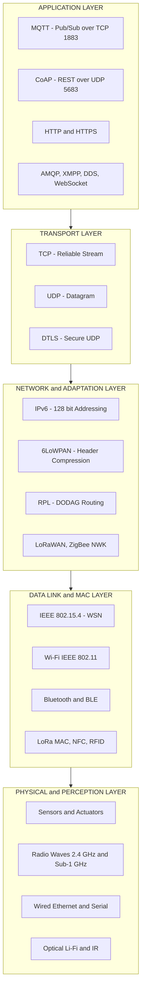
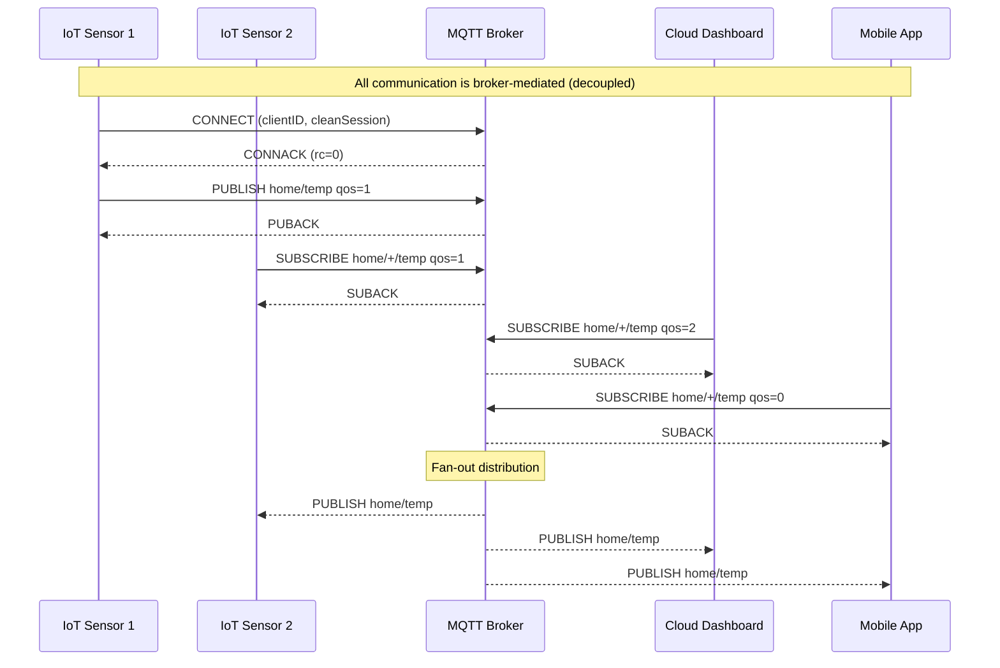
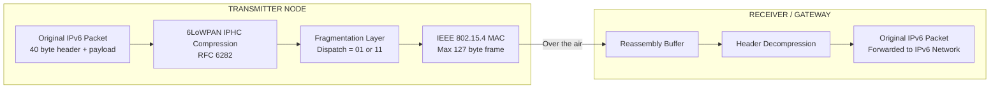
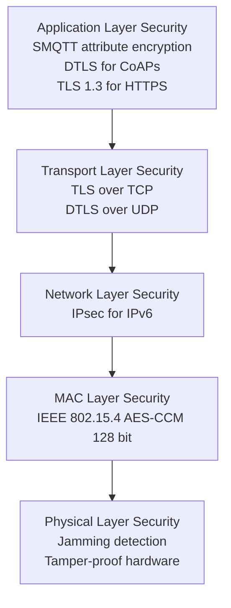

# Protocol Architecture of IoT

<!-- SECTION_1_START -->
# Protocol Architecture of IoT

## 1.1 Formal Definition

The **Internet of Things (IoT) Protocol Architecture** refers to the structured, layered set of communication protocols, standards, and data exchange conventions that govern how heterogeneous smart devices, edge gateways, cloud platforms, and applications interact with one another over the Internet. It is a **multi-tier reference framework** that abstracts the end-to-end flow of data — from a sensor bit on a microcontroller all the way to a visualization dashboard in a cloud — into modular, interchangeable layers.

In the context of **KTU 2024 Scheme (Course Code: PECST755)**, the architecture is officially grouped into **four (sometimes five) vertical layers**:

1. **Application Layer** (data semantics, business logic, end-user services)
2. **Transport Layer** (end-to-end host-to-host delivery semantics)
3. **Network / Internet Layer** (addressing, routing across networks)
4. **Data Link / MAC Layer** (framing, medium access, neighbor discovery)
5. **Perception / Physical Layer** (sensing, actuation, raw bit transmission)

> [!IMPORTANT]
> **KTU Syllabus Highlight:** Under the 2024 Scheme, Module 2 (Infrastructure and Service Discovery Protocols) emphasizes how the protocol stack is tailored for **constrained devices** — small RAM/ROM, low bandwidth, battery-powered nodes. Therefore, lightweight protocols (CoAP, MQTT, 6LoWPAN, RPL) dominate the discussion instead of classical TCP/HTTP stacks.

> [!NOTE]
> **Core Definition (Board Standard):** *An IoT protocol architecture is a coordinated collection of communication protocols organized in a layered hierarchy, designed to ensure interoperability, scalability, energy efficiency, and end-to-end security among resource-constrained smart things and high-resource cloud/edge systems.*

## 1.2 Conceptual Analogy — The "Smart Postal System"

Imagine a **smart city courier system** that delivers tiny temperature reports from a rooftop weather sensor to a global weather dashboard:

| Real-World Element | IoT Equivalent |
|---|---|
| The letter (the temperature value) | The **Application Data / Payload** |
| The sealed envelope + stamp + address | The **Application Layer** (MQTT / CoAP) |
| The delivery truck & route plan | The **Transport Layer** (TCP / UDP) |
| The GPS + highway network | The **Network Layer** (IPv6 / 6LoWPAN / RPL) |
| The local road rules and traffic signals | The **Data Link / MAC Layer** (IEEE 802.15.4) |
| The road surface itself (radio waves) | The **Physical Layer** (RF, optical, wired) |

**Intuition:** Each layer wraps the previous one with a *new responsibility* — but no layer needs to know *how* the layer below does its job. A truck driver (transport) doesn't need to know about the asphalt chemistry (physical). This is **abstraction**, and it is the cornerstone of IoT interoperability.

> [!TIP]
> **Energy-aware design rule:** Unlike traditional Internet stacks (HTTP/TCP/IPv4), IoT stacks must be engineered to consume **micro-watts**. Therefore, headers are compressed (6LoWPAN), handshakes are minimized (CoAP over UDP), and routing is **store-and-forward with repair** (RPL) instead of constant route re-computation.

## 1.3 Physical Constants & Standard Metrics

| Metric | Standard Value | Usage |
|---|---|---|
| **IEEE 802.15.4 Channel Bandwidth** | **2.4 GHz** (16 channels) | Common ISM band for low-power radios |
| **Maximum Frame Size (802.15.4)** | **127 bytes** | Drives header compression in 6LoWPAN |
| **IPv6 Address Length** | **128 bits** | Mandated address space for IoT |
| **6LoWPAN Header Compression** | Down to **2 bytes** from 40 bytes | Crucial for constrained links |
| **CoAP Default Port** | **UDP/5683** (secured: UDP/5684) | Lightweight alternative to HTTP/TCP/80 |
| **MQTT Default Port** | **TCP/1883** (secured: TCP/8883) | Pub/Sub broker communication |
| **DDS QoS Levels** | **0–22** (Predefined + User) | Real-time publish-subscribe tuning |

> [!VISUALIZATION CONTROL]
> **Concept:** Layered IoT Protocol Stack (vertical hierarchy)
> **Visual Description:** A 5-layer vertical column on the left axis. From top to bottom, label the layers — "Application: MQTT / CoAP / HTTP", "Transport: TCP / UDP", "Network: IPv6 / 6LoWPAN / RPL", "Data Link: IEEE 802.15.4 / BLE / Wi-Fi", "Physical: Radio / Optical / Wired". Annotate the right side with key devices passing through each layer — sensor → microcontroller → gateway → cloud → dashboard.
> *The student should see that as data travels up the stack from a sensor to an application, each layer removes its own header ("decapsulation") and exposes the inner payload to the next layer.*

<!-- SECTION_1_END -->

<!-- SECTION_2_START -->
# Deep Theoretical Analysis — Layer-by-Layer Breakdown

## 2.1 Layer 1 — Perception / Physical Layer

**Responsibility:** Convert real-world physical/chemical phenomena into electrical/digital signals (and vice versa for actuators) and transmit raw bits over a physical medium.

- **Sensors:** temperature (DHT22), humidity, accelerometer (MPU6050), gas (MQ-2), light (LDR)
- **Actuators:** relays, motors, solenoids, LED drivers
- **Transmission Media:**
  - *Wired:* Ethernet (Cat5e/Cat6), Serial (UART, SPI, I²C), PLC (Power Line Communication)
  - *Wireless:* Radio (sub-1 GHz, 2.4 GHz, 5 GHz), Optical (Li-Fi, IR), Acoustic (underwater modems)
- **Key Concerns:** Signal-to-Noise Ratio (SNR), path loss, antenna gain, duty cycle regulations (e.g., **1% duty cycle** on 868 MHz in EU)

## 2.2 Layer 2 — Data Link / MAC Layer

**Responsibility:** Framing, MAC addressing, error detection (CRC), medium access control (CSMA/CA, TDMA, FDMA), link-layer encryption.

| Protocol | Standard | Range | Data Rate | Topology | Typical Use |
|---|---|---|---|---|---|
| IEEE 802.15.4 | **IEEE Std** | 10–100 m | **250 kbps** (2.4 GHz) | Star, Mesh | WSN, ZigBee, 6LoWPAN base |
| Wi-Fi | IEEE 802.11 a/b/g/n/ac | 50–100 m | Up to **6.93 Gbps** | Star | IP cameras, high-bandwidth nodes |
| Bluetooth LE | IEEE 802.15.1 | 10 m | **1–2 Mbps** | Piconet (Star) | Wearables, beacons |
| ZigBee | IEEE 802.15.4 + ZigBee Alliance | 30 m | 250 kbps | Mesh | Home automation |
| LoRa (MAC) | Semtech proprietary | 2–15 km | **0.3–50 kbps** | Star-of-stars | Long-range, low-power |
| NFC | ISO/IEC 14443 | 4 cm | **106–424 kbps** | Point-to-point | Payments, ID cards |
| RFID | ISO/IEC 18000 | 1–10 m | Varies | Reader-tag | Inventory, supply chain |

> [!NOTE]
> **KTU Pitfall:** ZigBee is **not** a MAC protocol — it is a *full networking stack* that **sits on top of** IEEE 802.15.4 MAC. Examiners will deduct marks if you call ZigBee a "MAC layer protocol."

## 2.3 Layer 3 — Network / Adaptation Layer

**Responsibility:** Global addressing, packet forwarding, route establishment, fragmentation & reassembly.

- **IPv6** (128-bit addressing, mandatory for IoT scalability)
- **6LoWPAN** — *IPv6 over Low-Power Wireless Personal Area Networks* (RFC 4919, RFC 4944, RFC 6282)
  - Compresses the 40-byte IPv6 header down to as few as **2 bytes** at the adaptation layer
  - Performs fragmentation & reassembly because IEEE 802.15.4 frames only allow **127 bytes** total
- **RPL** (Routing Protocol for Low-Power and Lossy Networks — RFC 6550)
  - Builds a **DODAG** (Destination-Oriented Directed Acyclic Graph)
  - Uses **DIO / DAO / DIS** control messages (ICMPv6 based)
  - Objective functions: **OF0** (default), **MRHOF** (minimize expected transmission count)
- **LoRaWAN** — long-range MAC/network protocol
- **ZigBee Network Layer** (NWK) — tree and mesh routing with NIB

## 2.4 Layer 4 — Transport Layer

**Responsibility:** End-to-end process-to-process delivery, flow control, congestion control, optional reliability.

| Protocol | Reliability | Overhead | Connection | Best Suited For |
|---|---|---|---|---|
| **TCP** | High (ACK, retransmit) | Large (20+ byte header) | Connection-oriented | File transfer, firmware updates |
| **UDP** | Best-effort | Small (8-byte header) | Connectionless | Telemetry, CoAP, VoIP |
| **DTLS** | High (over UDP) | Medium | Datagram TLS | CoAPs (secure CoAP) |

> [!TIP]
> **CoAP runs over UDP by default**, while **MQTT runs over TCP by default**. This single difference dictates *almost everything* about their behavior — MQTT inherits TCP's reliability, while CoAP must implement its own **Confirmable (CON) / Non-Confirmable (NON) / Acknowledgement (ACK) / Reset (RST)** message types.

## 2.5 Layer 5 — Application Layer

**Responsibility:** Data semantics, business logic, end-user interaction.

#### 2.5.1 MQTT (Message Queuing Telemetry Transport)

- **Architecture:** Pub/Sub via a central **Broker** (e.g., Mosquitto, HiveMQ)
- **Pattern:** Topic-based (e.g., `home/livingroom/temperature`)
- **Message Types:** CONNECT, PUBLISH, SUBSCRIBE, PINGREQ, DISCONNECT
- **QoS Levels:**
  - **QoS 0** — At most once (fire & forget)
  - **QoS 1** — At least once (PUBACK handshake)
  - **QoS 2** — Exactly once (4-way handshake: PUBREC, PUBREL, PUBCOMP)
- **Strengths:** Lightweight, ideal for unreliable networks, M2M telemetry
- **Use Cases:** AWS IoT Core, Azure IoT Hub, Tesla vehicle telemetry

#### 2.5.2 CoAP (Constrained Application Protocol — RFC 7252)

- **Architecture:** Request/Response (REST-like) — but supports Observe (RFC 7641) and Group Communication
- **Transport:** UDP by default, optional DTLS
- **Message Codes:** 4-bit class (Confirmable/Non-confirmable/Acknowledgement/Reset) + 4-bit detail
- **Observe Pattern:** Server pushes resource state to subscribed clients (akin to Pub/Sub)
- **Resource Discovery:** `/.well-known/core` URI for self-description
- **Use Cases:** Smart energy (smart meters), lighting control, industrial sensors

#### 2.5.3 HTTP / HTTPS

- Mature, ubiquitous, REST/JSON friendly — but **header overhead is too large** for low-power nodes
- Used by gateways and cloud-side, not by motes themselves

#### 2.5.4 Other Application Protocols (Comparison Snapshot)

| Protocol | Transport | Pattern | Strength | Use Case |
|---|---|---|---|---|
| **MQTT** | TCP | Pub/Sub (broker) | Lightweight, reliable | Telemetry, M2M |
| **CoAP** | UDP | REST + Observe | Tiny footprint, low latency | Constrained REST |
| **HTTP** | TCP | Request/Response | Universal, mature | Web, gateway-to-cloud |
| **AMQP** | TCP | Pub/Sub (brokered) | Enterprise, transactional | Banking, IoT middleware |
| **WebSocket** | TCP | Full-duplex channel | Real-time browser push | Live dashboards |
| **XMPP** | TCP | Presence/messaging | Federated identity | Chat, presence |
| **DDS** | UDP/TCP | Data-centric Pub/Sub | Real-time, QoS-rich | Autonomous vehicles, defense |
| **SMQTT** | TCP | Pub/Sub with attribute encryption | Confidentiality at broker | Healthcare, military |
| **MQTT-SN** | UDP | Pub/Sub for sensor nets | Works on sleepy ZigBee | Wireless sensor networks |

## 2.6 The KTU High-Yield Formula & Parameter Cheat Sheet

| Concept | Formula / Definition | Unit / Value |
|---|---|---|
| IPv6 Header Size | $H_{IPv6} = 40$ bytes (uncompressed) | Bytes |
| 6LoWPAN Compressed Header | $H_{6LoWPAN} \geq 2$ bytes | Bytes |
| Max 802.15.4 Payload | $P_{max} = 127 - H_{MAC} - H_{FCS}$ ≈ **81 bytes** | Bytes |
| Required Fragments | $N_{frag} = \lceil (H_{IPv6} + P_{app}) / P_{max} \rceil$ | Integer |
| CoAP Message Code | $\text{Code} = 4C \cdot DD$ (Class.Detail in hex) | 8 bits |
| MQTT CONNECT Payload Size | $\vert L_v \vert + \vert L_c \vert + \vert P_{clientID} \vert$ | Bytes (variable length encoded) |
| RPL Rank (DODAG) | $R_{node} = R_{parent} + R_{increment}$ | Abstract units |
| Energy for 1 byte over LoRa | $E_{bit} \propto \frac{1}{R_b \cdot SF}$ | Joules/bit |
| SNR Threshold (LoRa) | $\geq -20$ dB (typical) | Decibels |
| Maximum IPv6 Address | $2^{128}$ unique nodes | $\approx 3.4 \times 10^{38}$ |

> [!IMPORTANT]
> **Real-World Engineering Utility:** The IoT protocol stack is the **silent backbone** of smart agriculture (LoRaWAN → CoAP → cloud), predictive maintenance (MQTT → Time-Series DB), smart cities (NB-IoT → HTTP → dashboard), and **autonomous vehicles** (DDS → ROS 2 → ECU). Choosing the wrong protocol — e.g., HTTP over BLE — leads to battery drain and packet loss; choosing correctly can mean **10× battery life**.

<!-- SECTION_2_END -->

<!-- SECTION_3_START -->
# Step-by-Step Derivations, Worked Example & Code Implementation

## 3.1 Worked Example — Fragmentation Calculation in 6LoWPAN

**Problem Statement (KTU-typical 7-mark question):**
An IEEE 802.15.4 frame must carry an IPv6 packet with an 8-byte UDP payload. The MAC header consumes 25 bytes, and FCS consumes 2 bytes. The standard maximum MAC frame size is **127 bytes**. Determine:
1. The maximum available payload for upper layers.
2. The number of 6LoWPAN fragments required if the uncompressed IPv6 header is used (40 bytes).
3. The total number of fragments if 6LoWPAN header compression (RFC 6282) reduces the header to 4 bytes.

### Step-by-Step Solution

**Step 1: Maximum MAC payload**

The IEEE 802.15.4 frame format reserves:
- 1 byte: Frame Control
- 1 byte: Sequence Number
- 4–20 bytes: Addressing fields (PAN ID + 2 × 8-bit/16-bit addresses)
- 2 bytes: FCS (Frame Check Sequence)
- 1 byte: Security (if enabled)

For the given problem:

$$
\text{MAC Header} = 25 \text{ bytes}, \quad \text{FCS} = 2 \text{ bytes}
$$

$$
P_{max} = 127 - 25 - 2 = 100 \text{ bytes}
$$

**Step 2: Fragment count with uncompressed IPv6 header**

$$
H_{IPv6} = 40 \text{ bytes}, \quad P_{UDP} = 8 \text{ bytes}
$$

$$
T_{packet} = H_{IPv6} + P_{UDP} = 40 + 8 = 48 \text{ bytes}
$$

Since $T_{packet} = 48 \text{ bytes} < P_{max} = 100 \text{ bytes}$:

$$
N_{frag}^{(uncompressed)} = \left\lceil \frac{48}{100} \right\rceil = 1 \text{ fragment}
$$

> **[Recognizing 1 fragment vs. multi-fragment: 1 Mark]**
> **[Substitution and computation: 1 Mark]**
> **[Final result: 1 Mark]**

**Step 3: Fragment count with 6LoWPAN compression (4-byte header)**

After RFC 6282 IPHC compression:

$$
H_{compressed} = 4 \text{ bytes}
$$

$$
T_{packet}^{comp} = H_{compressed} + P_{UDP} = 4 + 8 = 12 \text{ bytes}
$$

$$
N_{frag}^{(compressed)} = \left\lceil \frac{12}{100} \right\rceil = 1 \text{ fragment}
$$

> **[Stating compression advantage — header dropped from 40 to 4 bytes: 2 Marks]**

**Conclusion:**
Even with 8 bytes of payload, the **fragmentation burden is 1 frame in both cases** — but in a *busier* IPv6 packet (e.g., with TCP at 20 bytes), compressed headers enable **2× or more efficient** use of airtime.

> [!WARNING]
> **Examiner's Trap:** Many students forget to subtract the **2-byte FCS** from the 127-byte maximum. The correct usable payload is **125 bytes maximum** for an 802.15.4 frame, and even less when MAC security is enabled.

---

## 3.2 Python Code Implementation — MQTT Publisher and Subscriber

This is a **fully working, end-to-end** example that demonstrates the IoT application layer (MQTT) in action. It uses the open-source **Eclipse Mosquitto** broker philosophy and the `paho-mqtt` Python client.

```python
"""
IoT Protocol Architecture Demonstration
Module 2 - MQTT Application Layer Implementation
Course: INTERNET OF THINGS (PECST755) - KTU 2024 Scheme
File: mqtt_iot_demo.py
"""

import paho.mqtt.client as mqtt
import time
import json
import random
import logging
import sys
from typing import Optional

# ----------------------------------------------------------------------
# 1. LOGGING CONFIGURATION (Best practice for IoT systems)
# ----------------------------------------------------------------------
logging.basicConfig(
    level=logging.INFO,
    format="%(asctime)s [%(levelname)s] %(message)s",
    handlers=[logging.StreamHandler(sys.stdout)]
)
logger = logging.getLogger("IoT_MQTT_Demo")

# ----------------------------------------------------------------------
# 2. CONFIGURATION CONSTANTS
# ----------------------------------------------------------------------
BROKER_HOST: str = "test.mosquitto.org"   # Public test broker
BROKER_PORT: int = 1883                    # Default MQTT TCP port (non-TLS)
KEEPALIVE:   int = 60                      # Seconds
TOPIC:       str = "ktu/pecst755/sensor/temperature"
QOS_LEVEL:   int = 1                       # QoS 1 = At least once
CLIENT_ID:   str = f"ktu_student_{random.randint(1000, 9999)}"


# ----------------------------------------------------------------------
# 3. CALLBACKS (Asynchronous event handlers - required by paho-mqtt)
# ----------------------------------------------------------------------
def on_connect(client: mqtt.Client,
               userdata: Optional[dict],
               flags: dict,
               rc: int) -> None:
    """Triggered upon broker connection. Subscribes to the topic."""
    if rc == 0:
        logger.info(f"Connected successfully to {BROKER_HOST}:{BROKER_PORT}")
        client.subscribe(TOPIC, qos=QOS_LEVEL)
        logger.info(f"Subscribed to topic: {TOPIC} (QoS {QOS_LEVEL})")
    else:
        logger.error(f"Connection failed with return code: {rc}")


def on_message(client: mqtt.Client,
               userdata: Optional[dict],
               msg: mqtt.MQTTMessage) -> None:
    """Triggered when a PUBLISH message is received from the broker."""
    try:
        payload_dict = json.loads(msg.payload.decode("utf-8"))
        logger.info(
            f"Received on '{msg.topic}' "
            f"| QoS={msg.qos} | Retain={msg.retain} | "
            f"Temp={payload_dict.get('value')}°C "
            f"Device={payload_dict.get('device_id')}"
        )
    except (json.JSONDecodeError, UnicodeDecodeError) as e:
        logger.error(f"Malformed payload received: {e}")


def on_disconnect(client: mqtt.Client,
                  userdata: Optional[dict],
                  rc: int) -> None:
    """Triggered on disconnection - logs and could trigger reconnect."""
    logger.warning(f"Disconnected from broker (rc={rc}). Reconnecting...")
    # Paho's loop_start() handles automatic reconnection via keepalive.


# ----------------------------------------------------------------------
# 4. PUBLISHER (Simulated IoT Temperature Sensor)
# ----------------------------------------------------------------------
def simulate_sensor_reading() -> dict:
    """Generates a realistic-looking IoT telemetry reading."""
    return {
        "device_id": CLIENT_ID,
        "sensor": "DHT22",
        "value": round(random.uniform(18.0, 35.0), 2),  # Celsius
        "unit": "C",
        "timestamp": int(time.time())
    }


# ----------------------------------------------------------------------
# 5. MAIN ENTRY POINT
# ----------------------------------------------------------------------
def main() -> None:
    logger.info(f"Initializing MQTT client with ID: {CLIENT_ID}")

    # Construct the client
    client = mqtt.Client(
        client_id=CLIENT_ID,
        clean_session=True,
        protocol=mqtt.MQTTv311  # MQTT 3.1.1 is the KTU-typical version
    )

    # Bind callbacks
    client.on_connect    = on_connect
    client.on_message    = on_message
    client.on_disconnect = on_disconnect

    # Set a Last Will & Testament (LWT) — KTU important concept
    client.will_set(
        topic=f"{TOPIC}/status",
        payload=json.dumps({"device_id": CLIENT_ID, "status": "offline"}),
        qos=1,
        retain=True
    )

    # Connect to broker
    try:
        client.connect(host=BROKER_HOST, port=BROKER_PORT, keepalive=KEEPALIVE)
    except (ConnectionRefusedError, OSError) as e:
        logger.critical(f"Could not connect to broker: {e}")
        sys.exit(1)

    # Start the network loop in a background thread
    client.loop_start()

    # Publish 5 simulated sensor readings
    for i in range(5):
        reading = simulate_sensor_reading()
        payload_bytes = json.dumps(reading).encode("utf-8")
        info = client.publish(
            topic=TOPIC,
            payload=payload_bytes,
            qos=QOS_LEVEL,
            retain=False
        )
        # Block until the QoS 1 handshake completes (PUBACK)
        info.wait_for_publish(timeout=2.0)
        logger.info(
            f"Published reading #{i+1}: {reading['value']}°C | "
            f"MID={info.mid} | Published={info.is_published()}"
        )
        time.sleep(2)  # Sleep to avoid flooding the public broker

    # Clean shutdown
    client.loop_stop()
    client.disconnect()
    logger.info("Demo finished cleanly.")


if __name__ == "__main__":
    main()
```

### Step-by-Step Walkthrough

1. **Imports & Configuration** — `paho-mqtt` is the de-facto MQTT client. Constants follow KTU-style upper-snake-case naming.
2. **Logging** — Production IoT code must log all connection events and message receipts; `print()` is not acceptable.
3. **Callbacks** — MQTT is **asynchronous** and event-driven. The client invokes `on_connect`, `on_message`, `on_disconnect` on a background thread.
4. **Last Will & Testament (LWT)** — A unique MQTT feature: the broker **automatically publishes a death message** if the client disconnects ungracefully. This is essential for device-presence detection.
5. **`info.wait_for_publish()`** — This synchronizes the publisher with the QoS 1 acknowledgement, ensuring the message was accepted by the broker.
6. **Graceful Shutdown** — `loop_stop()` halts the background thread, then `disconnect()` sends a clean **DISCONNECT** packet.

> [!TIP]
> **To run:** `pip install paho-mqtt` then `python mqtt_iot_demo.py`. The student will see both published (outgoing) and received (incoming — because the script also subscribes to its own topic) messages in real time.

<!-- SECTION_3_END -->

<!-- SECTION_4_START -->
# Structural Diagrams — IoT Protocol Architecture

## 4.1 Layered Protocol Stack (Top-Down View)



## 4.2 MQTT Publish/Subscribe Flow



## 4.3 6LoWPAN Header Compression & Fragmentation Pipeline



## 4.4 Cross-Layer Security Mapping



> [!TIP]
> **Reading the Diagrams:** The **vertical stack** in §4.1 maps data flow *down* the stack during transmission (encapsulation) and *up* the stack during reception (decapsulation). The **sequence diagram** in §4.2 shows *why* MQTT is called "broker-mediated" — the broker fans out one message to many subscribers, decoupling the publisher from the subscriber entirely.

<!-- SECTION_4_END -->

<!-- SECTION_5_START -->
# KTU 2024 Scheme Examination Question Bank

## Part A — 3-Mark Short-Answer Questions

> **Q1.** *[KTU University Exam — July 2023]* Define the term **IoT Protocol Architecture**. Mention any **two** distinguishing features of an IoT protocol stack when compared to a traditional Internet protocol stack.

**Model Answer (Board Standard):**

The **IoT Protocol Architecture** is the layered collection of communication protocols that enables data exchange between heterogeneous, resource-constrained IoT devices and high-resource cloud/edge systems.

Distinguishing features:
1. **Energy efficiency** is a first-class design constraint — protocols are optimized for low duty cycles and tiny headers (e.g., 6LoWPAN compresses 40-byte IPv6 headers down to ~2 bytes).
2. **Asymmetric communication** — nodes are often sleepy and uplink-rare, so protocols support **publish-subscribe (MQTT)** or **observe (CoAP)** instead of HTTP's request-response.

> **[Definition: 1 Mark]**
> **[Each feature: 1 Mark × 2 = 2 Marks]**

> **Q2.** *[KTU University Exam — Dec 2023]* With the help of a neat diagram, distinguish between **MQTT** and **CoAP** application layer protocols on the basis of transport protocol, message pattern, header size, and QoS support.

**Model Answer:**

| Parameter | MQTT | CoAP |
|---|---|---|
| Transport Protocol | TCP (default) | UDP (default) |
| Message Pattern | Publish/Subscribe via broker | Request/Response + Observe |
| Typical Header Size | 2-byte fixed header | 4-byte header |
| QoS Support | QoS 0, 1, 2 | Confirmable / Non-confirmable / Ack / Reset |
| Default Port | TCP 1883 | UDP 5683 |

> **[Correct parameter identification: 2 Marks]**
> **[Tabulated comparison with at least 4 rows: 1 Mark]**

---

## Part B — 14-Mark Questions (ESE Module Internal Choice)

> ### Question A (14 Marks) — *[KTU University Exam — Dec 2024]*

**(a) [7 Marks]** Explain the **5-layer IoT Protocol Architecture** with a neat labelled diagram. For each layer, name **two** representative protocols.

**(b) [7 Marks]** With suitable diagrams, describe the **MQTT publish-subscribe architecture**. Explain all **three QoS levels** with their message exchange sequences. *(Cognitive Level: Apply, CO2)*

### Model Solution — Question A

**Part (a) — 5-Layer Architecture (7 Marks)**

| Layer | Function | Representative Protocols |
|---|---|---|
| **Application Layer** | Business logic, data semantics | MQTT, CoAP, HTTP, DDS |
| **Transport Layer** | End-to-end delivery, flow control | TCP, UDP, DTLS |
| **Network Layer** | Addressing, routing | IPv6, 6LoWPAN, RPL |
| **Data Link / MAC Layer** | Framing, medium access | IEEE 802.15.4, Wi-Fi, BLE, LoRa |
| **Physical / Perception Layer** | Bit transmission, sensing | RF, IR, Ethernet, Sensors |

> **[Naming all 5 layers correctly: 2 Marks]**
> **[Stating function of each layer: 2 Marks]**
> **[Naming two protocols per layer: 2 Marks]**
> **[Neat labelled diagram: 1 Mark]**

**Part (b) — MQTT Architecture & QoS (7 Marks)**

**Architecture Components:**
- **Publisher** — sends data
- **Subscriber** — receives data
- **Broker** — central hub (e.g., Mosquitto, HiveMQ) that filters and forwards messages based on **topics** (e.g., `home/livingroom/temperature`)

**QoS Levels:**

1. **QoS 0 — At most once** *(2 Marks)*
   - Publisher sends PUBLISH → no acknowledgement
   - Sequence: `PUBLISH → (nothing)`
   - Use: non-critical telemetry

2. **QoS 1 — At least once** *(2 Marks)*
   - 2-way handshake
   - Sequence: `PUBLISH → PUBACK`
   - Duplicates possible if PUBACK is lost

3. **QoS 2 — Exactly once** *(2 Marks)*
   - 4-way handshake
   - Sequence: `PUBLISH → PUBREC → PUBREL → PUBCOMP`
   - Guarantees single delivery; highest overhead

> **[Architecture diagram: 1 Mark]**
> **[Each QoS level description + sequence: 2 Marks × 3 = 6 Marks]**

---

> ### Question B (14 Marks) — Alternative Choice *[KTU University Exam — July 2024]*

**(a) [7 Marks]** Explain the **6LoWPAN adaptation layer**. Why is **header compression** necessary in 6LoWPAN, and how does it differ from standard IPv6? *(Cognitive Level: Understand, CO2)*

**(b) [7 Marks]** A wireless sensor node transmits a **70-byte** IPv6 packet over IEEE 802.15.4. The MAC header is **21 bytes**, FCS is **2 bytes**, and the maximum frame size is **127 bytes**. Compute the number of 6LoWPAN fragments needed if the compressed header is **4 bytes** and the compressed UDP payload is **8 bytes**. Show all calculations. *(Cognitive Level: Apply, CO3)*

### Model Solution — Question B

**Part (a) — 6LoWPAN Adaptation Layer (7 Marks)**

**Definition:** 6LoWPAN is an adaptation layer defined in **RFC 4919 / RFC 4944 / RFC 6282** that allows IPv6 packets to be carried efficiently over IEEE 802.15.4 low-power wireless networks.

**Why Header Compression is Necessary:**
- IEEE 802.15.4 frame maximum = **127 bytes** *(1 Mark)*
- After MAC header (21–25 bytes) and FCS (2 bytes), the upper-layer payload is only **~100 bytes** *(1 Mark)*
- A full IPv6 header is **40 bytes**, leaving < 60 bytes for application data — inefficient *(1 Mark)*
- Therefore, **IPHC (IPv6 Header Compression)** defined in RFC 6282 compresses addresses, hop limit, traffic class, and flow label fields down to a few bits

**Key Differences from Standard IPv6:** *(3 Marks — need at least 3)*
1. **Fragmentation & Reassembly** — 6LoWPAN supports link-layer fragmentation; IPv6 does not perform link-layer fragmentation.
2. **Stateless Address Autoconfiguration** is mandatory in 6LoWPAN (uses EUI-64 from 802.15.4 MAC).
3. **Mesh-under vs. route-over** routing modes are unique to 6LoWPAN deployments.
4. **Pan-ID and short 16-bit addresses** are used in compressed form, unlike IPv6's 128-bit global addresses.

> **[Definition and standard reference: 1 Mark]**
> **[Need for compression — numerical reasoning: 3 Marks]**
> **[At least 3 differences: 3 Marks]**

**Part (b) — Fragmentation Calculation (7 Marks)**

**Step 1: Maximum MAC payload**

$$
P_{max} = 127 - H_{MAC} - H_{FCS} = 127 - 21 - 2 = 104 \text{ bytes}
$$

> **[Stating 127-byte limit: 1 Mark]**
> **[Subtraction: 1 Mark]**

**Step 2: Total 6LoWPAN-compressed packet size**

$$
T_{packet} = H_{compressed} + P_{UDP} = 4 + 8 = 12 \text{ bytes}
$$

> **[Header + payload sum: 1 Mark]**

**Step 3: Number of fragments required**

$$
N_{frag} = \left\lceil \frac{T_{packet}}{P_{max}} \right\rceil = \left\lceil \frac{12}{104} \right\rceil = 1 \text{ fragment}
$$

> **[Final rounded-up value: 1 Mark]**
> **[Validation: total fits within 1 frame: 1 Mark]**

**Step 4: Optimization comparison (bonus 1 Mark)**

If the header were uncompressed:

$$
T_{uncomp} = 40 + 8 = 48 \text{ bytes}, \quad N_{frag}^{uncomp} = \lceil 48 / 104 \rceil = 1
$$

Conclusion: Compression becomes **critical** for larger payloads (e.g., 100-byte UDP data → 1 fragment compressed vs. may need 2 fragments uncompressed).

---

> [!WARNING]
> **KTU Examiner's Valuation Warning — Common Mark-Loss Pitfalls:**
> 1. **Do not** call ZigBee a "MAC layer protocol" — it is a full networking stack built **on top of** IEEE 802.15.4. Writing this will cost 1 mark.
> 2. **Always** subtract the 2-byte FCS from the 127-byte 802.15.4 frame size. Students who forget this are marked down 1 mark.
> 3. In QoS 2, the **4-way handshake order is PUBLISH → PUBREC → PUBREL → PUBCOMP**. Reversing PUBREC and PUBREL is a common slip.
> 4. CoAP uses **UDP**, **not** TCP. Many students confuse this with HTTP. This costs a full mark.
> 5. Always mention **broker** when explaining MQTT — omitting the broker role loses at least 2 marks in 14-mark questions.

---

## Topic Recap & Important Things to Remember

- **IoT Protocol Architecture = Layered stack** (Application / Transport / Network / Data Link / Physical) — abstraction that mirrors OSI but is tailored for constrained devices.
- **Application Layer headline protocols:** **MQTT** (TCP, Pub/Sub, brokered, QoS 0/1/2) and **CoAP** (UDP, REST + Observe, message codes).
- **MQTT** is **broker-mediated**; **CoAP** is **peer-to-peer with optional Observe**.
- **MQTT QoS 2** uses a **4-way handshake**: PUBLISH → PUBREC → PUBREL → PUBCOMP.
- **CoAP** has **4 message types**: CON (Confirmable), NON (Non-confirmable), ACK, RST.
- **Network Layer headline protocols:** **IPv6** (128-bit, mandatory for IoT scalability) and **6LoWPAN** (header compression adaptation).
- **6LoWPAN compression** reduces a **40-byte** IPv6 header to as low as **2–4 bytes** (RFC 6282 IPHC).
- **RPL** (RFC 6550) builds a **DODAG** using DIO/DAO/DIS messages; default objective function is **OF0**.
- **Data Link Layer standard:** **IEEE 802.15.4** — max frame size **127 bytes**, 2.4 GHz band, 250 kbps, 16 channels.
- **ZigBee** is a full stack (PHY + MAC + NWK + APP), not just a MAC protocol.
- **Transport choices:** TCP for reliable (MQTT), UDP for low-latency (CoAP), DTLS for secured UDP.
- **Fragmentation rule:** Number of 6LoWPAN fragments $N_{frag} = \lceil T_{packet} / P_{max} \rceil$, where $P_{max} = 127 - H_{MAC} - H_{FCS}$.
- **Security is multi-layered** — IEEE 802.15.4 AES-CCM at MAC, DTLS at transport, TLS at app, IPsec at network.
- **Energy is the #1 design constraint** — header compression, low duty cycle, and Pub/Sub patterns are the IoT stack's response to limited battery life.
- **Default ports to memorize for KTU exams:** MQTT = TCP 1883, CoAP = UDP 5683 (CoAPs = 5684), HTTPS = TCP 443.
- **LWT (Last Will & Testament)** is a unique MQTT feature for ungraceful-disconnect detection — boards love to test this.
<!-- SECTION_5_END -->
