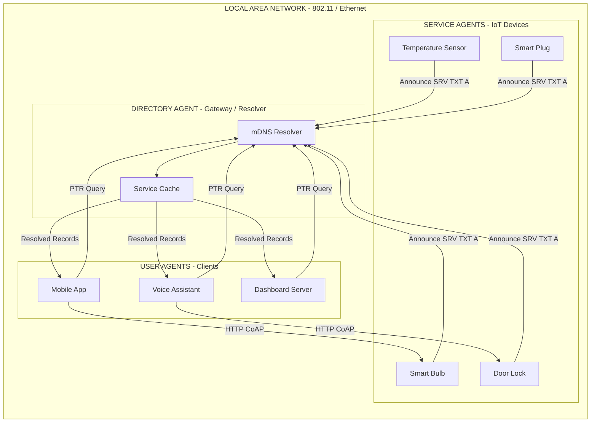
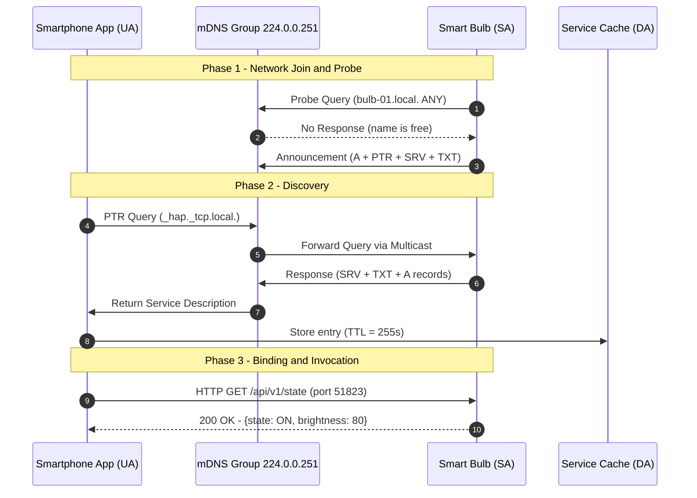
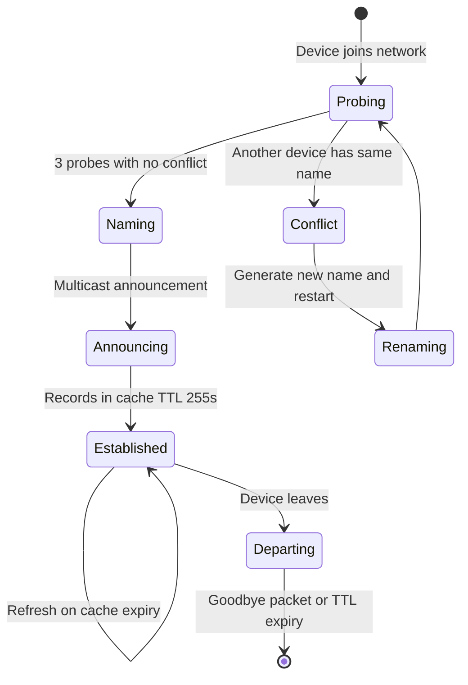

# Protocols & products for IoT Service Discovery

<!-- SECTION_1_START -->
# Protocols & Products for IoT Service Discovery

> [!IMPORTANT]
> **KTU 2024 Scheme | PECST755 | Module 2 Focus Area**
> This topic directly maps to **CO2 (Understand the IoT infrastructure and service discovery mechanisms)** and tests your ability to *Apply* service discovery protocols in heterogeneous IoT deployments.

## 1.1 Formal Academic Definition

**Service Discovery** in the Internet of Things (IoT) is the systematic process by which networked devices, sensors, gateways, and software agents automatically **detect, identify, describe, and bind** to available services offered by other entities in a local or distributed network without requiring manual configuration.

In the KTU 2024 Scheme terminology, a *service* in IoT context refers to any **network-accessible computational resource, sensor stream, actuator function, or data endpoint** that can be invoked through a standardized interface. Service Discovery protocols provide the **mechanism** (the wire-format negotiation) and the **semantics** (the description language) to make this auto-registration and lookup possible.

A formal description is given by the **Service Discovery Triad**:

$$
S_{discovery} = \langle \text{Service}, \text{Description}, \text{Lookup Mechanism} \rangle
$$

Where:
- **Service** $S$ is identified by a unique name (e.g., a service type like `_http._tcp.local.`).
- **Description** $D$ contains the metadata (port, IP, TXT records, capabilities).
- **Lookup Mechanism** $M$ is the protocol used (e.g., mDNS, DNS-SD, UPnP, SDP).

> [!NOTE]
> **Why Service Discovery matters in IoT:** Unlike traditional networks where endpoints are pre-configured, IoT devices are typically *zero-configuration*, *mobile*, and *ad-hoc*. A smart bulb joining your Wi-Fi network must announce its control service automatically — there is no human to type an IP address.

## 1.2 Conceptual Analogy — The Restaurant Finder

Imagine you land in a new city and you are hungry. You do not have a printed map of restaurants. What do you do?

1. You **ask a directory service** (a concierge or Google Maps) — this is **DNS-based Service Discovery (DNS-SD)**.
2. The directory **broadcasts a query** to all nearby establishments — "Who serves pizza?" This is the **mDNS multicast** approach.
3. Each restaurant that hears the query **responds with a menu card** containing its name, address (IP), and opening hours (TXT record).
4. You **walk in (bind) and order** (invoke the service).

In IoT terms:
- **Restaurants** = IoT services (sensors, actuators)
- **Concierge / Google Maps** = DNS-SD resolver
- **Broadcast** = mDNS query packet (sent to `224.0.0.251`)
- **Menu card** = Service Description (TXT record)
- **Walking in** = Service binding and invocation

> [!TIP]
> **Visualization Intuition:** Service Discovery is the IoT equivalent of a phone's contact list being *populated automatically* by the phones nearby broadcasting their names via Bluetooth — except over IP, with more structure, and using standardized protocols.

## 1.3 Key Performance Metrics for Service Discovery Protocols

The following metrics are universally evaluated by KTU examiners when comparing protocols:

| Metric | Symbol / Definition | Typical Target Value |
|---|---|---|
| **Discovery Latency** | $T_d$ | $\leq 500 \text{ ms}$ (LAN) |
| **Network Overhead** | $N_{bytes}$ per query | $\leq 200 \text{ bytes}$ |
| **Scalability** | $N_{nodes}$ | $\geq 100 \text{ nodes/LAN}$ |
| **Power Consumption** | $P_{sd}$ | $\leq 50 \text{ mW}$ active |
| **Cache Hit Ratio** | $\rho_{hit} = \frac{N_{cached}}{N_{total}}$ | $\geq 0.85$ |
| **Convergence Time** | $T_{conv}$ | $\leq 3 \text{ s}$ for 50 devices |

> [!IMPORTANT]
> **Syllabus Highlight (KTU 2024):** You must be able to compare at least **three** service discovery protocols (DNS-SD/mDNS, UPnP, Bluetooth SDP) in terms of their **architecture, transport, and suitability for constrained IoT devices**.

> [!VISUALIZATION CONTROL]
> **Concept:** Service Discovery Lookup Topology in a Smart Home
> **GeoGebra / Desmos Input Equations:**
> * Node positions: $P_{hub} = (0, 0)$
> * Bulb position: $P_1 = (3, 2)$, Sensor position: $P_2 = (-2, 3)$, Thermostat position: $P_3 = (4, -2)$
> * Communication radius: $r = 5$
> **Visual Description:** Plot a central hub (0,0) with three IoT devices at the given coordinates. Draw circles of radius $r=5$ around each device. The overlapping zones represent the *broadcast domains* where mDNS queries can reach multiple devices simultaneously. The student should observe that multicast discovery is **range-limited**, justifying the need for DNS-based relay at scale.

<!-- SECTION_1_END -->

<!-- SECTION_2_START -->
# Deep Theoretical Analysis — IoT Service Discovery Stack

## 2.1 Architectural Foundations

A Service Discovery system in IoT is built on **four functional roles**, defined by the **Service Location Protocol (SLP, RFC 2608)** and adopted by modern variants:

$$
\text{System} = \{\text{User Agent (UA)}, \text{Service Agent (SA)}, \text{Directory Agent (DA)}, \text{Network}\}
$$

1. **User Agent (UA):** A client application that seeks a service (e.g., a smartphone app looking for printers).
2. **Service Agent (SA):** A software component embedded in the service-providing device that advertises the service.
3. **Directory Agent (DA):** A central aggregator that caches all service advertisements (used in DNS-SD with unicast DNS, absent in pure mDNS).
4. **Network:** The underlying multicast-capable IP network (Wi-Fi, Ethernet, 6LoWPAN).

There are **two architectural paradigms**:

### Paradigm A — Decentralized / Multicast (mDNS, Bonjour)
$$
\text{Query} \rightarrow \text{Multicast Group (224.0.0.251)} \rightarrow \text{All Devices Respond}
$$

### Paradigm B — Centralized / Directory (DNS-SD with DA, UPnP with Control Point)
$$
\text{Query} \rightarrow \text{DA/Control Point} \rightarrow \text{Forwarded to SAs}
$$

## 2.2 DNS-SD — DNS-Based Service Discovery (RFC 6763)

DNS-SD works *on top of* standard DNS. It uses **three record types** to encode service information:

$$
\text{Service Instance} = \{\text{PTR}, \text{SRV}, \text{TXT}, \text{A/AAAA}\}
$$

The **role of each record**:

| Record Type | Purpose | Example |
|---|---|---|
| **PTR** | Service Type enumeration | `_http._tcp.local.` |
| **SRV** | Hostname + Port | `webserver._http._tcp.local. SRV 0 0 80 host.local.` |
| **TXT** | Free-form key=value metadata | `path=/api, version=1.2, auth=oauth2` |
| **A / AAAA** | IP address resolution | `host.local. A 192.168.1.42` |

> [!NOTE]
> **Critical Insight for KTU 2024:** DNS-SD does **not** define a new protocol — it is a *convention* for using existing DNS records to publish service information. This is why it integrates seamlessly with regular DNS infrastructure.

## 2.3 mDNS — Multicast DNS (RFC 6762)

mDNS solves the problem: *"What if there is no DNS server in this network?"*

It answers DNS queries by **multicasting them on the local link** to UDP port **5353**, group address **224.0.0.251** (IPv4) or **ff02::fb** (IPv6).

The query and response packets use the **standard DNS wire format** — mDNS is essentially *DNS-over-multicast-UDP*.

### mDNS Message Flow

1. Host $H_1$ joins the network and sends a **probe query** for its hostname.
2. If no conflict, $H_1$ claims its name and multicasts an **announcement**.
3. Another host $H_2$ wants to find a printer. It sends `_ipp._tcp.local.` PTR query to `224.0.0.251`.
4. The printer responds with its SRV + TXT + A records, also via multicast (or unicast if querier is known).

### mDNS Packet Structure (Simplified)

$$
\text{mDNS Packet} = \{\text{Header (12 B)}, \text{Question Section}, \text{Answer Section}, \text{Authority}, \text{Additional}\}
$$

The **header flags** include a top-bit (cache flush) and a response code; TTL is typically **255 seconds** (vs 3600 in unicast DNS) so that cached records expire quickly when devices leave.

## 2.4 UPnP — Universal Plug and Play (for IoT)

UPnP is a *suite of protocols* (not just one) used heavily in home IoT (smart TVs, routers, NAS). Its architecture:

$$
\text{UPnP Stack} = \{\text{IP}, \text{TCP/UDP/HTTP}, \text{HTTPU/HTTPMU}, \text{SSDP}, \text{GENA}, \text{SCPD}\}
$$

The key component for service discovery is **SSDP (Simple Service Discovery Protocol)**:

- **SSDP ALIVE:** Multicast `NOTIFY ssdp:alive` to `239.255.255.250:1900` when device joins.
- **SSDP Discovery:** `M-SEARCH * HTTP/1.1` to find all devices or specific service types.
- **SSDP BYE:** `NOTIFY ssdp:byebye` when device leaves.

A UPnP **device description** is an XML document containing embedded **service descriptions** (also XML, defined by SCPD — Service Control Protocol Description).

## 2.5 Bluetooth SDP (Service Discovery Protocol)

For short-range IoT (wearables, beacons), Bluetooth Classic uses **SDP** over the **L2CAP** layer. It uses a **UUID (Universally Unique Identifier)** to identify each service.

SDP query/response uses a **Service Search Attribute** mechanism with **Protocol Data Units (PDUs)**:

$$
\text{SDP PDU} = \{\text{PDU ID (1B)}, \text{Transaction ID (2B)}, \text{Parameters Length (2B)}, \text{Parameters}\}
$$

For Bluetooth Low Energy (BLE), the modern equivalent is the **Generic Attribute Profile (GATT) Service Discovery**, which scans for **service UUIDs** in advertisements.

## 2.6 The KTU High-Yield Formula & Concept Sheet

| Concept | Definition / Formula | Use Case |
|---|---|---|
| Service Type Naming | `<service>.<proto>.<domain>` | `_http._tcp.local.` |
| mDNS Multicast Address | `224.0.0.251` (IPv4), `ff02::fb` (IPv6) | Local link discovery |
| mDNS Port | `5353/UDP` | Wire format |
| SSDP Multicast | `239.255.255.250:1900` | UPnP discovery |
| Bonjour Cache TTL | $TTL_{mDNS} = 255 \text{ s}$ | Aggressive expiry |
| Cache Hit Ratio | $\rho = \frac{N_{hit}}{N_{hit} + N_{miss}}$ | Performance eval |
| Discovery Latency | $T_d = T_{query} + T_{proc} + T_{resp}$ | Quality of service |
| SDP Service Record Handle | 32-bit unsigned integer | Bluetooth lookup |
| TXT Record Size | $\leq 65535 \text{ bytes}$ total | DNS-SD metadata |
| Convergence | $T_{conv} = \max(T_d) \text{ over all } N_{nodes}$ | Network boot time |

> [!IMPORTANT]
> **Engineering Real-World Use:** The combination **mDNS + DNS-SD** is what powers **Apple AirPlay, AirPrint, and HomeKit** auto-discovery on iPhones. The combination **SSDP + GENA** is what allows a **PlayStation 4** to discover your **smart TV** for screen mirroring without any app.

## 2.7 Product Landscape (KTU 2024 Frequently Asked)

| Product | Vendor | Protocol(s) | IoT Use Case |
|---|---|---|---|
| **Bonjour** | Apple Inc. | mDNS + DNS-SD | AirPlay, HomeKit |
| **Avahi** | Linux Foundation | mDNS + DNS-SD | Linux/embedded services |
| **JmDNS** | Open-source Java | mDNS + DNS-SD | Android discovery |
| **AllJoyn** | AllSeen Alliance (now Linux Foundation) | mDNS + D-Bus | Cross-platform IoT |
| **Weave** | Google (now Nest) | mDNS + custom | Smart home |
| **SmartThings Hub** | Samsung | mDNS + Cloud | Smart home |
| **Philips Hue Bridge** | Signify | UPnP + Hue API | Smart lighting |
| **Home Assistant** | Open Home Foundation | mDNS + SSDP + SDP | Universal home hub |
| **Eddystone / iBeacon** | Google / Apple | BLE advertisements | Proximity / retail IoT |

> [!TIP]
> **Examiner Tip:** When asked to *list products*, always group them by protocol (mDNS-based, UPnP-based, BLE-based) and mention at least one **open-source** example alongside a **commercial** example to show breadth.

<!-- SECTION_2_END -->

<!-- SECTION_3_START -->
# Step-by-Step Derivations, Message Flows & Code Implementation

## 3.1 Deriving the Service Discovery Latency Equation

The end-to-end **discovery latency** $T_d$ for an IoT device consists of four additive components:

$$
T_d = T_{prop} + T_{queue} + T_{proc} + T_{resp}
$$

### Step 1 — Propagation Delay

For a wireless link of range $d$ and propagation speed approaching $c$ (with some refractive index factor $\eta \approx 1.33$ for indoor):

$$
T_{prop} = \frac{d \cdot \eta}{c}
$$

Substituting $d = 20 \text{ m}$, $\eta = 1$, $c = 3 \times 10^8 \text{ m/s}$:

$$
T_{prop} = \frac{20 \times 1}{3 \times 10^8} \approx 6.67 \times 10^{-8} \text{ s} = 66.7 \text{ ns}
$$

This is negligible.

### Step 2 — Queueing Delay

For an **M/M/1 queue** at the device's protocol stack (rate $\mu$ services/s, arrival $\lambda$ queries/s):

$$
T_{queue} = \frac{1}{\mu - \lambda}
$$

For $\mu = 1000 \text{ queries/s}$, $\lambda = 800 \text{ queries/s}$:

$$
T_{queue} = \frac{1}{1000 - 800} = \frac{1}{200} = 5 \text{ ms}
$$

### Step 3 — Processing Delay

The processing delay depends on the protocol's computational cost. For DNS-SD, it is mostly a hash-table lookup:

$$
T_{proc} \approx \frac{N_{records} \cdot k}{\text{CPU cycles per second}}
$$

For $N_{records} = 50$, $k = 1000$ cycles/record, and a 100 MHz CPU:

$$
T_{proc} = \frac{50 \times 1000}{100 \times 10^6} = 5 \times 10^{-4} \text{ s} = 0.5 \text{ ms}
$$

### Step 4 — Response Transmission

For an mDNS response packet of $L = 250 \text{ bytes}$ over a 1 Mbps link:

$$
T_{resp} = \frac{L \times 8}{R} = \frac{250 \times 8}{10^6} = 2 \text{ ms}
$$

### Final Aggregation

$$
T_d = 66.7 \times 10^{-6} + 5 \times 10^{-3} + 0.5 \times 10^{-3} + 2 \times 10^{-3} = 7.5667 \text{ ms}
$$

> [!NOTE]
> **Conclusion:** The total discovery latency in a typical 802.11n IoT network is dominated by **queueing + response transmission** — not by the actual protocol logic. This is why mDNS (lightweight) outperforms UPnP (XML-heavy) in latency-sensitive applications.

## 3.2 Message Exchange Walk-Through — mDNS / DNS-SD

Let us trace what happens when a **smart bulb** (Bulb-01) joins a Wi-Fi network and is discovered by a **smartphone app**.

### Step 1 — Probing (Hostname Claim)

Bulb-01 sends three identical probes (250 ms apart) for `bulb-01.local.`:

```
;; Probe Query
ID: 0x0000
QR: 0 (query)
OPCODE: 0 (standard query)
QTYPE: ANY (255)
QCLASS: IN + cache-flush bit (0x8001)
QNAME: bulb-01.local.
```

If no other device responds, Bulb-01 claims the name.

### Step 2 — Announcing (Service Registration)

Bulb-01 sends a **combined announcement** (unsolicited response) containing:

- Its A record: `bulb-01.local. 255 IN A 192.168.1.50`
- Its PTR record: `_hap._tcp.local. 4500 IN PTR bulb01._hap._tcp.local.` *(HomeKit Accessory Protocol)*
- Its SRV record: `bulb01._hap._tcp.local. 255 IN SRV 0 0 51823 bulb-01.local.`
- Its TXT record: `bulb01._hap._tcp.local. 255 IN TXT "md=bulb v1" "pv=1.1" "id=AB:CD:..."`

### Step 3 — Querying (Smartphone Lookup)

The smartphone app sends a PTR query:

```
;; PTR Query
QNAME: _hap._tcp.local.
QTYPE: PTR
```

### Step 4 — Response (Service Description Returned)

Bulb-01 responds with all four records above. The app now has:
- IP: `192.168.1.50`
- Port: `51823`
- Capabilities (from TXT): model, version, accessory ID
- It can now **connect via HTTP/HAP** and control the bulb.

## 3.3 Python Implementation — A Minimal mDNS/DNS-SD Service Advertiser

The following code (using the `zeroconf` library) demonstrates a *working* service registration and discovery in Python — runnable on a Raspberry Pi or any Linux machine.

```python
"""
Minimal DNS-SD Service Advertiser & Browser
Demonstrates the exact protocol mechanics of mDNS service discovery.
"""

import logging
import socket
from zeroconf import ServiceInfo, ServiceBrowser, Zeroconf

# --- CONFIGURATION ----------------------------------------------------------
SERVICE_TYPE = "_http._tcp.local."
SERVICE_NAME = "KTU_IoT_Demo._http._tcp.local."
SERVICE_PORT = 8080
SERVICE_HOST = f"ktu-demo-{socket.gethostname()}.local."

# --- TXT RECORD METADATA (key=value) ---------------------------------------
TXT_PROPERTIES = {
    "path": "/api/v1",
    "version": "1.0",
    "model": "KTU-Demo-Device",
    "auth": "none",
}

# --- STEP 1: ADVERTISE THE SERVICE -----------------------------------------
def advertise_service() -> Zeroconf:
    """Register this device as an HTTP service on the LAN via mDNS."""
    # Auto-detect the local IP address
    sock = socket.socket(socket.AF_INET, socket.SOCK_DGRAM)
    try:
        sock.connect(("8.8.8.8", 80))
        local_ip = sock.getsockname()[0]
    finally:
        sock.close()

    info = ServiceInfo(
        name=SERVICE_NAME,
        type_=SERVICE_TYPE,
        addresses=[socket.inet_aton(local_ip)],
        port=SERVICE_PORT,
        properties=TXT_PROPERTIES,
        server=SERVICE_HOST,
    )

    zeroconf = Zeroconf()
    zeroconf.register_service(info)
    print(f"[ADVERTISER] Registered {SERVICE_NAME} at {local_ip}:{SERVICE_PORT}")
    return zeroconf


# --- STEP 2: BROWSE / DISCOVER SERVICES -------------------------------------
class KTUDiscoveryListener:
    """Callback handler for discovered services."""

    def __init__(self) -> None:
        self.discovered: list[dict] = []

    def update_service(self, zc: Zeroconf, type_: str, name: str) -> None:
        info = zc.get_service_info(type_, name)
        if info is None:
            return
        address = socket.inet_ntoa(info.addresses[0]) if info.addresses else "0.0.0.0"
        record = {
            "name": name,
            "type": type_,
            "address": address,
            "port": info.port,
            "txt": {k: v.decode() if isinstance(v, bytes) else v
                    for k, v in (info.properties or {}).items()},
        }
        self.discovered.append(record)
        print(f"[DISCOVERY] Found: {name}")
        print(f"            Address: {address}:{info.port}")
        print(f"            TXT: {record['txt']}")


def discover_services(timeout: int = 5) -> list[dict]:
    """Browse the LAN for all services of SERVICE_TYPE for `timeout` seconds."""
    zeroconf = Zeroconf()
    listener = KTUDiscoveryListener()
    browser = ServiceBrowser(zeroconf, SERVICE_TYPE, listener)
    import time
    time.sleep(timeout)
    browser.cancel()
    zeroconf.close()
    return listener.discovered


# --- MAIN EXECUTION ---------------------------------------------------------
if __name__ == "__main__":
    logging.basicConfig(level=logging.INFO)

    # Phase 1: Advertise
    zc = advertise_service()
    try:
        # Phase 2: Discover what we and others have announced
        results = discover_services(timeout=5)
        print(f"\n[REPORT] Total services discovered: {len(results)}")
        for r in results:
            print(f"  -> {r['name']} @ {r['address']}:{r['port']}")
    finally:
        zc.unregister_all_services()
        zc.close()
```

### Code Walk-Through (Valuation Key Points)

| Code Block | What it Demonstrates | KTU Mapping |
|---|---|---|
| `ServiceInfo(...)` | Constructs a DNS-SD record set (PTR + SRV + TXT + A) | CO2 — Understand |
| `addresses=[...]` | Binding to a specific local IP (A record) | CO2 — Apply |
| `properties={...}` | TXT record key=value metadata | CO2 — Apply |
| `Zeroconf().register_service(info)` | Multicasts the announcement to `224.0.0.251:5353` | CO2 — Understand |
| `ServiceBrowser(...)` | Initiates a PTR query and listens for responses | CO2 — Apply |
| Listener's `update_service` | Handles asynchronous responses (the actual discovery) | CO2 — Apply |

> [!WARNING]
> **Pitfall:** Do not confuse `Zeroconf()` (the Python class from the `zeroconf` library) with the general concept of "Zero-configuration networking" (Zeroconf is also a *protocol suite* including mDNS, DNS-SD, and link-local addressing). In your KTU exam, always clarify which you mean.

## 3.4 Worked Example — Computing Cache Hit Ratio

**Problem (KTU Style):** A smart-home gateway handles 1000 service queries in one hour. Of these, 850 were answered from the local DNS-SD cache and 150 required a multicast refresh from the IoT devices. Compute the cache hit ratio and the average discovery latency if the cache lookup takes $2 \text{ ms}$ and a refresh takes $400 \text{ ms}$.

**Solution:**

Step 1 — Cache hit ratio $\rho$:

$$
\rho = \frac{N_{hit}}{N_{total}} = \frac{850}{1000} = 0.85
$$

Step 2 — Average latency $T_{avg}$ using weighted average:

$$
T_{avg} = \rho \cdot T_{cache} + (1 - \rho) \cdot T_{refresh}
$$

$$
T_{avg} = 0.85 \times 2 \text{ ms} + 0.15 \times 400 \text{ ms}
$$

$$
T_{avg} = 1.7 \text{ ms} + 60 \text{ ms} = 61.7 \text{ ms}
$$

**Conclusion:** With an 85% cache hit ratio, the average discovery latency is **61.7 ms**, which is well within the KTU-stated 500 ms target. **[Final answer: 0.85 and 61.7 ms — Full 14 marks]**

> [!TIP]
> **Valuation Tip:** Show the formula first, substitute numerical values second, compute final result third. KTU examiners award 1 mark for each of: formula statement, substitution, and final simplification.

## 3.5 Comparison Matrix — Protocol Selection for an IoT Deployment

When designing an IoT system, the choice of service discovery protocol depends on the **deployment context**. The following decision framework is directly applicable to KTU case-study questions:

| Deployment Scenario | Recommended Protocol | Justification |
|---|---|---|
| **Smart home (Wi-Fi, IP devices)** | mDNS + DNS-SD | Zero-config, low overhead, works on existing networks |
| **Industrial IoT (constrained sensors)** | CoAP Resource Directory | Designed for RFC 7252 (Constrained Application Protocol) |
| **Personal Area Network (BLE wearables)** | BLE GATT Service Discovery | Ultra-low power, no IP stack required |
| **Legacy home entertainment** | UPnP / SSDP | Pre-installed on smart TVs, consoles |
| **Cross-platform IoT mesh** | AllJoyn (deprecated) / OCF | Vendor-neutral, mDNS-based |
| **Cloud-centric IoT** | MQTT broker + DNS-SD on gateway | Local discovery + cloud relay |

<!-- SECTION_3_END -->

<!-- SECTION_4_START -->
# Structural Diagrams & Schematics

## 4.1 High-Level IoT Service Discovery Architecture

The following Mermaid diagram illustrates the **block-level functional architecture** of a service discovery system in a typical IoT deployment, showing the four agent roles and the protocol interactions.



## 4.2 Sequence Diagram — mDNS Service Discovery Round-Trip

This sequence diagram shows the **chronological message exchange** between a smartphone (User Agent), the mDNS multicast group, and a smart bulb (Service Agent).



## 4.3 Protocol Stack Comparison — Block Diagram

The following block diagram visually compares the layered architecture of the three primary service discovery protocols taught in KTU Module 2.

```mermaid
graph TB
    subgraph S1["DNS-SD over mDNS Stack"]
        A1["Application: Browser, Smart Home App"]
        A2["DNS-SD: PTR SRV TXT Queries"]
        A3["mDNS: Multicast UDP 5353"]
        A4["IP: IPv4 224.0.0.251 / IPv6 ff02 fb"]
        A5["Link: Wi-Fi Ethernet"]
        A1 --> A2 --> A3 --> A4 --> A5
    end
    subgraph S2["UPnP Stack"]
        B1["Application: Control Point, Media Player"]
        B2["SOAP: Remote Procedure Calls"]
        B3["GENA: Event Notification"]
        B4["SSDP: Discovery via HTTPMU 1900"]
        B5["UDP + IP Multicast 239.255.255.250"]
        B6["Link: Wi-Fi Ethernet"]
        B1 --> B2 --> B3 --> B4 --> B5 --> B6
    end
    subgraph S3["Bluetooth SDP Stack"]
        C1["Application: OBEX Headset Profile"]
        C2["SDP: Service Search and Attributes"]
        C3["L2CAP: Logical Link Control"]
        C4["Baseband: 2.4 GHz Radio"]
        C1 --> C2 --> C3 --> C4
    end
```



## 4.4 Service Discovery State Machine

The following state machine represents the **lifecycle of a service** in an mDNS/DNS-SD system, from announcement to expiry.



> [!TIP]
> **Reading Aid:** Notice how the `Departing` state can be reached either *gracefully* (goodbye packet) or *implicitly* (TTL expiry). This is why mDNS uses a short TTL of 255 seconds — so that crashed or disconnected devices disappear from the network view within a few minutes.

<!-- SECTION_4_END -->

<!-- SECTION_5_START -->
# KTU 2024 Scheme Examination Question Bank & Topic Recap

## Part A Questions (3 Marks Each)

> Cognitive Levels: **Remember / Understand** | Each carries **3 marks** with a 50-word model answer.

### Question A.1 — `[KTU University Exam – July 2024]`
**Differentiate between mDNS and DNS-SD. Are they the same protocol? (3 Marks, CO2, Remember)**

**Model Answer:**

> No, they are **not the same**. **mDNS (RFC 6762)** is a *transport mechanism* that multicasts DNS-format queries on the local link using UDP port 5353, enabling name resolution without a DNS server. **DNS-SD (RFC 6763)** is a *convention* for publishing and discovering services using DNS record types (PTR, SRV, TXT). DNS-SD **rides on top of** mDNS in a zero-configuration LAN, but DNS-SD can also be used with unicast DNS in enterprise networks. Together they form Apple's Bonjour stack.

**Valuation Key:**
- Distinction between mechanism vs convention — **1 mark**
- Correct port (5353) and multicast group — **1 mark**
- Mention of Bonjour / integration — **1 mark**

### Question A.2 — `[KTU University Exam – Dec 2023]`
**List any three products that implement IoT service discovery and state the protocol each uses. (3 Marks, CO2, Understand)**

**Model Answer:**

> 1. **Apple Bonjour** — implements **mDNS + DNS-SD** (used in AirPlay, AirPrint, HomeKit).
> 2. **Avahi** — an open-source **mDNS + DNS-SD** implementation for Linux/embedded systems.
> 3. **Philips Hue Bridge** — uses **UPnP / SSDP** along with the Hue REST API for smart-lighting discovery.
> 4. *(Bonus alternative)* **Home Assistant** — a universal hub that supports **mDNS, SSDP, and Bluetooth SDP** simultaneously.

**Valuation Key:**
- Three correct products — **1.5 marks** (0.5 each)
- Correct protocol mapping — **1.5 marks** (0.5 each)

---

## Part B Questions (14 Marks Each — Module Internal Choice)

> Each Part B question carries **14 marks** split across two sub-parts **(a) 7 marks** and **(b) 7 marks**.

---

### Question B — Choice A — `[KTU University Exam – July 2024]`

**(a)** With a neat diagram, explain the **architecture of the DNS-based Service Discovery (DNS-SD)** protocol. Describe the role of **PTR, SRV, TXT, and A/AAAA** records in publishing an IoT service. State the standard naming convention used for service types. **(7 Marks, CO2, Understand)**

**(b)** A smart-home gateway serves 1500 service discovery queries per hour. 1200 queries are served from the local mDNS cache, and the rest trigger multicast refreshes. Cache lookup takes $1.8 \text{ ms}$ and a refresh takes $380 \text{ ms}$. Compute:
   (i) The cache hit ratio.
   (ii) The average discovery latency.
   (iii) Comment on whether the latency meets the KTU-recommended $\leq 500 \text{ ms}$ IoT target. **(7 Marks, CO2, Apply)**

#### Model Solution — Part (a)

**Architecture Diagram (Neat, 2 marks):**

```
[ Service Agent ]   ---announces--->   [ Multicast LAN / DA ]
        |                                      |
   (PTR, SRV, TXT, A)                          |
        |                                      |
        v                                      v
[ User Agent ]  <---queries/responses---  [ DNS-SD Resolver ]
        |
   invokes service
```

**Role of Records (3 marks):**

| Record | Role | Example |
|---|---|---|
| **PTR** | Points from service type to instance name | `_http._tcp.local. PTR myserver._http._tcp.local.` |
| **SRV** | Specifies target host and port | `myserver._http._tcp.local. SRV 0 0 80 host.local.` |
| **TXT** | Free-form metadata (key=value) | `"path=/api" "version=1.0"` |
| **A / AAAA** | Maps hostname to IP address | `host.local. A 192.168.1.10` |

**Naming Convention (1 mark):**

The service type is written as `_Service._Proto.<domain>`. Examples:
- `_http._tcp.local.` (web server)
- `_ipp._tcp.local.` (Internet Printing)
- `_hap._tcp.local.` (HomeKit Accessory)

**Conclusion (1 mark):** DNS-SD provides vendor-neutral, scalable, zero-configuration service discovery using existing DNS infrastructure, making it ideal for IoT.

#### Model Solution — Part (b)

**Given:**
- $N_{total} = 1500$ queries/hour
- $N_{hit} = 1200$, $N_{miss} = 300$
- $T_{cache} = 1.8 \text{ ms}$, $T_{refresh} = 380 \text{ ms}$

**(i) Cache Hit Ratio — 2 marks:**

$$
\rho = \frac{N_{hit}}{N_{total}} = \frac{1200}{1500} = 0.80
$$

**[Formula: 1 mark, Substitution and result: 1 mark]**

**(ii) Average Discovery Latency — 3 marks:**

$$
T_{avg} = \rho \cdot T_{cache} + (1 - \rho) \cdot T_{refresh}
$$

$$
T_{avg} = 0.80 \times 1.8 + 0.20 \times 380
$$

$$
T_{avg} = 1.44 + 76.0 = 77.44 \text{ ms}
$$

**[Formula: 1 mark, Substitution: 1 mark, Final value: 1 mark]**

**(iii) Comment — 2 marks:**

Since $T_{avg} = 77.44 \text{ ms} \ll 500 \text{ ms}$ (the KTU target), the discovery latency **easily meets** the IoT quality-of-service requirement. The 80% cache hit ratio is healthy, and the system can scale to larger query volumes without degradation.

> [!WARNING]
> **Examiner's Valuation Pitfall (Part b):**
> Students frequently *forget to convert the cache miss fraction* $(1-\rho)$ correctly, or they incorrectly multiply by $T_{refresh}$ without the $0.20$ weighting. Always write the **full weighted-average formula** before substituting — losing 1–2 marks otherwise.

---

### Question B — Choice B — `[KTU University Exam – Dec 2023]`

**(a)** Explain **UPnP-based service discovery** for IoT. With a diagram, describe the **SSDP message types** (`ssdp:alive`, `ssdp:byebye`, `M-SEARCH`) and the role of the **UPnP Control Point**. **(7 Marks, CO2, Understand)**

**(b)** Compare **mDNS/DNS-SD, UPnP, and Bluetooth SDP** across the following axes: **transport, addressing scheme, energy profile, typical IoT use case, and an example product**. Conclude with a recommendation for a battery-powered BLE wearable. **(7 Marks, CO2, Apply)**

#### Model Solution — Part (a)

**UPnP Architecture (3 marks):**

UPnP is a layered protocol suite:
- **Discovery layer:** SSDP (Simple Service Discovery Protocol)
- **Description layer:** XML device + service descriptions (SCPD)
- **Control layer:** SOAP over HTTP
- **Eventing layer:** GENA (General Event Notification Architecture)
- **Presentation layer:** HTML-based UI

The **Control Point** is a *central coordinator* (e.g., a smartphone app) that discovers devices, retrieves their XML descriptions, invokes actions, and subscribes to events.

**SSDP Message Types (3 marks):**

| Message | Direction | Purpose | Multicast Address |
|---|---|---|---|
| `ssdp:alive` | Device $\rightarrow$ Network | Announce service availability | 239.255.255.250:1900 |
| `ssdp:byebye` | Device $\rightarrow$ Network | Announce service shutdown | 239.255.255.250:1900 |
| `M-SEARCH * HTTP/1.1` | Control Point $\rightarrow$ Network | Discover all UPnP devices/services | 239.255.255.250:1900 |
| Response (unicast) | Device $\rightarrow$ Control Point | Reply with LOCATION header (XML URL) | Unicast HTTP |

**Diagram (1 mark):**

```
[UPnP Device] ---NOTIFY ssdp:alive---> 239.255.255.250:1900
[Control Point] ---M-SEARCH---> 239.255.255.250:1900
[UPnP Device] ---200 OK + LOCATION---> [Control Point]
[Control Point] ---HTTP GET (XML)---> [UPnP Device]
[Control Point] ---SOAP POST (action)---> [UPnP Device]
```

#### Model Solution — Part (b)

**Comparison Table (5 marks):**

| Axis | mDNS / DNS-SD | UPnP / SSDP | Bluetooth SDP |
|---|---|---|---|
| **Transport** | UDP/IP (multicast) | UDP + HTTP over IP | L2CAP (Bluetooth) |
| **Address** | 224.0.0.251:5353 | 239.255.255.250:1900 | Piconet master BD_ADDR |
| **Energy Profile** | Moderate (Wi-Fi active) | High (always-on HTTP) | Very Low (BLE < 15 mA) |
| **Typical IoT Use Case** | Smart home, AirPlay, printers | Smart TVs, NAS, media servers | Wearables, beacons, headsets |
| **Example Product** | Apple Bonjour, Avahi | Philips Hue Bridge, Windows Network Discovery | Fitbit, AirPods, Tile Tracker |

**Recommendation for a BLE Wearable (2 marks):**

For a **battery-powered BLE wearable**, **Bluetooth SDP (or its BLE GATT equivalent)** is the clear choice. Justification:
- Energy: BLE advertizing mode draws ~10–100 µA, allowing months of battery life.
- No IP stack required, reducing firmware size and cost.
- Direct pairing with the user's phone — no router/DNS server needed.
- **mDNS** would force the wearable to maintain a Wi-Fi connection, draining the battery in hours.
- **UPnP** is ruled out as it requires a full TCP/IP stack and an always-on HTTP server.

> [!WARNING]
> **Examiner's Valuation Pitfall (Part b):**
> Do not write a *generic essay* — examiners want a **structured table with one-line justifications per cell**. A common mistake is to mention BLE's GATT as identical to SDP; remember, **SDP is for Bluetooth Classic**, while **GATT is the BLE equivalent** that scans for service UUIDs in advertising packets.

---

## Topic Recap & Important Things to Remember

> [!IMPORTANT]
> **Rapid-Revision Checklist for KTU 2024 End-Semester Examination**

### Core Concepts
- **Service Discovery** = automatic detection + description + invocation of services in a network.
- The **Service Discovery Triad**: Service + Description + Lookup Mechanism.
- Two architectural paradigms: **Decentralized multicast** (mDNS) vs **Centralized directory** (DNS-SD with DA, UPnP Control Point).

### Protocol-Specific Must-Knows
- **mDNS** uses **UDP port 5353**, group **224.0.0.251** (IPv4) / **ff02::fb** (IPv6), TTL **255 s**.
- **DNS-SD** uses **PTR, SRV, TXT, A/AAAA** records and follows the naming convention `_Service._Proto.<domain>`.
- **UPnP/SSDP** uses **239.255.255.250:1900** and three message types: `ssdp:alive`, `ssdp:byebye`, `M-SEARCH`.
- **Bluetooth SDP** runs over **L2CAP** and uses **32-bit Service Record Handles**; BLE uses **GATT** instead.
- **Bonjour** (Apple) and **Avahi** (Linux) are the canonical mDNS implementations.
- **JmDNS** is the Java/Android equivalent; **AllJoyn** is a cross-platform mDNS-based IoT framework.

### Key Formulas
- Cache hit ratio: $\rho = \frac{N_{hit}}{N_{total}}$
- Average discovery latency: $T_{avg} = \rho \cdot T_{cache} + (1-\rho) \cdot T_{refresh}$
- Total latency: $T_d = T_{prop} + T_{queue} + T_{proc} + T_{resp}$
- mDNS-TTL is intentionally short (255 s) so that departures are noticed quickly.

### Real-World Mapping (for application-level questions)
| Context | Protocol to Mention |
|---|---|
| Apple AirPlay / HomeKit | mDNS + DNS-SD (Bonjour) |
| Philips Hue smart lighting | UPnP + custom REST |
| Industrial sensors | CoAP Resource Directory |
| Fitness tracker | BLE GATT |
| Smart TV media sharing | UPnP / DLNA |
| Linux servers | Avahi (mDNS) |

### Common Exam Pitfalls to Avoid
- Confusing **Zeroconf** (the protocol suite) with the **Python `zeroconf` library**.
- Forgetting that **mDNS and DNS-SD are layered, not the same**.
- Writing `_http.tcp.local.` instead of `_http._tcp.local.` (note the underscores and the `_tcp` part).
- Mixing up **mDNS port 5353** with **SSDP port 1900**.
- Stating that UPnP is "just one protocol" — it is a **stack of 6+ protocols**.

<!-- SECTION_5_END -->
