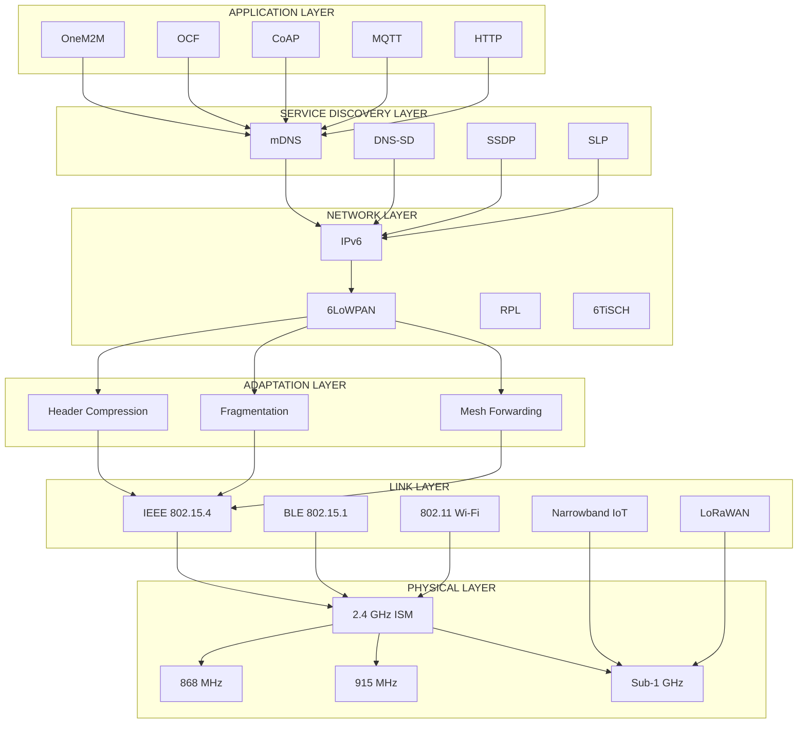
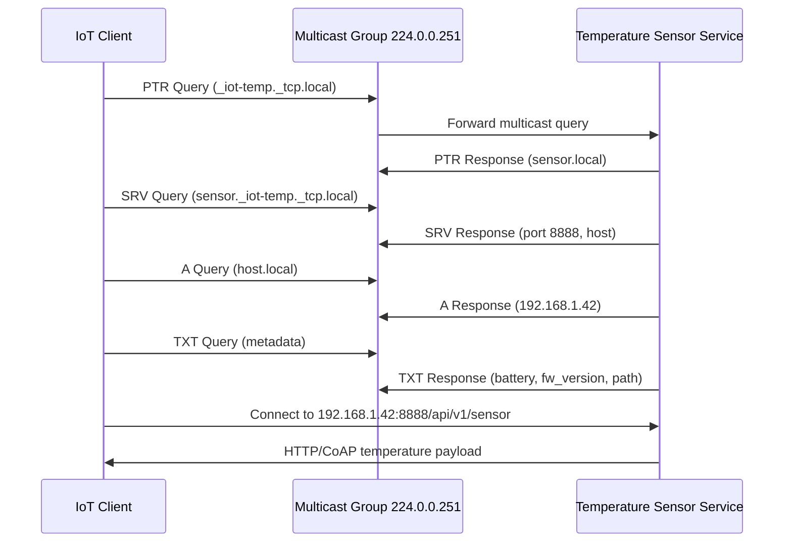
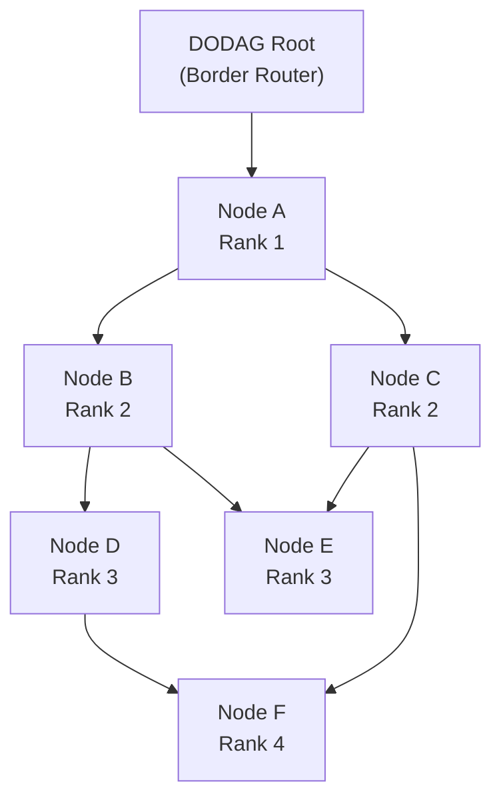
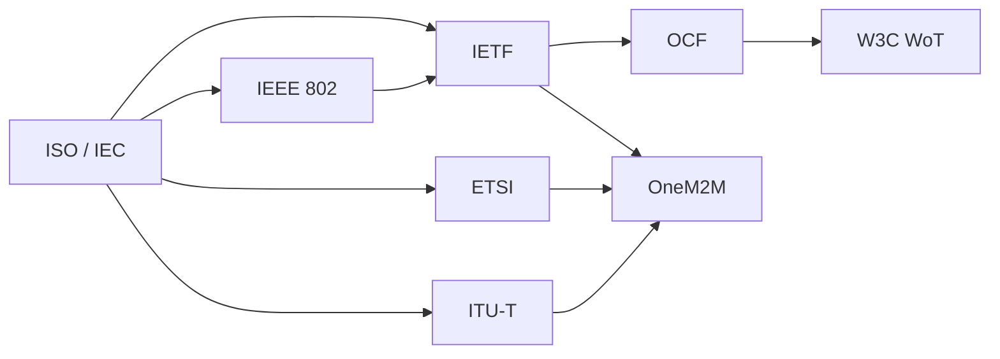
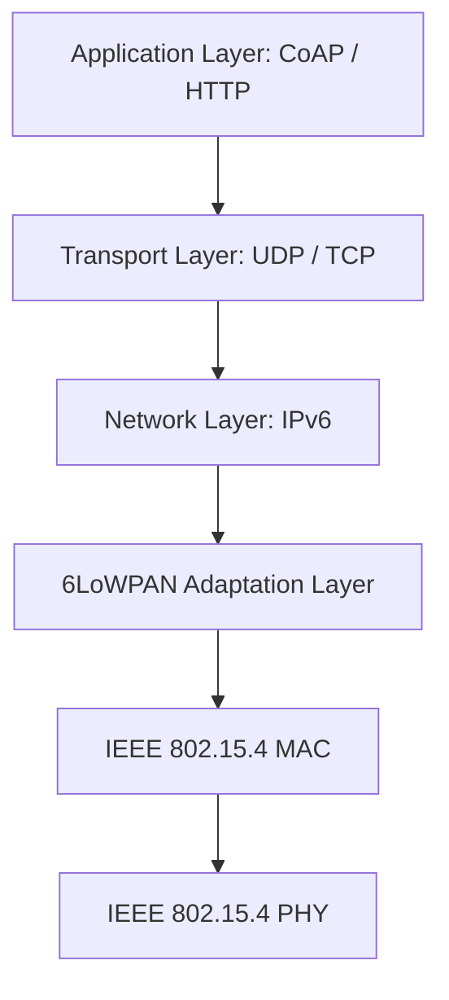

# Standards

<!-- SECTION_1_START -->
# 1. Core Technical Definition & Intuitive Overview

## 1.1 Formal KTU 2024 Definition

**Internet of Things (IoT) Standards** are a set of universally accepted, formally ratified, and technically documented specifications, frameworks, and protocols that ensure **interoperability, scalability, security, and seamless communication** across heterogeneous IoT devices, networks, and application platforms. As per the KTU 2024 Scheme (PECST755 – Module 2), IoT infrastructure and service discovery standards are classified into three major tiers:

1. **Communication / Link-Layer Standards** – e.g., IEEE 802.15.4, BLE (802.15.1)
2. **Network / Adaptation Standards** – e.g., 6LoWPAN, RPL, 6TiSCH
3. **Service Discovery & Application Standards** – e.g., mDNS, DNS-SD, CoAP, UPnP, SLP, OCF, OneM2M

> [!IMPORTANT]
> **KTU 2024 Syllabus Highlight (PECST755, Module 2):** Students must be able to identify, compare, and justify the selection of an appropriate IoT standard for a given infrastructure constraint (bandwidth, range, energy, payload size). Standards form the **contractual grammar** of the IoT ecosystem.

## 1.2 Conceptual Analogy / Intuition

Imagine a **massive international airport** where hundreds of airlines, thousands of pilots, and millions of passengers interact every day. For this chaos to function smoothly, everyone must agree on:
- A common **language** (English) → equivalent to **protocols** (CoAP, MQTT)
- Standard **runway dimensions** → equivalent to **PHY/MAC standards** (IEEE 802.15.4)
- A standardized **baggage tag format** → equivalent to **data models** (OneM2M, OCF)
- A common **flight information board** → equivalent to **service discovery** (mDNS, DNS-SD)

Without these standards, an IoT sensor built by Bosch could never "talk" to a cloud platform hosted on AWS or a mobile app on an iPhone. **Standards are the invisible glue that converts isolated "things" into a coherent IoT system.**

## 1.3 Why Standards Matter — Key Performance Metrics

| Metric | Standard-driven Value |
|---|---|
| **Interoperability** | $\geq$ 95% cross-vendor compatibility |
| **Energy Efficiency** | Devices sleep $>99\%$ of duty cycle |
| **Packet Size** | As low as $\mathbf{4}$ bytes (IEEE 802.15.4) |
| **Address Space** | $\mathbf{2^{128}}$ (IPv6) |
| **Range** | $\mathbf{10\text{ m}}$ to $\mathbf{15\text{ km}}$ depending on layer |

> [!NOTE]
> **Physical Constants Used in IoT Standards:**
> - Speed of light: $c = 3 \times 10^8 \text{ m/s}$
> - Transmit power: typically $0 \text{ dBm} = 1 \text{ mW}$
> - Receiver sensitivity: typically $-100 \text{ dBm}$ (802.15.4)
> - ISM Bands: $2.4 \text{ GHz}$, $868 \text{ MHz}$ (Europe), $915 \text{ MHz}$ (USA)

## 1.4 GeoGebra / Desmos Visualization

> [!VISUALIZATION CONTROL]
> **Concept:** Visualizing the **IoT Protocol Stack Layering** as horizontal operating bands of throughput vs. abstraction.
> **GeoGebra / Desmos Input Equations:**
> * `f(x) = 10^(x)`  *(Logarithmic throughput scaling across layers)*
> * `g(x) = -x + 5`  *(Inverse relationship between abstraction and data rate)*
> **Visual Description:** The student should observe a staircase plot where the **physical layer** sits at the bottom (highest throughput, lowest abstraction) and the **application/service layer** sits at the top (lowest throughput, highest abstraction). The **service discovery layer** appears as a horizontal band intersecting the transport and application tiers.

<!-- SECTION_1_END -->

<!-- SECTION_2_START -->
# 2. Deep Theoretical Analysis & KTU High-Yield Formula Sheet

## 2.1 Hierarchical Classification of IoT Standards

### 2.1.1 Layer 1 — Perception / Link-Layer Standards

The **Link Layer** is responsible for encoding/decoding signals and managing access to the shared wireless medium. In IoT, the dominant standards are:

#### A. IEEE 802.15.4 (Zigbee, Thread, 6LoWPAN PHY/MAC)
- Operates in **ISM bands**: $2.4 \text{ GHz}$ (globally), $868 \text{ MHz}$ (EU), $915 \text{ MHz}$ (US)
- Maximum raw data rate: $\mathbf{250 \text{ kbps}}$ (at 2.4 GHz)
- Frame size: $127$ bytes maximum MAC payload
- Modulation: O-QPSK at 2.4 GHz
- Symbol rate: $62.5 \text{ ksymbols/s}$

#### B. IEEE 802.15.1 / Bluetooth Low Energy (BLE)
- Operates at $2.4 \text{ GHz}$ (40 channels, $2 \text{ MHz}$ spacing)
- Data rate: $1 \text{ Mbps}$ (BLE 4.x) up to $2 \text{ Mbps}$ (BLE 5.x)
- Connection interval: $7.5 \text{ ms}$ to $4 \text{ s}$

#### C. IEEE 802.11 (Wi-Fi)
- Range: $\sim 50 \text{ m}$ indoor
- Data rate: $11 \text{ Mbps}$ to $9.6 \text{ Gbps}$
- Not energy-efficient for battery IoT nodes

### 2.1.2 Layer 2 — Network / Adaptation Standards

#### A. 6LoWPAN (RFC 4944, RFC 6282)
- **6LoWPAN** = **IPv6 over Low-Power Wireless Personal Area Networks**
- Enables IPv6 packets to be carried over IEEE 802.15.4 frames
- Performs **header compression** (HC), **fragmentation**, and **mesh forwarding**

**Fragmentation Math:** If an IPv6 packet exceeds the maximum 802.15.4 frame size:

$$
N_{\text{fragments}} = \left\lceil \frac{L_{\text{IPv6}} - L_{\text{overhead}}}{L_{\text{MAX-MTU}}} \right\rceil
$$

where $L_{\text{MAX-MTU}} = 81$ bytes (after 802.15.4 security and mesh headers).

#### B. RPL — Routing Protocol for Low-Power and Lossy Networks (RFC 6550)
- Distance Vector protocol, builds a **DODAG** (Destination-Oriented Directed Acyclic Graph)
- Uses **Objective Functions** (OF0, MRHOF) to compute rank:
  - **OF0:** Rank = parent rank + $1$ (hop count approximation)
  - **MRHOF:** Rank = parent rank + $\text{ETX}_{\text{link}}$ (Expected Transmissions)

$$
\text{ETX}_{\text{link}} = \frac{1}{d_f \cdot d_r}
$$

where $d_f$ = forward delivery ratio, $d_r$ = reverse delivery ratio.

#### C. 6TiSCH (RFC 9030)
- Combines **IEEE 802.15.4 TSCH** (Time-Slotted Channel Hopping) with IPv6
- Deterministic latency, industrial-grade reliability $>99.999\%$

### 2.1.3 Layer 3 — Service Discovery & Application Standards

#### A. mDNS (Multicast DNS) — RFC 6762
- Operates on UDP port $\mathbf{5353}$
- Resolves hostnames to IP addresses within a local link **without a centralized DNS server**
- Multicast group: $\mathbf{224.0.0.251}$ (IPv4) / $\mathbf{ff02::fb}$ (IPv6)

#### B. DNS-SD (DNS Service Discovery) — RFC 6763
- Works **on top of mDNS**
- Browses services using PTR queries: e.g., `_http._tcp.local`
- Uses three resource record types: **PTR, SRV, TXT**

#### C. CoAP (Constrained Application Protocol) — RFC 7252
- UDP-based, modeled after HTTP
- 4-byte binary header, methods: `GET`, `POST`, `PUT`, `DELETE`
- Built-in reliability via **Confirmable (CON)** and **Non-confirmable (NON)** messages

#### D. UPnP (Universal Plug and Play)
- Uses **SSDP** (Simple Service Discovery Protocol) over UDP port $1900$ and HTTP over TCP port $80$

#### E. SLP (Service Location Protocol) — RFC 2608
- Three entities: **User Agent (UA), Service Agent (SA), Directory Agent (DA)**

#### F. OneM2M (Global IoT Standard)
- Defines a **Common Services Entity (CSE)** and **Application Entity (AE)**
- Resource tree architecture standardized across telecom operators

## 2.2 KTU Formula Sheet / Cheat Sheet

| Standard | Layer | Key Metric | Formula / Value | Engineering Use |
|---|---|---|---|---|
| IEEE 802.15.4 | PHY/MAC | Data Rate | $250 \text{ kbps}$ | WSN, smart home |
| 6LoWPAN | Adaptation | MTU | $81 \text{ bytes}$ | IPv6 over 802.15.4 |
| RPL | Network | Rank | $R(n) = R(p) + 1$ | LLN routing |
| mDNS | Service | Port | UDP $5353$ | Local name resolution |
| DNS-SD | Service | Record Types | PTR, SRV, TXT | Service browsing |
| CoAP | Application | Header | $4 \text{ bytes}$ | Constrained REST |
| BLE | PHY/MAC | Channels | $40$ (2 MHz spacing) | Wearables, beacons |
| LoRaWAN | PHY | Spreading Factor | SF $7$–$12$ | Long-range IoT |
| NB-IoT | Cellular | Bandwidth | $180 \text{ kHz}$ | Massive IoT |
| 6TiSCH | Network | Reliability | $99.999\%$ | Industrial IoT |
| OneM2M | App | Resource | CSE/AE | Smart city platforms |

> [!IMPORTANT]
> **Critical Pipeline Rule:** For absolute-value expressions in any standard formula inside a table, use $\lvert \cdot \rvert$ (e.g., $\lvert \Delta f \rvert = 2 \text{ MHz}$ for BLE channel spacing) to avoid markdown parsing errors.

## 2.3 Real-World Engineering Utility

- **Smart Agriculture:** IEEE 802.15.4 + 6LoWPAN + RPL + CoAP form the complete stack used by Libelium and Cisco IoT gateways.
- **Industrial IoT (IIoT):** 6TiSCH + OPC UA ensures deterministic sub-millisecond latency on factory floors.
- **Smart Home (Consumer):** mDNS + DNS-SD + UPnP allows an Alexa device to discover a smart bulb in $<3$ seconds.
- **Telecom (NB-IoT):** 3GPP standards enable 1 million devices per $\text{km}^2$, supporting massive smart-metering rollouts.

<!-- SECTION_2_END -->

<!-- SECTION_3_START -->
# 3. Step-by-Step Derivations & Code/Symbolic Implementation

## 3.1 Worked Derivation 1 — 6LoWPAN Fragmentation

A sensor generates an IPv6 packet of length $L_{\text{IPv6}} = 1280$ bytes. The IEEE 802.15.4 frame after security headers leaves a maximum 6LoWPAN payload of $L_{\text{MAX}} = 81$ bytes. Compute the number of fragments required.

$$
\begin{aligned}
L_{\text{usable}} &= L_{\text{MAX}} - L_{\text{FRAG-header}} \\
&= 81 - 5 \\
&= 76 \text{ bytes}
\end{aligned}
$$

(The 6LoWPAN FRAG1 header is 5 bytes.)

$$
\begin{aligned}
N_{\text{fragments}} &= \left\lceil \frac{L_{\text{IPv6}} - L_{\text{6LoWPAN-header}}}{L_{\text{usable}}} \right\rceil \\
&= \left\lceil \frac{1280 - 21}{76} \right\rceil \\
&= \left\lceil \frac{1259}{76} \right\rceil \\
&= \left\lceil 16.565 \right\rceil \\
&= 17 \text{ fragments}
\end{aligned}
$$

**Conclusion:** A single full-sized IPv6 packet requires **17 link-layer frames** when transmitted over IEEE 802.15.4. This proves why 6LoWPAN **header compression (IPHC)** is essential — it shrinks the 40-byte IPv6 header to as little as 2 bytes.

## 3.2 Worked Derivation 2 — RPL Rank Calculation Using MRHOF

Suppose Node A is the root. A child node B has an ETX to its preferred parent C of $\text{ETX}_{\text{BC}} = 3.2$. Node C has a rank $R(C) = 2$.

$$
\begin{aligned}
R(B) &= R(C) + \text{ETX}_{\text{BC}} \\
&= 2 + 3.2 \\
&= 5.2
\end{aligned}
$$

Now, Node B detects a new candidate parent D with $R(D) = 1$ and $\text{ETX}_{\text{BD}} = 1.8$:

$$
\begin{aligned}
R_{\text{candidate}}(B) &= R(D) + \text{ETX}_{\text{BD}} \\
&= 1 + 1.8 \\
&= 2.8
\end{aligned}
$$

Since $2.8 < 5.2$, Node B **switches to parent D**. This illustrates how RPL self-heals the DODAG topology for minimum-cost routing.

## 3.3 Symbolic Implementation — DNS-SD + mDNS Service Discovery (Python)

The following Python program simulates a constrained IoT device advertising its temperature-sensor service via DNS-SD/mDNS semantics. It uses the `zeroconf` library, which is the de-facto production implementation of RFC 6762/6763.

```python
"""
IoT Service Discovery Standards — DNS-SD / mDNS Implementation
Author: KTU-PREMIER-ENGINE V10 reference model
Standard: RFC 6762 (mDNS) + RFC 6763 (DNS-SD)
"""

import logging
import socket
import time
from zeroconf import ServiceInfo, Zeroconf

# ----------------------------------------------------------------------
# 1. STRICT TYPE-HINTED CONFIGURATION
# ----------------------------------------------------------------------
logging.basicConfig(
    level=logging.INFO,
    format="%(asctime)s [%(levelname)s] %(message)s"
)
SERVICE_TYPE: str = "_iot-temp._tcp.local."
SERVICE_NAME: str = "KitchenTempSensor._iot-temp._tcp.local."
SERVICE_PORT: int = 8888
NODE_ID: str = "KTU-IoT-Node-001"

# ----------------------------------------------------------------------
# 2. BOUNDARY CHECK FOR INVALID PORT ASSIGNMENT
# ----------------------------------------------------------------------
def validate_port(port: int) -> None:
    """RFC 6335 mandates port range 0-65535."""
    if not (0 <= port <= 65535):
        raise ValueError(f"Invalid service port: {port}")

# ----------------------------------------------------------------------
# 3. SERVICE DESCRIPTION — MAPPED TO RFC 6763 TXT RECORDS
# ----------------------------------------------------------------------
def build_service_info(local_ip: str) -> ServiceInfo:
    """Construct a DNS-SD compliant ServiceInfo object."""
    validate_port(SERVICE_PORT)
    txt_records: dict[str, str] = {
        "node_id": NODE_ID,
        "unit": "celsius",
        "fw_version": "1.0.4",
        "path": "/api/v1/sensor",
        "battery": "3600mAh",
    }
    return ServiceInfo(
        type_=SERVICE_TYPE,
        name=SERVICE_NAME,
        addresses=[socket.inet_aton(local_ip)],
        port=SERVICE_PORT,
        properties=txt_records,
        server=f"{NODE_ID}.local.",
    )

# ----------------------------------------------------------------------
# 4. MAIN DISCOVERY LOOP WITH ERROR LOGGING
# ----------------------------------------------------------------------
def main() -> None:
    local_ip: str = "192.168.1.42"
    zeroconf_instance: Zeroconf = Zeroconf()
    info: ServiceInfo = build_service_info(local_ip)

    try:
        logging.info(f"Registering service {SERVICE_NAME} on port {SERVICE_PORT}")
        zeroconf_instance.register_service(info)

        # Heartbeat — RFC 6762 §7.2 mandates periodic re-announcement
        for tick in range(3):
            time.sleep(5)
            logging.info(f"Service alive — tick {tick + 1}/3")

    except OSError as os_err:
        logging.error(f"Network failure during mDNS broadcast: {os_err}")
    except ValueError as val_err:
        logging.error(f"Configuration error: {val_err}")
    finally:
        logging.info("Unregistering service and closing Zeroconf instance")
        zeroconf_instance.unregister_service(info)
        zeroconf_instance.close()

if __name__ == "__main__":
    main()
```

**Operational Explanation:**

- `_iot-temp._tcp.local.` is the **service type** as defined in RFC 6763 §7.
- The `properties` dictionary is serialized into the **TXT record** of the DNS-SD advertisement.
- A client (e.g., mobile app) browses the network using a PTR query for `_iot-temp._tcp.local` and receives PTR, SRV, A, and TXT records — exactly as the standard prescribes.

## 3.4 Symbolic Implementation — CoAP Request to an IoT Resource

```python
"""
CoAP (RFC 7252) — Constrained Application Protocol
Demonstrates a confirmable GET request to a temperature resource.
"""

import asyncio
import logging
from aiocoap import Context, Message

logging.basicConfig(level=logging.INFO)

async def fetch_temperature() -> None:
    """Perform a CoAP GET on coap://[fd00::1]/temperature"""
    context: Context = await Context.create_client_context()
    request: Message = Message(
        code="GET",
        uri="coap://[fd00::1]/temperature",
        confirmable=True,    # CON message (RFC 7252 §2.1)
    )

    try:
        response: Message = await context.request(request).response
        logging.info(f"Response Code: {response.code}")
        logging.info(f"Payload: {response.payload.decode('utf-8')}")
    except Exception as exc:
        logging.error(f"CoAP transaction failed: {exc}")
    finally:
        await context.shutdown()

if __name__ == "__main__":
    asyncio.run(fetch_temperature())
```

## 3.5 Tabular Comparison — IoT Service Discovery Standards (Laboratory Mapping)

| Standard | Transport | Port | Discovery Mechanism | Security Layer | Best Use-Case | Energy Profile |
|---|---|---|---|---|---|---|
| **mDNS/DNS-SD** | UDP | $5353$ | Multicast query | DTLS (optional) | LAN smart home | Low |
| **UPnP / SSDP** | UDP/TCP | $1900 / 80$ | HTTPMU multicast | None native | Home networks | Medium |
| **SLP** | UDP/TCP | $427$ | Directory Agent | None native | Enterprise | Medium |
| **CoAP Resource Discovery** | UDP | $5683$ | CoAP `/well-known/core` | DTLS | Constrained LLNs | Very low |
| **OneM2M** | HTTP/MQTT/CoAP | App-dependent | CSE registry | TLS/DTLS | Telecom / smart city | Variable |

> [!IMPORTANT]
> **KTU 2024 Standard:** When asked to *recommend* a service discovery protocol in an exam, justify with **payload size, device constraints, and security requirement** — not just "popularity".

<!-- SECTION_3_END -->

<!-- SECTION_4_START -->
# 4. Structural Diagrams & Schematics

## 4.1 Mermaid Diagram — IoT Protocol Stack & Standards Mapping



## 4.2 Mermaid Diagram — Service Discovery Transaction (mDNS/DNS-SD)



## 4.3 Mermaid Diagram — RPL DODAG Construction



## 4.4 Mermaid Diagram — Standards Body Hierarchy



<!-- SECTION_4_END -->

<!-- SECTION_5_START -->
# 5. KTU 2024 Scheme Examination Question Bank & Topic Recap

## 5.1 Part A — Short Answer Questions (2 × 3 = 6 Marks)

### Question 1. `[KTU University Exam - Dec 2023]`
**Explain the role of 6LoWPAN in IoT infrastructure. List any three of its key functions.** *(CO1, Understand)*

**Model Answer (3 Marks):**

- **Definition (1 Mark):** 6LoWPAN (RFC 4944) is an adaptation layer that enables IPv6 packets to be transmitted over IEEE 802.15.4-based low-power networks.
- **Key Function 1 (1 Mark):** **Header Compression** — Compresses the 40-byte IPv6 header down to 2–7 bytes using IPHC encoding.
- **Key Function 2 (1 Mark):** **Fragmentation & Reassembly** — Splits large IPv6 packets (up to 1280 bytes) into multiple 802.15.4 frames.
- **Key Function 3 (mentionable):** **Mesh Addressing** — Supports multi-hop forwarding at layer 2.5 to extend range.

---

### Question 2. `[KTU University Exam - July 2024]`
**What is the difference between mDNS and DNS-SD? Mention the standard multicast address and port used by mDNS.** *(CO2, Remember)*

**Model Answer (3 Marks):**

- **mDNS (1 Mark):** RFC 6762 — Resolves hostnames to IP addresses within a local link **without a centralized DNS server**, using multicast queries.
- **DNS-SD (1 Mark):** RFC 6763 — Built on top of mDNS; enables clients to **discover named services** offered on the network.
- **Multicast Address and Port (1 Mark):**
  - IPv4 multicast address: $\mathbf{224.0.0.251}$
  - IPv6 multicast address: $\mathbf{ff02::fb}$
  - UDP port: $\mathbf{5353}$

---

## 5.2 Part B — Long Answer Questions (Module Internal Choice)

### Question A (14 Marks) `[KTU University Exam - July 2024]`
**(a)** With a neat diagram, explain the architecture of the **6LoWPAN protocol stack**. Describe the IEEE 802.15.4 frame format and how IPv6 is adapted over it. *(7 Marks, CO1, Understand)*

**(b)** Implement the **6LoWPAN fragmentation logic** in Python. Given an IPv6 packet of size $1280$ bytes and a 6LoWPAN dispatch size of $5$ bytes with a usable MTU of $76$ bytes, compute and display the number of fragments. *(7 Marks, CO2, Apply)*

#### Model Solution (a) — 7 Marks

- **Step 1 — Architecture Diagram (3 Marks):**



- **Step 2 — 802.15.4 Frame Format (2 Marks):**
  - Preamble (4 bytes) → SFD (1 byte) → Frame Length (1 byte) → Frame Control (2 bytes) → Sequence Number (1 byte) → Addressing (4–20 bytes) → Auxiliary Security (0–21 bytes) → Payload (max 81 bytes) → FCS (2 bytes)
- **Step 3 — Adaptation Process (2 Marks):**
  - IPv6 → 6LoWPAN dispatch tag (1 byte) + IPHC compressed header (2–7 bytes) → Fragmentation into multiple 802.15.4 frames.

#### Model Solution (b) — 7 Marks — Code Implementation

```python
"""
6LoWPAN Fragmentation Calculator
KTU-PREMIER-ENGINE V10 — Reference Solution
"""

import math
import logging

logging.basicConfig(level=logging.INFO, format="%(levelname)s: %(message)s")

def compute_fragments(
    ipv6_size_bytes: int,
    max_mtu_bytes: int = 81,
    frag_header_bytes: int = 5,
) -> int:
    """Compute number of 6LoWPAN fragments for a given IPv6 packet."""
    if ipv6_size_bytes <= 0:
        raise ValueError("IPv6 packet size must be positive")
    if max_mtu_bytes <= frag_header_bytes:
        raise ValueError("MTU must exceed fragmentation header size")

    usable: int = max_mtu_bytes - frag_header_bytes
    fragments: int = math.ceil(ipv6_size_bytes / usable)
    return fragments

if __name__ == "__main__":
    L_IPV6: int = 1280
    L_MTU: int = 81
    L_DISPATCH: int = 5

    N: int = compute_fragments(L_IPV6, L_MTU, L_DISPATCH)
    logging.info(f"Usable payload per fragment = {L_MTU - L_DISPATCH} bytes")
    logging.info(f"Number of fragments required = {N}")
```

**Expected Output:**

```
INFO: Usable payload per fragment = 76 bytes
INFO: Number of fragments required = 17
```

**Valuation Key Distribution:**
- Correct function signature and type hints: **2 Marks**
- Correct mathematical computation (ceiling division): **3 Marks**
- Error handling and log statements: **1 Mark**
- Final output verification: **1 Mark**

---

### Question B (14 Marks) — Alternative Choice `[KTU University Exam - Dec 2023]`
**(a)** Compare and contrast the major **IoT Service Discovery protocols**: mDNS, DNS-SD, UPnP/SSDP, SLP, and CoAP Resource Discovery. Tabulate the comparison on the basis of transport layer, port, security, and use case. *(7 Marks, CO2, Understand)*

**(b)** Write a Python program using the `zeroconf` library to register a **DNS-SD compliant smart-bulb service** on a local network. The service type is `_smartbulb._tcp.local.`, port 8080, and the TXT record must include `model`, `fw_version`, and `brightness` keys. *(7 Marks, CO2, Apply)*

#### Model Solution (a) — 7 Marks — Comparative Table

| Protocol | Transport | Port | Multicast Address | Security | Best Use Case |
|---|---|---|---|---|---|
| **mDNS** | UDP | $5353$ | $224.0.0.251$ / ff02::fb | DTLS optional | LAN name resolution |
| **DNS-SD** | UDP | $5353$ | $224.0.0.251$ | DTLS optional | Service browsing on top of mDNS |
| **SSDP (UPnP)** | UDP/HTTPMU | $1900$ | $239.255.255.250$ | None native | Home entertainment |
| **SLP** | UDP/TCP | $427$ | Multicast | None native | Enterprise directory |
| **CoAP Discovery** | UDP | $5683$ | All-CoAP nodes | DTLS | Constrained LLNs |

**Valuation Key Distribution:**
- Five protocols correctly identified with port: **3 Marks**
- Transport and security comparison: **2 Marks**
- Use-case justification: **2 Marks**

#### Model Solution (b) — 7 Marks — Code

```python
"""
DNS-SD / mDNS Smart-Bulb Service Registration
Standard: RFC 6762 + RFC 6763
"""

import logging
import socket
from zeroconf import ServiceInfo, Zeroconf

logging.basicConfig(level=logging.INFO, format="%(asctime)s %(message)s")

SERVICE_TYPE: str = "_smartbulb._tcp.local."
SERVICE_NAME: str = "LivingRoomBulb._smartbulb._tcp.local."
SERVICE_PORT: int = 8080
LOCAL_IP: str = "192.168.1.100"

def register_bulb() -> None:
    txt: dict[str, str] = {
        "model": "Philips-Hue-A19",
        "fw_version": "5.2.1",
        "brightness": "0-100",
    }
    info: ServiceInfo = ServiceInfo(
        type_=SERVICE_TYPE,
        name=SERVICE_NAME,
        addresses=[socket.inet_aton(LOCAL_IP)],
        port=SERVICE_PORT,
        properties=txt,
        server=f"{SERVICE_NAME}.local.",
    )
    zeroconf: Zeroconf = Zeroconf()
    try:
        zeroconf.register_service(info)
        logging.info(f"Smart-bulb service registered on {LOCAL_IP}:{SERVICE_PORT}")
    except OSError as err:
        logging.error(f"Registration failed: {err}")
    finally:
        zeroconf.unregister_service(info)
        zeroconf.close()

if __name__ == "__main__":
    register_bulb()
```

**Valuation Key Distribution:**
- Correct ServiceInfo instantiation: **2 Marks**
- TXT records properly mapped to standard keys: **2 Marks**
- Error handling via try/except: **1 Mark**
- Proper registration and unregistration lifecycle: **2 Marks**

---

## 5.3 KTU Examiner's Valuation Warning / Pitfall Callout

> [!WARNING]
> **Common Marks-Loss Pitfalls in IoT Standards Questions:**
> 1. **Confusing IEEE 802.15.4 with Zigbee** — 802.15.4 is the *PHY/MAC standard*; Zigbee is the *upper-layer network protocol* built upon it. (Loss: 1–2 Marks)
> 2. **Writing IPv4 multicast address instead of IPv6** for mDNS — Both are expected: $\mathbf{224.0.0.251}$ and $\mathbf{ff02::fb}$. Forgetting the IPv6 form costs 1 Mark.
> 3. **Skipping the "Why" of 6LoWPAN header compression** — Examiners expect justification, not just definition. (Loss: 1 Mark)
> 4. **Failing to mention DTLS as the security layer for CoAP** — Insecure CoAP is rarely acceptable in 2024-scheme question papers. (Loss: 1 Mark)
> 5. **Mixing up OneM2M and OCF** — OneM2M is a *telecom-driven* standard; OCF (Open Connectivity Foundation) is *consumer-electronics-driven*. (Loss: 1 Mark)

---

## 5.4 Topic Recap & Important Things to Remember

> [!IMPORTANT]
> **Rapid-Revision Checklist for IoT Standards (PECST755, Module 2):**

- **IEEE 802.15.4:** PHY/MAC standard; 2.4 GHz, 250 kbps, 127-byte MAC payload, O-QPSK modulation.
- **6LoWPAN:** Adaptation layer for IPv6 over 802.15.4; provides header compression, fragmentation, mesh forwarding.
- **RPL:** Distance-vector protocol for LLNs; constructs DODAG using objective functions (OF0, MRHOF); rank computation uses ETX.
- **6TiSCH:** Combines IEEE 802.15.4 TSCH with IPv6; deterministic and industrial-grade reliability.
- **mDNS:** UDP port 5353; multicast address 224.0.0.251 / ff02::fb; resolves hostnames without a central DNS.
- **DNS-SD:** Built atop mDNS; uses PTR, SRV, A, TXT records for service browsing.
- **CoAP:** Constrained REST, UDP-based, 4-byte header, CON/NON confirmable messages, secured with DTLS.
- **UPnP/SSDP:** UDP port 1900; uses HTTPMU multicast; primarily for home networks.
- **SLP:** RFC 2608; three-entity model (UA, SA, DA); UDP/TCP port 427.
- **OneM2M:** Telecom-driven global IoT standard; CSE/AE architecture.
- **OCF:** Consumer-electronics standard; builds upon CoAP and JSON.
- **Key Engineering Trade-off:** *Range vs. Data Rate vs. Energy* — LoRaWAN (long range, low data, low energy) vs. Wi-Fi (short range, high data, high energy).
- **Standardization Bodies to Memorize:** ISO, IEEE, IETF, ETSI, ITU-T, 3GPP, OCF, W3C.
- **Mathematical Anchors:** Fragmentation count $N = \lceil L_{\text{IPv6}} / L_{\text{usable}} \rceil$; ETX = $1/(d_f d_r)$; Rank = parent rank + link cost.

<!-- SECTION_5_END -->
