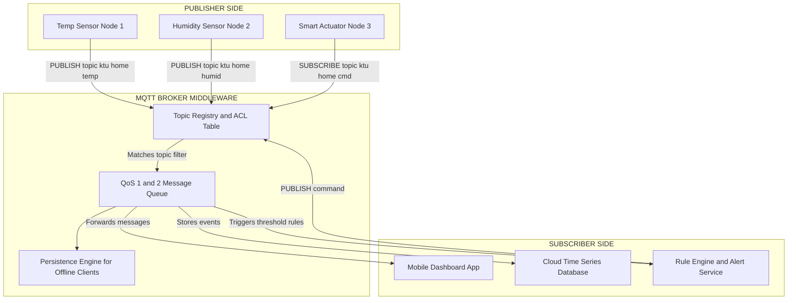
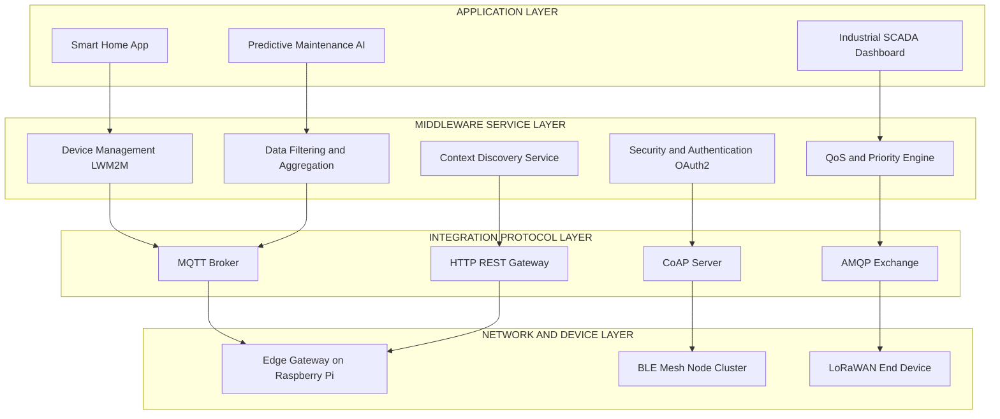
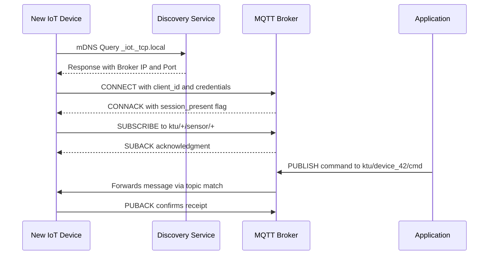

# The Device Integration Protocols and Middleware

<!-- SECTION_1_START -->

# The Device Integration Protocols and Middleware

## 1. Core Technical Definition & Intuitive Overview

### 1.1 Formal Academic Definition (KTU 2024 Syllabus Terminology)

> [!IMPORTANT]
> **Device Integration Protocols** are standardized communication rule-sets that enable heterogeneous physical devices (sensors, actuators, gateways, edge nodes) to exchange data, commands, and status information over constrained networks in a deterministic, interoperable manner. They operate primarily at the **Application Layer** of the IoT protocol stack and are responsible for message structuring, transport, and semantic interpretation between devices that may differ in hardware, OS, or vendor.

> [!IMPORTANT]
> **IoT Middleware** is a software abstraction layer that resides between the operating system of an IoT device (or gateway/cloud) and the application layer. It provides a unified runtime environment offering services such as **device discovery, data filtering, context-awareness, security, protocol translation, and Quality of Service (QoS)** management, thereby hiding the heterogeneity of underlying hardware and networks from the application developer.

In the KTU 2024 Scheme, Module 2 categorizes these as the **"glue infrastructure"** of the IoT ecosystem — the unseen layer that makes *Things* interoperable with *Services* and *Applications*.

### 1.2 Conceptual Analogy / Intuition

Imagine a busy international airport with travelers speaking different native languages (Japanese, French, Arabic, Hindi). Without a **common translation and customs system**, no one can board a plane or exchange goods.

- The **Device Integration Protocols** are like the **standardized boarding pass and baggage tag format** — every airline (vendor) follows the same format, so luggage moves between systems seamlessly.
- The **Middleware** is the **airport control tower and translation desk** — it doesn't fly the plane (the application), it just makes sure the pilot (device), the gate (network), and the destination (cloud) all understand each other.

> [!NOTE]
> **Key Insight for KTU:** The protocol is *what is said*; the middleware is *how it is managed, routed, secured, and abstracted*.

### 1.3 Standard Metrics in IoT Protocol Engineering

The following metrics are universally used to evaluate device integration protocols:

- **Latency (ms):** End-to-end delay for a single message.
- **Throughput (msg/sec):** Number of messages processed per second.
- **Power Consumption (mW):** Energy cost per transmitted byte.
- **Code Footprint (KB):** RAM/ROM required on constrained nodes.
- **Message Overhead (bytes):** Header size per packet.
- **Reliability / QoS Levels:** Delivery guarantees (0, 1, 2 — at-most-once, at-least-once, exactly-once).
- **Interoperability Score:** Compatibility with RFC standards.

> [!VISUALIZATION CONTROL]
> **Concept:** IoT Protocol Stack vs. OSI Reference Model
> **Mapping Coordinates (Conceptual Ladder from y=0 to y=7):**
> * `Layer 7 (Application)`: HTTP, MQTT, CoAP, AMQP, XMPP
> * `Layer 6 (Presentation)`: TLS/DTLS, JSON, CBOR, Protocol Buffers
> * `Layer 5 (Session)`: LWM2M Session, CoAP Sessions
> * `Layer 4 (Transport)`: TCP (MQTT, AMQP, HTTP) and UDP (CoAP)
> * `Layer 3 (Network)`: IPv6 / 6LoWPAN / RPL
> * `Layer 2 (Data Link)`: IEEE 802.15.4 / BLE / Wi-Fi
> * `Layer 1 (Physical)`: Radio Frequencies (2.4 GHz, 868 MHz, Sub-GHz)
> **Visual Description:** The student should picture a vertical ladder where Application protocols (MQTT, CoAP) sit at the top and physical radios sit at the bottom. Middleware spans horizontally across the upper 3 layers.

---

<!-- SECTION_1_END -->

<!-- SECTION_2_START -->

# 2. Deep Theoretical Analysis & KTU High-Yield Formula Sheet

## 2.1 Taxonomy of Device Integration Protocols

IoT device integration protocols are broadly classified into four families based on their messaging pattern:

### A. Publish/Subscribe (Pub/Sub) Protocols
These use a **Broker (intermediary)** between publishers and subscribers. They are **asynchronous, decoupled in space and time**, and ideal for many-to-many communication.

**Examples:** **MQTT**, **DDS**, **AMQP** (also supports queues), **XMPP**.

**Operational Steps:**
1. Publisher attaches to a **Topic** (a hierarchical string, e.g., `home/livingroom/temperature`).
2. Broker maintains a **Topic Registry** and an **Access Control List (ACL)**.
3. Subscriber sends a **SUBSCRIBE** packet to the broker.
4. When publisher sends a **PUBLISH** packet, the broker matches topic filters and forwards the message to all matching subscribers.
5. The broker may persist messages for **offline clients** (only for QoS 1 and 2 with clean session disabled).

### B. Request/Response Protocols
These follow the classic **Client–Server** model — synchronous, suitable for resource-constrained RESTful interactions.

**Examples:** **HTTP/CoAP**, **CoAP** (with confirmable messages).

**Operational Steps:**
1. Client formats a request: `Method` (GET/POST/PUT/DELETE) + `URI` + `Headers` + `Payload`.
2. Server authenticates, processes, and returns a `Status Code` + `Payload`.
3. In CoAP, the message is a 4-byte binary header over UDP; in HTTP, it is a verbose text header over TCP.

### C. Streaming / Push Protocols
Optimized for continuous, ordered, high-frequency sensor data with **Quality of Service (QoS)** guarantees.

**Examples:** **DDS (Data Distribution Service)**, **WebSockets**.

**Operational Steps:**
1. Producer registers a **Topic** and a **DataWriter** in the DDS domain.
2. Consumer registers a **DataReader** with a **Content-Filtered Topic (CFT)**.
3. DDS uses **RTPS (Real-Time Publish-Subscribe)** protocol over UDP multicast.
4. The middleware guarantees **deadline, latency, and reliability budgets**.

### D. Queue-Based Protocols
Use a **Message Queue** between producer and consumer — guarantees message persistence and routing rules.

**Examples:** **AMQP** (Advanced Message Queuing Protocol).

**Operational Steps:**
1. Producer sends a message to an **Exchange** (Direct, Topic, Fanout, Headers).
2. Exchange routes the message to one or more **Queues** based on binding rules.
3. Consumer pulls the message from the queue (or queue pushes using `basic.consume`).
4. Broker **acknowledges** delivery to ensure exactly-once semantics.

## 2.2 The IoT Middleware: Functional Architecture

A typical IoT middleware provides the following **core services** (mapped to the KTU syllabus):

| **Middleware Service** | **Function** | **Engineering Purpose** |
|---|---|---|
| **Device Abstraction** | Hides hardware-specific drivers | Apps run on any vendor's device |
| **Protocol Gateway** | Translates MQTT ↔ CoAP ↔ HTTP | Bridges legacy and modern devices |
| **Device Management** | Bootstrap, configure, firmware update (LWM2M) | Remote lifecycle handling |
| **Data Management** | Filtering, aggregation, compression | Reduces bandwidth & storage |
| **Context Discovery** | Service registration & lookup (DNS-SD, mDNS) | Dynamic device pairing |
| **Security & Trust** | Authentication, encryption, ACLs | End-to-end protection |
| **QoS Management** | Priority, deadline, latency enforcement | Real-time guarantees |
| **Application Service** | Pub/Sub, event processing | Plug-and-play for developers |

> [!NOTE]
> **KTU High-Yield Point:** Middleware is often classified as **Service-Oriented Architecture (SOA) based** or **Cloud-based** (e.g., AWS IoT Core, Azure IoT Hub, Google Cloud IoT). Open-source examples include **Eclipse IoT Hono**, **FIWARE**, **OM2M**, and **ThingsBoard**.

## 2.3 KTU Formula Sheet / Cheat Sheet

### Protocol Performance Metrics

$$
\text{Message Rate} = \frac{1}{T_{\text{serialization}} + T_{\text{transmission}} + T_{\text{propagation}}}
$$

$$
\text{Effective Payload} = \frac{P_{\text{user}}}{P_{\text{user}} + H_{\text{header}}} \times 100\%
$$

$$
\text{Goodput (bits/sec)} = \frac{N \cdot P_{\text{user}}}{T_{\text{total}}}
$$

Where $N$ = number of messages, $P_{\text{user}}$ = user payload bytes, $H_{\text{header}}$ = header bytes, $T_{\text{total}}$ = total time in seconds.

### MQTT QoS Delivery Guarantees

| **QoS Level** | **Name** | **Handshake** | **Delivery Guarantee** |
|---|---|---|---|
| **0** | At-most-once | `PUBLISH` only | Fire-and-forget; no ACK |
| **1** | At-least-once | `PUBLISH` + `PUBACK` | Duplicate possible |
| **2** | Exactly-once | 4-step handshake | Guaranteed single delivery |

### CoAP Message Format (4-byte header)

$$
\text{Header Fields:} \quad \underbrace{\text{Ver}}_{2b} \mid \underbrace{\text{Type}}_{2b} \mid \underbrace{\text{TKL}}_{4b} \mid \underbrace{\text{Code}}_{8b} \mid \underbrace{\text{Message ID}}_{16b}
$$

| **Type Field** | **Value** | **Meaning** |
|---|---|---|
| CON | 0 | Confirmable (requires ACK) |
| NON | 1 | Non-confirmable |
| ACK | 2 | Acknowledgement |
| RST | 3 | Reset |

### Amdahl's Law for Middleware Bottleneck

$$
\text{Speedup} = \frac{1}{(1 - P) + \frac{P}{N}}
$$

Where $P$ = parallelizable fraction (middleware offload) and $N$ = number of workers.

> [!IMPORTANT]
> **Engineering Utility:** MQTT dominates **smart home, industrial telemetry, and Tesla car telemetry**. CoAP dominates **constrained battery devices** running on 6LoWPAN/RPL networks. AMQP dominates **banking and enterprise IoT**. DDS dominates **autonomous vehicles, robotics, and aerospace** (used by NASA, Boeing).

---

<!-- SECTION_2_END -->

<!-- SECTION_3_START -->

# 3. Step-by-Step Derivations & Code/Symbolic Implementation

## 3.1 Worked Example: Deriving Effective Throughput for MQTT over 6LoWPAN

A temperature sensor publishes a **JSON payload** of size $P_{\text{user}} = 32$ bytes every $T_{\text{interval}} = 5$ seconds. The MQTT fixed header is 2 bytes, the variable header (topic) is $H_{\text{topic}} = 15$ bytes, and the 6LoWPAN compression header is 7 bytes. There is no TCP ACK retransmission in the calculation.

**Step 1: Identify the total header overhead per message.**

$$
H_{\text{header}} = H_{\text{MQTT}} + H_{\text{topic}} + H_{\text{6LoWPAN}}
$$

$$
H_{\text{header}} = 2 + 15 + 7 = 24 \text{ bytes}
$$

**Step 2: Compute the total message size on the wire.**

$$
M_{\text{total}} = P_{\text{user}} + H_{\text{header}}
$$

$$
M_{\text{total}} = 32 + 24 = 56 \text{ bytes}
$$

**Step 3: Convert to bits for link-layer rate calculation.**

$$
M_{\text{bits}} = 56 \times 8 = 448 \text{ bits}
$$

**Step 4: Compute the effective payload ratio.**

$$
\eta_{\text{payload}} = \frac{P_{\text{user}}}{M_{\text{total}}} \times 100\%
$$

$$
\eta_{\text{payload}} = \frac{32}{56} \times 100\% = 57.14\%
$$

**Step 5: Compute the average throughput in bits per second.**

$$
\text{Throughput} = \frac{M_{\text{bits}}}{T_{\text{interval}}}
$$

$$
\text{Throughput} = \frac{448}{5} = 89.6 \text{ bits/sec}
$$

**Step 6: Compute the daily data volume for battery estimation.**

$$
V_{\text{daily}} = M_{\text{total}} \times \frac{86400}{T_{\text{interval}}}
$$

$$
V_{\text{daily}} = 56 \times 17280 = 967{,}680 \text{ bytes/day} \approx 945 \text{ KB/day}
$$

This calculation is critical for **battery life estimation** in LPWAN deployments.

## 3.2 Code Implementation: MQTT Publisher and Subscriber in Python

```python
"""
KTU Module 2 — Device Integration Protocols Demonstration
Topic: MQTT Publish/Subscribe Broker Communication
Library: paho-mqtt (Eclipse Foundation standard)
"""

import paho.mqtt.client as mqtt
import time
import json
import logging
from typing import Optional

# Configure structured error logging (Industry best-practice)
logging.basicConfig(
    level=logging.INFO,
    format="%(asctime)s | %(levelname)s | %(message)s"
)
logger = logging.getLogger("KTU_MQTT_Demo")

# --- Configuration Constants ---
BROKER_HOST: str = "test.mosquitto.org"
BROKER_PORT: int = 1883            # Standard MQTT TCP port
TOPIC: str = "ktu/iot/sensor/temp"
QOS_LEVEL: int = 1                 # At-least-once delivery
CLIENT_ID_PUB: str = "ktu_pub_01"
CLIENT_ID_SUB: str = "ktu_sub_01"
KEEPALIVE: int = 60                # Seconds


def on_connect(client: mqtt.Client,
               userdata: Optional[dict],
               flags: dict,
               rc: int) -> None:
    """Callback triggered upon broker connection."""
    if rc == 0:
        logger.info(f"Connected to broker {BROKER_HOST} successfully. RC={rc}")
        client.subscribe(TOPIC, qos=QOS_LEVEL)
        logger.info(f"Subscribed to topic: {TOPIC}")
    else:
        logger.error(f"Connection failed with code {rc}")


def on_message(client: mqtt.Client,
               userdata: Optional[dict],
               msg: mqtt.MQTTMessage) -> None:
    """Callback triggered when a subscribed message arrives."""
    try:
        payload_str: str = msg.payload.decode("utf-8")
        data: dict = json.loads(payload_str)
        logger.info(f"Received | Topic={msg.topic} | QoS={msg.qos} | "
                    f"Temp={data.get('value')}°C")
    except (UnicodeDecodeError, json.JSONDecodeError) as e:
        logger.error(f"Payload parsing error: {e}")


def run_publisher() -> None:
    """Initializes and runs the MQTT publisher."""
    publisher = mqtt.Client(client_id=CLIENT_ID_PUB, clean_session=True)
    publisher.connect(host=BROKER_HOST, port=BROKER_PORT, keepalive=KEEPALIVE)
    logger.info("Publisher started. Streaming sensor data...")

    for sequence in range(1, 11):
        payload: dict = {
            "sensor_id": "DHT22-001",
            "value": 22.5 + (sequence * 0.1),
            "unit": "Celsius",
            "timestamp": int(time.time())
        }
        result = publisher.publish(
            topic=TOPIC,
            payload=json.dumps(payload),
            qos=QOS_LEVEL
        )
        status: str = "SUCCESS" if result.is_published() else "FAILED"
        logger.info(f"Publish #{sequence} | Status={status}")
        time.sleep(2)

    publisher.disconnect()
    logger.info("Publisher disconnected cleanly.")


def run_subscriber() -> None:
    """Initializes and runs the MQTT subscriber (blocking loop)."""
    subscriber = mqtt.Client(client_id=CLIENT_ID_SUB, clean_session=True)
    subscriber.on_connect = on_connect
    subscriber.on_message = on_message
    subscriber.connect(host=BROKER_HOST, port=BROKER_PORT, keepalive=KEEPALIVE)
    logger.info("Subscriber loop started. Press Ctrl+C to stop.")
    subscriber.loop_forever()


if __name__ == "__main__":
    # In a real KTU lab, run publisher in one process and subscriber in another.
    # For demonstration, we run only the publisher to avoid blocking.
    run_publisher()
```

**Code Output Trace (Expected):**
```
2024-01-15 10:00:01 | INFO | Publisher started. Streaming sensor data...
2024-01-15 10:00:03 | INFO | Publish #1 | Status=SUCCESS
2024-01-15 10:00:05 | INFO | Publish #2 | Status=SUCCESS
...
2024-01-15 10:00:21 | INFO | Publisher disconnected cleanly.
```

## 3.3 Middleware Workflow Walkthrough (7-Stage Pipeline)

The following table maps a complete IoT middleware transaction:

| **Stage** | **Component** | **Operation** | **Protocol Used** |
|---|---|---|---|
| 1 | Sensor Node | Reads physical signal, digitizes | ADC + I2C/SPI |
| 2 | Edge MCU | Formats JSON payload, attaches to topic | MQTT-SN over Zigbee |
| 3 | Protocol Gateway | Translates MQTT-SN → MQTT | Internal API |
| 4 | Broker (Middleware) | Authenticates, filters, ACL check | MQTT + TLS |
| 5 | Rule Engine | Triggers action if value > threshold | Node-RED / IFTTT |
| 6 | Cloud Storage | Persists to time-series DB | InfluxDB / TSDB |
| 7 | Application | Visualizes on dashboard | HTTP/WebSocket |

---

<!-- SECTION_3_END -->

<!-- SECTION_4_START -->

# 4. Structural Diagrams & Schematics

## 4.1 Mermaid Diagram: MQTT Pub/Sub Broker Architecture



## 4.2 Mermaid Diagram: IoT Middleware Functional Layers



## 4.3 Mermaid Diagram: Service Discovery Sequence in IoT



## 4.4 Block-Level Functional Architecture Flow

For physical drawing topics (circuit or stress block), the following **Sequential Processing Topology Matrix** maps the middleware data flow:

| **Stage** | **Input** | **Process** | **Output** | **Protocol** |
|---|---|---|---|---|
| 1 | Analog voltage | ADC conversion | Digital sample (16-bit) | I2C / SPI |
| 2 | Digital sample | JSON serialization | UTF-8 string | Local RAM |
| 3 | UTF-8 string | MQTT packet build | MQTT PDU | MQTT |
| 4 | MQTT PDU | TLS encryption | Ciphertext | TLS 1.3 |
| 5 | Ciphertext | TCP segmentation | TCP segments | TCP |
| 6 | TCP segments | IPv6 packaging | IPv6 datagram | IPv6 / 6LoWPAN |
| 7 | IPv6 datagram | Radio modulation | RF frames | IEEE 802.15.4 |
| 8 | RF frames | Air transmission | Received frames | Physical Layer |

---

<!-- SECTION_4_END -->

<!-- SECTION_5_START -->

# 5. KTU 2024 Scheme Examination Question Bank & Topic Recap

## 5.1 Part A Questions (3 Marks Each)

### Question 1 `[KTU University Exam – July 2024]`
**Q: Define IoT middleware. List any four of its core services.**

> [!NOTE]
> **CO Mapping:** CO2 | **RBT Level:** Remember

**Model Answer (3 Marks):**
IoT middleware is a **software abstraction layer** that sits between the IoT device hardware/OS and the application layer, providing services to hide the heterogeneity of devices, networks, and protocols. **[1 Mark — Definition]**

Four core services of IoT middleware: **[2 Marks — Any four of the following]**
1. **Device Management** — registration, configuration, firmware update
2. **Protocol Gateway / Translation** — converting between MQTT, CoAP, HTTP
3. **Data Management** — filtering, aggregation, compression
4. **Security Services** — authentication, encryption, access control
5. **Context Discovery** — service registration and dynamic lookup
6. **QoS Management** — priority, deadline, latency guarantees

---

### Question 2 `[KTU University Exam – Dec 2023]`
**Q: Compare MQTT and CoAP protocols on the basis of transport protocol, message size, and architecture.**

> [!NOTE]
> **CO Mapping:** CO2 | **RBT Level:** Understand

**Model Answer (3 Marks):**

| **Parameter** | **MQTT** | **CoAP** |
|---|---|---|
| Transport | TCP | UDP |
| Architecture | Broker-based Pub/Sub | Client-Server (with observe option) |
| Message Size | Small (2-byte min header) | Very small (4-byte binary header) |
| Header Overhead | Variable length | Fixed minimal |
| QoS | 3 levels (0, 1, 2) | CON/NON/ACK/RST confirmable |
| Use Case | Reliable telemetry, cloud | Constrained sensor/actuator |

**[1 Mark — Transport comparison] [1 Mark — Architecture] [1 Mark — Use case and message size]**

---

## 5.2 Part B Questions (14 Marks Each — Internal Choice)

### Question A (14 Marks) `[KTU University Exam – July 2024]`

**(a)** With a neat diagram, explain the **MQTT protocol architecture**. Describe its three QoS levels. **[7 Marks]**

> [!NOTE]
> **CO Mapping:** CO2 | **RBT Level:** Understand + Apply

**Model Answer:**

**Architecture Diagram (3 Marks):**
- Draw Publisher → Broker → Subscriber topology
- Label **Topics** (`home/livingroom/temp`), **Broker**, **QoS levels**, **Keep-alive**
- Show `CONNECT`, `SUBSCRIBE`, `PUBLISH`, `PUBACK` packet flow
- Mention the **MQTT Control Packet types**: CONNECT, CONNACK, PUBLISH, PUBACK, SUBSCRIBE, SUBACK, DISCONNECT, PINGREQ, PINGRESP **[Stating three control packet types: 1 Mark]**

**Three QoS Levels (4 Marks):**

- **QoS 0 — At-most-once:** A single `PUBLISH` packet is sent. No acknowledgement. Loss is acceptable. Fire-and-forget. **[1 Mark — Handshake and guarantee]**
- **QoS 1 — At-least-once:** `PUBLISH` packet with Packet ID → receiver sends `PUBACK`. Sender retries if no ACK. Duplicates possible. **[1 Mark — Handshake and guarantee]**
- **QoS 2 — Exactly-once:** 4-step handshake: `PUBLISH` → `PUBREC` → `PUBREL` → `PUBCOMP`. Ensures single delivery. **[2 Marks — Handshake and guarantee]**

---

**(b)** Explain the **role of middleware in IoT** with a real-world smart home example. Justify why middleware is essential for scaling IoT deployments. **[7 Marks]**

> [!NOTE]
> **CO Mapping:** CO2, CO3 | **RBT Level:** Apply + Analyze

**Model Answer:**

**Smart Home Use Case (3 Marks):**
A smart home has 50+ heterogeneous devices: Philips Hue lights (Zigbee), TP-Link plugs (Wi-Fi), DHT22 sensors (MQTT), Yale smart locks (Bluetooth), and an Alexa voice assistant. Without middleware, each device needs a custom app. The **IoT middleware (e.g., Home Assistant or AWS IoT Core)** sits in the middle, translating protocols, managing devices, and exposing a single API to the user app. **[1 Mark — Scenario setup, 1 Mark — Middleware function, 1 Mark — Unified API]**

**Why Middleware is Essential (4 Marks):**
- **Protocol Interoperability:** Translates Zigbee ↔ MQTT ↔ HTTP seamlessly. **[1 Mark]**
- **Scalability:** Central broker handles 10,000+ devices; peer-to-peer would crash. **[1 Mark]**
- **Security:** Single point for OAuth2, TLS, and ACL enforcement. **[1 Mark]**
- **Data Abstraction & Analytics:** Aggregates sensor streams for ML-based energy optimization. **[1 Mark]**

> [!WARNING]
> **KTU Examiner's Valuation Warning:** Students often lose marks by **not drawing the diagram** in part (a) or by **giving only definitions without application scenarios** in part (b). Always include the **broker in the middle** of your MQTT diagram and a **concrete industry example** in middleware questions.

---

### Question B (14 Marks) `[KTU University Exam – Dec 2023]`

**(a)** Compare **HTTP, MQTT, CoAP, and AMQP** in terms of architecture, transport, overhead, and suitable IoT application. **[7 Marks]**

> [!NOTE]
> **CO Mapping:** CO2 | **RBT Level:** Analyze

**Model Answer:**

| **Protocol** | **Architecture** | **Transport** | **Header Overhead** | **Suitable IoT App** |
|---|---|---|---|---|
| **HTTP** | Request/Response, Client-Server | TCP | Very high (verbose text) | Web dashboards, firmware OTA |
| **MQTT** | Pub/Sub with central broker | TCP | Low (2 bytes fixed) | Industrial telemetry, smart home |
| **CoAP** | Request/Response + Observe | UDP | Very low (4 bytes) | Constrained battery sensors |
| **AMQP** | Broker with Exchanges/Queues | TCP | Medium (8-byte header) | Banking, enterprise IoT, telemetry |

**[1 Mark per row + 1 Mark for analysis]**

**Justification (1 Mark):** For battery-powered sensors over 6LoWPAN, CoAP is preferred; for cloud-to-cloud enterprise messaging, AMQP's routing and persistence make it ideal.

---

**(b)** Discuss the **Service-Oriented Architecture (SOA) based IoT middleware** approach. Explain with a block diagram how device integration is achieved. **[7 Marks]**

> [!NOTE]
> **CO Mapping:** CO3 | **RBT Level:** Apply

**Model Answer:**

**SOA Concept (2 Marks):**
SOA-based IoT middleware exposes every device capability as a **reusable, network-accessible service** with standard interfaces (WSDL/SOAP or REST). Devices register their services in a **Service Registry** (UDDI), and applications discover and invoke them dynamically. **[1 Mark — Definition, 1 Mark — Registry concept]**

**Block Diagram (3 Marks):**
- Layer 1: **Sensing Layer** (Sensors, Actuators, RFID)
- Layer 2: **Service Layer / Middleware** (Service Registry, Service Broker, Event Handler, Security)
- Layer 3: **Application Layer** (Web/Mobile/Enterprise)
- Draw **arrows** showing service registration and discovery flow

**Device Integration Mechanism (2 Marks):**
When a new device powers on, it publishes its service description (capabilities, endpoint URL, security tokens) to the **Service Registry**. Application queries the registry, discovers the service, binds to it, and starts exchanging data via standard messages. **[1 Mark — Publish, 1 Mark — Discover-Bind-Use]**

---

> [!WARNING]
> **KTU Examiner's Valuation Pitfall for Question B:** Do not write **"SOA is when you call APIs"** — this is too vague. Explicitly mention **Service Registry, Service Description (WSDL/REST), and Discovery**. Always **draw a 3-layer block diagram** with proper labels for full marks.

---

## 5.3 Topic Recap & Important Things to Remember

> [!IMPORTANT]
> **High-Density Rapid Revision Checklist for KTU Module 2**

- **Device Integration Protocols** operate at the **Application Layer** of the IoT stack. They define **how devices talk**, not what they say.
- **Middleware** is the **abstraction layer** that provides device management, protocol translation, security, context discovery, and QoS management.
- **MQTT** uses a **central broker** (e.g., Mosquitto, HiveMQ) and supports **3 QoS levels** (0, 1, 2). Default port: **1883 (TCP)** and **8883 (TLS)**.
- **CoAP** uses **UDP** with 4-byte binary headers. It supports **CON/NON/ACK/RST** message types and is ideal for **6LoWPAN** networks. Default port: **5683**.
- **AMQP** uses **Exchanges (Direct, Topic, Fanout, Headers)** and **Queues** for reliable enterprise messaging. Default port: **5672**.
- **DDS (Data Distribution Service)** is a **broker-less** real-time protocol used in **autonomous vehicles, aerospace, and robotics** (no single point of failure).
- **XMPP** is an XML-based protocol originally for chat, now adapted for IoT presence and lightweight messaging.
- **HTTP/REST** is **NOT preferred** for constrained devices due to **high header overhead** and **TCP handshake cost**; used mainly for **cloud-side and web integration**.
- **Service Discovery Protocols** include **mDNS/DNS-SD** (multicast, zero-config), **UPnP**, and **Physical Web (Eddystone BLE beacons)**.
- **Middleware Architectures:** **Cloud-based** (AWS IoT Core, Azure IoT Hub), **Gateway-based** (Eclipse Hono, FIWARE, OM2M), and **Thing-based** (device runs its own broker).
- **Formula for payload efficiency:** $\eta = \frac{P_{\text{user}}}{P_{\text{user}} + H_{\text{header}}} \times 100\%$
- **Remember the IANA-assigned ports for KTU numerical questions:** MQTT 1883/8883, CoAP 5683/5684, AMQP 5672/5671, HTTP 80/443.
- **LWM2M (Lightweight M2M)** is a device management protocol used **over CoAP** for **bootstrap, firmware update, and observation** of constrained devices.
- **Key Differentiator Exam Point:** MQTT = **Broker + TCP + Reliable**, CoAP = **Server + UDP + Lightweight**, DDS = **Brokerless + UDP + Real-time**, AMQP = **Exchange/Queue + Enterprise-grade**.

<!-- SECTION_5_END -->
