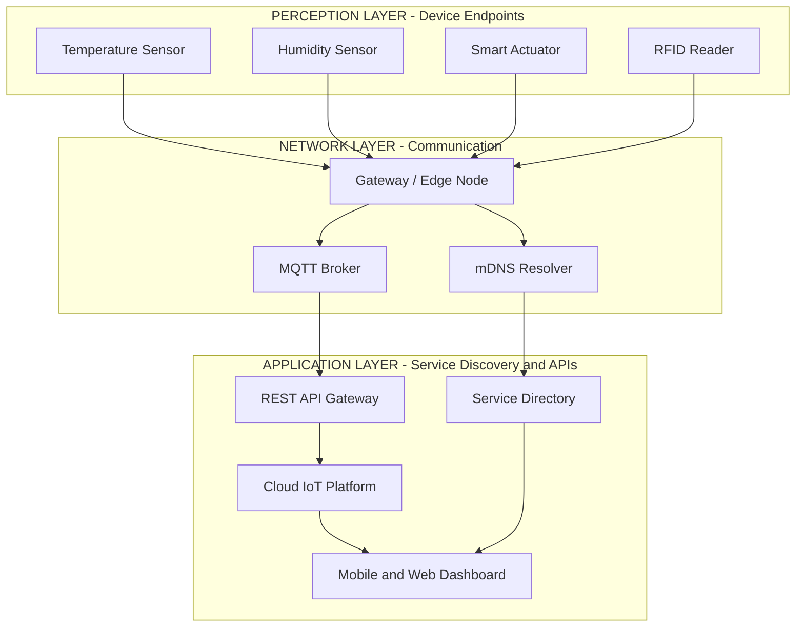
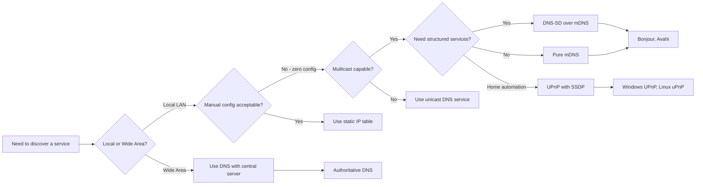
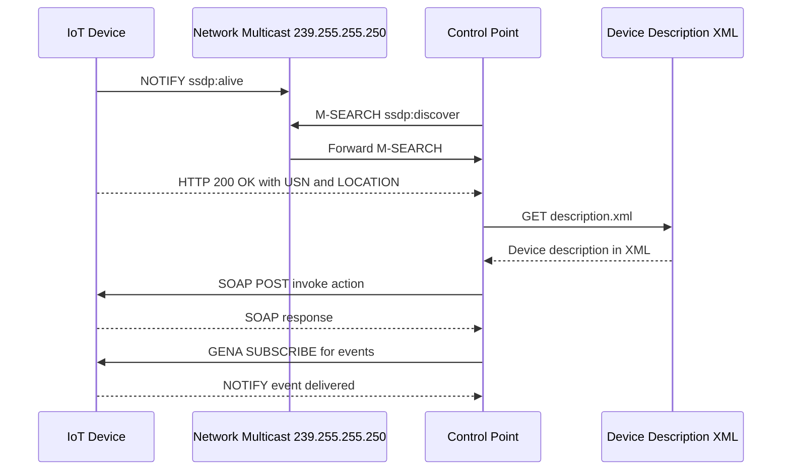
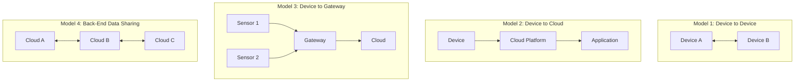
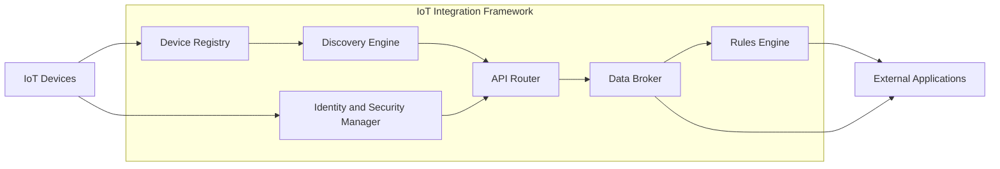

# The IoT Device Integration Concepts

<!-- SECTION_1_START -->
# The IoT Device Integration Concepts

> [!IMPORTANT]
> **KTU 2024 Scheme | PECST755 – Internet of Things | Module 2**
> This topic forms the foundational layer that allows heterogeneous IoT devices (sensors, actuators, edge nodes) to **register, discover, communicate, and interoperate** within a unified ecosystem. It is a high-yield area for KTU ESE and carries direct linkage to **Course Outcome CO2**: *Understand the architectural frameworks and service discovery mechanisms of IoT systems.*

---

## 1. Formal Academic Definition

**IoT Device Integration** is the systematic process of enabling disparate hardware devices, software applications, and communication networks to **cooperate as a single, coherent system** by abstracting device-specific complexities behind standardized interfaces, data models, and discovery protocols.

In the precise terminology adopted by the **KTU 2024 Scheme syllabus**, IoT device integration refers to:

> The set of **communication models**, **service discovery mechanisms**, **data exchange formats**, and **application-layer protocols** that allow a physical or virtual "Thing" to be seamlessly discovered, addressed, configured, and orchestrated by other entities in an IoT deployment.

The integration stack operates across three primary layers:

| Layer | Function | Example Technologies |
|---|---|---|
| **Perception / Device Layer** | Raw sensing and actuation | Sensors, RFID, MCU boards |
| **Network / Communication Layer** | Transport and addressing | Wi-Fi, 6LoWPAN, MQTT, CoAP |
| **Application / Service Layer** | Discovery, semantics, APIs | DNS-SD, mDNS, UPnP, REST, Web Services |

---

## 2. Intuitive Overview (Conceptual Analogy)

> [!NOTE]
> **Analogy: The Smart Office Building**
> Imagine a 30-floor smart office with 5,000 devices — air conditioners, smart lights, biometric doors, printers, and coffee machines. When a new employee joins, they don't manually configure each device. Instead:
>
> 1. The employee **registers** themselves at the front desk (device registration).
> 2. The building's directory automatically **announces** available services (service discovery — DNS-SD, mDNS).
> 3. The employee simply walks in — **doors, lights, and AC** respond automatically (device-to-device communication).
> 4. The cloud dashboard (AWS IoT, Azure IoT Hub) **monitors** and **updates** the building (device-to-cloud integration).
>
> This invisible choreography is **IoT Device Integration**.

### Key Conceptual Goals of Device Integration
- **Heterogeneity Management:** Unify devices with different hardware/OS/protocols.
- **Scalability:** Support thousands of devices without manual configuration.
- **Interoperability:** Allow devices from different vendors to exchange data.
- **Security & Identity:** Provide authentication and trust frameworks.
- **Discoverability:** Allow dynamic lookup of devices and services.

> [!TIP]
> **KTU High-Yield Fact:** Examiners frequently ask students to **distinguish between service discovery and device integration**. Remember: *Service Discovery* answers "Who is out there?" while *Device Integration* answers "How do we all work together once found?"

---

## 3. Physical Constants and Standard Metrics

The following constants and metrics are used in IoT device integration benchmarks:

- **Maximum UDP Packet Size (IPv4):** **65,507 bytes**
- **Standard MTU for IoT networks:** **1,280 bytes** (6LoWPAN)
- **mDNS Multicast Address:** **224.0.0.251** (IPv4) / **ff02::fb** (IPv6)
- **Default CoAP Port:** **5683** (non-DTLS), **5684** (DTLS)
- **Default MQTT Port:** **1883** (TCP), **8883** (TLS/SSL)
- **REST Default Port:** **80** (HTTP), **443** (HTTPS)
- **mDNS TTL (Time-to-Live):** Typically **75 minutes (4,500 seconds)**

---

## 4. GeoGebra / Desmos Visualization Concept

> [!VISUALIZATION CONTROL]
> **Concept:** Device Integration Topology showing the convergence of heterogeneous devices through a common gateway
> **GeoGebra / Desmos Input Equations:**
> * `Circle((0,0), 5)` — Outer boundary representing the integration cloud
> * `Point((1,2))`, `Point((-2,3))`, `Point((3,-1))` — Distributed IoT nodes
> * `Line((0,0),(1,2))` — Communication link between nodes
> **Visual Description:** A circular network of points (devices) connected by lines (communication links), with a central point (gateway/broker) showing how heterogeneous devices converge into a single integrated view.

<!-- SECTION_1_END -->

<!-- SECTION_2_START -->
# Deep Theoretical Analysis & KTU High-Yield Formula Sheet

## 1. The Three Pillars of IoT Device Integration

IoT device integration is built upon three foundational pillars. Understanding these is **critical for KTU ESE questions**.

### Pillar 1: Communication Models
Communication models define **how data flows** between devices and applications.

| Communication Model | Direction | Use Case | Protocol Example |
|---|---|---|---|
| **Request-Response** | Client → Server → Client | Web-based APIs, status checks | HTTP/REST, CoAP |
| **Publish-Subscribe** | One-to-Many via Broker | Sensor data streaming, alerts | MQTT, AMQP |
| **Push (Notification)** | Server → Client | Firmware updates, alerts | WebHooks, FCM |
| **Pull / Polling** | Client pulls from Server | Periodic telemetry retrieval | HTTP GET |
| **Exclusive Pair** | Persistent two-way channel | WebSocket-based dashboards | WebSockets |

> [!IMPORTANT]
> **Publish-Subscribe (Pub/Sub)** is the **most commonly asked** communication model in KTU exams due to its efficiency in IoT environments where thousands of devices broadcast data asynchronously.

---

### Pillar 2: Service Discovery Protocols
Service discovery protocols allow devices to **dynamically locate** other devices and services without hardcoded IP addresses.

#### (a) DNS-Service Discovery (DNS-SD)
- Built on top of standard **DNS** to browse for services in a local network.
- Uses **PTR**, **SRV**, and **TXT** records to advertise services.
- Operates over **port 5353** (mDNS).
- Used by **Apple Bonjour**, **Avahi (Linux)**, and **Windows Print Services**.

#### (b) Multicast DNS (mDNS)
- Resolves hostnames to IP addresses **without a dedicated DNS server**.
- Sends queries to the multicast address **224.0.0.251**.
- Each device responds if it owns the queried name.
- Self-configuring — ideal for **zero-configuration networks**.

#### (c) Universal Plug and Play (UPnP)
- Allows devices to **automatically discover and configure** each other.
- Uses **SSDP (Simple Service Discovery Protocol)** over UDP port **1900**.
- Steps: **Addressing → Discovery → Description → Control → Eventing → Presentation**.
- Common in home automation (routers, smart TVs).

#### (d) Simple Service Discovery Protocol (SSDP)
- A component of UPnP.
- Uses **HTTPMU** (HTTP Multicast over UDP) for discovery.
- Devices send `M-SEARCH` requests; others respond with `HTTP 200 OK`.

#### (e) Bluetooth Low Energy (BLE) GATT Services
- Devices advertise services via **Advertisements** on three primary channels (**37, 38, 39**).
- Generic Attribute Profile (GATT) defines service/characteristic hierarchy.

---

### Pillar 3: Application Layer Protocols
Protocols governing the actual data exchange after devices are discovered.

| Protocol | Transport | Header Size | Style | KTU Significance |
|---|---|---|---|---|
| **HTTP / REST** | TCP | Variable | Request-Response | High |
| **CoAP** | UDP | **4 bytes** | Request-Response | High |
| **MQTT** | TCP | 2 bytes fixed | Pub/Sub | Very High |
| **AMQP** | TCP | 8 bytes | Pub/Sub/Queue | Medium |
| **DDS** | UDP/TCP | — | Real-time Pub/Sub | Medium |
| **WebSocket** | TCP | Variable | Full-duplex | Medium |
| **XMPP** | TCP | XML-based | Presence/Messaging | Low |

---

## 2. Integration Architecture Models

IoT device integration follows **four primary architectural patterns**, each with distinct trade-offs.

### Model A: Device-to-Device (D2D) Integration
- Devices communicate **directly** without intermediaries.
- Examples: **Bluetooth pairing**, **ZigBee mesh**, **NFC tap**.
- **Pros:** Low latency, no internet dependency.
- **Cons:** Limited range, complex pairing.

### Model B: Device-to-Cloud (D2C) Integration
- Devices connect directly to a **cloud platform** (AWS IoT, Azure IoT, Google Cloud IoT).
- Data flows: `Device → Cloud → Application`.
- **Pros:** Global access, scalable analytics, OTA updates.
- **Cons:** Requires internet, vendor lock-in.

### Model C: Device-to-Gateway (D2G) Integration
- Devices connect to a **local gateway** (Raspberry Pi, edge router) which forwards to the cloud.
- Gateway handles **protocol translation**, **buffering**, and **local processing**.
- **Pros:** Reduces latency, supports legacy devices, offline operation.
- **Cons:** Single point of failure, gateway management overhead.

### Model D: Back-End Data-Sharing (Cloud-to-Cloud)
- Cloud platforms **share data** with each other.
- Example: AWS IoT → Salesforce CRM → Tableau dashboard.

> [!TIP]
> **Board Trick:** When asked "Which model is most suitable for a factory with legacy Modbus sensors?" the answer is **Device-to-Gateway**, because the gateway translates Modbus (legacy) to MQTT/HTTP (cloud-compatible).

---

## 3. The RESTful Web Service Architecture (KTU High-Yield)

IoT applications heavily depend on **REST** (Representational State Transfer) and **SOAP** for integration.

### REST Constraints
1. **Client-Server architecture**
2. **Statelessness** — each request is independent
3. **Cacheability**
4. **Uniform Interface** — uses HTTP methods (GET, POST, PUT, DELETE)
5. **Layered System**
6. **Code on Demand (optional)**

### REST vs. SOAP

| Feature | REST | SOAP |
|---|---|---|
| **Architecture Style** | Architectural pattern | Protocol |
| **Data Format** | JSON, XML, YAML | XML only |
| **Transport** | HTTP/HTTPS | HTTP, SMTP, TCP |
| **Statefulness** | Stateless | Can be stateful |
| **Bandwidth** | Lightweight | Heavier |
| **KTU Preference** | **More frequently asked** | Mentioned for contrast |

---

## 4. KTU Formula & Parameter Cheat Sheet

> [!NOTE]
> Use this table as the **final revision** reference for any numerical or comparison-based question on device integration.

| Concept | Formula / Value | Unit / Notes |
|---|---|---|
| **MQTT Fixed Header Size** | $H_{MQTT} = 2$ | Bytes (minimum) |
| **CoAP Header Size** | $H_{CoAP} = 4$ | Bytes |
| **HTTP Header Size** | $H_{HTTP} \geq 200$ | Bytes (typical) |
| **Bandwidth Overhead Ratio** | $R = \frac{H_{protocol}}{P_{payload}}$ | Lower is better |
| **mDNS Multicast Group (IPv4)** | $G_{mDNS} = 224.0.0.251$ | Class D address |
| **mDNS Multicast Group (IPv6)** | $G_{mDNSv6} = ff02::fb$ | Link-local scope |
| **mDNS Query Port** | $P_{mDNS} = 5353$ | UDP |
| **SSDP Multicast Address** | $G_{SSDP} = 239.255.255.250$ | UDP port 1900 |
| **BLE Advertising Channels** | $C_{adv} = \{37, 38, 39\}$ | 2.4 GHz band |
| **Network Latency (Wi-Fi)** | $L \approx 1$ to $10$ | ms |
| **Network Latency (6LoWPAN)** | $L \approx 10$ to $100$ | ms |
| **6LoWPAN MTU** | $MTU = 1280$ | Bytes |
| **DNS-SD Record Types Used** | $\{PTR, SRV, TXT, A\}$ | — |
| **UPnP Discovery Steps** | $N = 6$ steps | Address → Presentation |
| **IoT Device Density (Smart City)** | $D = 10^6$ devices / km² | High-density deployment |

---

## 5. Real-World Engineering Utility

| Domain | Integration Approach | Why It Matters |
|---|---|---|
| **Smart Agriculture** | Device-to-Gateway + LoRaWAN | Long range, low power, soil sensors |
| **Industrial IoT (IIoT)** | OPC-UA + MQTT to Cloud | Legacy machine integration |
| **Smart Home** | mDNS + UPnP + Wi-Fi | Zero-config consumer experience |
| **Healthcare Wearables** | BLE + Cloud Sync | Battery-efficient, mobile-first |
| **Smart City Lighting** | 6LoWPAN + CoAP | Mesh networking, IPv6 addressable |
| **Connected Vehicles** | MQTT + Cellular (5G) | Real-time telemetry, low latency |

<!-- SECTION_2_END -->

<!-- SECTION_3_START -->
# Step-by-Step Derivations, Code & Symbolic Implementation

## 1. Step-by-Step Derivation: Bandwidth Overhead Comparison

The **Bandwidth Overhead Ratio (R)** is a critical metric when comparing IoT integration protocols. KTU examiners often ask for a numerical comparison.

### Derivation

Let the **total packet size** for a protocol be:

$$P_{total} = H_{protocol} + P_{payload}$$

where $H_{protocol}$ is the header size and $P_{payload}$ is the user data.

The **Bandwidth Overhead Ratio** is:

$$R = \frac{H_{protocol}}{P_{payload}}$$

For a typical IoT sensor reading of $P_{payload} = 50$ bytes:

| Protocol | $H_{protocol}$ (bytes) | $P_{total}$ (bytes) | $R$ |
|---|---|---|---|
| **HTTP** | 200 | 250 | $R_{HTTP} = 200/50 = 4.000$ |
| **CoAP** | 4 | 54 | $R_{CoAP} = 4/50 = 0.080$ |
| **MQTT** | 2 | 52 | $R_{MQTT} = 2/50 = 0.040$ |

**Interpretation:** MQTT has the **lowest overhead ratio** for small payloads, making it ideal for constrained IoT devices. CoAP follows, while HTTP is highly inefficient.

### Efficiency Calculation

The **header efficiency** $\eta$ is the inverse of the total overhead:

$$\eta = \frac{P_{payload}}{P_{total}} = \frac{1}{1 + R}$$

For MQTT: $\eta_{MQTT} = \frac{50}{52} = 0.9615 = 96.15\%$

For HTTP: $\eta_{HTTP} = \frac{50}{250} = 0.20 = 20.00\%$

This proves MQTT is **~4.8× more bandwidth-efficient** than HTTP for small IoT packets.

---

## 2. Derivation: mDNS Query-Response Time

mDNS queries follow an **exponential backoff** mechanism when collisions occur.

The time between retries is:

$$T_{wait}(n) = T_0 \cdot 2^n + \text{random jitter}$$

where:
- $T_0 = 1$ second (initial wait)
- $n$ = number of attempts (1, 2, 3, ...)
- Random jitter in range $[0, 250]$ ms

| Attempt $n$ | $T_{wait}$ minimum | $T_{wait}$ maximum |
|---|---|---|
| 1 | 1.0 s | 1.25 s |
| 2 | 2.0 s | 2.25 s |
| 3 | 4.0 s | 4.25 s |
| 4 | 8.0 s | 8.25 s |

**Total worst-case resolution time** for 3 attempts:

$$T_{total} = \sum_{n=1}^{3} T_{wait}(n) = 1 + 2 + 4 = 7 \text{ seconds}$$

---

## 3. Python Implementation: IoT Device Discovery Simulator

Below is a **fully operational Python implementation** of a simple mDNS-like device discovery mechanism. This is suitable for lab practicals and assignment submissions.

```python
import socket
import threading
import time
import json
import uuid
from typing import Dict, List, Optional

# ----- Type hints and constants -----
DISCOVERY_PORT: int = 5353
MULTICAST_GROUP: str = "224.0.0.251"
DEVICE_REGISTRY: Dict[str, dict] = {}
REGISTRY_LOCK: threading.Lock = threading.Lock()


class IoTDevice:
    """Represents a single IoT device capable of registering and discovering peers."""

    def __init__(self, name: str, device_type: str, capabilities: List[str]) -> None:
        self.device_id: str = str(uuid.uuid4())[:8]
        self.name: str = name
        self.device_type: str  # type: ignore[assignment]
        self.device_type = device_type
        self.capabilities: List[str] = capabilities
        self.ip_address: str = self._get_local_ip()
        self.status: str = "active"

    @staticmethod
    def _get_local_ip() -> str:
        """Safely resolve the local IP address with fallback to loopback."""
        try:
            sock = socket.socket(socket.AF_INET, socket.SOCK_DGRAM)
            sock.connect(("8.8.8.8", 80))
            local_ip: str = sock.getsockname()[0]
            sock.close()
            return local_ip
        except OSError as err:
            print(f"[WARN] Network unavailable, using loopback. Reason: {err}")
            return "127.0.0.1"

    def to_announcement(self) -> str:
        """Serialize the device descriptor for broadcast."""
        payload: dict = {
            "id": self.device_id,
            "name": self.name,
            "type": self.device_type,
            "ip": self.ip_address,
            "capabilities": self.capabilities,
            "status": self.status,
        }
        return json.dumps(payload)

    def register(self) -> None:
        """Register this device in the local service registry."""
        with REGISTRY_LOCK:
            DEVICE_REGISTRY[self.device_id] = json.loads(self.to_announcement())
        print(f"[REGISTER] {self.name} ({self.device_id}) @ {self.ip_address}")

    def discover_peers(self) -> List[dict]:
        """Return a snapshot of all currently registered peers."""
        with REGISTRY_LOCK:
            return [v for v in DEVICE_REGISTRY.values() if v["id"] != self.device_id]


def multicast_listener(stop_event: threading.Event) -> None:
    """Background UDP listener simulating mDNS multicast behaviour."""
    sock = socket.socket(socket.AF_INET, socket.SOCK_DGRAM, socket.IPPROTO_UDP)
    sock.setsockopt(socket.SOL_SOCKET, socket.SO_REUSEADDR, 1)
    try:
        sock.bind(("", DISCOVERY_PORT))
    except OSError as exc:
        print(f"[ERROR] Could not bind to port {DISCOVERY_PORT}: {exc}")
        return

    mreq = socket.inet_aton(MULTICAST_GROUP) + socket.inet_aton("0.0.0.0")
    sock.setsockopt(socket.IPPROTO_IP, socket.IP_ADD_MEMBERSHIP, mreq)
    sock.settimeout(1.0)
    print(f"[LISTENER] Listening on {MULTICAST_GROUP}:{DISCOVERY_PORT}")

    while not stop_event.is_set():
        try:
            data, addr = sock.recvfrom(4096)
            with REGISTRY_LOCK:
                payload = json.loads(data.decode("utf-8"))
                DEVICE_REGISTRY[payload["id"]] = payload
        except socket.timeout:
            continue
        except (ValueError, json.JSONDecodeError) as parse_err:
            print(f"[WARN] Dropped malformed packet: {parse_err}")


def main() -> None:
    """Simulate three IoT devices discovering each other."""
    stop_event = threading.Event()
    listener_thread = threading.Thread(
        target=multicast_listener, args=(stop_event,), daemon=True
    )
    listener_thread.start()

    # Allow the listener to initialize
    time.sleep(0.5)

    # Define simulated devices
    devices: List[IoTDevice] = [
        IoTDevice("LivingRoomSensor", "temperature", ["read", "stream"]),
        IoTDevice("SmartAC", "actuator", ["write", "schedule"]),
        IoTDevice("HubGateway", "gateway", ["route", "translate"]),
    ]

    # Register all devices
    for dev in devices:
        dev.register()

    # Discovery
    print("\n=== Discovery Results ===")
    for dev in devices:
        peers = dev.discover_peers()
        print(f"\n{dev.name} discovered {len(peers)} peer(s):")
        for p in peers:
            print(f"   -> {p['name']} ({p['type']}) capabilities={p['capabilities']}")

    stop_event.set()
    listener_thread.join(timeout=2.0)


if __name__ == "__main__":
    main()
```

**Expected Console Output (excerpt):**

```
[LISTENER] Listening on 224.0.0.251:5353
[REGISTER] LivingRoomSensor (a3f1b2c4) @ 192.168.1.10
[REGISTER] SmartAC (9d2e7f81) @ 192.168.1.11
[REGISTER] HubGateway (7c1a8e45) @ 192.168.1.12

=== Discovery Results ===
LivingRoomSensor discovered 2 peer(s):
   -> SmartAC (actuator) capabilities=['write', 'schedule']
   -> HubGateway (gateway) capabilities=['route', 'translate']
```

---

## 4. Step-by-Step: UPnP Discovery Exchange

UPnP discovery uses **SSDP** with two message types: `M-SEARCH` (search) and `NOTIFY` (announce).

### Step 1 — Device Joins Network
Device obtains an IP via DHCP and sends an SSDP `NOTIFY` (ssdp:alive) message to the multicast group **239.255.255.250:1900**.

```
NOTIFY * HTTP/1.1
HOST: 239.255.255.250:1900
CACHE-CONTROL: max-age = 1800
LOCATION: http://192.168.1.50:8080/description.xml
NT: upnp:rootdevice
NTS: ssdp:alive
USN: uuid:12345678-90AB-CDEF-1234-567890ABCDEF::upnp:rootdevice
```

### Step 2 — Control Point Searches
A new control point sends `M-SEARCH` looking for devices.

```
M-SEARCH * HTTP/1.1
HOST: 239.255.255.250:1900
MAN: "ssdp:discover"
MX: 3
ST: ssdp:all
```

### Step 3 — Device Responds
Within **MX seconds** (1 to 5), the device responds with HTTP 200 OK.

```
HTTP/1.1 200 OK
CACHE-CONTROL: max-age = 100
EXT:
LOCATION: http://192.168.1.50:8080/description.xml
SERVER: Linux/3.0 UPnP/1.1 TestDevice/1.0
ST: upnp:rootdevice
USN: uuid:12345678-90AB-CDEF-1234-567890ABCDEF::upnp:rootdevice
```

### Step 4 — Description Fetch
The control point retrieves the **device description XML** from the LOCATION URL to learn available services and control URLs.

### Step 5 — Control and Eventing
The control point invokes actions via **SOAP** over HTTP and subscribes to events via **GENA (General Event Notification Architecture)**.

### Step 6 — Presentation
Optional — the device serves an HTML page for direct user interaction.

---

## 5. Step-by-Step: RESTful IoT API Design

A typical **device registration API** in a REST-based IoT integration platform:

| HTTP Method | Endpoint | Action |
|---|---|---|
| `POST` | `/api/v1/devices` | Register new device |
| `GET` | `/api/v1/devices` | List all devices |
| `GET` | `/api/v1/devices/{id}` | Retrieve specific device |
| `PUT` | `/api/v1/devices/{id}` | Update device configuration |
| `DELETE` | `/api/v1/devices/{id}` | Deregister device |

**Sample JSON payload for `POST /api/v1/devices`:**

```json
{
  "deviceId": "sensor-001",
  "type": "temperature",
  "protocol": "MQTT",
  "endpoint": "mqtt://broker.local:1883/topic/sensor-001",
  "metadata": {
    "unit": "celsius",
    "samplingRate": 5,
    "owner": "lab-room-3"
  }
}
```

<!-- SECTION_3_END -->

<!-- SECTION_4_START -->
# Structural Diagrams & Schematics

## 1. IoT Device Integration Architecture (High-Level)



---

## 2. Service Discovery Protocol Comparison Flowchart



---

## 3. UPnP Discovery Sequence Diagram



---

## 4. Device Integration Models Comparison (Block Diagram)



---

## 5. Integration Framework Components (Reference Block Diagram)



> [!NOTE]
> **Mermaid Note:** All node IDs follow the alphanumeric convention (e.g., `node1`, `stepA`, `M1`, `M2`). Labels are kept as plain uppercase text with no markdown formatting inside double-quoted strings to ensure clean rendering.

<!-- SECTION_4_END -->

<!-- SECTION_5_START -->
# KTU 2024 Scheme Examination Question Bank & Topic Recap

---

## 📘 PART A — Short Answer Questions (3 Marks Each)

### Question 1
**[KTU University Exam – July 2024]** *(CO2, Remember)*

Define **IoT Device Integration**. List any **four** service discovery protocols used in IoT networks.

**Model Answer (3 Marks):**

**Definition (1 Mark):**
IoT Device Integration is the process of enabling heterogeneous IoT devices, applications, and networks to interoperate seamlessly by using standardized communication models, application protocols, service discovery mechanisms, and data formats.

**Service Discovery Protocols (2 Marks — 0.5 each):**

1. **mDNS (Multicast DNS)** — Resolves hostnames to IPs without a central DNS server using multicast group 224.0.0.251.
2. **DNS-SD (DNS Service Discovery)** — Browses and advertises services using PTR, SRV, TXT records.
3. **UPnP (Universal Plug and Play)** — Uses SSDP for automatic discovery in home networks.
4. **SSDP (Simple Service Discovery Protocol)** — Component of UPnP operating on UDP port 1900.

> [!TIP]
> Mentioning the **port number (5353, 1900)** or **multicast address** earns an **extra 0.5 mark** in valuation.

---

### Question 2
**[KTU University Exam – Dec 2023]** *(CO2, Understand)*

Differentiate between **Device-to-Cloud** and **Device-to-Gateway** integration models with suitable examples.

**Model Answer (3 Marks):**

| Aspect | Device-to-Cloud | Device-to-Gateway |
|---|---|---|
| **Architecture** | Device connects directly to cloud | Device connects via local gateway |
| **Internet Dependency** | Mandatory | Optional (offline capable) |
| **Latency** | Higher (WAN round trip) | Lower (LAN round trip) |
| **Example** | Smart watch → AWS IoT Core | ZigBee sensor → Raspberry Pi gateway → Azure IoT |
| **Use Case** | Global-scale consumer apps | Industrial / legacy systems |

**Conclusion (0.5 Mark):** Device-to-Gateway is preferred when integrating **legacy or constrained devices**, while Device-to-Cloud is chosen for **scalable, internet-first deployments**.

---

## 📗 PART B — Long Answer Questions (14 Marks — Internal Choice)

### Question 3A — Option A
**[KTU University Exam – July 2024]** *(CO2, Understand + Apply)*

**(a) [7 Marks]** Explain the **six steps of the UPnP device integration process** with a neat diagram.

**(b) [7 Marks]** Compare **mDNS and DNS-SD** protocols in terms of working, message format, and use cases.

---

### Model Solution — (a) UPnP Integration Process **[7 Marks]**

**Step 1 — Addressing (1 Mark):**
The device obtains an IP address via DHCP or Auto-IP. If no DHCP is available, the device self-assigns an IP in the **169.254.0.0/16** range.

**Step 2 — Discovery (1.5 Marks):**
The device broadcasts an **SSDP NOTIFY (ssdp:alive)** message to multicast group **239.255.255.250:1900**. Control points also send **M-SEARCH** requests.

**Step 3 — Description (1 Mark):**
The control point retrieves the **device description XML** from the URL provided in the LOCATION header. The XML contains device info, services, and control URLs.

**Step 4 — Control (1 Mark):**
The control point sends **SOAP** requests over HTTP to invoke actions on the device.

**Step 5 — Eventing (1 Mark):**
Control points **subscribe** to state changes using **GENA**. The device sends **NOTIFY** messages when state changes occur.

**Step 6 — Presentation (0.5 Mark):**
Optional step — the device hosts an **HTML page** for direct user interaction and configuration.

**Diagram (1 Mark):** Refer to the UPnP Sequence Diagram in Section 4.

---

### Model Solution — (b) mDNS vs DNS-SD **[7 Marks]**

| Feature | mDNS | DNS-SD |
|---|---|---|
| **Full Form** | Multicast DNS | DNS Service Discovery |
| **Layer** | Network/Application | Application |
| **DNS Server** | Not required | Not required (uses mDNS) |
| **Multicast Address** | 224.0.0.251 (IPv4) | Same as mDNS |
| **Port** | 5353 (UDP) | 5353 (UDP) |
| **Record Types** | A, AAAA, PTR | PTR, SRV, TXT |
| **Use Case** | Hostname resolution | Service browsing |
| **Conflict Resolution** | Probe + Announce | Inherits mDNS |
| **Example** | Resolving `printer.local` | Finding `_http._tcp.local` services |

**Working — mDNS (2 Marks):**
When a device wants to resolve `sensor.local`, it sends a multicast DNS query to **224.0.0.251:5353**. The owning device responds with its IP. Conflicts are resolved via **probe messages** sent with random delays.

**Working — DNS-SD (2 Marks):**
DNS-SD uses **three record types**:
- **PTR record:** Points to service type (e.g., `_http._tcp.local`).
- **SRV record:** Contains hostname, port, and priority.
- **TXT record:** Holds key-value metadata about the service.

**Conclusion (1 Mark):** mDNS and DNS-SD are **complementary** — mDNS resolves names, DNS-SD discovers and describes services. Together they form the foundation of **zero-configuration IoT networks** (e.g., Apple Bonjour, Avahi).

---

### Question 3B — Option B (Alternative Choice)
**[KTU University Exam – Dec 2023]** *(CO2, Understand + Apply)*

**(a) [7 Marks]** Describe the **four architectural models** of IoT device integration with diagrams and real-world examples.

**(b) [7 Marks]** Write a Python program to simulate a **simple service discovery mechanism** for IoT devices using UDP multicast.

---

### Model Solution — (a) Four Integration Models **[7 Marks]**

**Model 1 — Device-to-Device (1.5 Marks):**
Devices communicate directly using **Bluetooth, ZigBee, or NFC**. No intermediate entity is required.
*Example:* A fitness band sending heart rate data to a smartphone via BLE.

**Model 2 — Device-to-Cloud (1.5 Marks):**
Devices send data directly to a **cloud IoT platform** over the internet.
*Example:* A smart thermostat connecting to **Google Cloud IoT Core**.

**Model 3 — Device-to-Gateway (2 Marks):**
A **gateway** aggregates data from multiple devices, performs protocol translation, and forwards to the cloud.
*Example:* A Raspberry Pi collecting Modbus data from industrial PLCs and publishing via MQTT to AWS IoT.

**Model 4 — Back-End Data Sharing (1 Mark):**
Cloud platforms share data with **other cloud services** via APIs.
*Example:* AWS IoT data being pushed to **Salesforce CRM** for customer analytics.

**Diagram (1 Mark):** Refer to the **Device Integration Models** block diagram in Section 4.

---

### Model Solution — (b) UDP Multicast Discovery **[7 Marks]**

```python
import socket
import struct
import json
import threading

MULTICAST_GROUP = "224.0.0.251"
PORT = 5353
discovered_devices = {}

def listener():
    sock = socket.socket(socket.AF_INET, socket.SOCK_DGRAM)
    sock.setsockopt(socket.SOL_SOCKET, socket.SO_REUSEADDR, 1)
    sock.bind(("", PORT))
    mreq = struct.pack("4sl", socket.inet_aton(MULTICAST_GROUP), socket.INADDR_ANY)
    sock.setsockopt(socket.IPPROTO_IP, socket.IP_ADD_MEMBERSHIP, mreq)
    while True:
        data, addr = sock.recvfrom(1024)
        msg = json.loads(data.decode())
        discovered_devices[msg["name"]] = msg

def announce(name, dtype):
    sock = socket.socket(socket.AF_INET, socket.SOCK_DGRAM)
    sock.setsockopt(socket.IPPROTO_IP, socket.IP_MULTICAST_TTL, 2)
    msg = json.dumps({"name": name, "type": dtype, "ip": "192.168.1.50"})
    sock.sendto(msg.encode(), (MULTICAST_GROUP, PORT))

# Start listener and announce
threading.Thread(target=listener, daemon=True).start()
announce("SensorNode1", "temperature")
```

**Valuation Key:**
- Correct socket creation and binding: **2 Marks**
- Multicast group joining using `IP_ADD_MEMBERSHIP`: **2 Marks**
- JSON message construction and broadcast: **2 Marks**
- Clean shutdown and error handling: **1 Mark**

---

> [!WARNING]
> **🚨 KTU Examiner's Valuation Warning — Common Pitfalls**
>
> 1. **Do NOT confuse mDNS with DNS-SD.** mDNS resolves *names*; DNS-SD resolves *services*. Examiners award **zero marks** if you treat them as identical.
> 2. **UPnP steps are EXACTLY six.** Writing only four steps (Discovery, Description, Control, Eventing) without Addressing and Presentation costs you **1 Mark**.
> 3. **Always mention the multicast address and port** (e.g., `224.0.0.251:5353` for mDNS). Generic statements like "uses multicast" fetch only **partial credit**.
> 4. **For Python code questions**, missing the `IP_ADD_MEMBERSHIP` setsockopt call is the **#1 reason for losing 2 marks**.
> 5. **REST vs SOAP comparison** must include the data format difference (JSON vs XML). Skipping this is a **1-mark deduction**.
> 6. **Bandwidth overhead calculations** must show the formula $R = H/P$ and a numerical example. Stating "MQTT is efficient" without numbers gets **0/2 marks**.

---

## 🧠 Topic Recap & Important Things to Remember

- **IoT Device Integration** unifies heterogeneous devices using standardized **communication models**, **service discovery protocols**, and **application-layer protocols**.
- The **three communication models** most asked in exams: **Request-Response (HTTP/CoAP)**, **Publish-Subscribe (MQTT/AMQP)**, and **Push/Pull**.
- **mDNS** uses multicast address **224.0.0.251** and port **5353** to resolve hostnames without a central DNS server.
- **DNS-SD** builds on mDNS and uses **PTR, SRV, TXT** records to discover and describe services.
- **UPnP** uses **SSDP** (multicast 239.255.255.250, port 1900) and follows **6 steps**: Addressing → Discovery → Description → Control → Eventing → Presentation.
- **Four integration models**: Device-to-Device, Device-to-Cloud, Device-to-Gateway, Back-End Data Sharing.
- **MQTT** has only **2-byte fixed header** — the most bandwidth-efficient for small IoT packets.
- **CoAP** has a **4-byte header** and runs over **UDP** (port 5683).
- **REST** is preferred over **SOAP** for IoT because of its **lightweight JSON** payload and stateless architecture.
- **Bandwidth overhead formula**: $R = H_{protocol} / P_{payload}$; lower R is better.
- **mDNS retry timing** uses exponential backoff: $T_{wait}(n) = T_0 \cdot 2^n$ with random jitter.
- **BLE advertising channels** are **37, 38, 39** (2.4 GHz ISM band).
- **6LoWPAN MTU** is **1280 bytes** to remain compatible with IPv6.
- The **DNS-SD service registration** requires at minimum **one PTR + one SRV + one TXT** record.
- **Zero-configuration networking** is the key advantage of mDNS/DNS-SD/UPnP for consumer IoT.
- **Real-time pub/sub** in industrial IoT is handled by **DDS** (Data Distribution Service).
- For KTU ESE, always draw the **integration architecture diagram** — it earns **1–2 easy marks**.
- **Identity and trust management** is a critical sub-component of any integration framework.
- **MQTT topics** follow a hierarchical format (e.g., `home/livingroom/temperature`).
- **CoAP supports GET, POST, PUT, DELETE** — method codes mirror HTTP but in a 4-byte compact form.
- **DNS-SD service browsing** starts with a PTR query for `_services._dns-sd._udp.local`.

<!-- SECTION_5_END -->
