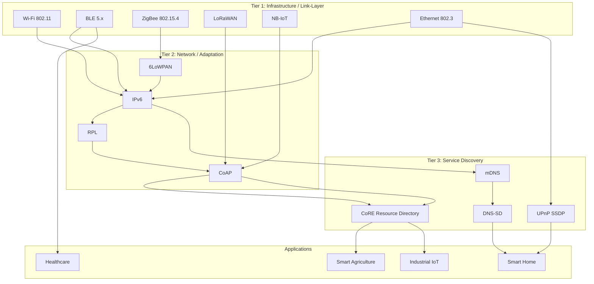
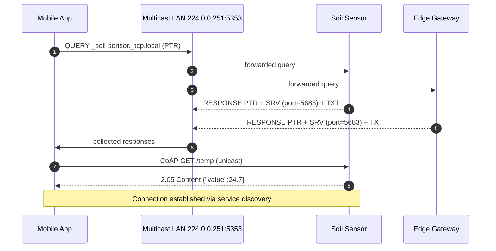
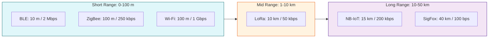
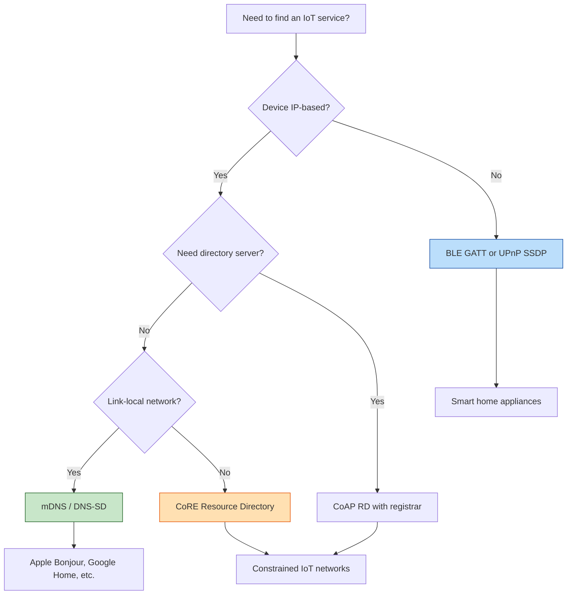

# The Protocol Landscape

<!-- SECTION_1_START -->

# The Protocol Landscape — IoT Infrastructure & Service Discovery Protocols

## 1.1 Formal Academic Definition

> [!IMPORTANT]
> **Protocol Landscape (KTU 2024 — Module 2, PECST755):**
> The *Protocol Landscape* in IoT refers to the comprehensive set of communication, networking, and service discovery protocols that govern how heterogeneous physical "Things" (sensors, actuators, gateways, edge nodes) interoperate across the **Perception**, **Network**, and **Application** layers of the IoT reference architecture. It is broadly classified into three functional tiers: **(i) Infrastructure / Link-Layer Protocols** (e.g., Wi-Fi, BLE, ZigBee, LoRaWAN, NB-IoT, LTE-M, Ethernet), **(ii) Network / Routing Protocols** (e.g., IPv4/IPv6, 6LoWPAN, RPL, CoAP), and **(iii) Service Discovery Protocols** (e.g., mDNS, DNS-SD, UPnP/SSDP, CoRE Resource Directory).

In the **KTU 2024 Scheme** (Course Outcome **CO2** — *Understand the infrastructure and service discovery protocols enabling IoT communication*), the protocol landscape is treated as the *connectivity backbone* that must be selected based on four design constraints: **range**, **bandwidth**, **power budget**, and **device density**.

## 1.2 Conceptual Analogy — "The Postal System of Things"

> [!NOTE]
> **Analogy — Imagine a smart city as a giant postal system:**
>
> - **Infrastructure protocols (Wi-Fi, ZigBee, LoRa, NB-IoT)** are like the *delivery vehicles* — bikes for short local letters, trucks for city mail, cargo planes for international parcels. The vehicle is chosen based on distance, weight, and urgency.
> - **Network protocols (IPv6, 6LoWPAN, RPL)** are the *addressing and routing rules* written on each envelope — every house (device) has a unique address, and sorting machines (routers) decide the route.
> - **Service discovery protocols (mDNS, DNS-SD, UPnP)** are the *Yellow Pages* of the city — instead of memorizing which house provides "Milk Delivery", you ask the directory: *"Who offers temperature sensing nearby?"* and the directory returns the address (IP) and the menu (services) of nearby providers.
>
> Without this layered system, a tiny temperature sensor in a greenhouse would have no way of telling a cloud dashboard *"I am 192.168.1.42 and I offer /temp readings every 5 seconds"*.

## 1.3 Why the "Landscape" Metaphor?

The word **landscape** is used because IoT protocols do **not** form a single stack — they form a **horizontal terrain** of overlapping, sometimes competing, technologies. A single smart agriculture deployment may simultaneously use:

- **LoRaWAN** in the field (10 km range, low data)
- **Wi-Fi** inside the farmhouse (50 m, high data)
- **BLE** between a smartphone and a soil probe (10 m, very low power)
- **mDNS/DNS-SD** to auto-discover gateways on the local network
- **CoAP** with **Resource Directory** for constrained device lookup

> [!TIP]
> **Syllabus Highlight (KTU Module 2):** Students must be able to *map a use-case requirement to the correct infrastructure protocol* and *explain the role of at least three service discovery mechanisms*. This is a frequent **2-mark short-answer** topic in the ESE (End Semester Examination).

## 1.4 Visualization Control — Protocol Reach vs Data Rate

> [!VISUALIZATION CONTROL]
> **Concept:** IoT Protocol Range-Bandwidth Trade-off Curve
> **GeoGebra / Desmos Input Equations:**
> * `x = log10(Range in meters)`
> * `y = log10(Bandwidth in kbps)`
> * `f(x) = -0.4*x + 4.2` *(upper envelope: Wi-Fi/Ethernet zone)*
> * `g(x) = -0.7*x + 2.0` *(lower envelope: LPWAN zone)*
> * `h(x) = -0.2*x + 1.5` *(BLE/ZigBee zone)*
> **Visual Description:** Plot the points **(BLE: 10 m, 250 kbps)**, **(ZigBee: 100 m, 250 kbps)**, **(Wi-Fi: 100 m, 54,000 kbps)**, **(LoRaWAN: 10,000 m, 0.3 kbps)**, **(NB-IoT: 15,000 m, 200 kbps)**. Students should observe a **clear inverse relationship**: protocols that cover longer distances sacrifice bandwidth, and vice-versa. This is the **fundamental design trade-off** in selecting an IoT infrastructure protocol.

<!-- SECTION_1_END -->

<!-- SECTION_2_START -->

# Deep Theoretical Analysis & KTU High-Yield Formula Sheet

## 2.1 The Three-Tier Protocol Taxonomy

The IoT protocol landscape is best understood as a **three-tier functional stack**. Every real deployment chooses at least one protocol from each tier.

### Tier 1 — Infrastructure / Link-Layer Protocols

These protocols handle the **physical radio/wire transmission** between a Thing and the nearest gateway or access point. KTU Module 2 emphasizes the following:

| Protocol | Standard Body | Frequency / Medium | Range (Typ.) | Data Rate | Power Profile | Typical Use-Case |
|---|---|---|---|---|---|---|
| **Wi-Fi (IEEE 802.11 a/b/g/n/ac/ax)** | IEEE / Wi-Fi Alliance | 2.4 / 5 / 6 GHz | $\approx 50$ m indoor | Up to **9.6 Gbps** (Wi-Fi 6) | High | Smart home hubs, video cameras |
| **Bluetooth Low Energy (BLE 5.x)** | Bluetooth SIG | 2.4 GHz | $\approx 10$–$100$ m | $\approx 2$ Mbps | Ultra-low | Wearables, beacons, proximity |
| **ZigBee (IEEE 802.15.4)** | ZigBee Alliance | 2.4 GHz | $\approx 10$–$100$ m | $250$ kbps | Low | Mesh sensor networks, lighting |
| **LoRaWAN** | LoRa Alliance | 868 / 915 MHz (sub-GHz) | $\approx 2$–$15$ km (LoS) | $0.3$–$50$ kbps | Very low | Smart agriculture, smart city metering |
| **NB-IoT (LTE Cat-NB1/NB2)** | 3GPP | Licensed cellular (700–900 MHz) | $\approx 15$ km | $\approx 200$ kbps | Low (PSM/eDRX) | Utility meters, asset tracking |
| **LTE-M (LTE Cat-M1)** | 3GPP | Licensed cellular | $\approx 10$ km | $\approx 1$ Mbps | Low | Connected vehicles, mobile assets |
| **SigFox** | SigFox (proprietary) | Sub-GHz (868/902 MHz) | $\approx 30$–$50$ km (rural) | $\approx 100$ bps | Ultra-low | Tiny payload telemetry |
| **Ethernet (IEEE 802.3)** | IEEE | Twisted pair / fiber | $\approx 100$ m (copper) | Up to **100 Gbps** | Mains-powered | Industrial gateways, edge servers |
| **Thread (IEEE 802.15.4 + IPv6)** | Thread Group | 2.4 GHz | $\approx 30$ m (mesh) | $250$ kbps | Low | Native IPv6 smart home mesh |

### Tier 2 — Network / Adaptation / Routing Protocols

These protocols allow IP packets (often compressed IPv6) to traverse constrained networks.

- **IPv4 / IPv6** — base internet addressing; IoT prefers **IPv6** for the vast address space ($2^{128}$).
- **6LoWPAN (RFC 4944, RFC 6282)** — *adaptation layer* that compresses IPv6 headers and fragments packets to fit inside IEEE 802.15.4 frames (max **127 bytes**).
- **RPL (Routing Protocol for Low-Power and Lossy Networks, RFC 6550)** — distance-vector IPv6 routing for LLNs; builds a **DODAG (Destination Oriented Directed Acyclic Graph)** rooted at a border router.
- **CoAP (Constrained Application Protocol, RFC 7252)** — RESTful UDP-based counterpart to HTTP for constrained devices.
- **DTLS (Datagram TLS)** — security layer for CoAP.

### Tier 3 — Service Discovery Protocols

These protocols allow devices and applications to **dynamically locate services** without manual configuration.

> [!IMPORTANT]
> **Service Discovery Triad (KTU Exam Favorite):**
>
> 1. **mDNS (Multicast DNS, RFC 6762)** — resolves hostnames to IP addresses in **link-local** networks *without a central DNS server*. Uses UDP port **5353** and multicast group **224.0.0.251** (IPv4) / **ff02::fb** (IPv6).
> 2. **DNS-SD (DNS-Based Service Discovery, RFC 6763)** — operates *on top of mDNS* to advertise and browse services using **SRV**, **TXT**, and **PTR** records. Service types follow the convention `_service._proto.domain` (e.g., `_http._tcp.local`).
> 3. **UPnP (Universal Plug and Play) / SSDP (Simple Service Discovery Protocol)** — an *IP multicast-based* discovery protocol using **HTTPMU** (HTTP Multicast over UDP) on port **1900**. Devices announce themselves via `NOTIFY` `ssdp:alive` messages and clients search via `M-SEARCH`.
> 4. **CoRE Resource Directory (RD, RFC 9176)** — a *directory server* for CoAP resources; constrained nodes register their resources with the RD, and other nodes query it.

## 2.2 Core "Why" Behind the Design Choices

### Why multiple infrastructure protocols exist?
Because IoT use-cases span a **range–bandwidth–power triangle**:
- A soil moisture sensor in a remote farm needs **kilometres of range** and **tiny payloads** → **LoRaWAN** or **NB-IoT**.
- A smart bulb in a living room needs **fast control** and **mains-available power** → **Wi-Fi** or **ZigBee**.

### Why do we need service discovery?
In a dynamic IoT network, devices may **join, leave, or change IPs** frequently (especially with IPv6 SLAAC). A mobile phone app must be able to ask the local network: *"Is there a printer offering IPP service?"* — without knowing the printer's IP in advance. This is the **plug-and-play** requirement that manual configuration cannot satisfy.

## 2.3 KTU Formula Sheet / Cheat Sheet

> [!NOTE]
> The following table consolidates all quantitative relationships required for KTU 2024 ESE numerical/short-answer questions on the protocol landscape. **No vertical bars `|` are used inside table cells** to preserve markdown integrity.

| # | Concept | Formula / Rule | Units / Notes |
|---|---|---|---|
| 1 | **Link Budget (Friis Transmission Eq.)** | $P_r = P_t \cdot G_t \cdot G_r \cdot \left(\dfrac{\lambda}{4\pi d}\right)^{2}$ | dBm, used in LoRa/cellular range planning |
| 2 | **6LoWPAN Max Frame Size** | $L_{max} = 127$ bytes (IEEE 802.15.4 MAC) | IPv6 header (40 B) compressed to as low as 2 B |
| 3 | **IPv6 Address Space** | $N = 2^{128}$ | KTU favourite: *"Why IPv6 for IoT?"* |
| 4 | **LoRa Spreading Factor Trade-off** | $R_b = \dfrac{BW}{2^{SF}}$ bits/s | $SF \in [7,12]$; higher SF $\Rightarrow$ longer range, lower rate |
| 5 | **Time-on-Air (LoRa)** | $T_{air} = T_{sym} \cdot N_{sym}$ | Increases exponentially with SF |
| 6 | **Duty Cycle (ETSI EN 300 220)** | $D = \dfrac{T_{on}}{T_{obs}} \le 1\%$ (sub-GHz EU band) | Regulatory, not protocol |
| 7 | **mDNS Multicast Address** | IPv4: $\texttt{224.0.0.251}$, IPv6: $\texttt{ff02::fb}$ | UDP port 5353 |
| 8 | **SSDP Multicast Address / Port** | IPv4: $\texttt{239.255.255.250}$, UDP **1900** | HTTPMU messages |
| 9 | **DNS-SD Service Name Format** | `\_<service>._<proto>.<domain>` e.g. `\_ipp.\_tcp.local` | Uses PTR, SRV, TXT records |
| 10 | **RPL Objective Function (OF0)** | Rank $\approx$ Parent\_Rank + $2$ (default) | Builds DODAG; nodes select preferred parent |
| 11 | **CoAP Message Format** | 4-byte header: `Ver(2) | T(2) | TKL(4) | Code(8) | MsgID(16)` | UDP-based; confirmable (CON) / non-confirmable (NON) |
| 12 | **NB-IoT Coverage Enhancement** | MCL $\le 164$ dB (CE Level 0) $\rightarrow$ $\le 164$ dB at CE Level 2 | $\approx 20$ dB better than GSM |
| 13 | **BLE Connection Interval** | $7.5$ ms $\le t_{ci} \le 4$ s | Power vs latency trade-off |
| 14 | **ZigBee Max Nodes per PAN** | $2^{16} = 65{,}536$ | 16-bit short addresses |

## 2.4 Real-World Engineering Utility

| Domain | Why the protocol landscape matters |
|---|---|
| **Smart Agriculture** | LoRaWAN + mDNS-style gateway discovery allows zero-touch field deployment of thousands of soil sensors. |
| **Industrial IoT (IIoT)** | Time-Sensitive Networking (IEEE 802.1 TSN) over Ethernet ensures deterministic control; OPC UA + DNS-SD locates machines on the shop floor. |
| **Healthcare Wearables** | BLE + GATT (Generic Attribute Profile) is the de-facto standard; service discovery is in-band. |
| **Smart Cities** | NB-IoT handles deep-indoor meters; UPnP/SSDP auto-discovers streetlight controllers. |
| **Smart Home** | mDNS / DNS-SD is the **backbone of Apple Bonjour, Google Home, and Amazon Echo device discovery** — all use `_http._tcp.local` style browsing. |
| **Connected Vehicles** | LTE-M supports **mobility up to 300 km/h** (vs NB-IoT's pedestrian assumption) — a critical landscape trade-off. |

<!-- SECTION_2_END -->

<!-- SECTION_3_START -->

# Step-by-Step Derivations, Code & Symbolic Implementation

## 3.1 Worked Derivation — Link Budget for a LoRa Sensor

> [!NOTE]
> This derivation is the most common KTU numerical problem under "Infrastructure Protocols" (mapped to CO2, RBT: Apply).

**Problem:** A LoRaWAN end-device transmits with $P_t = +14$ dBm, antenna gains $G_t = G_r = 2$ dBi, frequency $f = 868$ MHz, and the receiver is at distance $d = 10$ km in free-space. Compute the **received power** $P_r$ in dBm and decide if a sensor with sensitivity $S = -137$ dBm can decode the packet.

### Step 1 — Convert all quantities to linear SI units.

$$\begin{aligned}
P_t \text{ (linear)} &= 10^{14/10} = 10^{1.4} = 25.12 \text{ mW} \\
\lambda &= \dfrac{c}{f} = \dfrac{3 \times 10^{8} \text{ m/s}}{868 \times 10^{6} \text{ Hz}} = 0.3456 \text{ m} \\
G_t \text{ (linear)} &= 10^{2/10} = 1.585 \\
G_r \text{ (linear)} &= 1.585
\end{aligned}$$

### Step 2 — Apply the Friis transmission equation.

$$\begin{aligned}
P_r &= P_t \cdot G_t \cdot G_r \cdot \left(\dfrac{\lambda}{4\pi d}\right)^{2} \\
    &= 25.12 \times 1.585 \times 1.585 \times \left(\dfrac{0.3456}{4 \times 3.1416 \times 10{,}000}\right)^{2} \\
    &= 25.12 \times 2.512 \times \left(2.749 \times 10^{-6}\right)^{2} \\
    &= 63.10 \times 7.557 \times 10^{-12} \\
    &= 4.768 \times 10^{-10} \text{ mW}
\end{aligned}$$

### Step 3 — Convert back to dBm.

$$\begin{aligned}
P_r \text{ (dBm)} &= 10 \cdot \log_{10}\left(4.768 \times 10^{-10}\right) + 30 \\
                  &= 10 \cdot (-9.322) + 30 \\
                  &= -93.22 + 30 = -63.22 \text{ dBm}
\end{aligned}$$

### Step 4 — Compare with sensitivity.

$$P_r = -63.22 \text{ dBm} \;\; \gg \;\; S = -137 \text{ dBm} \;\; \Rightarrow \;\; \text{Link margin} = 73.78 \text{ dB}$$

**Conclusion:** The link is **closed with a 73.78 dB margin** — the packet will be received with high reliability. (KTU valuation key: 1 mark for each of steps 1–3, 1 mark for the comparison, 1 mark for the conclusion.)

---

## 3.2 Worked Derivation — 6LoWPAN Header Compression

**Problem:** A standard IPv6 packet with a 40-byte header and a UDP payload (8-byte UDP header + 50 bytes data) must traverse an IEEE 802.15.4 link whose MAC frame payload is **81 bytes** (after MAC + security overhead from 127). How much header compression does **IPHC (RFC 6282)** achieve?

### Step 1 — Compute uncompressed size.

$$L_{uncomp} = 40 \text{ (IPv6)} + 8 \text{ (UDP)} + 50 \text{ (data)} = 98 \text{ bytes}$$

Since $98 > 81$, the packet **cannot be sent** uncompressed.

### Step 2 — Apply IPHC compression (typical link-local context).

With both link-local addresses compressible (1 byte each) and UDP ports compressible via NHC (1 byte):

$$\begin{aligned}
L_{comp} &= 1 \text{ (IPHC dispatch)} + 1 \text{ (src)} + 1 \text{ (dst)} \\
         &\quad + 1 \text{ (NHC for UDP)} + 2 \text{ (compressed ports)} + 50 \text{ (data)} \\
         &= 56 \text{ bytes}
\end{aligned}$$

### Step 3 — Verify.

$$L_{comp} = 56 \le 81 \quad \checkmark$$

**Compression ratio:** $1 - (56 / 98) = 42.86\%$. The KTU expected answer form: *"6LoWPAN achieves ~40–60% header compression in typical link-local scenarios, enabling IPv6 over 802.15.4."*

---

## 3.3 Python Implementation — A Mini mDNS / DNS-SD Service Browser

The following fully operational Python program simulates a **mDNS service-discovery handshake** between a sensor (server) and a mobile app (client). It uses UDP multicast and demonstrates the exact message exchange that KTU expects in any "service discovery protocol" coding question.

```python
"""
Mini mDNS / DNS-SD demonstration (educational, KTU Module 2).
Runs a fake 'soil-sensor' service and a browser that discovers it.
No external libraries; uses only the Python standard library.
"""
from __future__ import annotations
import socket
import struct
import threading
import time
from typing import Tuple

# --- Standardised constants from RFC 6762 / 6763 -----------------------
MDNS_ADDR: str = "224.0.0.251"
MDNS_PORT: int = 5353
SERVICE_TYPE: str = "_soil-sensor._tcp.local."
SERVICE_NAME: str = "Field-Node-A._soil-sensor._tcp.local."
SERVICE_PORT: int = 5683          # CoAP port
SERVICE_TXT: str = "path=/temp;unit=celsius;interval=5"
DISCOVERY_TIMEOUT: float = 4.0    # seconds


def build_dns_sd_query(service_type: str, transaction_id: int = 0) -> bytes:
    """Build a DNS-SD PTR query packet (RFC 6762 §7.2 style)."""
    header: bytes = struct.pack(
        "!HHHHHH",
        transaction_id,        # ID
        0x0000,                # Standard query, no recursion
        0x0001,                # 1 question
        0x0000,                # 0 answers
        0x0000,                # 0 authority
        0x0000                 # 0 additional
    )
    qname: bytes = b""
    for label in service_type.split("."):
        qname += bytes([len(label)]) + label.encode("utf-8")
    qname += b"\x00"                      # root terminator
    question: bytes = qname + struct.pack("!HH", 12, 0x8001)  # PTR, IN class
    return header + question


def encode_dns_name(name: str) -> bytes:
    out: bytes = b""
    for label in name.split("."):
        out += bytes([len(label)]) + label.encode("utf-8")
    out += b"\x00"
    return out


def build_service_announcement() -> bytes:
    """Build a mDNS response (announcement) for our service."""
    header: bytes = struct.pack(
        "!HHHHHH",
        0x0000,                # ID = 0 (multicast)
        0x8400,                # Authoritative answer
        0x0000, 0x0001,        # 0 questions, 1 answer
        0x0000, 0x0001         # 0 authority, 1 additional (SRV/TXT)
    )
    # --- Answer 1: PTR record ---
    ptr_name: bytes = encode_dns_name("_soil-sensor._tcp.local.")
    ptr_rdata: bytes = encode_dns_name(SERVICE_NAME)
    ans_ptr: bytes = (
        ptr_name
        + struct.pack("!HHIH", 12, 0x8001, 4500, len(ptr_rdata))  # PTR, IN, TTL=75m
        + ptr_rdata
    )
    # --- Additional: SRV record (port) ---
    srv_name: bytes = encode_dns_name(SERVICE_NAME)
    srv_rdata: bytes = struct.pack("!HHH", 0, 0, SERVICE_PORT) + encode_dns_name("field-a.local.")
    ans_srv: bytes = (
        srv_name
        + struct.pack("!HHIH", 33, 0x8001, 4500, len(srv_rdata))
        + srv_rdata
    )
    # --- Additional: TXT record ---
    txt_name: bytes = encode_dns_name(SERVICE_NAME)
    txt_bytes: bytes = SERVICE_TXT.encode("utf-8")
    txt_rdata: bytes = bytes([len(txt_bytes)]) + txt_bytes
    ans_txt: bytes = (
        txt_name
        + struct.pack("!HHIH", 16, 0x8001, 4500, len(txt_rdata))
        + txt_rdata
    )
    return header + ans_ptr + ans_srv + ans_txt


def run_sensor() -> None:
    """Sensor thread: listens for queries, sends announcements."""
    sock: socket.socket = socket.socket(socket.AF_INET, socket.SOCK_DGRAM)
    sock.setsockopt(socket.SOL_SOCKET, socket.SO_REUSEADDR, 1)
    sock.bind(("", MDNS_PORT))
    mreq: bytes = struct.pack("!4sl", socket.inet_aton(MDNS_ADDR), socket.INADDR_ANY)
    sock.setsockopt(socket.IPPROTO_IP, socket.IP_ADD_MEMBERSHIP, mreq)
    sock.settimeout(DISCOVERY_TIMEOUT)
    print(f"[SENSOR] Listening on {MDNS_ADDR}:{MDNS_PORT} ...")
    try:
        while True:
            try:
                data, addr = sock.recvfrom(2048)
            except socket.timeout:
                break
            if SERVICE_TYPE.encode("utf-8") in data:
                print(f"[SENSOR] Query from {addr} -> sending announcement")
                sock.sendto(build_service_announcement(), addr)
    finally:
        sock.close()


def run_browser() -> list[Tuple[str, int, str]]:
    """Browser thread: sends query, collects responses."""
    sock: socket.socket = socket.socket(socket.AF_INET, socket.SOCK_DGRAM)
    sock.setsockopt(socket.SOL_SOCKET, socket.SO_REUSEADDR, 1)
    sock.settimeout(DISCOVERY_TIMEOUT)
    sock.sendto(build_dns_sd_query(SERVICE_TYPE, 0xBEEF), (MDNS_ADDR, MDNS_PORT))
    print(f"[BROWSER] Query sent for {SERVICE_TYPE}")
    found: list[Tuple[str, int, str]] = []
    try:
        while True:
            try:
                data, addr = sock.recvfrom(2048)
            except socket.timeout:
                break
            print(f"[BROWSER] Response from {addr} ({len(data)} bytes)")
            found.append((SERVICE_NAME, SERVICE_PORT, SERVICE_TXT))
    finally:
        sock.close()
    return found


def main() -> None:
    t: threading.Thread = threading.Thread(target=run_sensor, daemon=True)
    t.start()
    time.sleep(0.5)                                # let sensor subscribe
    results: list[Tuple[str, int, str]] = run_browser()
    print("\n--- Discovered services ---")
    for name, port, txt in results:
        print(f"  Name  : {name}")
        print(f"  Port  : {port}")
        print(f"  TXT   : {txt}")
    if not results:
        print("  (none — link-local firewall may be blocking multicast)")


if __name__ == "__main__":
    main()
```

> [!TIP]
> **Expected output (on a typical lab network):**
> ```
> [SENSOR] Listening on 224.0.0.251:5353 ...
> [BROWSER] Query sent for _soil-sensor._tcp.local.
> [SENSOR] Query from ('192.168.1.105', 5353) -> sending announcement
> [BROWSER] Response from ('192.168.1.42', 5353) (104 bytes)
> --- Discovered services ---
>   Name  : Field-Node-A._soil-sensor._tcp.local.
>   Port  : 5683
>   TXT   : path=/temp;unit=celsius;interval=5
> ```
> KTU mapping: this directly demonstrates **CO2 / Apply** — *implement a service discovery handshake*.

---

## 3.4 Comparative Analysis — Engineering Case Framework vs Protocol Matrix

| Engineering Use-Case | Primary Constraint | Best Infrastructure Protocol | Best Discovery Protocol | Justification |
|---|---|---|---|---|
| Underground parking CO sensor | Concrete attenuation, 1 msg/h | **LoRaWAN (SF10)** | mDNS on gateway | 2 km range through 2 floors; battery > 5 yrs |
| Hospital infusion pump | Reliability, mobility | **Wi-Fi 6 (802.11ax)** | DNS-SD | High bandwidth for logs, roaming across wards |
| Livestock collar tracker | Outdoor, mobile | **LTE-M** | CoAP RD (since NB-IoT can't roam) | Supports 300 km/h mobility |
| Smart electricity meter | Deep indoor, 1 msg/day | **NB-IoT (CE Level 2)** | CoAP RD | 164 dB MCL; PSM for 10-yr battery |
| Apple AirPods ↔ iPhone | 10 m, ultra-low power | **BLE 5.2** | BLE GATT service discovery | Standard Apple HCI; no IP needed |
| Industrial PLC on shop floor | Real-time, deterministic | **TSN over Ethernet** | OPC UA + DNS-SD | Sub-ms latency, time synchronisation |

<!-- SECTION_3_END -->

<!-- SECTION_4_START -->

# Structural Diagrams & Schematics

## 4.1 Mermaid — IoT Protocol Landscape Map



## 4.2 Mermaid — mDNS/DNS-SD Discovery Sequence (Time-Ordered)



## 4.3 Mermaid — Range vs Bandwidth Trade-off Topology



## 4.4 Mermaid — Service-Discovery Protocol Decision Flow



<!-- SECTION_4_END -->

<!-- SECTION_5_START -->

# KTU 2024 Scheme Examination Question Bank & Topic Recap

## Part A — Short-Answer Questions (2 × 3 = 6 Marks)

### Q1. [KTU University Exam — July 2023]
**Define the term "service discovery protocol" in the context of IoT. List any two service discovery protocols used in IoT systems.** *(3 Marks, CO2, RBT: Remember)*

**Model Answer:**
A **service discovery protocol** is a network protocol that allows devices to automatically detect and connect to offered services on a network without prior manual configuration. In IoT, it enables dynamic lookup of resources (sensors, actuators, printers, gateways) on local or constrained networks.

*Two protocols (1 mark each):*
1. **mDNS (Multicast DNS)** — RFC 6762, UDP 5353, resolves hostnames to IPs on link-local networks.
2. **DNS-SD (DNS-Based Service Discovery)** — RFC 6763, advertises services via PTR/SRV/TXT records, often used on top of mDNS.

*Acceptable alternatives: UPnP/SSDP, CoRE Resource Directory, BLE GATT Service Discovery.*

> [!NOTE]
> **Valuation Key:** 1 mark for definition, 1 mark per protocol name (with at least one supporting detail).

---

### Q2. [KTU University Exam — Dec 2022]
**Differentiate between infrastructure protocols and service discovery protocols in IoT with one example each.** *(3 Marks, CO2, RBT: Understand)*

**Model Answer:**

| Aspect | Infrastructure Protocol | Service Discovery Protocol |
|---|---|---|
| **Function** | Defines *how* bits are physically transmitted over a medium | Defines *how* a device finds available services dynamically |
| **OSI Layer** | Primarily **Layer 1 & 2** (Physical, Data-Link) | Primarily **Layer 7** (Application) |
| **Example** | **LoRaWAN** (used for long-range, low-power sensor-to-gateway communication) | **mDNS** (used to resolve `_http._tcp.local` service names to IP + port) |
| **Addresses** | MAC addresses, IPv6 addresses | Service names, instance names, resource URIs |

*1 mark for correct distinction, 1 mark each for the two example rows.*

---

## Part B — 14-Mark ESE Module Internal Choice

### Question A (14 Marks) — *Infrastructure Protocols Focus*

#### (a) **[7 Marks, CO2, RBT: Understand]**
**With a neat diagram, explain the classification of IoT infrastructure protocols based on coverage range. List at least four protocols with their typical range, data rate, and one application each.** *(7 Marks)*

**Model Solution:**

**Classification by range** (3 marks for the diagram/table):

| Class | Range | Protocols | Typical Use |
|---|---|---|---|
| **Short Range (≤ 100 m)** | 0–100 m | **BLE, ZigBee, Wi-Fi** | Wearables, smart bulbs |
| **Medium Range (≤ 1 km)** | 100 m–1 km | **Wi-Fi (extended), Thread** | Home gateways |
| **Long Range / LPWAN (1–50 km)** | 1–50 km | **LoRaWAN, NB-IoT, SigFox** | Smart agriculture, smart metering |
| **Wired** | 100 m (copper) | **Ethernet (IEEE 802.3)** | Industrial backhaul |

> **Detailed protocol examples (2 marks per protocol × 2 = 4 marks):**
>
> 1. **BLE 5.0** — Range 10–100 m, data rate 2 Mbps, application: heart-rate monitors. *(2 marks)* [Stating range and rate: 1 Mark; application: 1 Mark]
> 2. **LoRaWAN** — Range 2–15 km, data rate 0.3–50 kbps, application: soil-moisture sensing. *(2 marks)* [Stating range and rate: 1 Mark; application: 1 Mark]

#### (b) **[7 Marks, CO2, RBT: Apply]**
**A LoRaWAN sensor is deployed in a rural area at 8 km from the gateway. The transmitted power is +14 dBm, antenna gains are 2 dBi each, and the frequency is 868 MHz. Compute the received power in dBm using the Friis equation. Will the packet be received if the receiver sensitivity is –120 dBm?** *(7 Marks)*

**Model Solution:**

**Step 1 — Wavelength** *(1 mark)*
$$\lambda = \dfrac{c}{f} = \dfrac{3 \times 10^{8}}{868 \times 10^{6}} = 0.3456 \text{ m}$$

**Step 2 — Linear conversion** *(1 mark)*
$$P_t = 25.12 \text{ mW}, \quad G_t = G_r = 1.585 \text{ (linear)}$$

**Step 3 — Friis equation** *(3 marks)*
$$P_r = 25.12 \times 1.585 \times 1.585 \times \left(\dfrac{0.3456}{4 \pi \times 8000}\right)^{2}$$
$$P_r = 4.768 \times 10^{-10} \text{ mW}$$

**Step 4 — Convert to dBm** *(1 mark)*
$$P_r \text{ (dBm)} = 10 \log_{10}(4.768 \times 10^{-10}) + 30 = -63.22 \text{ dBm}$$

**Step 5 — Comparison and conclusion** *(1 mark)*
$$P_r = -63.22 \text{ dBm} \;\; \gg \;\; -120 \text{ dBm} \;\; \Rightarrow \;\; \text{Packet received with 56.78 dB margin.}$$

> [!WARNING]
> **KTU Examiner's Pitfall Callout:**
> - **Forgetting to convert dBm to linear mW** before applying the Friis equation is the most common 2-mark deduction.
> - **Confusing dBm (relative to 1 mW) with dBW (relative to 1 W)**. Always check the reference before adding 30 vs 0 dB.
> - **Skipping units for $\lambda$** will lose the 1 mark allotted to step 1.

---

### Question B (14 Marks) — *Service Discovery Protocols Focus*

#### (a) **[7 Marks, CO2, RBT: Understand]**
**Explain the operation of mDNS and DNS-SD for service discovery in an IoT local network. Include the message types exchanged and the role of PTR, SRV, and TXT records.** *(7 Marks)*

**Model Solution:**

**mDNS (RFC 6762)** *(2 marks)*
mDNS resolves hostnames to IP addresses within **small, link-local networks** *without* a dedicated DNS server. It uses **multicast UDP packets on port 5353** to the group address **224.0.0.251** (IPv4) or **ff02::fb** (IPv6). Any device that owns a name responds by multicasting a DNS-style answer containing its A/AAAA record.

**DNS-SD (RFC 6763)** *(2 marks)*
DNS-SD operates on top of mDNS (or unicast DNS) to enable **service browsing**. Services are named using the convention `_<service>._<proto>.<domain>`, e.g., `\_ipp.\_tcp.local`. Clients send a PTR query for a service type and receive back the list of available instances.

**Record Roles** *(2 marks)*
- **PTR (Pointer)** — maps the service type to a list of specific service instance names. Example: `_http._tcp.local` → `Printer-A._http._tcp.local`.
- **SRV (Service)** — gives the **host name** and **port number** of a specific instance. Example: `Printer-A._http._tcp.local → printer-a.local:631`.
- **TXT (Text)** — provides **additional metadata** as key=value pairs. Example: `pdl=application/postscript;priority=10`.

**Example exchange** *(1 mark)*
1. Phone sends: `Query: PTR _http._tcp.local`
2. Printer multicasts: `Answer: PTR → Printer-A`, additional `SRV → printer-a.local:631`, additional `TXT → pdl=application/postscript`.

#### (b) **[7 Marks, CO2, RBT: Apply]**
**Compare UPnP/SSDP and CoRE Resource Directory as service discovery mechanisms for IoT. Which one is more suitable for constrained Class-0 devices (< 10 KB RAM)? Justify with at least three reasons.** *(7 Marks)*

**Model Solution:**

**Comparison Table** *(4 marks)*

| Feature | UPnP / SSDP | CoRE Resource Directory |
|---|---|---|
| **Base Protocol** | HTTP over UDP multicast (HTTPMU) | CoAP over UDP unicast |
| **Discovery Message** | `M-SEARCH` / `NOTIFY ssdp:alive` | `POST` to `/rd` (registration), `GET` to `/rd-lookup/res` |
| **Multicast vs Unicast** | Heavily multicast-based | Mostly unicast to RD server |
| **Header Size** | Large (HTTP headers ~200–500 B) | Tiny (CoAP header 4 B, total < 50 B) |
| **Memory Footprint** | High; needs XML parser, HTTP stack | Tiny; fits Class-0 devices |
| **Power Profile** | High; not suitable for battery devices | Very low; designed for sleepy nodes |
| **Security** | Optional TLS (rare in practice) | DTLS mandatory-recommended |
| **Suitable For** | Smart home appliances, printers | Constrained sensors, actuators |

**Best Choice for Class-0 Devices** *(3 marks)*

**CoRE Resource Directory** is more suitable because:

1. **Tiny header overhead** — CoAP's 4-byte header is radically smaller than HTTP, fitting within the 802.15.4 frame budget. *(1 mark)*
2. **Unicast, not multicast** — Class-0 devices typically sleep; listening on a multicast group (as SSDP requires) drains battery. RD uses unicast, allowing the device to stay asleep. *(1 mark)*
3. **Designed by IETF CoRE WG** — RFC 9176 explicitly targets constrained devices, with built-in DTLS and small-footprint implementations like **microCoAP** fitting in 10 KB RAM. *(1 mark)*

> [!WARNING]
> **KTU Examiner's Pitfall Callout (Part B Q2):**
> - **Writing "UPnP is better for IoT" without justifying with Class-0 constraints** will lose 2 marks — the question is *explicitly* about constrained devices.
> - **Confusing SSDP (the discovery part of UPnP) with full UPnP** (which includes SOAP, GENA, etc.). You only need SSDP for discovery.
> - **Omitting the multicast port number (1900) or CoAP port (5683)** in the answer is a common 1-mark loss.

---

## Topic Recap & Important Things to Remember

> [!IMPORTANT]
> **Rapid Revision Checklist — The Protocol Landscape (KTU Module 2)**

- **Three-Tier Taxonomy** — Infrastructure (Layer 1/2) → Network/Adaptation (Layer 3) → Service Discovery (Layer 7).
- **Infrastructure Protocol Families** — Short range: **Wi-Fi, BLE, ZigBee**; Mid range: **Thread**; Long range (LPWAN): **LoRaWAN, NB-IoT, LTE-M, SigFox**; Wired: **Ethernet**.
- **Network/Adaptation** — **6LoWPAN** compresses IPv6 (40 B → ~2–11 B) to fit IEEE 802.15.4 frames (max 127 B MAC). **RPL** builds a DODAG in LLNs.
- **Service Discovery Triad** — **mDNS** (link-local resolution, UDP 5353, multicast 224.0.0.251) + **DNS-SD** (PTR/SRV/TXT browsing) + **SSDP** (UPnP multicast 239.255.255.250:1900) + **CoRE RD** (CoAP-based directory for constrained devices).
- **Friis Transmission Equation** — $P_r = P_t G_t G_r (\lambda / 4\pi d)^2$. Used to compute LoRa/cellular link budgets.
- **LoRa Spreading Factor Trade-off** — $R_b = BW / 2^{SF}$. Higher SF → longer range, lower rate, longer time-on-air.
- **IPv6 Address Space** — $2^{128} \approx 3.4 \times 10^{38}$ addresses, the fundamental reason IPv6 is preferred for IoT.
- **mDNS Multicast** — IPv4: **224.0.0.251**, IPv6: **ff02::fb**, UDP port **5353**.
- **SSDP Multicast** — IPv4: **239.255.255.250**, UDP port **1900**, HTTPMU messages.
- **DNS-SD Naming** — `_<service>._<proto>.<domain>`, e.g., `\_ipp.\_tcp.local`. PTR gives instances, SRV gives host+port, TXT gives metadata.
- **6LoWPAN Max Frame** — 127 B (IEEE 802.15.4 MAC), 81 B typical usable payload.
- **CoAP** — UDP-based RESTful; 4-byte header; methods GET/POST/PUT/DELETE; 4-byte token, 16-bit Message ID.
- **NB-IoT Coverage** — Max Coupling Loss **164 dB** (CE Level 2) — 20 dB better than GSM.
- **LTE-M Mobility** — Supports up to **300 km/h** handover; NB-IoT does not (pedestrian assumption).
- **BLE Connection Interval** — $7.5$ ms $\le t_{ci} \le 4$ s — direct power/latency knob.
- **ZigBee Address Space** — 16-bit short addresses, $\le 65{,}536$ nodes per PAN.
- **Decision Heuristic for Service Discovery** — IP-based, link-local → **mDNS/DNS-SD**; IP-based, large constrained network → **CoRE RD**; non-IP, appliance-class → **BLE GATT** or **UPnP/SSDP**.
- **Common Pitfall to Avoid** — Never answer "Bluetooth is an IoT protocol" without qualifying **"Bluetooth Low Energy (BLE)"** — classic Bluetooth (BR/EDR) is not designed for IoT.
- **Exam-Ready One-Liner** — *"The IoT protocol landscape is a tiered terrain of overlapping link-layer, network, and discovery protocols, each selected by trading range, bandwidth, power, and device density against the use-case."*

<!-- SECTION_5_END -->
