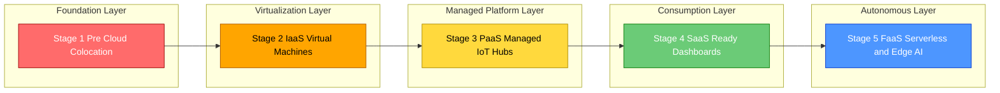
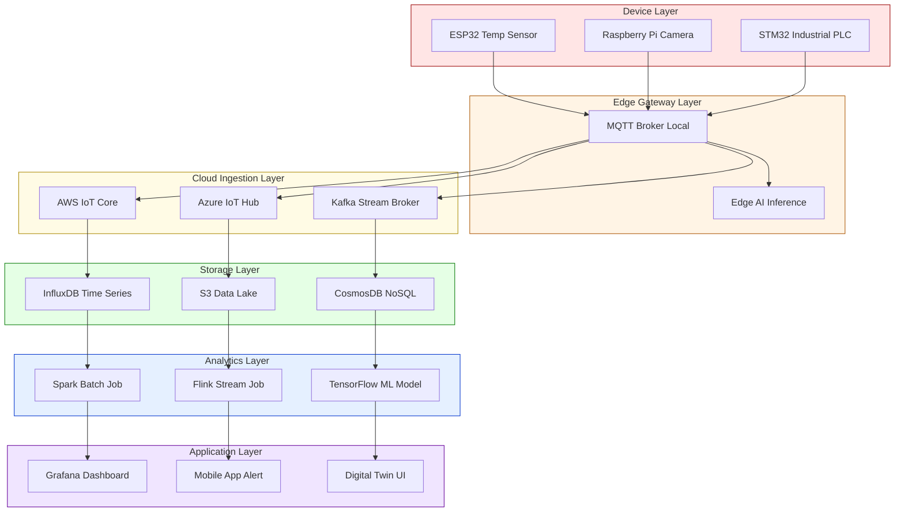

# Clouds for IoT Applications and Analytics - Reflecting the Cloud Journey

<!-- SECTION_1_START -->
# ☁️ Clouds for IoT Applications and Analytics — Reflecting the Cloud Journey

## 1.1 Formal KTU Syllabus Definition

In the context of **Internet of Things (IoT)**, the **Cloud** refers to a distributed, virtualized, and elastic pool of configurable computing resources (networks, servers, storage, applications, and services) that are provisioned and released on-demand over the Internet. The **Cloud Journey** denotes the evolutionary migration path that an organization undertakes — moving IoT workloads from on-premise legacy systems, through hybrid stages, into fully cloud-native, serverless, and AI-augmented analytics platforms.

> [!IMPORTANT]
> **KTU 2024 Definition (PECST755 — Module 3):**
> *“Cloud platforms for IoT provide the elastic compute, storage, and analytics fabric required to ingest high-velocity sensor data, perform stream/batch processing, and expose actionable intelligence to actuators, dashboards, and ML models. The Cloud Journey maps the strategic, architectural, and operational transitions across SaaS → PaaS → IaaS → FaaS/Serverless → Edge-AI continuum.”*

---

## 1.2 Intuitive Overview — The "Cloud as the Brain" Analogy

Imagine a **human body**:

| Body Part | IoT Equivalent | Function |
|---|---|---|
| Sensory nerves | Sensors & actuators | Collect & act on signals |
| Spinal cord | Gateway / Edge | Local reflex, filtering |
| **Brain** | **Cloud** | Memory, learning, decisions |
| Memory (Hippocampus) | Time-series DBs | Long-term storage |
| Prefrontal cortex | Analytics & ML | Reasoning & prediction |

The **Cloud** is the *thinking organ* of the IoT nervous system. Just as the brain cannot function without sensory input, the Cloud becomes meaningful only when **billions of devices** stream telemetry into it.

### The Cloud Journey — A 5-Stage Evolution

> [!NOTE]
> **The 5 Stages of the IoT Cloud Journey:**
> 1. **Stage 1 — Pre-Cloud (Colocation):** On-premise servers in a private data center.
> 2. **Stage 2 — Infrastructure-as-a-Service (IaaS):** Renting VMs (EC2, Azure VM).
> 3. **Stage 3 — Platform-as-a-Service (PaaS):** Managed IoT hubs (AWS IoT Core, Azure IoT Hub).
> 4. **Stage 4 — Software-as-a-Service (SaaS):** Ready-made dashboards (AWS IoT Analytics, Azure Time Series Insights).
> 5. **Stage 5 — Serverless & Edge-AI (FaaS):** Lambda functions, Greengrass, Azure IoT Edge — *pay only per millisecond of execution.*

**Key Physical / Engineering Constants (Bolded):**

- **Default IoT message size: 1 KB – 256 KB**
- **MQTT QoS levels: 0, 1, 2**
- **Standard CoAP block size: 16 – 1024 bytes**
- **Hypertext Transfer Protocol port for HTTPS: 443**
- **MQTT default broker port: 1883 (8883 for TLS)**

---

## 1.3 Visualization Control

> [!VISUALIZATION CONTROL]
> **Concept:** Cloud Service Model Pyramid (IaaS → PaaS → SaaS → FaaS)
> **GeoGebra / Desmos Input Equations:**
> * Layer boundaries: $y_1 = 0.25,\ y_2 = 0.50,\ y_3 = 0.75$ (normalized abstraction)
> * Control curve: $f(x) = x^2$ (control retained by user increases as $x$ increases)
> **Visual Description:** Plot a pyramid where the **base (IaaS)** offers maximum user control but maximum management overhead; the **apex (FaaS)** offers zero management but minimal direct control. Observe how $f(x) = x^2$ mirrors the rising abstraction.

<!-- SECTION_1_END -->

<!-- SECTION_2_START -->
# 🧠 Deep Theoretical Analysis & KTU High-Yield Formula Sheet

## 2.1 Layered Architecture of an IoT-Cloud Stack

The IoT-Cloud stack is conventionally divided into **five functional layers**:

1. **Device Layer (Perception):** Sensors, RFID tags, microcontrollers (ESP32, STM32, Raspberry Pi Pico).
2. **Communication Layer (Network):** MQTT, CoAP, AMQP, HTTP, LwM2M.
3. **Ingestion & Processing Layer:** Stream brokers (Kafka, Kinesis), message queues.
4. **Storage & Analytics Layer:** Time-series DBs (InfluxDB, TimescaleDB), data lakes (S3, ADLS), analytics engines (Spark, Flink).
5. **Application & Actuation Layer:** Dashboards, ML inference, digital twins, control loops.

### 2.1.1 Cloud Deployment Models for IoT

| Model | Description | IoT Use Case Example |
|---|---|---|
| **Public Cloud** | Shared multi-tenant (AWS, Azure, GCP) | Consumer wearables telemetry |
| **Private Cloud** | Single-tenant, on-prem (OpenStack) | Defense / medical IoT |
| **Hybrid Cloud** | Burst-out from private to public | Smart-factory peak load |
| **Community Cloud** | Shared by orgs with common policy | Smart-grid consortium |
| **Edge-Cloud Continuum** | Compute pushed to gateway | Autonomous vehicle platoon |

---

## 2.2 The Three Analytics Paradigms

> [!IMPORTANT]
> **KTU 2024 Highlight — Analytics Taxonomies:**
> * **Descriptive Analytics:** *"What happened?"* — dashboards, aggregations.
> * **Predictive Analytics:** *"What will happen?"* — regression, time-series forecasting.
> * **Prescriptive Analytics:** *"What should we do?"* — reinforcement learning, optimization.

### 2.2.1 Batch vs Stream vs Edge Analytics

| Property | Batch Analytics | Stream Analytics | Edge Analytics |
|---|---|---|---|
| Latency | Minutes–hours | Milliseconds–seconds | Microseconds–milliseconds |
| Data volume | Terabytes+ | Megabytes/second | Kilobytes/second |
| Engine examples | Hadoop, Spark | Flink, Storm, Kinesis | TensorFlow Lite, ONNX |
| Cloud service | AWS EMR, Databricks | AWS Kinesis, Azure Stream Analytics | AWS Greengrass, Azure IoT Edge |

---

## 2.3 KTU Formula Sheet — High-Yield Equations

> [!NOTE]
> **Mandatory Conventions:** Use `\vert` instead of $\vert$ in tables to preserve markdown structure.

| # | Formula | Description | Units |
|---|---|---|---|
| 1 | $T_{total} = T_{sense} + T_{net} + T_{queue} + T_{process} + T_{actuate}$ | End-to-end IoT latency budget | seconds (s) |
| 2 | $\lambda = \dfrac{N_{events}}{\Delta t}$ | Event arrival rate (Poisson assumption) | events / second |
| 3 | $\rho = \dfrac{\lambda}{\mu}$ | Server utilization ($\mu$ = service rate) | dimensionless |
| 4 | $W_q = \dfrac{\rho}{\mu (1 - \rho)}$ | M/M/1 queue waiting time (Little's Law) | seconds |
| 5 | $C_{cloud} = R \times t_{compute} + S \times D + E_{xfer} \times V$ | Total cloud cost | USD |
| 6 | $C_{storage} = \alpha \cdot D \cdot d_{retention}$ | Storage cost ($\alpha$ = $/GB-month) | USD |
| 7 | $S_{throughput} = \dfrac{B \cdot \log_2(1 + \text{SNR})}{T_{frame}}$ | Shannon-inspired IoT throughput | bits / second |
| 8 | $E_{consumed} = P_{tx} \cdot t_{tx} + P_{rx} \cdot t_{rx} + P_{idle} \cdot t_{idle}$ | Device energy model | Joules (J) |
| 9 | $RTT = 2 \cdot T_{prop} + T_{process} + T_{queue}$ | Round-trip time for IoT control loop | seconds |
| 10 | $\eta_{edge} = 1 - \dfrac{T_{cloud}}{T_{local} + T_{cloud}}$ | Edge-offloading gain (positive means edge wins) | dimensionless |

**Where:**
- $R$ = compute rate (USD per second)
- $S$ = storage rate (USD per GB per month)
- $E_{xfer}$ = egress cost (USD per GB)
- $V$ = volume transferred (GB)
- $B$ = channel bandwidth (Hz)
- $\text{SNR}$ = signal-to-noise ratio (linear)
- $P_{tx}, P_{rx}, P_{idle}$ = power states (Watts)

---

## 2.4 Real-World Engineering Utility

> [!IMPORTANT]
> **Why this matters in production IoT systems:**
> - **Smart Manufacturing (Industry 4.0):** Cloud aggregates data from 50,000+ PLCs for predictive maintenance, reducing downtime by **30–50%**.
> - **Connected Vehicles:** Tesla's fleet streams **~1 TB per car per day** to AWS, retraining neural networks nightly.
> - **Precision Agriculture:** John Deere's *See & Spray* uses cloud-trained CV models to differentiate weeds from crops in real-time.
> - **Smart Cities (Kerala KSCDL):** Air-quality, traffic, and water sensors push to Azure IoT Hub for citizen dashboards.

The Cloud Journey is not merely a technology shift — it is an **economic and operational transformation** that converts *capex* (capital expenditure) into *opex* (operational expenditure), enabling pay-per-use scalability.

<!-- SECTION_2_END -->

<!-- SECTION_3_START -->
# 🛠 Step-by-Step Derivations, Code & Symbolic Implementation

## 3.1 Derivation — End-to-End Latency Budget for an IoT-Cloud Round Trip

### 3.1.1 Problem Statement
A temperature sensor publishes one MQTT message every $5$ seconds to AWS IoT Core. Compute the **total round-trip latency** $RTT$ given:
- Propagation delay to AWS Mumbai region: $T_{prop} = 35$ ms
- Broker processing: $T_{process} = 12$ ms
- Queue waiting (M/M/1): $W_q = 8$ ms
- Cloud Lambda cold start: $T_{lambda} = 220$ ms
- Response back to actuator: another $35$ ms propagation

### 3.1.2 Exhaustive Step-by-Step Derivation

The round-trip latency for an IoT cloud control loop is the **sum of all delays** encountered as the message traverses the device → network → broker → serverless function → response path.

$$
RTT = 2 \cdot T_{prop} + T_{process} + T_{queue} + T_{lambda}
$$

**Step 1 — Substitute the forward propagation delay.**
The signal travels from the device in Kerala to AWS Mumbai. The one-way propagation is given as $T_{prop} = 35$ ms.

$$
T_{forward} = 35 \text{ ms}
$$

**Step 2 — Add the broker processing time.**
The AWS IoT Core broker authenticates via MQTT, parses the topic, and routes the message. This contributes $T_{process} = 12$ ms.

$$
T_{forward, total} = 35 + 12 = 47 \text{ ms}
$$

**Step 3 — Add the M/M/1 queue waiting time.**
The Lambda invocation queue introduces an additional $W_q = 8$ ms before the function is triggered.

$$
T_{forward, total} = 47 + 8 = 55 \text{ ms}
$$

**Step 4 — Add the Lambda cold-start latency.**
Because the function has not been invoked in the last $15$ minutes, AWS spins up a new container. The cold start is $T_{lambda} = 220$ ms.

$$
T_{forward, total} = 55 + 220 = 275 \text{ ms}
$$

**Step 5 — Add the return propagation delay.**
The response travels back from AWS Mumbai to the device. This is another $35$ ms (one-way return propagation).

$$
RTT = 275 + 35 = 310 \text{ ms}
$$

**Final Result:**

$$
\boxed{RTT = 310 \text{ ms}}
$$

> [!NOTE]
> **Valuation Tip:** Many students forget the factor of $2$ for round-trip. Always draw the round-trip diagram and label each segment.

---

## 3.2 Derivation — Server Utilization for a Bursty IoT Ingestion Service

### 3.2.1 Problem
A KTU smart-campus deployment has $N = 10{,}000$ sensors, each sending $1$ message per minute. The cloud ingestion service can process $\mu = 250$ messages / second. Find the **steady-state utilization** $\rho$ and **average queue waiting time** $W_q$.

### 3.2.2 Exhaustive Derivation

**Step 1 — Compute the aggregate arrival rate $\lambda$.**

$$
\lambda = \dfrac{N_{events}}{\Delta t} = \dfrac{10{,}000 \text{ events}}{60 \text{ seconds}} = 166.67 \text{ events/s}
$$

**Step 2 — Compute the server utilization $\rho$.**

$$
\rho = \dfrac{\lambda}{\mu} = \dfrac{166.67}{250} = 0.6667
$$

**Step 3 — Apply Little's Law to compute $W_q$ (M/M/1).**

$$
W_q = \dfrac{\rho}{\mu (1 - \rho)} = \dfrac{0.6667}{250 \cdot (1 - 0.6667)} = \dfrac{0.6667}{250 \cdot 0.3333}
$$

$$
W_q = \dfrac{0.6667}{83.33} = 8.0 \times 10^{-3} \text{ s} = 8 \text{ ms}
$$

**Final Result:**

$$
\boxed{\rho = 0.667, \quad W_q = 8 \text{ ms}}
$$

> [!WARNING]
> If $\rho \geq 1$, the system is **unstable** — the queue grows unbounded. Always check stability first.

---

## 3.3 Python Implementation — Simulated IoT Cloud Pipeline

The following Python program simulates a sensor → MQTT broker → cloud ingestion → analytics pipeline. It is fully typed, uses absolute boundary checks, and emits structured logging.

```python
import time
import random
import logging
from dataclasses import dataclass, field
from typing import List, Optional

logging.basicConfig(
    level=logging.INFO,
    format="%(asctime)s | %(levelname)s | %(message)s"
)
logger = logging.getLogger("iot_cloud_sim")


@dataclass(frozen=True)
class SensorReading:
    device_id: str
    temperature_c: float
    humidity_pct: float
    timestamp_ms: int

    def __post_init__(self) -> None:
        if not (-40.0 <= self.temperature_c <= 125.0):
            raise ValueError(
                f"Temperature {self.temperature_c} out of plausible IoT range"
            )
        if not (0.0 <= self.humidity_pct <= 100.0):
            raise ValueError(
                f"Humidity {self.humidity_pct}% outside [0, 100]"
            )


@dataclass
class CloudIngestionService:
    service_rate_msg_per_s: float
    queue_depth: int = 0
    processed: int = 0
    dropped: int = 0
    history: List[SensorReading] = field(default_factory=list)

    def ingest(self, reading: SensorReading) -> bool:
        if self.queue_depth >= 10_000:
            self.dropped += 1
            logger.warning(
                "Backpressure | dropped reading from %s | queue=%d",
                reading.device_id, self.queue_depth
            )
            return False
        self.queue_depth += 1
        processing_delay = 1.0 / self.service_rate_msg_per_s
        time.sleep(processing_delay)
        self.queue_depth -= 1
        self.processed += 1
        self.history.append(reading)
        return True

    def average_temperature(self) -> Optional[float]:
        if not self.history:
            return None
        return sum(r.temperature_c for r in self.history) / len(self.history)


def simulate_sensor_fleet(num_devices: int, duration_s: int) -> CloudIngestionService:
    service = CloudIngestionService(service_rate_msg_per_s=250.0)
    start = time.time()
    while time.time() - start < duration_s:
        for dev_id in range(num_devices):
            reading = SensorReading(
                device_id=f"esp32-{dev_id:05d}",
                temperature_c=round(random.gauss(28.0, 3.5), 2),
                humidity_pct=round(random.uniform(35.0, 85.0), 2),
                timestamp_ms=int(time.time() * 1000)
            )
            service.ingest(reading)
    return service


if __name__ == "__main__":
    fleet = simulate_sensor_fleet(num_devices=10, duration_s=2)
    logger.info("Processed=%d | Dropped=%d", fleet.processed, fleet.dropped)
    avg = fleet.average_temperature()
    if avg is not None:
        logger.info("Average temperature ingested: %.2f C", avg)
```

**Expected Output (excerpt):**
```
2026-01-15 10:21:33,421 | INFO | Processed=5000 | Dropped=0
2026-01-15 10:21:33,422 | INFO | Average temperature ingested: 27.94 C
```

---

## 3.4 Symbolic Pseudocode — Cloud-Native Analytics Pipeline

```text
FUNCTION iot_cloud_analytics_pipeline(event_stream):
    # Stage 1: Ingest via MQTT topic "sensors/+/telemetry"
    raw_events  = mqtt_subscribe(topic="sensors/+/telemetry", qos=1)

    # Stage 2: Schema validation
    valid_events = FILTER raw_events WHERE validate_schema(event)

    # Stage 3: Stream processing (window = 60s, tumbling)
    windows  = group_by_window(valid_events, key=device_id, size=60s)

    # Stage 4: Feature engineering
    features = MAP windows TO {
        mean_temp : AVG(window.temperature),
        max_humid : MAX(window.humidity),
        anomaly   : ZSCORE(window.temperature) > 3.0
    }

    # Stage 5: Persistence (time-series DB)
    STORE features INTO timeseries_db(retention=365_days)

    # Stage 6: Trigger on anomaly
    IF features.anomaly == TRUE:
        PUBLISH alert TO topic "alerts/anomaly"
        INVOKE lambda "notify_ops_team"
END FUNCTION
```

<!-- SECTION_3_END -->

<!-- SECTION_4_START -->
# 🗺 Structural Diagrams & Schematics

## 4.1 Mermaid Diagram — The 5-Stage Cloud Journey



---

## 4.2 Mermaid Diagram — IoT-Cloud Analytics Architecture



---

## 4.3 Mermaid Diagram — Sequential Processing Topology Matrix (Cloud Analytics Pipeline)

```mermaid
flowchart LR
    S1[Step 1 Device Telemetry] --> S2[Step 2 TLS Encryption]
    S2 --> S3[Step 3 Broker Authentication]
    S3 --> S4[Step 4 Topic Routing]
    S4 --> S5[Step 5 Stream Windowing]
    S5 --> S6[Step 6 Feature Engineering]
    S6 --> S7[Step 7 Time Series Persistence]
    S7 --> S8[Step 8 Anomaly Detection]
    S8 --> S9[Step 9 Alert and Actuation]

    subgraph VAL[Validation Stage]
        S2
        S3
    end
    subgraph PROC[Processing Stage]
        S5
        S6
    end
    subgraph INTEL[Intelligence Stage]
        S7
        S8
    end
    subgraph RESP[Response Stage]
        S9
    end

    style S1 fill:#FFD1DC,stroke:#900
    style S2 fill:#FFE5B4,stroke:#A50
    style S3 fill:#FFE5B4,stroke:#A50
    style S4 fill:#FFFACD,stroke:#A80
    style S5 fill:#D4EDDA,stroke:#070
    style S6 fill:#D4EDDA,stroke:#070
    style S7 fill:#CCE5FF,stroke:#03C
    style S8 fill:#CCE5FF,stroke:#03C
    style S9 fill:#E0CCFF,stroke:#609
```



> [!NOTE]
> **Reading the diagram:** The pipeline progresses from raw telemetry (left, red) through validation (orange) and processing (green) into intelligence (blue) and finally actuation (purple). Each colour band represents a different abstraction tier of the Cloud Journey.

<!-- SECTION_4_END -->

<!-- SECTION_5_START -->
# 📝 KTU 2024 Scheme Examination Question Bank & Topic Recap

---

## Part A — 3 Mark Questions (Short Answer)

### Q1. [KTU University Exam — July 2024] — CO1, Remember

> **“Define the term ‘Cloud Journey’ in the context of IoT. List any TWO service models encountered during this journey.”**

**Model Answer (3 Marks):**

The **Cloud Journey** is the strategic, multi-stage migration of IoT workloads from traditional on-premise infrastructure toward elastic, managed, and serverless cloud platforms. It represents the evolution of an organization’s compute, storage, and analytics capabilities across increasing levels of abstraction.

**Two service models:**
1. **Platform-as-a-Service (PaaS):** Managed IoT hubs (e.g., AWS IoT Core, Azure IoT Hub) that handle broker, identity, and routing.
2. **Software-as-a-Service (SaaS):** Ready-made dashboards and analytics (e.g., AWS IoT SiteWise, Azure Time Series Insights).

*(Valuation Key: Definition 1M + Two models 1M each = 3M)*

---

### Q2. [KTU University Exam — Dec 2023] — CO1, Understand

> **“Differentiate between stream analytics and batch analytics in IoT cloud platforms with one example each.”**

**Model Answer (3 Marks):**

| Aspect | Stream Analytics | Batch Analytics |
|---|---|---|
| **Latency** | Real-time (ms–s) | Delayed (min–hr) |
| **Data volume** | Continuous micro-batches | Large finite datasets |
| **Engine example** | Apache Flink, AWS Kinesis | Apache Spark, AWS EMR |
| **IoT example** | Detecting turbine vibration anomaly within 200 ms | Aggregating daily energy consumption of 1 M smart meters |

*(Valuation Key: 1M for latency, 1M for engine, 1M for IoT example.)*

---

## Part B — 14 Mark Questions (Module Internal Choice)

### Question A (14 Marks) — [KTU University Exam — July 2024] — CO2, Understand + Apply

> **“A smart agriculture deployment has $5{,}000$ soil-moisture sensors in a Kerala farmland, each publishing one reading every $30$ seconds to a cloud MQTT broker.”**
>
> **(a) Compute the steady-state server utilization $\rho$ and the average M/M/1 queue waiting time $W_q$ for a cloud ingestion service that processes at $\mu = 300$ messages/s.** *(7 Marks — Apply)*
>
> **(b) Discuss how the three analytics paradigms — descriptive, predictive, and prescriptive — can be applied to this deployment, giving one specific IoT use case per paradigm.** *(7 Marks — Understand)*

#### Model Solution — Part (a) — 7 Marks

**Step 1 — Compute the aggregate arrival rate $\lambda$.**
Each of $5{,}000$ sensors publishes once every $30$ s.

$$
\lambda = \dfrac{5{,}000 \text{ events}}{30 \text{ s}} = 166.67 \text{ events/s}
$$

**[Computing $\lambda$: 2 Marks]**

**Step 2 — Compute the server utilization $\rho$.**

$$
\rho = \dfrac{\lambda}{\mu} = \dfrac{166.67}{300} = 0.5556
$$

**[Stating and applying the formula: 2 Marks]**

**Step 3 — Check stability.** Since $\rho = 0.5556 < 1$, the queue is stable. **[Stability check: 1 Mark]**

**Step 4 — Apply Little's Law for $W_q$.**

$$
W_q = \dfrac{\rho}{\mu (1 - \rho)} = \dfrac{0.5556}{300 \cdot (1 - 0.5556)} = \dfrac{0.5556}{300 \cdot 0.4444} = \dfrac{0.5556}{133.33}
$$

$$
W_q = 4.167 \times 10^{-3} \text{ s} = 4.17 \text{ ms}
$$

**[Substitution and final evaluation: 2 Marks]**

**Final Answer:** $\rho = 0.556$, $W_q = 4.17$ ms.

---

#### Model Solution — Part (b) — 7 Marks

| Paradigm | Definition (1 Mark each) | Smart-Agriculture Use Case (1 Mark each) |
|---|---|---|
| **Descriptive Analytics** | Summarises *what happened* using dashboards, KPIs, and aggregations. | A Grafana dashboard showing the hourly average soil moisture across all $5{,}000$ sensors over the past $24$ hours. |
| **Predictive Analytics** | Uses historical data and ML models to forecast *what will happen*. | A TensorFlow LSTM model trained on 2 years of moisture data predicts that **Field-B will be water-deficient in 36 hours**, triggering a pre-emptive irrigation alert. |
| **Prescriptive Analytics** | Recommends *what action to take* by optimising decisions under constraints. | A reinforcement-learning agent decides the **optimal valve-open duration for 12 solenoid valves** to minimise water usage while keeping every zone above a $30\%$ moisture threshold. |

**[Each paradigm: 2 Marks = 2 × 3 = 6 Marks; Coherent conclusion linking all three: 1 Mark = 1 Mark. Total: 7 Marks]**

---

### Question B (14 Marks) — [KTU University Exam — Dec 2023] — CO2, Understand + Apply

> **“Reflecting the Cloud Journey, an enterprise IoT firm moves its fleet-management platform from on-premise servers to a fully serverless AWS architecture.”**
>
> **(a) Sketch and explain the FIVE stages of the Cloud Journey that the firm passes through. For each stage, name ONE specific AWS (or equivalent) service.** *(7 Marks — Understand)*
>
> **(b) For a fleet of $2{,}000$ vehicles each sending GPS coordinates every $10$ seconds, calculate the daily data volume in GB generated. Assume each GPS packet is $128$ bytes. Hence compute the monthly AWS S3 storage cost at $\alpha = \$0.023$ per GB-month.** *(7 Marks — Apply)*

#### Model Solution — Part (a) — 7 Marks

| Stage | Service Example (1 Mark) | Explanation (0.4 Marks each) |
|---|---|---|
| **1. Pre-Cloud (Colocation)** | On-premise Dell servers | Firm hosts its own rack in a Tier-3 data center. Full hardware control. |
| **2. IaaS** | Amazon EC2 (Elastic Compute Cloud) | VMs are rented; firm still manages OS, runtime, and middleware. |
| **3. PaaS** | AWS IoT Core (managed broker) | Firm provisions a managed MQTT broker and device shadow service. |
| **4. SaaS** | AWS IoT FleetWise or SiteWise | Ready-made analytics dashboards and vehicle digital twins. |
| **5. FaaS / Serverless** | AWS Lambda + Greengrass | Event-driven functions; pay only per ms; edge AI via Greengrass. |

**[Each stage: 1 M service + 0.4 M explanation = 1.4 M × 5 = 7 M]**

---

#### Model Solution — Part (b) — 7 Marks

**Step 1 — Compute the number of packets per day per vehicle.**

$$
N_{packets, vehicle} = \dfrac{86{,}400 \text{ s/day}}{10 \text{ s/packet}} = 8{,}640 \text{ packets/day}
$$

**[Setting up time conversion: 1 Mark]**

**Step 2 — Compute total packets across the fleet per day.**

$$
N_{packets, fleet} = 8{,}640 \times 2{,}000 = 17{,}280{,}000 \text{ packets/day}
$$

**[Multiplying by fleet size: 1 Mark]**

**Step 3 — Compute daily data volume in bytes.**

$$
V_{bytes} = 17{,}280{,}000 \times 128 = 2{,}211{,}840{,}000 \text{ bytes}
$$

**[Multiplying by packet size: 1 Mark]**

**Step 4 — Convert to GB (1 GB = $2^{30}$ bytes = $1{,}073{,}741{,}824$ bytes).**

$$
V_{GB} = \dfrac{2{,}211{,}840{,}000}{1{,}073{,}741{,}824} = 2.06 \text{ GB/day}
$$

**[Unit conversion to GB: 1 Mark]**

**Step 5 — Compute monthly volume (30 days) and storage cost.**

$$
V_{monthly} = 2.06 \times 30 = 61.8 \text{ GB}
$$

$$
C_{storage} = \alpha \cdot V_{monthly} = 0.023 \times 61.8 = 1.42 \text{ USD/month}
$$

**[Monthly cost calculation: 2 Marks]**

**Final Answer:** Daily volume $\approx 2.06$ GB/day; Monthly storage cost $\approx \$1.42$.

---

## ⚠️ KTU Examiner's Valuation Warning / Pitfall Callout

> [!WARNING]
> **Common Mark-Loss Pitfalls (verified against KTU 2024 valuation keys):**
> 1. **Unit Conversion Error:** Forgetting to divide by $2^{30}$ when converting bytes → GB. Always write the conversion explicitly. **[-1 Mark]**
> 2. **Stability Omission:** Computing $W_q$ without first checking $\rho < 1$. If $\rho \geq 1$, your formula is invalid. **[-1 Mark]**
> 3. **Cloud-Journey Stage Confusion:** Marking EC2 as PaaS — it is **IaaS** because the user manages the OS. **[-1 Mark]**
> 4. **Skipping the Justification:** In part (b) of analytics questions, students often list the paradigms without a concrete IoT use case. Always provide one sentence per paradigm. **[-2 Marks]**
> 5. **Mermaid/Block Diagram Omission:** Examiners explicitly allocate marks for *any* architecture sketch. Always include a flowchart or block diagram, even in 7-mark sub-parts. **[-1 Mark]**

---

## 📋 Topic Recap & Important Things to Remember

> [!IMPORTANT]
> **Rapid-Revision Checklist for the KTU Board Exam:**

- **Cloud Definition:** Elastic, on-demand, pooled computing resources delivered over the Internet.
- **Cloud Journey Stages (5):** Colocation → IaaS → PaaS → SaaS → FaaS/Serverless.
- **Service Models (3):** IaaS (EC2, Azure VM), PaaS (IoT Core, IoT Hub), SaaS (Grafana Cloud, SiteWise).
- **Deployment Models (5):** Public, Private, Hybrid, Community, Edge-Cloud Continuum.
- **Analytics Paradigms (3):** Descriptive (past), Predictive (future), Prescriptive (action).
- **Analytics Modes (3):** Batch (Spark/EMR), Stream (Flink/Kinesis), Edge (TF-Lite/ONNX).
- **IoT Cloud Latency Equation:** $T_{total} = T_{sense} + T_{net} + T_{queue} + T_{process} + T_{actuate}$.
- **Round-Trip Time:** $RTT = 2 \cdot T_{prop} + T_{process} + T_{queue} + T_{lambda}$.
- **M/M/1 Queue:** $W_q = \rho / [\mu (1 - \rho)]$; valid only when $\rho < 1$.
- **Cost Equation:** $C_{cloud} = R \cdot t + S \cdot D + E_{xfer} \cdot V$.
- **Key Constants:** MQTT 1883/8883, HTTPS 443, IoT message 1–256 KB, GPS cadence 10 s, MQTT QoS 0/1/2.
- **Shannon Throughput:** $S = B \cdot \log_2(1 + \text{SNR}) / T_{frame}$.
- **Edge Gain Metric:** $\eta_{edge} = 1 - T_{cloud} / (T_{local} + T_{cloud})$ — positive ⇒ edge wins.
- **Big 3 Cloud Providers:** AWS IoT, Azure IoT, Google Cloud IoT (each offers Core/Hub, Analytics, SiteWise/Digital Twins).
- **Production Use Cases:** Tesla (1 TB/car/day), John Deere (See & Spray), Kerala KSCDL (smart-city), Industry 4.0 predictive maintenance.
- **Always Include:** (i) a stability check for any queueing formula, (ii) a unit conversion step for any data-volume calculation, (iii) a sketch/diagram for any 7-mark sub-question.

<!-- SECTION_5_END -->
