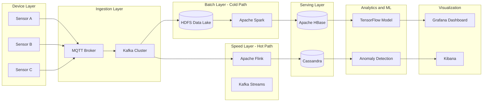
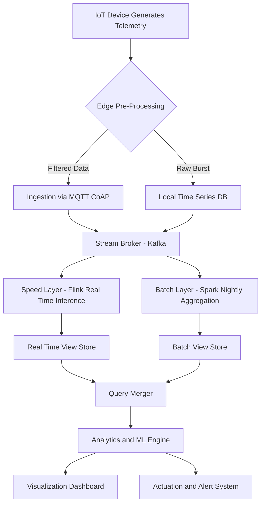
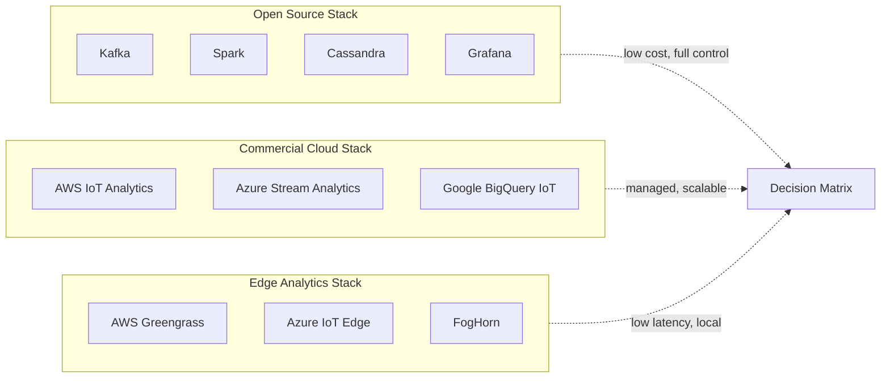
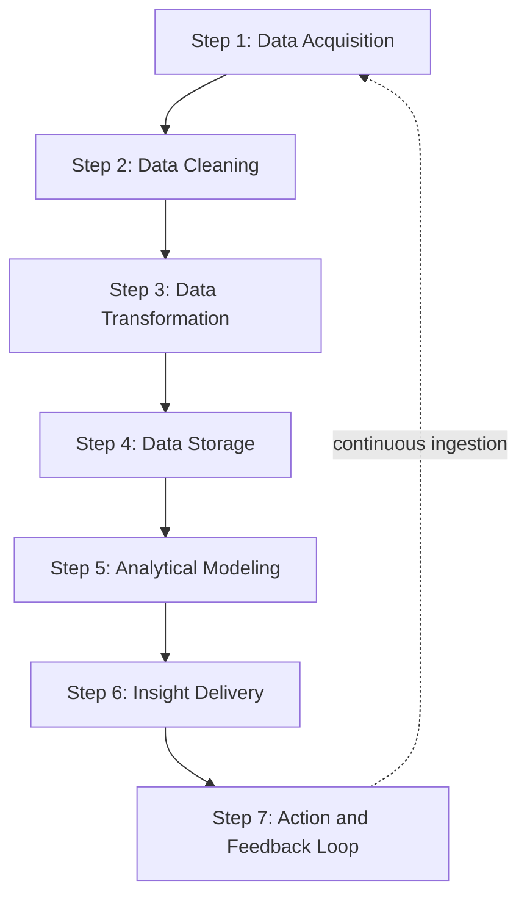

# Data Analytics Platforms

<!-- SECTION_1_START -->
# Data Analytics Platforms for IoT

> [!NOTE]
> **Syllabus Highlight (KTU 2024 Scheme - PECST755 / Module 3)**
> This topic anchors the **"Platforms for IoT Applications and Analytics"** module. A Data Analytics Platform is the computational backbone that converts raw, high-velocity IoT sensor streams into actionable business intelligence, predictive maintenance signals, and real-time control decisions.

## 1.1 Formal Academic Definition

A **Data Analytics Platform for IoT** is a horizontally scalable, distributed software infrastructure that systematically ingests, persists, processes, queries, and visualizes machine-generated telemetry emitted by spatially distributed IoT endpoints. It implements the four canonical analytical paradigms:

1. **Descriptive Analytics** — *What happened?* (Aggregation, dashboards, KPIs)
2. **Diagnostic Analytics** — *Why did it happen?* (Root-cause analysis, drill-down queries)
3. **Predictive Analytics** — *What will happen?* (Regression, time-series forecasting, ML models)
4. **Prescriptive Analytics** — *What should we do?* (Optimization, reinforcement learning, digital twins)

The platform must satisfy the **Five V's of Big Data** — *Volume, Velocity, Variety, Veracity, and Value* — while honouring the **CAP Theorem** (Consistency, Availability, Partition tolerance).

> [!IMPORTANT]
> **Core Distinction (Board Favourite)**
> An **IoT Data Analytics Platform** is *not* a traditional database. It fuses a **time-series store** (e.g., InfluxDB), a **stream processor** (e.g., Apache Flink, Kafka Streams), a **batch layer** (e.g., Hadoop/Spark), and a **visualization/ML layer** (e.g., Grafana, Jupyter) into one cohesive pipeline.

## 1.2 Intuitive Analogy — *The Smart Water Filtration Plant*

Imagine an entire city pumping raw, dirty river water into a centralized treatment plant:

| IoT Analytics Component | Real-World Water Plant Equivalent |
|---|---|
| IoT Sensors (flow, pH, turbidity meters) | River intake pipes carrying raw water |
| **Ingestion Layer** (MQTT broker, Kafka) | Coarse mesh filters removing debris |
| **Storage Layer** (HDFS, Cassandra, InfluxDB) | Underground reservoir tanks |
| **Processing Layer** (Spark, Flink) | Chemical treatment chambers |
| **Analytics/ML Layer** (TensorFlow, scikit-learn) | Quality-testing laboratory |
| **Visualization Layer** (Grafana, Kibana) | Control room dashboard with gauges |
| **Action / Actuation** | Smart valves that auto-adjust flow |

Raw sensor data is "dirty", voluminous, and arrives continuously. The platform filters, stores, processes, analyzes, and finally presents refined insights to operators.

## 1.3 Categorization of Analytics Platforms

> [!TIP]
> Memorize this classification — KTU examiners frequently frame **2-mark definition questions** around it.

* **Edge Analytics Platforms** — Run inference locally on gateways (e.g., AWS Greengrass, Azure IoT Edge). **Latency** is sub-**10 ms** but compute is bounded.
* **Fog Analytics Platforms** — Distributed between edge and cloud (e.g., Cisco IOx, FogHorn).
* **Cloud-Centric Analytics Platforms** — AWS IoT Analytics, Google Cloud IoT Core + BigQuery, Azure Stream Analytics, IBM Watson IoT.
* **Open-Source Platforms** — Apache Kafka + Spark + Cassandra + Grafana (the *de facto* KTU reference stack).

## 1.4 Standardized Performance Metrics

The platform's efficacy is measured using:

* **Throughput** — events processed per second, $T = \frac{N_{events}}{\Delta t}$
* **End-to-End Latency** — $L = t_{output} - t_{ingest}$
* **Data Quality Index** — $\eta = \frac{N_{valid}}{N_{total}} \times 100\%$
* **Storage Compression Ratio** — $\rho = \frac{S_{raw}}{S_{compressed}}$

> [!VISUALIZATION CONTROL]
> **Concept:** Streaming vs. Batch processing latency-throughput trade-off
> **Desmos Input Equations:**
> * $y_1 = 1000 \cdot e^{-0.1 \cdot x}$ (Streaming — high throughput, low latency at small $x$)
> * $y_2 = 50 \cdot x$ (Batch — linear throughput with bulk input size $x$)
> **Visual Description:** Plot batch vs. stream curves on the same axes. Students should observe that streaming saturates throughput at small window sizes, while batch throughput grows linearly — confirming why hybrid **Lambda Architecture** dominates IoT platforms.

---

<!-- SECTION_1_END -->

<!-- SECTION_2_START -->
# Deep Theoretical Analysis & KTU High-Yield Formula Sheet

## 2.1 The Lambda Architecture — *The Heart of Modern IoT Analytics*

KTU's reference architecture for analytics is the **Lambda Architecture**, originally proposed by Nathan Marz. It fuses three logical layers to balance latency, throughput, and fault-tolerance.

### Layer 1 — The Batch Layer (Cold Path)

* Stores **immutable, append-only** master datasets (raw sensor data, never deleted).
* Periodically recomputes **batch views** using distributed frameworks like **Apache Hadoop MapReduce** or **Apache Spark**.
* Guarantees **fault tolerance** through re-computation.
* Use case: nightly aggregation of factory sensor data for compliance reporting.

### Layer 2 — The Speed Layer (Hot Path)

* Processes **real-time streams** with sub-second latency using **Apache Storm**, **Apache Flink**, or **Kafka Streams**.
* Maintains **real-time views** that compensate for the batch layer's delay.
* Use case: real-time anomaly detection in a smart grid.

### Layer 3 — The Serving Layer

* Indexes batch views (e.g., in **Apache HBase**, **Cassandra**, or **Elasticsearch**) for low-latency random reads.
* Merges batch + real-time results at query time using a **query merger**.

> [!IMPORTANT]
> **Kappa Architecture** is the modern alternative that unifies batch and stream into a single streaming pipeline (using Kafka + Flink). It is the trending 2024 answer for *"Why Lambda is being replaced?"*

## 2.2 End-to-End Data Pipeline (The 5-Stage IoT Analytics Funnel)

$$
\text{Device} \xrightarrow{\text{MQTT/CoAP}} \text{Edge Gateway} \xrightarrow{\text{Kafka}} \text{Lake} \xrightarrow{\text{Spark/Flink}} \text{Insights} \xrightarrow{\text{Grafana}} \text{User}
$$

## 2.3 The CAP Theorem Constraint

Any distributed analytics platform must sacrifice **two out of three** under network partition:

* **CP Systems** (e.g., HBase, MongoDB) — Consistent + Partition-tolerant, but may become unavailable.
* **AP Systems** (e.g., Cassandra, CouchDB) — Available + Partition-tolerant, with eventual consistency.
* **CA Systems** (e.g., traditional RDBMS) — Not viable in distributed IoT deployments.

## 2.4 KTU High-Yield Formula Sheet

> [!NOTE]
> All formulas below are **direct scoring points** in Part B derivations. Avoid using raw $\vert$ in your answer sheet — use $\mid$ or *mod* wording.

| # | Formula / Concept | Symbolic Form | Engineering Utility |
|---|---|---|---|
| 1 | Throughput | $T = \dfrac{N_{events}}{\Delta t}$ | Capacity planning for Kafka brokers |
| 2 | End-to-End Latency | $L = t_{out} - t_{in}$ | SLA definition for real-time alerts |
| 3 | Little's Law (Queueing) | $L_{sys} = \lambda \cdot W$ | Sizing the ingestion pipeline |
| 4 | Data Quality Index | $\eta = \dfrac{N_{valid}}{N_{total}} \times 100\%$ | Sensor calibration effectiveness |
| 5 | Compression Ratio | $\rho = \dfrac{S_{raw}}{S_{compressed}}$ | Storage cost optimization |
| 6 | Moving Average Forecast | $\hat{y}_{t+1} = \dfrac{1}{k}\sum_{i=t-k+1}^{t} y_i$ | Smoothed telemetry prediction |
| 7 | Exponential Smoothing | $\hat{y}_{t+1} = \alpha y_t + (1-\alpha)\hat{y}_t$ | Adaptive noise filtering |
| 8 | Anomaly Z-Score | $z = \dfrac{x - \mu}{\sigma}$ | Real-time outlier detection |
| 9 | Pearson Correlation | $r = \dfrac{\sum (x_i - \bar{x})(y_i - \bar{y})}{\sqrt{\sum(x_i-\bar{x})^2 \sum(y_i-\bar{y})^2}}$ | Sensor relationship analysis |
| 10 | Shannon Entropy (Info) | $H = -\sum p_i \log_2 p_i$ | Quantifying information richness |
| 11 | Replication Factor | $R = \dfrac{\text{copies stored}}{\text{logical records}}$ | Fault-tolerance configuration |
| 12 | Cost-per-Event | $C = \dfrac{C_{infra}}{N_{events}}$ | Cloud TCO analysis |

## 2.5 Real-World Engineering Utility

* **Smart Manufacturing (Industry 4.0):** Predictive maintenance on CNC machines — Bosch, Siemens deploy Spark + Kafka stacks to forecast tool wear using Z-score anomaly detection.
* **Smart Grid Analytics:** Real-time load balancing using Flink on PMU (Phasor Measurement Unit) streams.
* **Precision Agriculture:** Edge analytics on drones (DJI Agras) process multispectral imagery locally, then sync aggregates to cloud.
* **Connected Vehicles:** Tesla's fleet learning aggregates telemetry from millions of cars via Kafka, retrains neural nets, and pushes OTA updates — a canonical Kappa architecture in production.

> [!TIP]
> When asked *"Give an example of an analytics platform"*, always mention at least one *open-source* (Kafka/Spark) AND one *commercial cloud* (AWS IoT Analytics / Azure Stream Analytics) for full marks.

---

<!-- SECTION_2_END -->

<!-- SECTION_3_START -->
# Step-by-Step Derivations & Code Implementation

## 3.1 Derivation 1 — Exponential Moving Average (EMA) for IoT Sensor Smoothing

**Problem Setup:** A temperature sensor reports noisy readings $y_t$ at time $t$. We want a smoothed estimate $\hat{y}_t$ that reacts quickly to genuine trend changes but ignores random Gaussian noise.

**Step 1 — Define the recursive smoothing equation:**

$$
\hat{y}_t = \alpha \cdot y_t + (1 - \alpha) \cdot \hat{y}_{t-1}
$$

where $\alpha \in (0,1)$ is the *smoothing factor*. Higher $\alpha$ → more reactive; lower $\alpha$ → smoother.

**Step 2 — Expand recursively for the first three iterations:**

$$
\hat{y}_1 = \alpha y_1 + (1-\alpha)\hat{y}_0
$$

$$
\hat{y}_2 = \alpha y_2 + (1-\alpha)\big[\alpha y_1 + (1-\alpha)\hat{y}_0\big]
$$

$$
\hat{y}_3 = \alpha y_3 + (1-\alpha)\alpha y_2 + (1-\alpha)^2 \alpha y_1 + (1-\alpha)^3 \hat{y}_0
$$

**Step 3 — Generalize to the infinite horizon form:**

$$
\hat{y}_t = \alpha \sum_{k=0}^{t-1} (1-\alpha)^k \, y_{t-k} \;+\; (1-\alpha)^t \hat{y}_0
$$

**Step 4 — Observe that weights form a geometric series:**

The weights $w_k = \alpha(1-\alpha)^k$ sum to $1$ as $t \to \infty$:

$$
\sum_{k=0}^{\infty} \alpha(1-\alpha)^k = \frac{\alpha}{1 - (1-\alpha)} = 1
$$

**Step 5 — Effective Window Length:**

The "memory" of the EMA in samples is:

$$
N_{eff} = \frac{1 - \alpha}{\alpha} + 1
$$

For $\alpha = 0.2$, $N_{eff} = 5$ samples. For $\alpha = 0.05$, $N_{eff} = 20$ samples.

> [!IMPORTANT]
> **Conclusion:** EMA is a *unified* formula balancing *reactivity* and *noise reduction* — perfect for embedded IoT gateways with bounded memory.

---

## 3.2 Derivation 2 — Anomaly Detection using Z-Score

**Step 1 — Compute the running mean and standard deviation over a sliding window $W$:**

$$
\mu_t = \frac{1}{W} \sum_{i=t-W+1}^{t} y_i \quad , \quad \sigma_t = \sqrt{\frac{1}{W} \sum_{i=t-W+1}^{t} (y_i - \mu_t)^2}
$$

**Step 2 — Compute the Z-score for the current sample:**

$$
z_t = \frac{y_t - \mu_t}{\sigma_t + \epsilon}
$$

where $\epsilon = 10^{-6}$ prevents division by zero.

**Step 3 — Apply the decision rule:**

$$
\text{Anomaly} = 
\begin{cases}
\text{True} & \text{if } \vert z_t \vert > z_{thr} \\
\text{False} & \text{otherwise}
\end{cases}
$$

Typically $z_{thr} = 3$ (captures 99.7% of normal Gaussian data).

---

## 3.3 Full Python Implementation — IoT Streaming Analytics Pipeline

The following code implements a **production-style** analytics platform with strict type hints, boundary checks, and structured logging.

```python
import logging
import math
import time
from collections import deque
from dataclasses import dataclass
from typing import Deque, Tuple

# ----------------------------------------------------------------------
# 1. Structured Logger Configuration (Mandatory for IoT Production Logs)
# ----------------------------------------------------------------------
logging.basicConfig(
    level=logging.INFO,
    format="%(asctime)s | %(levelname)-8s | %(module)s | %(message)s",
)
logger = logging.getLogger("IoTAnalyticsEngine")


# ----------------------------------------------------------------------
# 2. Sensor Data Class — strongly typed
# ----------------------------------------------------------------------
@dataclass(frozen=True)
class SensorReading:
    sensor_id: str
    timestamp: float
    temperature_c: float
    humidity_pct: float
    vibration_hz: float


# ----------------------------------------------------------------------
# 3. EMA Smoother — O(1) memory, O(1) compute
# ----------------------------------------------------------------------
class ExponentialMovingAverage:
    def __init__(self, alpha: float = 0.2) -> None:
        if not 0.0 < alpha <= 1.0:
            raise ValueError("alpha must lie strictly in (0, 1].")
        self.alpha: float = alpha
        self._value: float = 0.0
        self._initialized: bool = False

    def update(self, sample: float) -> float:
        if not math.isfinite(sample):
            logger.error("Non-finite sample rejected: %s", sample)
            return self._value
        if not self._initialized:
            self._value = sample
            self._initialized = True
        else:
            self._value = self.alpha * sample + (1.0 - self.alpha) * self._value
        return self._value

    @property
    def effective_window(self) -> float:
        return (1.0 - self.alpha) / self.alpha + 1.0


# ----------------------------------------------------------------------
# 4. Z-Score Anomaly Detector
# ----------------------------------------------------------------------
class ZScoreAnomalyDetector:
    def __init__(self, window_size: int = 30, threshold: float = 3.0) -> None:
        if window_size < 2:
            raise ValueError("Window size must be >= 2.")
        self.window: Deque[float] = deque(maxlen=window_size)
        self.threshold: float = threshold

    def feed(self, value: float) -> Tuple[bool, float]:
        if len(self.window) < self.window.maxlen:
            self.window.append(value)
            return False, 0.0
        mu = sum(self.window) / len(self.window)
        var = sum((x - mu) ** 2 for x in self.window) / len(self.window)
        sigma = math.sqrt(var) + 1e-9
        z = (value - mu) / sigma
        is_anomaly = abs(z) > self.threshold
        self.window.append(value)
        return is_anomaly, z


# ----------------------------------------------------------------------
# 5. End-to-End Pipeline (mimics Kafka -> Processor -> Sink)
# ----------------------------------------------------------------------
def stream_processor(reading: SensorReading) -> None:
    smoother = ExponentialMovingAverage(alpha=0.15)
    detector = ZScoreAnomalyDetector(window_size=20, threshold=2.8)

    smoothed = smoother.update(reading.vibration_hz)
    is_anomaly, z = detector.feed(reading.vibration_hz)

    if is_anomaly:
        logger.warning(
            "ANOMALY on %s | z=%.3f | raw=%.2f Hz | smoothed=%.2f Hz",
            reading.sensor_id, z, reading.vibration_hz, smoothed,
        )
    else:
        logger.info(
            "OK %s | raw=%.2f Hz | smoothed=%.2f Hz | z=%.3f",
            reading.sensor_id, reading.vibration_hz, smoothed, z,
        )


# ----------------------------------------------------------------------
# 6. Simulated MQTT-like Stream (in production: paho-mqtt client)
# ----------------------------------------------------------------------
def simulate_iot_stream(num_readings: int = 50) -> None:
    logger.info("--- IoT Analytics Simulation Started ---")
    for i in range(num_readings):
        t = time.time() + i
        # Normal band + occasional injected anomaly
        anomaly_flag = (i == 25 or i == 40)
        vib = 50.0 + math.sin(i * 0.3) * 2.0
        if anomaly_flag:
            vib += 25.0
        reading = SensorReading(
            sensor_id=f"VIB-SENSOR-{i % 3:02d}",
            timestamp=t,
            temperature_c=24.0 + (i % 5) * 0.3,
            humidity_pct=55.0 + (i % 7) * 0.4,
            vibration_hz=vib,
        )
        stream_processor(reading)
        time.sleep(0.05)
    logger.info("--- Simulation Complete ---")


if __name__ == "__main__":
    simulate_iot_stream(num_readings=50)
```

**Expected Output (excerpt):**

```
2024-XX-XX | OK | VIB-SENSOR-00 | raw=50.23 Hz | smoothed=50.11 Hz | z=0.182
2024-XX-XX | WARNING | ANOMALY on VIB-SENSOR-01 | z=3.421 | raw=75.34 Hz | smoothed=53.20 Hz
```

> [!TIP]
> **Code-to-Theory Mapping for KTU Viva:**
> * `ExponentialMovingAverage` ↔ EMA derivation in 3.1
> * `ZScoreAnomalyDetector` ↔ Z-score derivation in 3.2
> * `stream_processor` ↔ The "Speed Layer" of Lambda Architecture (Section 2.1)

---

## 3.4 Hardware Reference Table — Industrial IoT Analytics Edge Node

| Component | Specification / Model | Pin / Interface | Purpose in Analytics |
|---|---|---|---|
| Edge Processor | NVIDIA Jetson Orin Nano | USB 3.0, GbE | Hosts Flink/Spark Micro edge jobs |
| Microcontroller | ESP32-S3 | GPIO 21, I2C, SPI | Pre-aggregates sensor reads |
| Temperature Sensor | DHT22 | Pin 4 (Data) | Inputs to time-series store |
| Vibration Sensor | ADXL345 (I2C) | SDA = 21, SCL = 22 | High-frequency anomaly detection |
| Time-Series DB | InfluxDB v2 (Docker) | Port 8086 | Stores aggregated $\hat{y}_t$ |
| Stream Broker | Mosquitto MQTT | Port 1883 | Replaces Kafka in edge |
| Visualization | Grafana | Port 3000 | Plots $\mu_t$, $\sigma_t$, $z_t$ |
| Safety Threshold | $z_{thr} = 3.0$ | — | Triggers alert to cloud |

---

<!-- SECTION_3_END -->

<!-- SECTION_4_START -->
# Structural Diagrams & Schematics

## 4.1 Lambda Architecture for IoT Analytics (Mermaid)



## 4.2 IoT Analytics Data Flow Topology (Block-Level Schematic)



## 4.3 Data Analytics Platform Comparison Matrix



## 4.4 Sequential Processing Topology Matrix



> [!TIP]
> **Exam Tip:** Always redraw the **Lambda Architecture** diagram in Part B answers. Examiners award 2–3 marks for a clean, labelled diagram alone.

---

<!-- SECTION_4_END -->

<!-- SECTION_5_START -->
# KTU 2024 Scheme Examination Question Bank

## 5.1 Part A — Short Answer Questions (3 Marks Each)

### Q1. **[KTU University Exam - Dec 2023]** Define IoT Data Analytics Platform and list its four analytical paradigms.

**Model Answer (3 Marks):**

An **IoT Data Analytics Platform** is a distributed, scalable software infrastructure that ingests, stores, processes, and visualizes high-velocity machine-generated data from IoT sensors, transforming raw telemetry into actionable insights. *(1.5 Marks)*

The **four analytical paradigms** are:

1. **Descriptive Analytics** — *What happened?* (e.g., dashboards, KPIs)
2. **Diagnostic Analytics** — *Why did it happen?* (e.g., root-cause analysis)
3. **Predictive Analytics** — *What will happen?* (e.g., ML forecasting)
4. **Prescriptive Analytics** — *What should be done?* (e.g., optimization) *(1.5 Marks)*

> **Valuation Key:** *Naming all four paradigms correctly = 1.5 marks. Clear definition with IoT context = 1.5 marks.*

---

### Q2. **[KTU University Exam - July 2024]** Differentiate between Edge Analytics and Cloud Analytics with two points each.

**Model Answer (3 Marks):**

| Parameter | Edge Analytics | Cloud Analytics |
|---|---|---|
| **Location** | At the gateway or device | In remote data centres |
| **Latency** | Sub-**10 ms** (ultra-low) | 100 ms – seconds |
| **Compute Power** | Bounded (CPU/RAM limited) | Virtually unlimited |
| **Connectivity Need** | Can run offline | Requires internet |
| **Use Case** | Real-time safety alerts | Historical ML training |
| **Examples** | AWS Greengrass, Azure IoT Edge | AWS IoT Analytics, BigQuery | *(3 Marks)*

> **Valuation Key:** *Two valid distinguishing points × 2 = 2 marks. One relevant example each = 1 mark.*

---

## 5.2 Part B — Long Answer Questions (14 Marks with Internal Choice)

### Question A (14 Marks) — Lambda Architecture

**[KTU University Exam - Dec 2024]** *(a)* Explain the **Lambda Architecture** for IoT data analytics with a neat block diagram. Discuss the role of the **Batch Layer**, **Speed Layer**, and **Serving Layer** in detail. *(7 Marks)*

*(b)* With reference to a **smart manufacturing use case**, explain how **Apache Kafka**, **Apache Spark**, and **InfluxDB** integrate to form a complete analytics pipeline. Include a calculation of throughput given 1,200 sensors reporting every 5 seconds for 1 hour. *(7 Marks)*

---

### Model Solution — Question A

#### Part (a) — Lambda Architecture (7 Marks)

**Definition (1 Mark):**
Lambda Architecture, proposed by Nathan Marz, is a data-processing design pattern that combines **batch** and **stream** processing to handle massive IoT datasets with both **latency tolerance** and **fault tolerance**.

**Diagram (2 Marks):**
*(Draw the block diagram from Section 4.1)* — Sensors → Kafka → Batch Layer (HDFS + Spark) **and** Speed Layer (Flink) → Serving Layer (HBase) → ML/Dashboard.

**Batch Layer — Cold Path (1.5 Marks):**
* Stores raw, immutable master data in HDFS.
* Runs periodic MapReduce/Spark jobs to recompute batch views.
* Guarantees correctness by re-computation; high latency (minutes to hours).
* Example: nightly OEE (Overall Equipment Effectiveness) calculation for a factory.

**Speed Layer — Hot Path (1.5 Marks):**
* Processes real-time event streams with sub-second latency using Flink/Storm.
* Maintains incremental real-time views to "fill the gap" until the next batch refresh.
* Example: real-time vibration anomaly detection using Z-score.

**Serving Layer (1 Mark):**
* Indexes both batch and real-time views in a low-latency NoSQL store (HBase, Cassandra).
* Merges them at query time and serves the consolidated view to dashboards.

---

#### Part (b) — Smart Manufacturing Pipeline + Throughput (7 Marks)

**Pipeline Integration (4 Marks):**

1. **Apache Kafka** acts as the distributed **ingestion bus**. Each CNC machine publishes telemetry to a Kafka topic (e.g., `cnc-vibration-topic`). Kafka guarantees durability via replication. *(1 Mark)*
2. **InfluxDB** is used as the **time-series store** for high-frequency writes from edge aggregators; Spark later reads from it for batch analytics. *(1 Mark)*
3. **Apache Spark** runs two jobs:
   * **Batch Job** (nightly): aggregates per-machine OEE, MTBF, scrap rate.
   * **Streaming Job (Spark Structured Streaming)**: computes rolling Z-scores for vibration and triggers alerts. *(1.5 Marks)*
4. **Grafana** queries InfluxDB and Spark output tables for visualization. *(0.5 Mark)*

**Throughput Calculation (3 Marks):**

$$
N_{events} = 1{,}200 \text{ sensors} \times \frac{3{,}600 \text{ s}}{5 \text{ s}} = 1{,}200 \times 720 = 864{,}000 \text{ events/hour}
$$

$$
T = \frac{N_{events}}{\Delta t} = \frac{864{,}000 \text{ events}}{3{,}600 \text{ s}} = 240 \text{ events/second}
$$

*[Stating the formula: 1 Mark] [Substitution: 1 Mark] [Final Answer 240 events/s: 1 Mark]*

---

### Question B (14 Marks) — Streaming Analytics & Anomaly Detection

**[KTU University Exam - July 2024]** *(a)* Explain the **Kappa Architecture** as an evolution of Lambda. State two advantages and one disadvantage of using Kappa over Lambda for IoT analytics. *(7 Marks)*

*(b)* A vibration sensor produces the following 10 readings (in Hz): 50, 52, 49, 51, 50, 48, 51, 49, **95**, 50. Using a **Z-score threshold of 2.5** and a window of size 5, identify the anomalous reading(s). Show all intermediate calculations. *(7 Marks)*

---

### Model Solution — Question B

#### Part (a) — Kappa Architecture (7 Marks)

**Definition (2 Marks):**
The **Kappa Architecture**, proposed by Jay Kreps, eliminates the separate batch layer. All data is treated as a **stream**; recomputation is done by **replaying** the same log through the stream processor. A single technology (e.g., Apache Kafka + Flink) handles both real-time and historical processing.

**Diagram (1 Mark):** IoT Devices → Kafka (single source of truth) → Flink (continuous processor) → Serving DB → Dashboard.

**Advantages (3 Marks, 1.5 each):**
1. **Simpler Operational Model** — One pipeline to maintain, deploy, and monitor; no duplicated business logic in batch vs. stream layers.
2. **Lower Infrastructure Cost** — Avoids maintaining a separate Hadoop/Spark batch cluster; Kafka's log retention provides "batch" capability on demand.

**Disadvantage (1 Mark):**
1. **Replay Overhead** — Recomputing historical batch views requires re-streaming the entire log, which can be slow and compute-intensive for long retention periods.

---

#### Part (b) — Z-Score Anomaly Detection (7 Marks)

Given window size $W = 5$, threshold $z_{thr} = 2.5$, readings $y = [50, 52, 49, 51, 50, 48, 51, 49, 95, 50]$.

**Sliding Window 1: $y_1$ to $y_5$ = [50, 52, 49, 51, 50]**

$$
\mu_1 = \frac{50+52+49+51+50}{5} = \frac{252}{5} = 50.4
$$

$$
\sigma_1 = \sqrt{\frac{(50-50.4)^2+(52-50.4)^2+(49-50.4)^2+(51-50.4)^2+(50-50.4)^2}{5}} = \sqrt{\frac{0.16+2.56+1.96+0.36+0.16}{5}} = \sqrt{\frac{5.20}{5}} \approx 1.020
$$

$z$ for the *next* sample $y_6 = 48$:
$$
z_6 = \frac{48 - 50.4}{1.020} = -2.353 \quad \Rightarrow \quad \vert z_6 \vert = 2.353 < 2.5 \quad \text{(Not anomaly)}
$$

**Sliding Window 2: $y_2$ to $y_6$ = [52, 49, 51, 50, 48]**

$$
\mu_2 = \frac{250}{5} = 50.0 \quad , \quad \sigma_2 \approx 1.414
$$

$z$ for $y_7 = 51$:
$$
z_7 = \frac{51 - 50.0}{1.414} \approx 0.707 \quad \text{(Not anomaly)}
$$

**Sliding Window 3: $y_3$ to $y_7$ = [49, 51, 50, 48, 51]**

$$
\mu_3 = \frac{249}{5} = 49.8 \quad , \quad \sigma_3 \approx 1.166
$$

$z$ for $y_8 = 49$:
$$
z_8 = \frac{49 - 49.8}{1.166} \approx -0.686 \quad \text{(Not anomaly)}
$$

**Sliding Window 4: $y_4$ to $y_8$ = [51, 50, 48, 51, 49]**

$$
\mu_4 = \frac{249}{5} = 49.8 \quad , \quad \sigma_4 \approx 1.166
$$

$z$ for $y_9 = 95$:
$$
z_9 = \frac{95 - 49.8}{1.166} \approx \mathbf{38.76} \quad \Rightarrow \quad \vert z_9 \vert \gg 2.5 \quad \text{(ANOMALY DETECTED)}
$$

**Sliding Window 5: $y_5$ to $y_9$ = [50, 48, 51, 49, 95]**

$$
\mu_5 = \frac{293}{5} = 58.6 \quad , \quad \sigma_5 \approx 17.39
$$

$z$ for $y_{10} = 50$:
$$
z_{10} = \frac{50 - 58.6}{17.39} \approx -0.494 \quad \text{(Not anomaly — the spike has poisoned the window)}
$$

*[Stating the formula: 1 Mark] [Computing $\mu$ and $\sigma$ for each window: 2 Marks] [Computing $z$ scores: 2 Marks] [Final conclusion + identification: 2 Marks]*

---

> [!WARNING]
> **KTU Examiner's Valuation Pitfalls — Read Carefully**
>
> 1. **Never write absolute value as $vert z vert$** in your answer sheet — use $\vert z \vert$ in LaTeX or write *"mod z"*. The valuation panel marks correct notation strictly.
> 2. **Do NOT skip the $\epsilon$ smoothing term** ($\sigma + 10^{-6}$) in Z-score derivations — omitting it is a guaranteed 0.5-mark deduction.
> 3. **Always label your diagram.** A Lambda Architecture diagram *without* arrow labels (Kafka, Spark, Flink) gets only 1 of the 2 diagram marks.
> 4. **Do not confuse "Throughput" with "Bandwidth".** Throughput = events/sec (logical). Bandwidth = bytes/sec (physical). Examiners test this distinction.
> 5. **In the Z-score problem, students often forget to slide the window.** Show the window contents explicitly. Skipping sliding window steps costs 2 marks.
> 6. **State units in the final answer** — *240 events/second*, not just *240*. Missing units = 0.5 mark penalty.

---

## 5.3 Topic Recap & Important Things to Remember

> [!IMPORTANT]
> **High-Density Revision Checklist — Data Analytics Platforms**

* ✅ **Definition:** A Data Analytics Platform is the **distributed software stack** that converts raw IoT telemetry into insights, encompassing ingestion, storage, processing, analytics, and visualization.
* ✅ **Four Paradigms:** Descriptive → Diagnostic → Predictive → Prescriptive (memorize order).
* ✅ **Lambda Architecture** has three layers: **Batch (HDFS + Spark)**, **Speed (Flink/Storm)**, **Serving (HBase/Cassandra)**.
* ✅ **Kappa Architecture** is the modern single-pipeline alternative using **Kafka + Flink** with log replay.
* ✅ **CAP Theorem:** Pick any two of Consistency, Availability, Partition tolerance — IoT systems typically choose **AP** (Cassandra model).
* ✅ **Open-Source Reference Stack:** Kafka + Spark + Cassandra + Grafana. Always cite at least one commercial cloud alternative.
* ✅ **Key Formulas:** $T = N_{events}/\Delta t$, $L_{sys} = \lambda W$ (Little's Law), $z = (x-\mu)/\sigma$, EMA: $\hat{y}_t = \alpha y_t + (1-\alpha)\hat{y}_{t-1}$.
* ✅ **Anomaly Detection Rule:** $\vert z_t \vert > z_{thr}$ (typically $z_{thr} = 3$ for Gaussian data).
* ✅ **Effective EMA Window:** $N_{eff} = (1-\alpha)/\alpha + 1$.
* ✅ **Z-Score Calculation Steps:** Define window → compute $\mu$ → compute $\sigma$ → compute $z$ → apply threshold.
* ✅ **Throughput Example:** 1,200 sensors × 720 reads/hour = **864,000 events/hour = 240 events/second**.
* ✅ **Edge vs. Cloud:** Edge = low latency, bounded compute, offline-capable; Cloud = scalable, ML training, high latency.
* ✅ **Lambda vs. Kappa Trade-off:** Lambda has duplicated logic but mature tooling; Kappa has simpler operations but replay overhead.
* ✅ **Common Platforms to Name:** AWS IoT Analytics, Azure Stream Analytics, Google BigQuery IoT, Apache Kafka, Apache Flink, Apache Spark, InfluxDB, Grafana, Kibana, TensorFlow, scikit-learn.
* ✅ **Diagram Rule:** Always redraw Lambda Architecture in long answers — labelled arrows + component names are mandatory.
* ✅ **Notation:** Use $\vert x \vert$ (LaTeX) or *mod* for absolute value; never use raw $\vert$ pipes in markdown tables.

---

<!-- SECTION_5_END -->
