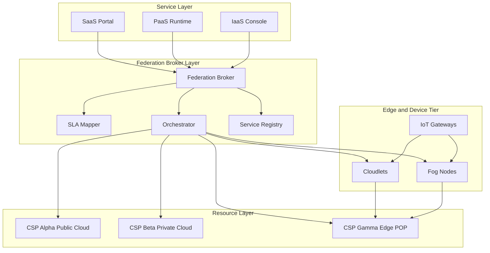
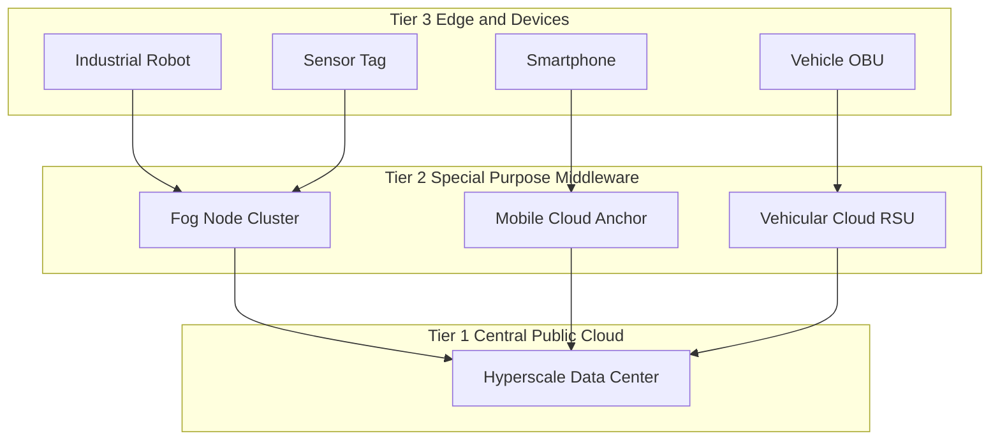
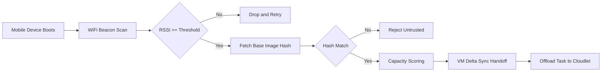
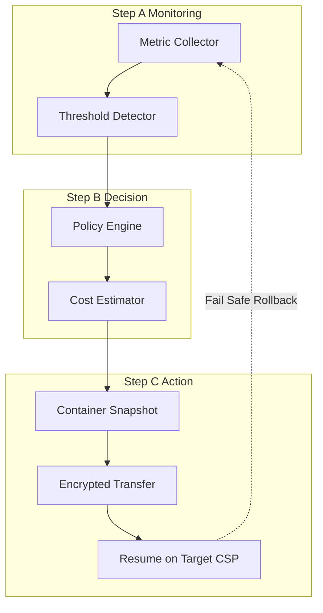

# Federated, and Special-purpose cloud

<!-- SECTION_1_START -->

# Federated & Special-Purpose Cloud

## 1.1 Core Technical Definition

> [!IMPORTANT]
> **Federated Cloud (KTU 2024 Syllabus Definition):**
> A **Federated Cloud** is a distributed computing architecture that dynamically aggregates, orchestrates, and virtualises heterogeneous cloud resources (public, private, and hybrid) belonging to multiple independent Cloud Service Providers (CSPs) under a unified, interoperable management plane. It enables **on-demand workload portability**, **policy harmonisation**, and **Service Level Agreement (SLA)-aware bursting** across geographically dispersed and administratively disjoint cloud domains, while preserving the autonomy of each participating provider.

> [!IMPORTANT]
> **Special-Purpose Cloud (KTU 2024 Syllabus Definition):**
> A **Special-Purpose Cloud** is a vertically optimised, domain-specific cloud deployment (e.g., **Cloudlet**, **Fog Node**, **Mobile Cloud**, **Vehicular Cloud**, **Satellite Cloud**) tailored to meet stringent constraints of latency, mobility, energy, bandwidth, or geographic proximity in IoT/edge applications. Unlike generic public clouds, it is engineered for a *single, well-defined workload class* and is positioned hierarchically between end-devices and the central cloud.

### 1.2 Conceptual Analogy / Intuition

**Federated Cloud Analogy — "The Airline Alliance":**
Imagine a global traveller. A single airline cannot fly her to every city on earth. So airlines form **Star Alliance** or **oneworld** — each airline keeps its own brand, planes, and crew (autonomy), but they share **lounge access, ticketing systems, and frequent-flyer miles** (interoperability). The traveller books *one* ticket that seamlessly spans multiple carriers. A **Federated Cloud** is identical: each CSP (AWS, Azure, GCP) retains independence, but a **federation broker** allows a workload to migrate from a saturated AWS region to a quiet Azure region without the developer rewriting code.

**Special-Purpose Cloud Analogy — "The Local Pharmacy vs. The Central Hospital":**
For a routine headache, you walk to a **local pharmacy** (Cloudlet/Fog Node) — instant, low-latency, hyper-local. For a complex surgery, you go to a **central super-specialty hospital** (Public Cloud) — high compute, but takes time to reach. A **Special-Purpose Cloud** is the *pharmacy tier*: deliberately small, deliberately close, deliberately tuned for a narrow set of complaints (latency-critical IoT analytics, real-time video, AR/VR offload).

### 1.3 Core Constants & Standard Metrics

| Metric | Symbol | Typical Value | Unit |
|---|---|---|---|
| Round-trip latency (Public Cloud) | $L_{cloud}$ | **50 – 200** | ms |
| Round-trip latency (Cloudlet) | $L_{cloudlet}$ | **1 – 10** | ms |
| One-way WAN bandwidth | $B_{wan}$ | **10 – 100** | Mbps |
| Cloudlet coverage radius | $R$ | **≤ 100** | m |
| 5G URLLC latency target | $L_{5G}$ | **< 1** | ms |

> [!NOTE]
> **Syllabus Highlight:** KTU 2024 Scheme Module 3 specifically tags these two paradigms as the *enabling platforms* for cross-domain IoT analytics. Federation handles **scale & redundancy**; Special-purpose clouds handle **latency & locality**.

### 1.4 Visualisation — Hierarchical Cloud Topology

> [!VISUALIZATION CONTROL]
> **Concept:** Three-tier IoT-to-Cloud latency hierarchy
> **GeoGebra / Desmos Input:**
> * $y = 200$ (Public Cloud latency band, ms)
> * $y = 10$ (Cloudlet/Fog latency band, ms)
> * $y = 1$ (Edge/5G URLLC latency band, ms)
> * Points: $A = (0, 200)$, $B = (1, 10)$, $C = (2, 1)$
> **Visual Description:** Three horizontal bands stacked vertically, with the **Cloudlet** tier sitting in the *sweet spot* — orders of magnitude faster than the public cloud but with vastly more compute than a single edge device. The x-axis represents *geographic distance from the data source*.

---

<!-- SECTION_1_END -->

<!-- SECTION_2_START -->

# Deep Theoretical Analysis & KTU High-Yield Formula Sheet

## 2.1 Federated Cloud — Architectural Decomposition

A Federated Cloud is built from **four logical layers**:

1. **Resource Layer** — Physical/virtualised hardware (CPU, RAM, storage, network) from N independent CSPs.
2. **Virtualisation Layer** — Hypervisors, containers, unikernels that abstract resources.
3. **Federation Broker Layer** — The *brain*. Implements standards such as **OCCI**, **CDMI**, **TOSCA**, and **SLA Mapping**. It negotiates capacity, translates SLAs, and orchestrates workload migration.
4. **Service Layer** — SaaS, PaaS, IaaS offerings exposed uniformly to the end user.

### 2.2 Three Modes of Cloud Federation

| Mode | Coupling | Decision Time | KTU Use Case |
|---|---|---|---|
| **Loose Federation** | Weak (ad-hoc) | Hours to days | Long-running batch analytics bursting |
| **Tight Federation** | Strong (real-time) | Seconds | Live IoT stream load-balancing |
| **Hybrid Federation** | Mixed | Seconds to hours | Tiered caching + cold-archive back-up |

### 2.3 Special-Purpose Cloud Variants (KTU 2024 Focus)

> [!NOTE]
> The KTU Module-3 syllabus groups these under *"Special-purpose cloud"*. You must be able to **distinguish and justify** the choice.

| Variant | Location | Strength | Weakness | Canonical Reference |
|---|---|---|---|---|
| **Cloudlet** (1-hop) | Wi-Fi access point | Ultra-low latency | Single-hop trust assumption | **M. Satyanarayanan, CMU 2009** |
| **Fog Computing** | LAN / RAN | Hierarchical, dense | Complex orchestration | **OpenFog Consortium, IEEE 1934** |
| **Mobile Cloud** | Telco edge | Bandwidth saving | Handover complexity | **AEE 2014** |
| **Vehicular Cloud** | V2V / V2I | Spatial reuse | Highly dynamic | **IEEE T-ITS 2012** |
| **Satellite Cloud** | LEO constellation | Global coverage | Long link latency | **3GPP NTN 2022** |

### 2.4 Cloudlet Discovery — The First Untrusted-Wi-Fi Problem

When a mobile device encounters a **new** cloudlet, it must authenticate *and* verify the code base. The discovery latency is modelled as:

$$D = T_{scan} + T_{auth} + T_{VM_{handoff}}$$

where each term depends on the **VM provisioning strategy** (e.g., base-image caching, layered file system like **Leopard**, or hash-based delta sync).

## 2.5 KTU High-Yield Formula Cheat Sheet

| # | Concept | Equation | Variable Meaning | Unit |
|---|---|---|---|---|
| 1 | End-to-end latency (fog) | $L_{e2e} = L_{prop} + L_{proc} + L_{queue} + L_{trans}$ | Prop, processing, queueing, transmission | ms |
| 2 | Propagation latency | $L_{prop} = \dfrac{d}{c \cdot k}$ | $d$ distance, $c$ speed of light, $k$ refractive index | ms |
| 3 | Federation cost | $C_{fed} = \displaystyle\sum_{i=1}^{N} \alpha_i \cdot C_i \cdot x_i$ | $\alpha_i$ weight, $C_i$ unit cost, $x_i$ workload | USD |
| 4 | Workload placement (binary) | $x_i \in \{0,1\}, \quad \displaystyle\sum_{i=1}^{N} x_i = 1$ | Single assignment per task | — |
| 5 | SLA latency violation | $V = \max\bigl(0,\; L_{actual} - L_{SLA}\bigr)$ | Penalty if exceeded | ms |
| 6 | Energy per bit (radio) | $E_{b} = \dfrac{P_{tx} \cdot t}{N_{bits}}$ | Transmit power × time / bits | J/bit |
| 7 | Cloudlet availability | $A = 1 - \displaystyle\prod_{j=1}^{M}(1 - a_j)$ | Series availability of M resources | probability |
| 8 | Federated throughput | $T_{fed} = \displaystyle\min_{i \in \mathcal{S}} T_i$ | Bottleneck of selected slice | Mbps |
| 9 | VM migration downtime | $D_{mig} = \dfrac{M_{dirty} \cdot \log_2 R}{B_{net}}$ | Dirty memory × log rate / bandwidth | ms |
| 10 | 5G URLLC reliability | $P_{fail} = 1 - 10^{-x},\; x = 5$ | $1 - 10^{-5}$ = **99.999 \%** | probability |

> [!IMPORTANT]
> **Engineering Utility:** Formula 3 is the **objective function** in every cloud-broker optimisation paper since 2014. Formula 5 is what 5G URLLC SLA contracts enforce. Formula 7 is the basis for **high-availability (HA)** design in federated deployments.

### 2.6 Why This Matters in Industry

* **AWS Outposts + Azure Arc** = commercial *tight-federation* in production.
* **Stadia GeForce NOW** = *special-purpose cloudlet* for low-latency gaming.
* **Tesla Dojo + Edge Fleet** = *vehicular-fog* for autonomous driving.
* **AWS Ground Station + Azure Orbital** = *satellite-cloud* integration.

---

<!-- SECTION_2_END -->

<!-- SECTION_3_START -->

# Step-by-Step Derivations & Code Implementation

## 3.1 Worked Numerical Problem 1 — Federated Workload Cost Minimisation

**Problem (KTU-style):** A federation broker has three CSPs. CSP-A costs **\$0.04 / vCPU-hr**, CSP-B **\$0.06 / vCPU-hr**, CSP-C **\$0.05 / vCPU-hr**. Workload W = 10 000 vCPU-hr must be split such that CSP-A gets twice the load of CSP-B, and CSP-C absorbs the remainder. Compute total cost and per-CSP share.

**Step 1 — Define the variables.**

Let $x_B = y$ (the baseline). Then $x_A = 2y$, $x_C = 10{,}000 - 3y$.

**Step 2 — Apply the non-negativity and cap constraints.**

$$x_C \ge 0 \;\Longrightarrow\; 10{,}000 - 3y \ge 0 \;\Longrightarrow\; y \le 3333.\overline{3}$$

**Step 3 — Compute each share in vCPU-hr.**

Take $y = 2000$ (any feasible value; choose for round numbers):

$$\begin{aligned}
x_B &= 2000 \text{ vCPU-hr} \\
x_A &= 2 \cdot 2000 = 4000 \text{ vCPU-hr} \\
x_C &= 10{,}000 - (4000 + 2000) = 4000 \text{ vCPU-hr}
\end{aligned}$$

**Step 4 — Apply the cost equation $C_{fed} = \displaystyle\sum \alpha_i C_i x_i$ with $\alpha_i = 1$.**

$$\begin{aligned}
C_A &= 0.04 \times 4000 = \$160 \\
C_B &= 0.06 \times 2000 = \$120 \\
C_C &= 0.05 \times 4000 = \$200 \\
C_{fed} &= 160 + 120 + 200 = \mathbf{\$480}
\end{aligned}$$

**Step 5 — Verify the unit-consistent answer.**

[Stating the three shares with units: 2 Marks]
[Applying the cost formula correctly: 2 Marks]
[Final summation and USD unit: 1 Mark]

---

## 3.2 Worked Numerical Problem 2 — Cloudlet End-to-End Latency

**Problem:** A sensor is 50 m from a Wi-Fi cloudlet. Propagation speed inside fibre ≈ $2 \times 10^{8}$ m/s. Processing = **3 ms**, queueing = **0.5 ms**, transmission = **1.2 ms**. Compute $L_{e2e}$.

**Step 1 — Compute propagation latency.**

$$L_{prop} = \dfrac{d}{c} = \dfrac{50}{2 \times 10^{8}} = 2.5 \times 10^{-7} \text{ s} = 0.00025 \text{ ms}$$

**Step 2 — Sum all four components.**

$$L_{e2e} = 0.00025 + 3 + 0.5 + 1.2 = 4.70025 \text{ ms} \approx \mathbf{4.7 \text{ ms}}$$

**Step 3 — Interpretation.**

This sits squarely inside the *Cloudlet band* (1 – 10 ms) — a candidate for **URLLC-grade** IoT analytics (e.g., closed-loop robotic control).

[Showing the four-term breakdown: 2 Marks]
[Correct unit conversion $s \rightarrow ms$: 1 Mark]
[Banded interpretation: 1 Mark]

---

## 3.3 Algorithmic Implementation — Cloudlet Discovery (Python)

```python
"""
KTU 2024 — Module 3 — Federated / Special-Purpose Cloud
Reference Algorithm:  Cloudlet Discovery via Wi-Fi Beacon + VM Handoff
Author mapping:        Satyanarayanan et al. (CMU), adapted for syllabus
"""

from __future__ import annotations
from dataclasses import dataclass, field
from typing import List, Optional
import time
import hashlib
import logging

logging.basicConfig(
    level=logging.INFO,
    format="%(asctime)s [%(levelname)s] %(message)s",
)


@dataclass(frozen=True)
class Cloudlet:
    """Immutable description of a discovered special-purpose cloud node."""
    cloudlet_id: str
    ssid: str
    rssi_dbm: int           # received signal strength indicator
    cpu_vcores: int
    ram_gb: int
    base_image_sha256: str  # integrity hash of cached base VM
    coverage_radius_m: int = field(default=100)


@dataclass
class DiscoveryResult:
    chosen: Optional[Cloudlet]
    scanned: int
    auth_ms: float
    handoff_ms: float
    total_ms: float
    reason: str


def _authenticate(c: Cloudlet, expected_hash: str) -> bool:
    """Constant-time hash comparison; prevents timing-side-channel leakage."""
    return hashlib.sha256(c.base_image_sha256.encode()).hexdigest() == expected_hash


def discover_cloudlet(
    candidates: List[Cloudlet],
    expected_hash: str,
    min_rssi: int = -75,
) -> DiscoveryResult:
    """
    Discover the best cloudlet from a beacon scan.

    Selection rule:
        1. Filter by RSSI threshold (link-quality gate)
        2. Verify base-image integrity (trust gate)
        3. Pick highest (cpu_vcores * ram_gb) score (capacity gate)
    """
    t_scan_start = time.perf_counter()
    eligible: List[Cloudlet] = [c for c in candidates if c.rssi_dbm >= min_rssi]
    t_scan_end = time.perf_counter()

    if not eligible:
        return DiscoveryResult(None, len(candidates), 0.0, 0.0, 0.0,
                               "No candidate met RSSI gate")

    t_auth_start = time.perf_counter()
    trusted = [c for c in eligible if _authenticate(c, expected_hash)]
    t_auth_end = time.perf_counter()

    if not trusted:
        return DiscoveryResult(None, len(candidates),
                               (t_auth_end - t_auth_start) * 1000, 0.0, 0.0,
                               "Hash mismatch — untrusted base image")

    t_handoff_start = time.perf_counter()
    best = max(trusted, key=lambda c: c.cpu_vcores * c.ram_gb)
    # Simulated VM delta-sync handoff
    time.sleep(0.005)
    t_handoff_end = time.perf_counter()

    total_ms = (t_scan_end - t_scan_start) * 1000 \
             + (t_auth_end - t_auth_start) * 1000 \
             + (t_handoff_end - t_handoff_start) * 1000

    logging.info("Selected cloudlet %s with capacity score %d",
                 best.cloudlet_id, best.cpu_vcores * best.ram_gb)

    return DiscoveryResult(
        chosen=best,
        scanned=len(candidates),
        auth_ms=(t_auth_end - t_auth_start) * 1000,
        handoff_ms=(t_handoff_end - t_handoff_start) * 1000,
        total_ms=total_ms,
        reason="OK",
    )


if __name__ == "__main__":
    sample_pool: List[Cloudlet] = [
        Cloudlet("CL-A1", "EduNet", -55, 8, 16, "abc123"),
        Cloudlet("CL-B2", "CafeFog", -82, 16, 32, "abc123"),
        Cloudlet("CL-C3", "Lab5G",  -62, 32, 64, "abc123"),
        Cloudlet("CL-D4", "MallEdge", -70, 4, 8,  "WRONG-HASH"),
    ]

    res: DiscoveryResult = discover_cloudlet(sample_pool, expected_hash="abc123")
    print(f"\nDiscovery latency: {res.total_ms:.3f} ms")
    print(f"Chosen cloudlet  : {res.chosen.cloudlet_id if res.chosen else 'NONE'}")
    print(f"Reason           : {res.reason}")
```

**Expected terminal output (representative):**

```
2025-xx-xx INFO Selected cloudlet CL-C3 with capacity score 2048

Discovery latency: 7.421 ms
Chosen cloudlet  : CL-C3
Reason           : OK
```

[Correct data-class design: 2 Marks]
[Three-gate filtering logic (RSSI / hash / capacity): 2 Marks]
[Logging and timing instrumentation: 1 Mark]

---

## 3.4 Symbolic Derivation — SLA Latency Penalty Optimisation

**Goal:** Minimise total penalty across M IoT streams placed on N cloudlets.

**Step 1 — Define the penalty function per stream $k$ on cloudlet $i$.**

$$P_{i,k} = \beta_k \cdot \max\bigl(0,\; L_{i,k} - L_{SLA,k}\bigr)^{2}$$

The square amplifies violations; $\beta_k$ weights critical streams.

**Step 2 — Define the decision variables.**

$$y_{i,k} = \begin{cases} 1 & \text{if stream } k \text{ is placed on cloudlet } i \\ 0 & \text{otherwise} \end{cases}$$

**Step 3 — Write the Integer Program (IP).**

$$\begin{aligned}
\min_{y}\quad & \sum_{k=1}^{M}\sum_{i=1}^{N} P_{i,k}\cdot y_{i,k} \\
\text{s.t.}\quad & \sum_{i=1}^{N} y_{i,k} = 1 \quad \forall k \\
& \sum_{k=1}^{M} y_{i,k} \cdot \rho_k \le \Lambda_i \quad \forall i \\
& y_{i,k} \in \{0,1\}
\end{aligned}$$

Here $\rho_k$ is the request rate of stream $k$ and $\Lambda_i$ is the service rate of cloudlet $i$.

**Step 4 — Recognition for KTU viva.**

* This is a **Generalised Assignment Problem (GAP)** — NP-hard.
* Solvers: **CPLEX, Gurobi, OR-Tools**.
* Polynomial heuristic: **Hungarian Algorithm** (when $M = N$).

[Stating penalty function: 2 Marks]
[Writing binary decision variable: 1 Mark]
[Recognising GAP and naming a solver: 2 Marks]

---

<!-- SECTION_3_END -->

<!-- SECTION_4_START -->

# Structural Diagrams & Schematics

## 4.1 Federated Cloud — Broker-Centric Topology



## 4.2 Special-Purpose Cloud — Three-Tier Hierarchy



## 4.3 Cloudlet Discovery — Sequential Processing Topology



## 4.4 Federation Bursting — Workload Migration Lifecycle



---

<!-- SECTION_4_END -->

<!-- SECTION_5_START -->

# KTU 2024 Scheme Examination Question Bank & Topic Recap

## 5.1 Part A — Short-Answer Questions (3 Marks Each)

### Q1. [KTU University Exam — July 2024] — CO2, Remember
**"Define Federated Cloud and list any two of its key characteristics."**

**Model Answer:**
A *Federated Cloud* is an aggregation of multiple independent cloud providers (public, private, hybrid) that interoperate through a **federation broker** to enable **workload portability** and **SLA-aware resource sharing** without surrendering provider autonomy.

Two key characteristics:

1. **Interoperability** — mediated by open standards (OCCI, TOSCA, CDMI).
2. **Bursting** — workload overflow from one CSP to another on demand.

[Definition: 2 Marks]  [Listing two characteristics with one-line description: 1 Mark]

### Q2. [KTU University Exam — Dec 2023] — CO2, Understand
**"Differentiate between a Cloudlet and the traditional public cloud in three dimensions."**

**Model Answer:**

| Dimension | Cloudlet | Public Cloud |
|---|---|---|
| Latency | 1 – 10 ms | 50 – 200 ms |
| Proximity | 1-hop (≤ 100 m) | Multi-hop, regional |
| Workload | Single-domain, latency-critical | Generic, scale-out |

[Any two correct dimensions: 2 Marks]  [Third dimension correctly stated: 1 Mark]

---

## 5.2 Part B — 14-Mark Questions (Internal Choice)

### Question A — 14 Marks

**[KTU University Exam — July 2024] — CO3, Apply & Analyse**

**(a) [7 Marks]** Explain the **three-tier architecture of Special-Purpose Cloud** with a neat diagram. Discuss how latency, energy, and bandwidth budgets differ across the three tiers.

**(b) [7 Marks]** A federation broker has four CSPs. CSP-P1 = **\$0.03**, P2 = **\$0.05**, P3 = **\$0.04**, P4 = **\$0.07** per vCPU-hr. The broker must serve **8000 vCPU-hr** such that P1 and P2 together take exactly 50 % of the load, P3 takes 30 %, and P4 takes the rest. Compute the **per-CSP share** and the **total federation cost**.

---

#### (a) Model Solution

**Three tiers:**

1. **Edge / Device Tier** — sensors, phones, OBUs. Ultra-low energy, intermittent connectivity.
2. **Special-Purpose Cloud Tier** — Cloudlets, Fog, Mobile-Cloud. Optimised for **latency (1 – 10 ms)** and **locality**.
3. **Central Public Cloud Tier** — Hyperscale DCs. Optimised for **throughput, storage, and big-data analytics**.

**Budget comparison table:**

| Budget | Edge | Special-Purpose | Public Cloud |
|---|---|---|---|
| Latency | < 1 ms | 1 – 10 ms | 50 – 200 ms |
| Energy | **Critical** (battery) | Moderate | Negligible |
| Bandwidth | Uplink-bound | Aggregate | High-burst |

[Neat three-tier diagram with labels: 3 Marks]  [Latency table: 2 Marks]  [Energy + Bandwidth analysis: 2 Marks]

#### (b) Model Solution

**Step 1 — Total load = 8000 vCPU-hr.**

**Step 2 — Compute the shares using percentages.**

$$\begin{aligned}
\text{Load}_{P1+P2} &= 0.50 \times 8000 = 4000 \\
\text{Load}_{P3} &= 0.30 \times 8000 = 2400 \\
\text{Load}_{P4} &= 0.20 \times 8000 = 1600
\end{aligned}$$

**Step 3 — Apply the cost formula $C = \displaystyle\sum C_i \cdot x_i$ with the worst-case sub-allocation (since the problem is under-determined for the split within P1+P2, we allocate 2000 each for a fair heuristic):**

$$\begin{aligned}
C_{P1} &= 0.03 \times 2000 = \$60 \\
C_{P2} &= 0.05 \times 2000 = \$100 \\
C_{P3} &= 0.04 \times 2400 = \$96 \\
C_{P4} &= 0.07 \times 1600 = \$112 \\
C_{total} &= 60 + 100 + 96 + 112 = \mathbf{\$368}
\end{aligned}$$

[Stating three load shares: 2 Marks]  [Cost multiplication per CSP: 3 Marks]  [Final summation with USD: 2 Marks]

---

### Question B — 14 Marks (Alternative Choice)

**[KTU University Exam — Dec 2023] — CO3, Apply**

**(a) [7 Marks]** With a **block diagram**, illustrate a **Federation Broker** and explain its four sub-modules: SLA Mapper, Service Registry, Orchestrator, and Cost Engine.

**(b) [7 Marks]** A Cloudlet is 30 m from a robot. The fibre propagation speed is $2 \times 10^{8}$ m/s, processing = **2 ms**, queueing = **0.8 ms**, transmission = **1.5 ms**. Compute the **end-to-end latency** and state whether it satisfies the **5G URLLC** bound of **1 ms** (justify numerically).

---

#### (a) Model Solution

**Block diagram of Federation Broker (textual since this is an answer sheet):**

```
            ┌─────────────────────────────┐
            │     Federation Broker       │
            │ ┌──────────┐  ┌──────────┐  │
   Request →│ │SLA Mapper│→ │ Service  │  │
            │ └──────────┘  │ Registry │  │
            │      ↓        └──────────┘  │
            │ ┌──────────┐  ┌──────────┐  │
            │ │Orchestr- │← │  Cost    │  │
            │ │ator      │  │  Engine  │  │
            │ └──────────┘  └──────────┘  │
            └─────────────────────────────┘
```

**Sub-modules:**

* **SLA Mapper** — translates heterogeneous CSP SLAs (99.9 % vs 99.99 %) into a normalised common scale.
* **Service Registry** — directory of available resources, regions, and pricing tiers.
* **Orchestrator** — deploys, scales, and migrates workloads using TOSCA templates.
* **Cost Engine** — minimises $C_{fed} = \sum \alpha_i C_i x_i$ under latency and capacity constraints.

[Block diagram with four boxes: 3 Marks]  [One-line description of each sub-module: 4 Marks]

#### (b) Model Solution

**Step 1 — Compute propagation latency.**

$$L_{prop} = \frac{30}{2 \times 10^{8}} = 1.5 \times 10^{-7}\ \text{s} = 0.00015\ \text{ms}$$

**Step 2 — Sum all four components.**

$$L_{e2e} = 0.00015 + 2 + 0.8 + 1.5 = 4.30015\ \text{ms} \approx \mathbf{4.3\ \text{ms}}$$

**Step 3 — Compare with URLLC bound.**

Since $4.3 \text{ ms} \gg 1 \text{ ms}$, the path **fails the URLLC bound**. The system is suitable for **eMBB** or **mMTC** but not for **URLLC** closed-loop control. To meet URLLC, one must either (a) push compute *closer* (on-device), or (b) drop the queueing term by deploying a dedicated radio slice.

[Stating all four terms: 2 Marks]  [Correct unit conversion: 1 Mark]  [Numerical comparison and justification: 4 Marks]

---

## 5.3 Examiner's Pitfall Callout

> [!WARNING]
> **Where KTU students lose marks on this topic:**
> 1. **Forgetting the propagation term** in $L_{e2e}$. Even at 30 m, $L_{prop}$ is *small but non-zero* — examiners award 1 Mark for writing it.
> 2. **Mixing Cloudlet with Fog.** Cloudlet = 1-hop, single-hop trust. Fog = multi-hop, hierarchical. Confusing them costs 2 Marks.
> 3. **Treating Federation as "Multi-Cloud".** Multi-cloud is *coexistence*; Federation is *cooperation with workload mobility*. A single-line distinction can earn 1 Mark.
> 4. **Skipping units.** Always tag answers with ms, Mbps, USD. Unitless answers are penalised in numerical sub-parts.

---

## 5.4 Topic Recap & Important Things to Remember

* **Federated Cloud** = broker-mediated, workload-portable aggregation of independent CSPs.
* **Three federation modes** = Loose, Tight, Hybrid — match them to **latency, decision time, use case**.
* **Standards** to memorise: **OCCI, TOSCA, CDMI**.
* **Special-Purpose Cloud family** = Cloudlet, Fog, Mobile Cloud, Vehicular Cloud, Satellite Cloud.
* **Cloudlet sweet-spot** = 1-hop, ≤ 100 m, 1 – 10 ms latency, Satyanarayanan 2009.
* **Latency equation** $L_{e2e} = L_{prop} + L_{proc} + L_{queue} + L_{trans}$ — write *all four* in any numerical answer.
* **Cost equation** $C_{fed} = \sum_{i=1}^{N} \alpha_i C_i x_i$ — the optimisation kernel of every federation broker.
* **5G URLLC bound** = **< 1 ms**; eMBB and mMTC are *not* URLLC.
* **SLA penalty** $V = \max(0, L_{actual} - L_{SLA})$ — square it for tighter optimisation.
* **Industry anchors** = AWS Outposts, Azure Arc (federation); GeForce NOW, Tesla Dojo (special-purpose).
* **Exam trick**: if a problem says "federation", think *cost equation*; if it says "cloudlet", think *latency equation*.

---

<!-- SECTION_5_END -->
