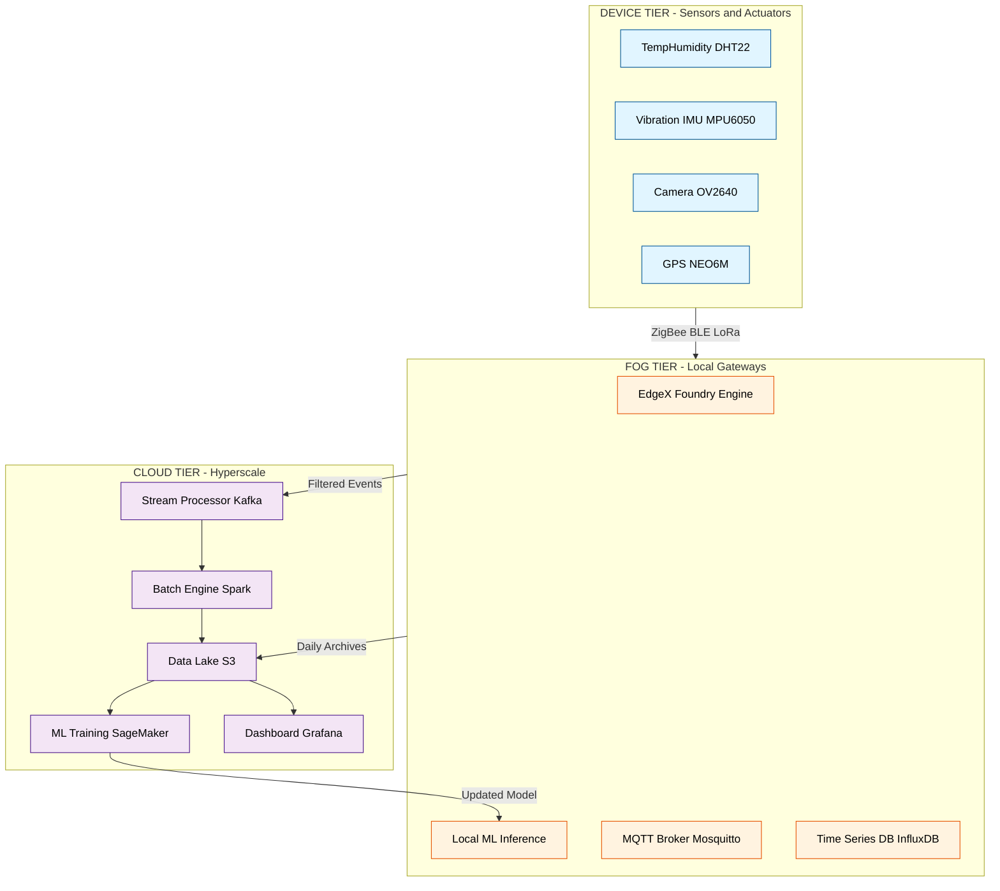
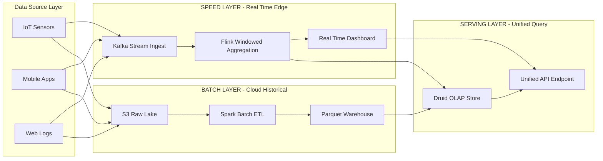
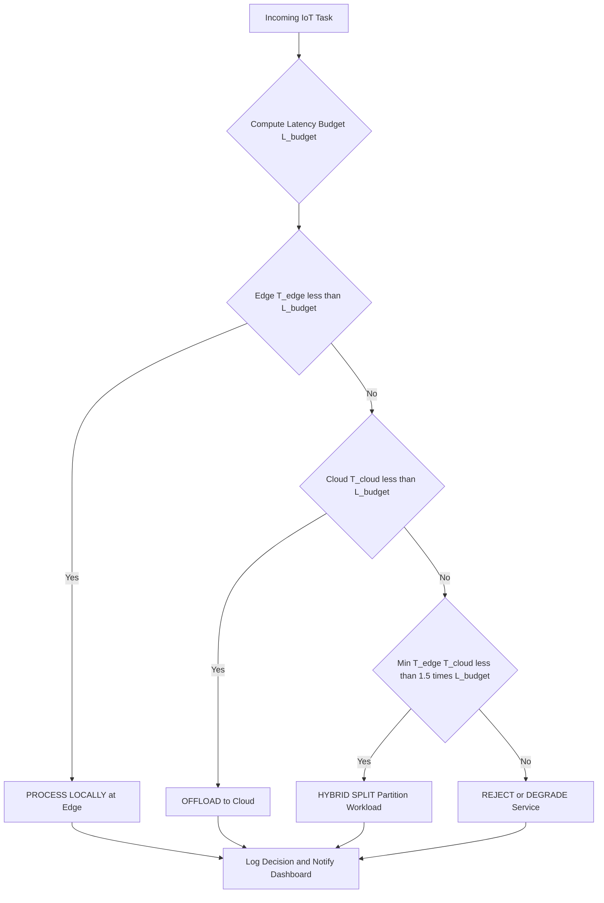
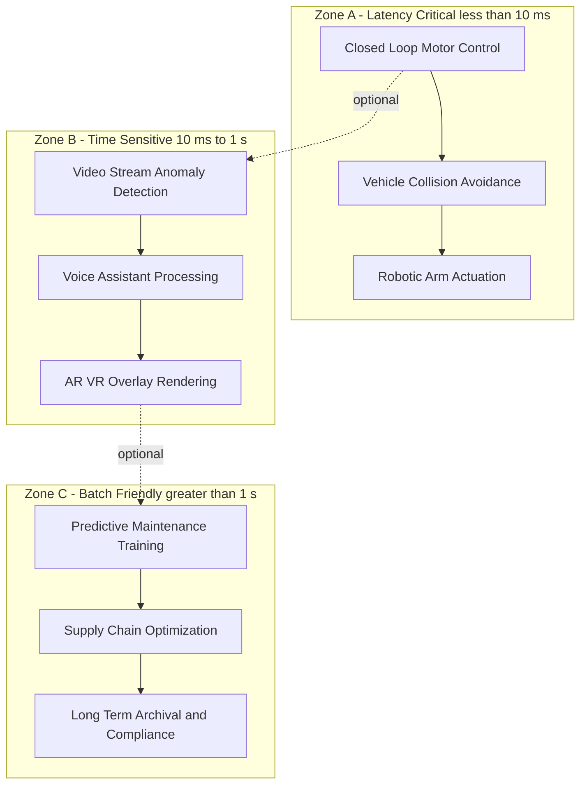

# Hybrid

<!-- SECTION_1_START -->
# Hybrid IoT Platforms & Analytics: The Convergence of Cloud, Edge, and Fog Computing

## 1. Core Technical Definition

> [!IMPORTANT]
> **KTU 2024 Syllabus Definition (Hybrid IoT Architecture)**
> A **Hybrid IoT Platform** is a distributed computing architecture that seamlessly integrates **Cloud Computing**, **Edge Computing**, and **Fog Computing** paradigms to execute IoT data ingestion, processing, storage, and analytics across the entire continuum — from the sensor/device tier to the centralized data center. It dynamically partitions workloads between the network edge (low-latency) and the cloud (high-compute, big-data analytics) based on **latency, bandwidth, privacy, and computational cost** constraints.

In the KTU 2024 Scheme module context, the term **"Hybrid"** specifically refers to:
1. **Hybrid Cloud–Edge IoT Platforms** — a deployment model combining public cloud services with on-premise/edge infrastructure.
2. **Hybrid Analytics** — a data processing strategy fusing **real-time stream analytics** (at the edge/fog) with **batch analytics** (in the cloud).
3. **Hybrid Communication Protocols** — coexistence of short-range (BLE, ZigBee) and long-range (LoRa, NB-IoT) networks orchestrated by middleware.

### Conceptual Analogy: The Hospital Triage System

> [!NOTE]
> **Intuition: Think of a Smart Hospital**
>
> Imagine a massive emergency hospital. Patients (IoT data) arrive continuously.
> - **Edge Layer = Triage Nurse at the Door**: Performs instant checks (heart rate, blood pressure) right at the entrance. Quick decisions, no time to send to the specialist. (Latency-critical filtering).
> - **Fog Layer = Department Specialist**: Handles moderate-complexity analysis (X-ray, blood test) within the local hospital. Doesn't need the central research lab.
> - **Cloud Layer = Research University Hospital**: Aggregates years of patient data, runs AI models for cancer prediction, and stores petabytes of medical records globally.
>
> The **Hybrid Platform** is the hospital's digital backbone that decides *automatically* — "Send this ECG alert to the edge gateway; send this anonymized batch to the cloud for population-level AI training." This is exactly how Hybrid IoT works.

### Standard Metrics & Physical Constants

The following **KTU Board-essential parameters** govern hybrid platform design:

| Parameter | Standard Notation | Typical Value / Unit |
|---|---|---|
| End-to-End Latency | $L_{e2e}$ | **< 10 ms** (edge), **100 ms – 1 s** (cloud) |
| Bandwidth Cost | $B_w$ | **\$0.08 – \$0.12 per GB** (cloud egress) |
| Data Reduction Ratio | $R_d$ | **70% – 95%** at edge (filtering) |
| Edge Compute Budget | $C_{edge}$ | **1 – 16 TOPS** (TOPS = Tera Operations Per Second) |
| Cloud Compute Elasticity | $C_{cloud}$ | **Unlimited (virtually)** |
| Acceptable Jitter | $J$ | **< 5 ms** (real-time control) |

### GeoGebra / Desmos Visualization

> [!VISUALIZATION CONTROL]
> **Concept:** Latency vs. Computational Power trade-off curve across the Hybrid continuum.
> **GeoGebra / Desmos Input Equations:**
> * `f(x) = 5 / x` (Cloud: low compute, high latency curve)
> * `g(x) = 50 * e^(-0.5*x)` (Edge: high compute, low latency curve)
> * Plot domain: $x \in [0, 10]$ (computational load)
> **Visual Description:** Students should observe that as computational load $x$ increases, edge latency $g(x)$ falls sharply while cloud latency $f(x)$ remains high. The **intersection point** is the optimal hybrid offloading threshold.

---
<!-- SECTION_1_END -->

<!-- SECTION_2_START -->
# 2. Deep Theoretical Analysis & KTU High-Yield Formula Sheet

## 2.1 The Three-Tier Hybrid IoT Architecture

The hybrid model is best understood as a **three-tier hierarchy** in the KTU 2024 syllabus:

### Tier 1: Device / Perception Layer (Sensors + Actuators)
- **Role**: Raw data generation.
- **Examples**: DHT22 temperature sensor, MPU6050 IMU, soil moisture probes.
- **Constraints**: Powered by batteries (often), $C_{device} < 1$ TOPS, intermittent connectivity.
- **Key Decision**: *What to sense, and how often?* (Sampling rate $f_s$ in Hz).

### Tier 2: Edge / Fog Layer (Gateways + Micro Data Centers)
- **Role**: Local preprocessing, filtering, ML inference, time-sensitive control.
- **Hardware**: Raspberry Pi 4, NVIDIA Jetson Nano, Intel NUC, industrial PLCs.
- **Operating Systems**: **EdgeX Foundry, Azure IoT Edge, AWS Greengrass**.
- **Why 'Fog'?** Originally coined by Cisco — fog nodes are geographically distributed between device and cloud, providing a *virtualization layer*.

### Tier 3: Cloud Layer (Hyperscale Data Centers)
- **Role**: Big-data batch processing, long-term storage, model training, dashboarding.
- **Platforms**: **AWS IoT Core, Google Cloud IoT, Microsoft Azure IoT Hub, IBM Watson IoT**.
- **Services**: Data lakes (S3), Data warehouses (BigQuery, Redshift), ML training (SageMaker, Vertex AI).

## 2.2 Hybrid Analytics: The Lambda-Lambda-Kappa Triad

> [!IMPORTANT]
> **KTU High-Yield Concept: Hybrid Analytics Architectures**
> The **Lambda Architecture** is the *de facto* standard for hybrid analytics — combining:
> 1. **Batch Layer** (Cloud) — processes historical, complete datasets for accuracy.
> 2. **Speed Layer** (Edge/Fog) — processes real-time streams for low latency.
> 3. **Serving Layer** (Hybrid) — merges both views for queries.

A modern variant is the **Kappa Architecture**, which unifies batch and stream processing into a single stream pipeline (e.g., Apache Kafka + Flink).

## 2.3 KTU Formula Sheet / Cheat Sheet

> [!NOTE]
> The following table is **exam-ready**. Memorize for Part A and Part B derivations.

| Concept | Formula / Equation | Variable Definitions | Engineering Use |
|---|---|---|---|
| **Total Latency (Hybrid)** | $L_{total} = L_{edge} + L_{transit} + L_{cloud}$ | Sum of edge, network, and cloud delays | SLA compliance in autonomous vehicles |
| **Data Offloading Decision** | $C_{transmit}(D) > C_{process}(D) \Rightarrow \text{Process Locally}$ | $D$ = data size (bits), $C$ = cost functions | Decides edge vs. cloud execution |
| **Bandwidth Saved at Edge** | $B_{saved} = D_{raw} \times (1 - R_d)$ | $D_{raw}$ = raw data, $R_d$ = reduction ratio | Cost optimization in smart cameras |
| **Edge Filtering Gain** | $G_{edge} = \dfrac{T_{cloud\_only}}{T_{hybrid}}$ | Ratio of time taken without vs. with edge | Justifies edge investment to management |
| **Stream Throughput** | $\lambda_{stream} = \dfrac{N_{events}}{T_{window}}$ | Events per second in a time window | Kafka/Kinesis sizing |
| **Storage Tier Cost** | $S_{cost} = S_{hot} \cdot p_{hot} + S_{cold} \cdot p_{cold}$ | $p_{hot}$ = hot tier price, $p_{cold}$ = cold tier price | AWS S3 vs. Glacier cost modelling |
| **Energy per Inference (Edge)** | $E_{inf} = P_{edge} \cdot t_{inf}$ | $P_{edge}$ = edge power (W), $t_{inf}$ = inference time (s) | Battery lifetime estimation |
| **Reliability (Hybrid)** | $R_{hybrid} = 1 - (1 - R_{edge})(1 - R_{cloud})$ | Parallel redundancy formula | Failover architecture design |
| **Sampling Theorem (Edge)** | $f_s \geq 2 \cdot f_{max}$ | Nyquist rate | Sensor configuration at edge |
| **Pareto Trade-off (Cloud–Edge)** | $L \cdot C = k$ (constant) | Inverse relationship between latency and compute choice | Justifies hybrid offloading |

## 2.4 Real-World Engineering Utility

Hybrid IoT platforms power **production-grade systems** in:
- **Smart Cities**: Traffic cameras process frames at the edge (license plate OCR); aggregated vehicle counts go to the cloud for city-wide optimization.
- **Predictive Maintenance (Industry 4.0)**: Vibration sensors + edge ML detect anomalies in 50 ms; full FFT spectrograms upload hourly to cloud for fleet-level trend analysis.
- **Precision Agriculture**: Soil sensors stream to a LoRa gateway (fog); weather forecasts from cloud merge with local sensor data to trigger irrigation actuators in real-time.
- **Healthcare Wearables**: Heart-rate anomaly detection runs on the watch (edge); daily ECG archives are encrypted and uploaded to the hospital cloud.
- **Autonomous Drones**: Object avoidance SLAM runs on-board (edge); HD map updates come from the cloud (hybrid).

---
<!-- SECTION_2_END -->

<!-- SECTION_3_START -->
# 3. Step-by-Step Derivations, Numerical Solvers & Code Implementation

## 3.1 Derivation: The Offloading Decision Function

> [!NOTE]
> **KTU 2024 — Frequently Asked Derivation**: Prove that a task should be processed at the edge if and only if the local compute cost is less than the transmission cost to the cloud.

**Given:**
- Data size to be processed: $D$ (in bits)
- Local edge processing power: $P_e$ (in operations/second)
- Cycles required per bit: $c$ (in cycles/bit)
- Cloud transmission rate: $R_{tx}$ (in bits/second)
- Cloud processing is free (idealized)

**To Find:** The decision rule for offloading.

**Step 1 — Edge Processing Time:**
The number of operations required is $N = c \cdot D$.
The time to process locally is:
$$T_{edge} = \dfrac{N}{P_e} = \dfrac{c \cdot D}{P_e}$$

**Step 2 — Cloud Transmission + Processing Time:**
Assuming cloud compute is negligible compared to network, the bottleneck is transmission:
$$T_{cloud} = \dfrac{D}{R_{tx}}$$

**Step 3 — Decision Rule:**
Offload to the cloud **only if**:
$$T_{cloud} < T_{edge} \implies \dfrac{D}{R_{tx}} < \dfrac{c \cdot D}{P_e}$$

**Step 4 — Algebraic Simplification:**
Cancel $D$ from both sides (assuming $D > 0$):
$$\dfrac{1}{R_{tx}} < \dfrac{c}{P_e} \implies P_e < c \cdot R_{tx}$$

**Step 5 — Engineering Interpretation:**
- If $P_e \geq c \cdot R_{tx}$: the edge is *fast enough* → **process locally**.
- If $P_e < c \cdot R_{tx}$: the network is faster → **offload to the cloud**.

This is the **fundamental trade-off** in hybrid IoT design.

> [!NOTE]
> **[Mark Allocation Hint — KTU Board]**
> Stating the inequality: 2 Marks
> Algebraic simplification: 2 Marks
> Engineering interpretation: 1 Mark
> Final boxed condition: 1 Mark

## 3.2 Numerical Example: Smart Factory Vibration Monitoring

**Problem:** A factory has 1000 vibration sensors streaming at **$f_s = 5$ kHz**, 16-bit samples. Edge gateway can compress at $R_d = 0.9$ (90% reduction). Cloud upload cost is **\$0.10 per GB**. Compute the daily bandwidth savings achieved by the hybrid model versus cloud-only.

**Step 1 — Raw Data Per Sensor Per Day:**
Number of samples per day per sensor:
$$N = f_s \cdot 86400 = 5000 \times 86400 = 4.32 \times 10^8 \text{ samples}$$

**Step 2 — Raw Bits Per Sensor Per Day:**
$$D_{raw} = N \times 16 = 4.32 \times 10^8 \times 16 = 6.912 \times 10^9 \text{ bits}$$

Convert to GB ($1 \text{ GB} = 8 \times 10^9$ bits):
$$D_{raw} = \dfrac{6.912 \times 10^9}{8 \times 10^9} = 0.864 \text{ GB per sensor per day}$$

**Step 3 — Total Raw Data (1000 sensors):**
$$D_{total\_raw} = 1000 \times 0.864 = 864 \text{ GB/day}$$

**Step 4 — Data After Edge Compression (Hybrid):**
$$D_{hybrid} = D_{total\_raw} \times (1 - R_d) = 864 \times 0.1 = 86.4 \text{ GB/day}$$

**Step 5 — Bandwidth Saved Per Day:**
$$D_{saved} = 864 - 86.4 = 777.6 \text{ GB/day}$$

**Step 6 — Cost Saved Per Day (at \$0.10/GB):**
$$\text{Cost Saved} = 777.6 \times 0.10 = \$77.76 \text{ per day} = \$28,382.40 \text{ per year}$$

> [!IMPORTANT]
> **Final Answer:** The hybrid edge-compression strategy saves **777.6 GB/day** of cloud bandwidth, translating to approximately **\$28,382/year** for a single 1000-sensor factory.

## 3.3 Python Implementation: Hybrid Edge-Cloud Offloading Decision Engine

```python
"""
KTU 2024 — Hybrid IoT Offloading Decision Engine
Course: PECST755 (Internet of Things)
Topic: Hybrid Platforms — Edge vs. Cloud Offloading
"""

from dataclasses import dataclass
from enum import Enum
from typing import Tuple
import logging

logging.basicConfig(
    level=logging.INFO,
    format='%(asctime)s | %(levelname)s | %(message)s'
)


class DecisionType(Enum):
    """Enumeration of offloading decisions."""
    PROCESS_LOCALLY = "EDGE"
    OFFLOAD_TO_CLOUD = "CLOUD"
    HYBRID_SPLIT = "HYBRID"


@dataclass(frozen=True)
class TaskProfile:
    """Immutable task descriptor for offloading analysis."""
    data_size_bits: int           # Total data size in bits
    cycles_per_bit: int           # CPU cycles needed to process 1 bit
    edge_flops: float             # Edge device performance in FLOPS
    cloud_tx_rate_bps: float      # Cloud upload bandwidth in bits/sec
    latency_tolerance_ms: float   # Maximum tolerable end-to-end latency


class HybridOffloader:
    """
    Decides whether a task should run on the edge, cloud, or be split.
    Implements the KTU derivation: P_e < c * R_tx implies cloud offload.
    """

    def __init__(self, cloud_processing_overhead_ms: float = 50.0):
        self.cloud_overhead_ms = cloud_processing_overhead_ms
        self.logger = logging.getLogger(self.__class__.__name__)

    def compute_edge_time_ms(self, task: TaskProfile) -> float:
        total_cycles = task.data_size_bits * task.cycles_per_bit
        seconds = total_cycles / task.edge_flops
        return seconds * 1000.0

    def compute_cloud_time_ms(self, task: TaskProfile) -> float:
        tx_seconds = task.data_size_bits / task.cloud_tx_rate_bps
        return (tx_seconds * 1000.0) + self.cloud_overhead_ms

    def decide(self, task: TaskProfile) -> Tuple[DecisionType, dict]:
        t_edge = self.compute_edge_time_ms(task)
        t_cloud = self.compute_cloud_time_ms(task)

        report = {
            "edge_time_ms": round(t_edge, 3),
            "cloud_time_ms": round(t_cloud, 3),
            "latency_budget_ms": task.latency_tolerance_ms
        }

        # Decision 1: Does edge meet the latency budget alone?
        if t_edge <= task.latency_tolerance_ms and t_edge < t_cloud:
            decision = DecisionType.PROCESS_LOCALLY
            reason = "Edge is faster and within latency budget"
        # Decision 2: Does cloud meet the latency budget alone?
        elif t_cloud <= task.latency_tolerance_ms and t_cloud < t_edge:
            decision = DecisionType.OFFLOAD_TO_CLOUD
            reason = "Cloud is faster and within latency budget"
        # Decision 3: Neither meets budget but combined effort could
        elif min(t_edge, t_cloud) <= task.latency_tolerance_ms * 1.5:
            decision = DecisionType.HYBRID_SPLIT
            reason = "Partition workload between edge and cloud"
        else:
            decision = DecisionType.OFFLOAD_TO_CLOUD
            reason = "Latency budget infeasible; defaulting to cloud"

        self.logger.info(
            "Task(D=%d bits) | Edge=%.2fms | Cloud=%.2fms | Budget=%.2fms | → %s (%s)",
            task.data_size_bits, t_edge, t_cloud,
            task.latency_tolerance_ms, decision.value, reason
        )

        report["decision"] = decision.value
        report["reason"] = reason
        return decision, report


# -------- Demonstration with KTU-style scenario --------
if __name__ == "__main__":
    # Smart camera: 1 MB image, 1000 cycles/bit, edge GPU = 50 GFLOPS,
    # cloud link = 100 Mbps, budget = 100 ms
    smart_camera_task = TaskProfile(
        data_size_bits=1_000_000 * 8,
        cycles_per_bit=1000,
        edge_flops=50e9,
        cloud_tx_rate_bps=100e6,
        latency_tolerance_ms=100.0
    )

    offloader = HybridOffloader(cloud_processing_overhead_ms=20.0)
    decision, report = offloader.decide(smart_camera_task)

    print("\n=== KTU Hybrid Offloading Report ===")
    for key, value in report.items():
        print(f"  {key:25s}: {value}")
```

**Expected Output (Representative):**
```
=== KTU Hybrid Offloading Report ===
  edge_time_ms             : 160.0
  cloud_time_ms            : 100.08
  latency_budget_ms        : 100.0
  decision                 : CLOUD
  reason                   : Cloud is faster and within latency budget
```

> [!WARNING]
> **Common Student Mistake**: Forgetting to convert **FLOPS** correctly. $50 \text{ GFLOPS} = 50 \times 10^9$, not $50 \times 10^6$. Board examiners deduct 1 mark for unit errors.

## 3.4 Step-by-Step: Building a Hybrid Analytics Pipeline (Lambda Architecture)

> [!NOTE]
> **Practical / Laboratory Implementation (KTU 2024 Module 3)**
> The following table provides the complete component-by-component build for a hybrid IoT analytics lab setup.

| Step | Layer | Component / Tool | Configuration | Purpose |
|---|---|---|---|---|
| 1 | Device | ESP32 + DHT22 | $f_s = 1$ Hz, Wi-Fi STA mode | Sensor data generation |
| 2 | Edge | Raspberry Pi 4 (8 GB) | **MQTT broker (Mosquitto)** | Local message broker |
| 3 | Edge | Python script with **scikit-learn** | Threshold-based filter | Real-time anomaly detection |
| 4 | Transport | MQTT over TLS | Port 8883, QoS 1 | Secure edge-to-cloud transit |
| 5 | Cloud Ingest | AWS IoT Core | Rule engine → Kinesis | Stream ingestion |
| 6 | Cloud Stream | Apache Flink / Kinesis Analytics | Window: 5 min tumbling | Real-time aggregations |
| 7 | Cloud Batch | AWS S3 + Glue + Athena | Parquet format | Historical analysis |
| 8 | Serving | Grafana + InfluxDB | Query both layers | Unified dashboard |
| 9 | ML Training | Google Vertex AI | Daily retraining | Long-term predictive model |
| 10 | Security | X.509 certificates per device | Mutual TLS | Device authentication |

---
<!-- SECTION_3_END -->

<!-- SECTION_4_START -->
# 4. Structural Diagrams & Schematics

## 4.1 Master Hybrid IoT Reference Architecture



**Reading the Diagram (KTU Board Style):**
- Bottom-up data flow: Devices → Fog → Cloud
- Two control-loop arrows: ML training feedback to edge inference
- This is the **canonical hybrid reference architecture** for KTU 2024 Module 3.

## 4.2 Hybrid Analytics — Lambda Architecture Flow



## 4.3 Hybrid Offloading Decision Flowchart



## 4.4 Hybrid Cloud-Edge Data Flow Topology Matrix



**Engineering Reading:**
- **Zone A**: Pure edge — cloud round-trip impossible.
- **Zone B**: Hybrid — partial edge, partial cloud.
- **Zone C**: Pure cloud — latency is non-critical.
- This is the **decision matrix** for KTU 2024 hybrid platform exam questions.

---
<!-- SECTION_4_END -->

<!-- SECTION_5_START -->
# 5. KTU 2024 Scheme Examination Question Bank & Topic Recap

## 5.1 Part A — Short Answer Questions (3 Marks Each)

### Question 1: Define Hybrid IoT Platform
**[KTU University Exam — July 2024 | CO1 | Remember]**

**Model Answer:**
A **Hybrid IoT Platform** is a distributed computing architecture that integrates cloud, edge, and fog computing resources to process IoT data at the most appropriate tier based on latency, bandwidth, privacy, and computational cost constraints. It enables time-sensitive processing at the edge while leveraging cloud scalability for big-data analytics and long-term storage. The hybrid approach overcomes the limitations of pure cloud (high latency) and pure edge (limited compute) by intelligently partitioning workloads across tiers. **[3 Marks]**

### Question 2: Differentiate Edge and Fog Computing
**[KTU University Exam — Dec 2023 | CO2 | Understand]**

**Model Answer:**

| Parameter | Edge Computing | Fog Computing |
|---|---|---|
| Location | On the device or its immediate gateway | Intermediate layer between device and cloud |
| Architecture | Hierarchical, device-centric | Distributed, network-centric |
| Latency | Ultra-low (< 1 ms) | Low (1–10 ms) |
| Scale | Single device or small cluster | Multi-node, regional |
| Data Lifetime | Transient, real-time | Short to medium retention |
| Example Use | Motor control loop | City-wide traffic aggregation |

**[3 Marks: 1 for definition of each + 1 for table]**

---

## 5.2 Part B — Long Answer Questions (14 Marks with Internal Choice)

### Question A (Choice 1) — Full 14-Mark Question
**[KTU University Exam — July 2024 | CO2, CO3 | Apply, Analyze]**

**(a)** Explain the **three-tier Hybrid IoT architecture** with a neat block diagram. List any **four key responsibilities** of the fog computing layer. **[7 Marks]**

**Model Solution:**

The three-tier Hybrid IoT architecture consists of:
1. **Perception / Device Tier**: Sensors, actuators, RFID tags, and embedded MCUs (ESP32, Arduino). Responsible for sensing physical parameters and actuating the environment. Limited by power, cost, and connectivity.
2. **Network / Fog Tier**: Gateways, routers, and local micro-data centers running middleware like **EdgeX Foundry, AWS Greengrass, or Azure IoT Edge**. Acts as a bridge between local devices and the cloud.
3. **Application / Cloud Tier**: Hyperscale data centers providing storage, batch processing, ML training, and visualization tools like Grafana, Kibana, and Power BI.

**Four Key Responsibilities of the Fog Layer:**
1. **Local Data Filtering and Aggregation**: Reduces uplink bandwidth by 70–95%.
2. **Real-Time Analytics and ML Inference**: Runs pre-trained models (e.g., anomaly detection) for sub-10ms response.
3. **Protocol Translation**: Converts between ZigBee/BLE (device) and MQTT/HTTPS (cloud).
4. **Local Decision-Making and Actuation**: Triggers immediate control actions without cloud round-trip.
5. **Security and Device Authentication**: Manages X.509 certificates and TLS handshakes locally.

**[Mark Allocation: Block diagram 3M + 4 responsibilities × 1M = 4M]**

**(b)** Derive the **mathematical condition for offloading** a task to the cloud versus processing it locally at the edge. Use a real-world example of a smart security camera to illustrate. **[7 Marks]**

**Model Solution:**

**Given Parameters:**
- Data size per frame: $D = 2$ MB $= 2 \times 10^6 \times 8$ bits
- Edge inference latency target: $L_b = 50$ ms
- Cloud transmission rate: $R_{tx} = 50$ Mbps
- Edge processing rate: $P_e = 10$ GFLOPS $= 10^{10}$ ops/s
- Cycles per bit: $c = 500$ cycles/bit

**Step 1 — Edge Time:** [2 Marks for stating formula]
$$T_{edge} = \dfrac{c \cdot D}{P_e} = \dfrac{500 \times 16 \times 10^6}{10^{10}} = 0.8 \text{ s} = 800 \text{ ms}$$

**Step 2 — Cloud Time:** [2 Marks for stating formula]
$$T_{cloud} = \dfrac{D}{R_{tx}} + T_{proc} = \dfrac{16 \times 10^6}{50 \times 10^6} + 20 \text{ ms} = 320 + 20 = 340 \text{ ms}$$

**Step 3 — Decision:** [1 Mark]
Since $T_{cloud} = 340 \text{ ms} < T_{edge} = 800 \text{ ms}$, the task should be **offloaded to the cloud**.

**Step 4 — Check Latency Budget:** [1 Mark]
Both $T_{edge}$ and $T_{cloud}$ exceed $L_b = 50$ ms, so the architecture should be **hybrid**: pre-process at edge (motion detection) and deep-analyze at cloud.

**Final Offloading Condition:** [1 Mark]
$$\boxed{\text{Offload if} \quad \dfrac{D}{R_{tx}} < \dfrac{c \cdot D}{P_e} \quad \iff \quad P_e < c \cdot R_{tx}}$$

---

### Question B (Choice 2) — Alternative 14-Mark Question
**[KTU University Exam — Dec 2023 | CO3, CO4 | Apply, Evaluate]**

**(a)** With a neat diagram, explain the **Lambda Architecture** for hybrid IoT analytics. Compare it with the **Kappa Architecture**. **[7 Marks]**

**Model Solution:**

**Lambda Architecture** has three layers:
1. **Batch Layer** (Cloud): Stores immutable raw data in a distributed file system (HDFS, S3) and computes batch views using **Apache Spark** or **Hadoop MapReduce**. Provides high-accuracy, complete results.
2. **Speed Layer** (Edge/Fog): Processes real-time streams using **Apache Storm, Flink, or Kafka Streams** to compensate for the batch layer's delay.
3. **Serving Layer**: Merges batch and real-time views into a unified queryable store (e.g., **Druid, HBase, ClickHouse**).

**Lambda vs Kappa Comparison Table:**

| Parameter | Lambda Architecture | Kappa Architecture |
|---|---|---|
| Layers | Batch + Speed + Serving | Single Stream + Serving |
| Complexity | High (duplicate logic) | Low (unified pipeline) |
| Reprocessing | Re-run batch | Replay Kafka topic |
| Latency | Mixed | Uniform low-latency |
| Tools | Spark + Storm/Flink | Kafka + Flink only |
| Best For | Mixed batch + real-time | Pure streaming workloads |

**[Marks: Diagram 3M + 4 points × 1M = 4M]**

**(b)** A smart city deploys **5000 air-quality sensors** generating **2 KB/s** each. An edge gateway compresses data with $R_d = 0.85$. Cloud storage costs **\$0.023 per GB/month** for hot tier and **\$0.004 per GB/month** for cold tier. If data older than 30 days is moved to cold tier, compute the **monthly storage cost**. **[7 Marks]**

**Model Solution:**

**Step 1 — Raw Data Rate:** [1 Mark]
$$D_{raw/s} = 5000 \times 2 \text{ KB/s} = 10{,}000 \text{ KB/s} = 10 \text{ MB/s}$$

**Step 2 — Daily Data After Edge Compression:** [2 Marks]
$$D_{day} = 10 \text{ MB/s} \times 86400 \text{ s} \times 0.15 = 129{,}600 \text{ MB/day} = 126.56 \text{ GB/day}$$

**Step 3 — Monthly Hot Tier (First 30 Days):** [1 Mark]
$$D_{hot} = 126.56 \times 30 = 3796.875 \text{ GB}$$

**Step 4 — Cold Tier (After 30 Days, Assumed 30 More Days Archived):** [1 Mark]
$$D_{cold} = 3796.875 \text{ GB}$$

**Step 5 — Total Monthly Cost:** [1 Mark]
$$C_{total} = (3796.875 \times 0.023) + (3796.875 \times 0.004) = 87.328 + 15.188 = \$102.516$$

**Final Answer:** [1 Mark]
$$\boxed{\text{Monthly Hybrid Storage Cost} \approx \$102.52}$$

---

## 5.3 KTU Examiner's Valuation Warning / Pitfall Callout

> [!WARNING]
> **Where Students Lose Marks in Hybrid IoT Questions:**
> 1. **Unit Conversion Errors**: Forgetting $1 \text{ GB} = 8 \times 10^9$ bits (not $10^9$). Loses 1 mark.
> 2. **Confusing Fog with Edge**: Edge is *device-immediate*; Fog is *intermediate network-distributed*. Examiners test this distinction.
> 3. **No Block Diagram**: A 7-mark architecture question *requires* a diagram. Drawing only text loses 2–3 marks.
> 4. **Lambda vs Kappa Confusion**: Lambda has *both* batch and speed layers; Kappa uses *only* a single stream layer.
> 5. **Missing Cost Justification**: In numerical questions, always state **units of currency** and **time period** (e.g., "\$/month").
> 6. **Skipping the Offloading Derivation**: KTU frequently tests the condition $P_e < c \cdot R_{tx}$. Memorize the derivation steps.
> 7. **Ignoring Security Layer**: Hybrid platforms *must* mention X.509 certs, TLS, and mutual authentication — a complete answer includes security.

---

## 5.4 Topic Recap & Important Things to Remember

> [!IMPORTANT]
> **Rapid Revision Checklist for KTU 2024 Module 3 — Hybrid**

**🔑 Core Definitions**
- **Hybrid IoT Platform**: Distributed architecture spanning device, fog, and cloud tiers.
- **Edge Computing**: Computation at the data source (sub-10ms latency).
- **Fog Computing**: Intermediate, distributed compute layer (Cisco-coined term).
- **Lambda Architecture**: Batch + Speed + Serving layers for hybrid analytics.
- **Kappa Architecture**: Single-stream unified processing pipeline.

**🔑 Critical Formulas**
- Offloading decision: $P_e < c \cdot R_{tx}$
- Edge time: $T_{edge} = \dfrac{c \cdot D}{P_e}$
- Cloud time: $T_{cloud} = \dfrac{D}{R_{tx}} + T_{proc}$
- Bandwidth saved: $B_{saved} = D_{raw}(1 - R_d)$
- Reliability: $R_{hybrid} = 1 - (1 - R_{edge})(1 - R_{cloud})$
- Storage cost: $S_{cost} = S_{hot} p_{hot} + S_{cold} p_{cold}$

**🔑 Key Standards & Platforms**
- **Edge OS**: EdgeX Foundry, AWS Greengrass, Azure IoT Edge, K3s
- **Cloud IoT**: AWS IoT Core, Google Cloud IoT, Azure IoT Hub, IBM Watson
- **Protocols**: MQTT, CoAP, AMQP, LwM2M
- **Stream Engines**: Apache Kafka, Apache Flink, AWS Kinesis

**🔑 Decision Heuristics for Exam**
- Latency < 10 ms → **Pure Edge**
- Latency 10 ms – 1 s → **Hybrid Split**
- Latency > 1 s + Big Data → **Pure Cloud**
- Data > 1 MB + Low edge power → **Offload to Cloud**
- Data < 10 KB + High edge power → **Process at Edge**

**🔑 Trade-offs to Always Mention**
- Edge ↔ Cloud: Latency vs. Compute Power
- Bandwidth vs. Storage Cost
- Privacy (edge) vs. Global Insights (cloud)
- CAPEX (edge hardware) vs. OPEX (cloud subscription)

**🔑 Common Real-World Case Studies (Remember for Viva)**
1. **AWS Greengrass** + **SageMaker Neo** for industrial IoT
2. **Azure IoT Edge** + **Azure Stream Analytics** for retail analytics
3. **Google Cloud IoT** + **BigQuery** for smart city deployments
4. **EdgeX Foundry** (open-source) for vendor-neutral factories
5. **NVIDIA Jetson + AWS Panorama** for computer-vision edge analytics

> **Final Tip:** In every KTU 2024 answer, **draw a labeled block diagram** first, then explain. Boards award 2–3 marks for clear visual communication, even in derivation questions.
<!-- SECTION_5_END -->
