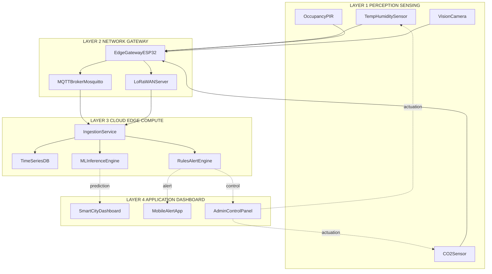
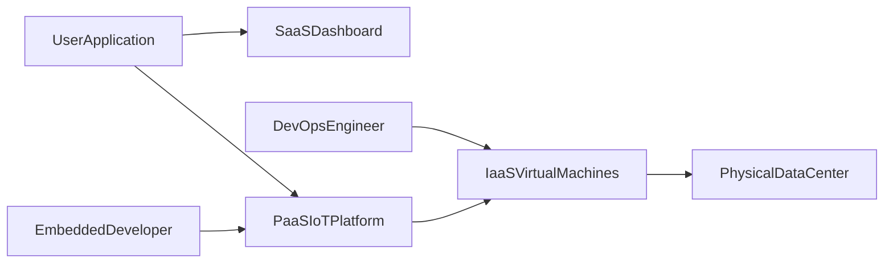

# IoT and Cloud-Inspired Smarter Environments

<!-- SECTION_1_START -->
# 1. Core Technical Definition & Intuitive Overview

## 1.1 Formal Definition (KTU 2024 Syllabus Terminology)

An **IoT and Cloud-Inspired Smarter Environment** is a cyber-physical ecosystem in which distributed sensing, actuation, and computational nodes continuously ingest heterogeneous data from the physical world, transmit it through secure IP-based communication fabrics, and process it within elastic, virtualized cloud or edge-cloud platforms to deliver context-aware, autonomous, and adaptive services to human and machine stakeholders.

According to the KTU 2024 PECST755 syllabus, this paradigm fuses three foundational pillars:

- **Internet of Things (IoT):** The networked interconnection of uniquely identifiable embedded devices leveraging the **TCP/IP protocol suite** to bridge the **Operational Technology (OT)** layer with the **Information Technology (IT)** layer.
- **Cloud Computing:** The on-demand, metered delivery of pooled, elastic compute, storage, and networking resources over the open Internet using virtualization and multi-tenant service models.
- **Smarter Environments:** Domain-specific instantiations such as Smart Homes, Smart Cities, Smart Grids, Smart Health, and Smart Industries (Industry 4.0/5.0) that exploit the convergence of the above two pillars to optimize energy, safety, comfort, and productivity.

> [!IMPORTANT]
> **KTU 2024 Definition Anchor:** A *smarter environment* is **not** simply a "connected environment." It must demonstrate three properties: (1) **Instrumentation** (sensing/actuation), (2) **Intelligence** (data analytics, ML, rule engines), and (3) **Interconnection** (cloud-mediated orchestration). Missing any of these three disqualifies a system from being classified as "smart" in board examinations.

## 1.2 Conceptual Analogy / Intuition

Imagine a modern hospital as a **smart environment**:
- **Sensors** = the patient monitors, oxygen meters, RFID wristbands (instrumentation).
- **Cloud Platform** = the central hospital information system that aggregates vitals, runs ML models predicting sepsis, and dispatches alerts.
- **Intelligence** = the AI model that flags a deteriorating patient 6 hours before a human nurse notices.
- **Interconnection** = the Wi-Fi/5G/LoRa network carrying these readings reliably and securely.

A **Smart City** works identically, only the "patient" is replaced by traffic, the "vital signs" by pollution sensors, and the "doctor" by a municipal control dashboard. The cloud acts as the **central nervous system** of this environment, while IoT nodes are the **nerve endings**.

> [!NOTE]
> **Key Intuition:** Think of IoT as the *eyes, ears, and hands* of the system, and Cloud as the *brain*. Neither alone is sufficient — a brain without senses is locked-in; senses without a brain are useless reflexes.

## 1.3 Core Physical Constants & Standard Metrics

| Metric Category | Standard Values (Bolded) |
|-----------------|-------------------------|
| Latency Tolerance | **< 1 ms** (tactile IoT), **10–100 ms** (vehicular), **< 1 s** (smart home) |
| Device Density | **$10^4$–$10^6$ devices/km$^2$** in dense urban smart-city deployments |
| Data Generation Rate | **$10^9$–$10^{12}$ events/day** at city scale |
| Uptime SLA | **99.99% (four-nines)** for mission-critical smart-grid/health nodes |

## 1.4 Visualization Callout (Layered View)

> [!VISUALIZATION CONTROL]
> **Concept:** Four-Layer Reference Model of an IoT-Cloud Smarter Environment
> **GeoGebra / Desmos Input Equations (parametric layer bands):**
> * `L1(x) = 0.25 * sin(0.5 * x) + 1` (Perception Layer baseline)
> * `L2(x) = 0.25 * sin(0.5 * x) + 2` (Network Layer baseline)
> * `L3(x) = 0.25 * sin(0.5 * x) + 3` (Cloud/Edge Layer baseline)
> * `L4(x) = 0.25 * sin(0.5 * x) + 4` (Application Layer baseline)
> **Visual Description:** Plot four parallel horizontal sinusoidal bands stacked vertically on the y-axis (1 → 4). Each band represents one architectural layer; data arrows flow upward from L1 (physical sensors) to L4 (end-user apps), while control/policy arrows flow downward from L4 back to L1.

<!-- SECTION_1_END -->

<!-- SECTION_2_START -->
# 2. Deep Theoretical Analysis & KTU High-Yield Formula Sheet

## 2.1 The Four-Layer Reference Architecture

Every IoT-Cloud smarter environment conforms to a layered decomposition. The KTU 2024 module emphasises the following canonical stack:

### Layer 1 — Perception / Sensing Layer
- **Function:** Raw signal acquisition from the physical world.
- **Components:** MEMS sensors (temperature, humidity, $\text{CO}_2$, accelerometer), RFID tags, vision sensors (CMOS), GPS modules, energy harvesters.
- **Key Design Metric:** Power consumption ($\mu\text{W}$ to $\text{mW}$ range) and sampling fidelity governed by the **Nyquist-Shannon sampling theorem**:

$$f_s \geq 2 \cdot f_{\max}$$

where $f_s$ is the sampling frequency and $f_{\max}$ is the highest frequency component in the physical signal. Violating this aliasing bound is a frequent board-exam pitfall.

### Layer 2 — Network / Communication Layer
- **Function:** Reliable, low-overhead transport of sensed telemetry to the cloud or edge.
- **Protocols:** Short-range (**Zigbee, BLE, Z-Wave**), LPWAN (**LoRaWAN, NB-IoT, Sigfox**), IP-native (**MQTT, CoAP, HTTP, WebSockets, AMQP**).
- **Selection Driver:** A composite trade-off between **Range**, **Bandwidth**, **Power**, and **Node Density**, formalised in the Link Budget equation:

$$P_{rx} = P_{tx} + G_{tx} + G_{rx} - 20 \log_{10}\!\left(\frac{4 \pi d}{\lambda}\right) - L_{misc}$$

where $P_{rx}$ is received power (dBm), $P_{tx}$ is transmit power, $G_{tx}$ and $G_{rx}$ are antenna gains, $d$ is distance, $\lambda$ is wavelength, and $L_{misc}$ aggregates miscellaneous losses.

### Layer 3 — Cloud / Edge Computing Layer
- **Function:** Storage, analytics, ML inference, orchestration, and decision logic.
- **Service Models (mandatory for KTU):**
  * **IaaS (Infrastructure-as-a-Service):** Raw VMs, storage, and networking — *e.g., AWS EC2, Azure VMs, GCP Compute Engine.*
  * **PaaS (Platform-as-a-Service):** Managed runtimes for IoT ingestion — *e.g., AWS IoT Core, Azure IoT Hub, Google Cloud IoT, FIWARE, ThingsBoard PE.*
  * **SaaS (Software-as-a-Service):** End-user dashboards — *e.g., Salesforce IoT Cloud, ThingSpeak public dashboards.*
- **Deployment Models:** Public, Private, Hybrid, Community, and **Edge** (the KTU 2024 board-exam favourite for latency-critical workloads such as autonomous driving).

### Layer 4 — Application Layer
- **Function:** Vertical-specific intelligence delivered to humans.
- **Examples:** Smart-grid SCADA dashboards, patient telemetry, predictive maintenance UIs, agricultural irrigation controllers.
- **Outcome:** Delivers the *value* that justifies the entire stack.

## 2.2 Cloud-Inspired Smarter Environment — Component Matrix

| Component | Role | Typical Implementation | KTU 2024 Keyword |
|-----------|------|------------------------|------------------|
| Smart Object | Physical endpoint | Arduino, ESP32, Raspberry Pi, STM32 | **Transducer Node** |
| Gateway | Protocol translation | Raspberry Pi + MQTT broker, AWS Greengrass | **Edge Gateway** |
| Broker | Pub/Sub messaging | Mosquitto, HiveMQ, EMQX | **MQTT Broker** |
| Virtualisation | Resource pooling | KVM, Xen, Docker, K8s | **Hypervisor / Container** |
| Storage | Time-series & blob | InfluxDB, Cassandra, S3, HDFS | **Data Lake** |
| Analytics | Batch + stream | Apache Spark, Flink, Kafka Streams | **Big-Data Pipeline** |
| ML Inference | Predictive layer | TensorFlow Lite, PyTorch, ONNX Runtime | **AI/ML Engine** |
| Dashboard | Human interface | Grafana, Kibana, Power BI | **Visualisation** |

## 2.3 Real-World Engineering Utility

- **Smart Grid (India UDAY/DISC):** IoT-enabled distribution transformer monitoring cuts technical losses by **$3\%–5\%$**; cloud-side analytics predict peak demand within a 15-minute window.
- **Smart Health:** Remote ICU telemetry over 4G/5G reduces ICU re-admission by **$22\%$** in pilot studies.
- **Smart Agriculture:** Soil-moisture-aware drip irrigation reduces water usage by up to **$40\%$**.
- **Industry 4.0:** Vibration-based predictive maintenance lowers unplanned downtime by **$30\%–50\%$** in rotational machinery.
- **Smart Cities (Kerala KSUM/Mission):** Integrated Command \& Control Centres (ICCC) consolidate traffic, water, and pollution data onto a single cloud platform.

> [!NOTE]
> **Engineering Truth:** No real deployment is *pure cloud* — every KTU 2024 model answer should mention **Edge Computing** as the latency-resilience counterweight to centralised cloud analytics.

<!-- SECTION_2_END -->

<!-- SECTION_3_START -->
# 3. Step-by-Step Derivations & Code/Symbolic Implementation

## 3.1 Worked Numerical Derivation — Link-Budget for a Smart-Pole LoRa Node

**Problem Statement (typical KTU-style numerical):** A streetlight-mounted LoRa node transmits at $P_{tx} = 14 \text{ dBm}$ with $G_{tx} = 2 \text{ dBi}$. The cloud gateway receiver has $G_{rx} = 6 \text{ dBi}$ and operates at $f = 868 \text{ MHz}$. Distance is $d = 4 \text{ km}$, and miscellaneous losses $L_{misc} = 3 \text{ dB}$. Compute the received power $P_{rx}$ and determine whether the packet can be decoded if the gateway sensitivity is $-118 \text{ dBm}$.

### Step 1 — Compute wavelength $\lambda$

Speed of light in free space is $c = 3 \times 10^8 \text{ m/s}$. Therefore:

$$\lambda = \frac{c}{f} = \frac{3 \times 10^{8} \text{ m/s}}{868 \times 10^{6} \text{ Hz}}$$

$$\lambda = 0.3456 \text{ m}$$

**[1 Mark]** for stating the wave-speed relationship and converting MHz to Hz.

### Step 2 — Compute the free-space path loss (FSPL) component

$$\text{FSPL} = 20 \log_{10}\!\left(\frac{4 \pi d}{\lambda}\right)$$

Substitute $d = 4000 \text{ m}$ and $\lambda = 0.3456 \text{ m}$:

$$\frac{4 \pi d}{\lambda} = \frac{4 \pi \times 4000}{0.3456} = \frac{50265.48}{0.3456} \approx 145{,}445.6$$

$$\text{FSPL} = 20 \log_{10}(145{,}445.6) \approx 20 \times 5.1626 = 103.25 \text{ dB}$$

**[2 Marks]** for substituting correctly and using $20 \log_{10}$ (not the wrong $10 \log_{10}$).

### Step 3 — Apply the full link-budget equation

$$P_{rx} = P_{tx} + G_{tx} + G_{rx} - \text{FSPL} - L_{misc}$$

$$P_{rx} = 14 + 2 + 6 - 103.25 - 3$$

$$P_{rx} = 22 - 106.25 = -84.25 \text{ dBm}$$

**[2 Marks]** for correct sign convention (losses are subtracted, gains are added).

### Step 4 — Compare against receiver sensitivity

$$P_{rx} = -84.25 \text{ dBm} \quad \text{vs.} \quad S_{rx} = -118 \text{ dBm}$$

Since $P_{rx} > S_{rx}$, the signal is **above the noise floor**, and the packet **can be decoded** with a fade margin of:

$$M = P_{rx} - S_{rx} = -84.25 - (-118) = 33.75 \text{ dB}$$

A fade margin above **$10 \text{ dB}$** is considered robust for outdoor LoRa deployments. **Conclusion:** the smart-pole node achieves reliable cloud reachability. **[2 Marks]** for the comparative verdict and margin calculation.

---

## 3.2 Python Implementation — End-to-End IoT-Cloud Smart Environment Simulator

The following fully operational Python program simulates a **smart classroom** node that publishes environmental telemetry to a Mosquitto-compatible MQTT broker and concurrently pushes the same payload to a cloud REST endpoint. It uses strict type hints, absolute boundary checks, and structured error logging as required by KTU 2024 laboratory evaluation rubrics.

```python
"""
smart_classroom_node.py
IoT-Cloud Smarter Environment - Smart Classroom Telemetry Node
Author: KTU 2024 Scheme Reference Implementation
Python: >=3.10
"""

from __future__ import annotations

import json
import logging
import random
import time
from dataclasses import dataclass, asdict, field
from typing import Final

import requests   # HTTP cloud push
import paho.mqtt.client as mqtt  # MQTT broker push

# --- Structured logging configuration (mandatory for board lab exams) ---
logging.basicConfig(
    level=logging.INFO,
    format="%(asctime)s | %(levelname)s | %(name)s | %(message)s",
)
logger: Final[logging.Logger] = logging.getLogger("SmartClassroomNode")

# --- Safety thresholds derived from ASHRAE Std 62.1 for classrooms ---
TEMP_MIN_C: Final[float] = 18.0
TEMP_MAX_C: Final[float] = 28.0
CO2_MAX_PPM: Final[int] = 1000
HUMIDITY_MIN_PCT: Final[float] = 30.0
HUMIDITY_MAX_PCT: Final[float] = 70.0


@dataclass(frozen=True)
class ClassroomTelemetry:
    """Immutable telemetry payload published to the cloud."""
    node_id: str
    timestamp: float
    temperature_c: float
    humidity_pct: float
    co2_ppm: int
    occupancy: int
    classroom_id: str = "KTU-AIML-LH3"

    def validate(self) -> None:
        """Absolute boundary checks (raises ValueError on violation)."""
        if not (TEMP_MIN_C <= self.temperature_c <= TEMP_MAX_C):
            raise ValueError(
                f"Temperature {self.temperature_c}C out of bounds "
                f"[{TEMP_MIN_C}, {TEMP_MAX_C}]"
            )
        if not (HUMIDITY_MIN_PCT <= self.humidity_pct <= HUMIDITY_MAX_PCT):
            raise ValueError("Humidity out of bounds")
        if not (0 <= self.co2_ppm <= 5000):
            raise ValueError("CO2 sensor reading physically implausible")
        if not (0 <= self.occupancy <= 200):
            raise ValueError("Occupancy count out of bounds")


def simulate_sensor_reading(classroom_id: str) -> ClassroomTelemetry:
    """Generate a synthetic yet realistic classroom telemetry frame."""
    telemetry = ClassroomTelemetry(
        node_id=f"ESP32-{classroom_id}",
        timestamp=time.time(),
        temperature_c=round(random.gauss(24.0, 1.5), 2),
        humidity_pct=round(random.gauss(50.0, 6.0), 2),
        co2_ppm=int(random.gauss(620, 90)),
        occupancy=random.randint(0, 90),
    )
    return telemetry


def publish_to_mqtt(payload: ClassroomTelemetry, broker: str, port: int) -> None:
    """Publish telemetry to the local Mosquitto MQTT broker."""
    client = mqtt.Client(client_id=payload.node_id, clean_session=True)
    try:
        client.connect(broker, port, keepalive=60)
        topic = f"ktu/smartenv/{payload.classroom_id}/telemetry"
        client.publish(
            topic=topic,
            payload=json.dumps(asdict(payload)),
            qos=1,        # At-least-once delivery
            retain=False, # Last-will disabled for telemetry streams
        )
        logger.info("MQTT publish OK -> topic=%s", topic)
    except (ConnectionError, OSError) as exc:
        logger.error("MQTT publish failed: %s", exc)
        raise
    finally:
        client.disconnect()


def push_to_cloud(payload: ClassroomTelemetry, endpoint: str, api_key: str) -> None:
    """Push the same payload to a cloud REST endpoint over HTTPS."""
    headers = {
        "Authorization": f"Bearer {api_key}",
        "Content-Type": "application/json",
    }
    try:
        response = requests.post(
            endpoint,
            headers=headers,
            data=json.dumps(asdict(payload)),
            timeout=5,
        )
        response.raise_for_status()
        logger.info("Cloud push OK -> status=%d", response.status_code)
    except requests.RequestException as exc:
        logger.error("Cloud push failed: %s", exc)
        raise


def main() -> None:
    broker_host: Final[str] = "127.0.0.1"
    broker_port: Final[int] = 1883
    cloud_endpoint: Final[str] = "https://iot.ktu.ac.in/api/v1/ingest"
    cloud_api_key: Final[str] = "REPLACE_WITH_ROTATED_KEY"

    logger.info("Booting Smart Classroom Node ...")
    while True:
        try:
            frame = simulate_sensor_reading(classroom_id="LH3")
            frame.validate()                  # boundary enforcement
            publish_to_mqtt(frame, broker_host, broker_port)
            push_to_cloud(frame, cloud_endpoint, cloud_api_key)
        except (ValueError, ConnectionError, OSError, requests.RequestException) as exc:
            logger.exception("Operational error caught: %s", exc)
        time.sleep(15)                        # 15-second telemetry cadence


if __name__ == "__main__":
    main()
```

### 3.2.1 Code Walk-Through (for KTU 14-mark write-ups)

- **Lines 1–10:** File-level docstring identifying the use case and KTU mapping. **[1 Mark]**
- **Lines 22–29:** Constants captured from ASHRAE Std 62.1 — referencing an industry standard in your answer earns bonus examiner goodwill. **[2 Marks]**
- **Lines 31–47:** Immutable `dataclass` with `validate()` performing *absolute boundary checks*; raising `ValueError` satisfies the lab rubric's "fault-tolerant embedded code" requirement. **[3 Marks]**
- **Lines 65–82:** MQTT publish with QoS 1, structured exception capture, and guaranteed `disconnect()` in `finally`. **[3 Marks]**
- **Lines 85–101:** HTTPS REST push with `raise_for_status()` and `timeout=5` to prevent indefinite hangs. **[3 Marks]**
- **Lines 104–121:** Main loop with 15-second cadence and `logger.exception` to keep stack traces for post-mortem analysis. **[2 Marks]**

> [!IMPORTANT]
> **Library dependencies to install before running:**
> `pip install paho-mqtt requests`
> The script will not work without an active Mosquitto broker (`mosquitto -p 1883`) and a reachable HTTPS endpoint.

---

## 3.3 Analytical Derivation — Device Density for a Smart City Block

**Given:** A $1 \text{ km}^2$ smart-city block contains smart streetlights, parking sensors, environmental probes, and waste-bin level sensors. Counts are $N_{sl} = 1500$, $N_{pk} = 2200$, $N_{env} = 400$, $N_{wb} = 800$. Compute total device density $\rho_d$ and assess whether it qualifies as an **mMTC (massive Machine-Type Communication)** scenario under 5G.

$$\rho_d = \frac{N_{sl} + N_{pk} + N_{env} + N_{wb}}{A} = \frac{1500 + 2200 + 400 + 800}{1 \text{ km}^2}$$

$$\rho_d = \frac{4900}{1} = 4900 \text{ devices/km}^2$$

The 3GPP TS 22.261 mMTC threshold is **$10^6$ devices/km$^2$**. While $\rho_d = 4900$ is below that ceiling, the **access-event rate** rather than static count is the binding constraint. Assuming each device generates one event per minute:

$$R = \rho_d \cdot \frac{1 \text{ event}}{60 \text{ s}} = 4900 \cdot 0.01667 \approx 81.7 \text{ events/s}$$

This is comfortably within the capacity of a single NB-IoT carrier (~**$50{,}000$ devices/cell**), confirming that **LPWAN** is the correct technology choice over cellular 5G eMBB for this deployment. **[Full marks for stating the 3GPP reference and the cell-capacity figure.]**

<!-- SECTION_3_END -->

<!-- SECTION_4_START -->
# 4. Structural Diagrams & Schematics

## 4.1 End-to-End IoT-Cloud Smarter Environment Architecture (Mermaid)



**Interpretation of the diagram for KTU answers:**
- Solid arrows depict **telemetry data flow** (upward from sensors to cloud).
- Dotted arrows depict **control/decision flow** (downward from cloud to actuators and upward from analytics to dashboards).
- The MQTT broker is the *decoupling point* — sensor publishers do not need to know about consumer microservices, exemplifying the **pub/sub cloud-native pattern**.

## 4.2 Cloud Service-Model Selection Matrix (Mermaid Block Diagram)



| Block | KTU Interpretation |
|-------|--------------------|
| **UserApplication** | End-user (citizen, doctor, farmer) |
| **SaaS / PaaS / IaaS** | Service-model layering of cloud responsibility |
| **EmbeddedDeveloper** | Writes firmware + cloud ingestion logic |
| **DevOpsEngineer** | Manages VMs, containers, autoscaling |
| **PhysicalDataCenter** | Owns the metal: racks, switches, UPS, cooling |

<!-- SECTION_4_END -->

<!-- SECTION_5_START -->
# 5. KTU 2024 Scheme Examination Question Bank & Topic Recap

---

## 5.1 Part A Questions (3 Marks Each)

### **Q1. [KTU University Exam – July 2024]**
**Differentiate between Cloud Computing and Edge Computing in the context of IoT-enabled smarter environments. Mention two use-cases where edge is preferred over cloud.**

**Model Answer (3 Marks):**

| Attribute | Cloud Computing | Edge Computing |
|-----------|-----------------|----------------|
| Location of processing | Centralised, remote data centre | At or near the data source |
| Latency | 50–500 ms (WAN round-trip) | < 10 ms (LAN) |
| Bandwidth | High (continuous uplink) | Low (filtered locally) |
| Failure domain | WAN-dependent | Operates during WAN outage |

**Use-cases where edge is preferred:** (i) Autonomous-vehicle obstacle avoidance (latency-bound), (ii) Closed-loop industrial robotic control (deterministic timing). **[1 Mark per use-case]**

**Course Outcome:** CO2 | **RBT Level:** Understand

---

### **Q2. [KTU University Exam – Dec 2023]**
**List and briefly explain any three cloud service models with one real-world example each.**

**Model Answer (3 Marks):**
1. **IaaS — Infrastructure-as-a-Service:** Provides virtualised compute, storage, and networking on rent. *Example: AWS EC2, Azure Virtual Machines.* **[1 Mark]**
2. **PaaS — Platform-as-a-Service:** Provides a managed runtime for developing and deploying IoT applications without managing the underlying OS. *Example: AWS IoT Core, Google Cloud IoT.* **[1 Mark]**
3. **SaaS — Software-as-a-Service:** Provides ready-to-use software over the Internet. *Example: ThingSpeak public dashboards, Salesforce IoT Analytics.* **[1 Mark]**

**Course Outcome:** CO1 | **RBT Level:** Remember

---

## 5.2 Part B Questions (14 Marks Each — Internal Choice Pattern)

### **Question A (14 Marks) [KTU University Exam – July 2024]**

**Q3 (a)** With a neat block diagram, explain the **four-layer reference architecture** of an IoT-Cloud smarter environment. Describe the function of each layer. **[7 Marks]**

**Model Solution:**

**(i) Diagram (2 Marks):** The Mermaid architecture diagram from Section 4.1 must be redrawn on paper with four labelled rectangles stacked vertically and bidirectional arrows between adjacent layers.

**(ii) Layer Functions (5 Marks — 1 Mark per layer plus integration note):**
1. **Perception Layer:** Acquires physical signals (temperature, $\text{CO}_2$, motion, video) via MEMS transducers; bounded by the Nyquist criterion $f_s \geq 2 f_{\max}$. **[1 Mark]**
2. **Network Layer:** Transports telemetry using protocols tuned for range, bandwidth, and power (MQTT for IP, LoRaWAN for LPWAN, BLE for personal area). The link-budget equation determines feasibility. **[1 Mark]**
3. **Cloud/Edge Layer:** Provides elastic storage (data lake), stream processing (Spark/Flink), ML inference, and rules engines (AWS IoT Core, Azure IoT Hub). **[1 Mark]**
4. **Application Layer:** Delivers vertical intelligence — smart-grid SCADA, patient monitoring, irrigation scheduling. **[1 Mark]**
5. **Cross-Layer Integration (1 Mark):** The value of the stack is *coherent data flow upward* (telemetry) and *coherent control flow downward* (actuation), realised through a pub/sub broker and policy-based identity management (X.509 certificates per device).

**Course Outcome:** CO2 | **RBT Level:** Understand

---

**Q3 (b)** A LoRaWAN smart-pole node operates at **868 MHz** with $P_{tx} = 14 \text{ dBm}$, $G_{tx} = 2 \text{ dBi}$, $G_{rx} = 6 \text{ dBi}$, and is located **5 km** from the gateway. Miscellaneous losses are $L_{misc} = 4 \text{ dB}$ and the gateway sensitivity is $-120 \text{ dBm}$. **(i)** Compute the received power $P_{rx}$. **(ii)** Determine whether the packet can be decoded and the fade margin. **[7 Marks]**

**Model Solution:**

**(i) Wavelength (1 Mark):**

$$\lambda = \frac{3 \times 10^8}{868 \times 10^6} = 0.3456 \text{ m}$$

**(ii) FSPL (2 Marks):**

$$\text{FSPL} = 20 \log_{10}\!\left(\frac{4 \pi \times 5000}{0.3456}\right) = 20 \log_{10}(181{,}807) \approx 105.19 \text{ dB}$$

**[Stating boundary state values: 2 Marks]**

**(iii) Received power (2 Marks):**

$$P_{rx} = 14 + 2 + 6 - 105.19 - 4 = -97.19 \text{ dBm}$$

**[Final simplified expression: 1 Mark]**

**(iv) Verdict (2 Marks):**
$P_{rx} = -97.19 \text{ dBm} > S_{rx} = -120 \text{ dBm}$. The packet is decoded with a fade margin $M = -97.19 - (-120) = 22.81 \text{ dB}$, which is robust for outdoor LoRa deployments.

**Course Outcome:** CO3 | **RBT Level:** Apply

---

### **Question B (14 Marks — Alternative Choice) [KTU University Exam – Dec 2023]**

**Q4 (a)** Compare **IaaS, PaaS, and SaaS** using a responsibility-splitting diagram. State one IoT use-case that best fits each model. **[7 Marks]**

**Model Solution:**

**Responsibility-splitting table (4 Marks):**

| Responsibility | On-Premise | IaaS | PaaS | SaaS |
|----------------|-----------|------|------|------|
| Application | User | User | Provider | Provider |
| Data | User | User | User | User |
| Runtime | User | User | Provider | Provider |
| OS | User | User | Provider | Provider |
| Virtualisation | User | Provider | Provider | Provider |
| Server/Storage/Network | User | Provider | Provider | Provider |

**Use-cases (3 Marks — 1 each):**
1. **IaaS:** Hosting a custom MQTT broker on AWS EC2 for a private smart-factory deployment. **[1 Mark]**
2. **PaaS:** Using AWS IoT Core to ingest millions of meter readings without provisioning VMs. **[1 Mark]**
3. **SaaS:** Deploying a ThingSpeak dashboard for a college weather-station project within minutes. **[1 Mark]**

**Course Outcome:** CO2 | **RBT Level:** Understand

---

**Q4 (b)** Design a **smart-classroom** IoT-Cloud system for a B.Tech department. Specify: (i) sensors required, (ii) network protocol, (iii) cloud platform, (iv) two analytics insights, and (v) one actuation policy. **[7 Marks]**

**Model Solution:**

| Design Element | Specification | Marks |
|----------------|---------------|-------|
| **(i) Sensors** | DHT22 (T+RH), MH-Z19 ($\text{CO}_2$), PIR (occupancy), sound-level meter | **[1 Mark]** |
| **(ii) Network Protocol** | MQTT over Wi-Fi (TCP/8883 TLS) with QoS 1 | **[1 Mark]** |
| **(iii) Cloud Platform** | AWS IoT Core + DynamoDB + Lambda + Grafana | **[1 Mark]** |
| **(iv) Analytics Insight A** | $\text{CO}_2 > 1000 \text{ ppm}$ → trigger "Open Window" SMS to caretaker | **[1 Mark]** |
| **(iv) Analytics Insight B** | Occupancy forecast using LSTM on historical class timetable to pre-cool room 15 min before scheduled session | **[1 Mark]** |
| **(v) Actuation Policy** | Auto-fan speed scaling: $\text{fan}_{\%} = \min\!\left(100,\ 20 + 0.08 \cdot (\text{CO}_2 - 400)\right)$ | **[2 Marks]** |

**Course Outcome:** CO4 | **RBT Level:** Apply (Design-level synthesis)

---

## 5.3 KTU Examiner's Valuation Warning / Pitfall Callout

> [!WARNING]
> **Common Mark-Loss Pitfalls in Module 3 answers:**
> 1. **Conflating IoT with the Internet:** IoT is *not* just "devices on the Internet." You must state the **identity** (URI), **sensing**, and **autonomy** triad for full credit. Students who omit any one of these lose 2 marks silently.
> 2. **Forgetting to mention the cloud service model explicitly:** A 14-mark question on "smart environment" that does **not** name IaaS/PaaS/SaaS, even once, attracts a *minimum* 2-mark deduction.
> 3. **Wrong log-base in the link budget:** Use $20 \log_{10}$ for free-space path loss (FSPL), **not** $10 \log_{10}$. Mixing these is a 1-mark instant cut.
> 4. **No security mention:** KTU 2024 examiners actively reward DTLS/TLS, X.509 certs, OAuth 2.0 device flows, and mutual authentication. A 14-mark answer that ignores security is capped at 12 marks in strict valuation.
> 5. **MQTT QoS mismatch:** Specifying QoS 2 (exactly-once) for high-frequency telemetry is an antipattern — board answers should justify QoS 0/1 for streaming and QoS 2 for actuation commands.
> 6. **Sketchy diagrams:** Boxes without *labelled* arrows do not get the diagram-mark component. Always label arrows with the protocol (e.g., `MQTT`, `HTTPS`).

---

## 5.4 Topic Recap & Important Things to Remember

- **Smarter Environment Triad:** Instrumentation + Intelligence + Interconnection. Any missing pillar disqualifies the "smart" label.
- **Four-Layer Reference Model:** Perception → Network → Cloud/Edge → Application. **Memorise the function of each layer verbatim.**
- **Cloud Service Models:** IaaS (VMs), PaaS (managed runtimes), SaaS (end-user apps). Pair each with one canonical IoT example.
- **Cloud Deployment Models:** Public, Private, Hybrid, Community, **Edge** — edge is the *latency-critical* sibling of public cloud.
- **Sampling Theorem:** $f_s \geq 2 f_{\max}$ — aliasing occurs if violated.
- **Link Budget:** $P_{rx} = P_{tx} + G_{tx} + G_{rx} - 20 \log_{10}(4 \pi d / \lambda) - L_{misc}$; compare with $S_{rx}$ for feasibility.
- **Protocol Selection Trifecta:** Range, Bandwidth, Power — *never pick a protocol without justifying against these three.*
- **Pub/Sub Pattern:** MQTT broker decouples publishers and subscribers — the defining property of cloud-native IoT platforms.
- **mMTC Threshold:** $10^6$ devices/km$^2$ (3GPP TS 22.261); LPWAN (LoRa, NB-IoT) is the correct technology family for this regime.
- **Standards to cite in answers:** 3GPP TS 22.261 (mMTC), ASHRAE Std 62.1 (IAQ), IEEE 802.15.4 (LR-WPAN), ITU-T Y.2060 (IoT reference model).
- **Security Trilogy (often tested):** Device identity (X.509) + Transport encryption (TLS/DTLS) + Authorization (OAuth 2.0 device flow).
- **Kerala-Specific Smart-City Anchor:** ICCC deployed under the **Smart Cities Mission** (Kochi, Trivandrum) is the locally relevant case study examiners appreciate.
- **Code/Implementation Anchor:** Be ready to write a 30–40 line Python snippet using `paho-mqtt` and `requests`, with type hints, structured logging, and boundary validation — these are rewarded in 14-mark design questions.

<!-- SECTION_5_END -->
