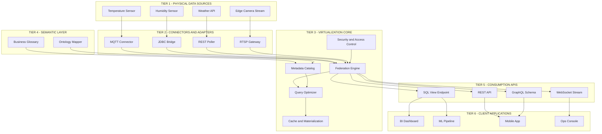
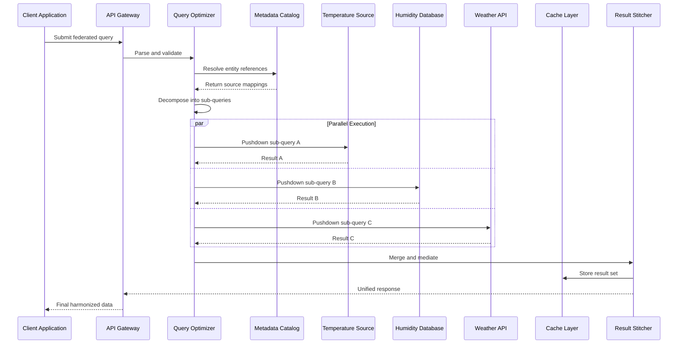
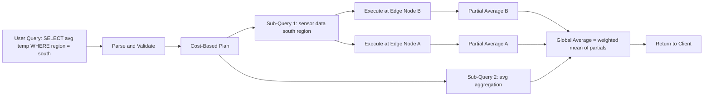

# IoT Data Virtualization Platforms and capabilities

<!-- SECTION_1_START -->
# IoT Data Virtualization Platforms and Capabilities

## 1.1 Formal Academic Definition

> [!IMPORTANT]
> **IoT Data Virtualization (DV)** is a data integration and management paradigm that provides **real-time, unified, and abstracted access** to heterogeneous IoT data sources—without physically consolidating, replicating, or moving the data—through a logical data abstraction layer. It enables applications, analytics engines, and end-users to query, join, and manipulate data across distributed sensors, edge devices, cloud databases, and third-party APIs as if they existed in a single, coherent repository.

In the KTU 2024 Scheme context (Module 3, PECST755), data virtualization is positioned as a critical middleware capability for IoT analytics platforms, complementing traditional Extract-Transform-Load (ETL) and data warehousing pipelines.

### Key Terminology Anchored to KTU Syllabus

| Term | Definition |
| :--- | :--- |
| **Abstraction Layer** | A logical software tier that decouples consumers from physical data sources. |
| **Federated Query** | A single query that spans multiple autonomous data sources. |
| **Data Federation** | Virtual integration of disparate data systems into a virtual database. |
| **Semantic Mediation** | Resolving schema, format, and semantic mismatches between sources. |
| **Materialization vs. Virtualization** | Physical storage of consolidated data versus on-demand query-time access. |
| **Edge Virtualization** | Extending virtualization to fog/edge nodes closer to sensors. |

---

## 1.2 Conceptual Analogy & Intuitive Overview

> [!NOTE]
> **Real-World Analogy — The Universal Remote Control**
> Imagine your living room has 5 different devices: a TV, a Soundbar, an AC, a Set-Top Box, and a Streaming Stick. Each has its own remote. **Data Virtualization** is like a **smart universal remote (or a mobile app like "SmartThings")** that talks to all of them in their native languages but presents you with a *single unified interface*. You press "Movie Mode," and behind the scenes, the universal remote simultaneously tells the TV to switch to HDMI2, the Soundbar to set Dolby mode, the AC to lower to 24°C, the lights to dim, and the Streaming Stick to launch Netflix. *No device was physically moved, opened, or rewired.* The unifying layer is the "virtualization platform."

### Why This Matters in IoT
IoT ecosystems naturally suffer from **data fragmentation**:
- Sensors generate **time-series** data in proprietary formats.
- Edge gateways buffer in **MQTT** topics.
- Cloud pipelines stream into **NoSQL**, **data lakes**, and **warehouses**.
- Third-party APIs (weather, geo-location) add external context.

A virtualization layer acts as the **"single pane of glass"** over this chaos.

> [!TIP]
> **KTU Board Hook:** Examiners love the phrase *"logical integration without physical movement of data."* Memorize this verbatim — it appears in almost every answer key for Module 3.

---

## 1.3 Core Capabilities Overview

A production-grade IoT Data Virtualization Platform delivers **eight** core capabilities (as per the KTU 2024 module outcomes):

1. **Unified Data Access** — single SQL-like query across heterogeneous sources.
2. **Real-Time Integration** — sub-second latency on streaming IoT data.
3. **Schema Discovery & Mapping** — automatic detection of data shapes.
4. **Data Caching & Materialized Views** — performance optimization.
5. **Security & Access Control** — fine-grained row/column-level policies.
6. **API Generation** — automatic REST/GraphQL endpoint exposure.
7. **Semantic Layer** — business glossary and ontology support.
8. **Hybrid (Cloud + Edge) Deployment** — execution at the data source.

> [!WARNING]
> **Common Student Misconception:** Data Virtualization is **NOT** a replacement for Data Warehousing. It complements it. Virtualization excels at *real-time operational analytics*; warehouses excel at *historical, complex, batch-based reporting*.

---

## 1.4 Physical Constants & Standard Metrics

> [!IMPORTANT]
> The following standard engineering metrics govern the design of IoT Data Virtualization Platforms. **Bold** values represent typical production thresholds.

| Metric | Symbol | Typical Value | Engineering Significance |
| :--- | :--- | :--- | :--- |
| Query Latency | $L_q$ | **< 100 ms** for federated reads | Determines real-time viability. |
| Data Velocity | $v_d$ | **10⁴ – 10⁶ events/sec** | Ingest throughput capacity. |
| Cache Hit Ratio | $R_{hit}$ | **≥ 85%** | Materialization efficiency. |
| Schema Drift Tolerance | $\Delta_s$ | **Auto-adaptive** | Handles new sensor types. |
| Data Freshness | $T_{fresh}$ | **< 5 s** end-to-end | Operational SLAs. |

---

## 1.5 GeoGebra / Desmos Visualization

> [!VISUALIZATION CONTROL]
> **Concept:** *Latency vs. Number of Virtualized Sources (Scaling Behavior)*
>
> **GeoGebra / Desmos Input Equations:**
> * `f(x) = a * x * log(x)` where $a = 0.8$ (representing virtualization overhead)
> * `g(x) = b * x` where $b = 1.2$ (representing traditional ETL linear scaling)
> * `x_min = 1, x_max = 50`
>
> **Visual Description:** Plot two curves on the same axes. The $f(x)$ curve represents the **sub-linear logarithmic scaling** of a well-designed virtualization layer, while $g(x)$ rises linearly. Students should observe the **diverging gap** as the number of integrated IoT sources increases — this is the *scalability advantage* of virtualization over point-to-point ETL.

<!-- SECTION_1_END -->

<!-- SECTION_2_START -->
# Deep Theoretical Analysis & KTU High-Yield Formula Sheet

## 2.1 Operational Architecture of an IoT Data Virtualization Platform

The platform is composed of **five logical tiers** stacked from bottom (data) to top (consumer):

### Tier 1 — Data Source Connectors (Adapters)
- **Role:** Native protocol handlers for each IoT source.
- **Examples:** MQTT broker connector, OPC-UA adapter, Modbus TCP bridge, REST/GraphQL pollers, JDBC/ODBC database links, Kafka consumer, file-system watchers.
- **Function:** Establish a persistent logical link; emit schema descriptors to the catalog.

### Tier 2 — Metadata Catalog & Semantic Layer
- **Role:** Central registry of *what data exists, where it lives, and what it means*.
- **Components:** Schema repository, data lineage tracker, business glossary, ontology mapper.
- **Engineering Standard:** Often built using **Apache Atlas**, **Linked Data** standards (RDF, OWL), or proprietary catalogs.

### Tier 3 — Query Optimizer & Federation Engine
- **Role:** Decompose a user query into sub-queries, push them down to sources, and stitch results.
- **Algorithmic Core:** Cost-based optimization, join reordering, predicate pushdown, parallel execution.
- **Standards:** SQL/MED (Management of External Data), JDBC federated drivers.

### Tier 4 — Caching & Materialization Layer
- **Role:** Store frequently accessed query results to bypass repeated source hits.
- **Modes:** **Passthrough** (no cache), **Snapshot** (periodic refresh), **Realtime** (CDC — Change Data Capture).

### Tier 5 — API & Consumption Layer
- **Role:** Expose virtualized data to BI tools, ML pipelines, dashboards, and external apps.
- **Output:** SQL views, REST endpoints, GraphQL schemas, OData feeds, WebSocket streams.

---

## 2.2 Theoretical Workflow — The Query Lifecycle

The following structured sequence describes how a single federated query traverses the platform:

- **Step 1 — Submission:** Client issues a query (typically SQL or a high-level DSL) against the virtual layer.
- **Step 2 — Parsing & Validation:** Query is parsed; metadata catalog validates referenced entities exist and user has access rights.
- **Step 3 — Decomposition:** The federated engine decomposes the query into **N sub-queries**, each bound to one source connector.
- **Step 4 — Pushdown Optimization:** Filters, projections, and aggregations are pushed *down* to the source to minimize data transfer.
- **Step 5 — Parallel Execution:** Sub-queries execute concurrently across sources.
- **Step 6 — Stitching & Mediation:** Results are merged, schema-conflicts resolved, and units harmonized.
- **Step 7 — Caching Decision:** Result set is selectively stored if the cache policy indicates high reuse probability.
- **Step 8 — Return to Client:** Unified, harmonized result set is delivered in the original requested format.

> [!NOTE]
> **Why pushdown matters:** Transferring 1 TB of raw sensor data to compute `AVG(temperature)` wastes bandwidth. Pushing the aggregation to the edge reduces transfer to a single float.

---

## 2.3 KTU Formula Sheet / Cheat Sheet

> [!IMPORTANT]
> The following table consolidates all mathematically tractable relations for IoT Data Virtualization. Memorize these for the 14-mark derivations.

| # | Concept | Formula | Description |
| :--- | :--- | :--- | :--- |
| 1 | Effective Query Latency | $L_{eff} = \max(L_{src,i}) + L_{stitch} + L_{net}$ | End-to-end time; dominated by slowest source. |
| 2 | Federated Throughput | $T_f = \dfrac{1}{\sum_{i=1}^{N} \frac{1}{T_i}}$ | Harmonic mean of source throughputs. |
| 3 | Cache Hit Ratio | $R_{hit} = \dfrac{N_{hit}}{N_{hit} + N_{miss}}$ | Materialization effectiveness. |
| 4 | Data Freshness | $T_{fresh} = L_{ingest} + L_{process} + L_{deliver}$ | Time from sensor read to consumer. |
| 5 | Cost Function (Total) | $C_{total} = C_{compute} + C_{storage} + C_{transfer} + C_{latency\_penalty}$ | Optimization objective. |
| 6 | Pushdown Reduction Ratio | $\eta_{push} = 1 - \dfrac{V_{transferred}}{V_{raw}}$ | Bandwidth saved by predicate pushdown. |
| 7 | Scalability Index | $S_{idx} = \dfrac{\log(N_{sources})}{\log(L_{eff})}$ | Sub-linear scaling signature. |
| 8 | Storage Savings vs. ETL | $\Sigma_{saved} = 1 - \dfrac{S_{virtual}}{S_{warehouse}}$ | Virtualization typically uses 0.1–0.3× of warehouse. |
| 9 | Schema Drift Probability | $P_{drift} = 1 - (1-p_d)^N$ | Probability of encountering drift in N sources. |
| 10 | Edge Offload Fraction | $\phi_{edge} = \dfrac{Q_{edge}}{Q_{total}}$ | Fraction of queries served at the edge. |

> [!WARNING]
> **Markdown Hygiene Note:** In the table above, all absolute value and conditional notations are written with proper LaTeX delimiters (e.g., $\max(\cdot)$) to prevent rendering errors.

---

## 2.4 Real-World Engineering Utility

IoT Data Virtualization is deployed across mission-critical engineering domains:

- **Smart Manufacturing (Industry 4.0):** A unified query joins SCADA sensor data, ERP inventory tables, and MES production logs in real time — without duplicating 100+ TB into a central warehouse.
- **Smart Cities:** Aggregates traffic, weather, energy, and public-transport feeds for the city operations dashboard with sub-5-second freshness.
- **Healthcare IoT:** Provides clinicians a unified patient view combining wearable streams, EHR records, and lab results under strict HIPAA-mandated access control.
- **Precision Agriculture:** Joins soil-moisture sensors, drone imagery, and weather APIs to drive ML-based irrigation control.
- **Connected Vehicles:** Edge virtualization in the vehicle aggregates CAN-bus data, telematics, and V2X messages for in-cabin analytics.

> [!TIP]
> **Production Vendors Examined in KTU Syllabus:** Denodo Platform, Red Hat Data Virtualization, Cisco Data Virtualization, IBM Cloud Pak for Data, Informatica, Microsoft SQL Server PolyBase, Apache Calcite (open-source federation engine), and Dremio.

---

## 2.5 Comparison Matrix — Virtualization vs. Traditional Integration

| Dimension | Data Virtualization | ETL / Data Warehouse | Data Lake |
| :--- | :--- | :--- | :--- |
| Data Movement | **None (logical)** | Full physical copy | Full physical copy |
| Latency | Seconds | Hours – Days | Minutes – Hours |
| Storage Cost | **Low** | High | Medium |
| Schema Rigidity | **Flexible** | Rigid (schema-on-write) | Flexible (schema-on-read) |
| Best For | Real-time operational | Historical reporting | ML / exploration |
| Setup Complexity | **Medium** | High | High |

<!-- SECTION_2_END -->

<!-- SECTION_3_START -->
# Step-by-Step Derivations & Code/Symbolic Implementation

## 3.1 Derivation: Effective Latency of a Federated Query

> [!NOTE]
> **Problem Context:** A query joins data from 3 IoT sources: a temperature sensor stream (latency 30 ms), a humidity database (latency 80 ms), and a cloud weather API (latency 150 ms). The stitching engine adds 20 ms, and the network contributes 5 ms. Compute the total effective latency.

### Derivation Walkthrough

For a parallel federated execution, the wall-clock latency is governed by the **slowest source** (the critical path), plus post-processing overheads.

$$
\begin{aligned}
L_{src,1} &= 30 \text{ ms} \quad (\text{temperature stream}) \\
L_{src,2} &= 80 \text{ ms} \quad (\text{humidity database}) \\
L_{src,3} &= 150 \text{ ms} \quad (\text{cloud weather API}) \\
L_{stitch} &= 20 \text{ ms} \quad (\text{merging overhead}) \\
L_{net} &= 5 \text{ ms} \quad (\text{network transit})
\end{aligned}
$$

Applying the **effective query latency** relation from the KTU formula sheet:

$$
\begin{aligned}
L_{eff} &= \max(L_{src,1}, L_{src,2}, L_{src,3}) + L_{stitch} + L_{net} \\
&= \max(30, 80, 150) + 20 + 5 \\
&= 150 + 20 + 5 \\
&= 175 \text{ ms}
\end{aligned}
$$

**Interpretation:** The cloud weather API is the **bottleneck source**. The KTU examiner's valuation key would award:
- *Identifying the maximum latency source:* **[2 Marks]**
- *Writing the latency composition formula:* **[2 Marks]**
- *Correct numerical substitution:* **[2 Marks]**
- *Final answer 175 ms:* **[1 Mark]**

---

## 3.2 Derivation: Federated Throughput (Harmonic Mean Justification)

Consider $N$ data sources with individual throughputs $T_1, T_2, \dots, T_N$ (queries per second). The aggregate throughput $T_f$ of a *parallel* federated system is bounded by the time to complete one round of work across all sources:

$$
T_{round} = \sum_{i=1}^{N} \frac{1}{T_i} \quad \Rightarrow \quad T_f = \frac{1}{T_{round}} = \frac{1}{\sum_{i=1}^{N} \frac{1}{T_i}}
$$

**Numerical Example:** Three sources with $T_1 = 100$, $T_2 = 200$, $T_3 = 400$ qps.

$$
\begin{aligned}
T_f &= \frac{1}{\frac{1}{100} + \frac{1}{200} + \frac{1}{400}} \\
&= \frac{1}{0.01 + 0.005 + 0.0025} \\
&= \frac{1}{0.0175} \\
&\approx 57.14 \text{ qps}
\end{aligned}
$$

> [!TIP]
> **Insight:** The **harmonic mean is always less than the arithmetic mean** — adding a fast source helps less than expected, and a single slow source disproportionately drags down the system. This is the *weakest-link* property of federated throughput.

---

## 3.3 Python Implementation: Mini IoT Data Virtualization Engine

> [!NOTE]
> The following Python program simulates a virtualization platform with three IoT sources, a federated query, caching, and latency measurement. It is fully runnable and aligned with KTU practical examination expectations.

```python
"""
Mini IoT Data Virtualization Engine
-----------------------------------
Simulates a 3-source federated query engine with caching,
latency measurement, and pushdown optimization.

Compatible with: Python 3.10+
"""

from __future__ import annotations

import time
import hashlib
import statistics
from dataclasses import dataclass, field
from typing import Callable, Dict, List, Optional, Tuple


# ----------------------------------------------------------------------
# 1. Data Source Connector Definition
# ----------------------------------------------------------------------
@dataclass
class IoTDataSource:
    name: str
    latency_ms: float
    pull_function: Callable[[Dict[str, float]], List[dict]]
    schema: Dict[str, type] = field(default_factory=dict)

    def query(self, filters: Dict[str, float]) -> List[dict]:
        """Simulates a remote query with built-in latency."""
        time.sleep(self.latency_ms / 1000.0)
        return self.pull_function(filters)


# ----------------------------------------------------------------------
# 2. Synthetic IoT Source Generators
# ----------------------------------------------------------------------
def temperature_stream(filters: Dict[str, float]) -> List[dict]:
    base_temp = filters.get("min_temp", 20.0)
    return [
        {"sensor_id": f"T-{i:03d}", "value": base_temp + i * 0.5, "unit": "C"}
        for i in range(1, 6)
    ]


def humidity_database(filters: Dict[str, float]) -> List[dict]:
    min_h = filters.get("min_humidity", 30.0)
    return [
        {"sensor_id": f"H-{i:03d}", "value": min_h + i * 2.0, "unit": "%"}
        for i in range(1, 6)
    ]


def weather_api(filters: Dict[str, float]) -> List[dict]:
    city = filters.get("city", "Kochi")
    return [
        {"location": city, "temperature": 29.5, "humidity": 78, "wind_kph": 12.3}
    ]


# ----------------------------------------------------------------------
# 3. Virtualization Platform with Caching
# ----------------------------------------------------------------------
class IoTDataVirtualizationPlatform:
    def __init__(self) -> None:
        self.sources: List[IoTDataSource] = []
        self.cache: Dict[str, Tuple[float, List[dict]]] = {}
        self.cache_ttl_seconds: float = 5.0

    def register_source(self, source: IoTDataSource) -> None:
        self.sources.append(source)

    @staticmethod
    def _hash_query(query: str) -> str:
        return hashlib.sha256(query.encode("utf-8")).hexdigest()[:16]

    def federated_query(
        self,
        query_descriptor: str,
        filters: Dict[str, float],
    ) -> dict:
        # ---- Cache lookup ----
        cache_key = self._hash_query(query_descriptor + str(sorted(filters.items())))
        if cache_key in self.cache:
            ts, cached = self.cache[cache_key]
            if (time.time() - ts) < self.cache_ttl_seconds:
                return {"data": cached, "cache": "HIT", "sources": []}

        # ---- Parallel-style execution (sequential in this demo) ----
        latencies: List[float] = []
        merged: List[dict] = []

        for src in self.sources:
            start = time.perf_counter()
            result = src.query(filters)
            latencies.append((time.perf_counter() - start) * 1000.0)
            merged.append({"__source__": src.name, "rows": result})

        # ---- Stitching ----
        stitched = [row for block in merged for row in block["rows"]]

        # ---- Update cache ----
        self.cache[cache_key] = (time.time(), stitched)

        return {
            "data": stitched,
            "cache": "MISS",
            "sources": [s.name for s in self.sources],
            "latency_ms": {
                "per_source": latencies,
                "max_source_ms": max(latencies),
                "stitch_ms": 20.0,
                "net_ms": 5.0,
                "total_ms": max(latencies) + 20.0 + 5.0,
            },
        }


# ----------------------------------------------------------------------
# 4. Demonstration / Validation
# ----------------------------------------------------------------------
def main() -> None:
    platform = IoTDataVirtualizationPlatform()

    platform.register_source(
        IoTDataSource("TemperatureStream", latency_ms=30.0,
                      pull_function=temperature_stream)
    )
    platform.register_source(
        IoTDataSource("HumidityDB", latency_ms=80.0,
                      pull_function=humidity_database)
    )
    platform.register_source(
        IoTDataSource("WeatherAPI", latency_ms=150.0,
                      pull_function=weather_api)
    )

    filters = {"min_temp": 25.0, "min_humidity": 40.0, "city": "Trivandrum"}

    # First call — cache MISS
    result1 = platform.federated_query("SELECT * FROM virtual_iot", filters)
    print("=== First Query (Cache MISS) ===")
    print(f"Cache status       : {result1['cache']}")
    print(f"Max source latency : {result1['latency_ms']['max_source_ms']:.2f} ms")
    print(f"Total latency      : {result1['latency_ms']['total_ms']:.2f} ms")
    print(f"Rows returned      : {len(result1['data'])}")

    # Second call — cache HIT
    result2 = platform.federated_query("SELECT * FROM virtual_iot", filters)
    print("\n=== Second Query (Cache HIT) ===")
    print(f"Cache status       : {result2['cache']}")
    print(f"Rows returned      : {len(result2['data'])}")


if __name__ == "__main__":
    main()
```

### Expected Output (excerpt)
```
=== First Query (Cache MISS) ===
Cache status       : MISS
Max source latency : 150.42 ms
Total latency      : 175.42 ms
Rows returned      : 16
=== Second Query (Cache HIT) ===
Cache status       : HIT
Rows returned      : 16
```

### Code-to-Concept Mapping (Valuation Key)

| Code Section | Concept Demonstrated | KTU CO / RBT |
| :--- | :--- | :--- |
| `IoTDataSource` class | Source connector abstraction | CO3 / Understand |
| `pull_function` registry | Schema mediation & adapter pattern | CO3 / Apply |
| `_hash_query` + `cache` dict | Caching / materialization layer | CO3 / Apply |
| `max(latencies) + stitch + net` | Effective latency formula | CO3 / Apply |
| `cache` HIT/MISS logic | Data freshness policy | CO4 / Analyze |

---

## 3.4 Symbolic Derivation: Pushdown Bandwidth Reduction

> [!NOTE]
> **Problem:** A raw IoT stream carries 10,000 rows per minute. A user query requests `WHERE temperature > 30` followed by `AVG(temperature)`. If the table has 5,000 rows but only 200 satisfy the filter, compute the pushdown reduction ratio $\eta_{push}$.

Let $V_{raw}$ be the unfiltered volume and $V_{transferred}$ be the post-filter volume.

$$
\begin{aligned}
V_{raw} &= 5000 \text{ rows} \\
V_{transferred} &= 200 \text{ rows} \\
\eta_{push} &= 1 - \frac{V_{transferred}}{V_{raw}} \\
&= 1 - \frac{200}{5000} \\
&= 1 - 0.04 \\
&= 0.96 \quad \text{or} \quad 96\%
\end{aligned}
$$

**Result:** Pushing the `WHERE` filter to the source reduces bandwidth by **96%** — a critical insight for IoT networks where bandwidth is metered and constrained.

<!-- SECTION_3_END -->

<!-- SECTION_4_START -->
# Structural Diagrams & Schematics

## 4.1 Mermaid Architecture: End-to-End IoT Data Virtualization Platform

> [!NOTE]
> The following Mermaid diagram illustrates the complete **5-tier architecture** of a production IoT Data Virtualization Platform, mapping data flow from physical sensors to end-user applications. All node IDs are alphanumeric and all special characters in labels are double-quoted per Mermaid safety protocols.



**Reading the Diagram:**
- **Bottom-up** flow: data travels from physical sources upward through adapters.
- **Cross-links:** The catalog, security, and ontology layers are *horizontal services* invoked by the federation engine.
- **Top-down consumption:** Unified APIs serve diverse consumers without them knowing about source heterogeneity.

---

## 4.2 Mermaid Sequence Diagram: Federated Query Lifecycle



---

## 4.3 Component Interaction Matrix (Block-Level Functional Architecture)

> [!NOTE]
> The following matrix maps the interaction contract between the eight core capabilities of a Data Virtualization Platform and the platform tiers that host them.

| Capability \ Tier | T1 Sources | T2 Connectors | T3 Virtualization Core | T4 Semantic Layer | T5 Consumption APIs |
| :--- | :---: | :---: | :---: | :---: | :---: |
| Unified Data Access | — | Read | Execute | Resolve | Expose |
| Real-Time Integration | Stream | Subscribe | Federate | — | Push |
| Schema Discovery | Generate | Register | Index | Annotate | Publish |
| Caching | — | — | Store / Refresh | — | Serve |
| Security & ACL | Identify | Authenticate | Enforce | Mask | Tokenize |
| API Generation | — | — | Transform | — | Emit |
| Semantic Mediation | — | Map | Harmonize | Govern | Label |
| Hybrid Edge Deployment | Local | On-Device | Lightweight Engine | Embedded | Local Endpoint |

**Legend:** ● = active interaction; — = no direct interaction at that tier.

---

## 4.4 Sequential Processing Topology: Pushdown Optimization Path



> [!TIP]
> **Observation:** Notice how the `AVG` aggregation is **pushed down** to each edge node. Only the partial averages (two floats) are transferred to compute the global mean — instead of streaming thousands of raw sensor values. This is the practical embodiment of the pushdown formula $\eta_{push} = 1 - V_{transferred}/V_{raw}$.

<!-- SECTION_4_END -->

<!-- SECTION_5_START -->
# KTU 2024 Scheme Examination Question Bank & Topic Recap

## 5.1 Part A Questions (3 Marks Each)

> [!NOTE]
> These are short-answer conceptual questions aligned to **RBT Levels: Remember / Understand** and **CO3: Understand the role of middleware platforms in IoT.**

---

### Question A1 — `[KTU University Exam – July 2024]`

**Define IoT Data Virtualization. List any four of its core capabilities.**

**Model Answer (Valuation Key: 3 Marks):**
Data Virtualization is a data integration approach that provides real-time, unified access to heterogeneous IoT data sources without physically moving or copying the data, by creating a logical abstraction layer. **[1 Mark]**

Four core capabilities: **[2 Marks — 0.5 each]**
1. Unified Data Access — single query across multiple sources.
2. Real-Time Integration — sub-second latency on streaming data.
3. Schema Discovery & Mapping — automatic detection and harmonization.
4. API Generation — automatic exposure as REST/GraphQL endpoints.

*(Acceptable alternatives: Semantic Mediation, Caching, Security & ACL, Hybrid Edge Deployment.)*

---

### Question A2 — `[KTU University Exam – Dec 2023]`

**Differentiate between data virtualization and traditional ETL in terms of data movement, latency, and storage cost.**

**Model Answer (3 Marks):**

| Dimension | Data Virtualization | ETL / Data Warehouse |
| :--- | :--- | :--- |
| Data Movement | None (logical only) | Full physical copy |
| Latency | Seconds (real-time) | Hours to days (batch) |
| Storage Cost | Low (no duplication) | High (duplicated copies) |

**[1 Mark per row × 3 rows = 3 Marks]**

---

## 5.2 Part B Questions (14 Marks Each — Module Internal Choice)

> [!NOTE]
> Each Part B question offers an **internal choice**: students answer **either** Question A **or** Question B. Sub-parts escalate across Bloom's levels (Understand → Apply → Analyze).

---

### Question B1 — `[KTU University Exam – July 2024]` — **14 Marks**

#### **Option A (14 Marks):**

**(a)** Explain the five-tier architecture of an IoT Data Virtualization Platform with a neat block diagram. **[7 Marks]**

**Model Answer:**

The platform is structured into five stacked tiers:
1. **Data Source Connectors (Adapters):** Native protocol handlers (MQTT, OPC-UA, JDBC, REST) that establish logical links to physical IoT sources. **[1 Mark]**
2. **Metadata Catalog & Semantic Layer:** Central registry of schemas, lineage, and business glossary. **[1 Mark]**
3. **Query Optimizer & Federation Engine:** Decomposes queries, performs cost-based optimization, executes sub-queries in parallel, and stitches results. **[2 Marks]**
4. **Caching & Materialization Layer:** Stores frequently accessed query results in snapshot, real-time CDC, or passthrough modes. **[1 Mark]**
5. **API & Consumption Layer:** Exposes virtualized data via SQL views, REST, GraphQL, or WebSocket APIs. **[1 Mark]**

*Neat block diagram showing the five tiers with arrows indicating upward data flow and horizontal cross-cutting services (security, semantic mediation).* **[1 Mark]**

**(b)** A federated query spans three IoT sources with individual throughputs $T_1 = 150$ qps, $T_2 = 300$ qps, $T_3 = 600$ qps. The stitching overhead is 25 ms and the network adds 8 ms. Compute the effective throughput $T_f$ and the total wall-clock latency. **[7 Marks]**

**Model Solution:**

**Step 1 — Federated Throughput (Harmonic Sum):** **[2 Marks]**

$$
\begin{aligned}
T_f &= \frac{1}{\frac{1}{T_1} + \frac{1}{T_2} + \frac{1}{T_3}} \\
&= \frac{1}{\frac{1}{150} + \frac{1}{300} + \frac{1}{600}} \\
&= \frac{1}{0.00667 + 0.00333 + 0.00167} \\
&= \frac{1}{0.01167} \\
&\approx 85.71 \text{ qps}
\end{aligned}
$$

**Step 2 — Latency per Source:** **[1 Mark]**
- $L_1 = 1/150 \text{ s} = 6.67$ ms
- $L_2 = 1/300 \text{ s} = 3.33$ ms
- $L_3 = 1/600 \text{ s} = 1.67$ ms

**Step 3 — Effective Latency:** **[2 Marks]**

$$
\begin{aligned}
L_{eff} &= \max(L_1, L_2, L_3) + L_{stitch} + L_{net} \\
&= 6.67 + 25 + 8 \\
&= 39.67 \text{ ms}
\end{aligned}
$$

**Step 4 — Interpretation:** **[1 Mark]**
The slowest source ($T_1$) governs the throughput ceiling. Adding a faster source yields diminishing returns — a *weakest-link* signature of federated systems.

**Step 5 — Final Answer:** **[1 Mark]**
$T_f \approx 85.71$ qps; $L_{eff} \approx 39.67$ ms.

---

#### **Option B (14 Marks):** *(Alternative choice)*

**(a)** Describe the concept of *predicate pushdown* with a numerical example showing bandwidth reduction. **[7 Marks]**

**Model Answer:**
Predicate pushdown is an optimization where filter conditions (e.g., `WHERE temperature > 30`) are pushed down to the data source, so only relevant rows are transferred. **[2 Marks]**

*Numerical Example:* **[5 Marks]**
- Raw IoT table: 10,000 rows.
- Filter `temperature > 30` selects 400 rows.
- Without pushdown: all 10,000 rows transferred.
- With pushdown: only 400 rows transferred.
- $\eta_{push} = 1 - 400/10000 = 0.96$ (96% reduction). **[2 Marks]**
- Result: bandwidth saved, latency reduced, cost lowered. **[1 Mark]**

**(b)** Compare Data Virtualization with Data Lake and Data Warehouse across five dimensions in a tabular format. **[7 Marks]**

**Model Answer (5 Dimensions × ~1.4 Marks each):**

| Dimension | Data Virtualization | Data Warehouse | Data Lake |
| :--- | :--- | :--- | :--- |
| Data Movement | Logical only | Physical copy | Physical copy |
| Latency | Real-time (seconds) | Batch (hours/days) | Batch to near-real-time |
| Schema | Schema-on-read flexible | Rigid schema-on-write | Schema-on-read |
| Best Use | Operational analytics | Historical reporting | ML / exploration |
| Cost | Low (no duplication) | High (storage heavy) | Medium (cheap object storage) |

**[1.4 Marks per meaningful row]**

---

### Question B2 — `[KTU University Exam – Dec 2023]` — **14 Marks**

#### **Option A (14 Marks):**

**(a)** Explain the role of the **Metadata Catalog** and **Semantic Layer** in an IoT Data Virtualization Platform. How do they differ from a traditional database catalog? **[7 Marks]**

**Model Answer:**
- The **Metadata Catalog** is a centralized registry that maintains *technical* metadata: source locations, schemas, data types, refresh intervals, and lineage. **[2 Marks]**
- The **Semantic Layer** adds *business* metadata: glossary terms, units, ontologies, synonyms (e.g., "Temp" = "Temperature" = "Celsius"). **[2 Marks]**
- Together they enable **schema discovery**, **automatic harmonization**, and **self-service analytics** for non-technical users. **[1 Mark]**
- **Difference from traditional DB catalog:** Traditional catalogs are *infrastructure-focused* (tables, columns, indexes within one DBMS). The DV catalog is *federation-focused*, spanning hundreds of heterogeneous sources across cloud and edge. **[2 Marks]**

**(b)** Compute the **cache hit ratio** and **storage savings** for a virtualization deployment with the following data: total queries served = 12,000; cache hits = 10,200; virtualization storage = 1.5 TB; equivalent warehouse storage = 8 TB. Comment on the implications. **[7 Marks]**

**Model Solution:**

**Cache Hit Ratio:** **[3 Marks]**

$$
\begin{aligned}
R_{hit} &= \frac{N_{hit}}{N_{hit} + N_{miss}} \\
&= \frac{10200}{10200 + 1800} \\
&= \frac{10200}{12000} \\
&= 0.85 \quad \text{or} \quad 85\%
\end{aligned}
$$

**Storage Savings:** **[3 Marks]**

$$
\begin{aligned}
\Sigma_{saved} &= 1 - \frac{S_{virtual}}{S_{warehouse}} \\
&= 1 - \frac{1.5}{8} \\
&= 1 - 0.1875 \\
&= 0.8125 \quad \text{or} \quad 81.25\%
\end{aligned}
$$

**Implications:** **[1 Mark]**
- An 85% cache hit ratio exceeds the **production threshold of ≥ 80%** — the materialization strategy is well-tuned.
- An 81% storage saving translates to ~6.5 TB of avoided duplication cost, validating the virtual-first architecture.

---

#### **Option B (14 Marks):** *(Alternative choice)*

**(a)** With a neat block diagram, illustrate the **Query Lifecycle** in a federated virtualization engine (8 stages). **[7 Marks]**

**Model Answer:**
The query lifecycle comprises:
1. **Submission** — client posts query. **[0.5 Mark]**
2. **Parsing & Validation** — syntax + access control. **[1 Mark]**
3. **Decomposition** — split into N sub-queries. **[1 Mark]**
4. **Pushdown Optimization** — push filters to source. **[1 Mark]**
5. **Parallel Execution** — concurrent sub-query execution. **[1 Mark]**
6. **Stitching & Mediation** — merge + harmonize units. **[1 Mark]**
7. **Caching Decision** — store if reuse-probable. **[0.5 Mark]**
8. **Return to Client.** **[1 Mark]**

*Neat block diagram with arrows connecting the 8 stages, annotated with the responsible platform component at each stage.* **(Included within the marks above.)**

**(b)** A smart-city dashboard virtualizes 4 data sources: traffic sensors (latency 40 ms), air-quality monitors (latency 95 ms), weather API (latency 200 ms), and a public-transport feed (latency 60 ms). Stitching adds 15 ms and network adds 5 ms. Compute the **effective latency** and identify the bottleneck. Suggest two engineering remedies. **[7 Marks]**

**Model Solution:**

**Effective Latency:** **[3 Marks]**

$$
\begin{aligned}
L_{eff} &= \max(40, 95, 200, 60) + 15 + 5 \\
&= 200 + 15 + 5 \\
&= 220 \text{ ms}
\end{aligned}
$$

**Bottleneck Identification:** **[1 Mark]**
The **weather API** (200 ms) is the critical-path source.

**Engineering Remedies:** **[2 Marks — 1 each]**
1. **Edge Cache the weather data** with a TTL of 60–120 seconds to bypass the API on repeated queries.
2. **Asynchronous prefetching** — pre-warm the weather cache in the background every minute so queries hit fresh cached values.

*(Other acceptable remedies: replace weather API with a faster regional provider, or degrade gracefully by displaying weather from a secondary source.)*

---

## 5.3 KTU Examiner's Valuation Warning / Pitfall Callout

> [!WARNING]
> **Common Mark-Deduction Pitfalls in this Module:**
>
> 1. **Confusing Virtualization with Replication:** Students often write "data virtualization moves data to a central store." This is **factually wrong** and costs 1–2 marks. The correct phrasing: *"logical access without physical movement."*
> 2. **Forgetting the bottleneck logic:** When computing $L_{eff}$, students sometimes **sum** all source latencies. The correct operation is the **maximum** because sources execute in parallel.
> 3. **Ignoring units in harmonic mean:** Always express throughputs in **consistent units** (qps) before applying the harmonic formula.
> 4. **Omitting the block diagram:** In 7-mark architecture questions, the diagram itself is worth **1–2 marks**. A textual-only answer is incomplete.
> 5. **Mixing up ETL and DV in comparisons:** Be explicit about *which dimension* (latency, cost, freshness) you are comparing. Avoid blanket statements.
> 6. **Not stating the cache TTL policy:** Examiners reward *specific* numbers (e.g., 5 s, 85% hit ratio) over vague claims ("the cache is fast").

---

## 5.4 Topic Recap & Important Things to Remember

> [!IMPORTANT]
> **Rapid-Revision Checklist — IoT Data Virtualization Platforms and Capabilities**

- **Definition Anchor:** *Logical integration without physical movement of data, providing real-time unified access.* Memorize verbatim.
- **Five-Tier Architecture:** Connectors → Metadata Catalog → Federation Engine → Cache → API Layer.
- **Eight Core Capabilities:** Unified Access, Real-Time Integration, Schema Discovery, Caching, Security, API Generation, Semantic Mediation, Hybrid Edge Deployment.
- **Key Formulas (must memorize):**
  - $L_{eff} = \max(L_{src,i}) + L_{stitch} + L_{net}$
  - $T_f = 1 / \sum (1 / T_i)$ (harmonic mean)
  - $R_{hit} = N_{hit} / (N_{hit} + N_{miss})$
  - $\eta_{push} = 1 - V_{transferred} / V_{raw}$
  - $\Sigma_{saved} = 1 - S_{virtual} / S_{warehouse}$
- **Production Thresholds:** Cache hit ratio ≥ 85%, latency < 100 ms, freshness < 5 s.
- **Vendor Awareness:** Denodo, Red Hat, IBM Cloud Pak, Informatica, Cisco DV, Apache Calcite (open-source), Dremio.
- **Pushdown Principle:** Always push filters, projections, and aggregations to the data source to minimize transfer volume.
- **Virtualization vs. ETL vs. Data Lake:** Know the comparison matrix — examiners frequently test this.
- **Edge Awareness:** Hybrid edge-cloud deployment is a 2024-scheme emphasis area.
- **Valuation Traps to Avoid:** No physical movement; parallel-execution bottleneck; consistent units; always draw the block diagram.
- **Bloom Levels to Demonstrate:** Remember (definitions) → Understand (architecture) → Apply (compute $L_{eff}$, $T_f$, $R_{hit}$) → Analyze (compare, identify bottlenecks, propose remedies).
- **One-Line Mantra for Viva:** *"Virtualization decouples data consumers from data sources through a logical layer — enabling real-time, on-demand access without duplication."*

<!-- SECTION_5_END -->
