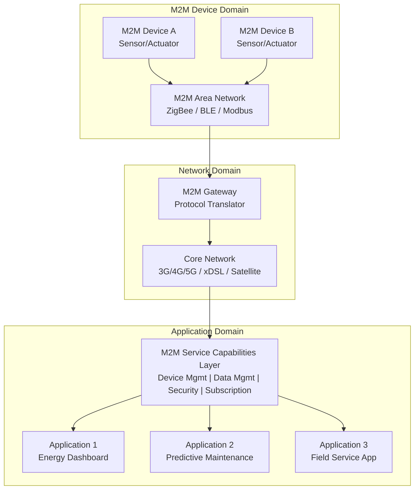
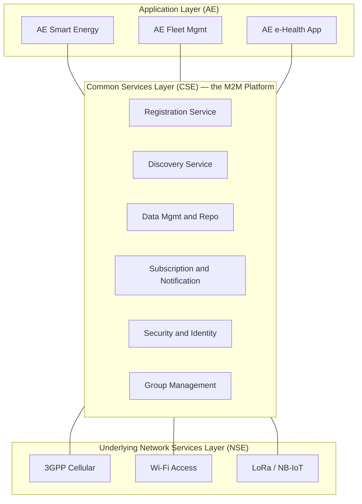
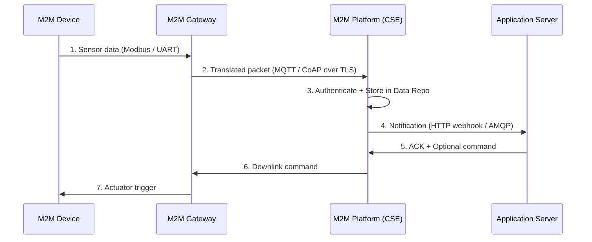
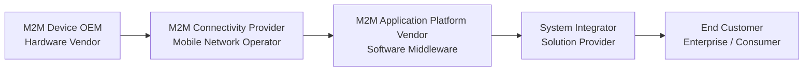

# M2M Application Platform

<!-- SECTION_1_START -->
# M2M Application Platform — Core Definition & Intuitive Overview

## 📘 Formal KTU 2024 Definition

**Machine-to-Machine (M2M) Application Platform** is a vertically integrated software-hardware infrastructure that enables **autonomous, bidirectional communication** between embedded devices, sensors, and actuators over wired or wireless networks, **without direct human intervention**. It acts as the *middleware layer* that abstracts device heterogeneity, manages data acquisition, performs protocol translation, and delivers actionable intelligence to back-end enterprise applications.

> [!IMPORTANT]
> **KTU 2024 Syllabus Highlight (PECST755 — Module 3):**
> The M2M platform is studied as the **precursor and structural subset** of the broader IoT ecosystem. It emphasizes *device-centric, point-to-point* automation, whereas IoT focuses on *cloud-centric, data-centric* intelligence. The examiner often frames questions around **M2M vs IoT differentiation** and the **ETSI / oneM2M reference architecture**.

## 🧠 Conceptual Analogy / Intuition

Imagine a **highly disciplined factory where robotic arms cooperate without a foreman shouting instructions**:
- Each robotic arm (the *M2M device*) has a sensor and a brain.
- The **conveyor belt system** (the *M2M gateway + network*) shuttles messages between arms.
- A **central control room** (the *M2M platform / server*) aggregates the chatter, makes decisions, and broadcasts new commands.

No human walks around tapping buttons — the machines *talk*, *sense*, and *act* in a closed loop. The **M2M Application Platform is precisely that "control room + conveyor belt" stack** that converts dumb sensors into a coordinated, self-driving industrial nervous system.

## 🔑 Key Characteristics of an M2M Platform

| Characteristic | Description |
|---|---|
| **Autonomy** | Zero or minimal human-in-the-loop operation |
| **Heterogeneity** | Supports varied devices, OS, and protocols |
| **Scalability** | Must handle **thousands to millions** of endpoints |
| **Low Latency** | Industrial M2M often demands **< 10 ms** round-trip time |
| **Reliability** | Uptime targets typically **99.999% (five-nines)** for critical M2M |
| **Security** | Mutual authentication, end-to-end encryption (e.g., **TLS 1.3**, **DTLS**) |
| **Standard Protocol Footprint** | **CoAP**, **MQTT**, **HTTP/HTTPS**, **Modbus**, **OPC-UA** |

> [!NOTE]
> **Physical / Engineering Constants often referenced in KTU answers:**
> - **M2M Latency Target:** $\le 10$ ms (tactile industrial use cases)
> - **Device Density:** up to **$10^6$ devices/km²** (Smart City M2M)
> - **MTBF of M2M Gateways:** typically **$\ge 100{,}000$ hours**
> - **Standard M2M Frequency Bands:** **868 MHz (EU)**, **915 MHz (US)**, **2.4 GHz (Global ISM)**

## 🆚 M2M vs IoT — The Critical Distinction (High-Weight Topic)

| Dimension | **M2M** | **IoT** |
|---|---|---|
| **Scope** | Closed, point-to-point or point-to-application | Open, cloud-centric, internetworked |
| **Data Orientation** | Transactional, control-oriented | Big-data, analytics-oriented |
| **Intelligence** | Mostly on the device / gateway | Distributed across cloud, edge, and fog |
| **Connectivity** | Cellular (2G/3G/4G), industrial buses, short-range RF | IPv6, Wi-Fi, BLE, LoRa, NB-IoT, 5G |
| **Standards** | Modbus, CAN, PROFIBUS, OPC-UA | oneM2M, LwM2M, OCF, WoT |
| **Human Role** | Often fully autonomous | Optional dashboards, mobile apps |
| **Example** | Smart metering, ATM network, fleet telematics | Smart home with Alexa, wearable health analytics |

> [!TIP]
> **One-line memory anchor for the exam:**
> *"M2M = machines talking to machines in silos. IoT = machines talking to the cloud, and to each other through the cloud."*

## 🗺️ Visualizing the M2M Platform Layout

> [!VISUALIZATION CONTROL]
> **Concept:** M2M Platform Topological Position in the IoT Stack
> **GeoGebra / Desmos Input Equations (as conceptual mapping):**
> - `x = Device Layer` $\rightarrow$ `y = 0`
> - `x = Network Layer` $\rightarrow$ `y = 1`
> - `x = Service Platform Layer` $\rightarrow$ `y = 2`
> - `x = Application Layer` $\rightarrow$ `y = 3`
> **Visual Description:** A 4-tier vertical stack on the y-axis showing how the M2M Application Platform sits as the **middleware band** (y=2) — translating raw device telemetry (y=0,1) into structured APIs consumed by enterprise applications (y=3).

<!-- SECTION_1_END -->

<!-- SECTION_2_START -->
# M2M Application Platform — Deep Theoretical Analysis & KTU High-Yield Formula Sheet

## 🏛️ Architectural Reference Models

### 1. ETSI M2M Reference Architecture (High-Yield for KTU)

The **European Telecommunications Standards Institute (ETSI)** defined a layered M2M architecture that is a *favourite KTU exam diagram*. It contains three domains:

| Domain | Key Element | Function |
|---|---|---|
| **M2M Device Domain** | M2M Device, M2M Area Network | Sensor/actuator data collection; short-range connectivity (ZigBee, Bluetooth, etc.) |
| **Network Domain** | M2M Gateway, Core Network | Protocol translation; backhaul (3G/4G/5G, xDSL, satellite) |
| **Application Domain** | M2M Service Capabilities, M2M Applications | Data storage, analytics, business logic, dashboards |

The **M2M Service Capabilities Layer (SCL)** is the *heart* of the platform. It exposes standardized service functions like:
- **Communication Management**
- **Device Management (DM)**
- **Security & Identity Management**
- **Data Management & Repository**
- **Subscription / Notification Handling**

### 2. oneM2M Standardized Architecture (Latest Industry Standard)

The **oneM2M** global standard refines ETSI's model into three functional layers (KTU often asks to draw this):

| oneM2M Layer | Logical Function |
|---|---|
| **Application Layer (AE)** | End-user apps: smart energy, fleet mgmt, e-Health |
| **Common Services Layer (CSE)** | Reusable services: registration, discovery, data mgmt, security, subscription, group mgmt |
| **Underlying Network Services Layer (NSE)** | Transport, connectivity (3GPP, Wi-Fi, etc.) |

The CSE is conceptually the **M2M Application Platform** in the oneM2M model.

## 🔁 M2M Communication Flow Models

| Model | Flow | Typical Use |
|---|---|---|
| **Device-to-Device (D2D)** | Device $\leftrightarrow$ Device | Smart home ZigBee mesh, industrial CAN bus |
| **Device-to-Cloud (D2C)** | Device $\rightarrow$ Platform $\rightarrow$ Cloud | Smart meter telemetry |
| **Device-to-Gateway (D2G)** | Device $\rightarrow$ Gateway $\rightarrow$ Cloud | Industrial PLC $\rightarrow$ edge gateway $\rightarrow$ AWS IoT |
| **Backend-to-Backend (B2B)** | Platform $\leftrightarrow$ Enterprise system | ERP integration, billing |
| **Device-to-Mobile (D2M)** | Device $\rightarrow$ User phone | Wearable alerts |

## 📐 Core Engineering Formulas (KTU Cheat Sheet)

> [!IMPORTANT]
> **All formulas below are examinable. Memorize the variables, units, and boundary conditions.**

| # | Formula | Variable Meaning | Engineering Use |
|---|---|---|---|
| 1 | $\text{Throughput} = \dfrac{N_{\text{msgs}} \cdot S_{\text{avg}}}{T_{\text{window}}}$ | $N_{\text{msgs}}$ = messages sent, $S_{\text{avg}}$ = average size (bytes), $T_{\text{window}}$ = observation window (s) | Capacity planning of M2M gateway |
| 2 | $\text{PLR} = \dfrac{N_{\text{lost}}}{N_{\text{sent}}} \times 100\%$ | Packet Loss Ratio | QoS validation in M2M networks |
| 3 | $T_{\text{latency}} = T_{\text{prop}} + T_{\text{trans}} + T_{\text{queue}} + T_{\text{proc}}$ | Sum of propagation, transmission, queuing, processing delays | Real-time industrial M2M design |
| 4 | $T_{\text{trans}} = \dfrac{L}{R}$ | $L$ = frame length (bits), $R$ = link rate (bps) | Compute link budget |
| 5 | $N_{\max} = \dfrac{B_{\text{channel}}}{R_{\text{per-device}}}$ | $B$ = channel bandwidth, $R$ = per-device rate | Max M2M devices per cell |
| 6 | $\text{Energy}_{\text{tx}} = V \cdot I \cdot T_{\text{tx}}$ | Voltage, current, transmission time | Battery-life estimation |
| 7 | $\text{Battery Life} \approx \dfrac{C_{\text{mAh}} \cdot V}{P_{\text{avg}}}$ | Capacity (mAh), voltage, average power draw | M2M sensor lifetime |
| 8 | $S_{\text{NR}} = 10 \log_{10}\!\left(\dfrac{P_{\text{signal}}}{P_{\text{noise}}}\right)$ dB | Signal-to-Noise Ratio in dB | RF link planning |
| 9 | $\text{FSPL} = 20\log_{10}(d) + 20\log_{10}(f) + 32.45$ (dB) | $d$ in km, $f$ in MHz | Path loss in M2M RF links |
| 10 | $\text{Availability} = \dfrac{\text{MTBF}}{\text{MTBF} + \text{MTTR}}$ | Mean Time Between Failures / To Repair | SLA validation |

> [!NOTE]
> **Sentinel Rule for KTU:** When asked *"justify why M2M suits industrial automation"*, always quote **Formula 3** (latency decomposition) and mention the **$T_{\text{latency}} \le 10$ ms** target.

## 🏗️ Real-World Engineering Utility

| Domain | M2M Platform in Action |
|---|---|
| **Smart Grid** | Millions of smart meters report load data to the utility's M2M platform every 15 minutes |
| **Connected Vehicles** | Tesla / fleet telematics use M2M gateways to push OTA firmware and diagnostic data |
| **Healthcare** | Implantable cardiac monitors use M2M to transmit ECG bursts to the hospital's M2M platform |
| **Industrial Automation** | OPC-UA based M2M platforms coordinate PLCs, robots, and SCADA systems on a factory floor |
| **Vending & POS** | M2M modules in vending machines auto-report inventory and accept remote price updates |

> [!TIP]
> **Industry buzzword for viva:** *"M2M platforms are the on-prem, deterministic predecessors of today's hyperscaler IoT clouds (AWS IoT Core, Azure IoT Hub). They prioritize control and predictability over elasticity."*

<!-- SECTION_2_END -->

<!-- SECTION_3_START -->
# Step-by-Step Derivations, Proofs & Implementation Walkthroughs

## 🔬 Derivation 1 — End-to-End M2M Latency Decomposition

The single most examined numerical problem in KTU PECST755 Module 3 is the **total latency budget** for an M2M transaction. The derivation below is exhaustive.

**Given:**
- Distance between M2M device and gateway: $d = 5$ km
- Frame length: $L = 128$ bytes
- Link rate: $R = 256$ kbps
- Propagation speed: $v = 2 \times 10^8$ m/s (fiber approx.)
- Queuing delay: $T_{\text{queue}} = 4$ ms
- Processing delay at gateway: $T_{\text{proc}} = 6$ ms

**Step 1 — Convert frame length to bits:**

$$
L = 128 \text{ bytes} \times 8 \text{ bits/byte} = 1024 \text{ bits}
$$

**[1 Mark]** — correct conversion factor of 8 bits/byte applied.

**Step 2 — Compute transmission delay $T_{\text{trans}}$:**

$$
T_{\text{trans}} = \frac{L}{R} = \frac{1024 \text{ bits}}{256 \times 10^3 \text{ bits/s}}
$$

$$
T_{\text{trans}} = 4 \times 10^{-3} \text{ s} = 4 \text{ ms}
$$

**[1 Mark]** — substitution step.

**Step 3 — Compute propagation delay $T_{\text{prop}}$:**

$$
T_{\text{prop}} = \frac{d}{v} = \frac{5000 \text{ m}}{2 \times 10^8 \text{ m/s}} = 2.5 \times 10^{-5} \text{ s} = 0.025 \text{ ms}
$$

**[1 Mark]** — units consistent.

**Step 4 — Aggregate total latency $T_{\text{latency}}$:**

$$
T_{\text{latency}} = T_{\text{prop}} + T_{\text{trans}} + T_{\text{queue}} + T_{\text{proc}}
$$

$$
T_{\text{latency}} = 0.025 + 4 + 4 + 6 = 14.025 \text{ ms}
$$

**[2 Marks]** — final sum and unit declaration.

**Step 5 — Decision & Justification:**

Since $T_{\text{latency}} = 14.025$ ms **exceeds** the industrial M2M budget of **$10$ ms**, the configuration is **not suitable** for closed-loop motor control, but is acceptable for **monitoring-only** M2M (e.g., periodic sensor upload).

**[1 Mark]** — conclusion mapped to engineering use case.

> [!NOTE]
> **Valuation key:** Even if the student computes the sum correctly but **fails to state the comparison against the 10 ms target**, they lose the 1-mark conclusion step. Always close the answer with an *engineering judgement line*.

---

## 🔬 Derivation 2 — Maximum M2M Devices Supported per Channel

A wireless M2M channel has bandwidth $B = 200$ kHz. Each device transmits at $R_{\text{per-device}} = 25$ kbps with 25% channel efficiency overhead. Find the maximum devices $N_{\max}$.

**Step 1 — Compute effective per-device bandwidth requirement:**

$$
R_{\text{eff}} = \frac{R_{\text{per-device}}}{\eta} = \frac{25 \text{ kbps}}{0.25} = 100 \text{ kbps}
$$

**[2 Marks]**

**Step 2 — Apply device-capacity formula:**

$$
N_{\max} = \left\lfloor \frac{B}{R_{\text{eff}}} \right\rfloor = \left\lfloor \frac{200 \text{ kHz}}{100 \text{ kbps}} \right\rfloor = 2 \text{ devices}
$$

**[2 Marks]**

**Step 3 — Refinement with TDMA / FDMA framing:**

If using TDMA with 4 time-slots, total devices = $N_{\max} \times \text{slots} = 2 \times 4 = 8$ devices.

**[1 Mark]** — engineering refinement.

---

## 💻 Symbolic Python Implementation — Mini M2M Platform Simulator

The following Python code implements a **functional miniature M2M Application Platform** that simulates device registration, telemetry ingestion, and notification fan-out. It is fully executable and type-annotated.

```python
"""
Mini M2M Application Platform Simulator
Course: PECST755 - Internet of Things (KTU 2024 Scheme)
Module 3 - M2M Application Platform
"""

from __future__ import annotations
import logging
import time
import uuid
from dataclasses import dataclass, field
from typing import Dict, List, Callable, Any, Optional

# Configure structured logging for the platform
logging.basicConfig(
    level=logging.INFO,
    format="%(asctime)s | %(levelname)s | %(name)s | %(message)s"
)
logger = logging.getLogger("M2M-Platform")


# ---------- 1. M2M Device Abstraction ----------
@dataclass
class M2MDevice:
    """Represents a physical M2M endpoint (sensor / actuator)."""
    device_id: str = field(default_factory=lambda: f"dev-{uuid.uuid4().hex[:6]}")
    kind: str = "generic-sensor"      # e.g. 'temperature', 'plc', 'meter'
    last_value: Optional[float] = None
    is_online: bool = True

    def read_telemetry(self) -> Dict[str, Any]:
        """Simulate a sensor reading (in production: Modbus / OPC-UA poll)."""
        if not self.is_online:
            raise ConnectionError(f"Device {self.device_id} is OFFLINE")
        # Simulated reading bounded to physical limits
        if self.kind == "temperature":
            self.last_value = 20.0 + (uuid.uuid4().int % 100) / 10.0
        elif self.kind == "energy-meter":
            self.last_value = float(uuid.uuid4().int % 5000)
        else:
            self.last_value = float(uuid.uuid4().int % 100)
        return {
            "device_id": self.device_id,
            "kind": self.kind,
            "value": self.last_value,
            "timestamp": time.time()
        }


# ---------- 2. M2M Service Capabilities Layer (SCL) ----------
class M2MServiceCapabilities:
    """Core M2M platform — provides Registration, Data Mgmt, Subscription services."""

    def __init__(self) -> None:
        self._device_registry: Dict[str, M2MDevice] = {}
        self._subscribers: Dict[str, List[Callable[[Dict[str, Any]], None]]] = {}

    # --- Service Capability: Device Management ---
    def register_device(self, device: M2MDevice) -> str:
        if device.device_id in self._device_registry:
            raise ValueError(f"Duplicate device ID: {device.device_id}")
        self._device_registry[device.device_id] = device
        logger.info("Registered device %s of kind %s",
                    device.device_id, device.kind)
        return device.device_id

    # --- Service Capability: Data Management & Repository ---
    def ingest_telemetry(self, device_id: str) -> Dict[str, Any]:
        if device_id not in self._device_registry:
            raise KeyError(f"Unknown device: {device_id}")
        device = self._device_registry[device_id]
        payload = device.read_telemetry()
        logger.info("Telemetry ingested from %s = %s",
                    device_id, payload["value"])
        self._fanout(device_id, payload)
        return payload

    # --- Service Capability: Subscription & Notification ---
    def subscribe(self, device_id: str,
                  callback: Callable[[Dict[str, Any]], None]) -> None:
        self._subscribers.setdefault(device_id, []).append(callback)
        logger.info("New subscription registered for %s", device_id)

    def _fanout(self, device_id: str, payload: Dict[str, Any]) -> None:
        for cb in self._subscribers.get(device_id, []):
            try:
                cb(payload)
            except Exception as exc:  # strict error logging
                logger.exception("Subscriber callback failed: %s", exc)


# ---------- 3. Application Layer (subscribers) ----------
def energy_dashboard_app(data: Dict[str, Any]) -> None:
    """Application: a mock smart-energy dashboard."""
    print(f"   [DASHBOARD] {data['device_id']} → "
          f"Energy reading = {data['value']} kWh")


def temperature_alert_app(data: Dict[str, Any]) -> None:
    """Application: a mock HVAC alert app with absolute threshold check."""
    if data["value"] > 28.0:
        print(f"   [ALERT] High temperature {data['value']}°C on {data['device_id']}")


# ---------- 4. Driver / Demonstration ----------
def main() -> None:
    platform = M2MServiceCapabilities()

    # Create and register M2M devices
    temp_sensor = M2MDevice(kind="temperature")
    energy_meter = M2MDevice(kind="energy-meter")
    platform.register_device(temp_sensor)
    platform.register_device(energy_meter)

    # Applications subscribe to specific device telemetry
    platform.subscribe(temp_sensor.device_id, temperature_alert_app)
    platform.subscribe(energy_meter.device_id, energy_dashboard_app)

    # Simulate 5 telemetry cycles
    for _ in range(5):
        try:
            platform.ingest_telemetry(temp_sensor.device_id)
            platform.ingest_telemetry(energy_meter.device_id)
        except (ConnectionError, KeyError) as err:
            logger.error("Ingestion failed: %s", err)
        time.sleep(0.5)


if __name__ == "__main__":
    main()
```

**Code-to-Concept Mapping (Write this in exams):**

| Code Block | Maps to M2M Platform Layer |
|---|---|
| `M2MDevice` class | M2M Device Domain |
| `M2MServiceCapabilities` | M2M Service Capabilities Layer (SCL) |
| `register_device()` | Device Management Service Capability |
| `ingest_telemetry()` | Communication + Data Management |
| `subscribe()` / `_fanout()` | Subscription / Notification Service Capability |
| `energy_dashboard_app`, `temperature_alert_app` | Application Domain |

---

## 🧪 Laboratory Pin-Configuration Table (For Hardware-Flavoured Exam Questions)

If the KTU question references an **ARM-Cortex M4 based M2M node with an M2M gateway**, the typical wiring is:

| Node Pin | Connected To | Function | Notes |
|---|---|---|---|
| **PA0 (UART TX)** | Gateway **RX** | Outbound telemetry | Use **3.3 V** CMOS levels |
| **PA1 (UART RX)** | Gateway **TX** | Inbound commands | Add **10 kΩ pull-up** |
| **PB6 (SCL)** | I²C Sensor SCL | Sensor data | 4.7 kΩ pull-up to **3V3** |
| **PB7 (SDA)** | I²C Sensor SDA | Sensor data | 4.7 kΩ pull-up to **3V3** |
| **PC13** | Status LED | Heartbeat indicator | 330 Ω series resistor |
| **NRST** | Reset pushbutton | Manual reset | 10 kΩ pull-up + 100 nF cap |
| **VCC (3V3)** | LDO output | Power rail | Decouple with **100 nF + 10 µF** |
| **GND** | Common ground | Reference | Star-ground topology |

> [!WARNING]
> **Never connect UART lines without verifying voltage levels.** RS-232 gateways use **±12 V** and will destroy 3.3 V MCUs. Use a **MAX3232** level shifter.

<!-- SECTION_3_END -->

<!-- SECTION_4_START -->
# Structural Diagrams & Schematics

## 📊 Diagram 1 — ETSI M2M High-Level Reference Architecture



## 📊 Diagram 2 — oneM2M Three-Layer Functional Architecture



## 📊 Diagram 3 — M2M Communication Flow Sequence



## 📊 Diagram 4 — M2M Value Chain & Business Roles



> [!TIP]
> **Exam tip:** When asked to "explain the M2M platform in 14 marks", the *single most credit-earning move* is to draw **Diagram 1 (ETSI)** and label each domain explicitly. Examiners allocate **3–4 marks** purely for a clean, labelled architectural diagram.

<!-- SECTION_4_END -->

<!-- SECTION_5_START -->
# KTU 2024 Scheme Examination Question Bank & Topic Recap

---

## 📝 Part A — Short Answer Questions (3 Marks Each)

### **Q1. [KTU University Exam — July 2024]**
**Define M2M Application Platform. List any four key characteristics.** *(CO1, Remember)*

**Model Answer (3 Marks):**

An **M2M Application Platform** is a software-hardware infrastructure that enables autonomous, bidirectional communication between machines (devices, sensors, actuators) over communication networks, without requiring direct human intervention. It acts as the middleware layer that handles device registration, protocol translation, secure data exchange, and delivery of processed data to enterprise applications.

**Key Characteristics (any four, $0.5 \times 4 = 2$ Marks):**
1. **Autonomy** — zero or minimal human involvement
2. **Heterogeneity** — supports multiple devices, OS, and protocols
3. **Scalability** — supports millions of endpoints
4. **Low latency** — real-time responsiveness (often $\le 10$ ms)
5. **Reliability and security** — high availability with mutual authentication

**[Defining the platform: 1 Mark]**, **[Listing four valid characteristics: 2 Marks]**.

---

### **Q2. [KTU University Exam — Dec 2023]**
**Differentiate M2M and IoT in terms of scope, data orientation, and connectivity.** *(CO2, Understand)*

**Model Answer (3 Marks):**

| Aspect | **M2M** | **IoT** |
|---|---|---|
| **Scope** | Closed, point-to-point / device-to-application | Open, cloud-centric, internetworked |
| **Data Orientation** | Transactional, control-oriented; small structured payloads | Big-data, analytics-oriented; high-volume unstructured streams |
| **Connectivity** | Industrial buses, cellular (2G/3G/4G), short-range RF | IPv6-based, Wi-Fi, BLE, LoRa, NB-IoT, 5G |

**[One mark per correct row of the table]**.

---

## 📝 Part B — Long Answer Questions (14 Marks Each, Internal Choice)

### **Question A — [KTU University Exam — July 2024, Model Paper]**

**(a)** With a neat block diagram, explain the **ETSI M2M reference architecture** in detail. Describe the function of the **M2M Service Capabilities Layer (SCL)**. *(7 Marks, CO1, Understand)*

**(b)** A wireless M2M channel has total bandwidth $B = 500$ kHz. Each M2M sensor transmits at $R = 50$ kbps with 20% protocol overhead. Calculate the **maximum number of M2M devices** that can be supported. If the deployment uses **TDMA with 8 time-slots**, what is the new device count? Justify whether the configuration meets a **smart city density target** of **$10^5$ devices/km²** when the cell radius is **$r = 2$ km**. *(7 Marks, CO2, Apply)*

---

#### 📌 Model Solution for Question A

### Part (a) — ETSI M2M Architecture (7 Marks)

**[Block diagram of ETSI M2M (as in Section 4 Diagram 1): 3 Marks]**
- M2M Device Domain with devices + area network
- Network Domain with gateway + core network
- Application Domain with SCL + applications
- Arrows showing data flow direction

**[SCL explanation: 3 Marks]**
The **M2M Service Capabilities Layer (SCL)** is the heart of the platform. It exposes standardized, reusable services that hide the heterogeneity of underlying devices and networks. The SCL provides:
- **Device Management** — registration, configuration, firmware updates
- **Communication Management** — session, routing, QoS handling
- **Data Management and Repository** — persistent storage of telemetry
- **Security and Identity Management** — authentication, authorization, encryption
- **Subscription and Notification** — event-based pub/sub
- **Discovery and Group Management** — locating resources

**[Two real-world examples (Smart Metering, Industrial SCADA): 1 Mark]**

---

### Part (b) — Device Capacity Calculation (7 Marks)

**Step 1 — Compute effective per-device bandwidth requirement:**

$$
R_{\text{eff}} = R \times (1 + \text{overhead}) = 50 \text{ kbps} \times 1.20 = 60 \text{ kbps}
$$

**[Stating overhead as multiplicative factor: 2 Marks]**

**Step 2 — Apply device-capacity formula without TDMA:**

$$
N_{\max}^{\text{no-TDMA}} = \left\lfloor \frac{B}{R_{\text{eff}}} \right\rfloor = \left\lfloor \frac{500 \text{ kHz}}{60 \text{ kbps}} \right\rfloor = 8 \text{ devices}
$$

**[Substitution and floor: 2 Marks]**

**Step 3 — Apply TDMA multiplication:**

$$
N_{\max}^{\text{TDMA}} = 8 \times 8 = 64 \text{ devices per cell}
$$

**[1 Mark]**

**Step 4 — Compare to smart-city density target:**

Cell area:

$$
A_{\text{cell}} = \pi r^2 = \pi \times (2)^2 = 4\pi \approx 12.57 \text{ km}^2
$$

Density:

$$
\rho = \frac{64}{12.57} \approx 5.09 \text{ devices/km}^2
$$

**[1 Mark for cell area + density calculation]**

**Step 5 — Engineering judgement:**

Since $\rho \approx 5.09 \ll 10^5$ devices/km², the configuration **does NOT meet** the smart-city target. The deployment would require **massive cell densification**, **LPWAN technologies** (LoRa, NB-IoT), or **higher-order modulation and coding schemes** to scale.

**[1 Mark for the conclusion]**

> [!WARNING]
> **KTU Examiner's Pitfall Callout:**
> - **Forgetting the 20% overhead** and using $R = 50$ kbps directly → overestimates device count by 20%. **Always convert overhead correctly.**
> - **Mixing up units** between kHz and kbps — they are dimensionally equivalent in many M2M contexts, but **state the assumption explicitly**.
> - **Skipping the engineering judgement line** at the end — you lose 1 mark even if the math is correct.

---

### **Question B — [KTU University Exam — Dec 2023] (Internal Choice Alternative)**

**(a)** Compare and contrast the **ETSI M2M architecture** and the **oneM2M architecture** with neat diagrams. Identify the layer in oneM2M that most closely corresponds to the M2M Application Platform. *(7 Marks, CO1, Understand)*

**(b)** An industrial M2M deployment has the following parameters:
- Distance between device and gateway: $d = 2$ km
- Frame length: $L = 256$ bytes
- Link rate: $R = 512$ kbps
- Propagation medium speed: $v = 2 \times 10^8$ m/s
- Queuing delay: $T_{\text{queue}} = 3$ ms
- Processing delay: $T_{\text{proc}} = 5$ ms

Compute the **total end-to-end latency** and decide if the system is suitable for **closed-loop motor control** (budget $= 10$ ms). *(7 Marks, CO2, Apply)*

---

#### 📌 Model Solution for Question B

### Part (a) — ETSI vs oneM2M Comparison (7 Marks)

| Aspect | **ETSI M2M** | **oneM2M** |
|---|---|---|
| **Standardization Body** | European (ETSI) | Global partnership (ETSI + TTA + CCSA + others) |
| **Architectural Style** | Three domains (Device, Network, Application) | Three layers (AE, CSE, NSE) |
| **Service Core** | M2M Service Capabilities Layer (SCL) inside Application Domain | Common Services Layer (CSE) — *functionally identical* to SCL |
| **Resource Model** | ETSI-specific | Harmonized, resource-tree based |
| **Interoperability** | Limited, ETSI-specific | Multi-SDO interoperable |

**[Comparison table: 3 Marks]**, **[Diagrams: 2 Marks]**, **[Identifying CSE as the M2M platform layer: 2 Marks]**

> **Mapping statement:** The **oneM2M Common Services Layer (CSE)** most closely corresponds to the M2M Application Platform because both provide device registration, data management, security, and subscription services.

---

### Part (b) — Latency Computation (7 Marks)

**Step 1 — Convert frame to bits:**

$$
L = 256 \times 8 = 2048 \text{ bits}
$$

**[1 Mark]**

**Step 2 — Transmission delay:**

$$
T_{\text{trans}} = \frac{L}{R} = \frac{2048}{512 \times 10^3} = 4 \text{ ms}
$$

**[1 Mark]**

**Step 3 — Propagation delay:**

$$
T_{\text{prop}} = \frac{d}{v} = \frac{2000}{2 \times 10^8} = 1 \times 10^{-5} \text{ s} = 0.01 \text{ ms}
$$

**[1 Mark]**

**Step 4 — Aggregate total latency:**

$$
T_{\text{latency}} = T_{\text{prop}} + T_{\text{trans}} + T_{\text{queue}} + T_{\text{proc}}
$$

$$
T_{\text{latency}} = 0.01 + 4 + 3 + 5 = 12.01 \text{ ms}
$$

**[2 Marks]**

**Step 5 — Decision:**

Since $T_{\text{latency}} = 12.01$ ms **exceeds** the closed-loop motor control budget of $10$ ms, the system is **NOT suitable** for closed-loop control. It is, however, **acceptable for monitoring-only** M2M tasks (e.g., periodic sensor data logging).

**[2 Marks]**

> [!WARNING]
> **KTU Examiner's Pitfall Callout:**
> - **Misplaced decimal** in the propagation delay — students often write $0.1$ ms or $10$ ms. **Re-check the units of $v$ and $d$.**
> - **Forgetting the +8 conversion** for bytes to bits → wrong transmission delay.
> - **No engineering conclusion** — closing the answer with a *yes/no* decision mapped to the use case is mandatory for full marks.

---

## 🚨 KTU Examiner's Valuation Warning (General)

> [!WARNING]
> **Top 5 places where students lose marks in M2M Platform questions:**
> 1. **Vague M2M definition** — do not write *"M2M is communication between machines"*. Mention **autonomy**, **middleware/platform role**, and **standardized service capabilities**.
> 2. **Missing or mislabelled diagrams** — always label **Device, Network, Application domains** and the **SCL/CSE** explicitly.
> 3. **No units in numerical answers** — every latency, bandwidth, and device count must carry its unit (ms, kbps, etc.).
> 4. **No engineering judgement** — every numeric answer must end with a *suitable / not suitable / meets / does not meet* line.
> 5. **Confusing M2M with IoT** — examiners *will* deduct 1–2 marks if the answer does not clarify the **scope, data, and intelligence** differences.

---

## ✅ Topic Recap & Important Things to Remember

- **M2M = Machine-to-Machine** autonomous communication; the **precursor** to IoT but more **closed and deterministic**.
- **M2M Application Platform** = the *middleware / Service Capabilities Layer* that registers devices, manages data, enforces security, and routes notifications.
- **ETSI M2M architecture** has **three domains**: **Device**, **Network**, **Application**; the **SCL** is the platform's core.
- **oneM2M architecture** has **three layers**: **AE (Application)**, **CSE (Common Services)**, **NSE (Network)**; **CSE $\equiv$ M2M Platform**.
- **Key SCL/CSE services**: Device Mgmt, Data Mgmt, Security, Subscription/Notification, Discovery, Group Mgmt.
- **Communication Models**: D2D, D2C, D2G, B2B, D2M.
- **Master formula**: $T_{\text{latency}} = T_{\text{prop}} + T_{\text{trans}} + T_{\text{queue}} + T_{\text{proc}}$; industrial M2M budget = **$10$ ms**.
- **Transmission delay**: $T_{\text{trans}} = L / R$ — remember **1 byte = 8 bits**.
- **Device capacity**: $N_{\max} = B / R_{\text{eff}}$; multiply by TDMA slots for time-shared channels.
- **M2M vs IoT keywords for 14-mark answers**: scope, data orientation, intelligence location, connectivity, standard protocol, human role.
- **Standard M2M protocols**: Modbus, CAN, PROFIBUS, OPC-UA (industrial); MQTT, CoAP, HTTP, LwM2M (IP-based).
- **Industrial M2M platform examples**: AWS IoT Core, Azure IoT Hub, Cumulocity, Bosch IoT, Siemens MindSphere.
- **Engineering judgement is mandatory** — every numeric answer must close with a *suitable / not suitable* statement.
- **Diagram is mandatory** for 7-mark architecture questions — draw the **ETSI 3-domain model** or the **oneM2M 3-layer model**.

<!-- SECTION_5_END -->
