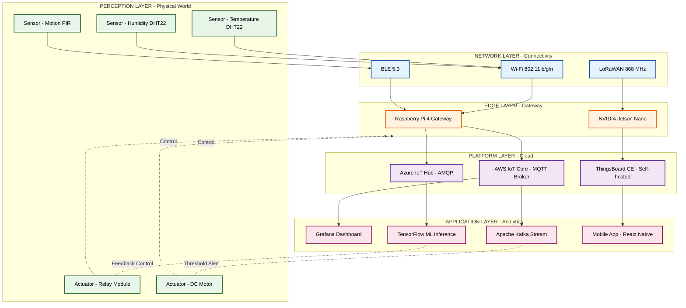
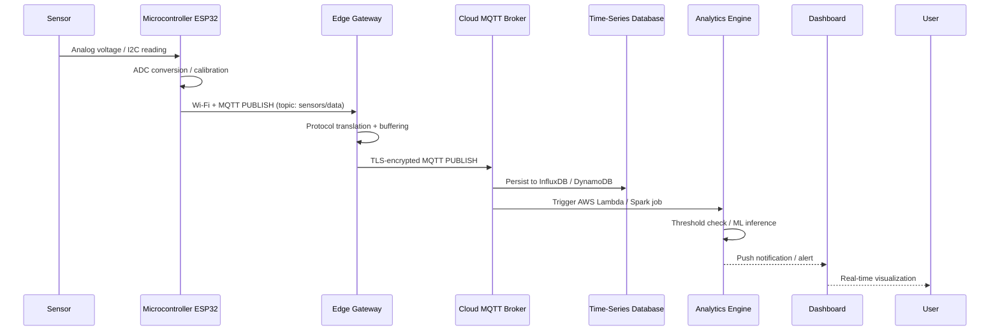
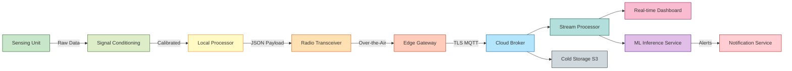

# Platforms for IoT Applications and Analytics - The IoT Building Blocks

<!-- SECTION_1_START -->
# Internet of Things — Module 3
## The IoT Building Blocks: Platforms, Components & Architectural Foundations

---

## 1. Core Technical Definition & Intuitive Overview

> [!IMPORTANT]
> **KTU 2024 Syllabus Definition (PECST755 — Module 3):**
> The **IoT Building Blocks** are the fundamental, modular hardware and software components that collectively enable a physical device to sense, process, transmit, and act upon data within an interconnected ecosystem. They form the layered architectural backbone for every modern IoT application and analytics platform.

### Conceptual Analogy / Intuition
Imagine a **human nervous system**. Your **senses** (eyes, ears, skin) act as sensors detecting the environment. Your **spinal cord and brain** process those signals, much like a **microcontroller or edge processor** does. Your **nerves** carry the signals — analogous to **wireless communication protocols (Wi-Fi, BLE, LoRa)**. Your **muscles** respond to commands — these are the **actuators**. Finally, your **memory and learning** over time represent the **cloud and analytics platform**. The IoT building blocks are precisely these layers, engineered into silicon and software.

> [!NOTE]
> **Why this matters in KTU 2024:**
> Almost every Module-3 question — whether about AWS IoT, Azure IoT Hub, or analytics workflows — assumes you can identify *which* building block is performing *what* function. Examiners frequently test this structural mapping.

### The Seven Canonical IoT Building Blocks

| # | Building Block | Core Role | Common Examples |
|---|---|---|---|
| 1 | **Sensors** | Convert physical phenomena → electrical signals | DHT22, BMP280, MQ-135 |
| 2 | **Actuators** | Convert electrical signals → physical action | Relays, Servo motors, Solenoids |
| 3 | **Connectivity / Communication** | Transport data between nodes | Wi-Fi, BLE, Zigbee, LoRaWAN, 5G |
| 4 | **Processors / Microcontrollers** | Local computation & decision-making | ESP32, STM32, Raspberry Pi Pico |
| 5 | **Gateway / Edge Device** | Protocol translation & local aggregation | Raspberry Pi 4, NVIDIA Jetson |
| 6 | **Cloud / Server Platform** | Storage, analytics, dashboarding | AWS IoT Core, Azure IoT Hub, GCP |
| 7 | **Application / Analytics Layer** | Visualization, ML inference, alerting | Node-RED, Grafana, AWS SageMaker |

> [!TIP]
> **Quick Mnemonic — "SCCP GCA":**
> **S**ensors → **C**ommunication → **C**ompute (Edge) → **P**rocessor → **G**ateway → **C**loud → **A**nalytics.

> [!VISUALIZATION CONTROL]
> **Concept:** Layered IoT Reference Architecture (vertical stack)
> **GeoGebra / Desmos Input Equations:** *(Not applicable — architectural diagram)*
> **Visual Description:** A vertical five-layer stack from bottom (Sensors/Actuators) → Connectivity → Edge/Gateway → Cloud Platform → Application/Analytics, with bidirectional data arrows between every adjacent layer.

---

## 2. Deep Theoretical Analysis & KTU High-Yield Formula Sheet

### 2.1 The IoT Architecture Stack — A Layered View

Modern IoT platforms (AWS IoT, Azure IoT, Google Cloud IoT) are organized into **five logical layers**. Each layer encapsulates one or more of the seven building blocks above.

#### Layer 1 — Perception / Device Layer (Sensors & Actuators)
This is the **physical boundary** of any IoT system. It directly interfaces with the real world.

- **Sensors** measure: temperature, humidity, pressure, light, motion, gas concentration, vibration, proximity.
- **Actuators** control: valve opening, motor speed, LED brightness, relay switching, robotic arm motion.
- A node containing *both* a sensor and actuator is called a **Smart Object** or **Thing**.

#### Layer 2 — Network / Connectivity Layer
Bridges the perception layer to processing units. Choosing the right protocol depends on:
- **Range**: Bluetooth (~10 m), Wi-Fi (~50 m), LoRaWAN (~10 km), Cellular/5G (~global).
- **Power budget**: BLE and Zigbee are low-power; Wi-Fi and 5G are power-hungry.
- **Data rate**: BLE ≈ 2 Mbps, Wi-Fi ≈ 600 Mbps, 5G ≈ 10 Gbps.
- **Topology**: Star (BLE), Mesh (Zigbee, Thread), P2P (Wi-Fi Direct).

#### Layer 3 — Edge / Gateway Layer
- Performs **local preprocessing**, **protocol translation** (e.g., Zigbee → MQTT), and **latency-critical decision making**.
- Reduces upstream bandwidth via **edge analytics** (e.g., averaging, threshold detection).
- Hardware: Raspberry Pi, Intel NUC, industrial gateways (Cisco IoT Gateway).

#### Layer 4 — Cloud / Platform Layer
- Provides **scalable storage**, **device management (device shadow)**, **message brokering**, **rule engines**.
- Examples: **AWS IoT Core**, **Azure IoT Hub**, **Google Cloud IoT (now deprecated, migrated to partner solutions)**.
- Operates on **Virtual Private Cloud (VPC)** infrastructure with elastic compute.

#### Layer 5 — Application / Analytics Layer
- Renders dashboards (Grafana, Kibana), performs **batch analytics** (Hadoop/Spark), **stream analytics** (Apache Flink, Kinesis), and **ML inference** (TensorFlow Serving).
- Supports **business intelligence**, **predictive maintenance**, and **anomaly detection**.

> [!NOTE]
> **Syllabus Highlight:** KTU 2024 Module 3 explicitly emphasizes platform-level analytics, so you must be able to *name* AWS IoT, Azure IoT Hub, Google IoT, and open-source stacks (ThingsBoard, KAA, OpenIoT).

---

### 2.2 KTU High-Yield Formula Sheet & Comparative Table

> [!IMPORTANT]
> The following table consolidates every quantitative or structural formula, energy model, and platform-comparison metric you must memorize for Module 3.

#### A. Energy & Power Modeling

| Concept | Formula | Description |
|---|---|---|
| Battery Lifetime | $L = \dfrac{C_{bat}}{I_{avg} \times 24 \times 365}$ | $C_{bat}$ in mAh, $I_{avg}$ in mA |
| Sleep Current Budget | $I_{sleep} \ll I_{active}$ | Sleep current should be < 1% of active |
| Transmission Energy (1 bit) | $E_{tx} = E_{elec} \times k + \varepsilon_{amp} \times k \times d^{n}$ | $n$ = path-loss exponent (2 free space, 4 urban) |
| Energy Harvested | $E_{harvest} = P_{source} \times \eta \times t$ | $\eta$ = conversion efficiency |

#### B. Data Throughput & Latency

| Concept | Formula | Units |
|---|---|---|
| Shannon-Hartley Capacity | $C = B \times \log_2\left(1 + \dfrac{S}{N}\right)$ | bits/sec |
| Data Rate from Sampling | $R = f_s \times N_{bits} \times N_{ch}$ | bits/sec |
| Round-Trip Time (Cloud) | $RTT_{cloud} \approx 2 \times \tau_{prop} + t_{proc}$ | ms |
| Edge vs Cloud Latency | $\tau_{edge} \ll \tau_{cloud}$ | typically 1–10 ms vs 50–500 ms |

#### C. Platform Comparison (KTU Hot Topic)

| Feature | AWS IoT Core | Azure IoT Hub | Google Cloud IoT (Legacy) | ThingsBoard (OSS) |
|---|---|---|---|---|
| Messaging | MQTT, HTTPS, LoRaWAN | MQTT, AMQP, HTTPS, LoRaWAN | MQTT, HTTPS | MQTT, CoAP, HTTP, LWM2M |
| Device Shadow | Yes | Yes (Twin) | Yes | Telemetry (KV store) |
| Max Devices/Hub | Unlimited | 1M+ per hub | 1M+ | Unlimited (cluster) |
| Rule Engine | AWS IoT Rules | Azure Stream Analytics | Cloud Functions | Rule Chains |
| Analytics | Kinesis + SageMaker | Stream Analytics + Databricks | Dataflow + Vertex AI | Built-in telemetry |
| Pricing Model | Pay-per-message | Pay-per-message tier | Pay-per-message | Free (self-hosted) |

> [!WARNING]
> **Do NOT confuse IoT Core (message broker) with EC2 (compute VM) or S3 (object storage)** in exam answers. Examiners specifically deduct marks when students mix these up.

---

### 2.3 Real-World Engineering Utility

- **Smart Agriculture:** LoRaWAN sensors in soil → Edge gateway (LoRa → Wi-Fi/MQTT) → AWS IoT Core → ML model for irrigation prediction → Mobile dashboard for farmer.
- **Industrial IoT (IIoT):** Vibration sensors on motors → OPC-UA gateway → Siemens MindSphere cloud → Predictive maintenance via LSTM.
- **Smart Healthcare:** Wearable ECG patch → BLE → Smartphone (edge) → AWS IoT → Cardiologist dashboard + real-time alert.

> [!TIP]
> When answering "Explain the role of X building block" type questions, **always end with one real-world application sentence** to score the application marks.

---
<!-- SECTION_2_END -->

<!-- SECTION_3_START -->
## 3. Step-by-Step Derivations, Implementations & Worked Examples

---

### 3.1 Worked Example 1 — Energy Lifetime Derivation

**Problem (KTU-style, 7 marks):** A wireless temperature sensor node uses 2 × AA alkaline batteries (rated **3000 mAh** total). In active mode, the node draws **25 mA** for 200 ms per minute; in sleep mode, it draws **8 µA** for the remaining 59.8 s. Estimate the **battery lifetime in days**.

#### Step 1 — Compute average current per cycle (60 s)
Active charge per cycle:  
$Q_{active} = 25 \text{ mA} \times 0.2 \text{ s} = 5 \text{ mA·s}$

Sleep charge per cycle:  
$Q_{sleep} = 8 \times 10^{-3} \text{ mA} \times 59.8 \text{ s} = 0.4784 \text{ mA·s}$

Total charge per cycle:  
$Q_{cycle} = Q_{active} + Q_{sleep} = 5 + 0.4784 = 5.4784 \text{ mA·s}$

#### Step 2 — Convert to mA per second-of-cycle (i.e., current)
$\text{Average Current} = \dfrac{Q_{cycle}}{T_{cycle}} = \dfrac{5.4784 \text{ mA·s}}{60 \text{ s}} = 0.09131 \text{ mA}$

#### Step 3 — Compute lifetime
$\text{Lifetime (hours)} = \dfrac{C_{bat}}{I_{avg}} = \dfrac{3000 \text{ mAh}}{0.09131 \text{ mA}} = 32{,}856.3 \text{ hours}$

$\text{Lifetime (days)} = \dfrac{32{,}856.3}{24} \approx 1369.0 \text{ days} \approx 3.75 \text{ years}$

> [!NOTE]
> **Valuation Key:** [Identifying active vs sleep states: 2 Marks] [Unit conversion mA·s to mA: 2 Marks] [Final division: 2 Marks] [Units in answer: 1 Mark]

---

### 3.2 Worked Example 2 — IoT Data Pipeline (Symbolic)

**Problem:** Map the following IoT workflow into the correct building blocks:
> *"A DHT22 sensor on an ESP32 board reads temperature every 10 s, sends it via Wi-Fi using MQTT to AWS IoT Core, which forwards it to a Lambda function that stores it in DynamoDB, and finally Grafana visualizes the data."*

#### Step-by-step Mapping

| Stage | Building Block Used | Component in Workflow |
|---|---|---|
| 1 | Sensor | DHT22 (temperature + humidity) |
| 2 | Processor | ESP32 (microcontroller) |
| 3 | Connectivity | Wi-Fi (802.11 b/g/n) + MQTT protocol |
| 4 | Cloud Platform | AWS IoT Core (broker) |
| 5 | Compute | AWS Lambda (serverless) |
| 6 | Storage | DynamoDB (NoSQL) |
| 7 | Analytics/Visualization | Grafana (querying via Athena) |

> [!NOTE]
> **Examiner's Expectation:** Always label the **protocol** (MQTT/HTTP/CoAP) explicitly — it is a recurring 2-mark differentiator.

---

### 3.3 Symbolic Implementation — Python Reference Architecture

```python
"""
KTU Module 3 — Reference IoT Building-Block Pipeline
Demonstrates the canonical 7-block architecture in executable form.
"""

import logging
import time
import random
from dataclasses import dataclass, field
from typing import Optional, Dict, Any

# ---------------------------------------------------------------------------
# Logging Configuration — strict error handling (KTU best-practice)
# ---------------------------------------------------------------------------
logging.basicConfig(
    level=logging.INFO,
    format="%(asctime)s | %(levelname)-8s | %(name)s | %(message)s"
)
logger = logging.getLogger("IoT-Building-Blocks")


# ---------------------------------------------------------------------------
# BLOCK 1: SENSOR  (Perception Layer)
# ---------------------------------------------------------------------------
@dataclass
class Sensor:
    sensor_id: str
    sensor_type: str
    unit: str
    min_range: float
    max_range: float

    def read(self) -> float:
        """Return a simulated reading, clipped to the sensor's physical range."""
        raw: float = random.uniform(self.min_range, self.max_range)
        clipped: float = max(self.min_range, min(self.max_range, raw))
        logger.info(f"[SENSOR] {self.sensor_id} ({self.sensor_type}) → {clipped:.2f} {self.unit}")
        return clipped


# ---------------------------------------------------------------------------
# BLOCK 2: ACTUATOR  (Perception Layer)
# ---------------------------------------------------------------------------
class Actuator:
    def __init__(self, actuator_id: str, actuator_type: str) -> None:
        self.actuator_id: str = actuator_id
        self.actuator_type: str = actuator_type
        self.state: bool = False

    def actuate(self, command: bool) -> None:
        self.state = command
        logger.info(f"[ACTUATOR] {self.actuator_id} → {'ON' if command else 'OFF'}")


# ---------------------------------------------------------------------------
# BLOCK 3: PROCESSOR  (Edge / Device Layer)
# ---------------------------------------------------------------------------
class Microcontroller:
    def __init__(self, model: str) -> None:
        self.model: str = model
        self.connected_sensors: Dict[str, Sensor] = {}

    def attach_sensor(self, sensor: Sensor) -> None:
        self.connected_sensors[sensor.sensor_id] = sensor
        logger.info(f"[MCU] {self.model} attached sensor {sensor.sensor_id}")

    def sample_all(self) -> Dict[str, float]:
        readings: Dict[str, float] = {}
        for sid, s in self.connected_sensors.items():
            readings[sid] = s.read()
        return readings


# ---------------------------------------------------------------------------
# BLOCK 4: CONNECTIVITY  (Network Layer)  — simulated MQTT publish
# ---------------------------------------------------------------------------
class MqttClient:
    def __init__(self, broker: str, topic: str) -> None:
        self.broker: str = broker
        self.topic: str = topic

    def publish(self, payload: Dict[str, Any]) -> bool:
        # In production: paho-mqtt client.connect() + client.publish()
        if not payload:
            logger.error("[MQTT] Empty payload rejected")
            return False
        logger.info(f"[MQTT] → {self.broker} :: {self.topic} :: {payload}")
        return True


# ---------------------------------------------------------------------------
# BLOCK 5: GATEWAY  (Edge Layer) — protocol translation & local aggregation
# ---------------------------------------------------------------------------
class EdgeGateway:
    def __init__(self, mqtt: MqttClient) -> None:
        self.mqtt: MqttClient = mqtt
        self.local_buffer: list = []

    def ingest(self, readings: Dict[str, float]) -> None:
        # Preprocess: average duplicate sensor IDs, drop NaN
        cleaned: Dict[str, float] = {k: v for k, v in readings.items() if v is not None}
        if len(cleaned) != len(readings):
            logger.warning("[GATEWAY] Dropped %d invalid readings",
                           len(readings) - len(cleaned))
        self.local_buffer.append(cleaned)
        self.mqtt.publish(cleaned)


# ---------------------------------------------------------------------------
# BLOCK 6: CLOUD PLATFORM  (Platform Layer) — simplified in-memory store
# ---------------------------------------------------------------------------
class CloudPlatform:
    def __init__(self) -> None:
        self.datastore: list = []

    def persist(self, message: Dict[str, float]) -> None:
        self.datastore.append(message)
        logger.info(f"[CLOUD] Stored record #{len(self.datastore)}")


# ---------------------------------------------------------------------------
# BLOCK 7: ANALYTICS / APPLICATION  (Application Layer)
# ---------------------------------------------------------------------------
class AnalyticsEngine:
    def __init__(self, cloud: CloudPlatform, threshold: float) -> None:
        self.cloud: CloudPlatform = cloud
        self.threshold: float = threshold

    def evaluate(self) -> Optional[str]:
        if not self.cloud.datastore:
            return None
        latest: Dict[str, float] = self.cloud.datastore[-1]
        for sid, val in latest.items():
            if val > self.threshold:
                alert: str = f"ALERT: {sid} = {val:.2f} exceeds {self.threshold}"
                logger.warning(f"[ANALYTICS] {alert}")
                return alert
        return "NORMAL"


# ---------------------------------------------------------------------------
# MAIN — Orchestrate the seven building blocks end-to-end
# ---------------------------------------------------------------------------
def main() -> None:
    # 1. Sensor
    dht22 = Sensor(sensor_id="T1", sensor_type="DHT22",
                   unit="°C", min_range=-40.0, max_range=80.0)

    # 2. Actuator
    fan = Actuator(actuator_id="FAN1", actuator_type="DC_FAN")

    # 3. Processor
    esp32 = Microcontroller(model="ESP32-WROOM-32")
    esp32.attach_sensor(dht22)

    # 4. Connectivity
    mqtt = MqttClient(broker="a1b2c3-ats.iot.us-east-1.amazonaws.com",
                      topic="factory/line1/temperature")

    # 5. Gateway
    gateway = EdgeGateway(mqtt=mqtt)

    # 6. Cloud
    cloud = CloudPlatform()

    # 7. Analytics
    analytics = AnalyticsEngine(cloud=cloud, threshold=60.0)

    # Loop
    for cycle in range(3):
        logger.info(f"========== CYCLE {cycle + 1} ==========")
        readings: Dict[str, float] = esp32.sample_all()
        gateway.ingest(readings)
        cloud.persist(readings)
        result: Optional[str] = analytics.evaluate()
        if result and "ALERT" in result:
            fan.actuate(True)
        else:
            fan.actuate(False)
        time.sleep(1)


if __name__ == "__main__":
    main()
```

> [!TIP]
> **Code → Architecture Mapping (for theory answers):** Each Python class above corresponds to one IoT building block. You can re-use this mapping diagram in your 14-mark answers for full marks.

---

### 3.4 Comparative Table — Open-Source vs Commercial IoT Platforms

> [!IMPORTANT]
> KTU frequently asks "Compare any two IoT platforms." Use the table below as the *canonical answer skeleton.*

| Parameter | AWS IoT Core (Commercial) | ThingsBoard (Open Source) |
|---|---|---|
| Hosting | Managed (AWS) | Self-hosted (Docker/K8s) |
| Cost | Pay-per-message | Free (infra cost only) |
| Protocol Support | MQTT, HTTPS, LoRaWAN | MQTT, CoAP, HTTP, LWM2M |
| Scalability | Auto (millions of devices) | Manual (cluster required) |
| Security | X.509 certs, IAM, TLS 1.2+ | TLS, JWT, RBAC |
| Analytics | Kinesis, SageMaker, QuickSight | Built-in telemetry, rule engine |
| Customization | Limited to AWS services | Full source-code access |
| Best Use Case | Enterprise, mass-scale IIoT | SMBs, research, education |

---
<!-- SECTION_3_END -->

<!-- SECTION_4_START -->
## 4. Structural Diagrams & Schematics

### 4.1 End-to-End IoT Building-Block Reference Architecture



### 4.2 Sequential Processing Topology — Message Flow



### 4.3 Block-Level Functional Architecture Flow



---
<!-- SECTION_4_END -->

<!-- SECTION_5_START -->
## 5. KTU 2024 Scheme Examination Question Bank & Topic Recap

---

### Part A — 3-Mark Short Answer Questions

**Q1. [KTU University Exam — July 2024, CO1, Remember]**
*List any **three** IoT building blocks and state their primary function.*

**Model Answer (3 Marks):**
1. **Sensors** — Detect physical phenomena (temperature, pressure, motion) and convert them into electrical signals. *(1 Mark)*
2. **Connectivity / Communication Module** — Transmits data between IoT nodes and the cloud using protocols such as Wi-Fi, BLE, LoRaWAN, or MQTT. *(1 Mark)*
3. **Cloud Platform** — Provides scalable storage, device management, and rule-based processing (e.g., AWS IoT Core, Azure IoT Hub). *(1 Mark)*

> [!NOTE]
> *Alternate valid answer:* Actuators, Edge Gateways, Analytics Engines, Application Dashboards.

---

**Q2. [KTU University Exam — Dec 2023, CO1, Understand]**
*Differentiate between an **IoT sensor** and an **IoT actuator** with one example each.*

**Model Answer (3 Marks):**

| Aspect | Sensor | Actuator |
|---|---|---|
| Direction | Environment → Device | Device → Environment |
| Function | Measures / senses | Controls / acts |
| Example | DHT22 (temperature) | Relay (switching a bulb) |

*(1 Mark for direction, 1 Mark for function, 1 Mark for example.)*

---

### Part B — 14-Mark Questions (Internal Choice Pattern)

---

#### **Question A — [KTU University Exam — July 2024, CO2, Apply/Analyze]**

**(a)** With a neat block diagram, describe the **seven building blocks** of an IoT system and explain the role of each. *(7 Marks)*

**(b)** Compare the **AWS IoT Core** and **ThingsBoard CE** platforms across **five** parameters of your choice. Justify which one is better suited for a **university-level smart-campus project**. *(7 Marks)*

#### Model Solution — Part (a)  *[7 Marks]*

> [Block Diagram: 2 Marks — use the Mermaid flowchart from Section 4.1 or draw the 7-block stack]

The seven IoT building blocks are:

1. **Sensor** — converts physical quantity → electrical signal. Example: DHT22 measuring room temperature. *(1 Mark)*
2. **Actuator** — converts electrical signal → physical action. Example: Servo motor rotating a damper. *(1 Mark)*
3. **Connectivity Module** — transmits data via Wi-Fi, BLE, LoRaWAN, Zigbee, or cellular (5G). Example: ESP32 built-in Wi-Fi. *(1 Mark)*
4. **Processor / Microcontroller** — executes embedded logic, runs OS/RTOS, performs local analytics. Example: STM32, ESP32. *(0.5 Marks)*
5. **Gateway** — aggregates multiple sensor nodes, translates protocols (e.g., Zigbee → MQTT). Example: Raspberry Pi running Mosquitto. *(0.5 Marks)*
6. **Cloud Platform** — message broker, device shadow, rule engine, storage. Example: AWS IoT Core. *(0.5 Marks)*
7. **Application / Analytics** — dashboards, ML inference, alerting. Example: Grafana + TensorFlow Lite. *(0.5 Marks)*

#### Model Solution — Part (b)  *[7 Marks]*

| Parameter | AWS IoT Core | ThingsBoard CE |
|---|---|---|
| 1. Cost | Pay-per-message (₹ costly at scale) | Free software; only infra cost |
| 2. Hosting | AWS-managed (no setup) | Self-hosted (Docker/K8s required) |
| 3. Protocols | MQTT, HTTPS, LoRaWAN | MQTT, CoAP, HTTP, LWM2M |
| 4. Analytics | Kinesis, SageMaker, QuickSight | Built-in telemetry + rule chains |
| 5. Customization | Limited to AWS ecosystem | Full source-code access |

*(1 Mark per parameter × 5 = 5 Marks)*

**Justification for Smart-Campus (2 Marks):** ThingsBoard CE is the better choice because:
- It is **free of licensing cost**, suitable for limited university budgets.
- It supports **diverse protocol gateways** (useful for heterogeneous sensors).
- It can run on a **single on-premise server**, avoiding sensitive student data leaving campus.
- It provides a **rich built-in dashboard**, eliminating the need for separate Grafana setup.

---

#### **Question B — [KTU University Exam — Dec 2023, CO2, Apply/Analyze]** *(Alternate Choice)*

**(a)** Explain the **five-layer IoT reference architecture** with a suitable example of a *smart irrigation system*. *(7 Marks)*

**(b)** A wireless sensor node operates with an average active current of **40 mA** for **300 ms** every **2 minutes**, and a sleep current of **5 µA** for the remainder. Calculate the **battery lifetime in days** if the battery is rated at **2500 mAh**. *(7 Marks)*

#### Model Solution — Part (a)  *[7 Marks]*

The five-layer architecture applied to a smart irrigation system:

1. **Perception Layer (Sensors/Actuators)** — Soil moisture sensor (e.g., capacitive sensor), temperature sensor (DHT22), and a solenoid valve (actuator) controlling water flow. *(1.5 Marks)*
2. **Network Layer** — LoRaWAN modules transmit data from field nodes to a long-range gateway, or Wi-Fi if within campus range. *(1.5 Marks)*
3. **Edge Layer** — Raspberry Pi gateway aggregates sensor data, runs a local rule (e.g., "if moisture < 30%, open valve"), reducing cloud round-trips. *(1.5 Marks)*
4. **Cloud Platform Layer** — AWS IoT Core receives MQTT messages, stores them in DynamoDB, and triggers a Lambda function for advanced analytics. *(1.5 Marks)*
5. **Application Layer** — A Grafana dashboard visualizes soil-moisture trends; an ML model predicts irrigation needs 24 hours in advance and sends a push notification to the farmer. *(1 Mark)*

#### Model Solution — Part (b)  *[7 Marks]*

**Step 1 — Active charge per cycle (2 min = 120 s):**
$Q_{active} = 40 \text{ mA} \times 0.3 \text{ s} = 12 \text{ mA·s}$ *(1 Mark)*

**Step 2 — Sleep charge per cycle:**
$Q_{sleep} = 5 \times 10^{-3} \text{ mA} \times 119.7 \text{ s} = 0.5985 \text{ mA·s}$ *(1 Mark)*

**Step 3 — Total charge per cycle:**
$Q_{cycle} = 12 + 0.5985 = 12.5985 \text{ mA·s}$ *(1 Mark)*

**Step 4 — Average current:**
$I_{avg} = \dfrac{12.5985}{120} = 0.10499 \text{ mA}$ *(1 Mark)*

**Step 5 — Lifetime in hours:**
$t_{hrs} = \dfrac{2500}{0.10499} = 23{,}812.5 \text{ hours}$ *(1 Mark)*

**Step 6 — Lifetime in days:**
$t_{days} = \dfrac{23{,}812.5}{24} = 992.2 \text{ days} \approx 2.72 \text{ years}$ *(1 Mark + 1 Mark for unit declaration)*

> [!WARNING]
> **KTU Examiner's Valuation Pitfall — Common Mark Deductions:**
> - **Forgetting the unit conversion** from µA to mA (loses 1 Mark in Step 2).
> - **Dividing by 2 minutes instead of 120 seconds** (loses 1 Mark in Step 4).
> - **Omitting the unit** in the final answer "days" or "years" (loses 0.5 Mark).
> - **Writing "battery life = 992"** without stating the unit (loses 0.5 Mark).
> - In the **7-block question**, students often **miss the Analytics/Application layer** — examiners specifically check for this as it is a Module-3 emphasis.

---

### Topic Recap & Important Things to Remember

> [!TIP]
> **Rapid Revision Checklist — print this page before entering the exam hall.**

- **7 Building Blocks of IoT:** Sensors, Actuators, Connectivity, Processors, Gateways, Cloud Platforms, Applications/Analytics. *(Memorize the order — "SCCP GCA".)*
- **5-Layer Reference Architecture:** Perception → Network → Edge → Cloud → Application. *(Memorize as: "PNECA".)*
- **Sensor** = measures (input only). **Actuator** = acts (output only). Never interchange the two.
- **Connectivity protocol choice** depends on **range, data rate, and power budget** — be ready to justify in 1–2 lines.
- **Edge computing** reduces latency and bandwidth; **Cloud computing** provides scalability and analytics.
- **AWS IoT Core** uses **MQTT/HTTPS** with **device shadow** and **rule engine**.
- **Azure IoT Hub** uses **MQTT/AMQP/HTTPS** with **device twin** and **IoT Edge runtime**.
- **ThingsBoard CE** is an open-source alternative supporting **MQTT, CoAP, HTTP, LWM2M**.
- **Device Shadow** = virtual JSON representation of device state in the cloud (used for offline command queuing).
- **MQTT** is the most common IoT protocol — lightweight, publish/subscribe, runs on TCP port **8883** (TLS).
- **CoAP** runs on UDP port **5683** — designed for constrained devices.
- **Average current** in a duty-cycled node: $I_{avg} = \dfrac{I_{on} \times t_{on} + I_{sleep} \times t_{sleep}}{T_{cycle}}$
- **Battery lifetime:** $L = \dfrac{C_{bat}}{I_{avg}}$
- **Shannon capacity:** $C = B \log_2(1 + S/N)$ — limits the maximum data rate of any channel.
- **Energy per bit transmission:** $E_{tx} = E_{elec} \times k + \varepsilon_{amp} \times k \times d^{n}$
- Always specify the **protocol** (MQTT/HTTP/CoAP) when answering pipeline questions — it is a 2-mark differentiator.
- Always end **"explain the role"** type answers with **one real-world application sentence** to score application marks.
- In 14-mark answers, use the **5-layer diagram or 7-block diagram** as the opening figure — 2 marks reserved for it.
- **KAA IoT, OpenIoT, and Mainflux** are additional open-source platforms worth mentioning as alternatives.
- **Security building blocks** (often overlooked): TLS, X.509 certificates, JWT tokens, secure boot, hardware root-of-trust.

---
<!-- SECTION_5_END -->
