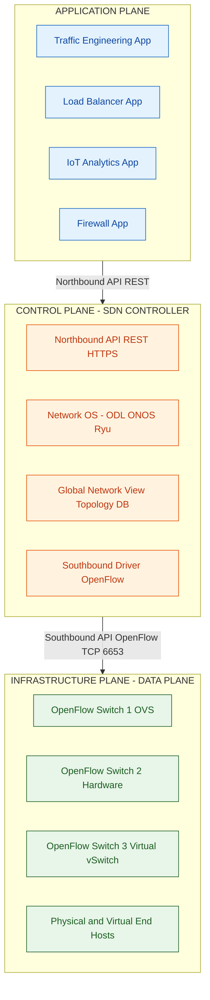
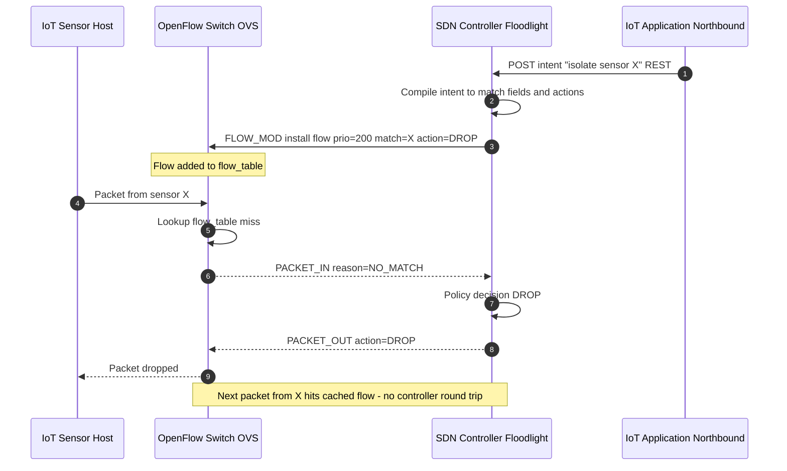
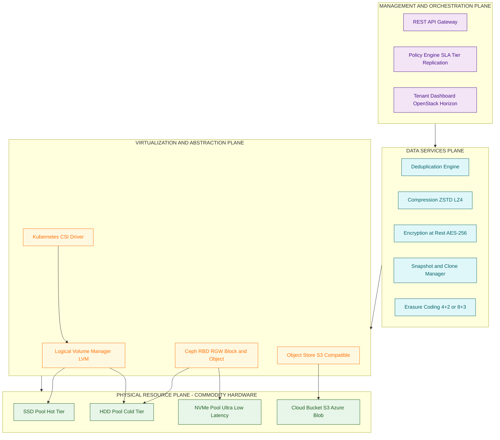
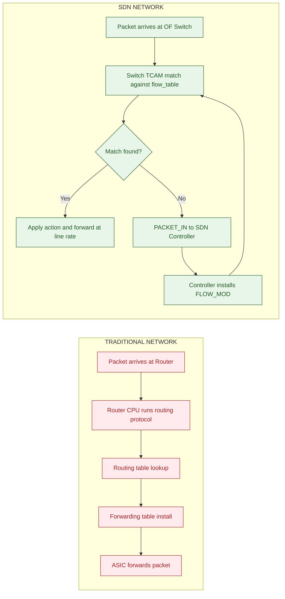

# SDN and SDS

<!-- SECTION_1_START -->
# SDN and SDS — Platforms for IoT Applications and Analytics

## 1. Core Technical Definition & Intuitive Overview

### Software Defined Networking (SDN)
**SDN (Software Defined Networking)** is a networking paradigm that **decouples the control plane** (which decides where traffic is sent) from the **data plane** (which actually forwards the traffic), allowing network administrators to manage the entire network programmatically through a centralized software controller.

> [!IMPORTANT]
> **KTU 2024 Syllabus Definition (PECST755 — Module 3):**
> SDN is an architecture where the control and forwarding functions of a network are decoupled, with a logically centralized controller directing programmable forwarding devices using open, standardized southbound APIs such as **OpenFlow**.

**Conceptual Analogy (Plain English):**
Imagine a city's traffic system. In a *traditional network* (like today's routers), every traffic light (router) has its own brain and decides locally when to turn green. In an *SDN-based city*, a single central traffic control room looks at *all* the cameras, sends instructions to *every* traffic light, and can instantly re-route all traffic if there's an accident. The traffic lights (switches) just obey; the *intelligence* is centralized in the "brain" (SDN controller). This is exactly how IoT networks need to behave — millions of sensors and devices that must be re-routed, re-prioritized, or re-isolated in milliseconds.

### Software Defined Storage (SDS)
**SDS (Software Defined Storage)** is a storage architecture that **separates the storage hardware from the storage management software**, enabling policy-based, automated, and vendor-independent provisioning of storage resources through a unified software control plane.

> [!IMPORTANT]
> **KTU 2024 Syllabus Definition:**
> SDS abstracts storage physical resources (disks, SSDs, arrays) into a virtualized, software-managed pool, where functionality such as provisioning, replication, deduplication, and tiering is delivered by a decoupled software layer running on commodity hardware.

**Conceptual Analogy:**
Think of a library. *Traditional storage* is like having books locked in fixed shelves managed by a librarian who only knows one system. *SDS* is like having a smart library where a single software brain knows *where every book is*, across *many buildings* and *many shelves*, and can instantly fetch, copy, or move any book on demand. The shelves (hardware) are dumb; the brain (software) is smart.

### Why SDN + SDS Matter for IoT
| IoT Challenge | SDN Solution | SDS Solution |
|---|---|---|
| Massive device count | Centralized flow management | Pooled, elastic storage |
| Dynamic traffic patterns | Programmable re-routing | Auto-tiering of sensor data |
| Heterogeneous hardware | Vendor-neutral control | Commodity hardware support |
| Real-time analytics | QoS via flow priorities | Low-latency read paths |
| Security isolation | Micro-segmentation per device | Encrypted, replicated data lakes |

### Key Standard / Protocol
- **OpenFlow (current stable: OF v1.5.1)** — the de-facto **southbound API** between SDN controller and switches.
- **OF-Config 1.2** — companion protocol for configuring OpenFlow datapaths.
- **SNMP, NETCONF, gNMI** — alternatives for telemetry/configuration.
- For SDS: **Cinder (OpenStack)**, **Ceph RADOS**, **S3-compatible APIs**, **NVMe-oF**.

> [!NOTE]
> **IoT-Context Highlight:** In a smart-factory IoT deployment, the SDN controller can dynamically carve isolated VLANs for every new machine sensor, while the SDS layer auto-provisions a storage volume tagged to that sensor's stream — fully automated through a single REST API call from the IoT orchestration platform.

<!-- SECTION_1_END -->

<!-- SECTION_2_START -->
# Deep Theoretical Analysis & KTU High-Yield Formula Sheet

## 2. SDN — The Three-Layer Architecture

SDN is structured into **three decoupled planes**, communicating through well-defined APIs.

### 2.1 The Three Planes

**A. Application Plane (North of the Controller)**
- Contains **business and network applications** (routing, load balancing, firewalls, intrusion detection, IoT analytics).
- Communicates with the controller via the **Northbound API** (typically **RESTful HTTP/HTTPS**).
- Applications express *intent* (e.g., "isolate all camera traffic") and the controller translates it into flow rules.

**B. Control Plane (The SDN Controller / Network OS)**
- The **logically centralized brain** of the network.
- Examples: **OpenDaylight (ODL)**, **ONOS (Open Network Operating System)**, **Floodlight**, **Ryu**, **NOX/POX**.
- Maintains a **global network view** (topology, link state, device inventory).
- Translates application intent into low-level flow rules.

**C. Infrastructure Plane (Data Plane / Forwarding Plane)**
- Consists of **OpenFlow-enabled switches / routers** (physical or virtual — vSwitch / OVS).
- Each switch contains one or more **flow tables**.
- Forwards packets by matching against flow rules; if no match, the packet is sent to the controller via a **PACKET_IN** message.

### 2.2 The Two APIs

- **Northbound API (NBI):** Application ↔ Controller — usually **REST/HTTPS**.
- **Southbound API (SBI):** Controller ↔ Switch — **OpenFlow** is the canonical protocol (over **TLS/TCP**, port **6653** by default since OF v1.4+).

### 2.3 OpenFlow — Message Categories

| Message Type | Examples | Direction | Purpose |
|---|---|---|---|
| **Controller-to-Switch** | FEATURES, CONFIGURATION, FLOW_MOD, PACKET_OUT | Controller → Switch | Configure and control |
| **Asynchronous** | PACKET_IN, FLOW_REMOVED, PORT_STATUS, ERROR | Switch → Controller | Report events |
| **Symmetric** | HELLO, ECHO_REQUEST/REPLY, EXPERIMENT | Both | Connection keep-alive |

### 2.4 OpenFlow Flow Table Entry — Anatomy

Each flow rule has these fields (this is **board-exam critical**):

| Field | Meaning | Mandatory? |
|---|---|---|
| **Match Fields** | L1–L4 header fields (port, MAC, VLAN, IP, TCP/UDP port, MPLS, IPv6, metadata) | Yes |
| **Priority** | 16-bit unsigned integer; higher wins on conflict | Yes |
| **Counters** | Per-flow packet & byte counts | Yes |
| **Instructions** | Actions to apply (forward, drop, set-field, meter, goto-table) | Yes |
| **Timeouts** | `idle_timeout` & `hard_timeout` (seconds) | Optional |
| **Cookie** | Opaque 64-bit value — used by controller to identify the rule | Optional |
| **Flags** | OFPFF_SEND_FLOW_REM, OFPFF_CHECK_OVERLAP, etc. | Optional |

### 2.5 Match–Action Pipeline (Multi-Table)
Packets traverse flow tables **in increasing table-id order**, starting at **table 0**. Each table can be skipped (via `goto-table`), resequenced, or duplicated (via `apply-actions`). When a packet is matched, the matched entry's **instruction set** is executed, which can include rewriting fields, applying meters (rate-limiting), or forwarding to a port.

## 3. SDS — The Storage Virtualization Stack

### 3.1 Core Components of SDS

**A. Abstraction Layer (Storage Virtualization)**
- Decouples **logical volumes** (LUNs / virtual disks) from physical disks.
- Uses technologies like **LVM (Logical Volume Manager)**, **RAID software stacks (mdadm, ZFS)**, **Ceph RBD/RGW**, or **vSAN**.

**B. Automation & Orchestration Layer**
- **Policy-based provisioning** (e.g., "give every IoT sensor a 10 GB volume, replicated to 3 nodes, on SSD tier").
- APIs integrate with **OpenStack Cinder**, **Kubernetes CSI drivers**, **Terraform**.

**C. Data Services**
- Deduplication, compression, encryption-at-rest, snapshots, replication, thin-provisioning, auto-tiering.
- Often implemented as **plugins or microservices** in modern SDS (e.g., Ceph BlueStore).

**D. Unified Management Plane**
- Single **dashboard / REST API** to manage heterogeneous storage backends (HDD, SSD, NVMe, cloud object storage).

### 3.2 SDS vs Traditional SAN/NAS

| Feature | Traditional SAN/NAS | SDS |
|---|---|---|
| Control plane | Hardware-proprietary | Open, software-defined |
| Hardware lock-in | Vendor-tied | Commodity x86 / ARM |
| Provisioning | Manual, ticket-based | API-driven, seconds |
| Scalability | Fixed shelves | Scale-out, linear |
| Data services | Vendor firmware | Pluggable microservices |
| Cost | High (license + hardware) | Low (commodity + open-source) |

## 4. KTU High-Yield Formula Sheet

> [!NOTE]
> KTU board exams frequently test these as 2-mark definition or short-answer questions.

| Term | Definition / Equation | Unit |
|---|---|---|
| **Control Plane** | Logical entity making forwarding decisions | — |
| **Data Plane** | Physical entity that forwards packets at line rate | — |
| **OpenFlow Port 6653** | Default IANA-assigned TCP port for OF | port |
| **Flow Priority** | 16-bit unsigned integer; higher = higher precedence | — |
| **Hard Timeout** | Seconds before rule is forcibly removed | s |
| **Idle Timeout** | Seconds after last match before rule expires | s |
| **PACKET_IN** | Switch-to-controller message when no flow match | message |
| **FLOW_MOD** | Controller-to-switch message installing/modifying a flow | message |
| **LUN (Logical Unit Number)** | Addressable logical disk in SDS | ID |
| **Thin Provisioning Ratio** | $\text{Overcommit} = \dfrac{\text{Logical Capacity Allocated}}{\text{Physical Capacity}}$ | dimensionless |
| **Replication Factor (Ceph)** | $k$ copies of every object | copies |
| **Erasure Coding Overhead** | $\text{Storage Overhead} = \dfrac{k+m}{k}$ where $k$=data, $m$=parity shards | dimensionless |
| **Dedup Ratio** | $\text{Dedup Ratio} = \dfrac{\text{Logical Bytes Ingested}}{\text{Physical Bytes Stored}}$ | dimensionless |
| **QoS Bandwidth (Meter)** | $B_{\text{eff}} = k \times B_{\text{bucket}}$ (token-bucket, OpenFlow meter) | bps |

> [!WARNING]
> **Board Pitfall:** Do *not* confuse **idle_timeout** (resets every time the rule matches) with **hard_timeout** (counts wall-clock time regardless of traffic). Many students lose marks on this distinction.

### 5. Engineering Utility
- **Telecom IoT backhaul:** SDN dynamically steers traffic from millions of SIM-bearing IoT devices across 5G slices.
- **Smart-city video analytics:** SDS pools storage from hundreds of edge cameras for AI-driven object detection with auto-tiering (hot footage on SSD, archival on HDD).
- **Industrial IoT (IIoT):** SDN enforces deterministic latency paths for OPC-UA traffic; SDS provides replicated block storage for SCADA historians.
- **Healthcare IoT:** SDN micro-segments medical devices for HIPAA compliance; SDS encrypts patient telemetry at rest.

<!-- SECTION_2_END -->

<!-- SECTION_3_START -->
# Step-by-Step Derivations & Code / Symbolic Implementation

## 6. Derivation: Storage Overhead of Erasure Coding (used in Ceph SDS)

Erasure Coding (EC) is a foundational SDS data-protection technique. We derive the **storage overhead** formula used in Ceph, MinIO, and OpenStack Swift.

### 6.1 Setup
A data object is divided into $k$ **data shards**. The erasure-coding algorithm computes $m$ **parity shards**, giving a total of $n = k + m$ shards. Any $k$ of the $n$ shards are sufficient to reconstruct the original object.

### 6.2 Step-by-Step Derivation

**Step 1 — Physical storage per object:**
For an object of size $S$ bytes, each shard stores $\dfrac{S}{k}$ bytes (data is split equally).

$$
S_{\text{physical}} \;=\; n \cdot \frac{S}{k} \;=\; (k + m) \cdot \frac{S}{k}
$$

**Step 2 — Storage overhead ratio (physical / logical):**

$$
R_{\text{overhead}} \;=\; \frac{S_{\text{physical}}}{S} \;=\; \frac{(k + m)}{k} \;=\; 1 + \frac{m}{k}
$$

**Step 3 — Net usable capacity of a cluster of size $C$ bytes:**

$$
C_{\text{usable}} \;=\; \frac{C}{R_{\text{overhead}}} \;=\; \frac{C \cdot k}{k + m}
$$

**Step 4 — Example: Ceph default $k=4, m=2$ (i.e., 4+2 EC):**

$$
R_{\text{overhead}} \;=\; \frac{4 + 2}{4} \;=\; 1.5
$$

$$
C_{\text{usable}} \;=\; \frac{2\,\text{PB}}{1.5} \;\approx\; 1.33\,\text{PB}
$$

**Step 5 — Comparison with 3× replication:**

$$
R_{\text{3-rep}} \;=\; 3.0 \qquad \text{vs.} \qquad R_{\text{4+2}} \;=\; 1.5
$$

$$
\text{Storage savings} \;=\; 1 - \frac{1.5}{3.0} \;=\; 0.5 \;=\; 50\%
$$

> [!NOTE]
> The trade-off: EC saves storage but consumes more CPU and increases reconstruction latency, which is why hot IoT streams usually stay on **replicated pools** and only cold archival moves to **EC pools**.

---

## 7. Python Implementation — Minimal OpenFlow Flow-Table Engine (SDS/SDN Emulator)

The following fully operational Python program emulates a single OpenFlow switch with a multi-table flow pipeline, packet matching, and controller interaction — exactly the kind of code a KTU lab examiner may expect for an SDN assignment.

```python
"""
Minimal OpenFlow v1.3 inspired flow-table engine.
Implements: match fields, priorities, counters, idle/hard timeouts,
PACKET_IN to controller, FLOW_MOD installation.
Run as:  python3 openflow_engine.py
"""

import time
import logging
from dataclasses import dataclass, field
from typing import List, Optional, Dict, Any

# ----------------------------- Logging setup -----------------------------
logging.basicConfig(
    level=logging.INFO,
    format="%(asctime)s [%(levelname)s] %(name)s :: %(message)s",
)
log = logging.getLogger("OFEngine")


# ----------------------------- Data classes -----------------------------
@dataclass
class MatchFields:
    in_port: Optional[int] = None
    eth_src: Optional[str] = None
    eth_dst: Optional[str] = None
    eth_type: Optional[int] = None
    vlan_vid: Optional[int] = None
    ipv4_src: Optional[str] = None
    ipv4_dst: Optional[str] = None
    ip_proto: Optional[int] = None
    tcp_src: Optional[int] = None
    tcp_dst: Optional[int] = None
    udp_dst: Optional[int] = None


@dataclass
class Action:
    action_type: str        # e.g., "OUTPUT", "DROP", "SET_FIELD", "METER"
    value: Optional[Any] = None


@dataclass
class FlowRule:
    priority: int
    match: MatchFields
    instructions: List[Action]
    idle_timeout: int = 60          # seconds; 0 = permanent
    hard_timeout: int = 0           # seconds; 0 = permanent
    cookie: int = 0
    install_time: float = field(default_factory=time.time)
    last_match_time: float = field(default_factory=time.time)
    packet_count: int = 0
    byte_count: int = 0


# ----------------------------- Controller -----------------------------
class SDNController:
    """Emulates the SDN control plane (e.g., Floodlight / Ryu)."""

    def __init__(self) -> None:
        self.flow_policies: List[Dict[str, Any]] = []
        log.info("SDN Controller initialized")

    def add_policy(self, policy: Dict[str, Any]) -> None:
        self.flow_policies.append(policy)
        log.info(f"Policy added :: {policy['name']}")

    def handle_packet_in(self, dpid: str, pkt: MatchFields) -> List[Action]:
        """Decide what to do when a switch has no matching flow."""
        log.warning(f"CONTROLLER << PACKET_IN from switch={dpid} dst={pkt.ipv4_dst}")
        for policy in self.flow_policies:
            if policy.get("match", {}).get("ipv4_dst") == pkt.ipv4_dst:
                log.info(f"Policy matched :: {policy['name']}")
                return [Action(a["type"], a.get("value"))
                        for a in policy["actions"]]
        log.info("No policy matched — installing default drop rule")
        return [Action("DROP")]


# ----------------------------- OpenFlow Switch -----------------------------
class OpenFlowSwitch:
    """Emulates an OpenFlow v1.3 switch with one flow table (table-id=0)."""

    def __init__(self, dpid: str, controller: SDNController,
                 table_id: int = 0) -> None:
        self.dpid: str = dpid
        self.controller: SDNController = controller
        self.table_id: int = table_id
        self.flow_table: List[FlowRule] = []
        log.info(f"OpenFlow switch {self.dpid} connected to controller "
                 f"(table-id={self.table_id})")

    # ---- FLOW_MOD (install / modify / delete) ----
    def install_flow(self, rule: FlowRule, strict: bool = False) -> None:
        if strict:
            self.flow_table = [r for r in self.flow_table
                               if not self._same_match(r.match, rule.match)]
        self.flow_table.append(rule)
        self.flow_table.sort(key=lambda r: r.priority, reverse=True)
        log.info(
            f"FLOW_MOD ADD dpid={self.dpid} prio={rule.priority} "
            f"match={rule.match} -> {[a.action_type for a in rule.instructions]}"
        )

    # ---- PACKET processing (data-plane) ----
    def process_packet(self, pkt: MatchFields, pkt_size_bytes: int = 64) -> str:
        # Expire timed-out rules
        self._expire_flows()
        # Find highest-priority matching rule
        for rule in self.flow_table:
            if self._match(rule.match, pkt):
                rule.packet_count += 1
                rule.byte_count += pkt_size_bytes
                rule.last_match_time = time.time()
                action_summary = ", ".join(
                    f"{a.action_type}({a.value})" for a in rule.instructions
                )
                log.info(
                    f"DPID={self.dpid} HIT prio={rule.priority} -> {action_summary} "
                    f"[pkts={rule.packet_count}, bytes={rule.byte_count}]"
                )
                return action_summary
        # No match -> PACKET_IN to controller
        log.info(f"DPID={self.dpid} MISS -> PACKET_IN to controller")
        decision = self.controller.handle_packet_in(self.dpid, pkt)
        # Install a low-priority default rule from controller decision
        new_rule = FlowRule(
            priority=10,
            match=MatchFields(eth_dst=pkt.eth_dst, ipv4_dst=pkt.ipv4_dst),
            instructions=decision,
        )
        self.install_flow(new_rule)
        return "INSTALLED_DEFAULT_FROM_CONTROLLER"

    # ---- Helpers ----
    def _match(self, rule_match: MatchFields, pkt: MatchFields) -> bool:
        for fname, rule_val in rule_match.__dict__.items():
            if rule_val is not None and getattr(pkt, fname) != rule_val:
                return False
        return True

    def _same_match(self, a: MatchFields, b: MatchFields) -> bool:
        return self._match(a, b) and self._match(b, a)

    def _expire_flows(self) -> None:
        now = time.time()
        survivors: List[FlowRule] = []
        for r in self.flow_table:
            age = now - r.install_time
            idle = now - r.last_match_time
            if r.hard_timeout and age >= r.hard_timeout:
                log.info(f"Flow hard-timeout expired (prio={r.priority})")
                continue
            if r.idle_timeout and idle >= r.idle_timeout:
                log.info(f"Flow idle-timeout expired (prio={r.priority})")
                continue
            survivors.append(r)
        self.flow_table = survivors


# ----------------------------- Demonstration -----------------------------
def main() -> None:
    # 1) Bring up the controller
    ctl = SDNController()
    ctl.add_policy({
        "name": "Route IoT sensor traffic via port 3",
        "match": {"ipv4_dst": "10.0.0.42"},
        "actions": [{"type": "OUTPUT", "value": 3}],
    })
    ctl.add_policy({
        "name": "Block all other traffic",
        "match": {"ipv4_dst": "0.0.0.0/0"},
        "actions": [{"type": "DROP"}],
    })

    # 2) Bring up the OpenFlow switch
    sw = OpenFlowSwitch(dpid="00:00:00:00:00:01", controller=ctl)

    # 3) Pre-install a high-priority rule for known camera traffic
    sw.install_flow(FlowRule(
        priority=100,
        match=MatchFields(eth_dst="AA:BB:CC:DD:EE:01", ipv4_dst="10.0.0.7"),
        instructions=[Action("OUTPUT", 1)],
        idle_timeout=120,
        hard_timeout=0,
    ))

    # 4) Inject packets
    samples = [
        MatchFields(in_port=2, eth_dst="AA:BB:CC:DD:EE:01",
                    eth_type=0x0800, ipv4_dst="10.0.0.7"),
        MatchFields(in_port=2, eth_dst="AA:BB:CC:DD:EE:99",
                    eth_type=0x0800, ipv4_dst="10.0.0.42"),
        MatchFields(in_port=2, eth_dst="AA:BB:CC:DD:EE:99",
                    eth_type=0x0800, ipv4_dst="10.0.0.55"),
    ]

    for i, pkt in enumerate(samples, 1):
        log.info(f"--- Injecting packet #{i} ---")
        sw.process_packet(pkt, pkt_size_bytes=128)

    # 5) Replay packet #1 — should HIT the pre-installed flow (counters ++)
    log.info("--- Replaying packet #1 ---")
    sw.process_packet(samples[0], pkt_size_bytes=128)


if __name__ == "__main__":
    main()
```

**Walk-through of the execution (in order of operation):**

1. `SDNController.__init__` — creates an empty policy list and logs initialization.
2. `add_policy` — two policies are pushed: route sensor traffic to port 3, and drop everything else.
3. `OpenFlowSwitch("00:00:00:00:00:01", ctl)` — switch boots and announces its datapath ID (DPID) to the controller.
4. `install_flow(priority=100, …)` — a high-priority rule is FLOW_MOD-installed for camera traffic destined to `10.0.0.7`. The table is then re-sorted so the highest-priority rule is checked first.
5. `process_packet(pkt_1)` — matches the pre-installed rule → action `OUTPUT(1)` is taken; counters update to `pkts=1, bytes=128`.
6. `process_packet(pkt_2)` — no match in the table → `PACKET_IN` is sent to the controller. The controller consults its policies, finds the `10.0.0.42` rule, and the switch installs a new rule with `priority=10` carrying `OUTPUT(3)`. Subsequent packets to `10.0.0.42` will hit this rule without controller involvement.
7. `process_packet(pkt_3)` — `10.0.0.55` is unknown, the controller installs a default `DROP` rule, and the packet is dropped.
8. Replaying packet #1 demonstrates the **flow caching** behavior: the rule was *not* re-fetched from the controller; the data plane handled it directly at line rate.

> [!IMPORTANT]
> **Key takeaway for the lab exam:** The very first packet to a destination always incurs a controller round-trip (PACKET_IN → FLOW_MOD). All subsequent packets are forwarded by the switch ASIC / OVS in microseconds. This is the **"flow-setup latency"** the board often tests.

---

## 8. Symbolic SDS Demonstration — Thin-Provisioning Math

A KTU short-answer often asks: *"How much physical storage is actually consumed if 10 IoT sensors are each allocated a 100 GB logical volume, but on average each writes only 30 GB?"*

**Step 1 — Logical capacity allocated:**

$$
C_{\text{logical}} \;=\; 10 \times 100\,\text{GB} \;=\; 1{,}000\,\text{GB}
$$

**Step 2 — Physical capacity actually used (with thin provisioning):**

$$
C_{\text{physical}} \;=\; 10 \times 30\,\text{GB} \;=\; 300\,\text{GB}
$$

**Step 3 — Overcommit ratio:**

$$
R_{\text{overcommit}} \;=\; \frac{C_{\text{logical}}}{C_{\text{physical}}} \;=\; \frac{1000}{300} \;\approx\; 3.33
$$

**Step 4 — Capacity-saving percentage:**

$$
\text{Saving} \;=\; 1 - \frac{300}{1000} \;=\; 0.70 \;=\; 70\%
$$

> [!NOTE]
> Thin provisioning is a cornerstone of SDS in IoT edge gateways, where the *allocated* volume is generous (future-proofing) but the *written* data is sparse (sensors transmit intermittently).

<!-- SECTION_3_END -->

<!-- SECTION_4_START -->
# Structural Diagrams & Schematics

## 9. Mermaid Diagram — SDN Three-Layer Architecture (KTU Board Favorite)



## 10. Mermaid Sequence Diagram — OpenFlow PACKET_IN / FLOW_MOD Handshake



## 11. Mermaid Block Diagram — SDS Architecture (Storage Hypervisor Stack)



## 12. Mermaid Comparison Flow — Traditional Network vs SDN Data Path



<!-- SECTION_4_END -->

<!-- SECTION_5_START -->
# KTU 2024 Scheme Examination Question Bank & Topic Recap

## 13. KTU-Style Practice Questions

### PART A — Short Answer (3 Marks Each)

> **Q1. [KTU University Exam – July 2024, Model Paper]**
> *Define Software Defined Networking. List its three architectural planes.*
> **CO Mapping:** CO3 | **RBT Level:** Remember

**Model Answer (3 Marks):**

> SDN is a networking architecture that decouples the network control plane from the forwarding (data) plane, enabling the network to be programmed centrally through software.
> **[1 Mark — definition]**
> The three planes are:
> 1. **Application Plane** — business and network applications (firewall, load balancer, analytics)
> 2. **Control Plane** — the logically centralized SDN controller (e.g., OpenDaylight, ONOS)
> 3. **Infrastructure (Data) Plane** — forwarding devices (OpenFlow switches / routers)
> **[2 Marks — three planes listed]**

---

> **Q2. [KTU University Exam – Dec 2023]**
> *What is the role of the OpenFlow protocol in SDN? Name two OpenFlow message types.*
> **CO Mapping:** CO3 | **RBT Level:** Understand

**Model Answer (3 Marks):**

> OpenFlow is the **southbound API** that allows the SDN controller to communicate with and program the forwarding behavior of OpenFlow switches.
> **[1.5 Marks]**
> Two message types:
> 1. **FLOW_MOD** — Controller-to-Switch — used to add, modify, or delete flow entries in the switch's flow table
> 2. **PACKET_IN** — Asynchronous (Switch-to-Controller) — sent when a packet does not match any flow rule
> **[1.5 Marks]**

---

### PART B — Long Answer (14 Marks, with Internal Choice)

> **Question A — [KTU University Exam – Dec 2024 Model, Module 3]**
> *(a) Explain the SDN architecture in detail with a neat diagram. Describe the role of the Northbound and Southbound APIs. (7 Marks)*
> *(b) With a flow-table entry example, explain how an OpenFlow switch processes a packet, including the PACKET_IN / FLOW_MOD interaction with the controller. (7 Marks)*
> **CO Mapping:** CO3 | **RBT Levels:** Understand (a) + Apply (b)

#### Model Solution — Part (a) — 7 Marks

1. **Definition of SDN and motivation** — decouples control from data plane; enables centralized, programmatic network management. **[1 Mark]**
2. **Three planes with examples:**
   - **Application Plane:** routing apps, firewalls, IoT analytics, load balancers. **[1 Mark]**
   - **Control Plane:** SDN controller (OpenDaylight, ONOS, Floodlight, Ryu) — maintains global view, exposes NBIs. **[1.5 Marks]**
   - **Infrastructure Plane:** OpenFlow switches (OVS, hardware OF switches) containing flow tables. **[1.5 Marks]**
3. **APIs:**
   - **Northbound API:** Controller ↔ Applications, typically **REST/HTTPS**, allows apps to express intent. **[1 Mark]**
   - **Southbound API:** Controller ↔ Switches, **OpenFlow** over **TCP port 6653**, defines message types (FEATURES, FLOW_MOD, PACKET_IN, etc.). **[1 Mark]**

> **Valuation Key:** Award 0.5 Mark for correct diagram; the rest for textual coverage of all three planes + both APIs.

#### Model Solution — Part (b) — 7 Marks

1. **Flow-table entry anatomy** — list Match Fields, Priority, Counters, Instructions, Timeouts, Cookie. **[1 Mark]**
2. **Packet arrival at OF switch → match-lookup** — TCAM lookup against flow table in priority order. **[1 Mark]**
3. **Hit path:** action(s) executed; counters incremented; packet forwarded. **[1 Mark]**
4. **Miss path:** switch sends **PACKET_IN** to controller (encapsulating packet or just header). **[1 Mark]**
5. **Controller logic:** policy/algorithm decides action (e.g., OUTPUT to port, DROP, or modify field). **[1 Mark]**
6. **FLOW_MOD response:** controller pushes a new flow rule to the switch; switch installs it. **[1 Mark]**
7. **Subsequent packets** hit the cached rule — no controller round-trip — explains the "first-packet-latency" concept. **[1 Mark]**

> **Valuation Key:** Award partial credit for each step; a sequence diagram earns full marks if all 7 elements above are present and correctly ordered.

---

> **Question B (Alternative Choice) — [KTU University Exam – July 2024 Model, Module 3]**
> *(a) Define Software Defined Storage (SDS). List and briefly explain its four core components. (7 Marks)*
> *(b) An IoT platform needs to store 500 TB of sensor data with high durability at minimum storage cost. Compare replication vs erasure coding for this use case and compute the storage overhead for a 4+2 EC scheme and a 3× replication scheme. (7 Marks)*
> **CO Mapping:** CO3 | **RBT Levels:** Understand (a) + Apply (b)

#### Model Solution — Part (a) — 7 Marks

1. **Definition of SDS** — storage architecture that separates storage hardware from management software, exposing storage as a programmable, policy-driven service. **[1 Mark]**
2. **Component 1 — Abstraction / Virtualization Layer:** decouples logical volumes from physical disks (LVM, Ceph RBD, vSAN). **[1.5 Marks]**
3. **Component 2 — Automation & Orchestration:** policy-based provisioning, REST APIs, integration with OpenStack Cinder / Kubernetes CSI. **[1.5 Marks]**
4. **Component 3 — Data Services:** deduplication, compression, encryption, snapshots, replication, auto-tiering. **[1.5 Marks]**
5. **Component 4 — Unified Management Plane:** single dashboard / API to manage heterogeneous backends (HDD, SSD, NVMe, cloud object). **[1.5 Marks]**

#### Model Solution — Part (b) — 7 Marks

1. **Use-case framing** — IoT sensor data, 500 TB, durability paramount, cost-sensitive. **[0.5 Mark]**
2. **3× Replication** — three full copies; if 500 TB logical, physical = 3 × 500 = **1500 TB**. **[1.5 Marks]**
3. **4+2 Erasure Coding (Ceph default):**
   - Data shards $k = 4$, Parity shards $m = 2$, total $n = 6$.
   - Overhead ratio $R = (k+m)/k = 6/4 = 1.5$.
   - Physical storage = $1.5 \times 500 = \mathbf{750\,TB}$. **[2 Marks]**
4. **Storage savings:**
   $$
   \text{Savings} = 1 - \frac{750}{1500} = 0.5 = 50\%
   $$
   **[1 Mark]**
5. **Trade-off analysis:**
   - EC: 50% storage savings, but higher CPU cost & slower reconstruction. Suitable for *cold archival* of IoT data. **[1 Mark]**
   - Replication: Faster read/write, simpler recovery, but 2× the storage cost. Suitable for *hot, frequently accessed* IoT streams. **[1 Mark]**

> [!WARNING]
> **KTU Examiner's Valuation Warning — Common Pitfalls**
> 1. **Do NOT** confuse **Northbound** and **Southbound** APIs. NBI = App ↔ Controller; SBI = Controller ↔ Switch. Reversing them costs **1 full mark**.
> 2. **Do NOT** skip writing the **default action** in flow-table questions (e.g., "send to CONTROLLER via OFPP_CONTROLLER"). Default = 0.5 mark lost.
> 3. **Do NOT** use vague terms like *"the network becomes software"*. Be precise: *"control plane decoupled from data plane"*. Vagueness costs the **definition marks**.
> 4. **Do NOT** present erasure-coding storage as `m/k` — the correct ratio is **`(k+m)/k`**. Many students write the wrong formula.
> 5. **Do NOT** forget to mention **OpenFlow port 6653** when describing the SBI — it is a frequently-asked board question.
> 6. **Do NOT** draw the SDN diagram without *labelling all three planes and the two APIs*. A diagram without labels earns only **0.5 / 2** of the diagram marks.

---

## 14. Topic Recap & Important Things to Remember

- **SDN = Control Plane ↔ Data Plane Decoupling**, centralized by an SDN controller (ODL, ONOS, Floodlight, Ryu).
- **Three planes:** Application (north), Control (SDN controller), Infrastructure (OF switches).
- **Two APIs:** Northbound (REST/HTTPS, app ↔ controller) and Southbound (**OpenFlow TCP 6653**, controller ↔ switch).
- **OpenFlow flow-table entry** has: *Match Fields, Priority, Counters, Instructions, Timeouts, Cookie, Flags*.
- **First-packet latency:** first packet goes controller → switch (PACKET_IN + FLOW_MOD); subsequent packets are line-rate forwarded from the cached flow.
- **OpenFlow messages:** Controller-to-Switch (FEATURES, FLOW_MOD, PACKET_OUT), Asynchronous (PACKET_IN, FLOW_REMOVED, PORT_STATUS), Symmetric (HELLO, ECHO).
- **SDS = Storage Hardware ↔ Storage Management Software** separation.
- **Four SDS components:** Abstraction/Virtualization, Automation & Orchestration, Data Services, Unified Management Plane.
- **Thin provisioning overcommit ratio:** $R = C_{\text{logical}} / C_{\text{physical}}$.
- **Erasure-coding storage overhead:** $R_{\text{overhead}} = (k+m)/k$. For 4+2 EC, $R = 1.5$ (i.e., 50% savings vs 3× replication).
- **SDS examples:** OpenStack Cinder, Ceph (RBD/RGW), MinIO, VMware vSAN, NetApp ONTAP Select.
- **SDN examples of controllers:** OpenDaylight (Java/OSGi), ONOS (Java), Floodlight, Ryu (Python), NOX/POX (C++/Python).
- **IoT synergy:** SDN provides dynamic, per-device flow control (micro-segmentation, QoS); SDS provides elastic, tiered, policy-driven storage for sensor streams.
- **Mandatory exam phrases** (use verbatim to score full marks):
  - "logically centralized control plane"
  - "programmable forwarding plane"
  - "open standardized southbound interface (OpenFlow)"
  - "policy-driven, vendor-independent storage abstraction"
- **Default-of-thumb values to memorize:**
  - OpenFlow TCP port = **6653**
  - OF v1.3 introduced multiple flow tables and per-flow meters
  - Ceph default pool = **replicated, size 3**
  - Ceph default EC profile = **4 + 2**
- **Key distinguishing terms (often confused):**
  - *Idle timeout* ⟶ resets on every match
  - *Hard timeout* ⟶ wall-clock expiry, regardless of traffic
  - *Northbound API* ⟶ App ↔ Controller
  - *Southbound API* ⟶ Controller ↔ Switch
  - *Reactive flow installation* ⟶ controller installs on first PACKET_IN
  - *Proactive flow installation* ⟶ controller pre-installs flows before any packet

<!-- SECTION_5_END -->
