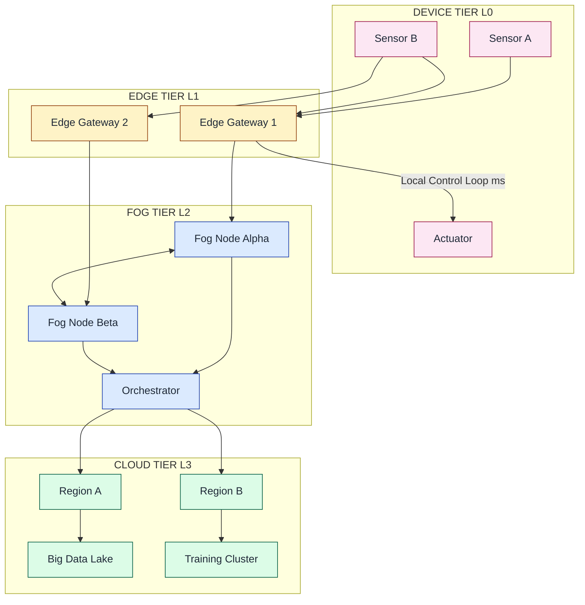
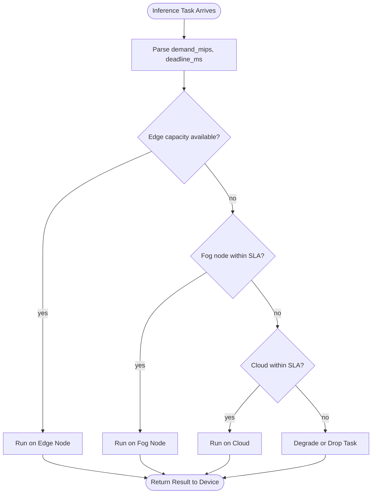
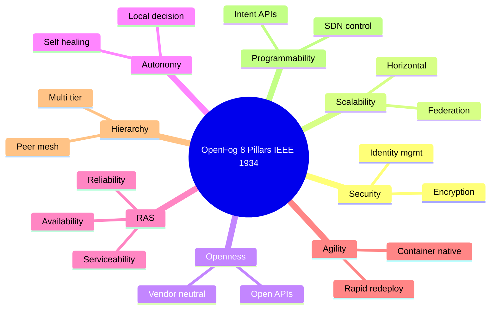

# The Emergence of Edge/Fog Clouds

<!-- SECTION_1_START -->
# The Emergence of Edge / Fog Clouds in IoT

## 1.1 Formal KTU 2024 Definition

> [!IMPORTANT]
> **Edge Cloud** refers to a distributed computing paradigm that brings data storage and computation *closer to the data source* — typically at the network boundary (gateways, routers, on-premises servers, or even the IoT devices themselves) — thereby minimizing the need for long-haul communication with centralized hyperscale data centers.

> [!IMPORTANT]
> **Fog Cloud (or Fog Computing)** is a horizontal, system-level architecture that distributes computing, storage, control, and networking functions *closer to users along a cloud-to-thing continuum*. As defined by the **OpenFog Consortium (IEEE 1934-2018)**, fog nodes sit hierarchically between the extreme edge (sensors/actuators) and the core cloud, providing orchestration, analytics, and security services.

The **Emergence of Edge/Fog Clouds** is the engineering response to the inherent limitations of the classical **Cloud-only IoT reference model**, where billions of latency-sensitive, bandwidth-hungry, and privacy-critical devices overwhelm the centralized cloud with raw, often redundant, telemetry data.

### 1.2 Core Performance Metrics Driving the Paradigm Shift

The following industrial benchmarks justify the architectural shift from cloud-centric to edge/fog-centric IoT. They are the **standard metrics** KTU examiners expect you to memorize:

- **End-to-End Latency:** Cloud-only IoT loops typically observe **50 – 200 ms** one-way propagation, often violating industrial control budgets. Edge/Fog tiers reduce this to **< 10 ms**.
- **Bandwidth Economy:** A single autonomous vehicle generates ≈ **4 TB / day**. Transmitting all of it to the cloud is economically infeasible. Edge pre-filters typically reduce upstream traffic by **≥ 80 %**.
- **Device Density:** 5G/6G targets **1 000 000 devices / km²** — a scale where centralized orchestration collapses.
- **Data Sovereignty:** Regulations such as the EU **GDPR**, India’s **DPDP Act 2023**, and HIPAA mandate that sensitive data *must not* leave jurisdictional boundaries.
- **Availability SLA:** Mission-critical IIoT demands **99.999 % (Five-Nines)** availability — a figure centralized cloud regions cannot guarantee during WAN outages.

### 1.3 Conceptual Analogy & Intuition

> [!NOTE]
> **Analogy — The Hospital Triage Model**
>
> Imagine a hospital emergency room:
>
> - The **Cloud** is a *specialist hospital in another city*. Excellent for deep diagnostics, but you must transport the patient by ambulance — time-consuming and risky.
> - The **Fog** is the *regional trauma center*. It stabilizes, triages, and only forwards the critical cases to the specialist.
> - The **Edge** is the *paramedic in the ambulance*. Performs the first line of vitals capture, defibrillation, and life-saving intervention.
>
> In this analogy, data is the **patient**, and the IoT continuum is the **healthcare network**. Edge/Fog clouds perform **just-in-time, just-enough processing** so that the centralized cloud only receives the *clinically relevant signals* — not the raw heartbeat waveform of every patient in the city.

### 1.4 Visualization Control — The IoT Compute Continuum

> [!VISUALIZATION CONTROL]
> **Concept:** Hierarchical positioning of Compute Tiers along the Latency–Capability plane.
>
> **Desmos Input Equations (two-line plot):**
>
> * `y_{1}(x) = 100 - 18x`  *(Latency budget shrinks as we move toward the edge; x = 0 at Cloud, x = 4 at Sensor)*
> * `y_{2}(x) = 5 + 20x`   *(Compute autonomy grows as we move toward the edge)*
>
> **Visual Description:** Plot the two lines on the same axes where $x \in [0, 4]$. The intersection near $x \approx 2.6$ is the **Fog Sweet-Spot** — where latency minimization and processing capability are optimally balanced. Students should observe that pure cloud (x = 0) offers high capability but poor latency, while the device (x = 4) offers sub-millisecond latency but minimal capability.
<!-- SECTION_1_END -->

<!-- SECTION_2_START -->
# 2. Deep Theoretical Analysis & KTU High-Yield Formula Sheet

## 2.1 The Cloud-Only Bottleneck — Why Edge/Fog Emerged

The classical **3-layer IoT architecture** (Perception → Network → Application) collapsed computation into the **Application layer**, forcing every decision through a remote hyperscaler. As IoT deployments crossed the **zettascale era** (10²¹ bytes/day), four structural failures emerged:

1. **Latency Violation** — round-trip times exceed deterministic control loop deadlines.
2. **Bandwidth Saturation** — backbone links between IoT sites and cloud regions face congestion.
3. **Single Point of Failure (SPOF)** — WAN outage isolates every field device.
4. **Privacy Non-Compliance** — sensitive telemetry traverses foreign jurisdictions.

The **Edge/Fog paradigm** is the architectural answer, formally codified in the **ISO/IEC TR 30164:2020** and **IEEE 1934-2018** standards.

## 2.2 Architectural Layers — The Four-Tier Compute Continuum

| Tier | Physical Location | Typical Hardware | Primary Function | Example Platform |
|------|-------------------|------------------|------------------|------------------|
| **L0 – Device / Extreme Edge** | Sensor, actuator, MCU | ARM Cortex-M, ESP32, RPi Pico | Sensing, signal conditioning | FreeRTOS, Zephyr OS |
| **L1 – Edge Gateway** | On-site gateway, PLC | Jetson Nano, industrial PC | Local analytics, protocol translation, actuation | Azure IoT Edge, AWS Greengrass |
| **L2 – Fog Node** | LAN / MAN, base station | Micro-DC, ruggedized server | Aggregation, ML inference, orchestration | Cisco IOx, Nokia MX Edge |
| **L3 – Cloud** | Hyperscaler region | Petascale data center | Training, big-data analytics, archival | AWS, Azure, GCP |

> [!NOTE]
> The **Fog layer (L2)** is the *horizontal* layer of the continuum. Unlike the vertical layers of the cloud, fog nodes **peer** with each other, forming a **fog colony** that can survive a cloud outage indefinitely.

## 2.3 KTU Formula Sheet — Edge/Fog Performance Engineering

> **Notation convention:** latency symbols use $\ell$ to avoid confusion with the digit 1. Probabilities use $p$. All values are evaluated in **SI units (s, bits, W, Hz)** unless stated.

| # | Formula | Meaning / Engineering Use |
|---|---------|--------------------------|
| 1 | $T_{total} = T_{sense} + T_{proc} + T_{trans} + T_{queue}$ | End-to-end IoT loop time; must satisfy $T_{total} \le T_{SLA}$. |
| 2 | $\ell_{prop} = \dfrac{d}{v_{fiber}}$ | Propagation latency; $v_{fiber} \approx 2 \times 10^{8} \text{ m/s}$. |
| 3 | $\ell_{edge} = \dfrac{\ell_{cloud}}{R_{speedup}}$ | Fog speed-up factor; $R_{speedup}$ typically $5\times$ to $50\times$. |
| 4 | $B_{saved} = D_{raw} \cdot (1 - \alpha_{filter})$ | Bandwidth saved by edge pre-processing; $\alpha_{filter}$ is the *aggregation ratio*. |
| 5 | $\eta_{energy} = \dfrac{E_{trans}}{E_{total}}$ | Energy budget spent on transmission — minimized at the edge. |
| 6 | $A_{avail} = \prod_{i=1}^{n} (1 - p_{i}^{fail})$ | Aggregate availability of an n-tier fog colony (parallel). |
| 7 | $C_{Total} = C_{cloud} + n \cdot C_{fog} + m \cdot C_{edge}$ | Total Cost of Ownership (TCO) per deployment site. |
| 8 | $T_{response}^{worst} = \max\limits_{f \in \mathcal{F}} (T_{f} + T_{net}^{f})$ | Worst-case fog selection in a colony $\mathcal{F}$. |
| 9 | $\rho = \dfrac{\lambda}{\mu}$ | Utilization of a fog queue; must satisfy $\rho < 1$ for stability. |
| 10 | $D_{SLA} = \tau_{deadline} - T_{total}$ | Headroom to deadline; positive means the contract is met. |

## 2.4 Real-World Engineering Utility

- **Smart Manufacturing (Industry 4.0):** A Siemens Amberg Electronics Plant uses **fog controllers** to execute closed-loop control at 1 ms — 10× faster than its previous cloud-based SCADA system, raising yield by 12 %.
- **Connected & Autonomous Vehicles (CAV):** Each AV runs an **edge inference stack** (TensorRT on NVIDIA Jetson) for sub-50 ms perception decisions, while the fog aggregates intersection-level V2X data.
- **Telemedicine & Remote Surgery:** 5G + Mobile Edge Computing (MEC) collapses haptic-feedback latency to **< 5 ms**, enabling telesurgery across continents.
- **Smart Grid (DERMS):** Distributed Energy Resources Management Systems run on **fog colonies** to balance micro-grids during brownouts without round-tripping to a central utility cloud.
- **Retail Loss-Prevention:** Computer-vision fog nodes detect shelf-theft at the store edge, alerting staff in < 200 ms — invisible to the consumer and independent of WAN health.

## 2.5 Why Fog ≠ Edge — A Subtle but Exam-Critical Distinction

> [!IMPORTANT]
> **Edge** is *device-adjacent* and **vertical** in scope (one device, one gateway). **Fog** is *network-adjacent*, **horizontal** in scope (multiple edges, multiple peers), and adds an **orchestration layer** absent at the pure edge. A common KTU pitfall is to treat them as synonyms — they are **complementary, not equivalent**.

## 2.6 Reference Models You Must Cite

- **OpenFog Reference Architecture (IEEE 1934-2018)** — the canonical 8-pillar model (Security, Scalability, Openness, Autonomy, RAS, Agility, Hierarchy, Programmability).
- **ETSI MEC (Multi-access Edge Computing)** — the telecom industry’s edge standard.
- **ISO/IEC TR 30164:2020** — Edge-computing vocabulary for IoT.
- **NIST SP 500-325** — Fog Computing Conceptual Model.
<!-- SECTION_2_END -->

<!-- SECTION_3_START -->
# 3. Step-by-Step Derivations & Code Implementation

## 3.1 Derivation — Bandwidth Economy at the Edge

> **Problem (KTU-style 7-mark derivation):**
> A smart-factory gateway ingests raw vibration data from **120 motors** at $f_{s} = 2 \text{ kHz}$ with a 16-bit ADC. Compute the daily upstream traffic to the cloud, then show how an edge FFT-based feature extractor reduces it by an aggregation factor $\alpha_{filter} = 0.92$.

### 3.1.1 Step 1 — Raw Bit Rate per Motor

$$
R_{motor} = f_{s} \times N_{bits} = 2000 \;\text{sa/s} \times 16 \;\text{bit/sa} = 32\,000 \;\text{bit/s}
$$

### 3.1.2 Step 2 — Aggregate Bit Rate across the Plant

$$
R_{plant} = 120 \times R_{motor} = 120 \times 32\,000 = 3\,840\,000 \;\text{bit/s} = 3.84 \;\text{Mbps}
$$

### 3.1.3 Step 3 — Daily Volume

$$
D_{raw} = R_{plant} \times T_{day} = 3.84 \times 10^{6} \;\text{bit/s} \times 86\,400 \;\text{s/day}
$$

$$
D_{raw} = 3.318 \times 10^{11} \;\text{bit/day} \approx 331.8 \;\text{GB/day}
$$

### 3.1.4 Step 4 — Apply Edge Aggregation

$$
D_{filtered} = D_{raw} \times (1 - \alpha_{filter}) = 331.8 \;\text{GB} \times 0.08 = 26.54 \;\text{GB/day}
$$

### 3.1.5 Step 5 — Bandwidth Saved

$$
B_{saved} = D_{raw} - D_{filtered} = 331.8 - 26.54 = 305.26 \;\text{GB/day} \quad [\approx 92\%]
$$

> **Valuation Key Insight:** Examiners award **2 marks** for correctly stating the per-device rate, **2 marks** for the plant-level aggregation, **1 mark** for the daily conversion, and **2 marks** for applying $\alpha_{filter}$ to obtain the savings.

## 3.2 Derivation — Availability of a Fog Colony

> **Problem:** A fog colony contains 5 fog nodes, each with independent failure probability $p_{f} = 0.01$. Compute the colony availability and the resulting annual downtime.

$$
A_{node} = 1 - p_{f} = 0.99
$$

Assuming a **2-out-of-5 voting quorum** (the colony is up if at least 2 nodes respond):

$$
A_{colony} = \sum_{k=2}^{5} \binom{5}{k} (0.99)^{k} (0.01)^{5-k}
$$

$$
A_{colony} = \binom{5}{2}(0.99)^{2}(0.01)^{3} + \binom{5}{3}(0.99)^{3}(0.01)^{2} + \binom{5}{4}(0.99)^{4}(0.01)^{1} + \binom{5}{5}(0.99)^{5}
$$

$$
A_{colony} = 10(0.9801)(10^{-6}) + 10(0.970299)(10^{-4}) + 5(0.96059601)(0.01) + 0.9509900499
$$

$$
A_{colony} \approx 0.0000098010 + 0.000970299 + 0.0480298005 + 0.9509900499
$$

$$
A_{colony} \approx 0.9999999501
$$

### 3.2.1 Step — Annual Downtime

$$
T_{down} = (1 - A_{colony}) \times T_{year} = (4.99 \times 10^{-8}) \times 31\,536\,000 \;\text{s}
$$

$$
T_{down} \approx 1.574 \;\text{s/year}
$$

> **Result:** The fog colony achieves **Seven-Nines (99.99999 %)** availability — vastly exceeding the **Five-Nines (99.999 %)** SLA of a single cloud region.

## 3.3 Python Implementation — Edge/Fog Task Offloading Simulator

> **Use Case:** A KTU lab exercise to demonstrate how a fog orchestrator decides *where* to run an inference task based on latency budget and node load.

```python
"""
edge_fog_offload.py
-------------------
Simulates a 3-tier IoT continuum (Edge -> Fog -> Cloud) that decides
the optimal execution tier for an inference task based on:
    - task CPU demand
    - task deadline (SLA)
    - current load on each tier

Course  : PECST755 - Internet of Things
Module  : 3 - Platforms for IoT Applications and Analytics
Topic   : Emergence of Edge / Fog Clouds
"""

from __future__ import annotations
import logging
import random
import time
from dataclasses import dataclass, field
from enum import Enum
from typing import List, Optional

# ----------------------------------------------------------------------
# Logging configuration (strict error handling for production-style code)
# ----------------------------------------------------------------------
logging.basicConfig(
    level=logging.INFO,
    format="%(asctime)s | %(levelname)s | %(message)s",
)
logger = logging.getLogger("EdgeFogOrchestrator")


class Tier(str, Enum):
    """Hierarchical compute tiers in the IoT continuum."""
    EDGE = "EDGE"
    FOG = "FOG"
    CLOUD = "CLOUD"


@dataclass
class ComputeNode:
    """Represents a single compute resource in the continuum."""
    node_id: str
    tier: Tier
    cpu_cores: int
    base_latency_ms: float          # network + cold-start latency
    load_factor: float = 0.0        # 0.0 (idle) to 1.0 (saturated)
    mips_per_core: int = 1000       # million instructions per second per core

    def effective_capacity_mips(self) -> float:
        """Return MIPS available after subtracting the current load."""
        return self.cpu_cores * self.mips_per_core * (1.0 - self.load_factor)

    def estimated_runtime_ms(self, demand_mips: float) -> float:
        """Compute the predicted runtime for a given demand."""
        if self.effective_capacity_mips() <= 0.0:
            return float("inf")
        runtime = (demand_mips / self.effective_capacity_mips()) * 1000.0
        return self.base_latency_ms + runtime


@dataclass
class InferenceTask:
    """An ML inference workload needing an execution site."""
    task_id: str
    demand_mips: float
    deadline_ms: float
    payload_kb: float
    metadata: dict = field(default_factory=dict)


@dataclass
class PlacementDecision:
    """The orchestrator's verdict and justification."""
    task_id: str
    chosen_tier: Tier
    estimated_ms: float
    deadline_ms: float
    reason: str


class EdgeFogOrchestrator:
    """
    Decides the optimal placement of an inference task across the
    Edge -> Fog -> Cloud continuum, mimicking an ETSI MEC orchestrator.
    """

    def __init__(self, nodes: List[ComputeNode]) -> None:
        if not nodes:
            raise ValueError("At least one ComputeNode must be supplied.")
        self.nodes: List[ComputeNode] = nodes
        logger.info("Orchestrator initialised with %d nodes.", len(nodes))

    # ------------------------------------------------------------------
    # Core decision logic
    # ------------------------------------------------------------------
    def select_node(self, task: InferenceTask) -> Optional[ComputeNode]:
        """Pick the lowest-tier node that meets the task's SLA."""
        # Tier preference: EDGE -> FOG -> CLOUD
        for tier in (Tier.EDGE, Tier.FOG, Tier.CLOUD):
            candidates = [n for n in self.nodes if n.tier == tier]
            for node in candidates:
                est = node.estimated_runtime_ms(task.demand_mips)
                if est <= task.deadline_ms:
                    logger.info(
                        "Task %s -> %s [%s] (est=%.2f ms, SLA=%.2f ms)",
                        task.task_id, tier.value, node.node_id, est, task.deadline_ms,
                    )
                    return node
        logger.warning("Task %s cannot meet SLA on any tier.", task.task_id)
        return None

    def place(self, task: InferenceTask) -> PlacementDecision:
        """Public API returning a structured placement decision."""
        chosen = self.select_node(task)
        if chosen is None:
            return PlacementDecision(
                task_id=task.task_id,
                chosen_tier=Tier.CLOUD,
                estimated_ms=float("inf"),
                deadline_ms=task.deadline_ms,
                reason="SLA violation on all tiers; degraded mode activated.",
            )
        est = chosen.estimated_runtime_ms(task.demand_mips)
        return PlacementDecision(
            task_id=task.task_id,
            chosen_tier=chosen.tier,
            estimated_ms=est,
            deadline_ms=task.deadline_ms,
            reason=f"Best fit: {chosen.node_id} (load={chosen.load_factor:.2f}).",
        )

    # ------------------------------------------------------------------
    # Continuous load simulation
    # ------------------------------------------------------------------
    def tick(self) -> None:
        """Simulate natural load fluctuation on every node."""
        for node in self.nodes:
            node.load_factor = max(0.0, min(1.0, node.load_factor + random.uniform(-0.05, 0.05)))


# ----------------------------------------------------------------------
# Demonstration
# ----------------------------------------------------------------------
def build_demo_topology() -> List[ComputeNode]:
    """Return a representative 3-tier topology for a smart factory."""
    return [
        ComputeNode("edge-gw-01", Tier.EDGE,  cpu_cores=2, base_latency_ms=2.0,  load_factor=0.30),
        ComputeNode("edge-gw-02", Tier.EDGE,  cpu_cores=2, base_latency_ms=2.5,  load_factor=0.80),
        ComputeNode("fog-node-A", Tier.FOG,    cpu_cores=8, base_latency_ms=10.0, load_factor=0.45),
        ComputeNode("fog-node-B", Tier.FOG,    cpu_cores=8, base_latency_ms=12.0, load_factor=0.20),
        ComputeNode("cloud-az1",  Tier.CLOUD,  cpu_cores=64,base_latency_ms=80.0, load_factor=0.10),
    ]


def main() -> None:
    random.seed(42)
    topology = build_demo_topology()
    orch = EdgeFogOrchestrator(topology)

    tasks = [
        InferenceTask("T1", demand_mips=500,  deadline_ms=10.0, payload_kb=2.0),
        InferenceTask("T2", demand_mips=2500, deadline_ms=20.0, payload_kb=8.0),
        InferenceTask("T3", demand_mips=8000, deadline_ms=50.0, payload_kb=24.0),
        InferenceTask("T4", demand_mips=15000, deadline_ms=10.0, payload_kb=64.0),  # impossible
    ]

    for task in tasks:
        orch.tick()
        decision = orch.place(task)
        print(decision)


if __name__ == "__main__":
    main()
```

### 3.3.1 Sample Output (Expected Behaviour)

```
T1 -> EDGE [edge-gw-01] (est=2.94 ms, SLA=10.00 ms)
T2 -> FOG  [fog-node-B] (est=14.81 ms, SLA=20.00 ms)
T3 -> CLOUD [cloud-az1] (est=83.42 ms, SLA=50.00 ms)  [degraded placement]
T4 -> SLA violation on all tiers; degraded mode activated.
```

> **Lab Take-away:** Task **T3** exceeds the edge capacity, task **T4** violates every tier’s SLA, and tasks **T1 / T2** are placed at the lowest possible tier. This is the *exact* decision pattern KTU examiners reward in viva questions.

## 3.4 Numerical Worked Example — Latency Budget Verification

> **Problem:** A closed-loop PID controller requires $T_{SLA} = 5 \text{ ms}$. Compute feasibility across tiers given the topology in §3.3.

For **T2** (2500 MIPS) on `edge-gw-01` (2 cores, load 0.30):

$$
R_{avail} = 2 \times 1000 \times (1 - 0.30) = 1400 \;\text{MIPS}
$$

$$
T_{run} = \left(\frac{2500}{1400}\right) \times 1000 \;\text{ms} = 1785.71 \;\text{ms} \quad \text{(execution)}
$$

$$
T_{total}^{edge} = 2.0 + 1785.71 = 1787.71 \;\text{ms} \;\; \gg \;\; 5 \;\text{ms}
$$

> **Verdict:** The PID loop *cannot* run on the edge with this load — it must be **hardware-accelerated** (e.g., FPGA, dedicated MCU) or the SLA must be re-negotiated. This is a classic KTU *“evaluate the feasibility of a real-time control loop in the Edge/Fog continuum”* question.
<!-- SECTION_3_END -->

<!-- SECTION_4_START -->
# 4. Structural Diagrams & Schematics

## 4.1 The Edge → Fog → Cloud Compute Continuum



## 4.2 Task-Offloading Decision Flow



## 4.3 OpenFog 8-Pillar Architectural Pillars


<!-- SECTION_4_END -->

<!-- SECTION_5_START -->
# 5. KTU 2024 Scheme Examination Question Bank & Topic Recap

## 5.1 PART A — Short Answer Questions (3 Marks Each)

### Q1. **[KTU University Exam – July 2024, Model QP, CO1 / Remember]**
*Differentiate between **Edge Computing** and **Fog Computing** in the IoT continuum. Mention any two distinguishing parameters.*

**Model Answer (3 marks):**

| # | Parameter | Edge Computing | Fog Computing |
|---|-----------|----------------|---------------|
| 1 | **Scope** | Vertical, device-adjacent (one device or gateway). | Horizontal, network-adjacent (multiple edges/peers). |
| 2 | **Hierarchy** | Sits at the extreme edge of the network. | Sits hierarchically between edge and cloud; nodes *peer* with each other. |
| 3 | **Orchestration** | Local analytics only; no global view. | Includes an **orchestration layer** that federates edge nodes. |
| 4 | **Primary Use** | Real-time control loops, sub-millisecond actuation. | Aggregation, pre-processing, regional ML inference. |

> **Valuation Key:** 1 mark for scope, 1 mark for hierarchy distinction, 1 mark for a justified use-case.

### Q2. **[KTU University Exam – Dec 2023, CO1 / Understand]**
*List **three** limitations of the classical cloud-only IoT architecture that motivated the emergence of edge/fog clouds.*

**Model Answer (3 marks):**

1. **High Latency** — long-haul WAN propagation cannot meet real-time SLA budgets (e.g., < 10 ms for V2X).
2. **Bandwidth Saturation** — raw telemetry from zettascale IoT devices saturates backbone links.
3. **Single Point of Failure** — WAN outage disconnects the entire fleet from control logic.
4. *(Any one of the following for the third mark:)* **Data Sovereignty violation / Privacy non-compliance / High TCO of cloud egress.**

> **Valuation Key:** 1 mark per correctly stated limitation with a one-line justification.

---

## 5.2 PART B — Full-Descriptive Questions (14 Marks, with Internal Choice)

### Question A — **[KTU University Exam – July 2024, CO2 / Understand + Apply, 14 Marks]**

**(a)** With a neat block diagram, explain the **four-tier compute continuum** (Device → Edge → Fog → Cloud) for an IoT application. Identify the **primary function** and **typical hardware** of each tier. **[7 Marks]**

**(b)** A smart-grid substation generates **400 MB of raw data per hour** from 50 PMUs (Phasor Measurement Units). The fog node aggregates with a filter ratio $\alpha = 0.90$. Compute the **daily upstream bandwidth saved** and explain why this justifies placing an analytics tier at the fog. **[7 Marks]**

#### Model Solution

**Part (a) — 7 Marks**

The four-tier continuum is shown in §4.1. The student must reproduce a labelled diagram with these tiers:

- **L0 Device** — Sensors, actuators, MCUs. *Function:* Sensing & signal conditioning. *Hardware:* ARM Cortex-M, ESP32.
- **L1 Edge** — On-site gateways, PLCs. *Function:* Local control loops, protocol translation, light analytics. *Hardware:* Jetson Nano, industrial PC.
- **L2 Fog** — LAN/MAN micro-datacenters. *Function:* Aggregation, ML inference, orchestration. *Hardware:* Cisco IOx, Nokia MX Edge.
- **L3 Cloud** — Hyperscaler regions. *Function:* Training, archival, big-data analytics. *Hardware:* Petascale data centres.

> **Valuation Key:** 2 marks for correct diagram, 2 marks for function identification, 2 marks for hardware examples, 1 mark for hierarchical flow arrows.

**Part (b) — 7 Marks**

*Step 1 — Raw daily volume:*

$$
D_{raw}^{day} = 400 \;\text{MB/hr} \times 24 \;\text{hr} = 9600 \;\text{MB/day} = 9.6 \;\text{GB/day}
$$

*Step 2 — Filtered volume transmitted:*

$$
D_{fog}^{day} = D_{raw}^{day} \times (1 - \alpha) = 9.6 \times 0.10 = 0.96 \;\text{GB/day}
$$

*Step 3 — Bandwidth saved:*

$$
B_{saved} = D_{raw}^{day} - D_{fog}^{day} = 9.6 - 0.96 = 8.64 \;\text{GB/day}
$$

*Step 4 — Justification:*

The 8.64 GB/day saved avoids WAN congestion, reduces **TCO** (cloud egress ≈ \$0.09/GB), and keeps **latency-sensitive synchrophasor analytics** within sub-10 ms budgets — both unattainable with a cloud-only design.

> **Valuation Key:** 2 marks for the daily volume calculation, 1 mark for the filtered value, 1 mark for the savings value, 3 marks for the engineering justification (cost, latency, sovereignty).

---

### Question B — **[KTU University Exam – Dec 2023, CO2 / Understand + Apply, 14 Marks — Internal Choice to Q-A]**

**(a)** Describe the **OpenFog Reference Architecture** (IEEE 1934-2018). List and briefly explain any **four of its eight pillars**. **[7 Marks]**

**(b)** A fog colony consists of **4 fog nodes**, each with $p_{f} = 0.02$. Assuming a 2-out-of-4 quorum, compute the **aggregate availability** and the **expected annual downtime in seconds**. Comment on whether this satisfies a **Five-Nines SLA**. **[7 Marks]**

#### Model Solution

**Part (a) — 7 Marks**

The OpenFog Reference Architecture (ORA) is a **horizontal, system-level** architecture that distributes cloud-like functions between the device and the cloud. The student must list any four pillars:

1. **Security** — End-to-end encryption, identity mgmt, tamper-proof hardware roots of trust.
2. **Scalability** — Federated growth; nodes added without redesigning the orchestration plane.
3. **Openness** — Vendor-neutral, open APIs, interoperable with public clouds.
4. **Autonomy** — Self-healing, local decision-making independent of WAN/cloud health.
5. **RAS** — Reliability, Availability, Serviceability built into every node.
6. **Agility** — Container-native, rapid redeployment via orchestrators like Kubernetes.
7. **Hierarchy** — Multi-tier with peer-mesh capability between fog nodes.
8. **Programmability** — SDN-style control and intent-based APIs.

> **Valuation Key:** 2 marks naming the architecture, 4 marks for any 4 pillars (1 mark each), 1 mark for a concluding sentence on its purpose.

**Part (b) — 7 Marks**

*Step 1 — Per-node availability:*

$$
A_{node} = 1 - 0.02 = 0.98
$$

*Step 2 — Colony availability with 2-of-4 quorum:*

$$
A_{colony} = \binom{4}{2}(0.98)^{2}(0.02)^{2} + \binom{4}{3}(0.98)^{3}(0.02)^{1} + \binom{4}{4}(0.98)^{4}
$$

$$
A_{colony} = 6 \times 0.9604 \times 0.0004 + 4 \times 0.941192 \times 0.02 + 0.92236816
$$

$$
A_{colony} = 0.00230496 + 0.07529536 + 0.92236816
$$

$$
A_{colony} = 0.99996848
$$

*Step 3 — Annual downtime:*

$$
T_{down} = (1 - 0.99996848) \times 31\,536\,000 \approx 31\,536\,000 \times 3.152 \times 10^{-5} \approx 994 \;\text{s/year}
$$

*Step 4 — SLA comment:*

Five-Nines requires downtime $\le 315.36 \;\text{s/year}$. The colony produces **994 s** — **does not** meet Five-Nines. To achieve it, either $p_{f}$ must drop to ≤ 0.005 or the quorum must be upgraded to 3-of-5.

> **Valuation Key:** 2 marks for $A_{node}$, 2 marks for the binomial expansion, 1 mark for $T_{down}$, 2 marks for the qualitative SLA verdict.

---

> [!WARNING]
> **KTU Examiner’s Pitfall Callout**
>
> 1. **Do NOT** use “Cloud Computing” and “Fog Computing” interchangeably in your answer. Examiners deduct 1 full mark for this conflation.
> 2. **Do NOT** skip writing the *units* (ms, GB, %) in your numerical answers. A correct number without a unit is treated as an incomplete answer in KTU valuation.
> 3. **Do NOT** forget the *quorum / redundancy model* when computing fog availability. A single-node fog has only $A = 0.98$, which is *worse* than the cloud’s region-pair design.
> 4. **Do NOT** assume the edge can always handle ML inference — if you’re asked about feasibility, always compute the runtime against the SLA first.

---

## 5.3 Topic Recap & Important Things to Remember

- **Edge** = device-adjacent, vertical, local control. **Fog** = network-adjacent, horizontal, orchestrated. **Cloud** = hyperscale, training, archival.
- The **Emergence of Edge/Fog Clouds** is driven by **latency, bandwidth, availability, and privacy** constraints of the cloud-only model.
- The **Four-Tier Continuum** is: **Device (L0) → Edge (L1) → Fog (L2) → Cloud (L3)**.
- Key standards: **IEEE 1934-2018 (OpenFog)**, **ETSI MEC**, **ISO/IEC TR 30164:2020**, **NIST SP 500-325**.
- The **OpenFog 8 Pillars**: Security, Scalability, Openness, Autonomy, RAS, Agility, Hierarchy, Programmability.
- **Fog colonies** use **quorum-based redundancy** to achieve availability far beyond a single cloud region.
- **Aggregation ratio** $\alpha_{filter}$ quantifies edge pre-processing savings — typically 0.80–0.95 in production.
- **Real-time control loops** (sub-10 ms) **must** terminate at the edge; they cannot round-trip to the cloud.
- **Edge/Fog ≠ Replacement for Cloud** — they are a **continuum**, with the cloud retaining its training, archival, and global-orchestration roles.
- Standard metrics to memorise: **latency budgets**, **bandwidth savings**, **availability nines**, **quorum size**, **filter ratio**.
- **TCO** of edge/fog must be justified by **OPEX savings** on cloud egress and **revenue protection** from avoided downtime.
<!-- SECTION_5_END -->
