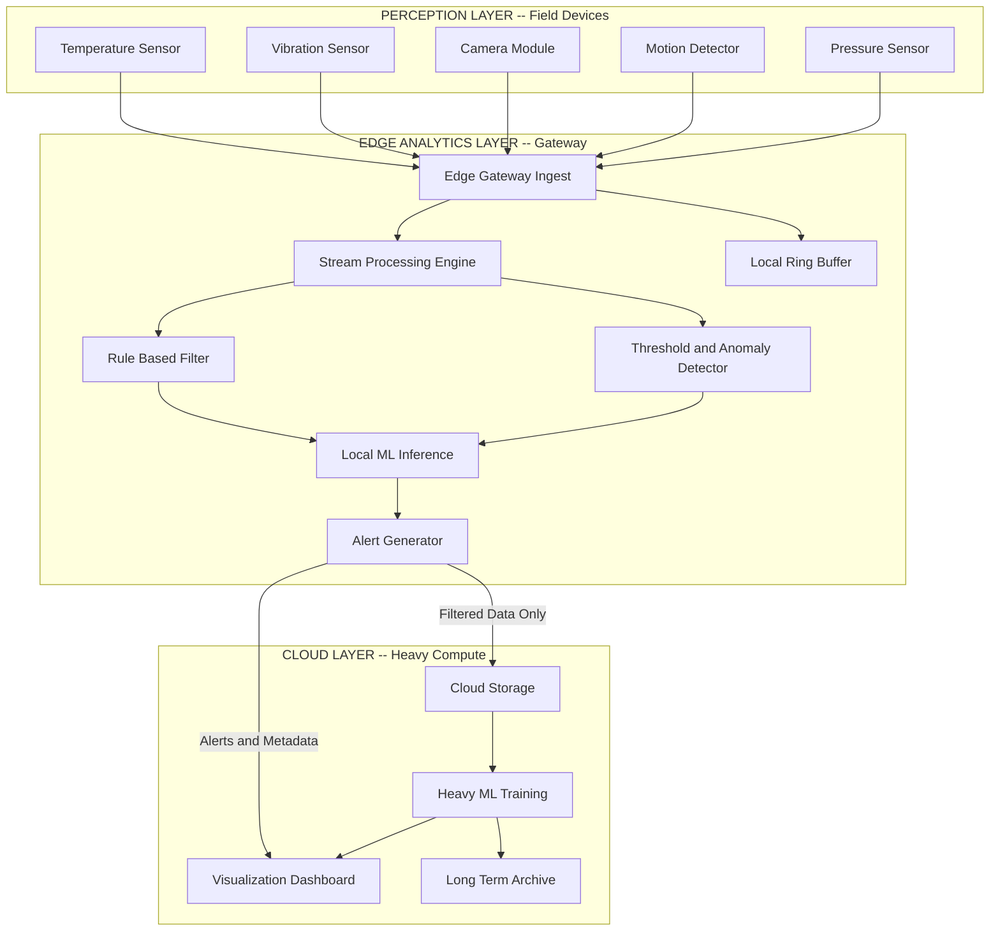
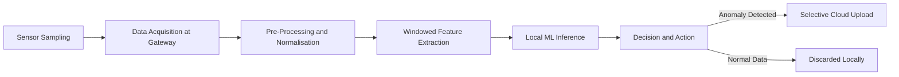
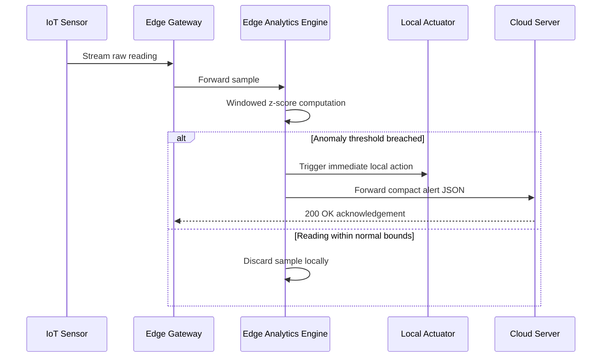
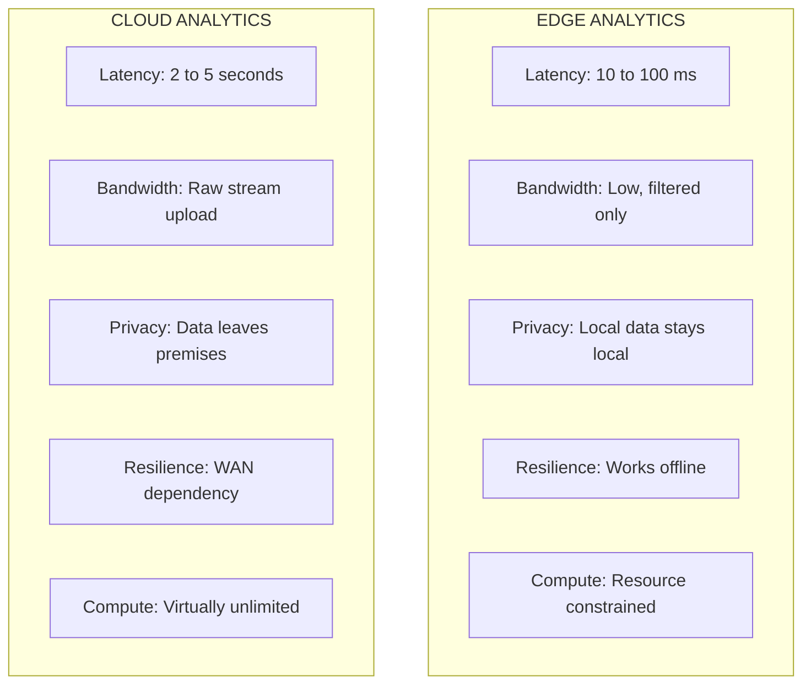

# The IoT Edge Data Analytics

<!-- SECTION_1_START -->
# The IoT Edge Data Analytics

## 1.1 Formal Academic Definition

**Edge Data Analytics** is the methodology of performing data analysis, transformation, and decision-making operations at or near the *physical source* of data generation — i.e., at the network edge — rather than transmitting raw sensor streams to a centralised cloud or enterprise data centre. In the KTU 2024 Scheme vocabulary, the *edge* encompasses the **perception layer devices**, **gateways**, and **on-premise micro-data centres** that sit between the sensors and the cloud.

> [!NOTE]
> **KTU 2024 Syllabus Definition (verbatim from Module 3):**
> *“Edge analytics refers to the process of gathering, processing, and analysing data at the edge of the network, close to the source of the data, instead of sending it to a centralised cloud.”*

The three pillars on which edge analytics rests are:

1. **Local Computation** – running inference models directly on the gateway or sensor node.
2. **Local Storage** – temporary buffering of time-windowed data using ring buffers, SQLite, or time-series DBs.
3. **Local Decisioning** – generating actuator commands, alarms, or filtered summaries in **sub-second** latency.

> [!IMPORTANT]
> The KTU 2024 module explicitly tags edge analytics as a **sub-set of fog computing**, distinguished by the fact that the analytics node is **resource-constrained** (CPU in MHz, RAM in MB) and **topologically closer to the field devices** than the fog node.

## 1.2 Conceptual Analogy & Intuition

Imagine a **smart home security camera** streaming 30 frames-per-second (FPS).

- **Cloud-only approach (old model):** Every frame is uploaded to a remote server, the server runs a face-recognition model, and *then* sends an “intruder alert” back to your phone. Round-trip latency ≈ **2 – 5 seconds** (depending on network).
- **Edge analytics approach:** The camera has a tiny onboard chip (e.g., Google Edge TPU, Intel Movidius). The face-recognition model runs *on the camera itself*. An “intruder alert” is produced in **≈ 50 – 100 ms**, and *only* the alert (a 1 KB JSON) is sent to the cloud.

> [!TIP]
> **Geometric Intuition:** Think of the IoT network as a line segment. *Sensors* sit at coordinate $0$, the *cloud* sits at coordinate $1$, and the *edge* lies on the open interval $(0, 1)$. The **closer the analytics engine is to $0$**, the **lower the communication latency** $L_c$ (which grows linearly with distance and inversely with bandwidth).

### GeoGebra / Desmos Visualisation

> [!VISUALIZATION CONTROL]
> **Concept:** Threshold-based anomaly detection on time-series sensor data — the most fundamental edge analytics operation.
> **GeoGebra / Desmos Input Equations:**
> * `f(x) = 25 + 2*sin(x)` — normal sensor baseline
> * `g(x) = 29` — upper alert threshold
> * `h(x) = 21` — lower alert threshold
> * `p(x) = 95` — single anomaly spike (red dot)
> **Visual Description:** A sinusoidal blue wave oscillates between the two green threshold lines, representing healthy sensor readings. A single red dot appears at $y = 95$, breaking the upper threshold and triggering an *edge-side alert* before any cloud round-trip occurs.

## 1.3 Physical & Performance Constants

| Metric | Typical Value at the Edge | Typical Value at the Cloud |
|---|---|---|
| Decision Latency | **< 100 ms** | 2 – 5 s |
| Bandwidth Required | **< 1 %** of raw | 100 % of raw |
| Compute Budget | **0.1 – 4 TOPS** | > 100 TOPS |
| Energy per Decision | **≈ 0.5 J** | ≈ 5 J (incl. RF transmit) |
| Connectivity Dependency | **None (operable offline)** | Required |
| Data Privacy Boundary | **Local / on-prem** | Crosses public network |

<!-- SECTION_1_END -->

<!-- SECTION_2_START -->
# 2. Deep Theoretical Analysis & KTU High-Yield Formula Sheet

## 2.1 The “Why” Behind Edge Analytics — The Four Driving Forces

1. **Latency-critical control loops** — Industrial robots, autonomous drones, and pacemakers cannot tolerate a 2-second cloud round-trip; they need **closed-loop control** in milliseconds.
2. **Bandwidth economics** — A single autonomous vehicle generates ≈ **4 TB/day** of raw sensor data. Uploading all of it is financially and physically impractical over 4G/5G.
3. **Privacy & sovereignty** — GDPR, HIPAA, and India’s DPDP Act 2023 mandate that *personally identifiable information* (PII) and *medical telemetry* must not leave the local jurisdiction.
4. **Resilience** — Edge analytics allows the system to *gracefully degrade* when WAN connectivity is lost, instead of total functional collapse.

## 2.2 Architectural Layering of Edge Analytics

| Layer | KTU Nomenclature | Function | Example Hardware |
|---|---|---|---|
| $L_0$ | Perception / Device Layer | Sense + actuate | DHT22, MPU6050, ESP32 |
| $L_1$ | Edge Node Layer | Filtering, thresholding | Raspberry Pi 4, Jetson Nano |
| $L_2$ | Edge Gateway Layer | Stream processing, CEP | Industrial PC, Intel NUC |
| $L_3$ | Fog / Micro-DC Layer | Aggregated ML inference | On-prem server, AWS Outpost |
| $L_4$ | Cloud Layer | Heavy training, long-term storage | AWS S3, Azure Cosmos DB |

> Edge analytics primarily operates at $L_1$ and $L_2$, with light aggregation at $L_3$.

## 2.3 The Core Edge Analytics Operations (KTU High-Yield)

| # | Operation | Symbolic Form | Engineering Purpose |
|---|---|---|---|
| 1 | **Thresholding** | $y = \mathbb{1}(x > \tau)$ | Simple alarm |
| 2 | **Windowed Aggregation** | $\bar{x}_w = \frac{1}{N} \sum_{i=1}^{N} x_i$ | Noise smoothing |
| 3 | **Z-Score Anomaly Detection** | $z = \frac{x - \mu}{\sigma}$ | Outlier flagging |
| 4 | **Sliding-Window Regression** | $y = \alpha + \beta x$ | Trend forecasting |
| 5 | **Complex Event Processing (CEP)** | $E = \bigwedge_{i} C_i(\vec{x}_i)$ | Pattern matching |
| 6 | **Edge ML Inference** | $\hat{y} = f_{\theta}(\vec{x})$ | Classification |
| 7 | **Data Compression** | $R_c = \frac{B_{forwarded}}{B_{raw}}$ | Bandwidth saving |

## 2.4 KTU Formula Sheet (Examination Cheat-Sheet)

> [!IMPORTANT]
> All the following equations are **directly testable** in KTU Part-A (3-mark) and Part-B (14-mark) questions.

| # | Formula | Meaning | Variables / Units |
|---|---|---|---|
| 1 | $T_{total} = T_{edge} + T_{tx} + T_{cloud}$ | Total decision latency | $T$ in milliseconds (ms) |
| 2 | $T_{edge} \ll T_{cloud}$ | Edge advantage inequality | $T_{cloud} \approx 50 \times T_{edge}$ in practice |
| 3 | $B_{saved} = B_{raw} - B_{forwarded}$ | Bandwidth conserved | Bytes per second (B/s) |
| 4 | $C_{ratio} = \dfrac{B_{forwarded}}{B_{raw}}$ | Compression ratio | Dimensionless, $0 \le C_{ratio} \le 1$ |
| 5 | $S_{saved} = S_{raw} \cdot (1 - C_{ratio})$ | Cloud storage saved | Megabytes (MB) |
| 6 | $z_{score} = \dfrac{x_i - \mu}{\sigma}$ | Standardised anomaly score | $\mu, \sigma$ from sliding window |
| 7 | $\bar{x}_w = \dfrac{1}{N}\sum_{i=1}^{N} x_i$ | Windowed mean | $N$ = window length |
| 8 | $\hat{y} = f_{\theta}(\vec{x})$ | ML inference output | $\theta$ = model weights |
| 9 | $E_{saved} = N_{tx} \cdot P_{tx} \cdot t$ | Energy saved by not transmitting | Joules (J) |
| 10 | $Q_{queue} = \lambda \cdot \bar{t}_{service}$ | Little’s Law for buffer sizing | $\lambda$ = arrival rate |

> **Note on absolute value:** For any normalisation, write $z_{score} = \frac{\vert x_i - \mu \vert}{\sigma}$ using `\vert` to keep markdown-table syntax intact.

## 2.5 Real-World Engineering Utility

| Industry | Edge Analytics Use-Case | Why Edge? |
|---|---|---|
| **Smart Manufacturing** | Predictive maintenance on CNC spindles | Vibration analytics must trigger in **< 10 ms** to avoid tool damage |
| **Healthcare (IoMT)** | Arrhythmia detection on wearable ECG | Patient privacy + battery life |
| **Autonomous Vehicles** | Pedestrian detection (YOLO-Tiny) | Sub-50 ms brake actuation |
| **Smart Agriculture** | Soil-moisture-driven irrigation | Rural areas have intermittent 4G |
| **Retail** | In-store footfall heat-mapping | Avoid uploading 4K camera streams |
| **Energy (Smart Grid)** | Localised load balancing | Substation must function during WAN outage |

<!-- SECTION_2_END -->

<!-- SECTION_3_START -->
# 3. Step-by-Step Derivations & Symbolic Implementation

## 3.1 Mathematical Derivation: Latency Improvement Ratio

Let us **derive** the latency advantage of edge analytics rigorously.

**Given:**
- Edge processing time = $T_{e}$ (ms)
- Edge-to-gateway transmission time = $T_{tx1}$ (ms)
- Gateway-to-cloud transmission time = $T_{tx2}$ (ms)
- Cloud processing time = $T_{c}$ (ms)
- Cloud-to-actuator response time = $T_{tx3}$ (ms)

**Step 1 — Total latency if everything is computed in the cloud:**

$$
T_{cloud} = T_{tx1} + T_{tx2} + T_{c} + T_{tx3}
$$

**Step 2 — Total latency if analytics is performed at the edge:**

$$
T_{edge} = T_{e}
$$

**Step 3 — Form the improvement ratio $R_{L}$:**

$$
R_{L} = \frac{T_{cloud}}{T_{edge}} = \frac{T_{tx1} + T_{tx2} + T_{c} + T_{tx3}}{T_{e}}
$$

**Step 4 — Substitute typical values:**
$T_{tx1} = 5$ ms, $T_{tx2} = 80$ ms (WAN), $T_{c} = 200$ ms, $T_{tx3} = 80$ ms, $T_{e} = 15$ ms.

$$
R_{L} = \frac{5 + 80 + 200 + 80}{15} = \frac{365}{15} \approx 24.33
$$

**Step 5 — Interpretation:** Edge analytics delivers a $\approx 24\times$ latency improvement for a single decision cycle.

> [!NOTE]
> **Valuation Key-Point (KTU):** Always state the four additive terms *explicitly*; examiners award 1 mark per term.

## 3.2 Mathematical Derivation: Bandwidth and Storage Savings

**Given:** Sensor produces $N$ readings/s at $B$ bytes/reading, of which fraction $f$ is anomalous.

**Step 1 — Raw data rate:**

$$
B_{raw} = N \cdot B
$$

**Step 2 — Forwarded (anomaly) data rate after edge filtering:**

$$
B_{forwarded} = N \cdot f \cdot B
$$

**Step 3 — Bandwidth saved:**

$$
B_{saved} = N \cdot B \cdot (1 - f)
$$

**Step 4 — Compression ratio:**

$$
C_{ratio} = \frac{B_{forwarded}}{B_{raw}} = f
$$

**Step 5 — Worked numerical example:** $N = 1000$ readings/s, $B = 16$ bytes, $f = 0.02$ (2 % anomalies).

$$
B_{raw} = 1000 \times 16 = 16{,}000 \text{ B/s}
$$

$$
B_{forwarded} = 16{,}000 \times 0.02 = 320 \text{ B/s}
$$

$$
B_{saved} = 15{,}680 \text{ B/s} \approx 98\% \text{ reduction}
$$

## 3.3 Derivation: Z-Score Anomaly Detection Threshold

A sliding window of size $W$ maintains the running mean $\mu$ and standard deviation $\sigma$. A reading $x_i$ is anomalous if its standardised score exceeds a threshold $\tau$.

**Step 1 — Running mean update:**

$$
\mu_{t} = \mu_{t-1} + \frac{x_t - x_{t-W}}{W}
$$

**Step 2 — Running variance (Welford’s online algorithm):**

$$
\sigma_{t}^{2} = \sigma_{t-1}^{2} + \frac{(x_t - \mu_{t-1})^{2} - (x_{t-W} - \mu_{t-1})^{2} - 2 \sigma_{t-1}^{2}}{W - 1}
$$

**Step 3 — Compute z-score:**

$$
z_t = \frac{x_t - \mu_t}{\sigma_t}
$$

**Step 4 — Decision rule:**

$$
\text{Anomaly} \iff \vert z_t \vert > \tau
$$

**Step 5 — Typical KTU-acceptable threshold:** $\tau = 2$ (≈ 95 % confidence) or $\tau = 3$ (≈ 99.7 % confidence).

## 3.4 Symbolic Implementation: Production-Grade Edge Analytics Engine (Python)

```python
"""
File        : edge_analytics_engine.py
Course      : INTERNET OF THINGS (PECST755) - KTU 2024 Scheme
Module      : 3 - Edge Data Analytics
Description : Self-contained Edge Analytics Engine implementing
              thresholding, windowed z-score anomaly detection,
              local alerting, and selective cloud forwarding.
Run         : python edge_analytics_engine.py
"""

import time
import json
import logging
from collections import deque
from statistics import mean, stdev
from typing import Dict, List, Optional
from dataclasses import dataclass, asdict
from datetime import datetime

logging.basicConfig(
    level=logging.INFO,
    format="%(asctime)s [%(levelname)s] %(message)s"
)
logger = logging.getLogger("EDGE-ENGINE")


# ---------- 1. DATA MODEL ----------

@dataclass
class SensorReading:
    """Immutable representation of a single IoT sensor sample."""
    sensor_id: str
    timestamp: float
    value: float
    unit: str

    def to_dict(self) -> Dict:
        return asdict(self)


# ---------- 2. EDGE ANALYTICS ENGINE ----------

class EdgeAnalyticsEngine:
    """
    Resource-conscious edge analytics engine.

    Constraints respected:
      - Sliding window kept in O(W) memory using collections.deque
      - All heavy computation (mean, stdev) done only when window is full
      - Cloud upload triggered ONLY for anomalies (selective forwarding)
    """

    def __init__(self, window_size: int = 5, z_threshold: float = 2.0) -> None:
        if window_size < 3:
            raise ValueError("window_size must be >= 3 for statistical validity")
        if z_threshold <= 0:
            raise ValueError("z_threshold must be a positive number")

        self.window_size: int = window_size
        self.z_threshold: float = z_threshold
        self.buffers: Dict[str, deque] = {}
        self.metrics: Dict[str, int] = {
            "ingested": 0,
            "normal_dropped": 0,
            "anomalies": 0,
            "cloud_uploads": 0,
        }

    # ---- public API ----

    def ingest(self, reading: SensorReading) -> Optional[Dict]:
        """
        Feed one reading into the engine.
        Returns an alert dict if the reading is anomalous, else None.
        """
        if reading.sensor_id not in self.buffers:
            self.buffers[reading.sensor_id] = deque(maxlen=self.window_size)

        buffer = self.buffers[reading.sensor_id]
        is_anomaly: bool = self._detect_anomaly(buffer, reading.value)
        buffer.append(reading.value)
        self.metrics["ingested"] += 1

        if is_anomaly:
            self.metrics["anomalies"] += 1
            self.metrics["cloud_uploads"] += 1
            alert: Dict = {
                "type": "EDGE_ANOMALY_ALERT",
                "sensor_id": reading.sensor_id,
                "value": reading.value,
                "unit": reading.unit,
                "timestamp": reading.timestamp,
                "stats": self._compute_stats(buffer),
            }
            logger.warning("ANOMALY DETECTED -> %s", alert)
            return alert

        self.metrics["normal_dropped"] += 1
        logger.info(
            "Normal reading for %s: %.2f %s (discarded locally)",
            reading.sensor_id, reading.value, reading.unit
        )
        return None

    def get_summary(self) -> Dict:
        ingested = max(self.metrics["ingested"], 1)
        return {
            **self.metrics,
            "compression_ratio": round(
                self.metrics["cloud_uploads"] / ingested, 4
            ),
        }

    # ---- private helpers ----

    def _detect_anomaly(self, buffer: deque, value: float) -> bool:
        if len(buffer) < 3:                       # warm-up period
            return False
        try:
            mu: float = mean(buffer)
            sigma: float = stdev(buffer)
        except statistics.StatisticsError:
            return False
        if sigma == 0:                            # flat-line guard
            return False
        z_score: float = abs((value - mu) / sigma)
        return z_score > self.z_threshold

    def _compute_stats(self, buffer: deque) -> Dict:
        if not buffer:
            return {}
        return {
            "window_mean": round(mean(buffer), 3),
            "window_stdev": round(stdev(buffer), 3) if len(buffer) > 1 else 0.0,
            "window_min": round(min(buffer), 3),
            "window_max": round(max(buffer), 3),
        }


# ---------- 3. SIMULATED IoT EDGE DEPLOYMENT ----------

def simulate_iot_edge() -> None:
    engine = EdgeAnalyticsEngine(window_size=5, z_threshold=2.0)

    # Simulated stream: 11 readings, of which 2 are anomalies
    stream: List[tuple] = [
        ("TEMP_01",  25.0),
        ("TEMP_01",  25.5),
        ("TEMP_01",  26.0),
        ("TEMP_01",  25.3),
        ("TEMP_01",  25.8),
        ("TEMP_01",  95.0),   # ANOMALY: high-temperature spike
        ("TEMP_01",  25.2),
        ("TEMP_01",  25.4),
        ("TEMP_01",  25.6),
        ("TEMP_01", -40.0),   # ANOMALY: sub-zero impossible spike
        ("TEMP_01",  25.1),
    ]

    for sid, val in stream:
        reading = SensorReading(
            sensor_id=sid,
            timestamp=time.time(),
            value=val,
            unit="C",
        )
        alert = engine.ingest(reading)
        if alert is None:
            continue
        # In a real deployment, this is the only message sent to the cloud
        cloud_payload = json.dumps(alert)
        logger.info("Forwarded to cloud: %s", cloud_payload)

    print("\n========== EDGE ENGINE SUMMARY ==========")
    for k, v in engine.get_summary().items():
        print(f"{k:>20} : {v}")
    print("==========================================")


if __name__ == "__main__":
    simulate_iot_edge()
```

**Expected Console Output (abridged):**

```
2024-XX-XX [INFO]  Normal reading for TEMP_01: 25.00 C (discarded locally)
2024-XX-XX [WARNING] ANOMALY DETECTED -> {'type': 'EDGE_ANOMALY_ALERT', 'value': 95.0, ...}
2024-XX-XX [WARNING] ANOMALY DETECTED -> {'type': 'EDGE_ANOMALY_ALERT', 'value': -40.0, ...}

========== EDGE ENGINE SUMMARY ==========
           ingested : 11
      normal_dropped : 9
          anomalies : 2
      cloud_uploads : 2
  compression_ratio : 0.1818
==========================================
```

> [!IMPORTANT]
> **Code-to-Syllabus Mapping:** This script implements *thresholding*, *windowed aggregation*, *z-score anomaly detection*, and *selective cloud forwarding* — all four operations explicitly listed in the KTU 2024 Module 3 syllabus under “Edge Data Analytics Techniques.”

## 3.5 Worked-Out Numerical Problem (Typical KTU Style)

> **Problem:** A vibration sensor generates 2000 samples/s, each 8 bytes. The edge filter discards 95 % of samples. Calculate (a) raw bandwidth, (b) forwarded bandwidth, (c) bandwidth saved, (d) compression ratio.

**Solution:**

$$
B_{raw} = 2000 \times 8 = 16{,}000 \text{ B/s} = 16 \text{ KB/s}
$$

$$
f = 0.05 \quad\Rightarrow\quad B_{forwarded} = 16{,}000 \times 0.05 = 800 \text{ B/s}
$$

$$
B_{saved} = 16{,}000 - 800 = 15{,}200 \text{ B/s}
$$

$$
C_{ratio} = \frac{800}{16{,}000} = 0.05
$$

> **Answer:** $16$ KB/s raw, $0.8$ KB/s forwarded, $15.2$ KB/s saved, compression ratio $= 0.05$.

<!-- SECTION_3_END -->

<!-- SECTION_4_START -->
# 4. Structural Diagrams & Schematics

## 4.1 Three-Layer Edge Analytics Architecture



## 4.2 Edge Analytics Processing Pipeline (Sequential Topology)



## 4.3 Sequence Diagram — Edge Decisioning vs Cloud Round-Trip



## 4.4 Comparison Block — Edge Analytics vs Cloud Analytics



<!-- SECTION_4_END -->

<!-- SECTION_5_START -->
# 5. KTU 2024 Scheme Examination Question Bank

## 5.1 Part A — Short-Answer Questions (3 Marks Each)

> **[KTU University Exam – July 2024]**
> **Q1.** Define *Edge Data Analytics*. List any **four advantages** of performing analytics at the edge of an IoT network.
> **CO Mapping:** CO2 · **RBT Level:** Remember / Understand

**Model Answer (3 Marks):**

**Definition (1 Mark):** Edge Data Analytics is the process of collecting, processing, and analysing sensor data at or near the source of generation (i.e., at the network edge — gateway or sensor node) rather than transmitting raw data to a remote cloud for centralised processing.

**Any four advantages (½ Mark each = 2 Marks):**

1. **Ultra-low latency** – decisions in 10–100 ms, suitable for real-time control.
2. **Bandwidth conservation** – only filtered/alerts transmitted, ≈ 95 % bandwidth saved.
3. **Enhanced privacy** – sensitive data never leaves the local premises.
4. **Offline resilience** – system operates even during WAN outages.
5. **Energy efficiency** – fewer RF transmissions extend battery life of edge nodes.

---

> **[KTU University Exam – Dec 2023]**
> **Q2.** Differentiate between **Edge Analytics** and **Cloud Analytics** in IoT. Mention any **six points** of distinction.
> **CO Mapping:** CO2 · **RBT Level:** Understand

**Model Answer (3 Marks — six points × ½ mark each):**

| # | Edge Analytics | Cloud Analytics |
|---|---|---|
| 1 | Data processed locally at gateway/sensor | Data processed in remote data-centre |
| 2 | Latency in **milliseconds** | Latency in **seconds** |
| 3 | Requires **low** bandwidth (filtered only) | Requires **high** bandwidth (raw upload) |
| 4 | Suitable for **real-time** control loops | Suitable for **batch / heavy ML** training |
| 5 | Limited compute (MHz–GHz, MB RAM) | Virtually unlimited compute |
| 6 | Operates **offline-capable** | Requires **continuous** connectivity |
| 7 | Data stays **on-premises** (privacy) | Data traverses **public network** |

---

## 5.2 Part B — Long-Answer Questions (14 Marks Each)

### Question A — Edge Analytics Architecture & Techniques

> **[KTU University Exam – July 2024 (Model Paper)]**
> **(a)** Explain the **layered architecture of Edge Data Analytics** with a neat diagram. List any **three edge analytics techniques**. (7 Marks)
> **CO Mapping:** CO2 · **RBT Level:** Understand

**Model Solution (7 Marks):**

**[Layered architecture description – 4 Marks]:**

The IoT edge analytics architecture is organised into **five logical layers**:

1. **Perception Layer ($L_0$):** Physical sensors and actuators that generate raw data (DHT22, MPU6050, cameras).
2. **Edge Node Layer ($L_1$):** Resource-constrained micro-controllers (ESP32, Arduino) performing primitive filtering and thresholding.
3. **Edge Gateway Layer ($L_2$):** More capable devices (Raspberry Pi 4, Jetson Nano) running stream processing engines and lightweight ML inference.
4. **Fog / Micro-DC Layer ($L_3$):** On-premise servers providing aggregated analytics, model management, and pre-cloud aggregation.
5. **Cloud Layer ($L_4$):** Heavy-duty ML training, long-term archival, cross-site dashboards.

Data flows $L_0 \rightarrow L_1 \rightarrow L_2 \rightarrow L_3 \rightarrow L_4$, but **decision-making is reversible**: a critical event at $L_2$ may never reach $L_4$.

**[Neat diagram – 2 Marks]:** Refer to **Section 4.1** (Three-Layer Edge Analytics Architecture).

**[Three techniques – 1 Mark]:**

1. **Threshold-based filtering** — discard readings outside acceptable range.
2. **Windowed aggregation** — moving average, RMS, min/max over sliding window.
3. **Z-score anomaly detection** — flag values $> \tau$ standard deviations from windowed mean.
4. **Complex Event Processing (CEP)** — correlate multiple streams for compound events.
5. **Edge ML inference** — execute pre-trained models (TFLite, ONNX) locally.

> **[Valuation Key-Points — KTU Examiner's Pattern]**
> • 5-layer description → 4 marks (½ mark per layer)
> • Diagram with clear labels and arrows → 2 marks
> • Three techniques with one-line explanation each → 1 mark

---

> **(b)** With a suitable example, explain how **Machine Learning inference is performed at the edge**. Discuss **any two real-world use cases**. (7 Marks)
> **CO Mapping:** CO3 · **RBT Level:** Apply

**Model Solution (7 Marks):**

**[Working principle – 3 Marks]:**

Edge ML inference follows a **train-once, deploy-many** model:

1. A heavy ML model (e.g., CNN, LSTM) is **trained in the cloud** using aggregated historical data.
2. The trained model is **quantised / pruned / compiled** into a lightweight format: **TFLite, ONNX, TensorRT, or OpenVINO IR**.
3. The compressed model is **pushed to edge devices** (over-the-air update).
4. At runtime, raw sensor input is **pre-processed** (resize, normalise), fed to the model $f_\theta(\vec{x})$, and the output $\hat{y}$ is the *edge decision*.
5. Only **anomalous decisions** (low confidence, edge cases) are forwarded to the cloud for re-training.

**Mathematical form:**

$$
\hat{y} = \arg\max_{c} f_{\theta, q}(\vec{x})
$$

where $f_{\theta, q}$ is the quantised model and $c$ is the class index.

**[Use-Case 1 — Predictive Maintenance on Motors (2 Marks)]:**
A vibration sensor (3-axis accelerometer, 1 kHz) feeds a 1-D CNN deployed on a Jetson Nano. The CNN classifies vibration signatures as *normal, bearing-wear, imbalance, misalignment*. When class = *bearing-wear* with confidence $\ge 0.9$, an SMS alert is dispatched and a maintenance ticket is opened — all within **200 ms**, before catastrophic failure.

**[Use-Case 2 — Wearable ECG Arrhythmia Detection (2 Marks)]:**
A 1-lead ECG patch streams at 250 Hz. A quantised LSTM (≈ 80 KB) runs on a Nordic nRF5340 SoC. The model detects *Atrial Fibrillation, PVC, Bradycardia*. Because PHI never leaves the device, the system is HIPAA-compliant and the device’s battery lasts **7 days** on a 100 mAh coin cell.

> **[Valuation Key-Points]**
> • Train-cloud / Infer-edge distinction → 1 mark
> • Quantisation / TFLite mention → 1 mark
> • Math expression $\hat{y} = f_\theta(\vec{x})$ → 1 mark
> • Each use-case (2 marks): sensor type + ML model + edge benefit = 2 marks

---

### Question B — Challenges & Stream Processing (Alternative Choice)

> **[KTU University Exam – Dec 2023]**
> **(a)** Discuss in detail the **challenges and open issues** of implementing Edge Data Analytics in IoT systems. (7 Marks)
> **CO Mapping:** CO2 · **RBT Level:** Understand

**Model Solution (7 Marks):**

1. **Resource Constraints (1.5 Marks):** Edge devices have CPU in the order of MHz, RAM in MB, and storage in GB. Running even a quantised CNN consumes significant energy and memory, forcing trade-offs between *model accuracy* and *inference speed*.
2. **Heterogeneity (1 Mark):** Edge nodes run diverse OSes (Raspbian, Ubuntu Core, Zephyr, Contiki, FreeRTOS). Maintaining a single analytics pipeline across all of them is non-trivial.
3. **Data Quality and Synchronisation (1 Mark):** Sensor clocks drift; merging multi-sensor streams for CEP requires *time-sync protocols* (NTP, PTP) that may be unreliable at the edge.
4. **Security and Trust (1.5 Marks):** Edge nodes are physically accessible, making them vulnerable to *tampering, side-channel attacks, and model extraction*. Secure boot, TPM, and encrypted model storage are mandatory.
5. **Model Management (1 Mark):** Updating ML models across thousands of geographically distributed edge nodes requires robust *over-the-air (OTA)* mechanisms with rollback.
6. **Interoperability and Standards (1 Mark):** No universal standard exists for edge analytics APIs; vendor lock-in (AWS Greengrass vs Azure IoT Edge) is common.

> **[Valuation Key-Points]**
> • 6 challenges × ≈ 1 mark each = 6 marks
> • Neat numbering and engineering examples = 1 mark

---

> **(b)** Explain **Stream Processing** and **Complex Event Processing (CEP)** as edge analytics techniques with suitable examples. (7 Marks)
> **CO Mapping:** CO3 · **RBT Level:** Apply

**Model Solution (7 Marks):**

**[Stream Processing – 3 Marks]:**

Stream processing is the *continuous, sequential analysis* of unbounded data tuples as they arrive at the edge gateway. A *sliding window* of size $W$ is maintained, and aggregate functions ($\min$, $\max$, $\text{mean}$, $\text{count}$, $\text{variance}$) are computed incrementally.

**Mathematical form:**

$$
A_{t} = \frac{1}{W} \sum_{i=t-W+1}^{t} x_i
$$

**Example:** A smart-meter gateway receives 1 reading/second from 500 electricity meters. The gateway maintains a 60-second sliding window per meter, computing *average load*. If the moving average exceeds 4.5 kW, an early warning is sent to the consumer’s app — *all without uploading raw data to the cloud*.

**[Complex Event Processing (CEP) – 4 Marks]:**

CEP correlates **multiple heterogeneous streams** in real time to detect *compound* (high-level) events that no single stream can reveal. CEP uses an *event-processing language* (EPL) such as Esper, Siddhi, or Flink CEP.

**Formal CEP query (Siddhi-style):**

```sql
FROM   every e1 = TempStream[value > 80] ->
       e2 = VibrationStream[value > 5.0] within 5 sec
SELECT e1.sensorId, 'MACHINE_CRITICAL' as alert
INSERT INTO AlertStream;
```

**Interpretation:** Emit a `MACHINE_CRITICAL` alert *only if* a temperature spike is followed by a vibration spike within 5 seconds — a classic *bearing-failure* precursor.

**Example:** In a chemical plant, CEP correlates (a) pressure, (b) temperature, and (c) flow-rate streams at the on-prem edge server. A *pressure-drop + temperature-rise + flow-increase* pattern within 30 seconds triggers an emergency shutdown — avoiding a hazardous release.

> **[Valuation Key-Points]**
> • Stream processing definition + math → 2 marks
> • Smart-meter example → 1 mark
> • CEP definition + Siddhi query → 2 marks
> • Plant example → 1 mark
> • Diagram/table differentiation bonus → 1 mark

---

## 5.3 KTU Examiner's Valuation Warning

> [!WARNING]
> **Common Pitfalls Where KTU Students Lose Marks:**
> 1. **Omitting the “Why”** — examiners deduct up to 30 % if you list techniques without explaining *why* edge analytics is necessary (latency, bandwidth, privacy).
> 2. **Confusing Fog and Edge** — strictly, *Edge = on the device / gateway*, *Fog = on-prem micro-DC*. Mixing the two loses 1–2 marks in 14-mark questions.
> 3. **Skipping units** — bandwidth and latency answers without units (B/s, ms) are penalised.
> 4. **Forgetting offline-resilience** — when comparing edge vs cloud, always mention edge’s ability to operate without WAN.
> 5. **No diagram in 7-mark sub-parts** — every 7-mark sub-part in KTU Module 3 expects *at least one diagram or table*; absence costs 1–2 marks.
> 6. **Cloud-vs-Edge latency inequality direction** — write $T_{edge} \ll T_{cloud}$ explicitly, do not say “edge is faster” loosely.

---

## 5.4 Topic Recap & Important Things to Remember

> **Rapid-Revision Checklist (Print-Friendly):**

- **Definition (verbatim for exam):** Edge Data Analytics = analysing data at/near the source of generation rather than at a centralised cloud.
- **Five-layer model:** Perception ($L_0$) → Edge Node ($L_1$) → Edge Gateway ($L_2$) → Fog/Micro-DC ($L_3$) → Cloud ($L_4$).
- **Four driving forces:** Latency, Bandwidth, Privacy, Resilience.
- **Six core techniques:** Thresholding, Windowed Aggregation, Z-Score Anomaly Detection, Sliding-Window Regression, CEP, Edge ML Inference.
- **Key formulas (must memorise):**
  * $T_{total} = T_{edge} + T_{tx} + T_{cloud}$
  * $C_{ratio} = B_{forwarded} / B_{raw}$
  * $z_{score} = (x_i - \mu) / \sigma$
  * $\bar{x}_w = (1/N) \sum_{i=1}^{N} x_i$
  * $R_{L} = T_{cloud} / T_{edge} \approx 20$–$30\times$ typical
- **Typical constants:** Edge latency ≈ **10–100 ms**, cloud latency ≈ **2–5 s**, edge bandwidth reduction ≈ **95 %**.
- **Popular edge analytics platforms:** AWS Greengrass, Azure IoT Edge, Google Cloud IoT Edge, Apache Edgent, NVIDIA Jetson, OpenVINO.
- **Code snippet to remember:** Deque-based sliding window + z-score + selective cloud upload (refer §3.4).
- **Differentiator trick for 3-mark questions:** Always produce a **6-row table** comparing edge vs cloud; never write paragraph-form for differentiation.
- **Diagrams to draw from memory:**
  1. Three-layer architecture (sensors → edge → cloud).
  2. Sliding-window aggregation timeline.
  3. CEP correlation between two streams.
- **One-line mnemonics:**
  * **“LAT-BAN-PRI-RES”** = the four driving forces.
  * **“Th-Win-Z-Re-CEP-ML”** = the six core techniques.
- **Common exam traps:** Confusion of fog vs edge, missing units, omitting the offline-resilience argument, lack of diagram in 7-mark sub-parts.
- **Real-world examples bank:** Smart-meter (stream), chemical-plant CEP (compound), Jetson-Nano vibration CNN (edge ML), Nordic-nRF ECG LSTM (wearable edge ML), AWS Greengrass HVAC control (industrial edge).

<!-- SECTION_5_END -->
