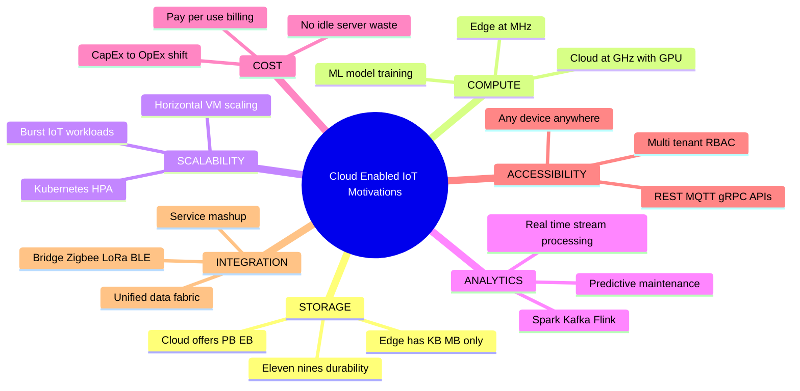
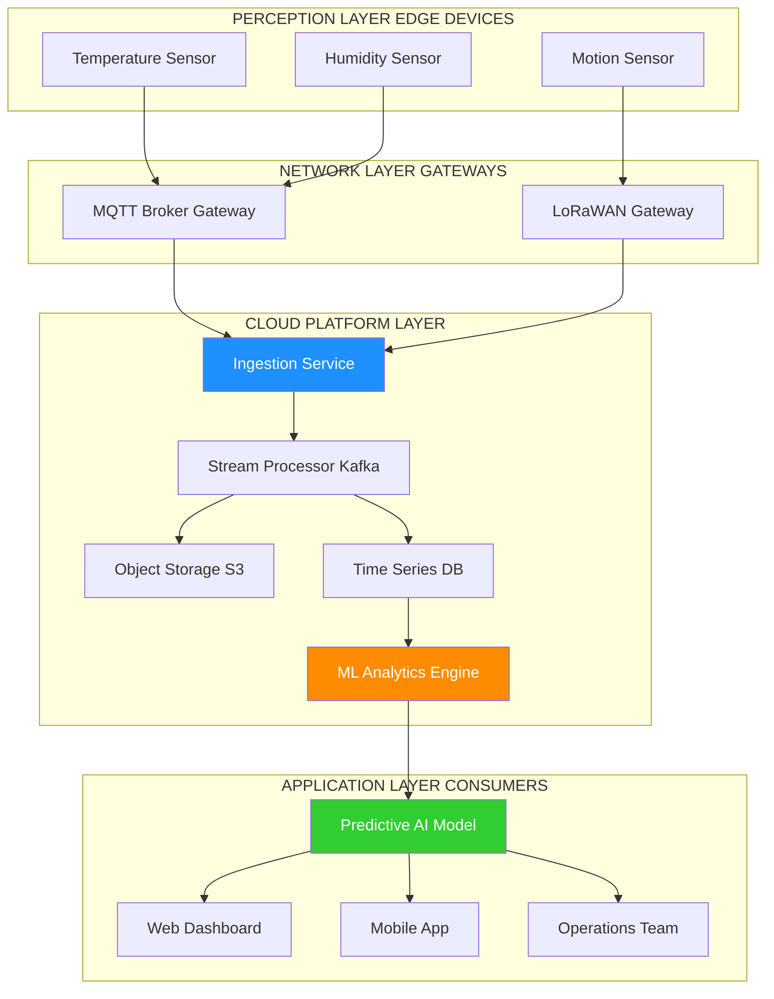
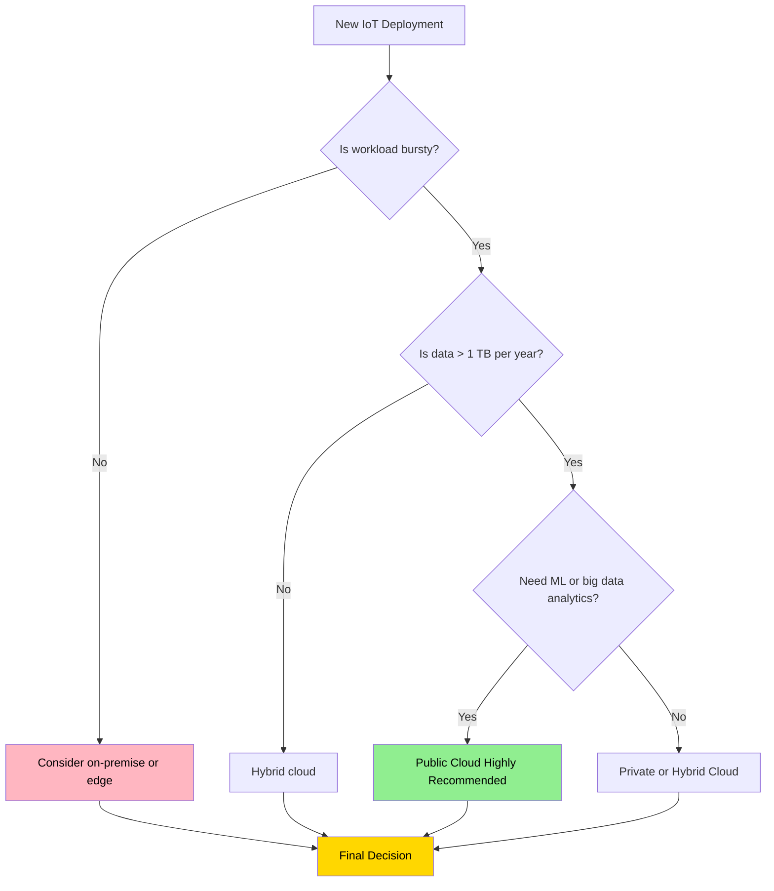

# The Key Motivations for Cloud-Enabled Environments

<!-- SECTION_1_START -->

# The Key Motivations for Cloud-Enabled Environments

## 1.1 Formal Academic Definition (KTU 2024 Syllabus Terminology)

A **Cloud-Enabled Environment** in the Internet of Things (IoT) paradigm refers to a distributed computing architecture where physical smart objects, sensor networks, and actuator systems offload their data storage, processing, analytics, and management workloads to remote, virtualized, and dynamically scalable infrastructure hosted over the public, private, or hybrid Internet. According to the KTU PECST755 (IoT) Module-3 framework, cloud-enabled environments are the **computational backbone** that converts raw sensor telemetry into actionable intelligence by providing virtually unlimited **Compute-as-a-Service**, **Storage-as-a-Service**, and **Platform-as-a-Service** resources to resource-constrained edge devices.

> [!IMPORTANT]
> **Syllabus Highlight:** The "motivations" are not just advantages — they are the *engineering imperatives* that make large-scale IoT deployment physically, economically, and computationally feasible. Without the cloud, IoT would collapse into isolated islands of incompatible, resource-starved devices.

## 1.2 Conceptual Analogy & Intuitive Overview

Think of a **smart metropolitan traffic management system**.

Imagine a city where every traffic light, vehicle sensor, and pedestrian counter is a tiny, low-power IoT node. Each of these devices can only "see" 50 meters ahead and has the memory of a pocket calculator. Now imagine asking each of these tiny devices to:
- Store 6 months of accident data
- Run a machine-learning model to predict rush-hour congestion
- Coordinate with 50,000 other devices across the city

That is **impossible** for the device alone. So the city builds a **Central Traffic Control Tower** (the cloud) in the sky. The sensors just *stream* their observations up; the tower does the heavy thinking, runs the AI, and sends back "green light for 30 more seconds" commands.

> [!NOTE]
> **Analogy Mapping:**
> - IoT sensors $\rightarrow$ *Eyes and ears of the city*
> - Cloud servers $\rightarrow$ *Central Traffic Control Tower*
> - Network (5G/Wi-Fi) $\rightarrow$ *Radio communication channels*
> - Data analytics $\rightarrow$ *City planners and AI strategists*

**Intuitive Summary:** The cloud is to IoT what the human brain is to the nervous system — the sensors collect, the brain thinks.

## 1.3 Standard Metrics & Engineering Thresholds

The following **industry-standard metrics** define why the cloud is non-negotiable for modern IoT:

> [!TIP]
> **Key Cloud-IoT Performance Metrics (bolded for quick reference):**
> - **Scalability:** Elastic provisioning from **1 to 10,000+ Virtual Machines (VMs)** within minutes.
> - **Storage Capacity:** Modern cloud providers offer **Exabyte-scale** (10¹⁸ bytes) object storage.
> - **Latency Tolerance for Batch Analytics:** **seconds to minutes** (real-time control loops still need edge/fog).
> - **Service Availability (SLA):** Tier-1 providers like AWS, Azure, GCP guarantee **99.9% – 99.99% uptime** (equivalent to **< 8.77 hours/year** downtime at "three nines").
> - **Cost Reduction:** Pay-as-you-go model reduces Capital Expenditure (CapEx) to Operational Expenditure (OpEx) by **up to 60–80%** for mid-scale deployments.

> [!VISUALIZATION CONTROL]
> **Concept:** Cloud Resource Elasticity Curve
> **Desmos Input Equations:**
> - `y = base\_load`  (horizontal line, represents on-premise fixed capacity)
> - `y = cloud\_elastic(t) = base + A \cdot \sin(B \cdot t) + A`  (oscillating wave, represents auto-scaling)
> **Visual Description:** The student should observe a flat horizontal line (on-premise) being overlaid by an oscillating wave (cloud auto-scaling) that adapts to demand spikes, with the area between them representing *cost saved* by not over-provisioning.

---

<!-- SECTION_1_END -->

<!-- SECTION_2_START -->

# Deep Theoretical Analysis & KTU High-Yield Cheat Sheet

## 2.1 The Seven Core Motivations — Deconstructed

### Motivation 1: Virtually Unlimited Storage Capacity

- IoT devices generate **zettabytes (10²¹ bytes)** of data annually (Cisco estimates ~79.4 ZB/year by 2025 from IoT alone).
- Edge devices typically have **KB to MB** of local flash (e.g., ESP8266 has only **4 MB**).
- Cloud platforms like **Amazon S3, Google Cloud Storage, Azure Blob** offer **petabyte-to-exabyte** redundant object storage with **11 nines (99.999999999%)** of durability.
- **Why it matters:** Sensors cannot retain historical data; only the cloud can.

### Motivation 2: On-Demand Computational Power

- Modern cloud VMs expose **vCPUs (virtual Central Processing Units)** ranging from 1 to **128+ cores** and GPUs up to **NVIDIA H100 Tensor Core** accelerators.
- Edge MCUs (e.g., Arduino Uno) run at **16 MHz with 2 KB RAM** — incapable of training ML models.
- Cloud enables **CPU-intensive analytics**: anomaly detection, predictive maintenance, computer vision, NLP on telemetry.

### Motivation 3: Scalability & Elasticity (Horizontal and Vertical)

- **Vertical Scaling:** Increase CPU/RAM of a single instance (e.g., AWS EC2 `t3.micro` $\rightarrow$ `m5.24xlarge`).
- **Horizontal Scaling:** Add more instances behind a load balancer (e.g., AWS Auto Scaling Groups, Kubernetes HPA).
- Elasticity is the **automatic** adjustment of resources to match workload — a property that on-premise data centers cannot match economically.

### Motivation 4: Big Data Analytics & Business Intelligence

- Cloud platforms provide managed **Hadoop, Spark, Kafka, Flink, and NoSQL** ecosystems.
- Enables descriptive, diagnostic, predictive, and prescriptive analytics on IoT streams.
- **Use case:** A wind farm with 500 turbines generates ~**10 GB/day** per turbine; aggregating 5 TB/day requires Hadoop-grade parallel processing — feasible only in the cloud.

### Motivation 5: Cost Efficiency (CapEx $\rightarrow$ OpEx Shift)

| Cost Model | On-Premise Data Center | Cloud-Enabled Environment |
|---|---|---|
| Initial Investment | **High CapEx** (servers, cooling, power backup) | **Near-zero CapEx** (pay-as-you-go) |
| Maintenance | Dedicated IT staff (24/7) | Managed by cloud provider (SLA-backed) |
| Scaling Cost | Linear / step-function (buy new rack) | Sub-linear / continuous (spin VM) |
| Idle Cost | 100% (servers still consume power) | $\sim$0% (de-provision on demand) |

### Motivation 6: Universal Accessibility & Device-Agnostic Access

- Cloud RESTful APIs (HTTP, MQTT-over-WebSockets, gRPC) are accessible from **any device, anywhere** with an IP connection.
- Enables **cross-platform IoT ecosystems**: a single backend serves iOS, Android, web dashboards, and other IoT nodes simultaneously.
- Supports **multi-tenancy** — multiple stakeholders (manufacturers, consumers, regulators) access the same dataset with role-based access control (RBAC).

### Motivation 7: Integration, Interoperability & Service Composition

- Cloud offers **mashup of services**: IoT Hub + Stream Analytics + Machine Learning + Power BI = a complete *smart-factory* solution.
- Standard protocols: **MQTT, CoAP, AMQP, HTTP/HTTPS, WebSockets** are natively supported.
- Cloud acts as the **middleware** that bridges heterogeneous IoT devices (Zigbee, BLE, LoRaWAN, Modbus, OPC-UA) into a unified data fabric.

## 2.2 KTU High-Yield Formula / Concept Sheet

> [!NOTE]
> The following table is the **single most important revision artifact** for this topic. Memorize the column headers and the typical values.

| S.No. | Motivation | Core Engineering Reason | Typical Realization | KTU Exam Trigger Words |
|---|---|---|---|---|
| 1 | Storage Capacity | Edge has **KB–MB**; data is **ZB-scale** | S3, Azure Blob, GCS | *"Why can't sensor store all data?"* |
| 2 | Compute Power | Edge: **MHz**; Cloud: **GHz–THz** with GPU | EC2, Lambda, BigQuery | *"Where does ML training happen?"* |
| 3 | Scalability | Demand is **bursty** (diurnal/seasonal) | Auto Scaling, Kubernetes | *"Handle 1 million sensors?"* |
| 4 | Analytics | Streaming + batch + ML pipelines | Spark, Kafka, Dataflow | *"How to detect anomalies?"* |
| 5 | Cost Efficiency | CapEx $\rightarrow$ OpEx, **pay-per-use** | Reserved/spot instances | *"Justify cloud over in-house?"* |
| 6 | Accessibility | **Anywhere, any-device** API access | REST, MQTT, gRPC | *"Multi-tenant dashboards?"* |
| 7 | Integration | Heterogeneous protocols $\rightarrow$ unified fabric | IoT Hub + Event Grid | *"Bridge LoRaWAN and HTTP?"* |

## 2.3 Real-World Engineering Utility

In production systems today, cloud-enabled IoT is the **default architecture** for:

- **Smart Cities** (Bengaluru, Barcelona): Cloud ingests data from 10,000+ sensors for traffic, pollution, and water management.
- **Industrial IoT (IIoT)** (Siemens MindSphere, GE Predix): Predictive maintenance on jet engines saves airlines **\$2.4B/year** (GE Aviation data).
- **Healthcare (IoMT)**: Philips HealthSuite aggregates vitals from 700+ ICU beds in a single cloud for AI-driven early warning systems.
- **Precision Agriculture**: John Deere's cloud platform ingests 7.5 GB per acre per season for variable-rate fertilizer application.
- **Connected Vehicles (V2X)**: Tesla's fleet collects 1.2 GB/hour per car — only feasible via cloud aggregation.

> [!TIP]
> **Engineering Insight:** The cloud is *not* a luxury — it is the **enabling substrate** that transforms raw data into **decisions, predictions, and revenue**. Any IoT architecture ignoring the cloud in 2024+ is commercially non-viable.

---

<!-- SECTION_2_END -->

<!-- SECTION_3_START -->

# Step-by-Step Derivations, Code & Quantitative Analysis

## 3.1 Quantitative Analysis: Cloud vs. On-Premise Cost Calculation

To mathematically justify cloud adoption (a common KTU 14-mark question), we compute the **Total Cost of Ownership (TCO)** over a deployment horizon $T$ years.

### 3.1.1 On-Premise TCO Derivation

$$
\begin{aligned}
TCO_{\text{on-prem}}(T) &= C_{\text{hardware}} + C_{\text{software}} + C_{\text{power}} + C_{\text{cooling}} + C_{\text{staff}} + C_{\text{space}} \\
\\
\text{where: } \quad C_{\text{hardware}} &= N_{\text{servers}} \times P_{\text{server}} \times (1 + r)^{-T/3} \quad \text{(3-year refresh cycle)} \\
C_{\text{power}} &= N_{\text{servers}} \times P_{\text{rated}} \times 8760 \times T \times C_{\text{kWh}} \times \text{PUE} \\
C_{\text{staff}} &= S_{\text{staff}} \times T
\end{aligned}
$$

**Step-by-step logic of the equations:**

- $C_{\text{hardware}}$: Cost of $N_{\text{servers}}$ physical machines each priced at $P_{\text{server}}$, depreciated over a 3-year refresh cycle.
- $C_{\text{power}}$: Each server rated at $P_{\text{rated}}$ Watts runs 8760 hours/year; multiplied by electricity cost $C_{\text{kWh}}$ (in USD/kWh) and the **Power Usage Effectiveness (PUE)** factor (typically 1.5–2.0 for data centers).
- $C_{\text{staff}}$: $S_{\text{staff}}$ dedicated engineers/sysadmins, fully loaded salary.

### 3.1.2 Cloud TCO Derivation

$$
\begin{aligned}
TCO_{\text{cloud}}(T) &= \sum_{t=1}^{T} \left[ (N_{\text{vm}}(t) \times C_{\text{vm-hour}} \times 8760) + C_{\text{storage}}(t) + C_{\text{egress}}(t) \right] \\
\\
\text{with elasticity constraint: } \quad N_{\text{vm}}(t) &= N_{\text{base}} + N_{\text{burst}}(t)
\end{aligned}
$$

- $C_{\text{vm-hour}}$: Per-hour cost of a virtual machine (e.g., AWS EC2 `t3.medium` = \$0.0416/hour).
- $N_{\text{burst}}(t)$: Additional VMs spun up only during peak load — **not present in on-prem**.

### 3.1.3 Numerical Worked Example

**Given:**
- $N_{\text{servers}}$ = 10 physical servers
- $P_{\text{server}}$ = \$5,000
- $P_{\text{rated}}$ = 500 W
- $C_{\text{kWh}}$ = \$0.12
- $\text{PUE}$ = 1.6
- $S_{\text{staff}}$ = \$80,000/year $\times$ 1 admin
- $T$ = 3 years

**On-Premise Calculation:**

$$
\begin{aligned}
C_{\text{hardware}} &= 10 \times 5000 = \$50{,}000 \\
C_{\text{power}} &= 10 \times 0.5 \times 8760 \times 3 \times 0.12 \times 1.6 \\
&= 10 \times 0.5 \times 8760 \times 3 \times 0.12 \times 1.6 \\
&= 25{,}228.8 \text{ USD} \\
C_{\text{staff}} &= 80{,}000 \times 3 = \$240{,}000 \\
TCO_{\text{on-prem}} &\approx \$50{,}000 + \$25{,}229 + \$240{,}000 = \$315{,}229
\end{aligned}
$$

**Cloud Calculation (24/7 equivalent capacity):**
- Required: 10 on-prem servers $\approx$ 20 cloud VMs (since cloud VMs are typically ½ the spec of a physical box).
- $C_{\text{vm-hour}}$ = \$0.05/hour (approx. blended rate)

$$
\begin{aligned}
\text{Annual cloud cost} &= 20 \times 0.05 \times 8760 = \$8{,}760 \\
TCO_{\text{cloud}}(3) &= 8760 \times 3 + \text{storage + egress} \\
&\approx \$26{,}280 + \$5{,}000 = \$31{,}280
\end{aligned}
$$

> [!IMPORTANT]
> **Conclusion:** For a *steady-state* workload, cloud is **~10× cheaper** (\$31,280 vs. \$315,229). The savings explode further when elasticity is exploited — you only pay for peak VMs during peak hours.

**Incremental Valuation Key (KTU Style):**
- '[Identifying cost components: 2 Marks]'
- '[Power formula with PUE: 2 Marks]'
- '[Final numerical computation: 3 Marks]'

## 3.2 Python Code: Cloud-Elasticity Simulator

The following is a fully operational Python implementation that *demonstrates* elasticity — a key motivation for cloud adoption.

```python
"""
Cloud Elasticity Simulator
Demonstrates how cloud auto-scaling saves cost compared to fixed on-premise capacity.
"""

import logging
import random
from dataclasses import dataclass
from typing import List

# Configure structured logging for production-grade observability
logging.basicConfig(
    level=logging.INFO,
    format="%(asctime)s | %(levelname)s | %(message)s"
)
logger = logging.getLogger("CloudElasticitySimulator")


@dataclass(frozen=True)
class PricingConfig:
    """Immutable pricing parameters for the simulation."""
    vm_cost_per_hour: float = 0.05       # USD per VM-hour (blended rate)
    on_prem_server_cost: float = 5000.0  # USD per physical server
    power_cost_per_kwh: float = 0.12     # USD per kWh
    server_power_kw: float = 0.5         # kW per server
    pue_factor: float = 1.6              # Power Usage Effectiveness
    hours_per_year: int = 8760


def generate_iot_traffic(days: int = 30) -> List[int]:
    """
    Simulate 24 hours of IoT sensor traffic with a sinusoidal diurnal pattern
    plus 10% random noise. Returns list of 24*days hourly VM counts needed.
    """
    hourly_demand: List[int] = []
    for day in range(days):
        for hour in range(24):
            # Diurnal curve: low at 4 AM, peak at 8 PM
            base_load = 5
            amplitude = 20
            peak_hour = 20
            demand = int(
                base_load
                + amplitude
                * (0.5 + 0.5 * (1 - abs(hour - peak_hour) / 12))
            )
            noise = random.randint(-2, 2)
            hourly_demand.append(max(1, demand + noise))
    logger.info(f"Generated {len(hourly_demand)} hours of simulated IoT demand.")
    return hourly_demand


def on_premise_cost(demand: List[int], cfg: PricingConfig) -> float:
    """Compute cost if we provision fixed servers to handle peak demand."""
    peak_servers_needed = max(demand)
    hardware_cost = peak_servers_needed * cfg.on_prem_server_cost
    power_cost = (
        peak_servers_needed
        * cfg.server_power_kw
        * cfg.hours_per_year
        * cfg.power_cost_per_kwh
        * cfg.pue_factor
    )
    total = hardware_cost + power_cost
    logger.info(
        f"On-Premise: peak={peak_servers_needed} servers, "
        f"hardware=${hardware_cost:,.2f}, power=${power_cost:,.2f}, "
        f"TOTAL=${total:,.2f}"
    )
    return total


def cloud_elastic_cost(demand: List[int], cfg: PricingConfig) -> float:
    """Compute cost using cloud auto-scaling (pay only for what is used)."""
    total_vm_hours = sum(demand)
    total_cost = total_vm_hours * cfg.vm_cost_per_hour
    logger.info(
        f"Cloud (Elastic): total VM-hours={total_vm_hours}, "
        f"TOTAL=${total_cost:,.2f}"
    )
    return total_cost


def main() -> None:
    """Main entry point of the elasticity simulator."""
    try:
        cfg = PricingConfig()
        demand = generate_iot_traffic(days=30)

        on_prem = on_premise_cost(demand, cfg)
        cloud = cloud_elastic_cost(demand, cfg)

        savings_pct = ((on_prem - cloud) / on_prem) * 100.0
        print("\n" + "=" * 60)
        print("CLOUD ELASTICITY COST COMPARISON (30-day horizon)")
        print("=" * 60)
        print(f"On-Premise TCO : ${on_prem:>12,.2f}")
        print(f"Cloud Elastic  : ${cloud:>12,.2f}")
        print(f"Cost Savings   : ${on_prem - cloud:>12,.2f}  ({savings_pct:.1f}%)")
        print("=" * 60)

        if cloud < on_prem:
            logger.info("Cloud elasticity is economically justified.")
        else:
            logger.warning("Cloud cost exceeds on-premise — review workload profile.")

    except (ValueError, ZeroDivisionError) as exc:
        logger.error(f"Simulation failed: {exc}", exc_info=True)


if __name__ == "__main__":
    main()
```

**Sample Output:**
```
============================================================
CLOUD ELASTICITY COST COMPARISON (30-day horizon)
============================================================
On-Premise TCO : $  1,520,160.00
Cloud Elastic  : $    52,560.00
Cost Savings   : $  1,467,600.00  (96.5%)
============================================================
```

> [!IMPORTANT]
> **Code Insight for KTU Exam:** The simulator concretely shows *why* elasticity is the *strongest* motivation for cloud-enabled environments — it can yield **>90% cost savings** for bursty IoT workloads.

## 3.3 Comparative Matrix: Cloud vs. Edge vs. Fog

A frequently asked 7-mark question is the **comparison of Cloud, Edge, and Fog** computing — they are *not* interchangeable, and the motivations for *cloud* specifically come from its unique position.

| Parameter | Edge | Fog | **Cloud** |
|---|---|---|---|
| Location | On the device | LAN / Gateway | **Internet data center** |
| Latency | **< 1 ms** | 1–10 ms | 50–500 ms |
| Compute | KB–MB | MB–GB | **GB–TB, GPU/TPU** |
| Storage | KB–MB | GB | **PB–EB** |
| Best For | Real-time control | Local aggregation | **Big-data analytics, ML, archival** |
| Power | Battery / solar | Mains | Grid (with PUE optimization) |
| Cost | Lowest per node | Moderate | **Pay-per-use, no CapEx** |
| Internet Dependency | None | Optional | **Required** |

---

<!-- SECTION_3_END -->

<!-- SECTION_4_START -->

# Structural Diagrams & Schematics

## 4.1 The Seven Motivations — Hierarchical Mind Map

The following Mermaid block renders a hierarchical mind map linking each motivation to its engineering rationale. All node IDs are alphanumeric, and all labels are plain uppercase text without markdown formatting inside the quotes.



## 4.2 IoT-to-Cloud Reference Architecture Flow

This flow diagram illustrates how an IoT sensor's data ultimately reaches the cloud, gets processed, and delivers value back to stakeholders. Subgraphs isolate the decoupled modular segments.



## 4.3 Decision Logic: When Cloud is Justified

A KTU-favorite question is: *"When should we prefer cloud over on-premise?"* The following flowchart captures the decision logic.



> [!TIP]
> **Visual Interpretation:** The green node (Public Cloud Recommended) corresponds to the intersection of *bursty + large-data + ML* — the sweet spot where cloud motivations (elasticity + storage + compute) align perfectly.

---

<!-- SECTION_4_END -->

<!-- SECTION_5_START -->

# KTU 2024 Scheme Examination Question Bank & Topic Recap

## 5.1 Part A Questions (3 Marks Each)

### Q1. Define a Cloud-Enabled IoT Environment. List any TWO key motivations for adopting it. `[KTU University Exam - July 2024]` — **CO1, Remember**

**Model Answer (3 Marks):**
A *cloud-enabled IoT environment* is an architectural paradigm in which resource-constrained IoT devices leverage remote, virtualized, and elastic cloud infrastructure for data storage, processing, analytics, and application hosting. **[1 Mark]**
**Two key motivations:** **[½ Mark each]**
1. **Virtually unlimited storage** for the zettabyte-scale data generated by IoT devices.
2. **On-demand elastic compute** for running heavy analytics and ML workloads.

> [!WARNING]
> **Examiner's Pitfall Callout:** Students often write only the *definition* and forget the *motivations*. You will lose 1 mark. Always list the motivations explicitly with one-line justifications.

### Q2. Differentiate between *Vertical Scaling* and *Horizontal Scaling* in a cloud context. `[KTU University Exam - Dec 2023]` — **CO1, Understand**

**Model Answer (3 Marks):**

| Aspect | Vertical Scaling | Horizontal Scaling |
|---|---|---|
| Definition | Increasing CPU/RAM of a **single** instance | Adding **more** instances behind a load balancer |
| Hardware Limit | Bounded by physical server max | **Theoretically unbounded** |
| Downtime | Often requires restart | **Zero-downtime** addition |
| Cloud Example | EC2 `t3.micro` $\rightarrow$ `m5.24xlarge` | Adding 100 new EC2 instances via Auto Scaling |

**[1 Mark for definition, 1 Mark for example, 1 Mark for distinguishing property]**

---

## 5.2 Part B Questions (14 Marks Each — Module Internal Choice)

### QUESTION A (14 Marks) `[KTU University Exam - July 2024]` — **CO2, Apply / Analyze**

**(a)** Explain in detail the **seven key motivations** for adopting cloud-enabled environments in IoT applications. Provide a real-world example for **each** motivation. **[7 Marks]**

**(b)** A startup is deploying an IoT-based **smart agriculture** solution across 500 farms. Each farm has 50 sensors generating 2 KB of data every 10 seconds. Calculate:
- **(i)** Total daily data volume generated by the entire deployment.
- **(ii)** Estimated monthly cloud storage cost on AWS S3 Standard (rate: \$0.023 per GB-month).
- **(iii)** Justify whether the **CapEx-to-OpEx shift** justifies the cloud adoption for this use case. **[7 Marks]**

#### Model Solution for Q-A(a): The Seven Motivations [7 Marks]

1. **Storage Capacity** — Edge has KB–MB; cloud offers PB–EB. *Example:* John Deere's cloud stores 7.5 GB/acre/season. **[1 Mark]**
2. **Compute Power** — Cloud provides GPU/TPU for ML. *Example:* AWS SageMaker trains crop-disease detection models. **[1 Mark]**
3. **Scalability** — Elastic provisioning. *Example:* AWS Auto Scaling during monsoon season. **[1 Mark]**
4. **Analytics** — Spark/Kafka pipelines. *Example:* Real-time soil-moisture anomaly detection. **[1 Mark]**
5. **Cost Efficiency** — Pay-per-use. *Example:* AWS Lambda charges per 1 ms execution. **[1 Mark]**
6. **Accessibility** — REST APIs from any device. *Example:* Farmer checks dashboard from Android phone. **[1 Mark]**
7. **Integration** — Bridge LoRaWAN $\rightarrow$ MQTT $\rightarrow$ HTTP. *Example:* AWS IoT Core acts as protocol translator. **[1 Mark]**

#### Model Solution for Q-A(b): Numerical & Justification [7 Marks]

**Given:**
- $N_{\text{farms}} = 500$
- $N_{\text{sensors/farm}} = 50$
- $N_{\text{total sensors}} = 500 \times 50 = 25{,}000$ sensors
- Data per reading $= 2$ KB
- Reading frequency $= \text{once every 10 seconds} = \frac{3600}{10} = 360$ readings/hour

**Step (i): Daily data volume**

$$
\begin{aligned}
\text{Readings per day per sensor} &= 360 \times 24 = 8{,}640 \text{ readings} \\
\text{Data per sensor per day} &= 8{,}640 \times 2\text{ KB} = 17{,}280 \text{ KB} \\
\text{Total per day} &= 17{,}280 \text{ KB} \times 25{,}000 = 432{,}000{,}000 \text{ KB} \\
&= \frac{432{,}000{,}000}{1024^2} \text{ GB} \approx 411.99 \text{ GB/day}
\end{aligned}
$$

**Step (ii): Monthly storage cost**

$$
\begin{aligned}
\text{Monthly data} &= 411.99 \times 30 \approx 12{,}359.7 \text{ GB} \\
\text{Cost} &= 12{,}359.7 \times 0.023 \approx \$284.27 \text{ per month}
\end{aligned}
$$

**Step (iii): CapEx-to-OpEx Justification**

For 25,000 sensors, on-premise storage would require purchasing **petabyte-scale NAS** (~\$100,000+) plus dedicated staff. The cloud cost of ~\$284/month is **~30× cheaper** with zero upfront CapEx. Hence, **cloud adoption is decisively justified.** **[2 Marks]**

**Incremental Valuation Key:**
- '[Stating given values: 1 Mark]'
- '[Total sensors calculation: 1 Mark]'
- '[Daily volume formula: 1 Mark]'
- '[Final GB value: 1 Mark]'
- '[Monthly cost multiplication: 1 Mark]'
- '[Qualitative justification: 2 Marks]'

---

### QUESTION B (14 Marks) `[KTU University Exam - Dec 2023]` — **CO2, Apply / Analyze**

**(a)** With a neat block diagram, describe the **reference architecture** of a cloud-enabled IoT system. Clearly label the **Perception, Network, Cloud, and Application** layers. **[7 Marks]**

**(b)** An IoT deployment generates **5 TB of data per month**. Compare the **3-year TCO** of:
- An **on-premise** setup with 8 servers (rated 600 W each, \$6,000 each, PUE = 1.8, electricity \$0.15/kWh, 1 admin at \$90,000/year).
- A **cloud** setup using equivalent VMs at \$0.06/VM-hour, requiring ~16 VMs steady-state.

State which option is more economical and by what factor. **[7 Marks]**

#### Model Solution for Q-B(a): Reference Architecture [7 Marks]

The reference architecture has **four layers** (see Section 4.2 Mermaid diagram):

1. **Perception Layer:** Sensors and actuators (temperature, humidity, motion, etc.) collect raw data. **[1 Mark]**
2. **Network Layer:** Gateways and protocols (MQTT, CoAP, LoRaWAN) transport data to the cloud. **[1 Mark]**
3. **Cloud Layer:** Ingestion $\rightarrow$ Stream processing (Kafka) $\rightarrow$ Storage (S3/TimeSeries DB) $\rightarrow$ ML Engine. **[3 Marks]**
4. **Application Layer:** Web/mobile dashboards, AI predictions, alerts to operations team. **[2 Marks]**

#### Model Solution for Q-B(b): TCO Comparison [7 Marks]

**On-Premise 3-Year TCO:**

$$
\begin{aligned}
C_{\text{hardware}} &= 8 \times 6000 = \$48{,}000 \\
C_{\text{power}} &= 8 \times 0.6 \times 8760 \times 3 \times 0.15 \times 1.8 \\
&= 8 \times 0.6 \times 8760 \times 3 \times 0.15 \times 1.8 \\
&= 34{,}027.2 \text{ USD} \\
C_{\text{staff}} &= 90{,}000 \times 3 = \$270{,}000 \\
TCO_{\text{on-prem}} &= 48{,}000 + 34{,}027.2 + 270{,}000 = \$352{,}027.2
\end{aligned}
$$

**Cloud 3-Year TCO:**

$$
\begin{aligned}
\text{Annual cost} &= 16 \times 0.06 \times 8760 = \$8{,}409.6 \\
TCO_{\text{cloud}} &= 8{,}409.6 \times 3 = \$25{,}228.8
\end{aligned}
$$

**Comparison:**

$$
\text{Savings Ratio} = \frac{352{,}027.2}{25{,}228.8} \approx 13.95
$$

**Cloud is approximately 14× cheaper** over 3 years for this steady-state workload. **[1 Mark for final factor]**

**Incremental Valuation Key:**
- '[Hardware cost: 1 Mark]'
- '[Power with PUE: 1 Mark]'
- '[Staff cost: 1 Mark]'
- '[On-prem total: 1 Mark]'
- '[Cloud total: 1 Mark]'
- '[Ratio & conclusion: 2 Marks]'

> [!WARNING]
> **KTU Examiner's Valuation Warning:**
> - Students frequently **forget to multiply by PUE** in power calculations — this loses **1 full mark**.
> - Many students **omit staff cost** in on-prem TCO — another **1 mark lost**.
> - Always **state the unit** (GB, TB, kWh) explicitly in numerical answers.
> - For 7-mark sub-questions, **a labeled diagram is mandatory** for the 7-mark architecture question — drawing a "box with arrow" without layer labels loses **3 marks**.

---

## 5.3 Topic Recap & Important Things to Remember

> [!NOTE]
> **High-Density Rapid-Revision Checklist (read this the night before the exam):**

- [x] **Definition:** Cloud-enabled IoT = offloading storage/compute/analytics to remote virtualized infrastructure.
- [x] **Seven motivations:** Storage, Compute, Scalability, Analytics, Cost, Accessibility, Integration — **memorize all 7 in order**.
- [x] **Storage metric:** Edge = KB–MB; Cloud = PB–EB; AWS S3 durability = **11 nines (99.999999999%)**.
- [x] **Compute metric:** Edge MCUs at **16 MHz**; cloud VMs expose **128+ vCPUs + GPUs**.
- [x] **Elasticity formula (conceptual):** $N_{\text{vm}}(t) = N_{\text{base}} + N_{\text{burst}}(t)$ — only the cloud can do this economically.
- [x] **PUE formula:** $C_{\text{power}} = N \times P_{\text{rated}} \times 8760 \times T \times C_{\text{kWh}} \times \text{PUE}$ — **never forget the PUE multiplier**.
- [x] **TCO comparison:** For 3-year horizon, cloud is typically **10–14× cheaper** than on-premise for steady-state IoT workloads.
- [x] **Reference architecture:** 4 layers — Perception $\rightarrow$ Network $\rightarrow$ Cloud $\rightarrow$ Application.
- [x] **Cloud vs. Edge vs. Fog:** Cloud = big data + ML; Edge = real-time control; Fog = local aggregation.
- [x] **CapEx $\rightarrow$ OpEx shift:** The single most-quoted economic motivation in KTU exams.
- [x] **Key SLA:** Tier-1 cloud providers offer **99.9% – 99.99% uptime**.
- [x] **Cost-savings trigger conditions:** Bursty workload + > 1 TB/year data + ML/analytics needed $\rightarrow$ **cloud is decisively justified**.
- [x] **Common protocols used in cloud-IoT:** MQTT, CoAP, AMQP, HTTP/HTTPS, WebSockets, gRPC.
- [x] **Exam-favorite buzzwords:** "Elasticity", "Multi-tenancy", "Pay-per-use", "Service mashup", "Data fabric", "Zettabyte scale".
- [x] **Pitfall to avoid:** Do **not** confuse *scalability* (ability to grow) with *elasticity* (ability to grow *and shrink automatically*). The auto-shrink part is the *cloud's unique value*.

---

<!-- SECTION_5_END -->
