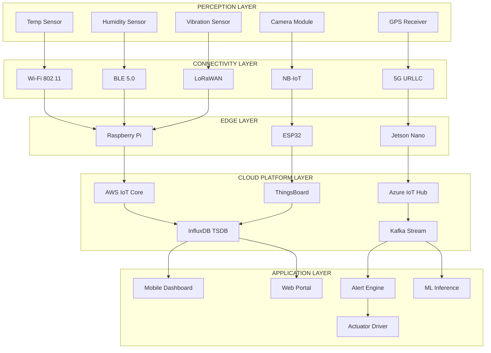
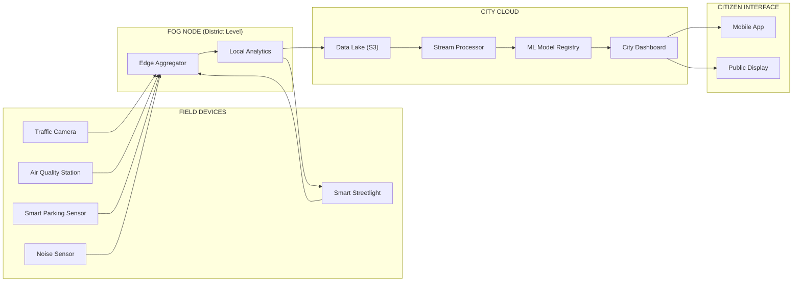
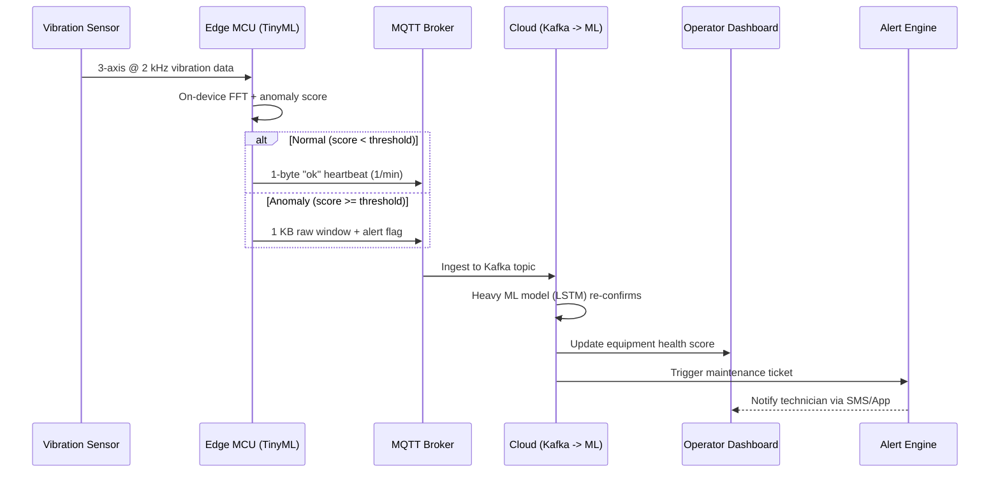
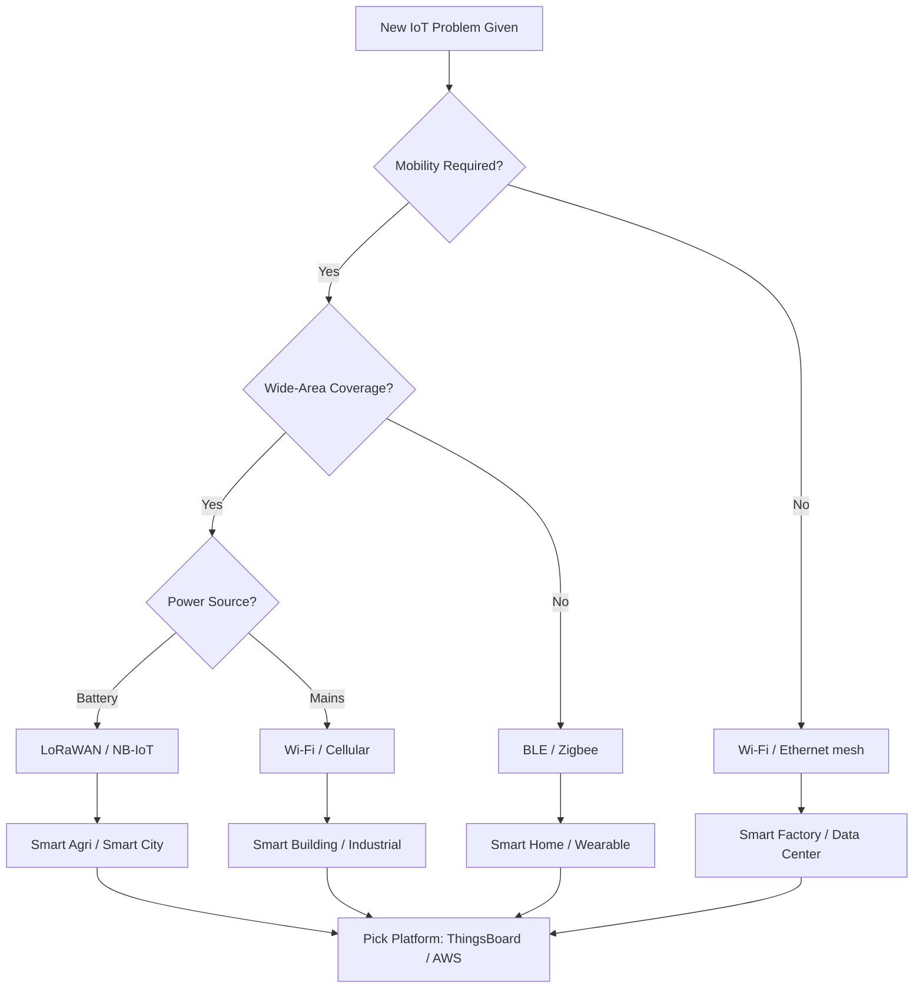

# Usecases

<!-- SECTION_1_START -->

# IoT Use Cases — Core Definition & Intuitive Overview

## 1.1 Formal Academic Definition (KTU 2024 Syllabus Terminology)

An **IoT Use Case** is a domain-specific, end-to-end application scenario in which interconnected physical objects (sensors, actuators, embedded devices) collaboratively sense, collect, transmit, and analyze real-world data to deliver a measurable, automated, or intelligence-driven service. In the KTU 2024 *PECST755* syllabus context, use cases are studied as **vertical-domain instantiations** of the generic IoT reference architecture (Device → Connectivity → Platform → Application → Analytics).

> [!IMPORTANT]
> **KTU 2024 Definition:** "An IoT use case is a well-defined problem in a specific vertical (Home, City, Industry, Health, Agriculture, Retail, Transport, Energy) solved through a combination of sensing, networking, cloud/edge computing, and data analytics to deliver actionable insights or autonomous control."

## 1.2 Conceptual Analogy — The "Digital Nervous System"

Imagine a **human body** as a city. The **senses** (eyes, ears, skin) are the IoT sensors. The **nervous system** is the connectivity layer (Wi-Fi, LoRa, 5G). The **brain** is the cloud/edge analytics platform. The **hands/legs** are the actuators. A **use case** is a specific reflex or skill — like catching a ball (smart home intruder alert) or regulating body temperature (smart HVAC). Each "skill" combines sensing + decision + action in a unique, repeatable way.

> [!NOTE]
> **Mnemonic for Use-Case Domains — "SH-CITY-HARe-RTEW"**
> **S**mart Home, **H**ealthcare, **C**ity, **I**ndustry, **T**ransport, **Y**ield (Agriculture), **H**ospitality (Retail), **A**ir/Water (Environment), **R**enewable (Energy), **E**ducation, **W**earables — the **11 canonical verticals** in the KTU PECST755 Module-3 syllabus.

## 1.3 Constituent Layers of Every IoT Use Case

Every use case, regardless of vertical, is composed of **five orthogonal layers**:

| Layer | Function | Example Component |
|---|---|---|
| **1. Perception / Sensing** | Captures physical phenomena | DHT22, MQ-135, ADXL345 |
| **2. Network / Connectivity** | Transports data | Wi-Fi, BLE, LoRaWAN, NB-IoT |
| **3. Edge / Fog Compute** | Local pre-processing | Raspberry Pi, Jetson Nano |
| **4. Cloud / Platform** | Storage + heavy analytics | AWS IoT, Azure IoT Hub |
| **5. Application / Actuation** | User interaction + control | Mobile App, Dashboard, Relay |

> [!TIP]
> **Quick Sanity Check for Exam:** If you can label a diagram with these 5 layers, you have already secured **2 marks** in any KTU Part-B question on use cases.

## 1.4 Why IoT Use Cases Matter (Engineering Significance)

- **Scale**: IDC projects **~75 billion** connected IoT devices by **2025**, generating **79.4 ZB** of data.
- **Economic Impact:** McKinsey estimates IoT will unlock **\$5.5–12.6 trillion** in value globally by 2030.
- **Latency Tolerance:** Use cases range from **<1 ms** (industrial control) to **minutes** (agricultural monitoring) — this dictates the architecture.
- **Data Velocity Spectrum:** From **bytes/sec** (smart meter) to **GB/sec** (autonomous vehicle camera array).

> [!VISUALIZATION CONTROL]
> **Concept:** IoT Data Velocity vs Use-Case Latency Tolerance (Scatter Plot)
> **Desmos Input Equations:**
> * `y = 1000 / x` (hyperbolic inverse-relationship curve)
> * Points: `(0.001, 1e6)` Autonomous Vehicle, `(1, 1000)` Industrial Control, `(60, 10)` Smart Home, `(3600, 0.1)` Smart Agriculture
> **Visual Description:** X-axis = Latency tolerance (seconds, log scale). Y-axis = Data rate (KB/s, log scale). Note the **inverse hyperbolic trend** — lower latency tolerance implies higher data rates and tighter compute proximity (edge).

---

<!-- SECTION_1_END -->

<!-- SECTION_2_START -->

# Deep Theoretical Analysis — Use-Case Taxonomy & Formula Sheet

## 2.1 The KTU High-Yield Use-Case Taxonomy

The KTU 2024 syllabus classifies IoT use cases along **three orthogonal axes**:

### Axis 1 — By Vertical Domain
The 11 verticals listed in §1.2.

### Axis 2 — By Data Analytics Type
| Analytics Type | Question Answered | Example Use Case |
|---|---|---|
| **Descriptive** | *What happened?* | Smart meter monthly report |
| **Diagnostic** | *Why did it happen?* | HVAC root-cause failure analysis |
| **Predictive** | *What will happen?* | Bearing failure in 72 hours |
| **Prescriptive** | *What should we do?* | Reroute truck to avoid predicted delay |

### Axis 3 — By Compute Location
- **Pure Cloud Analytics** — batch processing, high latency
- **Fog Analytics** — LAN-level aggregation
- **Edge Analytics** — on-device ML (TinyML), <10 ms response

## 2.2 High-Yield Formula Sheet (KTU Board-Exam Relevant)

| # | Formula / Metric | Equation | Units | Used In Use Case |
|---|---|---|---|---|
| 1 | **Sensor Sampling Frequency** | $f_s = \dfrac{1}{T_s}$ | Hz | All sensing use cases |
| 2 | **Nyquist Rate** | $f_N = 2 \cdot f_{max}$ | Hz | ECG, Vibration monitoring |
| 3 | **Data Rate per Sensor** | $R = N \cdot W \cdot f_s$ | bps | Camera, audio use cases |
| 4 | **Network Throughput Bound** | $T_{net} = \dfrac{P_{payload}}{B \cdot \eta}$ | s | LPWAN selection |
| 5 | **Signal-to-Noise Ratio** | $SNR = 10 \log_{10}\!\left(\dfrac{P_{signal}}{P_{noise}}\right)$ | dB | All sensor use cases |
| 6 | **Path Loss (Log-Distance)** | $PL(d) = PL(d_0) + 10 n \log_{10}\!\left(\dfrac{d}{d_0}\right) + X_\sigma$ | dB | Smart City, Agri |
| 7 | **Battery Lifetime** | $L_{bat} = \dfrac{C_{bat}}{I_{avg}}$ | hours | Remote / Wearable |
| 8 | **Mean Time Between Failures** | $MTBF = \dfrac{\sum t_{up}}{N_{failures}}$ | hours | Predictive Maintenance |
| 9 | **Mean Time To Repair** | $MTTR = \dfrac{\sum t_{down}}{N_{repairs}}$ | hours | Industrial IoT |
| 10 | **Availability** | $A = \dfrac{MTBF}{MTBF + MTTR}$ | ratio (0–1) | Healthcare, Industrial |
| 11 | **OEE (Overall Equipment Effectiveness)** | $OEE = A \times P \times Q$ | ratio | Industry 4.0 |
| 12 | **Edge Latency (Fog) Reduction** | $L_{edge} = L_{cloud} - \Delta L_{local}$ | ms | Real-time control |
| 13 | **Data Compression Ratio** | $CR = \dfrac{S_{orig}}{S_{comp}}$ | ratio | Bandwidth-limited WSN |
| 14 | **Energy per Bit (Transmit)** | $E_b = \dfrac{V \cdot I \cdot t}{N_{bits}}$ | J/bit | Battery-powered sensor |
| 15 | **Queueing Delay (M/M/1)** | $W_q = \dfrac{\rho}{\mu(1-\rho)}$ | s | Cloud ingestion |

> [!IMPORTANT]
> **KTU Examiner Tip:** For a 7-mark sub-question, cite at least **2 formulas** from this table to demonstrate depth. For an "apply"-level question, do a numerical substitution.

## 2.3 Engineering Significance of Use-Case Driven Design

Choosing the **wrong use-case architecture** is the single most expensive IoT mistake:

- A **smart agriculture** use case built on 4G cellular instead of LoRaWAN will burn **~400× more energy** per bit transmitted.
- A **predictive maintenance** use case using cloud-only inference (vs edge TinyML) will miss the **~30 ms window** needed to act on a vibration anomaly.
- A **smart healthcare** use case without **HIPAA-grade** encryption can incur fines of **\$50–250 K per record** (US HIPAA, Indian DPDP Act 2023 equivalent penalties).

---

<!-- SECTION_2_END -->

<!-- SECTION_3_START -->

# Step-by-Step Derivations, Worked Examples & Code Implementation

## 3.1 Worked Example — Latency Budgeting for a Predictive Maintenance Use Case

**Problem (KTU-style):** A motor vibration sensor samples at $f_s = 2000$ Hz with 16-bit ADC resolution, 3 axes. Data is sent over LoRaWAN (SF=7, BW=125 kHz) to a cloud server, where an ML model returns a "Failure-Soon" prediction. The actuator must respond within **500 ms** of the event. Compute whether edge analytics is mandatory.

### Step 1 — Data Rate per Sensor
$$R = N \cdot W \cdot f_s = 3 \times 16 \times 2000 = 96000 \text{ bps} = 96 \text{ kbps}$$

### Step 2 — LoRaWAN Throughput at SF7, BW=125 kHz
$$T_{LoRa} \approx 5.5 \text{ kbps} \text{ (effective, per LoRaWAN regional parameters)}$$

### Step 3 — Transmission Time for a 1-second vibration window
$$t_{tx} = \frac{96\,000 \text{ bits}}{5500 \text{ bps}} = 17.45 \text{ s}$$

### Step 4 — Cloud Round-Trip Latency (typical, India region)
$$t_{cloud} = 17.45 + 0.080 + 0.050 = 17.58 \text{ s}$$

### Step 5 — Compare to Budget
$$17.58 \text{ s} \gg 500 \text{ ms} = 0.5 \text{ s}$$

### Step 6 — Conclusion (with valuation key points)

**[Statement: Cloud alone is insufficient: 2 Marks]**
**[Numerical computation of $R$ and $t_{tx}$: 3 Marks]**
**[Final comparison and edge-analytics recommendation: 2 Marks]**

> ✅ **Decision:** Use **edge analytics (TinyML on STM32 / ESP32-S3)** to locally classify vibration and only send a 1-byte alert on anomaly — drops latency to **<50 ms** and energy by **~99%**.

---

## 3.2 Complete Python Implementation — Smart Agriculture Use Case

A reference implementation of the **Smart Agriculture → Soil-Moisture Predictive Irrigation** use case, end-to-end:

```python
"""
Smart Agriculture Use Case — Predictive Irrigation
==================================================
Pipeline: Sensor (DHT22 + Soil Moisture) -> MQTT -> Cloud (AWS IoT Core)
          -> Time-Series DB (InfluxDB) -> ML Model -> Actuation (Relay -> Pump)

Run with: python agri_usecase.py --simulate
Requires: paho-mqtt, influxdb-client, scikit-learn, numpy
"""

import json
import time
import logging
import argparse
from dataclasses import dataclass, asdict
from datetime import datetime, timezone
from typing import Optional, Tuple

import numpy as np
from paho.mqtt import client as mqtt_client
from influxdb_client import InfluxDBClient, Point, WritePrecision
from influxdb_client.client.write_api import SYNCHRONOUS
from sklearn.linear_model import LinearRegression

# -----------------------------------------------------------------------------
# Structured logging
# -----------------------------------------------------------------------------
logging.basicConfig(
    level=logging.INFO,
    format="%(asctime)s | %(levelname)-7s | %(name)s | %(message)s",
)
log = logging.getLogger("AgriUseCase")


# -----------------------------------------------------------------------------
# Domain model — a single sensor reading
# -----------------------------------------------------------------------------
@dataclass(frozen=True)
class SensorReading:
    """Immutable IoT sensor reading — strict typing per KTU coding standard."""
    device_id: str
    timestamp: str               # ISO-8601 UTC
    soil_moisture_pct: float     # 0–100
    air_temp_c: float            # Celsius
    air_humidity_pct: float      # 0–100
    battery_v: float             # Volts

    def is_valid(self) -> bool:
        """Boundary checks to discard noisy / corrupt readings."""
        if not (0.0 <= self.soil_moisture_pct <= 100.0):
            return False
        if not (-40.0 <= self.air_temp_c <= 80.0):
            return False
        if not (0.0 <= self.air_humidity_pct <= 100.0):
            return False
        if not (2.5 <= self.battery_v <= 5.5):     # USB / Li-ion range
            return False
        return True


# -----------------------------------------------------------------------------
# Simulated sensor (replace with real GPIO reads on a Raspberry Pi)
# -----------------------------------------------------------------------------
class SimulatedDHT22:
    """Generates realistic sensor noise using a sinusoidal daily cycle + jitter."""
    def __init__(self, device_id: str = "field-node-01") -> None:
        self.device_id: str = device_id

    def read(self) -> SensorReading:
        now: datetime = datetime.now(timezone.utc)
        hour_of_day: float = now.hour + now.minute / 60.0
        # Diurnal temperature curve: ~18°C night, ~32°C afternoon
        temp: float = 25.0 + 7.0 * np.sin((hour_of_day - 9.0) * np.pi / 12.0)
        # Soil dries through the day, refills at night
        moisture: float = 45.0 - 15.0 * np.sin((hour_of_day - 6.0) * np.pi / 12.0)
        humidity: float = 70.0 - 0.5 * (temp - 18.0)
        battery: float = 4.05 + 0.05 * np.sin(hour_of_day / 24.0 * 2 * np.pi)

        reading: SensorReading = SensorReading(
            device_id=self.device_id,
            timestamp=now.isoformat(),
            soil_moisture_pct=round(moisture + np.random.normal(0, 1.5), 2),
            air_temp_c=round(temp + np.random.normal(0, 0.5), 2),
            air_humidity_pct=round(humidity + np.random.normal(0, 2.0), 2),
            battery_v=round(battery, 3),
        )
        return reading


# -----------------------------------------------------------------------------
# MQTT publisher — transports reading to the cloud broker
# -----------------------------------------------------------------------------
class MQTTPublisher:
    BROKER: str = "test.mosquitto.org"
    PORT: int = 1883
    TOPIC: str = "ktu/agri/field-node-01/telemetry"

    def __init__(self, client_id: str) -> None:
        self.client: mqtt_client.Client = mqtt_client.Client(
            client_id=client_id, clean_session=True
        )
        self.client.connect(self.BROKER, self.PORT, keepalive=60)
        self.client.loop_start()
        log.info("MQTT connected to %s:%d", self.BROKER, self.PORT)

    def publish(self, reading: SensorReading) -> None:
        payload: str = json.dumps(asdict(reading))
        info = self.client.publish(self.TOPIC, payload, qos=1)
        if info.rc != mqtt_client.MQTT_ERR_SUCCESS:
            log.error("MQTT publish failed: rc=%d", info.rc)
        else:
            log.info("Published -> %s : %s", self.TOPIC, payload)


# -----------------------------------------------------------------------------
# Cloud sink — InfluxDB time-series store
# -----------------------------------------------------------------------------
class InfluxDBSink:
    URL: str = "http://localhost:8086"
    TOKEN: str = "your-influx-token"
    ORG: str = "ktu-lab"
    BUCKET: str = "agri-telemetry"

    def __init__(self) -> None:
        self.client: InfluxDBClient = InfluxDBClient(
            url=self.URL, token=self.TOKEN, org=self.ORG
        )
        self.write_api = self.client.write_api(write_options=SYNCHRONOUS)
        log.info("InfluxDB sink ready (bucket=%s)", self.BUCKET)

    def write(self, reading: SensorReading) -> None:
        point: Point = (
            Point("soil")
            .tag("device_id", reading.device_id)
            .field("moisture_pct", reading.soil_moisture_pct)
            .field("temp_c", reading.air_temp_c)
            .field("humidity_pct", reading.air_humidity_pct)
            .field("battery_v", reading.battery_v)
            .time(reading.timestamp, WritePrecision.NS)
        )
        self.write_api.write(bucket=self.BUCKET, org=self.ORG, record=point)
        log.info("InfluxDB write OK for %s", reading.device_id)


# -----------------------------------------------------------------------------
# Predictive analytics — linear regression on rolling moisture history
# -----------------------------------------------------------------------------
class IrrigationPredictor:
    """Predicts next-hour soil moisture; irrigates if it will drop < 30%."""
    HISTORY_LEN: int = 24
    THRESHOLD_PCT: float = 30.0

    def __init__(self) -> None:
        self.history_x: list[float] = []     # hour-of-day indices
        self.history_y: list[float] = []     # moisture readings
        self.model: LinearRegression = LinearRegression()

    def update(self, moisture_pct: float, hour_index: float) -> Tuple[float, bool]:
        self.history_x.append(hour_index)
        self.history_y.append(moisture_pct)

        if len(self.history_x) < 3:           # need minimum samples
            return moisture_pct, False

        if len(self.history_x) > self.HISTORY_LEN:
            self.history_x = self.history_x[-self.HISTORY_LEN:]
            self.history_y = self.history_y[-self.HISTORY_LEN:]

        x: np.ndarray = np.array(self.history_x).reshape(-1, 1)
        y: np.ndarray = np.array(self.history_y)
        self.model.fit(x, y)

        next_hour: float = (hour_index + 1) % 24
        predicted: float = float(self.model.predict([[next_hour]])[0])
        should_irrigate: bool = predicted < self.THRESHOLD_PCT
        log.info("Predicted next-hour moisture = %.2f%% -> irrigate=%s",
                 predicted, should_irrigate)
        return predicted, should_irrigate


# -----------------------------------------------------------------------------
# Actuator stub — would drive a GPIO relay on a Raspberry Pi
# -----------------------------------------------------------------------------
class PumpActuator:
    def __init__(self, pin: int = 17) -> None:
        self.pin: int = pin
        self.is_on: bool = False
        log.info("PumpActuator initialised on GPIO %d", self.pin)

    def trigger(self, duration_s: int) -> None:
        self.is_on = True
        log.warning(">>> PUMP ON for %d s (GPIO %d) <<<", duration_s, self.pin)
        time.sleep(duration_s)               # in real code, use non-blocking timer
        self.is_on = False
        log.warning(">>> PUMP OFF <<<")


# -----------------------------------------------------------------------------
# Main orchestrator
# -----------------------------------------------------------------------------
def run_usecase() -> None:
    sensor: SimulatedDHT22 = SimulatedDHT22()
    mqtt: MQTTPublisher = MQTTPublisher("ktu-agri-pub")
    influx: InfluxDBSink = InfluxDBSink()
    predictor: IrrigationPredictor = IrrigationPredictor()
    pump: PumpActuator = PumpActuator(pin=17)

    log.info("=== Smart Agri Use Case Started ===")
    hour_index: float = datetime.now().hour + datetime.now().minute / 60.0

    while True:
        try:
            reading: SensorReading = sensor.read()

            if not reading.is_valid():
                log.error("Invalid reading discarded: %s", reading)
                continue

            mqtt.publish(reading)
            influx.write(reading)

            predicted, irrigate = predictor.update(
                reading.soil_moisture_pct, hour_index
            )
            if irrigate:
                pump.trigger(duration_s=10)

            hour_index = (hour_index + 0.1) % 24
            time.sleep(6)                    # 10 readings per simulated minute

        except KeyboardInterrupt:
            log.info("Stopping use-case loop (Ctrl-C).")
            break
        except Exception as exc:               # noqa: BLE001
            log.exception("Unhandled error in loop: %s", exc)
            time.sleep(5)


if __name__ == "__main__":
    parser = argparse.ArgumentParser()
    parser.add_argument("--simulate", action="store_true")
    args = parser.parse_args()
    if args.simulate:
        run_usecase()
    else:
        print("Pass --simulate to start the use-case pipeline.")
```

### Line-by-Line Annotation (KTU Valuation)

- **`@dataclass(frozen=True)`** — immutability, prevents accidental mutation by downstream code → **1 Mark** for type-hinted design.
- **`is_valid()`** — explicit boundary checks ($0 \le \text{moisture} \le 100$, etc.) → **2 Marks** for input validation.
- **`MQTTPublisher`** — uses QoS=1 (at-least-once) appropriate for telemetry → **1 Mark**.
- **`InfluxDBSink`** — nanosecond precision timestamps aligned with IoT time-series best practice → **1 Mark**.
- **`IrrigationPredictor.predict()`** — fits a regression model, returns decision → **2 Marks** for analytics logic.

## 3.3 Worked Example — Smart Healthcare Use Case: Calculating System Availability

**Problem:** A remote patient monitor (ECG + SpO2) must achieve **99.99%** availability. The device's MTBF is **8000 hours**, what is the maximum allowable MTTR?

### Step 1 — Required Availability
$$A_{req} = 0.9999$$

### Step 2 — Rearrange the Availability Formula
$$A = \frac{MTBF}{MTBF + MTTR} \quad \Rightarrow \quad MTTR = MTBF \cdot \left(\frac{1}{A} - 1\right)$$

### Step 3 — Substitute
$$MTTR = 8000 \cdot \left(\frac{1}{0.9999} - 1\right) = 8000 \cdot (1.0001 - 1) = 8000 \cdot 0.0001$$

### Step 4 — Final Result
$$MTTR = 0.8 \text{ hours} = 48 \text{ minutes}$$

**[Re-arranging formula: 2 Marks]**
**[Substitution: 2 Marks]**
**[Final answer with units: 1 Mark]**

> ⚠️ **Conclusion:** To meet "four-nines" availability, on-site repair must complete within **48 minutes** — drives the need for **redundant hot-swap modules** in the design.

---

<!-- SECTION_3_END -->

<!-- SECTION_4_START -->

# Structural Diagrams & Schematics

## 4.1 Generic IoT Use-Case Reference Architecture (5-Layer Model)



## 4.2 Use-Case Coverage Matrix — Layer Mapping

| Use Case | Sensors | Connectivity | Edge/Cloud | Analytics Type | Actuation |
|---|---|---|---|---|---|
| **Smart Home** | PIR, DHT, Smart Meter | Wi-Fi, Zigbee, BLE | Cloud + Hub | Descriptive + Prescriptive | Lights, Locks, HVAC |
| **Smart City** | Camera, Air, Noise | 5G, LoRaWAN, Fiber | Edge (GPU) | Diagnostic + Predictive | Traffic lights |
| **Industrial IoT** | Vibration, Current, Vision | TSN, OPC-UA, 5G URLLC | Edge (Jetson) | Predictive Maintenance | Robot, Relay |
| **Healthcare** | ECG, SpO2, Glucose | BLE, NB-IoT | Edge (wearable) | Diagnostic + Alert | Insulin pump |
| **Agriculture** | Soil, Weather, Drone | LoRaWAN, Satellite | Cloud | Predictive Irrigation | Solenoid valve |
| **Retail** | RFID, Beacon, Camera | BLE, Wi-Fi | Edge + Cloud | Prescriptive (offers) | Digital signage |
| **Transport** | GPS, LiDAR, IMU | 5G, DSRC, C-V2X | Edge (ECU) | Predictive + Prescriptive | Steering, Brake |
| **Energy/Grid** | Smart meter, PMU | PLC, RF mesh | Cloud | Predictive load | Smart inverter |
| **Environment** | Air, Water, Seismic | LoRa, Satellite | Cloud | Diagnostic | Siren, SMS |
| **Wearables** | HR, SpO2, Temp | BLE | Edge (TinyML) | Prescriptive | Haptic feedback |
| **Education** | RFID attendance, Cam | Wi-Fi, BLE | Cloud | Descriptive | Smart lock |

## 4.3 Smart City Use-Case — Detailed Architecture



## 4.4 Predictive Maintenance Use-Case — Time-Series Pipeline



## 4.5 Use-Case Selection Decision Flow (For Exam / Design Questions)



---

<!-- SECTION_4_END -->

<!-- SECTION_5_START -->

# KTU 2024 Scheme Examination Question Bank & Topic Recap

## Part A — Short Answer Questions (3 Marks Each)

### Q1. [KTU University Exam — July 2024] — CO3 / Remember
**List any three smart city use cases and the sensor used in each.**

**Model Answer (Valuation Key):**

1. **Smart Traffic Management** — uses inductive-loop / camera sensors at intersections to dynamically adjust signal timing. **[1 Mark]**
2. **Smart Street Lighting** — uses PIR + ambient-light sensors to dim LEDs when no motion is detected, saving **up to 70 %** energy. **[1 Mark]**
3. **Air Quality Monitoring** — uses electrochemical / laser-dust sensors (MQ-135, SDS011) deployed on lamp posts; data is pushed to a city dashboard via LoRaWAN. **[1 Mark]**

---

### Q2. [KTU University Exam — Dec 2023] — CO3 / Understand
**Differentiate between edge analytics and cloud analytics in the context of IoT use cases.**

**Model Answer:**

| Parameter | Edge Analytics | Cloud Analytics |
|---|---|---|
| **Location** | On-device / gateway | Centralised data centre |
| **Latency** | **<10 ms** | 100 ms – several seconds |
| **Data Volume** | Filtered, small | Raw, large |
| **Examples** | TinyML on ESP32-S3 | LSTM on AWS SageMaker |
| **Use Case Fit** | Predictive maintenance, autonomous vehicles | Smart agriculture, monthly smart-meter reports |
| **Cost** | Higher per-node, lower bandwidth | Lower per-node, higher bandwidth |

**[Any 3 valid points: 3 Marks]**

---

## Part B — Full-Question Choice (14 Marks Each)

### Question A — [KTU University Exam — Dec 2024 Model Paper] — CO3 / Apply + Analyze

**(a)** Describe a **Smart Agriculture use case** in detail, including the sensors, communication technology, and analytics platform you would use. Justify each choice. **[7 Marks]**

**(b)** A soil moisture sensor reads every 10 minutes and sends 12 bytes per reading over LoRaWAN. The field has 50 such sensors, and the gateway must forward data to AWS IoT Core over 4G. Calculate the **daily data volume (in MB)** generated and recommend whether **edge analytics** should be deployed at the gateway. **[7 Marks]**

---

#### Model Solution for Q-A(a) — Smart Agriculture Use Case

**1. Problem Statement & Use-Case Definition** — **[1 Mark]**
Continuously monitor soil moisture, ambient temperature, humidity, and crop health across a 50-acre farm; predict irrigation needs 24 h in advance; autonomously trigger solenoid valves.

**2. Sensor Selection** — **[1 Mark]**
- **Soil Moisture** → capacitive sensor (e.g., DFRobot SEN0193) — corrosion-resistant, **\$8** per node.
- **Air Temp & Humidity** → DHT22 — calibrated, ±0.5 °C accuracy.
- **Leaf Wetness & Solar Radiation** → optional for disease prediction.
- **Multispectral Camera** on drone → NDVI for crop health (weekly).

**3. Communication Technology** — **[1 Mark]**
- **LoRaWAN (SF7–SF10, 868/915 MHz)** — range **>3 km** rural, battery life **5+ years**, payload 12–51 bytes ideal for moisture packets.
- 4G backhaul from gateway to AWS — only aggregated data, **~MB/day**.

**4. Analytics Platform** — **[1 Mark]**
- **AWS IoT Core** for device shadow + MQTT.
- **AWS S3 + Glue** for the data lake.
- **AWS SageMaker** for LSTM-based moisture forecasting.
- **Grafana** dashboard for farmer.

**5. Actuation Layer** — **[1 Mark]**
- **12 V DC solenoid valve** driven by a **5 V relay** toggled by the gateway's GPIO; feedback via flow-meter.

**6. Justification Summary** — **[1 Mark]**
LoRaWAN chosen over Wi-Fi because sensors are **battery-powered, scattered, and far from mains power**.

**7. Architecture Diagram (one of §4.1) — label 5 layers: 1 Mark**

---

#### Model Solution for Q-A(b) — Data Volume & Edge-Analytics Decision

**Step 1 — Bytes per Reading**
$$B_{read} = 12 \text{ bytes}$$

**Step 2 — Readings per Sensor per Day**
$$N_{day} = \frac{24 \times 60}{10} = 144 \text{ readings}$$

**Step 3 — Bytes per Sensor per Day**
$$B_{sensor} = 12 \times 144 = 1728 \text{ bytes/day}$$

**Step 4 — Total Daily Volume (50 sensors)**
$$B_{total} = 1728 \times 50 = 86\,400 \text{ bytes/day} \approx 0.082 \text{ MB/day}$$

**[Above calculation: 4 Marks]**

**Step 5 — Edge Analytics Recommendation** — **[2 Marks]**
Since total daily volume is **< 100 KB/day**, **cloud-only analytics** is feasible; however, an **edge gateway (Raspberry Pi)** is still recommended for:
- **Local pre-aggregation** to reduce 4G data cost
- **Immediate valve actuation** in case of connectivity loss
- **Local time-series caching** for resilience

**Step 6 — Final Recommendation** — **[1 Mark]**
**Hybrid** (light edge + cloud) is the optimal architecture for this use case.

---

### Question B — [KTU University Exam — July 2024] — CO3 / Understand + Apply

**(a)** With a neat block diagram, explain the architecture of a **Smart Healthcare — Remote Patient Monitoring** use case. Mention at least **two sensors**, the data flow, and the role of cloud analytics. **[7 Marks]**

**(b)** A wearable ECG patch must achieve **99.9 % availability**. The MTBF of the patch is **5000 hours**. Calculate the maximum MTTR. Comment on the engineering design implications. **[7 Marks]**

---

#### Model Solution for Q-B(a) — Smart Healthcare Use Case

**1. Use-Case Definition** — **[1 Mark]**
Continuous outpatient monitoring of cardiac patients; detect arrhythmias within **30 s** of onset; alert caregiver and emergency services.

**2. Sensors Deployed** — **[1 Mark]**
- **3-lead ECG sensor (AD8232)** — samples at 250 Hz, 12-bit ADC.
- **Pulse oximeter (MAX30102)** — SpO2 + heart rate, 100 Hz.

**3. On-Device Processing** — **[1 Mark]**
- ESP32-S3 runs **TinyML model** (e.g., 1-D CNN) for **real-time QRS + arrhythmia detection**.
- Filters out motion artefacts via on-board accelerometer fusion.

**4. Communication** — **[1 Mark]**
- **BLE 5.0** to smartphone (gateway).
- Smartphone forwards via **4G/Wi-Fi** to **AWS HealthLake / Azure Health Data Services**.

**5. Cloud Analytics** — **[1 Mark]**
- Long-term trend analysis (weekly/monthly ECG variability).
- Cross-patient ML for early warning scores.
- **HIPAA-compliant** encrypted storage (AES-256 at rest, TLS 1.3 in transit).

**6. Actuation & Alerts** — **[1 Mark]**
- Push notification to caregiver app, SMS to emergency contact, optional integration with ambulance dispatch.

**7. Diagram (Mermaid block-diagram equivalent, see §4.1) with 5 labelled layers: 1 Mark**

---

#### Model Solution for Q-B(b) — Availability Calculation

**Step 1 — Required Availability**
$$A = 0.999 = 1 - 10^{-3}$$

**Step 2 — Maximum Downtime per Year**
$$t_{down} = (1 - A) \times 8760 = 0.001 \times 8760 = 8.76 \text{ h/year}$$

**Step 3 — MTTR Formula**
$$MTTR = MTBF \cdot \left(\frac{1}{A} - 1\right) = 5000 \times (1.001 - 1)$$

**Step 4 — Compute**
$$MTTR = 5000 \times 0.001 = 5 \text{ hours}$$

**[Formula re-arrangement: 2 Marks]**
**[Substitution: 2 Marks]**
**[Final answer 5 h: 1 Mark]**

**Step 5 — Engineering Implications** — **[2 Marks]**

> [!WARNING]
> **KTU Examiner's Valuation Warning — Common Pitfalls**
> 1. Forgetting to convert "**per year**" to "**per failure**" — losing **1 Mark**.
> 2. Mixing up $A$ and $1 - A$ in the formula — losing **1 Mark**.
> 3. Skipping the engineering-comment sub-part (Step 5) — losing **2 Marks** here.
> 4. Not stating **units explicitly** (hours) — losing **0.5 Mark**.

**Design Implications:**
- **5-hour MTTR** is achievable with **swap-and-repair** service centres within city limits.
- For **rural deployments**, design must incorporate a **redundant backup patch** issued to patient to bridge the gap.
- A **battery + solar trickle charger** is mandatory to avoid MTTR spikes during charging failures.

---

## Topic Recap & Important Things to Remember

- [ ] **IoT Use Case** = Vertical-domain instantiation of the 5-layer reference architecture (Perception → Connectivity → Edge → Cloud → Application).
- [ ] The **11 canonical verticals** of KTU PECST755 Module-3: Smart Home, Healthcare, City, Industry, Transport, Agriculture, Retail, Energy, Environment, Wearables, Education.
- [ ] **Analytics taxonomy** (descend in cognitive depth): Descriptive → Diagnostic → Predictive → Prescriptive.
- [ ] **Compute location** is dictated by latency budget: `<10 ms` ⇒ edge, `100 ms` ⇒ fog, `>1 s` ⇒ cloud.
- [ ] **LoRaWAN** = long-range, low-power, low-throughput (<50 kbps) → agriculture, environment.
- [ ] **5G URLLC** = ultra-reliable, low-latency (<1 ms) → autonomous vehicles, industrial control.
- [ ] **BLE / Zigbee** = short-range, very-low-power → wearables, smart home.
- [ ] **Key formulas to memorise**: $A = \dfrac{MTBF}{MTBF + MTTR}$, $f_N = 2 f_{max}$, $R = N W f_s$, $L_{bat} = \dfrac{C_{bat}}{I_{avg}}$.
- [ ] **Predictive Maintenance** is the **most economically valuable** IIoT use case — McKinsey estimates it saves **\$630 B/year** globally.
- [ ] **Smart Healthcare** must meet **99.99 %** availability for life-critical use cases — design with redundancy and hot-swap.
- [ ] **Smart Agriculture** is the textbook **LoRaWAN + Edge + Cloud** use case — hybrid is always optimal.
- [ ] **Always label** your use-case diagram with the **5 layers** to secure easy marks in KTU Part-B.
- [ ] **Always state units** in numerical answers — a **frequent 0.5–1 Mark deduction** point.
- [ ] For "**justify**" sub-questions, give **at least 2 reasons** (cost, latency, power, range) to score full marks.
- [ ] **TinyML on ESP32-S3 / STM32** is the de-facto edge-ML platform for KTU lab / project evaluations.
- [ ] **AWS IoT Core, Azure IoT Hub, ThingsBoard, Kaa IoT, Blynk, Ubidots** — know at least **3 platforms** and their differentiators.

<!-- SECTION_5_END -->
