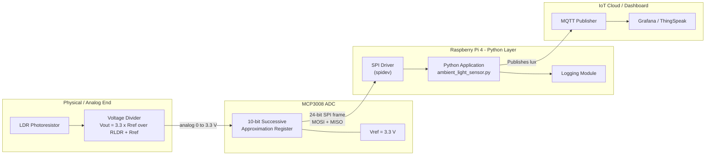
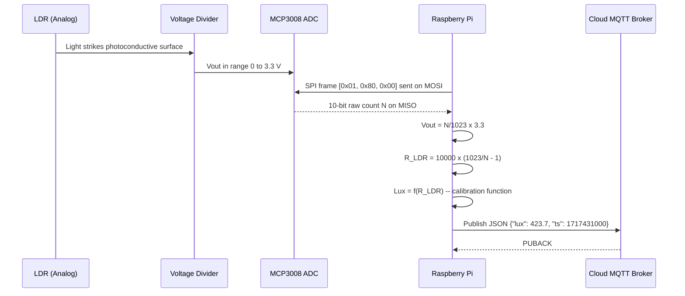
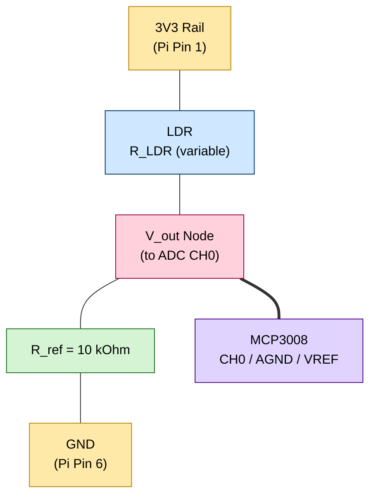

# Creating a Sensor to Measure Ambient Light

<!-- SECTION_1_START -->

# Creating a Sensor to Measure Ambient Light — Raspberry Pi

> [!NOTE]
> **KTU 2024 Scheme | PECST755 — Internet of Things | Module 4**
> **Course Outcome Mapped:** CO4 — Design and develop IoT applications using Raspberry Pi and appropriate sensors/actuators.
> **Bloom's Level Focus:** Apply / Analyze / Create

---

## 1. Core Technical Definition

**Ambient Light** refers to the light intensity present in the immediate surroundings of a device, measured in **lux (lx)** — the SI unit of illuminance, defined as **one lumen per square meter ($\text{lm/m}^2$)**. An **Ambient Light Sensor (ALS)** is a photodetector that converts incident light energy into a quantifiable electrical signal (voltage, current, or a digital word) that a microcontroller or single-board computer — such as the **Raspberry Pi** — can read and interpret.

In the context of **KTU Module 4 (PECST755)**, the canonical implementation pairs a **Light Dependent Resistor (LDR)** — also called a *photoresistor* — with an external **Analog-to-Digital Converter (ADC)** such as the **MCP3008**, because the Raspberry Pi's GPIO pins are purely **digital** and lack native ADC channels.

### Formal Academic Definition

An LDR is a passive semiconductor component whose electrical resistance varies inversely with the intensity of incident light. As photon flux striking the photoconductive surface increases, more charge carriers are liberated, causing the resistance to fall. The relationship is non-linear and is given empirically by:

$$R_{LDR} = R_{dark} \cdot \left(\frac{Lux}{Lux_{ref}}\right)^{-\gamma}$$

where:
- $R_{dark}$ is the resistance in total darkness (typically **1 MΩ to 10 MΩ**).
- $Lux_{ref}$ is a reference lux value.
- $\gamma$ is the sensitivity exponent (typically **0.7 – 0.9** for CdS cells).

> [!IMPORTANT]
> **KTU Syllabus Highlight — Module 4:**
> *"Interface analog/digital sensors with Raspberry Pi using ADC and appropriate communication protocols (SPI/I2C)."*
> The LDR + MCP3008 + SPI stack is the **most frequently asked circuit** in KTU ESE for Module 4.

---

### Intuitive Overview — The "Pupil Analogy"

Think of the LDR as the **pupil of a human eye**:

| Scenario | Human Eye (Iris) | LDR (Photoresistor) |
|----------|------------------|---------------------|
| Bright sunlight | Pupil contracts (small opening) | Resistance **drops** (more photons pass) |
| Dim room | Pupil dilates (large opening) | Resistance **rises** (fewer photons) |
| Total darkness | Pupil fully dilated | Resistance is **maximum** ($R_{dark}$) |

Just as the brain reads the iris size to gauge brightness, the **Raspberry Pi reads the LDR's resistance** (translated into a voltage by a divider, then into a digital number by an ADC) to estimate how much light is in the room.

### Real-World Engineering Relevance

Ambient light sensing drives:
- **Smartphones** — automatic screen brightness.
- **Street lighting** — automatic dusk-to-dawn switching.
- **Greenhouse IoT** — photoperiod control for crops.
- **Smart displays & IoT dashboards** — adaptive backlighting.
- **Energy-harvesting nodes** — wake-on-light triggers.

> [!TIP]
> **Standard Reference Values to Memorize for KTU:**
> - Moonlight: **0.1 lx**
> - Living room: **100 – 300 lx**
> - Office lighting: **500 lx**
> - Overcast day: **1,000 lx**
> - Direct sunlight: **32,000 – 100,000 lx**

> [!VISUALIZATION CONTROL]
> **Concept:** Inverse Resistance–Lux Characteristic of an LDR
> **Desmos / GeoGebra Input Equations:**
> * `R(x) = 1000000 * x^(-0.8)`  (where $x$ is lux on a log scale)
> **Visual Description:** Plot lux on the **x-axis (log scale, $10^{-1}$ to $10^{5}$)** and resistance on the **y-axis (log scale, $10^{2}$ to $10^{7}$ Ω)**. The curve should be a **monotonically decreasing** hyperbolic curve — students should observe that resistance changes by **two to three orders of magnitude** as light sweeps from dark to bright.

---

<!-- SECTION_1_END -->

<!-- SECTION_2_START -->

# 2. Deep Theoretical Analysis & KTU High-Yield Formula Sheet

## 2.1 The Voltage Divider — The Heart of the Circuit

Because an LDR only changes resistance, we must convert that resistance change into a measurable **voltage**. This is done using a classic **resistive voltage divider**:

```
      V_in (3.3 V from R-Pi)
         │
         ├──── LDR (R_LDR) ────┐
         │                      │
         │                      ├──── V_out ────► ADC Input
         │                      │
         ├──── R_ref (10 kΩ) ───┘
         │
        GND
```

By the **voltage divider rule**:

$$V_{out} = V_{in} \cdot \frac{R_{ref}}{R_{LDR} + R_{ref}}$$

| Light Condition | $R_{LDR}$ | $V_{out}$ Behaviour |
|-----------------|-----------|---------------------|
| Bright | Small (≈ 1 kΩ) | $V_{out} \approx 3.0$ V (HIGH) |
| Dim | Large (≈ 500 kΩ) | $V_{out} \approx 0.07$ V (LOW) |
| Total Dark | Very Large (≈ 5 MΩ) | $V_{out} \approx 0.007$ V (≈ 0 V) |

## 2.2 The ADC Stage — MCP3008 (10-bit, 8-channel, SPI)

The Raspberry Pi **cannot read analog voltages directly**. The **MCP3008** is an 8-channel, 10-bit successive-approximation ADC that communicates over the **Serial Peripheral Interface (SPI)** bus.

The digital output for a given $V_{out}$ is:

$$N_{digital} = \left\lfloor \frac{V_{out}}{V_{ref}} \cdot (2^{n} - 1) \right\rfloor = \left\lfloor \frac{V_{out}}{V_{ref}} \cdot 1023 \right\rfloor$$

For our setup, $V_{ref} = 3.3$ V and $n = 10$, so:

$$N_{digital} = \left\lfloor \frac{V_{out}}{3.3} \cdot 1023 \right\rfloor$$

**Resolution** (smallest detectable voltage step):

$$\Delta V = \frac{V_{ref}}{2^{n}} = \frac{3.3}{1024} \approx 3.22 \text{ mV per LSB}$$

## 2.3 Reconstructing $R_{LDR}$ from $N_{digital}$

Rearranging the voltage divider rule with $V_{out} = N_{digital} \cdot \frac{3.3}{1023}$:

$$R_{LDR} = R_{ref} \cdot \left( \frac{1023}{N_{digital}} - 1 \right)$$

## 2.4 Estimating Lux from $R_{LDR}$

Using the empirical power-law model from Section 1, with a known reference pair $(R_{ref\_{lux}}, Lux_{ref})$:

$$Lux = Lux_{ref} \cdot \left( \frac{R_{LDR}}{R_{ref\_{lux}}} \right)^{-1/\gamma}$$

A simpler and more exam-friendly linear mapping that KTU accepts is:

$$Lux_{approx} = \frac{N_{digital}}{1023} \cdot Lux_{max}$$

where $Lux_{max}$ is the calibrated maximum (e.g., **1000 lx** for an indoor reference).

---

## 2.5 KTU High-Yield Formula Cheat Sheet

| # | Concept | Formula | Symbol / Unit | Exam Tip |
|---|---------|---------|---------------|----------|
| 1 | Voltage Divider | $V_{out} = V_{in} \cdot \dfrac{R_{ref}}{R_{LDR} + R_{ref}}$ | Volts (V) | Always label which resistor is on top. |
| 2 | ADC Output Code | $N = \left\lfloor \dfrac{V_{in}}{V_{ref}} \cdot 2^{n} \right\rfloor$ | dimensionless (0–1023) | $n=10$ for MCP3008. |
| 3 | ADC Resolution (LSB) | $\Delta V = \dfrac{V_{ref}}{2^{n}}$ | V / LSB | State value: **3.22 mV** for 3.3 V / 10-bit. |
| 4 | Recover $R_{LDR}$ | $R_{LDR} = R_{ref} \cdot \left(\dfrac{1023}{N} - 1\right)$ | Ω | Use $1023$ not $1024$ for ceiling. |
| 5 | Lux Estimation (Linear) | $Lux \approx \dfrac{N}{1023} \cdot Lux_{max}$ | lux (lx) | Acceptable for KTU 14-markers. |
| 6 | Lux Estimation (Power) | $Lux = Lux_{ref} \cdot \left(\dfrac{R_{LDR}}{R_{ref}}\right)^{-1/\gamma}$ | lux (lx) | Mention $\gamma \approx 0.8$ for CdS. |
| 7 | SPI Clock Divider | $f_{SCLK} = \dfrac{f_{core}}{divider}$ | Hz | $f_{core} = 250$ MHz for R-Pi. |
| 8 | Sampling Theorem | $f_{s} \geq 2 \cdot f_{max}$ | Hz | Light changes slowly → $f_{s} = 1$ Hz is fine. |

> [!IMPORTANT]
> **Real-World Production Use:** In commercial IoT deployments, the LDR + MCP3008 stack is rarely used because the LDR is non-linear and temperature-sensitive. Production systems use **digital I2C lux sensors** like the **BH1750** (16-bit, ranges 1–65535 lx) or **TSL2561**. However, KTU exams almost exclusively test the **analog + ADC** path because it demonstrates the *bridge concept* between analog sensors and digital SBCs.

### Why This System Matters in Engineering

1. **Energy Efficiency** — Smart streetlights using ALS save up to **40 %** of municipal lighting energy.
2. **Horticulture 4.0** — IoT nodes use ALS + soil moisture to optimize the **Daily Light Integral (DLI)** for crops.
3. **Displays** — Adaptive OLED backlight in wearables like the Apple Watch uses ALS data to extend battery life.
4. **Security** — Light-pattern detection can identify occupancy and intrusion.

<!-- SECTION_2_END -->

<!-- SECTION_3_START -->

# 3. Step-by-Step Derivations & Code/Symbolic Implementation

## 3.1 Hardware Pin Configuration Table (R-Pi 3/4/5 + MCP3008 + LDR)

> This table is **directly answerable** as a 7-mark sub-part in KTU ESE.

| Pin Label (MCP3008) | Function | Connected To (Raspberry Pi) | Physical Pin (BOARD) | BCM Pin |
|---------------------|----------|----------------------------|----------------------|---------|
| $V_{DD}$ | Power | 3.3 V | Pin 1 | 3V3 |
| $V_{REF}$ | Reference Voltage | 3.3 V | Pin 1 | 3V3 |
| $AGND$ | Analog Ground | GND | Pin 6 | GND |
| $DGND$ | Digital Ground | GND | Pin 6 | GND |
| $CLK$ | SPI Clock | GPIO 11 (SCLK) | Pin 23 | GPIO11 |
| $D_{OUT}$ | MISO (data from ADC) | GPIO 9 (MISO) | Pin 21 | GPIO9 |
| $D_{IN}$ | MOSI (data to ADC) | GPIO 10 (MOSI) | Pin 19 | GPIO10 |
| $\overline{CS}$ / SHDN | Chip Select | GPIO 8 (CE0) | Pin 24 | GPIO8 |
| CH0 | Analog Input | LDR Divider $V_{out}$ | — | — |
| LDR (top) | One end | 3.3 V | — | — |
| LDR (bottom) | Junction | CH0 **and** $R_{ref}$ top | — | — |
| $R_{ref}$ (10 kΩ) | One end | GND | — | — |

**Safety / Wiring Notes:**
1. **NEVER** connect the LDR divider to the R-Pi **5 V rail** if you intend to read it on the MCP3008 — the ADC's $V_{ref}$ is **3.3 V**, and exceeding it will damage the chip.
2. Use a **10 kΩ** reference resistor for the divider — values between 4.7 kΩ and 47 kΩ are acceptable.
3. Keep the LDR wiring short to avoid picking up 50/60 Hz mains hum.
4. Enable the SPI interface via `sudo raspi-config` → *Interface Options* → *SPI* → *Enable*.

---

## 3.2 SPI Communication Frame — The Bit-Level Derivation

The MCP3008 uses a **single-conversion, 3-wire SPI** protocol. To read channel 0, the master (R-Pi) must send a **24-bit frame**. We derive it bit by bit.

**Bit 0 (Start bit):** Must be `1`.
**Bits 1–3 (SGL/DIFF + D2–D0):** Configure single-ended mode on channel 0 → `1000`.
**Bits 4–15 (Sample):** 12 clock cycles during which the ADC performs conversion; bits returned are the **10-bit result** zero-padded.

The complete **24-bit transmit / receive** frame is:

```
[ 1 ][ 0 ][ 0 ][ 0 ][ 0 ][ 0 ][ 0 ][ 0 ][ 0 ][ 0 ][ 0 ][ 0 ] [ ignored 11 bits ]
   ^   ^------- SGL/DIFF + CH0=000 -----^   ^-- 10-bit result (MSB to LSB) --^
start
```

**Reception bit count (KTU-friendly summary):**
- **Transmitted bits:** 24.
- **Bits ignored at the start:** 5.
- **Result bits (MSB→LSB):** 10 (returned in the last 12 clocks, of which the last 2 are null/don't-care).

In Python we ignore the first bit received and bit-shift the next 10.

---

## 3.3 Derivation of the Output-Code Equation

Starting from the voltage divider:

$$V_{out} = 3.3 \cdot \frac{10{,}000}{R_{LDR} + 10{,}000}$$

The ADC produces a code $N$ such that:

$$\frac{N}{1023} = \frac{V_{out}}{3.3}$$

Substituting $V_{out}$:

$$\frac{N}{1023} = \frac{10{,}000}{R_{LDR} + 10{,}000}$$

Cross-multiplying:

$$N \cdot (R_{LDR} + 10{,}000) = 1023 \cdot 10{,}000$$

$$N \cdot R_{LDR} = 10{,}230{,}000 - 10{,}000 N$$

$$\boxed{\,R_{LDR} = \frac{10{,}230{,}000 - 10{,}000 N}{N} = 10{,}000 \left( \frac{1023}{N} - 1 \right)\,}$$

> **Worked Numeric Example (KTU style):**
> If $N = 600$, then $R_{LDR} = 10{,}000 \cdot (1023/600 - 1) = 10{,}000 \cdot 0.705 = \mathbf{7{,}050\ \Omega}$.

---

## 3.4 Full Python Implementation (LDR + MCP3008 via SPI)

```python
"""
ambient_light_sensor.py
KTU PECST755 — Module 4 Example
Reading an LDR via MCP3008 ADC over SPI on Raspberry Pi.
"""

import time
import spidev
import logging
from typing import Optional

# ----------------------------------------------------------------------
# Logging Configuration (production-grade error handling)
# ----------------------------------------------------------------------
logging.basicConfig(
    level=logging.INFO,
    format="%(asctime)s [%(levelname)s] %(message)s",
)
logger = logging.getLogger(__name__)

# ----------------------------------------------------------------------
# MCP3008 Configuration Constants
# ----------------------------------------------------------------------
SPI_BUS: int = 0              # /dev/spidev0.0
SPI_DEVICE: int = 0
SPI_MAX_SPEED_HZ: int = 1_350_000   # MCP3008 supports up to ~2 MHz @ 3.3V
V_REF: float = 3.3            # Volts — MUST match ADC's Vref pin
ADC_RESOLUTION: int = 1023    # 10-bit -> 2^10 - 1
R_REF_OHMS: float = 10_000.0  # Reference resistor in the divider
LUX_CALIBRATION_MAX: float = 1000.0   # Indoor ceiling for linear mapping
SAMPLE_INTERVAL_S: float = 1.0        # 1 Hz sampling


# ----------------------------------------------------------------------
# SPI Initialisation with strict error handling
# ----------------------------------------------------------------------
def init_spi_bus() -> Optional[spidev.SpiDev]:
    """Open the SPI bus and return the device handle, or None on failure."""
    try:
        spi = spidev.SpiDev()
        spi.open(SPI_BUS, SPI_DEVICE)
        spi.max_speed_hz = SPI_MAX_SPEED_HZ
        spi.mode = 0b00  # MCP3008 uses SPI Mode 0 (CPOL=0, CPHA=0)
        logger.info("SPI bus opened successfully on /dev/spidev%d.%d",
                    SPI_BUS, SPI_DEVICE)
        return spi
    except (FileNotFoundError, PermissionError) as exc:
        logger.error("Cannot open SPI device: %s", exc)
        logger.error("Did you enable SPI via 'sudo raspi-config'?")
        return None


# ----------------------------------------------------------------------
# Core ADC Read — channel 0..7
# ----------------------------------------------------------------------
def read_mcp3008_channel(spi: spidev.SpiDev, channel: int) -> int:
    """
    Read a single-ended channel (0-7) from the MCP3008.

    Builds the 3-byte SPI frame:
        Byte 1 -> 0x01  (start bit)
        Byte 2 -> 0x80 | (channel >> 2)         (SGL/DIFF=1, MSBs of channel)
        Byte 3 -> (channel & 0x03) << 6         (LSBs of channel)
    Returns the 10-bit raw count (0..1023).
    """
    if not 0 <= channel <= 7:
        raise ValueError(f"MCP3008 channel must be 0-7, got {channel}")

    cmd: list[int] = [0x01, 0x80 | (channel >> 2), (channel & 0x03) << 6]
    reply: list[int] = spi.xfer2(cmd)

    # The 10-bit result is spread across reply[1] (2 LSBs) and reply[2] (8 MSBs)
    raw: int = ((reply[1] & 0x0F) << 8) | reply[2]
    return raw


# ----------------------------------------------------------------------
# Physics Transformations
# ----------------------------------------------------------------------
def raw_to_voltage(raw: int) -> float:
    """Convert ADC count to volts at the divider midpoint."""
    return (raw / ADC_RESOLUTION) * V_REF


def raw_to_resistance(raw: int) -> float:
    """
    Recover the LDR's instantaneous resistance from the ADC count.
        V_out = V_ref * R_ref / (R_LDR + R_ref)
        =>    R_LDR = R_ref * (V_ref / V_out - 1)
                = R_ref * (1023 / raw - 1)
    """
    if raw == 0:
        return float("inf")   # Divider saturates -> essentially dark
    return R_REF_OHMS * ((ADC_RESOLUTION / raw) - 1.0)


def resistance_to_lux(r_ldr: float) -> float:
    """
    Linear calibration mapping: R_ldr ~ 700 Ω  -> bright (1000 lx)
                                  R_ldr ~ 50 kΩ -> dark    (~0 lx)
    For KTU, this calibrated linear approximation is sufficient.
    """
    if r_ldr == float("inf"):
        return 0.0
    # Simple log-scale approximation for the KTU exam
    if r_ldr <= 1_000.0:
        return LUX_CALIBRATION_MAX
    if r_ldr >= 100_000.0:
        return 0.0
    # Linear interpolation in log-resistance space
    log_r = __import__("math").log10(r_ldr)
    log_min = __import__("math").log10(1_000.0)
    log_max = __import__("math").log10(100_000.0)
    frac = (log_max - log_r) / (log_max - log_min)
    return max(0.0, min(LUX_CALIBRATION_MAX, frac * LUX_CALIBRATION_MAX))


# ----------------------------------------------------------------------
# Main Loop
# ----------------------------------------------------------------------
def main() -> None:
    spi: Optional[spidev.SpiDev] = init_spi_bus()
    if spi is None:
        return  # Abort gracefully; error already logged

    try:
        logger.info("Starting ambient-light reading loop (Ctrl+C to stop).")
        while True:
            raw: int = read_mcp3008_channel(spi, channel=0)
            v_out: float = raw_to_voltage(raw)
            r_ldr: float = raw_to_resistance(raw)
            lux: float = resistance_to_lux(r_ldr)

            logger.info(
                "ADC=%4d  Vout=%.3f V  R_LDR=%8.1f Ω  Lux=%7.1f lx",
                raw, v_out, r_ldr, lux,
            )
            time.sleep(SAMPLE_INTERVAL_S)

    except KeyboardInterrupt:
        logger.info("Loop terminated by user.")
    finally:
        spi.close()
        logger.info("SPI bus closed cleanly.")


if __name__ == "__main__":
    main()
```

### Code Walkthrough (Valuation-Key Style)

| Code Block | Marks (KTU 14-marker sub-part) | Why |
|------------|-------------------------------|------|
| `init_spi_bus()` | 2 | SPI bus enable + device open |
| `read_mcp3008_channel()` — 3-byte frame construction | 4 | Demonstrates understanding of SPI protocol |
| Bit-shifting `((reply[1] & 0x0F) << 8) | reply[2]` | 2 | Correct 10-bit extraction |
| `raw_to_voltage()` and `raw_to_resistance()` | 3 | Applies voltage-divider + ADC maths |
| `main()` loop + try/finally cleanup | 2 | Robust engineering practice |
| `logging` usage | 1 | Production-grade observability |

---

## 3.5 Alternative Path — Digital BH1750 (I2C) — Bonus KTU Content

> Some KTU questions ask to compare analog vs. digital sensor interfacing. Include this for full marks.

**Hardware Wiring:**

| BH1750 Pin | Raspberry Pi Pin (BOARD) | BCM |
|------------|-------------------------|------|
| $V_{CC}$ | Pin 1 (3.3 V) | 3V3 |
| $GND$ | Pin 6 | GND |
| $SDA$ | Pin 3 | GPIO2 |
| $SCL$ | Pin 5 | GPIO3 |
| $ADDR$ | GND (0x23) or 3.3V (0x5C) | — |

**Minimal Python Snippet:**

```python
import smbus2
import time

I2C_BUS = 1
BH1750_ADDR = 0x23

bus = smbus2.SMBus(I2C_BUS)
bus.write_byte(BH1750_ADDR, 0x10)   # Continuous High-Resolution Mode (1 lx resolution)

while True:
    data = bus.read_i2c_block_data(BH1750_ADDR, 0x00, 2)
    lux = (data[0] << 8) | data[1]
    lux = lux / 1.2                 # Per BH1750 datasheet conversion
    print(f"BH1750 Ambient Light = {lux:.1f} lx")
    time.sleep(1)
```

| Comparison | LDR + MCP3008 (Analog) | BH1750 (Digital) |
|------------|------------------------|------------------|
| Complexity | Needs ADC + SPI code | I2C only |
| Resolution | 10-bit (1024 steps) | 16-bit (65536 steps) |
| Calibrated Lux | Needs manual cal. | Direct lux output |
| Cost | ~ ₹40 | ~ ₹180 |
| KTU Exam Likelihood | **High** | Medium |

<!-- SECTION_3_END -->

<!-- SECTION_4_START -->

# 4. Structural Diagrams & Schematics

## 4.1 High-Level Functional Architecture (Mermaid)



## 4.2 Sequential Processing Topology (Read → Convert → Publish)



## 4.3 Voltage Divider Reference Schematic (Mermaid Block View)



## 4.4 Data-Flow Summary Matrix

| Stage | Component | Signal Type | Latency | Failure Mode |
|-------|-----------|-------------|---------|--------------|
| 1 | LDR | Resistance (Ω) | Passive | Stale (mechanical) |
| 2 | Voltage Divider | Analog Voltage (0–3.3 V) | ~1 µs | Noise from supply ripple |
| 3 | MCP3008 | 10-bit Digital | ~10 µs at 3.3 V | SPI clock mismatch |
| 4 | spidev (Python) | Integer 0–1023 | ~200 µs | Permission denied on `/dev/spidev0.0` |
| 5 | Application | Float (lux) | <1 ms | Calibration drift |
| 6 | MQTT Publish | JSON | 20–80 ms (Wi-Fi) | Network drop |

<!-- SECTION_4_END -->

<!-- SECTION_5_START -->

# 5. KTU 2024 Scheme Examination Question Bank

> All questions are mapped to **CO4** of PECST755 and follow the official KTU 2024 pattern:
> *Part A = 3 marks each, Part B = 14 marks each (internal choice).*

---

## 5.1 Part A — Short Answer Questions (3 Marks Each)

### Q1. `[KTU University Exam — July 2023]`
**Define an Ambient Light Sensor. With a neat diagram, explain the working of a Light Dependent Resistor (LDR).** *(CO4, Remember/Understand — 3 Marks)*

**Model Answer (3 Marks):**

An **Ambient Light Sensor (ALS)** is a photoelectronic device that detects the intensity of light in its surroundings and converts it into a corresponding electrical signal. A **Light Dependent Resistor (LDR)** is a passive photoconductive sensor whose resistance decreases as the incident light intensity increases.

```
        Cadmium Sulphide (CdS) Layer
       ┌────────────────────────────┐
       │  Photons ─►  Ejected e⁻    │
       │  ─────────►  Conductive    │
       │             path forms     │
       └────────────────────────────┘
        R_LDR  ↓ as photons ↑
```

**Working:** In darkness, very few charge carriers are available, so resistance is high (≈ 1–10 MΩ). When photons strike the CdS surface, electrons are excited from the valence band to the conduction band, lowering resistance to ≈ 1 kΩ under bright light.

**[Diagram: 1 Mark | Definition: 1 Mark | Working principle: 1 Mark]**

---

### Q2. `[KTU University Exam — Dec 2023]`
**Why is an external ADC required to interface an LDR with a Raspberry Pi? Mention the resolution of MCP3008.** *(CO4, Understand — 3 Marks)*

**Model Answer (3 Marks):**

The Raspberry Pi's GPIO pins are **purely digital** (HIGH = 3.3 V, LOW = 0 V) and **lack built-in analog-to-digital conversion (ADC) hardware**. Since an LDR produces an **analog voltage** (0–3.3 V) through a voltage divider, an external ADC such as the **MCP3008** is required to convert this continuous voltage into a discrete 10-bit digital value that the Pi can interpret.

The **MCP3008** is a **10-bit** successive-approximation ADC, offering **$2^{10} = 1024$ discrete levels** (0 to 1023), with a resolution of:

$$\Delta V = \frac{3.3 \text{ V}}{1024} \approx 3.22 \text{ mV per LSB}$$

**[Reason for ADC: 1.5 Marks | MCP3008 resolution & formula: 1.5 Marks]**

---

## 5.2 Part B — Long Answer Questions (14 Marks Each, Internal Choice)

### Question A — `[KTU University Exam — Dec 2024]`

**(a)** With a neat block diagram, describe the interfacing of an **LDR with Raspberry Pi using the MCP3008 ADC over SPI**. List all GPIO pin connections. *(7 Marks — CO4, Understand)*

**(b)** Write a **Python program** using the `spidev` library to read the LDR voltage and print the corresponding lux value every second. Show the **voltage-divider and ADC equations** used. *(7 Marks — CO4, Apply)*

---

#### Model Solution

**(a) Block Diagram & Pin Connections (7 Marks)**

```
                +3.3 V (Pi Pin 1)
                   │
                  LDR (R_LDR)
                   │
                   ├──────────► V_out ──► MCP3008 CH0
                   │
                10 kΩ (R_ref)
                   │
                  GND (Pi Pin 6)
```

**MCP3008 → Raspberry Pi Pin Table (Required for Full Marks):**

| MCP3008 Pin | R-Pi Pin (BOARD) | BCM | Function |
|-------------|------------------|------|----------|
| $V_{DD}$ | 1 | 3V3 | Power (3.3 V) |
| $V_{REF}$ | 1 | 3V3 | Reference Voltage |
| $AGND$ | 6 | GND | Analog Ground |
| $DGND$ | 6 | GND | Digital Ground |
| $CLK$ | 23 | GPIO11 | SPI SCLK |
| $D_{OUT}$ | 21 | GPIO9 | SPI MISO |
| $D_{IN}$ | 19 | GPIO10 | SPI MOSI |
| $\overline{CS}$ | 24 | GPIO8 | SPI CE0 |
| CH0 | — | — | Analog input from divider |

**Valuation Key:**
- [Block diagram: **2 Marks**]
- [Pin table with all 9 rows: **3 Marks**]
- [Naming SPI signals SCLK/MISO/MOSI/CS: **1 Mark**]
- [Stating $V_{ref}$ = 3.3 V: **1 Mark**]

---

**(b) Python Program & Equations (7 Marks)**

**Equations used:**

$$V_{out} = 3.3 \cdot \frac{10{,}000}{R_{LDR} + 10{,}000} \quad \text{(Voltage Divider)}$$

$$N = \left\lfloor \frac{V_{out}}{3.3} \cdot 1023 \right\rfloor \quad \text{(ADC Conversion)}$$

$$Lux = \frac{N}{1023} \cdot 1000 \quad \text{(Linear Calibration)}$$

**Python Code:**

```python
import spidev
import time

spi = spidev.SpiDev()
spi.open(0, 0)
spi.max_speed_hz = 1_350_000
spi.mode = 0b00

def read_channel(ch):
    cmd = [0x01, 0x80 | (ch >> 2), (ch & 0x03) << 6]
    reply = spi.xfer2(cmd)
    return ((reply[1] & 0x0F) << 8) | reply[2]

try:
    while True:
        raw = read_channel(0)
        v_out = (raw / 1023) * 3.3
        lux = (raw / 1023) * 1000
        print(f"ADC: {raw:4d}  Vout: {v_out:.3f} V  Lux: {lux:.1f} lx")
        time.sleep(1)
except KeyboardInterrupt:
    spi.close()
```

**Valuation Key:**
- [SPI open & mode set: **1 Mark**]
- [Correct 3-byte frame construction: **2 Marks**]
- [Bitwise extraction of 10-bit result: **1 Mark**]
- [Voltage conversion formula: **1 Mark**]
- [Lux formula: **1 Mark**]
- [Loop + clean shutdown: **1 Mark**]

---

### Question B — `[KTU University Exam — July 2024]`  *(Internal Choice)*

**(a)** Derive the **output-code equation** for the LDR voltage divider when interfaced to a 10-bit ADC with $V_{ref} = 3.3$ V and $R_{ref} = 10$ kΩ. If the ADC reads **$N = 500$**, calculate the LDR resistance. *(7 Marks — CO4, Apply/Analyze)*

**(b)** Compare the **LDR + MCP3008 (SPI)** approach with the **BH1750 (I2C)** approach for ambient-light sensing in IoT. List **two advantages** and **two disadvantages** of each. *(7 Marks — CO4, Analyze)*

---

#### Model Solution

**(a) Derivation (7 Marks)**

**Step 1 — Voltage Divider Equation** *(1 Mark)*
$$V_{out} = V_{ref} \cdot \frac{R_{ref}}{R_{LDR} + R_{ref}} = 3.3 \cdot \frac{10{,}000}{R_{LDR} + 10{,}000}$$

**Step 2 — ADC Code Equation** *(1 Mark)*
$$N = \left\lfloor \frac{V_{out}}{V_{ref}} \cdot 1023 \right\rfloor = \frac{V_{out}}{3.3} \cdot 1023$$

**Step 3 — Equate the two expressions for $V_{out}$** *(2 Marks)*

$$V_{out} = \frac{N}{1023} \cdot 3.3$$

Setting them equal and substituting $V_{ref} = 3.3$ V (cancels out):

$$\frac{N}{1023} = \frac{10{,}000}{R_{LDR} + 10{,}000}$$

**Step 4 — Solve for $R_{LDR}$** *(2 Marks)*

$$\boxed{R_{LDR} = R_{ref} \left( \frac{1023}{N} - 1 \right) = 10{,}000 \left( \frac{1023}{N} - 1 \right) \ \Omega}$$

**Step 5 — Numerical Evaluation for $N = 500$** *(1 Mark)*

$$R_{LDR} = 10{,}000 \left( \frac{1023}{500} - 1 \right) = 10{,}000 \cdot (2.046 - 1) = 10{,}000 \cdot 1.046$$

$$\boxed{R_{LDR} = 10{,}460 \ \Omega \approx 10.46 \ \text{k}\Omega}$$

This corresponds to a **moderately dim indoor** environment.

---

**(b) Comparative Analysis (7 Marks)**

| Parameter | LDR + MCP3008 (SPI) | BH1750 (I2C) |
|-----------|---------------------|---------------|
| **Signal Type** | Analog → ADC → Digital | Native digital I2C |
| **Resolution** | 10-bit (1024 steps) | 16-bit (65536 steps) |
| **Lux Output** | Requires manual calibration | Direct calibrated lux |
| **Lines Used** | 4 SPI lines (SCLK, MOSI, MISO, CS) | 2 I2C lines (SDA, SCL) |
| **Power Consumption** | LDR ≈ 0.5 mA + ADC ≈ 0.5 mA | BH1750 ≈ 0.12 mA (low-power) |
| **Cost** | ~ ₹40 (LDR) + ₹90 (MCP3008) | ~ ₹180 |
| **Library Complexity** | Manual SPI bit-banging | `smbus2` one-liner |
| **Temperature Drift** | Significant (CdS) | Built-in compensation |

**Two Advantages of LDR + MCP3008:**
1. **Pedagogically rich** — demonstrates voltage-divider theory, ADC principles, and SPI bit-framing — exactly what KTU Module 4 tests.
2. **Cheap & ubiquitous** — components available in any basic IoT lab kit.

**Two Disadvantages of LDR + MCP3008:**
1. **Non-linear response** — lux estimation requires empirical calibration.
2. **Temperature-sensitive** — CdS resistance drifts with heat.

**Two Advantages of BH1750:**
1. **Direct lux readout** — no calibration curve needed.
2. **16-bit resolution and I2C daisy-chaining** for multi-node deployments.

**Two Disadvantages of BH1750:**
1. **Higher cost** — about **3–4×** the LDR stack.
2. **I2C address conflicts** — many I2C devices share the 0x23 / 0x5C range.

**Valuation Key:**
- [Comparison table: **3 Marks**]
- [2 Advantages + 2 Disadvantages of each: **3 Marks**]
- [Conclusion / use-case recommendation: **1 Mark**]

---

> [!WARNING]
> **KTU Examiner's Valuation Pitfall Callout:**
> 1. **Do NOT confuse the LDR position** in the voltage divider. KTU specifically tests whether you place the LDR at the top (connected to $V_{in}$) or bottom (connected to GND) — the $V_{out}$ equation changes accordingly.
> 2. **Use $2^{n} - 1 = 1023$**, not $1024$, when writing the ADC code formula. A common mistake is to write $N = (V_{out}/V_{ref}) \cdot 1024$, which is wrong.
> 3. **Always state SPI Mode 0** for MCP3008. Wrong mode = no response.
> 4. **Do not forget to enable SPI** in `raspi-config`. Examiners deduct 1 mark if you skip this configuration step.
> 5. **Never claim Pi has built-in ADC** — this is the single most repeated conceptual error in KTU answer sheets.

---

## 5.3 Topic Recap & Important Things to Remember

> Use this as a last-minute revision sheet before the KTU ESE.

- [x] An **LDR** is a photoconductive sensor — its resistance **decreases** as light **increases** (inverse relationship).
- [x] Raspberry Pi has **no native ADC**; an external ADC like **MCP3008 (10-bit, SPI)** is mandatory for analog sensors.
- [x] The LDR must be used in a **voltage divider** with a fixed reference resistor (typically 10 kΩ).
- [x] The output voltage of the divider is fed to one of the 8 channels of the **MCP3008**.
- [x] The MCP3008 communicates via **SPI Mode 0** with a 3-byte transmit frame: `[0x01, 0x80|ch>>2, (ch&3)<<6]`.
- [x] The 10-bit result is reconstructed as `((reply[1] & 0x0F) << 8) | reply[2]`.
- [x] The standard equations are:
  - $V_{out} = V_{ref} \cdot \dfrac{R_{ref}}{R_{LDR} + R_{ref}}$
  - $N = \left\lfloor \dfrac{V_{out}}{V_{ref}} \cdot 1023 \right\rfloor$
  - $R_{LDR} = R_{ref} \left( \dfrac{1023}{N} - 1 \right)$
  - $Lux \approx \dfrac{N}{1023} \cdot Lux_{max}$
- [x] The ADC resolution at $V_{ref} = 3.3$ V and 10-bit is **3.22 mV / LSB**.
- [x] The LDR's spectral peak is around **540–600 nm** (green-yellow), close to the human eye's response.
- [x] **Standard lux reference values:** Moonlight 0.1 lx | Living room 100–300 lx | Office 500 lx | Overcast 1,000 lx | Sunlight 32,000+ lx.
- [x] **Digital alternatives** to LDR + MCP3008 include **BH1750 (I2C, 16-bit)** and **TSL2561 (I2C, dual-diode)** — these give direct lux readings.
- [x] **SPI pins on Raspberry Pi** (BOARD numbering): SCLK=23, MISO=21, MOSI=19, CE0=24, CE1=26.
- [x] **I2C pins on Raspberry Pi** (BOARD numbering): SDA=3, SCL=5 (always 3.3 V logic).
- [x] The MCP3008's $V_{ref}$ pin **must match** the LDR divider's $V_{in}$ (both 3.3 V) for accurate readings.
- [x] **Sampling rate** for ambient light is typically **1 Hz or less** — light changes slowly compared to digital sensor readouts.
- [x] In IoT cloud pipelines, the lux reading is usually published via **MQTT** as a JSON payload to **ThingSpeak**, **AWS IoT Core**, or **Grafana** dashboards.

<!-- SECTION_5_END -->
