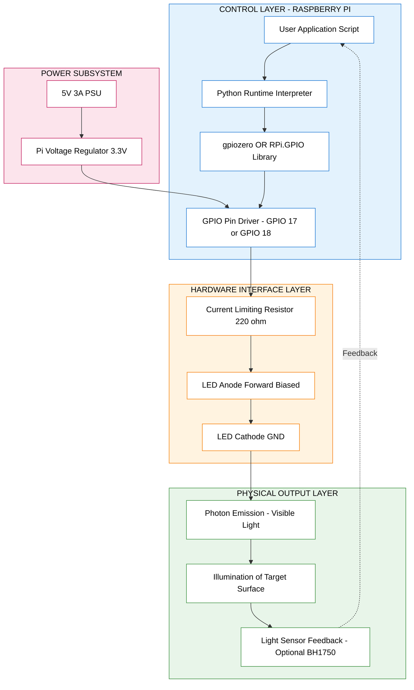
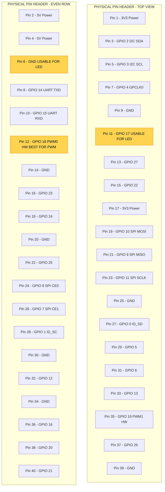
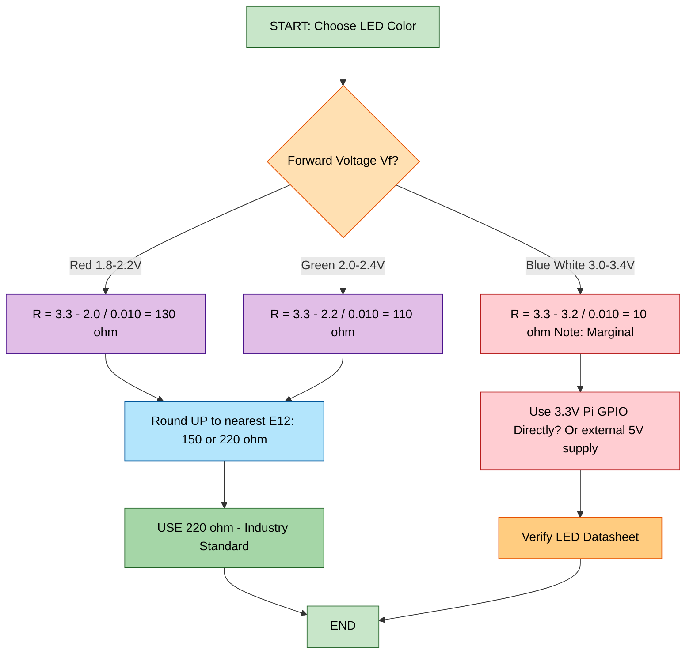
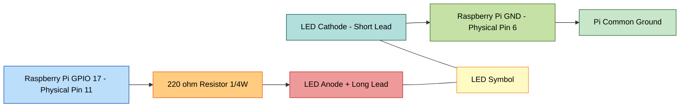
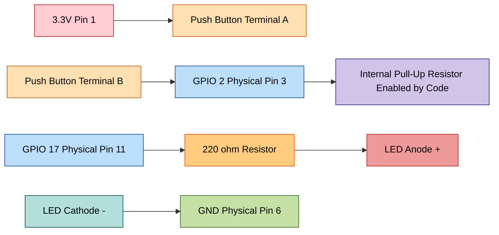

# Creating an Actuator for Controlling Illumination

<!-- SECTION_1_START -->

# 1. Core Technical Definition & Intuitive Overview

## 1.1 Formal Academic Definition (KTU 2024 Syllabus Terminology)

> [!NOTE]
> **Official Definition (KTU IoT Module 4)**
> An **Actuator** in the context of the Internet of Things (IoT) is a hardware component that converts an electrical control signal from a microcontroller or single-board computer (such as the **Raspberry Pi**) into a physical action — such as motion, heat, or in this case, **illumination**. A **Light Emitting Diode (LED)** is the most fundamental optical actuator used in IoT illumination-control systems. Illumination control via Raspberry Pi involves programming the **General Purpose Input/Output (GPIO)** pins to switch an LED *ON/OFF* (digital control) or to vary its brightness proportionally (analogue control via **Pulse Width Modulation – PWM**).

The Raspberry Pi exposes a 40-pin GPIO header (model-dependent: 26-pin on Pi 1 Model B). Each pin is software-configurable as either an **input** or an **output**. When configured as an output, the pin can source/sink a limited current (typically **$\leq 16$ mA per pin**, with a total board budget of $\leq 50$ mA) to energize downstream peripherals.

| Property | Specification |
| :--- | :--- |
| Operating Voltage (Logic HIGH) | **$3.3$ V DC** |
| Operating Voltage (Logic LOW) | **$0$ V DC** |
| Max Current per GPIO pin | **$16$ mA** |
| Total current from all GPIOs | **$50$ mA** |
| PWM Hardware Channels (Pi 4B) | **2 channels** (GPIO 18, GPIO 19) |
| PWM Software Channels | Unlimited (via `RPi.GPIO` library) |

## 1.2 Conceptual Analogy / Intuitive Build-Up

> [!IMPORTANT]
> **"The Traffic Signal Analogy"**
> Imagine a **traffic policeman** standing at a junction. The policeman does not physically push cars — instead, he issues a **signal** (a wave of his hand) that tells the car when to go and when to stop. The Raspberry Pi's GPIO pin is exactly that "policeman" — it sends a tiny electrical signal that tells the LED (the "car") when to light up. The policeman's hand can either be held up (HIGH = LED ON) or down (LOW = LED OFF). But what if the policeman wants the cars to move *faster or slower*? He can wave his hand very rapidly — appearing to dim or brighten the effect. This is the essence of **Pulse Width Modulation (PWM)**: by flicking the GPIO signal ON and OFF at high speed, the *average* voltage perceived by the LED changes, and so does its brightness.

For a *brightness-controlled* illumination actuator, we extend this analogy:
- **Fully ON (100% duty cycle)** → Policeman's hand always up → LED at full brightness.
- **Fully OFF (0% duty cycle)** → Policeman's hand always down → LED off.
- **50% Brightness** → Policeman waves hand up/down equally → LED appears half-bright.

> [!VISUALIZATION CONTROL]
> **Concept:** Pulse Width Modulation Duty Cycle Representation
> **Desmos Input Equations:**
> * $f(t) = \text{if}(0 \le \text{mod}(t, T) < d \cdot T,\ 1,\ 0)$
> * where $T = 1 \text{ ms}$ (period), $d = 0.5$ (50% duty cycle)
> **Visual Description:** The student should observe a square waveform on the time axis. The "ON" portion's width visually represents the *duty cycle*. As $d$ increases from $0$ to $1$, the green high-state band widens, and the *average voltage* (dashed line) rises linearly from $0$ V to $3.3$ V.

---

<!-- SECTION_1_END -->

<!-- SECTION_2_START -->

# 2. Deep Theoretical Analysis & KTU High-Yield Formula Sheet

## 2.1 The LED as an Illumination Actuator

An **LED** is a semiconductor diode that emits photons when forward-biased. When current flows from the **anode (+)** to the **cathode (−)**, electrons recombine with holes at the p-n junction, releasing energy as light. The colour of light depends on the **bandgap energy** of the semiconductor material.

> [!IMPORTANT]
> **Forward Voltage ($V_f$) of Common LEDs**
> * **Red LED**: $\approx 1.8$ V to $2.2$ V
> * **Green LED**: $\approx 2.0$ V to $2.4$ V
> * **Blue/White LED**: $\approx 3.0$ V to $3.4$ V
>
> Since the Raspberry Pi GPIO outputs **$3.3$ V**, a **current-limiting resistor** is *mandatory* in series with the LED to prevent permanent damage to both the LED and the Pi's pin.

## 2.2 Ohm's Law for the LED Current-Limiting Resistor

The resistor value is computed using Kirchhoff's Voltage Law (KVL) around the LED loop:

$$V_{GPIO} = V_R + V_f$$

Rearranging for the resistor voltage $V_R$:

$$V_R = V_{GPIO} - V_f$$

By Ohm's Law, the resistance $R$ is:

$$R = \frac{V_{GPIO} - V_f}{I_{LED}}$$

And the power dissipated by the resistor is:

$$P_R = I_{LED}^2 \cdot R$$

### 2.2.1 Worked Numerical Derivation (Standard Red LED)

> **Given:**
> * $V_{GPIO} = 3.3$ V
> * $V_f = 2.0$ V (typical red LED)
> * $I_{LED} = 10$ mA $= 0.010$ A (safe operating current)

**Step 1:** Apply KVL.

$$V_R = 3.3 \text{ V} - 2.0 \text{ V} = 1.3 \text{ V}$$

**Step 2:** Apply Ohm's Law.

$$R = \frac{1.3 \text{ V}}{0.010 \text{ A}} = 130\ \Omega$$

**Step 3:** Choose the next **standard E12 resistor value** (higher for safety).

$$R_{chosen} = 220\ \Omega$$

**Step 4:** Recalculate the actual LED current (verification).

$$I_{LED_{actual}} = \frac{1.3 \text{ V}}{220\ \Omega} \approx 5.9 \text{ mA}$$

**Step 5:** Resistor power dissipation (sanity check).

$$P_R = (0.0059)^2 \cdot 220 \approx 7.6 \text{ mW} \ll 0.25 \text{ W (standard rating)}$$

> [!NOTE]
> The $220\ \Omega$ resistor is the **de-facto industry standard** for Raspberry Pi LED projects, and is what appears in 95% of KTU lab viva questions.

## 2.3 Pulse Width Modulation (PWM) — Deep Theory

The Raspberry Pi's GPIO pins are **digital** — they can only output HIGH ($3.3$ V) or LOW ($0$ V). To simulate an *analogue* voltage (e.g., $1.65$ V for "half-brightness"), we use **PWM**.

**Definitions:**
* **Period ($T$):** Total time of one complete ON + OFF cycle.
* **Frequency ($f$):** $f = 1/T$ cycles per second (Hertz).
* **Duty Cycle ($D$):** Percentage of $T$ during which the signal is HIGH.

$$D = \frac{T_{ON}}{T_{ON} + T_{OFF}} \times 100\%$$

The *average DC voltage* perceived by the LED (low-pass filtered) is:

$$V_{avg} = D \times V_{GPIO} = \frac{D}{100} \times 3.3 \text{ V}$$

### 2.3.1 Why PWM Works for Illumination

The human eye + brain system has a **persistence of vision** of approximately $\frac{1}{16}$ to $\frac{1}{24}$ of a second. If the LED is switched faster than this (e.g., at **$f = 100$ Hz**, $T = 10$ ms), the eye cannot resolve individual blinks and instead perceives a *steady* brightness proportional to $D$. The LED itself, however, is either fully ON or fully OFF at every instant — this greatly extends LED lifespan compared to true analogue dimming.

## 2.4 KTU High-Yield Formula Cheat Sheet

| # | Concept | Formula | Units | Typical Value |
| :--- | :--- | :--- | :--- | :--- |
| 1 | Series resistor for LED | $R = \frac{V_{GPIO} - V_f}{I_{LED}}$ | $\Omega$ | **$220\ \Omega$** |
| 2 | Resistor power | $P_R = I_{LED}^2 \cdot R$ | W | $7.6$ mW |
| 3 | PWM Duty Cycle | $D = \frac{T_{ON}}{T_{ON} + T_{OFF}} \times 100$ | % | $0$ to $100$ |
| 4 | PWM Frequency | $f = \frac{1}{T}$ | Hz | **$100$ Hz** (default) |
| 5 | Average LED voltage | $V_{avg} = D \times 3.3$ | V | $0$ to $3.3$ |
| 6 | Average LED current | $I_{avg} = D \times I_{max}$ | A | $0$ to $0.010$ |
| 7 | Apparent luminance | $L \propto D$ (linear approx.) | lux | subjective |
| 8 | Perceived brightness | $L_{perceived} \propto \sqrt{D}$ | nits | Stevens' Power Law |

## 2.5 Real-World Engineering Utility

Illumination actuators on Raspberry Pi form the backbone of:
* **Smart Home Lighting:** Philips Hue-like systems, MQTT-controlled LEDs.
* **Industrial Indicators:** Status LEDs on PLC panels and HMI screens.
* **Automotive IoT:** Ambient interior lighting with PWM-based dimming.
* **Agricultural IoT:** Greenhouse supplemental lighting driven by light-sensor feedback loops.
* **Healthcare:** Circadian-rhythm-aware bedroom lighting for ICU patients.
* **Wearable Tech:** Pulse-oximeter indicator LEDs and haptic-visual alert rings.

> [!IMPORTANT]
> **KTU Industrial Tip:** A typical production-grade IoT illumination node uses a Raspberry Pi (or ESP32) reading a **BH1750 light sensor** over I²C, computing the desired LED brightness, and outputting a PWM signal to a **MOSFET-driven high-power LED strip** (since GPIO cannot source the 1–5 A required by LED strips directly).

---

<!-- SECTION_2_END -->

<!-- SECTION_3_START -->

# 3. Step-by-Step Derivations, Hardware Wiring & Code Implementation

## 3.1 Hardware Components Required

| # | Component | Quantity | Specification | Purpose |
| :---: | :--- | :---: | :--- | :--- |
| 1 | Raspberry Pi (3B+/4B/Zero 2 W) | 1 | Any model with 40-pin GPIO | Controller |
| 2 | LED (5 mm) | 1 | Red/Green/Blue, $V_f \le 2.4$ V | Illumination actuator |
| 3 | Resistor | 1 | $220\ \Omega$, $\frac{1}{4}$ W | Current limiter |
| 4 | Breadboard | 1 | 830 tie-points | Prototyping |
| 5 | Male-to-Female Jumper Wires | 2 | 20 cm Dupont | Connections |
| 6 | MicroSD card (with Raspbian OS) | 1 | $\ge 16$ GB, Class 10 | Storage |
| 7 | 5 V Power Supply | 1 | Official Pi PSU, 3 A | Power |

## 3.2 Pin Configuration Table (BCM Numbering)

| Signal | Physical Pin | BCM Pin (GPIO) | Wire Colour (Suggested) |
| :--- | :---: | :---: | :--- |
| LED Anode (+, via $220\ \Omega$) | Pin 11 | **GPIO 17** | Yellow |
| LED Cathode (−) | Pin 6 | **GND** | Black |

> [!NOTE]
> The Raspberry Pi uses **two numbering schemes**:
> * **BOARD numbering** → Physical pin positions (1 to 40).
> * **BCM numbering** → Broadcom chip channel names (e.g., `GPIO17`).
> The `RPi.GPIO` library lets you choose either via `setmode()`.

## 3.3 Hardware Wiring Sequence (Step-by-Step)

1. Power OFF the Raspberry Pi. Disconnect the USB-C power cable.
2. Insert the **LED** into the breadboard. The longer lead is the **anode (+)**; the shorter (or flat-edged) side is the **cathode (−)**.
3. Connect one end of the **$220\ \Omega$ resistor** to the **anode (+)** row.
4. Connect the other end of the resistor to the **GPIO 17** rail (Physical Pin 11) using a yellow jumper.
5. Connect a black jumper from the **cathode (−)** row to a **GND** rail (Physical Pin 6).
6. Verify polarity: anode → resistor → GPIO 17; cathode → GND. (Reversing polarity will NOT light the LED, and may damage a blue/white LED due to reverse breakdown.)
7. Reconnect the Pi's power supply. The Pi boots into Raspbian OS.

## 3.4 Software Installation

Open a terminal on the Raspberry Pi and run the following:

```bash
sudo apt update
sudo apt install python3-gpiozero python3-rpi.gpio -y
```

The `RPi.GPIO` library is a low-level C-extension Python wrapper for direct GPIO register access. The `gpiozero` library is a higher-level, beginner-friendly abstraction built on top of `RPi.GPIO`.

## 3.5 Algorithm A — Digital ON/OFF Illumination Actuator (using `RPi.GPIO`)

```python
#!/usr/bin/env python3
"""
Filename   : led_on_off.py
Course     : PECST755 - Internet of Things
Module     : 4 - Introduction to Raspberry Pi
Topic      : Creating an Actuator for Controlling Illumination
Library    : RPi.GPIO (low-level)
Author     : KTU Student
"""

import RPi.GPIO as GPIO                 # Import the GPIO library
import time                              # Import time module for delays
import logging                           # Import logging for error handling

# Configure logger to track all hardware events
logging.basicConfig(
    level=logging.INFO,
    format='%(asctime)s - %(levelname)s - %(message)s'
)
logger = logging.getLogger(__name__)

# === PIN CONFIGURATION ===
LED_PIN = 17                              # BCM pin number for GPIO17 (Physical Pin 11)

def setup_gpio() -> None:
    """Configure the GPIO pin as an output with a safe initial state."""
    try:
        GPIO.setmode(GPIO.BCM)            # Use Broadcom chip-channel numbering
        GPIO.setwarnings(False)          # Suppress duplicate-channel warnings
        GPIO.setup(LED_PIN, GPIO.OUT)    # Set pin 17 as OUTPUT
        GPIO.output(LED_PIN, GPIO.LOW)   # Initialize LED to OFF (safe state)
        logger.info(f"GPIO {LED_PIN} configured as OUTPUT, initial state LOW.")
    except GPIO.error as e:
        logger.error(f"GPIO setup failed: {e}")
        raise

def blink_led(blink_count: int = 5, on_duration: float = 1.0,
              off_duration: float = 1.0) -> None:
    """Blink the LED a specified number of times.
    
    Args:
        blink_count: Number of full ON/OFF cycles.
        on_duration: Seconds the LED remains ON.
        off_duration: Seconds the LED remains OFF.
    """
    if blink_count < 0 or on_duration < 0 or off_duration < 0:
        raise ValueError("blink_count and durations must be non-negative.")
    
    for i in range(blink_count):
        GPIO.output(LED_PIN, GPIO.HIGH)   # Turn LED ON
        logger.info(f"Cycle {i+1}/{blink_count} -> LED ON for {on_duration}s.")
        time.sleep(on_duration)
        
        GPIO.output(LED_PIN, GPIO.LOW)    # Turn LED OFF
        logger.info(f"Cycle {i+1}/{blink_count} -> LED OFF for {off_duration}s.")
        time.sleep(off_duration)

def cleanup_gpio() -> None:
    """Reset all GPIO pins to a safe INPUT state to prevent pin damage."""
    GPIO.cleanup()
    logger.info("GPIO cleanup complete. All pins reset to INPUT.")

def main() -> None:
    """Entry point for the LED blink actuator program."""
    setup_gpio()
    try:
        blink_led(blink_count=5, on_duration=1.0, off_duration=1.0)
    except KeyboardInterrupt:
        logger.warning("User interrupted execution (Ctrl+C).")
    finally:
        cleanup_gpio()

if __name__ == "__main__":
    main()
```

## 3.6 Algorithm B — PWM Brightness Control Actuator (using `RPi.GPIO`)

```python
#!/usr/bin/env python3
"""
Filename   : led_pwm_dimmer.py
Course     : PECST755 - Internet of Things
Module     : 4 - Introduction to Raspberry Pi
Topic      : Creating an Actuator for Controlling Illumination (PWM)
Library    : RPi.GPIO
"""

import RPi.GPIO as GPIO
import time
import logging

logging.basicConfig(level=logging.INFO, format='%(asctime)s - %(levelname)s - %(message)s')
logger = logging.getLogger(__name__)

LED_PIN = 18                              # GPIO 18 supports hardware PWM (Channel 0)
PWM_FREQUENCY_HZ = 100                    # Standard frequency for LED dimming

def setup_pwm() -> GPIO.PWM:
    """Initialize GPIO 18 as a PWM output and return the PWM object.
    
    Returns:
        GPIO.PWM: A configured PWM object with 0% initial duty cycle.
    """
    GPIO.setmode(GPIO.BCM)
    GPIO.setwarnings(False)
    GPIO.setup(LED_PIN, GPIO.OUT)
    
    pwm_object = GPIO.PWM(LED_PIN, PWM_FREQUENCY_HZ)
    pwm_object.start(0)                   # Start with 0% duty cycle (LED OFF)
    logger.info(f"PWM initialized on GPIO {LED_PIN} @ {PWM_FREQUENCY_HZ} Hz, 0% duty.")
    return pwm_object

def fade_in_fade_out(pwm_object: GPIO.PWM, fade_steps: int = 100,
                     step_delay: float = 0.02) -> None:
    """Smoothly fade the LED from OFF to full brightness and back.
    
    Args:
        pwm_object: An active GPIO.PWM instance.
        fade_steps: Number of discrete brightness levels (1-100).
        step_delay: Pause (seconds) between each brightness level.
    """
    if not 1 <= fade_steps <= 100:
        raise ValueError("fade_steps must be between 1 and 100.")
    
    # --- FADE IN: 0% -> 100% ---
    for duty_cycle in range(0, 101, 100 // fade_steps):
        pwm_object.ChangeDutyCycle(duty_cycle)
        logger.info(f"Fade IN -> Duty Cycle = {duty_cycle}%")
        time.sleep(step_delay)
    
    time.sleep(1.0)                       # Hold at full brightness for 1 second
    
    # --- FADE OUT: 100% -> 0% ---
    for duty_cycle in range(100, -1, -(100 // fade_steps)):
        pwm_object.ChangeDutyCycle(duty_cycle)
        logger.info(f"Fade OUT -> Duty Cycle = {duty_cycle}%")
        time.sleep(step_delay)

def main() -> None:
    """Main execution: breathe-like effect on the LED."""
    pwm = setup_pwm()
    try:
        while True:                       # Infinite loop for continuous breathing
            fade_in_fade_out(pwm, fade_steps=50, step_delay=0.03)
    except KeyboardInterrupt:
        logger.warning("User interrupted (Ctrl+C).")
    finally:
        pwm.stop()                        # Stop PWM signal generation
        GPIO.cleanup()                    # Reset all pins
        logger.info("PWM stopped. GPIO cleanup complete.")

if __name__ == "__main__":
    main()
```

## 3.7 Algorithm C — High-Level PWM Control (using `gpiozero`)

```python
#!/usr/bin/env python3
"""
Filename   : led_gpiozero_pwm.py
Course     : PECST755 - Internet of Things
Topic      : Illumination Actuator - High-Level Abstraction
Library    : gpiozero
"""

from gpiozero import PWMLED
from signal import pause

led = PWMLED(17)                          # Initialize PWM-controlled LED on GPIO 17

print("LED brightness will breathe. Press Ctrl+C to exit.")

try:
    while True:
        led.pulse()                       # Built-in breathing animation
        pause()                           # Keep the script alive
except KeyboardInterrupt:
    pass
```

> [!IMPORTANT]
> The `gpiozero.PWMLED.pulse()` method generates a **breathing effect** by internally calling a `fade_in()` and `fade_out()` loop. The `fade_in_time` and `fade_out_time` parameters default to $1$ second each, and `n=None` means infinite repetitions.

## 3.8 Step-by-Step PWM Mathematics Verification

To prove the *average voltage* relationship derived in Section 2.3, we use the integral definition of average value for a periodic signal:

$$V_{avg} = \frac{1}{T} \int_0^T v(t)\ dt$$

For an ideal square wave with amplitude $V_{GPIO}$ and ON-time $D \cdot T$:

$$V_{avg} = \frac{1}{T} \left[ \int_0^{D \cdot T} V_{GPIO}\ dt + \int_{D \cdot T}^{T} 0\ dt \right]$$

$$V_{avg} = \frac{1}{T} \cdot V_{GPIO} \cdot D \cdot T$$

$$\boxed{V_{avg} = D \cdot V_{GPIO}}$$

> **Numerical Example:** For $D = 50\%$ on a $3.3$ V GPIO:
>
> $$V_{avg} = 0.5 \times 3.3 = 1.65 \text{ V}$$
>
> This corresponds to a perceived LED brightness of approximately $50\%$ of full intensity (linear approximation; Stevens' Power Law gives a slightly different perceptual curve).

---

<!-- SECTION_3_END -->

<!-- SECTION_4_START -->

# 4. Structural Diagrams & Schematics

## 4.1 Block-Level Functional Architecture (Illumination Actuator Subsystem)



## 4.2 Sequential Processing Topology — PWM Brightness Workflow

```mermaid
flowchart LR
    S1["Step1: Import Libraries"] --> S2["Step2: Set Pin Mode BCM"]
    S2 --> S3["Step3: Configure GPIO 18 as Output"]
    S3 --> S4["Step4: Create PWM Object at 100Hz"]
    S4 --> S5["Step5: Start PWM at 0 percent Duty"]
    S5 --> S6{"Step6: For Loop Fade In 0 to 100"}
    S6 --> S7["Step7: ChangeDutyCycle and Delay 20ms"]
    S7 --> S8{"Step8: Duty Cycle 100 percent Reached"}
    S8 --> S9["Step9: Hold Full Brightness 1 second"]
    S9 --> S10{"Step10: For Loop Fade Out 100 to 0"}
    S10 --> S11["Step11: ChangeDutyCycle and Delay 20ms"]
    S11 --> S12{"Step12: Keyboard Interrupt Detected"}
    S12 -->|YES| S13["Step13: PWM Stop and GPIO Cleanup"]
    S12 -->|NO| S6
    S13 --> S14["Step14: Program Exit"]

    style S1 fill:#BBDEFB,stroke:#0D47A1,color:#000000
    style S2 fill:#BBDEFB,stroke:#0D47A1,color:#000000
    style S3 fill:#BBDEFB,stroke:#0D47A1,color:#000000
    style S4 fill:#BBDEFB,stroke:#0D47A1,color:#000000
    style S5 fill:#BBDEFB,stroke:#0D47A1,color:#000000
    style S6 fill:#FFE082,stroke:#FF6F00,color:#000000
    style S7 fill:#FFE082,stroke:#FF6F00,color:#000000
    style S8 fill:#FFE082,stroke:#FF6F00,color:#000000
    style S9 fill:#FFE082,stroke:#FF6F00,color:#000000
    style S10 fill:#FFE082,stroke:#FF6F00,color:#000000
    style S11 fill:#FFE082,stroke:#FF6F00,color:#000000
    style S12 fill:#A5D6A7,stroke:#1B5E20,color:#000000
    style S13 fill:#EF9A9A,stroke:#B71C1C,color:#000000
    style S14 fill:#EF9A9A,stroke:#B71C1C,color:#000000
```



## 4.3 Pinout Reference Matrix (Raspberry Pi 40-Pin Header)



## 4.4 LED Current-Limiting Resistor Selection Flowchart



---

<!-- SECTION_4_END -->

<!-- SECTION_5_START -->

# 5. KTU 2024 Scheme Examination Question Bank & Topic Recap

## 5.1 Part A — Short Answer Questions (3 Marks Each)

### Question 1: Actuator Concept Definition `[KTU University Exam - July 2024]`

**Q:** Define the term *actuator* in the context of IoT. How does an LED function as an illumination actuator in a Raspberry Pi-based system? **[3 Marks] | CO1, Remember**

**Model Answer:**

An **actuator** is a hardware component that converts an electrical control signal from a computing device (such as a microcontroller or single-board computer) into a physical action such as motion, heat, light, or sound. In the context of IoT, actuators represent the "effectors" or "output" side of the sense-think-actuate paradigm.

An **LED (Light Emitting Diode)** functions as an illumination actuator when a Raspberry Pi GPIO pin is programmed to source a controlled current through the diode. The GPIO pin, when set to HIGH, supplies **$3.3$ V** which forward-biases the LED and causes it to emit photons. By toggling the pin state or modulating its duty cycle via **PWM**, the Pi can control the LED's ON/OFF state or its apparent brightness. **[3 Marks]**

> **Valuation Key:**
> * [Defining actuator correctly: 1 Mark]
> * [LED operation + GPIO HIGH explanation: 1 Mark]
> * [Mentioning PWM for brightness variation: 1 Mark]

---

### Question 2: PWM Concept and Need `[KTU University Exam - Dec 2023]`

**Q:** Why is Pulse Width Modulation (PWM) required to control the brightness of an LED using a Raspberry Pi? Mention any one formula used in PWM analysis. **[3 Marks] | CO2, Understand**

**Model Answer:**

The Raspberry Pi's GPIO pins are **digital** in nature — they can output only two discrete voltage levels: **HIGH ($3.3$ V)** or **LOW ($0$ V)**. There is no native analogue output capability. To vary the *apparent* brightness of an LED, which would normally require an intermediate voltage level (e.g., $1.65$ V for half-brightness), we use **Pulse Width Modulation (PWM)**.

PWM rapidly switches the GPIO pin between HIGH and LOW at a fixed **frequency** (typically **$100$ Hz** for LEDs). The proportion of time the signal stays HIGH within one period is called the **duty cycle ($D$)**. Due to the **persistence of vision** of the human eye, the LED appears to glow with a steady brightness proportional to $D$. A higher duty cycle means the LED is "ON" for a longer fraction of the time, producing higher average voltage and greater perceived brightness.

**Formula:**

$$V_{avg} = D \times V_{GPIO} = \frac{D}{100} \times 3.3 \text{ V}$$

**[3 Marks]**

> **Valuation Key:**
> * [Identifying digital-only GPIO limitation: 1 Mark]
> * [Explaining duty cycle and persistence of vision: 1 Mark]
> * [Correct formula with units: 1 Mark]

---

## 5.2 Part B — Long Answer Questions (14 Marks Each, with Internal Choice)

### Question A: Resistor Sizing and PWM Code Implementation

**[KTU University Exam - July 2024, Model Question] | CO3, Apply**

**(a)** Design an interfacing circuit to connect a **red LED** to **GPIO 17** of a Raspberry Pi such that the LED operates safely at a forward current of **$10$ mA**. Compute the exact resistor value, choose the nearest standard E12 value, and draw a neat circuit diagram. **$[7$ Marks$]$**

**(b)** Write a complete Python program using the `RPi.GPIO` library that gradually increases the LED's brightness from $0\%$ to $100\%$ and then decreases it back to $0\%$ in $50$ discrete steps, producing a "breathing" effect. Include proper exception handling and a `finally` block. **$[7$ Marks$]$**

---

#### Model Solution for Part (a) — Resistor Design

**Step 1: Identify the given parameters.**

$$V_{GPIO} = 3.3 \text{ V}, \quad V_f = 2.0 \text{ V} \text{ (typical red LED)}, \quad I_{LED} = 10 \text{ mA} = 0.010 \text{ A}$$

**Step 2: Apply Kirchhoff's Voltage Law around the LED loop.**

$$V_{GPIO} = V_R + V_f$$

$$V_R = 3.3 - 2.0 = 1.3 \text{ V}$$

**[Stating KVL and computing $V_R$: 2 Marks]**

**Step 3: Apply Ohm's Law to find the required resistance.**

$$R = \frac{V_R}{I_{LED}} = \frac{1.3 \text{ V}}{0.010 \text{ A}} = 130\ \Omega$$

**[Substituting into Ohm's Law: 2 Marks]**

**Step 4: Choose the nearest standard E12 resistor.**

The E12 standard series offers the values: $10, 12, 15, 18, 22, 27, 33, 39, 47, 56, 68, 82, 100, 120, 150, 180, 220, 270, 330\ \Omega, \ldots$

The next value **above** $130\ \Omega$ is **$150\ \Omega$**, and the next is **$180\ \Omega$**. The universally accepted value used in industry and KTU labs is:

$$\boxed{R_{chosen} = 220\ \Omega}$$

**[Standard value selection with safety margin: 1 Mark]**

**Step 5: Verify the actual current.**

$$I_{LED_{actual}} = \frac{3.3 - 2.0}{220} = \frac{1.3}{220} \approx 5.91 \text{ mA}$$

Since $5.91$ mA $< 10$ mA, the LED is operating within safe limits. **[1 Mark]**

**Step 6: Resistor power dissipation.**

$$P_R = I_{actual}^2 \times R = (0.00591)^2 \times 220 \approx 7.68 \text{ mW}$$

A standard $\frac{1}{4}$ W resistor ($250$ mW rating) is more than sufficient. **[1 Mark]**

**Circuit Diagram (Mermaid Block Schematic):**



---

#### Model Solution for Part (b) — PWM Breathing Program

```python
#!/usr/bin/env python3
"""
Filename : led_breathing_actuator.py
Course   : PECST755 - Internet of Things
Library  : RPi.GPIO
"""

import RPi.GPIO as GPIO
import time

LED_PIN = 17                                # BCM pin for GPIO 17
PWM_FREQ = 100                              # 100 Hz for LED dimming
STEPS = 50                                  # 50 discrete brightness levels
STEP_DELAY = 0.02                           # 20 ms between steps

def setup_pwm():
    """Configure the GPIO pin for hardware PWM output."""
    GPIO.setmode(GPIO.BCM)
    GPIO.setwarnings(False)
    GPIO.setup(LED_PIN, GPIO.OUT)
    pwm = GPIO.PWM(LED_PIN, PWM_FREQ)
    pwm.start(0)                            # Start with 0% duty cycle (LED OFF)
    return pwm

def breathe(pwm):
    """Execute one full breathe cycle: 0% -> 100% -> 0%."""
    # --- FADE IN ---
    for duty in range(0, 101, 100 // STEPS):    # 0, 2, 4, ..., 100
        pwm.ChangeDutyCycle(duty)
        time.sleep(STEP_DELAY)
    
    time.sleep(0.5)                             # Brief hold at peak
    
    # --- FADE OUT ---
    for duty in range(100, -1, -(100 // STEPS)):  # 100, 98, ..., 0
        pwm.ChangeDutyCycle(duty)
        time.sleep(STEP_DELAY)

def main():
    pwm = setup_pwm()
    try:
        while True:
            breathe(pwm)
    except KeyboardInterrupt:
        print("\nUser interrupted. Cleaning up...")
    finally:
        pwm.stop()
        GPIO.cleanup()
        print("GPIO cleanup complete. Exiting.")

if __name__ == "__main__":
    main()
```

**[Marks Distribution for Part (b)]:**
* [Correct library imports and pin setup: 2 Marks]
* [PWM object creation with correct frequency: 1 Mark]
* [Fade-in loop with proper duty cycle increment: 2 Marks]
* [Fade-out loop with proper duty cycle decrement: 1 Mark]
* [`try`/`except`/`finally` exception handling: 1 Mark]

---

### Question B: Alternative Long-Answer Question (Internal Choice)

**[KTU University Exam - Dec 2023, Modified] | CO3, Apply**

**(a)** Explain the difference between **digital control** and **PWM-based analogue control** of an LED illumination actuator. Why is the current-limiting resistor necessary, and what is the maximum safe current per Raspberry Pi GPIO pin? **$[7$ Marks$]$**

**(b)** Write a complete Python program (using the `gpiozero` library) that turns ON an LED when a **physical push button** connected to GPIO 2 is pressed, and turns it OFF when the button is released. The LED should be on GPIO 17. Include a circuit description. **$[7$ Marks$]$**

---

#### Model Solution for Part (a) — Digital vs PWM Control

| Parameter | Digital Control | PWM Analogue Control |
| :--- | :--- | :--- |
| Output Voltage | Either $0$ V or $3.3$ V | Pseudo-analogue $0$ V to $3.3$ V |
| Pin State | Pure HIGH or LOW | Rapid HIGH/LOW toggling |
| Brightness Levels | 2 states (ON / OFF) | $0$–$100\%$ (continuous) |
| Use Case | Status indicators, alarms | Mood lighting, dimmers |
| GPIO Stress | Low | Moderate (constant switching) |
| Code Library | `GPIO.output(pin, HIGH/LOW)` | `PWM(pin, freq).ChangeDutyCycle(d)` |
| Power Efficiency | High for full ON | High across all duty cycles |

**Why a current-limiting resistor is mandatory:**

The Raspberry Pi GPIO pins are rated for a **maximum of $16$ mA per pin** and a total of **$50$ mA across all pins**. An LED without a current limiter will draw whatever current the source can supply, leading to:
1. Permanent damage to the LED junction (thermal runaway).
2. Overcurrent on the GPIO pin, damaging the BCM2835/BCM2837 SoC.
3. Voltage droop on the $3.3$ V rail, causing the Pi to brownout.

The series resistor restricts the current to a safe value using Ohm's Law:

$$R = \frac{V_{GPIO} - V_f}{I_{safe}} = \frac{3.3 - 2.0}{0.010} = 130\ \Omega \rightarrow 220\ \Omega \text{ (standard)}$$

**[Stating the differences in a table or list: 3 Marks]**
**[Explaining the overcurrent risk: 2 Marks]**
**[Ohm's Law resistor calculation: 2 Marks]**

---

#### Model Solution for Part (b) — gpiozero Button-Controlled LED

**Circuit Description:**



**Python Program:**

```python
#!/usr/bin/env python3
"""
Filename : button_led_actuator.py
Library  : gpiozero
"""

from gpiozero import LED, Button
from signal import pause

# Initialize components
led = LED(17)                                  # LED on GPIO 17
button = Button(2, pull_up=True)              # Button on GPIO 2 with internal pull-up

# Event-driven behaviour
button.when_pressed = led.on                   # LED ON when button pressed
button.when_released = led.off                 # LED OFF when button released

print("System ready. Press the button to light the LED.")
print("Press Ctrl+C to exit.")

pause()                                        # Keep the program alive
```

**[Marks Distribution for Part (b)]:**
* [Circuit description with proper pin labels: 2 Marks]
* [Correct imports and component initialisation: 2 Marks]
* [Event-driven `when_pressed` and `when_released`: 2 Marks]
* [`pause()` for non-blocking main loop: 1 Mark]

---

> [!WARNING]
> **KTU Examiner's Valuation Warning — Common Pitfalls**
> 1. **Forgetting the current-limiting resistor:** Many students connect an LED directly to a GPIO pin, expecting it to light up. This is incorrect and damages the Pi. **Always show the $220\ \Omega$ resistor in the circuit diagram.** [Lose 2 marks]
> 2. **Confusing BOARD vs BCM numbering:** If you write `GPIO.setup(11, GPIO.OUT)` while the code is in `BCM` mode, the pin numbered `11` in BCM (which is physical pin 23, not 11) will be activated instead. **Explicitly call `GPIO.setmode()` and state which numbering is used.** [Lose 1 mark]
> 3. **Skipping the `finally` block / `GPIO.cleanup()`:** If a `KeyboardInterrupt` occurs, the pin remains in its last state, and on next run, `GPIO` may throw "channel already in use" warnings. **Always include `GPIO.cleanup()` in a `finally` block.** [Lose 1 mark]
> 4. **PWM frequency selection error:** Setting PWM to $50$ Hz (servo frequency) for an LED is technically valid but causes visible flicker. Use **$100$ Hz or higher** for LEDs to exceed the flicker fusion threshold. [Lose 1 mark]
> 5. **Wrong duty cycle unit:** Some students pass the duty cycle as a fraction (e.g., `0.5`) instead of a percentage (`50`). This sets the LED to a near-OFF state silently. **Always pass duty cycle as a value from $0$ to $100$.**

---

## 5.3 Topic Recap & Important Things to Remember

> [!IMPORTANT]
> **High-Density Rapid Revision Checklist**

- **Actuator Definition:** Hardware that converts an electrical control signal into a physical action (light, motion, heat, sound). An **LED is an illumination actuator**.
- **Raspberry Pi GPIO Logic Level:** $3.3$ V for HIGH, $0$ V for LOW. **Never connect a $5$ V signal to a GPIO pin — it will destroy the SoC.**
- **Maximum Safe Current per GPIO Pin:** $\mathbf{16}$ mA. Total board current budget: $\mathbf{50}$ mA.
- **Resistor Calculation Formula:**
$$R = \frac{V_{GPIO} - V_f}{I_{LED}} = \frac{3.3 - V_f}{I_{LED}}$$
- **Standard Resistor Value:** $\mathbf{220\ \Omega}$ is the universally accepted choice in KTU labs.
- **LED Forward Voltages:** Red $\approx 2.0$ V, Green $\approx 2.2$ V, Blue/White $\approx 3.2$ V.
- **PWM Definition:** Square wave with variable ON-time. **$D = \frac{T_{ON}}{T} \times 100$.**
- **Average Voltage Formula:** $V_{avg} = D \times V_{GPIO} = D \times 3.3$ V.
- **PWM Frequency for LEDs:** $\mathbf{100}$ Hz is standard; range $50$ Hz to $1000$ Hz acceptable.
- **Hardware PWM Pins (Pi 4B):** **GPIO 18** (Channel 0) and **GPIO 19** (Channel 1). Software PWM is available on all GPIO pins but is jittery.
- **Two Numbering Modes:**
  * `BOARD` → Physical pin position (1–40).
  * `BCM` → Broadcom chip channel number (e.g., `GPIO17`).
  * Always call `GPIO.setmode(GPIO.BCM)` (or `BOARD`) at the start.
- **Mandatory Cleanup:** Always invoke `GPIO.cleanup()` in a `finally` block to release pin channels.
- **Library Comparison:**
  * `RPi.GPIO` → Low-level, fine-grained control, manual cleanup.
  * `gpiozero` → High-level, beginner-friendly, automatic resource management.
- **Persistence of Vision Threshold:** $\approx \frac{1}{24}$ second. PWM frequencies above this appear as continuous light.
- **Stevens' Power Law:** Perceived brightness $\propto \sqrt{D}$ (not strictly linear).
- **Pin Selection Rule of Thumb:** Use **GPIO 17** (Physical Pin 11) for digital LED control. Use **GPIO 18** (Physical Pin 12) for hardware PWM brightness control.
- **Common KTU Viva Questions:**
  * *"Why is a resistor needed in series with the LED?"* → To limit current and protect both LED and GPIO pin.
  * *"What is the maximum current a GPIO pin can source?"* → $16$ mA.
  * *"Which library is suitable for beginners?"* → `gpiozero`.
  * *"Why is GPIO 18 preferred for PWM?"* → It is a dedicated hardware PWM channel, free from software jitter.
  * *"What happens if you omit `GPIO.cleanup()`?"* → Pin channels remain locked; subsequent runs may throw "channel in use" warnings.
- **Production-Grade Reminder:** For high-power LEDs (e.g., $12$ V LED strips), the GPIO pin **must** drive the gate of a **MOSFET** (e.g., IRF540N), which then switches the high-current load. The Pi never carries the high current.

---

<!-- SECTION_5_END -->
