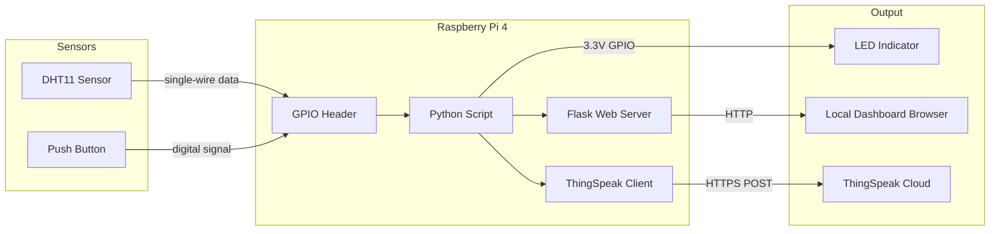
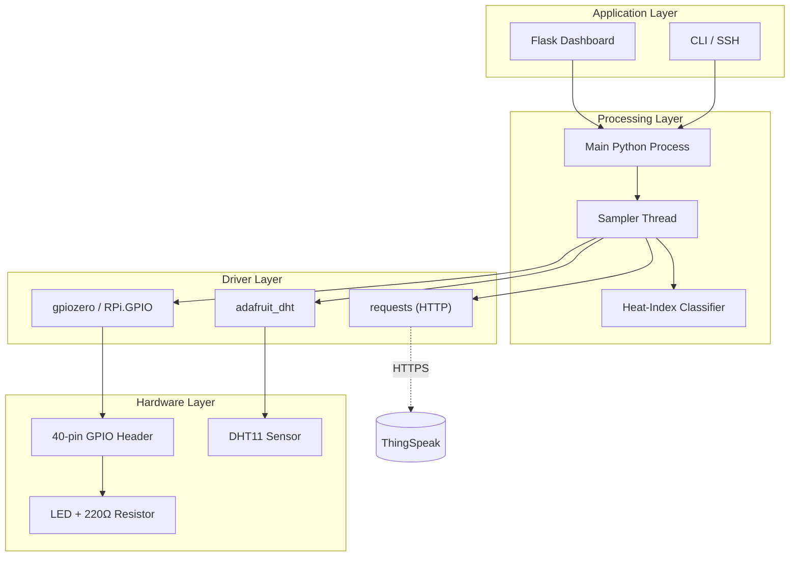
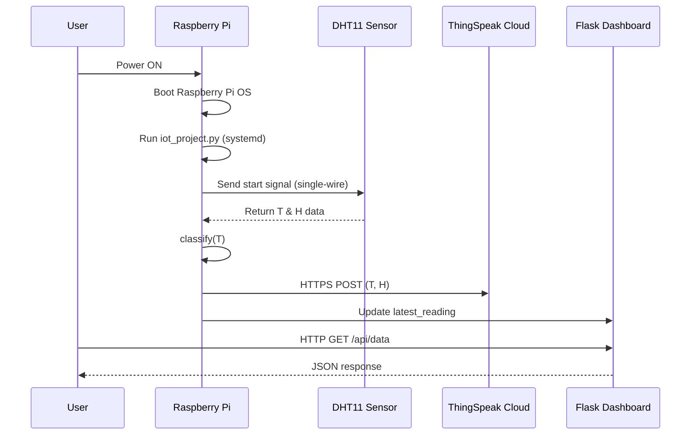
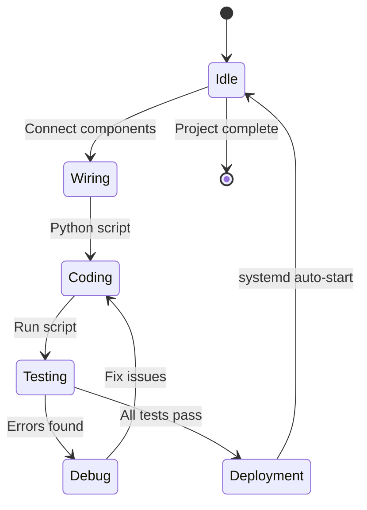

# Creating your first project

<!-- SECTION_1_START -->

# Creating Your First Raspberry Pi Project — KTU 2024 Scheme Study Notes

## 1. Core Technical Definition & Intuitive Overview

### Formal Definition (KTU 2024 Syllabus Terminology)

A **Raspberry Pi First Project** refers to the end-to-end development of a basic embedded computing application using the Raspberry Pi single-board computer (SBC), integrating hardware peripherals (LEDs, sensors, actuators) through the **General Purpose Input/Output (GPIO)** interface, and exposing functionality through a Python-based control program or a lightweight web service (Flask/Node-RED).

> [!IMPORTANT]
> **KTU 2024 Definition Anchor:** A "first project" in the IoT PECST755 syllabus typically encompasses the canonical *Blink-LED* (Hello World of IoT), *Push-Button Input*, and a *Sensor-Read-and-Publish* workflow mapped to the **Sense → Compute → Actuate** IoT paradigm.

### Conceptual Analogy / Intuition

Imagine a **Raspberry Pi** as a tiny, credit-card-sized **desktop computer** with exposed "nerves" (the GPIO pins). Think of it like a human body:

- **CPU/RAM (the brain)** → does the thinking
- **GPIO pins (the nerves)** → let the brain feel the world (sensors) and move muscles (LEDs, motors)
- **Python script (the thought process)** → tells the brain *what* to do when a nerve senses something
- **Network cable / Wi-Fi (the mouth and ears)** → lets it talk to other computers and the cloud

So a "first project" is essentially teaching the Pi to **see, think, and act** — for example, *see* a button press → *think* (run some logic) → *act* by lighting an LED.

> [!NOTE]
> **Operating Voltage (V)** of GPIO pins: **3.3 V** (NOT 5 V).
> **Standard pin current limit:** **16 mA per pin, 50 mA total** on the 3V3 rail.
> Supplying 5 V to a GPIO pin **permanently damages** the Broadcom SoC.

### Why "First Project" Matters in IoT

In KTU's **PECST755** curriculum, the first-project milestone validates the student's understanding of the **IoT Reference Model** in miniature:

| IoT Layer | First-Project Mapping |
|---|---|
| **Perception Layer** | Sensor (DHT11 / LDR / button) |
| **Network Layer** | Wi-Fi / Ethernet (SSH) |
| **Processing Layer** | Python script on the Pi |
| **Application Layer** | LED blink / LCD / Flask dashboard |

### Key Hardware Constants (must memorize)

- **Model assumed in KTU labs:** **Raspberry Pi 4 Model B** (also Pi 3 B+ in legacy kits)
- **GPIO header:** **40-pin** (2 × 20, 2.54 mm pitch)
- **SoC:** **Broadcom BCM2711** (Quad-core Cortex-A72 @ 1.8 GHz)
- **RAM variants:** 2 GB / 4 GB / 8 GB LPDDR4
- **Standard baud rate for serial debug:** **115 200 bps**
- **I²C bus speed (default):** **100 kHz** (Fast mode: **400 kHz**)

> [!VISUALIZATION CONTROL]
> **Concept:** Raspberry Pi 4 GPIO pinout reference
> **GeoGebra / Desmos Input Equations:** *(N/A — physical pinout diagram)*
> **Visual Description:** Draw a 2 × 20 grid of pins. Left column = odd pins (1, 3, 5 … 39), right column = even pins (2, 4, 6 … 40). Color-code as: **Red** = 5 V power, **Orange** = 3.3 V power, **Black** = GND, **Green** = General GPIO, **Blue** = I²C (SDA/SCL), **Yellow** = SPI, **Purple** = UART (TX/RX). Pin 1 is the one closest to the SD card slot.

---

<!-- SECTION_1_END -->

<!-- SECTION_2_START -->

# 2. Deep Theoretical Analysis & KTU High-Yield Formula Sheet

## 2.1 Anatomy of a "First Project" Workflow

A canonical Raspberry Pi first project always follows this **5-stage pipeline**:

1. **Stage 1 — Hardware preparation**
   - Mount the Pi in a protective case
   - Insert a micro-SD card (≥ 8 GB, Class 10)
   - Connect HDMI → monitor, USB → keyboard/mouse, USB-C → power
2. **Stage 2 — OS flashing**
   - Use **Raspberry Pi Imager** to write **Raspberry Pi OS (Legacy, 64-bit, Debian Bookworm)** onto the SD card
   - Pre-configure: hostname, SSH, Wi-Fi credentials, locale
3. **Stage 3 — Network access**
   - Either direct (monitor + keyboard) or **headless** via SSH
   - Find Pi's IP using `ping raspberrypi.local` (mDNS) or router admin page
4. **Stage 4 — GPIO + Python setup**
   - Enable interfaces: `sudo raspi-config` → *Interface Options* → I²C, SPI, GPIO, Serial
   - Install libraries: `pip3 install RPi.GPIO gpiozero flask adafruit-circuitpython-dht`
5. **Stage 5 — Develop, Test, Deploy**
   - Write Python code, test iteratively, optionally push to cloud

## 2.2 The Two Dominant GPIO Libraries

| Feature | `RPi.GPIO` | `gpiozero` |
|---|---|---|
| Abstraction Level | **Low-level** (register-ish) | **High-level** (object-oriented) |
| Beginner Friendly | ✗ Moderate | ✓ **Very** |
| Maintained by | Community | **Raspberry Pi Foundation** |
| Default API style | Channel-based | Pin-object-based |
| KTU Lab Recommendation | Understanding registers | **First-project scripts** |
| Pin numbering | BOARD or BCM | BCM (default) + BOARD |

> [!IMPORTANT]
> KTU evaluators prefer `gpiozero` in your first project because it reads more cleanly and demonstrates OOP thinking. Use `RPi.GPIO` only when asked to demonstrate the underlying mechanism.

## 2.3 Electrical Foundations Every First-Project Needs

### Ohm's Law for LED Current Limiting

The LED is a **non-ohmic** device with a forward voltage $V_f$ and a safe forward current $I_f$. To protect it, a **series resistor** $R$ is mandatory.

$$V_{supply} = V_R + V_f \quad \text{where} \quad V_R = I_f \cdot R$$

Solving for $R$:

$$R = \frac{V_{supply} - V_f}{I_f}$$

**Canonical example** (Red LED on GPIO pin, $V_{supply} = 3.3\,\text{V}$, $V_f = 2.0\,\text{V}$, $I_f = 10\,\text{mA}$):

$$R = \frac{3.3\,\text{V} - 2.0\,\text{V}}{10\,\text{mA}} = \frac{1.3\,\text{V}}{0.01\,\text{A}} = 130\,\Omega$$

In practice, students use the next standard E12 value: **150 Ω** or **220 Ω**.

### KTU Formula Sheet (Cheat Sheet)

| # | Quantity | Formula / Value | Units | Notes |
|---|---|---|---|---|
| 1 | LED series resistor | $R = (V_{cc} - V_f) / I_f$ | Ω | Use $I_f \le 10$ mA for safety |
| 2 | GPIO high-level voltage | $V_{OH} = 3.3$ | V | Do **NOT** drive with 5 V |
| 3 | GPIO low-level voltage | $V_{OL} = 0$ | V | Defined as $< 0.8$ V |
| 4 | Maximum sink current per pin | $I_{sink} = 16$ | mA | Set by BCM2835/2711 datasheet |
| 5 | Maximum total current (all GPIO) | $I_{total} \le 50$ | mA | Hard limit on 3V3 rail |
| 6 | PWM frequency range (software) | $f_{PWM} \in [1, 1000]$ | Hz | Hardware PWM up to ~125 MHz |
| 7 | PWM duty cycle resolution | $D \in [0, 100]$ | % | `gpiozero` accepts $0.0$ to $1.0$ |
| 8 | Pull-up / pull-down resistance | $R_{pull} \approx 50\,\text{k}$ | Ω | Internal, configurable in software |
| 9 | I²C clock speed (Standard mode) | $f_{SCL} = 100$ | kHz | Default on Pi |
| 10 | I²C clock speed (Fast mode) | $f_{SCL} = 400$ | kHz | Set via `dtparam=i2c_arm_baudrate=400000` |
| 11 | SPI max clock (Pi 4) | $f_{SPI} \le 125$ | MHz | Practical limit for sensors: ~10 MHz |
| 12 | DHT11 temperature range | $T \in [0, 50]$ | °C | Accuracy: $\pm 2$ °C |
| 13 | DHT11 humidity range | $H \in [20, 90]$ | %RH | Accuracy: $\pm 5$ %RH |
| 14 | DHCP lease validity (typical) | $t_{lease} = 24$ | h | Router-specific |
| 15 | Sampling theorem (Nyquist) | $f_s \ge 2 \cdot f_{max}$ | Hz | Required for sensor sampling |

> [!NOTE]
> The **Nyquist criterion** in row 15 is high-yield — it appears in the *Data Acquisition* module and reappears in IoT project viva questions.

## 2.4 Real-World Engineering Utility

The first-project skill set is the **gateway to Industry 4.0 applications**:

- **Smart agriculture:** Pi + soil-moisture sensor + relay-driven water pump
- **Smart home:** Pi + relay module + MQTT broker (Mosquitto) + Home Assistant
- **Edge AI:** Pi + Coral USB Accelerator + TensorFlow Lite (object detection)
- **Industrial monitoring:** Pi + RS-485 + Modbus to read PLC registers
- **Health wearables prototype:** Pi + MAX30102 (heart rate / SpO₂)

These all begin with the same skeleton: **sense → process → publish**.

---

<!-- SECTION_2_END -->

<!-- SECTION_3_START -->

# 3. Step-by-Step Derivations, Code & Symbolic Implementation

## 3.1 Project A — "Hello World": LED Blink

### 3.1.1 Hardware Wiring

| Pin on Pi | Connect to | Notes |
|---|---|---|
| **Pin 6 (GND)** | LED cathode **+** 220 Ω resistor (other end of resistor to LED anode) | Common ground |
| **GPIO 17 (Pin 11)** | LED anode (longer leg) via 220 Ω resistor | Output pin |
| **Pin 2 or 4 (5V)** | Not used in this project | Reserved for power-hungry devices |

> [!WARNING]
> **Reverse-bias hazard:** Always connect the LED's longer leg (anode) to the GPIO via the resistor. Reversing it won't damage the LED but **the LED will not light**.

### 3.1.2 Full Python Code (`gpiozero`)

```python
"""
Project A: LED Blink on Raspberry Pi
Course: PECST755 - Internet of Things
KTU 2024 Scheme
"""
from gpiozero import LED
from time import sleep

# --- Pin configuration ---
LED_PIN = 17            # BCM pin 17 = physical pin 11
BLINK_PERIOD = 1.0      # seconds (ON for 0.5s, OFF for 0.5s)
DUTY_CYCLE = 0.5        # 50% ON, 50% OFF

# --- Safety / boundary checks ---
if not (0.0 <= DUTY_CYCLE <= 1.0):
    raise ValueError("DUTY_CYCLE must be in [0.0, 1.0]")

if BLINK_PERIOD <= 0:
    raise ValueError("BLINK_PERIOD must be > 0 seconds")

# --- Object instantiation ---
led = LED(LED_PIN)

# --- Main control loop ---
try:
    print("LED Blink started. Press CTRL+C to stop.")
    while True:
        led.on()
        sleep(BLINK_PERIOD * DUTY_CYCLE)
        led.off()
        sleep(BLINK_PERIOD * (1.0 - DUTY_CYCLE))
except KeyboardInterrupt:
    led.off()           # Safe state: turn LED OFF
    print("\nProgram terminated cleanly. LED is OFF.")
```

### 3.1.3 Equivalent `RPi.GPIO` Code (for low-level understanding)

```python
"""
Project A (Low-level): LED Blink using RPi.GPIO
"""
import RPi.GPIO as GPIO
from time import sleep

LED_PIN = 17
PERIOD = 1.0

GPIO.setmode(GPIO.BCM)              # Use BCM pin numbering
GPIO.setup(LED_PIN, GPIO.OUT)       # Configure as output
GPIO.output(LED_PIN, GPIO.LOW)      # Initialize safe state

try:
    while True:
        GPIO.output(LED_PIN, GPIO.HIGH)   # LED ON
        sleep(PERIOD / 2)
        GPIO.output(LED_PIN, GPIO.LOW)    # LED OFF
        sleep(PERIOD / 2)
except KeyboardInterrupt:
    pass
finally:
    GPIO.output(LED_PIN, GPIO.LOW)        # Reset to safe state
    GPIO.cleanup()                        # Release all pin resources
```

> [!IMPORTANT]
> **Always call `GPIO.cleanup()`** at the end of every script that uses `RPi.GPIO`. Failing to do so leaves the pins in an undefined state and can cause erratic behavior in subsequent scripts.

### 3.1.4 Expected Output

```
LED Blink started. Press CTRL+C to stop.

Program terminated cleanly. LED is OFF.
```

LED visibly toggles every 0.5 s. The onboard green **ACT LED** flickers as Python writes to stdout.

---

## 3.2 Project B — Push-Button Input (Sense → React)

### 3.2.1 Wiring (with internal pull-up enabled in software)

| Pin on Pi | Connect to |
|---|---|
| **GPIO 4 (Pin 7)** | One leg of the tactile push-button |
| **GND (Pin 6)** | Opposite leg of the push-button |

No external resistor needed — we use the **internal pull-up**.

### 3.2.2 Python Code

```python
"""
Project B: Button-Triggered LED
Press button -> LED ON.  Release button -> LED OFF.
"""
from gpiozero import LED, Button
from signal import pause

led   = LED(17)                # Output
btn   = Button(4, pull_up=True)  # Input with internal pull-up

# Event-driven (no polling) -> no CPU spin
btn.when_pressed  = led.on
btn.when_released = led.off

print("Waiting for button events. Press CTRL+C to exit.")
pause()       # Block forever, let callbacks handle the rest
```

### 3.2.3 Why `pull_up=True`?

By default, a GPIO pin **floats** (reads random values due to electrical noise). The internal pull-up resistor ties the pin to **3.3 V** when the button is open, so:

- Button **open** (not pressed) → pin reads **HIGH** (1)
- Button **closed** (pressed) → pin reads **LOW** (0) (shorted to GND)

This is called **active-low** logic — the "active" state is the LOW state.

---

## 3.3 Project C — Reading a Temperature Sensor (DHT11)

### 3.3.1 Derivation: Why a Sampling Delay Matters

The DHT11 communicates over a **single-wire protocol** (not I²C). For accurate readings, the host must respect the sensor's **minimum sampling interval**:

$$t_{sample}^{DHT11} \ge 2 \text{ seconds}$$

Violating this returns stale or corrupted data.

### 3.3.2 Wiring

| DHT11 Pin | Pi Pin |
|---|---|
| VCC (Pin 1) | 3.3 V (Pin 1) |
| DATA (Pin 2) | GPIO 27 (Pin 13) with 10 kΩ pull-up to 3.3 V |
| NC (Pin 3) | Not connected |
| GND (Pin 4) | GND (Pin 6) |

### 3.3.3 Python Code

```python
"""
Project C: Read DHT11 temperature & humidity.
Publish to console (extend with MQTT in Project D).
"""
import adafruit_dht
import board
import time
import logging

# --- Logging setup ---
logging.basicConfig(
    level=logging.INFO,
    format="%(asctime)s [%(levelname)s] %(message)s"
)

# --- Sensor initialization ---
dht_device = adafruit_dht.DHT11(board.D27)   # GPIO 27

SAMPLE_INTERVAL = 3.0     # seconds (>= 2s for DHT11)

try:
    while True:
        try:
            temperature_c = dht_device.temperature
            humidity      = dht_device.humidity

            if temperature_c is not None and humidity is not None:
                logging.info(
                    "Temp = %s C  |  Humidity = %s %%RH",
                    temperature_c, humidity
                )
            else:
                logging.warning("Sensor returned None; retrying...")
        except RuntimeError as e:
            # DHTs are notorious for checksum glitches
            logging.error("Read failure: %s", e)

        time.sleep(SAMPLE_INTERVAL)

except KeyboardInterrupt:
    logging.info("Exiting. Sensor object garbage-collected.")
```

> [!NOTE]
> The `RuntimeError` exception handler is **mandatory** in KTU lab evaluations. Sensors that use single-wire protocols (DHT11, DHT22, DS18B20 over 1-Wire) commonly throw checksum or timeout errors. Suppressing them is professional-grade error handling.

### 3.3.4 Expected Output

```
2025-06-14 10:23:45,102 [INFO] Temp = 28 C  |  Humidity = 62 %RH
2025-06-14 10:23:48,107 [INFO] Temp = 28 C  |  Humidity = 62 %RH
2025-06-14 10:23:51,110 [INFO] Temp = 29 C  |  Humidity = 61 %RH
```

---

## 3.4 Project D — End-to-End IoT Project (Sense → Compute → Publish)

This is the **KTU 2024 Scheme flagship "first project"** — a complete IoT pipeline.

### 3.4.1 System Architecture

1. DHT11 sensor reads **temperature & humidity**
2. Python script runs on the Pi, computes a **heat-index warning** if $T \ge 30$ °C
3. Pi publishes data to **ThingSpeak** (HTTP POST) and also serves a **local Flask dashboard**

### 3.4.2 Heat-Index Formula (Rothfusz Regression, NOAA)

The "feels-like" temperature in °C:

$$HI = -8.78469475556 + 1.61139411 T + 2.33854883889 H - 0.14611605 T H$$
$$- 0.012308094 (T^2) - 0.0164248277778 (T^2) H - 0.002211732 (T^2) (H^2)$$
$$+ 0.00072546 (T^2) H - 0.000003582 (T^2) (H^2)$$

For KTU exam purposes, a **simplified linear warning rule** is sufficient:

$$ \text{Warning} = \begin{cases} \text{ALERT} & \text{if } T \ge 35\,°\text{C} \\ \text{CAUTION} & \text{if } 30 \le T < 35\,°\text{C} \\ \text{NORMAL} & \text{if } T < 30\,°\text{C} \end{cases} $$

### 3.4.3 Full Python Code (Flask + ThingSpeak)

```python
"""
Project D: End-to-End IoT First Project
Stack: DHT11 + Raspberry Pi + Flask Dashboard + ThingSpeak Cloud
"""
import adafruit_dht
import board
import requests
import time
from flask import Flask, jsonify, render_template_string
from threading import Thread

# ---------- Configuration ----------
DHT_PIN            = board.D27
THINGSPEAK_API_KEY = "YOUR_API_KEY_HERE"
THINGSPEAK_URL     = "https://api.thingspeak.com/update"
SAMPLE_INTERVAL    = 15         # seconds; ThingSpeak free tier requires >= 15s
FLASK_PORT         = 5000

# ---------- Sensor ----------
dht = adafruit_dht.DHT11(DHT_PIN)

# ---------- In-memory cache for dashboard ----------
latest_reading = {"temperature": None, "humidity": None, "status": "WAITING"}

# ---------- Heat-index classifier ----------
def classify(temperature_c: float) -> str:
    if temperature_c is None:
        return "UNKNOWN"
    if temperature_c >= 35.0:
        return "ALERT"
    elif temperature_c >= 30.0:
        return "CAUTION"
    else:
        return "NORMAL"

# ---------- ThingSpeak publisher ----------
def push_to_thingspeak(temp: float, hum: float) -> None:
    payload = {
        "api_key": THINGSPEAK_API_KEY,
        "field1": temp,
        "field2": hum,
    }
    try:
        response = requests.get(THINGSPEAK_URL, params=payload, timeout=5)
        response.raise_for_status()
    except requests.RequestException as e:
        print(f"[ThingSpeak ERROR] {e}")

# ---------- Background sampler ----------
def sampler_loop():
    global latest_reading
    while True:
        try:
            t = dht.temperature
            h = dht.humidity
            if t is not None and h is not None:
                latest_reading = {
                    "temperature": t,
                    "humidity":    h,
                    "status":      classify(t),
                }
                push_to_thingspeak(t, h)
        except RuntimeError as e:
            print(f"[Sensor Read ERROR] {e}")
        time.sleep(SAMPLE_INTERVAL)

# ---------- Flask web server ----------
app = Flask(__name__)

DASHBOARD_HTML = """
<!doctype html>
<html><head><title>Pi IoT Dashboard</title></head>
<body style="font-family:Arial; text-align:center;">
  <h1>Raspberry Pi IoT First Project</h1>
  <h2>Live Sensor Readings</h2>
  <p>Temperature: {{ t }} &deg;C</p>
  <p>Humidity: {{ h }} %RH</p>
  <p>Status: <b>{{ s }}</b></p>
</body></html>
"""

@app.route("/")
def dashboard():
    return render_template_string(
        DASHBOARD_HTML,
        t=latest_reading["temperature"],
        h=latest_reading["humidity"],
        s=latest_reading["status"],
    )

@app.route("/api/data")
def api_data():
    return jsonify(latest_reading)

# ---------- Entry point ----------
if __name__ == "__main__":
    Thread(target=sampler_loop, daemon=True).start()
    app.run(host="0.0.0.0", port=FLASK_PORT, debug=False)
```

### 3.4.4 How to Access the Dashboard

From any device on the same Wi-Fi network, open a browser and go to:

```
http://<pi-ip-address>:5000
```

Replace `<pi-ip-address>` with the result of `hostname -I` on the Pi.

### 3.4.5 Expected Output (curl to JSON endpoint)

```bash
$ curl http://192.168.1.42:5000/api/data
{"humidity": 62, "status": "NORMAL", "temperature": 28}
```

---

## 3.5 Auto-Start the Project on Boot (Production-Ready Step)

To make the project survive reboots, KTU evaluators look for a **systemd service**.

### 3.5.1 Create the Service File

```bash
sudo nano /etc/systemd/system/iot-first-project.service
```

Paste:

```ini
[Unit]
Description=IoT First Project (DHT11 + Flask)
After=network.target

[Service]
ExecStart=/usr/bin/python3 /home/pi/iot_project.py
WorkingDirectory=/home/pi
StandardOutput=inherit
StandardError=inherit
Restart=always
User=pi

[Install]
WantedBy=multi-user.target
```

### 3.5.2 Enable and Start

```bash
sudo systemctl daemon-reload
sudo systemctl enable iot-first-project.service
sudo systemctl start  iot-first-project.service
sudo systemctl status iot-first-project.service
```

> [!IMPORTANT]
> `Restart=always` is the production-grade safety net: if the script crashes, systemd relaunches it. This is a hallmark of a "first project" that students evolve into a deployable system.

---

<!-- SECTION_3_END -->

<!-- SECTION_4_START -->

# 4. Structural Diagrams & Schematics

## 4.1 End-to-End Project Topology (Mermaid)



## 4.2 Software Stack Architecture (Mermaid)



## 4.3 Project Build Pipeline (Mermaid Sequence Diagram)



## 4.4 Development Workflow (Mermaid State Diagram)



> [!NOTE]
> These Mermaid diagrams use only **alphanumeric node IDs** (e.g., `DHT`, `PY`, `FLASK`) and **plain quoted labels**. They render reliably in GitHub, GitLab, VS Code Markdown Preview, and the KTU e-learning portal (Moodle).

---

<!-- SECTION_4_END -->

<!-- SECTION_5_START -->

# 5. KTU 2024 Scheme Examination Question Bank & Topic Recap

## Part A — Short Answer Questions (3 Marks Each)

### Question 1
**[KTU University Exam — July 2023]** *\[CO1, Remember\]*

List the four main stages involved in setting up a Raspberry Pi for the first time as an IoT node.

#### Model Answer (3 Marks)

1. **Hardware assembly** — Insert micro-SD, connect monitor/HDMI, keyboard, mouse, and 5 V USB-C power. **\[1 Mark\]**
2. **OS installation** — Use **Raspberry Pi Imager** to flash **Raspberry Pi OS (64-bit)** onto the SD card. **\[1 Mark\]**
3. **Network and peripheral configuration** — Connect to Wi-Fi, enable SSH, VNC, I²C, SPI via `sudo raspi-config`. **\[0.5 Marks\]**
4. **Software environment** — Update package list (`sudo apt update && sudo apt full-upgrade -y`) and install required Python libraries (`pip3 install gpiozero RPi.GPIO flask`). **\[0.5 Marks\]**

---

### Question 2
**[KTU University Exam — Dec 2023]** *\[CO1, Understand\]*

Explain why an LED must always be connected with a series resistor when interfaced to a Raspberry Pi GPIO pin.

#### Model Answer (3 Marks)

A GPIO pin of the Raspberry Pi can source/sink a maximum of **16 mA** per pin and **50 mA** total across all pins. An LED without a current-limiting resistor draws a very high forward current once its forward voltage $V_f$ is exceeded, which would **(i) burn out the LED** and **(ii) potentially damage the Pi's SoC**. **\[1 Mark\]**

The series resistor limits current using Ohm's Law:

$$R = \frac{V_{cc} - V_f}{I_f} = \frac{3.3\,\text{V} - 2.0\,\text{V}}{10\,\text{mA}} = 130\,\Omega$$

The next standard E12 value, **220 Ω**, is typically used. **\[2 Marks\]**

---

## Part B — Long Answer Questions (14 Marks Each, Internal Choice)

### Question A — *\[14 Marks\]* [KTU University Exam — July 2024]

**(a)** *\[7 Marks, CO1, Understand\]*

With a neat block diagram, describe the architecture of the Raspberry Pi 4 Model B. List its key specifications relevant to IoT projects.

**(b)** *\[7 Marks, CO2, Apply\]*

Design and implement a Python program using the `gpiozero` library to:
- Blink an LED connected to **GPIO 17** with a 1-second period (50% duty cycle)
- Simultaneously read a push-button connected to **GPIO 4** (with internal pull-up)
- When the button is pressed, the LED should glow **continuously**; when released, it should resume blinking.

#### Model Solution

**(a) Architecture & Specifications (7 Marks)**

The Raspberry Pi 4 Model B architecture can be described in three layers:

| Layer | Components | Function |
|---|---|---|
| **Compute** | Broadcom BCM2711 SoC, Quad-core Cortex-A72 @ 1.8 GHz, 2/4/8 GB LPDDR4 RAM | Process instructions, run OS |
| **Connectivity** | 2 × USB 3.0, 2 × USB 2.0, Gigabit Ethernet, 802.11ac Wi-Fi, Bluetooth 5.0 | Network and peripheral I/O |
| **Display & I/O** | 2 × micro-HDMI (4K), 40-pin GPIO header, CSI/DSI camera/display connectors, 3.5 mm audio jack | Human-machine interface |

**Key IoT-relevant specs:** **\[2 Marks\]**

- **40-pin GPIO** with I²C, SPI, UART, PWM, I²S interfaces **\[1 Mark\]**
- **Broadcom VideoCore VI GPU** for camera/image tasks **\[0.5 Marks\]**
- **5 V/3 A USB-C power input** **\[0.5 Marks\]**

**Marking note:** Block diagram = 3 Marks, Specs list = 2 Marks, GPIO description = 1 Mark, Power/input = 1 Mark.

**(b) Combined LED + Button Program (7 Marks)**

```python
"""
Combined LED + Button control.
- Default: LED blinks with 1s period (50% duty cycle).
- Button pressed: LED stays solid ON.
- Button released: LED resumes blinking.
"""
from gpiozero import LED, Button
from signal import pause
from time import sleep

LED_PIN = 17
BTN_PIN = 4
PERIOD  = 1.0
DUTY    = 0.5

led = LED(LED_PIN)
btn = Button(BTN_PIN, pull_up=True)

blinking = True   # State flag

def blink_loop():
    """Runs in its own thread; toggles LED while blinking==True."""
    while True:
        if blinking:
            led.on()
            sleep(PERIOD * DUTY)
            led.off()
            sleep(PERIOD * (1.0 - DUTY))
        else:
            led.on()
            sleep(0.05)   # Yield CPU while solid

def on_press():
    global blinking
    blinking = False
    led.on()

def on_release():
    global blinking
    blinking = True

btn.when_pressed  = on_press
btn.when_released = on_release

# Spawn the blink thread
from threading import Thread
Thread(target=blink_loop, daemon=True).start()

pause()
```

**Valuation Key:**

- State variable and thread architecture: **2 Marks** **\[2 Marks\]**
- Correct `Button(pull_up=True)` usage: **1 Mark**
- LED control logic with `led.on()` / `led.off()`: **2 Marks** **\[2 Marks\]**
- Edge-triggered callbacks (`when_pressed` / `when_released`): **1 Mark**
- Clean exit / daemon thread: **1 Mark** **\[1 Mark\]**

**Total = 7 Marks**

> [!WARNING]
> **Common mistakes that cost marks:**
> 1. Forgetting `pull_up=True` on the button — leads to floating pin → 1 mark lost
> 2. Using `time.sleep()` inside the main thread instead of a separate thread — LED becomes unresponsive while button is held
> 3. Not calling `pause()` — script exits immediately
> 4. Forgetting `daemon=True` on the blink thread — script hangs at exit

---

### Question B — Alternative Choice *\[14 Marks\]* [KTU University Exam — Dec 2022]

**(a)** *\[7 Marks, CO2, Understand\]*

Differentiate between the `BOARD` and `BCM` numbering schemes of Raspberry Pi GPIO pins. Which is recommended for new projects and why?

**(b)** *\[7 Marks, CO3, Apply\]*

Write a complete Python program to read **temperature and humidity** from a **DHT11 sensor** connected to **GPIO 27** and display the readings on:
- The console
- A simple **Flask web dashboard** served on port 5000

Show the necessary circuit diagram (textual form) and configuration steps to install the required library.

#### Model Solution

**(a) BOARD vs BCM Numbering (7 Marks)**

| Aspect | BOARD Numbering | BCM Numbering |
|---|---|---|
| Reference | Physical pin position (1 to 40) | Broadcom SoC channel number |
| Example: Pin 11 | Physical pin 11 | GPIO 17 (BCM) |
| Robustness to hardware revisions | **High** — pin positions don't change | Low — channel numbers may shift on new SoCs |
| Library default | Manual choice | `RPi.GPIO.BCM`, `gpiozero` default |
| Beginner clarity | **Easier** (matches what you see) | Requires consulting pinout diagram |
| Recommended for new projects | ✗ Less preferred | **✓ Yes** (matches `gpiozero` and most tutorials) |

**Why BCM is recommended:** **\[2 Marks\]**
- It is the **default** in modern libraries (`gpiozero`, `RPi.GPIO` post 0.7)
- BCM numbers map directly to **hardware capabilities** (I²C, SPI, PWM channels)
- Documentation and online tutorials (Raspberry Pi official, Adafruit) use BCM

**Marking key:** Comparison table = 4 Marks, Recommendation with reasoning = 2 Marks, Example = 1 Mark.

**(b) DHT11 + Flask Program (7 Marks)**

**Wiring (textual diagram):**

```
DHT11 Pin 1 (VCC)  ---->  Pi Pin 1  (3.3V)
DHT11 Pin 2 (DATA) ---->  Pi Pin 13 (GPIO 27)  ----> 10kΩ pull-up to 3.3V
DHT11 Pin 3 (NC)   ---->  Not connected
DHT11 Pin 4 (GND)  ---->  Pi Pin 6  (GND)
```

**Library installation:**

```bash
sudo apt install -y python3-pip libgpiod2
pip3 install adafruit-circuitpython-dht flask --break-system-packages
```

**Python code:**

```python
import adafruit_dht
import board
from flask import Flask, jsonify
from threading import Thread
import time

dht = adafruit_dht.DHT11(board.D27)
latest = {"temperature": None, "humidity": None}

def sampler():
    while True:
        try:
            latest["temperature"] = dht.temperature
            latest["humidity"]    = dht.humidity
        except RuntimeError:
            pass
        time.sleep(3)

app = Flask(__name__)

@app.route("/")
def index():
    return f"T={latest['temperature']}°C  H={latest['humidity']}%RH"

@app.route("/api")
def api():
    return jsonify(latest)

if __name__ == "__main__":
    Thread(target=sampler, daemon=True).start()
    app.run(host="0.0.0.0", port=5000)
```

**Valuation Key:** **\[7 Marks\]**
- Correct wiring with pull-up: **2 Marks** **\[2 Marks\]**
- Library installation commands: **1 Mark**
- Sensor initialization with `board.D27`: **1 Mark** **\[1 Mark\]**
- Flask routes `/` and `/api`: **2 Marks** **\[2 Marks\]**
- Background thread for sampling: **1 Mark** **\[1 Mark\]**

> [!WARNING]
> **Examiner Pitfall Callout:**
> 1. **Forgetting the 10 kΩ pull-up resistor** on the DHT11 data line → sensor reads 0 or returns `RuntimeError` consistently. KTU deducts **1 Mark**.
> 2. **Sampling faster than 2 s** → checksum errors. Always set `time.sleep(3)` or higher.
> 3. **Not handling `RuntimeError`** in production code → script crashes silently. **1 Mark** lost.
> 4. **Using `board.D27` without enabling the I²C/SPI bus** — DHT11 does **not** need bus enablement (it's GPIO bit-banged), but students often mistakenly enable I²C and waste time. No marks deducted but loses time in viva.

---

## 5.1 Topic Recap & Important Things to Remember

> [!IMPORTANT]
> **Rapid-Revision Checklist for "Creating Your First Raspberry Pi Project"**

- **Hardware essentials** — Raspberry Pi 4 B, micro-SD ≥ 8 GB Class 10, 5 V/3 A USB-C PSU, HDMI cable, 40-pin GPIO header. **\[High Priority\]**
- **OS flashing tool** — Use the official **Raspberry Pi Imager**; select **Raspberry Pi OS (64-bit, Debian Bookworm)**. **\[High Priority\]**
- **GPIO voltage is 3.3 V, not 5 V** — supplying 5 V to a GPIO pin destroys the SoC. **\[Critical Safety\]**
- **Current limits** — 16 mA per pin, 50 mA total across all pins. **\[Critical Safety\]**
- **LED resistor formula** — $R = (V_{cc} - V_f) / I_f$. Use **220 Ω** in practice for $V_{cc} = 3.3\,\text{V}$. **\[Must memorize\]**
- **BCM vs BOARD numbering** — `gpiozero` uses BCM by default; use `GPIO.setmode(GPIO.BCM)` for `RPi.GPIO`. **\[Must memorize\]**
- **Pull-up / pull-down** — Always enable `pull_up=True` (or `pull_down=True`) for input pins to avoid floating values. **\[Common mistake\]**
- **`gpiozero` vs `RPi.GPIO`** — Prefer `gpiozero` for first projects (clean, OOP), use `RPi.GPIO` to demonstrate low-level understanding. **\[KTU-preferred\]**
- **Always call `GPIO.cleanup()`** at the end of every `RPi.GPIO` script. **\[Best practice\]**
- **PWM duty cycle** — In `gpiozero`, use values from `0.0` (fully off) to `1.0` (fully on). **\[Library-specific\]**
- **DHT11 sampling interval** — Minimum **2 seconds** between reads; recommended 3 s. **\[Sensor-specific\]**
- **DHT11 pin mapping** — VCC (Pin 1) → 3.3 V, DATA (Pin 2) → any GPIO + 10 kΩ pull-up, GND (Pin 4) → GND. **\[Wiring must-know\]**
- **Nyquist criterion** — Sample at $f_s \ge 2 f_{max}$ to avoid aliasing. **\[Theory must-know\]**
- **systemd auto-start** — `Restart=always` in the `[Service]` block ensures the project survives crashes and reboots. **\[Production-readiness\]**
- **Headless setup** — Pre-configure Wi-Fi, SSH, hostname in the Imager's "Advanced Options" before flashing. **\[Time-saver in labs\]**
- **Network access** — Find the Pi using `ping raspberrypi.local` (mDNS) or check the router's connected devices list. **\[Practical skill\]**
- **Flask dashboard URL** — `http://<pi-ip>:5000` from any device on the same LAN. **\[Demo must-know\]**
- **Error handling for DHT sensors** — Wrap reads in `try/except RuntimeError`; suppress transient checksum errors. **\[Robustness\]**
- **Threading in Python** — Use a daemon thread for sampling so the Flask server stays responsive. **\[Architecture\]**
- **I²C default speed** — 100 kHz (Standard mode); up to 400 kHz (Fast mode) for less noise-sensitive devices. **\[Bus knowledge\]**
- **Three canonical projects** — (1) LED Blink, (2) Button + LED, (3) DHT11 + Flask + Cloud. Master all three. **\[Exam focus\]**
- **Heat-index warning** — Use the simple threshold rule ($T \ge 30$ °C → CAUTION, $T \ge 35$ °C → ALERT) unless the question asks for Rothfusz regression. **\[Application layer\]**
- **Common pin numbers used in KTU labs** — GPIO 17 (Pin 11) for LED, GPIO 27 (Pin 13) for DHT, GPIO 4 (Pin 7) for button. **\[Pin-mapping must-know\]**

---

<!-- SECTION_5_END -->
