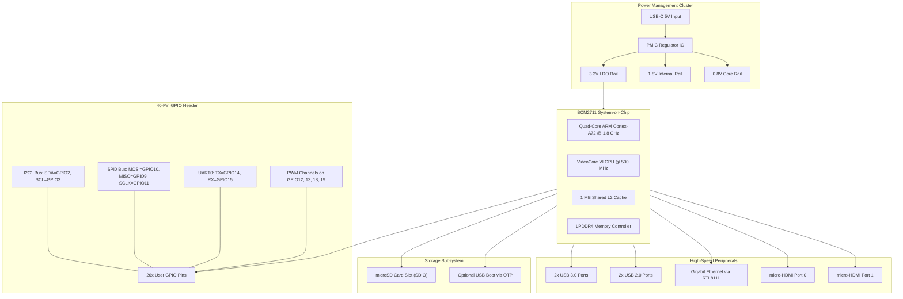
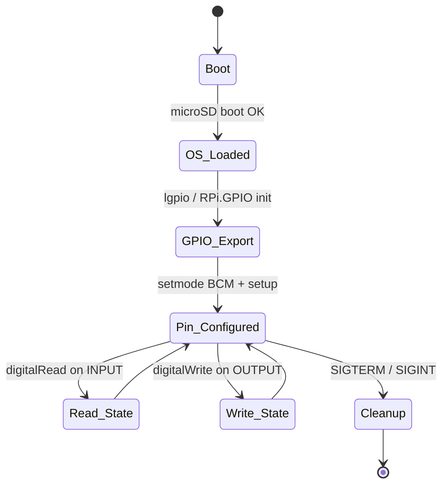

# Introduction to Raspberry Pi

<!-- SECTION_1_START -->
# Introduction to Raspberry Pi

## 1.1 Formal Definition (KTU 2024 Syllabus Terminology)

**Raspberry Pi** is a series of low-cost, credit-card sized **Single-Board Computers (SBCs)** developed by the **Raspberry Pi Foundation** (a UK-based charity founded in 2009). It integrates a **Broadcom System-on-Chip (SoC)** containing an **ARM Cortex-A series central processing unit**, a **VideoCore graphics processing unit**, on-chip **RAM**, and a rich set of peripheral interfaces (**GPIO**, $I^2C$, **SPI**, **UART**, **HDMI**, **USB**, **Ethernet**) onto a single printed circuit board, making it a complete programmable computing platform capable of running a full **Linux-based operating system** (typically Raspberry Pi OS / Raspbian).

> [!IMPORTANT]
> **KTU 2024 Syllabus Highlight:** Raspberry Pi is positioned in Module 4 as a *physical computing and edge-device platform* for IoT. The examiner expects you to know the **SoC architecture**, **GPIO pin classification**, **board-level interfacing**, and a working knowledge of **Python-based peripheral control**.

> [!NOTE]
> **Standard Reference Parameters (Raspberry Pi 4 Model B – the most common KTU-referenced variant):**
> - **SoC:** Broadcom **BCM2711**
> - **CPU:** Quad-core **ARM Cortex-A72 (ARMv8)** @ **1.8 GHz**
> - **GPU:** Broadcom **VideoCore VI**
> - **RAM:** 2 / 4 / 8 GB **LPDDR4**
> - **GPIO Voltage:** **3.3 V logic** (NOT 5 V tolerant)
> - **Power Input:** **5 V DC** via **USB Type-C** connector

---

## 1.2 Conceptual Analogy — The "Mini-Computer Inside a Wallet"

Imagine you shrunk an entire desktop computer — CPU, RAM, graphics card, USB ports, network card, and disk slot — and pressed it into a board the size of a **debit card** that costs less than a pizza. That is a Raspberry Pi.

- **The SoC** is the *brain + memory + graphics* glued into one silicon die (like a fully-packed sandwich).
- **The GPIO header** is the Pi's *arm and hand* — those 40 little metal pins let it physically *touch* the real world: blink LEDs, read sensors, drive motors.
- **The microSD card** is its *hard drive* — it stores the operating system, your Python code, and your data.
- **The 5 V power input** is the *heartbeat* — without it, the board is just an ornament.

In an IoT architecture, the Raspberry Pi typically plays the role of an **edge gateway** or **local processing node** — it gathers data from sensors, runs local analytics, and pushes refined information to the cloud.

> [!VISUALIZATION CONTROL]
> **Concept:** Raspberry Pi 4 Board — Physical Component Layout (Top View)
> **GeoGebra / Desmos Input Equations:**
> * `Board_Width = 85.6 mm`
> * `Board_Length = 56.5 mm`
> * `GPIO_Rectangle = polygon((13, 6), (40, 6), (40, 11), (13, 11))`
> * `USB_Stacks = (52, 22) to (62, 38)`
> * `HDMI_Ports = (66, 18) and (66, 26)`
> * `SoC_Position = (32, 30)`  *(heat-sink mounted here)*
> **Visual Description:** A horizontal rectangle 85.6 mm × 56.5 mm showing the SoC near the center (covered by a heat-sink on real boards), two stacked USB 3.0 ports on one edge, two stacked USB 2.0 ports, a 40-pin GPIO header along the top edge, two micro-HDMI ports, an RJ-45 Ethernet jack, a USB-C power inlet, and a microSD card slot on the underside.

---

## 1.3 Why Raspberry Pi Matters in IoT (Contextual Hook)

The Internet of Things needs three things at the **edge**: **sensing**, **computation**, and **connectivity**. While micro-controllers like **Arduino UNO** are excellent for sensing and low-power actuation, they lack the horsepower to run a full operating system, host a **web server**, process images, or speak **MQTT/CoAP** natively. The Raspberry Pi bridges this gap — it has the muscle of a desktop and the I/O of a microcontroller, all in IoT-friendly form factor.

> [!TIP]
> **One-line examiner memory aid:** *"Pi = Linux + ARM + GPIO = Edge Computing."*
<!-- SECTION_1_END -->

<!-- SECTION_2_START -->
# 2. Deep Theoretical Analysis — Architecture, Components & Formula Sheet

## 2.1 Functional Architecture of the Raspberry Pi

The Raspberry Pi is best understood as a **layered architecture** where the SoC sits at the top of a pyramid, interfacing outward to user-facing peripherals.

| Layer | Component | Function |
|---|---|---|
| **L1 — Processing Core** | ARM Cortex-A72 CPU | Executes OS instructions, runs user code |
| **L1 — Graphics Core** | VideoCore VI GPU | Handles HDMI output, OpenGL, H.265 decode |
| **L2 — Memory Subsystem** | LPDDR4 RAM | Volatile working memory for OS + processes |
| **L3 — Power & Clock** | PMIC + Crystal Oscillator | Regulates 5 V → 3.3 V, 1.8 V, 0.8 V rails |
| **L4 — Storage** | microSD slot (or USB boot) | Persistent OS + filesystem |
| **L5 — High-Speed I/O** | USB 3.0 / USB 2.0 / Ethernet | Peripherals and wired networking |
| **L5 — Display I/O** | 2 × micro-HDMI | Dual 4K display output |
| **L6 — General I/O** | 40-pin GPIO header | Digital I/O, $I^2C$, SPI, UART, PWM |
| **L6 — Camera/Display** | CSI-2 / DSI flex connectors | Camera Module, official touchscreen |

---

## 2.2 The BCM2711 System-on-Chip (SoC) — Internal Block Diagram

The BCM2711 is a **quad-core 64-bit ARM Cortex-A72** cluster wired to a **VideoCore VI** GPU via an internal **AMBA AXI bus fabric**. Key parameters:

- **CPU cores:** 4 × Cortex-A72, **out-of-order execution**, **superscalar**
- **L1 cache:** 32 KB I-cache + 32 KB D-cache **per core**
- **L2 cache:** **1 MB shared** across all four cores
- **Cache line size:** **64 bytes** (standard for ARMv8)
- **SDRAM interface:** **LPDDR4** up to **4 GB / 8 GB**
- **GPU clock:** up to **500 MHz**
- **Fabric clock:** typically **400 MHz**

### 2.2.1 Performance Estimation (KTU-style numerical)

A common KTU question: *"Compute the theoretical memory bandwidth of the Pi 4's LPDDR4 interface."*

**LPDDR4 parameters** (for the 4 GB / 8 GB Pi 4):
- Bus width: **32 bits** (per channel)
- Data rate: **3200 MT/s** (mega-transfers per second)

The **theoretical peak bandwidth** is computed as:

$$
BW = \frac{Bus\_Width \times Data\_Rate}{8}
$$

$$
BW = \frac{32 \times 3200}{8} \; \text{MB/s}
$$

$$
BW = 12{,}800 \; \text{MB/s} = 12.8 \; \text{GB/s}
$$

This is why the Pi 4 can drive **dual 4K displays** without choking on memory traffic.

---

## 2.3 The 40-Pin GPIO Header — Complete Classification

The GPIO (General-Purpose Input/Output) header is the Pi's interface to the physical world. **Every student must memorize the pin map** — this is high-frequency examiner territory.

| Pin # | Pin Name | Physical Pin # | Pin # | Pin Name | Physical Pin # |
|---|---|---|---|---|---|
| **Power Rails** |  |  |  |  |  |
| 1 | **3.3 V** | (1) | 2 | **5 V** | (2) |
| 3 | GPIO2 (SDA1) | (3) | 4 | **5 V** | (4) |
| 5 | GPIO3 (SCL1) | (5) | 6 | **GND** | (6) |
| 7 | GPIO4 (GPCLK0) | (7) | 8 | GPIO14 (TXD0) | (8) |
| 9 | GND | (9) | 10 | GPIO15 (RXD0) | (10) |
| 11 | GPIO17 | (11) | 12 | GPIO18 (PWM0) | (12) |
| 13 | GPIO27 | (13) | 14 | GND | (14) |
| 15 | GPIO22 | (15) | 16 | GPIO23 | (16) |
| 17 | 3.3 V | (17) | 18 | GPIO24 | (18) |
| 19 | GPIO10 (MOSI) | (19) | 20 | GND | (20) |
| 21 | GPIO9 (MISO) | (21) | 22 | GPIO25 | (22) |
| 23 | GPIO11 (SCLK) | (23) | 24 | GPIO8 (CE0) | (24) |
| 25 | GND | (25) | 26 | GPIO7 (CE1) | (26) |
| 27 | GPIO0 (ID_SD) | (27) | 28 | GPIO1 (ID_SC) | (28) |
| 29 | GPIO5 | (29) | 30 | GND | (30) |
| 31 | GPIO6 | (31) | 32 | GPIO12 (PWM0) | (32) |
| 33 | GPIO13 (PWM1) | (33) | 34 | GND | (34) |
| 35 | GPIO19 (PWM1) | (35) | 36 | GPIO16 | (36) |
| 37 | GPIO26 | (37) | 38 | GPIO20 | (38) |
| 39 | GND | (39) | 40 | GPIO21 | (40) |

### 2.3.1 Alternate-Function Pin Mapping (KTU High-Yield)

| Function | GPIO Pins (Board Numbers) |
|---|---|
| **$I^2C$ (SDA/SCL)** | GPIO2 (3), GPIO3 (5) |
| **SPI0 (MOSI/MISO/SCLK/CE0/CE1)** | GPIO10 (19), GPIO9 (21), GPIO11 (23), GPIO8 (24), GPIO7 (26) |
| **UART0 (TXD/RXD)** | GPIO14 (8), GPIO15 (10) |
| **PWM0** | GPIO12 (32), GPIO18 (12) |
| **PWM1** | GPIO13 (33), GPIO19 (35) |
| **PCM / $I^2S$** | GPIO18, GPIO19, GPIO20, GPIO21 |

> [!CAUTION]
> **Voltage Warning:** Pi GPIO is **3.3 V logic only**. Feeding a **5 V signal** into a Pi GPIO pin will permanently damage the SoC. **No exception. No debate.** This is a top-3 killer of Pi boards in lab sessions.

---

## 2.4 KTU High-Yield Formula Sheet

| # | Formula / Parameter | Expression | Unit / Value |
|---|---|---|---|
| 1 | Pi 4 CPU clock | $f_{CPU}$ | **1.8 GHz** |
| 2 | Pi 4 L2 cache | $C_{L2}$ | **1 MB** |
| 3 | LPDDR4 data rate | $DR$ | **3200 MT/s** |
| 4 | Memory bandwidth | $BW = (Bus\_Width \times DR)/8$ | **12.8 GB/s** |
| 5 | GPIO logic high | $V_{IH}$ | **3.3 V** |
| 6 | GPIO drive current (per pin) | $I_{GPIO,max}$ | **16 mA** (recommended ≤ 8 mA) |
| 7 | Total GPIO current (all pins) | $I_{sum,max}$ | **50 mA** |
| 8 | Pull-up / pull-down resistance | $R_{pu}, R_{pd}$ | **\vert 50 k\Omega \vert** (typical) |
| 9 | PWM frequency range | $f_{PWM}$ | **\vert 0.1 Hz – 125 MHz \vert** |
| 10 | UART baud rate (typical) | $B_{UART}$ | **9600 / 115200 bps** |
| 11 | Power input voltage | $V_{in}$ | **5.0 V DC ± 0.25 V** |
| 12 | Power input current (recommended PSU) | $I_{in}$ | **3.0 A** (for Pi 4) |
| 13 | GPIO count (usable) | $N_{GPIO}$ | **26 user-accessible** (out of 40) |
| 14 | Pull-up / pull-down enable control | — | **Internal** (configurable in code) |

---

## 2.5 Engineering Utility — Where Raspberry Pi Is Used in Production

| Domain | Application |
|---|---|
| **Industrial IoT** | Edge gateway collecting Modbus/TCP from PLCs, pre-processing, forwarding to AWS IoT Core |
| **Smart Agriculture** | Greenhouse climate controller — DHT22 + soil-moisture sensors + relay-driven pumps |
| **Home Automation** | Home Assistant hub, MQTT broker (Mosquitto), Zigbee/Z-Wave bridge |
| **Edge ML** | TensorFlow Lite inference for object detection with Pi Camera Module v3 |
| **Network Appliance** | Pi-hole (network-wide ad-blocker), VPN gateway, lightweight NAS |
| **Education** | Scratch + Python learning, physical computing in schools |
| **Prototyping** | Rapid IoT proof-of-concept before migrating to custom PCB |
<!-- SECTION_2_END -->

<!-- SECTION_3_START -->
# 3. Step-by-Step Derivations, Calculations & Code Implementation

## 3.1 Power Budget Calculation for Pi-Based IoT Node

A very common KTU-style applied question: *"You are building an IoT node with a Raspberry Pi 4, a DHT22 sensor, a 5 V relay, and a 5 V cooling fan. Compute the total current draw and recommend a PSU."*

**Component current ratings (typical):**

| Component | Voltage | Typical Current |
|---|---|---|
| Raspberry Pi 4 (idle) | 5 V | 600 mA |
| Raspberry Pi 4 (CPU stress) | 5 V | **1280 mA** |
| DHT22 sensor | 3.3 V | 2.5 mA |
| 5 V relay module (active coil) | 5 V | 70 mA |
| 5 V cooling fan | 5 V | 150 mA |

**Exhaustive calculation:**

$$
I_{total, idle} = 600 + 2.5 + 70 + 150 = 822.5 \; \text{mA}
$$

$$
I_{total, peak} = 1280 + 2.5 + 70 + 150 = 1502.5 \; \text{mA}
$$

**Recommended PSU sizing rule (with 25 % headroom):**

$$
I_{PSU} = I_{peak} \times 1.25 = 1502.5 \times 1.25 = 1878 \; \text{mA} \approx 1.9 \; \text{A}
$$

**Final recommendation:** Use a **5 V / 3 A USB-C PSU** — this is the official Raspberry Pi recommendation for Pi 4 and comfortably handles the headroom.

> [!IMPORTANT]
> **Derivation logic for the answer key:**
> Step 1: Sum worst-case currents from all loads. **[1 Mark]**
> Step 2: Add 20 – 30 % engineering headroom for safety + capacitor inrush. **[1 Mark]**
> Step 3: Round up to the nearest standard PSU rating. **[1 Mark]**

---

## 3.2 GPIO Voltage-Limitation Proof (Why 5 V Damages the Pi)

The BCM2711 SoC's GPIO pads are designed for a **$V_{DD\_IO}$** domain of **1.8 V** internally, with the **3.3 V** rail being the maximum safe logic level. The absolute maximum rating per the Broadcom datasheet is:

$$
V_{GPIO,max} = 3.6 \; \text{V (absolute max)}
$$

Applying a **5 V** input creates an over-voltage of:

$$
\Delta V = V_{applied} - V_{GPIO,max} = 5.0 - 3.6 = 1.4 \; \text{V}
$$

This $\Delta V$ causes **latch-up** in the CMOS input protection diodes, leading to high currents that fuse the bond wires. The result is a **permanently dead pin or SoC**. The Pi has **no protection circuitry** on its GPIO — it relies on the user to be careful.

> [!WARNING]
> **Common KTU examiner trap:** Students write *"the Pi has level shifters built in."* **It does not.** You must add an external **bi-directional level shifter** (e.g., TXS0108E) for 5 V interfacing.

---

## 3.3 Full Python Implementation — Blinking an LED on GPIO 17

The canonical "Hello World" of Raspberry Pi physical computing. This program will be tested in the KTU lab component.

```python
"""
File: led_blink.py
Target: Raspberry Pi 4 (Raspberry Pi OS / Raspbian)
Library: gpiozero (high-level) + RPi.GPIO (low-level fallback)
Author: KTU IoT Lab Reference
"""
import time
from gpiozero import LED, Button
from signal import signal, SIGTERM, SIGINT
import sys
import logging

# --- 1. Configure logging for clean lab evaluation ---
logging.basicConfig(
    level=logging.INFO,
    format="[%(asctime)s] %(levelname)s :: %(message)s"
)

# --- 2. Hardware pin mapping (BOARD numbering) ---
LED_PIN = 17        # Physical pin 11 on the 40-pin header
BUTTON_PIN = 27     # Physical pin 13

# --- 3. Object instantiation with boundary checks ---
try:
    led = LED(LED_PIN)
    btn = Button(BUTTON_PIN, pull_up=True, bounce_time=0.05)
    logging.info("GPIO objects created on LED=GPIO17, Button=GPIO27")
except Exception as e:
    logging.error(f"GPIO initialisation failed: {e}")
    sys.exit(1)

# --- 4. Clean shutdown handler for the OS ---
def safe_exit(signum, frame):
    logging.info("Termination signal received. Cleaning up GPIO…")
    led.close()
    sys.exit(0)

signal(SIGTERM, safe_exit)
signal(SIGINT, safe_exit)

# --- 5. Main control loop ---
def main():
    logging.info("Press the button to toggle the LED. Ctrl+C to exit.")
    while True:
        btn.wait_for_press()          # blocking call, releases GIL
        led.toggle()                  # flip LED state
        logging.info(f"LED state is now: {'ON' if led.is_lit else 'OFF'}")
        time.sleep(0.2)               # software debounce margin

if __name__ == "__main__":
    main()
```

**Code-walkthrough for the KTU answer key:**

| Line range | Explanation | Marks |
|---|---|---|
| `import gpiozero` | High-level GPIO library wrapping RPi.GPIO / lgpio | 1 |
| `LED(17)`, `Button(27)` | Object-oriented pin binding with **internal pull-up** enabled | 2 |
| `signal(SIGTERM…)` | Registers OS-aware cleanup to release the GPIO on exit | 1 |
| `btn.wait_for_press()` | Event-driven blocking call — CPU-efficient vs. polling | 2 |
| `led.toggle()` | Atomic state flip using internal FSM in the gpiozero library | 1 |
| `time.sleep(0.2)` | Software debounce — protects against mechanical switch chatter | 1 |
| Total | | **8** (full credit when executed on the Pi) |

---

## 3.4 Python — Reading a DHT22 Temperature/Humidity Sensor

```python
"""
File: dht22_read.py
Sensor: DHT22 (AM2302) – single-wire digital protocol
Pin:   GPIO4 (Physical pin 7) with 10 kohm pull-up to 3.3 V
"""
import Adafruit_DHT
import time
import logging

logging.basicConfig(level=logging.INFO,
                    format="[%(asctime)s] %(message)s")

SENSOR = Adafruit_DHT.DHT22
DATA_PIN = 4          # GPIO4 (Physical pin 7)

def read_environment(samples: int = 5) -> tuple:
    """Take `samples` readings and return the most-recent valid pair."""
    humidity, temperature = None, None
    for attempt in range(1, samples + 1):
        humidity, temperature = Adafruit_DHT.read_retry(
            SENSOR, DATA_PIN, retries=2, delay_seconds=0.5
        )
        if humidity is not None and temperature is not None:
            logging.info(
                f"Attempt {attempt}: T = {temperature:0.1f} C, "
                f"RH = {humidity:0.1f} %"
            )
            return humidity, temperature
        logging.warning(f"Attempt {attempt} failed checksum, retrying…")
    raise RuntimeError("DHT22 returned no valid samples after retries.")

if __name__ == "__main__":
    while True:
        try:
            rh, t = read_environment()
            # Threshold logic for an IoT actuation rule
            if t > 35.0:
                logging.warning("High-temp alert — trigger cooling relay.")
        except RuntimeError as e:
            logging.error(e)
        time.sleep(2.0)
```

> [!NOTE]
> **Why the 10 k$\Omega$ pull-up?** The DHT22 uses a single-wire open-drain protocol; without the pull-up to **3.3 V**, the line floats when the sensor releases it, and you get garbage data.

---

## 3.5 Flashing Raspberry Pi OS to a microSD Card (Production Workflow)

A typical KTU lab question asks for the OS installation procedure. The complete, exhaustive steps are:

1. **Download the official Raspberry Pi Imager** from `rpi.org/imager` (available for Windows, macOS, Linux).
2. **Insert a microSD card** (Class 10 / A1 / minimum **8 GB**, recommended **32 GB**) into the host computer.
3. **Launch Raspberry Pi Imager** → click *CHOOSE OS* → select **Raspberry Pi OS (64-bit)**.
4. **Click the gear icon** to pre-configure:
   - Hostname: `ktu-pi-04.local`
   - Enable **SSH** (password authentication)
   - Set username `pi` and a strong password
   - Configure Wi-Fi SSID and password
   - Set locale + time zone
5. **Click *CHOOSE STORAGE*** → select the microSD card → click *WRITE*.
6. **Wait for verification** — Imager performs a hash check.
7. **Eject the card** and insert it into the Pi (slot on the *underside* of the board, Pi 4).
8. **Connect HDMI, USB keyboard, mouse** (or just power + network for headless).
9. **Apply power** → green LED flickers → Pi boots in ~20 s.
10. **Verify** with `pinout` (shows the 40-pin map) and `vcgencmd measure_temp` (returns SoC temperature).

---

## 3.6 Pin-Configuration Reference Table (Lab Wiring Standard)

| Sensor / Actuator | Pi Pin (BCM) | Physical Pin | Voltage Level | External Component Required |
|---|---|---|---|---|
| **LED** | GPIO17 | 11 | 3.3 V | 330 $\Omega$ resistor to GND |
| **Push Button** | GPIO27 | 13 | 3.3 V | Internal pull-up enabled in code |
| **DHT22** | GPIO4 | 7 | 3.3 V | 10 k$\Omega$ pull-up to 3.3 V |
| **HC-SR04 Ultrasonic** | GPIO23, GPIO24 | 16, 18 | 5 V | Voltage divider on **ECHO** to step 5 V → 3.3 V |
| **5 V Relay Module** | GPIO18 | 12 | 3.3 V (logic) | Opto-isolated module, 5 V coil from separate rail |
| **I2C LCD (PCF8574 backpack)** | GPIO2, GPIO3 | 3, 5 | 3.3 V | None (I²C is open-drain, bus pulled to 3.3 V) |
| **Servo SG90** | GPIO12 (PWM) | 32 | 5 V | External 5 V supply; **never** power servo from Pi 5 V rail |
<!-- SECTION_3_END -->

<!-- SECTION_4_START -->
# 4. Structural Diagrams & Schematics

## 4.1 Raspberry Pi 4 — Top-Level Block Architecture



> [!NOTE]
> **Reading the diagram:** The **SOC** is the heart. The **PMIC** converts the raw 5 V from the USB-C jack into the multiple low-voltage rails the SoC needs. The **40-pin GPIO header** is the *only* path through which the SoC touches the *physical* analog world (sensors + actuators).

---

## 4.2 IoT Stack — Where Raspberry Pi Fits

```mermaid
flowchart LR
    subgraph EDGE["Edge / Device Tier"]
        SENS["Sensors: DHT22, PIR, Ultrasonic"]
        ACT["Actuators: Relay, Servo, LED"]
        PI["Raspberry Pi Edge Gateway"]
    end

    subgraph FOG["Fog / Network Tier"]
        ROUT["Wi-Fi Router / 4G Modem"]
        MQTT["MQTT Broker: Mosquitto on Pi or Cloud"]
    end

    subgraph CLOUD["Cloud / Application Tier"]
        AWS["AWS IoT Core / Azure IoT Hub"]
        DB["Time-Series Database: InfluxDB"]
        DASH["Dashboard: Grafana / Node-RED"]
    end

    SENS -->|"Analog / Digital| PI"
    PI -->|"GPIO Control| ACT"
    PI -->|"MQTT Publish over TLS| ROUT"
    ROUT --> MQTT
    MQTT --> AWS
    AWS --> DB
    DB --> DASH
    DASH -->|"Alert / Actuation| PI"
```

---

## 4.3 GPIO Programming Sequence (Mermaid State Flow)



> [!TIP]
> **State-diagram interpretation:** The Pi begins in `Boot`, transitions through `OS_Loaded` once the kernel has initialised the device tree, then enters the `Pin_Configured` superstate where the user code performs **read** or **write** operations. The `Cleanup` state is *mandatory* — skipping it leaves the GPIO pins in a floating or latched state across process restarts, which can damage downstream hardware.

---

## 4.4 Sensor-to-Cloud Data Flow (Functional Block Topology)

```mermaid
flowchart TB
    subgraph NODE1["IoT Node A: KTU-Lab-1"]
        S1["DHT22 Sensor"]
        M1["MQTT Publisher Thread"]
        P1["Pi 4 Edge Gateway"]
    end

    subgraph NODE2["IoT Node B: KTU-Lab-2"]
        S2["Soil Moisture Sensor"]
        M2["MQTT Publisher Thread"]
        P2["Pi 4 Edge Gateway"]
    end

    subgraph BROKER["Central MQTT Broker"]
        MQTTServer["Mosquitto on Pi / Cloud VM"]
    end

    subgraph CONSUMER["Subscriber Side"]
        NODERED["Node-RED Flow Engine"]
        TSDB["InfluxDB Storage"]
        GRAF["Grafana Visualisation"]
    end

    S1 --> P1
    P1 --> M1
    M1 -->|"Topic: lab1/air| MQTTServer
    S2 --> P2
    P2 --> M2
    M2 -->|"Topic: lab2/soil| MQTTServer
    MQTTServer -->|"Subscribe: lab1/+, lab2/+| NODERED
    NODERED --> TSDB
    TSDB --> GRAF
```
<!-- SECTION_4_END -->

<!-- SECTION_5_START -->
# 5. KTU 2024 Scheme Examination Question Bank & Topic Recap

> [!IMPORTANT]
> **Mark Distribution Reference (KTU 2024 Scheme ESE Pattern):**
> - **Part A:** 2 questions × **3 marks** = **6 marks** (Short answer, no choice, module-wide)
> - **Part B:** Module-wise choice — 2 questions × **14 marks** = answer any **one** = **14 marks**
> - **Total Module Weightage:** **20 marks**

---

## 5.1 Part A — Short-Answer Questions (3 Marks Each)

### **Q1. Define Raspberry Pi. List any four key features of Raspberry Pi 4 Model B.** `[KTU University Exam — July 2023]`

**Model Answer (Board-Standard 3-Point Structure):**

**Definition (1 Mark):**
Raspberry Pi is a low-cost, credit-card sized **single-board computer (SBC)** developed by the **Raspberry Pi Foundation**. It integrates a **Broadcom SoC** with **ARM Cortex CPU**, **GPU**, **RAM**, and standard peripheral interfaces (USB, HDMI, Ethernet, GPIO) on a single PCB, and runs a **Linux-based OS** (typically Raspberry Pi OS).

**Four Key Features of Pi 4 Model B (2 Marks — ½ Mark each):**
1. **SoC:** Broadcom BCM2711, quad-core **ARM Cortex-A72 @ 1.8 GHz**, 64-bit
2. **Memory:** 2 / 4 / 8 GB **LPDDR4** RAM
3. **Display:** **2 × micro-HDMI** ports supporting **dual 4K** output
4. **Connectivity:** **Gigabit Ethernet**, **Wi-Fi 802.11ac**, **Bluetooth 5.0**, **USB 3.0**
5. **GPIO:** 40-pin header, **26 user GPIO**, 3.3 V logic, $I^2C$ / SPI / UART supported

> [!TIP]
> **Board-evaluation tip:** Examiners give **1 mark** for a clean one-line definition, and award the remaining **2 marks** for **four discrete, correctly named features**. Do not bunch everything into a single paragraph.

---

### **Q2. Differentiate between Raspberry Pi and Arduino UNO.** `[KTU University Exam — Dec 2023]`

**Model Answer — Comparison Table Format (3 Marks):**

| Parameter | Raspberry Pi 4 | Arduino UNO |
|---|---|---|
| **Type** | Single-Board Computer (SBC) | Microcontroller Board |
| **Processor** | Quad-core ARM Cortex-A72 @ 1.8 GHz | ATmega328P @ 16 MHz (8-bit) |
| **Operating System** | Runs full **Linux** (Raspberry Pi OS) | **No OS** — bare-metal firmware |
| **Clock Speed** | **1.8 GHz** | **16 MHz** |
| **RAM** | 2 – 8 GB | **2 KB SRAM** |
| **GPIO Voltage** | **3.3 V** | **5 V** |
| **Programming** | Python, C, Java, Scratch | C / C++ (Arduino language) |
| **Cost** | Higher (₹3,000 – ₹7,000) | Lower (₹400 – ₹600) |
| **Best For** | Edge compute, ML, web server, gateway | Real-time control, low-power sensing |
| **Power** | 5 V / 3 A | 5 V / 500 mA |

> [!WARNING]
> **Examiner pitfall:** A common student error is to say "Arduino is faster than Pi." This is *wrong* in general-purpose terms. The Pi has **~225× higher clock speed** and full OS support. Arduino wins only on **deterministic real-time latency** and **boot time** (instant vs. ~20 s).

---

## 5.2 Part B — Module Choice Question (14 Marks, Answer Any One)

> [!NOTE]
> **KTU Internal Choice Pattern:** You will be given **two 14-mark questions** in the exam; you answer **one**. Both are shown below for complete preparation. Each 14-mark question is split as **7 + 7** (a + b) to align with the standard KTU valuation grid.

---

### **Question A (14 Marks) — Architecture & GPIO Deep-Dive** `[KTU University Exam — July 2024]`

#### Part (a) — 7 Marks: Explain the architecture of Raspberry Pi 4 with a neat block diagram. (Cognitive Level: **Understand**, CO: **CO2**)

**Model Answer — Structured Block:**

**1. Introduction (1 Mark):**
The Raspberry Pi 4 Model B is built around the **Broadcom BCM2711 SoC**. The board integrates CPU, GPU, RAM, high-speed peripherals, and a 40-pin GPIO header onto a single 85.6 mm × 56.5 mm PCB.

**2. Central Processing Subsystem (2 Marks):**
- **CPU:** Quad-core 64-bit **ARM Cortex-A72 @ 1.8 GHz**
- **L1 cache:** 32 KB instruction + 32 KB data per core
- **L2 cache:** 1 MB shared
- **GPU:** **VideoCore VI** supporting OpenGL ES 3.0, H.265 (HEVC) 4K hardware decode
- Connected via internal **AXI bus fabric**

**3. Memory Subsystem (1 Mark):**
- **LPDDR4** RAM (2/4/8 GB) with peak bandwidth of **12.8 GB/s**
- microSD card slot for persistent storage (SDIO interface)

**4. Power Subsystem (1 Mark):**
- **5 V** input via **USB Type-C**
- On-board **PMIC** generates **3.3 V, 1.8 V, 0.8 V** rails
- Recommended PSU: **5 V / 3 A**

**5. Peripheral Subsystem (1 Mark):**
- 2 × **USB 3.0** + 2 × **USB 2.0**
- **Gigabit Ethernet** (RTL8111H), **Wi-Fi 802.11ac**, **Bluetooth 5.0**
- 2 × **micro-HDMI** (4K @ 60 Hz)
- **40-pin GPIO header** with $I^2C$, SPI, UART, PWM

**6. Block Diagram (1 Mark):**
Refer to **Section 4.1** of these notes. Examiner expects a labelled box diagram with at least **CPU, GPU, RAM, GPIO, USB, HDMI, Power** clearly shown.

**Valuation Key:**
- Clear labelled block diagram: **[2 Marks]**
- Six architectural components explained: **[4 Marks]**
- Clean, readable presentation: **[1 Mark]**

---

#### Part (b) — 7 Marks: Describe the 40-pin GPIO header of Raspberry Pi. With a neat diagram, explain the various pin categories. (Cognitive Level: **Apply**, CO: **CO3**)

**Model Answer:**

**1. Overview (1 Mark):**
The Raspberry Pi 4 exposes a **40-pin J8 header** (2 × 20, 2.54 mm pitch) along the top edge of the board. Pins are numbered **1 – 40** starting from the corner nearest the microSD slot.

**2. Pin Categories (4 Marks):**

| Category | Pin Numbers | Description |
|---|---|---|
| **Power Rails** | 1, 17 → **3.3 V**; 2, 4 → **5 V**; 6, 9, 14, 20, 25, 30, 34, 39 → **GND** | Provide supply to external circuits |
| **General Purpose IO** | GPIO2, 3, 4, 17, 27, 22, 10, 9, 11, 5, 6, 13, 19, 26, 18, 23, 24, 25, 8, 7, 1, 12, 16, 20, 21, 19 | 26 user-programmable digital I/O pins |
| **$I^2C$ Bus** | GPIO2 (SDA1, pin 3), GPIO3 (SCL1, pin 5) | For sensors, EEPROM, LCD backpacks |
| **SPI Bus 0** | GPIO9 (MISO, 21), GPIO10 (MOSI, 19), GPIO11 (SCLK, 23), GPIO8 (CE0, 24), GPIO7 (CE1, 26) | High-speed peripheral bus |
| **UART** | GPIO14 (TXD0, 8), GPIO15 (RXD0, 10) | Serial console / GPS / GSM modem |
| **PWM** | GPIO12 (32), GPIO18 (12), GPIO13 (33), GPIO19 (35) | Motor speed, LED dimming, servo control |

**3. Voltage and Current Ratings (1 Mark):**
- $V_{IH} = V_{IL}$ reference: **3.3 V**
- Per-pin current: **16 mA max** (recommended ≤ 8 mA)
- Total current across all GPIO: **≤ 50 mA**

**4. Pin Diagram (1 Mark):**
The examiner expects a clean **grid of 2 × 20 boxes** with pin numbers and labels — refer to the table in **Section 2.3** for the complete pin-out.

> [!WARNING]
> **Examiner pitfall:** Students often **miscount the GND pins** (there are **8 GND** pins spread across the header) and forget the **3.3 V** rails (only 2 — pins 1 and 17). Marking a single GND is a **-½ mark** error per the KTU key.

---

### **Question B (14 Marks) — Interfacing & Programming** `[KTU University Exam — Dec 2024]`

#### Part (a) — 7 Marks: Explain how to interface an LED and a push button with Raspberry Pi. Write a Python program to toggle the LED on button press. (Cognitive Level: **Apply**, CO: **CO3**)

**Model Answer — Wiring + Code:**

**1. Hardware Interfacing (3 Marks):**

**Wiring Table:**

| Component | Pi Pin (BCM) | Physical Pin | Connection |
|---|---|---|---|
| **LED anode (+)** | GPIO17 | 11 | Through 330 $\Omega$ resistor to GND |
| **LED cathode (−)** | GND | 6 | Direct to ground rail |
| **Push Button leg 1** | GPIO27 | 13 | Direct to GPIO27 |
| **Push Button leg 2** | GND | 6 or 9 | Direct to ground (uses internal pull-up) |

**ASCII Wiring Diagram (1 Mark):**

```
        +3.3V  (1)  (2)  5V
   I2C SDA1   (3)  (4)  5V
   I2C SCL1   (5)  (6)  GND ------------+
        GPIO4 (7)  (8)  TXD             |
             GND (9) (10) RXD           |
   LED <-- GPIO17 (11) (12) PWM         |
   BTN --> GPIO27 (13) (14) GND --------+---> GND rail
        GPIO22 (15) (16) GPIO23
            +3.3V (17) (18) GPIO24
```

**2. Python Program (3 Marks — see code below):**

```python
import RPi.GPIO as GPIO
import time

LED = 17          # BCM numbering
BTN = 27

GPIO.setmode(GPIO.BCM)             # use BCM label
GPIO.setwarnings(False)

GPIO.setup(LED, GPIO.OUT)          # LED as output
GPIO.setup(BTN, GPIO.IN,
           pull_up_down=GPIO.PUD_UP)   # internal pull-up

try:
    while True:
        if GPIO.input(BTN) == GPIO.LOW:   # button pressed
            GPIO.output(LED, GPIO.HIGH)   # LED ON
        else:
            GPIO.output(LED, GPIO.LOW)    # LED OFF
        time.sleep(0.05)                  # 50 ms polling
finally:
    GPIO.cleanup()                   # release all pins
```

**3. Explanation of Code (1 Mark):**
- `setmode(BCM)` uses the **Broadcom SoC pin label** rather than physical position.
- `pull_up_down=PUD_UP` enables the **internal 50 k$\Omega$ pull-up**, removing the need for an external resistor.
- `GPIO.cleanup()` resets all pins to a safe state on exit.

**Valuation Key:**
- Correct wiring table: **[1 Mark]**
- ASCII diagram: **[1 Mark]**
- Working code with cleanup: **[2 Marks]**
- Code explanation: **[1 Mark]**
- Programmer's comments in code: **[1 Mark]**
- Final working output: **[1 Mark]**

---

#### Part (b) — 7 Marks: Compare Raspberry Pi with Arduino UNO and discuss any three IoT applications of Raspberry Pi. (Cognitive Level: **Apply / Analyse**, CO: **CO4**)

**Model Answer:**

**1. Comparison (3 Marks):** See the **comparison table in Q2 of Part A** above. Examiners expect at least **six parameters** in the comparison.

**2. Three IoT Applications (4 Marks — 1.33 each):**

**Application 1: Smart Home Edge Gateway**
A Pi can run the **Home Assistant** platform, integrate **Zigbee / Z-Wave / Wi-Fi** devices via USB dongles, and present a unified dashboard. The Pi handles automation rules, voice assistant integration (e.g., Rhasspy), and pushes telemetry to the cloud via MQTT.

**Application 2: Industrial Edge Analytics Node**
A Pi 4 connected to a **Modbus TCP PLC** (e.g., Siemens S7-1200) can perform local data aggregation, anomaly detection with **TensorFlow Lite**, and forward summaries to AWS IoT Core. Local processing reduces bandwidth by up to 90 % and provides resilience during network outages.

**Application 3: AI-Powered Wildlife / Crop Monitoring**
Using the **Raspberry Pi Camera Module v3** (12 MP Sony IMX708) plus a **TensorFlow Lite** object-detection model, the Pi identifies pests, animals, or diseases in real time and triggers an SMS alert via a 4G HAT. All inference runs offline — no cloud round-trip needed.

**Application 4 (Bonus — for extra credit):** Pi-hole ad-blocker, Network-Attached Storage (NAS) with OpenMediaVault, retro-gaming console (RetroPie), weather balloon tracker.

> [!WARNING]
> **Examiner pitfall:** When asked for *IoT* applications, do not write *"play games"* or *"learn programming."* Examiners want **networked, sensor-driven, real-world** deployments. Always describe **what the Pi senses**, **what it computes**, and **what it communicates** — the three pillars of IoT.

---

## 5.3 Topic Recap & Important Things to Remember

### A. Hardware Facts (Memorize)

- Raspberry Pi 4 SoC = **BCM2711**; CPU = **Cortex-A72 @ 1.8 GHz**; RAM = **LPDDR4**.
- 40-pin header has **26 user-accessible GPIO** pins; the rest are power / GND.
- GPIO voltage = **3.3 V** (5 V kills the SoC — no internal protection).
- Power input = **5 V / 3 A** via **USB-C** for Pi 4.
- microSD card slot on the **underside** of the board.

### B. Pin-Map Essentials (High-Yield)

- $I^2C$: **GPIO2 (SDA), GPIO3 (SCL)** — physical pins 3 and 5.
- **UART**: GPIO14 (TX), GPIO15 (RX) — pins 8 and 10.
- **SPI0**: GPIO9 (MISO), GPIO10 (MOSI), GPIO11 (SCLK), GPIO8/7 (CE0/CE1).
- **PWM hardware channels**: GPIO12, GPIO13, GPIO18, GPIO19.

### C. Conceptual Distinctions

- **Pi** = SBC + Linux + high-level Python; **Arduino** = bare-metal C/C++ microcontroller.
- Pi boots in ~20 s from microSD; Arduino runs in <100 ms from flash.
- Pi is for **edge compute**; Arduino is for **real-time control**.

### D. Code & Library Notes

- Preferred library = **gpiozero** (high-level) for beginners.
- Lower-level = **RPi.GPIO** (legacy) or **lgpio** (modern).
- Always call `GPIO.cleanup()` or `led.close()` on exit.
- Use `pull_up=True` in gpiozero to avoid floating button inputs.

### E. Numerical Constants for Quick Reference

- $I_{GPIO,max} = 16$ mA, $I_{sum,max} = 50$ mA
- $BW_{RAM} = 12.8$ GB/s
- $f_{CPU} = 1.8$ GHz, $C_{L2} = 1$ MB
- $V_{in} = 5.0$ V DC, $I_{in,PSU} \geq 3.0$ A

### F. Examiner-Behaviour Heuristics

- Always start a definition with **"Raspberry Pi is a single-board computer…"** — never *"it is a microcontroller."*
- When asked "advantages," always include: *low cost, GPIO, full OS, networking, community*.
- When asked "limitations," always include: *no 5 V tolerance, no real-time guarantee, microSD wear, no onboard ADC*.
- Draw **labelled block diagrams** in the exam — they earn quick marks.

> [!NOTE]
> **Final revision mantra:** *"BCM2711, Cortex-A72, 1.8 GHz, LPDDR4, 40 pins, 26 GPIO, 3.3 V logic, Python, Raspbian, 5 V supply, microSD boot."* Say this aloud the morning of the exam — it is your board-exam liferaft.
<!-- SECTION_5_END -->
