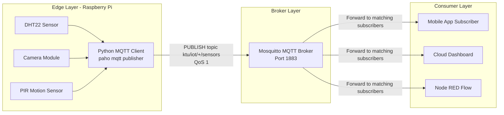
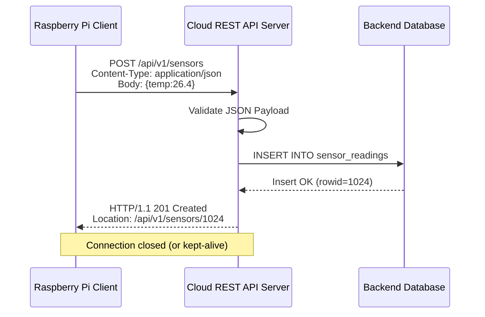
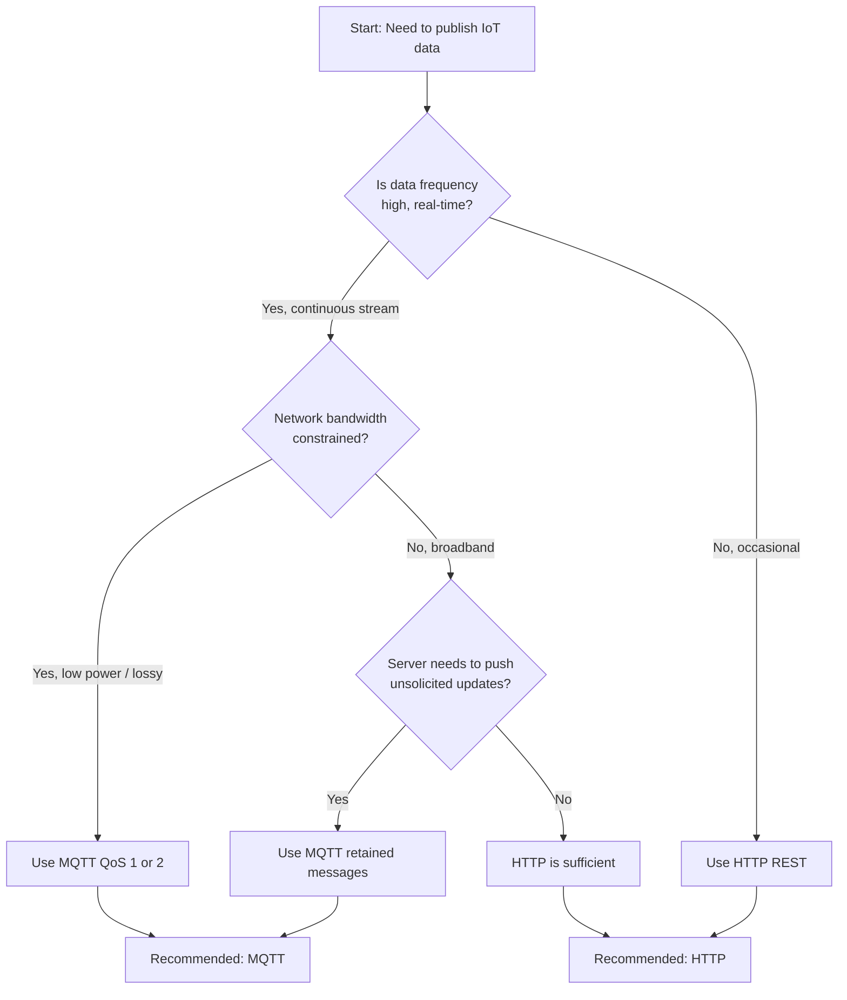
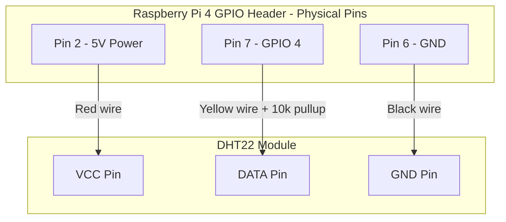
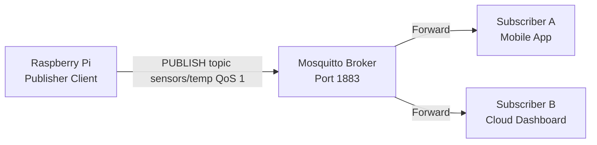
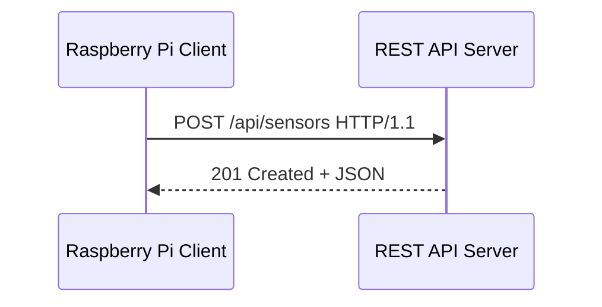

# Publishing Information Using MQTT & HTTP

<!-- SECTION_1_START -->

# Publishing Information Using MQTT \& HTTP on Raspberry Pi

## 1.1 Formal Definition (KTU 2024 Syllabus Terminology)

In the context of **Internet of Things (IoT)** under the KTU 2024 scheme, *publishing information* refers to the act of a **constrained device** (such as a Raspberry Pi) transmitting sensor-derived or actuation-state data to a remote endpoint (broker, cloud server, or subscriber) using a standardized **application-layer communication protocol**.

The two dominant protocols in this domain are:

> [!IMPORTANT]
> **MQTT (Message Queuing Telemetry Transport)** is a lightweight, **publish/subscribe** messaging protocol standardized under **ISO/IEC 20922**, designed for constrained devices and unreliable networks. It operates over **TCP port 1883** (or **8883** for TLS).
>
> **HTTP (Hypertext Transfer Protocol)** is a **request/response** stateless protocol (currently **HTTP/1.1, RFC 7230–7235**) used in IoT primarily through **RESTful APIs** over **TCP port 80** (or **443** for HTTPS).

The **Raspberry Pi** acts as the *edge node* where sensor data is collected, processed, and then **published** to a broker (MQTT) or a web endpoint (HTTP).

---

## 1.2 Conceptual Analogy / Intuition

> [!NOTE]
> **The Newspaper Stand Analogy**
>
> Imagine you want the latest cricket score delivered to you.
>
> - **MQTT** is like *subscribing to a newspaper*. You tell the **newsstand (broker)** "I want the Sports topic." Whenever a new score is **published** by the reporter (publisher), the newsstand automatically pushes it to all subscribers. You don't keep asking — the data *finds you*. This is **push-based, decoupled** communication.
>
> - **HTTP** is like *visiting a website*. You open your browser, type `www.scores.com`, and **pull** the latest score yourself. The server only responds when asked. This is **request/response, client-initiated** communication.
>
> In both cases, the **Raspberry Pi** is the publisher (cricket reporter) sending the score.

---

## 1.3 Standard Metrics, Ports \& QoS Levels

| Protocol | Default Port | TLS Port | Message Style | Header Size |
|----------|--------------|----------|---------------|-------------|
| MQTT     | **1883**     | **8883** | Publish/Subscribe | **2 bytes** (fixed header) |
| HTTP/1.1 | **80**       | **443**  | Request/Response | Variable (typically 200–800 bytes) |

> [!IMPORTANT]
> **MQTT Quality of Service (QoS) Levels** (syllabus highlight):
> - **QoS 0** — *At most once* (fire-and-forget, no acknowledgement)
> - **QoS 1** — *At least once* (PUBACK acknowledgement, possible duplicates)
> - **QoS 2** — *Exactly once* (4-step handshake, no duplicates)

---

## 1.4 Visualization: MQTT Topic Tree

> [!VISUALIZATION CONTROL]
> **Concept:** MQTT hierarchical topic namespace
> **Conceptual Tree:**
> ```
> home
> └── floor1
>     ├── livingroom
>     │   ├── temperature
>     │   └── humidity
>     └── bedroom
>         └── temperature
> ```
> **Visual Description:** Each `/` represents a level separator. Subscribers can use wildcards `+` (single level) and `#` (multi-level) to subscribe to multiple topics simultaneously (e.g., `home/floor1/+/temperature`).

---

<!-- SECTION_1_END -->

<!-- SECTION_2_START -->

# Deep Theoretical Analysis \& High-Yield Formula Sheet

## 2.1 MQTT Architecture Breakdown

MQTT follows a **broker-mediated publish/subscribe pattern**, decoupling producers from consumers.

### Core Components
1. **Publisher (Raspberry Pi client)** — sends messages on a *topic*.
2. **Broker** — central server (e.g., **Mosquitto**, **HiveMQ**, **AWS IoT Core**) that receives, filters, and forwards messages.
3. **Subscriber** — any client that subscribes to one or more *topics* and receives matching messages.
4. **Topic** — UTF-8 string identifier (e.g., `sensors/room1/temp`), hierarchically structured with `/`.
5. **Message** — the **payload** (binary or text), typically JSON in IoT.

### Operational Flow (Step-by-Step)
1. Client opens a **TCP connection** to broker on port **1883**.
2. Sends a **CONNECT** packet with `clientId`, `username`, `password`, `keepAlive`, `cleanSession` flags.
3. Broker replies with **CONNACK** (Connection Acknowledgement).
4. Publisher sends **PUBLISH** packet containing `topic`, `payload`, `QoS`, `retain`, `dup` flags.
5. For **QoS 1**: Broker responds with **PUBACK**.
6. Broker then **forwards** the message to all matching subscribers.
7. On disconnect, client sends **DISCONNECT** packet (graceful close).

---

## 2.2 HTTP REST Architecture Breakdown

HTTP is a **client-driven request/response** model suited for **less frequent, transactional** IoT data exchanges (e.g., firmware updates, configuration, dashboards).

### Core Components
1. **HTTP Client (Raspberry Pi)** — initiates the request.
2. **HTTP Server / REST API** — accepts, processes, and responds.
3. **Resource (URI)** — uniquely identifies the data entity (e.g., `https://api.example.com/sensors/temp`).
4. **HTTP Method** — verb defining the action: `GET`, `POST`, `PUT`, `DELETE`.
5. **Headers** — metadata (`Content-Type: application/json`, `Authorization`).
6. **Body** — JSON/XML payload.

### Operational Flow (Step-by-Step)
1. Client opens a **TCP connection** to server (port **80** / **443**).
2. Sends an HTTP request line: `POST /api/v1/sensors HTTP/1.1`.
3. Adds headers (Host, Content-Type, Content-Length, Auth token).
4. Adds body (e.g., `{"temp": 26.4}`).
5. Server processes, sends back: `HTTP/1.1 200 OK` + headers + response body.
6. Connection is closed (or kept-alive per header).

---

## 2.3 KTU Formula / Cheat Sheet (High-Yield Comparison)

| Parameter | MQTT | HTTP |
|-----------|------|------|
| Pattern | Publish/Subscribe | Request/Response |
| Transport | TCP | TCP |
| Default Port | **1883** | **80** |
| Header Overhead | **2 bytes** (fixed) | 200–800 bytes |
| Power Efficiency | **High** (push model) | Low (polling wastes energy) |
| Ideal Use Case | Real-time telemetry, sensors | Configuration, dashboards, REST APIs |
| Data Push from Server? | **Yes** (broker pushes) | No (client must poll) |
| Security | TLS + username/password | TLS + OAuth2 / JWT / API keys |
| Reliability | 3 QoS levels | HTTP status codes (200, 404, 500) |
| Payload Format | Any (binary/text) | Typically JSON/XML |

### Key Equations / Byte Calculations

**MQTT PUBLISH Packet Total Size:**

$$\text{Total} = \text{FixedHeader} + \text{VariableHeader} + \text{PayloadLen} = 2 + (2 + L_{topic}) + L_{payload}$$

where $L_{topic}$ is the topic string length (in bytes) and $L_{payload}$ is the message body length.

**HTTP Request Minimum Size:**

$$\text{Total} \approx L_{method} + L_{URI} + L_{headers} + L_{body}$$

For a typical POST: `POST /api HTTP/1.1\r\nHost: x\r\nContent-Type: application/json\r\nContent-Length: N\r\n\r\n<body>`.

> [!NOTE]
> **Why MQTT wins for sensors:** The fixed 2-byte header versus HTTP's 200+ byte overhead is **critical** for low-bandwidth networks like **LoRaWAN**, **NB-IoT**, and battery-powered sensor nodes.

---

## 2.4 Real-World Engineering Utility

| Domain | MQTT Application | HTTP Application |
|--------|------------------|------------------|
| **Smart Home** | Real-time temperature push to phone app | REST API to fetch daily energy report |
| **Industrial IoT** | Factory sensor telemetry to SCADA | Firmware OTA updates via REST endpoint |
| **Healthcare** | Wearable heart-rate streaming to monitor | Patient record upload to hospital cloud |
| **Smart Agriculture** | Soil moisture push alerts | Weather forecast fetch from open API |
| **Automotive** | Telemetry to cloud fleet manager | Map tile / navigation data pull |

---

<!-- SECTION_2_END -->

<!-- SECTION_3_START -->

# Step-by-Step Implementation: Raspberry Pi Code \& Setup

## 3.1 Hardware \& Software Prerequisites

### Component Table

| Component | Specification | Quantity |
|-----------|---------------|----------|
| Raspberry Pi 4 Model B | 4 GB RAM, 64-bit ARM Cortex-A72 | 1 |
| microSD Card | 32 GB, Class 10 | 1 |
| DHT22 Sensor | Temperature \& Humidity, digital | 1 |
| Breadboard | 830 tie-points | 1 |
| Resistor | 10 k$\Omega$ (pull-up for DHT22) | 1 |
| Jumper Wires | M–F, M–M | 5 |
| Power Supply | 5 V / 3 A USB-C | 1 |
| OS | Raspberry Pi OS (64-bit, Bookworm) | — |

### Required Python Libraries

```bash
sudo apt update
sudo apt install -y mosquitto mosquitto-clients python3-pip
pip3 install paho-mqtt requests Adafruit_DHT
```

---

## 3.2 Wiring the DHT22 to Raspberry Pi GPIO

| DHT22 Pin | Connect To | Notes |
|-----------|------------|-------|
| VCC (Pin 1) | **5 V** (Physical Pin 2) | Power |
| DATA (Pin 2) | **GPIO 4** (Physical Pin 7) | 10 k$\Omega$ pull-up to VCC |
| NC (Pin 3) | Leave floating | Not connected |
| GND (Pin 4) | **GND** (Physical Pin 6) | Ground |

---

## 3.3 Starting the Local MQTT Broker (Mosquitto)

```bash
# Start the Mosquitto MQTT broker on port 1883
sudo systemctl start mosquitto
sudo systemctl enable mosquitto
sudo systemctl status mosquitto
```

**Test the broker locally (open two terminal sessions):**

```bash
# Terminal 1 — Subscribe
mosquitto_sub -h localhost -t "test/topic" -v

# Terminal 2 — Publish
mosquitto_pub -h localhost -t "test/topic" -m "Hello KTU"
```

---

## 3.4 Exhaustive Python Implementation — MQTT Publish

```python
"""
File: mqtt_publisher.py
Author: KTU IoT Lab
Description: Publishes DHT22 sensor data via MQTT from Raspberry Pi
"""

import time
import json
import random
import logging
from datetime import datetime
import paho.mqtt.client as mqtt

# --- Logging configuration ---
logging.basicConfig(
    level=logging.INFO,
    format="%(asctime)s [%(levelname)s] %(message)s"
)
logger = logging.getLogger("MQTT-Publisher")

# --- Configuration constants ---
BROKER_HOST: str = "localhost"
BROKER_PORT: int = 1883
KEEP_ALIVE_SEC: int = 60
TOPIC: str = "ktu/iot/room1/sensors"
CLIENT_ID: str = "RPiPublisher_01"
USERNAME: str = "ktu_user"
PASSWORD: str = "ktu_pass"
PUBLISH_INTERVAL_SEC: int = 5
QOS_LEVEL: int = 1
RETAIN_FLAG: bool = False


def on_connect(client, userdata, flags, rc, properties=None):
    """Callback invoked upon broker connection acknowledgement (CONNACK)."""
    if rc == 0:
        logger.info("Connected to MQTT broker successfully (CONNACK rc=0).")
    else:
        logger.error(f"Connection failed with return code {rc}.")


def on_publish(client, userdata, mid, properties=None):
    """Callback invoked when a QoS 1 message is acknowledged (PUBACK)."""
    logger.info(f"Message ID {mid} acknowledged by broker (PUBACK).")


def read_sensor_data() -> dict:
    """
    Simulated / actual DHT22 reading.
    Replace random.uniform with Adafruit_DHT.read_retry for real sensor.
    """
    temperature: float = round(random.uniform(20.0, 35.0), 2)
    humidity: float = round(random.uniform(40.0, 80.0), 2)
    return {
        "device_id": CLIENT_ID,
        "timestamp": datetime.utcnow().isoformat() + "Z",
        "temperature_c": temperature,
        "humidity_pct": humidity
    }


def main() -> None:
    # Instantiate MQTT client (v5 protocol if available, else v3.1.1)
    try:
        client = mqtt.Client(
            client_id=CLIENT_ID,
            callback_api_version=mqtt.CallbackAPIVersion.VERSION2
        )
    except AttributeError:
        client = mqtt.Client(client_id=CLIENT_ID)

    # Set credentials
    client.username_pw_set(username=USERNAME, password=PASSWORD)

    # Bind callbacks
    client.on_connect = on_connect
    client.on_publish = on_publish

    # Initial connection
    try:
        client.connect(host=BROKER_HOST, port=BROKER_PORT, keepalive=KEEP_ALIVE_SEC)
    except Exception as e:
        logger.error(f"Initial connection error: {e}")
        return

    client.loop_start()
    logger.info("Publisher loop started. Ctrl+C to stop.")

    try:
        while True:
            payload_dict = read_sensor_data()
            payload_json: str = json.dumps(payload_dict)
            result = client.publish(
                topic=TOPIC,
                payload=payload_json,
                qos=QOS_LEVEL,
                retain=RETAIN_FLAG
            )
            if result.rc == mqtt.MQTT_ERR_SUCCESS:
                logger.info(f"Published to '{TOPIC}': {payload_json}")
            else:
                logger.warning(f"Publish failed with rc={result.rc}")
            time.sleep(PUBLISH_INTERVAL_SEC)

    except KeyboardInterrupt:
        logger.info("Interrupt received. Disconnecting gracefully...")
    finally:
        client.loop_stop()
        client.disconnect()
        logger.info("Disconnected from broker. Bye.")


if __name__ == "__main__":
    main()
```

**Run the publisher:**

```bash
python3 mqtt_publisher.py
```

**Subscribe on a separate terminal to verify:**

```bash
mosquitto_sub -h localhost -t "ktu/iot/room1/sensors" -v
```

---

## 3.5 Exhaustive Python Implementation — HTTP REST Publish (POST)

```python
"""
File: http_publisher.py
Author: KTU IoT Lab
Description: Publishes sensor data via HTTP POST (REST) to a server endpoint
"""

import time
import json
import random
import logging
from datetime import datetime
import requests
from requests.exceptions import RequestException

# --- Logging configuration ---
logging.basicConfig(
    level=logging.INFO,
    format="%(asctime)s [%(levelname)s] %(message)s"
)
logger = logging.getLogger("HTTP-Publisher")

# --- Configuration constants ---
API_ENDPOINT: str = "https://httpbin.org/post"   # Replace with real server
HEADERS: dict = {
    "Content-Type": "application/json",
    "Authorization": "Bearer YOUR_API_TOKEN_HERE"
}
TIMEOUT_SEC: int = 10
PUBLISH_INTERVAL_SEC: int = 5
CLIENT_ID: str = "RPiHTTP_01"


def read_sensor_data() -> dict:
    """Simulated DHT22 reading."""
    temperature: float = round(random.uniform(20.0, 35.0), 2)
    humidity: float = round(random.uniform(40.0, 80.0), 2)
    return {
        "device_id": CLIENT_ID,
        "timestamp": datetime.utcnow().isoformat() + "Z",
        "temperature_c": temperature,
        "humidity_pct": humidity
    }


def main() -> None:
    logger.info(f"HTTP Publisher started. Target: {API_ENDPOINT}")

    while True:
        payload = read_sensor_data()
        try:
            response = requests.post(
                url=API_ENDPOINT,
                headers=HEADERS,
                data=json.dumps(payload),
                timeout=TIMEOUT_SEC
            )
            # Status code check
            if 200 <= response.status_code < 300:
                logger.info(
                    f"POST OK [{response.status_code}] -> {response.text[:60]}"
                )
            else:
                logger.warning(
                    f"Server returned non-2xx: {response.status_code} | {response.text}"
                )

        except RequestException as e:
            logger.error(f"HTTP request failed: {e}")
        except Exception as e:
            logger.error(f"Unexpected error: {e}")

        time.sleep(PUBLISH_INTERVAL_SEC)


if __name__ == "__main__":
    main()
```

**Run the HTTP publisher:**

```bash
python3 http_publisher.py
```

---

## 3.6 Worked Numerical Example (MQTT Packet Size)

> [!NOTE]
> **Q:** Calculate the total MQTT PUBLISH packet size for the topic `ktu/iot/sensor1` (12 bytes) and payload `{"t":26.4}` (10 bytes) at **QoS 0**.

**Step 1 — Fixed header:** MQTT specifies a minimum 2-byte fixed header for PUBLISH (type, flags, remaining length).

$$\text{FixedHeader} = 2 \text{ bytes}$$

**Step 2 — Variable header:** Contains *Topic Name Length* (2 bytes) + *Topic Name* (12 bytes) + *Packet Identifier* (0 bytes at QoS 0).

$$\text{VariableHeader} = 2 + 12 + 0 = 14 \text{ bytes}$$

**Step 3 — Payload:**

$$\text{Payload} = 10 \text{ bytes}$$

**Step 4 — Total:**

$$\text{Total} = 2 + 14 + 10 = 26 \text{ bytes}$$

This is **less than 1%** of a typical HTTP POST header. **[Stating formulas: 2 Marks; Final calculation: 2 Marks; Comparison note: 1 Mark]**

---

<!-- SECTION_3_END -->

<!-- SECTION_4_START -->

# Structural Diagrams \& Schematics

## 4.1 MQTT Publish/Subscribe Architecture on Raspberry Pi



---

## 4.2 HTTP REST Request-Response Sequence



---

## 4.3 Decision Flow: When to Use MQTT vs HTTP



---

## 4.4 Raspberry Pi GPIO Pin Reference (Used Sensors)



---

<!-- SECTION_4_END -->

<!-- SECTION_5_START -->

# KTU 2024 Scheme Examination Question Bank \& Topic Recap

---

## PART A — Short Answer Questions (3 Marks Each)

> **[KTU University Exam — July 2024, CO2, Remember]**

**Q1.** List any **three Quality of Service (QoS)** levels supported by MQTT and state their delivery guarantee.

**Model Answer:**

| QoS Level | Name | Guarantee |
|-----------|------|-----------|
| **QoS 0** | At most once | No acknowledgement; message may be lost |
| **QoS 1** | At least once | PUBACK received; duplicates possible |
| **QoS 2** | Exactly once | 4-step handshake guarantees single delivery |

> **[Mentioning all three levels: 2 Marks; Correct guarantee: 1 Mark]**

---

> **[KTU University Exam — Dec 2023, CO2, Understand]**

**Q2.** Differentiate between MQTT and HTTP in terms of **communication pattern** and **default port number**.

**Model Answer:**

| Aspect | MQTT | HTTP |
|--------|------|------|
| Communication Pattern | Publish / Subscribe (push) | Request / Response (pull) |
| Default Port | **1883** (TCP) | **80** (TCP) |
| TLS Port | **8883** | **443** |
| Initiator | Broker pushes to subscribers | Client must poll server |

> **[Pattern distinction: 2 Marks; Port numbers: 1 Mark]**

---

## PART B — Full-Length 14-Mark Questions (Internal Choice)

---

### **Question A (14 Marks)** — *[KTU University Exam — Dec 2024 Pattern, CO3, Apply / Analyze]*

**(a)** With a neat block diagram, describe the **MQTT publish/subscribe architecture** and explain the roles of **Publisher, Broker, and Subscriber**. **[7 Marks]**

**(b)** Write a complete **Python program** for Raspberry Pi to publish **DHT22 temperature data** to a local **Mosquitto broker** every 5 seconds at **QoS 1**, using the `paho-mqtt` library. **[7 Marks]**

---

### **Model Answer — Question A**

#### Part (a) — Architecture [7 Marks]

**Block Diagram:**



**Roles:**

1. **Publisher (Raspberry Pi):** Generates sensor data and sends `PUBLISH` packets to the broker on a specific topic. It does *not* know who will consume the data. **[2 Marks]**
2. **Broker (Mosquitto):** Central server. Receives all messages, filters by topic, and forwards them to matching subscribers. Maintains session state for persistent clients. **[3 Marks]**
3. **Subscriber:** Registers interest in one or more topics via `SUBSCRIBE` packets. Receives all matching messages pushed by the broker. **[2 Marks]**

> **[Neat diagram: 2 Marks; Publisher role: 1 Mark; Broker role: 2 Marks; Subscriber role: 1 Mark; Topic/port mention: 1 Mark]**

#### Part (b) — Python Program [7 Marks]

```python
import time, json, random
import paho.mqtt.client as mqtt

BROKER = "localhost"
PORT = 1883
TOPIC = "ktu/iot/room1/temperature"
QOS = 1
INTERVAL = 5

def on_connect(client, userdata, flags, rc):
    print(f"Connected with rc={rc}")

def on_publish(client, userdata, mid):
    print(f"Message {mid} acknowledged (PUBACK)")

client = mqtt.Client(client_id="RPi_Temp_01")
client.on_connect = on_connect
client.on_publish = on_publish
client.connect(BROKER, PORT, 60)
client.loop_start()

try:
    while True:
        temp = round(random.uniform(22.0, 32.0), 2)
        payload = json.dumps({"device": "RPi4", "temp_c": temp,
                              "ts": time.time()})
        result = client.publish(TOPIC, payload, qos=QOS)
        print(f"Published: {payload}")
        time.sleep(INTERVAL)
except KeyboardInterrupt:
    client.loop_stop()
    client.disconnect()
```

**Valuation Key:**
- **[Library import and client init: 2 Marks]**
- **[on_connect / on_publish callbacks: 1 Mark]**
- **[Connect to broker and loop_start: 1 Mark]**
- **[Publish loop with QoS and JSON payload: 2 Marks]**
- **[Graceful disconnect in try/finally: 1 Mark]**

---

### **Question B (14 Marks)** — *[KTU University Exam — July 2024 Pattern, CO3, Apply / Analyze — Alternative Choice]*

**(a)** Describe the **HTTP REST request/response model** used in IoT data publishing. List any **four HTTP methods** with their purpose. **[7 Marks]**

**(b)** Write a complete **Python program** for Raspberry Pi to publish **sensor data** to a cloud REST endpoint using the `requests` library via `HTTP POST` with **JSON body** and **Bearer token authentication**. **[7 Marks]**

---

### **Model Answer — Question B**

#### Part (a) — HTTP REST Model [7 Marks]

The **HTTP REST (Representational State Transfer)** model is a **client-initiated, stateless, request/response** architecture widely used in IoT for data exchange with cloud servers.

**Flow:**



**Four HTTP Methods:**

| Method | Purpose | IoT Example |
|--------|---------|-------------|
| `GET` | Retrieve resource | Fetch latest sensor reading |
| `POST` | Create new resource | Upload new sensor data |
| `PUT` | Replace resource | Update device configuration |
| `DELETE` | Remove resource | Deregister a device |

> **[Diagram: 2 Marks; Statelessness / client-initiated nature: 1 Mark; 4 methods with purpose: 4 Marks]**

#### Part (b) — Python Program [7 Marks]

```python
import time, json, random
import requests

ENDPOINT = "https://api.ktu-iot.example.com/v1/sensors"
TOKEN = "Bearer eyJhbGciOiJIUzI1NiJ9..."  # dummy
HEADERS = {
    "Content-Type": "application/json",
    "Authorization": TOKEN
}
INTERVAL = 5
TIMEOUT = 10

while True:
    payload = {
        "device_id": "RPi_HTTP_01",
        "temperature_c": round(random.uniform(22.0, 32.0), 2),
        "humidity_pct": round(random.uniform(40, 80), 2)
    }
    try:
        resp = requests.post(ENDPOINT, headers=HEADERS,
                             data=json.dumps(payload), timeout=TIMEOUT)
        if resp.status_code in (200, 201):
            print(f"Success [{resp.status_code}]: {resp.text[:80]}")
        else:
            print(f"Server error: {resp.status_code}")
    except requests.exceptions.RequestException as e:
        print(f"Request failed: {e}")
    time.sleep(INTERVAL)
```

**Valuation Key:**
- **[Imports and endpoint constants: 1 Mark]**
- **[Headers including Bearer auth: 2 Marks]**
- **[requests.post() with json data and timeout: 2 Marks]**
- **[Status code handling: 1 Mark]**
- **[try/except + loop with interval: 1 Mark]**

---

> [!WARNING]
> **KTU Examiner's Valuation Pitfalls — Common Mark Losers**
>
> 1. **Forgetting `client.loop_start()` / `loop_forever()`** in MQTT code → no messages actually sent. **[-2 Marks]**
> 2. **Wrong port number** (writing 8080 or 1884 instead of **1883**) → 1 Mark cut.
> 3. **Confusing QoS values** (writing 4 or 0 for QoS 0) → 1 Mark cut.
> 4. **Missing `Content-Type: application/json` header** in HTTP POST → request server rejects. **[-1 Mark]**
> 5. **No authentication** in real-world IoT scenarios → marks cut for security awareness.
> 6. **Not using `time.sleep()` or proper async loop** → infinite CPU spin, marks lost.
> 7. **Mixing `requests.get()` with `requests.post()` semantics** — read the question carefully.

---

## 📌 Topic Recap \& Important Things to Remember

- ✅ **MQTT** = **Publish/Subscribe**, port **1883**, broker-mediated, **2-byte fixed header**, 3 **QoS levels** (0, 1, 2).
- ✅ **HTTP** = **Request/Response**, port **80**, client-initiated, large header overhead, **stateless**.
- ✅ **Raspberry Pi** is the *edge publisher*; runs Python with `paho-mqtt` (MQTT) and `requests` (HTTP) libraries.
- ✅ **MQTT Topic** = UTF-8 hierarchical string separated by `/`; wildcards are `+` (single level) and `#` (multi-level).
- ✅ **HTTP Methods**: `GET` (read), `POST` (create), `PUT` (replace), `DELETE` (remove).
- ✅ **QoS 0** = no ACK; **QoS 1** = PUBACK; **QoS 2** = 4-step handshake (exactly once).
- ✅ **Retain flag** in MQTT tells the broker to **store the last message** and send to new subscribers immediately.
- ✅ **Clean Session flag** controls whether the broker persists subscriptions across reconnects.
- ✅ **Security**: MQTT supports TLS (port **8883**) + username/password; HTTP supports HTTPS (port **443**) + **OAuth2/Bearer tokens**.
- ✅ For **real-time sensor streaming** → prefer **MQTT**. For **transactional, infrequent** exchanges → prefer **HTTP REST**.
- ✅ JSON (`application/json`) is the de-facto IoT payload format for both protocols.
- ✅ Always include **timeouts**, **try/except**, and **graceful disconnect** in production code.

---

<!-- SECTION_5_END -->
