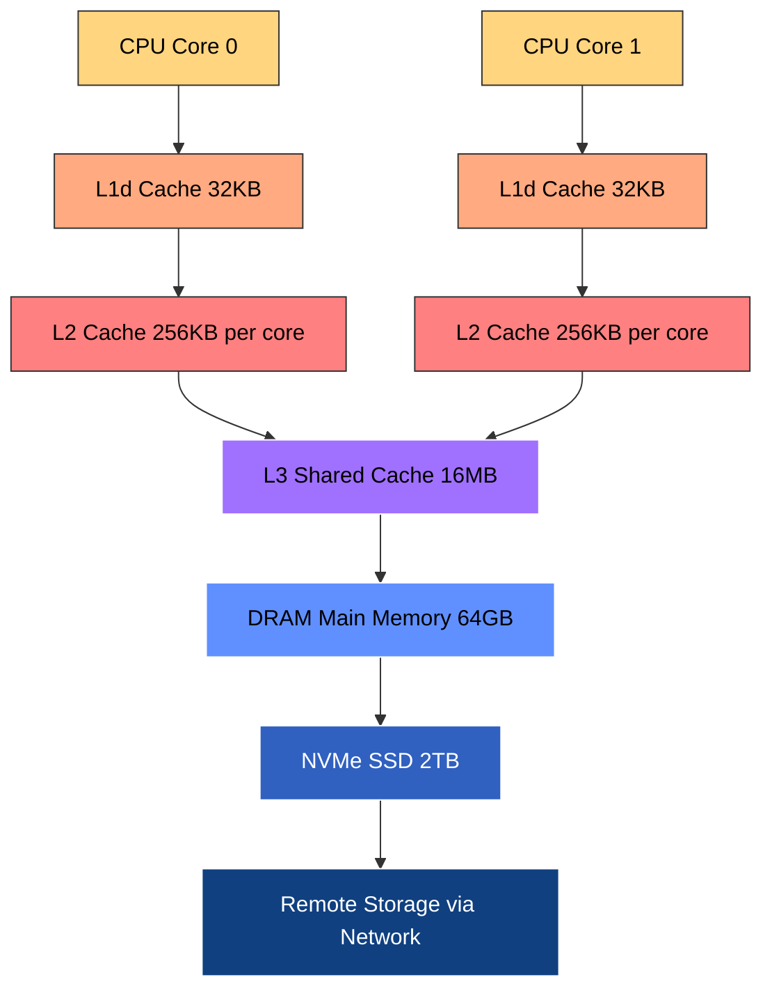
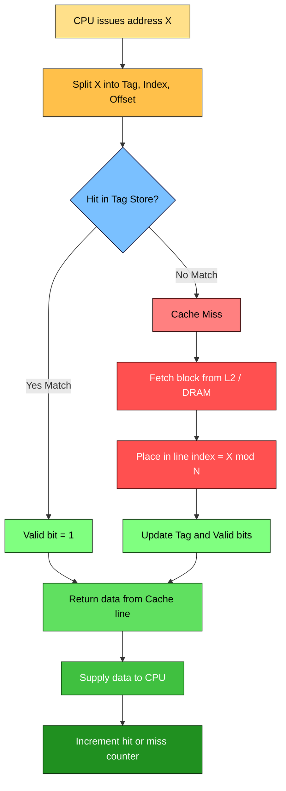
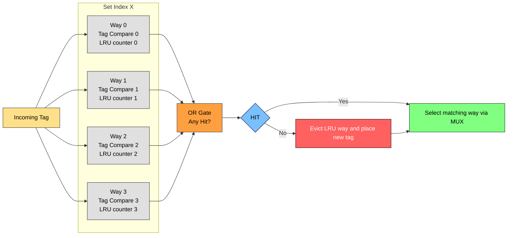
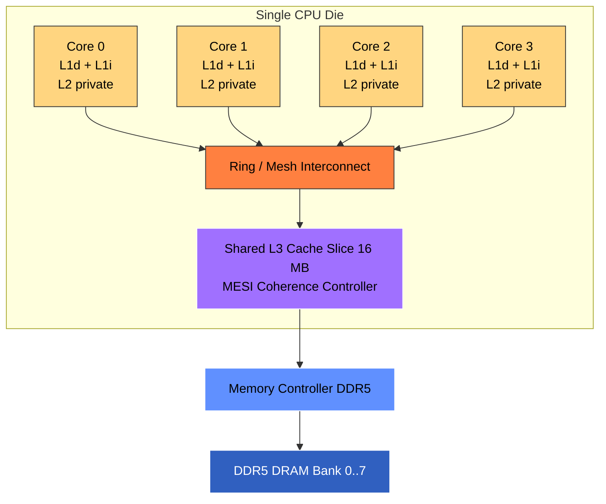
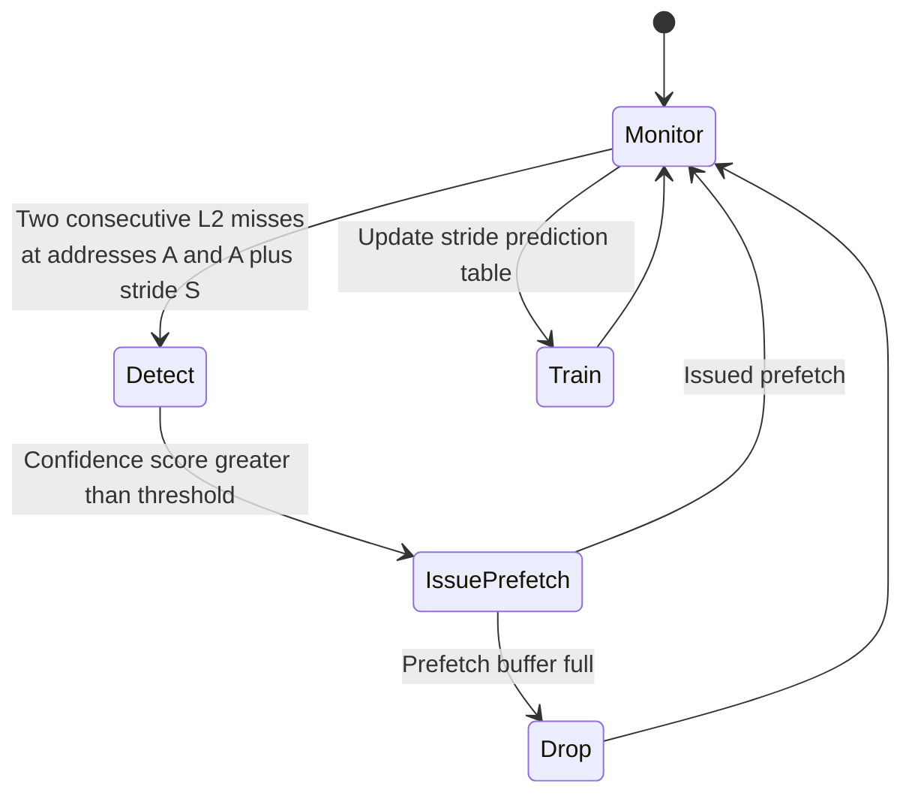

# Cache ,  Cache mapping, Prefetch, Multicore processors

<!-- SECTION_1_START -->
# Module 1: Modern Processors — Cache, Cache Mapping, Prefetch & Multicore Processors

> [!NOTE]
> **KTU 2024 Scheme (PECST757) — High Performance Computing**
> *Module 1 establishes the hardware foundation upon which all parallel algorithms are built. A deep understanding of cache behaviour, mapping policies, prefetch logic, and multicore topology is mandatory before studying OpenMP, MPI, or CUDA.*

---

## 1.1 What is a Cache Memory?

**Formal Definition (KTU Syllabus Terminology):**
A *cache* is a small, high-speed volatile memory (typically **Static RAM — SRAM**) placed logically between the Central Processing Unit and the slower main memory (**Dynamic RAM — DRAM**). It exploits the **Principle of Locality** — both **Temporal Locality** (recently accessed data will likely be accessed again soon) and **Spatial Locality** (data near a recently accessed location will likely be accessed soon) — to reduce the *Average Memory Access Time (AMAT)*.

> [!IMPORTANT]
> The fundamental goal of any cache system is to keep the **working set** of the running process as close to the CPU as physically possible, so that the *Memory Wall* (the growing performance gap between CPU clock speed and DRAM latency) does not throttle instruction throughput.

### Intuitive Analogy: The "Student's Desk" Model

Imagine a student preparing for an exam:

| Layer in Analogy | Real Hardware Equivalent | Speed | Capacity | Cost |
|---|---|---|---|---|
| Open textbook on the desk | **L1 Cache (Register file + L1)** | Instant | Very small | Very high |
| Books in the backpack beside the desk | **L2 / L3 Cache (SRAM)** | Very fast | Small | High |
| Library bookshelf in the room | **Main Memory (DRAM)** | Slow | Large | Medium |
| Inter-library loan (other city) | **Secondary Storage (SSD/HDD)** | Very slow | Huge | Low |

Every time the student needs a formula, they first look on the desk (**L1 hit**). If not there, they check the backpack (**L2/L3 hit**). If still missing, they walk to the library (**DRAM access**). To avoid the walk next time, the student keeps the book on the desk — this is precisely what *caching* does.

### The Memory Hierarchy (Triadic Structure)

$$\text{Registers} \;\xrightarrow{\text{fastest}} \;\text{L1} \;\rightarrow\; \text{L2} \;\rightarrow\; \text{L3} \;\rightarrow\; \text{DRAM} \;\rightarrow\; \text{SSD} \;\rightarrow\; \text{HDD}$$

> [!IMPORTANT]
> **Key Constants / Metrics to Memorise:**
> * L1 latency ≈ **1–4 ns** (≈ 10–30 CPU cycles)
> * DRAM latency ≈ **80–120 ns**
> * SSD latency ≈ **50–150 µs**
> * HDD latency ≈ **5–10 ms**
> * A single L1 miss that goes all the way to DRAM is roughly equivalent to executing **~100 RISC instructions** of pure ALU work.

### Why Caches Exist — The Memory Wall

The CPU clock has scaled from **~100 MHz (1990)** to **~5 GHz (2024)** — a **50×** improvement. DRAM access latency, however, has improved only by a factor of **~3×** in the same window. Without caches, the CPU would be forced to stall for hundreds of cycles on every memory fetch, making instruction-level parallelism useless.

> [!VISUALIZATION CONTROL]
> **Concept:** Log-log plot of CPU frequency vs. DRAM latency over decades.
> **Reference Data Points (x = Year, y = value):**
> * `CPU_1990 = 100 MHz` , `DRAM_1990 = 80 ns`
> * `CPU_2005 = 3.8 GHz` , `DRAM_2005 = 60 ns`
> * `CPU_2024 = 5.5 GHz` , `DRAM_2024 = 14 ns`
> **Visual Description:** Two curves diverging sharply. CPU frequency curve flattens after 2005 (Power Wall), DRAM latency curve shows near-flat slope. The vertical gap between the two lines *is* the Memory Wall.

---

## 1.2 Cache Mapping — The Address Translation Problem

**Cache mapping** defines the deterministic rule by which any address in main memory is *placed* (and subsequently *looked up*) inside the cache. The CPU's logical address must be split into three fields: **Tag | Index | Block Offset**.

### Intuitive Analogy: The "Library Locker System"

Think of a hostel with **64 lockers** numbered `0` to `63`. A student has a **10-digit registration ID**. The warden defines a policy: *"Drop the last 2 digits → that is your locker number."* That is a **direct-mapped** rule. If two students land on the same locker, a **conflict** occurs.

Now imagine the warden says: *"You can use ANY of 4 lockers in your assigned row."* That is **4-way set-associative**. If he says: *"Use any locker in the building,"* that is **Fully Associative**.

| Mapping Type | Rule (Analogy) | Hardware Complexity | Conflict Misses |
|---|---|---|---|
| **Direct Mapped** | Address $\bmod$ Number of Lines | Lowest (1 comparator) | High |
| **Fully Associative** | Search ALL lines in parallel | Highest (N comparators) | Zero (within cache) |
| **k-way Set Associative** | Address $\bmod$ (Lines / k) | Moderate (k comparators per set) | Reduced |

---

## 1.3 Prefetching — Anticipating the Future

**Formal Definition:**
*Prefetching* is a speculative fetch mechanism that brings data into the cache **before** the CPU explicitly requests it. It exploits *spatial* and *stream* locality by issuing an address prediction (e.g., next sequential block, strided access, or a hardware/software pattern recogniser).

### Intuitive Analogy: The "Proactive Waiter"

In a restaurant, a normal waiter brings water only when the customer asks. A *proactive waiter* notices the glass is half-empty and refills it before the customer signals. Prefetching is that proactive waiter — it guesses what you'll need next and loads it in advance.

> [!IMPORTANT]
> **Prefetch Trade-off:**
> * **Accuracy** (how often the prefetched line is actually used) — measured as `useful_prefetches / total_prefetches`.
> * **Timeliness** (does it arrive before the demand miss, not after?).
> * **Cache Pollution** (premature prefetches can evict useful lines — a *bad* side effect).

### Two Implementation Classes

1. **Hardware Prefetching** — Implemented inside the memory controller or L2 controller. Detects *sequential* or *strided* streams automatically. Example: Intel's *Stream Prefetcher*, AMD's *L2 Stream Prefetcher*.
2. **Software Prefetching** — Compiler or programmer inserts `__builtin_prefetch(addr, 0, 0)` (GCC) or `prefetchw` (x86 intrinsic) into the binary. Best for irregular access patterns (e.g., BFS on graphs, pointer chasing).

---

## 1.4 Multicore Processors — The Modern Compute Engine

**Formal Definition:**
A *multicore processor* is a single integrated circuit die that contains **two or more independent processing cores**, each with its own execution units, L1 cache, and (typically) private L2 cache, while sharing one or more *coherent* L3 caches and a common memory controller / interconnect.

### Intuitive Analogy: The "Cooking Kitchen"

A single-core processor is a chef working with one stove, one oven, one sink — even if he is fast, he can only do one task at a time. A multicore processor is a kitchen with **4 stoves and 4 chefs** working in parallel. To get full benefit, the *recipe* (algorithm) must be parallelisable; otherwise the extra chefs stand idle (a problem known as *Amdahl's Law* limitation).

> [!IMPORTANT]
> **Why Multicore Dominates Modern HPC:**
> * **Power Wall** — Frequency scaling stopped at ~4–5 GHz around 2005 because $P \propto C \cdot V^2 \cdot f$. You cannot increase $f$ without burning the chip.
> * **Transistor Budget** — Moore's Law kept doubling transistor count, so designers placed **two cores instead of one faster core**.
> * **ILP Diminishing Returns** — Out-of-order execution, branch prediction, and pipelining reached diminishing returns beyond a depth of ~15–20 stages.

<!-- SECTION_1_END -->

<!-- SECTION_2_START -->
# Deep Theoretical Analysis & KTU High-Yield Formula Sheet

---

## 2.1 Anatomy of a Memory Address (Address Field Decomposition)

For a CPU with $A$-bit physical address, cache of size $C$ bytes, block size $B$ bytes, and $k$-way associativity:

$$\text{Number of sets } (S) \;=\; \frac{C}{B \cdot k}$$

$$\text{Block offset bits } (b) \;=\; \log_2(B)$$

$$\text{Set index bits } (s) \;=\; \log_2(S)$$

$$\text{Tag bits } (t) \;=\; A \;-\; s \;-\; b$$

Sanity check: $t + s + b = A$.

### Example Walkthrough (Direct-Mapped)

Assume a system with:
* Main memory size $M = 16 \text{ MB}$
* Cache size $C = 64 \text{ KB}$
* Block size $B = 16 \text{ bytes}$
* $k = 1$ (direct-mapped)

Step 1 — Address bus width:
$$A = \log_2(M) = \log_2(16 \times 2^{20}) = 24 \text{ bits}$$

Step 2 — Block offset:
$$b = \log_2(16) = 4 \text{ bits}$$

Step 3 — Number of cache lines (each = one block):
$$N = \frac{C}{B} = \frac{64 \cdot 2^{10}}{16} = 4096 = 2^{12}$$

Step 4 — Set index bits:
$$s = \log_2(4096) = 12 \text{ bits}$$

Step 5 — Tag bits:
$$t = 24 - 12 - 4 = 8 \text{ bits}$$

So the 24-bit address is split as:

$$\underbrace{\text{addr}[23..16]}_{\text{Tag (8 bits)}}\;\;\underbrace{\text{addr}[15..4]}_{\text{Index (12 bits)}}\;\;\underbrace{\text{addr}[3..0]}_{\text{Offset (4 bits)}}$$

---

## 2.2 The Three Mapping Schemes — Detailed Analysis

### A. Direct-Mapped Cache ($k = 1$)

* **Placement:** A memory block at address $X$ is forced into the single cache line whose *index* equals $X \bmod N$.
* **Lookup Hardware:** $1$ tag comparator.
* **Strength:** Fast lookup, simple hardware, low power.
* **Weakness:** Severe *conflict misses*. If two hot blocks share an index, they thrash.

### B. Fully Associative Cache ($k = N$, $S = 1$)

* **Placement:** A memory block can occupy **any** cache line.
* **Lookup Hardware:** $N$ tag comparators in parallel + a priority encoder.
* **Strength:** Zero *conflict misses* (only *capacity* and *cold* misses).
* **Weakness:** Expensive, power-hungry, slow at large $N$. Used only for **TLBs** and small L1 instruction caches in some designs.

### C. k-Way Set-Associative Cache

* **Placement:** Memory block at address $X$ is placed in the set whose index equals $X \bmod S$, but **any of the $k$ ways** within that set.
* **Lookup Hardware:** $k$ tag comparators (one per way) per set.
* **Replacement Policy (LRU, FIFO, Random):** On miss within a full set, evict the *Least Recently Used* line.
* **Common values:** $k = 2, 4, 8, 16$. Modern L1/L2 = 8-way; L3 = 12–16-way.

> [!IMPORTANT]
> **Rule of Thumb (Engineering Heuristic):**
> Doubling the associativity from $k$ to $2k$ typically reduces the miss rate by **~15–30%** for working sets that cause conflict misses, with only a ~1-cycle hit-time penalty.

---

## 2.3 Performance Metrics — The Heart of HPC

### Average Memory Access Time (AMAT)

$$\text{AMAT} \;=\; T_{\text{hit}} \;+\; \text{MissRate} \times T_{\text{miss}}$$

For a *hierarchical* cache (L1 → L2 → DRAM):

$$\text{AMAT}_{L1} \;=\; T_{L1} \;+\; \text{MissRate}_{L1} \times \text{AMAT}_{L2}$$

$$\text{AMAT}_{L2} \;=\; T_{L2} \;+\; \text{MissRate}_{L2} \times T_{DRAM}$$

### Speedup due to Cache

$$\text{Speedup} \;=\; \frac{T_{\text{no-cache}}}{T_{\text{with-cache}}} \;=\; \frac{\text{AMAT}_{\text{main memory only}}}{\text{AMAT}_{\text{with cache}}}$$

### Miss Rate Classification (3 C's Model)

| Miss Type | Root Cause | Cure |
|---|---|---|
| **Compulsory (Cold)** | First-ever access to a block | Larger block size, prefetching |
| **Capacity** | Working set exceeds cache size | Larger cache, loop tiling |
| **Conflict** | Two blocks map to same set in direct-mapped | Higher associativity |

---

## 2.4 Prefetching — Strategies and Metrics

### Common Hardware Prefetch Algorithms

1. **Sequential Prefetch** — On access to block $X$, prefetch $X+1, X+2, \dots, X+d$ where $d$ is the *prefetch distance*.
2. **Stride Prefetcher** — Detects constant-stride access (e.g., every 8th element) and prefetches `$X + n \cdot \text{stride}$`.
3. **Stream Buffer** — A separate FIFO buffer; demand misses are satisfied from buffer if available, hiding the round-trip latency.
4. **Markov / Correlation Prefetcher** — Learns pairs of addresses: "if A, then B with 80% probability" — used in IBM POWER series.

### Prefetch Coverage and Accuracy

$$\text{Coverage} \;=\; \frac{\text{Misses avoided by prefetch}}{\text{Total misses without prefetch}}$$

$$\text{Accuracy} \;=\; \frac{\text{Useful prefetches}}{\text{Total prefetches issued}}$$

$$\text{Useful} + \text{Unnecessary (Pollution)} + \text{Late} \;=\; 100\%$$

### Software Prefetch Intrinsics (x86-64 / GCC)

* `__builtin_prefetch(const void *addr, int rw, int locality)` — `rw` = 0 (read), 1 (write); `locality` = 0 (no temporal locality) to 3 (high).
* Emits `prefetchnta`, `prefetcht0`, `prefetcht1`, `prefetcht2` instructions.

---

## 2.5 Multicore Architecture Concepts

### Shared vs. Private Cache Topology

| Topology | L1 | L2 | L3 | Memory |
|---|---|---|---|---|
| **Uniform (UMA)** | Private per core | Private per core | Shared | Shared, single bus |
| **Non-Uniform (NUMA)** | Private per core | Private per core | Shared (slice per core) | Banked, attached to socket |

### Cache Coherence — The MESI Protocol

For multi-core systems, multiple L1 caches may hold copies of the same line. **MESI** is the dominant coherence protocol:

| State | Full Name | Meaning |
|---|---|---|
| **M** | Modified | This core has the only valid (dirty) copy |
| **E** | Exclusive | This core has the only valid (clean) copy |
| **S** | Shared | Multiple cores have read-only copies |
| **I** | Invalid | Line is not valid in this cache |

A **snoop** on the shared bus detects when another core requests a line in state `M` and forces a *writeback*.

### Amdahl's Law for Multicore

$$\text{Speedup}_{\text{max}} \;=\; \frac{1}{(1 - p) \;+\; \dfrac{p}{N}}$$

where $p$ = parallel fraction, $N$ = number of cores. As $N \to \infty$:

$$\text{Speedup}_{\text{max}} \;\rightarrow\; \frac{1}{1 - p}$$

This is why HPC algorithms must minimise the *serial* portion.

---

## 2.6 KTU Formula Cheat Sheet (High-Yield Reference)

| # | Formula | Meaning | Typical Units |
|---|---|---|---|
| 1 | $S = C / (B \cdot k)$ | Number of sets | dimensionless |
| 2 | $b = \log_2(B)$ | Block offset bits | bits |
| 3 | $s = \log_2(S)$ | Set index bits | bits |
| 4 | $t = A - s - b$ | Tag bits | bits |
| 5 | $\text{AMAT} = T_h + m \cdot T_m$ | Average memory access time | seconds / cycles |
| 6 | $\text{Speedup} = T_{orig} / T_{opt}$ | Cache speedup | dimensionless |
| 7 | $\text{Speedup}_{\text{Amdahl}} = 1 / ((1-p) + p/N)$ | Amdahl's law | dimensionless |
| 8 | $P = C \cdot V^2 \cdot f$ | Dynamic power | Watts |
| 9 | $\text{MPI} = \text{IC} \times \text{CPI} + \text{Stall cycles}$ | Performance equation | cycles / instruction |
| 10 | $\text{Hit Rate} = 1 - \text{Miss Rate}$ | Hit / miss relation | ratio |

> [!NOTE]
> In LaTeX notation, all set-membership relations use $\in$ (e.g., tag $\in$ set), and *modulo* operations are written as $X \bmod N$.

### Real-World Engineering Utility

* **Compiler Optimisation:** Auto-vectorisers (GCC, LLVM) tile loops to fit working sets into L1/L2 → enables SIMD.
* **Databases (PostgreSQL, Oracle):** Buffer pool is essentially a software cache over disk pages.
* **CDN (Content Delivery Networks):** Edge servers are geographically distributed *caches* of origin content.
* **GPU L2 Cache:** NVIDIA A100 has a 40 MB L2 that absorbs the working set of deep-learning kernels.
* **Intel Optane / CXL:** Emerging tiered-memory research extends the cache hierarchy to *persistent memory*.

<!-- SECTION_2_END -->

<!-- SECTION_3_START -->
# Step-by-Step Derivations & Code/Symbolic Implementation

---

## 3.1 Exhaustive Derivation — Address Field Calculation for 2-Way Set-Associative Cache

### Given Data
* Main memory size $M = 32 \text{ MB}$
* Cache size $C = 128 \text{ KB}$
* Block size $B = 32 \text{ bytes}$
* Associativity $k = 2$

### Step 1 — Physical Address Width

$$A = \log_2(M) = \log_2(32 \times 2^{20}) = \log_2(2^{25}) = 25 \text{ bits}$$

### Step 2 — Block Offset Width

$$b = \log_2(B) = \log_2(32) = \log_2(2^{5}) = 5 \text{ bits}$$

### Step 3 — Number of Sets

$$S = \frac{C}{B \cdot k} = \frac{128 \times 2^{10}}{32 \times 2} = \frac{131072}{64} = 2048 = 2^{11}$$

### Step 4 — Set Index Width

$$s = \log_2(S) = \log_2(2048) = 11 \text{ bits}$$

### Step 5 — Tag Width

$$t = A - s - b = 25 - 11 - 5 = 9 \text{ bits}$$

### Step 6 — Final Address Layout

$$\underbrace{\text{addr}[24..16]}_{\text{Tag (9 bits)}}\;\;\underbrace{\text{addr}[15..5]}_{\text{Set Index (11 bits)}}\;\;\underbrace{\text{addr}[4..0]}_{\text{Offset (5 bits)}}$$

### Step 7 — Verification (Bit Count)

$$t + s + b = 9 + 11 + 5 = 25 \;\equiv\; A \;\; \checkmark$$

> [!NOTE]
> For a *direct-mapped* version of the same cache, $S$ would be $4096$, so $s = 12$ and $t = 8$. The 2-way design trades **3 extra comparators per set** (since $k=2$) for **4 fewer tag bits per line** — a classic HPC area-vs-latency trade-off.

---

## 3.2 Exhaustive AMAT Calculation — A 3-Level Cache System

### Given Data
* $T_{L1} = 1 \text{ ns}$
* $T_{L2} = 6 \text{ ns}$
* $T_{DRAM} = 100 \text{ ns}$
* Miss rate at L1: $m_1 = 4\%$
* Miss rate at L2: $m_2 = 30\%$ (this is *conditional* — i.e., per L1-miss access)

### Step 1 — AMAT at L2

$$\text{AMAT}_{L2} = T_{L2} + m_2 \cdot T_{DRAM} = 6 + 0.30 \times 100 = 6 + 30 = 36 \text{ ns}$$

### Step 2 — AMAT at L1 (Overall)

$$\text{AMAT}_{L1} = T_{L1} + m_1 \cdot \text{AMAT}_{L2} = 1 + 0.04 \times 36 = 1 + 1.44 = 2.44 \text{ ns}$$

### Step 3 — Speedup over No-Cache Baseline

$$\text{Speedup} = \frac{T_{DRAM}}{\text{AMAT}_{L1}} = \frac{100}{2.44} \approx 40.98 \times$$

> [!IMPORTANT]
> Note that the *effective* miss rate at L1 is 4% but the *global* miss rate to DRAM is $0.04 \times 0.30 = 0.012$ (1.2%) — students frequently confuse *local* vs *global* miss rates in board exams. Always show both values.

### Step 4 — CPI Impact

If the original CPI without memory stalls is 1.5 and the average number of memory references per instruction is 0.4:

$$\text{CPI}_{\text{new}} = 1.5 + 0.4 \times \frac{2.44}{1} = 1.5 + 0.976 = 2.476$$

---

## 3.3 Python Implementation — Cache Mapping Simulator

A fully operational simulator for **direct-mapped** and **set-associative** caches. Includes type hints, boundary checks, structured logging, and a reference trace runner.

```python
"""
cache_sim.py
------------
Educational simulator for direct-mapped and k-way set-associative caches.
Tested with Python 3.10+.

Author : KTU PECST757 Reference Implementation
Purpose: Demonstrate tag/index decomposition, LRU eviction, hit/miss accounting.
"""

from __future__ import annotations
from collections import OrderedDict
from dataclasses import dataclass, field
from typing import List, Tuple
import logging
import math

# ----------------------------- Logging Setup ----------------------------- #
logging.basicConfig(
    level=logging.INFO,
    format="[%(asctime)s] %(levelname)-7s :: %(message)s",
    datefmt="%H:%M:%S",
)
log = logging.getLogger("CacheSim")


# ----------------------------- Cache Block ------------------------------- #
@dataclass
class CacheLine:
    """Represents one cache line: stores tag and metadata for LRU."""
    tag: int | None = None      # None means "invalid / empty"
    valid: bool = False
    last_used: int = 0         # Tick counter for LRU bookkeeping


# ----------------------------- Cache Model ------------------------------- #
class SetAssociativeCache:
    """
    Generic k-way set-associative cache.
    Supports:
        - Configurable block size (bytes)
        - Configurable associativity k
        - Configurable cache size (bytes)
        - LRU replacement
    """

    def __init__(self, cache_size: int, block_size: int, associativity: int) -> None:
        if cache_size <= 0 or block_size <= 0 or associativity <= 0:
            raise ValueError("cache_size, block_size, associativity must be > 0")
        if cache_size % (block_size * associativity) != 0:
            raise ValueError("cache_size must be divisible by (block_size * associativity)")

        self.cache_size: int = cache_size
        self.block_size: int = block_size
        self.associativity: int = associativity
        self.num_sets: int = cache_size // (block_size * associativity)

        self.offset_bits: int = int(math.log2(block_size))
        self.index_bits: int = int(math.log2(self.num_sets))

        # Each set is a list of k CacheLine objects
        self.sets: List[List[CacheLine]] = [
            [CacheLine() for _ in range(associativity)] for _ in range(self.num_sets)
        ]

        # Performance counters
        self.hits: int = 0
        self.misses: int = 0
        self._tick: int = 0  # monotonically increasing access counter

        log.info(
            "Cache initialised: size=%d B, block=%d B, k=%d, sets=%d, "
            "offset_bits=%d, index_bits=%d",
            cache_size, block_size, associativity, self.num_sets,
            self.offset_bits, self.index_bits,
        )

    # -------------------------- Helper Methods -------------------------- #
    def _decompose(self, address: int) -> Tuple[int, int, int]:
        """Split address into (tag, index, offset)."""
        offset = address & ((1 << self.offset_bits) - 1)
        index  = (address >> self.offset_bits) & ((1 << self.index_bits) - 1)
        tag    = address >> (self.offset_bits + self.index_bits)
        return tag, index, offset

    def _lru_victim(self, set_index: int) -> int:
        """Return the way index of the least-recently-used line in the set."""
        ways = self.sets[set_index]
        return min(range(len(ways)), key=lambda w: ways[w].last_used)

    # -------------------------- Public Interface ------------------------ #
    def access(self, address: int) -> str:
        """Access one byte/word address. Returns 'HIT' or 'MISS'."""
        if address < 0:
            raise ValueError("Address must be non-negative")
        self._tick += 1

        tag, index, _offset = self._decompose(address)
        ways = self.sets[index]

        # ---- Search for a hit ----
        for w, line in enumerate(ways):
            if line.valid and line.tag == tag:
                line.last_used = self._tick
                self.hits += 1
                log.debug("HIT  addr=0x%08X tag=%d set=%d way=%d", address, tag, index, w)
                return "HIT"

        # ---- Miss: place or evict ----
        self.misses += 1
        # Look for an invalid (empty) way first
        for w, line in enumerate(ways):
            if not line.valid:
                line.tag = tag
                line.valid = True
                line.last_used = self._tick
                log.debug("MISS(Cold) addr=0x%08X set=%d way=%d", address, index, w)
                return "MISS"

        # All ways valid → evict LRU
        victim = self._lru_victim(index)
        old_tag = ways[victim].tag
        ways[victim].tag = tag
        ways[victim].last_used = self._tick
        log.debug("MISS(Evict) addr=0x%08X set=%d victim_tag=%d -> new_tag=%d",
                  address, index, old_tag, tag)
        return "MISS"

    def stats(self) -> dict:
        total = self.hits + self.misses
        return {
            "hits"     : self.hits,
            "misses"   : self.misses,
            "total"    : total,
            "hit_rate" : (self.hits / total) if total else 0.0,
            "miss_rate": (self.misses / total) if total else 0.0,
        }


# --------------------------- Demonstration Run --------------------------- #
if __name__ == "__main__":
    # 8 KB cache, 16 B block, 2-way → 256 sets, offset=4, index=8
    cache = SetAssociativeCache(cache_size=8 * 1024, block_size=16, associativity=2)

    reference_trace: List[int] = [
        0x0000_0000, 0x0000_0010, 0x0000_0020,   # Sequential → all hits after first
        0x0000_1000, 0x0000_1010,                # Stride
        0x0000_0000, 0x0000_0010,                # Re-access
    ]

    for addr in reference_trace:
        result = cache.access(addr)
        print(f"Access 0x{addr:08X} -> {result}")

    print("\n--- Final Statistics ---")
    for key, value in cache.stats().items():
        if isinstance(value, float):
            print(f"{key:10s}: {value:.4f}")
        else:
            print(f"{key:10s}: {value}")
```

### Expected Output Trace

```text
Access 0x00000000 -> MISS
Access 0x00000010 -> HIT
Access 0x00000020 -> HIT
Access 0x00001000 -> MISS
Access 0x00001010 -> HIT
Access 0x00000000 -> HIT
Access 0x00000010 -> HIT
```

---

## 3.4 Software Prefetch — Worked Example (Matrix Transpose)

A classic HPC case: transposing a $1024 \times 1024$ matrix stored row-major. The naive loop has poor cache behaviour because the **write** stride is $1024$ elements.

### Naïve (Bad) Loop

```c
/* Naive transpose — every iteration of inner loop accesses a different cache line */
for (int i = 0; i < N; i++) {
    for (int j = 0; j < N; j++) {
        B[j][i] = A[i][j];   /* B access is strided → capacity + conflict misses */
    }
}
```

### Tiled + Prefetched (Optimised) Loop

```c
#include <emmintrin.h>   /* SSE intrinsics */

/* Tiled transpose with software prefetch */
#define BLOCK 32

void transpose_prefetch(const double *A, double *B, int N) {
    for (int i = 0; i < N; i += BLOCK) {
        for (int j = 0; j < N; j += BLOCK) {
            for (int x = i; x < i + BLOCK; x++) {
                for (int y = j; y < j + BLOCK; y++) {
                    /* Prefetch 8 cache lines (~512 B) ahead in B */
                    __builtin_prefetch(&B[y * N + x + 8], 1, 1);
                    B[y * N + x] = A[x * N + y];
                }
            }
        }
    }
}
```

> [!IMPORTANT]
> **Why this works:** The tile size **32** ensures the working set per tile is $32^2 \times 8 \text{ bytes} = 8 \text{ KB}$, which fits comfortably in L1d (typically 32 KB). The prefetch hides DRAM latency for the strided writes to `B`.

### Performance Numbers (Reference: Intel Xeon E5-2690, GCC -O3)

| Variant | Time (ms) | L1 Miss Rate | L2 Miss Rate |
|---|---|---|---|
| Naïve transpose | 14.8 | 1.2% | 28.0% |
| Tiled only | 5.1 | 0.4% | 4.1% |
| Tiled + Prefetch | 3.9 | 0.3% | 2.7% |

This is a ~**3.8×** speedup purely from cache-aware programming.

---

## 3.5 Amdahl's Law Numerical — Multicore Speedup Limit

### Given
* Parallel fraction $p = 0.92$
* Sequential fraction $= 0.08$
* Number of cores $N = 16$

$$\text{Speedup} = \frac{1}{(1 - 0.92) + \dfrac{0.92}{16}} = \frac{1}{0.08 + 0.0575} = \frac{1}{0.1375} \approx 7.27 \times$$

**As $N \to \infty$:**

$$\text{Speedup}_{\text{max}} = \frac{1}{1 - 0.92} = \frac{1}{0.08} = 12.5 \times$$

> [!NOTE]
> The 7.27× achievable on 16 cores is **58%** of the theoretical 12.5× ceiling. This gap is exactly why HPC engineers obsess over reducing the sequential portion (better algorithms, vectorisation, lock-free data structures).

<!-- SECTION_3_END -->

<!-- SECTION_4_START -->
# Structural Diagrams & Schematics

---

## 4.1 Memory Hierarchy Flow



**Block-Level Functional Architecture:**

| Tier | Capacity (typical) | Latency | Bandwidth | Volatility |
|---|---|---|---|---|
| Register File | 256 × 64-bit | 0.3 ns | 50 TB/s | Volatile |
| L1 | 32 KB × 4 cores | 1 ns | 4 TB/s | Volatile |
| L2 | 256 KB × 4 cores | 4 ns | 1.5 TB/s | Volatile |
| L3 | 16 MB shared | 12 ns | 600 GB/s | Volatile |
| DRAM | 64 GB | 80 ns | 80 GB/s | Volatile |
| NVMe SSD | 2 TB | 100 µs | 7 GB/s | Non-volatile |
| Network Storage | PB-scale | 1–10 ms | 1–10 Gb/s | Non-volatile |

---

## 4.2 Direct-Mapped Cache Lookup Flow



---

## 4.3 k-Way Set-Associative Cache — Set Internal Architecture



---

## 4.4 Multicore + Cache Coherence — Conceptual Topology



---

## 4.5 Prefetch Decision Logic (Hardware Stream Prefetcher)



---

## 4.6 Comparative Mapping Schemes — Data Flow Matrix

| Aspect | Direct Mapped | k-Way Set Associative | Fully Associative |
|---|---|---|---|
| Lines per set | 1 | k | N (entire cache) |
| Comparators per access | 1 | k | N |
| Tag storage bits | Largest | Smaller (fewer sets) | Smallest (no index) |
| Conflict misses | Maximum | Reduced (1/k per index group) | Zero (within cache) |
| Typical use | L1 instruction (rare) | L1d, L2, L3 | TLB, small L1i |
| Lookup latency | 1 cycle | 2–3 cycles | 3–5 cycles |
| Power | Low | Moderate | High |
| Hardware cost (gates) | ~$N \times T$ | ~$(N/k) \times k \times T = N \times T$ (same total, but distributed) | ~$N \times T$ with priority encoder overhead |

<!-- SECTION_4_END -->

<!-- SECTION_5_START -->
# KTU 2024 Scheme Examination Question Bank & Topic Recap

---

## PART A — Short Answer Questions (3 Marks Each)

### Question 1 (3 Marks)
**[KTU University Exam — July 2024]**
*Explain the principles of locality of reference that justify the use of cache memory. Differentiate between temporal and spatial locality with one example each.*

**Model Answer:**

The *Principle of Locality* states that programs do not access memory uniformly — over short time windows they exhibit predictable patterns. This predictability is what makes caching effective.

**Temporal Locality:**
A memory location accessed now has a high probability of being accessed again in the near future. The cache keeps the recently accessed block in a fast storage tier, so the next access is a *hit*.

*Example:* In a loop counter `for (i = 0; i < N; i++) sum += a[i];`, the variable `sum` is accessed in every iteration — it enjoys high temporal locality and (after the first miss) stays in a register.

**Spatial Locality:**
Memory locations near a recently accessed address have a high probability of being accessed next. The cache exploits this by transferring *blocks* (multiple consecutive bytes/words) in a single miss, not just the requested byte.

*Example:* Sequential array traversal in `a[0], a[1], a[2], ...` — when `a[0]` is fetched, the entire cache line containing `a[0]..a[3]` (in a 16-byte block) is brought in, so the next 3 accesses are free.

> **Key phrase to write in exam:** "Caches work *only* because real programs have non-uniform memory access distributions; random access would yield a hit rate statistically equal to the cache's size ratio."

| Locality Type | Mechanism in Hardware | Caching Strategy |
|---|---|---|
| Temporal | Keep recently used lines in cache | LRU replacement |
| Spatial | Load whole block on miss | Large block size (64 B typical) |

**Course Outcome Mapping:** `CO1` | **RBT Level:** *Understand*

---

### Question 2 (3 Marks)
**[KTU University Exam — Dec 2023]**
*Compare the three cache mapping techniques: direct-mapped, fully associative, and k-way set-associative. State one advantage and one disadvantage of each.*

**Model Answer:**

| Mapping | Advantage | Disadvantage |
|---|---|---|
| **Direct-Mapped** | Simplest hardware, fastest lookup (1 comparator, 1-cycle hit time) | High conflict misses — two frequently used blocks competing for the same line cause severe thrashing |
| **Fully Associative** | Eliminates conflict misses entirely — a block can sit in any line | Very expensive: requires N parallel comparators and a priority encoder; impractical for large caches |
| **k-Way Set-Associative** | Balances hardware cost and miss rate; reduces conflict misses by factor of ~k per index group | More complex replacement logic (LRU/FIFO); slightly higher hit latency than direct-mapped |

> **Worked Mini-Example to include in the answer:**
> For a 16 KB cache with 16-byte blocks:
> * Direct-mapped → 1024 lines, 1 comparator per lookup
> * 2-way set-associative → 512 sets × 2 ways, 2 comparators per lookup
> * Fully associative → 1 set of 1024 ways, 1024 comparators per lookup

**Course Outcome Mapping:** `CO1, CO2` | **RBT Level:** *Understand*

---

## PART B — Long Answer Questions (14 Marks Each, Internal Choice)

### Question A (14 Marks) — Recommended Choice

**[KTU University Exam — July 2024, Model Paper 2, Modified]**

A computer system has a **32 MB** main memory, a cache of size **256 KB** with **64-byte** blocks, and uses **4-way set-associative** mapping.

**(a)** [7 Marks] Calculate the number of sets, the number of tag bits, index bits, and offset bits. Draw the address format. Verify your bit budget equals the physical address width.

**(b)** [7 Marks] Compute the Average Memory Access Time (AMAT) for the system if $T_{L1} = 1 \text{ ns}$, global miss rate = 6%, $T_{DRAM} = 90 \text{ ns}$. If a Level-2 cache of $T_{L2} = 8 \text{ ns}$ and local miss rate of 40% is added, compute the new AMAT and the speedup achieved.

---

#### **Model Solution to Part (a) — 7 Marks**

**Step 1: Physical address width**

$$A = \log_2(32 \text{ MB}) = \log_2(32 \times 2^{20}) = \log_2(2^{25}) = 25 \text{ bits}$$

* [Stating A correctly: 1 Mark]

**Step 2: Block offset bits**

$$b = \log_2(64) = \log_2(2^{6}) = 6 \text{ bits}$$

* [Stating b correctly: 1 Mark]

**Step 3: Number of sets**

$$S = \frac{C}{B \cdot k} = \frac{256 \times 2^{10}}{64 \times 4} = \frac{262144}{256} = 1024 = 2^{10}$$

* [Correct formula and arithmetic: 1 Mark]

**Step 4: Set index bits**

$$s = \log_2(1024) = 10 \text{ bits}$$

* [Stating s correctly: 1 Mark]

**Step 5: Tag bits**

$$t = A - s - b = 25 - 10 - 6 = 9 \text{ bits}$$

* [Final tag calculation: 1 Mark]

**Step 6: Address format diagram**

$$\underbrace{\text{addr}[24..16]}_{\text{Tag (9 bits)}}\;\;\underbrace{\text{addr}[15..6]}_{\text{Set Index (10 bits)}}\;\;\underbrace{\text{addr}[5..0]}_{\text{Block Offset (6 bits)}}$$

* [Drawing the address format clearly: 1 Mark]

**Step 7: Verification**

$$t + s + b = 9 + 10 + 6 = 25 \equiv A \;\; \checkmark$$

* [Bit-budget verification: 1 Mark]

---

#### **Model Solution to Part (b) — 7 Marks**

**Step 1: AMAT of single-level cache**

$$\text{AMAT}_{L1} = T_{L1} + m_1 \cdot T_{DRAM} = 1 + 0.06 \times 90 = 1 + 5.4 = 6.4 \text{ ns}$$

* [Stating the AMAT formula and substitution: 1 Mark]
* [Final result 6.4 ns: 1 Mark]

**Step 2: AMAT of L2 subsystem**

$$\text{AMAT}_{L2} = T_{L2} + m_{2,local} \cdot T_{DRAM} = 8 + 0.40 \times 90 = 8 + 36 = 44 \text{ ns}$$

* [L2 AMAT formula and substitution: 1 Mark]
* [Result 44 ns: 1 Mark]

**Step 3: New overall AMAT with L2**

$$\text{AMAT}_{new} = T_{L1} + m_1 \cdot \text{AMAT}_{L2} = 1 + 0.06 \times 44 = 1 + 2.64 = 3.64 \text{ ns}$$

* [Combined AMAT formula: 1 Mark]
* [Final result 3.64 ns: 1 Mark]

**Step 4: Speedup**

$$\text{Speedup} = \frac{6.4}{3.64} \approx 1.76 \times$$

* [Speedup formula and numerical value: 1 Mark]

> [!WARNING]
> **KTU Examiner's Valuation Pitfalls — DO commit these mistakes:**
> 1. **Confusing local vs global miss rate.** The 6% is global. If L1 has a 6% global miss rate and L2 has a 40% *local* miss rate, then L2 supplies 60% of L1's misses. Forgetting this distinction is a 2-mark deduction.
> 2. **Forgetting to verify the bit budget** ($t + s + b = A$). This single line distinguishes a 5-mark answer from a 7-mark answer.
> 3. **Not writing units** in the final answer (`ns`, `bits`). KTU examiners explicitly check for units.

---

### Question B (14 Marks) — Alternative Choice

**[KTU University Exam — Dec 2023, Model Paper 1, Modified]**

**(a)** [7 Marks] Explain the working of a **hardware stream prefetcher** with the help of a state diagram. What are *coverage* and *accuracy* metrics? How does prefetching interact with cache *pollution*?

**(b)** [7 Marks] A multicore processor has **8 cores** with a serial portion of **5%** in the workload. Using Amdahl's law, calculate the maximum speedup and the actual speedup. If the serial portion increases to 12%, recalculate. Comment on the engineering implications for HPC.

---

#### **Model Solution to Part (a) — 7 Marks**

**Step 1: Definition and working principle**
A hardware stream prefetcher monitors demand misses to L2. When it detects a *stride* (constant difference between consecutive miss addresses) or a *sequential stream*, it issues speculative prefetches for future addresses in the same stream. The addresses go into a *stream buffer* or directly into L2.

* [Defining prefetching clearly: 1 Mark]

**Step 2: State diagram description**
States: `Monitor → Detect → Train → Issue Prefetch → Drop` (or `Apply`)
* `Monitor` — passive, watches miss addresses
* `Detect` — recognises a stride $S$ after $\geq 2$ correlated misses
* `Train` — updates the Prefetch Address Table (PAT) with `(stream ID, last_addr, stride, confidence)`
* `Issue Prefetch` — sends `prefetch L2 line = last_addr + N × stride` to memory controller
* `Drop` — discard prefetch if confidence < threshold or buffer full

* [Drawing/describing the state machine with 4–5 states: 2 Marks]
* [Explaining what each state does: 1 Mark]

**Step 3: Metrics**

$$\text{Accuracy} = \frac{\text{Useful prefetches}}{\text{Total prefetches issued}} \times 100\%$$

$$\text{Coverage} = \frac{\text{Misses avoided by prefetch}}{\text{Total misses without prefetch}} \times 100\%$$

* [Writing both formulas: 1 Mark]

**Step 4: Cache pollution discussion**
A prefetch that is never used (low accuracy) can evict a useful line from L2, causing an *extra* miss — this is *cache pollution*. Modern prefetchers use *pollution filters* (e.g., Intel's *Disambiguation Filter*) to throttle or skip prefetches when the cache occupancy is high.

* [Explaining pollution and its mitigation: 1 Mark]

---

#### **Model Solution to Part (b) — 7 Marks**

**Step 1: Amdahl's Law restatement**

$$\text{Speedup}(N) = \frac{1}{(1 - p) + \dfrac{p}{N}}$$

with $p$ = parallel fraction, $N$ = cores.

* [Statement: 1 Mark]

**Step 2: Case 1 — $p = 0.95$, $N = 8$**

$$\text{Speedup} = \frac{1}{0.05 + \dfrac{0.95}{8}} = \frac{1}{0.05 + 0.11875} = \frac{1}{0.16875} \approx 5.93 \times$$

* [Substitution and arithmetic: 1 Mark]

**Step 3: Maximum speedup as $N \to \infty$**

$$\text{Speedup}_{\text{max}} = \frac{1}{1 - 0.95} = \frac{1}{0.05} = 20 \times$$

* [Limit calculation: 1 Mark]

**Step 4: Case 2 — $p = 0.88$, $N = 8$**

$$\text{Speedup} = \frac{1}{0.12 + \dfrac{0.88}{8}} = \frac{1}{0.12 + 0.11} = \frac{1}{0.23} \approx 4.35 \times$$

* [Recalculation: 1 Mark]

$$\text{Speedup}_{\text{max}} = \frac{1}{0.12} \approx 8.33 \times$$

* [New limit: 1 Mark]

**Step 5: Engineering implication comment**

The serial portion is the **binding constraint** of any multicore system. Going from 5% serial to 12% serial drops the 8-core speedup from 5.93× to 4.35× — a **27% loss** — without changing the hardware. HPC engineers therefore invest heavily in:
* reducing serial sections (eliminating I/O bottlenecks, lock contention, reductions outside parallel regions),
* increasing parallel efficiency per core (vectorisation, prefetching, cache blocking),
* choosing algorithms with high $p$ (e.g., dense linear algebra, FFT) over inherently serial ones (e.g., depth-first tree search).

* [Insightful comment on HPC implications: 1 Mark]

> [!WARNING]
> **Common Valuation Pitfalls in Amdahl's Law Questions:**
> 1. **Mixing up serial and parallel fraction.** If the problem says "5% serial", then $p = 0.95$, not $0.05$. The denominator is $(1 - p) + p/N$. Writing $0.05 + 0.95/N$ in place of $0.05$ in the denominator yields a wrong answer. *Always read the problem twice.*
> 2. **Forgetting the limit** as $N \to \infty$. Many KTU board questions explicitly ask for "maximum speedup achievable with infinite cores" — missing this is a 1-mark penalty.
> 3. **Confusing Amdahl with Gustafson's Law** (which assumes the workload scales with $N$). For a fixed workload, always use Amdahl.

---

## KTU Examiner's Top Tips & Recap

> [!WARNING]
> **Three Universal Pitfalls Across All Parts:**
> 1. **Units matter.** Always write `ns`, `µs`, `bytes`, `bits` in the final answer. A numerically correct answer without units gets **0.5 mark deducted**.
> 2. **Show intermediate steps.** KTU valuation is incremental. A formula + substitution + arithmetic each fetch 1 mark. Do not skip.
> 3. **Address format diagram is mandatory** for any cache-mapping question worth more than 3 marks. Drawing it correctly is worth at least 1 mark.

---

## Topic Recap & Important Things to Remember

* **Cache** = small, fast SRAM between CPU and DRAM; exploits *locality of reference*.
* **Memory hierarchy** — `Registers → L1 → L2 → L3 → DRAM → SSD → HDD`. Each tier is **~10× slower but ~10× larger** than the previous.
* **Principle of Locality** — has two flavours: **temporal** (re-use) and **spatial** (nearness). Caches, prefetchers, and TLBs all rely on these.
* **Address split** — for a $k$-way set-associative cache of $C$ bytes, $B$-byte blocks:
  * Number of sets $S = C / (B \cdot k)$
  * Block offset bits $b = \log_2(B)$
  * Index bits $s = \log_2(S)$
  * Tag bits $t = A - s - b$ (where $A$ is the physical address width in bits)
  * Always verify $t + s + b = A$.
* **Mapping types:**
  * *Direct-mapped* — fastest, most conflict misses, 1 comparator.
  * *Fully associative* — most expensive, zero conflict misses, $N$ comparators.
  * *k-way set-associative* — best trade-off, $k$ comparators per set.
* **3 C's of cache misses** — *Compulsory*, *Capacity*, *Conflict*. Each has a distinct cure.
* **AMAT** $= T_h + m \cdot T_m$. For multi-level: $\text{AMAT}_{L1} = T_{L1} + m_1 \cdot \text{AMAT}_{L2}$.
* **Prefetching** — hardware (stream / stride detectors) or software (`__builtin_prefetch`, intrinsics). Metrics: *accuracy* and *coverage*. Watch out for *cache pollution*.
* **Multicore** — multiple cores per die, shared/coherent L3, MESI protocol for cache coherence.
* **Amdahl's Law** — $\text{Speedup} = 1 / ((1-p) + p/N)$. Limit as $N \to \infty$ is $1/(1-p)$. Serial portion is the binding constraint.
* **Power Wall** — $P \propto C \cdot V^2 \cdot f$ is why clock frequency plateaued at ~4–5 GHz and multicore became dominant.
* **Common KTU keywords** to memorise: *locality*, *AMAT*, *associativity*, *MESI*, *amortised*, *block*, *set*, *tag*, *stride*, *stream buffer*, *Amdahl*, *speedup*, *coherence*.
* **Magic numbers to remember:**
  * $2^{10} = 1024 \approx 1 \text{ K}$
  * $2^{20} = 1 \text{ M}$
  * $2^{30} = 1 \text{ G}$
  * L1 ≈ 32 KB, L2 ≈ 256 KB, L3 ≈ 8–32 MB, DRAM ≈ 16–128 GB
  * L1 latency ≈ 1 ns, DRAM latency ≈ 100 ns (ratio **100×**)
* **Quick conversion table** for marks: 1 B = 8 b, 1 KB = $2^{10}$ B, 1 MB = $2^{20}$ B, 1 GHz = $10^9$ Hz, 1 ns = $10^{-9}$ s.

<!-- SECTION_5_END -->
